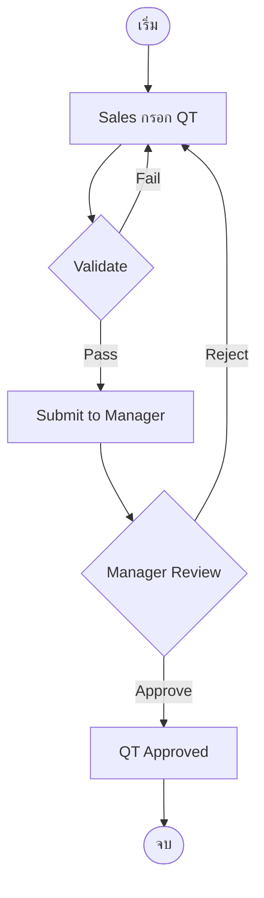
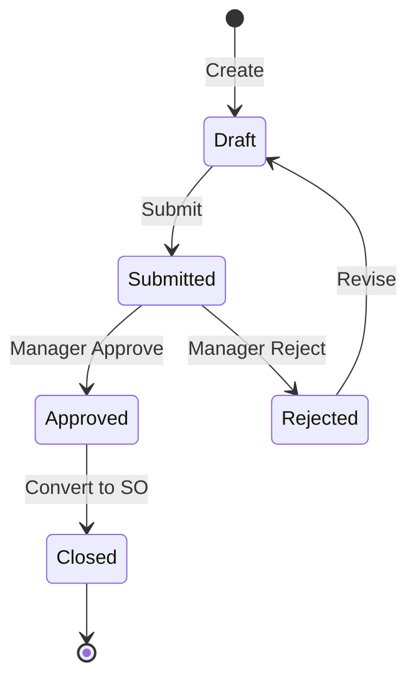

# BRD Template v3 — Full Pipeline (with Philosophy Embedded)

โครงสร้าง BRD 18 sections สำหรับ brd-generator-full
รวม Philosophy rules (COSO + Security + Health + Monitoring) เข้าไปในเอกสารเดียว

---

## Document Structure

```
Section 1   : Document Info
Section 2   : Business Context
Section 3   : Scope
Section 4   : User Roles & Permissions
Section 5   : User Journey (with COSO) ⭐
Section 6   : Data Entity & Fields
Section 7   : User Stories & Acceptance Criteria
Section 8   : Status & Lifecycle
Section 9   : Business Rules + Validation (with Tags)
Section 9.5 : สรุประดับความยืดหยุ่น
Section 10  : Edge Cases
Section 11  : Impact Analysis / Regression Scope (Enhancement)
Section 12  : Dependencies
Section 12.3: Existing System Reference
Section 13  : Delivery Phases
Section 14  : Dev Requirements Summary "ใบสั่ง"
Section 15  : Open Questions
Section 16  : Security & Compliance ⭐ Philosophy
Section 17  : Health Check (SLA/KPI/Threshold) ⭐ Philosophy
Section 18  : Monitoring (Reports/Widgets) ⭐ Philosophy

Appendix    : Screen List + Glossary + Document Control
```

---

## Section 1: Document Info

```markdown
# BRD: [ชื่อ Feature]

| Field | Value |
|---|---|
| BRD ID | BRD-[MODULE]-[NNN] |
| Feature Name | [ชื่อ Feature] |
| BRD Type | New Feature / Enhancement / Bug Fix / Config-Chore |
| Version | 1.0 |
| Status | Draft / AI Reviewed / Approved |
| Module | [Module] |
| Owner | [BA Name] |
| Stakeholders | [Names] |
| Created Date | [Date] |
| Last Updated | [Date] |

## Changelog
- v1.0 (Date): สร้าง BRD ผ่าน brd-generator-full
```

---

## Section 2: Business Context

```markdown
## 2.1 ปัญหา / โอกาส
[สรุปปัญหาที่ feature นี้แก้ หรือโอกาสที่ feature นี้ทำให้เกิดขึ้น]

## 2.2 เป้าหมายทาง Business
- เป้าหมายที่ 1: ...
- เป้าหมายที่ 2: ...

## 2.3 ตัวชี้วัดความสำเร็จ (Success Metrics) — บังคับวัดได้ (v2.1)
| Metric | Baseline ปัจจุบัน | Target | วัดยังไง/จากไหน | วัดเมื่อไหร่ |
|---|---|---|---|---|
| ... | ... (ไม่มี → "ต้องเก็บ baseline ก่อน launch") | ตัวเลข/% ชัด | source ระบบ/รายงานไหน | หลัง launch N วัน/เดือน |

> กติกา: ห้ามตัวชี้วัดลอย ("เร็วขึ้น/สะดวกขึ้น") — ทุกตัวต้องมีคู่ใน §17.3 KPI (Quality Gate C22)

## 2.4 ที่มาของ Requirement
- เคสที่เกิด: ...
- Request จาก: ...
- KPI Gap: ...
```

---

## Section 3: Scope

```markdown
## 3.1 In Scope
- ทำ: ...
- ครอบคลุม: ...

## 3.2 Out of Scope
- ไม่ทำ: ...
- เลื่อนไปทำ Phase ต่อไป: ...

## 3.3 Assumptions
- สมมติฐาน: ...

## 3.4 Scope Lock ⭐ (v2.1 — สืบทอดจาก RIF §16.3)
- **Scope Lock Ref:** [เลขใบเซ็นยินยอม/SCOPE_CONFIRM + วันที่เซ็น] (จาก RIF frontmatter)
- **Locked Decisions (ห้าม override ตลอด chain):**

| LOCK-ID | ข้อยืนยันจากลูกค้า | อ้างเอกสาร+ข้อ |
|---|---|---|
| LOCK-01 | ... | ใบเซ็น ENH-SO-xxxx ข้อ 3 |

- **Scope Drift (ถ้ามี):** รายการ requirement ที่เกินใบเซ็น/ชน Exclusions → ทุกข้อมี Open Question คู่ (ห้ามใส่หรือตัดเงียบ)
- งานไม่ผ่าน chain (ไม่มีใบเซ็น) → ระบุ "N/A — standalone" ชัด ๆ
```

---

## Section 4: User Roles & Permissions

```markdown
## 4.1 Roles ที่เกี่ยวข้อง
| Role | คำอธิบาย |
|---|---|
| Sales Officer | ผู้สร้าง QT |
| Sales Manager | ผู้อนุมัติ |
| Finance | ผู้ตรวจ Credit |

## 4.2 Permission Matrix
| Action | Sales Officer | Sales Manager | Finance |
|---|:---:|:---:|:---:|
| Create QT | ✅ | ✅ | ❌ |
| Approve QT | ❌ | ✅ | ❌ |
| View QT | ✅ | ✅ | ✅ |
```

---

## Section 5: User Journey (with COSO) ⭐

```markdown
## 5.1 Happy Path

| # | Step | Maker | Checker | Approver | System | Notes |
|---|---|---|---|---|---|---|
| 1 | Sales กรอก QT | Sales Officer | — | — | Auto-fill customer info | Trigger: New Quote |
| 2 | Sales submit | Sales Officer | — | — | Validate fields | If error → return |
| 3 | Manager review | — | — | Sales Manager | Send notification | DoA ≤ 100K |
| 4 | Manager approve | — | — | Sales Manager | Update status → Approved | SLA 1 day |

**SoD Check:** Maker (Sales Officer) ≠ Approver (Sales Manager) ✅

## 5.2 Alternative Paths

### 5.2.1 Reject Path
| # | Step | COSO Roles | Notes |
|---|---|---|---|
| ... | ... | ... | ... |

### 5.2.2 Escalation Path
| # | Step | COSO Roles | Notes |
|---|---|---|---|
| ... | ... | ... | ... |

## 5.3 Process Diagram (Mermaid)

```

---

## Section 6: Data Entity & Fields

```markdown
## 6.1 Entity Overview
| Entity | Type | Description |
|---|---|---|
| Quote_Header | Header | Master record ของ QT |
| Quote_Line | Detail | รายการสินค้าใน QT |
| Quote_Attachment | Attachment | ไฟล์แนบ |

## 6.2 Entity: Quote_Header

| # | Field | Label UI | Input Type | ค่า/ตัวเลือก | จำเป็น | เงื่อนไข | หมายเหตุ |
|---|---|---|---|---|:---:|---|---|
| 1 | quote_no | เลขที่ QT | AUTO | Pattern: QT-YYYY-NNNNN | ✅ | Running Number | จาก Document Numbering |
| 2 | customer_id | ลูกค้า | LOOKUP | Customer Master | ✅ | Active only | Snapshot customer_name |
| 3 | quote_date | วันที่ | DATE | — | ✅ | ≤ today | — |
| 4 | total_amount | ยอดรวม | NUMBER | — | ✅ | Auto-calc from lines | Read-only |
| 5 | status | สถานะ | DROPDOWN-SINGLE | Draft/Submitted/Approved/Rejected | ✅ | Default: Draft | State machine |
| 6 | created_by | ผู้สร้าง | AUTO | session.user | ✅ | — | Audit |
| 7 | created_date | วันที่สร้าง | AUTO | now() | ✅ | — | Audit |
| 8 | modified_by | ผู้แก้ไข | AUTO | session.user | ⚠️ | — | Audit |
| 9 | modified_date | วันที่แก้ไข | AUTO | now() | ⚠️ | — | Audit |

## 6.3 Entity Relationship

```
Quote_Header ──(1:N)──▶ Quote_Line
Quote_Header ──(1:N)──▶ Quote_Attachment
Customer ──(referenced by)──▶ Quote_Header (FK: customer_id)
```
```

---

## Section 7: User Stories & Acceptance Criteria

```markdown
## Story S-01: สร้าง Quote ใหม่
**As a** Sales Officer
**I want to** สร้างใบเสนอราคาใหม่
**So that** ส่งให้ลูกค้าได้

### Acceptance Criteria
- **AC1**: Given Sales Officer login, When คลิก "New Quote", Then ระบบเปิดฟอร์ม QT
- **AC2**: Given ฟอร์ม QT เปิด, When กรอกข้อมูลครบ + Submit, Then ระบบสร้าง QT-YYYY-NNNNN + เปลี่ยน status = "Submitted"

⚠️ **กฎ:** Story description ไม่มีคำว่า "และ" — ถ้ามี แยก Story

## Story S-02: อนุมัติ Quote
...
```

---

## Section 8: Status & Lifecycle

```markdown
## 8.1 State Diagram


## 8.2 State Transition Table
| Current State | Trigger | Next State | COSO Role | Notes |
|---|---|---|---|---|
| Draft | Submit | Submitted | Sales Officer (Maker) | Validate fields |
| Submitted | Approve | Approved | Sales Manager (Approver) | DoA check |
| Submitted | Reject | Rejected | Sales Manager (Approver) | Require reason |
| Rejected | Revise | Draft | Sales Officer (Maker) | — |
```

---

## Section 9: Business Rules + Validation (with Tags)

```markdown
## 9.1 Business Rules

| Rule ID | Rule | Tag | Type | เหตุผล Tag |
|---|---|:---:|---|---|
| R01 | Status เริ่มต้น = Draft | FIXED | Constant | Business logic ไม่เปลี่ยน |
| R02 | QT หมดอายุภายใน 30 วัน | CONFIGURABLE | Threshold | อาจปรับตาม policy |
| R03 | DoA ผู้จัดการ ≤ 100,000 บาท | CONFIGURABLE | Amount | อาจปรับตาม policy |
| R04 | สูตรคิดส่วนลด = if(qty>100, 5%, 0%) | DYNAMIC | Formula | เงื่อนไขซับซ้อน อาจเปลี่ยนเป็น tier |
| R05 | Approval ใช้เวลาเท่าไหร่ | WARNING | SLA | ยังไม่ตัดสินใจ |

## 9.2 Validation Rules

| VR ID | Field/Action | เงื่อนไข | ประเภท | ข้อความ |
|---|---|---|---|---|
| VR01 | customer_id | required | Error | กรุณาเลือกลูกค้า |
| VR02 | quote_date | <= today | Error | วันที่ห้ามเป็นอนาคต |
| VR03 | total_amount | > 0 | Error | ยอดรวมต้องมากกว่า 0 |
| VR04 | qty * unit_price | overflow | Trigger | คำนวณส่วนลดอัตโนมัติ |

## 9.5 สรุประดับความยืดหยุ่น (เติมจาก Step 3)

| Rule ID | Tag | ใครเปลี่ยน | บ่อยแค่ไหน | ระดับ |
|---|:---:|---|---|---|
| R02 | CONFIGURABLE | Admin | ปีละ 1-2 ครั้ง | Admin Panel |
| R03 | CONFIGURABLE | Admin | ปีละ 1-2 ครั้ง | Admin Panel |
| R04 | DYNAMIC | ผู้บริหาร | ตามแคมเปญ | Rule Management |
| R05 | WARNING | — | — | ⚠️ รอ Stakeholder ตัดสินใจ |
```

---

## Section 10: Edge Cases

```markdown
## 10.1 Edge Cases ที่ user/RIF ระบุ (default ☑)

- ☑ E01: ลูกค้าเครดิตเกิน → block submit
- ☑ E02: สินค้าหมด stock → warn user

## 10.2 Edge Cases จาก AI Pattern Matching (default ☐ — ต้อง confirm)

### CL (Calculation) Patterns
- ☐ E03: ส่วนลด > 100% → block
- ☐ E04: ราคาเป็นลบ → block

### CA (Concurrent Access) Patterns
- ☐ E05: 2 users แก้ QT เดียวกันพร้อมกัน → optimistic lock
- ☐ E06: Approve while editing → notify + lock

### EM (Email) Patterns
- ☐ E07: Email ส่งไม่สำเร็จ → retry 3 ครั้ง + log
- ☐ E08: Email bounce → mark customer as invalid

### ST (Status/Workflow) Patterns
- ☐ E09: ยกเลิก QT ที่ Approved แล้ว → require manager approval
- ☐ E10: Reject Reason ว่างเปล่า → require

### Tag Review Report
✅ R01: FIXED — ถูกต้อง
⚠️ R03: CONFIGURABLE → แนะนำคงเดิม (เปลี่ยนค่าเฉยๆ)
❌ R05: WARNING → แนะนำ Resolve ก่อน finalize
```

---

## Section 11: Impact Analysis / Regression Scope (Enhancement)

```markdown
## 11.1 ของเก่า vs ของใหม่
| Aspect | ของเก่า | ของใหม่ | กระทบ |
|---|---|---|---|
| Approval Limit | 50,000 | 100,000 | DoA Matrix |
| Discount Logic | Flat 5% | Tier-based | Existing QTs |

## 11.2 Regression Scope
| Feature เก่า | ต้อง Test อะไร | เหตุผล |
|---|---|---|
| QT List Page | filter ใหม่ทำงานถูก | UI เปลี่ยน |
| QT-to-SO Conversion | amount migration | Logic เปลี่ยน |
```

---

## Section 12: System Context & Cross-Module Impact ⭐ (v2.1)

```markdown
## 12.1 Value Stream & Downstream Impact ⭐ (บังคับ New Feature/Enhancement)

**Positioning:** feature นี้อยู่ใน [VS เช่น P2P] → [VC/CL] — ก่อนหน้า: [ขั้นตอน/เอกสาร] · ถัดไป: [ขั้นตอน/เอกสาร]

**Document Flow Chain:**
```
Budget/แผน → [PR ← feature นี้] → PO → GRN → Putaway → AP Invoice → Payment
```

**Upstream (รับจากไหน):**
| ต้นทาง | ข้อมูล/trigger ที่รับ | ถ้าต้นทางไม่มี/ผิด |
|---|---|---|

**Downstream Impact Map (สะท้อนต่อที่ไหน — ทุกแถวต้องตอบ "แล้วไงต่อ"):**
| ปลายทาง | ข้อมูลที่ไหลไป | Trigger (สถานะไหน) | ถ้า record นี้ถูกแก้/ยกเลิกกลางทาง |
|---|---|---|---|

**ผลกระทบแนวขวาง:** สต๊อก: ... · บัญชี/GL/งบ: ... · รายงานที่ต้องเห็นข้อมูลนี้: ...

## 12.2 Module & External Dependencies
- Module: Customer Master (FK customer_id), Document Numbering, ...
- External: Email Service, Audit Log Service, ...

## 12.3 Existing System Reference (เติมจาก Step 5)

| Rule ID | ระดับ | มีอยู่แล้ว? | Reference |
|---|---|:---:|---|
| R02 (อายุ QT) | Admin Panel | ❌ | ต้องสร้างใหม่ |
| R11 (เลข QT) | Admin Panel | ✅ | Admin → System Config → Document Numbering |
| R18 (SLA) | Admin Panel | ⚠️ บางส่วน | Approval Module มี แต่ยังไม่มี SLA Timer |
```

---

## Section 13: Delivery Phases

```markdown
## Phase 1: Feature Launch
**สิ่งที่ต้องทำ:**
- สร้าง Quote_Header + Quote_Line + Audit Fields
- Config Table สำหรับ R02, R03 + Seed ค่าเริ่มต้น
- Rule Table สำหรับ R04 + Seed Rule
- State Machine สำหรับ Status
- **ห้าม Hardcode ตั้งแต่วันแรก**

**Reuse ของเดิม:**
- ใช้ Document Numbering สำหรับเลข QT (R11)
- ใช้ Audit Log ที่มีอยู่แล้ว

## Phase 2: Admin Panel
- สร้าง UI Admin Panel สำหรับ R02 (อายุ QT)

## Phase 3: Rule Management
- สร้าง UI Rule Management สำหรับ R04 (สูตรส่วนลด)

## Phase 4: Engine Management
- (ไม่มีในรอบนี้)
```

---

## Section 14: Dev Requirements Summary "ใบสั่ง"

```markdown
## 14.1 Config Foundation
| Item | โครงสร้าง | รองรับ Rule | มีอยู่แล้ว? |
|---|---|---|:---:|
| Config Table | key-value + audit | R02, R03 | ❌ ต้องสร้าง |
| Rule Table | rule_id + condition_json | R04 | ❌ ต้องสร้าง |

## 14.2 ข้อกำหนดจาก Tag
| Rule | ระดับ | Dev ต้องทำอะไร |
|---|---|---|
| R02 | Admin Panel | สร้าง config key 'quote_expire_days' + UI Admin |
| R03 | Admin Panel | สร้าง config key 'manager_doa_limit' + UI Admin |
| R04 | Rule Management | สร้าง rule_table + UI Rule Editor (Phase 3) |

## 14.3 ข้อกำหนดจาก Edge Cases / Validation
- E05: ใช้ version field ใน Quote_Header สำหรับ optimistic lock
- E07: Email retry 3 ครั้ง พร้อม log

## 14.4 WARNING ที่รอข้อสรุป
| ประเด็น | หารือกับใคร | กำหนดวันที่ | สถานะ |
|---|---|---|---|
| R05 SLA Approval | Sales Director | YYYY-MM-DD | ⚠️ รอ |

## 14.5 Regression Scope (Enhancement)
| Feature เก่า | ต้อง Test |
|---|---|
| QT List | filter |
| QT-to-SO | amount migration |

## 14.6 Screen Inventory + UI Signals (หยาบ — ส่งต่อ FRD) ⭐ v2.1

> BRD ไม่ตัดสิน layout — spec จริงอยู่ที่ FRD (frd-generator-v5 = Design Authority)

| # | ชื่อหน้า | ประเภทหยาบ | ผู้ใช้หลัก | หน้าที่ของหน้า | หมายเหตุ |
|---|---|---|---|---|---|
| P-01 | รายการใบเสนอราคา | หน้ารายการ | Sales, Manager | ค้นหา/ติดตาม QT | |
| P-02 | สร้างใบเสนอราคา | ฟอร์มสร้าง (หลายขั้น) | Sales | กรอก + ส่งอนุมัติ | |

**รวมโดยประมาณ:** ~N หน้า (รายการ 1, ฟอร์ม N, รายละเอียด N, dashboard N)

**UI Signals ให้ FRD:**
- Document/Transaction (approver + พิมพ์ + ลายเซ็น): ใช่/ไม่
- ต้องการ print/PDF: หน้าไหน
- NON-STANDARD flag จาก RIF: มี/ไม่มี (มี → OQ-XX)
```

---

## Section 15: Open Questions

```markdown
| # | คำถาม | สถานะ | คำตอบ |
|---|---|:---:|---|
| Q1 | SLA Approval ของ Sales Manager? | ⚠️ รอ | — |
| Q2 | กรณีลูกค้าเครดิตเกิน 50% | ✅ ตอบแล้ว | Block + แจ้ง Finance |
```

---

## Section 16: Security & Compliance ⭐ Philosophy

```markdown
## 16.1 Security Preset
**Preset เลือก:** P1 — Standard Transaction (12 controls)
**เหตุผล:** Feature นี้คือ Transaction Document (QT) ไม่มี PII sensitive

## 16.2 Applicable Standards
| Standard | Applicable? |
|---|:---:|
| ISO 27001 | ✅ |
| PCI DSS | ❌ (ไม่มี payment) |
| PDPA | ✅ |
| SOX | ✅ |
| ... | ... |

## 16.3 Control Checklist
| Control ID | Standard | Control | Required | Implementation Notes |
|---|---|---|:---:|---|
| C-01 | ISO 27001 | Access control by role | ✓ Must | ใช้ Section 4 Permission Matrix |
| C-05 | PDPA | Audit log every change | ✓ Must | ใช้ Audit Fields ใน Section 6 |
| C-08 | SOX | Approval requires SoD | ✓ Must | Maker ≠ Approver ใน Section 5 |
| ... | ... | ... | ... | ... |

## 16.4 Risk Statement
| Risk ID | Risk | Mitigated by Control |
|---|---|---|
| R-01 | Unauthorized approval | C-01, C-08 |
| R-02 | Data leak | C-05 |
| R-03 | Repudiation | C-05 |
```

---

## Section 17: Health Check ⭐ Philosophy

```markdown
## 17.1 SLA
| Step | SLA | Owner | Action when breached |
|---|---|---|---|
| Sales submit → Manager review | 4 hours | Sales Manager | Escalate to Director |
| Manager review → Approve/Reject | 1 day | Sales Manager | Auto-escalate |

## 17.2 Control Points
| Control ID | Where | When | Result |
|---|---|---|---|
| C-08 | Submit action | Every submit | Log + block if Maker = Approver |

## 17.3 KPI
| KPI | Category | Target | Measure |
|---|---|---|---|
| QT Approval Time | Speed | < 1 day avg | now() - submitted_at |
| QT Conversion Rate | Conversion | > 60% | converted / total |
| QT Rejection Rate | Quality | < 10% | rejected / submitted |

## 17.4 Threshold
| Metric | Min | Max | Action |
|---|---|---|---|
| QT Approval Time | — | 2 days | Alert manager |
| QT Conversion Rate | 40% | — | Trigger sales review |

## 17.5 Throughput
- Capacity: 500 QT/day (estimated)
- Baseline: 100 QT/day (current)
- Stress Point: 1000 QT/day → DB performance check
```

---

## Section 18: Monitoring ⭐ Philosophy

```markdown
## 18.1 Reports Overview
| Report | Type | Frequency |
|---|---|---|
| QT Performance | Performance | Daily |
| QT Closing | Closing | Monthly |
| QT Anomaly | Anomaly | Real-time |
| QT Transaction Log | Transaction | On-demand |

## 18.2 Dashboard Widgets
| Widget | Source KPI | Threshold |
|---|---|---|
| QT Approval Time (avg) | 17.3 #1 | 17.4 #1 |
| QT Conversion Rate | 17.3 #2 | 17.4 #2 |
| Pending Approvals Count | — | > 20 → red |

## 18.3 Performance Report
- Daily breakdown by Sales Officer
- Approval time distribution
- Top 10 customers by QT volume

## 18.4 Closing Report
- Monthly total QT amount
- Conversion rate by month
- Win/Loss by reason

## 18.5 Anomaly Report
- QT > DoA limit but approved (audit flag)
- Multiple revisions in 1 hour
- Approval < 1 minute after submit (suspicious)

## 18.6 Transaction Report
- Full audit trail per QT
- State transition history
- All field changes with user + timestamp
```

---

## Appendix

```markdown
## A. Screen List
| Screen | Layout Hint | ใครเข้าถึง | Component Family |
|---|---|---|---|
| QT List | list-view | Sales Officer, Manager | Table + Filter + Action |
| QT Create | create-drawer-wizard | Sales Officer | Form + Validation |
| QT View | view-drawer-tabbed | All roles | Tabs + Status |
| QT Approval Inbox | list-view | Sales Manager | Table + Bulk Action |

## B. Glossary
- **QT**: Quotation
- **DoA**: Delegation of Authority
- **SoD**: Segregation of Duties

## C. Document Control
| Version | Date | Author | Changes |
|---|---|---|---|
| 1.0 | YYYY-MM-DD | BA | Initial via brd-generator-full |
```

---

## Special Templates (สำหรับ Bug Fix + Config/Chore)

### Bug Fix Template (สั้น)

```markdown
# BRD: Bug Fix — [ชื่อ Bug]

## 1. Document Info
[Bug ID, Severity, Found Date, Affected Module]

## 2. Expected vs Actual Behavior
**Expected:** ...
**Actual:** ...

## 3. Reproduce Steps
1. ...
2. ...
3. ...

## 4. Impact Analysis
- กระทบ user: ...
- กระทบ data: ...
- Workaround (ถ้ามี): ...

## 5. Root Cause (ถ้าทราบ)
...

## 6. Proposed Fix
...

## 7. Regression Test ที่ต้องเพิ่ม
- Test case 1: ...
- Test case 2: ...

## 8. Dev Summary
- แก้ที่ไหน: [file/function/module]
- ทดสอบอะไร: ...
- เสี่ยง: ...
```

### Config/Chore Template (สั้นสุด)

```markdown
# BRD: Config/Chore — [ชื่อ Change]

## 1. Document Info
[Change ID, Type, Requested by, Approver]

## 2. ค่าเก่า → ค่าใหม่
| Setting | ค่าเก่า | ค่าใหม่ |
|---|---|---|
| ... | ... | ... |

## 3. เหตุผล
...

## 4. Impact Analysis (สั้น)
- กระทบ feature: ...
- กระทบเอกสารเก่า: ... (ถ้ามี — สำคัญมาก)

## 5. ผู้อนุมัติ
- [Name + Role]

## 6. แจ้งเตือนพิเศษ (ถ้ามี)
⚠️ Config นี้ควรยกระดับเป็น Enhancement หรือไม่?
- [คำแนะนำ AI: ...]
```
