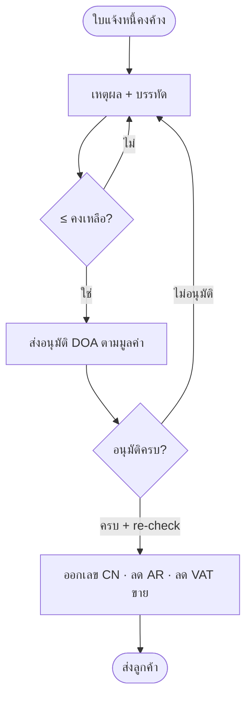
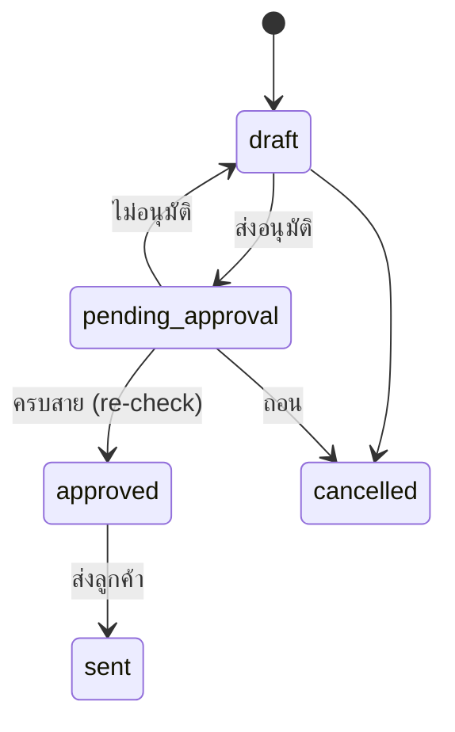

# BRD: Credit Note — ใบลดหนี้ลูกค้า (F-ACC-CN · F096)

| Field | Value |
|---|---|
| BRD ID | BRD-ACC-CN-v1.0 |
| Feature | Credit Note (ใบลดหนี้ลูกค้า) |
| ประเภท | New Feature |
| Version / Status | 1.0 · **APPROVED (AI Review — Lane Mode)** |
| Owner (BA) | Strike |
| Stakeholders | บัญชีลูกหนี้ · ผู้จัดการฝ่ายขาย · ผู้จัดการบัญชี · CFO · ภาษี |
| วันที่ | 2026-09-20 |
| Mode | brd-generator-full v2.2 Fresh + Lane Mode · input RIF + HTML (ผ่าน S3) + PREBRIEF + BRD_F-ACC-ARINV §12.1 |

## Changelog
| Ver | วันที่ | เปลี่ยน |
|---|---|---|
| 1.0 | 2026-09-20 | ฉบับแรก (Phase A LITE) |

---
## Section 2: Business Context
### 2.1 ปัญหา / โอกาส
PAIN-01 ลดหนี้ด้วยการแก้ใบเดิม (ผิด ม.86/10) · PAIN-02 ลดเกินคงค้าง/ซ้ำ · PAIN-03 ไม่มีสายอนุมัติตามมูลค่า
### 2.2 เป้าหมาย
GOAL-01 ใบลดหนี้อ้างใบแจ้งหนี้ถูกต้องตามกฎหมาย · GOAL-02 ลดไม่เกินคงเหลือ · GOAL-03 อนุมัติตามมูลค่า (DOA)
### 2.3 ตัวชี้วัด
| ตัวชี้วัด | Baseline | Target | วัด |
|---|---|---|---|
| M-01 CN ที่ยอดเกินคงเหลือใบอ้างอิง | ไม่ได้วัด | 0 | Σ CN ≤ invoice outstanding (recon) |
| M-02 เวลาส่ง → อนุมัติครบ | ต้องเก็บ baseline | ≤ 1 วันทำการ (P80) | approved_at − submitted_at |
| M-03 CN ไม่มีเหตุผล/ไม่อ้างใบ | ไม่ได้วัด | 0 | reason_code/inv_ref null |
### 2.4 ที่มา: CONTEXT_PACK W5-LITE §2.2 · workflow_graph edge ARINV→CN · BASELINE_ACC_CN

---
## Section 3: Scope
### 3.1 In Scope
1. ใบลดหนี้อ้างใบแจ้งหนี้ที่มีคงค้าง (ar_open_item) · 2. เหตุผล master: รับคืน (อ้างใบรับคืน W4-LITE mock) / ส่วนลดภายหลัง / คิดราคาสูงเกิน / คิดจำนวนเกิน · 3. ลดจำนวนหรือลดราคาต่อหน่วย · ลดหลายรอบ · 4. ลดไม่เกินคงเหลือ (ตอนส่ง+ตอนอนุมัติ) · 5. DOA slot picker ตามมูลค่า · 6. ออกเลข CN ตอนอนุมัติครบ · ส่งลูกค้า · ยกเลิก (ร่าง/รออนุมัติ) · 7. ฟอร์ม ม.86/10 · 8. ผลกระทบ AR (cn_applied) + VAT ขาย + JE mock
### 3.2 Out of Scope
ลดหนี้ไม่อ้างใบ (OQ-CN-01) · คืนเงิน/ลดเกินคงค้าง (OQ-CN-03) · ยกเลิกหลังอนุมัติ (OQ-CN-02) · หน้าจอรับคืนสินค้าจริง (W4-LITE) · JE จริง (W5-FULL) · multi-currency
### 3.3 Assumptions
A-01 contract ar_open_item ตาม BRD_F-ACC-ARINV §12.1 · A-02 Sales Return ส่ง {sr_no, inv_no, line, qty_received} [ASSUMED contract] · A-03 CN reason master เป็น config กลาง [ASSUMED] · A-04 ร่าง/รออนุมัติกันยอดชั่วคราว
### 3.4 Scope Lock (RIF §16.3)
| LOCK | สถานะ |
|---|---|
| LOCK-01 Q + B2 v2 | ✅ §14.6 |
| LOCK-02 อ้าง AR ในเลน (AR ba-done) | ✅ |
| LOCK-03 เหตุผล master | ✅ BR-05 |
| LOCK-04 ≤ คงเหลือ (OQ-CN-01) | ✅ BR-02 |
| LOCK-05 DOA ตามมูลค่า | ✅ BR-07 · DOA_BRIEF |
| LOCK-06 doccfg CN + pdfdoc ม.86/10 | ✅ |
| LOCK-07 VAT ขาย | ✅ §12.1 |
| LOCK-08 dep mock | ✅ |
| LOCK-09 UI BLOCK rules | ✅ |
| LOCK-10 ค.ศ./append-only | ✅ |

---
## Section 4: User Roles & Permissions
| Action | officer-ar | mgr-sales | mgr-acc | cfo |
|---|---|---|---|---|
| สร้าง/แก้ร่าง/ส่งอนุมัติ/ยกเลิก/ส่งลูกค้า | ✅ | ❌ | ❌ | ❌ |
| อนุมัติ/ไม่อนุมัติ | ❌ (ใบตัวเอง) | ✅ ขั้นที่ถูกเลือก | ✅ | ✅ |
| ดู/พิมพ์/CSV | ✅ | ✅ | ✅ | ✅ |

## Section 5: User Journey (with COSO)
### 5.1 Happy Path
| # | Step | Maker | Checker | Approver | System |
|---|---|---|---|---|---|
| 1 | เลือกใบแจ้งหนี้คงค้าง | officer-ar | — | — | กรองเฉพาะ outstanding>0 |
| 2 | เลือกเหตุผล (+ใบรับคืน) + คำอธิบาย | officer-ar | — | — | โหมดลดจำนวน/ราคา |
| 3 | ระบุจำนวน/ราคาที่ลด | officer-ar | — | — | บล็อกเกินบรรทัด/เกินคงเหลือ |
| 4 | ส่งอนุมัติ เลือกคนต่อขั้น | officer-ar | — | — | resolve DOA ตามมูลค่า · freeze chain |
| 5 | อนุมัติตามลำดับ | — | — | mgr-sales → mgr-acc → cfo (ตาม tier) | re-check คงเหลือขั้นสุดท้าย |
| 6 | ครบสาย | — | — | — | ออกเลข CN · cn_applied · VAT ขายลด · JE mock · ntf |
| 7 | ส่งลูกค้า | officer-ar | — | — | snapshot PDF |
**SoD:** Maker ≠ Approver (ผู้ส่งไม่เห็นปุ่มอนุมัติ) ✅
### 5.2 Alternative: 5.2.1 ไม่อนุมัติ → draft + history · 5.2.2 คงเหลือลดระหว่างรอ → บล็อกอนุมัติขั้นสุดท้าย → ไม่อนุมัติกลับแก้ · 5.2.3 ยกเลิก/ถอน
### 5.3 Diagram

## Section 6: Data Entity & Fields
### 6.1 credit_note
id · code (ENG-DOC-NUM 'CN' ตอนอนุมัติ) · status (draft/pending_approval/approved/sent/cancelled) · inv_ref (soft) · customer_id · cn_date · reason_code · reason_text · sr_ref · sales_rep_id · bill_to snapshot · base_amount · vat_amount · grand_total · orig_invoice_value · corrected_value · DOA fields (approval_required, approval_status, doa_entry_ref, approver_role, approved_by, approval_chain jsonb, approved_at, approval_history jsonb) · submitted_by/at · sent_by/at · cancel_by/at/reason · created/updated audit
### 6.2 credit_note_line
id · cn_id · inv_line_ref · item_code · qty · unit · unit_price (ราคาเดิม หรือ ราคาลดต่อหน่วย) · vat_mode · vat_pct · net · vat · total · orig_qty · orig_price
### 6.3 ER: credit_note N—1 ar_invoice (soft) · credit_note_line → ar_invoice_line · credit_note → sales_return (soft) · audit append-only

## Section 7: User Stories
**S-01 ลดหนี้รับคืนสินค้า** — AC1 Given เหตุผลรับคืน When ไม่เลือกใบรับคืน Then ไปต่อไม่ได้ · AC2 Given เลือก SR When ดึงบรรทัด Then จำนวน = ที่รับคืน (ไม่เกินลดได้)
**S-02 ลดราคาภายหลัง** — AC1 Given ราคาลด > ราคาเดิม Then บล็อก · AC2 Given ราคาลดถูกต้อง Then VAT ลดตามสัดส่วน
**S-03 ลดหลายรอบ** — AC1 Given ลดแล้ว 1 จาก 10 When เปิดใบใหม่ Then ลดได้อีก 9 (หักร่างที่กันไว้) · AC2 Given ใส่เกิน Then บล็อก
**S-04 อนุมัติตามมูลค่า** — AC1 Given ยอด > 300,000 When ส่ง Then สาย 3 ขั้น · AC2 Given ขั้นสุดท้ายอนุมัติ Then ได้เลข CN
**S-05 กันลดเกินคงค้างตอนอนุมัติ** — AC1 Given คงค้างลดลงระหว่างรอ When อนุมัติขั้นสุดท้าย Then ถูกปฏิเสธ · AC2 Given ไม่อนุมัติกลับ Then เป็นร่างพร้อมประวัติ

## Section 8: Status & Lifecycle

## Section 9: Business Rules
| BR | กติกา | Tag |
|---|---|---|
| BR-01 | อ้างได้เฉพาะ issued/sent outstanding>0 | FIXED |
| BR-02 | grand ≤ outstanding − CN อื่นที่รอ (ตอนส่ง) · ≤ outstanding (ตอนอนุมัติขั้นสุดท้าย) | FIXED (OQ-CN-01) |
| BR-03 | จำนวนลด ≤ จำนวนเดิม − ลดแล้ว (โหมดจำนวน) · มูลค่าลดต่อบรรทัด ≤ มูลค่าคงเหลือของบรรทัด | FIXED |
| BR-04 | ราคาลดต่อหน่วย ≤ ราคาเดิม | FIXED |
| BR-05 | เหตุผลจาก master + คำอธิบาย ≥10 ตัว (พิมพ์บนใบ) | CONFIGURABLE |
| BR-06 | รับคืนต้องอ้างใบรับคืนของใบเดียวกัน · ≤ จำนวนรับคืน | FIXED [ASSUMED contract] |
| BR-07 | DOA resolve ณ ส่ง (มูลค่ารวม VAT) + freeze · Maker ≠ Approver · reject → draft append-only | CONFIGURABLE (DOA กลาง) |
| BR-08 | เลข CN ออกตอนอนุมัติครบ (no-gap) | FIXED |
| BR-09 | อนุมัติครบ → cn_applied ใบเดิม · VAT ขายลดเดือนที่ออก CN · JE mock | FIXED |
| BR-10 | ร่าง/รออนุมัติกันยอดชั่วคราว | WARNING → OQ-CN-05 |
### 9.5 ความยืดหยุ่น: BR-05 CONFIGURABLE ✅ (reason master) · BR-07 CONFIGURABLE ✅ (DOA) · BR-10 🤖 → OQ

## Section 10: Edge Cases
10.1 ☑ ใบชำระครบ/void ไม่โผล่ · คงค้างลดระหว่างรอ → re-check · ลดหลายรอบ · ยกเลิกคืนยอด
10.2 ☐ CL ปัด VAT บรรทัดราคาลด · ☐ CA สองใบลดพร้อมกันบนใบเดียว (กันยอด) · ☐ ST CN ข้ามเดือนภาษีของใบเดิม (ลด VAT เดือนออก CN) · ☐ EM ส่งอีเมลล้ม → ENG-NOTIFY retry

## Section 11: Impact Analysis — N/A (New)

## Section 12: System Context
### 12.1 Value Stream & Downstream
O2C: SO → DLV → AR Invoice → **[Credit Note]** → RV/Collections · VAT Report
| ต้นทาง | ที่รับ | ถ้าไม่มี/ผิด |
|---|---|---|
| AR Invoice (ar_open_item) | inv_no, lines, outstanding | void/ชำระครบ → อ้างไม่ได้ |
| Sales Return (W4-LITE mock) | sr_no, qty_received | ไม่มี SR → ใช้เหตุผลอื่นไม่ได้สำหรับการคืนของ |
| ปลายทาง | ข้อมูล | Trigger | ถ้ายกเลิก |
|---|---|---|---|
| AR Invoice | cn_applied_amount += grand | approved | ร่าง/รอ ยกเลิก → คืนยอดกัน |
| VAT Report | **output_vat_line (ติดลบ)** {cn_no, cn_date, inv_no, customer_tax_id, branch, base(−), vat(−)} | approved (เดือนของ cn_date) | — |
| RV W6 | outstanding ใหม่ | approved | — |
| JE F093 | Dr ลดรายได้/ส่วนลด · Dr ภาษีขาย · Cr ลูกหนี้ | approved | forward-wire |
### 12.2 Dependencies: F-ACC-ARINV · Sales Return F090 · DOA F-DLG-001 · Document Configuration (CN) · Notification · ENG-CSQ
### 12.3 Existing: ใช้ contract ar_open_item ที่ AR ประกาศ · ไม่สร้างตารางยอดค้างซ้ำ

## Section 13: Delivery Phases
Phase 1 LITE (นี้) · Phase 2 FRD/TC หลัง vibe · Phase 3 refund/ยกเลิกหลังอนุมัติ · Phase 4 e-Tax CN

## Section 14: Dev Requirements "ใบสั่ง"
14.1 Config: CN reason master · DOA entry DOA-ACC-CN (DOA_BRIEF) · doccfg CN · NTF/CSQ briefs
14.2 Tag: BR-05/07 อ่านจาก config · ห้าม hardcode tier/role
14.3 Edge: lock ar_open_item row ตอนอนุมัติขั้นสุดท้าย (re-check) · กันยอดร่าง
14.4 WARNING: OQ-CN-04 tier · OQ-CN-05 กันยอดร่าง
14.6 Screen Inventory: #/list (Q list · stat 4 · toolbar #106) · #/create · #/edit/:id (wizard 5 · drawer.wide · B2 v2 lock บรรทัดจากใบเดิม) · #/view/:id (tabs: รายละเอียด › ใบแจ้งหนี้อ้างอิง·ภาษีขาย › PDF › ลายเซ็น/อนุมัติ › ประวัติ) · submit modal DOA slot picker
**Demo-only elements (#105):** `[data-demo="persona-switch"]` · `[data-demo="rv-simulate"]` (จำลองรับชำระใบเดิมเพื่อพิสูจน์ S-11)

## Section 15: Open Questions
| # | คำถาม | สถานะ |
|---|---|---|
| OQ-CN-01 | ≤ คงเหลือ · ลดลอยปิด | ✅ ตาม CONTEXT_PACK |
| OQ-CN-02 | ยกเลิกหลังอนุมัติ | ⚠️ ไม่รองรับ LITE |
| OQ-CN-03 | refund เมื่อชำระครบ | ⚠️ ไป RV/PV |
| OQ-CN-04 | tier DOA | ⚠️ default 50k/300k |
| OQ-CN-05 | กันยอดร่าง | ⚠️ default กัน |
| OQ-AR-06 | role id บัญชี | ⚠️ Policy Center |

## Section 16: Security & Compliance
Preset Financial-Transaction · ม.86/10 (ใบลดหนี้) · ม.82/10 (ลดภาษีขายเดือนที่ออก) · COSO SoD · Controls: DOA ตามมูลค่า · immutable หลังอนุมัติ · no-gap numbering · tax id บุคคล mask
## Section 17: Health Check
SLA p95<3s · Control points: ส่ง/อนุมัติขั้นสุดท้าย · KPI: M-01↔17.3 CN เกินคงเหลือ · M-02↔เวลาอนุมัติ · M-03↔CN ไม่มีเหตุผล · Threshold: รออนุมัติ > 2 วัน = แจ้ง (NC rules) · Throughput ~120 ใบ/เดือน
## Section 18: Monitoring
Widgets = stat row (รออนุมัติ · ลดหนี้เดือนนี้ · ร่าง · ภาษีขายที่ลด) · Anomaly: CN ถี่ต่อลูกค้า/พนักงานขาย · VAT report แยกรายการติดลบ

## Appendix
A. Screen List §14.6 · B. Glossary: ใบลดหนี้ · cn_applied · tier DOA · C. Document Control: Strike · 2026-09-20

---
## AI REVIEW REPORT — Lane Mode
C01–C19 ✅ · C20 Scope Lock ✅ · C21 Value Stream (upstream + downstream ทุกแถวมี "ถ้ายกเลิก") ✅ · C22 Metric + §17.3 ✅ · C23 🤖 → OQ ✅ · PE01 COSO ครบ ✅ · PE02 SoD ✅ · PE03 Preset ✅ · PE04 SLA/KPI/Threshold ✅ · PE05 ✅
Critical 0 · Warning 2 (OQ-CN-04, OQ-CN-05 default) → **Status: APPROVED**
