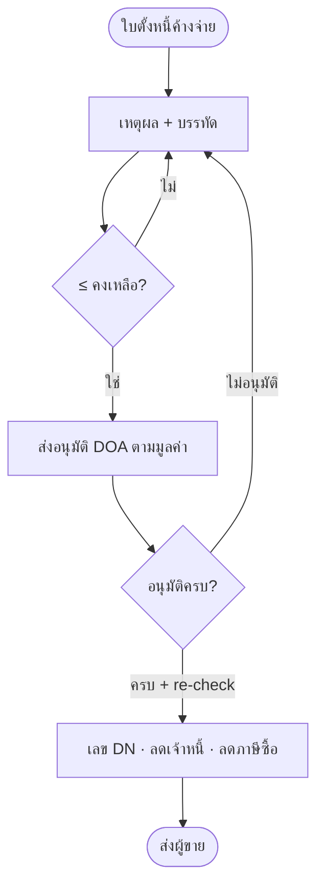
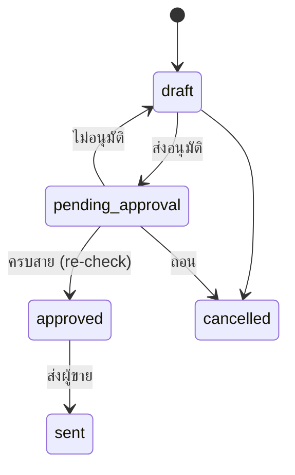

# BRD: Debit Note — ใบลดหนี้ผู้ขาย ฝั่งซื้อ (F-ACC-DN)

| Field | Value |
|---|---|
| BRD ID | BRD-ACC-DN-v1.0 |
| Feature | Debit Note (ใบลดหนี้ผู้ขาย · ฝั่งซื้อ) |
| ประเภท | New Feature |
| Version / Status | 1.0 · **APPROVED (AI Review — Lane Mode)** |
| Owner (BA) | Strike |
| Stakeholders | บัญชีเจ้าหนี้ · จัดซื้อ · ผู้จัดการบัญชี · CFO · ภาษี |
| วันที่ | 2026-09-20 |
| Mode | brd-generator-full v2.2 Fresh + Lane Mode · input RIF + HTML (ผ่าน S3) + PREBRIEF + BRD_F-ACC-APINV §12.1 |

## Changelog
| Ver | วันที่ | เปลี่ยน |
|---|---|---|
| 1.0 | 2026-09-20 | ฉบับแรก (Phase A LITE) |

***
## Section 2: Business Context
### 2.1 ปัญหา / โอกาส
PAIN-01 คืนของ/ราคาเกินแล้วไม่ได้ลดหนี้ → จ่ายเกิน · PAIN-02 ลดเกินค้าง/ซ้ำ · PAIN-03 ภาษีซื้อไม่ปรับตามใบลดหนี้
### 2.2 เป้าหมาย
GOAL-01 ลดหนี้ผู้ขายอ้างใบตั้งหนี้ · GOAL-02 ไม่เกินคงเหลือ · GOAL-03 อนุมัติตามมูลค่า + ภาษีซื้อลดถูกเดือน
### 2.3 ตัวชี้วัด
| ตัวชี้วัด | Baseline | Target | วัด |
|---|---|---|---|
| M-01 DN เกินคงเหลือใบตั้งหนี้ | ไม่ได้วัด | 0 | Σ DN ≤ ap outstanding (recon) |
| M-02 เวลาส่ง → อนุมัติครบ | ต้องเก็บ baseline | ≤ 1 วันทำการ (P80) | approved_at − submitted_at |
| M-03 RTV ที่ยังไม่มี DN > 7 วัน | ไม่ได้วัด | 0 | RTV ส่งคืนแล้ว ไม่มี dn_ref |
### 2.4 ที่มา: CONTEXT_PACK W5-LITE §2 ข้อ 4 · BASELINE_ACC_DN

***
## Section 3: Scope
### 3.1 In Scope
1. ใบลดหนี้อ้างใบตั้งหนี้ approved ที่ค้างจ่าย (ap_open_item) · 2. เหตุผล master: คืนสินค้า (อ้าง RTV W3-LITE mock) / ราคาเกิน / ของขาด · 3. ลดจำนวนหรือราคาต่อหน่วย · หลายรอบ · 4. ≤ คงเหลือ (ส่ง + อนุมัติ) · 5. DOA slot picker ตามมูลค่า · 6. เลข DN ตอนอนุมัติครบ · ส่งผู้ขาย · ยกเลิก (ร่าง/รอ) · 7. pdfdoc ใบลดหนี้ฝั่งซื้อ อ้างเลขใบเดิม + เหตุผล · 8. ผลกระทบ AP (dn_applied) + VAT ซื้อ + JE mock
### 3.2 Out of Scope
ลดลอย (OQ-DN-01) · เรียกเงินคืนเมื่อจ่ายครบ (OQ-DN-03) · ยกเลิกหลังอนุมัติ (OQ-DN-04) · หน้า RTV จริง (W3-LITE) · JE จริง (W5-FULL) · multi-currency
### 3.3 Assumptions
A-01 contract ap_open_item / input_vat_line ตาม BRD_F-ACC-APINV §12.1 · A-02 RTV ส่ง {rtv_no, api_no, line, qty_returned} [ASSUMED contract] · A-03 DN reason master = config [ASSUMED] · A-04 ภาษีซื้อลดในเดือนของวันที่ใบลดหนี้ [ASSUMED OQ-DN-05] · A-05 ร่าง/รอ กันยอด
### 3.4 Scope Lock
| LOCK | สถานะ |
|---|---|
| LOCK-01 Q + B2 v2 | ✅ |
| LOCK-02 อ้าง AP ในเลน (AP ba-done) | ✅ |
| LOCK-03 เหตุผล RTV/ราคาเกิน/ของขาด | ✅ BR-05 |
| LOCK-04 ≤ คงเหลือ | ✅ BR-02 |
| LOCK-05 DOA ตามมูลค่า | ✅ BR-07 |
| LOCK-06 doccfg DN + pdfdoc | ✅ |
| LOCK-07 VAT ซื้อ | ✅ §12.1 |
| LOCK-08 dep mock | ✅ |
| LOCK-09 UI BLOCK · ค.ศ. · append-only | ✅ |

***
## Section 4: User Roles & Permissions
| Action | officer-ap | mgr-pur | mgr-acc | cfo |
|---|---|---|---|---|
| สร้าง/แก้ร่าง/ส่งอนุมัติ/ยกเลิก/ส่งผู้ขาย | ✅ | ❌ | ❌ | ❌ |
| อนุมัติ/ไม่อนุมัติ | ❌ (ใบตัวเอง) | ✅ ขั้น 1 | ✅ ขั้น 2 | ✅ ขั้น 3 |
| ดู/พิมพ์/CSV | ✅ | ✅ | ✅ | ✅ |

## Section 5: User Journey (with COSO)
### 5.1 Happy Path
| # | Step | Maker | Checker | Approver | System |
|---|---|---|---|---|---|
| 1 | เลือกใบตั้งหนี้ค้างจ่าย | officer-ap | — | — | กรอง outstanding>0 |
| 2 | เหตุผล (+RTV) + คำอธิบาย | officer-ap | — | — | โหมดจำนวน/ราคา |
| 3 | ระบุจำนวน/ราคาที่ลด | officer-ap | — | — | บล็อกเกินบรรทัด/คงเหลือ |
| 4 | ส่งอนุมัติ เลือกคนต่อขั้น | officer-ap | — | — | resolve DOA · freeze |
| 5 | อนุมัติตามลำดับ | — | — | mgr-pur → mgr-acc → cfo (ตามช่วง) | re-check คงเหลือขั้นสุดท้าย |
| 6 | ครบสาย | — | — | — | เลข DN · dn_applied · input_vat_line ติดลบ · JE mock · ntf |
| 7 | ส่งผู้ขาย | officer-ap | — | — | snapshot PDF |
**SoD:** Maker ≠ Approver ✅
### 5.2 Alternative: ไม่อนุมัติ → draft + history · จ่ายเพิ่มระหว่างรอ → บล็อกขั้นสุดท้าย · ยกเลิก/ถอน
### 5.3 Diagram

## Section 6: Data Entity & Fields
### 6.1 debit_note
id · code (ENG-DOC-NUM 'DN' ตอนอนุมัติ) · status (draft/pending_approval/approved/sent/cancelled) · api_ref (soft) · vendor_id · dn_date · reason_code · reason_text · rtv_ref · vendor_cn_no · base_amount · vat_amount · grand_total · orig_invoice_value · corrected_value · DOA fields (approval_required, approval_status, doa_entry_ref, approver_role, approved_by, approval_chain jsonb, approved_at, approval_history jsonb) · submitted/sent/cancel audit
### 6.2 debit_note_line: id · dn_id · api_line_ref · item_code · qty · unit · unit_price · vat_mode · vat_pct · net · vat · total · orig_qty · orig_price
### 6.3 ER: debit_note N—1 ap_invoice (soft) · line → ap_invoice_line · debit_note → rtv (soft) · audit append-only

## Section 7: User Stories
**S-01 คืนสินค้า** — AC1 Given เหตุผลคืนสินค้า When ไม่เลือก RTV Then ไปต่อไม่ได้ · AC2 Given RTV Then จำนวน = ที่คืน (≤ ลดได้)
**S-02 ราคาเกิน** — AC1 ราคาลด > ราคาเดิม Then บล็อก · AC2 ถูกต้อง Then ภาษีซื้อลดตามสัดส่วน
**S-03 ของขาด/หลายรอบ** — AC1 Given ลด/รอแล้ว 45 จาก 60 Then ลดได้อีก 15 · AC2 ใส่เกิน Then บล็อก
**S-04 อนุมัติตามมูลค่า** — AC1 ยอด > 300,000 Then 3 ขั้น · AC2 ขั้นสุดท้ายอนุมัติ Then ได้เลข DN
**S-05 re-check** — AC1 จ่ายเพิ่มระหว่างรอจนคงค้าง < DN When อนุมัติขั้นสุดท้าย Then ปฏิเสธ · AC2 ไม่อนุมัติ → ร่าง

## Section 8: Status & Lifecycle

## Section 9: Business Rules
| BR | กติกา | Tag |
|---|---|---|
| BR-01 | อ้างได้เฉพาะใบตั้งหนี้ approved outstanding>0 | FIXED |
| BR-02 | grand ≤ outstanding − DN อื่นที่รอ (ส่ง) · ≤ outstanding (อนุมัติขั้นสุดท้าย) | FIXED |
| BR-03 | จำนวนลด ≤ เดิม − ลดแล้ว (โหมดจำนวน) · มูลค่าลดต่อบรรทัด ≤ มูลค่าคงเหลือบรรทัด | FIXED |
| BR-04 | ราคาลดต่อหน่วย ≤ ราคาเดิม | FIXED |
| BR-05 | เหตุผล master + คำอธิบาย ≥10 (พิมพ์บนใบ) | CONFIGURABLE |
| BR-06 | คืนสินค้าต้องอ้าง RTV ของใบเดียวกัน · ≤ จำนวนคืน | FIXED [ASSUMED contract] |
| BR-07 | DOA ณ ส่ง (มูลค่ารวม VAT) + freeze · Maker ≠ Approver · reject → draft append-only | CONFIGURABLE (DOA) |
| BR-08 | เลข DN ตอนอนุมัติครบ (no-gap) | FIXED |
| BR-09 | อนุมัติ → dn_applied_amount ใบตั้งหนี้ · input_vat_line ติดลบ · JE mock | FIXED |
| BR-10 | ร่าง/รอ กันยอด | WARNING → OQ |
### 9.5 ความยืดหยุ่น: BR-05 ✅ · BR-07 ✅ · BR-10 🤖 → OQ

## Section 10: Edge Cases
10.1 ☑ จ่ายครบไม่โผล่ · จ่ายเพิ่มระหว่างรอ → re-check · หลายรอบ · ยกเลิกคืนยอด
10.2 ☐ CL ปัด VAT บรรทัดราคาลด · ☐ CA สอง DN พร้อมกันบนใบเดียว (กันยอด) · ☐ ST ใบลดหนี้ผู้ขายมาถึงข้ามเดือน (OQ-DN-05) · ☐ ใบตั้งหนี้เส้นค่าใช้จ่าย (no_po) ลดด้วยราคาเกินเท่านั้น

## Section 11: Impact Analysis — N/A (New)

## Section 12: System Context
### 12.1 Value Stream & Downstream
P2P: PO → GRN → AP Invoice → **[Debit Note]** → PV · VAT ซื้อ
| ต้นทาง | ที่รับ | ถ้าไม่มี/ผิด |
|---|---|---|
| AP Invoice (ap_open_item) | api_no, vendor_invoice_no/date, lines, outstanding | จ่ายครบ → อ้างไม่ได้ |
| RTV (W3-LITE mock) | rtv_no, qty_returned | ไม่มี RTV → ใช้เหตุผลคืนสินค้าไม่ได้ |
| ปลายทาง | ข้อมูล | Trigger | ถ้ายกเลิก |
|---|---|---|---|
| AP Invoice | dn_applied_amount += grand | approved | ร่าง/รอ ยกเลิก → คืนยอดกัน |
| VAT ซื้อ | **input_vat_line (ติดลบ)** {source:'DN', dn_no, dn_date, api_no, vendor_invoice_no, vendor_tax_id, branch, vat_period = เดือน dn_date, base(−), vat(−)} | approved | — |
| PV LITE | outstanding ใหม่ | approved | — |
| JE F093 | Dr เจ้าหนี้ · Cr สินค้าคงเหลือ (คืน/ขาด) หรือ ผลต่างราคาซื้อ (ราคาเกิน) หรือ ค่าใช้จ่าย (no_po) · Cr 1170 ภาษีซื้อ | approved | forward-wire |
### 12.2 Dependencies: F-ACC-APINV · RTV W3-LITE · DOA F-DLG-001 · Document Configuration (DN) · Notification · ENG-CSQ
### 12.3 Existing: ใช้ contract ap_open_item ที่ AP ประกาศ · ไม่สร้างยอดค้างซ้ำ

## Section 13: Delivery Phases
Phase 1 LITE (นี้) · Phase 2 FRD/TC หลัง vibe · Phase 3 เรียกเงินคืน/ยกเลิกหลังอนุมัติ · Phase 4 จับคู่ใบลดหนี้ผู้ขายอัตโนมัติ

## Section 14: Dev Requirements "ใบสั่ง"
14.1 Config: DN reason master · DOA-ACC-DN · doccfg DN · NTF/CSQ briefs
14.2 Tag: BR-05/07 อ่าน config · ห้าม hardcode tier/role
14.3 Edge: lock ap_open_item row ตอนอนุมัติขั้นสุดท้าย · กันยอดร่าง
14.4 WARNING: OQ-DN-02 tier · OQ-DN-05 เดือนภาษี
14.6 Screen Inventory: #/list (Q list · stat 4 · toolbar #106) · #/create · #/edit/:id (wizard 5 · B2 v2 ล็อกบรรทัดจากใบเดิม) · #/view/:id (tabs: รายละเอียด › ใบตั้งหนี้อ้างอิง·ภาษีซื้อ › PDF › ลายเซ็น › ประวัติ) · submit modal DOA slot picker
**Demo-only elements (#105):** `[data-demo="persona-switch"]` · `[data-demo="pv-simulate"]` (จำลองจ่ายชำระใบตั้งหนี้เพื่อพิสูจน์ S-11)

## Section 15: Open Questions
| # | คำถาม | สถานะ |
|---|---|---|
| OQ-DN-01 | ลดลอยไม่อ้างใบ | ⚠️ [ASSUMED] ปิด (ตาม OQ-CN-01) |
| OQ-DN-02 | tier DOA 50k/300k | ⚠️ [DEFAULT] |
| OQ-DN-03 | เรียกเงินคืนเมื่อจ่ายครบ | ⚠️ ไป PV/RV |
| OQ-DN-04 | ยกเลิกหลังอนุมัติ | ⚠️ ไม่รองรับ LITE |
| OQ-DN-05 | เดือนภาษีซื้อที่ลด | ⚠️ [ASSUMED] เดือนวันที่ใบลดหนี้ |
| OQ-AP-06 | role id | ⚠️ Admin |

## Section 16: Security & Compliance
Preset Financial-Transaction · ม.86/10 (องค์ประกอบใบลดหนี้) · ม.82/10 (ปรับภาษีซื้อตามใบลดหนี้) · COSO SoD · DOA · immutable หลังอนุมัติ · no-gap
## Section 17: Health Check
SLA p95<3s · Control points: ส่ง/อนุมัติขั้นสุดท้าย · KPI M-01..03 · Threshold: รออนุมัติ > 2 วัน = แจ้ง · ~60 ใบ/เดือน
## Section 18: Monitoring
Widgets = stat row (รออนุมัติ · ลดหนี้เดือนนี้ · ร่าง · ภาษีซื้อที่ลด) · Anomaly: DN ถี่ต่อผู้ขาย (คุณภาพผู้ขาย)

## Appendix
A. Screen List §14.6 · B. Glossary: ใบลดหนี้ฝั่งซื้อ · dn_applied · RTV · C. Document Control: Strike · 2026-09-20

***
## AI REVIEW REPORT — Lane Mode
C01–C19 ✅ · C20 Scope Lock ✅ · C21 Value Stream ✅ · C22 Metric ✅ · C23 🤖 → OQ ✅ · PE01 COSO ✅ · PE02 SoD ✅ · PE03 Preset ✅ · PE04 SLA/KPI/Threshold ✅ · PE05 ✅
Critical 0 · Warning 3 (OQ-DN-01/02/05 default/assumed) → **Status: APPROVED**
