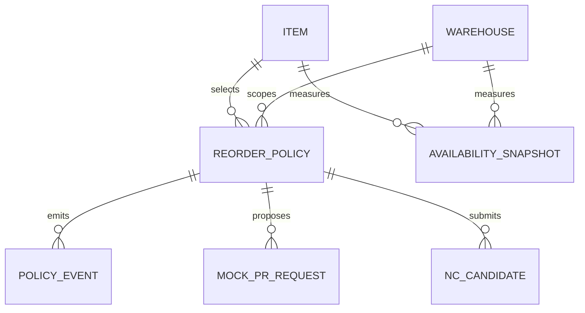
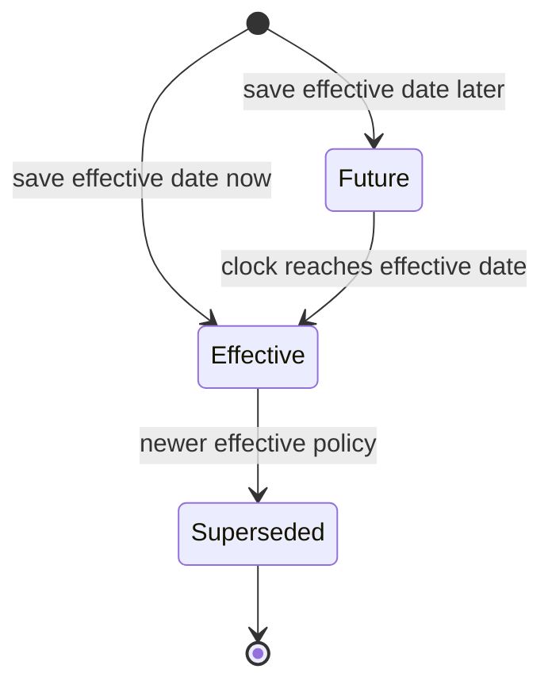

# BRD · F-WH-ROP · จุดสั่งซื้อซ้ำ

**สถานะ:** APPROVED (AI review only, no human sign-off) · **วันที่:** 2026-09-14 · **ชนิด:** New Feature · **เลน:** W4A FULL AI 100% no-vibe. Source: RIF_v2, _SCOPE_LOCK, PREBRIEF, W4 §2–3, Golden Rules and frozen HTML hash in `_lane/HTML_FREEZE_SHA256.txt`. Business owner: Warehouse Product Owner.

## 1. Document control
This version is the first HTML-first BRD. Product owner owns policy interpretation; Inventory/QHold owner owns availability; NC owner owns notification; Procurement owner owns PR contract. A business decision that changes an `[ASSUMED]` rule must update this BRD, FRD and TC before implementation.

## 2. Context and objectives
Warehouse needs per-item, per-warehouse reorder policy, an availability-based suggestion, and a visible audit trail. The console must never imply that a mock PR was created or a notification delivered. Outcomes: reproducible suggested quantity per policy/snapshot; hold excluded from available while retained onHand; no duplicate mock acknowledgement for one key.

### 2.3 Measures
| Measure | Baseline | Target | Method |
|---|---|---|---|
| Configured pair coverage | unknown `[ASSUMED]`, establish at pilot | 100% of business-enabled pairs | effective policy pairs / enabled pairs |
| Formula correctness | unknown `[ASSUMED]` | 100% of AC-03–06 fixtures | compare `(max−available)` and boundary in same asOf snapshot |
| Duplicate mock PR | unknown `[ASSUMED]` | 0 per idempotency key | count mock ack/event per key |
| QHold exclusion | unknown `[ASSUMED]` | 100% | compare onHand−held to available |

## 3. Scope
**In:** Item×Warehouse min/max/safety policy, effective date/version, stock/QHold snapshot read, suggestion, NC candidate envelope, PR mock request/ack, event history, search/filter/statistics. **Out:** PR creation/approval, NC threshold/channel/recipient editor and delivery, stock mutation, movement write, wizard Pattern Q, W2-PUR-LITE PR integration.

### 3.4 Scope Lock inheritance
`scope_lock_ref=0_DIRECTION/_SCOPE_LOCK.md`. LOCK-01 console/master. LOCK-02 configurable exact Item×Warehouse policy. LOCK-03 NC owns rule/threshold; PR soft-link only. LOCK-04 held excluded ATP but retained onHand; ROP reads inventory. LOCK-05 no external transaction completion. LOCK-06 HTML freeze and trace. NC candidate above ROP min is allowed because NC makes its own external notification decision; PR request is limited to positive ROP suggestion. No silent scope expansion.

## 4. Actors, rights and governance
| Actor | Business action | Control |
|---|---|---|
| Policy maintainer (Maker) | save a new version | no overwrite or history delete |
| Warehouse reviewer (Checker) | inspect pair/snapshot/version | cannot silently change policy |
| Warehouse approver (Approver) | approve policy if configured `[ASSUMED]` | Maker≠Approver; no approval UI in demo |
| Inventory service (System) | provide onHand, held, asOf | ROP read-only |
| NC/Procurement owners | decide notification/PR downstream | not implemented in W4 ROP |
| Auditor | read events and refs | immutable view |

Production User Access ENC: server-enforced tenant and warehouse scope, least privilege, write role check, access audit. Local HTML does not demonstrate auth. DOA actor slots for policy approval are an open question; no hard-coded hierarchy.

## 5. Business journey with COSO
| Step | Maker | Checker | Approver | System/control |
|---|---|---|---|---|
| Configure | chooses pair/threshold/date | validates operational intent | optional DOA owner slot | bounds validation, append version/event |
| Evaluate | requests recompute | checks asOf/held | none | active policy + snapshot, zero stock writes |
| Recommend PR | opens positive suggestion | checks pair/qty | Procurement downstream | idempotent mock payload and ack only |
| Notify candidate | submits NC candidate | NC owner evaluates rule | NC downstream | no local delivery result |
| Audit | auditor reads | reviewer reconciles | none | events append-only |

## 6. Business entities and fields
`Item` and `Warehouse` are existing soft references. `ReorderPolicy(tenantId,itemCode,warehouseRef,minQty,maxQty,safetyQty,effectiveDate,version,ncRuleRef)` has many immutable versions per pair; one is active as of date. `AvailabilitySnapshot(item,warehouse,onHand,held,asOf)` is read-only. Derived `available=max(0,onHand−held)`, `triggered=(available≤min)`, `suggestedQty=triggered?max(0,max−available):0` are `[ASSUMED]`. `MockPRRequest` and `NCCandidate` include source policy/version, snapshot/asOf and idempotency key. `PolicyEvent` is append-only. Missing policy or snapshot is an explicit state, never silently zero.

## 7. Stories and acceptance
| ID | Given/When | Then |
|---|---|---|
| US-01 | valid policy saved for ITEM-101 WH-01 | new version/event; WH-02 policy unchanged |
| US-02 | safety>min, min>max, negative, blank, nonfinite or invalid date | visible error; no version/event |
| US-03 | available10=min10, max30 | qty20 and positive recommendation `[ASSUMED]` |
| US-04 | available9<min10, max30 | qty21; snapshot unchanged |
| US-05 | available>min | qty0 and no PR action; NC may receive candidate |
| US-06 | onHand20, held12 | available8, qty22; onHand20 retained |
| US-07 | same PR key submitted twice | same mock ack, one event, no actual PR |
| US-08 | saved event opened | historical version/date visible, no edit/delete |

## 8. Lifecycle
Policy `future→effective→superseded` by effective date and version. Future policy does not displace current policy before its date. Suggestion is derived `below/equal/above`; only below/equal with qty>0 can prepare PR. Mock PR `new→acknowledged` or `retryable unavailable`; replay returns same ack. NC candidate is an envelope, never a notification state. Events cannot transition or be erased.

## 9. Rules and flexibility
| ID | Rule | Tag / source |
|---|---|---|
| BR-01 | exact pair/date selects active version; writes append version | CONFIGURABLE · W4 §2 |
| BR-02 | min/max/safety/effective date set in policy | CONFIGURABLE · W4 §2 |
| BR-03 | `0≤safety≤min≤max`; invalid date/number rejected | CONFIGURABLE shape `[ASSUMED]`, Warehouse Product Owner |
| BR-04 | available≤min triggers; qty=max(0,max−available) | DYNAMIC with CONFIGURABLE values `[ASSUMED]`, Warehouse Product Owner |
| BR-05 | QHold excluded available/ATP, retained onHand | FIXED W4 OQ-QH-01 `[ASSUMED]` |
| BR-06 | NC owns threshold/channel/recipient; ROP sends candidate facts | FIXED W4 §2 |
| BR-07 | PR is context/ack mock only | FIXED W4 §2 |
| BR-08 | policy/event append-only; mock key idempotent | FIXED Golden Rule 4 |

### 9.5 Flexibility attribution
🤖 BR-01–04 vary by policy/effective date and BR-03/04 defaults have owner OQ in §15. ✅ BR-05–08 are scope/control invariants. No NC threshold is hardcoded into ROP.

## 10. Edge and error paths
No policy → `ยังไม่มีนโยบาย`; no invented min. Missing/stale snapshot blocks positive suggestion `[ASSUMED]`. Blank/negative/nonfinite values and malformed calendar date reject save. Duplicate reference/unknown Item/Warehouse reject. Zero min/max/safety accepted if ordered; zero qty cannot request PR. Held>onHand clamps available0 and flags data quality `[ASSUMED]`. Future version leaves prior current version active. Mock PR unavailable is retryable with no event; replay returns old ack. Absent NC rule ref blocks candidate. Each BR maps to S01–13 in PREBRIEF/TC.

## 11. Regression and limitations
New feature; regress Item/Warehouse lookup and Inventory/QHold snapshot only. No live stock, purchasing or notification write. The frozen HTML demonstrates local policies/fixtures, not server access, persistence or external integration.

## 12. Value stream
### 12.1 Upstream/downstream impact
| Upstream | ROP effect | Downstream consequence |
|---|---|---|
| Item/UoM and Warehouse master | exact pair select | prevents wrong-warehouse replenishment |
| Inventory onHand/QHold held/asOf | available and suggestion | held lowers eligible quantity; no stock posting |
| NC rule ref | candidate facts | NC decides delivery; no local recipient/threshold |
| positive suggestion | mock PR context | Procurement may implement PR later; no W4 PR creation |
| event log | policy/ack trace | audit/reconciliation without mutation |

### 12.3 Existing system references
Item, Warehouse, Inventory, QHold are read/soft refs. PR W2-PUR-LITE; PO/GRN/RTV W3-LITE and JE W5-FULL remain external mock/TODO when touched by lane; ROP directly requires only PR mock. NC and CSQ chips produce scoped briefs. Proposed FRD endpoints are not verified live endpoints.

## 13. Delivery phases
1. Local console/formula/mock pack (this deliverable). 2. Production policy store, access and stock snapshot. 3. NC/Procurement owner integrations after contract signoff. 4. visual/UAT/monitoring rollout. AI lane certifies only its documented local evidence.

## 14. Dev order and screen inventory
Implement policy store/version guard, validation, stock read, formula, mock adapters, authorization and monitoring. Actual HTML routes: `#/records` policy list/drawer; `#/history` evaluation list/check drawer; `#/settings` append-only events/detail. Three pages, no wizard. UI signals passed to FRD: list/filter, empty/error, drawer, mock ack, audit read-only. BRD makes no color/layout design decision.

## 15. Open questions and defaults
| OQ | AI default | Owner |
|---|---|---|
| OQ-ROP-01 | `available≤min`, order to max and ordered nonnegative thresholds `[ASSUMED]` | Warehouse Product Owner |
| OQ-ROP-02 | QHold excluded available but retained onHand `[ASSUMED]` W4 §3 | Inventory/QHold owner |
| OQ-ROP-03 | tenant-local effective day start; UTC transport `[ASSUMED]` | Warehouse Product Owner |
| OQ-ROP-04 | stale/missing snapshot blocks positive advice; freshness SLA `[ASSUMED]` | Inventory owner |
| OQ-ROP-05 | policy approval slots if required, no demo approval `[ASSUMED]` | DOA/Security owner |
| OQ-ROP-06 | PR/NC envelope, ack and replay only `[ASSUMED contract]` | Procurement/NC owners |
| OQ-ROP-07 | held>onHand data-quality escalation `[ASSUMED]` | Inventory owner |

## 16. Security and compliance
P1 ERP master-data preset: tenant+warehouse scoping, least privilege, server-side validation, expectedVersion conflict, immutable audit and no personal recipient details in ROP. Maker/Approver SoD if policy approval configured. Local HTML does not implement authentication; FRD marks production requirements separately. Runtime control points: BR-03 input, BR-01 version, BR-05 stock read, BR-06/07 boundary, BR-08 replay.

## 17. Health checks
| Check | Baseline/target | Threshold/action |
|---|---|---|
| Policy coverage | §2.3 / 100% enabled | missing pair shown to owner |
| Formula fixtures | §2.3 / 100% | mismatch blocks release |
| Duplicate mock key | §2.3 / zero | replay and audit |
| Snapshot age | unknown / owner-set SLA `[ASSUMED]` | stale blocks advice |
| Mock adapter availability | unknown / owner-set SLA `[ASSUMED]` | retryable state, no false success |

## 18. Monitoring
Reports/widgets: pair coverage, future-effective policy, below/equal/above suggestions, held exclusion, PR mock ack/replay, NC candidate and error. Each maps to §17 and respects tenant/warehouse filter. No metric claims production baseline until measured.

## AI review
C01–C23 and PE01–PE05 evidence in `_lane/BRD_GATE_C01_C23.md`; no critical scope/business contradiction. APPROVED means AI-ready for FRD, while rendering and downstream integration remain WARN.

## Supplement to §§6, 8, 10, 16–17 for quality gate

Every persistent entity carries `tenantId`, `createdAt`, `createdBy`, `updatedAt` and `updatedBy` where mutable; version/event/request records additionally carry immutable `eventId`, `sourceRef`, `occurredAt`, `actorRef`, `correlationId` and `idempotencyKey` as applicable. `AvailabilitySnapshot` is upstream read and never stores a ROP `updatedBy`; it carries `sourceSystem`, `asOf`, `snapshotRef`. Production server writes an outbox event in the same transaction as policy version. No event is deleted.

**BA-confirmed edge source:** W4/QHold rule and RIF lock establish held exclusion, cross-lane mock, exact pair config, append-only history. **AI-suggested defaults:** equality triggers, nonnegative ordering, future effective time, stale snapshot handling, held>onHand data-quality escalation and idempotency key composition; these are explicitly OQ-ROP-01–07 and must not be treated as stakeholder sign-off. Controls map input validation→§17 formula fixture, version guard→policy coverage/future report, snapshot freshness→snapshot-age report, mock replay→duplicate-key report. Production throughput and latency budgets are unknown; owner sets them before rollout, with `[ASSUMED]` interim target 100 policy recomputations per minute per tenant and p95 under 2 seconds on a valid snapshot. This is a planning target, not measured evidence. Security control list for P1: authenticate; tenant/warehouse authorize; maker/approver SoD where enabled; validate and normalize input; optimistic concurrency; immutable event/outbox; redact logs; retain and export audit by retention policy; rate-limit mock adapter; detect replay; monitor failed upstream snapshots and downstream retries. Security owner confirms exact retention and role matrix before production.
