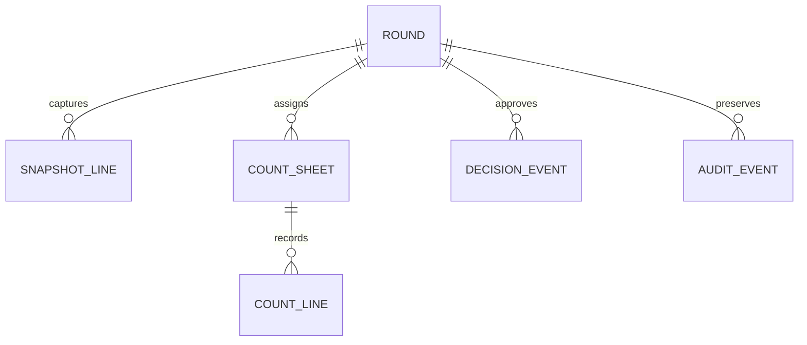
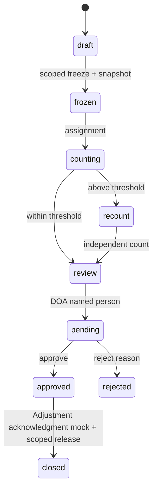

# BRD — F-WH-STOCKTAKE Stocktake

Status: APPROVED for Phase A business direction · 2026-09-14 · source PREBRIEF, W4-LITE, v9 console. Owner Warehouse BA. HTML functional gate remains separate.

## 1 · Context

Large physical inventory counts need a controlled scope and frozen baseline to distinguish real variance from concurrent movements. Counter must not be influenced by system balance. Approval precedes adjustment; Stocktake never changes on-hand quantity itself.

## 2 · Objectives and measures

100% rounds with selected scope, freeze timestamp and immutable snapshot (new-feature baseline 0; audit round samples monthly). 100% above-threshold variance with independent recount (baseline 0; compare variance log). 100% approved handoffs with adjustment reference and no direct stock mutation (baseline 0; reconcile integration events). Monitor in §17–18.

## 3 · Scope

IN: console rounds, scoped freeze/snapshot, count sheets and named assignee, blind count, threshold-based recount, variance review, DOA person slot, append-only event and W3-LITE Adjustment mock. OUT: Pattern Q, running number/PDF document, Cycle Count ABC, barcode/lot workflows, Item/Warehouse master, inventory engine and direct stock adjustment. [ASSUMED] OQ-ST-01 selected-scope freeze, OQ-ST-02 counter blind/supervisor reveal, Stock Adjustment mock contract. [AI-DRAFT] close/release after handoff acknowledgment and equality threshold behavior.

### 3.4 Scope Lock

LOCK-ST-01 W4-LITE §2 console only, no Q. LOCK-ST-02 OQ-ST-01 scoped freeze and atomic snapshot. LOCK-ST-03 OQ-ST-02 blind count. LOCK-ST-04 threshold config + independent recount + DOA before Adjustment mock. LOCK-ST-05 no direct stock mutation; append-only. Do not silently expand mock into W3/W4 implementation.

## 4 · Actors and permissions

| Actor | Round/freeze | Count | Reveal snapshot/variance | Approve | Handoff |
|---|---|---|---|---|---|
| Warehouse supervisor | yes | policy scoped | yes | no own round | after DOA |
| Assigned counter | no | assigned sheet only | no | no | no |
| Independent recount counter | no | second sheet only | no | no | no |
| DOA resolved person | no | no | policy scoped | yes if separate maker | no |
| Auditor | read-only | no | authorized read-only | no | no |

Access ENC controls every action. Prototype DEMO persona switcher is review-only and excluded from production.

## 5 · Journey and COSO

Supervisor creates scope → central movement engine freezes only scope and atomically snapshots Item/Location quantity/version → named person receives blind sheet → counter submits → supervisor reviews variance → config threshold may require independent recount → DOA named person decides → mock Adjustment handoff → release only selected freeze and close. Alt: invalid/overlap scope remains draft; blank/negative count blocked; reject appends reason and returns to review by new event. Count lines and decisions never overwritten.

| Step | Maker | Checker | Approver | System |
|---|---|---|---|---|
| Scope/freeze | Warehouse supervisor | Inventory scope validation | — | Scoped movement block and snapshot |
| Count | Assigned counter | Supervisor checks completeness | — | Hide baseline; append submission |
| Recount | Independent counter | Supervisor compares variance | — | Resolve effective threshold |
| Decision | Supervisor sends | Auditor monitors | DOA named person | Append result, enforce SoD |
| Handoff | Warehouse integration | Reconcile acknowledgment | Prior DOA approval | Mock W3 link, release scope |

## 6 · Data entities

Round: id, name, warehouse/location scope, status, freeze/snapshot times and watermark, threshold policy ref/effective date, assignee(s), approval ref, audit fields created_by/date modified_by/date. Snapshot line: round, Item/Location/UoM soft-ref snapshot, system_qty immutable, time/version, audit fields. Count sheet/line: round, assignee, sequence, counted_qty, submitted time/evidence, audit fields. Variance/decision: item, accepted count, snapshot qty, difference, threshold result, DOA person/status/reason, adjustment mock ref, audit fields. Event: action, actor/time, prior event/reversal ref, immutable payload.

## 7 · Atomic stories and GWT acceptance

| Story | Action | Acceptance A | Acceptance B |
|---|---|---|---|
| US01 | Set scope | Given valid Warehouse/Location, when selected, then scope is recorded. | Given active overlapping freeze, when starting, then initiation is blocked. |
| US02 | Freeze snapshot | Given valid scope, when freeze succeeds, then immutable timestamp/version and balances are captured. | Given movement outside scope, when freeze active, then outside scope stays operable. |
| US03 | Assign sheet | Given frozen round, when assigned, then named counter gets blind sheet. | Given counter view, when opened, then balance and variance remain hidden. |
| US04 | Submit count | Given all quantities ≥0, when submitted, then count event appends. | Given blank/negative, when submitted, then error blocks state change. |
| US05 | Request recount | Given abs variance exceeds effective threshold, when reviewed, then independent second sheet is required. | Given same counter, when chosen, then assignment is refused. |
| US06 | Approve | Given reviewed result, when DOA person accepts, then decision appends. | Given rejection without reason, when submitted, then state stays pending. |
| US07 | Handoff | Given approved variance, when forwarded, then W3-LITE mock reference appears. | Given handoff, when Stocktake closes, then no local on-hand mutation occurs. |

## 8 · Lifecycle

`draft → frozen → counting → recount? → review → pending → approved → closed`; `pending → rejected` with reason; correction appends new count/decision rather than changing history. Freeze lasts through count/review until authorized close; failure in Adjustment handoff keeps scope and exposes retry status [AI-DRAFT].

## 9 · Rules, configuration and validation

| Rule | Decision | Flexibility |
|---|---|---|
| BR01 | Freeze selected scope only; no active overlapping round | CONFIGURABLE scope policy via inventory engine [ASSUMED] |
| BR02 | Atomic immutable snapshot at freeze timestamp/version | FIXED invariant |
| BR03 | Blind counter; supervisor only reveal; zero valid, blank/negative invalid | DYNAMIC User Access ENC [ASSUMED] |
| BR04 | abs difference > effective threshold requires independent recount | CONFIGURABLE threshold/effective date, equality [AI-DRAFT] |
| BR05 | Named DOA person, maker≠approver, reject reason, append-only | DYNAMIC DOA engine |
| BR06 | Approved variance → W3 Adjustment mock, no direct stock mutation | FIXED ownership boundary [ASSUMED contract] |

9.2 Required round name/scope, assignee, all counted lines, independent second counter if required, DOA person before approval. Duplicate freeze, stale snapshot or handoff mismatch fail safely. 9.5 ✅ W4-LITE confirmed scope/blind/Adjustment separation; 🤖 [AI-DRAFT] equality threshold and acknowledgment release owned Warehouse BA; [ASSUMED] OQ-ST-01/02 to Warehouse and Policy owners. Config levels: Admin Panel scope and threshold, Engine Management DOA/movement, effective-date version pinned to round.

## 10 · Exceptions

10.1 Pack confirmed: selected-scope freeze, blind count, threshold recount, W3 mock. 10.2 AI proposed ☐ overlapping nested scope ☐ count missing item ☐ zero count ☐ stale snapshot after delayed approval ☐ W3 acknowledgment error; Warehouse BA decides after HTML vibe. Never silently show on-hand to counter.

## 11 · Security and evidence

User Access ENC, SoD independent counter/approver and audit event retention. All count submissions, freeze movements, decisions, rejection reasons and adjustment request/ack events append-only; no hard delete. No restricted employee identifiers in CSQ payload. NC rules govern notifications/aging thresholds.

## 12 · Dependencies

Warehouse/Location, Item and Inventory balances are existing picker/snapshot dependencies. DOA central resolves person slots. Stock Adjustment F082 W3-LITE runs in parallel: mock [ASSUMED contract], no direct balance edit. Cycle Count F086 W4-FULL runs in parallel and is not a dependency to wait for.

### 12.1 Downstream impact and boundary

| Event | Consumer | Contract |
|---|---|---|
| Freeze | Inventory movement engine | Block only selected scope; timestamp snapshot |
| Count submit/recount | Warehouse review | Immutable evidence and variance against same snapshot |
| DOA result | CSQ/Policy | Declaration event, no hardcoded chain |
| Approved variance | Stock Adjustment W3-LITE | Soft-link mock [ASSUMED contract], adjustment owner posts inventory |
| Close | Inventory movement engine | Release only selected scope after acknowledgment |

**Stocktake vs Cycle Count:** Stocktake is an exceptional large count of a declared warehouse/zone scope with scoped freeze, full snapshot, assigned sheets and round closure. Cycle Count + ABC W4-FULL is recurring targeted rotation by classification/location. This BRD does not implement ABC schedules, sampling, cycle policy or its UI.

## 13 · Delivery phases

Phase A direction/prebrief/console HTML/BRD and doa+csq declarations. Team vibe and html-review-fix-order re-gate next. Phase B generates FRD/UI Brief/TC only after HTML is stable; integration and QA afterward. No Phase B artifact in this pack.

## 14 · Dev direction

14.1 Preserve console with tab row directly below page head. 14.2 Bind scope movement freeze and atomic snapshot, enforce ENC blind count. 14.3 Apply threshold version/effective date and independent recount. 14.4 Resolve DOA person and send approved variance to Adjustment boundary with idempotent event. 14.6 Functions cut FN01–FN12; no Cycle Count, Q document or direct stock write.

## 15 · Open questions

OQ-ST-01 [ASSUMED] scoped freeze owner Warehouse+Inventory engine; OQ-ST-02 [ASSUMED] blind count/supervisor reveal owner Warehouse+Policy; [ASSUMED contract] W3 Adjustment owner Warehouse integration. [AI-DRAFT] overlapping nested scope, acknowledgment and threshold equality owner Warehouse BA. UI WARN loading/typography owner UI team at vibe. Edge-free pack graph validator warning owner pack maintainer.

## 16 · Governance

16.1 Preset Warehouse Controlled Count, confidential quantities. 16.2 Standards ✅ least privilege, ✅ SoD, ✅ scoped freeze, ✅ immutable snapshot, ✅ blind input, ✅ supervisor reveal auth, ✅ threshold version, ✅ recount independence, ✅ DOA named person, ✅ append-only events, ✅ idempotent handoff, ✅ no direct stock edit, ✅ masked CSQ event, ✅ access review. 16.3 Controls C-ST-01 freeze overlap, C-ST-02 snapshot watermark, C-ST-03 blind access, C-ST-04 recount gate, C-ST-05 DOA/SoD, C-ST-06 Adjustment/ack. 16.4 Risks: wrong scope blocks unrelated operations; leaked baseline biases counts; stale snapshot hides movement; omitted recount masks variance; self-approval authorizes error; unacknowledged handoff releases freeze early.

## 17 · Monitoring

17.1 SLA: assigned count due date centrally configured and overdue reviewed daily. 17.2 Control points at freeze/snapshot, sheet display, submit, threshold/recount, DOA and W3 acknowledgment. 17.3 KPI: 100% snapshot integrity baseline 0, 100% required recount baseline 0, 100% approved handoff reconciliation baseline 0. 17.4 Min count 0, max bounded by configured precision; variance threshold config+effective date, no local constant. 17.5 New feature capacity baseline 0 rounds/day; measure count lines and age to set stress target with Warehouse owner.

## 18 · Monitoring views

Round list and supervisor variance report expose active scoped freezes, overdue sheets, snapshot timestamp/watermark, threshold crossings and independent recount, pending DOA, handoff acknowledgment, freeze-release exceptions. Every BR and runtime control in §§9/16 maps to an exception/metric here; NC rules own alert thresholds.
