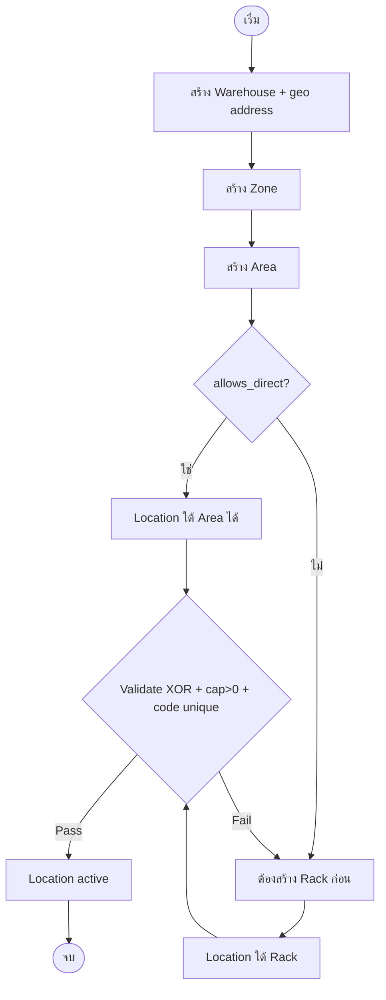
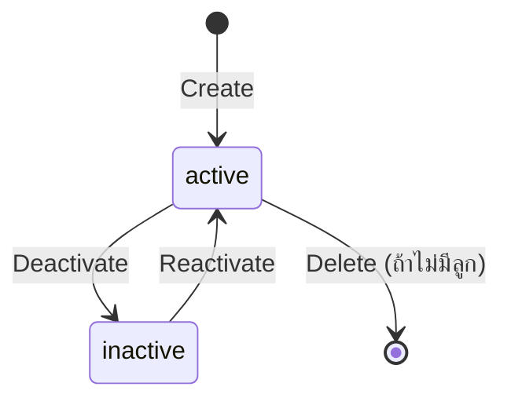
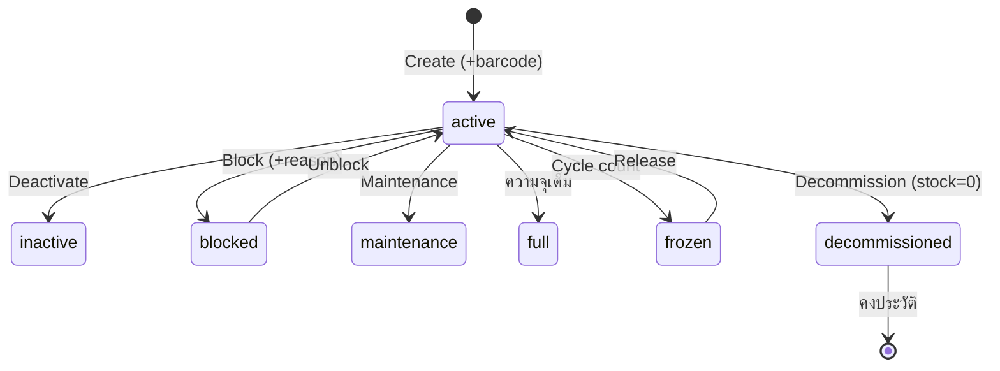

# BRD — F-LOCATION-MASTER-001 · Location Hierarchy Management

> Generated by `brd-generator-full` · **Enhancement / Revision Mode** · Source of truth: `location-hierarchy.html` (v1.1.0, ล่าสุด)
> Pipeline: HTML (html-generator-v3) → **BRD v2.0** → FRD (frd-generator-v5) → HTML
> Supersedes: BRD-F-LOCATION-MASTER-001 v1.0 (Location Master — single-entity)

---

## Section 1 — Document Info

| Field | Value |
|---|---|
| BRD ID | BRD-F-LOCATION-MASTER-001 |
| Feature | Location Hierarchy Management (5-level CRUD + dual-view + flexible parent + geo address) |
| BRD Type | **Enhancement** (ของ v1.0 New Feature) |
| Version | 2.0 |
| Status | Draft → AI Reviewed |
| Module | Inventory / Master Data |
| Owner | BA — P2P Wave 0 |
| Stakeholders | Warehouse Manager, Warehouse Supervisor, Operator, Inventory Controller, Admin |
| Created Date | 2026-05-29 |
| Last Updated | 2026-05-29 |
| DOA | No (operational master — RBAC only, LD-07) |

### Changelog
- **v2.0 (2026-05-29)** — Enhancement sync จาก `location-hierarchy.html` ล่าสุด:
  - ขยายจาก single-entity (`locations` เท่านั้น) → **full CRUD ครบ 5 ระดับ** (Warehouse → Zone → Area → Rack → Location)
  - เพิ่ม **dual-view**: List view (drill-down Pattern A) + Hierarchy view (tree explorer + node summary)
  - เพิ่ม location type **PACK** (รวมเป็น 10 core types — สำหรับ pick-pack-ship เฟสถัดไป)
  - แยก Warehouse address เป็น **cascading geo dropdown** (จังหวัด → อำเภอ/เขต → ตำบล/แขวง → รหัสไปรษณีย์ auto) ดึงจาก Geo Master
  - Area-level segmented sub-view (Racks / Direct Locations) แสดง flexible parent
- v1.0 (2026-05-29) — Initial BRD (Location Master single-entity, 9 core types).

---

## Section 2 — Business Context

### 2.1 ปัญหา / โอกาส
v1.0 วาง foundation ของ `locations` ไว้แล้ว แต่ warehouse/zone/area/rack เป็นเพียง parent reference ที่ยังไม่มีหน้าจอจัดการ — ทีมคลังต้องตั้งโครงสร้างชั้นบน (เปิดคลังใหม่, เพิ่มโซน, จัดผัง area/rack) ผ่าน DB โดยตรง ไม่มี UI, ไม่มี validation, ไม่มี audit trail และที่อยู่คลังเก็บเป็น free-text ทำให้ค้นหา/รายงานตามพื้นที่ไม่ได้

### 2.2 เป้าหมายทาง Business
- ให้ Warehouse Manager/Supervisor จัดการลำดับชั้นจัดเก็บได้ครบ **ทั้ง 5 ระดับผ่าน UI เดียว** โดยไม่แตะ DB
- คงหลัก **flexible parent** (Location ใต้ Rack หรือ Area) เป็นจุดต่างจาก SAP/Manhattan
- ทำให้ address ของคลังเป็น **structured data** (province/district/subdistrict/postcode) เพื่อรายงานเชิงพื้นที่ + logistics
- เตรียม location type ให้พร้อมรองรับ **pick-pack-ship** (เพิ่ม PACK)

### 2.3 ตัวชี้วัดความสำเร็จ (Success Metrics)
| Metric | Baseline | Target | วัดยังไง |
|---|---|---|---|
| เวลาเปิดคลังใหม่ครบโครงสร้าง | ต้องพึ่ง dev/DBA | < 30 นาที self-service | timestamp create WH → rack แรก |
| Floating location (ไม่มี parent) | เสี่ยงจาก manual DB | 0 | CHECK constraint + orphan report |
| Warehouse address เป็น structured | 0% | 100% | count(province IS NOT NULL) |
| Bulk-gen bin | — | หลายพัน < 1 นาที | job duration |

### 2.4 ที่มาของ Requirement
- เคสที่เกิด: ขยาย scope ระหว่าง prototype review — user สั่ง "rework ให้จัดการได้ตั้งแต่ warehouse จนถึง location"
- Request จาก: Warehouse Manager (เจ้าของ feature)
- ต่อยอด: pick-pack-ship (PACK type), geo-based reporting (address master)

---

## Section 3 — Scope

### 3.1 In Scope (MUST)
- **CRUD ครบ 5 ระดับ:** Warehouse, Zone, Area, Rack, Location (สร้าง/แก้ไข/ดู/ลบ-ปลดระวาง)
- **Dual-view:** List view (drill-down ตาราง) + Hierarchy view (tree + node summary panel)
- **Flexible parent:** Location ใต้ Rack หรือ Area (XOR) — gate ด้วย `area.allows_direct=true`
- **Location type 10 ตัว** (9 core + PACK) เป็น fixed enum พร้อม behavior semantics
- **Capacity** (UOM + value > 0), **coordinates** (row/col/level/position), **rotation strategy** (FIFO/LIFO/FEFO/manual)
- **Behavior flags:** pickable / putawayable / replenishable; **mixing:** mixed_lot / mixed_item / neg_stock
- **Status lifecycle:** simple levels (active/inactive) + location 7 สถานะ
- **Bulk generate** rack + location (atomic + preview)
- **Warehouse address** = cascading geo (province → district → subdistrict → postcode) ดึงจาก Geo Master
- **WORM audit** ทุกการเปลี่ยนแปลง
- ลบแบบ referential-safe (มีลูกห้ามลบ; location stock=0 จึงปลดระวาง — soft keep history)

### 3.2 Out of Scope
- **Geo Master feature เอง** (จังหวัด/อำเภอ/ตำบล CRUD) — แยกเป็น feature ต่างหาก (ดู Open Question Q1); BRD นี้ใช้แบบ consume read-only
- DOA / approval workflow (LD-07 — operational master, RBAC อย่างเดียว)
- Stock / on-hand management (อยู่ที่ Inventory feature; ที่นี่ใช้แค่ flag `hasStock` เพื่อ gate การปลดระวาง)
- การผูก PACK station กับ Ship dock flow (pick-pack-ship feature เฟสถัดไป)
- Pick sequence / capacity หลายมิติ (weight+volume) / ABC class (แนะนำใน Section 15)

### 3.3 Assumptions
- Geo Master จะมีพร้อมก่อน go-live (ระหว่างนี้ใช้ subset ฝังใน prototype)
- 1 location อ้าง parent ได้ทางเดียว (rack XOR area) — ไม่มี multi-parent
- ทุก field เป็น classification **Internal** (address คลัง = business address ไม่ใช่ PII)

---

## Section 4 — User Roles & Permissions

### 4.1 Roles
| Role | คำอธิบาย |
|---|---|
| Warehouse Manager | เจ้าของ feature — จัดการครบทุกระดับ รวมลบ/ปลดระวาง |
| Warehouse Supervisor | สร้าง/แก้ไขโครงสร้าง — ไม่มีสิทธิ์ลบ |
| Operator | ดูอย่างเดียว (ใช้อ้างอิงตอนรับ/หยิบ/เก็บ) |
| Inventory Controller | ดู + เปลี่ยนสถานะ location (block/freeze สำหรับ cycle count) |
| Admin | จัดการ config + สิทธิ์ + Geo Master |

### 4.2 Permission Matrix
| Action | Manager | Supervisor | Operator | Inv. Controller | Admin |
|---|:--:|:--:|:--:|:--:|:--:|
| View (ทุกระดับ) | ✅ | ✅ | ✅ | ✅ | ✅ |
| Create WH/Zone/Area/Rack | ✅ | ✅ | ❌ | ❌ | ✅ |
| Create/Edit Location | ✅ | ✅ | ❌ | ❌ | ✅ |
| Bulk Generate | ✅ | ✅ | ❌ | ❌ | ✅ |
| Change Location Status | ✅ | ✅ | ❌ | ✅ | ✅ |
| Delete (WH/Zone/Area/Rack) | ✅ | ❌ | ❌ | ❌ | ✅ |
| Decommission Location | ✅ | ❌ | ❌ | ❌ | ✅ |

> **SoD:** ผู้ลบ (Manager/Admin) ≠ ผู้สร้างทั่วไป (Supervisor) → แยกสิทธิ์ทำลายออกจากสิทธิ์สร้าง (partial SoD; ไม่มี approval เพราะ LD-07)

---

## Section 5 — User Journey (with COSO)

> หมายเหตุ COSO: feature นี้ไม่มี human Approver (ไม่มี DOA) — Checker = System validation, Owner = Manager สำหรับ destructive action

### 5.1 Happy Path — เปิดคลังใหม่ครบโครงสร้าง
| # | Step | Maker | Checker | Owner | System | Notes |
|---|---|---|---|---|---|---|
| 1 | สร้าง Warehouse + เลือกที่อยู่ (geo cascade) | Supervisor | — | — | validate code unique + postcode auto | Trigger: + เพิ่ม Warehouse |
| 2 | สร้าง Zone ใต้ WH (+ cold-chain ถ้ามี) | Supervisor | — | — | validate temp range ถ้า temp_controlled | drill ลงจาก WH |
| 3 | สร้าง Area ใต้ Zone (+ allows_direct?) | Supervisor | — | — | set flexible-parent gate | — |
| 4 | สร้าง Rack ใต้ Area (rows×cols×levels) | Supervisor | — | — | เก็บ grid dimension | — |
| 5 | สร้าง Location (เลือก parent rack/area) | Supervisor | System | — | FN: validate XOR + allows_direct + code unique-in-parent + cap>0 | wizard 2 ขั้น |
| 6 | (ทางลัด) Bulk Generate bin ทั้ง rack | Supervisor | System | — | atomic generate + preview ก่อน commit | LD-05 |

**SoD Check:** Maker (Supervisor) ≠ Owner-destructive (Manager) ✅ · ไม่มี approval (LD-07)

### 5.2 Alternative / Error Paths
#### 5.2.1 Flexible-parent block
| # | Step | COSO | Notes |
|---|---|---|---|
| A1 | เลือก parent = Area ที่ `allows_direct=false` | System (Checker) | block + ข้อความ "Area นี้ไม่อนุญาตวางตรง — เพิ่ม Rack ก่อน" (LD-02) |

#### 5.2.2 Delete / Decommission
| # | Step | COSO | Notes |
|---|---|---|---|
| B1 | ลบ WH/Zone/Area/Rack ที่ยังมีลูก | System | block + แจ้งให้ลบลูกก่อน (referential-safe) |
| B2 | ปลดระวาง Location ที่ stock≠0 | System | block จนกว่า stock=0 (LD-06) |
| B3 | ปลดระวาง Location (stock=0) | Manager | soft → status=decommissioned, คงประวัติ |

### 5.3 Process Diagram


---

## Section 6 — Data Entity & Fields

### 6.1 Entity Overview
| Entity | Type | Description |
|---|---|---|
| warehouses | Master (L1) | คลัง — เจ้าของ address (geo) |
| zones | Master (L2) | โซนใน WH — cold-chain optional |
| areas | Master (L3) | พื้นที่ใน Zone — `allows_direct` gate |
| racks | Master (L4) | ชั้นวางใน Area — grid dimension |
| locations | Master (L5) | ตำแหน่งจัดเก็บ — flexible parent |
| geo_master | Reference (external) | จังหวัด/อำเภอ/ตำบล/รหัสไปรษณีย์ (consume read-only) |
| audit_log | WORM | ประวัติทุกการเปลี่ยนแปลง |

### 6.2 Entity: warehouses
| # | Field | Label UI | Input Type | ค่า/ตัวเลือก | จำเป็น | เงื่อนไข | หมายเหตุ |
|---|---|---|---|---|:--:|---|---|
| 1 | id / code | รหัสคลัง | TEXT | เช่น WH-03 | ✅ | unique | |
| 2 | name | ชื่อคลัง | TEXT | — | ✅ | — | |
| 3 | addr_line | ที่อยู่ (บ้านเลขที่/ถนน) | TEXT | — | ⚠️ | — | |
| 4 | province | จังหวัด | LOOKUP | Geo Master | ⚠️ | cascade root | |
| 5 | district | อำเภอ/เขต | LOOKUP | Geo Master (by province) | ⚠️ | depend province | label = เขต ถ้า กทม. |
| 6 | subdistrict | ตำบล/แขวง | LOOKUP | Geo Master (by district) | ⚠️ | depend district | label = แขวง ถ้า กทม. |
| 7 | postcode | รหัสไปรษณีย์ | AUTO | จาก subdistrict | ⚠️ | read-only | auto-fill |
| 8 | status | สถานะ | DROPDOWN | active/inactive | ✅ | default active | |
| 9 | created/modified (by,date) | audit | AUTO | session/now() | ✅ | — | WORM |

### 6.3 Entity: zones
| # | Field | Label | Type | ค่า | จำเป็น | เงื่อนไข |
|---|---|---|---|---|:--:|---|
| 1 | code | รหัส Zone | TEXT | — | ✅ | unique-in-WH |
| 2 | name | ชื่อ | TEXT | — | ✅ | — |
| 3 | warehouse_id | Warehouse | LOOKUP | warehouses | ✅ | active |
| 4 | temp_controlled | ควบคุมอุณหภูมิ | TOGGLE | bool | ✅ | default false |
| 5 | temp_min / temp_max | ช่วงอุณหภูมิ (°C) | NUMBER | — | ⚠️ | required ถ้า temp_controlled |
| 6 | status | สถานะ | DROPDOWN | active/inactive | ✅ | — |

### 6.4 Entity: areas
| # | Field | Label | Type | ค่า | จำเป็น | เงื่อนไข |
|---|---|---|---|---|:--:|---|
| 1 | code | รหัส Area | TEXT | — | ✅ | unique-in-zone |
| 2 | name | ชื่อ | TEXT | — | ✅ | — |
| 3 | zone_id | Zone | LOOKUP | zones | ✅ | active |
| 4 | allows_direct | วาง Location ตรงได้ | TOGGLE | bool | ✅ | default false (LD-02 gate) |
| 5 | status | สถานะ | DROPDOWN | active/inactive | ✅ | — |

### 6.5 Entity: racks
| # | Field | Label | Type | ค่า | จำเป็น | เงื่อนไข |
|---|---|---|---|---|:--:|---|
| 1 | code | รหัส Rack | TEXT | — | ✅ | unique-in-area |
| 2 | name | ชื่อ | TEXT | — | ✅ | — |
| 3 | area_id | Area | LOOKUP | areas | ✅ | active |
| 4 | rows / cols / levels | ขนาดกริด R×C×L | NUMBER | ≥0 | ⚠️ | seed พิกัด bulk-gen |
| 5 | status | สถานะ | DROPDOWN | active/inactive | ✅ | — |

### 6.6 Entity: locations
| # | Field | Label | Type | ค่า/ตัวเลือก | จำเป็น | เงื่อนไข |
|---|---|---|---|---|:--:|---|
| 1 | code | รหัสตำแหน่ง | TEXT | — | ✅ | unique-in-parent |
| 2 | name | ชื่อ | TEXT | — | ⚠️ | optional |
| 3 | parent_type | ชนิด parent | RADIO | rack / area | ✅ | XOR (LD-01) |
| 4 | rack_id / area_id | parent | LOOKUP | racks / areas | ✅ | ตาม parent_type; area ต้อง allows_direct |
| 5 | type | ประเภทตำแหน่ง | DROPDOWN | 10 core types | ✅ | fixed enum (R-TYPE) |
| 6 | cap_uom / cap_val | ความจุ | UOM+NUMBER | pallet/box/piece/cbm/kg | ✅ | cap_val > 0 |
| 7 | rotation | กลยุทธ์หมุนเวียน | DROPDOWN | FIFO/LIFO/FEFO/manual | ✅ | default FIFO |
| 8 | row/col/level/position | พิกัด | TEXT/NUMBER | — | ⚠️ | optional |
| 9 | pickable/putawayable/replenishable | behavior flags | TOGGLE | bool | ✅ | default ตาม type |
| 10 | mixed_lot/mixed_item/neg_stock | mixing flags | TOGGLE | bool | ✅ | default false |
| 11 | status | สถานะ | DROPDOWN | 7 สถานะ (ดู §8) | ✅ | default active |
| 12 | block_reason | เหตุผลที่บล็อก | TEXT | — | ⚠️ | required ถ้า status=blocked |
| 13 | barcode / qr | บาร์โค้ด | TEXT | — | ⚠️ | ต้องมีก่อน activate |
| 14 | hasStock | มีสต็อก | SYSTEM | bool | — | จาก Inventory; gate decommission |

### 6.7 Location Type Semantics (fixed enum — contract สำหรับ feature อื่น)
| Type | ความหมาย | default behavior |
|---|---|---|
| PICK_FACE | จุดหยิบหลัก | pickable + replenishable |
| RESERVE | สำรอง/เติมเต็ม | putaway/replenish source, ไม่หยิบ |
| BULK | เก็บปริมาณมาก | LIFO ได้, ไม่ใช่จุดหยิบ |
| STAGING | พักของ | mixed_item ได้ |
| **PACK** ⭐ | จุดแพ็ก (pick-pack-ship) | work location, ไม่เก็บถาวร, ไม่หยิบ |
| RECEIVING_DOCK | จุดรับเข้า | inbound landing |
| TRANSIT | พักระหว่าง flow | — |
| HOLD | กักกัน QC | ไม่หยิบ, กัน allocation |
| DAMAGED | ของเสีย | ไม่หยิบ |
| VIRTUAL | ปรับยอด | neg_stock ได้, ไม่ physical |

### 6.8 Entity Relationship
```
warehouses ─1:N─▶ zones ─1:N─▶ areas ─1:N─▶ racks ─1:N─▶ locations
                                   └────────1:N (direct, if allows_direct)──▶ locations
geo_master ──(referenced by)──▶ warehouses (province/district/subdistrict/postcode)
* CHECK: (rack_id IS NOT NULL) XOR (area_id IS NOT NULL)   ← LD-01
```

---

## Section 7 — User Stories & Acceptance Criteria

**S-01 สร้าง Warehouse พร้อมที่อยู่**
- As a Supervisor / I want to สร้างคลังใหม่พร้อมเลือกที่อยู่ / So that มีโครงสร้างรองรับ zone
- AC1: Given ฟอร์ม WH, When เลือกจังหวัด, Then dropdown อำเภอเปิดและ reset ค่าเดิม
- AC2: Given เลือกตำบล, Then รหัสไปรษณีย์ auto-fill (read-only)
- AC3: Given code ซ้ำ, When บันทึก, Then block + แจ้งรหัสซ้ำ

**S-02 สร้าง Location ใต้ Rack หรือ Area**
- AC1: Given parent_type=area + area.allows_direct=false, Then block พร้อมข้อความ gate
- AC2: Given cap_val ≤ 0, Then block "ความจุต้องมากกว่า 0"
- AC3: Given code ซ้ำใน parent เดียวกัน, Then block

**S-03 Bulk Generate bin**
- AC1: Given template rack×grid, Then preview จำนวนก่อน commit
- AC2: When ยืนยัน, Then สร้างแบบ atomic (ไม่มี partial)

**S-04 ปลดระวาง Location**
- AC1: Given stock≠0, Then block
- AC2: Given stock=0, When ปลดระวาง, Then status=decommissioned + คงประวัติ

**S-05 สลับมุมมอง List ↔ Hierarchy**
- AC1: Given เลือก node ใน Hierarchy view, When สลับไป List view, Then context (node ที่เลือก) คงอยู่
- AC2: Given Hierarchy view, Then ฝั่งขวาแสดง summary panel (ไม่ใช่ตาราง list)

**S-06 จัดการ Zone/Area/Rack**
- AC1: Given Zone temp_controlled=true, When ไม่กรอกช่วงอุณหภูมิ, Then block
- AC2: Given ลบ node ที่มีลูก, Then block (referential-safe)

> กฎ: ทุก Story เป็น action เดียว (ไม่มี "และ")

---

## Section 8 — Status & Lifecycle

### 8.1 Simple levels (Warehouse/Zone/Area/Rack)


### 8.2 Location (7 states)


### 8.3 Transition Table (location)
| Current | Trigger | Next | COSO | Notes |
|---|---|---|---|---|
| active | Block | blocked | Inv. Controller | require block_reason |
| active | Freeze | frozen | Inv. Controller | cycle count |
| active | Decommission | decommissioned | Manager | stock=0 (LD-06) |
| blocked | Unblock | active | Inv. Controller | — |

---

## Section 9 — Business Rules + Validation

### 9.1 Business Rules
| Rule ID | Rule | Tag | Type | เหตุผล Tag |
|---|---|:--:|---|---|
| R-FLEX | Location parent = rack XOR area (CHECK) | FIXED | Constraint | Iron rule (LD-01) |
| R-GATE | parent=area ต้อง allows_direct=true | FIXED | Gate | LD-02 |
| R-TYPE | location type = fixed enum 10 ตัว | FIXED | Enum | contract ให้ feature อื่น |
| R-CODE | code unique ภายใน parent | FIXED | Uniqueness | BR-S01 |
| R-CAP | cap_val > 0 | FIXED | Validation | data integrity |
| R-BULK | bulk-gen atomic + preview | FIXED | Process | LD-05 |
| R-DEACT | ปลดระวาง location ต้อง stock=0 | FIXED | Guard | LD-06 |
| R-DEL | ลบ node ที่มีลูกไม่ได้ | FIXED | Referential | integrity |
| R-BARCODE | location ต้องมี barcode ก่อน activate | CONFIGURABLE | Policy | บาง warehouse อาจผ่อน |
| R-TEMP | zone temp_controlled ต้องมีช่วงอุณหภูมิ | FIXED | Validation | cold-chain |
| R-DEFBEH | type set default behavior flags | CONFIGURABLE | Template | ปัจจุบันตั้งมือ → ควร auto (Q3) |
| R-GEO | address ดึงจาก Geo Master เท่านั้น | FIXED | Master ref | structured data |

### 9.2 Validation Rules
| VR | Field/Action | เงื่อนไข | ประเภท | ข้อความ |
|---|---|---|---|---|
| VR01 | code (ทุกระดับ) | required + unique-in-parent | Error | รหัสซ้ำภายใน parent |
| VR02 | cap_val | > 0 | Error | ความจุต้องมากกว่า 0 |
| VR03 | area select (location) | allows_direct=true | Error | Area นี้ไม่อนุญาตวางตรง |
| VR04 | temp_min/max | required ถ้า temp_controlled | Error | กรุณากรอกช่วงอุณหภูมิ |
| VR05 | block_reason | required ถ้า status=blocked | Error | ระบุเหตุผลที่บล็อก |
| VR06 | subdistrict | trigger postcode auto-fill | Trigger | เติมรหัสไปรษณีย์อัตโนมัติ |

### 9.5 สรุประดับความยืดหยุ่น
| Rule | Tag | ใครเปลี่ยน | บ่อยแค่ไหน | ระดับ |
|---|:--:|---|---|---|
| R-BARCODE | CONFIGURABLE | Admin | ตาม policy คลัง | Admin Panel (config key `loc_require_barcode`) |
| R-DEFBEH | CONFIGURABLE | Admin | นานๆ ครั้ง | Rule/Template Management (Phase 3) |
| R-TYPE | FIXED | — | — | Enum ใน code (เพิ่ม type = code change) |
| ที่เหลือ | FIXED | — | — | hardcoded logic |

---

## Section 10 — Edge Cases

### 10.1 ที่ระบุไว้ (☑)
- ☑ E01: parent=area ที่ allows_direct=false → block (VR03)
- ☑ E02: ลบ node มีลูก → block
- ☑ E03: ปลดระวาง location มี stock → block
- ☑ E04: code ซ้ำใน parent → block
- ☑ E05: zone temp_controlled แต่ไม่กรอกช่วง → block

### 10.2 จาก AI Pattern Matching (☐ ต้อง confirm)
**CL (Calculation)**
- ☐ E06: bulk-gen template ให้ผลรวม = 0 (grid มีค่า 0) → block ก่อน commit
- ☐ E07: cap_val มีทศนิยม/ติดลบ → normalize/block

**CA (Concurrent Access)**
- ☐ E08: 2 users แก้ node เดียวกัน → optimistic lock (version field)
- ☐ E09: ลบ rack ขณะอีกคนเพิ่ม location ใต้ rack นั้น → re-check ตอน commit

**DI (Data Integrity)**
- ☐ E10: เปลี่ยน area.allows_direct=false ทั้งที่มี direct location อยู่ → block/warn + ต้องย้ายก่อน
- ☐ E11: reparent location ข้าม rack/area → ตรวจ code uniqueness ใน parent ใหม่

**ST (Status/Workflow)**
- ☐ E12: deactivate zone ที่มี area active → cascade rule (block หรือ warn)
- ☐ E13: เปลี่ยน status เป็น full ทั้งที่ยังว่าง → ควรมาจาก Inventory ไม่ใช่ manual

### Tag Review Report
✅ R-FLEX/R-GATE/R-TYPE/R-CODE/R-CAP: FIXED — ถูกต้อง (business invariant)
⚠️ R-BARCODE/R-DEFBEH: CONFIGURABLE — ถูกต้อง (policy/template)
🔎 ไม่มี misclassification

---

## Section 11 — Impact Analysis / Regression Scope (Enhancement)

### 11.1 ของเก่า (v1.0) vs ของใหม่ (v2.0)
| มิติ | v1.0 | v2.0 |
|---|---|---|
| Entity ที่จัดการผ่าน UI | `locations` เท่านั้น | ครบ 5 ระดับ |
| WH/Zone/Area/Rack | parent reference (lookup) | full CRUD |
| View | list เดียว | List + Hierarchy (dual) |
| Location type | 9 core | 10 (เพิ่ม PACK) |
| Warehouse address | free-text | geo cascade (structured) |
| Area detail | — | segmented Racks/Direct-Loc |

### 11.2 Regression Scope
| Feature เก่า | ต้อง Test |
|---|---|
| Location create/edit (v1) | parent XOR, cap>0, code unique ยังทำงาน |
| Location view 3 tabs | ภาพรวม/ความจุ&flags/ประวัติ ไม่พัง |
| Bulk-gen | atomic + preview เดิม |
| downstream ที่อ้าง location_id | ไม่กระทบ (id schema เดิม) |
| location type enum | feature ที่ pattern-match type เดิม (เพิ่ม PACK = additive, ไม่ลบของเก่า) |

---

## Section 12 — Dependencies

### 12.1 Internal
- CUBIC Registry (entity/engine registration)
- Inventory feature (flag `hasStock` สำหรับ gate decommission)
- RBAC / Auth (Permission Matrix §4.2)

### 12.2 External
- **Geo Master** (จังหวัด/อำเภอ/ตำบล/รหัสไปรษณีย์) — read-only lookup (ดู Q1)
- Audit Log Service (WORM)
- Document/Code numbering (ถ้าจะ auto-gen code)

### 12.3 Existing System Reference
| Rule/Item | ระดับ | มีอยู่แล้ว? | Reference |
|---|---|:--:|---|
| Location entity + 9 types | — | ✅ (v1) | BRD/FRD F-LOCATION-MASTER-001 v1.0 |
| Engines ENG-LOC-GEN / ENG-HIER-PATH | — | ✅ (v1) | CUBIC registry (LD-08) |
| WH/Zone/Area/Rack CRUD | — | ❌ | ต้องสร้างใหม่ (v2) |
| Geo Master | Master | ❌ | ต้องสร้างแยก feature |
| R-BARCODE config key | Admin Panel | ❌ | ต้องสร้าง |

---

## Section 13 — Delivery Phases

### Phase 1 — Hierarchy CRUD Launch
- สร้างตาราง zones/areas/racks (+ FK + CHECK), ขยาย warehouses ด้วย geo fields
- CRUD UI ครบ 5 ระดับ + dual-view + bulk-gen + referential-safe delete
- เพิ่ม PACK type (enum), default behavior ยังตั้งมือ
- Reuse: locations entity + engines เดิม, audit log

### Phase 2 — Geo Master Integration
- ต่อ Geo Master API จริง แทน subset (replace `TH_GEO` ด้วย lookup endpoint)
- Admin Panel config `loc_require_barcode` (R-BARCODE)

### Phase 3 — Type Template (Rule Management)
- type-driven default behavior auto-set (R-DEFBEH) — เลือก type แล้ว flags set ตาม contract §6.7

### Phase 4 — Engine (pick-pack-ship readiness)
- เพิ่ม pick_sequence, capacity หลายมิติ, ผูก PACK→Ship dock (แยก BRD)

---

## Section 14 — Dev Requirements Summary "ใบสั่ง"

### 14.1 Config Foundation
| Item | โครงสร้าง | รองรับ Rule | มีอยู่แล้ว? |
|---|---|---|:--:|
| zones/areas/racks tables | FK chain + audit | R-FLEX chain | ❌ สร้างใหม่ |
| warehouses geo columns | province/district/subdistrict/postcode | R-GEO | ❌ ขยาย |
| Config key `loc_require_barcode` | key-value | R-BARCODE | ❌ Phase 2 |
| Behavior template table | type→default flags | R-DEFBEH | ❌ Phase 3 |

### 14.2 ข้อกำหนดจาก Tag
| Rule | ระดับ | Dev ต้องทำ |
|---|---|---|
| R-BARCODE | Admin Panel | config key + UI (Phase 2) |
| R-DEFBEH | Rule Mgmt | template table + auto-apply (Phase 3) |
| R-TYPE | Code enum | เพิ่ม PACK; เพิ่ม type ใหม่ = migration |

### 14.3 จาก Edge Cases
- E08/E09: version field ทุก entity (optimistic lock)
- E10: guard เปลี่ยน allows_direct เมื่อมี direct location
- E11: re-validate code uniqueness ตอน reparent

### 14.4 WARNING ที่รอข้อสรุป
| ประเด็น | หารือกับ | สถานะ |
|---|---|---|
| Geo Master timeline | Admin/Platform | ⚠️ รอ (Q1) |
| Cascade deactivate (zone→area) | Warehouse Manager | ⚠️ รอ (Q2) |

### 14.5 Regression Scope
ดู §11.2

### 14.6 Layout Deviation Log (Design Authority)
> Layout Library = html-generator-**v3** (ที่ใช้สร้าง prototype). CI Navy/Primary/Teal locked. Iron Rules 31/31 ผ่าน.

| Page | Pattern ที่ใช้ | Standard? | Functions Cut / Note | Rationale |
|---|---|---|---|---|
| P-01 List view | `A_list-view` (drill-down) | ✅ Standard | — | filter-in-card + table + pagination + footer |
| P-01b Hierarchy view | **tree explorer + node summary** | ⚠️ NON-STANDARD | — | ไม่มี tree pattern ใน A–I → ดู Q4; แต่ฝั่งขวา summary ใช้ token/CI มาตรฐาน |
| P-02 Create/Edit (WH/Zone/Area/Rack) | `B_create-drawer` (slide-in 540px) | ✅ Standard | modal→drawer (LD-04) | |
| P-02b Create/Edit Location | `B` + 2-step wizard | ✅ Standard | — | parent→main / capacity→behavior |
| P-03 View (location) | `C_view-drawer-tabbed` (3 tabs) | ✅ Standard | — | ภาพรวม/ความจุ&flags/ประวัติ |
| P-03b View (simple levels) | `C` (fields + path + counts) | ✅ Standard | — | |
| P-04 Bulk Generate | `B` (template + preview) | ✅ Standard | — | atomic |
| P-05 Delete/Decommission | `D_modal-confirm` | ✅ Standard | — | empty-check + warn-box |

**Summary:** 8 จอ · 7 standard · 1 NON-STANDARD (Hierarchy tree → Q4) · 0 function cut · 1 Open Question (layout)

---

## Section 15 — Open Questions
| # | คำถาม | สถานะ | คำตอบ/หมายเหตุ |
|---|---|:--:|---|
| Q1 | Geo Master จะแยกเป็น feature เมื่อไหร่ + schema (77/928/7255)? | ⚠️ รอ | ทดไว้ทำแยก (user ยืนยัน); prototype ใช้ subset |
| Q2 | Deactivate zone ที่มี area active → cascade หรือ block? | ⚠️ รอ | default = block (referential-safe) |
| Q3 | type-driven default behavior auto-set ตั้งแต่ Phase 1 หรือ Phase 3? | ⚠️ รอ | แนะนำ Phase 3 |
| Q4 | Hierarchy tree view เป็น NON-STANDARD — อนุมัติคงไว้ หรือใช้ list อย่างเดียว? | ⚠️ รอ | user ขอ 2 view แยก tab (มีเหตุผล UX) |
| Q5 | pick_sequence + capacity หลายมิติ (weight/volume) เข้าเฟสไหน? | ⚠️ รอ | แนะนำ Phase 4 (pick-pack-ship) |

---

## Section 16 — Security & Compliance

### 16.1 Security Preset
**Preset:** P2 — Internal Master Data (RBAC + WORM audit + soft-delete)
**เหตุผล:** master data ปฏิบัติการ, classification = Internal ทุก field, ไม่มี PII (address คลัง = corporate), ไม่มี payment

### 16.2 Applicable Standards
| Standard | Applicable? |
|---|:--:|
| ISO 27001 | ✅ |
| PDPA | ⚠️ ต่ำ (address คลัง ไม่ใช่ personal) |
| SOX | ✅ (master integrity) |
| PCI DSS | ❌ |

### 16.3 Control Checklist
| Control | Standard | Control | Required | Implementation |
|---|---|---|:--:|---|
| C-01 | ISO 27001 | Access control by role | ✓ | §4.2 Permission Matrix |
| C-05 | PDPA/SOX | Audit log ทุกการเปลี่ยนแปลง | ✓ | audit_log (WORM) §6.1 |
| C-09 | SOX | Soft-delete + history | ✓ | decommission (LD-06) |
| C-12 | ISO 27001 | Referential integrity | ✓ | CHECK + FK (R-FLEX/R-DEL) |
| C-14 | SOX | Destructive action แยกสิทธิ์ | ✓ | delete = Manager/Admin (§4.2 SoD) |

### 16.4 Risk Statement
| Risk | Risk | Mitigated by |
|---|---|---|
| R-01 | Floating/orphan location | C-12 (CHECK XOR) |
| R-02 | ลบโครงสร้างที่มีของ | C-09, R-DEL |
| R-03 | แก้ master โดยไม่ทิ้งร่องรอย | C-05 |

---

## Section 17 — Health Check (SLA/KPI/Threshold)

### 17.1 SLA
| Step | SLA | Owner | When breached |
|---|---|---|---|
| Bulk-gen หลายพัน bin | < 1 นาที | System | alert + investigate |
| สร้างคลังครบโครงสร้าง | < 30 นาที (self-service) | Supervisor | — |

### 17.2 Control Points
| Control | Where | When | Result |
|---|---|---|---|
| C-12 | Location save | ทุกครั้ง | block ถ้าไม่ผ่าน XOR/gate |
| C-09 | Decommission | ทุกครั้ง | block ถ้า stock≠0 |

### 17.3 KPI
| KPI | Category | Target | Measure |
|---|---|---|---|
| Floating locations | Integrity | 0 | count(parent ทั้งคู่ null/ทั้งคู่ไม่ null) |
| Locations ไม่มี barcode (active) | Quality | 0 | count(barcode='' AND status=active) |
| Blocked locations | Ops | < 5% | blocked/total |
| Bulk-gen success rate | Reliability | 100% | committed/attempted |

### 17.4 Threshold
| Metric | Min | Max | Action |
|---|---|---|---|
| Floating locations | — | 0 | red alert ทันที |
| Blocked locations | — | 10% | review กับ Inv. Controller |

### 17.5 Throughput
- Capacity: bulk-gen หลายพัน bin/job; โครงสร้างหลายหมื่น location/warehouse
- Stress: > 50,000 location/warehouse → ตรวจ tree render + pagination

---

## Section 18 — Monitoring

### 18.1 Reports Overview
| Report | Type | Frequency |
|---|---|---|
| Location Master Integrity | Anomaly | Real-time |
| Hierarchy Coverage | Performance | Daily |
| Location Change Log | Transaction | On-demand |
| Capacity & Utilization | Performance | Daily |

### 18.2 Dashboard Widgets
| Widget | Source KPI | Threshold |
|---|---|---|
| Floating locations | 17.3 #1 | > 0 → red |
| Active without barcode | 17.3 #2 | > 0 → amber |
| Blocked locations % | 17.3 #3 | > 10% → red |
| Counts by level (WH/Zone/Area/Rack/Loc) | — | — |

### 18.3 Anomaly Report
- Location ที่ parent ทั้ง rack+area (ผิด XOR)
- Direct location ใต้ area ที่ allows_direct=false (ผิด gate)
- Decommissioned แต่ยังถูกอ้างใน stock
- type นอก enum (data ผิด)

### 18.6 Transaction Report
- Audit trail ต่อ node (สร้าง/แก้/เปลี่ยน status/ปลดระวาง) + user + timestamp (WORM)

---

## Appendix

### A. Screen List
| Screen | Module | Sidebar Active | Breadcrumb | Layout ID | ใครเข้าถึง |
|---|---|---|---|---|---|
| Location Hierarchy (List) | Master Data | Location Hierarchy | Master Data › Location Hierarchy | `A_list-view` | ทุก role (view) |
| Location Hierarchy (Tree) | Master Data | Location Hierarchy | Master Data › Location Hierarchy | NON-STANDARD (tree+summary) | ทุก role (view) |
| Create/Edit WH·Zone·Area·Rack | Master Data | — | (drawer — no breadcrumb) | `B_create-drawer` | Manager/Supervisor/Admin |
| Create/Edit Location | Master Data | — | (drawer — no breadcrumb) | `B` + wizard | Manager/Supervisor/Admin |
| View (location / simple) | Master Data | — | (drawer — no breadcrumb) | `C_view-drawer-tabbed` / `C` | ทุก role |
| Bulk Generate | Master Data | — | (drawer — no breadcrumb) | `B` (template+preview) | Manager/Supervisor/Admin |
| Delete / Decommission | Master Data | — | (modal) | `D_modal-confirm` | Manager/Admin |

### B. Glossary
- **Flexible parent**: Location อ้าง parent ได้ทั้ง Rack หรือ Area (XOR)
- **allows_direct**: flag บน Area อนุญาตวาง Location ตรงโดยไม่ผ่าน Rack
- **Decommission**: ปลดระวาง location แบบ soft (คงประวัติ)
- **WORM**: Write Once Read Many (audit แก้ไม่ได้)
- **PACK**: location type จุดแพ็กสำหรับ pick-pack-ship
- **Geo Master**: master จังหวัด/อำเภอ/ตำบล/รหัสไปรษณีย์

### C. Document Control
| Version | Date | Author | Changes |
|---|---|---|---|
| 1.0 | 2026-05-29 | BA | Initial (Location Master single-entity) |
| 2.0 | 2026-05-29 | BA | Enhancement — full 5-level hierarchy + dual-view + geo address + PACK (sync จาก HTML ล่าสุด) |
