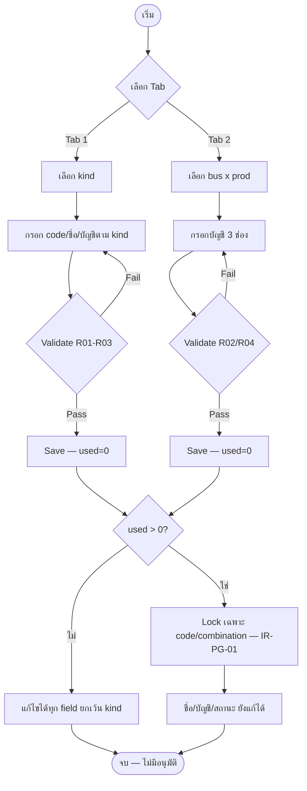
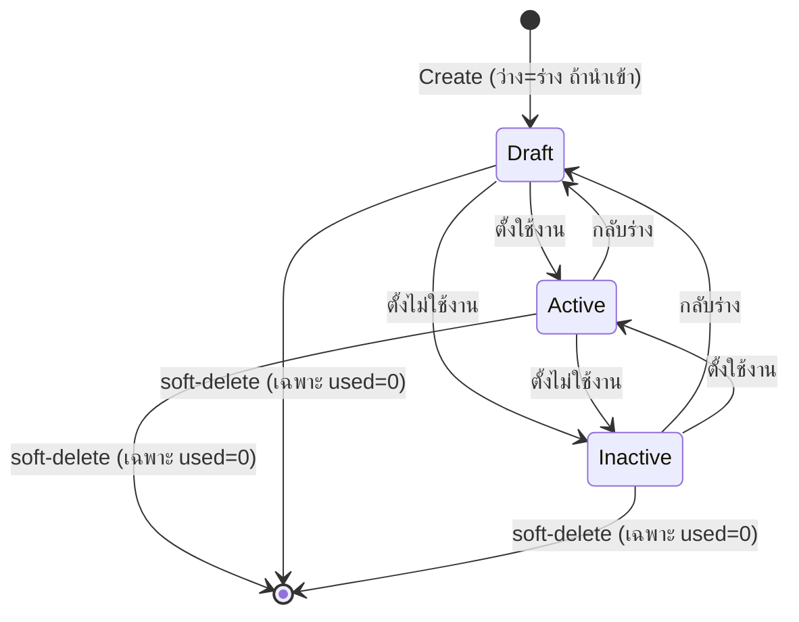

# BRD: GL Posting Group (กลุ่มการบันทึกบัญชีแยกประเภท)

| Field | Value |
|---|---|
| BRD ID | BRD-FIN-019 |
| Feature Name | GL Posting Group — Specific Posting Groups + General Posting Setup |
| Feature Code | F-PG (F-0.19, Finance Foundation) · รหัสเดิม F-GL-POSTING-001 |
| BRD Type | New Feature |
| Version | 1.0 |
| Status | ✅ APPROVED (2026-08-10 — ดู §Quality Gate) |
| Module | Finance / GL Foundation |
| Owner | BA (Strike) |
| Stakeholders | Finance Lead, Accounting Officer, FRD/Dev team, Strike (product) |
| Created Date | 2026-08-10 |
| Last Updated | 2026-08-10 |

## Changelog
- v1.0 (2026-08-10): สร้าง BRD ผ่าน `brd-generator-full` — Fresh Mode, HTML-first, Reverse Mode (PREBRIEF ใช้แทน RIF, HTML v8 as-built ที่ผ่าน UX gate + Coverage gate เป็น Screen Inventory source of truth)

---

## Document Source Note (สำคัญ — อ่านก่อน)

เอกสารนี้สร้างในโหมด **Reverse/Fresh ผสม**: ไม่มี RIF v2.1 มาตรฐาน — ใช้ `PREBRIEF_F-PG_GL-Posting-Group.md` เป็น RIF-equivalent (เขียนจาก HTML as-built ที่ผ่านทั้ง UX gate และ Coverage gate แล้ว 100%) ร่วมกับ `FUNCTION_CHECKLIST_F-PG_GL-Posting-Group.md` และ `f-postgrp.html` เอง เป็น 3 แหล่งหลัก — ไม่มี System Module Registry และไม่มี REQ_PHILO สำหรับโปรเจกต์นี้ → ใช้ fallback defaults ตาม skill (ระบุจุดที่ใช้ default ไว้ชัดเจนทุกที่)

**สำคัญ:** ฟีเจอร์นี้ **ไม่ post บัญชีเอง** — เป็นเพียง "สมุดแปลเอกสารธุรกิจ → เลขบัญชี" (mapping/translation layer) ตั้งค่าครั้งเดียว แล้วให้ GL/Journal Engine (นอก scope) เป็นผู้ resolve และ post จริงตอนเอกสารถูกบันทึก (BR-08)

---

## Section 1: Document Info

(ดูตารางด้านบน)

---

## Section 2: Business Context

### 2.1 ปัญหา / โอกาส

ปัจจุบันเอกสารธุรกิจ (ใบสั่งซื้อ ใบรับสินค้า ใบแจ้งหนี้ AP/AR ใบรับ-จ่ายเงิน) ต้องมีคนเลือกบัญชีแยกประเภท (GL Account) ที่จะลงบัญชีเองในแต่ละครั้ง หรือใช้ mapping ที่ผูกติดกับโค้ดแบบตายตัว (hardcode) ทำให้:
- เสี่ยงเลือกบัญชีผิดประเภท (เช่น เอาบัญชีสินทรัพย์ไปลงเป็นรายได้) — กระทบความถูกต้องงบการเงินโดยไม่มีระบบช่วยกันตั้งแต่ต้นทาง
- ไม่มีจุดกลางจุดเดียวที่บัญชี/Finance ควบคุมว่า "คู่ค้าประเภทนี้" หรือ "สินค้า+ลูกค้ากลุ่มนี้" ต้องลงบัญชีไหน — แก้ทีต้องไล่แก้ทุกจุดที่ hardcode ไว้
- ไม่มี audit trail ว่ากลุ่มบัญชีไหนถูกใช้งานจริงเท่าไหร่ (used count) ก่อนจะตัดสินใจปิด/ย้าย mapping

**โอกาส:** สร้างชั้น mapping กลางครั้งเดียว (2 ตาราง: Specific Posting Group ตาม entity + General Posting Setup ตาม bus×prod) ให้ Vendor/Customer/Item/Bank master และเอกสารทุกใบอ้างอิงทางอ้อม (soft-reference) — เปลี่ยน mapping ที่จุดเดียว มีผลกับเอกสารใหม่ทันที โดยไม่กระทบเอกสารเก่า (post แล้วไม่ย้อน)

### 2.2 เป้าหมายทาง Business

- เป้าหมายที่ 1: ลดความเสี่ยง GL misclassification จากการเลือกบัญชีผิดประเภทที่หน้าเอกสาร — บังคับ validate ประเภทบัญชีตรงกับ control account type ทุกครั้ง (R01/R02)
- เป้าหมายที่ 2: ให้ Finance ควบคุม mapping จากจุดเดียว (single source of truth) — เปลี่ยนบัญชีปลายทางได้โดยไม่ต้องแก้ทุกเอกสาร/ทุก config ที่กระจายอยู่
- เป้าหมายที่ 3: เตรียมโครงสร้างให้ Item Master / Vendor / Customer / Bank Master ผูก mapping ได้ทันทีที่ master แต่ละตัวพร้อม (contract ประกาศไว้แล้วผ่าน 2 GET endpoints ให้ Item Master)

### 2.3 ตัวชี้วัดความสำเร็จ (Success Metrics) — บังคับวัดได้

| Metric | Baseline ปัจจุบัน | Target | วัดยังไง/จากไหน | วัดเมื่อไหร่ |
|---|---|---|---|---|
| GL Resolve Success Rate (% journal lines ที่ resolve บัญชีสำเร็จผ่าน mapping นี้ตอน post) | N/A — ต้องเก็บ baseline ก่อน launch (ยังไม่มี GL engine เชื่อมจริง ณ วันที่เขียน BRD) | ≥ 99% | GL/Journal engine resolve log (นับ success/total resolve attempt ที่อ้าง posting group/setup นี้) | 30 วันหลัง go-live ของเอกสารกลุ่มแรกที่ใช้ mapping นี้ |
| จำนวน Audit Finding ที่เกี่ยวกับ posting mapping ผิด (GL misclassification จากกลุ่มนี้) | N/A — ต้องเก็บ baseline ก่อน launch (ยังไม่มีระบบนี้ให้ audit) | 0 findings/ไตรมาส | รายงาน internal audit / รายงานปิดงวดบัญชี | ทุกไตรมาสหลัง launch |
| เวลาเฉลี่ยตั้งค่า 1 Posting Group/Setup record (drawer เปิด → save สำเร็จ) | N/A — ต้องเก็บ baseline ที่ UAT | ≤ 5 นาที/record | Timestamp เปิด drawer → submit สำเร็จ (UI event log) | ที่ UAT และซ้ำอีกครั้งหลัง launch 30 วัน |

> ทุกตัวชี้วัดมีคู่ใน §17.3 KPI (ดู KPI #1-3)

### 2.4 ที่มาของ Requirement

- เคสที่เกิด: Sales lane F-0.19 — feature พี่น้องของ Tax Code (0.16) และ COA (F-COA-001) ในกลุ่ม Finance Foundation ที่ต้องพร้อมก่อน Item Master / Vendor / Customer / Bank Master จะ go-live เพราะ contract ประกาศไว้แล้ว (VD-PDM-15, OB-2)
- Request จาก: มติเลนวันที่ 2026-08-09 (rebrand CI + สรุปกฎ IR-PG-01) + FRD pack เดิม v5.1 (stale — ต้อง regenerate, OQ-PG-05)
- KPI Gap: ยังไม่มีระบบ mapping กลาง ต้องสร้างใหม่ทั้งหมด (ไม่ใช่ enhancement)

---

## Section 3: Scope

### 3.1 In Scope

- **Tab 1 · Specific Posting Groups**: CRUD + สถานะ (3 ค่าอิสระ) + bulk (สถานะ/ลบ) + import/export CSV — จับ entity → บัญชี control 4 ประเภท (kind): เจ้าหนี้ (AP+ภาษีซื้อ) / สินค้าคงคลัง (Inventory+Interim GR/IR) / ธนาคาร (เงินฝาก) / ลูกหนี้ (AR+ภาษีขาย)
- **Tab 2 · General Posting Setup**: CRUD + สถานะ + bulk + import/export CSV — เมทริกซ์ กลุ่มธุรกิจ (bus) × กลุ่มสินค้า (prod) → บัญชีรายได้/ซื้อ/ต้นทุน (3 ช่อง)
- Validation ครบตาม R01-R07 (บัญชีต้อง COA leaf+postable+ใช้งาน+ตรงประเภท, unique code/combination, kind ล็อกหลังสร้าง, ล้างช่องบัญชีเมื่อเปลี่ยน kind ก่อนบันทึก)
- **IR-PG-01 partial lock**: `used>0` ล็อกเฉพาะ code (tab1) / combination bus×prod (tab2) — ชื่อ/บัญชี/สถานะยังแก้ได้เสมอ
- COA dropdown ทุกช่อง (ปัจจุบัน mock 16 บัญชี — placeholder รอ sync จริง, OQ-PG-02)
- CSV นำเข้า/ส่งออก **merge-only ต่อ tab** (เพิ่มอย่างเดียว, ไม่มีโหมด replace/overwrite) พร้อม preview + validate ต่อแถว
- UI pattern ตามมติเลน + v8/CI Warm Light: sticky thead (#96), responsive 768 (#97), scroll preservation (#29), Esc chain, ไม่มี hint-i/field-help
- Contract ขาออกให้ Item Master: `GET /gl/posting-groups?type=product`, `GET /gl/vat-groups` (ประกาศ contract — ค่าที่ sync จริงยังรอ OQ-PG-04)

### 3.2 Out of Scope

- โหมดนำเข้า Replace / merge-overwrite — **ห้ามมีเด็ดขาด** (มติ 2026-08-09, ตอบ R08)
- เปลี่ยนประเภทกลุ่ม (kind) หลังสร้าง — ล็อกตลอดไป (R05)
- ปุ่มลบรายตัว (single-row delete) / ลบตัวที่มี posting ผ่านแล้ว (`used>0`) / archive-reactivate แบบเดี่ยว — R06 + pattern เลน
- เปลี่ยนรหัสกลุ่ม/combination ของตัวที่ `used>0` — IR-PG-01 (ล็อกเฉพาะ 2 field นี้)
- **VAT Posting Setup ต่อรหัสภาษี (tab 3)** — ยังไม่ทำ รอเคาะ **OQ-PG-01**
- **UI จัดการค่ากลุ่มธุรกิจ/กลุ่มสินค้า** (business/product group master) — รอเคาะ **OQ-PG-04** (R09 DYNAMIC)
- การ post บัญชีจริง — GL/Journal Engine ทำ (BR-08, นอก scope ของฟีเจอร์นี้โดยหลักการ)
- สายอนุมัติ (approval chain) / DOA — ไม่มีในฟีเจอร์นี้ (OB-5, placeholder null 4 fields)
- hint-i / field-help / ph-sub — ตัดตามมติเลน
- Customer/Vendor/Bank Master UI ที่ให้เลือก posting group — ยังไม่มี master เหล่านี้สร้างจริง (edge ประกาศไว้ล่วงหน้าเท่านั้น)
- COA sync จริง (ยัง mock 16 บัญชี) และ `used` sync จริงจาก journal count (ยัง mock) — pending OQ-PG-02, OQ-PG-03

### 3.3 Assumptions

- COA (F-COA-001) มีอยู่แล้วและจะเปิด API ให้ sync บัญชี leaf+postable+ใช้งานได้ก่อนวันที่ระบบนี้ไป production จริง (ปัจจุบันยัง mock)
- Item Master (F-PDM) ยึด contract ที่ประกาศไว้ (2 GET endpoints) แม้ค่าชุด prod group ของทั้งสองฝั่งยังไม่ตรงกัน (OQ-PG-04 ต้องเคาะก่อน sync จริง)
- Finance Lead/Accounting Officer มีอำนาจแก้ mapping ได้เองโดยไม่ต้องผ่านอนุมัติ ตามมติที่ยืนยันแล้วว่าไม่มีสายอนุมัติสำหรับฟีเจอร์นี้ (OB-5)
- มาตรฐานการจัดประเภทบัญชี (AP=หนี้สิน, AR/สินค้า/ธนาคาร/ภาษีซื้อ=สินทรัพย์, ภาษีขาย=หนี้สิน, sales=รายได้, COGS/purchase=ค่าใช้จ่าย) เป็นไปตามมาตรฐานบัญชีที่องค์กรใช้ ไม่มีข้อยกเว้นราย entity

### 3.4 Scope Lock ⭐

- **Scope Lock Ref:** N/A — ไม่มีใบเซ็นยินยอม/SCOPE_CONFIRM แบบฟอร์มมาตรฐานสำหรับฟีเจอร์นี้ (standalone/pipeline lane) — สิ่งที่ทำหน้าที่แทนคือ **มติที่บันทึกใน PREBRIEF §0 Obligations + §10 OQ register** (ระบุ "มติ 2026-08-09" / "มติเลน" เป็นแหล่งอ้าง) ถือเป็น Locked Decisions ระดับ pseudo-scope-lock ของ lane นี้

| LOCK-ID | ข้อยืนยัน | อ้างเอกสาร+ข้อ |
|---|---|---|
| LOCK-01 | IR-PG-01 partial lock: `used>0` ล็อกเฉพาะ code (tab1) / combination (tab2) เท่านั้น — ชื่อ/บัญชี/สถานะแก้ได้เสมอ | PREBRIEF §0 OB-8, §4 BR-05 — มติ 2026-08-09 |
| LOCK-02 | kind ล็อกหลังสร้างเสมอ (R05) — ไม่ขึ้นกับ `used` | FRD pack เดิม R05 (สืบทอด, FIXED ห้ามฝืน — PREBRIEF OB-1) |
| LOCK-03 | โหมดนำเข้า = merge-only เพิ่มอย่างเดียว — ห้ามมีโหมด Replace/merge-overwrite | มติ 2026-08-09 (ตอบ R08) — PREBRIEF §2 S-10① |
| LOCK-04 | สถานะ 3 ค่าอิสระ ทุกทิศ ทั้ง 2 tab — ไม่มีสายอนุมัติ | มติเลน (OB-6) + OB-5 |
| LOCK-05 | ฟีเจอร์นี้ไม่ post บัญชีเอง — GL/Journal Engine เป็นผู้ post | PREBRIEF §0.2/§4 BR-08 |

- **Scope Drift:** ไม่พบ — `_COVERAGE_REPORT.md` (Iteration 2) ยืนยัน HTML ครอบ 34/34 item ตาม contract, gap block=0, gap warn=0, scope creep=0 (ตรวจแล้ว "ไม่พบ route/feature เกิน contract")
- LOCK ทั้ง 5 ข้อข้างต้นห้าม override ตลอด chain (BRD → FRD → Test) — ถ้า business rule ใดขัดกับ LOCK ให้ LOCK ชนะ

---

## Section 4: User Roles & Permissions

### 4.1 Roles ที่เกี่ยวข้อง

| Role | คำอธิบาย |
|---|---|
| Finance Lead / Accounting Officer | ผู้ตั้งค่าและดูแล mapping ทั้ง 2 tab — role หลักเพียงตัวเดียวที่เข้าถึงหน้านี้ตรง |
| Auditor / Compliance (Watcher) | ดู/export เพื่อตรวจสอบ (read-only) — ไม่มีสิทธิ์แก้ |
| System | validate, resolve GL account (ที่ document-posting time, นอก scope), audit log |
| (Consumer อนาคต — ยังไม่ built) Vendor/Customer/Item/Bank Master maintainer | จะเลือก posting group/setup ที่นี่กำหนดไว้ตอนสร้าง master ของตัวเอง (edge ประกาศล่วงหน้า) |

### 4.2 Permission Matrix

| Action | Finance Lead | Auditor (Watcher) | System |
|---|:---:|:---:|:---:|
| สร้าง Posting Group / Setup | ✅ | ❌ | — |
| แก้ไข (name/account/status) | ✅ | ❌ | — |
| แก้ไข code/combination (เมื่อ used=0) | ✅ | ❌ | — |
| แก้ไข code/combination (เมื่อ used>0) | ❌ (block+toast, IR-PG-01) | ❌ | Block + Toast |
| เปลี่ยน kind | ❌ (ล็อกหลังสร้างเสมอ) | ❌ | Block |
| เปลี่ยนสถานะ (3 ค่า, เมนู/bulk) | ✅ | ❌ | — |
| bulk ลบ | ✅ (ข้าม used>0 อัตโนมัติ) | ❌ | Skip + report |
| นำเข้า/ส่งออก CSV | ✅ | ✅ (export only) | Validate ต่อแถว |
| ดูรายการ/รายละเอียด | ✅ | ✅ | — |

---

## Section 5: User Journey (with COSO) ⭐

> **หมายเหตุ COSO:** ฟีเจอร์นี้ไม่มีสายอนุมัติ (OB-5 ยืนยันชัด — DOA placeholder 4 fields = null, NOTIF ไม่ emit) ดังนั้นคอลัมน์ **Approver = "N/A — ไม่มีสายอนุมัติ (OB-5)"** ทุก step — SoD check (Maker ≠ Approver) ผ่านโดยปริยายเพราะไม่มี Approver ให้ชนกับ Maker

### 5.1 Happy Path — สร้าง Specific Posting Group (Tab 1)

| # | Step | Maker | Checker | Approver | System | Notes |
|---|---|---|---|---|---|---|
| 1 | Finance Lead เปิดหน้า GL Posting Group | Finance Lead | — | N/A | โหลด tab 1 เป็น default, stat 4 ใบ | — |
| 2 | คลิก "เพิ่ม" (tab 1) | Finance Lead | — | N/A | เปิด Drawer form, kind picker ว่าง | — |
| 3 | เลือก kind (4 ค่า) | Finance Lead | — | N/A | Render ชุดช่องบัญชีตาม kind + filter COA dropdown ตามประเภท (R02) | เปลี่ยน kind ซ้ำก่อน submit → ล้างช่องบัญชีเดิม (R07) |
| 4 | กรอก code/ชื่อ TH(EN)/บัญชีตาม kind/สถานะ | Finance Lead | — | N/A | Validate on submit (R01-R03) | ไม่ครบ → block ชี้ช่อง + toast |
| 5 | Submit | Finance Lead | — | N/A | บันทึก record: `used=0`, DOA placeholder null×4, audit fields | ไม่มีขั้นอนุมัติ — มีผลทันที |

### 5.1b Happy Path — สร้าง General Posting Setup (Tab 2)

| # | Step | Maker | Checker | Approver | System | Notes |
|---|---|---|---|---|---|---|
| 1 | สลับไป tab 2 | Finance Lead | — | N/A | เคลียร์ selection + filter สถานะของ tab เดิม | — |
| 2 | คลิก "เพิ่ม" | Finance Lead | — | N/A | เปิด Drawer form tab 2 | — |
| 3 | เลือก bus × prod + กรอกบัญชี 3 ช่อง (sales/purchase/COGS) + สถานะ | Finance Lead | — | N/A | Validate combination unique (R04) + ประเภทบัญชี (R02) | prod ชุดค่า as-built (GOODS/SERVICE) ยังไม่ตรง Item — OQ-PG-04 |
| 4 | Submit | Finance Lead | — | N/A | บันทึก record `used=0` | — |

### 5.2 Alternative Paths

#### 5.2.1 แก้ไข record ที่ `used=0`
| # | Step | Maker | Checker | Approver | System | Notes |
|---|---|---|---|---|---|---|
| 1 | เปิด view → แก้ไข | Finance Lead | — | N/A | ทุก field แก้ได้ ยกเว้น kind | S-03 |
| 2 | Submit | Finance Lead | — | N/A | Save — เอกสารใหม่ใช้ค่าใหม่ทันที (ของเก่าไม่ย้อน) | §7 Data behaviour |

#### 5.2.2 แก้ไข record ที่ `used>0` (IR-PG-01 — S-04)
| # | Step | Maker | Checker | Approver | System | Notes |
|---|---|---|---|---|---|---|
| 1 | เปิด view/edit ของ record `used>0` | Finance Lead | — | N/A | แสดง `.lock-tag` ล่วงหน้าบน code(tab1)/bus·prod(tab2) | UX gate ยืนยันแล้ว (GAP-03 closed) |
| 2 | พยายามเปลี่ยน code/combination | Finance Lead | — | N/A | **Block + toast** บอกเหตุ (IR-PG-01) | field เปลี่ยนไม่ได้จริง |
| 3 | เปลี่ยนชื่อ/บัญชี/สถานะแทน | Finance Lead | — | N/A | Save สำเร็จ — มีผลเฉพาะ posting ใหม่ (posting เก่าไม่ย้อน) | เจตนา: เปลี่ยนบัญชีปลายทางไปข้างหน้าได้ |

#### 5.2.3 เปลี่ยนสถานะอิสระ (S-06)
| # | Step | Maker | Checker | Approver | System | Notes |
|---|---|---|---|---|---|---|
| 1 | เมนู view หรือ bulk bar เลือกสถานะใหม่ (3 ค่า) | Finance Lead | — | N/A | เปลี่ยนทันที ทุกทิศ ไม่มีอนุมัติ | BR-06 |
| 2 | — | — | — | N/A | ถ้าไม่ "ใช้งาน" → entity picker/GL resolve มองไม่เห็น record นี้อีก | ตั้งใจ — เอกสารใหม่ error ที่ GL |

#### 5.2.4 Bulk ลบ (S-07)
| # | Step | Maker | Checker | Approver | System | Notes |
|---|---|---|---|---|---|---|
| 1 | เลือกหลายแถว → bulk ลบ | Finance Lead | — | N/A | Confirm modal แจ้งยอดที่จะลบ/ยอดข้าม | — |
| 2 | ยืนยัน | Finance Lead | — | N/A | ลบ record `used=0` เท่านั้น (soft-delete, R06) — ข้าม `used>0` อัตโนมัติ | ไม่มีปุ่มลบรายตัว |

#### 5.2.5 นำเข้า CSV per-tab (S-08)
| # | Step | Maker | Checker | Approver | System | Notes |
|---|---|---|---|---|---|---|
| 1 | เปิด modal นำเข้า (ของ tab ที่เปิดอยู่) | Finance Lead | — | N/A | จอแรก = upload-box + ปุ่ม template เท่านั้น (ไม่มีเลือกโหมด) | FN-16 |
| 2 | Upload ไฟล์ | Finance Lead | — | N/A | Preview + validate ต่อแถว (REQUIRED/BAD_KIND/CODE_DUPLICATE/combination ซ้ำ/บัญชีไม่มีใน COA/BAD_STATUS) | FN-17 |
| 3 | ยืนยันนำเข้า | Finance Lead | — | N/A | Merge-only: เพิ่ม record ใหม่, ทะเบียนเดิมไม่ถูกแตะ, สถานะตามไฟล์ (ว่าง=ร่าง), DOA null, used=0 | FN-18 |
| 4 | — | — | — | N/A | หน้าสรุปผล: ยอดนำเข้า/ข้าม + ตารางแถวข้าม | FN-19 |

#### 5.2.6 ส่งออก CSV (S-09)
| # | Step | Maker | Checker | Approver | System | Notes |
|---|---|---|---|---|---|---|
| 1 | คลิกส่งออก (tab ที่เปิดอยู่, ตาม filter) | Finance Lead / Auditor | — | N/A | Export คอลัมน์เดียวกับ template (roundtrip), สถานะไทย, BOM | FN-20 |

**SoD Check:** ไม่มี Approver ในทุก step (OB-5) → ไม่มีความขัดแย้ง Maker=Approver ที่จะ fail — **PE02 ผ่านโดยปริยาย**

### 5.3 Process Diagram (Mermaid)



---

## Section 6: Data Entity & Fields

### 6.1 Entity Overview

| Entity | Type | Description |
|---|---|---|
| GL_Posting_Group | Master/Config | Tab 1 — mapping entity→บัญชี control ตาม 4 kind |
| GL_Posting_Setup | Master/Config | Tab 2 — mapping bus×prod→บัญชีรายได้/ซื้อ/ต้นทุน |

### 6.2 Entity: GL_Posting_Group (Tab 1)

| # | Field | Label UI | Input Type | ค่า/ตัวเลือก | จำเป็น | เงื่อนไข | หมายเหตุ |
|---|---|---|---|---|:---:|---|---|
| 1 | group_id | (internal) | AUTO | PK | ✅ | — | — |
| 2 | code | รหัสกลุ่ม | TEXT | uppercase ตอนนำเข้า | ✅ | Unique (R03) | 🔒 locked เมื่อ `used>0` (IR-PG-01) |
| 3 | kind | ประเภทกลุ่ม | DROPDOWN-SINGLE | เจ้าหนี้ / สินค้าคงคลัง / ธนาคาร / ลูกหนี้ | ✅ | เปลี่ยนก่อนบันทึก → ล้างช่องบัญชี (R07) | 🔒 locked **เสมอ**หลังสร้าง (R05 — ไม่ขึ้นกับ used) |
| 4 | name_th | ชื่อ (TH) | TEXT | — | ✅ | — | แก้ได้เสมอ |
| 5 | name_en | ชื่อ (EN) | TEXT | — | — | — | แก้ได้เสมอ |
| 6 | account_1 | บัญชีหลักตาม kind (AP/Inventory/เงินฝาก/AR) | LOOKUP (COA) | leaf+postable+ใช้งาน, ตรงประเภท (R01/R02) | ✅ | ค้นหาแบบ sdd | แก้ได้เสมอแม้ `used>0` (เจตนา S-04) |
| 7 | account_2 | บัญชีรอง (ภาษีซื้อ/Interim GR-IR/ภาษีขาย) | LOOKUP (COA) | เหมือน account_1 | ✅ เมื่อ kind=AP/Inventory/AR · N/A เมื่อ kind=ธนาคาร | ตรงประเภท (R02) | แก้ได้เสมอแม้ `used>0` |
| 8 | status | สถานะ | DROPDOWN-SINGLE | ร่าง / ใช้งาน / ไม่ใช้งาน | — | อิสระ 3 ค่า ทุกทิศ (BR-06) | ไม่มี default บังคับ — นำเข้า: ว่าง=ร่าง (BR-07) |
| 9 | used | จำนวนใช้งาน | NUMBER | AUTO | ✅ | mock ปัจจุบัน — journal count จริง รอ **OQ-PG-03** | Read-only, ตัด lock IR-PG-01 |
| 10 | doa_field_1..4 | (placeholder DOA) | AUTO | null ×4 | — | ไม่มีสายอนุมัติ (OB-5) | Read-only, always null |
| 11 | created_by / created_date / modified_by / modified_date | ผู้สร้าง/วันที่/ผู้แก้/วันที่แก้ | AUTO | session.user / now() | ✅ | — | Audit fields มาตรฐาน |

### 6.3 Entity: GL_Posting_Setup (Tab 2)

| # | Field | Label UI | Input Type | ค่า/ตัวเลือก | จำเป็น | เงื่อนไข | หมายเหตุ |
|---|---|---|---|---|:---:|---|---|
| 1 | setup_id | (internal) | AUTO | PK | ✅ | — | — |
| 2 | bus_group | กลุ่มธุรกิจ | DROPDOWN-SINGLE | DOMESTIC / FOREIGN (as-built) | ✅ | combination unique ร่วมกับ prod_group (R04) | 🔒 locked เมื่อ `used>0` (IR-PG-01) — เฉพาะคู่นี้ ไม่ล็อกทีละฟิลด์ |
| 3 | prod_group | กลุ่มสินค้า | DROPDOWN-SINGLE | GOODS / SERVICE (as-built — **gap vs Item's 6-value set**, OQ-PG-04) | ✅ | เหมือนด้านบน | 🔒 locked เมื่อ `used>0` (คู่กับ bus_group) |
| 4 | sales_account | บัญชีรายได้ | LOOKUP (COA) | ประเภทรายได้ (R02) | ✅ | ตรงประเภท | แก้ได้เสมอแม้ `used>0` |
| 5 | purchase_account | บัญชีซื้อ | LOOKUP (COA) | ประเภทค่าใช้จ่าย (R02) | ✅ | ตรงประเภท | แก้ได้เสมอแม้ `used>0` |
| 6 | cogs_account | บัญชีต้นทุน | LOOKUP (COA) | ประเภทค่าใช้จ่าย (R02) | ✅ | ตรงประเภท | แก้ได้เสมอแม้ `used>0` |
| 7 | status | สถานะ | DROPDOWN-SINGLE | ร่าง / ใช้งาน / ไม่ใช้งาน | — | อิสระ (BR-06) | เหมือน tab 1 |
| 8 | used | จำนวนใช้งาน | NUMBER | AUTO | ✅ | mock — OQ-PG-03 | Read-only |
| 9 | created_by / created_date / modified_by / modified_date | — | AUTO | — | ✅ | — | Audit fields มาตรฐาน |

### 6.4 Entity Relationship

```
COA (F-COA-001, external master) ──(soft-ref, leaf+postable+active)──▶ GL_Posting_Group.account_1 / account_2
COA (F-COA-001, external master) ──(soft-ref)──▶ GL_Posting_Setup.sales_account / purchase_account / cogs_account
GL_Posting_Group ──(referenced by code, soft-ref — future)──▶ Vendor / Customer / Item / Bank Master (ยังไม่ built)
GL_Posting_Setup ──(referenced by bus×prod, soft-ref — future)──▶ Customer/Vendor business group × Item product group
GL_Posting_Group + GL_Posting_Setup ──(resolved at post-time, ไม่มี FK จริง)──▶ GL / Journal Engine (นอก scope, BR-08)
```

> **หมายเหตุ:** ทุกความสัมพันธ์เป็น **soft-reference** (เก็บ code/combination ไว้ ไม่ใช่ FK บังคับ DB-level) ตามที่ระบุใน §7 ของ PREBRIEF — เพื่อให้แก้บัญชีปลายทางมีผลกับเอกสารใหม่โดยไม่กระทบเอกสารเก่า

---

## Section 7: User Stories & Acceptance Criteria

### Story S-01: สร้าง Specific Posting Group
**As a** Finance Lead
**I want to** สร้างกลุ่มการบันทึกบัญชีแยกประเภทใหม่ (tab 1)
**So that** entity ประเภทนั้น (คู่ค้า/สินค้า/ธนาคาร) มีชุดบัญชีปลายทางให้เลือกใช้

**Acceptance Criteria**
- **AC1**: Given Finance Lead เปิดฟอร์มสร้าง tab 1, When เลือกประเภทกลุ่ม (kind), Then ระบบเปลี่ยนชุดช่องบัญชีตาม kind ทันที
- **AC2**: Given ฟอร์มกรอกครบ (code/ชื่อ TH/บัญชีหลักตาม kind), When submit, Then ระบบบันทึก record ด้วย `used=0` + DOA placeholder null 4 fields
- **AC3**: Given เลือกบัญชีในช่องใดช่องหนึ่ง, When บัญชีนั้นไม่ตรงประเภทที่กำหนด (R02), Then ระบบไม่ให้เลือก (dropdown filter ไว้แล้ว)

### Story S-02: สร้าง General Posting Setup
**As a** Finance Lead
**I want to** สร้าง mapping กลุ่มธุรกิจ×กลุ่มสินค้าใหม่ (tab 2)
**So that** เอกสารซื้อ-ขายของ combination นั้นมีบัญชีปลายทาง 3 ช่องให้ resolve

**Acceptance Criteria**
- **AC1**: Given ฟอร์ม tab 2 เปิดอยู่, When เลือก bus×prod ที่ยังไม่มีในทะเบียน + กรอกบัญชี 3 ช่องครบ, Then ระบบบันทึกสำเร็จ
- **AC2**: Given เลือก bus×prod ที่มีอยู่แล้วในทะเบียน, When submit, Then ระบบ block ทั้ง 2 ช่อง + toast แจ้งว่าซ้ำ (R04)

### Story S-03: แก้ไข Posting Group/Setup ที่ยังไม่ถูกใช้งาน
**As a** Finance Lead
**I want to** แก้ไขข้อมูล posting group/setup ที่ `used=0`
**So that** ปรับ mapping ให้ถูกต้องก่อนมีเอกสารอ้างอิงจริง

**Acceptance Criteria**
- **AC1**: Given record `used=0`, When เปิดฟอร์มแก้ไข, Then ทุก field แก้ได้ยกเว้น kind (R05 ล็อกเสมอ)
- **AC2**: Given แก้ไขสำเร็จ, When save, Then ระบบอัปเดต modified_by/modified_date

### Story S-04: แก้ไข Posting Group/Setup ที่ถูกใช้งานแล้ว (IR-PG-01)
**As a** Finance Lead
**I want to** เปลี่ยนบัญชีปลายทางของ mapping ที่มี `used>0`
**So that** เอกสารใหม่ในอนาคตลงบัญชีที่ถูกต้อง โดยไม่กระทบเอกสารเก่าที่ post ไปแล้ว

**Acceptance Criteria**
- **AC1**: Given record `used>0`, When เปิดฟอร์มแก้ไข, Then ระบบแสดง lock-tag ล่วงหน้าบน code (tab1) หรือ bus/prod (tab2)
- **AC2**: Given record `used>0`, When พยายามเปลี่ยน code หรือ combination, Then ระบบ block + toast บอกเหตุ (IR-PG-01) และไม่บันทึก
- **AC3**: Given record `used>0`, When เปลี่ยนชื่อ/บัญชี/สถานะ (ไม่แตะ code/combination), Then ระบบบันทึกสำเร็จ

### Story S-05: Validation ข้อมูลผิด
**As a** Finance Lead
**I want to** เห็นข้อความชี้ช่องที่ผิดทันทีเมื่อกรอกข้อมูลไม่ถูกต้อง
**So that** แก้ไขได้ตรงจุดโดยไม่ต้องเดา

**Acceptance Criteria**
- **AC1**: Given code/ชื่อ/บัญชีหลักว่าง, When submit tab 1, Then ระบบ block ชี้ช่องที่ว่าง + toast
- **AC2**: Given combination bus×prod ซ้ำกับที่มีอยู่, When submit tab 2, Then ระบบ block ชี้ทั้ง 2 ช่อง + toast (R04)

### Story S-06: เปลี่ยนสถานะอิสระ
**As a** Finance Lead
**I want to** เปลี่ยนสถานะ (ร่าง/ใช้งาน/ไม่ใช้งาน) ของ record ได้ทุกทิศทาง
**So that** ควบคุมว่า record ไหน "พร้อมใช้จริง" ได้โดยไม่ต้องรออนุมัติ

**Acceptance Criteria**
- **AC1**: Given record สถานะใดก็ตาม, When เลือกสถานะใหม่จากเมนู view หรือ bulk bar, Then ระบบเปลี่ยนทันที ไม่มีขั้นอนุมัติ (BR-06)
- **AC2**: Given record ไม่ใช่สถานะ "ใช้งาน", When entity picker หรือ GL resolve พยายามอ้างถึง record นี้, Then ระบบมองไม่เห็น record นี้ (ตั้งใจ)

### Story S-07: Bulk ลบ
**As a** Finance Lead
**I want to** ลบหลาย record ที่ไม่ต้องการพร้อมกัน
**So that** เคลียร์ทะเบียนที่ผิด/ไม่ได้ใช้โดยไม่ต้องลบทีละแถว

**Acceptance Criteria**
- **AC1**: Given เลือกหลายแถวรวม record ที่ `used>0`, When ยืนยันลบ, Then ระบบลบเฉพาะ `used=0` และแจ้งยอดที่ข้าม (R06)
- **AC2**: Given ทุกแถวที่เลือกมี `used>0`, When ยืนยันลบ, Then ระบบไม่ลบอะไรเลยและแจ้งยอดข้าม = ยอดที่เลือกทั้งหมด

### Story S-08: นำเข้า CSV แบบ merge-only
**As a** Finance Lead
**I want to** นำเข้าข้อมูล posting group/setup จากไฟล์ CSV
**So that** ตั้งค่าจำนวนมากได้เร็วโดยไม่ต้องกรอกทีละแถว

**Acceptance Criteria**
- **AC1**: Given เปิด modal นำเข้าของ tab ที่กำลังเปิดอยู่, When เข้าจอแรก, Then ระบบแสดงเฉพาะ upload-box + ปุ่ม template ของ tab นั้น ไม่มีตัวเลือกโหมด
- **AC2**: Given ไฟล์ถูก upload, When ระบบ preview, Then แต่ละแถวแสดงผลตรวจ REQUIRED/BAD_KIND/CODE_DUPLICATE/combination ซ้ำ/บัญชีไม่มีใน COA/BAD_STATUS ได้ถูกต้อง
- **AC3**: Given ยืนยันนำเข้า, When ระบบประมวลผล, Then ทะเบียนเดิมไม่ถูกแตะ/ทับ — เพิ่มเฉพาะแถวที่ผ่านตรวจเท่านั้น

### Story S-09: ส่งออก CSV
**As a** Finance Lead
**I want to** ส่งออกทะเบียน posting group/setup เป็น CSV ตาม filter ที่ตั้งไว้
**So that** ใช้ตรวจสอบหรือแก้ไขนอกระบบแล้วนำเข้ากลับได้ (roundtrip)

**Acceptance Criteria**
- **AC1**: Given ตั้ง filter ไว้, When คลิกส่งออก, Then ไฟล์มีเฉพาะแถวตาม filter นั้น
- **AC2**: Given ไฟล์ถูกสร้าง, When เปิดดู, Then คอลัมน์ตรงกับ template นำเข้า (roundtrip ได้), สถานะเป็นภาษาไทย, มี BOM

---

## Section 8: Status & Lifecycle

### 8.1 State Diagram



ทั้ง 3 สถานะ (ร่าง/ใช้งาน/ไม่ใช้งาน) เปลี่ยนได้ทุกทิศทาง ทั้ง 2 tab ผ่านเมนู view / bulk bar / ฟอร์ม / ไฟล์นำเข้า — ไม่มีขั้นอนุมัติ (BR-06)

### 8.2 State Transition Table

| Current State | Trigger | Next State | COSO Role | Notes |
|---|---|---|---|---|
| (ไม่มี) | Create (ฟอร์ม) | ร่าง/ใช้งาน/ไม่ใช้งาน (เลือกได้ตั้งแต่สร้าง) | Finance Lead (Maker) | ไม่มี default บังคับที่ฟอร์ม |
| (ไม่มี) | Import CSV | ตามไฟล์ (ว่าง=ร่าง) | Finance Lead (Maker) | BR-07 |
| ร่าง / ใช้งาน / ไม่ใช้งาน | เปลี่ยนสถานะ (เมนู/bulk) | ค่าใหม่ใดก็ได้ (3 ค่า) | Finance Lead (Maker) — ไม่มี Approver | ค่าปัจจุบัน disabled ในเมนู (FN-12) |
| ใช้งาน / ร่าง / ไม่ใช้งาน (used=0) | Bulk ลบ | (ไม่มี — record ถูกลบ) | Finance Lead (Maker) | R06, ข้าม used>0 อัตโนมัติ |
| — | GL resolve ตอน post เอกสาร (นอก scope) | — | System (GL/Journal Engine) | มองเห็นเฉพาะสถานะ "ใช้งาน" (BR-06) |

---

## Section 9: Business Rules + Validation (with Tags)

### 9.1 Business Rules

| Rule ID | Rule | Tag | Type | เหตุผล Tag | ที่มา / Marker |
|---|---|:---:|---|---|---|
| BR-01/R01/R02 | บัญชีทุกช่อง ต้องเป็น COA leaf+postable+ใช้งาน และตรงประเภทควบคุมตามตาราง mapping (AP=หนี้สิน, AR/สินค้า/ธนาคาร/ภาษีซื้อ=สินทรัพย์, ภาษีขาย=หนี้สิน, sales=รายได้, COGS/purchase=ค่าใช้จ่าย) — validate ทั้งฟอร์มและไฟล์นำเข้า | FIXED | Constant mapping | มาตรฐานบัญชี ไม่เปลี่ยนตาม policy | ✅ สืบทอดจาก FRD pack (OB-1) |
| BR-02/R03 | code (tab 1) ต้อง unique | FIXED | Constraint | Business core key | ✅ สืบทอดจาก FRD pack |
| BR-02/R04 | combination bus×prod (tab 2) ต้อง unique | FIXED | Constraint | Business core key | ✅ สืบทอดจาก FRD pack |
| BR-03/R05 | kind ล็อกหลังสร้าง **เสมอ** — ไม่ขึ้นกับ `used` | FIXED | Lock rule | ตัดสินใจแล้ว ไม่มีข้อยกเว้น | ✅ สืบทอดจาก FRD pack (R05 FIXED ห้ามฝืน — OB-1) |
| BR-03/R07 | เปลี่ยน kind ก่อนบันทึก → ล้างช่องบัญชีเดิมทั้งหมด | FIXED | Business logic | ป้องกัน mismatch ประเภทบัญชีเดิมค้าง | ✅ สืบทอดจาก FRD pack |
| BR-04/R06 | ลบไม่ได้เมื่อ `used>0` — bulk ข้ามพร้อมแจ้งยอด (ใช้เปลี่ยนสถานะแทน soft-delete) | FIXED | Guard | ป้องกัน data loss กับ record ที่มี posting อ้างอิง | ✅ สืบทอดจาก FRD pack |
| **BR-05/IR-PG-01** | `used>0` ล็อก **เฉพาะ** รหัสกลุ่ม (tab1) / combination (tab2) — ชื่อ/บัญชี/สถานะยังแก้ได้ (เจตนา: เปลี่ยนบัญชีปลายทางไปข้างหน้าได้) | FIXED | Lock rule (partial) | ตัดสินใจแล้วที่มติ — ไม่ใช่ threshold ที่ต้อง config | **✅ ยืนยันแล้ว — มติ 2026-08-09** (ไม่ใช่ 🤖 AI-inferred แม้ header ต้นทาง (OB-8) เรียก "[AI-DRAFT]" — เนื้อหากติกาถูกสรุปที่มติวันเดียวกันแล้ว; ส่วนที่ยังค้าง AI-DRAFT จริงคือ **สัญญาว่า `used` = journal count จริง** ซึ่งย้ายไปรอที่ OQ-PG-03 ด้านล่าง) |
| BR-06 | สถานะ 3 ค่าอิสระ ทั้ง 2 tab ทุกทิศทาง ไม่มีอนุมัติ · GL resolve + entity picker ใช้เฉพาะ "ใช้งาน" | FIXED | State machine | ตัดสินใจแล้วที่มติเลน | ✅ มติเลน (OB-6) |
| BR-07 | นำเข้า = merge-only เพิ่มอย่างเดียว per-tab · สถานะว่าง=ร่าง | FIXED | Import policy | ตัดสินใจแล้ว ห้ามมีโหมด replace | ✅ มติ 2026-08-09 |
| BR-08 | ฟีเจอร์นี้ไม่ post บัญชีเอง — GL/Journal Engine เป็นผู้ resolve (คู่ค้า→specific group) + (bus×prod→setup) → journal lines ตอนเอกสาร post | FIXED | Architectural boundary | ตัดสินใจแล้วที่ pack ต้นทาง | ✅ §0.2 pack |
| R09 (กลุ่มธุรกิจ/กลุ่มสินค้า — ค่าที่ใช้ได้) | ชุดค่า bus/prod ปัจจุบัน as-built (DOMESTIC/FOREIGN × GOODS/SERVICE) — ต้องมี UI จัดการค่าเหล่านี้ในอนาคต และต้อง sync กับชุดค่าของ Item (6 ค่า) | **DYNAMIC** | Lookup value set | เงื่อนไข+ชุดค่าจะเปลี่ยนเมื่อเคาะ scope UI จัดการ + sync กับ Item | ✅ สืบทอดจาก FRD pack (ไม่ใช่ AI-inferred ใหม่) — **escalate แล้วที่ OQ-PG-04** |
| Tax mapping gap (ยังไม่มี rule เป็นทางการ) | GL Posting Setup ยังไม่มี tab สำหรับ map รหัสภาษี → บัญชี GL (ปัจจุบัน VAT account ผูกที่ vendor/customer group ระดับเดียว = ทุก tax code ลงบัญชีเดียว) | **WARNING** | Scope gap | ยังไม่เคาะว่าจะทำ tab 3 หรือไม่ | ⚠️ ยังไม่ resolve — **OQ-PG-01** |

### 9.2 Validation Rules

| VR ID | Field/Action | เงื่อนไข | ประเภท | ข้อความ |
|---|---|---|---|---|
| VR01 | code (tab1) | required + unique (R03) | Error | กรุณากรอกรหัสกลุ่ม / รหัสนี้ถูกใช้แล้ว |
| VR02 | name_th | required | Error | กรุณากรอกชื่อ (TH) |
| VR03 | account_1/account_2 ตาม kind | required + ต้องเป็น COA leaf/postable/ใช้งาน + ตรงประเภท (R01/R02) | Error | กรุณาเลือกบัญชี / บัญชีนี้ไม่ตรงประเภทที่กำหนด |
| VR04 | kind (edit mode) | read-only เสมอ | Prevent | ประเภทกลุ่มแก้ไม่ได้หลังสร้าง |
| VR05 | code / combination (edit, `used>0`) | read-only ถ้า `used>0` | Prevent + Toast | กลุ่มนี้มีการบันทึกบัญชีแล้ว — แก้รหัส/คู่ค่าไม่ได้ (IR-PG-01) |
| VR06 | bus × prod (tab2) | combination unique (R04) | Error | คู่ค่านี้มีอยู่ในทะเบียนแล้ว |
| VR07 | sales_account/purchase_account/cogs_account | required ทั้ง 3 ช่อง + ตรงประเภท | Error | กรุณากรอกให้ครบ / บัญชีไม่ตรงประเภท |
| VR08 | CSV row import | REQUIRED / BAD_KIND / CODE_DUPLICATE / combination ซ้ำ / บัญชีไม่มีใน COA / BAD_STATUS | Error (skip แถว) | ตามรหัสเหตุ พร้อม hover เห็นรายละเอียด |
| VR09 | onKindChange (ก่อนบันทึก) | ล้างช่องบัญชีเดิมทั้งหมดเมื่อเปลี่ยน kind (R07) | Trigger | (auto, ไม่มีข้อความ) |

### Tag Review Report

```
✅ BR-01/R01/R02: FIXED — ถูกต้อง (มาตรฐานบัญชี ไม่มีเหตุให้ปรับตาม policy)
✅ BR-02/R03,R04: FIXED — ถูกต้อง (unique constraint เป็น core logic)
✅ BR-03/R05: FIXED — ถูกต้อง (ตัดสินใจแล้วไม่มีข้อยกเว้น)
✅ BR-04/R06: FIXED — ถูกต้อง (guard ป้องกัน data loss)
✅ BR-05/IR-PG-01: FIXED — ยืนยันด้วยมติ 2026-08-09 (ไม่ใช่ CONFIGURABLE เพราะไม่มีค่าตัวเลขให้ config)
✅ BR-06,07,08: FIXED — ตัดสินใจแล้วที่มติ
⚠️ R09 (bus/prod value set): DYNAMIC — ถูกต้องแล้ว (มีทั้งเงื่อนไข sync + ชุดค่าที่จะเปลี่ยน) — escalate ที่ OQ-PG-04 ครบแล้ว
✅ Tax mapping gap: WARNING — ถูกต้อง และมีแผนวันที่เคาะแล้ว (ก่อนเริ่ม frd-generator-v6, ดู §15 OQ-PG-01 + Quality Gate C18)
```

---

## Section 9.5: สรุประดับความยืดหยุ่น

| Rule ID | Tag | ใครเปลี่ยน | บ่อยแค่ไหน | ระดับ | เหตุผล | Marker |
|---|:---:|---|---|---|---|:---:|
| BR-01/R01/R02 | FIXED | — | ไม่เปลี่ยน | — | Business core (มาตรฐานบัญชี) | ✅ |
| BR-02/R03,R04 | FIXED | — | ไม่เปลี่ยน | — | Constraint core | ✅ |
| BR-03/R05,R07 | FIXED | — | ไม่เปลี่ยน | — | ตัดสินใจแล้ว ไม่มีข้อยกเว้น | ✅ |
| BR-04/R06 | FIXED | — | ไม่เปลี่ยน | — | Guard ป้องกัน data loss | ✅ |
| BR-05/IR-PG-01 | FIXED | — | ไม่เปลี่ยน | — | ยืนยันมติ 2026-08-09 | ✅ |
| BR-06,07,08 | FIXED | — | ไม่เปลี่ยน | — | มติเลน/pack | ✅ |
| R09 (bus/prod values) | DYNAMIC | Finance/Business Owner (คาดการณ์ — ยังไม่เคาะ UI) | เป็นระยะ (คาดการณ์ — เมื่อมี business group/product line ใหม่) | **Admin Panel** (lookup value management — ไม่ใช่ Rule Engine เพราะเป็นแค่ชุดค่า ไม่มี logic ซับซ้อน) | ชุดค่า + เงื่อนไข sync กับ Item จะเปลี่ยน | ✅ (สืบทอดจาก pack) |
| Tax mapping gap (ยังไม่มี rule) | WARNING | — | — | — | ยังไม่ตัดสินใจว่าจะทำ tab 3 หรือ field ที่ Tax master หรือคงเดิม | ⚠️ |

### Pending (WARNING)

| Rule ID | ประเด็น | หารือกับ | กำหนดวันที่ | Phase |
|---|---|---|---|:---:|
| Tax mapping gap | OQ-PG-01: เลือก A (field ที่ Tax master) / B (tab 3 VAT Posting Setup — แนะนำ) / C (คงเดิม) | Strike (product owner) | **⚠️ ยังไม่ระบุ — ต้องกำหนดก่อนเข้า Phase 2** (ดู Quality Gate C18) | Phase 2 (ถ้าเลือก B) |

> **Escalation:** ตาม C23 — rule ที่ 🤖 AI-inferred และเป็น DYNAMIC/Engine Management ต้องลง Open Questions ก่อนพัฒนา — ในที่นี้ **ไม่มี rule ใดที่เป็น 🤖 AI-inferred ใหม่** (ทุก rule สืบทอดจาก pack เดิม/มติที่มีอยู่แล้ว) ดังนั้นเงื่อนไข escalation บังคับของ C23 ไม่ชนกับ rule ใด — แต่ R09 (DYNAMIC) และ Tax gap (WARNING) ยัง escalate ไปที่ OQ-PG-04/OQ-PG-01 อยู่แล้วด้วยเหตุผลอื่น (scope gap ไม่ใช่ AI-inference)

---

## Section 10: Edge Cases

### 10.1 Edge Cases ที่ระบุจาก PREBRIEF/Function Checklist (default ☑ — BA ยืนยันแล้ว)

- ☑ E01: code ว่าง/ซ้ำ (R03) → block ชี้ช่อง + toast (S-05)
- ☑ E02: ชื่อ (TH) ว่าง → block (S-05)
- ☑ E03: บัญชีหลักตาม kind ว่าง → block (S-05)
- ☑ E04: combination bus×prod ซ้ำ (R04) → block ชี้ทั้ง 2 ช่อง (S-05)
- ☑ E05: `used>0` พยายามเปลี่ยนรหัสกลุ่ม (tab1) / combination (tab2) → block+toast (IR-PG-01, S-04)
- ☑ E06: เปลี่ยน kind ก่อนบันทึก → ล้างช่องบัญชีเดิมทั้งหมด (R07, S-01)
- ☑ E07: bulk ลบ record `used>0` → ข้าม + แจ้งยอดข้าม (R06, S-07)
- ☑ E08: import row ผิด (REQUIRED/BAD_KIND/CODE_DUPLICATE/combination ซ้ำ/บัญชีไม่มีใน COA/BAD_STATUS) → skip แถวพร้อมเหตุ hover ดูได้ (S-08)
- ☑ E09: import สถานะว่าง → default = ร่าง (BR-07, S-08)
- ☑ E10: สลับ tab → เคลียร์ selection + filter สถานะของ tab ที่ออก (OB-6)

### 10.2 Edge Cases จาก AI Pattern Matching (default ☐ — ต้อง BA confirm ที่ SOW3.7)

#### DI (Data Integrity / Lookup Master Data) — trigger: FK ไปยัง COA
- ☐ DI-01: บัญชี COA ที่ผูกไว้ในกลุ่มถูกเปลี่ยนสถานะเป็น "ไม่ใช้งาน" ที่ฝั่ง COA ระหว่างที่ posting group ยังอ้างอิงอยู่ → group เก่ายังเก็บ code บัญชีเดิมไว้ (ไม่มีการเตือนอัตโนมัติ) แต่ dropdown ใหม่จะกรองไม่ให้เลือกบัญชีนั้นซ้ำ — ต้องมี indicator เตือน Finance Lead หรือไม่?
- ☐ DI-02: บัญชี COA ที่ผูกไว้ถูกลบจาก COA (ถ้า COA อนุญาตลบ) ขณะที่ posting group ยังอ้างถึง → ควร restrict การลบที่ฝั่ง COA หรือ snapshot ชื่อ/เลขบัญชีไว้ที่ posting group
- ☐ DI-03: บัญชี COA เปลี่ยนชื่อ (ไม่เปลี่ยนเลข) → posting group ควรแสดงชื่อปัจจุบันของ COA เสมอ (live-lookup) หรือ snapshot ชื่อตอนผูก — ปัจจุบัน as-built ใช้ mock ยังไม่มีพฤติกรรมนี้ชัด
- ☐ DI-04: ค้นหาบัญชีใน sdd (search dropdown) ไม่พบเพราะพิมพ์ผิด/บัญชีถูกกรองออกเพราะไม่ตรงประเภท → ควรมีข้อความอธิบายเหตุที่กรองออกหรือไม่ (เช่น "พบบัญชีนี้แต่ไม่ตรงประเภทที่ต้องใช้")

#### CA (Concurrent Access) — trigger: หลาย user แก้ record เดียวกัน
- ☐ CA-01: Finance Lead 2 คน (หรือ 2 session) เปิดแก้ไข posting group เดียวกันพร้อมกัน แล้ว save พร้อมกัน → ควรมี optimistic lock/version field เพื่อกันข้อมูลทับกัน
- ☐ CA-07: 2 session สร้าง code เดียวกันพร้อมกัน (race condition ก่อนที่ unique constraint จะ trigger) → ต้องมี DB-level unique constraint ไม่ใช่แค่ client-side check

#### ST (Status/Workflow) — trigger: state machine 3 ค่า
- ☐ ST-02: เปลี่ยนสถานะจาก "ใช้งาน" กลับเป็น "ร่าง" (revert) ของ record ที่มี `used>0` มาก (เช่น used=203) → ควร log เหตุผล (audit) แม้ไม่มีอนุมัติหรือไม่
- ☐ ST-04: ตั้งสถานะ "ไม่ใช้งาน" ให้ record ที่ `used` สูงมาก โดยไม่มี warning เพิ่มเติมก่อน confirm (ปัจจุบันอิสระทุกทิศตาม BR-06) — ควรมี soft-warning เพิ่ม (ไม่ใช่ block) ก่อนยืนยันหรือไม่ เพื่อลดความเสี่ยง GL resolve พังกลางทาง

#### PM (Permission) — trigger: Section 4 Role-based access
- ☐ PM-03: user ที่ไม่มีสิทธิ์ Finance เรียก API ตรง (ไม่ผ่าน UI) → ต้อง 403 + log
- ☐ PM-04: (ถ้าระบบ multi-company/multi-branch ในอนาคต) user เข้าถึง posting group ของบริษัท/สาขาอื่น → ต้อง block — ปัจจุบัน as-built ยังไม่มี company/branch scoping ชัดเจน

#### FU (File Upload) — trigger: import CSV
- ☐ FU-01: ไฟล์ CSV ใหญ่เกิน limit → block + แสดงข้อความ (ยังไม่ระบุ limit ตัวเลขใน pack ต้นทาง)
- ☐ FU-02: ไฟล์ไม่ใช่ .csv (เช่น .xlsx ถูกเปลี่ยนนามสกุล) → block + แสดง type ที่อนุญาต

### Tag Review Report (Cross-check กับ §9)

```
✅ ทุก Business Condition ใน §9.1 มี Edge Case cover ใน §10.1/10.2:
   - BR-01/R01/R02 ↔ E03, DI-01..04
   - BR-02/R03,R04 ↔ E01, E04, CA-07
   - BR-03/R05,R07 ↔ E06
   - BR-04/R06 ↔ E07
   - BR-05/IR-PG-01 ↔ E05
   - BR-06 ↔ E10, ST-02, ST-04
   - BR-07 ↔ E08, E09, FU-01, FU-02
```

---

## Section 11: Impact Analysis / Regression Scope

**N/A — New Feature** (ไม่มีของเก่าให้เทียบ — ฟีเจอร์นี้สร้างใหม่ทั้งหมด ไม่ใช่ Enhancement) — Section นี้จึงข้ามตาม Skip/Run Matrix

---

## Section 12: System Context & Cross-Module Impact ⭐

### 12.1 Value Stream & Downstream Impact ⭐

**Positioning:** ฟีเจอร์นี้อยู่ใน **Finance Foundation** value stream (VS ที่ต้องพร้อมก่อน P2P/O2C เดินได้จริง) — เป็นชั้น mapping กลางระหว่าง Chart of Accounts (ต้นทาง) กับ Master Data (Vendor/Customer/Item/Bank) และ Transaction Documents (ปลายทาง) — ก่อนหน้า: COA ต้องมีบัญชีให้เลือกก่อน · ถัดไป: Master Data ต้องผูก posting group/setup ก่อนเอกสารจะ resolve บัญชีได้

**Document Flow Chain:**
```
COA (F-COA-001, บัญชีแยกประเภท) → [GL Posting Group ← ฟีเจอร์นี้] → Vendor/Customer/Item/Bank Master (ผูก code กลุ่ม — ยังไม่ built)
   → เอกสารธุรกรรม (PO / GRN / AP Invoice / AR Invoice / Payment) → GL/Journal Engine (resolve+post, นอก scope) → งบการเงิน/รายงาน
```

**Upstream (รับจากไหน):**
| ต้นทาง | ข้อมูล/trigger ที่รับ | ถ้าต้นทางไม่มี/ผิด |
|---|---|---|
| COA (F-COA-001) | รายการบัญชี leaf+postable+ใช้งาน สำหรับ dropdown ทุกช่อง (filter ตามประเภท R02) | ปัจจุบัน mock 16 บัญชี (**OQ-PG-02**) — ถ้า COA ยังไม่เปิด API sync จริงก่อน go-live เอกสารจริง ผู้ใช้เลือกได้แค่ชุด mock ไม่ตรงทะเบียนบัญชีจริงขององค์กร |

**Downstream Impact Map (ทุกแถวตอบ "แล้วไงต่อ"):**

| ปลายทาง | ข้อมูลที่ไหลไป | Trigger (สถานะไหน) | ถ้า record นี้ถูกแก้/ยกเลิกกลางทาง |
|---|---|---|---|
| Vendor / Customer / Bank Master (อนาคต — ยังไม่ built) | soft-ref `code` ของ Specific Posting Group | Master เลือกกลุ่มตอนสร้าง (feature ยังไม่มี ณ วันนี้) | ถ้ากลุ่มถูกตั้ง "ไม่ใช้งาน" → master ใหม่เลือกกลุ่มนี้ไม่ได้อีก (แต่ master เก่าที่ผูกไว้แล้วยัง reference code เดิม — GL resolve จะหาไม่เจอตอน post เอกสารใหม่ = error ที่ GL โดยตั้งใจ) |
| Item Master (F-PDM) | `กลุ่มบัญชีสินค้า` (6 ค่า) + `กลุ่มภาษี` ผ่าน `GET /gl/posting-groups?type=product` + `GET /gl/vat-groups` | Item create/edit เลือกกลุ่ม | ถ้าค่าชุด prod ของ matrix (GOODS/SERVICE) ไม่ sync กับ Item (6 ค่า) — **OQ-PG-04 ยังไม่เคาะ** — Item จะเลือกกลุ่มที่ไม่ตรงกับ combination จริงใน matrix → GL resolve หา combination ไม่เจอตอน post |
| GL / Journal Engine (นอก scope) | resolve บัญชีปลายทาง: (คู่ค้า→specific group) + (bus×prod→setup) → journal lines | เอกสาร submit/post (AP/AR Invoice, GRN, Payment) | ① แก้บัญชีในกลุ่ม/setup (ที่ `used>0` ยังแก้ได้) → เอกสารใหม่ใช้บัญชีใหม่ทันที เอกสารเก่าไม่ย้อน (ตาม §7 data behaviour) ② record ถูกตั้ง "ไม่ใช้งาน" → เอกสารใหม่ resolve ไม่เจอ = error ที่ GL (ตั้งใจ, BR-06) |
| Tax Code (0.16) | — (ยังไม่ไหล — gap) | — | **OQ-PG-01 ยังไม่เคาะ** — ปัจจุบันทุก tax code ลงบัญชีเดียวกันที่ระดับ vendor/customer group เท่านั้น ไม่มี mapping ระดับรหัสภาษี |

**ผลกระทบแนวขวาง:**
- **บัญชี/GL/งบการเงิน:** สำคัญที่สุด — mapping ผิดในกลุ่มนี้ทำให้เอกสารใหม่ post ผิดบัญชีทันที โดยไม่มี 3-way matching หรือขั้นอนุมัติมาช่วยจับ (OB-5 ไม่มีสายอนุมัติ) → ความเสี่ยง silent misstatement สูง ต้องพึ่ง validation ที่หน้าฟอร์ม (R01/R02) เป็นเกราะป้องกันเดียว
- **สต๊อก:** ไม่กระทบตรง — mapping ของบัญชี Inventory/Interim GR-IR เป็นแค่บัญชีปลายทาง ไม่กระทบปริมาณ stock
- **รายงานที่ต้องเห็นข้อมูลนี้:** รายงานปิดงวด (GL trial balance), รายงาน audit trail ของ mapping (ดู §18)

### 12.2 Module & External Dependencies

- **Module (internal):** COA (F-COA-001) — บัญชีทุกช่อง; Item Master (F-PDM) — contract 2 GET endpoints
- **External / Future (ยังไม่ built):** Vendor Master, Customer Master, Bank Master — ต้องเลือก posting group ที่ตั้งไว้นี่ (edge ประกาศล่วงหน้า)
- **Downstream (out of scope, consumer):** GL / Journal Engine — resolve บัญชีตอน post เอกสาร (BR-08)
- **Gap (ยังไม่เชื่อม):** Tax Code (0.16) — ไม่มี mapping รหัสภาษี→บัญชี (OQ-PG-01)

### 12.3 Existing System Reference

> ⚠️ **ไม่มี System Module Registry สำหรับโปรเจกต์นี้** — Section นี้ทำแบบ "ไม่ระบุ — ขอ Registry ภายหลัง" ตาม fallback rule ของ skill (C16 = ⚠️ informational ไม่ block)

| Rule/Component | ระดับ | มีอยู่แล้ว? | Reference |
|---|---|:---:|---|
| BR-01/R01/R02 (COA filter ตามประเภท) | Integration (ไม่ใช่ config) | ⚠️ ไม่ทราบ — ไม่มี Registry | คาดว่า reuse COA API (F-COA-001) เมื่อพร้อมจริง — ปัจจุบัน mock (OQ-PG-02) |
| Import/Export CSV per-tab component (upload-box→preview→done, merge-only) | Shared component (มติเลน) | ✅ (pattern เดียวกับ Tax/COA — VD-PDM) | Component มาตรฐานเลนที่ใช้ร่วมกันหลายฟีเจอร์แล้ว |
| R09 — UI จัดการค่ากลุ่มธุรกิจ/กลุ่มสินค้า | Admin Panel — **decided 2026-08-10: ใช้ชุดค่า Item Master (6 ค่า) แทน GOODS/SERVICE** | ❌ ยังไม่มี | ต้องสร้างใหม่ — **OQ-PG-04 ปิดแล้ว (decision-only), build = Phase 2** |
| Tax mapping (VAT Posting Setup tab 3) | **decided 2026-08-10: Option B — เพิ่ม tab 3 "VAT Posting Setup" (มาตรฐาน BC)** | ❌ ยังไม่มี | **OQ-PG-01 ปิดแล้ว (decision-only), build = Phase 2** |
| `used` real sync จาก journal count | Backend job/query | ❌ ยังไม่มี (mock) | pending **OQ-PG-03** |

---

## Section 13: Delivery Phases

### Phase 1: Feature Launch (scope ของ BRD นี้)
**สิ่งที่ต้องทำ:**
- สร้าง `GL_Posting_Group` + `GL_Posting_Setup` entity พร้อม Audit Fields + DOA placeholder (null×4)
- State Machine 3 สถานะอิสระ (ทั้ง 2 entity) — ไม่มี Rule Table เพราะ BR-06 เป็น FIXED ไม่ใช่ config
- Validation engine ตาม BR-01,02,03,04,05,06,07 (ทั้งหมด FIXED — hardcode logic ได้ตรง แต่ **ห้าม hardcode ชุดค่า COA/mock accounts แบบถาวร** เพราะจะต้อง swap เป็น API จริงที่ Phase ถัดไป)
- CSV import (merge-only)/export per-tab ตาม component มาตรฐานเลน
- Mock COA integration (16 บัญชี hardcode) เป็น stand-in ชัดเจนว่าเป็น placeholder — ต้อง design ให้ swap เป็น real API ได้ง่ายที่สุด (OQ-PG-02)
- Mock `used` counter (static ในทะเบียน) เป็น placeholder รอ journal sync จริง (OQ-PG-03)

**Reuse ของเดิม:**
- Import/Export CSV component มาตรฐานเลน (ใช้ร่วมกับ Tax/COA แล้ว — ไม่ต้องสร้างใหม่)
- Drawer/Modal/Esc-chain pattern จาก v8 CI Warm Light (มีอยู่แล้วในเลน)

### Phase 2: Admin Panel / Scope Extension (decision ปิดแล้ว 2026-08-10 — build รอบถัดไปของเลน)
- **OQ-PG-04 decided:** เปลี่ยนแกน `prod_group` ของ General Posting Setup จาก GOODS/SERVICE (as-built) → ชุดค่า Item Master เต็ม 6 ค่า (FINISHED/RAWMAT/PACKAGING/SERVICE/TRADE/EXPENSE) + สร้าง Admin Panel สำหรับ R09 (lookup value management) + sync ค่ากับ Item Master — **ยังไม่ build ใน pack นี้** ไปที่ lane รอบถัดไป (ต้องผ่าน ux/coverage gate ของตัวเองใหม่ เพราะเปลี่ยน matrix axis ที่มี mock data ผูกอยู่)
- **OQ-PG-01 decided (Option B):** เพิ่ม entity ใหม่ + tab 3 "VAT Posting Setup" (รหัสภาษี → บัญชี GL) ตาม pattern เดียวกับ tab 1/2 — **ยังไม่ build ใน pack นี้** ไปที่ lane รอบถัดไป

> ⚠️ **หมายเหตุ:** การ "ปิด" OQ-PG-01/04 รอบนี้คือ**การตัดสินใจเชิงทิศทาง (decision-only)** — HTML/FRD ปัจจุบันยังเป็น as-built เดิม (tab1+tab2, GOODS/SERVICE axis) ไม่มีการแก้ HTML ในรอบนี้ Dev **ห้าม**เริ่ม implement Phase 2 จนกว่า lane รอบถัดไปจะผลิต HTML/FRD ของ Phase 2 ผ่าน gate ครบ

### Phase 3: Rule Management
- **ไม่มีในรอบนี้** — ไม่มี rule ใดที่เป็น DYNAMIC-with-complex-condition ที่ต้องใช้ Rule Engine เต็มรูปแบบ (R09 เป็นแค่ lookup value management ระดับ Admin Panel ไม่ใช่ Rule Management)

### Phase 4: Engine Management
- **ไม่มีในรอบนี้** — GL resolve engine เป็นความรับผิดชอบของ GL/Journal Engine ซึ่งอยู่นอก scope การส่งมอบของฟีเจอร์นี้โดยสิ้นเชิง (BR-08)

---

## Section 14: Dev Requirements Summary "ใบสั่ง"

### 14.1 Config Foundation ที่ต้องเตรียม

| Item | โครงสร้าง | รองรับ Rule | มีอยู่แล้ว? |
|---|---|---|:---:|
| GL_Posting_Group table | code, kind, name_th/en, account_1/2, status, used, doa_placeholder×4, audit fields | BR-01..07, R05 | ❌ ต้องสร้าง |
| GL_Posting_Setup table | bus_group, prod_group, sales/purchase/cogs_account, status, used, audit fields | BR-01,02,04,05,06,07 | ❌ ต้องสร้าง |
| COA mock/integration layer | 16 บัญชี placeholder → swap-able เป็น real API | R01/R02 filter | ❌ ต้องสร้าง (ออกแบบให้ swap ง่าย — OQ-PG-02) |
| CSV import/export per-tab component | upload-box→preview→done, merge-only | BR-07 | ✅ reuse จากเลน (Tax/COA ใช้แล้ว) |

### 14.2 ข้อกำหนดจาก Tag

| Rule | ระดับ | Dev ต้องทำอะไร |
|---|---|---|
| BR-01..08, R01-R07 (ทั้งหมด FIXED) | Hardcode logic | Implement ตรงตามกติกา — **ห้าม** สร้าง config table ที่ไม่จำเป็น (ไม่ใช่ CONFIGURABLE) |
| R09 (bus/prod value set) | DYNAMIC → Admin Panel — **decided 2026-08-10: ใช้ชุด Item Master (6 ค่า), build = Phase 2** | **ยังไม่ต้องสร้าง Admin Panel ใน Phase 1** — แค่ออกแบบ schema ของ bus_group/prod_group ให้เป็น lookup table แยก (ไม่ hardcode enum ตรง column) เพื่อให้ Phase 2 ต่อ Admin Panel + axis ใหม่ได้โดยไม่ต้อง migrate schema ใหม่ |
| Tax mapping gap (WARNING) | **decided 2026-08-10: Option B (tab 3 VAT Posting Setup), build = Phase 2** | **ห้ามเริ่มพัฒนา tab 3 หรือ field ผูก Tax master ใน Phase 1 นี้** — decision ปิดแล้วแต่ build อยู่ Phase 2 ของ lane รอบถัดไป |

### 14.3 ข้อกำหนดจาก Edge Cases / Validation

- IR-PG-01 (BR-05): implement เป็น **field-level partial lock** ไม่ใช่ record-level lock — เฉพาะ code(tab1)/bus+prod(tab2) เท่านั้นที่ readonly เมื่อ `used>0` field อื่นทั้งหมด (name/account/status) ต้อง editable ปกติ
- R05: kind ต้อง readonly **ทุกกรณี**ในโหมด edit โดยไม่เช็ค `used` เลย (คนละ logic กับ IR-PG-01 — อย่ารวม guard เดียวกัน)
- E06/R07: `onKindChange` ต้อง trigger เฉพาะตอนสร้าง/แก้ไข**ก่อน submit** — ล้างช่องบัญชีทั้งหมดที่ผูกกับ kind เดิม
- DI-01..04, CA-01, CA-07, ST-02, ST-04, PM-03/04, FU-01/02: ยังเป็น ☐ (แนะนำ) — **BA ต้อง tick ☑ หรือระบุใน FRD ก่อน dev implement** (เจ้าของ confirm = BA ที่ SOW3.7)

### 14.4 WARNING ที่รอข้อสรุป

| ประเด็น | หารือกับใคร | กำหนดวันที่ | สถานะ |
|---|---|---|---|
| Tax mapping gap — OQ-PG-01 | Strike (product owner) | **✅ ปิด 2026-08-10 — เลือก Option B (tab 3 VAT Posting Setup)** | ✅ ตอบแล้ว — build = Phase 2 |
| R09 group value sync — OQ-PG-04 | Strike (product owner) | **✅ ปิด 2026-08-10 — ใช้ชุดค่า Item Master (6 ค่า) + Admin Panel** | ✅ ตอบแล้ว — build = Phase 2 |
| COA real sync — OQ-PG-02 | FRD/Dev team | **⚠️ ยังไม่ระบุวันที่ — แนะนำก่อน UAT** | ⚠️ รอ (pin) |
| `used` real sync + ยืนยัน IR-PG-01 semantics — OQ-PG-03 | Strike | **⚠️ ยังไม่ระบุวันที่ — บังคับก่อน production go-live** (มิฉะนั้น IR-PG-01 lock อาจไม่ตรงกับ posting จริง) | ⚠️ รอ (pin) |
| FRD pack v5.1 stale — OQ-PG-05 | BA | ก่อนเริ่ม frd-generator-v6 รอบใหม่ (ทันที) | 🟢 เปิด — action ชัด (regenerate) |

### 14.5 Regression Scope

**N/A — New Feature** (ไม่มี regression เพราะไม่มีของเก่า)

### 14.6 Screen Inventory + UI Signals ⭐

> BRD ไม่ตัดสิน layout — spec จริงอยู่ที่ FRD (frd-generator-v6 = Design Authority) · Inventory นี้สกัดจาก `f-postgrp.html` จริง (ผ่าน UX gate + Coverage gate แล้ว) — **หมายเหตุสำคัญ:** ไฟล์นี้เป็น **single-page SPA แบบ component-state** ไม่มี hash-route (`#/...`) จึงใช้ state/function identifier แทน route เป็นหลักฐานอ้างอิงจริงจากโค้ด (ยืนยันด้วย `grep` — ไม่พบ `location.hash`/`#/` ในไฟล์)

| # | ชื่อหน้า | "Route" (state/function จริงใน HTML) | ประเภทหยาบ | ผู้ใช้หลัก | หน้าที่ของหน้า (business) | หมายเหตุ |
|---|---|---|---|---|---|---|
| P-01 | หน้าหลัก GL Posting Group (2 tabs) | single-page, `state.tab = 'groups' | 'setup'` | หน้ารายการ (dual-tab) | Finance Lead, Auditor (view/export) | ค้นหา/กรอง/bulk เปลี่ยนสถานะ-ลบ/นำเข้า-ส่งออก ทั้ง 2 ทะเบียน | สลับ tab เคลียร์ selection+filter (OB-6) |
| P-02 | Drawer สร้าง/แก้ไข Specific Posting Group | `openDrawer('create-group'|'edit-group')`, `renderGroupForm()` | ฟอร์มสร้าง/แก้ไข (ขั้นเดียว) | Finance Lead | กรอก code/kind/ชื่อ/บัญชีตาม kind + สถานะ | kind picker ล็อกตอน edit เสมอ |
| P-03 | Drawer สร้าง/แก้ไข General Posting Setup | `openDrawer('create-setup'|'edit-setup')`, `renderSetupForm()` | ฟอร์มสร้าง/แก้ไข (ขั้นเดียว) | Finance Lead | กรอก bus×prod + บัญชี 3 ช่อง + สถานะ | lock-tag แสดงเมื่อ used>0 |
| P-04 | Drawer view Specific Posting Group | `openDrawer('view-group', id)`, `renderViewGroup()` | หน้ารายละเอียด | Finance Lead, Auditor | ดูชุดบัญชีที่ผูก + เมนูเปลี่ยนสถานะ + แก้ไข | Esc chain |
| P-05 | Drawer view General Posting Setup | `openDrawer('view-setup', id)`, `renderViewSetup()` | หน้ารายละเอียด | Finance Lead, Auditor | ดู mapping + เมนูเปลี่ยนสถานะ + แก้ไข | Esc chain |
| P-06 | Modal นำเข้า CSV (per-tab, 3 จังหวะ) | `openImport()`, `renderImportModal()` step pick→preview→done | หน้ายืนยัน (multi-step modal) | Finance Lead | upload → preview validate ต่อแถว → ยืนยัน merge-only → สรุปผล | ไม่มีตัวเลือกโหมด (merge-only เท่านั้น) |
| P-07 | Modal ยืนยันลบ (bulk) | confirm modal ก่อน bulk delete | หน้ายืนยัน | Finance Lead | แจ้งยอดที่จะลบ/ยอดข้าม (`used>0`) | ไม่มีปุ่มลบรายตัว |

**รวมโดยประมาณ:** ~7 screens (หน้าหลัก dual-tab 1, ฟอร์มสร้าง/แก้ไข 2, รายละเอียด 2, นำเข้า multi-step 1, ยืนยันลบ 1)

**UI Signals ให้ FRD:**
- Document/Transaction (มี approver + พิมพ์เอกสาร + ลายเซ็น)? **ไม่ใช่** — เป็น Master/Config data ไม่มีสายอนุมัติ ไม่มีพิมพ์เอกสาร
- ต้องการ print/PDF? **ไม่มี**
- NON-STANDARD flag จาก RIF/PREBRIEF? **ไม่มี** — ยึด pattern มาตรฐานเลน (v8/CI Warm Light) ตาม OB-6/OB-7 ครบ

---

## Section 15: Open Questions

| # | คำถาม | เจ้าภาพ | สถานะ | คำตอบ |
|---|---|---|:---:|---|
| **OQ-PG-01** | **Tax mapping gap**: Contract จาก Tax Code (OB-2 ของ 0.16) + Item vat_prod_group ชี้ตรงกัน 2 ทาง — เลือก **A**: field ที่ Tax master / **B**: tab 3 "VAT Posting Setup" (แนะนำ — มาตรฐาน BC) / **C**: คงเดิม | Strike | ✅ **ปิด 2026-08-10 — เลือก Option B** | **Option B (tab 3 "VAT Posting Setup")** — decision-only รอบนี้ ยังไม่ build HTML/FRD จริง → ลงเป็น **Phase 2** ใน §13 (lane รอบถัดไปต้องผ่าน ux/coverage gate ของตัวเอง) |
| **OQ-PG-02** | COA dropdown hardcode 16 บัญชี — จริงต้อง sync จาก F-COA-001 เฉพาะ leaf+postable+ใช้งาน + filter ประเภทตาม R02 | FRD/Dev | ✅ **ปิด 2026-08-10 — resolved ใน frd-generator-v6** | Real API contract เขียนไว้ที่ FRD Pack `02_API.md` §2.5 (`GET /api/v1/coa/accounts?is_leaf=true&is_postable=true&status=active&type=...`) พร้อม `ENG-PG-01 coa-account-resolver` |
| **OQ-PG-03** | `used` mock — จริงต้องเป็น journal count ที่ post ผ่าน mapping นี้จริง · ต้องยืนยัน semantics ของ IR-PG-01 [AI-DRAFT ส่วนที่เหลือ: ตัว `used` เอง ไม่ใช่ partial-lock rule ซึ่งยืนยันแล้ว] | Strike | 🟡 กำหนดวันเคาะแล้ว — **ก่อน dev handoff** (ก่อนส่ง DevPack ให้ engineering) — ยังไม่ถึงกำหนด | — |
| **OQ-PG-04** | **Group values ไม่ sync**: แกน prod ของ matrix (GOODS/SERVICE) ≠ ชุดที่ Item เลือก (6 ค่า FINISHED/RAWMAT/PACKAGING/SERVICE/TRADE/EXPENSE) | Strike | ✅ **ปิด 2026-08-10 — ใช้ชุด Item Master เป็นหลัก** | เปลี่ยนแกน prod เป็น 6 ค่าของ Item + สร้าง Admin Panel (R09 DYNAMIC) + business group ฝั่ง Customer/Vendor พิจารณาเมื่อ master พร้อม — decision-only รอบนี้ → ลงเป็น **Phase 2** ใน §13 |
| **OQ-PG-05** | FRD pack v5.1 **stale** — ต้อง regenerate จาก HTML as-built (v8) + เพิ่ม API contract 2 endpoint ของ Item Master | BA | ✅ **ปิด 2026-08-10 — regenerated** | FRD_F-PG_Pack/ (STANDARD variant, 7 files) generated via frd-generator-v6, no BLOCK findings |
| **OQ-BRD-06 (ใหม่ — จาก BRD generation)** | Security Preset ที่เลือกคือ **P4 Financial/Payment (16 controls)** แทนที่จะเป็น P3 Master Data (default ตาม module-type inference table เพราะฟีเจอร์นี้เป็นตาราง config/mapping) — เลือก P4 เพราะผลกระทบเชิงการเงินสูง (ทุก AP/AR/Inventory/Bank transaction พึ่ง mapping นี้ + ไม่มีอนุมัติ/3-way-match มาช่วยจับ error) ขอ **Finance/Compliance confirm** ว่า preset นี้เหมาะสมหรือควรลดระดับ | Finance Lead / Compliance | ⚠️ รอ confirm | — |

> **หมายเหตุ Quality Gate (C18) — ปิดแล้ว 2026-08-10:** OQ-PG-01, 02, 04, 05 **เคาะจริงแล้ว** (ไม่ใช่แค่กำหนดวันนัด) ในระหว่าง/หลัง FRD generation รอบนี้ — ดูคำตอบในคอลัมน์ "คำตอบ" ด้านบน · OQ-PG-03 มีกำหนดวันเคาะแล้ว (ก่อน dev handoff, ยังไม่ถึงกำหนด) — **C18 ผ่านแล้วทั้งหมด**

---

## Section 16: Security & Compliance ⭐

### 16.1 Security Preset

**Preset เลือก:** **P4 — Financial/Payment (16 controls)** — override จาก default ตาม module-type inference (Rule "mapping table" → ปกติจะ default ไป P3 Master Data 10 controls)

**เหตุผลที่เลือก P4 แทน P3:**
แม้ฟีเจอร์นี้จะมีรูปหน้าตาเป็น "Master/Config data" (ไม่ post บัญชีเอง, BR-08) แต่โดยเนื้อหาแล้วมันคือ **จุดควบคุมการบันทึกบัญชี (control account mapping)** ที่ทุกเอกสาร AP/AR/Inventory/Bank ต้องพึ่งพาในการ resolve บัญชีปลายทาง — ความเสี่ยงจากการตั้งค่าผิดคือ **GL misstatement แบบเงียบ** (silent) เพราะ:
1. ไม่มีสายอนุมัติมาช่วยจับ error (OB-5 — DOA placeholder null ทั้งหมด)
2. ไม่มี 3-way matching ระดับเอกสาร (เพราะฟีเจอร์นี้ทำงานที่ชั้น mapping ไม่ใช่ transaction)
3. `used>0` records ยังแก้บัญชีปลายทางได้เสมอ (เจตนา IR-PG-01) — ยิ่งต้องมี audit trail ที่แน่นกว่า Master Data ทั่วไป

จึงเลือก **P4 (Financial/Payment, 16 controls)** ที่เน้น SoD + Immutable Audit Log + MFA สำหรับ config การเงิน แทน P3 ที่ไม่มี control เหล่านี้ — **1 override:** ตัด/mark N/A control **S01-05 (3-Way Matching)** เพราะฟีเจอร์นี้ไม่ใช่ invoice matching (ไม่มี PO/GR/Invoice ให้ 3-way match) — เก็บไว้ในตารางเป็น "Not Applicable" เพื่อความครบถ้วนของ audit trail แทนการลบทิ้ง

> **ขอ confirm กับ Finance/Compliance** ว่า preset ระดับนี้เหมาะสม — ดู **OQ-BRD-06**

### 16.2 Applicable Standards

| Standard | Applicable? | Reason |
|---|:---:|---|
| COSO (Internal Control & SoD) | ✅ | Control account mapping ต้องมี audit trail แม้ไม่มีอนุมัติ |
| ISO/IEC 27001 | ✅ | Session/Password baseline |
| NIST CSF 2.0 | ⚠️ บางส่วน | Anomaly detection แนะนำ (ดู §18.5) แต่ไม่ critical เท่า finance transaction จริง |
| COBIT 2019 | ✅ | Naming convention + SLA/Escalation สำหรับ mapping ที่ค้าง |
| CIS Controls v8 | ⚠️ บางส่วน | Session hardening พื้นฐาน |
| NIST SP 800-53 | ✅ | ABAC (เฉพาะ Finance role) + Audit content |
| ISO/IEC 27701 (PDPA/GDPR) | ❌ | ไม่มี PII ในฟีเจอร์นี้ |
| NIST Privacy Framework | ❌ | ไม่มี PII |
| IEC 62443 (IT/OT) | ❌ | ไม่มี OT/production integration |
| NIST SP 800-82 (OT Ops) | ❌ | ไม่มี OT |
| SOC 2 | ✅ | Continuous evidence สำหรับ mapping การเงิน |
| ISO 22301 (BCP) | ⚠️ Optional | ไม่ critical เท่า core transaction system |
| NIST AI RMF | ❌ | ไม่มี AI/auto-decision ในฟีเจอร์นี้ |
| OWASP API Security | ✅ | Feature นี้ expose 2 GET endpoints ให้ Item Master (OB-2) |

### 16.3 Control Checklist (P4 — 16 controls, 1 marked N/A)

| Control ID | Standard | Control | Required | Implementation Notes |
|---|---|---|:---:|---|
| S01-01 | COSO | DoA Limit | ○ Optional | ไม่มี transaction amount ให้ DoA — N/A เชิง practice แต่เก็บไว้เผื่อ Phase 2 (tab 3 Tax) มี threshold |
| S01-02 | COSO | Maker-Checker Workflow | ○ Optional | ตัดสินใจแล้วว่าไม่มีสายอนุมัติ (OB-5) — ใช้ audit log แทน |
| S01-04 | COSO | SoD Conflict Matrix | ✓ Must | Finance Lead role เดียวเข้าถึง — ต้องแยกจาก role ที่ post journal จริง (GL engine, นอก scope) |
| S01-05 | COSO | 3-Way Matching | N/A | ไม่ใช่ invoice matching feature — override (ดู §16.1) |
| S01-06 | COSO | Tolerance Limits | ○ Optional | ไม่มี amount tolerance ในฟีเจอร์นี้ |
| S01-07 | COSO | Immutable Master Data Log | ✓ Must | Before/After ทุกครั้งที่แก้ code/kind/account/status — สำคัญที่สุดของ preset นี้ |
| S02-02 | ISO 27001 | MFA Enforcer | ✓ Must | แนะนำบังคับ MFA สำหรับการแก้ไข mapping การเงิน (recommend, รอ infra) |
| S02-04 | ISO 27001 | Data Masking | ○ Optional | ไม่มีข้อมูลอ่อนไหวที่ต้อง mask (เลขบัญชีไม่ใช่ PII) |
| S04-06 | COBIT | SLA & Escalation Rules | ✓ Must | ดู §17.1 |
| S06-01 | NIST 800-53 | ABAC | ✓ Must | จำกัดเฉพาะ Finance Lead role |
| S06-03 | NIST 800-53 | Standardized Audit Content | ✓ Must | Who/What/When/Where/Result ทุก create/edit/delete/status change |
| S06-05 | NIST 800-53 | Payload Encryption | ○ Optional | ไม่มี field sensitive ระดับต้อง encrypt — เก็บไว้เผื่อ tab 3 Tax |
| S11-01 | SOC 2 | UAR Scheduler | ✓ Must | ทบทวนสิทธิ์ Finance role ทุก 90 วัน |
| S11-02 | SOC 2 | Ticket Enforcement | ✓ Must | แนะนำใส่เลข ticket/เหตุผลทุกครั้งที่แก้ mapping ที่ `used>0` |
| S11-04 | SOC 2 | Batch Reconciliation | ○ Optional | รอ OQ-PG-03 (used sync จริง) ก่อนจะ reconcile ได้จริง |
| S11-05 | SOC 2 | Continuous Evidence Export | ○ Optional | ส่งเข้า Audit Vault รายสัปดาห์ — เผื่อ audit ภายนอก |

### 16.4 Risk Statement

| Risk ID | Risk | Likelihood | Impact | Mitigated by Control |
|---|---|---|---|---|
| R-01 | Mapping บัญชีผิดประเภท/ผิดกลุ่ม → journal ใหม่ post ผิดบัญชีเงียบๆ ไม่มีจุดตรวจซ้ำ | Medium | High (GL misstatement) | BR-01/BR-02 (validation R01/R02), S01-07 (Immutable Log), S06-03 (Audit Content) |
| R-02 | User ที่ไม่ควรมีสิทธิ์แก้ mapping การเงินแก้ได้โดยไม่มีอนุมัติ (ไม่มีสายอนุมัติ, OB-5) | Low-Medium | High | S06-01 (ABAC), S02-02 (MFA), S11-02 (Ticket Enforcement) |
| R-03 | เปลี่ยนบัญชีปลายทางหลัง go-live โดยไม่มี trail ว่า "ทำไม" ถึงเปลี่ยน | Medium | Medium-High | S01-07 (Immutable Master Data Log), S06-03 |
| R-04 | CSV import ยัดข้อมูลผิด/ซ้ำ/ไม่ตรงประเภทผ่านไฟล์ (bypass UI form) | Medium | Medium | BR-01/BR-07 (import-time validation เหมือน form), S14-02-equivalent (schema validate ต่อแถว) |
| R-05 | `used` เป็น mock ไม่ตรงจริง (OQ-PG-03) → IR-PG-01 lock อาจไม่ล็อก record ที่จริงมี posting แล้ว → เปิดช่องแก้ code/combination ผิดที่ควรล็อก | Medium (จนกว่า OQ-PG-03 resolve) | High | ต้อง resolve OQ-PG-03 **ก่อน production go-live** — ถือเป็น launch blocker ไม่ใช่แค่ nice-to-have |

---

## Section 17: Health Check ⭐

### 17.1 SLA

| Step | SLA | Owner | Action when breached |
|---|---|---|---|
| สร้าง/แก้ไข Posting Group/Setup ใหม่ (เมื่อ Vendor/Customer/Item/Bank master ใหม่ต้องการ mapping) | ภายในวันเดียวกับที่ master ใหม่ถูกสร้าง (เพื่อไม่บล็อกเอกสาร) | Finance Lead | Escalate to Finance Manager (operational SLA — ไม่มีสายอนุมัติ formal) |
| แก้ไข mapping ที่กระทบเอกสารใหม่ (เปลี่ยนบัญชีปลายทาง) | ทันที (real-time, ไม่มี delay) | System | N/A — ไม่มี breach ที่เป็นไปได้ (auto-apply ทันทีที่ save) |
| Resolve Open Questions ก่อน go-live ของ scope ที่เกี่ยวข้อง (OQ-PG-01/02/03/04) | ก่อนวันที่กำหนด go-live ของ Phase ที่พึ่งพา OQ นั้น | BA/Strike/FRD team | บล็อก launch ของ Phase ที่เกี่ยวข้อง (เช่น tab 3 Tax, Admin Panel group values) |

### 17.2 Control Points

| Control ID | Where (เกิดที่ไหน) | When (เกิดเมื่อไหร่) | Result |
|---|---|---|---|
| S01-07 (Immutable Log) | ทุก create/edit/status-change/delete | Post-action | Insert before/after audit row |
| S06-01 (ABAC) | ทุกครั้งที่เปิดหน้า/action | Pre-action | Block ถ้าไม่ใช่ Finance role |
| S02-02 (MFA — recommend) | การแก้ไข account field ของ record ที่ `used>0` | Pre-action | ขอ MFA re-auth (รอ infra สนับสนุน) |
| S11-02 (Ticket Enforcement — recommend) | Create/edit/delete | Pre-action | ขอเลข ticket/เหตุผลอ้างอิง |
| BR-05/IR-PG-01 guard | Submit ฟอร์มแก้ไข (tab1/tab2) | Pre-save | Block+toast ถ้า code/combination ถูกเปลี่ยนบน record `used>0` |
| BR-04/R06 guard | Bulk ลบ | Pre-delete | Skip record `used>0` + แจ้งยอดข้าม |

### 17.3 KPI

| KPI | Category | Target | Measure |
|---|---|---|---|
| GL Resolve Success Rate | Quality | ≥ 99% | (# journal lines resolve สำเร็จผ่าน mapping นี้) / (total resolve attempt) จาก GL engine log |
| Posting Mapping Audit Findings | Compliance | 0/ไตรมาส | รายงาน internal audit / รายงานปิดงวด |
| เวลาเฉลี่ยตั้งค่า 1 record | Speed | ≤ 5 นาที | Timestamp เปิด drawer → submit สำเร็จ |
| % Record สถานะ "ใช้งาน" ต่อทั้งหมด | Volume/Quality | > 90% | Count query — เตือนถ้ามี record ค้าง "ร่าง" นานเกินไป |

> ทั้ง 3 ตัวแรก **paired กับ §2.3 Success Metrics** ตรงตัว — ตัวที่ 4 เป็น operational KPI เสริมสำหรับ health monitoring

### 17.4 Threshold

| Metric | Min | Max | Action |
|---|---|---|---|
| GL Resolve Success Rate | 99% | — | Alert Finance Manager เมื่อต่ำกว่า 99% |
| Record ค้างสถานะ "ร่าง" นานเกิน 30 วัน | — | 5 records | Alert Finance Lead ให้ complete/inactivate |
| Import skip rate ต่อ batch | — | 20% | Warn — ตรวจคุณภาพไฟล์ต้นทาง |

### 17.5 Throughput

- **Capacity (ออกแบบไว้):** ~500 combinations (รองรับองค์กรขนาดกลาง-ใหญ่ multi-entity)
- **Baseline (ปัจจุบัน, Mock Data §8):** 7 Specific Groups (tab1) + 3 Setup combinations (tab2)
- **Stress Point:** > 500 combinations → ตรวจ UX performance ของ search dropdown (sdd) ไม่ใช่ DB (feature นี้ volume ต่ำมาก ไม่ใช่ transactional)

---

## Section 18: Monitoring ⭐

### 18.1 Reports Overview

| Report | Type | Frequency | Audience |
|---|---|---|---|
| GL Mapping Usage Report | Performance | Daily | Finance Manager |
| Month-end Mapping Snapshot | Closing | Monthly | Finance Director / Auditor |
| Mapping Change Anomaly Report | Anomaly | Real-time/Daily | Finance Manager + Auditor |
| Posting Group/Setup Audit Trail | Transaction | On-demand | Auditor / Compliance |

### 18.2 Dashboard Widgets

| Widget | Source KPI | Threshold (visual) |
|---|---|---|
| GL Resolve Success Rate (card) | §17.3 #1 | §17.4 #1 |
| Draft-stuck Count (card) | §17.3 #4 (inverse) | §17.4 #2 |
| Import Skip Rate (card) | — | §17.4 #3 |
| Top-N Most-used Groups/Setups (table) | `used` field | — |

### 18.3 Performance Report

- Summary: จำนวน record ต่อสถานะ, GL Resolve Success Rate รายวัน
- By Dimension: by kind (tab1) / by bus×prod (tab2)
- Top/Bottom: Top 10 group/setup ที่ `used` สูงสุด (บอกว่า mapping ไหน "สำคัญ" ที่สุด — แก้ต้องระมัดระวังเป็นพิเศษ)

### 18.4 Closing Report

- Period Summary: จำนวน record ที่ Active/Draft/Inactive ณ สิ้นงวด
- YoY/MoM Comparison: การเปลี่ยนแปลง mapping ต่อเดือน (กี่ record ถูกแก้บัญชี)
- Outstanding: record "ร่าง" ที่ยังไม่ complete เกิน SLA (§17.1)

### 18.5 Anomaly Report

| Trigger | Description | Action |
|---|---|---|
| แก้ account field ของ record `used` สูงมาก (>100) โดยไม่มี ticket อ้างอิง | น่าสงสัย — อาจเป็นการเปลี่ยนบัญชีปลายทางที่ไม่ผ่านกระบวนการ | Audit flag + แจ้ง Finance Manager |
| Revert สถานะ "ใช้งาน"→"ร่าง" ของ record `used>0` | ผิดปกติ — อาจตัดทาง GL resolve เอกสารใหม่โดยไม่ตั้งใจ | Audit flag |
| Import batch skip rate > 20% | คุณภาพไฟล์ต้นทางต่ำ | Warn Finance Lead |
| Threshold breach (§17.4) | ตามที่กำหนด | Auto-alert |

### 18.6 Transaction Report

- Header: record ID, kind/combination, created by/date, สถานะปัจจุบัน
- Field Changes: Date/Time, User, Field, Old Value, New Value (จาก S01-07 Immutable Log)
- State Transitions: Date/Time, From State, To State, By User
- Related: soft-ref จาก Vendor/Customer/Item/Bank master (เมื่อ built), GL journal lines ที่ resolve ผ่าน record นี้ (เมื่อ OQ-PG-03 resolve)

---

## Quality Gate — AI Review Report

```
═══════════════════════════════════════
AI REVIEW REPORT — brd-generator-full
═══════════════════════════════════════
BRD: BRD-FIN-019 — GL Posting Group
ประเภท: New Feature
วันที่ตรวจ: 2026-08-10
Total Checks: 28 (C01-C23 + PE01-PE05)

CORE CHECKLIST (C01-C19)
───────────────────────────────────────
✅ C01: Business Objective ชัดเจน + §2.3 มีตัวเลข/baseline/target
✅ C02: User Roles ครบ (§4 Role×Action matrix)
✅ C03: Scope In/Out/Assumptions ครบ (§3)
✅ C04: User Journey มี Happy Path + 6 Alt Paths (§5.2)
✅ C05: Story description ไม่มีคำว่า "และ" ที่รวม 2 action (ตรวจแล้วทุก Story §7)
✅ C06: AC ทุก Story แบบ Given-When-Then ≥2 ข้อ
✅ C07: Data Entity + ER Diagram ครบ (§6)
✅ C08: Audit Fields ทุก entity (§6.2 #11, §6.3 #9)
✅ C09: State Diagram + Transition Table (§8)
✅ C10: Business Rules ทุกข้อที่มีเงื่อนไขติด Tag ครบ (§9.1)
✅ C11: ระดับความยืดหยุ่นชัดเจน (§9.5 — R09=Admin Panel)
✅ C12: Validation Rules ครบ (§9.2, VR01-VR09)
✅ C13: Edge Cases ≥3 หมวด (§10.2 — DI/CA/ST/PM/FU)
✅ C14: แยก BA-confirmed (§10.1) + AI-suggested checkbox (§10.2)
✅ C15: Dependencies ครบ (§12.2)
⚠️ C16: ไม่มี System Module Registry → placeholder + warn ชัดเจน (§12.3) — informational ไม่ block
✅ C17: Delivery Phases 1-4 ครบ (Phase 3-4 = "ไม่มีในรอบนี้" พร้อมเหตุผล) (§13)
✅ C18: WARNING ทุกข้อมีแผนหารือ — **ปิดแล้ว 2026-08-10.** OQ-PG-01/02/03/04 มี "เจ้าภาพ" ครบ (สืบทอดจาก PREBRIEF) และได้รับ "กำหนดวันเคาะ" จาก PM/BA แล้ว (แทนสถานะ "pin" เดิม): OQ-PG-01/04 = ก่อนเริ่ม `frd-generator-v6` (2026-08-10) · OQ-PG-02 = ระหว่างรัน `frd-generator-v6` (resolve ผ่าน API contract โดยตรง ไม่ต้องนัดแยก) · OQ-PG-03 = ก่อน dev handoff (ดู §15)
✅ C19: Section 14.1-14.5 ครบ (14.5 = N/A ชัดเจนเพราะ New Feature)

PHILOSOPHY EMBED CHECKLIST (PE01-PE05)
───────────────────────────────────────
✅ PE01: COSO 4 columns ครบทุก step ใน §5 (Maker/Checker/Approver/System)
✅ PE02: SoD ผ่าน — ไม่มี Approver ในทุก step (OB-5) จึงไม่มี Maker=Approver conflict
✅ PE03: Security Preset P4 เลือกแล้ว + justify + 16.2 (14 standards) + 16.3 (16 controls) + 16.4 (5 risks ≥3)
✅ PE04: §17 ครบ 5 sub-sections (SLA/Control Points/KPI/Threshold/Throughput)
✅ PE05: Cross-section coverage ผ่าน — BC↔Edge (§9↔§10 cross-check table), Control↔Health (§16↔§17.2), Metric↔Monitoring (§17↔§18.2)

BUSINESS COMPLETENESS (C20-C23)
───────────────────────────────────────
✅ C20: Scope Lock — §3.4 มี LOCK-01..05 ครบ (pseudo-lock จากมติ, เพราะไม่มีใบเซ็นทางการ) + Scope Drift = ไม่พบ (ยืนยันจาก _COVERAGE_REPORT.md 34/34 PASS)
✅ C21: Value Stream — §12.1 มี positioning + document flow chain + upstream + Downstream Impact Map ที่ตอบ "แล้วไงต่อ" ทุกแถว
✅ C22: §2.3 ทุกตัวมี Baseline("N/A — ต้องเก็บก่อน launch")/Target/วิธีวัด/จังหวะวัด + มีคู่ใน §17.3 KPI ครบ 3/3
✅ C23: §9.5 ทุก rule มี marker ✅/⚠️ ครบ — ไม่มี rule 🤖 AI-inferred ใหม่ที่เป็น DYNAMIC/Engine Management ที่ต้อง escalate เพิ่ม (R09 เป็น ✅ สืบทอด + escalate แล้วที่ OQ-PG-04)

SUMMARY
───────────────────────────────────────
ผ่าน: 28/28
ไม่ผ่าน: 0/28
เตือน (informational): 1/28 (C16)

สถานะ: ✅ **APPROVED** (ปรับจาก NEEDS REVISION → APPROVED เมื่อ 2026-08-10 หลัง PM/BA กำหนดวันเคาะ OQ-PG-01..04 ครบ — ดู §15 + C18 ด้านบน)

หมายเหตุ (ไม่ block):
- C16: ขอ System Module Registry ในอนาคตเพื่อทำ §12.3 ให้แม่นขึ้น
- OQ-BRD-06: ขอ Finance/Compliance confirm การเลือก Security Preset P4 (เป็นดุลยพินิจของ BA ตามคำแนะนำ instruction เนื่องจากลักษณะ finance-critical ของฟีเจอร์) — ไม่ block BRD นี้ (preset ยังใช้ P4 ต่อจนกว่าจะมีคำแนะนำเปลี่ยน)
- OQ-PG-05 (FRD stale) มี action ชัดแล้ว (regenerate ทันทีที่ BRD approve) — ไม่ block BRD นี้

BRD พร้อมส่งเข้า `frd-generator-v6` แล้ว — โปรดให้ Strike ดำเนินการเคาะ OQ-PG-01/04 ก่อนเริ่ม FRD จริง (target: 2026-08-10) ตามที่ตกลงไว้
```

---

## Appendix

### A. Screen List

| Screen | ประเภทหยาบ | ใครเข้าถึง | Component Family (คร่าว — spec จริงที่ FRD) |
|---|---|---|---|
| GL Posting Group (หน้าหลัก 2 tabs) | หน้ารายการ dual-tab | Finance Lead, Auditor | Table + Filter + Stat cards + Bulk Action |
| Drawer สร้าง/แก้ไข Specific Posting Group | ฟอร์มสร้าง/แก้ไข | Finance Lead | Form + Conditional Fields (by kind) + Validation |
| Drawer สร้าง/แก้ไข General Posting Setup | ฟอร์มสร้าง/แก้ไข | Finance Lead | Form + Validation |
| Drawer view (×2) | หน้ารายละเอียด | Finance Lead, Auditor | Detail view + Status menu |
| Modal นำเข้า CSV | หน้ายืนยัน multi-step | Finance Lead | Upload + Preview table + Summary |
| Modal ยืนยันลบ | หน้ายืนยัน | Finance Lead | Confirm dialog |

### B. Glossary

- **GL**: General Ledger (บัญชีแยกประเภททั่วไป)
- **Posting Group**: กลุ่ม mapping entity (คู่ค้า) → บัญชี control
- **Posting Setup**: mapping กลุ่มธุรกิจ×กลุ่มสินค้า → บัญชีรายได้/ซื้อ/ต้นทุน
- **kind**: ประเภทของ Specific Posting Group (เจ้าหนี้/สินค้าคงคลัง/ธนาคาร/ลูกหนี้)
- **used**: จำนวน journal ที่ post ผ่าน mapping นี้แล้ว (ตัวชี้ IR-PG-01 lock)
- **IR-PG-01**: กติกา partial-lock เมื่อ `used>0`
- **Soft-reference**: การอ้างอิงแบบเก็บ code/combination โดยไม่ผูก FK บังคับ ให้แก้ปลายทางได้โดยไม่กระทบของเก่า
- **COA**: Chart of Accounts (ผังบัญชี)
- **DOA**: Delegation of Authority — ไม่ใช้ในฟีเจอร์นี้ (placeholder null)

### C. Document Control

| Version | Date | Author | Changes |
|---|---|---|---|
| 1.0 | 2026-08-10 | BA (ผ่าน brd-generator-full) | Initial — Fresh Mode, HTML-first, PREBRIEF ใช้แทน RIF |
