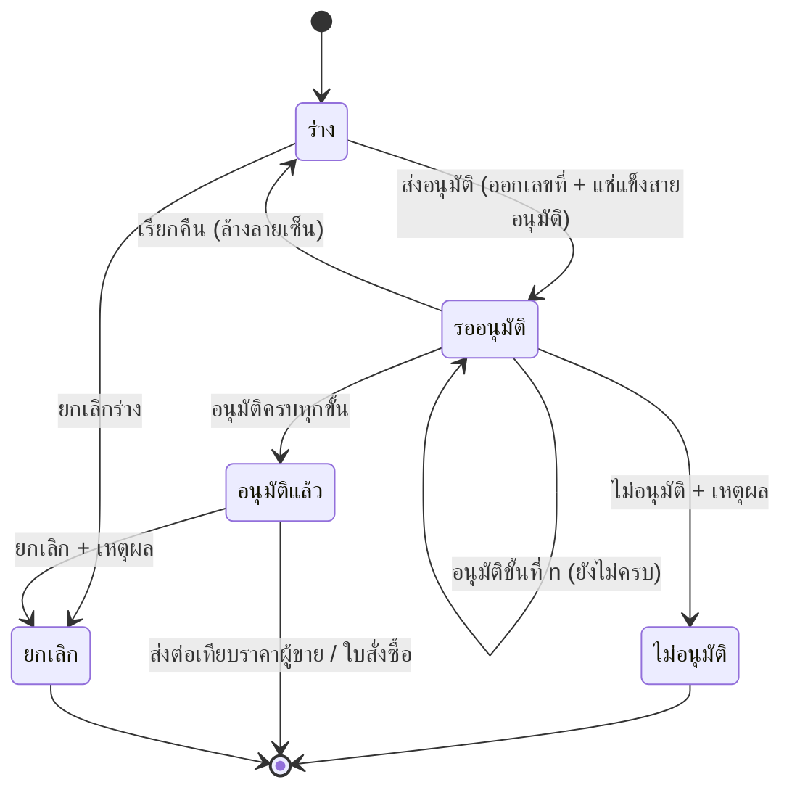

# BRD: PR ใบขอซื้อ (Purchase Requisition)

## Section 1: Document Info
| หัวข้อ | รายละเอียด |
|---|---|
| Feature | F-PUR-PR · PR ใบขอซื้อ (fid F072) |
| Module | Purchase (จัดซื้อ) · CUBE 4.0 Core ERP |
| ประเภท BRD | New Feature |
| Archetype | Q-document (Pattern Q + B2 v2 line editor) |
| Lane / Wave | CUBE-LANE-W2-PUR-LITE · P1 · `--mode direction` (Phase A → ba-done) |
| Input ที่ใช้ | RIF v2 · BASELINE (ERP standard) · PREBRIEF + FUNCTION_CHECKLIST FN-01..24 · **HTML `1_HTML/F-PUR-PR.html` (ผ่าน S3a/S3b/S3c)** · GOLDEN_RULES · CONTEXT_PACK W2-PUR |
| Conflict priority | LOCK > RIF business intent > HTML หน้าจอจริง |
| วันที่ | 2026-09-10 (ปี ค.ศ. ทุกจุดในเอกสารและระบบ) |
| ผู้จัดทำ | feature-lane-runner 2.4.1r (Phase A · BA direction) |
| สถานะ | **APPROVED** (Quality Gate C01–C23 — ดู §19) |

## Changelog
| Ver | วันที่ | รายละเอียด |
|---|---|---|
| 1.0 | 2026-09-10 | ฉบับแรก — Phase A direction · ออกพร้อม HTML prototype + declarations 5 ชุด |

---

## Section 2: Business Context

### 2.1 ปัญหา / โอกาส
วันนี้การขอซื้อของหน่วยงานเดินด้วยเอกสารกระดาษและอีเมล ทำให้ (1) ไม่รู้ว่าใบไหนค้างอยู่ที่ใคร (2) วงเงินอนุมัติถูกตีความต่างกันในแต่ละฝ่าย
(3) ฝ่ายจัดซื้อไม่มีข้อมูลตั้งต้นที่เป็นมาตรฐานสำหรับเทียบราคาผู้ขาย และ (4) ไม่มีร่องรอยการตัดสินใจที่ตรวจสอบย้อนหลังได้

### 2.2 เป้าหมายทาง Business
1. ให้ผู้ขอซื้อเปิดใบขอซื้อได้เองครบถ้วนในครั้งเดียว โดยไม่ต้องรู้กติกาการอนุมัติ
2. บังคับให้ทุกใบผ่านสายอนุมัติที่ระบบเลือกจากทะเบียน DOA กลางตามวงเงิน — ไม่ขึ้นกับการตีความของแต่ละฝ่าย
3. ทำให้ใบขอซื้อที่อนุมัติแล้วเป็นข้อมูลตั้งต้นที่พร้อมส่งต่อขั้นเทียบราคาผู้ขายและใบสั่งซื้อ
4. เก็บร่องรอยทุกการตัดสินใจแบบเพิ่มอย่างเดียว (append-only) เพื่อการตรวจสอบ

### 2.3 ตัวชี้วัดความสำเร็จ (วัดได้)
| # | ตัวชี้วัด | ฐานปัจจุบัน | เป้าหมาย | วิธีวัด |
|---|---|---|---|---|
| M1 | เวลาเฉลี่ยจากเปิดใบถึงอนุมัติครบ | ~5 วันทำการ (ประมาณการจากงานกระดาษ) `[ASSUMED]` | ≤ 2 วันทำการ | `approved_at − submitted_at` |
| M2 | สัดส่วนใบที่ถูกตีกลับเพราะข้อมูลไม่ครบ | ~25% `[ASSUMED]` | ≤ 8% | นับ `reject` ที่เหตุผลกลุ่ม "ข้อมูลไม่ครบถ้วน" |
| M3 | สัดส่วนใบที่มีเอกสารแนบประกอบการตัดสินใจ | ไม่มีข้อมูล | ≥ 70% ของใบที่ยอด > 50,000 บาท | นับใบที่มี `pr_attachment` ≥ 1 |
| M4 | สัดส่วนใบที่ผ่านสายอนุมัติถูกระดับตามวงเงิน | ไม่มีข้อมูล | 100% | เทียบ `approval_chain` snapshot กับ matrix ของ DOA entry |

### 2.4 ที่มาของ Requirement
- CONTEXT_PACK `knowledge/CONTEXT_PACK/W2-PUR.md` §2 (กติกา lane)
- `briefs/P1/CHECKLIST.md` แถว F-PUR-PR (เจตนา BA)
- `knowledge/CENTRAL_PLAN/GOLDEN_RULES.md` + `TASTE_LOG.md` (กติกาที่ล็อกแล้ว)
- BASELINE เทียบ ERP มาตรฐาน (SAP MM / Odoo / D365 / NetSuite / ERPNext) — `0_DIRECTION/BASELINE_F-PUR-PR.md`

---

## Section 3: Scope

### 3.1 In Scope
| # | ขอบเขต | หลักฐานบน HTML |
|---|---|---|
| I1 | หน้ารายการใบขอซื้อ + ค้นหา/กรอง + แถบเอกสารแนบรวม | `renderList()` |
| I2 | สร้าง/แก้ไขใบขอซื้อผ่าน wizard 5 ขั้น (Pattern Q) | `renderCreateDrawer()` |
| I3 | รายการที่ขอซื้อด้วย B2 v2 line editor (ส่วนลด · VAT 3 โหมด · สรุปยอด) | step 3 |
| I4 | เอกสารแนบต่อใบ (ชนิด/ขนาดจำกัด) | step 4 |
| I5 | ส่งอนุมัติผ่าน **DOA slot picker เลือกคนจริง** | `renderSubmitModal()` |
| I6 | หน้าดูเอกสาร 4 แท็บ: รายละเอียด · PDF · ลายเซ็น/อนุมัติ · ประวัติ | `renderViewDrawer()` |
| I7 | อนุมัติ / ไม่อนุมัติ (บังคับเหตุผล) / เรียกคืน / ยกเลิก / ทำสำเนา | actions ตามสถานะ |
| I8 | ตรวจงบประมาณแบบ **จำลอง** (เตือนอย่างเดียว) | `budgetCheckMock()` |

### 3.2 Out of Scope
| # | ไม่ทำ | เจ้าของจริง |
|---|---|---|
| O1 | ควบคุมงบประมาณจริง (กันเกินงบ · ตัดยอดงบ) | F117 Budget Control · W7 |
| O2 | เทียบราคาผู้ขาย | F073 Compare Vendors (ตัวถัดไปใน lane นี้) |
| O3 | ใบสั่งซื้อ · รับของ · ตั้งหนี้ · จ่ายเงิน | W3 / W5 / W6 |
| O4 | ทยอยออกใบสั่งซื้อจากใบขอซื้อใบเดียว (partial release) | W3 PO |
| O5 | ตั้งค่าสายอนุมัติ · ผู้อนุมัติสำรอง | F019 DOA (ทะเบียนกลาง) |
| O6 | ตั้งค่ารูปแบบเลขเอกสาร · นโยบายเก็บสำเนา | F-DOCCFG |
| O7 | เลือกช่องทางแจ้งเตือน (อีเมล/แอป) | F-NOTIFY + ค่าตั้งของผู้ใช้ |
| O8 | เอกสาร FRD / Test Case / UI Brief | **Phase B — ทีมย่อยทำหลัง vibe HTML นิ่ง** |

### 3.3 Assumptions
ทั้งหมดมาร์ก `[ASSUMED]` และรอการยืนยัน — ไม่หยุดรอในรอบนี้
1. สกุลเงินเดียว THB · ภาษีมูลค่าเพิ่ม 7% (รองรับรายการยกเว้นภาษีและราคารวมภาษีแล้ว)
2. ระดับวงเงินอนุมัติ 3 ช่วง: ≤50,000 / 50,000.01–500,000 / >500,000 บาท — **ตัวเลขจริงตั้งที่ทะเบียน DOA ไม่ฝังในฟีเจอร์**
3. เอกสารแนบ: PDF · JPG · PNG · XLSX ไม่เกิน 10 MB ต่อไฟล์ หลายไฟล์ต่อใบ
4. เลขที่เอกสารรูปแบบ `PR-YYYY-NNNN` ปี ค.ศ. 4 หลัก เริ่มนับใหม่รายปี ออกเลขตอนส่งอนุมัติเท่านั้น
5. ผลตรวจงบจากระบบควบคุมงบประมาณมีรูปแบบ `{ok, remaining, budget_code}` — `[ASSUMED contract]` ใช้จำลองไปก่อน
6. หนึ่งใบขอซื้อผูกกับหนึ่งบริษัท/หนึ่งสกุลเงิน

### 3.4 Scope Lock ⭐
| LOCK | ข้อความที่ล็อก | ที่มา | สืบทอดถึง |
|---|---|---|---|
| LOCK-Q | ใบขอซื้อต้องเป็น Q-document เต็ม archetype (list + wizard 5 ขั้น + view 4 แท็บ + เอกสารแนบใน landing) | CONTEXT_PACK §2.1 | HTML ✅ · BRD §5,§14.6 · FRD (Phase B) |
| LOCK-B2 | รายการสินค้าใช้ B2 v2 (grid compact · VAT แบบแยกโหมด · ส่วนลด · สรุปยอด) | CONTEXT_PACK §2.1 | HTML ✅ · BRD §6.2 |
| LOCK-DOA | ตอนส่งอนุมัติต้องระบุ **คนจริง** ต่อขั้น พร้อมรูป ตำแหน่ง ชื่อ — ห้ามแสดงรหัสบทบาทลอย (ล็อก 2026-08-17) | GOLDEN_RULES ข้อ 3 | HTML ✅ · BRD §5.1,§9 · DOA_BRIEF |
| LOCK-DECL | ต้องมีใบประกาศครบ 5 ชุด: DOA · แจ้งเตือน · 7C · ประเภทเอกสาร · แบบพิมพ์ | CONTEXT_PACK §2.2 | `5_DECLARATIONS/` ✅ |
| LOCK-FW | จุดตรวจงบเป็น **จำลอง + TODO** ห้ามทำจริง ห้ามรอ | CONTEXT_PACK §2.4 | HTML ✅ · BRD §12.2 |
| LOCK-SR | ผู้ขาย · สินค้า · ศูนย์ต้นทุน · หน่วยนับ = ตัวเลือกแบบอ้างอิงอ่อน ไม่ผูกคีย์ ไม่บังคับกรอก | GOLDEN_RULES ข้อ 4 (LD-4C-02) | HTML ✅ · BRD §6 |
| LOCK-YEAR | ปีเป็น ค.ศ. ทุกจุด ทั้งหน้าจอ เลขเอกสาร และแบบพิมพ์ | TASTE_LOG | HTML ✅ · PRINT_SPEC ✅ |

---

## Section 4: User Roles & Permissions

### 4.1 Roles
| Role | คำอธิบาย |
|---|---|
| ผู้ขอซื้อ (Requester) | พนักงานที่ต้องการของ/บริการ — เปิดใบ แก้ร่าง ส่งอนุมัติ เรียกคืน ทำสำเนา |
| หัวหน้าหน่วยงาน | ผู้อนุมัติขั้นแรกของทุกใบ |
| ผู้จัดการฝ่ายจัดซื้อ | ผู้อนุมัติขั้นที่สองเมื่อยอดเกินระดับที่กำหนด |
| ผู้บริหารการเงิน | ผู้อนุมัติขั้นสูงสุดเมื่อยอดเกินระดับที่กำหนด |
| เจ้าหน้าที่จัดซื้อ | ดูใบที่อนุมัติแล้วเพื่อนำไปเทียบราคา (รอบนี้ดูอย่างเดียว) |
| ผู้ตรวจสอบ | ดูใบและประวัติทั้งหมด แก้ไม่ได้ |

### 4.2 Permission Matrix
| การกระทำ | ผู้ขอ | หัวหน้าฯ | ผจก.จัดซื้อ | ผู้บริหารการเงิน | จนท.จัดซื้อ | ผู้ตรวจสอบ |
|---|:--:|:--:|:--:|:--:|:--:|:--:|
| ดูใบของตัวเอง | ✓ | ✓ | ✓ | ✓ | ✓ | ✓ |
| ดูใบของหน่วยงานอื่น | ✗ | เฉพาะที่ตนอยู่ในสาย | ✓ | ✓ | ✓ | ✓ |
| สร้าง / แก้ร่าง / ลบร่าง | ✓ | ✓ | ✓ | ✓ | ✗ | ✗ |
| ส่งอนุมัติ | ✓ (ใบตัวเอง) | ✓ | ✓ | ✓ | ✗ | ✗ |
| อนุมัติ / ไม่อนุมัติ | ✗ | ✓ (ขั้นตน) | ✓ (ขั้นตน) | ✓ (ขั้นตน) | ✗ | ✗ |
| เรียกคืน | ✓ (ใบตัวเอง) | ✗ | ✗ | ✗ | ✗ | ✗ |
| ยกเลิกใบที่อนุมัติแล้ว | ✓ (ใบตัวเอง) | ✗ | ✓ | ✓ | ✗ | ✗ |
| ทำสำเนา | ✓ | ✓ | ✓ | ✓ | ✓ | ✗ |
> กติกาคุมสิทธิ์: **ผู้ขอเซ็นอนุมัติใบของตัวเองไม่ได้** (แบ่งแยกหน้าที่) · สิทธิ์จริงมาจากทะเบียนบทบาทกลาง ไม่ฝังในฟีเจอร์

---

## Section 5: User Journey (พร้อมจุดควบคุมตาม COSO)

### 5.1 Happy Path
| # | ขั้นตอน | ผู้ทำ | จุดควบคุม (COSO) |
|---|---|---|---|
| 1 | เปิด "สร้างใบขอซื้อ" → เลือกสร้างใหม่หรือคัดลอกจากใบเดิม | ผู้ขอ | — |
| 2 | กรอกข้อมูลหลัก: หน่วยงาน · วันที่ต้องการใช้ · ประเภท · ศูนย์ต้นทุน · เหตุผล | ผู้ขอ | **C-01** ตรวจความครบถ้วนก่อนไปขั้นถัดไป |
| 3 | ใส่รายการที่ขอซื้อ (ค้นหาจากทะเบียนสินค้า หรือพิมพ์เอง) + จำนวน หน่วย ราคาประมาณ | ผู้ขอ | **C-02** ต้องมีอย่างน้อย 1 รายการที่ครบถ้วน · ห้ามซ้ำสินค้า+หน่วย |
| 4 | แนบเอกสารประกอบ (ถ้ามี) | ผู้ขอ | **C-03** จำกัดชนิดและขนาดไฟล์ |
| 5 | ตรวจสอบสรุปทั้งใบ + เห็นผลตรวจงบ (จำลอง) + เห็นสายอนุมัติที่ระบบเลือกให้ | ผู้ขอ | **C-04** แสดงสายอนุมัติที่จะใช้ก่อนกดส่ง (โปร่งใส) |
| 6 | กดส่งอนุมัติ → เลือกผู้อนุมัติรายบุคคลให้ครบทุกขั้น | ผู้ขอ | **C-05 (LOCK-DOA)** ระบุคนจริงต่อขั้น · **C-06** ระบบออกเลขที่เอกสารและบันทึกสายอนุมัติติดกับใบ (แช่แข็ง) |
| 7 | ผู้อนุมัติแต่ละขั้นพิจารณาตามลำดับ | ผู้อนุมัติ | **C-07** ผู้ที่ไม่อยู่ในขั้นปัจจุบันไม่เห็นปุ่มอนุมัติ |
| 8 | อนุมัติครบทุกขั้น → ใบพร้อมส่งต่อขั้นเทียบราคาผู้ขาย | ระบบ | **C-08** บันทึกประวัติแบบเพิ่มอย่างเดียว + เก็บสำเนาแบบพิมพ์พร้อมลายเซ็น |

### 5.2 Alternative Paths
#### 5.2.1 ไม่อนุมัติ
ผู้อนุมัติกด "ไม่อนุมัติ" → **บังคับใส่เหตุผล** → ใบเป็นสถานะ "ไม่อนุมัติ" → ขั้นที่เหลือไม่ต้องพิจารณา → แจ้งผู้ขอ →
ผู้ขอ "ทำสำเนาเพื่อแก้ไข" ได้ใบร่างใหม่ (ไม่คัดลอกเลขที่ ลายเซ็น ประวัติ)

#### 5.2.2 เรียกคืน (แก้ระหว่างรออนุมัติ)
ผู้ขอกด "เรียกคืน" → ยืนยัน → ใบกลับเป็นร่าง · **ลายเซ็นที่ลงไปแล้วถูกยกเลิกทั้งหมด (ยังคงอยู่ในประวัติ)** ·
ต้องส่งอนุมัติใหม่ทั้งสาย → แจ้งผู้อนุมัติที่ค้างว่าไม่ต้องพิจารณา

#### 5.2.3 ยกเลิกใบที่อนุมัติแล้ว
ผู้มีสิทธิ์กด "ยกเลิกใบ" → บังคับใส่เหตุผล + ยืนยันการกระทำที่ย้อนกลับไม่ได้ → สถานะ "ยกเลิก" → แจ้งผู้เกี่ยวข้อง
> เงื่อนไข: ต้องยังไม่มีใบสั่งซื้ออ้างถึงใบนี้ (ตรวจจริงเมื่อ W3 พร้อม — รอบนี้เป็นข้อกำหนดเชิงกติกา)

### 5.3 Process Diagram


---

## Section 6: Data Entity & Fields

### 6.1 Entity Overview
| Entity | คำอธิบาย | ชนิด |
|---|---|---|
| `pr_header` | หัวใบขอซื้อ | หลัก |
| `pr_line` | รายการที่ขอซื้อ | ลูก (1:N) |
| `pr_approval_slot` | ขั้นการอนุมัติที่แช่แข็งไว้ตอนส่ง | ลูก (1:N) · เพิ่มอย่างเดียว |
| `pr_attachment` | เอกสารแนบ | ลูก (1:N) |
| `pr_history` | ประวัติทุกเหตุการณ์ | ลูก (1:N) · **เพิ่มอย่างเดียว ห้ามแก้/ลบ** |
| `pr_vendor_suggest` | ผู้ขายที่ผู้ขอแนะนำ | ลูก (0:N) · อ้างอิงอ่อน |

### 6.2 Entity: `pr_header`
| Field | ชนิด | บังคับ | หมายเหตุ |
|---|---|:--:|---|
| `pr_id` | id | ✓ | |
| `pr_no` | string(16) | ✗ ตอนร่าง / ✓ หลังส่ง | `PR-YYYY-NNNN` **จากเครื่องออกเลขกลางเท่านั้น · ออกแล้วเปลี่ยนไม่ได้** |
| `doc_date` | date | ✓ | ค.ศ. |
| `required_date` | date | ✓ | ต้อง ≥ `doc_date` |
| `requester_id` | ref(employee) | ✓ | ผู้ใช้ปัจจุบันตอนสร้าง |
| `department` | string | ✓ | |
| `cost_center_id` | ref(cost_center) | ✗ | **อ้างอิงอ่อน ไม่ผูกคีย์ ว่างได้** |
| `pr_type` | enum | ✓ | goods \| service \| asset |
| `reason` | text | ✓ | |
| `ref_external` | string | ✗ | เลขบันทึก/อ้างอิงภายนอก |
| `note` | text | ✗ | |
| `currency` | string(3) | ✓ | THB `[ASSUMED]` |
| `subtotal` `discount_total` `vat_base` `vat_amount` `grand_total` | decimal(15,2) | ✓ | **คำนวณจากรายการ ห้ามให้ผู้ใช้พิมพ์เอง** |
| `wht_enabled` `wht_pct` | bool / decimal | ✗ | ประมาณการ ไม่ใช่การตั้งหนี้ |
| `endbill_enabled` `endbill_mode` `endbill_value` `endbill_src` | bool/enum/decimal/string | ✗ | ส่วนลดท้ายบิล |
| `status` | enum | ✓ | draft \| pending_approval \| approved \| rejected \| cancelled |
| `doa_entry_ref` | string | ✗ | ทะเบียน DOA ที่ใช้ (บันทึกตอนส่ง) |
| `budget_check_result` | json | ✗ | `{ok, remaining, budget_code}` — **ผลจำลองในรอบนี้** |
| `submitted_by/at` `approved_by/at` `cancel_reason` | — | ✗ | |
| `created_by/at` `updated_by/at` | — | ✓ | |

### 6.2.1 Entity: `pr_line`
| Field | ชนิด | บังคับ | หมายเหตุ |
|---|---|:--:|---|
| `line_no` | int | ✓ | |
| `item_id` | ref(item) | ✗ | **อ้างอิงอ่อน** — ว่างได้เมื่อเป็นรายการนอกทะเบียน |
| `item_text` | string | ✓ | ชื่อรายการที่แสดง (จากทะเบียนหรือพิมพ์เอง) |
| `qty` | decimal | ✓ | > 0 |
| `uom` | string | ✓ | หน่วยจากทะเบียนสินค้า หรือค่าเริ่มต้น |
| `unit_price_est` | decimal(15,2) | ✓ | **ราคาประมาณ** ไม่ใช่ราคาผู้ขายจริง |
| `discount_mode` `discount_pct` `discount_amt` | enum/decimal | ✗ | ส่วนลดรายบรรทัด |
| `vat_mode` | enum | ✓ | `none` \| `add` (ยังไม่รวมภาษี) \| `included` (รวมภาษีแล้ว) — **สามโหมดใช้ร่วมกันไม่ได้** |
| `vat_pct` | decimal | ✓ | ค่าเริ่มต้น 7 |
| `cost_center_id` | ref | ✗ | ว่าง = ใช้ตามหัวเอกสาร |
| `note` | text | ✗ | สเปก/ยี่ห้อ/เงื่อนไขเฉพาะ |
| `is_free` | bool | ✗ | รายการของแถม (แก้/ลบไม่ได้) |

### 6.3 Entity Relationship
```
pr_header 1 ──< pr_line
          1 ──< pr_approval_slot   (เพิ่มอย่างเดียว)
          1 ──< pr_attachment
          1 ──< pr_history         (เพิ่มอย่างเดียว)
          1 ──< pr_vendor_suggest  (อ้างอิงอ่อน)
pr_header  ··> cost_center · item · uom · vendor   (อ้างอิงอ่อน — ตัวเลือก ไม่ผูกคีย์ ไม่ตรวจความมีอยู่)
pr_header  ··> ทะเบียน DOA (อ่านตอนส่งอนุมัติ) · เครื่องออกเลขเอกสาร · ศูนย์แจ้งเตือน · เครื่องประทับผล 7C
```

---

## Section 7: User Stories & Acceptance Criteria

### S-01 · เปิดใบขอซื้อและส่งอนุมัติ
*ในฐานะ* ผู้ขอซื้อ *ฉันต้องการ* เปิดใบขอซื้อและส่งเข้าสายอนุมัติได้เอง *เพื่อ* ไม่ต้องเดินเอกสารเอง
**เกณฑ์ยอมรับ**
- AC-01 กรอกไม่ครบในขั้นข้อมูลหลัก → ไปขั้นถัดไปไม่ได้ + ช่องที่ขาดถูกทำเครื่องหมาย + ข้อความ "กรุณากรอกข้อมูลให้ครบถ้วน"
- AC-02 วันที่ต้องการใช้ก่อนวันที่เอกสาร → บล็อกพร้อมคำอธิบายใต้ช่อง
- AC-03 ไม่มีรายการที่ครบ (สินค้า+จำนวน>0+ราคา>0) อย่างน้อย 1 → ส่งอนุมัติไม่ได้
- AC-04 กดส่งอนุมัติ → ระบบออกเลขที่เอกสาร (ก่อนหน้านั้นแสดง "ออกอัตโนมัติเมื่อส่งอนุมัติ")
- AC-05 หน้าจอเลือกผู้อนุมัติต้องแสดง **รูป ชื่อ และตำแหน่ง** ของคนจริงต่อขั้น · เลือกไม่ครบทุกขั้น → ปุ่มส่งถูกปิด

### S-02 · พิจารณาอนุมัติ
*ในฐานะ* ผู้อนุมัติ *ฉันต้องการ* เห็นเหตุผลและรายการทั้งหมดก่อนตัดสินใจ
- AC-06 ผู้ที่ไม่อยู่ในขั้นปัจจุบันเปิดใบได้ แต่ไม่เห็นปุ่มอนุมัติ พร้อมข้อความอธิบาย
- AC-07 "ไม่อนุมัติ" ต้องใส่เหตุผลอย่างน้อย 3 ตัวอักษร จึงกดยืนยันได้ (มีข้อความสำเร็จรูปให้เลือก)
- AC-08 อนุมัติครบทุกขั้น → สถานะเป็น "อนุมัติแล้ว" + แถบความคืบหน้าเต็ม + ประวัติบันทึกครบทุกขั้น

### S-03 · แก้ไขหลังส่งอนุมัติ
*ในฐานะ* ผู้ขอซื้อ *ฉันต้องการ* แก้ใบที่ส่งไปแล้ว
- AC-09 ระหว่างรออนุมัติ ปุ่มแก้ไขไม่ปรากฏ + มีคำอธิบายว่าให้กด "เรียกคืน" ก่อน
- AC-10 เรียกคืนแล้วใบกลับเป็นร่าง ลายเซ็นเดิมถูกยกเลิก แต่ยังเห็นในประวัติ

### S-04 · ความโปร่งใสเรื่องงบ
- AC-11 ยอดสุทธิเกินงบคงเหลือของศูนย์ต้นทุน → แสดงแถบเตือน **แต่ยังส่งอนุมัติได้** และผู้อนุมัติเห็นคำเตือนเดียวกัน
- AC-12 ไม่ได้เลือกศูนย์ต้นทุน → ข้ามการตรวจงบ ไม่ถือเป็นข้อผิดพลาด

### S-05 · ทำงานซ้ำได้เร็ว
- AC-13 "จากใบขอซื้อเดิม" คัดลอกหัวเอกสารและรายการ แต่ **ไม่คัดลอก** เลขที่ ลายเซ็น ประวัติ และเอกสารแนบ
- AC-14 ใบที่ไม่อนุมัติมีปุ่ม "ทำสำเนาเพื่อแก้ไข" ให้โดยตรง

---

## Section 8: Status & Lifecycle

### 8.2 State Transition Table
| จาก | เหตุการณ์ | ไป | เงื่อนไข | ผลข้างเคียง |
|---|---|---|---|---|
| ร่าง | ส่งอนุมัติ | รออนุมัติ | ข้อมูลครบ + ≥1 รายการ + เลือกผู้อนุมัติครบ | ออกเลขที่ · แช่แข็งสายอนุมัติ · แจ้งเตือน `pr_submitted` |
| รออนุมัติ | อนุมัติ (ยังไม่ครบขั้น) | รออนุมัติ | ผู้ใช้อยู่ในขั้นปัจจุบัน | บันทึกลายเซ็นขั้นนั้น · แจ้งขั้นถัดไป |
| รออนุมัติ | อนุมัติ (ขั้นสุดท้าย) | อนุมัติแล้ว | เหมือนบน | แจ้ง `pr_approved` · ประทับผล 7C (EC ประมาณการ) · เก็บสำเนาแบบพิมพ์พร้อมลายเซ็น |
| รออนุมัติ | ไม่อนุมัติ | ไม่อนุมัติ | มีเหตุผล | ขั้นที่เหลือถูกข้าม · แจ้ง `pr_rejected` (ปิดไม่ได้) |
| รออนุมัติ | เรียกคืน | ร่าง | ผู้ขอเท่านั้น | ล้างสายอนุมัติ · แจ้ง `pr_recalled` |
| ร่าง | ยกเลิก | ยกเลิก | มีเหตุผล | — |
| อนุมัติแล้ว | ยกเลิก | ยกเลิก | มีเหตุผล + ยังไม่มีใบสั่งซื้ออ้างถึง | แจ้ง `pr_cancelled` · ประทับผล 7C (EC แบบประหยัดจากการหยุด) |
> ทุก transition เขียนลง `pr_history` แบบเพิ่มอย่างเดียว · ไม่มีการลบถาวรในฟีเจอร์นี้

---

## Section 9: Business Rules + Validation

### 9.1 Business Rules
| BR | กติกา | ระดับความยืดหยุ่น |
|---|---|---|
| BR-01 | ส่งอนุมัติได้เฉพาะสถานะร่าง | ตายตัว |
| BR-02 | สายอนุมัติถูกเลือกจากทะเบียน DOA **ตามยอดสุทธิ ณ เวลาที่กดส่ง** แล้วบันทึกติดกับใบ — แก้ทะเบียนภายหลังไม่กระทบใบที่ส่งไปแล้ว | ตายตัว |
| BR-03 | ผู้ขอเซ็นอนุมัติใบของตัวเองไม่ได้ | ตายตัว (แบ่งแยกหน้าที่) |
| BR-04 | แก้ยอดหลังส่งอนุมัติทำไม่ได้ — ต้องเรียกคืนแล้วส่งใหม่ (เลือกสายอนุมัติใหม่ตามยอดใหม่) | ตายตัว |
| BR-05 | เลขที่เอกสารออกตอนส่งอนุมัติเท่านั้น และเปลี่ยนไม่ได้ | ตายตัว |
| BR-06 | ราคาในใบขอซื้อเป็น**ราคาประมาณ** ไม่ผูกพันผู้ขาย | ตายตัว |
| BR-07 | งบไม่พอ = **เตือน ไม่บล็อก** ในรอบนี้ | ยืดหยุ่น — เปลี่ยนเป็นบล็อกได้เมื่อระบบควบคุมงบพร้อม (ตั้งค่ากลาง ไม่แก้โค้ดฟีเจอร์) |
| BR-08 | ระดับวงเงินและผู้ถือสิทธิ์อนุมัติ **ไม่อยู่ในฟีเจอร์นี้** | ยืดหยุ่น — อยู่ที่ทะเบียน DOA |
| BR-09 | รูปแบบเลขเอกสารและนโยบายเก็บสำเนา **ไม่อยู่ในฟีเจอร์นี้** | ยืดหยุ่น — อยู่ที่ทะเบียนประเภทเอกสาร |
| BR-10 | ช่องทางแจ้งเตือน **ไม่อยู่ในฟีเจอร์นี้** | ยืดหยุ่น — อยู่ที่ศูนย์แจ้งเตือน + ค่าตั้งของผู้ใช้ |
| BR-11 | ประวัติเป็นแบบเพิ่มอย่างเดียว ไม่มีการลบถาวร | ตายตัว |
| BR-12 | ผู้ขายที่แนะนำไม่ผูกพันผลการจัดซื้อ — ผู้ขายจริงตัดสินที่ขั้นเทียบราคา | ตายตัว |

### 9.2 Validation Rules
| V | กติกา | ข้อความ |
|---|---|---|
| V-01 | หน่วยงาน · วันที่เอกสาร · วันที่ต้องการใช้ · ประเภท · เหตุผล = บังคับ | "กรุณากรอกข้อมูลให้ครบถ้วน" |
| V-02 | วันที่ต้องการใช้ ≥ วันที่เอกสาร | "ต้องระบุ และต้องไม่ก่อนวันที่เอกสาร" |
| V-03 | ต้องมี ≥1 รายการที่มีชื่อ จำนวน>0 ราคา>0 | "ต้องมีอย่างน้อย 1 รายการที่ระบุสินค้า จำนวน และราคาครบ" |
| V-04 | ห้ามมีแถวว่าง | "มีแถวว่าง N แถว — กรุณาระบุรายการหรือลบแถวออก" |
| V-05 | ห้ามสินค้า+หน่วยซ้ำกัน | "มีสินค้าและหน่วยซ้ำกัน: X — รวมเป็นแถวเดียว" |
| V-06 | ไฟล์แนบ: ชนิดและขนาดตามที่กำหนด | "ไฟล์ X แนบไม่ได้ — รองรับเฉพาะ … ไม่เกิน 10 MB (ไฟล์อื่นยังอยู่ครบ)" |
| V-07 | เหตุผลการไม่อนุมัติ/ยกเลิก ≥ 3 ตัวอักษร | ปุ่มยืนยันถูกปิดจนกว่าจะครบ |
| V-08 | ต้องเลือกผู้อนุมัติครบทุกขั้นก่อนส่ง | ปุ่ม "ส่งอนุมัติ" ถูกปิด |
| V-09 | ส่วนลดรายบรรทัด 0–100% · ส่วนลดท้ายบิลไม่เกินยอดหลังภาษี | คำนวณตัดยอดให้อัตโนมัติ |

### 9.5 สรุประดับความยืดหยุ่น
ตายตัว 7 ข้อ (BR-01..06, BR-11..12) · ยืดหยุ่นผ่านการตั้งค่ากลาง 4 ข้อ (BR-07..10)
**ข้อสังเกตสำคัญ:** กติกาที่ยืดหยุ่นทั้ง 4 ข้อไม่มีตัวเลข/รายชื่อใดอยู่ในฟีเจอร์นี้เลย — เปลี่ยนได้โดยไม่แตะโค้ด

---

## Section 10: Edge Cases
### 10.1 ระบุโดย BA (☑ ยืนยันแล้ว)
☑ EC-01 รายการนอกทะเบียนสินค้า (พิมพ์ชื่อเอง) · ☑ EC-02 ไม่ระบุศูนย์ต้นทุน · ☑ EC-03 เรียกคืนหลังมีคนเซ็นไปแล้วบางขั้น
☑ EC-04 ยกเลิกใบที่อนุมัติแล้ว · ☑ EC-05 ไฟล์แนบผิดชนิด/ใหญ่เกิน · ☑ EC-06 ผู้ไม่มีสิทธิ์เปิดดู · ☑ EC-07 งบไม่พอ
### 10.2 จากการเทียบรูปแบบ (☐ รอยืนยัน)
- **การคำนวณ:** ☐ CL-01 ราคารวมภาษีแล้ว (ถอดภาษีย้อน) — *มีในระบบแล้ว* · ☐ CL-02 ปัดเศษสตางค์ครึ่งขึ้น — *ใช้อยู่*
- **การใช้พร้อมกัน:** ☐ CA-01 ผู้อนุมัติสองคนกดพร้อมกันในขั้นเดียวกัน → คนแรกชนะ อีกคนได้ข้อความว่าถูกพิจารณาแล้ว *(Phase B)*
- **การแจ้งเตือน:** ☐ EM-01 ผู้อนุมัติลาออก/ย้ายระหว่างใบค้าง → ต้องมีทางส่งต่อ *(เจ้าของคือทะเบียน DOA)*
- **สถานะ:** ☐ ST-01 ใบค้างรออนุมัติเกิน N วัน → เตือนซ้ำ/ยกระดับ *(เจ้าของคือทะเบียน DOA + ศูนย์แจ้งเตือน)*
> รายงานผลการทบทวน: 7 ข้อยืนยันแล้วและมีทางเดินบนหน้าจอจริงครบ · 5 ข้อรอเคาะ ไม่กระทบขอบเขต Phase A

---

## Section 12: System Context & Cross-Module Impact

### 12.1 Value Stream & Downstream Impact
สายคุณค่า **Procure-to-Pay (P2P)** — ใบขอซื้อคือประตูแรก
```
[ใบขอซื้อ F-PUR-PR]  →  เทียบราคาผู้ขาย (F073)  →  ใบสั่งซื้อ (W3)  →  รับของ  →  ตั้งหนี้  →  จ่ายเงิน
```
| ปลายทาง | ได้อะไรจากใบขอซื้อ | สถานะรอบนี้ |
|---|---|---|
| F073 เทียบราคาผู้ขาย | ใบที่อนุมัติแล้ว + รายการ + จำนวน + ราคาประมาณ + ผู้ขายที่แนะนำ | **จุดเชื่อมเท่านั้น** (ปุ่มมี · ยังไม่เปิดใช้) |
| W3 ใบสั่งซื้อ | ใบที่อนุมัติแล้วเป็นเอกสารต้นทาง | **จุดเชื่อมเท่านั้น** |
| W7 ควบคุมงบประมาณ | คำขอตรวจงบตอนสร้าง/ส่งเอกสาร | **จำลอง + TODO** ห้ามทำจริง |
| 7C ประทับผล | เหตุการณ์ "อนุมัติแล้ว" (ผลกระทบเชิงมูลค่าแบบประมาณการ) และ "ยกเลิก" (ประหยัดจากการหยุด) | ประกาศแล้วใน `CSQ_BRIEF` |

### 12.2 Module & External Dependencies
| Dependency | สถานะ | วิธีจัดการรอบนี้ |
|---|---|---|
| ทะเบียนผู้ขาย (F007) · สินค้า (F009/F010) · ศูนย์ต้นทุน (F012) · หน่วยนับ | เสร็จแล้ว | **อ้างอิงอ่อน** — ตัวเลือกเท่านั้น ไม่ผูกคีย์ ไม่ตรวจความมีอยู่ ว่างได้ |
| ทะเบียนสายอนุมัติ DOA (F019) | เสร็จแล้ว | อ่านตอนส่งอนุมัติ · ฟีเจอร์แค่ประกาศ + แสดงตัวเลือกคน |
| เครื่องออกเลขเอกสาร / เก็บสำเนา | กลาง | เรียกผ่านบริการกลางเท่านั้น ห้ามสร้างเลขเอง |
| ศูนย์แจ้งเตือน | กลาง | ประกาศเหตุการณ์ · ห้ามเลือกช่องทางเอง |
| **F117 ควบคุมงบประมาณ (W7)** | **ยังไม่มี** | **จำลอง + `TODO: budget-control hook`** — ห้าม implement ห้ามรอ |
| W1 / W2 FULL lanes | รันขนาน | ห้ามทำแทน ห้ามรอ |

---

## Section 13: Delivery Phases
| Phase | ขอบเขต | สถานะ |
|---|---|---|
| **Phase A (รอบนี้)** | ทิศทาง + ต้นแบบหน้าจอ + BRD + ใบประกาศ 5 ชุด | ✅ จบที่ `ba-done` |
| **Phase A′ (ทีม)** | ปรับแต่งหน้าจอ (vibe) จนนิ่ง แล้วผ่านการตรวจซ้ำ | ⏳ ถัดไป |
| **Phase B (ทีมย่อย)** | FRD Pack · Test Case & UAT · UI Brief · Dev Pack | ⏳ หลังหน้าจอนิ่ง |
| Phase C | ต่อเครื่องกลางจริง (สายอนุมัติ · เลขเอกสาร · แจ้งเตือน · 7C) | ภายหลัง |
| Phase D | เปลี่ยนการตรวจงบจากจำลองเป็นของจริง | หลัง W7 |

---

## Section 14: Dev Requirements Summary "ใบสั่ง"

### 14.1 Config Foundation
ไม่มีค่าคงที่เชิงนโยบายในฟีเจอร์นี้ — วงเงินอนุมัติ · รูปแบบเลขเอกสาร · นโยบายเก็บสำเนา · ช่องทางแจ้งเตือน · เกณฑ์งบ **อยู่ที่ทะเบียนกลางทั้งหมด**

### 14.2 ข้อกำหนดจากใบประกาศ
| ใบประกาศ | สิ่งที่ต้องต่อ |
|---|---|
| DOA | เลือกสายจากทะเบียนตามยอด ณ เวลาส่ง แล้วแช่แข็ง · ผู้ขอเซ็นเองไม่ได้ · แก้ยอดหลังส่ง = เลือกสายใหม่ |
| แจ้งเตือน | 7 เหตุการณ์ของฟีเจอร์ (ไม่รวมเหตุการณ์ที่สายอนุมัติยิงเองอัตโนมัติ) |
| 7C | 2 เหตุการณ์: อนุมัติแล้ว (ประมาณการ) · ยกเลิก (ประหยัดจากการหยุด) — **ห้ามประกาศท่อที่มาอัตโนมัติซ้ำ** |
| ประเภทเอกสาร | ขอจดประเภท `PR` · ออกเลขตอนส่งอนุมัติ · เก็บสำเนาตอนอนุมัติครบ |
| แบบพิมพ์ | A4 แนวตั้ง · ปี ค.ศ. · ช่องลายเซ็นแปรตามสายจริง ไม่ตายตัว 3 ช่อง |

### 14.3 ข้อกำหนดจากกรณีขอบและการตรวจสอบ
V-01..V-09 ต้องบังคับที่ชั้นบริการด้วย ไม่ใช่แค่หน้าจอ · ประวัติเพิ่มอย่างเดียว · ยอดทั้งหมดคำนวณฝั่งเซิร์ฟเวอร์ ห้ามเชื่อค่าที่ส่งมาจากหน้าจอ

### 14.4 WARNING ที่รอข้อสรุป
1. ตัวเลขวงเงิน 3 ระดับยังเป็นค่าที่ตั้งไว้ก่อน `[ASSUMED]` — ต้องยืนยันก่อนตั้งค่าจริง
2. รูปแบบผลตรวจงบเป็นสัญญาที่สมมติไว้ `[ASSUMED contract]` — ต้องยืนยันกับเจ้าของ W7
3. การส่งต่องานเมื่อผู้อนุมัติไม่อยู่ ยังไม่มีข้อสรุป (เจ้าของคือทะเบียน DOA)

### 14.6 Screen Inventory + UI Signals
| # | จอ | รูปแบบ | องค์ประกอบสำคัญ |
|---|---|---|---|
| SC-1 | รายการใบขอซื้อ | Pattern A (หน้าหลักของ Q) | ตาราง 10 คอลัมน์ (มีคอลัมน์ลายเซ็น n/N) · ตัวกรอง 4 ช่อง · แถบเอกสารแนบรวม · ว่าง/กำลังโหลด/ผิดพลาด |
| SC-2 | สร้าง/แก้ไข | Pattern Q wizard (ลิ้นชักกว้าง) | 5 ขั้น: เลือกแหล่งที่มา › ข้อมูลหลัก › รายการสินค้า › เอกสารแนบ › ตรวจสอบและยืนยัน |
| SC-2.3 | รายการสินค้า | **B2 v2** | ตาราง 9 ช่อง · ช่องค้นหาสินค้าพร้อมพิมพ์เอง · แถวขยายบรรทัดเดียว (ภาษี/หมายเหตุ/ศูนย์ต้นทุน) · ส่วนลดท้ายบิล · หัก ณ ที่จ่าย · สรุปยอด |
| SC-3 | ดูเอกสาร | Pattern C/G (ลิ้นชัก 920) | 4 แท็บ: รายละเอียด · แบบพิมพ์ · ลายเซ็น/อนุมัติ · ประวัติ |
| SC-4 | ส่งอนุมัติ | Pattern D (modal) | **ตัวเลือกผู้อนุมัติรายบุคคลต่อขั้น (รูป+ชื่อ+ตำแหน่ง)** |
| SC-5 | ไม่อนุมัติ / ยกเลิก | Pattern D | เหตุผลบังคับ + ข้อความสำเร็จรูป |
| SC-6 | ยืนยันการกระทำที่ย้อนกลับไม่ได้ | Pattern D | ปิดหน้าต่างโดยไม่บันทึก · เรียกคืน |

---

## Section 15: Open Questions
| OQ | คำถาม | ค่าที่ใช้ไปก่อน | ผู้ตอบ |
|---|---|---|---|
| OQ-01 | ตัวเลขวงเงินอนุมัติจริง 3 ระดับ | 50,000 / 500,000 บาท `[ASSUMED]` | ผู้บริหารจัดซื้อ · พี่เบิร์ด |
| OQ-02 | แยกสายอนุมัติรายหน่วยงานหรือไม่ | ชุดเดียวทุกหน่วยงาน `[ASSUMED]` | เจ้าของกระบวนการ |
| OQ-03 | ยกเลิกใบที่อนุมัติแล้วต้องอนุมัติซ้ำหรือไม่ | ไม่ต้อง (เหตุผล + ยืนยัน) `[ASSUMED]` | เจ้าของกระบวนการ |
| OQ-04 | เมื่อระบบควบคุมงบพร้อม จะเปลี่ยน "เตือน" เป็น "บล็อก" หรือไม่ | เตือนอย่างเดียว | เจ้าของ W7 + การเงิน |
| OQ-05 | ต้องรองรับหลายบริษัท/หลายสกุลเงินในเฟสถัดไปหรือไม่ | หนึ่งบริษัท THB `[ASSUMED]` | สถาปนิกระบบ |
| OQ-06 | ผู้อนุมัติไม่อยู่ → ส่งต่อให้ใคร | ยังไม่มี (เจ้าของคือทะเบียน DOA) | เจ้าของ DOA |

---

## Section 16: Security & Compliance

### 16.1 Security Preset
**Internal-Sensitive** — เอกสารภายในที่มีข้อมูลเชิงพาณิชย์ (ราคา ผู้ขาย งบ) แต่ไม่มีข้อมูลส่วนบุคคลอ่อนไหว

### 16.2 Applicable Standards
| มาตรฐาน | เกี่ยวข้องอย่างไร |
|---|---|
| COSO Internal Control | จุดควบคุม C-01..C-08 ใน §5.1 · การแบ่งแยกหน้าที่ (BR-03) |
| การกำกับดูแลอำนาจอนุมัติ | สายอนุมัติมาจากทะเบียนกลาง แช่แข็งตอนส่ง ตรวจย้อนได้ |
| PDPA | ข้อมูลบุคคลที่เกี่ยวข้องคือชื่อ/ตำแหน่งพนักงานภายในเท่านั้น — ไม่มีข้อมูลอ่อนไหว |
| การเก็บหลักฐานทางบัญชี | เก็บสำเนาแบบพิมพ์พร้อมลายเซ็นตอนอนุมัติครบ |

### 16.3 Control Checklist
| # | การควบคุม | สถานะรอบนี้ |
|---|---|---|
| S-01 | ผู้ขอเซ็นใบตัวเองไม่ได้ | กำหนดใน BR-03 · บังคับจริงที่ชั้นบริการ (Phase B/C) |
| S-02 | ผู้ที่ไม่อยู่ในขั้นปัจจุบันไม่เห็นปุ่มอนุมัติ | ✅ บนหน้าจอ |
| S-03 | ประวัติเพิ่มอย่างเดียว ไม่มีลบถาวร | ✅ ออกแบบแล้ว |
| S-04 | สายอนุมัติแช่แข็งตอนส่ง | ✅ ออกแบบแล้ว |
| S-05 | เลขเอกสารเปลี่ยนไม่ได้ | ✅ กำหนดในใบประกาศประเภทเอกสาร |
| S-06 | ยอดเงินคำนวณฝั่งเซิร์ฟเวอร์ | ⏳ ข้อกำหนดถึง Phase B |
| S-07 | ควบคุมชนิด/ขนาดไฟล์แนบ | ✅ บนหน้าจอ · ต้องตรวจซ้ำฝั่งเซิร์ฟเวอร์ |

### 16.4 Risk Statement
ความเสี่ยงหลักคือ **ใบขอซื้อผ่านสายอนุมัติที่ต่ำกว่าที่ควร** จากการแก้ยอดหลังส่ง — ปิดด้วย BR-04 (แก้ต้องเรียกคืน) + BR-02 (แช่แข็งสาย)
ความเสี่ยงรองคือ **ผูกพันงบเกินโดยไม่รู้ตัว** เพราะรอบนี้ตรวจงบเป็นเพียงคำเตือน — รับความเสี่ยงไว้อย่างมีสติ และปิดเมื่อ W7 พร้อม (OQ-04)

---

## Section 17: Health Check
| หัวข้อ | ค่า |
|---|---|
| SLA เปิดหน้ารายการ | ≤ 1.5 วินาที ที่ 1,000 ใบ `[ASSUMED]` |
| SLA บันทึก/ส่งอนุมัติ | ≤ 2 วินาที |
| จุดควบคุม | ใบค้างรออนุมัติเกิน 3 วันทำการ · ใบที่งบไม่พอแต่ถูกอนุมัติ · ใบที่ถูกเรียกคืนซ้ำเกิน 2 ครั้ง |
| KPI | M1–M4 ใน §2.3 |
| Threshold | ทุกเกณฑ์เตือนอยู่ที่ทะเบียนกลาง **ไม่อยู่ในโค้ดฟีเจอร์** (TASTE_LOG) |
| ปริมาณงาน | ประมาณ 300–800 ใบ/เดือน `[ASSUMED]` |

## Section 18: Monitoring
| รายงาน | เนื้อหา |
|---|---|
| ใบขอซื้อค้างอนุมัติ | แยกตามขั้น/ผู้อนุมัติ/อายุใบ |
| ผลการอนุมัติ | อัตราอนุมัติ/ไม่อนุมัติ + เหตุผลยอดนิยม |
| ใบขอซื้อเทียบงบ | ยอดขอซื้อสะสมต่อศูนย์ต้นทุน (สมบูรณ์เมื่อ W7 พร้อม) |
| เวลาเฉลี่ยต่อขั้น | หาคอขวดของสายอนุมัติ |
| รายการที่ขอบ่อยแต่ไม่มีในทะเบียนสินค้า | ป้อนกลับให้ทีมข้อมูลหลัก |

---

## Section 19: Quality Gate C01–C23 → **APPROVED**
| # | เกณฑ์ | ผล |
|---|---|---|
| C01 | ข้อมูลเอกสารครบ (feature · module · ประเภท · วันที่ · ผู้จัดทำ) | ✅ |
| C02 | ปัญหา/โอกาสเขียนจากมุมธุรกิจ ไม่ใช่มุมเทคนิค | ✅ |
| C03 | ตัวชี้วัดความสำเร็จ **วัดได้** มีสูตร/แหล่งข้อมูล | ✅ M1–M4 |
| C04 | In/Out of Scope ชัด ไม่ทับ ไม่มีรู | ✅ I1–I8 / O1–O8 |
| C05 | Assumption ทุกข้อมาร์ก `[ASSUMED]` | ✅ 6 ข้อ |
| C06 | Scope Lock สืบทอดครบและระบุปลายทางที่ต้องส่งต่อ | ✅ 7 LOCK |
| C07 | Roles ครบ + Permission Matrix ไม่ขัดกับการแบ่งแยกหน้าที่ | ✅ |
| C08 | Happy path มีจุดควบคุมกำกับทุกขั้นสำคัญ | ✅ C-01..C-08 |
| C09 | มี Alternative path อย่างน้อย reject + escalation/recall | ✅ 3 เส้น |
| C10 | มีแผนภาพสถานะ และตรงกับตาราง transition | ✅ |
| C11 | Entity ครบ + ระบุ nullable/บังคับ + ระบุตัวที่คำนวณ | ✅ |
| C12 | ความสัมพันธ์ระบุชัดว่าอันไหนอ้างอิงอ่อน | ✅ |
| C13 | User Story มีเกณฑ์ยอมรับที่ทดสอบได้ | ✅ AC-01..AC-14 |
| C14 | Business Rules แยก "ตายตัว" กับ "ยืดหยุ่น" ชัด | ✅ §9.5 |
| C15 | **ไม่มีตัวเลขนโยบาย (วงเงิน/เกณฑ์/ช่องทาง) ฝังในกติกาของฟีเจอร์** | ✅ ตรวจแล้ว ไม่มี |
| C16 | Validation ทุกข้อมีข้อความที่ผู้ใช้อ่านรู้เรื่อง | ✅ V-01..V-09 |
| C17 | Edge case แยก "ยืนยันแล้ว" กับ "รอเคาะ" | ✅ 7 / 5 |
| C18 | ระบุผลกระทบปลายน้ำในสายคุณค่า | ✅ §12.1 |
| C19 | Dependency ข้าม lane จัดการด้วยการจำลอง + TODO ไม่รอ ไม่ทำแทน | ✅ §12.2 |
| C20 | Open Questions มีค่าที่ใช้ไปก่อน + ผู้รับผิดชอบตอบ | ✅ OQ-01..06 |
| C21 | มีหัวข้อความมั่นคงปลอดภัยและการกำกับดูแล พร้อมข้อความความเสี่ยง | ✅ §16 |
| C22 | Screen Inventory ตรงกับหน้าจอจริงใน HTML ที่ผ่านการตรวจแล้ว | ✅ §14.6 เทียบ `1_HTML/F-PUR-PR.html` |
| C23 | ใบประกาศครบตามชิปของฟีเจอร์ และไม่มีความต่างที่ไม่ได้บันทึก | ✅ 5/5 · DIVERGENCE-0 บันทึกใน `_COVERAGE_R1.md` |

**สรุป: 23/23 ผ่าน → BRD APPROVED (2026-09-10)**

---

## Appendix A · Screen List
`1_HTML/F-PUR-PR.html` (ไฟล์เดียว 143 KB) — เส้นทาง `#/list` `#/create` `#/edit/:id` `#/view/:id`

## Appendix B · Glossary
| คำ | ความหมาย |
|---|---|
| ใบขอซื้อ (PR) | เอกสารที่หน่วยงานใช้ขอให้จัดซื้อของ/บริการ |
| สายอนุมัติ (DOA) | ทะเบียนกลางที่กำหนดว่าใครอนุมัติอะไรได้ในวงเงินเท่าไร |
| อ้างอิงอ่อน (soft-reference) | อ้างถึงข้อมูลหลักในรูปตัวเลือก โดยไม่ผูกคีย์และไม่บังคับให้มีอยู่จริง |
| เพิ่มอย่างเดียว (append-only) | เขียนเพิ่มได้ แก้และลบไม่ได้ |
| จุดเชื่อมล่วงหน้า (forward-wire) | ช่องที่เตรียมไว้ต่อระบบที่ยังไม่มี — รอบนี้เป็นของจำลองพร้อมหมายเหตุ |

## Appendix C · Document Control
| ไฟล์ | ที่อยู่ |
|---|---|
| ต้นแบบหน้าจอ | `1_HTML/F-PUR-PR.html` |
| ทิศทาง (บรีฟ · เช็กลิสต์ · เกณฑ์เทียบมาตรฐาน) | `0_DIRECTION/` |
| ใบประกาศ 5 ชุด | `5_DECLARATIONS/` |
| รายงานการตรวจ | `0_DIRECTION/_UX_CHECK_REPORT.md` · `_COVERAGE_R1.md` · `_TECH_CHECK.md` |
