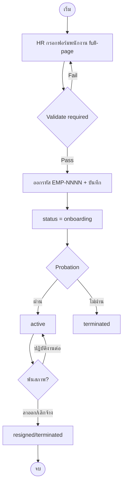
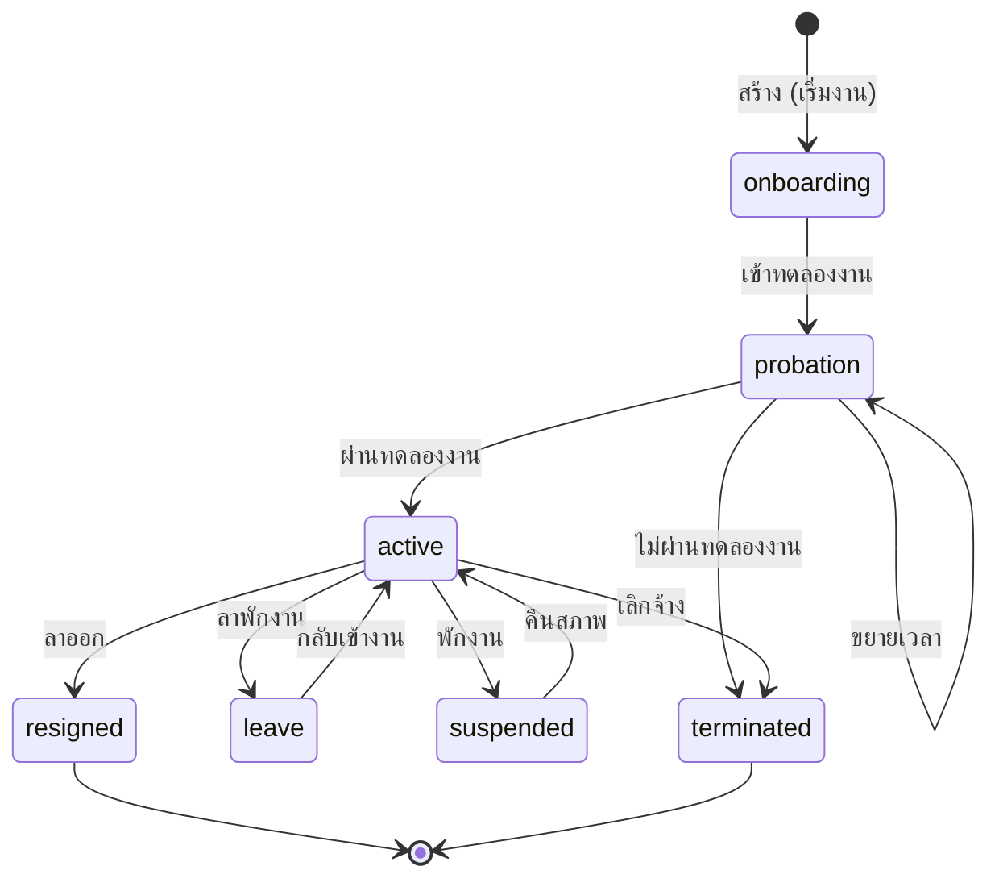

# BRD: Employee Master (ทะเบียนประวัติพนักงาน)

| Field | Value |
|---|---|
| BRD ID | BRD-HR-001 |
| Feature ID | F-EMP-001 |
| Feature Name | Employee Master (ทะเบียนประวัติพนักงาน) |
| BRD Type | New Feature |
| Version | 1.0 |
| Status | AI Reviewed → APPROVED |
| Module | Human Resources (HR) |
| Domain | HR Domain (CUBE 4.0) |
| Owner | BA Team (2B-info) |
| Stakeholders | HR Manager, HR Director, Department Heads, IT/Dev (Bird), DPO |
| Created Date | 2026-06-04 |
| Last Updated | 2026-06-04 |
| Source | HTML Prototype `employee-management.html` (html-generator-v3) + session requirements |

## Changelog
- v1.0 (2026-06-04): สร้าง BRD ผ่าน brd-generator-full (Fresh Mode) — source = HTML prototype ที่ผ่านการ iterate กับ stakeholder ทั้ง session (list redesign, HR-master full fields, tabbed HRIS profile, full-page create/edit, employee lifecycle, Thai address cascade)

---

## Section 2: Business Context

### 2.1 ปัญหา / โอกาส
ปัจจุบัน 2BSimple/CUBE NATIVE ยังไม่มี **ทะเบียนกลางของบุคลากร (Employee Master)** ที่เป็น single source of truth ของข้อมูลพนักงานทั้งองค์กร ข้อมูลพนักงานกระจัดกระจาย และโมดูล User Management (F-IAM-01) ผูกผู้ใช้กับ `employee_id` แต่ยังไม่มี entity `T_employee` จริงให้ผูก ทำให้ My Profile, การกำหนดสิทธิ์ตามตำแหน่ง/แผนก, และโมดูล HR ปลายน้ำ (Recruitment, Onboarding, Payroll, Offboarding) ไม่มีฐานข้อมูลรองรับ

Employee Master คือ entity ชั้นกลางของ 3-layer people model: **Organization (โครงสร้าง) → Employee (ตัวบุคคล) → User (บัญชีล็อกอิน)**

### 2.2 เป้าหมายทาง Business
- เป้าหมายที่ 1: มีทะเบียนประวัติพนักงานครบถ้วนระดับองค์กร (ข้อมูลส่วนตัว ที่อยู่ การศึกษา ประสบการณ์ ครอบครัว เอกสารแนบ) เก็บที่เดียว ค้นหา/แก้ไข/ส่งออกได้
- เป้าหมายที่ 2: เป็นฐานเชื่อม `T_user.employee_id` (1:1) เพื่อปลดล็อก My Profile + การให้สิทธิ์ตามตำแหน่ง
- เป้าหมายที่ 3: เก็บฟิลด์ **วงจรการจ้าง** (สรรหา → เข้าทำงาน → ทดลองงาน → พ้นสภาพ) เพื่อให้โมดูล Recruitment/Onboarding/Offboarding ปลายน้ำดึงไปใช้ต่อโดยไม่ต้อง re-model
- เป้าหมายที่ 4: ปฏิบัติตาม PDPA — จัดชั้นความลับข้อมูล PII, ป้องกัน/ปกปิดข้อมูลอ่อนไหว (เลขบัตร ปชช./เงินเดือน/บัญชีธนาคาร)

### 2.3 ตัวชี้วัดความสำเร็จ (Success Metrics)
| Metric | Baseline | Target | วัดยังไง |
|---|---|---|---|
| ความครบถ้วนข้อมูลพนักงาน (Data Completeness) | 0% (ไม่มีระบบ) | ≥ 95% ของ field บังคับ | filled required fields / total |
| พนักงานที่ผูกบัญชี User สำเร็จ | n/a | 100% ของพนักงานที่ต้องมีบัญชี | linked employees / should-have |
| เวลาในการสร้างประวัติพนักงานใหม่ | n/a | ≤ 10 นาที/คน | log create duration |
| ความถูกต้องที่อยู่ (zip ตรงตำบล) | manual error | 100% (auto-lock) | auto-derived zip |

### 2.4 ที่มาของ Requirement
- เคสที่เกิด: ต้องสร้าง entity `T_employee` ให้ User Management (BR-IAM-07: Employee 1:1 User, FK `employee_id`, ON DELETE RESTRICT) ที่ออกแบบไว้แล้วแต่ยังไม่มีตารางจริง
- Request จาก stakeholder: HR ต้องการทะเบียนเก็บข้อมูลพนักงาน "ระดับที่องค์กรเก็บข้อมูลทั้งหมดของพนักงาน" พร้อมต่อ onboard/recruit/ลาออกในอนาคต
- KPI Gap: ไม่มีฐานข้อมูลบุคลากรกลาง → ทำ HR analytics / payroll / สิทธิ์ตามตำแหน่งไม่ได้

---

## Section 3: Scope

### 3.1 In Scope
- ทะเบียนพนักงาน (CRUD): สร้าง / ดู / แก้ไข / ลบ (มีเงื่อนไข)
- ข้อมูลครบ: ส่วนตัว, ติดต่อ, ที่อยู่ 2 ชุด (ปัจจุบัน + ทะเบียนบ้าน), การศึกษา (หลายรายการ), ประสบการณ์ทำงาน (หลายรายการ), ครอบครัว/ผู้อยู่ในอุปการะ, ผู้ติดต่อฉุกเฉิน, รูปโปรไฟล์, Portfolio, เอกสารแนบ
- รหัสพนักงานอัตโนมัติ `EMP-NNNN` (running 4 หลัก)
- ที่อยู่แบบ cascade search dropdown (จังหวัด → อำเภอ/เขต → ตำบล/แขวง) + รหัสไปรษณีย์เติมอัตโนมัติและล็อก
- การจ้างงาน + สังกัดองค์กร (สาขา/สายงาน/แผนก/ตำแหน่ง/ผู้บังคับบัญชา) อ้างอิง Organization Master (F-ORG-001)
- ฟิลด์วงจรการจ้าง (เก็บข้อมูล): สรรหา (Recruitment), เข้าทำงาน (Onboarding), ทดลองงาน (Probation), การพ้นสภาพ (Offboarding/ลาออก)
- การเชื่อม User (1:1) — แสดงสถานะบัญชีที่ผูก + บล็อกการลบเมื่อมี User ผูกอยู่
- นำเข้า/ส่งออก CSV (validate ก่อนนำเข้า; โหมด Merge/Replace; Replace คงพนักงานที่มี User ไว้)
- Data Classification ระดับ field (PII / Confidential / Restricted)

### 3.2 Out of Scope (เลื่อนไปทำ Phase/Feature ต่อไป)
- **Workflow approval จริง** ของแต่ละ lifecycle (อนุมัติผลทดลองงาน, อนุมัติลาออก) — Phase 3 ผูกกับ DOA Engine (F-PC-DOA-01) — รอบนี้เก็บเฉพาะ "ฟิลด์ + Pre-DOA fields"
- โมดูล Recruitment / Onboarding / Offboarding เต็มรูปแบบ (เป็น feature แยก ดึง field จาก Employee Master)
- Payroll / การคำนวณเงินเดือน-ภาษี-ประกันสังคม
- Attendance / Leave (มีในแผน HR แต่คนละ feature)
- การสร้าง/แก้ไข User account (อยู่ที่ F-IAM-01) — รอบนี้แค่ "แสดง + ผูก"
- การอัปโหลดไฟล์ขึ้น storage จริง (prototype เก็บใน session) — Dev ต่อ storage ใน implement

### 3.3 Assumptions
- Organization Master (F-ORG-001: Branch/Division/Department/Position) มีอยู่แล้วและใช้อ้างอิงได้
- User Management (F-IAM-01) มี `T_user.employee_id` พร้อมผูก
- DOA Engine (F-PC-DOA-01) และ User Access (F-IAM-02) เป็น governance foundation ที่ feature นี้ต้อง wire เข้าใน Phase ถัดไป (Pre-DOA pattern รอบนี้)
- ฐานข้อมูลที่อยู่ไทย (จังหวัด/อำเภอ/ตำบล/ไปรษณีย์) จะมาจาก master/API จริงตอน implement (prototype ใช้ subset 10 จังหวัด)

---

## Section 4: User Roles & Permissions

### 4.1 Roles ที่เกี่ยวข้อง
| Role | คำอธิบาย |
|---|---|
| HR Officer | ผู้บันทึก/แก้ไขข้อมูลพนักงาน (Maker) |
| HR Manager | ผู้ตรวจสอบ/อนุมัติข้อมูล + sensitive change (Checker/Approver) |
| HR Director | ผู้อนุมัติการเปลี่ยนข้อมูลอ่อนไหว (เงินเดือน) |
| Department Head | ผู้อนุมัติการจ้าง/พ้นสภาพ/ลบ ในแผนกตน |
| Line Manager / Supervisor | ผู้ประเมินทดลองงาน (Evaluator) |
| IT/System Admin | ผู้ดูแลการลบ master data + ผูก/ถอนบัญชี (ร่วมอนุมัติลบ) |
| Employee (self) | ดูข้อมูลตนเองผ่าน My Profile (feature แยก) |

### 4.2 Permission Matrix
| Action | HR Officer | HR Manager | HR Director | Dept Head | IT Admin |
|---|:---:|:---:|:---:|:---:|:---:|
| ดูรายการ/ค้นหาพนักงาน | ✅ | ✅ | ✅ | ✅ (แผนกตน) | ✅ |
| ดูโปรไฟล์พนักงาน | ✅ | ✅ | ✅ | ✅ | ✅ |
| ดูฟิลด์อ่อนไหว (เลขบัตร/เงินเดือน/บัญชี) | ✅ (masked) | ✅ | ✅ | ❌ | ❌ |
| สร้างพนักงานใหม่ | ✅ (Maker) | ✅ | ❌ | ❌ | ❌ |
| แก้ไขข้อมูลทั่วไป | ✅ (Maker) | ✅ | ❌ | ❌ | ❌ |
| แก้ไขข้อมูลอ่อนไหว (เงินเดือน/บัญชี) | ✅ (Maker) | ✅ (Checker) | ✅ (Approver) | ❌ | ❌ |
| บันทึกผลทดลองงาน | ⬜ (รับจาก Line Mgr) | ✅ (Approver) | ❌ | ✅ (Approver) | ❌ |
| บันทึกการพ้นสภาพ/ลาออก | ✅ (Maker) | ✅ (Checker) | ❌ | ✅ (Approver) | ❌ |
| ลบพนักงาน | ⬜ | ✅ (Checker) | ❌ | ✅ (Approver) | ✅ (ร่วม) |
| นำเข้า/ส่งออก CSV | ✅ | ✅ | ❌ | ❌ | ✅ |
| ผูก/ถอนบัญชี User | ❌ | ✅ (ขอ) | ❌ | ❌ | ✅ (ทำที่ F-IAM-01) |

> หมายเหตุ Permission จริงบังคับผ่าน **User Access ENC → Policy Center → User Roles Access (F-IAM-02)** — ตาราง 4.2 คือ business intent ที่ต้อง map เข้า Policy Center

---

## Section 5: User Journey (with COSO)

### 5.1 Happy Path — สร้างพนักงานใหม่
| # | Step | Maker | Checker | Approver | System | Notes |
|---|---|---|---|---|---|---|
| 1 | HR เปิดหน้า "เพิ่มพนักงานใหม่" (full-page) | HR Officer | — | — | เปิดฟอร์ม 6 แท็บ | Trigger: New Employee |
| 2 | กรอกข้อมูลส่วนตัว/ที่อยู่/การศึกษา/ครอบครัว | HR Officer | — | — | เลือกที่อยู่ cascade → zip auto-lock | — |
| 3 | กรอกการจ้างงาน + สังกัด + lifecycle (สรรหา/onboard) | HR Officer | — | — | เสนอ สายงาน/แผนก จากตำแหน่งอัตโนมัติ | — |
| 4 | Submit "บันทึกข้อมูลพนักงาน" | HR Officer | — | — | Validate required → ออกรหัส EMP-NNNN | If error → คงหน้า + แจ้ง field |
| 5 | ตรวจสอบความถูกต้อง (Pre-DOA) | — | HR Manager | — | route ตาม DOA (Phase 3) | รอบ Phase 1 = auto-active/onboarding |
| 6 | อนุมัติบรรจุ (สำหรับการจ้างจริง) | — | — | Department Head | update status | DoA per HR policy |

**SoD Check:** Maker (HR Officer) ≠ Approver (HR Manager/Dept Head) ✅

### 5.2 Alternative Paths

#### 5.2.1 แก้ไขข้อมูลอ่อนไหว (เงินเดือน/บัญชี)
| # | Step | Maker | Checker | Approver | System |
|---|---|---|---|---|---|
| 1 | HR แก้ field เงินเดือน/บัญชี | HR Officer | — | — | flag sensitive change |
| 2 | ตรวจสอบ | — | HR Manager | — | log before/after |
| 3 | อนุมัติ | — | — | HR Director | apply + immutable audit |

#### 5.2.2 บันทึกผลทดลองงาน (Probation)
| # | Step | Maker | Checker | Approver | System |
|---|---|---|---|---|---|
| 1 | Line Manager ประเมินผล | Line Manager | — | — | record probation_result |
| 2 | HR ตรวจ | — | HR Officer | — | — |
| 3 | อนุมัติผล (ผ่าน/ไม่ผ่าน/ขยาย) | — | — | HR Manager + Dept Head | ผ่าน → status=active |

#### 5.2.3 การพ้นสภาพ (Offboarding/ลาออก)
| # | Step | Maker | Checker | Approver | System |
|---|---|---|---|---|---|
| 1 | บันทึกการลาออก (ประเภท/วันมีผล/เหตุผล) | HR Officer | — | — | set resign fields |
| 2 | ตรวจ clearance/exit interview | — | HR Manager | — | checklist |
| 3 | อนุมัติพ้นสภาพ | — | — | Department Head | status=resigned/terminated |

#### 5.2.4 ลบพนักงาน (มี guard)
| # | Step | Maker | Checker | Approver | System |
|---|---|---|---|---|---|
| 1 | ขอลบ | HR Officer | — | — | **ตรวจ linked User** |
| 2 | ถ้ามี User ผูก | — | — | — | **BLOCK** (ON DELETE RESTRICT) แจ้งให้ถอนบัญชีก่อน |
| 3 | ถ้าไม่มี User → ยืนยันลบ | — | HR Manager | Dept Head + IT | soft-delete + audit |

### 5.3 Process Diagram


---

## Section 6: Data Entity & Fields

### 6.1 Entity Overview
| Entity | Type | Description | Classification |
|---|---|---|---|
| T_employee | Header (Master) | ทะเบียนพนักงานหลัก | Internal (มี Confidential/Restricted fields) |
| T_employee_education | Detail (1:N) | ประวัติการศึกษา | Internal |
| T_employee_experience | Detail (1:N) | ประสบการณ์ทำงาน | Internal |
| T_employee_dependent | Detail (1:N) | ครอบครัว/ผู้อยู่ในอุปการะ | Confidential (PII บุคคลที่สาม) |
| T_employee_document | Attachment (1:N) | เอกสารแนบ | Confidential |
| T_employee_portfolio | Detail (1:N) | ลิงก์ portfolio | Public/Internal |
| (ref) T_user | External 1:1 | บัญชีผู้ใช้ (F-IAM-01) | — |
| (ref) Organization Masters | External | Branch/Division/Department/Position (F-ORG-001) | — |
| (ref) M_address (geo) | External | จังหวัด/อำเภอ/ตำบล/ไปรษณีย์ | Public |

### 6.2 Entity: T_employee (หลัก)
| # | Field | Label UI | Input Type | ค่า/ตัวเลือก | จำเป็น | Classification | หมายเหตุ |
|---|---|---|---|---|:---:|---|---|
| 1 | id | — | AUTO | PK | ✅ | Internal | — |
| 2 | code | รหัสพนักงาน | AUTO | `EMP-NNNN` (4 หลัก running) | ✅ | Internal | R01 |
| 3 | photo | รูปโปรไฟล์ | FILE(image) | dataURL/URL | ⬜ | Internal | upload |
| 4 | prefix | คำนำหน้า | DROPDOWN-SINGLE | นาย/นาง/นางสาว/ดร./คุณ | ⬜ | Internal | — |
| 5 | first_th / last_th | ชื่อ-สกุล (ไทย) | TEXT | — | ✅ | Internal | — |
| 6 | first_en / last_en | ชื่อ-สกุล (อังกฤษ) | TEXT | — | ⬜ | Internal | — |
| 7 | nickname | ชื่อเล่น | TEXT | — | ⬜ | Internal | — |
| 8 | gender | เพศ | DROPDOWN-SINGLE | ชาย/หญิง/ไม่ระบุ | ⬜ | Internal | — |
| 9 | birth_date | วันเกิด | DATE (BE) | — | ⬜ | Confidential | คำนวณอายุ |
| 10 | national_id | เลขบัตรประชาชน | TEXT | 13 หลัก | ⬜ | **Restricted (PII)** | mask + R09 |
| 11 | nationality / religion | สัญชาติ / ศาสนา | TEXT | — | ⬜ | Confidential | religion = sensitive |
| 12 | marital_status | สถานภาพสมรส | DROPDOWN-SINGLE | โสด/สมรส/หย่า/หม้าย | ⬜ | Confidential | — |
| 13 | blood_type / military_status | กรุ๊ปเลือด / ทหาร | DROPDOWN-SINGLE | — | ⬜ | Confidential | — |
| 14 | height / weight | ส่วนสูง / น้ำหนัก | NUMBER | — | ⬜ | Confidential | — |
| 15 | phone / work_email / personal_email / line_id | ช่องทางติดต่อ | TEXT | — | ⬜ | Internal/Confidential | work_email domain R10 |
| 16 | cur_addr (จ./อ./ต./zip…) | ที่อยู่ปัจจุบัน | COMPOSITE | cascade + zip auto | ⬜ | Confidential | R04 |
| 17 | reg_addr | ที่อยู่ทะเบียนบ้าน | COMPOSITE | same_addr toggle | ⬜ | Confidential | R05 |
| 18 | emergency (name/relation/phone) | ผู้ติดต่อฉุกเฉิน | COMPOSITE | — | ⬜ | Confidential | — |
| 19 | emp_type | ประเภทการจ้าง | DROPDOWN-SINGLE | ประจำ/สัญญา/รายวัน/ทดลอง/Outsource | ✅ | Internal | — |
| 20 | status | สถานะการจ้าง | DROPDOWN-SINGLE | onboarding/probation/active/leave/suspended/resigned/terminated | ✅ | Internal | R06 state machine |
| 21 | hire_date | วันที่เริ่มงาน | DATE | — | ✅ | Internal | — |
| 22 | grade | ระดับ (Grade) | TEXT | — | ⬜ | Confidential | — |
| 23 | sso_no / tax_id | ประกันสังคม / ผู้เสียภาษี | TEXT | — | ⬜ | **Restricted (PII)** | mask |
| 24 | bank_name / bank_account | ธนาคาร / เลขบัญชี | TEXT | — | ⬜ | **Restricted (PII)** | mask + sensitive change |
| 25 | branch_id | สาขา | LOOKUP | Branch Master (F-ORG) | ✅ | Internal | snapshot name |
| 26 | division_id / dept_id | สายงาน / แผนก | LOOKUP | Division/Dept Master | ⬜ | Internal | derived from position |
| 27 | position_id | ตำแหน่ง | LOOKUP | Position Master | ✅ | Internal | snapshot tier |
| 28 | supervisor_id | ผู้บังคับบัญชา | LOOKUP | T_employee (self-ref) | ⬜ | Internal | R12 no self/circular |
| 29 | note | หมายเหตุ | TEXTAREA | — | ⬜ | Internal | — |
| 30 | active | สถานะ record | TOGGLE | true/false | ✅ | Internal | soft-delete |
| 31-34 | created_by/date, modified_by/date | Audit | AUTO | session/now() | ✅ | Internal | immutable log |

#### 6.2.1 Lifecycle fields (กลุ่มวงจรการจ้าง)
| Field | Label | Type | ค่า/ตัวเลือก | Phase |
|---|---|---|---|---|
| recruit_source | ช่องทางรับสมัคร | DROPDOWN | เว็บไซต์/JobsDB/LinkedIn/Referral/Walk-in/Headhunter/โอนย้าย/สหกิจ/อื่นๆ | 1 (store) |
| recruit_ref / referrer / applied_date / interview_date / recruit_note | ข้อมูลสรรหา | TEXT/DATE | — | 1 |
| onboard_status | สถานะ Onboarding | DROPDOWN | pending/in_progress/done | 1 |
| orientation_done / asset_issued | ปฐมนิเทศ / รับอุปกรณ์ | TOGGLE | — | 1 |
| probation_start / probation_end | ทดลองงาน เริ่ม/ครบ | DATE | — | 1 |
| probation_result | ผลทดลองงาน | DROPDOWN | pending/passed/failed/extended | 1 (approve = Phase 3) |
| probation_eval_date / probation_evaluator | ประเมิน วัน/ผู้ | DATE/TEXT | — | 1 |
| contract_end | สิ้นสุดสัญญา | DATE | เฉพาะสัญญาจ้าง | 1 |
| resign_type | ประเภทการพ้นสภาพ | DROPDOWN | ลาออกเอง/เลิกจ้าง/เกษียณ/ครบสัญญา/เสียชีวิต/อื่นๆ | 1 (approve = Phase 3) |
| resign_submit_date / resign_effective_date / resign_reason | ลาออก วัน/เหตุผล | DATE/TEXT | — | 1 |
| exit_interview_done / rehire_eligible / clearance_status | Exit/Rehire/Clearance | TOGGLE/DROPDOWN/TEXT | — | 1 |

### 6.3 Entity Relationship
```
T_employee ──(1:N)──▶ T_employee_education
T_employee ──(1:N)──▶ T_employee_experience
T_employee ──(1:N)──▶ T_employee_dependent
T_employee ──(1:N)──▶ T_employee_document
T_employee ──(1:N)──▶ T_employee_portfolio
T_employee ──(self 1:N)──▶ T_employee (supervisor_id)
T_employee ◀──(1:1)── T_user (FK employee_id, UNIQUE WHERE deleted_at IS NULL, ON DELETE RESTRICT)
Branch/Division/Department/Position (F-ORG) ──(referenced by)──▶ T_employee
M_address (geo) ──(referenced by)──▶ T_employee.cur_addr/reg_addr
```

---

## Section 7: User Stories & Acceptance Criteria

### Story S-01: สร้างพนักงานใหม่
**As a** HR Officer **I want to** สร้างประวัติพนักงานใหม่ **So that** มีทะเบียนกลางของบุคลากร
- **AC1**: Given HR เปิดหน้า "เพิ่มพนักงานใหม่", When กรอกข้อมูลบังคับครบ + Submit, Then ระบบออกรหัส `EMP-NNNN` (running 4 หลัก) + บันทึก + เด้งไปหน้าโปรไฟล์
- **AC2**: Given field บังคับไม่ครบ, When Submit, Then ระบบคงหน้าไว้ + ระบุ field ที่ขาด (ไม่สูญเสียข้อมูลที่กรอก)

### Story S-02: เลือกที่อยู่แบบ cascade
**As a** HR Officer **I want to** เลือกจังหวัด/อำเภอ/ตำบล แบบค้นหาได้ **So that** ที่อยู่ถูกต้องและรหัสไปรษณีย์ไม่ผิด
- **AC1**: Given ยังไม่เลือกจังหวัด, When เปิด dropdown อำเภอ, Then อำเภอถูก disable
- **AC2**: Given เลือกตำบลแล้ว, When ระบบ derive รหัสไปรษณีย์, Then ช่องไปรษณีย์เติมอัตโนมัติ + disabled (แก้ไขไม่ได้)

### Story S-03: ดูโปรไฟล์พนักงานแบบแท็บ
**As a** HR Manager **I want to** ดูโปรไฟล์พนักงานเป็นแท็บมาตรฐาน HRIS **So that** ค้นหาข้อมูลได้เร็ว
- **AC1**: Given เปิดโปรไฟล์, When หน้าโหลด, Then เห็น header + quick-facts + แท็บ (ภาพรวม/ส่วนตัว/งาน&การจ้าง/การศึกษา&ประสบการณ์/ครอบครัว&ฉุกเฉิน/เอกสาร/บัญชีผู้ใช้)
- **AC2**: Given คลิกแท็บ, When สลับ, Then แสดงเฉพาะ pane ที่เลือก (active เดียว)

### Story S-04: ป้องกันการลบพนักงานที่มีบัญชี
**As a** System **I want to** บล็อกการลบพนักงานที่ผูก User **So that** รักษา referential integrity (BR-IAM-07)
- **AC1**: Given พนักงานมี User ผูก, When กดลบ, Then ระบบ block + แจ้งให้ถอนบัญชีก่อน
- **AC2**: Given พนักงานไม่มี User, When ยืนยันลบ, Then ระบบ soft-delete + บันทึก audit

### Story S-05: บันทึกผลทดลองงาน
**As a** HR Manager **I want to** บันทึกผลทดลองงาน **So that** เปลี่ยนสถานะเป็นปฏิบัติงานได้
- **AC1**: Given พนักงาน status=probation, When บันทึกผล=passed, Then status เปลี่ยนเป็น active (หลังอนุมัติ)
- **AC2**: Given ผล=failed, When บันทึก, Then status เปลี่ยนเป็น terminated + ต้องระบุเหตุผล

### Story S-06: นำเข้าพนักงานจาก CSV
**As a** HR Officer **I want to** นำเข้าพนักงานจำนวนมากจาก CSV **So that** ตั้งต้นระบบได้เร็ว
- **AC1**: Given อัปโหลด CSV, When validate, Then แสดงจำนวนผ่าน/ไม่ผ่าน + เหตุผลรายแถว ก่อนนำเข้า
- **AC2**: Given โหมด Replace, When apply, Then คงพนักงานที่มี User ผูกไว้ (ไม่ลบทิ้ง)

---

## Section 8: Status & Lifecycle

### 8.1 State Diagram


### 8.2 State Transition Table
| Current | Trigger | Next | COSO Approver | Notes |
|---|---|---|---|---|
| onboarding | เข้าทดลองงาน | probation | HR Officer | set probation_start/end |
| probation | ผ่าน | active | HR Manager + Dept Head | probation_result=passed |
| probation | ไม่ผ่าน | terminated | HR Manager + Dept Head | require reason |
| probation | ขยาย | probation | HR Manager | extend end date |
| active | ลาพักงาน | leave | Line Manager | — |
| active | พักงาน | suspended | Dept Head + HR | disciplinary |
| active/leave | ลาออก/เลิกจ้าง | resigned/terminated | Department Head | set resign fields |

---

## Section 9: Business Rules + Validation (with Tags)

### 9.1 Business Rules
| Rule ID | Rule | Tag | Type | เหตุผล Tag |
|---|---|:---:|---|---|
| R01 | รหัสพนักงาน = `EMP-` + running zero-pad **4 หลัก** | FIXED (format), CONFIGURABLE (padding/prefix) | Numbering | format นิ่ง; ความกว้าง/prefix อาจปรับ |
| R02 | 1 Employee : 1 User (`employee_id` UNIQUE) | FIXED | Constraint | BR-IAM-07 |
| R03 | ห้ามลบ Employee ที่มี User ผูก (ON DELETE RESTRICT) | FIXED | Constraint | referential integrity |
| R04 | รหัสไปรษณีย์ derive จากตำบล + ล็อกแก้ไม่ได้ | FIXED (lock), DYNAMIC (source=address master) | Derivation | กันกรอกผิด |
| R05 | same_addr=true → คัดลอกที่อยู่ปัจจุบันไป reg ตอนบันทึก | FIXED | Logic | — |
| R06 | สถานะเป็นไปตาม state machine (§8) | FIXED | State | กัน transition ผิด |
| R07 | ระยะทดลองงาน default 90 วัน | CONFIGURABLE | Threshold | ตาม HR policy |
| R08 | DoA การอนุมัติ (จ้าง/เงินเดือน/พ้นสภาพ/ลบ) | CONFIGURABLE/WARNING | Amount/Role | รอ DOA Engine + HR policy |
| R09 | เลขบัตร ปชช. = 13 หลัก + checksum | CONFIGURABLE | Format | validate ถ้ากรอก |
| R10 | work_email ลงท้าย `@2bsimple.co.th` | CONFIGURABLE | Format | ตาม tenant domain |
| R11 | Data Classification ต่อ field (PII/Confidential/Restricted) | FIXED | Governance | PDPA |
| R12 | supervisor_id ≠ ตัวเอง และห้าม circular | FIXED | Integrity | กัน loop สายบังคับบัญชา |
| R13 | snapshot ชื่อสาขา/แผนก/ตำแหน่ง/tier ณ เวลาบันทึก | FIXED | Snapshot | กันข้อมูลย้อนหลังเพี้ยน |
| R14 | ข้อมูลอ่อนไหว (เงินเดือน/บัญชี/เลขบัตร) แสดงแบบ masked ตาม role | DYNAMIC | Security | ABAC + masking |

### 9.2 Validation Rules
| VR ID | Field/Action | เงื่อนไข | ประเภท | ข้อความ |
|---|---|---|---|---|
| VR01 | first_th, last_th | required | Error | กรุณากรอกชื่อ-นามสกุล (ไทย) |
| VR02 | position_id, branch_id, hire_date, emp_type | required | Error | กรุณาเลือก/กรอกข้อมูลการจ้างที่จำเป็น |
| VR03 | national_id | 13 digits + checksum (ถ้ากรอก) | Error | เลขบัตรประชาชนไม่ถูกต้อง |
| VR04 | national_id | unique | Error | มีพนักงานใช้เลขบัตรนี้แล้ว |
| VR05 | subdistrict | เลือกแล้ว → zip auto | Trigger | เติมรหัสไปรษณีย์อัตโนมัติ |
| VR06 | district/subdistrict | disabled ถ้ายังไม่เลือกระดับบน | Prevent | เลือกระดับก่อนหน้าก่อน |
| VR07 | supervisor_id | ≠ self, ไม่ circular | Error | เลือกผู้บังคับบัญชาไม่ถูกต้อง |
| VR08 | delete action | มี linked user | Prevent | ต้องถอนบัญชีผู้ใช้ก่อนจึงลบได้ |
| VR09 | probation_result=failed/extended | require reason/date | Error | กรุณาระบุเหตุผล/วันที่ |
| VR10 | CSV row | position_code/branch_code มีจริง | Error | รหัสอ้างอิงไม่พบใน Master |

---

## Section 9.5: สรุประดับความยืดหยุ่น
| Rule ID | Tag | ใครเปลี่ยน | บ่อยแค่ไหน | ระดับ |
|---|:---:|---|---|---|
| R01 (padding/prefix รหัส) | CONFIGURABLE | IT/Admin | นานๆ ครั้ง | Config File / Admin Panel |
| R07 (ระยะทดลองงาน) | CONFIGURABLE | HR Manager | ปีละ 1-2 ครั้ง | Admin Panel |
| R08 (DoA อนุมัติ) | CONFIGURABLE/WARNING | HR Director/ผู้บริหาร | ตามนโยบาย | **Rule Management (DOA Engine)** |
| R09 (format เลขบัตร) | CONFIGURABLE | IT/Admin | นานๆ ครั้ง | Config File |
| R10 (email domain) | CONFIGURABLE | IT/Admin | per tenant | Config File / Admin Panel |
| R14 (masking ตาม role) | DYNAMIC | ผู้ดูแล Policy | ตามสิทธิ์ | Rule Management (ABAC/Policy Center) |

---

## Section 10: Edge Cases

### 10.1 Edge Cases ที่ระบุ (default ☑)
- ☑ E01: ลบพนักงานที่มี User ผูก → **BLOCK** + แจ้งให้ถอนบัญชี (VR08)
- ☑ E02: เลือกตำบลแล้ว zip ไม่พบใน master → ปล่อยว่าง + เตือน (ให้ตรวจ master)
- ☑ E03: same_addr=true → reg copy จาก cur ตอน save
- ☑ E04: ตำแหน่งเปลี่ยน → เสนอ สายงาน/แผนก อัตโนมัติ (ปรับเองได้)

### 10.2 Edge Cases จาก AI Pattern Matching (☐ ต้อง confirm)
**DI (Lookup Master Data):**
- ☐ E05: position_id/branch_id ถูก inactivate หลังผูกแล้ว → ใช้ snapshot (R13) + เตือน
- ☐ E06: supervisor ถูกลบ → set supervisor_id=null ของลูกน้อง (มีใน prototype)

**CA (Concurrent Access):**
- ☐ E07: 2 HR แก้พนักงานคนเดียวกันพร้อมกัน → optimistic lock (version field)

**CL/Integrity:**
- ☐ E08: national_id ซ้ำ → block (VR04)
- ☐ E09: supervisor circular (A→B→A) → block (VR07)
- ☐ E10: รหัส EMP ชนกัน (race ตอน running) → DB sequence/transaction

**FU (File Upload):**
- ☐ E11: รูป/เอกสารใหญ่เกิน limit → reject + แจ้งขนาด
- ☐ E12: ไฟล์ชนิดไม่อนุญาต → reject

**ST (Status/Workflow):**
- ☐ E13: ขยายทดลองงานเกิน N ครั้ง → require Dept Head approval
- ☐ E14: เปลี่ยน status ข้ามขั้น (onboarding→resigned) → block ตาม state machine

**PM (Permission) / PD (PII):**
- ☐ E15: role ที่ไม่มีสิทธิ์เห็น เงินเดือน/เลขบัตร → masked
- ☐ E16: export CSV รวม PII → ตรวจ Export Limit + log (S02-06)

### Tag Review Report
- ✅ R02/R03/R06/R11/R12: FIXED — ถูกต้อง
- ⚠️ R08: WARNING/CONFIGURABLE → ผูกกับ DOA Engine (Phase 3) — ดู Open Questions Q1
- ✅ R07/R09/R10: CONFIGURABLE — เหมาะสม

---

## Section 11: Impact Analysis / Regression Scope
> New Feature — ไม่มี regression ของฟีเจอร์เดิม แต่มี **Forward Impact** ต่อโมดูลที่จะมาผูก:

| โมดูล | Impact | หมายเหตุ |
|---|---|---|
| User Management (F-IAM-01) | เปิดให้ผูก `employee_id` ได้จริง | ต้อง test การผูก + ON DELETE RESTRICT |
| My Profile (ถัดไป) | ดึง Employee + User มารวม | dependency |
| Organization (F-ORG-001) | ถูกอ้างอิง (read-only) | inactivate position/dept ต้องมี snapshot |
| Recruitment/Onboarding/Payroll (อนาคต) | ดึง lifecycle fields ไปใช้ | field contract เป็น stable interface |

---

## Section 12: Dependencies

### 12.1 Module Dependencies
- Organization Master (F-ORG-001) — Branch/Division/Department/Position (LOOKUP)
- User Management (F-IAM-01) — `T_user.employee_id` (1:1)
- Document Numbering — running number `EMP-NNNN`
- Address Master (M_address geo) — จังหวัด/อำเภอ/ตำบล/ไปรษณีย์
- Policy Center: User Roles Access (F-IAM-02) + DOA (F-PC-DOA-01) — governance

### 12.2 External Dependencies
- File Storage (รูป/เอกสาร) — implement จริง
- Audit Log Service — immutable before/after
- (PDPA) Consent / RTBF service — Phase 2+

### 12.3 Existing System Reference
| Item | ระดับ | มีอยู่แล้ว? | Reference |
|---|---|:---:|---|
| Document Numbering (รหัส EMP) | Config | ✅ | ใช้ shared numbering service |
| Organization Masters | Master | ✅ | F-ORG-001 (เพิ่งทำเสร็จ) |
| User linkage (employee_id) | Constraint | ✅ | F-IAM-01 T_user |
| Address geo master | Master | ⚠️ บางส่วน | ต้องเตรียม full dataset/API (prototype = subset) |
| DOA Engine (อนุมัติ lifecycle) | Rule Mgmt | ❌ | F-PC-DOA-01 (Phase 3 wire) |
| Data Classification / Masking | Governance | ⚠️ บางส่วน | Policy Center — ต้อง config tag + ABAC |

---

## Section 13: Delivery Phases

### Phase 1: Feature Launch (Employee Master core)
- สร้าง `T_employee` + 5 detail tables + audit fields + soft-delete
- CRUD full-page create/edit + tabbed profile + list (search/filter/CSV)
- Address cascade + zip auto-lock (ใช้ address master)
- Lifecycle fields **เก็บข้อมูล** (recruit/onboard/probation/offboarding) + **Pre-DOA fields** (approver_role/approved_by/approval_chain + TODO wire DOA)
- User linkage display + ON DELETE RESTRICT guard
- Data Classification tags + masking ฟิลด์อ่อนไหว (national_id/salary/bank)
- Config seed: R07 (probation days), R09/R10 format — **ห้าม hardcode**

### Phase 2: Admin Panel
- UI config: ระยะทดลองงาน (R07), รหัส padding/prefix (R01), email domain (R10), เลขบัตร format (R09)
- Export Limit config (S02-06)

### Phase 3: Rule Management / DOA wire
- Wire lifecycle approvals เข้า **DOA Engine** (F-PC-DOA-01): อนุมัติผลทดลองงาน, อนุมัติพ้นสภาพ, อนุมัติแก้เงินเดือน, อนุมัติลบ
- ABAC/Masking policy (R14) ใน Policy Center
- (เตรียม) interface ให้ Recruitment/Onboarding/Offboarding modules

### Phase 4: Engine Management
- (อนาคต) integration Payroll engine + retention/purging automation (PDPA RTBF)

---

## Section 14: Dev Requirements Summary "ใบสั่ง"

### 14.1 Config Foundation
| Item | โครงสร้าง | รองรับ Rule | มีอยู่แล้ว? |
|---|---|---|:---:|
| Config Table | key-value + audit | R07, R09, R10, R01-padding | ❌ สร้าง |
| Address Master | geo hierarchy + zip | R04 | ⚠️ เตรียม dataset/API |
| DOA wire (Pre-DOA fields) | approver_role/approved_by/approval_chain | R08 lifecycle approvals | ❌ (Phase 3) |
| Classification/Masking | field-level tag + ABAC | R11, R14 | ⚠️ Policy Center |

### 14.2 ข้อกำหนดจาก Tag
| Rule | ระดับ | Dev ต้องทำ |
|---|---|---|
| R07 | Admin Panel | config key `probation_days` default 90 + UI (Phase 2) |
| R08 | Rule Mgmt (DOA) | Pre-DOA fields + TODO wire DOA engine (Phase 3) |
| R09/R10 | Config File | config keys + validation |
| R14 | Rule Mgmt | ABAC masking policy ใน Policy Center |

### 14.3 ข้อกำหนดจาก Edge Cases / Validation
- E07: version field (optimistic lock) ใน T_employee
- E10: ออกรหัส EMP ผ่าน DB sequence/transaction (กัน race)
- E08/E09: unique index national_id + circular check supervisor
- E11/E12: file size/type validation ก่อน upload storage
- E16: export PII → Export Limit + audit log

### 14.4 WARNING ที่รอข้อสรุป
| ประเด็น | หารือกับใคร | สถานะ |
|---|---|---|
| DoA thresholds (จ้าง/เงินเดือน/พ้นสภาพ/ลบ) | HR Director + DOA owner | ⚠️ รอ (Q1) |
| ระยะเก็บข้อมูล/RTBF (PDPA) | DPO | ⚠️ รอ (Q3) |
| national_id บังคับกรอกหรือไม่ | HR Manager | ⚠️ รอ (Q4) |

### 14.5 Governance Checkpoints (CUBE 4.0 บังคับ)
- **(1) User Access ENC → Policy Center → User Roles Access (F-IAM-02):** map Permission Matrix §4.2
- **(2) DOA ENC → Policy Center → Data Governance → DOA (F-PC-DOA-01):** lifecycle approvals §5.2 (Phase 3)
- ทุก feature ต้องผ่าน 2 checkpoint นี้ก่อน production

### 14.6 Layout Deviation Log (Design Authority Decisions)
Generator: **html-generator-v3** | ERP Shell: ✅ (Sidebar 256/gradient navy + Header + Breadcrumb + Page Header) | CI: Navy `#0B1D3A` / Primary `#0B5CFF` / Teal `#00A88E` (locked, ไม่ override)

| Page | RIF/Intent Pattern | Standard Applied | Functions Cut | Rationale |
|---|---|---|---|---|
| P-01 Employee List | list + filter + CSV | `list-view` (A) | — | ตาราง 7 cols + actions (≤8 iron rule) ✅ |
| P-02 Employee Profile | tabbed detail (HRIS standard) | `view-tabbed-profile` (C+) | — | header + quick-facts + 7 tabs (BambooHR/Workday standard) — ผ่าน research |
| P-03 Create Employee | **full-page form** | `full-page-form` ⭐ NON-STANDARD | drawer | **Explicit override** — stakeholder ยืนยัน "drawer ไม่พอ" (ข้อมูลเยอะ 6 แท็บ + repeatable + upload) → ดู Q2 |
| P-04 Edit Employee | **full-page form** | `full-page-form` ⭐ NON-STANDARD | drawer | เหตุผลเดียวกับ P-03 |
| P-05 Delete Confirm | confirm | `modal-confirmation` (D) | — | + guard linked user |
| P-06 Import CSV | upload + validate | `modal` | — | preview ก่อน apply |

**Summary:** 6 pages · 2 NON-STANDARD (full-page create/edit — explicit stakeholder override, documented Q2) · 0 CI override · iron rules ผ่าน (list ≤8 cols, filter 1 row, confirm modal)

---

## Section 15: Open Questions
| # | คำถาม | สถานะ | คำตอบ/แผน |
|---|---|:---:|---|
| Q1 | DoA thresholds ของแต่ละ lifecycle action (จ้าง/เงินเดือน/พ้นสภาพ/ลบ) เท่าไร/ใครอนุมัติ | ⚠️ รอ | wire กับ DOA Engine Phase 3 — หารือ HR Director |
| Q2 | ยืนยัน NON-STANDARD: create/edit เป็น full-page (ไม่ใช่ drawer) | ✅ ตอบแล้ว | stakeholder ยืนยันใช้ full-page (ข้อมูลเยอะเกิน drawer) |
| Q3 | ระยะเก็บข้อมูลพนักงานที่พ้นสภาพ + RTBF (PDPA) | ⚠️ รอ | หารือ DPO — Phase 2+ |
| Q4 | เลขบัตรประชาชน/วันเกิด เป็น field บังคับหรือไม่ | ⚠️ รอ | prototype = optional — รอ HR policy |
| Q5 | Recruitment/Onboarding/Offboarding เป็นโมดูลแยกเมื่อไร | ⚠️ รอ | roadmap HR domain |
| Q6 | Address master — ใช้ dataset เต็มหรือ external API | ⚠️ รอ | prototype subset 10 จังหวัด — implement ใช้ฉบับเต็ม |

---

## Section 16: Security & Compliance

### 16.1 Security Preset
**Preset:** **P6 — HR/PII Sensitive (15 controls)**
**เหตุผล:** Employee Master เก็บ PII จำนวนมาก (เลขบัตร ปชช., เงินเดือน, บัญชีธนาคาร, ข้อมูลครอบครัว, ศาสนา) → ต้องระดับ HR/PII

### 16.2 Applicable Standards
| Standard | Applicable? | หมายเหตุ |
|---|:---:|---|
| ISO 27001 | ✅ | access control + audit |
| PDPA | ✅ | PII หลัก |
| GDPR-like (consent/RTBF) | ✅ | data subject rights |
| SOX | ✅ | SoD + immutable log (sensitive change) |
| PCI DSS | ❌ | ไม่มี card payment |

### 16.3 Control Checklist (P6)
| Control ID | Control | Required | Implementation Notes |
|---|---|:---:|---|
| S01-04 | SoD Conflict Matrix | ✓ Must | Maker(HR Officer) ≠ Approver — §5 |
| S01-07 | Immutable Master Data Log | ✓ Must | before/after ทุกการแก้ (เน้น sensitive) |
| S02-02 | MFA Enforcer | ✓ Must | บังคับ MFA สำหรับ HR role (Q เวลา rollout) |
| S02-04 | Data Masking/Obfuscation | ✓ Must | mask national_id/salary/bank ตาม role (R14) |
| S02-05 | Data Classification Tags | ✓ Must | field-level (Public/Internal/Confidential/Restricted) — §6 |
| S02-06 | Export Limits | ✓ Must | จำกัด + log การ export CSV ที่มี PII |
| S06-01 | ABAC | ✓ Must | สิทธิ์เห็นฟิลด์อ่อนไหวตาม attribute/role |
| S06-03 | Standardized Audit Content | ✓ Must | Who/What/When/Where/Result |
| S06-05 | Payload Encryption | ○ Optional | encrypt PII at rest/in transit |
| S07-01 | Granular Consent | ✓ Must | consent การเก็บ PII |
| S07-02 | Consent Withdrawal | ○ Optional | Phase 2+ |
| S07-03 | Data Portability | ○ Optional | export ข้อมูลเจ้าของ |
| S07-04 | Anonymization (RTBF) | ✓ Must | ลบ/anonymize เมื่อพ้นระยะเก็บ (Q3) |
| S07-05 | Dynamic Data Purging | ○ Optional | retention automation (Phase 4) |
| S07-06 | PII Tagging & Masking | ✓ Must | tag + mask ครบทุก PII field |

### 16.4 Risk Statement
| Risk ID | Risk | Mitigated by Control |
|---|---|---|
| R-01 | รั่วไหลข้อมูล PII (เลขบัตร/เงินเดือน) | S02-04, S02-05, S02-06, S06-01, S07-06 |
| R-02 | แก้ข้อมูลอ่อนไหวโดยไม่ผ่านการสอบทาน | S01-04, S01-07 (Maker≠Approver + log) |
| R-03 | Repudiation (ปฏิเสธว่าไม่ได้แก้) | S06-03, S01-07 |
| R-04 | เก็บ PII เกินจำเป็น/นานเกินไป | S07-04, S07-05 (RTBF/purging) |
| R-05 | export ข้อมูลพนักงานจำนวนมากออกนอกระบบ | S02-06 (Export Limit + audit) |

---

## Section 17: Health Check (SLA / KPI / Threshold)

### 17.1 SLA
| Step | SLA | Owner | Action when breached |
|---|---|---|---|
| สร้างประวัติพนักงานหลังเริ่มงาน | ภายใน 3 วันทำการ | HR Officer | alert HR Manager |
| Onboarding ครบ (orientation+asset) | ภายใน 7 วัน | HR Officer | escalate |
| ประเมินผลทดลองงาน | ก่อน probation_end | Line Manager | auto-alert ก่อนครบ 7 วัน |
| Clearance หลังลาออก | ภายใน 5 วันหลัง effective | HR Manager | escalate Dept Head |

### 17.2 Control Points
| Control ID | Where | When | Result |
|---|---|---|---|
| S01-04 | sensitive edit / approve | ทุกครั้ง | block ถ้า Maker=Approver |
| S01-07 | ทุก create/update/delete | ทุกครั้ง | immutable before/after log |
| S02-04 | view profile | ทุกครั้ง | mask ฟิลด์อ่อนไหวตาม role |
| S02-06 | export CSV | ทุกครั้ง | enforce limit + log |

### 17.3 KPI
| KPI | Category | Target | Measure |
|---|---|---|---|
| Data Completeness | Quality | ≥ 95% | filled required / total |
| Probation Pass Rate | Quality | ติดตาม (no fixed) | passed / completed probation |
| Onboarding Completion Time | Speed | ≤ 7 วัน avg | done_date - hire_date |
| Turnover Rate | Compliance | ติดตามรายเดือน | resigned+terminated / headcount |
| User Linkage Coverage | Conversion | 100% (should-have) | linked / should-have |

### 17.4 Threshold
| Metric | Min | Max | Action |
|---|---|---|---|
| Data Completeness | 95% | — | alert HR ถ้าต่ำกว่า |
| Probation overdue (ยังไม่ประเมินเกินกำหนด) | — | 0 | alert ทันที |
| Contract expiring | — | 30 วันล่วงหน้า | แจ้งต่อสัญญา |

### 17.5 Throughput
- Baseline: ~50-200 พนักงาน/tenant (SME)
- Capacity: รองรับ 5,000+ ระเบียน/tenant (multi-tenant RLS)
- Stress Point: CSV import > 1,000 แถว/ครั้ง → batch + progress

---

## Section 18: Monitoring

### 18.1 Reports Overview
| Report | Type | Frequency |
|---|---|---|
| Headcount & Movement (เข้า/ออก/ย้าย) | Performance | รายเดือน |
| Probation Due (ครบกำหนดทดลองงาน) | Anomaly/Alert | รายวัน |
| Contract Expiring (สัญญาใกล้หมด) | Closing | รายเดือน |
| Data Completeness / PII Coverage | Performance | รายสัปดาห์ |
| Duplicate national_id / Integrity | Anomaly | Real-time |
| Employee Audit Log | Transaction | On-demand |

### 18.2 Dashboard Widgets
- จำนวนพนักงานตามสถานะ (onboarding/probation/active/leave/resigned) — pie/stat
- พนักงานครบกำหนดทดลองงานใน 7 วัน — list widget (ผูก KPI 17.3)
- สัญญาใกล้หมดอายุ 30 วัน — list widget (ผูก Threshold 17.4)
- Data Completeness % ต่อแผนก — bar (ผูก KPI)
- พนักงานที่ยังไม่ผูกบัญชี User — list (ผูก KPI Linkage)

---

## Appendix

### A. Screen List (ERP Shell — Module: Human Resources)
| Page | Module ID | Sidebar Active | Breadcrumb Path | Page Title | Layout Template |
|---|---|---|---|---|---|
| P-01 Employee List | human-resources | employee | Human Resources > Employee | พนักงาน | list-view |
| P-02 Employee Profile | human-resources | employee | Human Resources > Employee > [name] | (โปรไฟล์ — tabbed) | view-tabbed-profile |
| P-03 Create Employee | human-resources | employee | Human Resources > เพิ่มพนักงานใหม่ | เพิ่มพนักงานใหม่ | full-page-form ⭐ |
| P-04 Edit Employee | human-resources | employee | Human Resources > แก้ไขพนักงาน | แก้ไขพนักงาน | full-page-form ⭐ |
| P-05 Delete Confirm | human-resources | employee | (modal) | — | modal-confirmation |
| P-06 Import CSV | human-resources | employee | (modal) | — | modal |

### B. Glossary
- **Employee Master / T_employee**: ทะเบียนกลางของบุคลากร (entity ชั้นกลาง)
- **Pre-DOA fields**: ฟิลด์ approver_role/approved_by/approval_chain ที่สร้างรอไว้ก่อน wire DOA Engine
- **Data Classification**: Public / Internal (default) / Confidential / Restricted
- **BR-IAM-07**: กฎ 1 Employee : 1 User, ON DELETE RESTRICT
- **Lifecycle**: สรรหา → เข้าทำงาน → ทดลองงาน → ปฏิบัติงาน → พ้นสภาพ

### C. Document Control
| Version | Date | Author | Change |
|---|---|---|---|
| 1.0 | 2026-06-04 | BA Team (2B-info) | Initial BRD via brd-generator-full (Fresh Mode) |
