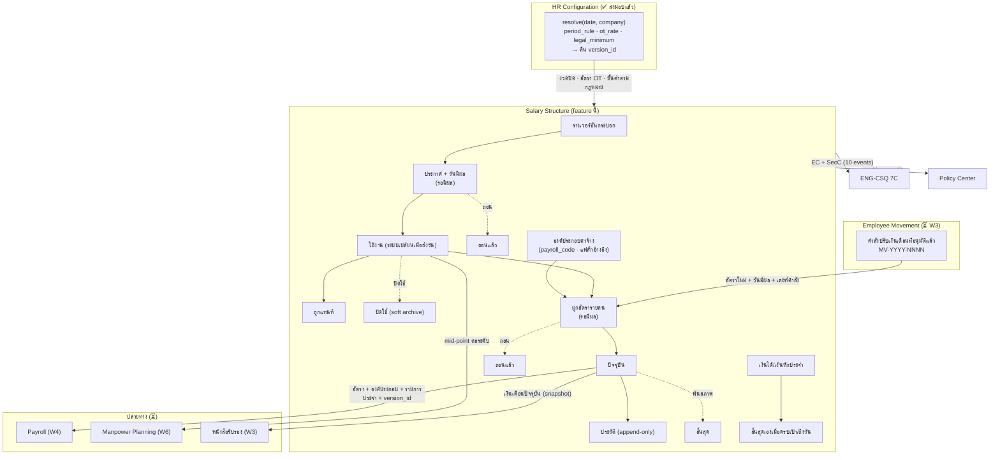
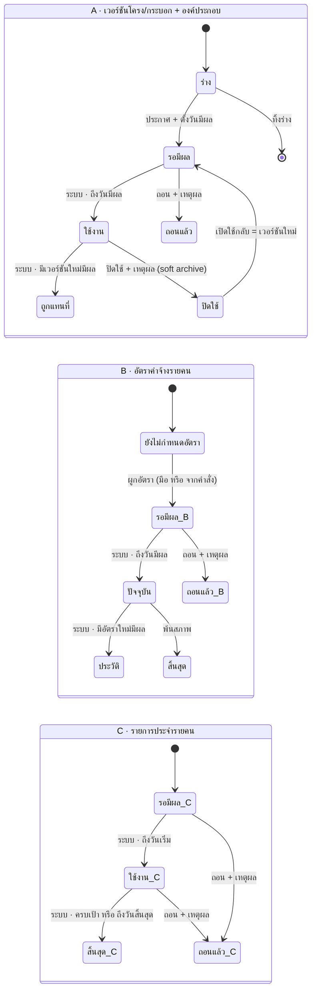

# BRD: Salary Structure (โครงเงินเดือน)

| Field | Value |
|---|---|
| BRD ID | BRD-HR-SALSTRUCT-001 |
| Feature Name | Salary Structure — โครงเงินเดือน |
| Feature Code | F-HR-SALSTRUCT |
| BRD Type | **New Feature** |
| Version | 1.0 |
| Status | **AI Reviewed — APPROVED** |
| Module / Wave / Lane | HR · W1 · Lane B |
| Archetype | `master/config` (A+B+C) — ยืนยันที่ `STANDARD_BASELINE.md` §3 (ไม่มี transition อนุมัติ · ไม่มีเลขที่เอกสาร · ไม่มีลายเซ็น · ไม่มี PDF ที่คนถือ → ไม่ใช่ Pattern Q) |
| Data Classification | **RESTRICTED** (อัตราค่าจ้างรายบุคคล) — masking ตาม role จาก Policy Center |
| Owner | BA (lane runner · feature-lane-runner v2.3 S4) |
| Stakeholders | Strike (เจ้าของ scope/OQ) · พี่เบิร์ด (ติดตามงาน) · Architect (engine candidates · F-HR-CONFIG group `legal_minimum`) · Chin (ENG-NOTIFY) · ทีม HR (HR Comp Admin · HR Manager · หัวหน้าสายงาน) |
| Created Date | 2026-08-28 |
| Last Updated | 2026-08-28 |
| Mode | **Lane Mode v2** (brd-generator-full v2.2 · no-ask · ไม่มี RIF ต้นฉบับ — PREBRIEF ทำหน้าที่ business intent) |
| Source of truth | `PREBRIEF.md` (S-01…S-47 · BR-01…BR-24 · §12 signals) · `FUNCTION_CHECKLIST.md` (**65 FN**) · `STANDARD_BASELINE.md` (24-row matrix · 19 MUST-class · lifecycle 2 ชุด) · `STANDARD_GAP.md` (G-01…G-07) · `LANE_BRIEF.md` (LOCK/OQ) · `5_DECLARATIONS/CSQ_BRIEF.md` + `NOT_NEEDED.md` · HTML `1_HTML/โครงเงินเดือน.html` (5 routes · ผ่าน S3a/S3b/S3c) |
| Upstream contract | `output/2026-08-28/F-HR-CONFIG_ตั้งค่าHR/3_FRD/00_OVERVIEW.md` §0.13 (published config surface · `resolve(date, company)` · C-1…C-6) · §0.14 (P-1…P-9) · §0.15 (soft-reference read model) |

## Changelog
- **v1.0 (2026-08-28)** — สร้าง BRD ผ่าน `brd-generator-full` v2.2 **Lane Mode v2** จาก PREBRIEF (patched S1.5 ด้วย `STANDARD_GAP.md`) + FUNCTION_CHECKLIST 65 FN + HTML v9 ที่ผ่าน gate (`COVERAGE_R1` 🟢 PASS 65/65 FN · `UX_CHECK_REPORT` 🟢 PASS · `audit.txt` FAIL=0) · **DIVERGENCE: ไม่มี** · `[ASSUMED]` สืบทอด 9 ข้อ (A1–A9 จาก `COVERAGE_MAP.md` §3) + OQ 18 ข้อ (ดู §15)

---

# Section 2: Business Context

## 2.1 ปัญหา / โอกาส

**ปัญหาที่เกิดจริงวันนี้**

| # | อาการ | ผลที่ตามมา |
|---|---|---|
| P-1 | "เงินเดือนของคนนี้ตอนนี้เท่าไร" ตอบได้จากหลายที่ — ไฟล์ Excel ของ HR · สัญญาจ้าง · บันทึกของหัวหน้า | ตัวเลขไม่ตรงกัน · เวลาออกหนังสือรับรองหรือคิดเงินเดือนต้องไล่ถามคน |
| P-2 | ไม่มี "โครงกลาง" ที่บอกว่าระดับหนึ่งควรได้เท่าไร (min–mid–max) | รับคนใหม่/ปรับเงินเดือนใช้ความรู้สึก · ตอบผู้บริหารไม่ได้ว่าคนนี้อยู่ตรงไหนของกระบอก |
| P-3 | ประวัติการปรับค่าจ้างเก็บแบบทับของเก่า | ตอบข้อพิพาทย้อนหลังไม่ได้ · ไม่รู้ว่า ณ วันนั้นใช้อัตราไหน ใครเป็นคนแก้ ด้วยเหตุผลอะไร |
| P-4 | องค์ประกอบค่าจ้าง (ค่าตำแหน่ง · ค่าครองชีพ · หักเงินกู้สวัสดิการ) กระจายอยู่ในไฟล์คิดเงินเดือนรายเดือน | ทุกงวดต้องกรอกซ้ำ · ลืมหยุดหักตอนครบยอด · เกิดข้อผิดพลาดที่แก้ย้อนหลังไม่ได้ |
| P-5 | ตัวเลขค่าจ้างรายคนอยู่ในไฟล์ที่ใครเปิดก็ได้ | ข้อมูล RESTRICTED รั่ว · ไม่มีร่องรอยว่าใครเปิดดูของใคร |
| P-6 | ค่าแรงขั้นต่ำตามกฎหมายถูกจำไว้ในหัวคนหรือเขียนตายในไฟล์ | กฎหมายเปลี่ยนแล้วไม่มีใครรู้ว่าต้องแก้ที่ไหนบ้าง |

**โอกาส**
- ทำให้ "อัตราค่าจ้างที่ถูกต้อง ณ วันที่หนึ่ง" มีแหล่งเดียว แล้วให้ **Payroll · Manpower Planning · หนังสือรับรอง · Employee Movement** อ่านจากที่นั่นผ่าน soft reference — ไม่ต้องคัดลอกตัวเลขต่อกันเป็นทอด
- โครงกระบอกที่มีวันมีผลของตัวเอง ทำให้ "ปรับโครงทั้งชุดปีหน้า" เป็นการสร้างเวอร์ชันใหม่ ไม่ใช่การเขียนทับของปีนี้
- ประวัติแบบเพิ่มอย่างเดียว (append-only) ทำให้คำถามย้อนหลังทุกคำถามตอบได้จากระบบ ไม่ต้องพึ่งความจำ

## 2.2 เป้าหมายทาง Business

| # | เป้าหมาย | อธิบาย |
|---|---|---|
| G-01 | **แหล่งเดียวของอัตราค่าจ้าง** | ทุก feature ปลายทางอ่านอัตรา ณ วันที่จากที่นี่ พร้อม `version_id` — ไม่มีการเก็บตัวเลขซ้ำที่อื่นโดยไม่มีเวอร์ชันกำกับ |
| G-02 | **กระบอกเงินเดือนที่ใช้ตัดสินใจได้** | ทุกระดับมี min–mid–max ที่มีวันมีผล · เห็น compa-ratio กับตำแหน่งในกระบอกของพนักงานทันที |
| G-03 | **ประวัติที่ตอบข้อพิพาทได้** | ทุกการเปลี่ยนอัตรามีวันมีผล ประเภทการเปลี่ยน เหตุผล ผู้บันทึก · ลบไม่ได้ · แก้ย้อนหลังไม่ได้ |
| G-04 | **ค่านโยบายไม่ตายอยู่ในโค้ด** | รอบจ่าย · อัตรา OT · ค่าแรงขั้นต่ำตามกฎหมาย มาจาก HR Configuration ผ่าน `resolve(date, company)` เสมอ |
| G-05 | **ข้อมูลค่าจ้างปลอดภัยตามสิทธิ์** | ตัวเลขรายบุคคลถูกปิดบังตาม role ทุกช่องทาง · การเปิดดูถูกบันทึกไว้ |
| G-06 | **ไม่ทำงานซ้ำกับ feature อื่น** | ไม่มีการอนุมัติ ไม่มีการคำนวณภาษี ไม่มีหน้าตั้งค่า — ทั้งสามอย่างมีเจ้าของอยู่แล้ว |

## 2.3 ตัวชี้วัดความสำเร็จ (Success Metrics) — บังคับวัดได้

| # | ตัวชี้วัด | Baseline ปัจจุบัน | Target | วัดยังไง / จากไหน | วัดเมื่อไหร่ | คู่ใน §17.3 |
|---|---|---|---|---|---|---|
| M-01 | สัดส่วนพนักงานที่มีอัตราค่าจ้างผูกไว้ในระบบ | 0% (ยังไม่มีระบบ — **ต้องเก็บ baseline จำนวนพนักงานทั้งหมดจาก Employee Master ก่อน go-live**) | ≥ 98% ภายใน 30 วันหลัง go-live | `unassigned_count` ÷ จำนวนพนักงาน active จาก Employee Master (นับจากหน้า "อัตราพนักงาน") | รายสัปดาห์ · เดือนแรกรายวัน | KPI-01 |
| M-02 | เวลาตอบคำถาม "เงินเดือนของคนนี้ ณ วันที่นั้นเท่าไร" | ~2 ชม. (ไล่ถามคน/ไฟล์ · **ประมาณจาก HR — ต้องยืนยัน baseline ก่อน launch**) | ≤ 2 นาที | จับเวลาจากการเปิดหน้า "อัตราพนักงาน" → drawer ประวัติอัตรา (ทดสอบ 10 เคสสุ่มต่อเดือน) | รายเดือน | KPI-02 |
| M-03 | จำนวนพนักงานที่อัตราอยู่นอกกระบอกโดยไม่มีเหตุผลบันทึกไว้ | ไม่ทราบ (ไม่มีกระบอกให้เทียบ) | **0 ราย** ตลอดเวลา | รายงาน "พนักงานนอกกระบอก" — นับแถวที่ `out_of_range_flag = true` แต่ `out_of_range_reason` ว่าง | รายวัน (อัตโนมัติ) | KPI-03 |
| M-04 | จำนวนตัวเลขค่านโยบาย/กฎหมายที่ฝังอยู่ในหน้าจอหรือโค้ดของ feature นี้ | — (ตรวจครั้งแรกที่ go-live) | **0 ค่า** | grep ค่าคงที่เชิงเงิน/อัตราในซอร์ส + ตรวจว่าทุกค่าที่แสดงมี `version_id` กำกับ (หน้า "ทะเบียนการใช้งาน") | ทุก release | KPI-04 |
| M-05 | สัดส่วนการเปิดดูตัวเลข RESTRICTED ที่มีบันทึก audit ครบ | — (ยังไม่มีระบบ) | **100%** | เทียบจำนวนครั้งที่เปิด drawer อัตรา กับจำนวนแถวใน audit log ของ Policy Center | รายสัปดาห์ | KPI-05 |
| M-06 | จำนวน consumer (Payroll · Manpower · หนังสือรับรอง · Employee Movement) ที่อ่านอัตราผ่าน contract เดียว | 0 จาก 4 (ทุกตัวยัง ⏳) | 4 จาก 4 เมื่อ wave ปลายทางส่งมอบ | ทะเบียนการใช้งาน (Module Linkage สถานะ ⏳/✅) + `POST /hr-config/items/:id/usage` ที่ลงทะเบียนไว้ | ทุกครั้งที่ consumer ส่งมอบ | KPI-06 |

> **หมายเหตุ baseline:** M-01 · M-02 ยังไม่มีตัวเลขจริงเพราะยังไม่มีระบบ — **action ก่อน launch:** BA เก็บ baseline (จำนวนพนักงาน active · เวลาตอบคำถามจริง 10 เคส) แล้วบันทึกกลับใน §17.3 (ดู OQ-BRD-01 ใน §15)

## 2.4 ที่มาของ Requirement

| ที่มา | สาระ |
|---|---|
| **scope note จากผู้เลือก feature (verbatim)** | "โครงเงินเดือน: ระดับ/กระบอกเงินเดือน (min-mid-max) · องค์ประกอบค่าจ้าง (เงินเดือน/ค่าตำแหน่ง/ค่าครองชีพ) · เงินได้-เงินหักประเภทคงที่ · ผูกพนักงาน = อัตราปัจจุบัน + effective_date · ข้อมูล RESTRICTED (masking ตาม role) · ไม่คิดภาษี/ประกันสังคม (Payroll) · ไม่มี approval ในตัว (การปรับเงินเดือนอยู่ Employee Movement)" |
| **CONTEXT_PACK/HR.md** (2026-08-27) | data flow: `Salary Structure ──(อัตราปัจจุบัน)──> Payroll · Manpower · หนังสือรับรอง · Employee Movement` · declarations ตั้งต้น `✓ EC/SecC` |
| **F-HR-CONFIG FRD §0.13–§0.15** (ส่งมอบ 2026-08-28) | สัญญาการอ่านค่านโยบาย C-1…C-6 · invariant P-1…P-9 · soft-reference read model |
| **STANDARD_BASELINE.md** (S0.5 · web search 6 ครั้ง) | Odoo 17–19 Payroll · D365 HR Compensation management · SAP SuccessFactors EC — capability matrix 24 แถว |
| **STANDARD_GAP.md** (S1.5 · web search 2 ครั้ง) | G-01 ค่าแรงขั้นต่ำตามกฎหมาย (MUST · governance) · G-03 ประเภทการเปลี่ยนแบบ enum (MUST) · G-02 แฟล็ก prorate (SHOULD) · G-04/G-05 defer |
| **TASTE_LOG.md** | #102 combobox · #103 lean list · #104 1 feature = 1 เมนู · #105 demo persona ใน `.demo-strip` · #106 ห้าม hint banner · #40.1 แถว ≤52px |

---

# Section 3: Scope

## 3.1 In Scope

| # | ทำอะไร | อ้าง |
|---|---|---|
| IN-01 | **ระดับ + กระบอกเงินเดือน** — รหัสระดับ · ชื่อ · ลำดับชั้น · สายงาน (ป้ายกำกับ) · min–mid–max · ขอบเขตบริษัท · วันมีผล · เวอร์ชัน | S-01…S-09 · C-01, C-02, C-12 |
| IN-02 | **เวอร์ชันของทั้งตารางกระบอก** — คัดลอกเวอร์ชันปัจจุบันแล้วปรับ % · ดูตารางเทียบค่าเก่า→ค่าใหม่ก่อนประกาศ | S-03 · C-12 |
| IN-03 | **องค์ประกอบค่าจ้าง (master)** — รหัส · รายได้/รายหัก · จำนวนคงที่ หรือ % ของ component อื่น · ความถี่ · `payroll_code` · แฟล็ก เข้าฐานเทียบกระบอก / ฐาน OT / ฐานประกันสังคม / prorate | S-10…S-12 · C-05, C-06, C-20 |
| IN-04 | **อัตราค่าจ้างรายคน** — ผูกพนักงาน × ระดับ × เงินเดือนฐาน × FTE × วันมีผล × ประเภทการเปลี่ยน × เหตุผล × เลขที่คำสั่งอ้างอิง · ประวัติแบบเพิ่มอย่างเดียว | S-13, S-18…S-21 · C-09, C-10 |
| IN-05 | **ตัวชี้วัดตำแหน่งในกระบอก** — compa-ratio · range penetration · แถบตำแหน่ง · ฐานเทียบแบบเต็มเวลาเมื่อ FTE < 1 | S-14, S-17 · C-03, C-04, C-16(บางส่วน) |
| IN-06 | **การเตือนเมื่ออัตราอยู่นอกกระบอก** — ต่ำกว่า min หรือเกิน max → เตือน บังคับเหตุผล ไม่บล็อก | S-15, S-16 · C-11 |
| IN-07 | **การเตือนเมื่อต่ำกว่าค่าแรงขั้นต่ำตามกฎหมาย** — อ่านค่าจาก HR Configuration ณ วันมีผล ไม่มีตัวเลขในหน้าจอ/โค้ด | S-45 · BR-23 · P-8 |
| IN-08 | **เงินได้/เงินหักประจำคงที่รายคน** — จำนวนหรือ % · ช่วงวันมีผล · ยอดเป้าหมาย/เพดาน · ปิดเองเมื่อครบเป้าหรือถึงวันสิ้นสุด | S-23…S-26 · C-07, C-08 |
| IN-09 | **การปิดบังข้อมูลตาม role** — ตัวเลขรายบุคคลเป็น `••••` ทุกช่องทาง (list · drawer · รายงาน · export) · การเปิดดูถูกบันทึก audit | S-27, S-28 · C-18 |
| IN-10 | **การอ่านค่านโยบายจาก HR Configuration** — รอบจ่าย/งวด · อัตรา OT · ค่าแรงขั้นต่ำ ผ่าน `resolve(date, company)` + เก็บ `version_id` + ฟัง event | S-30, S-31, S-33 · C-17 · C-1…C-6 |
| IN-11 | **ทะเบียนการใช้งาน (where-used)** — feature ที่อ่านโครงนี้ + สถานะ Module Linkage ⏳/✅ + ปรับสถานะเอง | S-35 · C-6 |
| IN-12 | **จุดเชื่อมขาเข้าจาก Employee Movement** — รับอัตราใหม่ที่อนุมัติแล้วพร้อมเลขที่คำสั่ง (รอบนี้กรอกมือได้) | S-29 · OB-03 |
| IN-13 | **การอ่านของ consumer** — คืนอัตราปัจจุบัน + องค์ประกอบ + รายการประจำ + `version_id` ณ วันที่ | S-33, S-34 · C-2, P-5 |

## 3.2 Out of Scope (ประกาศบนจอด้วย — ไม่เงียบ)

| # | ไม่ทำอะไร | เจ้าของที่แท้จริง | ประกาศที่ |
|---|---|---|---|
| OUT-01 | approval / ปุ่มส่งอนุมัติ / สถานะรออนุมัติ / สาย DOA | **Employee Movement (W3)** | S-36 · FN-47 · OQ-STD-01 |
| OUT-02 | ปรับค่าจ้างหมู่ (mass revision / compensation process) | **Employee Movement (W3)** | S-37 · FN-48 · OQ-STD-04 |
| OUT-03 | คำนวณภาษี · ประกันสังคม · กองทุนสำรองเลี้ยงชีพ · ยอดจ่ายสุทธิ · payslip | **Payroll (W4)** | S-42 · FN-49 |
| OUT-04 | หลายสกุลเงิน + ตารางอัตราแลกเปลี่ยน | รอเคาะ (เก็บ field `currency` ไว้) | S-38 · FN-50 · OQ-STD-02 |
| OUT-05 | คิดเงินย้อนหลังอัตโนมัติ (retro recalculation) | **Payroll (W4)** — ตาม P-9 ไม่มี retro | S-39 · FN-51 · OQ-STD-05 |
| OUT-06 | ค่าครองชีพตามพื้นที่ (geo zone / pay differential) | รอเคาะ — รอบนี้ใช้ขอบเขตบริษัทแทน | S-40 · FN-52 · OQ-STD-07 |
| OUT-07 | นำเข้า/ส่งออกชุดโครงและอัตราแบบ mass upload | **Attendance (W1/C)** เป็นเจ้าของแพทเทิร์น import ของ HR | S-41 · FN-53 · OQ-STD-10 |
| OUT-08 | แผนขึ้นเงินเดือนตามผลงาน (merit / comp planning worksheet) | **Performance (W5)** + **Employee Movement (W3)** | S-43 · FN-54 |
| OUT-09 | eligibility ตามประเภทจ้าง/สายงาน | รอเคาะ — รอบนี้ = ขอบเขตบริษัท + ระดับ | S-44 · FN-55 · OQ-STD-06 |
| OUT-10 | ค่าจ้างผันแปร (โบนัส / incentive target) | **Payroll (W4)** + **Performance (W5)** | S-46 · FN-59 · OQ-STD-12 |
| OUT-11 | ขั้น (step) ภายในระดับ + เลื่อนขั้นอัตโนมัติตามอายุงาน | รอเคาะ — รอบนี้ใช้กระบอกช่วง | S-47 · FN-60 · OQ-STD-13 |
| OUT-12 | หน้าตั้งค่าพารามิเตอร์ HR ใด ๆ (รอบจ่าย · อัตรา OT · ค่าแรงขั้นต่ำ · ปฏิทินวันหยุด) | **HR Configuration** (#107 · HR-1) | §3.6 ของ PREBRIEF · FN-39 |
| OUT-13 | เลขที่เอกสาร · สำเนา · PDF ที่คนถือ · ลายเซ็น | **Employee Movement** (`MV-YYYY-NNNN`) · **หนังสือรับรอง (W3)** | §7 ของ PREBRIEF · NOT_NEEDED.md |
| OUT-14 | การแจ้งเตือนพนักงานจาก feature นี้ | ปลายทาง (Employee Movement · Payroll) แจ้งเอง | OQ-STD-08 · NOT_NEEDED.md |
| OUT-15 | มุมมองพนักงานดูเงินเดือนตัวเอง | **ESS Portal (W6)** — ที่นี่เปิดแค่ read contract | OQ-HR-04 |
| OUT-16 | สร้าง permission / masking engine เอง | **Policy Center** (Roles & Permissions · Data Masking · Audit Trail) | BR-16 |

## 3.3 Assumptions

| # | สมมติฐาน | ผลถ้าผิด |
|---|---|---|
| AS-01 | HR Configuration ส่งมอบแล้ว (`resolve(date, company)` ใช้งานได้) | ถ้ายังไม่พร้อม → ต้องมี stub ที่คืน `version_id` ปลอม ห้ามฝังตัวเลข |
| AS-02 | `group=legal_minimum` จะถูกเพิ่มในหน้าทางเข้าเดียวของ HR Configuration | ถ้าไม่เพิ่ม → BR-23 แสดง "ยังไม่ได้ตั้งค่าขั้นต่ำ" ตลอด (ดู OQ-STD-11) |
| AS-03 | Employee Master ให้ combobox คน (avatar → ชื่อ → ตำแหน่ง · แผนก) ได้ | ถ้าไม่ได้ → ต้องกรอกรหัสพนักงานมือ + snapshot ชื่อ |
| AS-04 | Policy Center ให้ role + นโยบาย masking ตอน runtime | ถ้าไม่ได้ → ต้องปิดหน้าอัตราพนักงานทั้งหน้าจนกว่าจะพร้อม ห้ามเปิดเลขดิบ |
| AS-05 | consumer ทั้ง 4 ตัวยังไม่มีอยู่จริง (⏳) — เชื่อมด้วย Module Linkage แบบ manual override ก่อน | ถ้า consumer มาเร็ว → เปลี่ยนสถานะเป็น ✅ ไม่ต้องแก้ contract |
| AS-06 | `accrued_amount` ของเงินหักที่มีเป้ามาจาก Payroll ในอนาคต — รอบนี้อ่านอย่างเดียว/กรอกมือ | ถ้า Payroll ไม่ส่งกลับ → รายการหักจะไม่ปิดเองตามยอดสะสม (ปิดตามวันสิ้นสุดได้อยู่) |
| AS-07 | THB สกุลเดียวรอบนี้ | ถ้าต้องหลายสกุล → เปิด OQ-STD-02 ก่อนพัฒนา |
| AS-08 | ตำแหน่ง/แผนกของพนักงานเป็นของ Employee Master — ที่นี่อ้าง snapshot เท่านั้น | ถ้าเผลอทำ CRUD → ผิด LD-4C-02 |

## 3.4 Scope Lock ⭐ (สืบทอดจาก `LANE_BRIEF.md` §LOCK — ศักดิ์เท่าใบเซ็น)

> **LOCK ห้าม override ตลอด chain** — business rule ใดขัดกับ LOCK → **LOCK ชนะ** + แจ้งใน AI Review

| LOCK id | สาระ | ผูกกับ |
|---|---|---|
| **HR-1** | legal/policy parameter ทุกตัวมี `effective_date` เสมอ · มาจาก HR Configuration · ห้าม hardcode | BR-17 · BR-23 · §3.6 |
| **C-1…C-6** (HR-CONFIG contract) | ส่ง `date` เสมอ · เก็บ `version_id` · ห้าม cache ข้ามวัน · ห้าม CRUD · ค่า inactive ยังแสดงได้ · ลงทะเบียน where-used | BR-17, BR-18, BR-20, BR-22 |
| **P-1…P-9** (HR-CONFIG invariant) | โดยเฉพาะ **P-2** ห้ามเขียนทับค่าที่มีผลอยู่ · **P-3** ช่วงไม่ทับกัน · **P-4** append-only · **P-7** ห้ามย้อนเข้างวดที่ปิด · **P-8** ห้าม hardcode ค่ากฎหมาย · **P-9** ไม่มี retro | BR-02, BR-03, BR-04, BR-05, BR-23 |
| **#107** | feature อื่นห้ามสร้างหน้า config เอง — อ้างด้วยลิงก์ "จัดการที่ HR Configuration" | FN-39 · OUT-12 |
| **LD-4C-02** | soft reference ทุกเส้น: snapshot/display-only · nullable · ไม่มี FK cascade · ห้าม CRUD ของ feature อื่น | BR-19 · §12.1 |
| **DOA iron rule** | ไม่มี hardcoded approval chain — feature นี้ไม่มี approval เลย จึงไม่แตะ | BR-21 · FN-47 |
| **Audit append-only · ไม่มี hard delete** | ประวัติอัตราลบไม่ได้ · ปิดใช้ = soft archive | BR-05 · FN-91 |
| **7C ท่อต้องห้าม** | ห้ามประกาศ OC · DC ระดับเอกสาร · SC (register 422) | CSQ_BRIEF §3 |
| **Data Masking (Policy Center)** | RESTRICTED · masking ตาม role · ห้ามทำ permission เอง | BR-16 |
| **UI standard** | #102 combobox · #103 lean list · #104 1 feature = 1 เมนูซ้าย · #105 demo persona ใน `.demo-strip` · #106 ห้าม hint banner · #40.1 แถว ≤52px + filter แถวเดียว · CI Warm Light | §14.6 |

**⚠️ SCOPE DRIFT: ไม่มี** — In Scope ทุกข้ออยู่ใต้ scope note + LOCK · ข้อที่ standard มีแต่ scope ตัด ถูกยกเป็น OQ ครบใน §15 (ไม่มีการตัดเงียบ)

---

# Section 4: User Roles & Permissions

## 4.1 Roles ที่เกี่ยวข้อง

| Role | คือใคร | เห็นอะไร | หน้าที่ในกระบวนการ |
|---|---|---|---|
| **HR Comp Admin** | ผู้ดูแลโครงค่าจ้างขององค์กร (HR ส่วนกลาง) | ทุกอย่าง รวมตัวเลขรายคนทุกคน | **Maker** ของทุกการเปลี่ยนแปลงในหน้านี้ |
| **HR Manager** | หัวหน้างาน HR | ทุกอย่าง รวมตัวเลขรายคน | **Checker** — สอบทานรายการนอกกระบอก/ต่ำกว่าขั้นต่ำ · ปิดใช้/เปิดใช้ระดับได้ · ไม่แก้กระบอกโดยตรง `[AI-DRAFT]` OQ-SS-03 |
| **หัวหน้าสายงาน (Line Manager)** | หัวหน้าของหน่วยงาน | ระดับ + กระบอกของทีม · ตัวเลขรายคนของลูกทีม (ตามสิทธิ์ที่ Policy Center ให้) | ผู้อ่าน — ใช้วางแผนคน ไม่แก้ข้อมูล |
| **พนักงานทั่วไป / role อื่น** | ผู้ใช้ระบบทั่วไป | ระดับ + กระบอก (ช่วงของระดับ) เท่านั้น | ตัวเลขรายบุคคล = `••••` · ดูของตัวเองผ่าน ESS (⏳) |
| **ระบบปลายทาง** (Payroll · Manpower · หนังสือรับรอง · Employee Movement) | service ไม่ใช่คน | อ่านผ่าน contract ไม่ใช่หน้าจอ | อ่านอย่างเดียว + เก็บ `version_id` |
| **ระบบ (System)** | ตัวระบบเอง | — | เปลี่ยนสถานะเมื่อถึงวันมีผล · ปิดช่วงเดิม · ปิดรายการที่ครบเป้า · บันทึก audit |

> **สิทธิ์ทั้งหมดมาจาก Policy Center** (Roles & Permissions + Data Masking) — feature นี้ไม่สร้าง permission เอง · role มาจาก login · **ไม่มี persona switcher บน page header** (#105 — demo อยู่ `.demo-strip` เท่านั้น)

## 4.2 Permission Matrix

| Action | HR Comp Admin | HR Manager | หัวหน้าสายงาน | พนักงานทั่วไป | ระบบปลายทาง | System |
|---|:---:|:---:|:---:|:---:|:---:|:---:|
| ดูรายการระดับ + กระบอก | ✅ | ✅ | ✅ | ✅ | ✅ (contract) | — |
| สร้าง/แก้ร่างเวอร์ชันกระบอก | ✅ | ❌ `[AI-DRAFT]` | ❌ | ❌ | ❌ | — |
| ประกาศเวอร์ชัน (ตั้งวันมีผล) | ✅ | ❌ | ❌ | ❌ | ❌ | — |
| ถอนเวอร์ชันที่ยังไม่มีผล | ✅ | ❌ | ❌ | ❌ | ❌ | — |
| ปิดใช้ / เปิดใช้กลับ ระดับ | ✅ | ✅ | ❌ | ❌ | ❌ | — |
| สร้าง/ปิดใช้ องค์ประกอบค่าจ้าง | ✅ | ❌ | ❌ | ❌ | ❌ | — |
| ดูตัวเลขอัตรารายคน (ไม่ปิดบัง) | ✅ | ✅ | ✅ เฉพาะลูกทีม | ❌ (`••••`) | ✅ (contract) | — |
| ผูก/แก้อัตราพนักงาน (สร้างเรคคอร์ดใหม่) | ✅ | ❌ | ❌ | ❌ | ❌ | — |
| ถอนอัตราที่ยังไม่มีผล | ✅ | ❌ | ❌ | ❌ | ❌ | — |
| ปิดช่วงอัตราเมื่อพ้นสภาพ | ✅ | ❌ | ❌ | ❌ | ❌ | ✅ (จาก On/Offboard ⏳) |
| เพิ่ม/ถอน เงินได้–เงินหักประจำ | ✅ | ❌ | ❌ | ❌ | ❌ | — |
| ดูทะเบียนการใช้งาน (where-used) | ✅ | ✅ | ✅ | ✅ | — | — |
| ปรับสถานะ Module Linkage เอง | ✅ | ✅ | ❌ | ❌ | ❌ | — |
| เปลี่ยนสถานะตามวันมีผล | ❌ | ❌ | ❌ | ❌ | ❌ | ✅ |
| ลบถาวร | ❌ **ไม่มีในระบบ** | ❌ | ❌ | ❌ | ❌ | ❌ |
| ส่งอนุมัติ | ❌ **ไม่มีในระบบ** (อยู่ที่ Employee Movement) | ❌ | ❌ | ❌ | ❌ | ❌ |

---

# Section 5: User Journey (with COSO) ⭐

> **หมายเหตุ COSO ที่สำคัญ:** feature นี้ **ไม่มีขั้นอนุมัติ** ตาม scope note (OB-14 · BR-21) — บทบาท **Approver จึงว่างโดยเจตนา** ทุก step และการอนุมัติจริงเกิดที่ **Employee Movement (W3)** ซึ่งเป็นเจ้าของเอกสารคำสั่ง · การควบคุมที่นี่ใช้ **Maker (HR Comp Admin) + Checker (HR Manager สอบทานรายงาน) + System (บังคับกติกา · บันทึก audit)** แทน
> **SoD:** Maker ≠ Checker เสมอ (คนละ role · Policy Center บังคับ) · ไม่มีเคสที่คนเดียวทั้งบันทึกทั้งอนุมัติ เพราะไม่มีการอนุมัติในระบบนี้

## 5.1 Happy Path A — ประกาศโครงกระบอกเวอร์ชันใหม่

| # | Step | ผู้ทำ | ทำอะไร | Maker | Checker | Approver | System | หน้าจอ / route |
|---|---|---|---|:---:|:---:|:---:|:---:|---|
| A1 | เปิดหน้าโครงเงินเดือน tab "ระดับ/กระบอก" | HR Comp Admin | ดูเวอร์ชันปัจจุบัน + กรอง "มีผล ณ วันที่" | — | — | — | แสดงเวอร์ชันที่ active ณ วันที่ | `#/salary-structure/grade` |
| A2 | กด "+ สร้างเวอร์ชันใหม่" | HR Comp Admin | เลือกคัดลอกจากเวอร์ชันปัจจุบัน | ✅ | — | — | prefill ค่าเดิม | wizard ขั้น 1 |
| A3 | ปรับค่ากระบอก | HR Comp Admin | ปรับทีละระดับ หรือปรับ % ทั้งชุด | ✅ | — | — | ตรวจ `0 < min < mid < max` ทันที (BR-01) | wizard ขั้น 2 |
| A4 | ตั้งวันมีผล + เหตุผลการเปลี่ยน | HR Comp Admin | กรอก `effective_date` + เหตุผล ≥10 ตัวอักษร | ✅ | — | — | ตรวจช่วงไม่ทับ (BR-03) · ตรวจงวดที่ปิด (BR-04) · ตรวจค่าแรงขั้นต่ำ (BR-23) | wizard ขั้น 2 |
| A5 | ตรวจสอบและยืนยัน | HR Comp Admin | ดูตารางเทียบค่าเก่า→ค่าใหม่ | ✅ | — | — | แสดง diff + สถานะหลังบันทึก "รอมีผล" | wizard ขั้น 3 |
| A6 | บันทึก | HR Comp Admin | กดยืนยัน | ✅ | — | — | สร้างเวอร์ชัน `รอมีผล` · บันทึก audit · ยิง `salstruct.published` (SecC) | — |
| A7 | สอบทานหลังประกาศ | HR Manager | เปิดตารางเทียบ + รายงานพนักงานนอกกระบอกที่จะเกิด | — | ✅ | — | — | drawer เทียบเวอร์ชัน |
| A8 | ถึงวันมีผล | — | — | — | — | — | เปลี่ยนเป็น `ใช้งาน` · เวอร์ชันเดิม → `ถูกแทนที่` · ยิง `salstruct.effective` | อัตโนมัติเที่ยงคืน |
| A9 | ปลายทางรับรู้ | — | — | — | — | — | consumer invalidate cache แล้วอ่าน `resolve` ใหม่ | contract |

## 5.2 Happy Path B — ผูกอัตราค่าจ้างให้พนักงาน

| # | Step | ผู้ทำ | ทำอะไร | Maker | Checker | Approver | System | หน้าจอ / route |
|---|---|---|---|:---:|:---:|:---:|:---:|---|
| B1 | เปิด tab "อัตราพนักงาน" | HR Comp Admin | กรองแผนก/ระดับ/นอกกระบอก/ยังไม่กำหนดอัตรา | — | — | — | ตัวเลขปิดบังตาม role (BR-16) | `#/salary-structure/rate` |
| B2 | กด "+ ผูกอัตรา" | HR Comp Admin | เลือกพนักงานจาก combobox (#102) | ✅ | — | — | เสนอระดับตามตำแหน่งจาก Employee Master (แก้ได้) | wizard ขั้น 1 |
| B3 | กรอกอัตรา | HR Comp Admin | ระดับ · เงินเดือนฐาน · FTE · วันมีผล | ✅ | — | — | คำนวณ compa-ratio + ตำแหน่งในกระบอกให้ดูทันที (BR-07) | wizard ขั้น 2 |
| B4 | เลือกประเภทการเปลี่ยน + เหตุผล | HR Comp Admin | เลือก 1 ใน 5 ประเภท + เหตุผลข้อความ + เลขที่คำสั่ง (ถ้ามี) | ✅ | — | — | บังคับครบก่อนไปต่อ (BR-10 · BR-24) | wizard ขั้น 2 |
| B5 | ระบบเตือนกรณีพิเศษ | — | — | — | — | — | นอกกระบอก → เตือน + บังคับเหตุผล (BR-08) · ต่ำกว่าขั้นต่ำตามกฎหมาย → เตือน + บังคับเหตุผล (BR-23) · งวดที่ปิด → **บล็อก** (BR-04) | note ในฟอร์ม |
| B6 | ตรวจสอบและยืนยัน | HR Comp Admin | ทวนค่าที่จะบันทึก | ✅ | — | — | แสดงสถานะหลังบันทึก (`รอมีผล` หรือ `ปัจจุบัน`) | wizard ขั้น 3 |
| B7 | บันทึก | HR Comp Admin | กดยืนยัน | ✅ | — | — | ปิดช่วงเรคคอร์ดเดิม (`ประวัติ`) · สร้างเรคคอร์ดใหม่ · audit · ยิง `salcomp.assigned` (SecC + EC) | — |
| B8 | สอบทานรายเดือน | HR Manager | เปิดรายงานพนักงานนอกกระบอก + รายการที่ต่ำกว่าขั้นต่ำ | — | ✅ | — | — | รายงาน (§18.5) |
| B9 | ปลายทางอ่านไปใช้ | — | — | — | — | — | Payroll/หนังสือรับรอง `resolve` อัตรา ณ วันที่ + เก็บ `version_id` | contract |

## 5.3 Alternative Paths

### 5.3.1 รับอัตราใหม่จาก Employee Movement (S-29)
คำสั่งที่ **อนุมัติแล้ว** ที่ Employee Movement (⏳ W3) ส่งอัตรา + วันมีผล + เลขที่คำสั่งเข้ามา → ระบบสร้างเรคคอร์ด `รอมีผล` อ้าง `movement_doc_no` — **ที่นี่ไม่อนุมัติซ้ำ** (Approver = ที่ต้นทาง) · รอบนี้ Module Linkage ยัง ⏳ จึงกรอกมือได้ · ถ้าคำสั่งถูกยกเลิก → ถอนอัตราที่ยังไม่มีผล (S-20)

### 5.3.2 เพิ่มเงินได้/เงินหักประจำ (S-23, S-24)
Maker เลือกพนักงาน + องค์ประกอบ + จำนวน (หรือ %) + ช่วงวันมีผล · เงินหักเพิ่ม "ยอดเป้าหมายรวม" ได้ → System ปิดรายการเองเมื่อยอดสะสมถึงเป้าหรือถึงวันสิ้นสุด (BR-14 · S-25)

### 5.3.3 ปิดใช้ระดับ / องค์ประกอบ (S-08, S-12)
Maker กด "ปิดใช้" → System แสดง `where_used_count` (จำนวนพนักงาน + feature ที่อ้าง) → Maker ยืนยันพร้อมเหตุผล → soft archive: เลือกใหม่ไม่ได้ ของเดิมยังอ่านได้ · **ไม่มีปุ่มลบถาวร** (BR-05)

### 5.3.4 เปิดใช้ระดับกลับ (S-09)
ไม่ย้อนสถานะเดิม — System สร้าง **เวอร์ชันใหม่** ที่ `รอมีผล` พร้อมวันมีผลใหม่ (P-2)

### 5.3.5 ดูข้อมูลด้วย role ที่ไม่มีสิทธิ์ (S-27)
ผู้ใช้เห็นระดับ + กระบอกของระดับ แต่ตัวเลขรายบุคคลเป็น `••••` ทุกช่องทาง (list · drawer · รายงาน · export) — ไม่มีทางเห็นตัวเลขผ่านช่องทางไหน

## 5.4 Exception Paths (ทุกข้อมี Business Rule คู่)

| # | เหตุการณ์ | ระบบทำอะไร | BR | Scenario |
|---|---|---|---|---|
| E-01 | กรอก `min ≥ mid` หรือ `mid ≥ max` หรือค่า ≤ 0 | **บล็อก** ตั้งแต่ร่าง + ชี้แถวที่ผิด | BR-01 | S-04 |
| E-02 | พยายามแก้เวอร์ชันที่ใช้งานอยู่ | ปุ่มแก้ปิด + เสนอ "สร้างเวอร์ชันใหม่" | BR-02 (P-2) | S-05 |
| E-03 | ช่วงวันมีผลทับกับเวอร์ชันเดิมของ (ระดับ × ขอบเขตบริษัท) | **บล็อก** + บอกเวอร์ชันที่ชน | BR-03 (P-3) | S-06 |
| E-04 | ตั้งวันมีผลย้อนเข้างวดที่ปิดแล้ว | **บล็อก** + บอกวันที่เร็วที่สุดที่ตั้งได้ + ปุ่ม "ใช้วันที่เร็วที่สุด" | BR-04 (P-7) | S-22 |
| E-05 | องค์ประกอบแบบ % อ้างตัวเอง/อ้างวน | **บล็อก** + ชี้วงจรการอ้างอิง | BR-12 | S-11 |
| E-06 | อัตราต่ำกว่า min ของกระบอก | **เตือน (ไม่บล็อก)** + บังคับ `out_of_range_reason` + ติดธง + ขึ้นรายงาน | BR-08 | S-15 |
| E-07 | อัตราเกิน max ของกระบอก | เหมือน E-06 (เคส red-circle มีจริง) | BR-08 | S-16 |
| E-08 | กระบอกหรืออัตราต่ำกว่าค่าแรงขั้นต่ำตามกฎหมาย | **เตือน (ไม่บล็อก)** + บังคับเหตุผล + ติดธง — อ่านค่าจาก HR Configuration ณ วันมีผล **ไม่มีตัวเลขในหน้าจอ** | BR-23 (P-8) | S-45 |
| E-09 | ยังไม่มีค่าขั้นต่ำใน HR Configuration | แสดง "ยังไม่ได้ตั้งค่าขั้นต่ำ" — **ห้ามเดาตัวเลข** | BR-23 · OQ-STD-11 | S-45 |
| E-10 | ช่วงวันของ (พนักงาน × องค์ประกอบ) ทับกัน | **บล็อก** + บอกรายการที่ชน | BR-15 | S-26 |
| E-11 | ค่าที่อ้างจาก HR Configuration ถูกปิดใช้ | ของเดิมยังแสดง + ป้าย "ปิดใช้แล้ว" · เลือกใหม่ไม่ได้ · มีลิงก์จัดการ | BR-18 (C-5) | S-31 |
| E-12 | HR Configuration ปิดงวด (`hrconfig.period_closed`) | ล้าง cache ทันที + กันการตั้งวันมีผลย้อนเข้างวดนั้น | BR-17 (C-3) | S-30 |
| E-13 | พนักงานต้นทางลาออก/ถูกปิด | ประวัติอัตรายังอ่านได้จาก `employee_name_snapshot` + ป้าย "(พ้นสภาพ)" | BR-19 (LD-4C-02) | S-32 |
| E-14 | พนักงานพ้นสภาพ | ปิดช่วงอัตราเป็น `สิ้นสุด` ณ วันสุดท้าย · **ไม่ลบประวัติ** | BR-05 | S-21 |
| E-15 | ไม่มีกระบอกของระดับนั้น ณ วันที่ | compa-ratio แสดง "—" ไม่คำนวณมั่ว | BR-07 | S-14 |
| E-16 | ไม่มี component ใดติดแฟล็ก "เข้าฐานเทียบกระบอก" | เตือน + ใช้ `BASE` เป็นฐาน | BR-06 | S-14 |
| E-17 | กดบันทึกซ้ำระหว่างรอผล | ปุ่มถูกปิด + ตัวหมุน "กำลังบันทึก…" · กันสร้างซ้ำ | FN-92 | กติกากลาง |

## 5.5 Process Diagram



---

# Section 6: Data Entity & Fields

## 6.1 Entity Overview

| Entity | คืออะไร | ชนิด | Classification | ประวัติ |
|---|---|---|---|---|
| `salary_grade` | ระดับ/เกรด (หัวเรื่อง) | master | Internal | soft archive |
| `grade_band_version` | เวอร์ชันของกระบอก min–mid–max ต่อระดับ | master (effective-dated) | Internal | append-only |
| `pay_component` | องค์ประกอบค่าจ้าง (BASE · POS-ALW · COL-ALW · LOAN-DED) | master (effective-dated) | Internal | append-only |
| `employee_comp_record` | อัตราค่าจ้างรายคน ณ ช่วงเวลาหนึ่ง | transactional master | **RESTRICTED** | append-only |
| `employee_recurring_item` | เงินได้/เงินหักประจำคงที่รายคน | transactional master | **RESTRICTED** | append-only |
| `salstruct_consumer_usage` | ทะเบียนการใช้งาน (where-used) + Module Linkage | registry | Internal | แก้สถานะได้ (manual override) |
| *(อ้างอิงเท่านั้น)* Employee · Organization · HR Config version · Movement doc | ของ feature อื่น | **soft reference** | ตามต้นทาง | ห้าม CRUD |

## 6.2 Entity: `salary_grade` + `grade_band_version`

| # | Field | Label UI | Input Type | ค่า/ตัวเลือก | จำเป็น | เงื่อนไข | หมายเหตุ |
|---|---|---|---|---|:---:|---|---|
| 1 | `grade_code` | รหัสระดับ | TEXT (≤10) | เช่น P1…P7 | ✅ | unique ต่อขอบเขตบริษัท · ตัวพิมพ์ใหญ่+ตัวเลข | key ที่ปลายทางอ้าง |
| 2 | `grade_name` | ชื่อระดับ | TEXT | — | ✅ | — | |
| 3 | `level_order` | ลำดับชั้น | NUMBER | > 0 | ✅ | ไม่ซ้ำในชุดเดียวกัน | `[AI-DRAFT]` |
| 4 | `job_family` | สายงาน | TEXT | เช่น Ops · Sales | ⬜ | รอบนี้เป็นป้ายกำกับ ไม่ใช้ตัดสิน eligibility | S-44 · OQ-STD-06 |
| 5 | `company_scope` | ขอบเขตบริษัท | DROPDOWN-SINGLE | ทุกบริษัท / เฉพาะบริษัท | ✅ | "เฉพาะ" ต้องมี `companies[]` ≥1 | OQ-HR-05 |
| 6 | `companies[]` | บริษัทที่ใช้ | LOOKUP (multi) | จาก Organization | ⬜ | เก็บ `company_id` + snapshot ชื่อ | LD-4C-02 |
| 7 | `min_amount` | ขั้นต่ำของกระบอก | NUMBER (money) | > 0 | ✅ | **< `mid_amount`** · เตือนถ้าต่ำกว่าขั้นต่ำตามกฎหมาย | BR-01 · BR-23 |
| 8 | `mid_amount` | กลางกระบอก | NUMBER (money) | — | ✅ | **> min · < max** | BR-01 · ฐาน compa-ratio |
| 9 | `max_amount` | ขั้นสูงของกระบอก | NUMBER (money) | — | ✅ | **> `mid_amount`** | BR-01 |
| 10 | `currency` | สกุลเงิน | AUTO | THB | ✅ | รอบนี้สกุลเดียว | S-38 · OQ-STD-02 |
| 11 | `effective_date` | วันมีผล | DATE | — | ✅ | ห้ามย้อนเข้างวดที่ปิด · ช่วงไม่ทับกัน | P-1 · P-3 · P-7 |
| 12 | `effective_to` | มีผลถึง | AUTO (computed) | — | — | คำนวณจากเวอร์ชันถัดไป | P-3 |
| 13 | `version_status` | สถานะเวอร์ชัน | AUTO | ร่าง · รอมีผล · ใช้งาน · ถูกแทนที่ · ถอนแล้ว · ปิดใช้ | ✅ | ตาม §8.1 | |
| 14 | `change_reason` | เหตุผลการเปลี่ยน | TEXTAREA | ≥10 ตัวอักษร | ✅ ตั้งแต่เวอร์ชันที่ 2 | — | audit |
| 15 | `changed_by` / `changed_at` | ผู้แก้ / เวลา | AUTO | login / now | ✅ | เก็บ `employee_id` + snapshot ชื่อ | LD-4C-02 |
| 16 | `where_used_count` | จำนวนที่อ้างค่านี้ | AUTO (computed) | — | — | พนักงาน + consumer ที่อ้าง | BR-22 |

## 6.3 Entity: `pay_component`

| # | Field | Label UI | Input Type | ค่า/ตัวเลือก | จำเป็น | เงื่อนไข | หมายเหตุ |
|---|---|---|---|---|:---:|---|---|
| 1 | `component_code` | รหัสองค์ประกอบ | TEXT (≤10) | `BASE` · `POS-ALW` · `COL-ALW` · `LOAN-DED` | ✅ | unique | |
| 2 | `component_name` | ชื่อองค์ประกอบ | TEXT | — | ✅ | — | |
| 3 | `direction` | ประเภท | DROPDOWN-SINGLE | รายได้ / รายหัก | ✅ | — | |
| 4 | `calc_type` | วิธีคิด | DROPDOWN-SINGLE | จำนวนคงที่ / % ของ component อื่น | ✅ | ถ้า % ต้องมี `base_component_code` | BR-12 |
| 5 | `base_component_code` | อ้างอิงจาก | LOOKUP | component อื่น | ⬜ | **ห้ามอ้างตัวเอง/อ้างวน** | BR-12 · S-11 |
| 6 | `frequency` | ความถี่ | DROPDOWN-SINGLE | ทุกงวด / รายเดือน / รายปี | ✅ | อ้างรอบจ่ายจาก HR Configuration | C-17 |
| 7 | `include_in_band_base` | เข้าฐานเทียบกระบอก | TOGGLE | true/false | ✅ | default true เฉพาะ `BASE` | BR-06 · OQ-STD-09 |
| 8 | `payroll_code` | รหัสส่งจ่ายเงิน | TEXT | default = `component_code` | ✅ | **สะพานไป Payroll — ที่นี่ไม่คำนวณ** | BR-13 · C-20 |
| 9 | `is_ot_base` | เป็นฐาน OT | TOGGLE | false | ⬜ | **แฟล็กอ้างอิงให้ปลายทาง** | BR-13 |
| 10 | `is_ssf_base` | เป็นฐานประกันสังคม | TOGGLE | false | ⬜ | แฟล็กอ้างอิง — ที่นี่ไม่คิดเงิน | BR-13 · S-42 |
| 11 | `prorate_by_payment_days` | ขึ้นกับวันทำงานจริง | TOGGLE | false | ✅ | สัญญาณให้ Payroll · ที่นี่ไม่คำนวณ | G-02 `[AI-DRAFT]` |
| 12 | `status` | สถานะ | AUTO | ใช้งาน / ปิดใช้ | ✅ | soft archive เท่านั้น | BR-05 |
| 13 | `effective_date` | วันมีผล | DATE | — | ✅ | HR-1 | P-1 |

## 6.4 Entity: `employee_comp_record` — **RESTRICTED**

| # | Field | Label UI | Input Type | ค่า/ตัวเลือก | จำเป็น | เงื่อนไข | หมายเหตุ |
|---|---|---|---|---|:---:|---|---|
| 1 | `employee_id` | พนักงาน | LOOKUP (combobox #102) | จาก Employee Master | ✅ | เก็บ id + `employee_name_snapshot` | LD-4C-02 · S-32 |
| 2 | `grade_code` | ระดับ | LOOKUP | ระดับที่ **ใช้งาน** ณ วันมีผล | ✅ | ระดับที่ปิดใช้เลือกใหม่ไม่ได้ | BR-05 |
| 3 | `base_amount` | เงินเดือนฐาน | NUMBER (money) | > 0 | ✅ | **masked ตาม role** | BR-16 · **RESTRICTED** |
| 4 | `fte` | สัดส่วนเวลาทำงาน (FTE) | NUMBER (3,2) | 0.01–1.00 · default 1.00 | ✅ | ใช้คำนวณฐานเทียบเต็มเวลา | BR-09 · OQ-STD-03 |
| 5 | `currency` | สกุลเงิน | AUTO | THB | ✅ | — | S-38 |
| 6 | `effective_date` | วันมีผล | DATE | — | ✅ | ห้ามย้อนเข้างวดที่ปิด · ช่วงไม่ซ้อน | P-7 · BR-11 |
| 7 | `effective_to` | มีผลถึง | AUTO (computed) | — | — | จากเรคคอร์ดถัดไป หรือวันพ้นสภาพ | BR-11 |
| 8 | `record_status` | สถานะ | AUTO | รอมีผล · ปัจจุบัน · ประวัติ · ถอนแล้ว · สิ้นสุด | ✅ | ตาม §8.2 | |
| 9 | `change_reason_code` | ประเภทการเปลี่ยน | DROPDOWN-SINGLE | ปรับประจำปี · เลื่อนตำแหน่ง · ปรับกลางปี · รับโอน/ปรับโครงสร้าง · แก้ไขข้อผิดพลาด | ✅ | บังคับเลือกเพื่อให้รายงาน/audit จัดกลุ่มได้ | BR-24 · G-03 `[ASSUMED]` |
| 10 | `change_reason` | เหตุผลการเปลี่ยน | TEXTAREA | ≥10 ตัวอักษร | ✅ | **ไม่ใช่การอนุมัติ** | BR-10 |
| 11 | `movement_doc_no` | เลขที่คำสั่งอ้างอิง | TEXT (soft ref) | `MV-YYYY-NNNN` | ⬜ | ที่นี่ไม่ออกเลข — อ้างของ Employee Movement | S-29 |
| 12 | `out_of_range_reason` | เหตุผลที่อยู่นอกกระบอก | TEXTAREA | — | ✅ เมื่อออกนอกกระบอก/ต่ำกว่าขั้นต่ำ | บังคับตาม BR-08 · BR-23 | |
| 13 | `out_of_range_flag` | ธงนอกกระบอก | AUTO (computed) | true/false | — | `band_base < min` หรือ `> max` | รายงาน §18.5 |
| 14 | `legal_min_version_id` | เวอร์ชันค่าขั้นต่ำที่ใช้ตรวจ | AUTO | จาก `resolve()` | ⬜ | เก็บเมื่อมีการเตือน BR-23 | P-8 · C-2 |
| 15 | `created_by` / `created_at` | ผู้บันทึก / เวลา | AUTO | login / now | ✅ | append-only | BR-05 |

## 6.5 Entity: `employee_recurring_item` — **RESTRICTED**

| # | Field | Label UI | Input Type | ค่า/ตัวเลือก | จำเป็น | เงื่อนไข | หมายเหตุ |
|---|---|---|---|---|:---:|---|---|
| 1 | `employee_id` | พนักงาน | LOOKUP (#102) | — | ✅ | soft ref + snapshot ชื่อ | LD-4C-02 |
| 2 | `component_code` | องค์ประกอบ | LOOKUP | component ที่ **ใช้งาน** ณ วันเริ่ม | ✅ | ที่ปิดใช้เลือกใหม่ไม่ได้ | BR-05 |
| 3 | `amount` / `percent` | จำนวน / เปอร์เซ็นต์ | NUMBER | อย่างใดอย่างหนึ่ง | ✅ | ตาม `calc_type` ของ component · **masked ตาม role** | BR-16 |
| 4 | `effective_from` | วันเริ่มมีผล | DATE | — | ✅ | ห้ามย้อนเข้างวดที่ปิด | P-7 |
| 5 | `effective_to` | วันสิ้นสุด | DATE | — | ⬜ | ≥ `effective_from` · ช่วงไม่ทับต่อ (พนักงาน × component) | BR-15 |
| 6 | `goal_amount` | ยอดเป้าหมายรวม | NUMBER (money) | เฉพาะรายหัก | ⬜ | ใช้ปิดรายการอัตโนมัติ | BR-14 |
| 7 | `accrued_amount` | ยอดสะสม | AUTO (read-only) | จาก Payroll (⏳) | — | รอบนี้ mock/กรอกมือ | OQ-SS-02 `[AI-DRAFT]` |
| 8 | `item_status` | สถานะรายการ | AUTO | รอมีผล · ใช้งาน · สิ้นสุด · ถอนแล้ว | ✅ | ปิดเองเมื่อครบเป้า/ถึงวันสิ้นสุด | BR-14 |

## 6.6 Entity: `salstruct_consumer_usage` (ทะเบียนการใช้งาน · soft ref)

| # | Field | Label UI | Input Type | จำเป็น | หมายเหตุ |
|---|---|---|---|:---:|---|
| 1 | `consumer_code` | feature ที่อ่าน | AUTO | ✅ | `F-HR-PAYROLL` · `F-HR-MANPOWER` · `F-HR-CERT` · `F-HR-MOVEMENT` |
| 2 | `reads_what` | อ่านอะไรไปใช้ | TEXT | ✅ | เช่น "อัตราปัจจุบัน + องค์ประกอบ + รายการประจำ + เวอร์ชัน" |
| 3 | `link_status` | สถานะเชื่อม | TOGGLE/AUTO | ✅ | ⏳ ยังไม่เชื่อม / ✅ เชื่อมแล้ว (Module Linkage) |
| 4 | `manual_override` | ปรับสถานะเอง | TOGGLE | ⬜ | ให้ HR ปรับได้ระหว่างที่ consumer ยังไม่ส่งมอบ |
| 5 | `ref_count` | จำนวนที่อ้าง | AUTO | — | ใช้เตือนก่อนปิดใช้ค่า |

## 6.7 Computed / แสดงอย่างเดียว

| ค่า | สูตร | หมายเหตุ |
|---|---|---|
| `band_base` | ผลรวม component ที่ `include_in_band_base = true` ณ วันที่ — **default = เงินเดือนฐานตัวเดียว** | BR-06 · `[ASSUMED]` OQ-STD-09 |
| `fte_adjusted_base` | `band_base ÷ fte` | BR-09 · ใช้เทียบกระบอกเมื่อ FTE < 1 |
| `compa_ratio` | `fte_adjusted_base ÷ mid_amount` (แสดง 2 ตำแหน่ง) | BR-07 · แสดงผลอย่างเดียว |
| `range_penetration` | `(fte_adjusted_base − min) ÷ (max − min)` × 100% | BR-07 · แถบตำแหน่งในกระบอก |
| `total_fixed_monthly` | เงินเดือนฐาน + เงินได้ประจำที่มีผล − เงินหักประจำที่มีผล | **ไม่ใช่ยอดจ่ายสุทธิ** (S-42) |
| `unassigned_count` | จำนวนพนักงาน active ที่ยังไม่มีอัตรา | S-18 · KPI-01 |
| `version_diff` | ค่าเก่า → ค่าใหม่ ต่อระดับ ระหว่าง 2 เวอร์ชัน | S-03 |

## 6.8 Entity Relationship

```
salary_grade ──(1:N)──▶ grade_band_version        (เวอร์ชันของกระบอก · effective-dated · ช่วงไม่ทับ)
salary_grade ──(referenced by · soft)──▶ employee_comp_record
pay_component ──(referenced by · soft)──▶ employee_recurring_item
pay_component ──(self ref · %)──▶ pay_component    (ห้ามวน · BR-12)
Employee Master ──(soft ref + name snapshot)──▶ employee_comp_record · employee_recurring_item
Organization ──(soft ref)──▶ salary_grade.companies[]
HR Configuration version ──(snapshot version_id)──▶ ทุก entity ที่อ่านค่านโยบาย
Employee Movement doc ──(soft ref movement_doc_no · nullable)──▶ employee_comp_record
employee_comp_record ──(1:N)──▶ (ประวัติ append-only ของพนักงานคนเดียวกัน)
salstruct_consumer_usage ──(registry)──▶ Payroll · Manpower · หนังสือรับรอง · Employee Movement
```
**ไม่มี FK cascade เส้นใดเลย** — ทุกเส้นข้าม feature เป็น soft reference (LD-4C-02) เพราะปลายทางยังไม่มีอยู่จริง

---

# Section 7: User Stories & Acceptance Criteria

> รูปแบบ: 1 story = 1 ความสามารถเดียว (ไม่มีคำเชื่อม "หลายเรื่องในประโยคเดียว") · ทุก story มี AC ≥ 2 ข้อ · ทุก story trace ไป FN-XX + S-XX

## Story ST-01: สร้างระดับพร้อมกระบอกเงินเดือน
**ในฐานะ** HR Comp Admin **ฉันต้องการ** บันทึกระดับใหม่พร้อมช่วง min–mid–max เป็นร่าง **เพื่อ** ให้องค์กรมีเกณฑ์กลางของแต่ละระดับ · trace: FN-01 · S-01 · BR-01
**Given** อยู่ที่ tab ระดับ/กระบอก **When** กรอกรหัสระดับ ชื่อ ลำดับชั้น ค่ากระบอกครบ แล้วบันทึก **Then** ได้ร่างเวอร์ชันที่ยังไม่กระทบใคร
- **AC-1:** ร่างที่บันทึกแล้วมีสถานะ "ร่าง" · ยังไม่ปรากฏใน `resolve(date)` ของ consumer
- **AC-2:** รหัสระดับซ้ำภายในขอบเขตบริษัทเดียวกันบันทึกไม่ได้
- **AC-3:** ร่างที่ยังไม่ประกาศทิ้งได้ (ยังไม่ใช่ข้อมูลจริง)

## Story ST-02: ประกาศเวอร์ชันพร้อมวันมีผล
**ในฐานะ** HR Comp Admin **ฉันต้องการ** ตั้งวันมีผลให้ร่าง **เพื่อ** ให้ปลายทางเตรียมตัวล่วงหน้าก่อนของจริงเริ่มใช้ · trace: FN-02 · S-01 · BR-02
**Given** มีร่างที่ผ่านการตรวจค่ากระบอก **When** ใส่วันมีผลกับเหตุผลแล้วกดประกาศ **Then** สถานะเป็น "รอมีผล"
- **AC-1:** เวอร์ชัน "รอมีผล" ยังไม่ถูกคืนโดย `resolve(date)` จนกว่าจะถึงวันมีผล
- **AC-2:** เวอร์ชันที่ 2 ขึ้นไปบังคับกรอกเหตุผลอย่างน้อย 10 ตัวอักษร
- **AC-3:** ระบบยิงเหตุการณ์ `salstruct.published` หนึ่งครั้งต่อการประกาศ

## Story ST-03: ให้เวอร์ชันเปลี่ยนสถานะเองเมื่อถึงวันมีผล
**ในฐานะ** ระบบ **ฉันต้องการ** เปลี่ยนเวอร์ชันเป็น "ใช้งาน" ตอนถึงวันมีผล **เพื่อ** ไม่ต้องพึ่งคนกดสวิตช์ · trace: FN-03 · S-02
**Given** มีเวอร์ชันสถานะ "รอมีผล" ที่วันมีผลคือวันนี้ **When** ถึงเที่ยงคืนของวันมีผล **Then** เวอร์ชันนั้นเป็น "ใช้งาน" · เวอร์ชันเดิมเป็น "ถูกแทนที่"
- **AC-1:** เลื่อนตัวกรอง "มีผล ณ วันที่" ไปวันในอนาคตแล้วเห็นเวอร์ชันที่จะมีผลเป็น "ใช้งาน" ของวันนั้น
- **AC-2:** เวอร์ชันที่ถูกแทนที่ยังอ่านย้อนหลังได้ตลอด
- **AC-3:** ระบบยิง `salstruct.effective` พร้อม `superseded_version_id`

## Story ST-04: คัดลอกเวอร์ชันปัจจุบันเพื่อปรับทั้งชุด
**ในฐานะ** HR Comp Admin **ฉันต้องการ** สร้างเวอร์ชันใหม่จากของเดิมแล้วปรับเป็นเปอร์เซ็นต์ **เพื่อ** ไม่ต้องพิมพ์ทุกระดับใหม่ · trace: FN-04 · S-03
**Given** มีเวอร์ชันที่ใช้งานอยู่ **When** กดสร้างเวอร์ชันใหม่แบบคัดลอกแล้วใส่เปอร์เซ็นต์ที่ปรับ **Then** ทุกระดับถูกปรับตามเปอร์เซ็นต์นั้น
- **AC-1:** ค่าที่ปรับแล้วยังผ่านกติกา `0 < min < mid < max` ทุกแถว
- **AC-2:** การปัดเศษหลังปรับเปอร์เซ็นต์เป็นหลักร้อย (`[ASSUMED]` A9)

## Story ST-05: เทียบค่าเก่ากับค่าใหม่ก่อนประกาศ
**ในฐานะ** HR Comp Admin **ฉันต้องการ** เห็นตารางเทียบต่อระดับ **เพื่อ** ตรวจก่อนว่าการปรับกระทบใครบ้าง · trace: FN-04 · S-03
**Given** มีเวอร์ชันตั้งแต่ 2 ชุดขึ้นไป **When** กดเทียบเวอร์ชัน **Then** เห็นค่าเดิม ค่าใหม่ ส่วนต่าง เปอร์เซ็นต์ ต่อระดับ
- **AC-1:** ตารางเทียบอ่านอย่างเดียว ไม่มีปุ่มแก้ค่าในนั้น
- **AC-2:** ระดับที่ไม่เปลี่ยนค่าแสดงส่วนต่างเป็นศูนย์ ไม่ถูกซ่อน

## Story ST-06: บล็อกกระบอกที่ค่าไม่สมเหตุผล
**ในฐานะ** ระบบ **ฉันต้องการ** ปฏิเสธค่ากระบอกที่ผิดลำดับ **เพื่อ** กันข้อมูลเสียตั้งแต่ต้นทาง · trace: FN-05 · S-04 · BR-01
**Given** กำลังกรอกกระบอก **When** ใส่ min ≥ mid หรือ mid ≥ max หรือค่าที่ ≤ 0 **Then** บันทึกไม่ได้ พร้อมชี้แถวที่ผิด
- **AC-1:** ข้อความผิดพลาดระบุระดับที่ผิดแบบเจาะจง ไม่ใช่ข้อความรวม
- **AC-2:** แก้ค่าให้ถูกแล้วข้อความผิดพลาดหายทันทีโดยไม่ต้องรีเฟรช

## Story ST-07: กันการแก้เวอร์ชันที่ใช้งานอยู่
**ในฐานะ** ระบบ **ฉันต้องการ** ปิดทางแก้ค่าเวอร์ชันที่มีผลอยู่ **เพื่อ** รักษาหลักฐานของกติกาที่เคยใช้ · trace: FN-06 · S-05 · BR-02 (P-2)
**Given** เปิดดูเวอร์ชันสถานะ "ใช้งาน" **When** มองหาปุ่มแก้ **Then** ไม่มีปุ่มแก้ค่า มีเฉพาะปุ่มสร้างเวอร์ชันใหม่
- **AC-1:** ไม่มีช่องทางใดในระบบที่แก้ค่าเวอร์ชันที่ใช้งานอยู่ได้
- **AC-2:** มีคำอธิบายสั้นบอกทางออกว่าให้สร้างเวอร์ชันใหม่แทน

## Story ST-08: บล็อกช่วงวันมีผลที่ทับกัน
**ในฐานะ** ระบบ **ฉันต้องการ** ปฏิเสธเวอร์ชันที่ช่วงเวลาซ้อนของเดิม **เพื่อ** ให้ทุกวันมีคำตอบเดียว · trace: FN-07 · S-06 · BR-03 (P-3)
**Given** มีเวอร์ชันของระดับเดียวกันในขอบเขตบริษัทเดียวกันอยู่แล้ว **When** ตั้งวันมีผลที่ทับช่วงเดิม **Then** บันทึกไม่ได้ พร้อมบอกเวอร์ชันที่ชน
- **AC-1:** ข้อความบอกเลขเวอร์ชันที่ชนกับช่วงวันของมัน
- **AC-2:** ระดับต่างขอบเขตบริษัทกันตั้งวันเดียวกันได้ ไม่ถือว่าชน

## Story ST-09: ถอนเวอร์ชันที่ยังไม่มีผล
**ในฐานะ** HR Comp Admin **ฉันต้องการ** ยกเลิกเวอร์ชันที่ประกาศไปแล้วแต่ยังไม่ถึงวัน **เพื่อ** แก้การประกาศผิดโดยไม่ทิ้งร่องรอยหาย · trace: FN-08 · S-07
**Given** มีเวอร์ชันสถานะ "รอมีผล" **When** กดถอนแล้วกรอกเหตุผล **Then** สถานะเป็น "ถอนแล้ว"
- **AC-1:** เหตุผลเป็นช่องบังคับ ปล่อยว่างกดยืนยันไม่ได้
- **AC-2:** เวอร์ชันที่ถอนแล้วยังอยู่ในประวัติ ลบไม่ได้
- **AC-3:** ระบบยิง `salstruct.cancelled`

## Story ST-10: ปิดใช้ระดับโดยเห็นผลกระทบก่อน
**ในฐานะ** HR Comp Admin **ฉันต้องการ** เห็นจำนวนพนักงานที่ยังอ้างระดับนั้นก่อนยืนยัน **เพื่อ** ไม่ปิดของที่ยังมีคนใช้โดยไม่รู้ตัว · trace: FN-09 · S-08 · BR-05 · BR-22
**Given** ระดับสถานะ "ใช้งาน" มีพนักงานอ้างอยู่ **When** กดปิดใช้ **Then** เห็นจำนวนกับรายชื่อที่อ้างก่อนยืนยัน
- **AC-1:** หน้าต่างยืนยันแสดง `where_used_count` พร้อมรายชื่อตัวอย่าง
- **AC-2:** เหตุผลเป็นช่องบังคับ
- **AC-3:** ไม่มีปุ่มลบถาวรในทุกจุดของหน้านี้

## Story ST-11: ให้ระดับที่ปิดใช้ยังอ่านได้
**ในฐานะ** HR Comp Admin **ฉันต้องการ** ให้พนักงานที่อ้างระดับที่ปิดไปแล้วยังแสดงระดับนั้นได้ **เพื่อ** ไม่ทำลายข้อมูลเก่า · trace: FN-10 · S-08 · BR-05
**Given** ระดับถูกปิดใช้ **When** เปิดรายการอัตราของพนักงานที่อ้างระดับนั้น **Then** ยังเห็นระดับเดิมพร้อมป้าย "ปิดใช้"
- **AC-1:** ระดับที่ปิดใช้หายจากตัวเลือกของรายการใหม่
- **AC-2:** รายการเดิมที่อ้างอยู่ไม่ถูกเปลี่ยนค่าโดยอัตโนมัติ

## Story ST-12: เปิดใช้ระดับกลับเป็นเวอร์ชันใหม่
**ในฐานะ** HR Comp Admin **ฉันต้องการ** นำระดับที่ปิดไว้กลับมาใช้ผ่านเวอร์ชันใหม่ **เพื่อ** รักษาลำดับเวลาให้ตรงความจริง · trace: FN-11 · S-09
**Given** ระดับสถานะ "ปิดใช้" **When** กดเปิดใช้กลับ **Then** ระบบเปิดฟอร์มสร้างเวอร์ชันใหม่ที่ต้องมีวันมีผล
- **AC-1:** สถานะเดิมไม่ถูกย้อนกลับ ระบบสร้างเวอร์ชันใหม่เสมอ
- **AC-2:** ต้องกรอกเหตุผลก่อนประกาศเวอร์ชันที่เปิดกลับ

## Story ST-13: ดูประวัติเวอร์ชันย้อนหลัง
**ในฐานะ** HR Manager **ฉันต้องการ** ไล่ดูทุกเวอร์ชันของกระบอกพร้อมผู้แก้ **เพื่อ** ตอบคำถามว่าปีนั้นใช้ค่าอะไร · trace: FN-12 · S-02 · S-03
**Given** ระดับมีหลายเวอร์ชัน **When** เปิด tab ประวัติเวอร์ชัน **Then** เห็นไทม์ไลน์ค่าเดิมกับค่าใหม่ ผู้แก้ เหตุผล
- **AC-1:** ทุกแถวมีวันมีผลกับผู้บันทึกครบ
- **AC-2:** ไม่มีปุ่มแก้หรือลบในไทม์ไลน์

## Story ST-14: สร้างองค์ประกอบค่าจ้าง
**ในฐานะ** HR Comp Admin **ฉันต้องการ** ตั้งองค์ประกอบค่าจ้างเป็นทะเบียนกลาง **เพื่อ** ให้ทุกคนใช้ชุดเดียวกัน · trace: FN-13 · S-10 · BR-12
**Given** อยู่ที่ tab องค์ประกอบค่าจ้าง **When** เลือกประเภทรายได้หรือรายหัก วิธีคิด ความถี่ แล้วบันทึก **Then** ได้องค์ประกอบใหม่ในทะเบียน
- **AC-1:** วิธีคิดแบบเปอร์เซ็นต์บังคับให้เลือก component ฐาน
- **AC-2:** รหัสองค์ประกอบซ้ำบันทึกไม่ได้

## Story ST-15: กำหนดรหัสส่งจ่ายเงินเป็นสะพานไประบบเงินเดือน
**ในฐานะ** HR Comp Admin **ฉันต้องการ** ผูกรหัสส่งจ่ายเงินให้ทุกองค์ประกอบ **เพื่อ** ให้ Payroll รับไปคำนวณต่อได้ · trace: FN-14 · S-10 · BR-13 · C-20
**Given** กำลังสร้างองค์ประกอบ **When** ดูฟอร์ม **Then** มีช่องรหัสส่งจ่ายเงินที่บังคับกรอก โดยไม่มีช่องสูตรภาษีใด ๆ
- **AC-1:** ไม่มีช่องสูตรภาษี ประกันสังคม กองทุนสำรองเลี้ยงชีพ ในทุกฟอร์มของ feature นี้
- **AC-2:** ค่าเริ่มต้นของรหัสส่งจ่ายเงินเท่ากับรหัสองค์ประกอบ แก้ได้

## Story ST-16: ระบุฐานที่ใช้เทียบกระบอก
**ในฐานะ** HR Comp Admin **ฉันต้องการ** ติดแฟล็กว่า component ไหนนับเป็นฐานเทียบกระบอก **เพื่อ** ให้ compa-ratio มีความหมายเดียวกันทั้งองค์กร · trace: FN-15 · S-10 · BR-06
**Given** สร้างองค์ประกอบใหม่ **When** เปิดสวิตช์ "เข้าฐานเทียบกระบอก" **Then** component นั้นถูกรวมเข้าฐานเทียบ
- **AC-1:** ค่าตั้งต้นเปิดเฉพาะเงินเดือนฐาน (`BASE`) เท่านั้น
- **AC-2:** ถ้าไม่มี component ใดติดแฟล็กเลย ระบบเตือนแล้วใช้เงินเดือนฐานเป็นฐานแทน

## Story ST-17: ติดแฟล็กขึ้นกับวันทำงานจริง
**ในฐานะ** HR Comp Admin **ฉันต้องการ** บอกปลายทางว่ารายการนี้หารตามวันทำงานจริงหรือจ่ายเต็มก้อน **เพื่อ** ให้ Payroll คิดถูกโดยไม่ต้องเดา · trace: FN-57 · S-10 · G-02 `[AI-DRAFT]`
**Given** กำลังตั้งองค์ประกอบ **When** เปิดสวิตช์ "ขึ้นกับวันทำงานจริง" **Then** แฟล็กถูกบันทึกเป็นสัญญาณให้ปลายทาง
- **AC-1:** หน้านี้ไม่คำนวณการหารวันทำงานเอง
- **AC-2:** แฟล็กถูกส่งออกไปพร้อมข้อมูล component ในสัญญาการอ่านของ consumer

## Story ST-18: บล็อกองค์ประกอบที่อ้างวน
**ในฐานะ** ระบบ **ฉันต้องการ** ปฏิเสธการอ้างอิงที่วนกลับมาที่ตัวเอง **เพื่อ** กันการคำนวณที่ไม่มีวันจบ · trace: FN-16 · S-11 · BR-12
**Given** มี component ที่คิดเป็นเปอร์เซ็นต์ **When** ตั้งให้อ้างตัวเองหรืออ้างวนกับตัวอื่น **Then** บันทึกไม่ได้ พร้อมชี้วงจรการอ้าง
- **AC-1:** ข้อความผิดพลาดแสดงเส้นทางการอ้างที่วน เช่น X → Y → X
- **AC-2:** การอ้างที่ไม่วนบันทึกได้ตามปกติ

## Story ST-19: ปิดใช้องค์ประกอบที่มีคนใช้อยู่
**ในฐานะ** HR Comp Admin **ฉันต้องการ** เห็นจำนวนผู้ใช้ก่อนปิดองค์ประกอบ **เพื่อ** ไม่ตัดรายการที่ยังจ่ายอยู่ · trace: FN-17 · S-12 · BR-05
**Given** องค์ประกอบมีพนักงานผูกอยู่ **When** กดปิดใช้ **Then** ระบบเตือนจำนวนผู้ใช้ก่อนยืนยัน
- **AC-1:** รายการเดิมของพนักงานยังอ่านได้หลังปิดใช้
- **AC-2:** องค์ประกอบที่ปิดแล้วเลือกใหม่ไม่ได้

## Story ST-20: ผูกอัตราให้พนักงานผ่านทะเบียนพนักงาน
**ในฐานะ** HR Comp Admin **ฉันต้องการ** เลือกพนักงานจากทะเบียนกลาง **เพื่อ** ไม่ต้องพิมพ์ชื่อเอง · trace: FN-18 · S-13 · BR-19
**Given** เปิดฟอร์มผูกอัตรา **When** ค้นชื่อพนักงานในช่องเลือก **Then** เห็นรูป ชื่อ ตำแหน่ง แผนก แล้วเลือกได้
- **AC-1:** ระบบเสนอระดับตามตำแหน่งของพนักงานให้ก่อน โดยแก้ได้
- **AC-2:** ระบบเก็บทั้งรหัสพนักงานกับชื่อ ณ เวลาบันทึก

## Story ST-21: บังคับข้อมูลครบก่อนบันทึกอัตรา
**ในฐานะ** ระบบ **ฉันต้องการ** ให้ทุกเรคคอร์ดอัตรามีข้อมูลควบคุมครบ **เพื่อ** ให้ audit ตอบได้ทุกคำถาม · trace: FN-19 · S-13 · BR-10
**Given** กำลังบันทึกอัตรา **When** เว้นระดับ เงินเดือนฐาน วันมีผล หรือเหตุผล **Then** บันทึกไม่ได้ พร้อมชี้ช่องที่ขาด
- **AC-1:** เหตุผลข้อความต้องยาวอย่างน้อย 10 ตัวอักษร
- **AC-2:** ปุ่มยืนยันถูกปิดจนกว่าข้อมูลบังคับจะครบ

## Story ST-22: เลือกประเภทการเปลี่ยนทุกครั้ง
**ในฐานะ** HR Manager **ฉันต้องการ** ให้ทุกการเปลี่ยนอัตรามีประเภทที่จัดกลุ่มได้ **เพื่อ** ออกรายงานตามสาเหตุได้ · trace: FN-58 · S-13 · BR-24 · G-03
**Given** กำลังบันทึกอัตรา **When** เปิดช่องประเภทการเปลี่ยน **Then** เห็นตัวเลือก 5 ประเภทที่ต้องเลือกหนึ่งอย่าง
- **AC-1:** ประเภทการเปลี่ยนเป็นช่องบังคับคู่กับเหตุผลข้อความ
- **AC-2:** รายงานสรุปการเปลี่ยนอัตราจัดกลุ่มตามประเภทนี้ได้

## Story ST-23: กันอัตราที่ยังไม่ถึงวันมีผลจากการถูกใช้
**ในฐานะ** ระบบ **ฉันต้องการ** ไม่คืนอัตราที่ยังไม่ถึงวันมีผลให้ปลายทาง **เพื่อ** กันการจ่ายผิดล่วงหน้า · trace: FN-20 · S-13 · BR-11 (P-6)
**Given** พนักงานมีอัตราที่ตั้งวันมีผลในอนาคต **When** ปลายทางถามอัตรา ณ วันนี้ **Then** ได้อัตราปัจจุบัน ไม่ใช่อัตราที่รอมีผล
- **AC-1:** รายการแสดงป้าย "รอมีผล" พร้อมวันที่จะมีผล
- **AC-2:** อัตราที่รอมีผลไม่ถูกนับในตัวชี้วัดของหน้าปัจจุบัน

## Story ST-24: เห็นตำแหน่งในกระบอกของพนักงาน
**ในฐานะ** หัวหน้าสายงาน **ฉันต้องการ** เห็นว่าลูกทีมอยู่ตรงไหนของกระบอก **เพื่อ** ใช้ประกอบการวางแผนคน · trace: FN-21 · S-14 · BR-07
**Given** เปิดรายละเอียดอัตราของพนักงาน **When** ดูส่วนตำแหน่งในกระบอก **Then** เห็น compa-ratio กับ range penetration พร้อมแถบตำแหน่ง
- **AC-1:** ค่าที่แสดงเป็นการแสดงผลอย่างเดียว ไม่มีปุ่มอนุมัติผูกกับค่านี้
- **AC-2:** ถ้าไม่มีกระบอกของระดับนั้น ณ วันที่ ระบบแสดงขีดกลางแทนตัวเลข

## Story ST-25: เตือนเมื่ออัตราต่ำกว่าขั้นต่ำของกระบอก
**ในฐานะ** ระบบ **ฉันต้องการ** เตือนพร้อมขอเหตุผลเมื่ออัตราต่ำกว่ากระบอก **เพื่อ** ให้กรณีพิเศษมีคำอธิบายติดไว้ · trace: FN-22 · S-15 · BR-08 `[AI-DRAFT]`
**Given** กรอกเงินเดือนฐานต่ำกว่า min ของระดับ **When** กดไปขั้นถัดไป **Then** เห็นคำเตือนพร้อมช่องเหตุผลที่บังคับกรอก
- **AC-1:** กรอกเหตุผลแล้วบันทึกได้ (ไม่บล็อก)
- **AC-2:** เรคคอร์ดที่บันทึกติดธงนอกกระบอก แล้วขึ้นในรายงานพนักงานนอกกระบอก

## Story ST-26: เตือนเมื่ออัตราเกินขั้นสูงของกระบอก
**ในฐานะ** ระบบ **ฉันต้องการ** เตือนพร้อมขอเหตุผลเมื่ออัตราเกินกระบอก **เพื่อ** รองรับกรณี red-circle ที่มีจริง · trace: FN-23 · S-16 · BR-08
**Given** กรอกเงินเดือนฐานเกิน max ของระดับ **When** กดไปขั้นถัดไป **Then** เห็นคำเตือนพร้อมช่องเหตุผลที่บังคับกรอก
- **AC-1:** บันทึกได้เมื่อมีเหตุผล
- **AC-2:** ธงนอกกระบอกแสดงทิศทางว่าเกินขั้นสูง ไม่ใช่ต่ำกว่าขั้นต่ำ

## Story ST-27: เตือนเมื่อต่ำกว่าค่าแรงขั้นต่ำตามกฎหมาย
**ในฐานะ** HR Comp Admin **ฉันต้องการ** ให้ระบบเทียบกับค่าขั้นต่ำที่มาจากตั้งค่า HR **เพื่อ** ไม่ต้องจำตัวเลขกฎหมายเอง · trace: FN-56 · S-45 · BR-23 (P-8)
**Given** กำลังตั้งกระบอกหรืออัตรารายคน **When** ค่าที่กรอกต่ำกว่าค่าขั้นต่ำ ณ วันมีผล **Then** ระบบเตือนพร้อมบังคับเหตุผล โดยไม่บล็อก
- **AC-1:** ไม่มีตัวเลขค่าแรงขั้นต่ำเขียนไว้ในหน้าจอหรือในโค้ดของ feature นี้
- **AC-2:** ค่าที่ใช้เทียบมาจาก `resolve(date, company)` พร้อมเก็บ `version_id` ที่ได้
- **AC-3:** ถ้าต้นทางยังไม่ตั้งค่า ระบบแสดงข้อความ "ยังไม่ได้ตั้งค่าขั้นต่ำ" โดยไม่เดาตัวเลข

## Story ST-28: เทียบกระบอกให้พนักงานไม่เต็มเวลา
**ในฐานะ** HR Comp Admin **ฉันต้องการ** ให้ระบบเทียบกระบอกด้วยอัตราเต็มเวลา **เพื่อ** ไม่ให้คนทำงานครึ่งเวลาดูเหมือนต่ำกว่ากระบอก · trace: FN-24 · S-17 · BR-09 · OQ-STD-03
**Given** พนักงานมี FTE น้อยกว่า 1 **When** เปิดรายละเอียดอัตรา **Then** เห็นทั้งค่าจริงกับฐานเทียบเต็มเวลา
- **AC-1:** compa-ratio คำนวณจากฐานเทียบเต็มเวลา
- **AC-2:** ค่า FTE ที่ยอมรับอยู่ในช่วง 0.01 ถึง 1.00

## Story ST-29: ตามหาพนักงานที่ยังไม่กำหนดอัตรา
**ในฐานะ** HR Comp Admin **ฉันต้องการ** เห็นตัวนับกับรายชื่อคนที่ยังไม่มีอัตรา **เพื่อ** ปิดช่องว่างก่อนถึงงวดจ่าย · trace: FN-25 · S-18
**Given** มีพนักงานใหม่ที่ยังไม่ผูกอัตรา **When** เปิด tab อัตราพนักงาน **Then** เห็นตัวนับ "ยังไม่กำหนดอัตรา" ที่กดกรองได้
- **AC-1:** ตัวนับตรงกับจำนวนแถวหลังกรอง
- **AC-2:** แถวของคนที่ยังไม่มีอัตราแสดงป้ายสถานะชัดเจน

## Story ST-30: เก็บอัตราเดิมเป็นประวัติที่แก้ไม่ได้
**ในฐานะ** HR Manager **ฉันต้องการ** ให้อัตราเดิมกลายเป็นประวัติเมื่อมีอัตราใหม่ **เพื่อ** ตอบข้อพิพาทย้อนหลังได้ · trace: FN-26 · S-19 · BR-05 · BR-11
**Given** พนักงานมีอัตราปัจจุบันอยู่ **When** บันทึกอัตราใหม่ที่มีวันมีผลถัดมา **Then** อัตราเดิมถูกปิดช่วงเป็นประวัติ
- **AC-1:** ประวัติแก้ไม่ได้ ลบไม่ได้ ไม่มีปุ่มทั้งสองอย่าง
- **AC-2:** ไทม์ไลน์แสดงช่วงวันของทุกอัตราแบบต่อเนื่องไม่มีช่องโหว่

## Story ST-31: ถอนอัตราที่ยังไม่มีผล
**ในฐานะ** HR Comp Admin **ฉันต้องการ** ยกเลิกอัตราที่รอมีผลได้ **เพื่อ** รองรับกรณีคำสั่งต้นทางถูกยกเลิก · trace: FN-27 · S-20
**Given** พนักงานมีอัตราสถานะ "รอมีผล" **When** กดถอนแล้วกรอกเหตุผล **Then** เรคคอร์ดเป็น "ถอนแล้ว" โดยอัตราปัจจุบันไม่เปลี่ยน
- **AC-1:** เหตุผลเป็นช่องบังคับ
- **AC-2:** ระบบยิง `salcomp.cancelled` โดยไม่ยิงเหตุการณ์กลับรายการของอัตราที่ยังไม่เคยมีผล

## Story ST-32: ปิดช่วงอัตราเมื่อพนักงานพ้นสภาพ
**ในฐานะ** ระบบ **ฉันต้องการ** ปิดช่วงอัตราที่วันสุดท้ายของการทำงาน **เพื่อ** ให้ปลายทางคิดงวดสุดท้ายถูก · trace: FN-28 · S-21 · BR-05
**Given** พนักงานมีวันพ้นสภาพ **When** บันทึกวันพ้นสภาพ **Then** อัตราปัจจุบันถูกปิดช่วงเป็น "สิ้นสุด"
- **AC-1:** ประวัติอัตราทั้งหมดยังอยู่ครบหลังพ้นสภาพ
- **AC-2:** ระบบยิง `salcomp.ended` พร้อมวันสุดท้าย

## Story ST-33: บล็อกวันมีผลที่ย้อนเข้างวดที่ปิดแล้ว
**ในฐานะ** ระบบ **ฉันต้องการ** ปฏิเสธวันมีผลที่ตกในงวดจ่ายที่ปิดไปแล้ว **เพื่อ** กันการรื้องวดที่จ่ายเงินไปแล้ว · trace: FN-29 · S-22 · BR-04 (P-7)
**Given** งวดจ่ายหนึ่งมีสถานะปิดในตั้งค่า HR **When** ตั้งวันมีผลย้อนเข้างวดนั้น **Then** บันทึกไม่ได้ พร้อมบอกวันที่เร็วที่สุดที่ตั้งได้
- **AC-1:** ข้อความระบุรหัสงวดที่ปิดแบบเจาะจง
- **AC-2:** มีปุ่มเติมวันที่เร็วที่สุดให้อัตโนมัติ
- **AC-3:** นิยามงวดที่ปิดมาจากตั้งค่า HR ไม่ใช่ค่าที่เก็บไว้เองที่นี่

## Story ST-34: เพิ่มเงินได้ประจำพร้อมช่วงวันมีผล
**ในฐานะ** HR Comp Admin **ฉันต้องการ** ผูกค่าตำแหน่งหรือค่าครองชีพให้พนักงาน **เพื่อ** ให้ปลายทางจ่ายซ้ำได้เองทุกงวด · trace: FN-30 · S-23 · BR-15
**Given** อยู่ที่ tab รายการประจำ **When** เลือกพนักงาน องค์ประกอบ จำนวน ช่วงวัน แล้วบันทึก **Then** ได้รายการที่รอมีผลจนถึงวันเริ่ม
- **AC-1:** รายการเปลี่ยนเป็น "ใช้งาน" เองเมื่อถึงวันเริ่ม
- **AC-2:** จำนวนเงินถูกปิดบังตามสิทธิ์ของผู้ดู

## Story ST-35: เพิ่มเงินหักประจำพร้อมยอดเป้าหมาย
**ในฐานะ** HR Comp Admin **ฉันต้องการ** ตั้งยอดเป้าหมายรวมให้รายการหัก **เพื่อ** ให้ระบบหยุดหักเองเมื่อครบ · trace: FN-31 · S-24 · BR-14
**Given** เลือกองค์ประกอบประเภทรายหัก **When** กรอกจำนวนต่องวดกับยอดเป้าหมายรวม **Then** ระบบบันทึกยอดเป้าหมายไว้กับรายการ
- **AC-1:** ช่องยอดเป้าหมายแสดงเฉพาะเมื่อองค์ประกอบเป็นรายหัก
- **AC-2:** ยอดสะสมแสดงเป็นค่าอ่านอย่างเดียว (ต้นทางคือ Payroll ⏳)

## Story ST-36: ปิดรายการหักเองเมื่อครบเป้า
**ในฐานะ** ระบบ **ฉันต้องการ** ปิดรายการหักเมื่อยอดสะสมถึงเป้าหรือถึงวันสิ้นสุด **เพื่อ** ไม่ให้หักเกินโดยลืมแก้มือ · trace: FN-32 · S-25 · BR-14
**Given** รายการหักมียอดเป้าหมายกับวันสิ้นสุด **When** ยอดสะสมถึงเป้าหรือเลยวันสิ้นสุด **Then** สถานะรายการเป็น "สิ้นสุด"
- **AC-1:** รายการที่สิ้นสุดไม่ถูกส่งออกไปกับสัญญาการอ่านของ Payroll
- **AC-2:** ระบบยิง `salrecur.ended` พร้อมสาเหตุที่ทำให้สิ้นสุด

## Story ST-37: บล็อกรายการประจำที่ช่วงวันทับกัน
**ในฐานะ** ระบบ **ฉันต้องการ** ปฏิเสธรายการของคู่พนักงานกับองค์ประกอบเดิมที่ช่วงซ้อน **เพื่อ** กันการจ่ายซ้ำ · trace: FN-33 · S-26 · BR-15
**Given** พนักงานมีรายการขององค์ประกอบนั้นอยู่แล้ว **When** เพิ่มรายการที่ช่วงวันทับกัน **Then** บันทึกไม่ได้ พร้อมบอกรายการที่ชน
- **AC-1:** ข้อความบอกช่วงวันของรายการที่ชน
- **AC-2:** ช่วงที่ต่อกันแบบไม่ทับ (วันสิ้นสุดเดิมก่อนวันเริ่มใหม่) บันทึกได้

## Story ST-38: เห็นยอดค่าจ้างประจำต่อเดือน
**ในฐานะ** HR Comp Admin **ฉันต้องการ** เห็นยอดรวมค่าจ้างประจำของพนักงาน **เพื่อ** ประเมินภาระคงที่ต่อเดือน · trace: FN-34 · S-23 · S-24 · BR-13
**Given** เปิดรายละเอียดอัตราของพนักงาน **When** ดูส่วนยอดค่าจ้างประจำ **Then** เห็นยอดรวมพร้อมคำกำกับว่าไม่ใช่ยอดจ่ายสุทธิ
- **AC-1:** คำกำกับ "ไม่ใช่ยอดจ่ายสุทธิ" ปรากฏคู่กับตัวเลขเสมอ
- **AC-2:** ยอดรวมนับเฉพาะรายการที่มีผล ณ วันที่ที่ดู

## Story ST-39: ปิดบังตัวเลขค่าจ้างตามสิทธิ์
**ในฐานะ** เจ้าของข้อมูล **ฉันต้องการ** ให้ตัวเลขรายบุคคลถูกปิดบังกับผู้ที่ไม่มีสิทธิ์ **เพื่อ** ปกป้องข้อมูล RESTRICTED · trace: FN-35 · S-27 · BR-16
**Given** เข้าระบบด้วย role ที่ไม่มีสิทธิ์เห็นตัวเลข **When** เปิดรายการ รายละเอียด รายงาน หรือ export **Then** ตัวเลขรายบุคคลเป็นจุดปิดบังทุกช่องทาง
- **AC-1:** กระบอกของระดับยังเห็นได้ตามปกติ
- **AC-2:** ไม่มีช่องทางใดที่หลุดตัวเลขจริงออกไป รวมถึงไฟล์ที่ export
- **AC-3:** ความกว้างของค่าที่ปิดบังคงที่ ตารางไม่กระโดด

## Story ST-40: บันทึกร่องรอยการเปิดดูตัวเลข
**ในฐานะ** ผู้ตรวจสอบ **ฉันต้องการ** รู้ว่าใครเปิดดูตัวเลขค่าจ้างของใครเมื่อไร **เพื่อ** สอบทานการเข้าถึงข้อมูลอ่อนไหว · trace: FN-36 · FN-93 · S-28 · BR-16
**Given** ผู้ใช้ที่มีสิทธิ์เปิดรายละเอียดอัตราของพนักงาน **When** เปิดดู **Then** ระบบบันทึกผู้ดู เวลา เจ้าของข้อมูล
- **AC-1:** บันทึกเป็นแบบเพิ่มอย่างเดียว แก้ไม่ได้
- **AC-2:** บันทึกนี้เก็บผ่าน Policy Center ไม่ใช่ระบบ audit ที่ทำขึ้นเองในหน้านี้
- **AC-3:** เหตุการณ์ `salcomp.viewed_restricted` ไม่ส่งจำนวนเงินออกไป

## Story ST-41: แยกตัวสลับบทบาททดสอบออกจากหัวหน้าจอ
**ในฐานะ** ผู้ตรวจ UI **ฉันต้องการ** ให้ตัวสลับบทบาทอยู่ในแถบทดสอบเท่านั้น **เพื่อ** ไม่ให้เข้าใจผิดว่าเป็นฟังก์ชันจริง · trace: FN-37 · S-27 · S-28 · #105
**Given** เปิดหน้าใดก็ตามของ feature **When** ดูหัวหน้าจอ **Then** ไม่มีตัวสลับบทบาทอยู่บนหัวหน้าจอ
- **AC-1:** ตัวสลับบทบาทอยู่ในแถบทดสอบด้านล่างเท่านั้น
- **AC-2:** สิทธิ์จริงมาจากการเข้าสู่ระบบ ไม่ใช่จากตัวสลับนี้

## Story ST-42: แสดงค่าที่อ่านจากตั้งค่า HR พร้อมเวอร์ชัน
**ในฐานะ** HR Comp Admin **ฉันต้องการ** เห็นว่าค่านโยบายที่ใช้มาจากไหน เวอร์ชันอะไร **เพื่อ** ตรวจสอบได้ว่าระบบใช้ค่าที่ถูก · trace: FN-38 · S-30 · S-33 · BR-17 (C-1, C-2)
**Given** อยู่ที่ tab ทะเบียนการใช้งาน **When** ดูส่วนค่าที่อ่านจากตั้งค่า HR **Then** เห็นวันที่ที่ใช้ถาม กลุ่มค่า เวอร์ชันที่ได้กลับมา
- **AC-1:** ไม่มีค่านโยบายใดแสดงโดยไม่มีเวอร์ชันกำกับ
- **AC-2:** ทุกการถามส่งวันที่ไปด้วยเสมอ

## Story ST-43: ลิงก์ไปจัดการค่าที่ตั้งค่า HR
**ในฐานะ** HR Comp Admin **ฉันต้องการ** ไปแก้ค่านโยบายที่เจ้าของค่าโดยตรง **เพื่อ** ไม่ให้เกิดหน้าตั้งค่าซ้ำสองที่ · trace: FN-39 · S-31 · #107 (C-4)
**Given** เห็นค่าที่มาจากตั้งค่า HR **When** กดลิงก์จัดการ **Then** ระบบพาไปที่หน้าตั้งค่า HR ของกลุ่มค่านั้น
- **AC-1:** ไม่มีปุ่มแก้ค่าของตั้งค่า HR อยู่ในหน้าของ feature นี้เลย
- **AC-2:** ลิงก์ปรากฏทุกจุดที่แสดงค่านโยบาย

## Story ST-44: กันการเลือกค่าที่ถูกปิดใช้
**ในฐานะ** ระบบ **ฉันต้องการ** ซ่อนค่าที่ต้นทางปิดใช้จากตัวเลือกใหม่ **เพื่อ** ไม่ให้ข้อมูลใหม่ผูกกับค่าที่เลิกใช้ · trace: FN-40 · S-31 · BR-18 (C-5)
**Given** ค่าในตั้งค่า HR ถูกปิดใช้ **When** เปิดตัวเลือกในฟอร์มใหม่ **Then** ค่านั้นไม่อยู่ในตัวเลือก
- **AC-1:** รายการเดิมที่อ้างค่านั้นยังแสดงได้พร้อมป้าย "ปิดใช้แล้ว"
- **AC-2:** ระบบไม่ลบหรือแก้ค่าที่เอกสารเก่าอ้างอยู่

## Story ST-45: ล้างค่าที่ดึงไว้เมื่อได้รับสัญญาณปิดงวด
**ในฐานะ** ระบบ **ฉันต้องการ** ล้างค่าที่ดึงไว้ทันทีที่ต้นทางปิดงวด **เพื่อ** ให้การตรวจวันมีผลใช้ข้อมูลล่าสุด · trace: FN-41 · S-30 · BR-04 · BR-17 (C-3)
**Given** ระบบเคยดึงค่ารอบจ่ายไว้ **When** ได้รับสัญญาณปิดงวดจากตั้งค่า HR **Then** ค่าที่ดึงไว้ถูกล้างแล้วดึงใหม่
- **AC-1:** หลังล้างค่า การตั้งวันมีผลย้อนเข้างวดที่เพิ่งปิดถูกกันทันที
- **AC-2:** ค่าที่ดึงไว้ไม่ถูกใช้ข้ามวัน

## Story ST-46: อ่านประวัติของพนักงานที่พ้นสภาพได้
**ในฐานะ** HR Manager **ฉันต้องการ** เปิดประวัติอัตราของคนที่ลาออกไปแล้ว **เพื่อ** ตอบคำถามย้อนหลัง · trace: FN-42 · S-32 · BR-19 (LD-4C-02)
**Given** พนักงานถูกปิดสถานะที่ทะเบียนพนักงาน **When** เปิดประวัติอัตราของคนนั้น **Then** ยังเห็นชื่อที่บันทึกไว้ ณ เวลานั้นพร้อมป้ายพ้นสภาพ
- **AC-1:** ประวัติไม่หายเมื่อต้นทางเปลี่ยนสถานะ
- **AC-2:** ระบบไม่ผูกความสัมพันธ์แบบลบต่อเนื่องกับทะเบียนพนักงาน

## Story ST-47: รับอัตราใหม่จากคำสั่งเปลี่ยนแปลงพนักงาน
**ในฐานะ** HR Comp Admin **ฉันต้องการ** บันทึกอัตราที่มาจากคำสั่งที่อนุมัติแล้วพร้อมเลขที่คำสั่ง **เพื่อ** ให้ตัวเลขกับเอกสารตรงกัน · trace: FN-43 · S-29 · BR-10 · BR-21
**Given** มีคำสั่งปรับเงินเดือนที่อนุมัติแล้วจาก Employee Movement **When** บันทึกอัตราใหม่โดยอ้างเลขที่คำสั่ง **Then** ได้เรคคอร์ดที่รอมีผลที่อ้างคำสั่งนั้น
- **AC-1:** ไม่มีปุ่มอนุมัติซ้ำในหน้านี้
- **AC-2:** ช่องเลขที่คำสั่งเป็นการอ้างอิงเท่านั้น ระบบนี้ไม่ออกเลขเอง

## Story ST-48: ให้ระบบเงินเดือนอ่านอัตราพร้อมเวอร์ชัน
**ในฐานะ** ทีม Payroll **ฉันต้องการ** ขออัตรา ณ วันที่แล้วได้ข้อมูลครบชุด **เพื่อ** คำนวณงวดจ่ายได้โดยไม่ต้องถามคน · trace: FN-44 · S-33 · BR-20 (C-2, P-5)
**Given** ระบบเงินเดือนถามอัตราของพนักงาน ณ วันที่หนึ่ง **When** เรียกสัญญาการอ่าน **Then** ได้เงินเดือนฐาน องค์ประกอบ รายการประจำที่มีผล พร้อมเวอร์ชัน
- **AC-1:** ไม่มีโหมดถามค่าปัจจุบันที่ไม่ระบุวันที่
- **AC-2:** ผลลัพธ์ไม่มีการคำนวณภาษีหรือประกันสังคมติดมาด้วย

## Story ST-49: ให้หนังสือรับรองอ่านค่าคงที่ ณ วันออกเอกสาร
**ในฐานะ** ทีมหนังสือรับรอง **ฉันต้องการ** เก็บเงินเดือนปัจจุบันพร้อมเวอร์ชันไว้ในเอกสาร **เพื่อ** ให้เอกสารเก่าไม่เปลี่ยนค่าตามหลัง · trace: FN-45 · S-34 · BR-19 · BR-20
**Given** ออกหนังสือรับรอง ณ วันที่หนึ่ง **When** อ่านอัตราจาก feature นี้ **Then** ได้ค่าพร้อมเวอร์ชันเพื่อเก็บเป็น snapshot
- **AC-1:** ปลายทางเก็บเวอร์ชันไว้กับเอกสารของตัวเอง
- **AC-2:** feature นี้ไม่เก็บสำเนาเอกสารของปลายทาง

## Story ST-50: ดูทะเบียนการใช้งานพร้อมสถานะเชื่อม
**ในฐานะ** HR Comp Admin **ฉันต้องการ** เห็นว่า feature ไหนอ่านโครงนี้ไปใช้บ้าง **เพื่อ** ประเมินผลกระทบก่อนปิดค่า · trace: FN-46 · S-35 · BR-22 (C-6)
**Given** เปิด tab ทะเบียนการใช้งาน **When** ดูรายการ consumer **Then** เห็นสิ่งที่แต่ละตัวอ่าน พร้อมสถานะเชื่อม
- **AC-1:** สถานะเชื่อมปรับเองได้ระหว่างที่ปลายทางยังไม่ส่งมอบ
- **AC-2:** จำนวนที่อ้างถูกใช้เตือนตอนกดปิดใช้ค่า

## Story ST-51: ค้นหาในทุกรายการได้จริง
**ในฐานะ** ผู้ใช้ **ฉันต้องการ** ค้นหาหรือกรองในทุกรายการ **เพื่อ** หาแถวที่ต้องการได้เร็ว · trace: FN-90 · กติกากลาง
**Given** อยู่หน้ารายการใดก็ได้ **When** พิมพ์คำค้นหรือเลือกตัวกรอง **Then** ตารางแสดงเฉพาะแถวที่ตรง
- **AC-1:** เมื่อไม่พบผลลัพธ์ ระบบแสดงสถานะว่างที่บอกทางออก
- **AC-2:** แถบตัวกรองอยู่แถวเดียว ไม่แตกหลายบรรทัด

## Story ST-52: ไม่มีปุ่มลบถาวรในระบบ
**ในฐานะ** ผู้ตรวจสอบ **ฉันต้องการ** ยืนยันว่าไม่มีทางลบข้อมูลถาวร **เพื่อ** รักษาหลักฐานตามกติกา audit · trace: FN-91 · BR-05
**Given** เปิดทุกหน้าของ feature **When** ไล่หาปุ่มลบ **Then** ไม่พบปุ่มลบถาวรที่ใด มีเพียงปิดใช้หรือถอน
- **AC-1:** ทุกการปิดใช้หรือถอนผ่านหน้าต่างยืนยันที่บังคับเหตุผล
- **AC-2:** ข้อมูลที่ปิดใช้ยังค้นเจอผ่านตัวกรองสถานะ

## Story ST-53: กันการกดบันทึกซ้ำ
**ในฐานะ** ระบบ **ฉันต้องการ** กันการส่งฟอร์มซ้ำระหว่างรอผล **เพื่อ** ไม่ให้เกิดเรคคอร์ดซ้ำ · trace: FN-92 · กติกากลาง
**Given** กดยืนยันบันทึกแล้ว **When** กดซ้ำระหว่างที่ยังไม่ได้ผล **Then** ปุ่มถูกปิดพร้อมแสดงสถานะกำลังบันทึก
- **AC-1:** เมื่อผลกลับมา ปุ่มกลับสู่สถานะปกติ
- **AC-2:** ไม่เกิดเรคคอร์ดซ้ำจากการกดหลายครั้ง

## Story ST-54: แสดงจำนวนเงินรูปแบบเดียวกันทั้งระบบ
**ในฐานะ** ผู้ใช้ **ฉันต้องการ** เห็นจำนวนเงินรูปแบบเดียวกันทุกหน้า **เพื่อ** อ่านเทียบกันได้โดยไม่สับสน · trace: FN-94 · S-38 · `[AI-DRAFT]`
**Given** เปิดหน้าใดก็ได้ที่มีจำนวนเงิน **When** ดูตัวเลข **Then** เห็นตัวคั่นหลักพันกับทศนิยม 2 ตำแหน่งเสมอ
- **AC-1:** หน่วยเงินเป็นบาทเท่านั้น ไม่มีตัวเลือกสกุลอื่น
- **AC-2:** การปัดเศษที่นี่เป็นการปัดเพื่อแสดงผล การปัดเพื่อจ่ายจริงเป็นของ Payroll

## Story ST-55: พิสูจน์ว่าไม่มีขั้นอนุมัติในระบบนี้
**ในฐานะ** ผู้ตรวจ scope **ฉันต้องการ** ยืนยันว่าไม่มีสิ่งใดที่ทำหน้าที่อนุมัติในหน้านี้ **เพื่อ** กันการทำงานซ้ำกับ Employee Movement · trace: FN-47 · FN-48 · S-36 · S-37 · BR-21
**Given** เปิดทุกหน้าของ feature **When** ไล่หาปุ่มส่งอนุมัติ สถานะรออนุมัติ หรือสายอนุมัติ **Then** ไม่พบสิ่งเหล่านั้นเลย
- **AC-1:** มีเพียงลิงก์ไปยัง Employee Movement พร้อมสถานะรอเชื่อม
- **AC-2:** ไม่มีเลขที่เอกสารที่ระบบนี้ออกเอง

## 7.4 Function Ledger — FN ครบทั้ง 65 ข้อ (Lane Mode v2 · ทุก FN ต้องปรากฏใน BRD)

| FN | ความสามารถ (ย่อ) | Story | Scenario | BR | หน้าจอ / route |
|---|---|---|---|---|---|
| FN-01 | สร้างระดับ + กระบอกเป็นร่าง | ST-01 | S-01 | BR-01 | `#/salary-structure/grade` wizard |
| FN-02 | ประกาศเวอร์ชัน + วันมีผล | ST-02 | S-01 | BR-02 | grade wizard ขั้น 2–3 |
| FN-03 | เปลี่ยนสถานะเองเมื่อถึงวันมีผล | ST-03 | S-02 | BR-02 | grade list (ตัวกรอง ณ วันที่) |
| FN-04 | คัดลอกเวอร์ชัน + ตารางเทียบ | ST-04 · ST-05 | S-03 | BR-02, BR-03 | grade drawer เทียบเวอร์ชัน |
| FN-05 | บล็อกค่ากระบอกผิดลำดับ | ST-06 | S-04 | BR-01 | grade wizard validate |
| FN-06 | ปิดทางแก้เวอร์ชันที่ใช้งาน | ST-07 | S-05 | BR-02 | grade view drawer |
| FN-07 | บล็อกช่วงวันทับกัน | ST-08 | S-06 | BR-03 | grade wizard validate |
| FN-08 | ถอนเวอร์ชันที่รอมีผล | ST-09 | S-07 | BR-02 | grade modal เหตุผล |
| FN-09 | ปิดใช้ระดับพร้อมเห็น where-used | ST-10 | S-08 | BR-05, BR-22 | grade modal ปิดใช้ |
| FN-10 | ระดับที่ปิดใช้ยังแสดงของเดิม | ST-11 | S-08 | BR-05 | grade list + rate drawer |
| FN-11 | เปิดใช้กลับเป็นเวอร์ชันใหม่ | ST-12 | S-09 | BR-02 | grade modal เปิดใช้ |
| FN-12 | ประวัติเวอร์ชัน timeline | ST-13 | S-02, S-03 | BR-02 | grade drawer tab ประวัติ |
| FN-13 | สร้างองค์ประกอบค่าจ้าง | ST-14 | S-10 | BR-12 | `#/salary-structure/component` |
| FN-14 | รหัสส่งจ่ายเงิน (สะพาน Payroll) | ST-15 | S-10 | BR-13 | component wizard |
| FN-15 | แฟล็กเข้าฐานเทียบกระบอก | ST-16 | S-10 | BR-06 | component wizard |
| FN-16 | บล็อกการอ้างวน | ST-18 | S-11 | BR-12 | component validate |
| FN-17 | ปิดใช้องค์ประกอบที่มีคนใช้ | ST-19 | S-12 | BR-05, BR-22 | component modal |
| FN-18 | ผูกอัตราผ่าน combobox พนักงาน | ST-20 | S-13 | BR-19 | `#/salary-structure/rate` wizard |
| FN-19 | บังคับข้อมูลครบก่อนบันทึกอัตรา | ST-21 | S-13 | BR-10 | rate validate |
| FN-20 | อัตราที่รอมีผลไม่ถูกใช้เป็นปัจจุบัน | ST-23 | S-13 | BR-11 | rate list + contract |
| FN-21 | compa-ratio + range penetration | ST-24 | S-14 | BR-07 | rate list + drawer |
| FN-22 | เตือนต่ำกว่า min + บังคับเหตุผล | ST-25 | S-15 | BR-08 | rate wizard note |
| FN-23 | เตือนเกิน max + บังคับเหตุผล | ST-26 | S-16 | BR-08 | rate wizard note |
| FN-24 | ฐานเทียบเต็มเวลาเมื่อ FTE < 1 | ST-28 | S-17 | BR-09 | rate drawer |
| FN-25 | ตัวนับ/ตัวกรอง ยังไม่กำหนดอัตรา | ST-29 | S-18 | BR-19 | rate stat card + filter |
| FN-26 | อัตราเดิมกลายเป็นประวัติ (แก้ไม่ได้) | ST-30 | S-19 | BR-05, BR-11 | rate drawer tab ประวัติ |
| FN-27 | ถอนอัตราที่รอมีผล | ST-31 | S-20 | BR-10 | rate modal เหตุผล |
| FN-28 | ปิดช่วงอัตราเมื่อพ้นสภาพ | ST-32 | S-21 | BR-05 | rate modal ปิดช่วง |
| FN-29 | บล็อกวันมีผลย้อนเข้างวดที่ปิด | ST-33 | S-22 | BR-04 | rate validate + note |
| FN-30 | เพิ่มเงินได้ประจำ | ST-34 | S-23 | BR-15 | `#/salary-structure/recurring` |
| FN-31 | เพิ่มเงินหักประจำ + ยอดเป้าหมาย | ST-35 | S-24 | BR-14 | recurring wizard |
| FN-32 | ปิดรายการเองเมื่อครบเป้า/ถึงวัน | ST-36 | S-25 | BR-14 | recurring list สถานะ |
| FN-33 | บล็อกช่วงวันของรายการที่ทับกัน | ST-37 | S-26 | BR-15 | recurring validate |
| FN-34 | ยอดค่าจ้างประจำต่อเดือน | ST-38 | S-23, S-24 | BR-13 | rate drawer ส่วนยอดรวม |
| FN-35 | ปิดบังตัวเลขทุกช่องทาง | ST-39 | S-27 | BR-16 | ทุก route |
| FN-36 | บันทึก audit ตอนเปิดดูตัวเลข | ST-40 | S-28 | BR-16 | rate drawer + usage |
| FN-37 | demo persona อยู่แถบทดสอบ | ST-41 | S-27, S-28 | BR-16 | `.demo-strip` |
| FN-38 | ค่านโยบายพร้อมวันที่ + เวอร์ชัน | ST-42 | S-30, S-33 | BR-17 | `#/salary-structure/usage` |
| FN-39 | ลิงก์จัดการที่ตั้งค่า HR | ST-43 | S-31 | BR-17 | ทุกจุดที่แสดงค่านโยบาย |
| FN-40 | ค่าที่ปิดใช้เลือกใหม่ไม่ได้ | ST-44 | S-31 | BR-18 | ตัวเลือกในฟอร์ม |
| FN-41 | ล้าง cache เมื่อได้สัญญาณปิดงวด | ST-45 | S-30 | BR-04, BR-17 | usage ปุ่มรับสัญญาณ |
| FN-42 | ประวัติอ่านได้จาก snapshot ชื่อ | ST-46 | S-32 | BR-19 | rate drawer ประวัติ |
| FN-43 | รับอัตราจากคำสั่ง + เลขที่อ้างอิง | ST-47 | S-29 | BR-10, BR-21 | rate wizard + usage |
| FN-44 | Payroll อ่านครบชุดพร้อมเวอร์ชัน | ST-48 | S-33 | BR-20 | usage การ์ด consumer |
| FN-45 | หนังสือรับรอง/Manpower อ่าน snapshot | ST-49 | S-34 | BR-20 | usage การ์ด consumer |
| FN-46 | ทะเบียน consumer + Module Linkage | ST-50 | S-35 | BR-22 | usage |
| FN-47 | **ไม่มี** ปุ่ม/สถานะอนุมัติ | ST-55 | S-36 | BR-21 | ทุก route (พิสูจน์การไม่มี) |
| FN-48 | **ไม่มี** ปรับค่าจ้างหมู่ (มีแต่ลิงก์) | ST-55 | S-37 | BR-21 | usage แถวงานที่ไม่ได้ทำที่นี่ |
| FN-49 | **ไม่มี** ช่องสูตรภาษี/ปกส./ยอดสุทธิ | ST-15 | S-42 | BR-13 | ทุกฟอร์ม |
| FN-50 | **ไม่มี** สกุลเงินอื่นนอกจาก THB | ST-54 | S-38 | BR-20 | ทุก drawer (KV สกุลเงิน) |
| FN-51 | **ไม่มี** การคิดเงินย้อนหลังอัตโนมัติ | ST-33 | S-39 | BR-04 | rate note งวดปิด |
| FN-52 | **ไม่มี** มิติพื้นที่ในกระบอก | — (ประกาศใน §14.6) | S-40 | BR-03 | grade form (มีแค่ขอบเขตบริษัท) |
| FN-53 | **ไม่มี** นำเข้า/ส่งออกเป็นชุด | — (ประกาศใน §14.6) | S-41 | BR-05 | usage แถวงานที่ไม่ได้ทำที่นี่ |
| FN-54 | **ไม่มี** หน้าแผนขึ้นเงินเดือนตามผลงาน | — (ประกาศใน §14.6) | S-43 | BR-21 | usage แถวงานที่ไม่ได้ทำที่นี่ |
| FN-55 | **ไม่มี** eligibility ตามประเภทจ้าง | — (ประกาศใน §14.6) | S-44 | BR-06 | grade form (สายงาน = ป้ายกำกับ) |
| FN-56 | เตือนต่ำกว่าค่าแรงขั้นต่ำตามกฎหมาย | ST-27 | S-45 | BR-23 | grade + rate wizard |
| FN-57 | แฟล็กขึ้นกับวันทำงานจริง | ST-17 | S-10 | BR-13 | component wizard |
| FN-58 | ประเภทการเปลี่ยน (enum) | ST-22 | S-13 | BR-24 | rate wizard |
| FN-59 | **ไม่มี** ค่าจ้างผันแปร/โบนัส | — (ประกาศใน §14.6) | S-46 | BR-13 | ทุกฟอร์ม |
| FN-60 | **ไม่มี** ขั้น (step) ในระดับ | — (ประกาศใน §14.6) | S-47 | BR-06 | grade form |
| FN-90 | ค้นหา/กรอง + สถานะว่าง | ST-51 | S-18 | กติกากลาง | ทุก list |
| FN-91 | ไม่มีปุ่มลบถาวร | ST-52 | S-08, S-12 | BR-05 | ทุก route |
| FN-92 | validate ครบ + กันกดซ้ำ | ST-53 | ทุก wizard | BR-10 | ทุกฟอร์ม |
| FN-93 | audit ทุกการเปลี่ยน + ทุกการเปิดดู | ST-40 | S-28 | BR-16 | usage บันทึกการใช้งาน |
| FN-94 | รูปแบบจำนวนเงินเดียวกัน | ST-54 | S-38 | กติกากลาง | ทุก route |

**สรุป: 65/65 FN มีที่ยืนใน BRD** — 55 FN ผูกกับ Story โดยตรง · 6 FN ที่พิสูจน์ "การไม่มี" (FN-52, FN-53, FN-54, FN-55, FN-59, FN-60) ประกาศใน **§14.6 Functions Cut** + §10.0 Scenario Ledger (ไม่หายเงียบ)

---

# Section 8: Status & Lifecycle

> feature นี้มี **3 วัตถุที่มี state machine** — เวอร์ชันโครง/กระบอก (องค์ประกอบใช้ชุดเดียวกัน) · อัตราค่าจ้างรายคน · รายการประจำรายคน
> **ทั้ง 3 ชุดไม่มี transition อนุมัติ** (BR-21 · S-36) — การเปลี่ยนสถานะเกิดจาก Maker กด หรือระบบทำเองเมื่อถึงวันมีผล

## 8.1 State Diagram



## 8.2 State Transition Table — A · เวอร์ชันโครง/กระบอก

| จาก | ไป | ใครทำ | เงื่อนไข | ผลต่อปลายทาง | Scenario |
|---|---|---|---|---|---|
| (ใหม่) | ร่าง | HR Comp Admin | ผ่าน BR-01 | ยังไม่กระทบใคร | S-01 |
| ร่าง | รอมีผล | HR Comp Admin | มีวันมีผล · ผ่าน BR-03, BR-04 · มีเหตุผล (เวอร์ชัน ≥2) | ยิง `salstruct.published` — consumer เตรียมตัว | S-01, S-03 |
| ร่าง | (ทิ้ง) | HR Comp Admin | ยังไม่ประกาศ | — | S-01 |
| รอมีผล | ใช้งาน | **ระบบ** | ถึงเที่ยงคืนของวันมีผล | ยิง `salstruct.effective` — consumer ล้าง cache | S-02 |
| รอมีผล | ถอนแล้ว | HR Comp Admin | บังคับเหตุผล · ยังไม่ถึงวันมีผล | ยิง `salstruct.cancelled` | S-07 |
| ใช้งาน | ถูกแทนที่ | **ระบบ** | มีเวอร์ชันใหม่เริ่มมีผล | อ่านย้อนหลังได้ตลอด | S-02, S-03 |
| ใช้งาน | ปิดใช้ | HR Comp Admin | บังคับเหตุผล + เห็น `where_used_count` | ยิง `salstruct.deactivated` — เลือกใหม่ไม่ได้ | S-08, S-12 |
| ปิดใช้ | รอมีผล (เวอร์ชันใหม่) | HR Comp Admin | สร้างเวอร์ชันใหม่ ไม่ย้อนสถานะ | — | S-09 |
| ใช้งาน | **(แก้ค่าตรง)** | — | ❌ **ไม่มี transition นี้** (P-2 · BR-02) | — | S-05 |
| ใด ๆ | (ลบถาวร) | — | ❌ **ไม่มี** (BR-05) | — | S-08 |
| ใด ๆ | (รออนุมัติ) | — | ❌ **ไม่มี** (BR-21) | — | S-36 |

## 8.3 State Transition Table — B · อัตราค่าจ้างรายคน

| จาก | ไป | ใครทำ | เงื่อนไข | ผลต่อปลายทาง | Scenario |
|---|---|---|---|---|---|
| ยังไม่กำหนดอัตรา | รอมีผล | HR Comp Admin **หรือ** ระบบ (รับจาก Employee Movement) | ครบ BR-10, BR-24 · ผ่าน BR-04, BR-11 · นอกกระบอกต้องมีเหตุผล (BR-08, BR-23) | ยังไม่ถูกใช้เป็นอัตราปัจจุบัน | S-13, S-18, S-29 |
| รอมีผล | ปัจจุบัน | **ระบบ** | ถึงวันมีผล | ยิง `salcomp.assigned` (SecC + EC) — Payroll/หนังสือรับรองอ่านได้ | S-13 |
| รอมีผล | ถอนแล้ว | HR Comp Admin | บังคับเหตุผล | ยิง `salcomp.cancelled` — อัตราปัจจุบันไม่เปลี่ยน | S-20 |
| ปัจจุบัน | ประวัติ | **ระบบ** | มีเรคคอร์ดใหม่เริ่มมีผล → ปิด `effective_to` | ประวัติ append-only | S-19 |
| ปัจจุบัน | สิ้นสุด | **ระบบ** (จาก On/Offboard ⏳ · รอบนี้กรอกมือ) | พนักงานพ้นสภาพ | ยิง `salcomp.ended` (EC) — Payroll คิดงวดสุดท้าย | S-21 |
| ประวัติ | (แก้/ลบ) | — | ❌ **append-only** (P-4 · BR-05) | — | S-19 |

## 8.4 State Transition Table — C · รายการประจำรายคน

| จาก | ไป | ใครทำ | เงื่อนไข | ผลต่อปลายทาง | Scenario |
|---|---|---|---|---|---|
| (ใหม่) | รอมีผล | HR Comp Admin | ผ่าน BR-15 (ช่วงไม่ซ้อน) · BR-04 | — | S-23, S-24 |
| รอมีผล | ใช้งาน | **ระบบ** | ถึง `effective_from` | ยิง `salrecur.started` (SecC + EC) | S-23, S-24 |
| ใช้งาน | สิ้นสุด | **ระบบ** | ถึง `effective_to` **หรือ** ยอดสะสมถึง `goal_amount` | ยิง `salrecur.ended` (EC) — Payroll หยุดหัก | S-25 |
| รอมีผล / ใช้งาน | ถอนแล้ว | HR Comp Admin | บังคับเหตุผล · soft archive | — | S-23, S-24 |

## 8.5 สถานะที่ปรากฏบนหน้าจอ (pill)

| สถานะ | ใช้กับ | ความหมายทาง business |
|---|---|---|
| ร่าง | เวอร์ชัน | ยังไม่ประกาศ ยังไม่มีใครเห็นผล |
| รอมีผล | เวอร์ชัน · อัตรา · รายการประจำ | ประกาศแล้ว รอถึงวัน |
| ใช้งาน | เวอร์ชัน · รายการประจำ | มีผลอยู่จริงตอนนี้ |
| ปัจจุบัน | อัตรารายคน | อัตราที่ปลายทางอ่านไปใช้ |
| ถูกแทนที่ | เวอร์ชัน | มีเวอร์ชันใหม่มาแทนแล้ว อ่านย้อนหลังได้ |
| ประวัติ | อัตรารายคน | ช่วงที่ผ่านไปแล้ว แก้ไม่ได้ |
| ถอนแล้ว | ทุกวัตถุ | ยกเลิกก่อนมีผล |
| สิ้นสุด | อัตรารายคน · รายการประจำ | ปิดช่วงตามเงื่อนไข |
| ปิดใช้ | ระดับ · องค์ประกอบ | soft archive — เลือกใหม่ไม่ได้ ของเดิมอ่านได้ |
| ยังไม่กำหนดอัตรา | พนักงาน | ยังไม่มีเรคคอร์ดอัตราเลย |

---

# Section 9: Business Rules + Validation (with Tags)

## 9.1 Business Rules

> Tag: **FIXED** = ค่าตายตัวตามกติกาธุรกิจ/กฎหมาย · **CONFIGURABLE** = ควรตั้งค่าได้ที่ Admin Panel · **DYNAMIC** = เงื่อนไขซับซ้อนควรอยู่ Rule/Engine Management · **WARNING** = ยังไม่ชัด ต้องหารือ

| BR | กติกา | พฤติกรรมเมื่อชน | Tag | ใครเปลี่ยน + บ่อยแค่ไหน | ที่มา |
|---|---|---|---|---|---|
| BR-01 | กระบอกต้อง `0 < min < mid < max` | บล็อกตั้งแต่ร่าง + ชี้แถวที่ผิด | **FIXED** | — (เป็นนิยามของกระบอก) | scope note |
| BR-02 | ทุกเวอร์ชันมี `effective_date` · **ห้ามแก้เวอร์ชันที่ใช้งานอยู่** — แก้ = สร้างเวอร์ชันใหม่ | ปุ่มแก้ปิด + เสนอสร้างเวอร์ชันใหม่ | **FIXED** | — (LOCK HR-1 · P-1 · P-2) | HR-1 · P-2 |
| BR-03 | ช่วง `[effective_date, effective_to]` ต่อ (ระดับ × ขอบเขตบริษัท) ห้ามทับกัน | บล็อก + บอกเวอร์ชันที่ชน | **FIXED** | — (P-3) | P-3 |
| BR-04 | ห้ามตั้งวันมีผลย้อนเข้างวดที่ปิดแล้ว — นิยามงวดปิดมาจาก HR Configuration `period_rule` | บล็อก + บอกวันที่เร็วที่สุด | **CONFIGURABLE** (นิยามงวดอยู่ที่ HR Configuration) | HR Admin ที่ HR Configuration · ทุกงวด | P-7 |
| BR-05 | ไม่มี hard delete — ปิดใช้ = soft archive · ประวัติ append-only | ไม่มีปุ่มลบ มีแต่ปิดใช้ + confirm | **FIXED** | — (มติ audit · P-4) | P-4 |
| BR-06 | ฐานที่ใช้เทียบกระบอก = component ที่ `include_in_band_base = true` (default = เงินเดือนฐานตัวเดียว) | ไม่มี component ติดแฟล็ก → เตือน + ใช้ `BASE` | **CONFIGURABLE** 🤖 | HR Comp Admin · นาน ๆ ครั้ง (ตอนตั้งองค์ประกอบ) | `[ASSUMED]` OQ-STD-09 |
| BR-07 | `compa_ratio = ฐาน ÷ mid` · `range_penetration = (ฐาน − min) ÷ (max − min)` — **แสดงผลอย่างเดียว ไม่ใช่เกณฑ์อนุมัติ** | ไม่มีกระบอกของระดับ ณ วันที่ → แสดง "—" | **FIXED** | — (นิยามมาตรฐาน D365/SAP) | [STD] |
| BR-08 | อัตรานอกกระบอก = **เตือน soft + บังคับเหตุผล** ไม่บล็อก | บันทึกได้ + ติดธง + ขึ้นรายงาน | **WARNING** 🤖 → รอ HR ยืนยัน (OQ-SS-01) | HR · ทบทวนปีละครั้ง | `[AI-DRAFT]` |
| BR-09 | FTE < 1 → เทียบกระบอกด้วย `band_base ÷ fte` | แสดงทั้งค่าจริงกับค่าปรับแล้ว | **CONFIGURABLE** 🤖 | HR · นาน ๆ ครั้ง | `[ASSUMED]` OQ-STD-03 |
| BR-10 | ทุกเรคคอร์ดอัตราต้องมี `change_reason` · ถ้ามาจากคำสั่งต้องมี `movement_doc_no` | บันทึกไม่ได้ถ้าเว้น | **FIXED** | — (audit) | scope note |
| BR-11 | พนักงาน 1 คนมีอัตรา "ปัจจุบัน" ได้เรคคอร์ดเดียว ณ เวลาหนึ่ง | บันทึกใหม่ = ปิดช่วงเดิมอัตโนมัติ (ไม่ลบ) | **FIXED** | — | [แผน] |
| BR-12 | องค์ประกอบแบบ % ต้องอ้าง component อื่น · ห้ามอ้างตัวเอง/อ้างวน | บล็อก + ชี้วงจร | **FIXED** | — | [STD] Odoo/SAP |
| BR-13 | ทุกองค์ประกอบมี `payroll_code` เป็นสะพานไป Payroll · **feature นี้ไม่คำนวณภาษี/ปกส./ยอดสุทธิ** | ไม่มีช่องสูตรภาษีในหน้าไหนเลย | **FIXED** | — (scope note) | OB-15 |
| BR-14 | เงินหักที่มี `goal_amount` หยุดเมื่อยอดสะสมถึงเป้า **หรือ** ถึง `effective_to` | สถานะ → "สิ้นสุด" อัตโนมัติ | **FIXED** | — | [STD] SAP/Odoo |
| BR-15 | ช่วงวันของ (พนักงาน × component) ห้ามทับกัน | บล็อก + บอกรายการที่ชน | **FIXED** | — | `[AI-DRAFT]` |
| BR-16 | ข้อมูลค่าจ้างรายบุคคล = RESTRICTED → masked ตาม role จาก **Policy Center** ทุกช่องทาง · การเปิดดูถูกบันทึก audit | role ไม่มีสิทธิ์เห็น `••••` เสมอ | **CONFIGURABLE** (นโยบายอยู่ที่ Policy Center) | Security Admin · เมื่อ role เปลี่ยน | scope note · catalog §0 |
| BR-17 | ค่านโยบายอ่านจาก HR Configuration `resolve(date, company)` เสมอ + เก็บ `version_id` · ห้าม hardcode · ห้าม cache ข้ามวัน | ไม่มีค่ากฎหมายฝังในโค้ด/หน้าจอ | **FIXED** (LOCK) | — (C-1, C-2, C-3) | HR-1 |
| BR-18 | ค่าที่ต้นทาง deactivate แล้ว → แสดงของเก่าได้ เลือกใหม่ไม่ได้ | ตัวเลือกหาย + ป้าย "ปิดใช้แล้ว" | **FIXED** | — (C-5) | C-5 |
| BR-19 | soft reference LD-4C-02 — เก็บ id + snapshot ชื่อ · nullable · ไม่มี FK cascade · ห้าม CRUD ของ feature อื่น | ต้นทางหาย → ยังแสดง snapshot | **FIXED** (LOCK) | — | LD-4C-02 |
| BR-20 | การอ่านของ consumer ต้องคืน `version_id` เสมอ | ไม่มีโหมด "ค่าปัจจุบันไม่ระบุวัน" | **FIXED** | — (P-5 · C-2) | P-5 |
| BR-21 | **feature นี้ไม่มี transition อนุมัติ** — ไม่มีปุ่มส่งอนุมัติ · ไม่มีสาย DOA · ไม่มีเลขที่เอกสาร | การเปลี่ยนที่ต้องอนุมัติเกิดที่ Employee Movement | **FIXED** (LOCK) | — (scope note) | OB-14 |
| BR-22 | ลงทะเบียน where-used กับ HR Configuration (C-6) + แสดงทะเบียน consumer พร้อม Module Linkage | ก่อนปิดใช้ค่าใด ต้องเห็นจำนวนผู้ใช้ | **CONFIGURABLE** | HR Comp Admin · เมื่อ consumer ส่งมอบ | C-6 |
| BR-23 | **ค่าแรงขั้นต่ำตามกฎหมายอ่านจาก HR Configuration เสมอ (P-8)** — ต่ำกว่าขั้นต่ำ ณ วันมีผล → เตือน ไม่บล็อก + บังคับเหตุผล · **ห้ามใส่ตัวเลขในหน้าจอ/โค้ด** | เตือน + ติดธง + ขึ้นรายงาน · ต้นทางยังไม่ตั้งค่า → "ยังไม่ได้ตั้งค่าขั้นต่ำ" | **FIXED** (LOCK P-8) · ค่าที่ใช้เทียบ = **CONFIGURABLE ที่ HR Configuration** | HR Admin ที่ HR Configuration · เมื่อกฎหมายเปลี่ยน | P-8 · G-01 |
| BR-24 | ทุกเรคคอร์ดอัตราต้องมี `change_reason_code` (enum) คู่กับ `change_reason` (ข้อความ) | บันทึกไม่ได้ถ้าไม่เลือกประเภท | **CONFIGURABLE** 🤖 (ชุด enum ควรตั้งค่าได้ในอนาคต) | HR · นาน ๆ ครั้ง · อนาคตประเภทมาจาก Employee Movement | `[ASSUMED]` G-03 |

## 9.2 Validation Rules

| VR | Field / Action | เงื่อนไข | ประเภท | ข้อความที่ผู้ใช้เห็น (business) | BR |
|---|---|---|---|---|---|
| VR-01 | `grade_code` | unique ต่อขอบเขตบริษัท | Error | "รหัสระดับนี้มีอยู่แล้วในขอบเขตบริษัทเดียวกัน" | BR-01 |
| VR-02 | `min/mid/max` | `0 < min < mid < max` | Error | "ค่ากระบอกของระดับ … ไม่เรียงจากน้อยไปมาก" | BR-01 |
| VR-03 | `effective_date` (เวอร์ชัน) | ไม่ทับช่วงเดิม | Error | "ช่วงวันมีผลทับกับเวอร์ชันเดิม …" | BR-03 |
| VR-04 | `effective_date` (ทุกวัตถุ) | ไม่ตกในงวดที่ปิด | Error | "งวด … ปิดแล้ว ตั้งวันมีผลได้ตั้งแต่ …" | BR-04 |
| VR-05 | `change_reason` | ≥10 ตัวอักษร | Error | "กรอกเหตุผลอย่างน้อย 10 ตัวอักษร" | BR-10 |
| VR-06 | `change_reason_code` | ต้องเลือก 1 ค่า | Error | "เลือกประเภทการเปลี่ยนก่อนบันทึก" | BR-24 |
| VR-07 | `base_amount` | > 0 | Error | "เงินเดือนฐานต้องมากกว่าศูนย์" | BR-10 |
| VR-08 | `base_amount` vs กระบอก | `< min` หรือ `> max` | **Warning + Prevent-until-reason** | "อัตรานี้อยู่นอกกระบอกของระดับ … ระบุเหตุผลก่อนบันทึก" | BR-08 |
| VR-09 | `min_amount` / `base_amount` vs ค่าขั้นต่ำตามกฎหมาย | ต่ำกว่าค่าที่ resolve ได้ | **Warning + Prevent-until-reason** | "ต่ำกว่าค่าแรงขั้นต่ำตามกฎหมาย ณ วันมีผล ระบุเหตุผลก่อนบันทึก" | BR-23 |
| VR-10 | ค่าขั้นต่ำตามกฎหมาย | ต้นทางยังไม่ตั้งค่า | Warning | "ยังไม่ได้ตั้งค่าขั้นต่ำที่ตั้งค่า HR" (ไม่เดาตัวเลข) | BR-23 · OQ-STD-11 |
| VR-11 | `fte` | 0.01–1.00 | Error | "สัดส่วนเวลาทำงานต้องอยู่ระหว่าง 0.01 ถึง 1.00" | BR-09 |
| VR-12 | `base_component_code` | ห้ามอ้างตัวเอง/อ้างวน | Error | "การอ้างอิงวนกลับมาที่ตัวเอง: X → Y → X" | BR-12 |
| VR-13 | `payroll_code` | บังคับกรอก | Error | "กรอกรหัสส่งจ่ายเงิน" | BR-13 |
| VR-14 | รายการประจำ (พนักงาน × component) | ช่วงวันห้ามทับ | Error | "ช่วงวันทับกับรายการเดิมของพนักงานคนนี้ …" | BR-15 |
| VR-15 | `effective_to` | ≥ `effective_from` | Error | "วันสิ้นสุดต้องไม่ก่อนวันเริ่ม" | BR-15 |
| VR-16 | `goal_amount` | เฉพาะ component รายหัก | Prevent | ช่องไม่แสดงเมื่อเป็นรายได้ | BR-14 |
| VR-17 | `grade_code` ที่เลือกใหม่ | ต้องเป็นระดับ "ใช้งาน" ณ วันมีผล | Error | "ระดับนี้ปิดใช้แล้ว เลือกระดับอื่น" | BR-05 · BR-18 |
| VR-18 | `company_scope = เฉพาะบริษัท` | ต้องมี `companies[]` ≥1 | Error | "เลือกบริษัทอย่างน้อย 1 แห่ง" | OQ-HR-05 |
| VR-19 | ปิดใช้ระดับ/องค์ประกอบ | ต้องเห็น where-used + เหตุผล | Prevent | หน้าต่างยืนยันแสดงจำนวนผู้ใช้ | BR-22 |
| VR-20 | การส่งฟอร์ม | กันกดซ้ำระหว่างรอผล | Prevent | ปุ่มปิด + "กำลังบันทึก…" | FN-92 |
| VR-21 | การแสดงจำนวนเงิน | คั่นหลักพัน + 2 ตำแหน่ง · THB | Trigger | — (รูปแบบการแสดงผล) | FN-94 |
| VR-22 | ตัวเลข RESTRICTED | role ไม่มีสิทธิ์ | Prevent | แสดง `••••` ทุกช่องทาง | BR-16 |

## 9.5 สรุประดับความยืดหยุ่น (Flexibility Attribution)

| Rule | ระดับที่เลือก | เหตุผล | ที่มา |
|---|---|---|---|
| BR-01, BR-02, BR-03, BR-05, BR-07, BR-10, BR-11, BR-12, BR-13, BR-14, BR-15, BR-17, BR-18, BR-19, BR-20, BR-21 | **FIXED** (ฝังเป็นกติกาของระบบ) | เป็น invariant ที่มาจาก LOCK/มติ/นิยามมาตรฐาน — เปลี่ยนไม่ได้โดยไม่แก้ใบเซ็น | ✅ ยืนยันจาก LANE_BRIEF LOCK + F-HR-CONFIG P-1…P-9 |
| BR-04 · BR-23 (ค่าที่ใช้เทียบ) | **Config Table ที่ HR Configuration** (ไม่ใช่ Admin Panel ของ feature นี้) | ค่านิยามงวดกับค่าขั้นต่ำตามกฎหมายมีเจ้าของอยู่แล้ว — ที่นี่อ่านอย่างเดียว (#107) | ✅ ยืนยัน (P-7 · P-8) |
| BR-16 | **Policy Center (Data Masking)** | นโยบายการปิดบังเป็นของ engine กลาง ไม่ทำซ้ำ | ✅ ยืนยัน (catalog §0) |
| BR-22 | **Admin Panel (Module Linkage)** | สถานะเชื่อมต้องปรับได้ระหว่างที่ consumer ยังไม่ส่งมอบ | ✅ ยืนยัน (C-6) |
| BR-06 | **Config Table + Seed** (แฟล็กต่อ component) | ฐานเทียบกระบอกควรตั้งค่าได้ต่อองค์ประกอบ ไม่ฝังในโค้ด | 🤖 AI-inferred → **OQ-STD-09** (ระดับ Config — ปล่อยผ่านได้ แต่ mark ไว้) |
| BR-09 | **Config Table + Seed** (วิธีเทียบ FTE) | เป็นสูตรเดียวคงที่รอบนี้ แต่ควรเปลี่ยนวิธีได้ในอนาคต | 🤖 AI-inferred → **OQ-STD-03** |
| BR-24 | **Admin Panel** (ชุด enum ประเภทการเปลี่ยน) | ชุดประเภทจะย้ายไปเป็นของ Employee Movement ในอนาคต | 🤖 AI-inferred → **OQ-BRD-02** (ยกขึ้น §15 เพราะเป็นระดับ Admin Panel ที่ยังไม่มีของ) |
| BR-08 | **WARNING → ยังไม่ resolve** | ยังไม่เคาะว่าควรเตือนหรือบล็อก — default ที่ใช้ไปก่อนคือเตือน + บังคับเหตุผล | 🤖 AI-inferred → **OQ-SS-01** · **แผนหารือ: HR + Strike ที่ SOW3.7 Vibe Fix & Final Test** |

> **Escalation ตามกติกา:** ไม่มี rule ใดถูกเดาให้อยู่ระดับ **DYNAMIC / Engine Management** — ข้อที่ 🤖 ทั้งหมดอยู่ระดับ Config Table หรือ Admin Panel · ข้อเดียวที่เป็น **WARNING** (BR-08) มีแผนหารือระบุไว้แล้วใน §14.4 + §15

---

# Section 10: Edge Cases

## 10.0 Scenario Ledger — S-01…S-47 ครบทุกข้อ (Lane Mode v2)

| S | ประเภท | ชื่อ | อยู่ที่ไหนใน BRD | FN |
|---|---|---|---|---|
| S-01 | Happy | สร้างระดับ + กระบอก แล้วประกาศ | §5.1 A1–A6 · ST-01, ST-02 | FN-01, FN-02 |
| S-02 | Happy | ถึงวันมีผล เวอร์ชันเปลี่ยนสถานะเอง | §5.1 A8 · ST-03, ST-13 | FN-03, FN-12 |
| S-03 | Alt [STD] | ปรับกระบอกทั้งชุด + ดู diff | ST-04, ST-05 | FN-04, FN-12 |
| S-04 | Exception | ค่ากระบอกไม่สมเหตุผล | §5.4 E-01 · ST-06 | FN-05 |
| S-05 | Exception | แก้เวอร์ชันที่ใช้งานโดยตรง | §5.4 E-02 · ST-07 | FN-06 |
| S-06 | Exception | ช่วงวันมีผลซ้อนกัน | §5.4 E-03 · ST-08 | FN-07 |
| S-07 | Alt | ถอนเวอร์ชันที่ยังไม่มีผล | ST-09 | FN-08 |
| S-08 | Alt | ปิดใช้ระดับ (soft archive) | §5.3.3 · ST-10, ST-11 | FN-09, FN-10 |
| S-09 | Alt | เปิดใช้ระดับกลับ | §5.3.4 · ST-12 | FN-11 |
| S-10 | Happy [STD] | สร้างองค์ประกอบค่าจ้าง | ST-14…ST-17 | FN-13, FN-14, FN-15, FN-57 |
| S-11 | Exception | องค์ประกอบ % อ้างวน | §5.4 E-05 · ST-18 | FN-16 |
| S-12 | Alt [STD] | ปิดใช้องค์ประกอบที่มีคนใช้ | §5.3.3 · ST-19 | FN-17 |
| S-13 | Happy | ผูกอัตราให้พนักงาน | §5.2 B1–B7 · ST-20…ST-23 | FN-18, FN-19, FN-20, FN-58 |
| S-14 | Alt | แสดงตำแหน่งในกระบอก | ST-24 | FN-21 |
| S-15 | Alt/Exception | อัตราต่ำกว่า min | §5.4 E-06 · ST-25 | FN-22 |
| S-16 | Alt/Exception | อัตราเกิน max | §5.4 E-07 · ST-26 | FN-23 |
| S-17 | Alt [STD] | พนักงานไม่เต็มเวลา (FTE < 1) | ST-28 | FN-24 |
| S-18 | Alt [STD] | พนักงานใหม่ยังไม่มีอัตรา | ST-29 | FN-25 |
| S-19 | Alt | อัตราใหม่มีผล → ประวัติ | ST-30 | FN-26 |
| S-20 | Exception | ถอนอัตราที่ยังไม่มีผล | ST-31 | FN-27 |
| S-21 | Exception | พนักงานพ้นสภาพ | §5.4 E-14 · ST-32 | FN-28 |
| S-22 | Exception | ตั้งวันมีผลย้อนเข้างวดที่ปิด | §5.4 E-04 · ST-33 | FN-29 |
| S-23 | Happy [STD] | เพิ่มเงินได้ประจำ | §5.3.2 · ST-34 | FN-30, FN-34 |
| S-24 | Happy [STD] | เพิ่มเงินหักประจำ | §5.3.2 · ST-35 | FN-31, FN-34 |
| S-25 | Alt [STD] | เงินหักถึงเป้า/ถึงวันสิ้นสุด | ST-36 | FN-32 |
| S-26 | Exception | ช่วงวันของรายการซ้อน | §5.4 E-10 · ST-37 | FN-33 |
| S-27 | Alt | role ไม่มีสิทธิ์เห็นตัวเลข | §5.3.5 · ST-39, ST-41 | FN-35, FN-37 |
| S-28 | Alt | role มีสิทธิ์ + audit การเปิดดู | ST-40, ST-41 | FN-36, FN-37 |
| S-29 | Alt | รับอัตราใหม่จาก Employee Movement | §5.3.1 · ST-47 | FN-43 |
| S-30 | Alt | HR Configuration ปิดงวด | §5.4 E-12 · ST-42, ST-45 | FN-38, FN-41 |
| S-31 | Exception | ค่าที่อ้างถูกปิดใช้ที่ต้นทาง | §5.4 E-11 · ST-43, ST-44 | FN-39, FN-40 |
| S-32 | Exception | พนักงานต้นทางถูกปิด/ลาออก | §5.4 E-13 · ST-46 | FN-42 |
| S-33 | Happy | Payroll ขออัตรา ณ วันที่ | ST-48 | FN-38, FN-44 |
| S-34 | Alt | หนังสือรับรอง / Manpower อ่าน snapshot | ST-49 | FN-45 |
| S-35 | Alt | ทะเบียน where-used | ST-50 | FN-46 |
| S-36 | **ไม่รองรับ** | approval ในตัว feature | §14.6 · ST-55 | FN-47 |
| S-37 | **ไม่รองรับ** | ปรับค่าจ้างหมู่ | §14.6 · ST-55 | FN-48 |
| S-38 | **ไม่รองรับ** | หลายสกุลเงิน | §14.6 · ST-54 | FN-50, FN-94 |
| S-39 | **ไม่รองรับ** | retro recalculation | §14.6 · ST-33 | FN-51 |
| S-40 | **ไม่รองรับ** | geo zone / ค่าครองชีพตามพื้นที่ | §14.6 | FN-52 |
| S-41 | **ไม่รองรับ** | นำเข้า/ส่งออกเป็นชุด | §14.6 | FN-53 |
| S-42 | **ไม่รองรับ** | คำนวณภาษี/ปกส./ยอดสุทธิ | §14.6 · ST-15 | FN-49 |
| S-43 | **ไม่รองรับ** | merit / comp planning worksheet | §14.6 | FN-54 |
| S-44 | **ไม่รองรับ** | eligibility ตามประเภทจ้าง/สายงาน | §14.6 | FN-55 |
| S-45 | Alt/Exception [STD] | ต่ำกว่าค่าแรงขั้นต่ำตามกฎหมาย | §5.4 E-08, E-09 · ST-27 | FN-56 |
| S-46 | **ไม่รองรับ** | ค่าจ้างผันแปร (โบนัส/incentive) | §14.6 | FN-59 |
| S-47 | **ไม่รองรับ** | ขั้น (step) ในระดับ + เลื่อนขั้นอัตโนมัติ | §14.6 | FN-60 |

**47/47 scenario มีที่ยืน · 12 ข้อเป็น "ไม่รองรับ" ที่ประกาศไว้ใน §14.6 พร้อม OQ ครบทุกข้อ**

## 10.1 Edge Cases ที่ระบุจากต้นทาง (PREBRIEF / FUNCTION_CHECKLIST — default ☑ ยืนยันแล้ว)

| EC | หมวด | เคส | ระบบต้องทำอะไร | สถานะ |
|---|---|---|---|---|
| EC-01 | CL (Calculation) | ไม่มีกระบอกของระดับ ณ วันที่ที่ดู | compa-ratio แสดง "—" ไม่คำนวณมั่ว | ☑ |
| EC-02 | CL | ไม่มี component ติดแฟล็กเข้าฐานเทียบ | เตือน + ใช้เงินเดือนฐานเป็นฐาน | ☑ |
| EC-03 | CL | FTE = 0.50 → ฐานเทียบเต็มเวลาเป็น 2 เท่า | แสดงทั้งค่าจริงกับค่าปรับแล้ว | ☑ |
| EC-04 | CL | `max = min` (กระบอกกว้างศูนย์) | บล็อกตั้งแต่ร่าง (BR-01) | ☑ |
| EC-05 | ST (Status) | เวอร์ชันมีผลตรงเที่ยงคืนพอดี | ใช้เวอร์ชันใหม่ตั้งแต่วันมีผลเป็นต้นไป | ☑ |
| EC-06 | ST | อัตราใหม่มีวันมีผลเดียวกับอัตราเดิม | บล็อก (ช่วงซ้อน · BR-11) | ☑ |
| EC-07 | ST | ถอนเวอร์ชันในวันที่มีผลพอดี | ถอนได้เฉพาะก่อนถึงวันมีผล | ☑ |
| EC-08 | DI (Data Integrity) | พนักงานลาออกแต่ยังมีอัตราที่รอมีผล | อัตราที่รอมีผลถูกถอนพร้อมเหตุผล · ประวัติคงอยู่ | ☑ |
| EC-09 | DI | ระดับถูกปิดใช้ระหว่างที่มีอัตรารอมีผลอ้างอยู่ | อัตรารอมีผลยังอ้างระดับเดิมได้ · รายการใหม่เลือกไม่ได้ | ☑ |
| EC-10 | DI | component ถูกปิดใช้ระหว่างมีรายการประจำใช้อยู่ | รายการเดิมยังทำงานถึงวันสิ้นสุด · รายการใหม่เลือกไม่ได้ | ☑ |
| EC-11 | PM (Permission) | role เปลี่ยนกลางคัน (ระหว่างเปิดหน้าอยู่) | ตัวเลขถูกปิดบังทันทีที่โหลดข้อมูลรอบถัดไป | ☑ |
| EC-12 | PM | export ไฟล์โดย role ที่ไม่มีสิทธิ์ | ไฟล์ที่ได้มีค่าปิดบัง ไม่ใช่ตัวเลขจริง | ☑ |
| EC-13 | DI | ตั้งค่า HR ยังไม่มีค่าขั้นต่ำตามกฎหมาย | แสดง "ยังไม่ได้ตั้งค่าขั้นต่ำ" · ห้ามเดาตัวเลข | ☑ |
| EC-14 | DI | ค่า `ot_rate` ที่อ้างอยู่ถูก deactivate | แสดงของเดิม + ป้ายปิดใช้ · เลือกใหม่ไม่ได้ | ☑ |
| EC-15 | ST | รายการหักที่ยอดสะสมเกินเป้า (จ่ายเกิน) | ปิดรายการทันทีที่ถึงเป้า · ส่วนเกินเป็นเรื่องของ Payroll | ☑ |

## 10.2 Edge Cases จาก AI Pattern Matching (default ☐ — BA ต้อง confirm ที่ SOW3.7)

> **เจ้าของการ confirm = BA ที่ SOW3.7 (Vibe Fix & Final Test)** — ☐ = "แนะนำ" dev ยังไม่ต้อง implement จนกว่าจะติ๊ก ☑ หรือระบุใน FRD
> **ข้อที่กระทบเงิน/สิทธิ์/ข้อมูลสูญหาย → ยกเป็น Open Question ทันที** (ทำเครื่องหมาย ⚠️ + อยู่ใน §15)

### CA (Concurrent Access)
| EC | เคส | ข้อเสนอ | สถานะ |
|---|---|---|---|
| EC-16 ⚠️ | ผู้ใช้ 2 คนบันทึกอัตราของพนักงานคนเดียวกันพร้อมกัน | ใช้การล็อกแบบมองโลกในแง่ดี (optimistic lock) → คนที่บันทึกทีหลังได้ข้อความ "ข้อมูลถูกแก้ไปแล้ว โหลดใหม่" | ☐ → **OQ-BRD-03** |
| EC-17 | ผู้ใช้ 2 คนประกาศเวอร์ชันกระบอกพร้อมกันด้วยวันมีผลเดียวกัน | คนที่สองชนกติกาช่วงทับ (BR-03) แล้วถูกบล็อก | ☐ |
| EC-18 | ระบบเปลี่ยนสถานะตอนเที่ยงคืนขณะที่มีคนเปิดหน้าค้างไว้ | โหลดข้อมูลรอบถัดไปได้สถานะใหม่ · ไม่ต้องเตือนกลางหน้าจอ | ☐ |

### DI (Data Integrity / Lookup)
| EC | เคส | ข้อเสนอ | สถานะ |
|---|---|---|---|
| EC-19 | ตั้งค่า HR ไม่ตอบสนอง (timeout) | แสดง "ยังไม่ได้ค่าจากตั้งค่า HR" + ปิดปุ่มบันทึกที่ต้องใช้ค่านั้น · ห้ามใช้ค่าที่ดึงไว้ข้ามวัน | ☐ |
| EC-20 ⚠️ | ค่าที่ดึงไว้เก่ากว่าเวอร์ชันจริง (พลาด event) | มีปุ่มดึงค่าใหม่ด้วยตัวเอง + แสดงเวลาที่ดึงล่าสุด | ☐ → **OQ-BRD-04** |
| EC-21 | พนักงานถูกย้ายแผนกกลางช่วงอัตรา | อัตราไม่เปลี่ยน · แผนกที่แสดงเป็น snapshot ณ เวลาบันทึก | ☐ |
| EC-22 | รหัสระดับซ้ำข้ามขอบเขตบริษัท | อนุญาต (unique ต่อขอบเขต) · แสดงขอบเขตกำกับในตัวเลือกเสมอ | ☐ |

### CL (Calculation)
| EC | เคส | ข้อเสนอ | สถานะ |
|---|---|---|---|
| EC-23 | องค์ประกอบแบบ % ที่ component ฐานถูกปิดใช้ | รายการเดิมยังคำนวณจากค่าเดิม · เตือนในทะเบียนการใช้งาน | ☐ |
| EC-24 | ปัดเศษหลังปรับเปอร์เซ็นต์ทำให้ min = mid | ตรวจกติกา BR-01 อีกครั้งหลังปัด แล้วบล็อกถ้าผิด | ☐ |
| EC-25 ⚠️ | ยอดสะสมของรายการหักไม่ตรงกับ Payroll (ยังไม่มี Payroll) | รอบนี้ยอดสะสมอ่านอย่างเดียว/กรอกมือ · ทำเครื่องหมาย `[AI-DRAFT]` | ☐ → **OQ-SS-02** |

### PM (Permission / Sensitive Data)
| EC | เคส | ข้อเสนอ | สถานะ |
|---|---|---|---|
| EC-26 ⚠️ | หัวหน้าสายงานพยายามดูอัตราของคนนอกทีม | Policy Center ปฏิเสธ → แสดงค่าปิดบัง · บันทึกความพยายามเข้าถึงไว้ | ☐ → **OQ-BRD-05** |
| EC-27 | ปริมาณ event การเปิดดูสูงมากจนท่วมท่อ SecC | ปรับให้ Audit Trail ของ Policy Center รับแทน (ตัดเฉพาะ E10) | ☐ → **OQ-CSQ-01** |
| EC-28 | ผู้ใช้พยายามอ่านค่าผ่านลิงก์ตรงโดยไม่ผ่านหน้าจอ | สิทธิ์ตรวจที่ชั้นบริการ ไม่ใช่ที่หน้าจอ | ☐ |

### EN (Cross-feature / Integration)
| EC | เคส | ข้อเสนอ | สถานะ |
|---|---|---|---|
| EC-29 | Employee Movement ส่งอัตราที่ชนงวดปิด | ปฏิเสธพร้อมส่งเหตุผลกลับต้นทาง · ไม่สร้างเรคคอร์ดค้าง | ☐ |
| EC-30 | Employee Movement ส่งเลขที่คำสั่งซ้ำ | รับได้ 1 ครั้งต่อเลขที่ (idempotency) — ครั้งที่สองไม่สร้างซ้ำ | ☐ |
| EC-31 | consumer อ่านอัตราของวันที่ไม่มีข้อมูล (ก่อนพนักงานเริ่มงาน) | คืนค่าว่างพร้อมเหตุผล ไม่คืนค่าใกล้เคียง | ☐ |
| EC-32 | consumer เก็บค่าไว้โดยไม่เก็บเวอร์ชัน | ปฏิเสธไม่ได้ที่ฝั่งนี้ — ระบุเป็นข้อกำหนดในสัญญาการอ่าน + ตรวจตอน integration test | ☐ |

### Tag Review Report
```
✅ BR-01…BR-05 · BR-07 · BR-10…BR-15 · BR-17…BR-21 : FIXED — ถูกต้อง (มาจาก LOCK/นิยาม)
✅ BR-04 · BR-16 · BR-22 · BR-23(ค่า)              : CONFIGURABLE — เจ้าของค่าอยู่ feature อื่น ถูกต้อง
⚠️ BR-06 · BR-09 · BR-24                            : CONFIGURABLE 🤖 (AI-inferred) — mark ไว้ + OQ
⚠️ BR-08                                            : WARNING — ยังไม่ resolve · มีแผนหารือ §14.4
❌ ไม่มี rule ที่ไม่มี Tag
```

---

# Section 11: Impact Analysis / Regression Scope

**ประเภท = New Feature (ไม่มี artifact เดิม)** → ไม่มี "ของเก่า vs ของใหม่" · **Regression Scope = N/A**

สิ่งที่ต้องเฝ้าแทน (เพราะเป็นของใหม่ที่แขวนอยู่บนของเดิม):

| ระบบเดิม | กระทบอย่างไร | ต้องทดสอบอะไร |
|---|---|---|
| **HR Configuration** ✅ | feature นี้เพิ่ม consumer รายที่ 9 ที่เรียก `resolve` + ขอ group ใหม่ (`legal_minimum`) | โหลดของ endpoint `resolve` · การลงทะเบียน where-used ไม่ทำให้หน้า HR Configuration ช้าลง |
| **Employee Master** ✅ | ถูกอ้างเป็น combobox ทุกช่องที่เป็นคน | ต้นทางเปลี่ยนชื่อ/ปิดสถานะ → snapshot ที่นี่ยังอ่านได้ |
| **Policy Center** | เพิ่มชั้นข้อมูล RESTRICTED ใหม่ + audit การเปิดดู | นโยบาย masking ครอบ field ใหม่ครบ · ปริมาณ audit ไม่ท่วม |
| **ENG-CSQ 7C** | เพิ่ม 10 event ใหม่ (`salstruct.*` · `salcomp.*` · `salrecur.*`) | ลงทะเบียน event ไม่ชนของเดิม · ไม่มีท่อต้องห้าม |

---

# Section 12: System Context & Cross-Module Impact ⭐

## 12.1 Value Stream & Downstream Impact

**Value Stream:** `Hire-to-Retire` — feature นี้อยู่ช่วง **"กำหนดค่าตอบแทน"** ระหว่าง *การจ้าง/เลื่อนตำแหน่ง* กับ *การจ่ายเงิน*

```
Manpower Planning (งบอัตรากำลัง) ──┐
Recruit → On/Offboard (คนเข้า) ────┼──▶ [ Salary Structure ] ──┬──▶ Payroll (คำนวณจ่าย · ภาษี · ปกส.)
Performance (ผลงาน) ───────────────┤        อัตราที่ถูกต้อง     ├──▶ หนังสือรับรอง (พิมพ์เงินเดือนปัจจุบัน)
Employee Movement (คำสั่งปรับ) ────┘        ณ วันที่ + version  ├──▶ Manpower Planning (mid-point → งบ)
                                                                └──▶ ESS Portal (ผ่าน feature ต้นทาง)
HR Configuration ──(รอบจ่าย · อัตรา OT · ค่าแรงขั้นต่ำ · effective_date)──▶ ทุกจุดข้างบน
```

### Upstream — feature นี้รับอะไรจากใคร

| ต้นทาง | สถานะ | ได้อะไร | รูปแบบ | ถ้าต้นทางเปลี่ยน |
|---|---|---|---|---|
| **HR Configuration** | ✅ ส่งมอบแล้ว | รอบจ่าย + สถานะงวด (`period_rule`) · อัตรา OT (`ot_rate`) · ค่าแรงขั้นต่ำ (`legal_minimum` — ขอเพิ่ม) | `GET /api/v1/hr-config/resolve?date&company_id&group` + `version_id` | ฟัง `hrconfig.effective` · `hrconfig.deactivated` · `hrconfig.period_closed` → ล้าง cache · กันวันย้อนหลัง |
| **Employee Master** | ✅ | พนักงาน · ตำแหน่ง · แผนก | combobox #102 + snapshot ชื่อ | ลาออก/ปิดสถานะ → ประวัติที่นี่ยังอ่านได้ (soft ref) |
| **Organization** | ✅ | บริษัท/หน่วยงาน สำหรับขอบเขตกระบอก | soft ref `company_id` + snapshot | บริษัทถูกปิด → ค่าที่อ้างยังอ่านได้ |
| **Employee Movement** | ⏳ W3 | อัตราใหม่ที่อนุมัติแล้ว + วันมีผล + เลขที่คำสั่ง | contract ขาเข้า (รอบนี้กรอกมือได้) | คำสั่งถูกยกเลิก → ถอนอัตราที่รอมีผล |
| **On/Offboard** | ⏳ W3 | คนเข้าใหม่ (ยังไม่มีอัตรา) · วันพ้นสภาพ | contract ขาเข้า (รอบนี้กรอกมือ) | คนเข้า → โผล่ในตัวนับ "ยังไม่กำหนดอัตรา" |
| **Policy Center** | ✅ | role ของผู้ใช้ · นโยบาย masking · ปลายทาง audit | เรียกตอน runtime ไม่เก็บ | role เปลี่ยน → การมองเห็นเปลี่ยนทันทีรอบโหลดถัดไป |

### Downstream Impact Map — "แล้วไงต่อ" (ทุกแถวตอบได้)

| ปลายทาง | ข้อมูลที่ไหลไป | Trigger | ถ้าที่นี่เปลี่ยน/ถอนกลางทาง |
|---|---|---|---|
| **Payroll (W4)** ⏳ | เงินเดือนฐาน + องค์ประกอบ + รายการประจำที่มีผล + `version_id` ณ วันงวด | `salcomp.assigned` มีผล · เริ่มรอบคำนวณ | อัตราเปลี่ยนหลังงวดปิด → **ห้ามย้อน** (P-7/P-9) — ต้องตั้งวันมีผลข้างหน้า · ถ้าถอนอัตราที่รอมีผลก่อนงวดเริ่ม → งวดนั้นใช้อัตราเดิม |
| **หนังสือรับรอง (W3)** ⏳ | เงินเดือนปัจจุบัน ณ วันออกหนังสือ + `version_id` (snapshot) | ผู้ใช้ขอออกหนังสือ | เอกสารที่ออกไปแล้วไม่เปลี่ยนตาม เพราะเก็บ snapshot + เวอร์ชันไว้แล้ว |
| **Manpower Planning (W6)** ⏳ | mid-point ต่อระดับ + จำนวนคนต่อระดับ | ตั้งงบอัตรากำลังรอบใหม่ | ประกาศกระบอกเวอร์ชันใหม่ → งบที่วางไว้ต้องคำนวณใหม่ตั้งแต่วันมีผล (ไม่ย้อนของเดิม) |
| **Employee Movement (W3)** ⏳ | อัตราปัจจุบัน + ระดับ + กระบอก (เพื่อร่างคำสั่ง) · รับกลับ: อัตราใหม่ | เปิดร่างคำสั่งปรับเงินเดือน | ถ้าที่นี่ถอนอัตราที่รอมีผล ต้องแจ้งกลับให้เอกสารต้นทางรู้ (Module Linkage ⏳) |
| **ESS Portal (W6)** ⏳ | มุมมองของพนักงานเอง | พนักงานเปิดดู | อ่านผ่าน feature ต้นทาง ไม่ CRUD ที่นี่ (OQ-HR-04) |
| **ENG-CSQ 7C** | 10 event (EC · SecC) | ทุก transition ที่จบแล้ว | ท่อ EC ใช้ประเมินผลกระทบต้นทุนค่าจ้าง · SecC ใช้ประเมินผลกระทบสิทธิ์ |
| **Policy Center (Audit)** | ทุกการเปลี่ยน + ทุกการเปิดดูตัวเลข | ทุก action | ปริมาณสูง → ดู OQ-CSQ-01 |

### ผลกระทบแนวขวาง

| ด้าน | โดนอะไร |
|---|---|
| **บัญชี / GL** | ไม่โดนโดยตรง — ที่นี่ไม่ลงบัญชี · ผลกระทบต่อ GL เกิดที่ Payroll |
| **งบประมาณ** | โดนทางอ้อม — กระบอกเวอร์ชันใหม่เปลี่ยนฐานงบอัตรากำลังของ Manpower Planning |
| **รายงาน** | เพิ่มรายงานใหม่ 3 ชุด (พนักงานนอกกระบอก · ยังไม่กำหนดอัตรา · การเปลี่ยนอัตราตามประเภท) |
| **ความปลอดภัย** | เพิ่มชั้นข้อมูล RESTRICTED ใหม่ที่ต้องอยู่ในนโยบาย masking + audit ตั้งแต่วันแรก |
| **สต๊อก** | ไม่เกี่ยวข้อง |

## 12.2 Module & External Dependencies

| Dependency | ชนิด | สถานะ | ผลถ้าไม่มี |
|---|---|---|---|
| HR Configuration | feature (upstream) | ✅ | ไม่มีนิยามงวดปิด → BR-04 ทำงานไม่ได้ · ไม่มีค่าขั้นต่ำ → BR-23 แสดง "ยังไม่ได้ตั้งค่า" |
| Employee Master | feature (upstream) | ✅ | ต้องกรอกรหัสพนักงานมือ |
| Organization | feature (upstream) | ✅ | ขอบเขตบริษัทกรอกมือ |
| Policy Center (Roles · Masking · Audit) | engine กลาง | ✅ | **หยุด** — ห้ามเปิดหน้าอัตราถ้ายังไม่มี masking |
| ENG-CSQ 7C | engine กลาง | ✅ | event ไม่ถูกส่ง — ไม่บล็อกการใช้งาน แต่ผิดสัญญา declaration |
| Employee Movement | feature (2 ทาง) | ⏳ W3 | รอบนี้กรอกมือ + Module Linkage ⏳ |
| On/Offboard | feature (upstream) | ⏳ W3 | รอบนี้กรอกวันพ้นสภาพมือ |
| Payroll · Manpower · หนังสือรับรอง | feature (downstream) | ⏳ | hook + ทะเบียนการใช้งานเท่านั้น · ห้าม mock หน้าจอปลายทาง |
| External | — | — | ไม่มีการเชื่อมระบบภายนอกใน feature นี้ |

## 12.3 Existing System Reference

| Rule / ความสามารถ | ระดับ | มีอยู่แล้ว? | Reference |
|---|---|---|---|
| BR-04 นิยามงวดที่ปิด | Config Table | ✅ | HR Configuration → `period_rule` + `pay_period` (`period_status`) |
| BR-23 ค่าแรงขั้นต่ำตามกฎหมาย | Config Table | ⚠️ **บางส่วน** | `T_hr_legal_minimum` มีอยู่ใน HR Configuration แล้ว แต่ **ยังไม่อยู่ใน 5 group ที่เผยแพร่** → ต้องเพิ่ม group `legal_minimum` (**OQ-STD-11**) |
| BR-16 masking + role | Engine กลาง | ✅ | Policy Center → Roles & Permissions + Data Masking |
| audit append-only | Engine กลาง | ✅ | Policy Center → Audit Trail |
| BR-22 where-used | Config Table | ✅ | HR Configuration → `POST /hr-config/items/:id/usage` + Module Linkage |
| combobox พนักงาน (#102) | Component กลาง | ✅ | Employee Master |
| event 7C | Engine กลาง | ✅ | ENG-CSQ — ประกาศแล้วที่ `5_DECLARATIONS/CSQ_BRIEF.md` |
| BR-24 ชุดประเภทการเปลี่ยน (enum) | Admin Panel | ❌ **ยังไม่มี** | ต้องสร้างเป็น config table + seed 5 ค่า · อนาคตย้ายไปเป็นของ Employee Movement (**OQ-BRD-02**) |
| การอนุมัติการปรับเงินเดือน | Engine (DOA) | ✅ มีแต่ **ไม่ใช้ที่นี่** | DOA Engine ถูกใช้ที่ Employee Movement — **ห้ามเรียกจาก feature นี้** |
| การคำนวณภาษี/ปกส. | Engine | ❌ ยังไม่มี (จะอยู่ที่ Payroll W4) | ที่นี่ให้ `payroll_code` เป็นสะพานเท่านั้น |
| retro recalculation | Engine | ❌ ยังไม่มี | `hr-policy-retro-engine` เป็น engine candidate ที่ยังไม่สร้าง (P-9 · ไม่ทำรอบนี้) |

---

# Section 13: Delivery Phases

## Phase 1: Feature Launch (ต้องเสร็จก่อน go-live)

| # | สิ่งที่ต้องมี | ทำไม |
|---|---|---|
| 1.1 | ตารางระดับ + เวอร์ชันกระบอก (effective-dated · ช่วงไม่ทับ) + seed ชุดตัวอย่าง | หัวใจของ feature (C-01, C-02, C-12) |
| 1.2 | ทะเบียนองค์ประกอบค่าจ้าง + seed 4 ตัว (`BASE` · `POS-ALW` · `COL-ALW` · `LOAN-DED`) | C-05 · C-20 |
| 1.3 | ตารางอัตรารายคน + ประวัติ append-only | C-09 · C-10 |
| 1.4 | ตารางรายการประจำ + กติกาปิดเองเมื่อครบเป้า | C-07 · C-08 |
| 1.5 | ตัวเชื่อม `resolve(date, company)` ไป HR Configuration + เก็บ `version_id` + ฟัง 3 event | **HR-1 · ห้าม hardcode ตั้งแต่วันแรก** |
| 1.6 | ชั้น masking + audit ผ่าน Policy Center | RESTRICTED — ห้าม go-live โดยไม่มี |
| 1.7 | สัญญาการอ่านสำหรับ consumer (คืน `version_id` เสมอ) | C-2 · P-5 |
| 1.8 | ทะเบียนการใช้งาน + Module Linkage (manual override) | C-6 |
| 1.9 | 10 event ของ ENG-CSQ (EC · SecC) | declaration ที่ประกาศไว้แล้ว |
| 1.10 | seed ชุดประเภทการเปลี่ยน 5 ค่า (config table ไม่ใช่ค่าคงที่ในโค้ด) | BR-24 |
| 1.11 | รายงาน 3 ชุด (นอกกระบอก · ยังไม่กำหนดอัตรา · การเปลี่ยนอัตราตามประเภท) | §18 |

**ห้าม hardcode ตั้งแต่วันแรก:** ค่าแรงขั้นต่ำ · นิยามงวดปิด · อัตรา OT · ชุด enum ประเภทการเปลี่ยน · ฐานเทียบกระบอก

## Phase 2: Admin Panel

| # | สิ่งที่ทำ | Rule ที่รองรับ |
|---|---|---|
| 2.1 | หน้าจัดการชุด enum ประเภทการเปลี่ยน (ถ้ายังไม่ย้ายไป Employee Movement) | BR-24 · OQ-BRD-02 |
| 2.2 | หน้าจัดการสถานะ Module Linkage แบบรวมศูนย์ | BR-22 |

## Phase 3: Rule Management

| # | สิ่งที่ทำ | Rule ที่รองรับ |
|---|---|---|
| 3.1 | กติกาการเตือนนอกกระบอก (เตือน/บล็อก · ต่อระดับ หรือ ต่อบริษัท) | BR-08 · OQ-SS-01 |
| 3.2 | นิยามฐานเทียบกระบอก (เลือกกลุ่ม component ได้เหมือน pay component group ของ SAP) | BR-06 · OQ-STD-09 |
| 3.3 | วิธีเทียบกระบอกสำหรับพนักงานไม่เต็มเวลา | BR-09 · OQ-STD-03 |

## Phase 4: Engine Management

| # | สิ่งที่ทำ | หมายเหตุ |
|---|---|---|
| 4.1 | **ไม่มีในแผนรอบนี้** — retro engine (P-9) กับ mass revision engine เป็นของ Payroll/Employee Movement | OQ-STD-04 · OQ-STD-05 |

---

# Section 14: Dev Requirements Summary "ใบสั่ง"

## 14.1 Config Foundation ที่ต้องเตรียม

| # | โครงสร้าง | รองรับ Rule ไหน | มีอยู่แล้ว? | Dev ต้องทำอะไร |
|---|---|---|---|---|
| CF-01 | ตารางเวอร์ชันของกระบอก (effective-dated · ช่วงไม่ทับ · append-only) | BR-02, BR-03, BR-05 | ❌ สร้างใหม่ | unique constraint ต่อ (ระดับ × ขอบเขตบริษัท × ช่วงเวลา) + คำนวณ `effective_to` อัตโนมัติ |
| CF-02 | ตารางองค์ประกอบค่าจ้าง + แฟล็กอ้างอิง (`include_in_band_base` · `is_ot_base` · `is_ssf_base` · `prorate_by_payment_days`) | BR-06, BR-13 | ❌ สร้างใหม่ | seed 4 ตัว · แฟล็กเป็นคอลัมน์จริง ไม่ใช่ค่าคงที่ในโค้ด |
| CF-03 | ตารางอัตรารายคน (append-only · ปิดช่วงอัตโนมัติ) | BR-05, BR-11 | ❌ สร้างใหม่ | ไม่มี DELETE endpoint · ไม่มี UPDATE ที่แก้ค่าเงิน |
| CF-04 | ตารางรายการประจำ + งานเบื้องหลังปิดรายการ | BR-14, BR-15 | ❌ สร้างใหม่ | ตรวจครบเป้า/ถึงวันสิ้นสุดทุกวัน |
| CF-05 | ชุด enum ประเภทการเปลี่ยน (config table + seed 5 ค่า) | BR-24 | ❌ สร้างใหม่ | **ห้ามฝัง enum ในโค้ด** — ต้องเป็นตารางที่เพิ่มค่าได้ |
| CF-06 | ตัวเชื่อม `resolve(date, company)` + ที่เก็บ `version_id` ต่อการอ้างแต่ละครั้ง | BR-17, BR-20, BR-23 | ✅ ต้นทางมี · ❌ ตัวเชื่อมยังไม่มี | ส่ง `date` เสมอ · เก็บ `version_id` · cache ภายในวัน · ล้างเมื่อได้ event |
| CF-07 | ทะเบียนการใช้งาน (consumer × สถานะเชื่อม) | BR-22 | ❌ สร้างใหม่ | ปรับสถานะเองได้ + เรียก `POST /hr-config/items/:id/usage` |
| CF-08 | ชั้น masking + audit | BR-16 | ✅ Policy Center | **เรียกใช้ ห้าม re-implement** |
| CF-09 | ที่เก็บ `movement_doc_no` เป็น soft ref | BR-10 | ❌ สร้างใหม่ | ไม่มี FK · ตรวจซ้ำเลขที่คำสั่ง (idempotency) |

## 14.2 ข้อกำหนดจาก Tag

| Rule | ระดับ | Dev ต้องทำอะไร (ชัดเจน) |
|---|---|---|
| BR-04 | Config Table (ที่ HR Configuration) | เรียก `resolve(...&group=period_rule)` ทุกครั้งก่อน validate วันมีผล — **ห้ามเก็บสำเนางวดไว้เอง** |
| BR-06 | Config Table + Seed | อ่านแฟล็ก `include_in_band_base` จากตาราง — ถ้าไม่มีตัวไหนติดแฟล็ก ให้ fallback ไป `BASE` พร้อมเตือน |
| BR-08 | Rule Table + Seed | เก็บกติกา "เตือน/บล็อก" เป็นค่าตั้งได้ · ค่าเริ่มต้น = เตือน + บังคับเหตุผล (ยังไม่ต้องทำหน้าจอตั้งค่า) |
| BR-09 | Config Table + Seed | สูตรฐานเทียบเต็มเวลาเก็บเป็นค่าตั้งได้ (default `band_base ÷ fte`) |
| BR-16 | ใช้ Policy Center ที่มีอยู่แล้ว | **ไม่ต้องสร้างใหม่** — ผูก field RESTRICTED เข้ากับนโยบาย masking + ส่ง audit ทุกการเปิดดู |
| BR-22 | Admin Panel (Module Linkage) | สถานะเชื่อมเป็นข้อมูล ไม่ใช่ค่าคงที่ในโค้ด |
| BR-23 | Config Table (ที่ HR Configuration) | `resolve(...&group=legal_minimum)` · เก็บ `version_id` ที่ใช้เทียบ · **ห้ามมีตัวเลขใด ๆ ในโค้ดหรือหน้าจอ** · ต้นทางไม่มีค่า → แสดงข้อความ ไม่เดา |
| BR-24 | Config Table + Seed | enum อยู่ในตาราง · หน้าจอดึงตัวเลือกจากตาราง |

## 14.3 ข้อกำหนดจาก Edge Cases / Validation

| # | Dev ต้อง handle เป็นพิเศษ | อ้าง |
|---|---|---|
| D-01 | การเปลี่ยนสถานะตามวันมีผลต้องเป็นงานเบื้องหลังที่ทำงานเที่ยงคืน **หรือ** คำนวณสถานะจากวันที่ตอนอ่าน (as-of) — ห้ามให้คนกดเปลี่ยนเอง | S-02 · EC-05 · EC-18 |
| D-02 | ทุกการอ่านของ consumer ต้องส่ง `date` และคืน `version_id` — ไม่มีโหมดค่าปัจจุบันแบบไม่ระบุวัน | BR-20 · P-5 |
| D-03 | การล็อกแบบมองโลกในแง่ดีบนเรคคอร์ดอัตรา (ป้องกันบันทึกชนกัน) | EC-16 → OQ-BRD-03 |
| D-04 | ตรวจ `idempotency` จากเลขที่คำสั่งที่ Employee Movement ส่งเข้ามา | EC-30 |
| D-05 | ค่าปิดบังต้องกว้างคงที่ ไม่ทำให้ตารางกระโดด | Hotspot #35 |
| D-06 | ค่าที่ดึงจากตั้งค่า HR ต้องมีเวลาที่ดึงล่าสุดแสดงบนหน้าจอ + ปุ่มดึงใหม่ | EC-20 → OQ-BRD-04 |
| D-07 | การ export ต้องผ่านชั้น masking เดียวกับหน้าจอ | EC-12 · BR-16 |
| D-08 | หลังปรับเปอร์เซ็นต์ทั้งชุด ต้อง validate BR-01 ซ้ำอีกรอบก่อนบันทึก | EC-24 |
| D-09 | รายการที่สถานะ "สิ้นสุด" ต้องไม่หลุดออกไปกับสัญญาการอ่านของ Payroll | EC-15 · BR-14 |

## 14.4 WARNING / ประเด็นที่รอข้อสรุป

| # | ประเด็น | หารือกับใคร | กำหนด | สถานะ | ห้ามเริ่มพัฒนาส่วนไหนก่อน |
|---|---|---|---|---|---|
| W-01 | **BR-08** อัตรานอกกระบอก ควรเตือนหรือบล็อก | HR + Strike | ที่ SOW3.7 (Vibe Fix & Final Test) | ⚠️ รอ | หน้าจอทำตาม default (เตือน) ได้ · **ห้าม** ทำกติกาบล็อกจนกว่าจะเคาะ |
| W-02 | **OQ-STD-11** group `legal_minimum` ยังไม่ถูกเผยแพร่จาก HR Configuration | BA + Architect (เจ้าของ F-HR-CONFIG) | ก่อน Phase 1 ปิด | ⚠️ รอ | ทำตัวเชื่อมได้เลย · **ห้าม**ใส่ตัวเลขขั้นต่ำสำรองไว้ในโค้ด |
| W-03 | **OQ-SS-02** ยอดสะสมของเงินหักมาจากไหนก่อน Payroll เสร็จ | BA | ก่อน Phase 1 ปิด | ⚠️ รอ | ทำช่องอ่านอย่างเดียวได้ · **ห้าม**คำนวณยอดสะสมเองที่นี่ |
| W-04 | **OQ-SS-03** HR Manager แก้กระบอกเองได้หรือไม่ | HR | ที่ SOW3.7 | ⚠️ รอ | ใช้ default (HR Comp Admin เท่านั้น) · สิทธิ์ตั้งที่ Policy Center ไม่ hardcode |
| W-05 | **OQ-CSQ-01** event การเปิดดูข้อมูล RESTRICTED ควรเป็น SecC หรือให้ Audit Trail รับอย่างเดียว | Architect + Policy Center | ก่อนลงทะเบียน event | ⚠️ รอ | ทำ E1–E9 ได้เลย · E10 ทำเป็นสวิตช์ปิดได้ |

## 14.5 Regression Scope
**N/A — New Feature** (ดู §11 สำหรับระบบเดิมที่ต้องเฝ้า)

## 14.6 Screen Inventory + UI Signals + **Functions Cut ("ไม่รองรับ")** ⭐

> **สกัดจาก HTML จริง** `1_HTML/โครงเงินเดือน.html` (ผ่าน S3a/S3b/S3c) — ห้ามแต่งหน้าเพิ่ม ห้ามตัดหน้า
> **1 feature = 1 เมนูซ้าย (#104)** — เมนู "โครงเงินเดือน" รายการเดียว · สาขาย่อยเป็น tab ในหน้า 5 tab

### 14.6.1 Screen Inventory (หยาบ — spec จริงอยู่ที่ FRD)

| # | ชื่อหน้า | route | ประเภทหยาบ | ผู้ใช้หลัก | หน้าที่ของหน้า (business) | หมายเหตุ |
|---|---|---|---|---|---|---|
| P-01 | ระดับ / กระบอกเงินเดือน | `#/salary-structure/grade` | หน้ารายการ + ฟอร์มสร้าง (หลายขั้น) + หน้ารายละเอียด | HR Comp Admin · HR Manager | ดู/สร้าง/ประกาศ/ถอน/ปิดใช้ เวอร์ชันกระบอก · ดูประวัติ · ดูผู้ใช้ค่านี้ | drawer 3 tab (รายละเอียด › ประวัติเวอร์ชัน › ใครใช้ค่านี้) |
| P-02 | องค์ประกอบค่าจ้าง | `#/salary-structure/component` | หน้ารายการ + ฟอร์มสร้าง (หลายขั้น) + หน้ารายละเอียด | HR Comp Admin | ทะเบียนองค์ประกอบ + รหัสส่งจ่ายเงิน + แฟล็กอ้างอิง | drawer 2 tab |
| P-03 | อัตราพนักงาน | `#/salary-structure/rate` | หน้ารายการ + ฟอร์มสร้าง (หลายขั้น) + หน้ารายละเอียด | HR Comp Admin · HR Manager · หัวหน้าสายงาน | ผูก/แก้อัตรา · ดูตำแหน่งในกระบอก · ประวัติอัตรา · ถอน/ปิดช่วง | **RESTRICTED** · drawer 3 tab (อัตราปัจจุบัน › รายการประจำ › ประวัติอัตรา) |
| P-04 | รายการประจำ | `#/salary-structure/recurring` | หน้ารายการ + ฟอร์มสร้าง (หลายขั้น) + หน้ารายละเอียด | HR Comp Admin | เงินได้/เงินหักประจำ + ยอดเป้าหมาย + ช่วงวัน | **RESTRICTED** · drawer 2 tab |
| P-05 | ทะเบียนการใช้งาน | `#/salary-structure/usage` | หน้าทำงานแบบหลายส่วน (workspace) | HR Comp Admin · HR Manager | ค่าที่อ่านจากตั้งค่า HR · งวดจ่าย · อัตรารอมีผลจากคำสั่ง · consumer + Module Linkage · งานที่อยู่ feature อื่น · บันทึกการใช้งาน | ไม่มีปุ่มแก้ค่าของตั้งค่า HR |
| P-06 | เทียบเวอร์ชัน (diff) | drawer จากปุ่มใน P-01 | หน้ารายละเอียด (อ่านอย่างเดียว) | HR Comp Admin · HR Manager | ค่าเดิม → ค่าใหม่ ต่อระดับ + ส่วนต่าง | เปิดจากปุ่ม "เทียบเวอร์ชัน" |

**สรุปจำนวนหน้า:** ฟีเจอร์นี้มี **5 หน้าหลัก (tab เดียวกันภายใต้ 1 เมนู) + 1 มุมมองเทียบเวอร์ชัน** — ทุกหน้ามีฟอร์มสร้างแบบหลายขั้น (ยกเว้น P-05, P-06) · 4 drawer รายละเอียด · 8 หน้าต่างยืนยันที่บังคับเหตุผล

### 14.6.2 UI Signals ที่ส่งต่อ FRD (signal เท่านั้น ไม่ใช่ spec)

| Signal | ค่า | หมายเหตุให้ FRD |
|---|---|---|
| เป็นเอกสาร/ธุรกรรมที่ต้องอนุมัติหรือไม่ | **ไม่ใช่** | ไม่มี approver · ไม่มีเลขที่เอกสาร · ไม่มีลายเซ็น → **ไม่ใช่ Pattern Q** |
| ต้องพิมพ์ / ออก PDF หรือไม่ | **ไม่ต้อง** | ไม่มี PDF ที่คนถือ → **ไม่มี PRINT_SPEC** |
| มีข้อมูลอ่อนไหวหรือไม่ | **มี — RESTRICTED** | ต้องมีชั้น masking + audit ทุกช่องทางรวม export |
| มี effective-dating หรือไม่ | **มี ทั้ง 3 วัตถุ** | ต้องมีตัวกรอง "มีผล ณ วันที่" ทุกหน้าที่เกี่ยวข้อง |
| NON-STANDARD ที่ลูกค้าขอ | **ไม่มี** | ทุกหน้าใช้ pattern มาตรฐาน |
| demo persona | อยู่ใน `.demo-strip` เท่านั้น (#105) | ห้ามอยู่บนหัวหน้าจอ |
| ข้อจำกัดแถว/ตัวกรอง | แถว ≤52px · filter แถวเดียว (#40.1) | วัดได้จริงในไฟล์ (สูงสุด 50.2px) |

### 14.6.3 Functions Cut — หมวด **"ไม่รองรับ"** (ตรงกับ `FUNCTION_CHECKLIST.md` ท้ายไฟล์)

| # | สิ่งที่ **ไม่รองรับ** | เหตุผล / เจ้าของที่แท้จริง | OQ / มติ | FN ที่พิสูจน์ว่าไม่มี |
|---|---|---|---|---|
| NS-01 | approval / ส่งอนุมัติในตัว feature | การปรับเงินเดือน = เอกสารที่ **Employee Movement (W3)** · ที่นี่คุมด้วยวันมีผล + เหตุผล + audit | OQ-STD-01 | FN-47 |
| NS-02 | ปรับค่าจ้างหมู่ (mass revision / compensation process) | ผลลัพธ์คือชุดคำสั่งของ **Employee Movement** · ที่นี่มีแค่ลิงก์ | OQ-STD-04 | FN-48 |
| NS-03 | หลายสกุลเงิน + การแปลงค่า | รอบนี้ THB สกุลเดียว (เก็บ field `currency` ไว้แล้ว) | OQ-STD-02 | FN-50 |
| NS-04 | คิดเงินย้อนหลังอัตโนมัติ (retro recalculation) | **P-9 ไม่มี retro** · เงินย้อนหลังเป็นการตัดสินของ **Payroll (W4)** | OQ-STD-05 | FN-51 |
| NS-05 | ค่าครองชีพตามพื้นที่ / geo zone ในกระบอก | รอบนี้ใช้ขอบเขตบริษัทแทน | OQ-STD-07 | FN-52 |
| NS-06 | นำเข้า/ส่งออกชุดโครงและอัตรา (mass upload) | แพทเทิร์น import ของ HR อยู่ที่ **Attendance (W1/C)** | OQ-STD-10 | FN-53 |
| NS-07 | คำนวณภาษี / ประกันสังคม / กองทุนสำรองเลี้ยงชีพ / ยอดจ่ายสุทธิ | **Payroll (W4)** เป็นเจ้าของ · ที่นี่มีแค่ `payroll_code` เป็นสะพาน | มติ scope note | FN-49 |
| NS-08 | แผนขึ้นเงินเดือนตามผลงาน (merit / comp planning worksheet) | **Performance (W5)** + **Employee Movement (W3)** | มติ FEATURE_LIST_ALL กติกา 1 | FN-54 |
| NS-09 | eligibility ตามประเภทจ้าง/สายงาน | รอบนี้ = ขอบเขตบริษัท + ระดับ เท่านั้น | OQ-STD-06 | FN-55 |
| NS-10 | ค่าจ้างผันแปร (โบนัส / incentive target) | **Payroll (W4)** + **Performance (W5)** | OQ-STD-12 | FN-59 |
| NS-11 | ขั้น (step) ภายในระดับ + เลื่อนขั้นอัตโนมัติตามอายุงาน | รอบนี้ใช้กระบอกช่วง min–mid–max | OQ-STD-13 | FN-60 |
| NS-12 | การเก็บ/ตั้งค่าตัวเลขค่าแรงขั้นต่ำตามกฎหมายไว้ในระบบนี้ | ค่าขั้นต่ำอยู่ที่ **HR Configuration** เท่านั้น · ที่นี่อ่านมาเตือน | มติ P-8 · OQ-STD-11 | FN-56 (พิสูจน์ว่าไม่มีตัวเลขในจอ) |
| NS-13 | หน้าตั้งค่าพารามิเตอร์ HR ใด ๆ (รอบจ่าย · อัตรา OT · ปฏิทินวันหยุด) | **HR Configuration** (#107 · HR-1) | มติ #107 | FN-39 |
| NS-14 | การแจ้งเตือนพนักงานจาก feature นี้ | ปลายทาง (Employee Movement · Payroll) แจ้งเอง | OQ-STD-08 | `NOT_NEEDED.md` (NTF) |
| NS-15 | เลขที่เอกสาร / สำเนา / PDF ที่คนถือ | คำสั่ง `MV-YYYY-NNNN` เป็นของ Employee Movement · หนังสือรับรองเงินเดือนเป็นของ feature หนังสือรับรอง (W3) | มติ scope note | `NOT_NEEDED.md` (DOCCFG · PDFDOC) |

---

# Section 15: Open Questions

| # | คำถาม | ค่าที่ใช้ไปก่อน (default) | tag | เจ้าภาพ | สถานะ | pin ที่ |
|---|---|---|---|---|---|---|
| **OQ-STD-01** | ต้องมี approval ตอนเปลี่ยนอัตรา/โครงหรือไม่ | ไม่มี — approval อยู่ Employee Movement · ที่นี่ใช้เหตุผล + audit | `[ASSUMED]` | Strike | ⚠️ รอ | S-36 · FN-47 · BR-21 · §14.6 NS-01 |
| **OQ-STD-02** | รองรับหลายสกุลเงินหรือไม่ | THB สกุลเดียว (เก็บ field `currency` ไว้) | `[ASSUMED]` | Strike / Finance | ⚠️ รอ | S-38 · FN-50 · NS-03 |
| **OQ-STD-03** | เทียบกระบอกกับพนักงานไม่เต็มเวลาอย่างไร | เทียบด้วยฐานเต็มเวลา (`band_base ÷ fte`) | `[ASSUMED]` | Strike / HR | ⚠️ รอ | S-17 · BR-09 · FN-24 |
| **OQ-STD-04** | ปรับค่าจ้างหมู่ทำที่ไหน | ไม่ทำที่นี่ — ลิงก์ไป Employee Movement | `[ASSUMED]` | Strike | ⚠️ รอ | S-37 · FN-48 · NS-02 |
| **OQ-STD-05** | ตั้งวันมีผลย้อนหลังได้แค่ไหน / retro | ย้อนได้เฉพาะงวดที่ยังไม่ปิด (P-7) · ไม่มี retro engine (P-9) | `[ASSUMED]` | Strike / Payroll | ⚠️ รอ | S-22, S-39 · BR-04 · FN-29, FN-51 |
| **OQ-STD-06** | eligibility ตามประเภทจ้าง/สายงาน | รอบนี้ = ขอบเขตบริษัท + ระดับ | `[ASSUMED]` | HR | ⚠️ รอ | S-44 · FN-55 · NS-09 |
| **OQ-STD-07** | ค่าครองชีพตามพื้นที่ (geo zone) | ใช้ขอบเขตบริษัทแทน | `[ASSUMED]` | HR | ⚠️ รอ | S-40 · FN-52 · NS-05 |
| **OQ-STD-08** | ต้องแจ้งเตือนพนักงานจาก feature นี้หรือไม่ | ไม่ — ปลายทางแจ้งเอง → ไม่ประกาศ NTF | `[ASSUMED]` | Chin (ENG-NOTIFY) | ⚠️ รอ | `NOT_NEEDED.md` · NS-14 |
| **OQ-STD-09** | ฐานที่ใช้เทียบกระบอกคืออะไร | เงินเดือนฐานตัวเดียว (`include_in_band_base`) | `[ASSUMED]` 🤖 | Strike / HR | ⚠️ รอ | BR-06 · FN-15 · §9.5 |
| **OQ-STD-10** | นำเข้า/ส่งออกชุดโครงและอัตรา | ไม่ทำรอบนี้ | `[ASSUMED]` | BA | ⚠️ รอ | S-41 · FN-53 · NS-06 |
| **OQ-STD-11** | `T_hr_legal_minimum` ยังไม่อยู่ใน 5 group ที่ HR Configuration เผยแพร่ (§0.13.1) — **ขอเพิ่ม group `legal_minimum`** | เรียก `resolve(...&group=legal_minimum)` key `wage.monthly_min` / `wage.daily_min` · ยังไม่มีค่า = แสดง "ยังไม่ได้ตั้งค่าขั้นต่ำ" **ห้ามเดาตัวเลข** | `[ASSUMED]` | **BA / Architect (F-HR-CONFIG)** | ⚠️ รอ — **ส่งถึง Architect ใน `_NOTIFY.md`** | S-45 · BR-23 · FN-56 · §14.4 W-02 |
| **OQ-STD-12** | ค่าจ้างผันแปร (โบนัส/incentive) อยู่ที่ไหน | ไม่ทำที่นี่ — Payroll (W4) + Performance (W5) | `[ASSUMED]` | Strike | ⚠️ รอ | S-46 · FN-59 · NS-10 |
| **OQ-STD-13** | ต้องมีขั้น (step) ภายในระดับหรือไม่ | ไม่ทำ — ใช้กระบอกช่วง min–mid–max | `[ASSUMED]` | HR | ⚠️ รอ | S-47 · FN-60 · NS-11 |
| **OQ-SS-01** | อัตรานอกกระบอกควรบล็อกหรือเตือน | **เตือน soft + บังคับเหตุผล** (ไม่บล็อก) เพราะ red-circle/รับโอนมีจริง | `[AI-DRAFT]` | HR | ⚠️ รอ — **แผนหารือ SOW3.7** | BR-08 · S-15, S-16 · §14.4 W-01 |
| **OQ-SS-02** | ยอดสะสมของเงินหักที่มีเป้ามาจากไหนก่อน Payroll เสร็จ | รอบนี้อ่านอย่างเดียว/กรอกมือ | `[AI-DRAFT]` | BA | ⚠️ รอ | §6.5 · S-25 · §14.4 W-03 |
| **OQ-SS-03** | ใครแก้กระบอกได้ (HR Manager แก้เองได้ไหม) | HR Comp Admin เท่านั้น · HR Manager ดู + ปิดใช้ | `[AI-DRAFT]` | HR | ⚠️ รอ | §4.2 · §14.4 W-04 |
| **OQ-HR-01** | Payroll สร้างเองเต็มหรือไม่ | สร้างเอง → ที่นี่ให้ `payroll_code` เป็นสะพาน | `[ASSUMED]` | Strike | ⚠️ รอ | BR-13 · FN-14 |
| **OQ-HR-05** | multi-company | เก็บ `company_scope` + `companies[]` แบบเดียวกับ HR Configuration · ยังไม่ทำ UI สลับบริษัท | `[ASSUMED]` | Strike | ⚠️ รอ | §6.2 · VR-18 |
| **OQ-CSQ-01** | event การเปิดดูข้อมูล RESTRICTED (E10) ควรเป็น SecC หรือให้ Audit Trail รับอย่างเดียว | ประกาศ SecC ไว้ก่อน (`[DEFAULT — รอยืนยัน]`) · ถ้าเคาะว่าไม่เอา ตัดเฉพาะ E10 | `[ASSUMED]` | Architect / Policy Center | ⚠️ รอ | `CSQ_BRIEF.md` §6 · EC-27 |
| **OQ-BRD-01** | baseline ของ M-01 · M-02 ยังไม่มีตัวเลขจริง | เก็บ baseline ก่อน go-live แล้วบันทึกกลับใน §2.3 / §17.3 | `[ASSUMED]` | BA | ⚠️ รอ | §2.3 |
| **OQ-BRD-02** | ชุด enum ประเภทการเปลี่ยนควรอยู่ที่นี่ หรือย้ายไป Employee Movement | รอบนี้เก็บเป็น config table ที่นี่ + seed 5 ค่า | `[ASSUMED]` 🤖 | Strike / BA | ⚠️ รอ | BR-24 · CF-05 · §9.5 |
| **OQ-BRD-03** | วิธีจัดการการบันทึกชนกันบนอัตราคนเดียวกัน | ล็อกแบบมองโลกในแง่ดี → คนที่สองได้ข้อความให้โหลดใหม่ | `[AI-DEFAULT]` | Tech Lead | ⚠️ รอ | EC-16 · D-03 |
| **OQ-BRD-04** | ถ้าพลาด event จากตั้งค่า HR จะรู้ได้อย่างไร | แสดงเวลาที่ดึงล่าสุด + ปุ่มดึงใหม่ด้วยตัวเอง | `[AI-DEFAULT]` | Tech Lead | ⚠️ รอ | EC-20 · D-06 |
| **OQ-BRD-05** | หัวหน้าสายงานดูของคนนอกทีม — บันทึกความพยายามเข้าถึงหรือไม่ | บันทึกไว้ที่ Policy Center | `[AI-DEFAULT]` | Policy Center | ⚠️ รอ | EC-26 |

## 15.1 `[ASSUMED]` ที่สืบทอดมาจาก HTML (A1–A9 · `COVERAGE_MAP.md` §3)

| # | เรื่อง | ค่าที่ใช้ | อ้าง |
|---|---|---|---|
| A1 | ตัวเลขค่าแรงขั้นต่ำตามกฎหมาย | เก็บในวัตถุที่จำลองตั้งค่า HR แล้วเข้าถึงผ่านตัว resolve เท่านั้น พร้อมเวอร์ชัน — ไม่มีตัวเลขในโค้ดหน้าจอ | P-8 · OQ-STD-11 |
| A2 | `wage.daily_min` ยังไม่ตั้งค่า | แสดง "ยังไม่ได้ตั้งค่าขั้นต่ำที่ตั้งค่า HR" · ไม่เดาตัวเลข | P-8 |
| A3 | ยอดสะสมของเงินหักที่มีเป้า | เป็นค่าจำลองอ่านอย่างเดียว (ต้นทางคือ Payroll ⏳) | OQ-SS-02 |
| A4 | ฐานเทียบกระบอก | เงินเดือนฐานตัวเดียว | BR-06 · OQ-STD-09 |
| A5 | นอกกระบอก | เตือน soft + บังคับเหตุผล (ไม่บล็อก) | BR-08 · OQ-SS-01 |
| A6 | multi-company | เก็บ `company_scope` + `companies[]` · ยังไม่มี UI สลับบริษัท | OQ-HR-05 |
| A7 | บทบาททดสอบ 3 ระดับ | HR Comp Admin · หัวหน้าสายงาน · ผู้ใช้ทั่วไป — สิทธิ์จริงมาจาก Policy Center | BR-16 |
| A8 | ชุดโครงเริ่มต้นของฟอร์มสร้าง | `SS-2027` (แก้ได้) | gap-detection default |
| A9 | การปัดค่ากระบอกตอนปรับเปอร์เซ็นต์ | ปัดเป็นหลักร้อย | `[ASSUMED]` |

> **DIVERGENCE: ไม่มี** — ไม่มีข้อขัดระหว่าง LANE_BRIEF LOCK · PREBRIEF · DECL.json · HTML · BRD ฉบับนี้

---

# Section 16: Security & Compliance ⭐ Philosophy

## 16.1 Security Preset

**Preset = P6 (HR/PII Sensitive) — 15 controls**
เหตุผล: feature เก็บ **อัตราค่าจ้างรายบุคคล** ซึ่งเป็นข้อมูลส่วนบุคคลที่อ่อนไหวที่สุดชุดหนึ่งของ HR · Data Classification = **RESTRICTED** · การรั่วมีผลทางกฎหมาย (PDPA) กับความสัมพันธ์ในองค์กร
**ไม่เลือก P4 (Financial/Payment)** เพราะที่นี่ไม่มีการจ่ายเงินจริง (Payroll เป็นเจ้าของ) · **ไม่เลือก P3 (Master Data)** เพราะระดับความอ่อนไหวสูงกว่า master ทั่วไป

## 16.2 Applicable Standards (14 มาตรฐาน)

| # | มาตรฐาน | ใช้? | เหตุผล |
|---|---|:---:|---|
| 1 | COSO Internal Control | ✅ | Maker/Checker ใน §5 (ไม่มี Approver โดยเจตนา — อยู่ที่ Employee Movement) |
| 2 | SoD (Segregation of Duties) | ✅ | Maker ≠ Checker · ผู้ดูแลโครง ≠ ผู้อนุมัติเอกสารปรับเงินเดือน (คนละ feature) |
| 3 | PDPA / ข้อมูลส่วนบุคคล | ✅ | อัตราค่าจ้างรายบุคคล = ข้อมูลส่วนบุคคลอ่อนไหว |
| 4 | ISO 27001 (Access Control) | ✅ | สิทธิ์จาก Policy Center · masking ตาม role |
| 5 | Audit Trail Standard | ✅ | append-only ทุกการเปลี่ยน + ทุกการเปิดดู |
| 6 | Data Classification | ✅ | RESTRICTED ประกาศตั้งแต่ PREBRIEF |
| 7 | Data Retention / Purging | ⚠️ บางส่วน | ประวัติค่าจ้างเก็บถาวรตามข้อกำหนดแรงงาน — นโยบายลบเป็นของ Policy Center |
| 8 | Encryption at rest / in transit | ✅ | field เงินเป็น RESTRICTED → ต้องเข้ารหัส |
| 9 | Change Management | ✅ | ทุกการเปลี่ยนมีวันมีผล เหตุผล ผู้บันทึก |
| 10 | Business Continuity | ⚠️ บางส่วน | ถ้าตั้งค่า HR ล่ม → ปิดปุ่มที่ต้องใช้ค่านั้น (EC-19) |
| 11 | กฎหมายแรงงาน (ค่าแรงขั้นต่ำ) | ✅ | BR-23 อ่านค่าจากต้นทางที่มีวันมีผล — ห้าม hardcode |
| 12 | Vendor / Third-party | ❌ | ไม่มีการเชื่อมภายนอก |
| 13 | Payment Card (PCI) | ❌ | ไม่มีข้อมูลบัตร |
| 14 | Financial Reporting (SOX-like) | ⚠️ ทางอ้อม | ต้นทุนค่าจ้างกระทบงบ — ผ่านท่อ EC ของ 7C |

## 16.3 Control Checklist (P6 · 15 controls)

| Control ID | Name | Required | Implementation Notes (feature นี้) |
|---|---|:---:|---|
| S01-04 | SoD Conflict Matrix | ✓ Must | HR Comp Admin (Maker) ≠ HR Manager (Checker) · ผู้ที่ดูแลโครงห้ามเป็นผู้อนุมัติคำสั่งที่ Employee Movement |
| S01-07 | Immutable Master Data Log | ✓ Must | ประวัติเวอร์ชัน + ประวัติอัตรา append-only · ไม่มี DELETE/UPDATE ค่าเงินย้อนหลัง |
| S02-02 | MFA Enforcer | ○ Optional | บังคับที่ชั้นเข้าสู่ระบบขององค์กร ไม่ทำที่ feature |
| S02-04 | Data Masking / Obfuscation | ✓ Must | **แกนของ feature** — `••••` ทุกช่องทางรวม export (BR-16 · FN-35) ผ่าน Policy Center |
| S02-05 | Data Classification Tags | ✓ Must | ทุก field ที่เป็นจำนวนเงินรายบุคคลติดป้าย RESTRICTED ใน §6.4 · §6.5 |
| S02-06 | Export Limits | ✓ Must | export ผ่านชั้น masking เดียวกัน + บันทึก audit (EC-12 · D-07) |
| S06-01 | ABAC (Attribute-Based Access) | ✓ Must | หัวหน้าสายงานเห็นเฉพาะลูกทีม — เงื่อนไขตามคุณสมบัติ ไม่ใช่ role ล้วน (Policy Center) |
| S06-03 | Standardized Audit Content | ✓ Must | ใคร · ทำอะไร · เมื่อไร · ที่ไหน · ผลลัพธ์ · ดูของใคร (FN-93) |
| S06-05 | Payload Encryption | ✓ Must | field เงินเข้ารหัสทั้งตอนส่งกับตอนเก็บ |
| S07-01 | Granular Consent | ○ Optional | ข้อมูลค่าจ้างเป็นการประมวลผลตามสัญญาจ้าง ไม่ใช่ฐานความยินยอม |
| S07-02 | Consent Withdrawal | ○ Optional | เหตุผลเดียวกับ S07-01 |
| S07-03 | Automated Data Portability | ○ Optional | คำขอสิทธิ์เจ้าของข้อมูลจัดการที่ Policy Center |
| S07-04 | Anonymization (RTBF) | ○ Optional | ประวัติค่าจ้างเก็บตามกฎหมายแรงงาน — ลบไม่ได้ · ปิดบังแทน |
| S07-05 | Dynamic Data Purging | ○ Optional | นโยบายเก็บรักษาอยู่ที่ Policy Center |
| S07-06 | PII Tagging & Masking | ✓ Must | ชื่อพนักงาน + จำนวนเงิน ติดป้าย PII/RESTRICTED ครบทุก field |

**สรุป: Must 9 ข้อ · Optional 6 ข้อ** — Must ทุกข้อมีที่ลงใน Phase 1 (§13)

## 16.4 Risk Statement

| R | ความเสี่ยง | ผลกระทบ | โอกาส | Mitigated by |
|---|---|---|---|---|
| R-01 | ตัวเลขค่าจ้างรายบุคคลรั่วไปถึง role ที่ไม่มีสิทธิ์ | สูง (PDPA + ความสัมพันธ์ในองค์กร) | กลาง | S02-04 · S02-06 · S06-01 · S07-06 · BR-16 · FN-35 |
| R-02 | มีคนแก้ประวัติอัตราย้อนหลังเพื่อกลบข้อผิดพลาด | สูง (หลักฐานเสีย) | ต่ำ | S01-07 · BR-05 · P-4 · FN-26 · FN-91 |
| R-03 | ค่าแรงขั้นต่ำถูกฝังในโค้ดแล้วล้าสมัยเมื่อกฎหมายเปลี่ยน | สูง (ผิดกฎหมาย) | กลาง | BR-23 · P-8 · FN-56 · CF-06 |
| R-04 | ตั้งวันมีผลย้อนเข้างวดที่จ่ายเงินไปแล้ว | สูง (ต้องรื้องวด) | กลาง | BR-04 · P-7 · FN-29 |
| R-05 | ปลายทางเก็บตัวเลขไว้โดยไม่เก็บเวอร์ชัน แล้วเอกสารเก่าเปลี่ยนค่าตามหลัง | กลาง | กลาง | BR-20 · C-2 · P-5 · FN-44, FN-45 |
| R-06 | ผู้ใช้เข้าใจว่ายอดค่าจ้างประจำคือยอดจ่ายสุทธิ | กลาง (สื่อสารผิด) | กลาง | BR-13 · FN-34 (คำกำกับ "ไม่ใช่ยอดจ่ายสุทธิ") · FN-49 |
| R-07 | ปิดใช้ระดับ/องค์ประกอบที่ยังมีคนใช้อยู่ | กลาง | กลาง | BR-22 · FN-09 · FN-17 · VR-19 |
| R-08 | ปริมาณ audit การเปิดดูสูงจนกระทบระบบกลาง | ต่ำ–กลาง | กลาง | OQ-CSQ-01 · EC-27 (สวิตช์ปิด E10 ได้) |

---

# Section 17: Health Check ⭐ Philosophy

## 17.1 SLA

| # | ขั้นตอนที่มีเวลาควบคุม | เป้าหมาย | Owner | วัดจาก |
|---|---|---|---|---|
| SLA-01 | เวอร์ชันที่ถึงวันมีผลเปลี่ยนสถานะเป็น "ใช้งาน" | ภายใน 00:05 น. ของวันมีผล | ระบบ | เวลาที่งานเบื้องหลังทำเสร็จ |
| SLA-02 | อัตราที่ถึงวันมีผลกลายเป็น "ปัจจุบัน" | ภายใน 00:05 น. ของวันมีผล | ระบบ | เดียวกัน |
| SLA-03 | รายการประจำที่ครบเป้า/ถึงวันสิ้นสุด ปิดสถานะ | ภายใน 1 วันทำการ | ระบบ | เวลาที่สถานะเปลี่ยนเทียบวันครบ |
| SLA-04 | ผูกอัตราให้พนักงานใหม่หลังเริ่มงาน | ภายใน 3 วันทำการ | HR Comp Admin | วันที่เริ่มงาน (Employee Master) เทียบวันบันทึกอัตรา |
| SLA-05 | ตอบสนองของการอ่านอัตรา (contract) | ≤ 500 มิลลิวินาที ที่ percentile 95 | ทีมพัฒนา | log ของ endpoint |
| SLA-06 | ล้างค่าที่ดึงไว้หลังได้รับสัญญาณจากตั้งค่า HR | ภายใน 1 นาที | ระบบ | เวลาที่ได้รับ event เทียบเวลาที่ล้าง |
| SLA-07 | สอบทานรายการนอกกระบอกโดย HR Manager | ภายในเดือนถัดไป | HR Manager | วันที่ธงเกิด เทียบวันที่สอบทาน |

## 17.2 Control Points

| CP | จุดควบคุม | Control ที่มาจาก §16.3 | ทำงานเมื่อ |
|---|---|---|---|
| CP-01 | ตรวจสิทธิ์ + ปิดบังก่อนส่งข้อมูลออกทุกช่องทาง | S02-04 · S06-01 · S07-06 | ทุกครั้งที่อ่านข้อมูลรายบุคคล |
| CP-02 | บันทึก audit ทุกการเปลี่ยน + ทุกการเปิดดู | S06-03 · S01-07 | ทุก action |
| CP-03 | ตรวจงวดที่ปิดก่อนรับวันมีผล | (BR-04 · P-7) | ทุกครั้งที่บันทึกวันมีผล |
| CP-04 | ตรวจค่าแรงขั้นต่ำตามกฎหมาย | (BR-23 · P-8) | ทุกครั้งที่บันทึกกระบอกหรืออัตรา |
| CP-05 | ตรวจช่วงเวลาไม่ทับกัน | (BR-03 · BR-11 · BR-15) | ทุกครั้งที่บันทึกวัตถุที่มีช่วงเวลา |
| CP-06 | ตรวจ where-used ก่อนปิดใช้ | (BR-22) | ทุกครั้งที่กดปิดใช้ |
| CP-07 | ควบคุมการ export | S02-06 | ทุกครั้งที่ export |
| CP-08 | ตรวจว่าไม่มีค่านโยบายฝังในโค้ด | (BR-17 · P-8) | ทุก release (ตรวจอัตโนมัติ) |

## 17.3 KPI

| KPI | ชื่อ | หมวด | สูตร / แหล่ง | เป้า | คู่ใน §2.3 |
|---|---|---|---|---|---|
| KPI-01 | ความครบของการผูกอัตรา | Compliance | 1 − (`unassigned_count` ÷ พนักงาน active) | ≥ 98% | M-01 |
| KPI-02 | เวลาตอบคำถามอัตรา ณ วันที่ | Speed | จับเวลาการค้นหา 10 เคสสุ่ม/เดือน | ≤ 2 นาที | M-02 |
| KPI-03 | รายการนอกกระบอกที่ไม่มีเหตุผล | Quality | นับแถวที่ติดธงแต่เหตุผลว่าง | 0 | M-03 |
| KPI-04 | ค่านโยบายที่ฝังในโค้ด/หน้าจอ | Compliance | ผลการตรวจอัตโนมัติทุก release | 0 | M-04 |
| KPI-05 | ความครบของ audit การเปิดดู | Compliance | แถว audit ÷ จำนวนครั้งที่เปิด drawer อัตรา | 100% | M-05 |
| KPI-06 | consumer ที่เชื่อมแล้ว | Conversion | จำนวน consumer สถานะ ✅ ÷ 4 | 4/4 เมื่อ wave ปลายทางส่งมอบ | M-06 |
| KPI-07 | ปริมาณการเปลี่ยนอัตราต่อเดือน | Volume | นับเรคคอร์ดอัตราใหม่ต่อเดือน แยกตามประเภทการเปลี่ยน | เฝ้าดู (ไม่มีเป้า) | — (เชิงเฝ้าระวัง) |
| KPI-08 | compa-ratio เฉลี่ยขององค์กร | Quality | ค่าเฉลี่ยของ compa-ratio พนักงานที่มีอัตรา | 0.90–1.10 (เฝ้าดู) | — (เชิงเฝ้าระวัง) |

## 17.4 Threshold

| # | ตัวชี้วัด | Min | Max | ทำอะไรเมื่อเกิน |
|---|---|---|---|---|
| TH-01 | พนักงานยังไม่กำหนดอัตรา | 0 | 5 คน | แจ้ง HR Comp Admin บนหน้าจอ (ตัวนับสีเตือน) |
| TH-02 | รายการนอกกระบอกที่ไม่มีเหตุผล | 0 | 0 | บล็อกการบันทึกตั้งแต่ต้นทาง (VR-08) |
| TH-03 | รายการที่ต่ำกว่าค่าแรงขั้นต่ำตามกฎหมาย | 0 | 0 (เชิงนโยบาย) | ขึ้นรายงานผิดปกติทันที + แจ้ง HR Manager |
| TH-04 | เวลาตอบสนองของ contract | — | 500 มิลลิวินาที (p95) | แจ้งทีมพัฒนา |
| TH-05 | อายุของค่าที่ดึงจากตั้งค่า HR | — | ภายในวันเดียวกัน | ล้างแล้วดึงใหม่อัตโนมัติ (C-3) |
| TH-06 | ปริมาณ event การเปิดดูต่อวัน | — | ตามเพดานที่ ENG-CSQ กำหนด | พิจารณาตัด E10 ตาม OQ-CSQ-01 |
| TH-07 | จำนวนเวอร์ชันกระบอกที่รอมีผลพร้อมกัน | 0 | 3 | เตือนว่ามีการประกาศซ้อนหลายชุด |

## 17.5 Throughput

| # | รายการ | ประมาณการ | จุดที่จะตึง |
|---|---|---|---|
| TP-01 | จำนวนพนักงานที่มีอัตรา | 500–5,000 คนต่อ tenant | หน้ารายการอัตรา — ต้องมีการแบ่งหน้า + ตัวกรองที่ทำงานฝั่งเซิร์ฟเวอร์ |
| TP-02 | จำนวนระดับ | 5–30 ระดับ | ไม่ตึง |
| TP-03 | จำนวนองค์ประกอบ | 5–50 ตัว | การตรวจการอ้างวนต้องทำครั้งเดียวตอนบันทึก ไม่ใช่ทุกครั้งที่แสดง |
| TP-04 | รายการประจำ | 1–5 รายการต่อคน → สูงสุด ~25,000 แถว | งานเบื้องหลังปิดรายการรายวันต้องทำเป็นชุด |
| TP-05 | การอ่านของ Payroll ต่อรอบจ่าย | 1 ครั้ง × จำนวนพนักงาน (หรือ 1 ครั้งแบบทั้งบริษัท) | ต้องมีโหมดอ่านทั้งบริษัทในครั้งเดียว ไม่ให้ยิงทีละคน |
| TP-06 | event 7C ต่อเดือน | ~จำนวนการเปลี่ยนอัตรา + การเปิดดู (สูงสุดหลักหมื่นถ้ารวม E10) | ดู TH-06 |
| TP-07 | audit การเปิดดู | สูงที่สุดในระบบนี้ | ส่งไป Policy Center แบบไม่บล็อกการแสดงผล |

---

# Section 18: Monitoring ⭐ Philosophy

## 18.1 Reports Overview

| # | รายงาน | ประเภท | ความถี่ | ผู้ใช้ |
|---|---|---|---|---|
| RPT-01 | สรุปสถานะการผูกอัตรา | Performance | รายวัน | HR Comp Admin |
| RPT-02 | สรุปการเปลี่ยนอัตราประจำเดือน (แยกตามประเภท) | Closing | รายเดือน | HR Manager · ผู้บริหาร |
| RPT-03 | พนักงานนอกกระบอก / ต่ำกว่าค่าแรงขั้นต่ำ | Anomaly | ทันทีที่เกิด + สรุปรายสัปดาห์ | HR Manager |
| RPT-04 | ทะเบียนอัตรารายคน ณ วันที่ | Transaction | เรียกดูเมื่อต้องการ | HR Comp Admin (RESTRICTED) |

## 18.2 Dashboard Widgets

| Widget | แสดงอะไร | อ้าง KPI/Threshold |
|---|---|---|
| W-01 | จำนวนระดับที่ใช้งาน + เวอร์ชันที่รอมีผล | TH-07 |
| W-02 | ตัวนับ "ยังไม่กำหนดอัตรา" (กดกรองได้) | KPI-01 · TH-01 |
| W-03 | ตัวนับ "พนักงานนอกกระบอก" | KPI-03 · TH-02 |
| W-04 | compa-ratio เฉลี่ย | KPI-08 |
| W-05 | สถานะการเชื่อมของ consumer (⏳/✅) | KPI-06 |
| W-06 | เวลาที่ดึงค่าจากตั้งค่า HR ล่าสุด | TH-05 · EC-20 |

## 18.3 Performance Report (RPT-01 · รายวัน)
- จำนวนอัตราที่บันทึกวันนี้ แยกตามประเภทการเปลี่ยน · จำนวนพนักงานที่ยังไม่กำหนดอัตรา · จำนวนเวอร์ชันที่เปลี่ยนสถานะอัตโนมัติ · เวลาตอบสนองของ contract (p95)
- **ตัวเลขค่าจ้างในรายงานถูกปิดบังตาม role เหมือนหน้าจอ**

## 18.4 Closing Report (RPT-02 · รายเดือน)
- สรุปการเปลี่ยนอัตราทั้งเดือน แยกตาม `change_reason_code` · จำนวนคนที่ได้รับผล · จำนวนที่อ้างเลขที่คำสั่งเทียบที่ไม่อ้าง · ยอดรวมภาระค่าจ้างคงที่ต่อเดือนเทียบเดือนก่อน (เชิงเปรียบเทียบ ไม่ใช่ยอดจ่ายจริง)
- ใช้เป็นเอกสารประกอบท่อ **EC** ของ 7C

## 18.5 Anomaly Report (RPT-03 · ทันทีที่เกิด)
- แถวที่ `out_of_range_flag = true` · แถวที่ต่ำกว่าค่าแรงขั้นต่ำตามกฎหมาย · แถวที่ติดธงแต่เหตุผลว่าง (ต้องเป็นศูนย์เสมอ) · การพยายามเข้าถึงข้อมูลที่ไม่มีสิทธิ์ (EC-26)
- ส่งถึง HR Manager — **ไม่ส่งถึงพนักงาน** (ไม่มี NTF ใน feature นี้)

## 18.6 Transaction Report (RPT-04 · เรียกดูเมื่อต้องการ)
- อัตราของพนักงาน ณ วันที่ที่ระบุ + องค์ประกอบ + รายการประจำ + เวอร์ชันที่ใช้ · ประวัติทุกช่วงพร้อมผู้บันทึกกับเหตุผล
- **การเปิดรายงานนี้ถูกบันทึก audit เหมือนการเปิด drawer อัตรา** (BR-16)

---

# Appendix

## A. Screen List
`#/salary-structure/grade` · `#/salary-structure/component` · `#/salary-structure/rate` · `#/salary-structure/recurring` · `#/salary-structure/usage` (+ drawer เทียบเวอร์ชัน) — รายละเอียดใน §14.6.1

## B. Glossary

| คำ | ความหมายในเอกสารนี้ |
|---|---|
| กระบอกเงินเดือน (band) | ช่วง min–mid–max ของระดับหนึ่ง ณ ช่วงเวลาหนึ่ง |
| compa-ratio | ฐานค่าจ้างเทียบกับกลางกระบอก (mid) — บอกว่าอยู่สูงหรือต่ำกว่ากลางแค่ไหน |
| range penetration | ตำแหน่งในกระบอกเป็นเปอร์เซ็นต์จาก min ถึง max |
| องค์ประกอบค่าจ้าง (pay component) | รายการเงินได้หรือเงินหัก 1 ชนิดในทะเบียนกลาง |
| ฐานเทียบกระบอก (band base) | ผลรวมองค์ประกอบที่ติดแฟล็กว่านับเป็นฐาน — default = เงินเดือนฐาน |
| FTE | สัดส่วนเวลาทำงานเทียบพนักงานเต็มเวลา (1.00 = เต็มเวลา) |
| red-circle | กรณีอัตราสูงกว่าขั้นสูงของกระบอกด้วยเหตุผลทางประวัติศาสตร์ |
| soft reference | การอ้างข้อมูลของ feature อื่นแบบเก็บ id + สำเนาชื่อ ไม่มีความสัมพันธ์แบบลบต่อเนื่อง (LD-4C-02) |
| soft archive | ปิดใช้โดยไม่ลบ — เลือกใหม่ไม่ได้ ของเดิมยังอ่านได้ |
| `version_id` | รหัสเวอร์ชันของค่านโยบายที่ได้จากตั้งค่า HR ณ วันที่ที่ถาม |
| งวดที่ปิด | งวดจ่ายที่ `period_status = 'closed'` ตามนิยามของตั้งค่า HR |
| Module Linkage | สถานะการเชื่อมของ feature ปลายทาง (⏳ ยังไม่เชื่อม / ✅ เชื่อมแล้ว) |

## C. Document Control

| | |
|---|---|
| ไฟล์ | `output/2026-08-28/F-HR-SALSTRUCT_โครงเงินเดือน/2_BRD/BRD_โครงเงินเดือน.md` |
| เอกสารถัดไปใน chain | `3_FRD/` (frd-generator-v6 Lane Mode v2) |
| ผู้ตรวจ | AI Review (C01–C23 + PE01–PE05) — ผลอยู่ท้ายไฟล์ |
| การอนุมัติของคน | Strike (scope/OQ) · BA (SOW3.7 confirm edge cases ☐) |

---

# AI Review Report

```
═══════════════════════════════════════
AI REVIEW REPORT — BRD Generator Full (Lane Mode v2)
═══════════════════════════════════════
BRD: BRD-HR-SALSTRUCT-001 — Salary Structure (โครงเงินเดือน)
ประเภท: New Feature
วันที่ตรวจ: 2026-08-28

CHECKLIST RESULTS (C01–C23):
───────────────────────────────────────
✅ C01: Business Objective ชัดเจน วัดผลได้ — §2.2 G-01…G-06 + §2.3 metrics 6 ตัวมีสูตร/แหล่งวัด
✅ C02: User Roles ครบ — §4.1 6 role + §4.2 permission matrix 16 action
✅ C03: Scope In/Out ครบ — §3.1 13 ข้อ · §3.2 16 ข้อ (ทุกข้อมีเจ้าของที่แท้จริง)
✅ C04: Assumptions ระบุครบ — §3.3 AS-01…AS-08 พร้อมผลถ้าผิด
✅ C05: Story Breakdown — 55 story · ตรวจแล้วไม่มี story ใดมีคำเชื่อม "และ" ในหัวข้อ (grep = 0)
✅ C06: ทุก Story มี AC ≥ 2 — ตรวจครบ 55 story (มี 2–3 ข้อต่อ story)
✅ C07: User Journey มี Happy + Alternative + Exception — §5.1, §5.2 (Happy ×2) · §5.3 (Alt ×5) · §5.4 (Exception ×17)
✅ C08: State Diagram + Transition Table ครบ — §8.1 (3 วัตถุ) · §8.2–§8.4 · §8.5 pill
✅ C09: Data Entity + Fields ครบทุก entity — §6.2–§6.6 (6 entity) + §6.7 computed + §6.8 ER
✅ C10: ทุก rule ที่มีตัวเลข/เงื่อนไข ติด Tag — BR-01…BR-24 มี Tag ครบ 24/24 (§9.1) · VR-01…VR-22 มีประเภทครบ
✅ C11: Validation Rules มี Field/เงื่อนไข/ประเภท/ข้อความ ครบ — §9.2 22 ข้อ
✅ C12: Business Rules trace กลับ scenario ได้ — ทุก BR มีคอลัมน์ scenario + ที่มา
✅ C13: Edge Cases ครบหมวด — §10.1 ☑ 15 ข้อ · §10.2 ☐ 17 ข้อ ครอบ CA/DI/CL/PM/EN
✅ C14: Impact Analysis — §11 (New Feature → Regression N/A + ตารางระบบเดิมที่ต้องเฝ้า)
✅ C15: Module Dependencies ครบ — §12.2 9 รายการ พร้อมผลถ้าไม่มี
✅ C16: Delivery Phases แยกชัด — §13 Phase 1 (11 ข้อ) · Phase 2 · Phase 3 · Phase 4 (ระบุว่าไม่มีรอบนี้)
✅ C17: Data Classification ระบุ — RESTRICTED ประกาศที่หัวเอกสาร + §6.1 + §6.4/§6.5 + §16
✅ C18: WARNING ทุกข้อมีแผนหารือ — §14.4 W-01…W-05 มี "หารือกับใคร + กำหนด + ห้ามพัฒนาส่วนไหนก่อน" ครบ
✅ C19: Section 14 ใบสั่งครบ — 14.1 (9 CF) · 14.2 (8 rule) · 14.3 (9 D) · 14.4 (5 W) · 14.5 (N/A + เหตุผล) · 14.6 (inventory + signals + 15 NS)
✅ C20: Scope Lock — §3.4 ยก LOCK ครบ 10 กลุ่มจาก LANE_BRIEF · SCOPE DRIFT = ไม่มี · ไม่มีข้อใดใน §3.1 ที่เกินใบเซ็น
✅ C21: Value Stream — §12.1 มี upstream 6 ราย + Downstream Impact Map 7 แถว ที่ทุกแถวตอบ "แล้วไงต่อ" + ผลกระทบแนวขวาง 5 ด้าน
✅ C22: ตัวชี้วัด §2.3 ทุกตัวมี baseline/target/วิธีวัด + มีคู่ใน §17.3 — M-01…M-06 ↔ KPI-01…KPI-06 (baseline ที่ยังไม่มี ระบุ action + OQ-BRD-01)
✅ C23: §9.5 marker 🤖/✅ ครบ — 🤖 4 ข้อ (BR-06, BR-09, BR-24, BR-08) · ไม่มีข้อใดที่ 🤖 แล้วอยู่ระดับ DYNAMIC/Engine · ทุกข้อลง OQ แล้ว

PHILOSOPHY EMBED CHECKS (PE01–PE05):
───────────────────────────────────────
✅ PE01: COSO Roles ครบทุก step ใน §5 — ทุกแถวของ §5.1/§5.2 มีคอลัมน์ Maker/Checker/Approver/System
✅ PE02: SoD ผ่าน — feature นี้ไม่มีขั้นอนุมัติโดยเจตนา (BR-21 · scope note) จึงไม่มีเคส Maker = Approver
        · การอนุมัติอยู่ที่ Employee Movement ซึ่งเป็นคนละ feature คนละสิทธิ์ · Maker (HR Comp Admin) ≠ Checker (HR Manager) เสมอ
        · ประกาศเหตุผลไว้ชัดที่หัว §5 — ไม่ใช่การละเลย
✅ PE03: Security Preset เลือกแล้ว (P6 · 15 controls) + Controls ครบ + Must 9 ข้อมีที่ลงใน Phase 1
✅ PE04: SLA (7) + KPI (8) + Threshold (7) + Throughput (7) ครบใน §17
✅ PE05: Cross-section coverage ผ่าน
        · ทุก Business Condition ใน §9 → มี Edge/Scenario ใน §10 ✅
        · ทุก Control runtime ใน §16.3 → มี Control Point ใน §17.2 ✅ (CP-01…CP-08)
        · ทุก SLA/KPI/Threshold ใน §17 → มี Widget/Report ใน §18 ✅

LANE MODE v2 CHECKS:
───────────────────────────────────────
✅ ทุก S-01…S-47 ปรากฏใน BRD — §10.0 Scenario Ledger 47/47
✅ ทุก FN-01…FN-60 + FN-90…FN-94 ปรากฏใน BRD — §7.4 Function Ledger 65/65
✅ ทุก BR-01…BR-24 ปรากฏใน §9.1 พร้อม Tag — 24/24
✅ §14.6 Functions Cut = หมวด "ไม่รองรับ" ของ FUNCTION_CHECKLIST — NS-01…NS-15 ตรงกันครบ
✅ Screen Inventory สกัดจาก HTML จริง (5 route + 1 drawer) — ไม่มีหน้าแต่งเพิ่ม ไม่มีหน้าหาย
✅ Declarations sync — CSQ (EC + SecC · 10 event) ✓ · DOA/NTF/DOCCFG/PDFDOC = NOT_NEEDED ✓ · ไม่มีท่อต้องห้าม
✅ ไม่มี PRINT_SPEC / PDF pipeline — ประกาศไว้ที่ §14.6.2 (signal "ไม่ต้องพิมพ์")

SUMMARY:
───────────────────────────────────────
ผ่าน: 28/28 (C01–C23 + PE01–PE05)
ไม่ผ่าน: 0/28
DIVERGENCE: ไม่มี
Open Questions ที่ยกไว้: 24 ข้อ (OQ-STD ×13 · OQ-SS ×3 · OQ-HR ×2 · OQ-CSQ ×1 · OQ-BRD ×5) — ทุกข้อมี default + เจ้าภาพ
[ASSUMED] / [AI-DRAFT] / [AI-DEFAULT] ที่ต้องเคาะ: 9 ข้อจาก HTML (A1–A9) + tag ใน OQ ข้างต้น

สถานะ: ✅ **APPROVED** — พร้อมเข้า frd-generator-v6 (Lane Mode v2)
```
