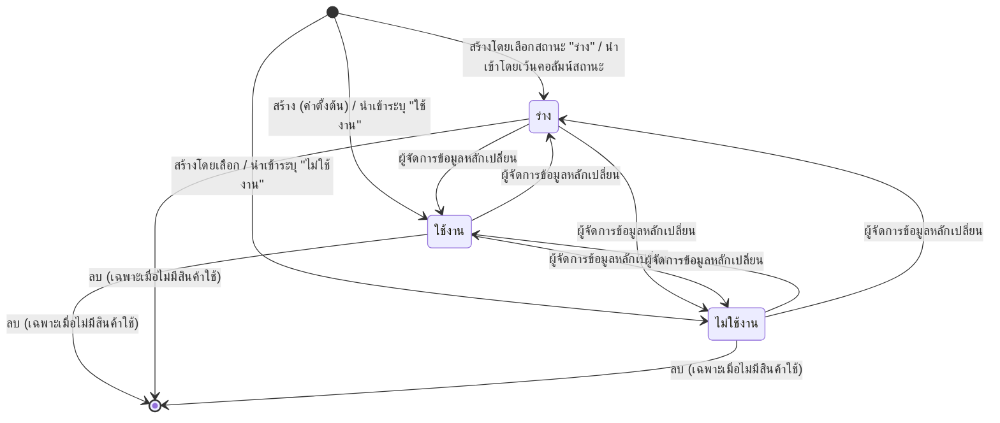

# BRD — ทะเบียนหน่วยวัด (UoM Master)

## 1 · Document Info

| | |
|---|---|
| **BRD ID** | `BRD-F-UOM-001` |
| **ชื่อ Feature** | ทะเบียนหน่วยวัด (Unit of Measure Master) |
| **รหัสเดิม** | `F-UOM` · `F-UOM-MASTER-001` |
| **ประเภท** | **New Feature** |
| **Module / Value Stream** | Product (ข้อมูลสินค้า) · สาย **ข้อมูลหลัก (master)** |
| **Wave** | **W1** — ต้นน้ำของ Item Master (W2) |
| **Version** | 1.0 |
| **Status** | ✅ **APPROVED** (ผ่าน Quality Gate — ดูท้ายเอกสาร) |
| **Owner** | BA · 2BSimple |
| **Stakeholders** | Product Manager (ผู้ใช้หลัก) · ทีมจัดซื้อ · ทีมคลังสินค้า · Strike (verify) |
| **วันที่** | 2026-08-10 |

### Input ที่ใช้สร้างเอกสารนี้

| # | แหล่ง | ใช้ตัดสินอะไร |
|---|---|---|
| 1 | `Brief Feature/2. UOM/PREBRIEF_F-UOM_UoM-Master.md` | **เนื้อธุรกิจทั้งหมด** — แทน RIF (OB-1…6 · S-01…09 · BR-01…07) |
| 2 | `Brief Feature/2. UOM/FUNCTION_CHECKLIST_F-UOM_UoM-Master.md` | รายการความสามารถ `FN-01…FN-19 + FN-13b + FN-90/92/93` + **`FN-40` = ของที่ห้ามมี** |
| 3 | `_final-docs/F-UOM-001/uom-master.html` | **HTML as-built** — ผ่าน `qc-ux` (PASS) + `qc-coverage` (WARN · BLOCK=0) + `e2e` **49/49** แล้ว |
| 4 | `Central Plan v2/CENTRAL_PLAN_CORE_ERP.md` | Global Contracts §2 · edge · wave |

> **Mode = Fresh (HTML-first)** — ไม่มี RIF · `PREBRIEF` + `FUNCTION_CHECKLIST` + HTML ทำหน้าที่แทนครบ
> `PREBRIEF` ระบุตัวเองว่าเป็น **Reverse Mode** (สกัดจากจอ) → เนื้อธุรกิจกับจอไม่ drift โดยธรรมชาติ

### Changelog

- **v1.0 (2026-08-10)** — Initial via `brd-generator-full` (Fresh Mode · HTML-first)
  - HTML ต้นทาง: `uom-master.html` ฉบับหลังปรับตาม feedback ของ Strike (25 แถว/หน้า · ทะเบียน 35 หน่วย)
  - มติที่ผูกอยู่ในฉบับนี้: **UoM เป็นเจ้าของนิยามหมวด — 6 หมวด** (2026-08-10)

---

## 2 · Business Context

### 2.1 ปัญหา / โอกาส

ทุกโมดูลของระบบ (ซื้อ · ขาย · คลัง · บัญชี) อ้างถึง "หน่วยวัด" ตลอดเวลา — ชิ้น กล่อง กิโลกรัม ชั่วโมง
แต่**ไม่มีที่เก็บนิยามกลาง** ผลที่ตามมา:

| อาการ | ผลกระทบ |
|---|---|
| แต่ละโมดูลพิมพ์หน่วยเอง | *"กก."* · *"กิโลกรัม"* · *"KG"* กลายเป็น 3 หน่วยคนละตัวในรายงานเดียวกัน |
| ไม่มีการจัดหมวด | ระบบยอมให้ตั้งสูตรแปลง *"1 ชั่วโมง = 12 กล่อง"* เพราะไม่รู้ว่าคนละชนิดการวัด |
| เพิ่มหน่วยใหม่ต้องแจ้ง IT | รอ deploy · ทีมจัดซื้อทำเองไม่ได้ |
| ไม่รู้ว่าหน่วยไหนถูกใช้อยู่ | ลบหน่วยทิ้งแล้วเอกสารเก่าอ้างค้าง |

### 2.2 เป้าหมาย Business

1. มี **ทะเบียนกลางหน่วยวัดหนึ่งเดียว** ที่ทุกโมดูลอ้างอิงร่วมกัน
2. ให้ **Product Manager จัดการเองได้** โดยไม่ต้องพึ่ง IT
3. **จัดหมวดการวัด** เพื่อให้ปลายทางกันการตั้งสูตรแปลงข้ามชนิดของได้
4. **คุมการเลิกใช้อย่างปลอดภัย** — หน่วยที่ถูกสินค้าอ้างอิงอยู่ต้องลบไม่ได้

### 2.3 ตัวชี้วัดความสำเร็จ (บังคับวัดได้)

| # | ตัวชี้วัด | Baseline ปัจจุบัน | Target | วัดยังไง / จากไหน | วัดเมื่อไหร่ |
|:--:|---|---|---|---|---|
| M-01 | เวลาที่ใช้เพิ่มหน่วยวัดใหม่ 1 หน่วย | **~2 วันทำการ** (แจ้ง IT → แก้ config → deploy) | **< 2 นาที** (PM ทำเอง) | จับเวลาจากกด *สร้างหน่วยวัด* จนหน่วยโผล่ในทะเบียน | UAT + เดือนที่ 1 |
| M-02 | จำนวนหน่วยที่สะกดต่างแต่หมายถึงของเดียวกัน | **ต้องเก็บ baseline ก่อน launch** — นับจากข้อมูลหน่วยที่กระจายอยู่ในเอกสารเดิม | **0** | export ทะเบียน แล้วตรวจรหัสซ้ำ/ชื่อพ้อง | เดือนที่ 1 · 3 |
| M-03 | สัดส่วนสินค้าที่ผูกหน่วยจากทะเบียนกลาง | **0%** (ยังไม่มีทะเบียน) | **100%** | ทะเบียนสินค้ารายงานจำนวนสินค้าต่อหน่วย (`จำนวนสินค้าที่ใช้`) | เดือนที่ 1 หลัง Item Master ขึ้น |
| M-04 | เวลาตั้งค่าหน่วยวัดครั้งแรกของ tenant ใหม่ | **ต้องเก็บ baseline ก่อน launch** | **< 10 นาที** (นำเข้า CSV ครั้งเดียว) | จับเวลา onboarding | ทุก tenant ใหม่ |
| M-05 | จำนวนครั้งที่ลบหน่วยแล้วเอกสารอ้างค้าง | ไม่ทราบ (ไม่มีระบบให้ลบ) | **0** | นับ error จาก log ปลายทาง | ทุกเดือน |

> ทุกตัวมีคู่ใน **§17.3 KPI** — ดูตารางที่นั่น

---

## 3 · Scope

### 3.1 In Scope

| # | ทำอะไร | อ้าง |
|:--:|---|---|
| IN-01 | สร้าง / แก้ไขหน่วยวัด — รหัส · ชื่อไทย · ชื่ออังกฤษ · สัญลักษณ์ · หมวด · สถานะ | `S-01` `S-02` |
| IN-02 | รหัสเว้นว่างได้ → ระบบออกรหัสอัตโนมัติจากหมวด | `S-01` `FN-02` |
| IN-03 | สถานะ 3 ค่า (ร่าง · ใช้งาน · ไม่ใช้งาน) เปลี่ยนอิสระทุกทิศ **ไม่มีขั้นอนุมัติ** | `S-03` `BR-03` |
| IN-04 | เปลี่ยนสถานะหลายรายการพร้อมกัน (bulk) | `S-04` |
| IN-05 | ลบหลายรายการพร้อมกัน — ตัวที่ถูกสินค้าใช้อยู่ถูกข้าม | `S-05` `BR-02` |
| IN-06 | นำเข้า CSV พร้อมสถานะในไฟล์ + ดาวน์โหลดไฟล์ตัวอย่าง | `S-07` `FN-13b` |
| IN-07 | ส่งออก CSV ตามตัวกรองปัจจุบัน | `S-08` |
| IN-08 | ค้นหา · กรองตามหมวด/สถานะ · จัดเรียง · แบ่งหน้า · การ์ดสรุปกดกรองเร็ว | `§6` `FN-19` |
| IN-09 | ดูรายละเอียด 3 แท็บ — ภาพรวม · การใช้งาน · ประวัติ | `§6` `FN-93` |

### 3.2 Out of Scope (ไม่ทำ — ตัดสินแล้ว)

| # | ไม่ทำอะไร | เหตุผล / มติ |
|:--:|---|---|
| OUT-01 | **ตัวคูณแปลงหน่วย · ความละเอียดทศนิยม · หน่วยฐานต่อสินค้า** | 🔒 `LOCK GR-UOM-01/02` + `LD-01/02` — เป็นของ **ทะเบียนสินค้า** ไม่ใช่ทะเบียนนี้ |
| OUT-02 | ปุ่มลบรายตัว (ในแถว / ในลิ้นชัก) | pattern ของเลน master — ลบผ่าน bulk เท่านั้น |
| OUT-03 | ลบหน่วยที่ถูกสินค้าใช้อยู่ | `BR-02` · `OB-6` |
| OUT-04 | ขั้นส่งอนุมัติ / สายอนุมัติ | `OB-3` — ทะเบียนนี้ไม่อยู่ในลิสต์ 19 ใบของ Global Contract #1 |
| OUT-05 | เพิ่ม / แก้ / ลบ **หมวดหน่วยวัด** | หมวดคงที่ 6 ค่า — เป็นนิยามระดับระบบ |
| OUT-06 | ไอคอน / avatar หน้ารหัสในตาราง | มติ 2026-08-09 |
| OUT-07 | การ emit event แจ้งเตือนเอง | `OB-4` — กระดิ่งเป็น placeholder ชี้ Notification Center |
| OUT-08 | โหมด **Replace** ตอนนำเข้า (ล้างทะเบียนแล้วโหลดใหม่) | ขัด Global Contract #7 *"ไม่มี hard delete"* — ดู `OQ-05` |

### 3.3 Assumptions

| # | สมมติฐาน | ถ้าผิดจะเป็นยังไง |
|:--:|---|---|
| A-01 | ผู้ใช้เป็น **Product Manager คนเดียว** ทำได้ทุกอย่าง — role-gate ละเอียดเป็นเรื่องของ Policy Center | ถ้าต้องแยกสิทธิ์ดู/แก้ ต้องเพิ่ม §4 + §16 |
| A-02 | `จำนวนสินค้าที่ใช้` คำนวณจากทะเบียนสินค้า และเป็นค่า **อ่านอย่างเดียว** ที่ทะเบียนนี้ | ถ้าต้องคำนวณเองต้องเพิ่ม job |
| A-03 | ปลายทางเก็บเฉพาะ **รหัสหน่วย** (soft reference) ไม่ทำ FK cascade | ถ้าทำ FK จริง การลบจะ cascade โดยไม่ตั้งใจ |
| A-04 | หมวดหน่วยวัด **6 หมวด** เป็นนิยามที่ทะเบียนนี้เป็นเจ้าของ ปลายทางต้องตามมา | ถ้าปลายทางไม่ตาม การ์ดกันสูตรแปลงข้ามชนิดจะพัง |

### 3.4 Scope Lock

> ไม่มีเอกสาร `scope_lock_ref` แยกใบ — Lock ยกมาจาก `PREBRIEF §0 Obligations` ซึ่งระบุศักดิ์ว่าเป็น **"ใบเซ็น"**

| Lock | เนื้อความ | ศักดิ์ | ถูกตอบที่ |
|---|---|---|---|
| **LOCK-01** (`OB-1`) | ห้ามมี conversion factor / ตัวคูณ / precision / หน่วยฐานต่อสินค้าในทะเบียนนี้ — ทั้งหมดเป็นของทะเบียนสินค้า | `_SCOPE_LOCK` (ศักดิ์ใบเซ็น) · `GR-UOM-01/02` · `LD-01/02` | §3.2 OUT-01 · §9 `BR-04` · `FN-40①` |
| **LOCK-02** (`OB-2`) | เส้นออกสู่ทะเบียนสินค้าส่ง **แค่รหัสหน่วย + สถานะ** — combobox ปลายทางกรองเฉพาะ *ใช้งาน* | `_SCOPE_LOCK` conflict-resolved | §12.1 · §9 `BR-06` |
| **LOCK-03** (`OB-3`) | ไม่มีสายอนุมัติ — field placeholder 4 ตัวอยู่ในโมเดลและเป็น `null` | Ledger + กติกาเหล็ก #3 | §5 · §6 · `FN-40④` |
| **LOCK-04** (`OB-4`) | ไม่ emit event เอง — กระดิ่งเป็น placeholder | Ledger | §12.1 |
| **LOCK-05** (`OB-5`) | ใช้ pattern เลน master: สถานะ 3 ค่าอิสระ · bulk · สถานะในไฟล์นำเข้า · ส่งออก · ไม่มีคำอธิบายใต้ช่อง · ไม่มีลบเดี่ยว | `VD-PDM-01/02/04/11/12/13` | §7 · §9 |
| **LOCK-06** (`OB-6`) | หน่วยที่ถูกสินค้าใช้ (`used > 0`) ลบไม่ได้ | BRD เดิม P3 | §9 `BR-02` |

**ผลตรวจ Scope Drift: ✅ ไม่พบ** — `qc-coverage` รอบ 1 ระบุ *"scope creep = 0"* และ `e2e` เคส `E37`–`E42` ยืนยันด้วยการเรนเดอร์จริงว่าของใน `FN-40` ทั้ง 6 ข้อไม่มีอยู่จริงบนจอ

> ⚠️ **`VD-PDM-*` ที่ `LOCK-05` อ้างถึง ยังไม่มีต้นทางใน `_final-docs/`** — grep ทั้ง repo เจอเฉพาะในแพ็กบรีฟ
> ถือเป็น **forward reference** ต้องยืนยันตอนทำ `F-PDM` (ดู `OQ-06`)

---

## 4 · User Roles & Permissions

| Role | ดูทะเบียน | สร้าง | แก้ไข | เปลี่ยนสถานะ | ลบ (bulk) | นำเข้า | ส่งออก |
|---|:--:|:--:|:--:|:--:|:--:|:--:|:--:|
| **Product Manager** (ผู้ใช้หลัก) | ✅ | ✅ | ✅ | ✅ | ✅ | ✅ | ✅ |
| ทีมจัดซื้อ / คลัง (ผู้บริโภคข้อมูล) | ✅ | ❌ | ❌ | ❌ | ❌ | ❌ | ✅ |
| ผู้ดูแลระบบ | ✅ | ✅ | ✅ | ✅ | ✅ | ✅ | ✅ |

> **ต้นแบบ mock ผู้ใช้เดียว (Product Manager) ทำได้ทุกอย่าง** ตาม `A-01`
> การแยกสิทธิ์จริงเป็นหน้าที่ของ **Policy Center** — ทะเบียนนี้ไม่ hardcode role gate

---

## 5 · User Journey (พร้อม COSO)

### 5.0 หมายเหตุ COSO ของ feature นี้

ทะเบียนหน่วยวัด **ไม่มีขั้นอนุมัติ** (`LOCK-03`) — จึงมีเฉพาะบทบาท **Maker** และ **System**
**SoD (Maker ≠ Approver) ไม่เข้าข่าย** เพราะไม่มี Approver ในกระบวนการนี้เลย
field `approver_role` / `approved_by` / `approved_at` / `approval_chain` มีอยู่ในโมเดลและเป็น `null` เพื่อรอเสียบ DOA engine ภายหลัง

### 5.1 Happy Path — สร้างหน่วยวัดใหม่ (`S-01`)

| # | ขั้นตอน | Maker | Checker | Approver | System | หน้าจอ |
|:--:|---|---|---|---|---|---|
| 1 | เปิดทะเบียนหน่วยวัด | Product Manager | — | — | โหลดรายการ + ตัวนับสรุป | `#/uom` |
| 2 | กด *สร้างหน่วยวัด* | Product Manager | — | — | เปิดฟอร์มลิ้นชัก | `#/uom/create` |
| 3 | กรอกชื่อไทย + เลือกหมวด (บังคับ 2 ช่อง) | Product Manager | — | — | — | `#/uom/create` |
| 4 | (ไม่บังคับ) กรอกรหัส · สัญลักษณ์ · ชื่ออังกฤษ · เลือกสถานะ | Product Manager | — | — | — | `#/uom/create` |
| 5 | กด *ยืนยันสร้าง* | Product Manager | — | — | **ตรวจชื่อบังคับ · ตรวจรหัสซ้ำไม่สนตัวพิมพ์ · ออกรหัสอัตโนมัติถ้าเว้นว่าง · กันกดซ้ำ** | `#/uom/create` |
| 6 | เห็นหน่วยใหม่ในทะเบียน + แจ้งผลสำเร็จ | Product Manager | — | — | บันทึกผู้สร้าง + เวลา · อัปเดตตัวนับสรุป | `#/uom` |

### 5.2 Alternative Path — แก้ไข (`S-02`)

| # | ขั้นตอน | Maker | System | หน้าจอ |
|:--:|---|---|---|---|
| 1 | กดไอคอนดินสอในแถว **หรือ** กด *แก้ไข* ในลิ้นชักรายละเอียด | Product Manager | เปิดฟอร์มเดิมพร้อมค่าปัจจุบัน | `#/uom/edit/:id` |
| 2 | แก้ช่องไหนก็ได้ (ไม่มีช่องล็อก) ทุกสถานะ | Product Manager | — | `#/uom/edit/:id` |
| 3 | กด *บันทึกการแก้ไข* | Product Manager | ตรวจซ้ำเหมือนตอนสร้าง (รหัสเดิมของตัวเองไม่นับซ้ำ) · อัปเดตผู้แก้ + เวลา | `#/uom` |

### 5.3 Alternative Path — เปลี่ยนสถานะรายตัว (`S-03`)

| # | ขั้นตอน | Maker | System | หน้าจอ |
|:--:|---|---|---|---|
| 1 | กดแถวในตาราง | Product Manager | เปิดลิ้นชักรายละเอียด | `#/uom/view/:id` |
| 2 | กด *เปลี่ยนสถานะ* | Product Manager | กางเมนู 3 ค่า · **ค่าปัจจุบันกดไม่ได้** | `#/uom/view/:id` |
| 3 | เลือกสถานะใหม่ | Product Manager | เปลี่ยนทันที **ไม่มีขั้นตรวจ/อนุมัติ** · บันทึกผู้แก้ + เวลา · แจ้งผล | `#/uom/view/:id` |

### 5.4 Alternative Path — bulk เปลี่ยนสถานะ (`S-04`)

| # | ขั้นตอน | Maker | System |
|:--:|---|---|---|
| 1 | ติ๊กช่องเลือกหลายแถว (หรือเลือกทั้งหน้า) | Product Manager | แสดงแถบเครื่องมือพร้อมจำนวนที่เลือก |
| 2 | กด *ตั้งเป็น ใช้งาน / ร่าง / ไม่ใช้งาน* | Product Manager | เปลี่ยนทุกตัวที่เลือก · นับเฉพาะตัวที่เปลี่ยนจริง · แจ้งจำนวน · ล้างการเลือก |

### 5.5 Exception Path — ลบหลายตัว บางตัวถูกใช้ (`S-05`)

| # | ขั้นตอน | Maker | System |
|:--:|---|---|---|
| 1 | ติ๊กเลือกหลายแถว → กด *ลบ* | Product Manager | นับว่ามีกี่ตัวถูกสินค้าใช้อยู่ |
| 2 | อ่านหน้าต่างยืนยัน | Product Manager | แสดง **"จะลบจริง N รายการ · ข้าม M รายการที่ถูกสินค้าใช้อยู่"** · ถ้า N = 0 ปุ่มยืนยันกดไม่ได้ |
| 3 | กดยืนยัน | Product Manager | ลบเฉพาะตัวที่ `used = 0` · ตัวที่ถูกใช้ยังอยู่ · แจ้งยอดลบ + ยอดข้าม |

### 5.6 Exception Path — รหัสซ้ำ (`S-06`)

| # | ขั้นตอน | Maker | System |
|:--:|---|---|---|
| 1 | กรอกรหัสที่มีอยู่แล้ว (พิมพ์เล็ก/ใหญ่ต่างกันก็นับว่าซ้ำ) | Product Manager | — |
| 2 | กดบันทึก | Product Manager | **บล็อก** · ทำขอบช่องรหัสเป็นสีแดง + ขึ้นข้อความ *"รหัส X ถูกใช้แล้ว"* · ลิ้นชักยังเปิดค้างให้แก้ |

### 5.7 Happy Path — นำเข้า CSV (`S-07`)

| # | ขั้นตอน | Maker | System | หน้าจอ |
|:--:|---|---|---|---|
| 1 | กด *นำเข้า CSV* | Product Manager | เปิดหน้าต่างนำเข้า — มีแค่กล่องเลือกไฟล์ + ปุ่มดาวน์โหลดไฟล์ตัวอย่าง | จอที่ 1 |
| 2 | (ถ้ายังไม่มีไฟล์) กด *ดาวน์โหลด template ตัวอย่าง* | Product Manager | ให้ไฟล์ CSV หัวตารางถูกต้อง + 3 แถวตัวอย่างครอบ 3 สถานะ | จอที่ 1 |
| 3 | เลือกไฟล์ | Product Manager | **ตรวจทุกแถว** แล้วแสดงผลรายแถว + สรุปจำนวนผ่าน/ไม่ผ่าน | จอที่ 2 |
| 4 | ตรวจผลแล้วกด *นำเข้า N แถว* | Product Manager | เขียนเฉพาะแถวที่ผ่าน · แถวผิดข้าม **ไม่ล้มทั้งไฟล์** | จอที่ 3 |
| 5 | ปิดหน้าต่าง | Product Manager | ทะเบียน + ตัวนับสรุปอัปเดตทันที | `#/uom` |

### 5.8 Happy Path — ส่งออก CSV (`S-08`)

| # | ขั้นตอน | Maker | System |
|:--:|---|---|---|
| 1 | ตั้งตัวกรองที่ต้องการ (ค้นหา / หมวด / สถานะ) | Product Manager | กรองรายการ |
| 2 | กด *ส่งออก CSV* | Product Manager | ให้ไฟล์ **ตามตัวกรองปัจจุบันเท่านั้น** (ไม่ใช่ทั้งทะเบียน) 7 คอลัมน์ |

---

## 6 · Data Entity & Fields

### 6.1 Entity: `uom` (ทะเบียนหน่วยวัด)

| # | Field | Label บนจอ | Input Type | ค่า / ตัวเลือก | จำเป็น | เงื่อนไข | หมายเหตุ |
|:--:|---|---|---|---|:--:|---|---|
| 1 | `id` | — | AUTO | `U-nnn` | ✅ | ระบบกำหนด | ไม่แสดงบนจอ |
| 2 | `code` | รหัสหน่วย | TEXT | เช่น `PCS` | ⬜ | **ห้ามซ้ำ ไม่สนตัวพิมพ์** · เว้นว่าง = ระบบออกให้ | ค่าที่ปลายทางเก็บอ้างอิง |
| 3 | `name_th` | ชื่อ (ไทย) | TEXT | เช่น `ชิ้น` | ✅ | ห้ามว่าง | ชื่อหลักที่แสดงทุกที่ |
| 4 | `name_en` | ชื่อ (อังกฤษ) | TEXT | เช่น `Piece` | ⬜ | — | |
| 5 | `symbol` | สัญลักษณ์ | TEXT | เช่น `pcs` | ⬜ | เว้นว่าง = ใช้รหัสตัวพิมพ์เล็ก | **แสดงคู่จำนวนในเอกสารปลายทาง** |
| 6 | `category` | หมวดหน่วยวัด | DROPDOWN-SINGLE | 6 ค่าคงที่ (ดู §6.2) | ✅ | เลือกได้อย่างเดียว **ไม่มี UI เพิ่ม/แก้หมวด** | ใช้กันการตั้งสูตรแปลงข้ามชนิด |
| 7 | `status` | สถานะ | DROPDOWN-SINGLE | `ร่าง` · `ใช้งาน` · `ไม่ใช้งาน` | ✅ | ค่าตั้งต้น = `ใช้งาน` (ฟอร์ม) · `ร่าง` (นำเข้าเมื่อเว้นว่าง) | เปลี่ยนอิสระทุกทิศ |
| 8 | `used` | จำนวนสินค้าที่ใช้ | AUTO | จำนวนเต็ม ≥ 0 | — | **อ่านอย่างเดียว** — มาจากทะเบียนสินค้า | ใช้ตัดสินว่าลบได้มั้ย |
| 9 | `created_by` / `created_at` | ผู้สร้าง / วันที่สร้าง | AUTO | — | ✅ | ระบบบันทึก | แสดงในแท็บประวัติ |
| 10 | `updated_by` / `updated_at` | ผู้แก้ไขล่าสุด / วันที่แก้ | AUTO | — | ✅ | ระบบบันทึกทุกครั้งที่แก้/เปลี่ยนสถานะ | แสดงในแท็บประวัติ + ท้ายลิ้นชัก |
| 11 | `approver_role` · `approved_by` · `approved_at` · `approval_chain` | — | AUTO | **`null` เสมอ** | — | **DOA placeholder** (`LOCK-03`) | เตรียมเชื่อม Policy Center · ไม่แสดงบนจอ |

### 6.2 Master: หมวดหน่วยวัด (คงที่ 6 ค่า)

| รหัสหมวด | ชื่อบนจอ | ตัวอย่างหน่วย |
|---|---|---|
| `count` | นับจำนวน | ชิ้น · กล่อง · โหล · ลัง · หีบ · พาเลท · แพ็ค · ม้วน · มัด · แผ่น · คู่ · ขวด · กระป๋อง |
| `weight` | ชั่งน้ำหนัก | กิโลกรัม · กรัม · มิลลิกรัม · ปอนด์ |
| `volume` | ตวงปริมาตร | ลิตร · มิลลิลิตร · ลูกบาศก์เมตร · แกลลอน · ลูกบาศก์เซนติเมตร |
| `length` | ความยาว | เมตร · เซนติเมตร · มิลลิเมตร · นิ้ว · ฟุต |
| `time` | เวลา | ชั่วโมง · วัน · นาที · เดือน |
| `service` | บริการ | ครั้ง (บริการ) · งาน · เที่ยว · คน |

> 🔒 **ทะเบียนนี้เป็นเจ้าของนิยามหมวด** (มติ 2026-08-10) — ทะเบียนสินค้าต้องใช้ชุด 6 หมวดนี้
> เดิมทะเบียนสินค้ารู้จักแค่ 3 หมวด ซึ่งทำให้การ์ดกันสูตรแปลงข้ามชนิดของทำงานไม่ครบ (ดู §11 · `OQ-04`)

### 6.3 Entity Relationship

```
uom (ทะเบียนหน่วยวัด)
  │
  │  soft reference — ปลายทางเก็บเฉพาะ `code`  (ไม่มี FK cascade)
  ▼
item (ทะเบียนสินค้า) ──▶ เอกสารซื้อ / ขาย / คลัง  (สัญลักษณ์แสดงคู่จำนวน)
```

| ความสัมพันธ์ | ประเภท | ทิศทาง | กติกา |
|---|---|---|---|
| `uom.code` → `item.uom` (หน่วยฐาน) | 1:N | uom → item | soft reference — nullable · enforce แค่ format + uniqueness (Global Contract #6) |
| `uom.code` → `item.conversions[].uom` (หน่วยแปลง) | 1:N | uom → item | เดียวกัน · **ตัวคูณเก็บที่ฝั่งสินค้า ไม่ใช่ที่นี่** (`LOCK-01`) |
| `item` → `uom.used` | นับกลับ | item → uom | อ่านอย่างเดียวที่ทะเบียนนี้ |

---

## 7 · User Stories & Acceptance Criteria

> ทุก Story map กับ `FN` ใน `FUNCTION_CHECKLIST` และมีเคสทดสอบจริงใน `_e2e/e2e-uom.py` กำกับ

### S-01 · สร้างหน่วยวัดใหม่ด้วยข้อมูลขั้นต่ำ

**ในฐานะ** Product Manager **ฉันต้องการ** สร้างหน่วยวัดโดยกรอกแค่ชื่อไทยกับหมวด **เพื่อ** เพิ่มหน่วยใหม่ได้ทันทีโดยไม่ต้องคิดรหัสเอง
*(`FN-01` · `FN-02` · เคส `E11` `E14`)*

- **AC1** — **Given** อยู่หน้าทะเบียน **When** กด *สร้างหน่วยวัด* **Then** เปิดฟอร์มลิ้นชักเดียว 6 ช่อง บังคับ 2 ช่อง ไม่มีขั้นตอนหลายหน้า
- **AC2** — **Given** กรอกชื่อไทยและเลือกหมวดแล้ว เว้นรหัสว่าง **When** กด *ยืนยันสร้าง* **Then** บันทึกสำเร็จ และได้รหัสอัตโนมัติที่ขึ้นต้นด้วยตัวย่อของหมวด
- **AC3** — **Given** บันทึกสำเร็จ **When** กลับหน้าทะเบียน **Then** เห็นหน่วยใหม่ในรายการ และตัวนับสรุปเพิ่มขึ้น 1

### S-02 · เลือกสถานะได้ตั้งแต่ตอนสร้าง

**ในฐานะ** Product Manager **ฉันต้องการ** เลือกสถานะได้ 3 ค่าตั้งแต่สร้าง **เพื่อ** เตรียมหน่วยไว้เป็นร่างก่อนเปิดใช้จริง
*(`FN-03` · เคส `E15`)*

- **AC1** — **Given** อยู่ในฟอร์มสร้าง **When** เปิดช่องสถานะ **Then** เห็น 3 ตัวเลือก (ร่าง · ใช้งาน · ไม่ใช้งาน) ค่าตั้งต้นคือ *ใช้งาน*
- **AC2** — **Given** เลือก *ร่าง* **When** บันทึก **Then** หน่วยถูกเก็บด้วยสถานะร่าง และไม่ถูกส่งให้ทะเบียนสินค้าเลือก

### S-03 · แก้ไขหน่วยวัดได้ทุกช่องทุกสถานะ

**ในฐานะ** Product Manager **ฉันต้องการ** แก้ข้อมูลหน่วยได้ทุกช่อง **เพื่อ** ปรับชื่อ/สัญลักษณ์ที่พิมพ์ผิดได้เอง
*(`FN-05` · เคส `E18` `E19`)*

- **AC1** — **Given** เปิดฟอร์มแก้ไข **When** ตรวจทุกช่อง **Then** ไม่มีช่องใดถูกล็อกหรือปิดการแก้
- **AC2** — **Given** แก้ข้อมูลแล้วบันทึก **When** ดูแท็บประวัติ **Then** ผู้แก้ไขและเวลาถูกอัปเดตเป็นค่าล่าสุด
- **AC3** — **Given** หน่วยมีสถานะร่าง **When** เปิดแก้ไข **Then** แก้ได้ปกติ และสถานะไม่ถูกเปลี่ยนโดยไม่ได้สั่ง

### S-04 · กันรหัสซ้ำโดยไม่สนตัวพิมพ์

**ในฐานะ** ระบบ **ฉันต้องการ** บล็อกรหัสที่ซ้ำกับของเดิม **เพื่อ** กันไม่ให้ปลายทางอ้างถึงหน่วยผิดตัว
*(`FN-12` · `BR-01` · เคส `E16` `E20`)*

- **AC1** — **Given** มีหน่วยรหัส `PCS` อยู่แล้ว **When** สร้างใหม่ด้วยรหัส `pcs` **Then** ระบบบล็อก ทำขอบช่องรหัสเป็นสีแดง และขึ้นข้อความบอกว่ารหัสถูกใช้แล้ว
- **AC2** — **Given** กำลังแก้ไขหน่วยเดิม **When** กดบันทึกโดยไม่เปลี่ยนรหัส **Then** ผ่าน (รหัสของตัวเองไม่นับว่าซ้ำ)

### S-05 · เปลี่ยนสถานะได้ทุกทิศโดยไม่มีขั้นอนุมัติ

**ในฐานะ** Product Manager **ฉันต้องการ** เปลี่ยนสถานะหน่วยได้ทันที **เพื่อ** เลิกใช้หน่วยที่ไม่ต้องการโดยไม่ต้องรอใครอนุมัติ
*(`FN-06` · `BR-03` · เคส `E21` `E22`)*

- **AC1** — **Given** เปิดลิ้นชักรายละเอียด **When** กด *เปลี่ยนสถานะ* **Then** เห็นเมนู 3 ค่า และค่าปัจจุบันกดไม่ได้
- **AC2** — **Given** เลือกสถานะใหม่ **When** กด **Then** เปลี่ยนทันที ไม่มีหน้าจอขออนุมัติคั่น
- **AC3** — **Given** ไล่เปลี่ยน ใช้งาน → ร่าง → ไม่ใช้งาน → ใช้งาน **When** ตรวจแต่ละครั้ง **Then** สำเร็จทุกทิศ ไม่มีลำดับบังคับ

### S-06 · เลือกหลายรายการแล้วสั่งงานพร้อมกัน

**ในฐานะ** Product Manager **ฉันต้องการ** ตั้งสถานะหลายหน่วยพร้อมกัน **เพื่อ** จัดระเบียบทะเบียนได้เร็ว
*(`FN-08` · `FN-09` · เคส `E23` `E24` `E25`)*

- **AC1** — **Given** ติ๊กเลือกหลายแถว **When** ดูจอ **Then** แถบเครื่องมือโผล่พร้อมจำนวนที่เลือกถูกต้อง
- **AC2** — **Given** ติ๊กช่องหัวตาราง **When** ดู **Then** ทุกแถวในหน้านั้นถูกเลือก
- **AC3** — **Given** กดตั้งสถานะ **When** เสร็จ **Then** ทุกตัวเปลี่ยนครบ ระบบแจ้งจำนวน และการเลือกถูกล้าง
- **AC4** — **Given** กดช่องเลือก **When** ปล่อย **Then** ลิ้นชักรายละเอียดไม่ถูกเปิดโดยไม่ตั้งใจ

### S-07 · ลบหลายรายการโดยข้ามตัวที่ถูกใช้อยู่

**ในฐานะ** Product Manager **ฉันต้องการ** ลบหน่วยที่ไม่ใช้ **เพื่อ** ให้ทะเบียนสะอาด โดยไม่ทำให้สินค้าที่อ้างอยู่พัง
*(`FN-10` · `FN-11` · `FN-90` · `BR-02` · เคส `E26` `E27` `E28` `E39`)*

- **AC1** — **Given** เลือกทั้งตัวที่ถูกใช้และไม่ถูกใช้ **When** กดลบ **Then** หน้าต่างยืนยันบอกจำนวนที่จะลบจริงและจำนวนที่จะข้าม
- **AC2** — **Given** ยืนยันแล้ว **When** ดูทะเบียน **Then** ตัวที่ไม่ถูกใช้หายไป ตัวที่ถูกใช้ยังอยู่ครบ
- **AC3** — **Given** เลือกเฉพาะตัวที่ถูกสินค้าใช้ **When** เปิดหน้าต่างยืนยัน **Then** ปุ่มยืนยันกดไม่ได้
- **AC4** — **Given** อยู่หน้าไหนก็ตาม **When** หาทางลบ **Then** ไม่มีทางลบใดที่ข้ามหน้าต่างยืนยัน

### S-08 · นำเข้าหน่วยวัดจากไฟล์พร้อมสถานะในไฟล์

**ในฐานะ** Product Manager **ฉันต้องการ** นำเข้าหน่วยหลายตัวจาก CSV **เพื่อ** ตั้งค่าระบบครั้งแรกได้เร็ว
*(`FN-13` · `FN-13b` · `FN-14` · `FN-15` · `FN-16` · `BR-05` · เคส `E29`–`E33`)*

- **AC1** — **Given** เปิดหน้าต่างนำเข้า **When** ดูจอแรก **Then** เห็นแค่กล่องเลือกไฟล์กับปุ่มดาวน์โหลดไฟล์ตัวอย่าง **ไม่มีข้อความอธิบายคอลัมน์**
- **AC2** — **Given** กดดาวน์โหลดไฟล์ตัวอย่าง **When** เปิดไฟล์ **Then** หัวตารางถูกต้อง 6 คอลัมน์ และมี 3 แถวตัวอย่างครอบทั้ง 3 สถานะ
- **AC3** — **Given** เลือกไฟล์ที่มีทั้งแถวถูกและผิด **When** ดูจอตรวจสอบ **Then** เห็นสถานะรายแถว พร้อมสาเหตุที่ไม่ผ่าน (ข้อมูลไม่ครบ / หมวดผิด / สถานะผิด / รหัสซ้ำ)
- **AC4** — **Given** กดยืนยันนำเข้า **When** เสร็จ **Then** แถวที่ผ่านเข้าระบบตามสถานะในไฟล์ (เว้นว่าง = ร่าง) แถวผิดถูกข้ามโดยไฟล์ไม่ล้ม
- **AC5** — **Given** ปิดจอผลนำเข้า **When** ดูทะเบียน **Then** รายการและตัวนับสรุปอัปเดตตามทันที

### S-09 · ส่งออกตามสิ่งที่กรองอยู่

**ในฐานะ** Product Manager **ฉันต้องการ** ส่งออกเฉพาะรายการที่กรองไว้ **เพื่อ** ส่งชุดข้อมูลที่ต้องการให้คนอื่นโดยไม่ต้องมาตัดทีหลัง
*(`FN-17` · เคส `E34`)*

- **AC1** — **Given** กรองสถานะเป็น *ไม่ใช้งาน* **When** กดส่งออก **Then** ไฟล์มีเฉพาะแถวสถานะนั้น จำนวนตรงกับที่เห็นบนจอ
- **AC2** — **Given** เปิดไฟล์ **When** ดูหัวตาราง **Then** มี 7 คอลัมน์ รวม *จำนวนสินค้าที่ใช้*

### S-10 · หาหน่วยที่ต้องการเจอเร็ว

**ในฐานะ** ผู้ใช้ทุกคน **ฉันต้องการ** ค้นหาและกรองทะเบียน **เพื่อ** หาหน่วยที่ต้องการโดยไม่ต้องไล่ดูทีละแถว
*(`FN-19` · เคส `E01`–`E08`)*

- **AC1** — **Given** พิมพ์คำค้น **When** ดูผล **Then** ค้นได้ทั้งรหัส ชื่อไทย ชื่ออังกฤษ และสัญลักษณ์
- **AC2** — **Given** กดการ์ดสรุป **When** ดูตาราง **Then** กรองตามสถานะนั้น และกดซ้ำที่ *ทั้งหมด* คืนค่าได้
- **AC3** — **Given** ไม่พบผลลัพธ์ **When** ดูจอ **Then** เห็นข้อความอธิบายพร้อมปุ่มล้างตัวกรองที่กดแล้วกลับมาได้จริง
- **AC4** — **Given** มีรายการมากกว่า 1 หน้า **When** ดูท้ายตาราง **Then** เห็นช่วงรายการและปุ่มแบ่งหน้าที่เดินได้จริง

### S-11 · ตรวจสอบว่าหน่วยถูกใช้อยู่แค่ไหน

**ในฐานะ** Product Manager **ฉันต้องการ** ดูว่าหน่วยนี้ถูกสินค้ากี่รายการใช้อยู่ **เพื่อ** ตัดสินใจได้ว่าจะเลิกใช้หรือลบได้มั้ย
*(`FN-93` · `BR-07` · เคส `E35` `E36`)*

- **AC1** — **Given** เปิดลิ้นชักรายละเอียด **When** ดูแท็บ *การใช้งาน* **Then** เห็นจำนวนสินค้าที่ใช้ และคำตอบว่าลบได้หรือไม่
- **AC2** — **Given** ดูแท็บ *ประวัติ* **When** อ่าน **Then** เห็นผู้สร้าง ผู้แก้ไขล่าสุด พร้อมวันที่ทั้งคู่

---

## 8 · Status & Lifecycle

### 8.1 State Diagram



### 8.2 ตาราง State × Trigger

| สถานะปัจจุบัน | Trigger | สถานะถัดไป | ใครกด | ผลปลายทาง |
|---|---|---|---|---|
| — | สร้างจากฟอร์ม | ตามที่เลือก (ตั้งต้น *ใช้งาน*) | Product Manager | ถ้า *ใช้งาน* → ทะเบียนสินค้าเลือกได้ทันที |
| — | นำเข้าไฟล์ (คอลัมน์สถานะว่าง) | **ร่าง** | Product Manager | ยังไม่ให้ปลายทางเลือก |
| ร่าง / ใช้งาน / ไม่ใช้งาน | เมนู *เปลี่ยนสถานะ* ในลิ้นชัก | ค่าใดก็ได้ใน 3 ค่า | Product Manager | ตามสถานะใหม่ |
| ร่าง / ใช้งาน / ไม่ใช้งาน | แถบเครื่องมือ bulk | ค่าใดก็ได้ใน 3 ค่า | Product Manager | เดียวกัน + แจ้งจำนวน |
| ร่าง / ใช้งาน / ไม่ใช้งาน | แก้ไขฟอร์ม (ช่องสถานะ) | ค่าใดก็ได้ใน 3 ค่า | Product Manager | เดียวกัน |
| ทุกสถานะ · `used = 0` | ลบ (bulk) + ยืนยัน | หายจากทะเบียน | Product Manager | — |
| ทุกสถานะ · `used > 0` | ลบ (bulk) | **ไม่เปลี่ยน — ถูกข้าม** | — | แจ้งยอดที่ข้าม |

> **ไม่มี state ใดต้องผ่านการอนุมัติ** (`LOCK-03`) — ทุกเส้นเปลี่ยนได้ทันทีโดยผู้จัดการข้อมูลหลัก

---

## 9 · Business Rules + Validation

### 9.1 Business Rules

| BR | กติกา | เมื่อชนกติกา | Story | Tag | ที่มา |
|---|---|---|---|---|---|
| **BR-01** | รหัสหน่วยห้ามซ้ำ **ไม่สนตัวพิมพ์** — ตรวจทั้งตอนสร้าง แก้ไข และนำเข้า | สร้าง/แก้ = บล็อกพร้อมชี้ช่อง · นำเข้า = ข้ามแถวนั้น (`CODE_DUPLICATE`) | S-04 · S-08 | **FIXED** | `PREBRIEF BR-01` |
| **BR-02** | หน่วยที่มีสินค้าอ้างอิงอยู่ (`used > 0`) **ลบไม่ได้** | ข้ามรายการนั้น ไม่ล้มคำสั่งทั้งชุด + แจ้งจำนวนที่ข้าม | S-07 | **FIXED** | `PREBRIEF BR-02` · `LOCK-06` |
| **BR-03** | สถานะ 3 ค่า เปลี่ยนอิสระทุกทิศ **ไม่มีขั้นตรวจ/อนุมัติ** | เปลี่ยนทันที | S-05 · S-06 | **FIXED** | `PREBRIEF BR-03` · `LOCK-03` |
| **BR-04** | ทะเบียนนี้ **ไม่มีข้อมูลการแปลงหน่วยใด ๆ** | ไม่มีช่อง ไม่มีปุ่ม ไม่มี field ในโมเดล | — | **FIXED** 🔒 | `LOCK-01` |
| **BR-05** | นำเข้าไฟล์: ตรวจ**รายแถว** แถวผิดข้าม ไม่ล้มทั้งไฟล์ · คอลัมน์สถานะเว้นว่าง = *ร่าง* · หมวดกรอกเป็นชื่อไทยแล้วระบบแปลงเป็นค่าในระบบ | รายงานสาเหตุรายแถว | S-08 | **FIXED** | `PREBRIEF BR-05` |
| **BR-06** | หน่วยที่ปลายทางเลือกได้ = สถานะ **ใช้งาน** เท่านั้น | ร่าง/ไม่ใช้งาน ไม่โผล่ในตัวเลือกของทะเบียนสินค้า | S-02 · S-05 | **FIXED** | `PREBRIEF BR-06` · `LOCK-02` |
| **BR-07** | เก็บผู้สร้าง/ผู้แก้ไข + เวลา แล้วแสดงในแท็บประวัติ | — | S-03 · S-11 | **FIXED** | `PREBRIEF BR-07` |
| **BR-08** | หมวดหน่วยวัด **คงที่ 6 ค่า** — ไม่มี UI เพิ่ม/แก้/ลบ | ไม่มีทางเข้า | — | **CONFIGURABLE** | มติ 2026-08-10 |
| **BR-09** | รหัสอัตโนมัติ = *ตัวย่อ 3 ตัวแรกของรหัสหมวด* + *เลขรัน 2 หลัก* ที่ยังไม่ชนของเดิม | — | S-01 | **CONFIGURABLE** | `PREBRIEF §3.1` |
| **BR-10** | รายการต่อหน้าในหน้าทะเบียน **อย่างน้อย 25 แถว** | — | S-10 | **CONFIGURABLE** | Strike 2026-08-10 |

### 9.2 Validation Rules

| VR | Field / Action | เงื่อนไข | ประเภท | ข้อความ |
|---|---|---|---|---|
| VR-01 | `name_th` | ห้ามว่าง | **Error** | *"กรุณากรอกชื่อภาษาไทย"* |
| VR-02 | `code` | ห้ามซ้ำกับรหัสที่มีอยู่ (เทียบแบบไม่สนตัวพิมพ์) | **Error** | *"รหัส {X} ถูกใช้แล้ว"* |
| VR-03 | `category` | ต้องเป็น 1 ใน 6 ค่า | **Prevent** | เลือกจากรายการเท่านั้น (ไม่มีช่องพิมพ์อิสระ) |
| VR-04 | `status` | ต้องเป็น 1 ใน 3 ค่า | **Prevent** | เลือกจากรายการเท่านั้น |
| VR-05 | ปุ่มบันทึก | ห้ามส่งซ้ำระหว่างกำลังบันทึก | **Prevent** | ปุ่มถูกปิด + แสดง *"กำลังบันทึก…"* |
| VR-06 | ลบ (bulk) | ต้องผ่านหน้าต่างยืนยันเสมอ | **Prevent** | หน้าต่างยืนยันบอกจำนวนลบจริง/ข้าม |
| VR-07 | ลบ (bulk) | ถ้าจำนวนที่ลบได้จริง = 0 | **Prevent** | ปุ่มยืนยันถูกปิด |
| VR-08 | นำเข้า — แถว | ขาด รหัส / ชื่อไทย / หมวด | **Error รายแถว** | `REQUIRED — ข้อมูลบังคับไม่ครบ` |
| VR-09 | นำเข้า — แถว | ชื่อหมวดไม่ตรง 6 ค่า | **Error รายแถว** | `BAD_CATEGORY — ไม่มีหมวดนี้` |
| VR-10 | นำเข้า — แถว | สถานะไม่ตรง 3 ค่า (และไม่ได้เว้นว่าง) | **Error รายแถว** | `BAD_STATUS — สถานะไม่ถูกต้อง` |
| VR-11 | นำเข้า — แถว | รหัสซ้ำกับที่มีในทะเบียน | **Error รายแถว** | `CODE_DUPLICATE — รหัสซ้ำ` |
| VR-12 | นำเข้า | ถ้าไม่มีแถวใดผ่านเลย | **Prevent** | ปุ่มยืนยันนำเข้าถูกปิด |

### 9.5 สรุประดับความยืดหยุ่น

| Rule | Tag | ระดับความยืดหยุ่น | ใครเปลี่ยน + บ่อยแค่ไหน | เหตุผล | ที่มา |
|---|---|---|---|---|---|
| BR-01 | FIXED | — | ไม่เปลี่ยน | ความถูกต้องของการอ้างอิงข้ามระบบ | ✅ ยืนยันจาก `PREBRIEF` |
| BR-02 | FIXED | — | ไม่เปลี่ยน | ป้องกันข้อมูลกำพร้าที่ปลายทาง | ✅ ยืนยัน (`LOCK-06`) |
| BR-03 | FIXED | — | ไม่เปลี่ยน | ทะเบียนนี้ไม่มีสายอนุมัติโดยมติ | ✅ ยืนยัน (`LOCK-03`) |
| BR-04 | FIXED 🔒 | — | **ห้ามเปลี่ยน** | Scope Lock ระดับใบเซ็น | ✅ ยืนยัน (`LOCK-01`) |
| BR-05 | FIXED | — | ไม่เปลี่ยน | pattern เลน master ทั้งเลนใช้เหมือนกัน | ✅ ยืนยัน (`LOCK-05`) |
| BR-06 | FIXED | — | ไม่เปลี่ยน | สัญญาข้ามระบบ | ✅ ยืนยัน (`LOCK-02`) |
| BR-07 | FIXED | — | ไม่เปลี่ยน | Global Contract #7 (append-only audit) | ✅ ยืนยัน |
| **BR-08** | CONFIGURABLE | **Config File** | ผู้ดูแลระบบ · **นาน ๆ ครั้ง** (เพิ่มหมวดใหม่เป็นการเปลี่ยนนิยามระดับระบบ) | หมวดกระทบการ์ดกันสูตรแปลงที่ปลายทาง เปลี่ยนพร่ำเพรื่อไม่ได้ | 🤖 AI-inferred |
| **BR-09** | CONFIGURABLE | **Config File** | IT/Dev · นาน ๆ ครั้ง | รูปแบบรหัสเป็นข้อตกลงภายในองค์กร | 🤖 AI-inferred |
| **BR-10** | CONFIGURABLE | **Admin Panel** | ผู้ดูแลระบบ · เป็นระยะ | เป็นค่าการแสดงผลล้วน ไม่กระทบข้อมูล | ✅ ยืนยัน (Strike สั่งค่าขั้นต่ำ 25) |

> **Escalation:** ไม่มีข้อไหนเป็น 🤖 + `DYNAMIC`/`Engine Management` → **ไม่ต้องยก OQ เพิ่มจากหมวดนี้**
> BR-08/BR-09 ที่เป็น 🤖 อยู่ระดับ Config File ซึ่งปล่อยผ่านได้ตามกติกา (mark 🤖 ไว้แล้ว)

---

## 10 · Edge Cases

### 10.1 Edge Cases ที่ระบุไว้ในบรีฟ (default ☑ — ทำแล้ว)

| # | เคส | พฤติกรรมที่ต้องเป็น | ยืนยันด้วย |
|:--:|---|---|:--:|
| ☑ EC-01 | สร้างโดยเว้นรหัสว่าง | ระบบออกรหัสจากหมวดโดยไม่ชนของเดิม | `E14` |
| ☑ EC-02 | รหัสซ้ำแบบพิมพ์เล็ก/ใหญ่ต่างกัน | นับว่าซ้ำ → บล็อก | `E16` |
| ☑ EC-03 | แก้ไขโดยไม่เปลี่ยนรหัสตัวเอง | ไม่ถูกตีว่าซ้ำ | `E20` |
| ☑ EC-04 | ลบชุดที่มีทั้งตัวถูกใช้และไม่ถูกใช้ | ลบเฉพาะตัวไม่ถูกใช้ + แจ้งยอดข้าม | `E27` |
| ☑ EC-05 | ลบเฉพาะตัวที่ถูกใช้ล้วน | ปุ่มยืนยันถูกปิด | `E39` |
| ☑ EC-06 | นำเข้าไฟล์ที่คอลัมน์สถานะเว้นว่าง | ได้สถานะ *ร่าง* | `E32` |
| ☑ EC-07 | นำเข้าไฟล์ที่มีสถานะนอกลิสต์ | แถวนั้นถูกข้ามด้วย `BAD_STATUS` ไฟล์ไม่ล้ม | `E31` `E32` |
| ☑ EC-08 | นำเข้าไฟล์ที่มีรหัสซ้ำกับทะเบียน | แถวนั้นถูกข้ามด้วย `CODE_DUPLICATE` | `E31` `E32` |
| ☑ EC-09 | ค้นหาแล้วไม่พบ | แสดงข้อความ + ปุ่มล้างตัวกรองที่กดแล้วกลับมาได้ | `E08` |
| ☑ EC-10 | ยังไม่มีหน่วยในระบบเลย | แสดงข้อความชวนสร้างรายการแรก | มีในโค้ด (คู่กับ EC-09) |
| ☑ EC-11 | กดปุ่มบันทึกรัว ๆ | เกิดรายการเดียว | `E17` |
| ☑ EC-12 | กดช่องเลือกในแถว | ไม่เปิดลิ้นชักรายละเอียดตามไปด้วย | `E23` |

### 10.2 Edge Cases จากการวิเคราะห์เพิ่ม (☐ = แนะนำ · **BA ติ๊กก่อน dev ทำ**)

หมวด **DI — Lookup / Master Data**

| # | เคส | ข้อเสนอ | ความเสี่ยง |
|:--:|---|---|---|
| ☐ EC-13 | หน่วยที่ปลายทางอ้างอยู่ ถูกเปลี่ยน **รหัส** | ควรล็อกรหัสเมื่อ `used > 0` หรือทำ redirect รหัสเก่า | 🔴 **สูง** — เอกสารเก่าอ้างรหัสที่ไม่มีแล้ว → ยกเป็น `OQ-02` |
| ☐ EC-14 | หน่วยที่ปลายทางอ้างอยู่ ถูกเปลี่ยนสถานะเป็น *ไม่ใช้งาน* | เอกสารเดิมยังอ้างได้ (soft reference) แต่ห้ามเลือกใหม่ | 🟡 กลาง — ควรระบุใน FRD ว่าปลายทางต้องแสดงค่าเดิมได้แม้หน่วยเลิกใช้ |
| ☐ EC-15 | `used` ไม่ sync กับความจริง (ปลายทางเพิ่ม/ลบสินค้าแล้วยังไม่ refresh) | ระบุจังหวะ refresh (realtime / nightly) | 🟡 กลาง — กระทบการตัดสินใจลบ → `OQ-03` |

หมวด **CA — Concurrent Access**

| # | เคส | ข้อเสนอ | ความเสี่ยง |
|:--:|---|---|---|
| ☐ EC-16 | 2 คนแก้หน่วยเดียวกันพร้อมกัน | last-write-wins + แจ้งเตือนว่าข้อมูลถูกแก้ระหว่างทาง | 🟡 กลาง |
| ☐ EC-17 | คนหนึ่งลบ อีกคนกำลังแก้หน่วยเดียวกัน | ตรวจก่อนบันทึกว่า record ยังอยู่ | 🟡 กลาง |

หมวด **FU — File Upload (นำเข้า)**

| # | เคส | ข้อเสนอ | ความเสี่ยง |
|:--:|---|---|---|
| ☐ EC-18 | ไฟล์ CSV ไม่ใช่ UTF-8 (ภาษาไทยเพี้ยน) | ตรวจ encoding แล้วแจ้งก่อนนำเข้า | 🟡 กลาง — ไฟล์ตัวอย่างที่ระบบให้มี BOM อยู่แล้ว |
| ☐ EC-19 | ไฟล์ใหญ่มาก (หลายพันแถว) | กำหนดเพดานจำนวนแถว + แสดงความคืบหน้า | 🟢 ต่ำ (ทะเบียนหน่วยวัดไม่ควรใหญ่) |
| ☐ EC-20 | ไฟล์มีรหัสซ้ำ **กันเองภายในไฟล์** | ควรตีว่าแถวหลังซ้ำ | 🟡 กลาง — ปัจจุบันตรวจซ้ำกับทะเบียนเท่านั้น |
| ☐ EC-21 | ไฟล์มีคอลัมน์เกิน/สลับตำแหน่ง | อ่านตามชื่อหัวคอลัมน์ ไม่ใช่ตำแหน่ง | 🟡 กลาง |

หมวด **PM — Permission**

| # | เคส | ข้อเสนอ | ความเสี่ยง |
|:--:|---|---|---|
| ☐ EC-22 | ผู้ใช้ที่ไม่มีสิทธิ์แก้ เปิดหน้านี้ | ซ่อนปุ่มสร้าง/แก้/ลบ แต่ยังดูได้ | 🟡 กลาง — ต้องรอ Policy Center (`A-01`) |

> **เจ้าของการติ๊ก ☐ = BA** · ข้อที่ทำเครื่องหมาย 🔴 (`EC-13`) ถูกยกเป็น Open Question ทันทีตามกติกา

---

## 11 · Impact / Regression

### 11.1 ผลกระทบต่อระบบที่มีอยู่

| ระบบ | ผลกระทบ | ระดับ |
|---|---|:--:|
| **ทะเบียนสินค้า (Item Master)** | **ต้องเปลี่ยนตามทะเบียนนี้** — ดู §11.2 | 🔴 สูง |
| เอกสารซื้อ / ขาย / คลัง | ได้สัญลักษณ์หน่วยแสดงคู่จำนวน (ผ่านสินค้า) | 🟢 ต่ำ — เป็นการเพิ่มข้อมูล ไม่ใช่เปลี่ยนโครง |
| Notification Center | ไม่กระทบ — ทะเบียนนี้ไม่ emit event (`LOCK-04`) | — |
| Policy Center / DOA | ไม่กระทบตอนนี้ — มี field placeholder รอไว้แล้ว | — |

### 11.2 Regression Scope — สิ่งที่ทะเบียนสินค้าต้องปรับตาม

> เป็นผลจากมติ **"UoM เป็นเจ้าของนิยามหมวด — 6 หมวด"** (2026-08-10)
> **อยู่นอกขอบเขตการพัฒนารอบนี้** แต่ต้องทำก่อนที่ทั้งสองระบบจะขึ้นพร้อมกัน

| # | ทะเบียนสินค้าต้องทำอะไร | ประเภท |
|:--:|---|---|
| RG-01 | เปลี่ยนรายการหมวดจาก 3 → **6 หมวด** + แก้ชื่อไทย (`น้ำหนัก`→`ชั่งน้ำหนัก` · `ปริมาตร`→`ตวงปริมาตร`) | ตามมติใหม่ |
| RG-02 | ยกรายชื่อหน่วยมาจากทะเบียนนี้ทั้งชุด | ตามมติใหม่ |
| RG-03 | **คืนการกรอง "เฉพาะหน่วยที่ใช้งาน"** ในช่องเลือกหน่วย | 🔴 **regression** — เคยมีในต้นแบบจาก BA แล้วหายไป |
| RG-04 | **คืนข้อมูลสัญลักษณ์ของหน่วย** | 🔴 **regression** — หายไปพร้อมกัน |
| RG-05 | แก้ถ้อยคำกติกาหน่วยแปลงในบรีฟของทะเบียนสินค้าให้เป็น 6 หมวด | เอกสาร |
| RG-06 | ทดสอบซ้ำทั้งชุดหลังแก้ | กระบวนการ |

**ทดสอบซ้ำที่ต้องทำหลัง RG-01…04:** การเลือกหน่วยฐาน · การเพิ่มหน่วยแปลง · การ์ดกันเลือกหน่วยข้ามหมวด · การแสดงสัญลักษณ์ในเอกสาร

---

## 12 · System Context

### 12.1 Value Stream & Downstream Impact

**ตำแหน่งในสายงาน:** สาย **ข้อมูลหลัก (master)** · **Wave 1** — เป็นต้นน้ำสุดของสายสินค้า

```
[ ไม่มีต้นทาง ]
      │
      ▼
ทะเบียนหน่วยวัด (F-UOM · W1)   ← เอกสารฉบับนี้
      │  รหัสหน่วย + สถานะ
      ▼
ทะเบียนสินค้า (F-PDM · W2)
      │  หน่วยฐาน + หน่วยแปลง (ตัวคูณอยู่ที่นี่)
      ├──────────────┬──────────────┬───────────────┐
      ▼              ▼              ▼               ▼
แคตตาล็อกสินค้า   เอกสารซื้อ      เอกสารขาย      คลังสินค้า
                  (PR/PO/GRN)     (QT/SO/DN)     (Inventory)
```

**Upstream:** ❌ ไม่มี — ทะเบียนนี้เป็นต้นน้ำ ไม่มีระบบใดป้อนข้อมูลเข้ามา (ตรงกับ Central Plan §3: edge เข้า = 0 เส้น)

**Downstream Impact Map:**

| ปลายทาง | ข้อมูลที่ไหลไป | Trigger | ถ้าทะเบียนนี้เปลี่ยน จะกระทบยังไง |
|---|---|---|---|
| **ทะเบียนสินค้า** | รหัสหน่วย + สถานะ | สถานะเป็น *ใช้งาน* | เปลี่ยนเป็น *ไม่ใช้งาน/ร่าง* → หายจากตัวเลือก **แต่สินค้าที่ผูกไว้แล้วยังใช้ค่าเดิมได้** (soft reference) · เปลี่ยน **รหัส** → 🔴 สินค้าที่อ้างอยู่จะหาปลายทางไม่เจอ (ดู `EC-13` / `OQ-02`) |
| **เอกสารซื้อ/ขาย/คลัง** (ทางอ้อมผ่านสินค้า) | สัญลักษณ์แสดงคู่จำนวน | ทุกครั้งที่แสดงบรรทัดสินค้า | เปลี่ยนสัญลักษณ์ → เอกสารใหม่แสดงค่าใหม่ · เอกสารเก่าที่ snapshot ไว้แล้วไม่เปลี่ยน |
| **รายงาน / สรุปยอด** | หน่วยที่ใช้จัดกลุ่ม | ทุกครั้งที่ออกรายงาน | หน่วยซ้ำ/สะกดต่าง → ยอดถูกแยกกอง (นี่คือปัญหาที่ feature นี้แก้) |
| **สต๊อก / บัญชี / งบประมาณ** | ❌ ไม่กระทบตรง | — | ทะเบียนนี้ไม่มีมูลค่า ไม่มีจำนวน ไม่แตะยอดใด ๆ |
| **Notification Center** | ❌ ไม่ส่ง | — | `LOCK-04` — ไม่ emit event เอง |
| **DOA / Policy Center** | ❌ ไม่ส่ง | — | `LOCK-03` — ไม่มีสายอนุมัติ · มี field placeholder รอไว้ |

### 12.3 Existing System Reference

> ❗ **ไม่มี `System Module Registry`** ในโปรเจกต์ — ตารางนี้ประเมินจาก `_final-docs/` ที่ทำไปแล้ว
> ควรยืนยันกับ Registry จริงภายหลัง (`OQ-07`)

| Rule / ความสามารถ | ระดับ | มีอยู่แล้ว? | อ้างอิง |
|---|---|:--:|---|
| BR-08 (หมวดหน่วยวัด) | Config File | ❌ **ต้องสร้างใหม่** | ยังไม่มีที่เก็บนิยามหมวดกลาง |
| BR-09 (รูปแบบรหัสอัตโนมัติ) | Config File | ⚠️ **บางส่วน** | มี pattern เลขรันใช้อยู่ที่ทะเบียนสินค้า (`{TYPE}-1001+`) แต่คนละสูตร |
| BR-10 (จำนวนแถวต่อหน้า) | Admin Panel | ⚠️ **บางส่วน** | ทะเบียนสินค้า/แคตตาล็อกมีตัวเลือกจำนวนต่อหน้าแล้ว แต่ยังไม่มีค่ากลาง |
| การนำเข้า CSV แบบตรวจรายแถว | — | ✅ **มีแล้ว** | pattern เดียวกับทะเบียนสินค้า (`F-PDM-001`) |
| แถบเลือกหลายรายการ (bulk) | — | ✅ **มีแล้ว** | pattern เดียวกับเลน master |
| สถานะ 3 ค่าเปลี่ยนอิสระ | — | ✅ **มีแล้ว** | pattern เดียวกับ `F-PDM-001` · `F-CAT-001` |

---

## 13 · Delivery Phases

### Phase 1 — Feature Launch (พร้อมส่ง dev ทันที)

| # | สิ่งที่ต้องทำ | หมายเหตุ |
|:--:|---|---|
| P1-01 | ตาราง `uom` ครบทุก field ตาม §6.1 **รวม DOA placeholder 4 ตัวที่เก็บ `null`** | ห้ามตัด placeholder ออก |
| P1-02 | **ตารางหมวดหน่วยวัด + seed 6 แถว** — ห้าม hardcode ในโค้ด | รองรับ BR-08 |
| P1-03 | ตั้งค่ารูปแบบรหัสอัตโนมัติเป็น **config** ไม่ใช่ค่าคงที่ในโค้ด | รองรับ BR-09 |
| P1-04 | ตั้งค่าจำนวนแถวต่อหน้าเป็น **config** ค่าตั้งต้น 25 | รองรับ BR-10 |
| P1-05 | API ครบ 6 ตัว: อ่านรายการ · อ่านรายตัว · สร้าง · แก้ไข · เปลี่ยนสถานะ (เดี่ยว+หลายตัว) · ลบหลายตัว | |
| P1-06 | API นำเข้า (ตรวจรายแถวแล้วคืนผลก่อน apply) + ส่งออก | |
| P1-07 | ปลายทางที่อ่านค่าไปใช้ ต้องกรอง **สถานะ = ใช้งาน** ที่ระดับ API | รองรับ BR-06 · `LOCK-02` |
| P1-08 | บันทึกประวัติแบบ append-only | Global Contract #7 |

### Phase 2 — Admin Panel

| # | สิ่งที่ต้องทำ | ทำไมยังไม่ทำ Phase 1 |
|:--:|---|---|
| P2-01 | หน้าตั้งค่าจำนวนแถวต่อหน้า (ค่ากลางทั้งระบบ) | Phase 1 ใช้ค่า config พอแล้ว |
| P2-02 | หน้าตั้งค่ารูปแบบรหัสอัตโนมัติ | เดียวกัน |

### Phase 3 — Rule Management

**ไม่มี** — ทะเบียนนี้ไม่มีกติกาที่เป็นเงื่อนไขซ้อนหรือสูตรคำนวณ

### Phase 4 — Engine Management

**ไม่มี** — ไม่มี flow / state machine ที่ต้องให้ผู้ใช้ปรับเอง (สถานะ 3 ค่าเปลี่ยนอิสระอยู่แล้ว)

---

## 14 · Dev Requirements Summary (ใบสั่ง)

### 14.1 Config Foundation ที่ต้องเตรียม

| # | โครงสร้าง | รองรับ Rule | มีอยู่แล้ว? |
|:--:|---|---|:--:|
| CF-01 | ตาราง `uom_category` + seed 6 แถว (`count · weight · volume · length · time · service`) พร้อมชื่อไทย | BR-08 | ❌ สร้างใหม่ |
| CF-02 | config `uom.code_pattern` — ตัวย่อจากหมวด + จำนวนหลักเลขรัน | BR-09 | ⚠️ บางส่วน |
| CF-03 | config `list.page_size.default` = **25** | BR-10 | ⚠️ บางส่วน |

### 14.2 ข้อกำหนดจาก Tag

| Rule | ระดับ | **Dev ต้องทำอะไร (ชัด ๆ)** |
|---|---|---|
| BR-08 | Config File | อ่านหมวดจากตาราง `uom_category` เสมอ — **ห้ามเขียน 6 ค่าลงในโค้ด** ทั้งฝั่งหน้าบ้านและหลังบ้าน |
| BR-09 | Config File | สูตรรหัสอัตโนมัติอ่านจาก config — ห้าม `substring(category, 0, 3)` ฝังในโค้ด |
| BR-10 | Admin Panel (Phase 2) | Phase 1 อ่านจาก config · **อย่าใส่ `pageSize = 25` ตรง ๆ ในหน้าจอ** |
| BR-01…BR-07 | FIXED | เขียนเป็น logic ได้ตรง ๆ ไม่ต้องทำ config |

### 14.3 ข้อกำหนดจาก Edge Case / Validation

| # | Dev ต้องระวังเป็นพิเศษ |
|:--:|---|
| D-01 | **เทียบรหัสซ้ำต้องไม่สนตัวพิมพ์** — ใช้ collation แบบ case-insensitive หรือเก็บคอลัมน์ตัวพิมพ์เล็กไว้เทียบ |
| D-02 | **ตอนแก้ไข ต้องไม่นับรหัสของตัวเองว่าซ้ำ** — เงื่อนไขต้องมี `id ≠ ตัวที่กำลังแก้` |
| D-03 | **ลบต้องเป็น partial success** — ตัวที่ `used > 0` ถูกข้าม แต่ตัวอื่นลบสำเร็จ · API ต้องคืนทั้งยอดลบและยอดข้าม |
| D-04 | **นำเข้าต้อง 2 จังหวะ** — ตรวจแล้วคืนผลก่อน แล้วค่อย apply ตอนผู้ใช้ยืนยัน · ห้าม apply ทันทีที่อัปโหลด |
| D-05 | **นำเข้าต้องเป็น partial success** เช่นกัน — แถวผิดข้าม ไฟล์ไม่ล้ม |
| D-06 | **ไฟล์ CSV ต้องมี UTF-8 BOM** ทั้งไฟล์ตัวอย่างและไฟล์ส่งออก — ไม่งั้น Excel เปิดภาษาไทยเพี้ยน |
| D-07 | **ส่งออกต้องเคารพตัวกรองปัจจุบัน** ไม่ใช่ส่งทั้งตาราง |
| D-08 | **กันกดซ้ำ 2 ชั้น** — ปิดปุ่ม + ตั้ง flag ที่ state · ฝั่ง API ควรกันซ้ำด้วย idempotency key |
| D-09 | **`จำนวนสินค้าที่ใช้` ต้องเป็น read-only** — ห้ามมี API ให้เขียนค่านี้ |
| D-10 | **DOA placeholder 4 field ต้องมีจริงในตารางและเป็น `null`** — ห้ามตัดออกเพราะ "ยังไม่ได้ใช้" |

### 14.4 ประเด็นที่รอข้อสรุป — **ห้ามเริ่มพัฒนาส่วนที่เกี่ยวข้อง**

| # | ประเด็น | หารือกับใคร | สถานะ |
|:--:|---|---|---|
| W-01 | รหัสหน่วยควรล็อกเมื่อมีสินค้าใช้อยู่มั้ย (`OQ-02` · `EC-13`) | Strike / หัวหน้าทีม | ⚠️ รอ |
| W-02 | จังหวะ sync `จำนวนสินค้าที่ใช้` (`OQ-03` · `EC-15`) | ทีมที่ทำทะเบียนสินค้า | ⚠️ รอ |

### 14.5 Regression Scope

ดู **§11.2** — 6 รายการที่ทะเบียนสินค้าต้องปรับตาม (`RG-01`…`RG-06`)

### 14.6 Screen Inventory + UI Signals

> BRD ระบุแค่ **"มีหน้าอะไร ใครใช้ ทำหน้าที่อะไร"** — spec หน้าตา/แพตเทิร์นเป็นหน้าที่ของ FRD

| # | ชื่อหน้า | route (จาก HTML) | ประเภทหยาบ | ผู้ใช้หลัก | หน้าที่ของหน้า |
|---|---|---|---|---|---|
| P-01 | ทะเบียนหน่วยวัด | `#/uom` | หน้ารายการ | Product Manager · ผู้บริโภคข้อมูล | ค้นหา · กรอง · จัดเรียง · เลือกหลายรายการ · ทางเข้าสร้าง/นำเข้า/ส่งออก |
| P-02 | สร้างหน่วยวัด | `#/uom/create` | ฟอร์มสร้าง (ขั้นเดียว) | Product Manager | กรอกข้อมูลหน่วยใหม่ |
| P-03 | แก้ไขหน่วยวัด | `#/uom/edit/:id` | ฟอร์มแก้ไข | Product Manager | แก้ข้อมูลหน่วยเดิม |
| P-04 | รายละเอียดหน่วยวัด | `#/uom/view/:id` | หน้ารายละเอียด (3 แท็บ) | ทุก role | ดูข้อมูล · ดูการอ้างอิงจากสินค้า · ดูประวัติ · เปลี่ยนสถานะ |
| P-05 | นำเข้าหน่วยวัดจากไฟล์ | (หน้าต่างซ้อนใน `#/uom`) | หน้ายืนยัน 3 จังหวะ | Product Manager | เลือกไฟล์ → ตรวจผลรายแถว → ยืนยันนำเข้า |
| P-06 | ยืนยันการลบ | (หน้าต่างซ้อนใน `#/uom`) | หน้ายืนยัน | Product Manager | ยืนยันลบพร้อมบอกจำนวนลบจริง/ข้าม |

**สรุป: ~6 หน้า** (รายการ 1 · ฟอร์ม 2 · รายละเอียด 1 · หน้าต่างยืนยัน 2)

**UI Signals ที่ส่งต่อ FRD:**

| Signal | ค่า |
|---|---|
| เป็นเอกสารธุรกรรม (มีผู้อนุมัติ + พิมพ์ + ลายเซ็น) ไหม | **❌ ไม่ใช่** — เป็นทะเบียนข้อมูลหลัก ไม่มีสายอนุมัติ ไม่มีของพิมพ์ |
| มีหน้าที่ต้องพิมพ์ / ออก PDF ไหม | **❌ ไม่มี** |
| บรีฟระบุ `NON-STANDARD` / ขอคง UI เดิมไหม | **❌ ไม่ระบุ** — ใช้แพตเทิร์นมาตรฐานได้เต็มที่ |
| ต้องการ **ห้าม**มีคำอธิบายใต้ช่องกรอกไหม | **✅ ห้ามมี** (`FN-04` · `LOCK-05`) — FRD ต้องระบุข้อนี้ต่อ |
| จำนวนแถวต่อหน้าขั้นต่ำ | **25** (Strike 2026-08-10) |

---

## 15 · Open Questions

| # | คำถาม | เจ้าภาพ | สถานะ | ผลถ้ายังไม่ตอบ |
|:--:|---|---|:--:|---|
| **OQ-01** | FRD ชุดเดิม (28 ก.ค.) ระบุว่า stale — ต้องสร้างใหม่จากจอปัจจุบัน | BA | ✅ **ปิดแล้ว** | เอกสารชุดนี้สร้างใหม่ทั้งหมดจาก HTML as-built · **ของเดิมหาไม่เจอในโปรเจกต์** |
| **OQ-02** | **รหัสหน่วยควรล็อกเมื่อมีสินค้าใช้อยู่มั้ย** — ตอนนี้แก้ได้เสมอ เสี่ยงปลายทางอ้างค้าง | **Strike / หัวหน้าทีม** | ⚠️ **รอ (pin)** | ค่าตั้งต้นที่ใช้ไปแล้ว = *แก้ได้เสมอ* · ถ้าเปลี่ยนต้องแก้ §9 + ฟอร์ม + เคสทดสอบ |
| **OQ-03** | `จำนวนสินค้าที่ใช้` ของจริง sync กับทะเบียนสินค้าตอนไหน (realtime / รอบกลางคืน) | ทีมทะเบียนสินค้า | ⚠️ รอ | กระทบความน่าเชื่อถือของการตัดสินใจลบ |
| **OQ-04** | ทะเบียนสินค้าจะปรับเป็น 6 หมวดเมื่อไหร่ + ใครทำ | ทีมทะเบียนสินค้า | ⚠️ รอ | ถ้าไม่ปรับ การ์ดกันสูตรแปลงข้ามชนิดของจะยังพัง (`RG-01`) |
| **OQ-05** | Global Contract #7 ระบุ *"ไม่มี hard delete ทุก module"* แต่ `FN-11` สั่งให้ลบจริง — จะปรับถ้อยคำกติกากลาง หรือเปลี่ยนเป็นซ่อนแทนลบ | เจ้าของ Central Plan | ⚠️ รอ | ทะเบียนสินค้าชนข้อเดียวกันและยังไม่มีใครเคาะ — **ควรตอบครั้งเดียวใช้ทั้งเลน** |
| **OQ-06** | `VD-PDM-01/02/04/11/12/13` ที่ `LOCK-05` อ้าง — เป็นมติที่เคาะแล้วจริงมั้ย (ยังไม่มีต้นทางใน `_final-docs/`) | BA | ⚠️ รอ | ถ้าปลายทางทำแล้วไม่ตรง ทะเบียนนี้ต้องรื้อ |
| **OQ-07** | ไม่มี `System Module Registry` — §12.3 จึงเป็นการประเมินจากงานที่ทำไปแล้ว | BA / Project Owner | ⚠️ รอ | อาจสร้างของซ้ำกับที่มีอยู่ |
| **OQ-08** | จะเก็บประวัติรายเหตุการณ์ (เปลี่ยนสถานะ / นำเข้า) ที่ทะเบียนนี้มั้ย | BA | ⚠️ รอ | ตอนนี้แท็บประวัติแสดงได้แค่ *สร้าง* กับ *แก้ล่าสุด* — เนื้อบาง |
| **OQ-09** | Edge Cases ☐ ใน §10.2 ข้อไหนเอา/ไม่เอา | BA | ⚠️ รอ | dev ยังไม่ต้อง implement จนกว่าจะติ๊ก |

---

## 16 · Security & Compliance

### 16.1 Security Preset

**Preset ที่เลือก: `P3 — Master Data` (10 controls)**

**เหตุผล:** feature นี้เป็น **ทะเบียนข้อมูลหลัก** ไม่มีธุรกรรม ไม่มีมูลค่าเงิน ไม่มีข้อมูลส่วนบุคคล และไม่มีสายอนุมัติ
ความเสี่ยงหลักคือ **ความถูกต้องของข้อมูลอ้างอิง** และ **การเปลี่ยน/ลบที่กระทบระบบปลายทาง** ไม่ใช่การรั่วไหลของข้อมูล

> ถ้า Stakeholder เห็นว่าควรใช้ preset สูงกว่านี้ ระบุกลับมาได้ — ยังไม่มีเหตุผลเชิงความเสี่ยงที่รองรับ

### 16.2 Applicable Standards

| Standard | ใช้? | เหตุผล |
|---|:--:|---|
| ISO 27001 (Access Control) | ✅ | ต้องคุมว่าใครแก้ทะเบียนกลางได้ |
| ISO 27001 (Audit Logging) | ✅ | Global Contract #7 |
| OWASP Top 10 | ✅ | ทุกหน้าจอที่รับ input |
| PDPA / GDPR | ❌ | ไม่มีข้อมูลส่วนบุคคล (ชื่อผู้แก้ไขเป็นข้อมูลผู้ใช้ระบบ ไม่ใช่ข้อมูลลูกค้า) |
| PCI-DSS | ❌ | ไม่มีข้อมูลบัตร/การชำระเงิน |
| SOX / COSO Financial | ❌ | ไม่แตะตัวเลขทางบัญชี |
| ISO 9001 (Document Control) | ✅ | ทะเบียนเป็นเอกสารควบคุม |
| อื่น ๆ (7 มาตรฐาน) | ❌ | ไม่เข้าข่าย |

### 16.3 Control Checklist (P3 — 10 controls)

| # | Control | จำเป็น | หมายเหตุการทำจริง |
|:--:|---|:--:|---|
| C-01 | ยืนยันตัวตนก่อนเข้าถึง | ✓ Must | ผ่าน shell ของระบบ |
| C-02 | จำกัดสิทธิ์ตามบทบาท (สร้าง/แก้/ลบ) | ✓ Must | รอ Policy Center (`A-01`) — Phase 1 ใช้ role เดียว |
| C-03 | บันทึกประวัติการเปลี่ยนแปลง (ใคร/เมื่อไหร่) | ✓ Must | มีแล้ว — `created_by/at` · `updated_by/at` |
| C-04 | ตรวจความถูกต้องของ input ทุกช่อง | ✓ Must | §9.2 VR-01…VR-12 |
| C-05 | ป้องกันการลบข้อมูลที่ถูกอ้างอิง | ✓ Must | `BR-02` — ตรวจ `used > 0` |
| C-06 | ยืนยันก่อนทำสิ่งที่ย้อนกลับไม่ได้ | ✓ Must | `VR-06` — หน้าต่างยืนยันเสมอ |
| C-07 | ตรวจไฟล์นำเข้าก่อนเขียนข้อมูล | ✓ Must | `BR-05` — ตรวจรายแถวแล้วให้ยืนยันก่อน apply |
| C-08 | ป้องกันการส่งซ้ำ (double submit) | ○ Optional | `VR-05` — ทำแล้วทั้งฝั่งจอ · **แนะนำเพิ่ม idempotency key ฝั่ง API** |
| C-09 | จำกัดขนาด/จำนวนแถวของไฟล์นำเข้า | ○ Optional | ยังไม่ได้กำหนด — ดู `EC-19` |
| C-10 | ควบคุมการเข้าถึงข้อมูลส่งออก | ○ Optional | ส่งออกได้ทุก role ที่ดูได้ — ทะเบียนไม่มีข้อมูลอ่อนไหว |

### 16.4 Risk Statement

| # | ความเสี่ยง | เกิดจาก | ผลกระทบ | คุมด้วย |
|:--:|---|---|---|---|
| **R-01** | เปลี่ยนรหัสหน่วยที่ปลายทางอ้างอยู่ → เอกสาร/สินค้าหาหน่วยไม่เจอ | ไม่มีการล็อกรหัสเมื่อ `used > 0` | 🔴 **สูง** — ข้อมูลอ้างอิงขาด | ⚠️ **ยังไม่มี control** → `OQ-02` · `EC-13` |
| **R-02** | ลบหน่วยที่ยังถูกใช้ → สินค้ากำพร้า | ผู้ใช้เลือกลบหลายรายการโดยไม่ดู | 🔴 สูง | ✅ `C-05` + `C-06` |
| **R-03** | นำเข้าไฟล์ผิด → ข้อมูลขยะเข้าทะเบียน | ไฟล์จากภายนอกไม่ผ่านการตรวจ | 🟡 กลาง | ✅ `C-07` — ตรวจ 4 กรณีแล้วให้ยืนยันก่อน |
| **R-04** | คนที่ไม่ควรแก้ เข้ามาแก้ทะเบียนกลาง | ยังไม่มี role gate จริง | 🟡 กลาง | ⚠️ `C-02` รอ Policy Center |
| **R-05** | หน่วยซ้ำที่สะกดต่างกันหลุดเข้าระบบ | ตรวจซ้ำเฉพาะรหัส ไม่ตรวจชื่อ | 🟢 ต่ำ | ✅ `C-04` (รหัส) · ⚠️ ชื่อยังซ้ำได้ — รับความเสี่ยง |

---

## 17 · Health Check

### 17.1 SLA

| # | ขั้นตอน | เวลาที่ยอมรับได้ | Owner | วัดจาก |
|:--:|---|---|---|---|
| SLA-01 | โหลดหน้าทะเบียน (≤ 500 หน่วย) | ≤ 2 วินาที | Dev | เวลาตอบของ API รายการ |
| SLA-02 | บันทึกสร้าง / แก้ไข | ≤ 1 วินาที | Dev | เวลาตอบของ API เขียน |
| SLA-03 | ตรวจไฟล์นำเข้า (≤ 500 แถว) | ≤ 5 วินาที | Dev | เวลาตั้งแต่เลือกไฟล์จนเห็นผลตรวจ |
| SLA-04 | ส่งออก CSV | ≤ 3 วินาที | Dev | เวลาจนไฟล์เริ่มดาวน์โหลด |
| SLA-05 | หน่วยที่เปลี่ยนเป็น *ใช้งาน* พร้อมให้ทะเบียนสินค้าเลือก | ≤ 1 นาที | Dev | ทดสอบข้ามระบบ (ขึ้นกับคำตอบ `OQ-03`) |

### 17.2 Control Points

| # | จุดตรวจ | ผูกกับ Control | ตรวจอะไร |
|:--:|---|---|---|
| CP-01 | ก่อนบันทึกสร้าง/แก้ไข | C-04 | ชื่อไทยไม่ว่าง · รหัสไม่ซ้ำ |
| CP-02 | ก่อนลบ | C-05 · C-06 | `used = 0` ทุกตัวที่จะลบจริง · ผ่านหน้าต่างยืนยันแล้ว |
| CP-03 | ก่อนเขียนข้อมูลนำเข้า | C-07 | ทุกแถวผ่าน 4 การตรวจ · ผู้ใช้กดยืนยันแล้ว |
| CP-04 | ทุกครั้งที่เขียนข้อมูล | C-03 | มีผู้ทำและเวลาบันทึกครบ |
| CP-05 | ทุกครั้งที่ปลายทางขอรายการหน่วย | C-02 · `BR-06` | กรองสถานะ = *ใช้งาน* เท่านั้น |

### 17.3 KPI

| # | KPI | หมวด | สูตร | เป้า | คู่กับตัวชี้วัด |
|:--:|---|---|---|---|:--:|
| K-01 | จำนวนหน่วยในทะเบียน | Volume | นับทั้งหมด | — (ติดตาม) | — |
| K-02 | สัดส่วนหน่วยสถานะ *ใช้งาน* | Quality | ใช้งาน ÷ ทั้งหมด | ≥ 70% | M-02 |
| K-03 | เวลาเฉลี่ยในการเพิ่มหน่วยใหม่ | Speed | เวลาเฉลี่ยตั้งแต่เปิดฟอร์มจนบันทึกสำเร็จ | < 2 นาที | **M-01** |
| K-04 | อัตราแถวที่ผ่านตอนนำเข้า | Quality | แถวผ่าน ÷ แถวทั้งหมด | ≥ 90% | **M-04** |
| K-05 | สัดส่วนสินค้าที่ผูกหน่วยจากทะเบียนกลาง | Compliance | สินค้าที่มีหน่วยตรงทะเบียน ÷ สินค้าทั้งหมด | 100% | **M-03** |
| K-06 | จำนวนครั้งที่ปลายทางอ้างหน่วยไม่เจอ | Quality | นับจาก error log ของปลายทาง | **0** | **M-05** |
| K-07 | จำนวนหน่วยที่ `used = 0` และสถานะ *ใช้งาน* นานเกิน 90 วัน | Quality | นับ | ติดตาม (สัญญาณว่าตั้งไว้เกินจำเป็น) | M-02 |

### 17.4 Threshold

| # | ตัวชี้วัด | Min | Max | ทำอะไรเมื่อเกิน |
|:--:|---|---|---|---|
| T-01 | จำนวนหน่วยในทะเบียน | — | **200** | แจ้งผู้ดูแล — ทะเบียนหน่วยวัดที่ดีไม่ควรบานขนาดนี้ อาจมีของซ้ำ |
| T-02 | อัตราแถวที่ไม่ผ่านตอนนำเข้า | — | **30%** | แจ้งผู้ใช้ว่าไฟล์อาจผิดรูปแบบ + ชวนโหลดไฟล์ตัวอย่าง |
| T-03 | จำนวนครั้งที่ลบถูกข้ามเพราะถูกใช้ | — | **10 ครั้ง/เดือน** | สัญญาณว่าผู้ใช้เข้าใจผิด — ควรปรับข้อความอธิบาย |
| T-04 | เวลาตอบของ API รายการ | — | **2 วินาที** | แจ้งทีม Dev (SLA-01 หลุด) |
| T-05 | จำนวนหน่วยสถานะ *ร่าง* ค้างเกิน 30 วัน | — | **10** | แจ้ง Product Manager ให้เคลียร์ |

### 17.5 Throughput

| | |
|---|---|
| **Capacity ที่ออกแบบรองรับ** | 500 หน่วย · นำเข้าครั้งละ 500 แถว |
| **Baseline คาดการณ์** | 30–60 หน่วยต่อ tenant (จากทะเบียนตั้งต้น 35 หน่วยครอบ 6 หมวด) |
| **Stress Point** | นำเข้าไฟล์ > 1,000 แถว — ยังไม่ได้กำหนดเพดาน (`EC-19` · `C-09`) |
| **ความถี่การใช้งาน** | ต่ำมาก — เป็นทะเบียนที่ตั้งครั้งแรกแล้วแทบไม่แตะอีก · จุดพีคคือ onboarding tenant ใหม่ |

---

## 18 · Monitoring

### 18.1 Reports Overview

| ประเภท | รายงาน | ความถี่ | ผู้ใช้ |
|---|---|---|---|
| Performance | สรุปสุขภาพทะเบียนหน่วยวัด | รายเดือน | Product Manager |
| Closing | สรุปการเปลี่ยนแปลงประจำงวด | รายเดือน | Product Manager · ผู้ตรวจสอบ |
| Anomaly | รายการผิดปกติ | รายสัปดาห์ | Product Manager |
| Transaction | ประวัติการเปลี่ยนแปลงรายรายการ | ตามต้องการ | ผู้ตรวจสอบ |

### 18.2 Dashboard Widgets

| # | Widget | แสดงอะไร | ผูกกับ |
|:--:|---|---|---|
| W-01 | การ์ดสรุป 4 ใบ (ทั้งหมด · ใช้งาน · ไม่ใช้งาน · ร่าง) | จำนวนตามสถานะ · **กดแล้วกรองตารางได้** | K-01 · K-02 |
| W-02 | หน่วยที่ถูกใช้มากที่สุด 10 อันดับ | รหัส + จำนวนสินค้าที่ใช้ | K-05 |
| W-03 | หน่วยที่ไม่มีใครใช้ (`used = 0`) | รายการ + จำนวนวันตั้งแต่สร้าง | K-07 · T-05 |
| W-04 | ผลการนำเข้าครั้งล่าสุด | ผ่าน/ไม่ผ่านกี่แถว + สาเหตุ | K-04 · T-02 |

> **W-01 มีอยู่บนจอแล้ว** · W-02…W-04 เป็นข้อเสนอสำหรับหน้าสรุป (ยังไม่อยู่ใน scope รอบนี้)

### 18.3 Performance Report

| | |
|---|---|
| ชื่อ | สรุปสุขภาพทะเบียนหน่วยวัด |
| ความถี่ | รายเดือน |
| เนื้อหา | K-01…K-07 ทุกตัว + เทียบเดือนก่อน · รายการหน่วยที่เพิ่ม/แก้/ลบในเดือนนั้น |
| Trigger เตือน | K-02 < 70% หรือ K-06 > 0 |

### 18.4 Closing Report

| | |
|---|---|
| ชื่อ | สรุปการเปลี่ยนแปลงทะเบียนประจำงวด |
| ความถี่ | รายเดือน (ปิดงวด) |
| เนื้อหา | รายการที่สร้าง/แก้ไข/เปลี่ยนสถานะ/ลบ พร้อมผู้ทำและเวลา (จาก `created_*` / `updated_*`) |
| ใช้ทำอะไร | หลักฐานการควบคุมข้อมูลหลักสำหรับผู้ตรวจสอบ (`C-03`) |

### 18.5 Anomaly Report

| # | ความผิดปกติที่จับ | เกณฑ์ | ทำอะไรต่อ |
|:--:|---|---|---|
| AN-01 | หน่วยชื่อคล้ายกันมาก (เช่น *กิโลกรัม* กับ *กก.* เป็นคนละรหัส) | เทียบความคล้ายของชื่อ | ให้ Product Manager ตรวจว่าซ้ำจริงมั้ย (`R-05`) |
| AN-02 | หน่วยสถานะ *ร่าง* ค้างเกิน 30 วัน | T-05 | เตือนให้เคลียร์ |
| AN-03 | อัตราแถวไม่ผ่านตอนนำเข้าสูงผิดปกติ | T-02 | ตรวจว่าไฟล์ต้นทางผิดรูปแบบมั้ย |
| AN-04 | มีการพยายามลบหน่วยที่ถูกใช้ซ้ำ ๆ | T-03 | ปรับข้อความอธิบายบนจอ |
| AN-05 | จำนวนหน่วยเกินเพดาน | T-01 | ตรวจหาของซ้ำ |

### 18.6 Transaction Report

| | |
|---|---|
| ชื่อ | ประวัติการเปลี่ยนแปลงรายหน่วย |
| เข้าถึงจาก | แท็บ *ประวัติ* ในลิ้นชักรายละเอียด |
| เนื้อหาปัจจุบัน | ผู้สร้าง + วันที่สร้าง · ผู้แก้ไขล่าสุด + วันที่แก้ |
| ⚠️ ข้อจำกัด | **ยังไม่เก็บรายเหตุการณ์** (เปลี่ยนสถานะครั้งไหน · นำเข้ารอบไหน) — ดู `OQ-08` |

---

## ✅ AI Review Report

```
═══════════════════════════════════════════════════════════
AI REVIEW REPORT — brd-generator-full v2.2 (Fresh · HTML-first)
═══════════════════════════════════════════════════════════
BRD    : BRD-F-UOM-001 — ทะเบียนหน่วยวัด (UoM Master)
ประเภท : New Feature
วันที่  : 2026-08-10
```

### Checklist Results — New Feature (C01–C23 + PE01–PE05)

| # | รายการ | ผล | หมายเหตุ |
|---|---|:--:|---|
| C01 | Business Objective ชัดเจน วัดผลได้ | ✅ | §2.2 + §2.3 มี 5 ตัวชี้วัดพร้อมวิธีวัด |
| C02 | User Roles ครบ | ✅ | §4 — 3 role × 7 action |
| C03 | Scope In/Out ชัด | ✅ | §3.1 (9 ข้อ) · §3.2 (8 ข้อ พร้อมเหตุผล) |
| C04 | User Journey ครบทุกเส้นทาง | ✅ | §5 — happy 3 · alternative 3 · exception 2 |
| C05 | Story description ไม่มีคำว่า "และ" | ✅ | ตรวจ 11 Story — ไม่มีข้อไหนต้องแยก |
| C06 | ทุก Story มี AC ≥ 2 ข้อ | ✅ | น้อยสุด 2 (S-02 · S-11) มากสุด 5 (S-08) |
| C07 | AC เขียนแบบ Given-When-Then | ✅ | ครบทุกข้อ |
| C08 | Data Entity ครบ + มี ER | ✅ | §6.1 (11 กลุ่ม field) · §6.3 |
| C09 | Audit fields ครบทุก entity | ✅ | `created_by/at` · `updated_by/at` |
| C10 | ทุก rule ที่มีตัวเลข/เงื่อนไข ติด Tag | ✅ | §9.1 — 10 rules ติด Tag ครบ |
| C11 | State Diagram ครบ + ตาราง transition | ✅ | §8.1 (Mermaid) · §8.2 |
| C12 | Validation Rules ครบ | ✅ | §9.2 — VR-01…VR-12 |
| C13 | Edge Cases ครบหมวด | ✅ | §10 — DI · CA · FU · PM ครบ (หมวด EM/CL/PD/ST ไม่เข้าข่าย มีเหตุผล) |
| C14 | Impact / Regression ระบุแล้ว | ✅ | §11 — รวม 6 รายการที่ปลายทางต้องปรับ |
| C15 | Existing System Reference | ⚠️ | §12.3 ทำแล้วแต่ **ไม่มี Registry จริง** → `OQ-07` |
| C16 | Delivery Phases 1-4 | ✅ | §13 — Phase 3/4 ระบุว่า "ไม่มี" พร้อมเหตุผล |
| C17 | Dev Summary ใบสั่งครบ | ✅ | §14.1–14.6 |
| C18 | WARNING ทุกข้อมีแผนหารือ | ✅ | §14.4 — W-01 · W-02 ระบุเจ้าภาพครบ |
| C19 | Section 14 ใบสั่งชัดพอให้ dev ทำต่อ | ✅ | 10 ข้อระวังเฉพาะ (D-01…D-10) |
| C20 | **Scope Lock ครบ ไม่มี scope เกินแบบเงียบ** | ✅ | §3.4 — 6 LOCK · `qc-coverage` ยืนยัน scope creep = 0 |
| C21 | **Value Stream + Downstream Impact ตอบ "แล้วไงต่อ" ได้ทุกแถว** | ✅ | §12.1 — 6 ปลายทาง รวมข้อที่ระบุว่า "ไม่กระทบ" พร้อมเหตุผล |
| C22 | **ตัวชี้วัดมี baseline/target/วิธีวัด + มีคู่ใน §17.3** | ✅ | M-01…M-05 → K-03 · K-02 · K-05 · K-04 · K-06 · 2 ตัวระบุว่าต้องเก็บ baseline ก่อน launch |
| C23 | **§9.5 marker 🤖/✅ ครบ · 🤖 ระดับสูงลง OQ** | ✅ | 🤖 มี 2 ข้อ อยู่ระดับ Config File → ไม่ต้อง escalate |
| **PE01** | COSO Roles ครบทุก step ใน §5 | ✅ | ทุกตารางมีคอลัมน์ Maker/System (Checker/Approver ระบุ "—" พร้อมเหตุผลใน §5.0) |
| **PE02** | SoD ผ่าน (Maker ≠ Approver) | ✅ **N/A มีเหตุผล** | ไม่มี Approver ในกระบวนการนี้เลย (`LOCK-03`) — §5.0 อธิบายไว้ |
| **PE03** | Security Preset เลือกแล้ว + Controls ครบ | ✅ | P3 · 10 controls · 5 risks |
| **PE04** | SLA + KPI + Threshold ครบ | ✅ | 5 SLA · 7 KPI · 5 Threshold |
| **PE05** | Cross-section coverage ผ่าน | ✅ | ดูตารางด้านล่าง |

### Cross-Section Coverage

| ความสัมพันธ์ | ผล | หลักฐาน |
|---|:--:|---|
| ทุก Business Rule → มี Edge Case / Scenario cover | ✅ | BR-01→EC-02/03 · BR-02→EC-04/05 · BR-03→S-05 · BR-04→`FN-40①` · BR-05→EC-06/07/08 · BR-06→§12.1 · BR-07→S-11 |
| ทุก Control runtime → มี Control Point | ✅ | C-03→CP-04 · C-04→CP-01 · C-05→CP-02 · C-06→CP-02 · C-07→CP-03 · C-02→CP-05 |
| ทุก Metric → มี Widget / Report | ✅ | K-01/K-02→W-01 · K-04→W-04 · K-05→W-02 · K-07→W-03 · K-06→§18.3 |
| ทุก Threshold → มี Anomaly rule | ✅ | T-01→AN-05 · T-02→AN-03 · T-03→AN-04 · T-05→AN-02 |

### Summary

```
───────────────────────────────────────────────────────────
ผ่าน       : 27 / 28
เตือน      : 1 / 28   (C15 — ไม่มี System Module Registry)
ไม่ผ่าน    : 0 / 28

สถานะ     : ✅ APPROVED
───────────────────────────────────────────────────────────
```

**C15 ไม่บล็อก** — §12.3 ทำได้จริงจากการเทียบกับงานที่ทำเสร็จแล้วใน `_final-docs/` และยกเป็น `OQ-07` ไว้แล้ว
ไม่ใช่การเดาลอย ๆ

### หมายเหตุพิเศษของ BRD ฉบับนี้

1. **HTML as-built ที่ใช้เป็นแหล่งอ้างอิงผ่านด่านตรวจครบแล้วจริง** — `qc-ux` PASS (BLOCK=0) · `qc-coverage` WARN (BLOCK=0) · `e2e` **49/49 · console errors = 0**
   ไม่ใช่ HTML ดิบที่ยังไม่ผ่าน gate → ใช้เป็น ground truth ของ §14.6 Screen Inventory ได้เต็มที่
2. **Screen Inventory ทั้ง 6 แถวมี route จริงอ้างอิง** และจำนวนหน้าตรงกับ HTML เป๊ะ — ไม่มีหน้าที่แต่งเพิ่มหรือหน้าที่ตัดหาย
3. **ไม่พบ HTML–PREBRIEF drift** — `PREBRIEF` ประกาศตัวเองว่าเป็น Reverse Mode (สกัดจากจอ) ทำให้เนื้อธุรกิจกับจอตรงกันโดยธรรมชาติ
4. **BRD นี้ไม่ตัดสินเรื่อง layout / pattern / สี** ตาม Rule #11 — ส่งต่อเป็น UI Signals ให้ FRD ตัดสิน

**➡️ พร้อมส่งเข้า `frd-generator-v6`**
