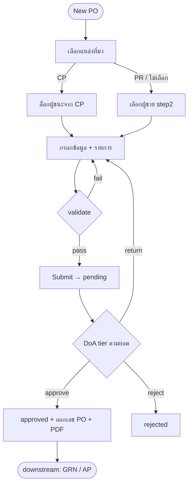
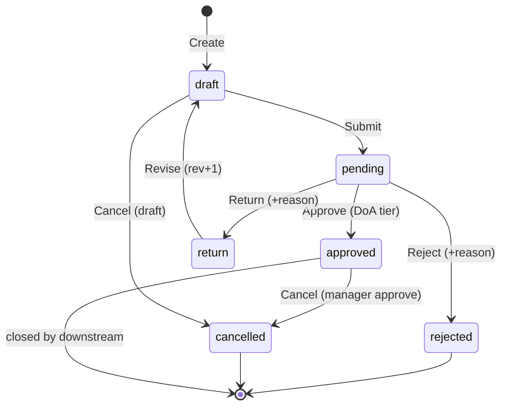

# BRD: ใบสั่งซื้อ (Purchase Order)

| Field | Value |
|---|---|
| BRD ID | BRD-PO-001 |
| Feature Name | ใบสั่งซื้อ (Purchase Order) |
| Feature ID | F-PO-001 |
| BRD Type | New Feature |
| Version | 1.0 |
| Status | AI Reviewed |
| Module | การจัดซื้อ (Purchase) — Value Stream P2P |
| Value Stream | Procure-to-Pay (PR → CP → PO → GRN → AP) |
| Owner | Tadswan C. (BA) |
| Stakeholders | Bird (Dev Manager), Strike (Lead Dev), Chin (UI), ฝ่ายจัดซื้อ, ฝ่ายบัญชี (AP) |
| Created Date | 8 มิถุนายน 2569 |
| Last Updated | 8 มิถุนายน 2569 |

## Changelog
- v1.0 (8 มิ.ย. 2569): สร้าง BRD ผ่าน brd-generator-full (Standalone Mode) จาก HTML prototype (po_fixed.html) + P2P Cheat Sheet (D01–D15) + Payment Term Master (F-PAYMENT-TERM-001) + PO PDF spec 4 ชุด

---

## Section 2: Business Context

### 2.1 ปัญหา / โอกาส
องค์กรต้องออก **ใบสั่งซื้อ (PO)** อย่างเป็นทางการเพื่อผูกพันกับผู้ขายหลังผ่านขั้นตอนขอซื้อ (PR) และ/หรือเปรียบเทียบราคา (CP) แต่ปัจจุบันยังไม่มีระบบที่ (ก) ผูกที่มาของ PO กับ PR/CP ได้ครบทุกโหมด, (ข) บังคับเลือกผู้ขายตามแหล่งที่มาอย่างถูกต้อง (ผู้ชนะจาก CP เท่านั้น), (ค) รองรับการคิดภาษีหลายรูปแบบ (VAT/ยกเว้น/ส่วนลด/หัก ณ ที่จ่าย) ในเอกสารเดียว, และ (ง) เดินสายอนุมัติตาม DoA พร้อมออกเอกสาร PDF ทางการ. งานจึงทำมือบน Excel/เอกสารกระดาษ เสี่ยงผิดพลาดด้านราคา ภาษี และการอนุมัติเกินอำนาจ.

### 2.2 เป้าหมายทาง Business
- เป้าหมายที่ 1: สร้าง PO ที่ผูกที่มาจาก PR/CP ได้ครบ 3 โหมด (กำหนดด้วย Purchase Config) และล็อกผู้ขายให้ตรงผู้ชนะการเปรียบเทียบ
- เป้าหมายที่ 2: คิดเงินครบทุกรูปแบบภาษีในเอกสารเดียว (VAT 7% / ยกเว้น VAT / ส่วนลดรายการ-ท้ายบิล / หัก ณ ที่จ่าย) ถูกต้องตามมาตรฐานสรรพากร
- เป้าหมายที่ 3: บังคับการอนุมัติตาม DoA (ตามวงเงิน) แยกผู้จัดทำกับผู้อนุมัติ (SoD) และออกเอกสาร PO PDF ทางการพร้อมช่องลงนาม
- เป้าหมายที่ 4: ส่งสถานะรับสินค้า/การจ่าย downstream (GRN, AP) กลับมาแสดงบน PO เพื่อปิด loop P2P

### 2.3 ตัวชี้วัดความสำเร็จ (Success Metrics)
| Metric | Baseline | Target | วัดยังไง |
|---|---|---|---|
| เวลาออก PO ต่อใบ | ~30 นาที (ทำมือ) | < 5 นาที | now(submit) − now(open create) |
| PO ผิดราคา/ภาษี | ~5% | < 0.5% | จำนวน PO ที่ถูก return/แก้ ÷ ทั้งหมด |
| PO อนุมัติเกินอำนาจ (DoA breach) | ไม่ทราบ | 0 | audit flag (อนุมัติ > limit ของ tier) |
| PO ที่ผูก PR/CP ครบ | — | > 95% | PO ที่มี source ÷ ทั้งหมด (เว้น PO อิสระตาม config) |

### 2.4 ที่มาของ Requirement
- เคสที่เกิด: ทีมจัดซื้อต้องการต่อสาย P2P จาก CP (F-CP-001) มายัง PO ให้ครบ pipeline เดียวกับ CP
- Request จาก: ฝ่ายจัดซื้อ + Dev (Bird/Strike) — ภายใต้ CUBE 4.0 P2P value stream
- อ้างอิง: HTML prototype `po_fixed.html`, P2P Cheat Sheet (locked decisions D01–D15), Payment Term Master F-PAYMENT-TERM-001, PO PDF spec 4 ชุด (PO_print-spec.md)

---

## Section 3: Scope

### 3.1 In Scope
- สร้าง PO ผ่าน wizard 5 ขั้น: (1) เลือกแหล่งที่มา (2) ข้อมูลหลัก PO (3) รายการสินค้า (4) เอกสารแนบ (5) ตรวจสอบและยืนยัน
- รองรับ 3 โหมดที่มา (กำหนดที่ Purchase Config): PR → CP → PO · PR → PO · PO โดยตรง
- เลือกผู้ขายตามแหล่งที่มา: CP = ล็อกผู้ชนะ · PR/PO อิสระ = เลือกจาก Vendor Master
- รายการสินค้า: VAT 3 โหมด (ไม่คิด/เพิ่มนอก/รวมใน) + ส่วนลดรายการ (บาท/%) + ส่วนลดท้ายบิล + หัก ณ ที่จ่าย (WHT)
- เงื่อนไขการชำระเงิน (Payment Term) จาก master F-PAYMENT-TERM-001 (8 เงื่อนไข)
- สถานะ 3 แกน: เอกสาร (status_doc) / รับสินค้า (status_delivery) / การจ่าย (status_payment)
- สายอนุมัติตาม DoA (placeholder {feature_id, cost_center, amount}) + ช่องลงนาม Maker/Checker/Approver
- ออกเอกสาร PO PDF ทางการ (A4, Sarabun, CI CUBE NATIVE) 4 รูปแบบภาษี
- หน้า List + ค้นหา/กรอง + View drawer (detail / PDF / signature)

### 3.2 Out of Scope
- การรับสินค้า (GRN, F-GRN-001) — แยก feature (PO รับสถานะกลับมาแสดงเท่านั้น)
- ตั้งหนี้/จ่ายเงิน (AP / Payment Voucher) — แยก feature
- การสร้าง/แก้ Vendor Master, Item Master, Comparison (CP), Purchase Requisition (PR) — แยก feature (PO อ่านอ้างอิง)
- หน้าจัดการ DoA rules (DOA Foundation F-PC-DOA-01) + Purchase Config — แยก feature (PO บริโภค config/resolver)
- Engine คำนวณภาษีระดับ rule editor (Phase 4) — รอบนี้ใช้สูตรมาตรฐาน

### 3.3 Assumptions
- มี Vendor Master, Item Master, PR, CP, Payment Term Master, Purchase Config, DOA resolver พร้อมใช้งาน (เป็น dependency)
- Document Numbering ของ PO ใช้บริการกลางที่มีอยู่ (running `PO-YYYY-NNNNN`)
- VAT มาตรฐาน = 7% (ปรับได้ผ่าน config), WHT rate ตามหมวดบริการ (1/2/3/5%)

---

## Section 4: User Roles & Permissions

### 4.1 Roles ที่เกี่ยวข้อง
| Role | คำอธิบาย |
|---|---|
| เจ้าหน้าที่จัดซื้อ (Buyer / Purchasing Officer) | ผู้สร้าง/แก้ไข PO (Maker) |
| หัวหน้าแผนกจัดซื้อ (Senior Buyer) | ผู้ตรวจสอบก่อนส่งอนุมัติ (Checker — optional) |
| ผู้จัดการฝ่ายจัดซื้อ (Purchasing Manager) | ผู้อนุมัติ tier 1 (≤ 100,000) |
| ผู้อำนวยการจัดซื้อ (Purchasing Director) | ผู้อนุมัติ tier 2 (≤ 500,000) |
| ผู้บริหารสูงสุด (CEO) | ผู้อนุมัติ tier 3 (> 500,000) |
| ฝ่ายบัญชี (AP / Finance) | ดูเอกสาร + ใช้ตั้งหนี้/จ่าย (downstream) |
| คลังสินค้า (Warehouse) | ดูเพื่อรับสินค้า (GRN downstream) |
| ผู้ดูทั่วไป (Viewer) | ดูอย่างเดียว |

### 4.2 Permission Matrix
| Action | Buyer | Senior Buyer | Purch. Manager | Director/CEO | AP | Viewer |
|---|:---:|:---:|:---:|:---:|:---:|:---:|
| สร้าง/แก้ PO (draft) | ✅ | ✅ | ✅ | ❌ | ❌ | ❌ |
| ส่งขออนุมัติ (submit) | ✅ | ✅ | ✅ | ❌ | ❌ | ❌ |
| อนุมัติ/ตีกลับ/ปฏิเสธ | ❌ | ❌ | ✅ (≤100K) | ✅ (tier ตน) | ❌ | ❌ |
| ยกเลิก PO | ⚠️ (draft เท่านั้น) | ⚠️ | ✅ (ต้องอนุมัติ) | ✅ | ❌ | ❌ |
| ออก/พิมพ์ PDF | ✅ | ✅ | ✅ | ✅ | ✅ | ✅ |
| ดู PO | ✅ | ✅ | ✅ | ✅ | ✅ | ✅ |

> Permission ทุกแถวบังคับด้วย User Access ENC (Section 16) — DoA tier resolve โดย DOA resolver {feature_id=F-PO-001, cost_center, amount}

---

## Section 5: User Journey (with COSO) ⭐

### 5.1 Happy Path — สร้าง PO จาก CP แล้วอนุมัติ
| # | Step | Maker | Checker | Approver | System | Notes |
|---|---|---|---|---|---|---|
| 1 | เลือกแหล่งที่มา (CP / PR / ไม่เลือก) | Buyer | — | — | โหลด awarded vendors ถ้าเป็น CP / บังคับตาม Purchase Config | Trigger: New PO |
| 2 | เลือกผู้ขาย | Buyer | — | — | CP→ล็อกผู้ชนะ · PR/อิสระ→combobox จาก Vendor Master | R04/R05 |
| 3 | กรอกข้อมูลหลัก PO (วันที่, กำหนดส่ง, payment term, ผู้จัดซื้อ) | Buyer | — | — | default payment_term จากผู้ขาย, expected_date = today+7 | R06/R19 |
| 4 | เพิ่ม/แก้รายการสินค้า (qty, ราคา, ส่วนลด ฿/%, VAT mode) | Buyer | — | — | คำนวณ subtotal/discount/VAT/total real-time | R07–R10 |
| 5 | แนบเอกสาร (optional) + ตรวจสอบ | Buyer | — | — | สรุปยอด + เตือนถ้าข้อมูลไม่ครบ | — |
| 6 | ส่งขออนุมัติ (submit) | Buyer | — | — | validate ครบ → status_doc = pending; resolve DoA tier จากยอดรวม | R12/R13 |
| 7 | (optional) ตรวจสอบก่อนอนุมัติ | — | Senior Buyer | — | แจ้งเตือน Checker | ข้ามได้ถ้า config ไม่บังคับ |
| 8 | อนุมัติ | — | — | Manager/Director/CEO (ตาม tier) | status_doc = approved · lock เอกสาร · ออกเลข PO | SLA (Q1) |

**SoD Check:** Maker (Buyer) ≠ Approver (Manager/Director/CEO) ✅

### 5.2 Alternative Paths

#### 5.2.1 Reject / Return Path
| # | Step | COSO Roles | Notes |
|---|---|---|---|
| 1 | ผู้อนุมัติ "ตีกลับเพื่อแก้ไข" | Approver | status_doc = return → กลับเป็น draft, revision_no +1, ต้องระบุเหตุผล |
| 2 | ผู้อนุมัติ "ปฏิเสธ" | Approver | status_doc = rejected (ปิด), ต้องระบุเหตุผล |
| 3 | Buyer แก้แล้วส่งใหม่ | Maker (Buyer) | จาก draft → pending อีกครั้ง |

#### 5.2.2 PO อิสระ / PR-only Path
| # | Step | COSO Roles | Notes |
|---|---|---|---|
| 1 | ไม่เลือกแหล่งที่มา (PO ตรง) หรือเลือกแค่ PR | Buyer | ไม่มีตารางผู้ชนะ — ไปเลือกผู้ขายที่ Step 2 |
| 2 | เลือกผู้ขายจาก Vendor Master | Buyer | PR-only → ดึงรายการจาก PR · อิสระ → กรอกรายการเอง |

#### 5.2.3 Cancel Path
| # | Step | COSO Roles | Notes |
|---|---|---|---|
| 1 | ยกเลิก PO ที่ draft | Maker (Buyer) | ระบุเหตุผล |
| 2 | ยกเลิก PO ที่ approved | Approver (Manager) | ต้องอนุมัติการยกเลิก + เหตุผล (R18) — เฉพาะถ้ายังไม่มี GRN/AP |

### 5.3 Process Diagram (Mermaid)


---

## Section 6: Data Entity & Fields

### 6.1 Entity Overview
| Entity | Type | Description |
|---|---|---|
| PO_Header | Header | Master record ของ PO |
| PO_Line | Detail | รายการสินค้าใน PO (1:N) |
| PO_Attachment | Attachment | ไฟล์แนบ (1:N) |
| PO_Approval | Audit/Workflow | ประวัติสายอนุมัติ (1:N) — ผูก DoA |

### 6.2 Entity: PO_Header
| # | Field | Label UI | Input Type | ค่า/ตัวเลือก | จำเป็น | เงื่อนไข | หมายเหตุ |
|---|---|---|---|---|:---:|---|---|
| 1 | po_no | เลขที่ PO | AUTO | `PO-YYYY-NNNNN` | ✅ | running เมื่อ approved | Document Numbering |
| 2 | po_date | วันที่ PO | DATE | — | ✅ | ≤ today | — |
| 3 | expected_date | วันที่คาดว่าจะได้รับ | DATE | — | ✅ | ≥ po_date · default today+7 | R19 |
| 4 | source_type | ประเภทที่มา | ENUM | CP / PR / DIRECT | ⚠️ | ตาม Purchase Config | R03 |
| 5 | source_cp_no | อ้างอิง CP | LOOKUP | Comparison (won) | ⚠️ | ถ้า source=CP | snapshot |
| 6 | source_pr_no | อ้างอิง PR | LOOKUP | PR (approved) | ⚠️ | ถ้า source=PR/CP | snapshot |
| 7 | vendor_id | ผู้ขาย | LOOKUP | Vendor Master (active) | ✅ | CP=ผู้ชนะ locked / อื่น=เลือกเอง | snapshot vendor_name/tax_id |
| 8 | buyer | ผู้จัดซื้อ | LOOKUP | Employee | ✅ | active | snapshot ชื่อ/ตำแหน่ง |
| 9 | dept | แผนก/Cost Center | AUTO | จาก buyer | ✅ | — | ใช้ resolve DoA |
| 10 | payment_term | เงื่อนไขการชำระเงิน | DROPDOWN | F-PAYMENT-TERM-001 (8) | ✅ | default = vendor term | R06 |
| 11 | endbill_discount_mode | โหมดส่วนลดท้ายบิล | ENUM | amount / percent | ⚠️ | — | R09 |
| 12 | endbill_discount_value | ค่าส่วนลดท้ายบิล | NUMBER | ≥ 0 | ⚠️ | ≤ subtotal | — |
| 13 | wht_enabled / wht_pct | หัก ณ ที่จ่าย | BOOL / NUMBER | 1/2/3/5% | ⚠️ | งานบริการ | R11 |
| 14 | grand_total | ยอดรวมทั้งสิ้น | NUMBER | — | ✅ | auto-calc | read-only |
| 15 | status_doc | สถานะเอกสาร | STATE | draft/pending/approved/rejected/return/cancelled | ✅ | default draft | R01 |
| 16 | status_delivery | สถานะรับสินค้า | STATE | NONE/PARTIAL/FULL | ✅ | จาก GRN | downstream |
| 17 | status_payment | สถานะการจ่าย | STATE | NONE/PARTIAL/FULL | ✅ | จาก AP | downstream |
| 18 | revision_no | ครั้งที่แก้ | NUMBER | — | ✅ | +1 เมื่อ return | — |
| 19 | notes | หมายเหตุ | TEXT | — | ⚠️ | — | — |
| 20 | created_by / created_date | ผู้สร้าง/วันที่ | AUTO | session / now() | ✅ | — | Audit |
| 21 | modified_by / modified_date | ผู้แก้/วันที่ | AUTO | session / now() | ⚠️ | — | Audit |

### 6.3 Entity: PO_Line
| # | Field | Label UI | Input Type | ค่า/ตัวเลือก | จำเป็น | เงื่อนไข | หมายเหตุ |
|---|---|---|---|---|:---:|---|---|
| 1 | line_id | — | AUTO | — | ✅ | — | PK |
| 2 | item_code / item_name | สินค้า | LOOKUP | Item Master | ✅ | แสดง "ชื่อ" บน UI | snapshot |
| 3 | qty | จำนวน | NUMBER | > 0 | ✅ | — | — |
| 4 | unit | หน่วย | TEXT | — | ✅ | จาก item | — |
| 5 | unit_price | ราคา/หน่วย | NUMBER | ≥ 0 | ✅ | — | — |
| 6 | discount_mode | โหมดส่วนลด | ENUM | percent / amount | ✅ | default percent | R09 |
| 7 | discount_pct / discount_amt | ส่วนลด | NUMBER | ≥ 0 | ⚠️ | amount ≤ subtotal | R09 |
| 8 | vat_mode | ภาษี | ENUM | none / add / included | ✅ | mutually exclusive | R08 |
| 9 | vat_pct | อัตรา VAT | NUMBER | default 7 | ⚠️ | config | R07 |
| 10 | note | หมายเหตุ | TEXT | — | ⚠️ | — | — |

### 6.4 Entity Relationship
```
PO_Header ──(1:N)──▶ PO_Line
PO_Header ──(1:N)──▶ PO_Attachment
PO_Header ──(1:N)──▶ PO_Approval
Vendor   ──(referenced by)──▶ PO_Header (FK vendor_id, snapshot)
PR / CP  ──(referenced by)──▶ PO_Header (FK source_pr_no/source_cp_no)
Payment_Term ──(referenced by)──▶ PO_Header (FK payment_term)
Item     ──(referenced by)──▶ PO_Line (FK item_code, snapshot)
```

---

## Section 7: User Stories & Acceptance Criteria

### Story S-01: สร้าง PO จาก Comparison (CP)
**As a** เจ้าหน้าที่จัดซื้อ **I want to** สร้าง PO จากผลเปรียบเทียบราคา **So that** ผูกพันผู้ชนะได้ถูกต้อง
- **AC1**: Given เลือกแหล่งที่มาเป็น CP, When ระบบโหลดผู้ชนะ, Then แสดงตารางผู้ชนะให้เลือก 1 ราย
- **AC2**: Given เลือกผู้ชนะแล้ว, When ไป Step 2, Then ช่องผู้ขายถูกล็อก (แก้ไม่ได้) + payment_term = ของผู้ขาย
- **AC3**: Given ยืนยันครบ, When submit, Then status_doc = pending + resolve DoA tier ตามยอดรวม

### Story S-02: สร้าง PO อิสระ / จาก PR
**As a** เจ้าหน้าที่จัดซื้อ **I want to** สร้าง PO โดยไม่อ้างอิงหรืออ้างอิงแค่ PR **So that** ครอบคลุมกรณีที่ Purchase Config อนุญาต
- **AC1**: Given ไม่เลือกแหล่งที่มา, When กดถัดไป, Then ไป Step 2 ได้ (ไม่บังคับ — ตาม Purchase Config) โดยไม่มี pop-up ขวาง
- **AC2**: Given เลือกแค่ PR, When ไป Step 2, Then ไม่มีตารางผู้ชนะ + แสดง combobox ให้เลือกผู้ขายจาก Vendor Master
- **AC3**: Given PO อิสระไป Step 3, Then มีแถวรายการเปล่าให้กรอกเอง

### Story S-03: คำนวณภาษีและส่วนลด
**As a** เจ้าหน้าที่จัดซื้อ **I want to** คิด VAT/ส่วนลด/หัก ณ ที่จ่าย **So that** เอกสารถูกต้องตามสรรพากร
- **AC1**: Given รายการ VAT mode = add, Then VAT 7% คิดเพิ่มจากยอดหลังหักส่วนลด
- **AC2**: Given ส่วนลดรายการเป็นบาทเกิน subtotal, Then ระบบ cap ที่ subtotal
- **AC3**: Given เปิดหัก ณ ที่จ่าย 3%, Then ยอดชำระสุทธิ = รวมทั้งสิ้น(รวม VAT) − WHT(ฐานก่อน VAT)

### Story S-04: อนุมัติตาม DoA
**As a** ผู้อนุมัติ **I want to** อนุมัติ/ตีกลับ/ปฏิเสธตามวงเงิน **So that** ควบคุมการใช้จ่าย
- **AC1**: Given ยอด ≤ 100,000, Then ผู้อนุมัติ = Purchasing Manager (tier 1)
- **AC2**: Given ผู้จัดทำ = ผู้อนุมัติคนเดียวกัน, Then ระบบ block (SoD)
- **AC3**: Given ตีกลับ, Then status_doc = return + revision_no +1 + ต้องระบุเหตุผล

### Story S-05: ออกเอกสาร PO PDF
**As a** เจ้าหน้าที่จัดซื้อ **I want to** ออก PDF ทางการ **So that** ส่งผู้ขายได้
- **AC1**: Given PO approved, When กดพิมพ์, Then ได้ PDF A4 (Sarabun, CI) ตามรูปแบบภาษีของ PO (VAT/ยกเว้น/ส่วนลด/WHT)
- **AC2**: Given เอกสาร, Then มีช่องลงนาม ผู้จัดทำ/ผู้ตรวจสอบ/ผู้อนุมัติ + จำนวนเงินตัวอักษรตรงยอดสุทธิ

---

## Section 8: Status & Lifecycle

### 8.1 State Diagram (status_doc)


### 8.2 State Transition Table
| Current | Trigger | Next | COSO Role | Notes |
|---|---|---|---|---|
| draft | Submit | pending | Buyer (Maker) | validate + resolve DoA |
| pending | Approve | approved | Manager/Director/CEO (Approver) | ออกเลข PO + lock |
| pending | Reject | rejected | Approver | require reason |
| pending | Return | return | Approver | require reason |
| return | Revise | draft | Buyer (Maker) | revision_no +1 |
| approved | Cancel | cancelled | Approver | require approve + reason (R18) |
| draft | Cancel | cancelled | Buyer | require reason |

### 8.3 แกนสถานะคู่ขนาน (downstream)
| แกน | ค่า | มาจาก |
|---|---|---|
| status_delivery | NONE → PARTIAL → FULL | GRN (F-GRN-001) |
| status_payment | NONE → PARTIAL → FULL | AP / Payment Voucher |

> GRN trigger ขึ้นกับ payment type (D02): prepay/deposit → รอ Payment Voucher ก่อน; ประเภทอื่น → รับได้ทันทีหลัง approved

---

## Section 9: Business Rules + Validation (with Tags)

### 9.1 Business Rules
| Rule ID | Rule | Tag | Type | เหตุผล Tag |
|---|---|:---:|---|---|
| R01 | status เริ่มต้น = draft | FIXED | Constant | logic ตายตัว |
| R02 | PO ต้องมีผู้ขาย 1 ราย | FIXED | Constraint | นิยาม PO |
| R03 | แหล่งที่มาบังคับหรือไม่ + โหมดที่อนุญาต (PR→CP→PO / PR→PO / PO ตรง) | CONFIGURABLE | Config | `purchase_source_mode` ที่ Purchase Config |
| R04 | source=CP → ผู้ขาย = ผู้ชนะเท่านั้น (locked) | FIXED | Logic | ผู้ชนะถูกเลือกที่ CP |
| R05 | source=PR/ตรง → เลือกผู้ขายจาก Vendor Master (active) | FIXED | Logic | ไม่มีผู้ชนะใน PR |
| R06 | payment_term default = ของผู้ขาย, แก้ได้ | DYNAMIC | Default+Override | จาก vendor master |
| R07 | VAT = 7% | CONFIGURABLE | Rate | `vat_rate` |
| R08 | VAT mode รายการ: none / add / included (เลือกอย่างใดอย่างหนึ่ง) | FIXED | Enum | นิยามการคิด VAT |
| R09 | ส่วนลดรายการ = บาท หรือ % ; ส่วนลดบาท ≤ subtotal ของรายการ | FIXED | Constraint | กันส่วนลดติดลบ |
| R10 | ฐาน VAT = ยอดหลังหักส่วนลด | FIXED | Formula | มาตรฐานสรรพากร |
| R11 | หัก ณ ที่จ่าย (WHT) อัตราตามหมวด (1/2/3/5%) ฐานก่อน VAT | CONFIGURABLE | Rate | `wht_rate` ตามหมวดบริการ |
| R12 | DoA: อนุมัติได้เมื่อ amount ≤ limit ของ tier | CONFIGURABLE | Amount | DOA resolver {feature_id, cost_center, amount} |
| R13 | Maker ≠ Approver | FIXED | SoD | COSO |
| R14 | เลข PO running เมื่อ approved | CONFIGURABLE | Sequence | Document Numbering |
| R15 | GRN trigger ตาม payment type | DYNAMIC | Condition | D02 |
| R16 | DEP term: เปอร์เซ็นต์มัดจำแก้ได้ | DYNAMIC | Formula | D08 |
| R17 | INST term: จำนวนงวด/สัดส่วนแก้ได้ | DYNAMIC | Formula | D09 |
| R18 | ยกเลิก PO ที่ approved ต้องอนุมัติ + เหตุผล | CONFIGURABLE | Policy | นโยบายควบคุม |
| R19 | expected_date default = po_date + 7 วัน | CONFIGURABLE | Default | `po_lead_days` |
| R20 | SLA เวลาอนุมัติของแต่ละ tier | WARNING | SLA | รอ stakeholder |

### 9.2 Validation Rules
| VR ID | Field/Action | เงื่อนไข | ประเภท | ข้อความ |
|---|---|---|---|---|
| VR01 | vendor_id | required (ก่อนพ้น Step 2) | Error | กรุณาเลือกผู้ขาย |
| VR02 | po_date | ≤ today | Error | วันที่ห้ามเป็นอนาคต |
| VR03 | expected_date | ≥ po_date | Error | วันรับต้องไม่ก่อนวันที่ PO |
| VR04 | lines | ≥ 1 รายการ + qty>0 + unit_price≥0 | Error | ต้องมีรายการอย่างน้อย 1 |
| VR05 | discount_amt | ≤ line subtotal | Trigger | cap อัตโนมัติ |
| VR06 | submit | amount > DoA tier สูงสุด | Error | เกินอำนาจอนุมัติทุก tier |
| VR07 | reject/return/cancel(approved) | reason required | Error | กรุณาระบุเหตุผล |
| VR08 | source (CP) | ต้องเลือกผู้ชนะ | Error | กรุณาเลือกผู้ขายจากตารางผู้ชนะ |

### 9.5 สรุประดับความยืดหยุ่น
| Rule ID | Tag | ใครเปลี่ยน | บ่อยแค่ไหน | ระดับ |
|---|:---:|---|---|---|
| R03 | CONFIGURABLE | Admin (จัดซื้อ) | นาน ๆ ครั้ง | Purchase Config |
| R07 | CONFIGURABLE | Admin (บัญชี) | ตามกฎหมาย | Admin Panel (config key) |
| R11 | CONFIGURABLE | Admin (บัญชี) | ตามหมวด | Admin Panel (WHT table) |
| R12 | CONFIGURABLE | ผู้บริหาร | ปีละ 1–2 ครั้ง | DOA Foundation (resolver) |
| R14 | CONFIGURABLE | Admin | นาน ๆ ครั้ง | Document Numbering |
| R18/R19 | CONFIGURABLE | Admin | นาน ๆ ครั้ง | Purchase Config |
| R06/R15/R16/R17 | DYNAMIC | ผู้บริหาร/ระบบ | ตามดีล | Rule Management (Phase 3) |
| R20 | WARNING | — | — | ⚠️ รอ Stakeholder (Q1) |

---

## Section 10: Edge Cases

### 10.1 Edge Cases ที่ระบุ (default ☑)
- ☑ E01: source=CP แต่ผู้ชนะถูกออก PO ไปแล้ว (po_status=CREATED) → ปุ่มเลือกถูก disable + แสดงเลข PO เดิม
- ☑ E02: เลือกแค่ PR (มี/ไม่มี CP) → ไม่แสดงตารางผู้ชนะ → เลือกผู้ขายที่ Step 2
- ☑ E03: ไม่เลือกแหล่งที่มา (PO ตรง) → กดถัดไปได้ (ไม่บังคับตาม config) → Step 3 มีแถวเปล่า
- ☑ E04: ส่วนลดรายการเป็นบาทเกิน subtotal → cap ที่ subtotal (VR05)
- ☑ E05: clear แหล่งที่มา → reset ผู้ขายที่เลือกไว้ (กันค้าง)

### 10.2 Edge Cases จาก AI Pattern Matching (default ☐ — ต้อง confirm)

**CL (Calculation)**
- ☐ E06: VAT mode = included แต่ราคา = 0 → VAT ถอน = 0 (ไม่ error)
- ☐ E07: ยอดรวม = 0 (ทุกรายการราคา 0) → block submit
- ☐ E08: หัก ณ ที่จ่าย > ยอดรวมทั้งสิ้น (กรณีตั้ง rate ผิด) → block + warn

**ST (Status/Workflow)**
- ☐ E09: ยกเลิก PO ที่มี GRN/AP แล้ว → block (ต้อง reverse downstream ก่อน)
- ☐ E10: reject/return โดยไม่ระบุเหตุผล → require (VR07)
- ☐ E11: submit PO ที่ยอดเกิน DoA tier สูงสุด → block (VR06) + แนะนำแยกเอกสาร

**CA (Concurrent Access)**
- ☐ E12: 2 users แก้ PO draft เดียวกัน → optimistic lock (version field)
- ☐ E13: อนุมัติขณะ Buyer กำลังแก้ → lock + แจ้งเตือน

**DI (Data Integrity)**
- ☐ E14: Vendor/Item ถูก inactive หลังเลือก → เตือนตอน submit (ใช้ snapshot ที่บันทึกไว้)
- ☐ E15: payment_term ถูกลบจาก master หลังเลือก → คง snapshot + เตือน

**PM (Permission)**
- ☐ E16: Buyer พยายามอนุมัติ PO ตัวเอง → block (R13 SoD)

### Tag Review Report
- ✅ R01/R02/R04/R05/R08/R09/R10/R13 — FIXED ถูกต้อง (logic/constraint ไม่เปลี่ยน)
- ✅ R03/R07/R11/R12/R14/R18/R19 — CONFIGURABLE ถูกต้อง (มี config owner ชัด)
- ✅ R06/R15/R16/R17 — DYNAMIC ถูกต้อง (สูตร/เงื่อนไขซับซ้อน อาจปรับ)
- ⚠️ R20 — WARNING: SLA ยังไม่ตัดสินใจ → Q1

---

## Section 11: Impact Analysis / Regression Scope
> New Feature — ไม่มีของเก่าโดยตรง แต่ผูกกับ feature อื่นใน P2P:
- ผูก downstream: GRN (status_delivery), AP/PV (status_payment) — ต้องมี contract รับสถานะกลับ
- ผูก upstream: CP (อ่านผู้ชนะ + po_status เพื่อกัน double-PO), PR (อ่านรายการ)
- ใช้ master ร่วม: Vendor, Item, Payment Term, Purchase Config, DOA resolver

---

## Section 12: Dependencies

### 12.1 Internal Dependencies
| Dependency | ใช้ทำอะไร | สถานะ |
|---|---|---|
| Vendor Master (F-VENDOR-MASTER-001) | เลือก/snapshot ผู้ขาย + payment term default | ✅ มี |
| Item Master (F-PRODUCT-MASTER-001) | เลือก/snapshot รายการสินค้า | ✅ มี |
| Comparison (F-CP-001) | อ่านผู้ชนะ + po_status | ✅ มี |
| Purchase Requisition (PR, F-PR-001) | อ่านรายการ/ยอด | ✅ มี |
| Payment Term Master (F-PAYMENT-TERM-001) | 8 เงื่อนไขชำระเงิน | ✅ มี |
| Purchase Config | โหมดที่มา (R03), config keys | ✅ มี (Bible v1.4) |
| DOA Foundation (F-PC-DOA-01) | resolve tier อนุมัติ {feature_id, cost_center, amount} | ✅ มี |
| Document Numbering | running เลข PO | ✅ มี |
| thai-doc-pdf-generator | ออก PO PDF (4 รูปแบบภาษี) | ✅ มี (PO_print-spec.md) |

### 12.2 External Dependencies
- Notification Service (แจ้งผู้อนุมัติ)
- Audit Log Service
- File Storage (เอกสารแนบ)

### 12.3 Existing System Reference
| Rule/Item | ระดับ | มีอยู่แล้ว? | Reference |
|---|---|:---:|---|
| R14 (เลข PO) | Admin Panel | ✅ | System Config → Document Numbering |
| R12 (DoA) | DOA Foundation | ✅ | F-PC-DOA-01 resolver |
| R07/R11 (VAT/WHT) | Admin Panel | ⚠️ บางส่วน | Finance config — ต้องเพิ่ม WHT table |
| R03 (source mode) | Purchase Config | ✅ | Purchase Config Bible v1.4 |
| Vendor/Item/Term lookup | Master Data | ✅ | มี master ครบ |

---

## Section 13: Delivery Phases

### Phase 1: Feature Launch
- สร้าง PO_Header + PO_Line + PO_Attachment + PO_Approval + Audit Fields
- Wizard 5 ขั้น + 3-axis status + state machine (status_doc)
- ผูก lookup: Vendor/Item/PR/CP/Payment Term (snapshot)
- คำนวณ VAT 3 mode + ส่วนลด ฿/% + ส่วนลดท้ายบิล + WHT (ใช้ config keys ไม่ hardcode)
- ผูก DOA resolver (placeholder {feature_id, cost_center, amount}) + ช่องลงนาม
- ออก PO PDF (4 รูปแบบภาษี ผ่าน thai-doc-pdf-generator)
- **Reuse:** Document Numbering, Audit Log, DOA Foundation, Master Data, PDF generator

### Phase 2: Admin Panel
- UI config: vat_rate, wht_rate table, po_lead_days, purchase_source_mode, cancel policy (R03/R07/R11/R18/R19)

### Phase 3: Rule Management
- DYNAMIC rules: GRN trigger ตาม payment type (R15), DEP%/INST แก้ได้ (R16/R17) — rule editor

### Phase 4: Engine Management
- (ไม่มีในรอบนี้)

---

## Section 14: Dev Requirements Summary "ใบสั่ง"

### 14.1 Config Foundation
| Item | โครงสร้าง | รองรับ Rule | มีอยู่แล้ว? |
|---|---|---|:---:|
| Purchase Config | key-value | R03, R18, R19 | ✅ ใช้ที่มี |
| Finance Config | key-value + WHT table | R07, R11 | ⚠️ เพิ่ม WHT table |
| DOA resolver | {feature_id, cost_center, amount} → tier | R12 | ✅ ใช้ที่มี |
| Rule Table | rule_id + condition_json | R15, R16, R17 | ❌ สร้าง (Phase 3) |

### 14.2 ข้อกำหนดจาก Tag
| Rule | ระดับ | Dev ต้องทำอะไร |
|---|---|---|
| R03 | Purchase Config | อ่าน key `purchase_source_mode` กำหนด required + โหมดที่อนุญาต |
| R07 | Config | อ่าน `vat_rate` (default 7) |
| R11 | Admin Panel | สร้าง WHT table (หมวด→rate) + UI |
| R12 | DOA Foundation | เรียก resolver ตอน submit — ห้าม hardcode tier |
| R14 | Document Numbering | gen `PO-YYYY-NNNNN` ตอน approved |

### 14.3 ข้อกำหนดจาก Edge Cases / Validation
- E01: เช็ค cp.vendors[].po_status เพื่อ disable ปุ่มเลือก + แสดงเลข PO เดิม
- E04/VR05: cap discount_amt ≤ line subtotal
- E12: version field ใน PO_Header (optimistic lock)
- VR06: block submit ถ้า amount เกิน DoA tier สูงสุด
- snapshot vendor/item/term ตอนสร้าง (กัน master เปลี่ยนภายหลัง — E14/E15)

### 14.4 WARNING ที่รอข้อสรุป
| ประเด็น | หารือกับใคร | สถานะ |
|---|---|---|
| R20 SLA เวลาอนุมัติแต่ละ tier | ผู้จัดการจัดซื้อ + ผู้บริหาร | ⚠️ รอ (Q1) |

### 14.5 Regression Scope
- ทดสอบ contract กับ CP (po_status update กลับ), GRN (status_delivery), AP (status_payment)

### 14.6 Layout Deviation Log (Design Authority) ⭐
> Layout authority = **html-generator-v3 (v3.9)** — ERP shell (Sidebar 256px + Header 52px + Breadcrumb), drawer button contract (Rule #31), hint=tooltip (Rule #33)

| Page | Pattern (มาตรฐาน) | Standard Applied | Functions Cut | Rationale |
|---|---|---|---|---|
| P-01 PO List | list-view | `list-view` (Pattern A) | — | ตาราง 1 บรรทัด/แถว + filter + status 3 แกน |
| P-02 PO Create | create-drawer-wizard | `create-drawer-wizard` (Pattern B, 920px document) | — | 5 ขั้น · footer ตาม contract · hint=tooltip (Step1) |
| P-03 PO View | view-drawer-tabbed + doc/PDF/signature | `view-drawer-tabbed` (Pattern C) + Pattern G/H/I | — | doc+PDF+signatures → ใช้ G/H/I ครบชุด (R11) |

**Summary:** 3 pages mapped to standard layouts · 0 functions cut · 0 NON-STANDARD override · CI palette locked (Navy/Primary/Teal) · ไม่มี Tailwind CDN · Iron Rules v3.9 compliant (drawer contract, hint tooltip, fluid width)

---

## Section 15: Open Questions
| # | คำถาม | สถานะ | คำตอบ |
|---|---|:---:|---|
| Q1 | SLA เวลาอนุมัติของแต่ละ DoA tier เท่าไหร่? | ⚠️ รอ | — |
| Q2 | กรณี PO ตรง (อิสระ) ต้องผ่าน DoA เหมือนกันไหม? | ✅ ตอบแล้ว | ใช่ — resolve ตามยอดเหมือนกัน |
| Q3 | WHT table แยกตามหมวดบริการอย่างไร (1/2/3/5%)? | ⚠️ รอ | ตามประกาศสรรพากร — บัญชีกำหนด |
| Q4 | ยกเลิก PO ที่มี GRN บางส่วน ทำได้แค่ไหน? | ⚠️ รอ | รอ flow GRN (F-GRN-001) |

---

## Section 16: Security & Compliance ⭐

### 16.1 Security Preset
**Preset:** P2 — Approval/Workflow (14 controls = P1 Standard Transaction 12 + Approval 2)
**เหตุผล:** PO เป็น Transaction Document ที่มีสายอนุมัติ DoA + SoD — ต้องครอบคลุม access control, audit, approval integrity. ก่อน deploy ต้องมี **User Access ENC + DOA ENC** (CUBE 4.0 governance)

### 16.2 Applicable Standards
| Standard | Applicable? |
|---|:---:|
| ISO 27001 | ✅ |
| PDPA | ✅ (ข้อมูลผู้ขาย/ผู้ติดต่อ) |
| SOX | ✅ (financial control + SoD) |
| PCI DSS | ❌ (ไม่มี card data) |

### 16.3 Control Checklist
| Control ID | Standard | Control | Required | Implementation Notes |
|---|---|---|:---:|---|
| C-01 | ISO 27001 | Access control by role | ✓ Must | §4 Permission Matrix + User Access ENC |
| C-02 | ISO 27001 | Field-level edit guard | ✓ Must | vendor locked (CP), grand_total read-only |
| C-05 | PDPA | Audit log ทุกการเปลี่ยน | ✓ Must | Audit Fields §6 + PO_Approval |
| C-06 | PDPA | Data classification (ผู้ขาย=Confidential) | ✓ Must | default Internal, ผู้ขาย=Confidential |
| C-08 | SOX | Approval requires SoD | ✓ Must | R13 Maker ≠ Approver §5 |
| C-09 | SOX | DoA enforcement | ✓ Must | R12 DOA resolver + DOA ENC |
| C-10 | SOX | Document immutability หลัง approved | ✓ Must | lock เอกสาร + revision_no |
| C-12 | ISO 27001 | Snapshot reference data | ✓ Must | snapshot vendor/item/term |
| C-14 | ISO 27001 | Input validation | ✓ Must | §9.2 VR01–VR08 |
| C-15 | SOX | Reason required (reject/cancel) | ✓ Must | VR07 |
| C-18 | ISO 27001 | Attachment scan/limit | ✓ Should | PO_Attachment policy |
| C-20 | SOX | Running number integrity | ✓ Must | R14 Document Numbering |

### 16.4 Risk Statement
| Risk ID | Risk | Mitigated by |
|---|---|---|
| RK-01 | อนุมัติเกินอำนาจ | C-09 (DoA), C-08 (SoD) |
| RK-02 | แก้เอกสารหลังอนุมัติ | C-10 (immutability) |
| RK-03 | คิดภาษี/ส่วนลดผิด | §9 R07–R11 + VR05 |
| RK-04 | ออก PO ซ้ำให้ผู้ชนะเดิม | E01 (po_status guard) |
| RK-05 | ข้อมูลผู้ขายรั่ว | C-05, C-06 |

---

## Section 17: Health Check ⭐

### 17.1 SLA
| Step | SLA | Owner | Action when breached |
|---|---|---|---|
| Submit → Approve (tier 1) | (Q1 — รอ) | Purchasing Manager | escalate to Director |
| Approve → ออก PDF | ทันที (auto) | System | retry |
| Return → Revise → Resubmit | 1 วันทำการ | Buyer | reminder |

### 17.2 Control Points
| Control ID | Where | When | Result |
|---|---|---|---|
| C-08 | Submit/Approve | ทุกครั้ง | block ถ้า Maker = Approver |
| C-09 | Approve | ทุกครั้ง | block ถ้า amount > tier limit |
| C-10 | Edit | หลัง approved | block การแก้ |

### 17.3 KPI
| KPI | Category | Target | Measure |
|---|---|---|---|
| เวลาอนุมัติ PO เฉลี่ย | Speed | < 1 วัน | now(approved) − now(submitted) |
| PO ถูกตีกลับ | Quality | < 10% | return ÷ submitted |
| PO ที่ผูก PR/CP | Compliance | > 95% | มี source ÷ ทั้งหมด |
| ความถูกต้องของยอด | Accuracy | > 99.5% | PO ไม่ถูกแก้เพราะยอดผิด |

### 17.4 Threshold
| Metric | Min | Max | Action |
|---|---|---|---|
| เวลาอนุมัติ | — | 2 วัน | alert manager |
| PO ตีกลับ | — | 15% | review กระบวนการ |
| PO รออนุมัติค้าง | — | 20 ใบ | escalate |

### 17.5 Throughput
- Baseline: ~50 PO/วัน · Target capacity: 300 PO/วัน · Stress point: 600 PO/วัน → ตรวจ DB/PDF render

---

## Section 18: Monitoring ⭐

### 18.1 Reports Overview
| Report | Type | Frequency |
|---|---|---|
| PO Performance (เวลาอนุมัติ/ปริมาณ) | Performance | Daily |
| PO Closing (ยอดสั่งซื้อรายเดือน) | Closing | Monthly |
| PO Anomaly (อนุมัติเกิน DoA / ออกซ้ำ) | Anomaly | Real-time |
| PO Transaction Log | Transaction | On-demand |

### 18.2 Dashboard Widgets
| Widget | Source KPI | Threshold |
|---|---|---|
| เวลาอนุมัติเฉลี่ย | 17.3 #1 | 17.4 #1 |
| PO รออนุมัติ (count) | — | > 20 → แดง |
| อัตราตีกลับ | 17.3 #2 | 17.4 #2 |
| PO แยกตามสถานะ 3 แกน | — | — |

### 18.3 Performance Report
- แยกตามเจ้าหน้าที่จัดซื้อ + การกระจายเวลาอนุมัติ + ผู้ขาย top 10 ตามมูลค่า

### 18.4 Closing Report
- ยอดสั่งซื้อรวมรายเดือน + แยกตามแผนก/cost center + แยกตาม payment term

### 18.5 Anomaly Report
- อนุมัติทั้งที่เกิน DoA tier (audit flag) · ออก PO ซ้ำให้ผู้ชนะเดิม · อนุมัติ < 1 นาทีหลัง submit

### 18.6 Transaction Report
- audit trail เต็มต่อ PO + ประวัติ state transition + การเปลี่ยนทุก field พร้อม user + timestamp + revision history

---

## Appendix

### A. Screen List
| Screen | Layout (html-generator-v3) | Module / Sidebar Active | Breadcrumb | ใครเข้าถึง |
|---|---|---|---|---|
| PO List | list-view (Pattern A) | การจัดซื้อ > ใบสั่งซื้อ (PO) | การจัดซื้อ › ใบสั่งซื้อ (PO) | ทุก role |
| PO Create | create-drawer-wizard (Pattern B, 920px) | — (drawer — no breadcrumb) | — | Buyer/Senior/Manager |
| PO View | view-drawer-tabbed (Pattern C) + G/H/I | — (drawer — no breadcrumb) | — | ทุก role |
| PO PDF | document (Pattern G/H/I, A4) | — (เปิดจาก View) | — | ทุก role |

### B. Glossary
- **PO**: Purchase Order (ใบสั่งซื้อ)
- **PR / CP**: Purchase Requisition / Comparison (เปรียบเทียบราคา)
- **GRN**: Goods Receipt Note (ใบรับสินค้า)
- **AP / PV**: Accounts Payable / Payment Voucher
- **DoA**: Delegation of Authority (สายอนุมัติตามวงเงิน)
- **SoD**: Segregation of Duties (Maker ≠ Approver)
- **WHT**: Withholding Tax (หัก ณ ที่จ่าย)
- **VAT mode**: none (ไม่คิด) / add (เพิ่มนอก) / included (รวมใน)
- **ENC**: Enforcement (User Access ENC + DOA ENC) — gate ก่อน deploy ตาม CUBE 4.0

### C. Document Control
| Version | Date | Author | Changes |
|---|---|---|---|
| 1.0 | 2569-06-08 | Tadswan C. (BA) | Initial via brd-generator-full (Standalone Mode) |
