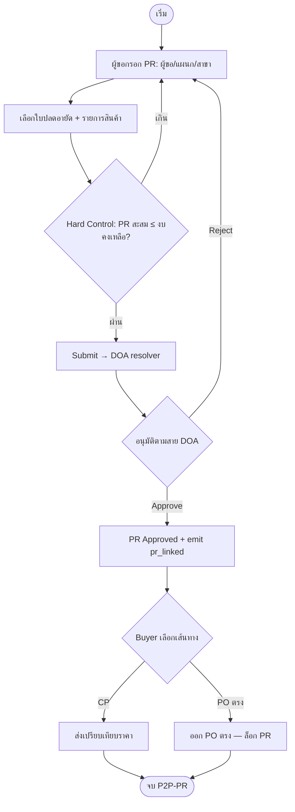
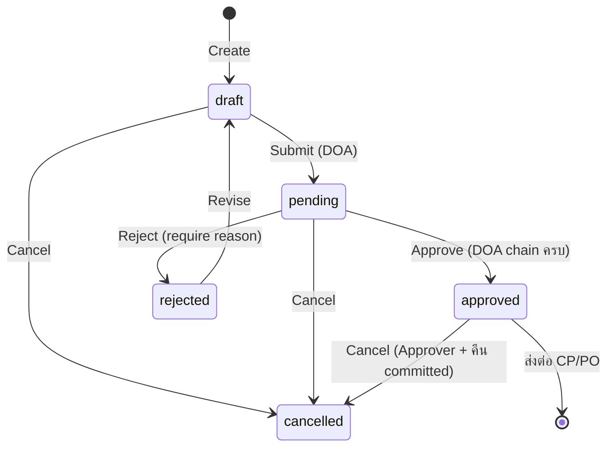

# BRD: ใบขอซื้อ (Purchase Requisition)

## Section 1 — Document Info

| Field | Value |
|---|---|
| BRD ID | BRD-PR-001 |
| Feature Name | ใบขอซื้อ (Purchase Requisition) |
| Feature ID | F-PR-001 |
| BRD Type | New Feature |
| Version | 1.0 |
| Status | AI Reviewed |
| Module | Procurement (Value Stream: P2P) |
| Owner | Tadswan C. (BA) |
| Stakeholders | Bird (BE/Dev Mgr), Strike (Dev), Chin (UI), แผนกจัดซื้อ, แผนกการเงิน |
| Created Date | 2026-06-06 |
| Last Updated | 2026-06-06 |

### Changelog
- v1.0 (2026-06-06): สร้าง BRD ผ่าน brd-generator-full (Fresh Mode) — สังเคราะห์จาก HTML prototype `PR_F-PR-001.html`, FRD packs (Budget / Purchase Config / Product / Payment Term / DOA), P2P Value Stream Bible และ Governance Standard (User Access ENC + DOA ENC)

---

## Section 2 — Business Context

### 2.1 ปัญหา / โอกาส
ใบขอซื้อ (PR) คือ **ประตูทางเข้าของ Value Stream P2P** — เป็นจุดที่หน่วยงานเจ้าของความต้องการ "ตั้งเรื่องขอซื้อ" ก่อนเข้าสู่กระบวนการจัดซื้อจริง ปัจจุบันการขอซื้อยังกระจัดกระจาย ไม่ผูกกับงบที่ปลดอายัดไว้ ไม่มีการคุมเพดานงบแบบ real-time และไม่มีสายอนุมัติที่ตรวจสอบย้อนกลับได้ ทำให้เกิดการซื้อเกินงบ การซื้อที่ไม่มีเอกสารต้นทาง และเป็นช่องว่างของการควบคุมภายใน

F-PR-001 แก้ปัญหานี้โดยทำให้ PR เป็นเอกสารต้นทางที่ **ผูกกับใบปลดอายัดงบ (Budget Release)**, **คุมเพดานงบสะสมแบบ Hard Control**, **ดึงสินค้า/ราคาจาก Product Master**, **เลือกสาขาปลายทาง (Branch) จาก Organization**, และ **ส่งเข้าสายอนุมัติผ่าน DOA engine** โดยไม่ hardcode

### 2.2 เป้าหมายทาง Business
- ทำให้ทุกการขอซื้อมีเอกสารต้นทางที่ตรวจสอบย้อนกลับได้ (audit trail ครบ)
- คุมไม่ให้ PR สะสมเกินงบที่ปลดอายัดไว้ (ป้องกัน over-budget ตั้งแต่ต้นทาง)
- ลดเวลาตั้งเรื่อง–อนุมัติ ด้วย autofill จาก Product/Employee/Budget master
- รองรับ ERP หลายสาขา (ระบุปลายทางรับสินค้าได้ตั้งแต่ PR)

### 2.3 ตัวชี้วัดความสำเร็จ (Success Metrics)
| Metric | Baseline | Target | วัดยังไง |
|---|---|---|---|
| PR ที่ผูกใบปลดอายัด | n/a | ≥ 95% (เมื่อ config บังคับ) | count(PR with release_ref) / count(PR) |
| เหตุการณ์ซื้อเกินงบ | (ไม่ทราบ) | 0 | จำนวนครั้งที่ระบบ block over-budget |
| เวลาตั้งเรื่อง → อนุมัติ (เฉลี่ย) | (manual) | < 1 วัน | approved_at − submitted_at |
| PR ที่ถูกตีกลับเพราะข้อมูลไม่ครบ | (สูง) | < 10% | rejected(data) / submitted |

### 2.4 ที่มาของ Requirement
- P2P Value Stream Bible (VC1 — Requisition) กำหนดให้ PR เป็น anchor เอกสารแรกของสาย
- FRD Packs ที่เกี่ยวข้อง: Budget (F-BGT-REQ-001), Purchase Config (F-PURCH-CFG-001), Product (F-PRODUCT-MASTER-001), Payment Term, DOA (F-PC-DOA-01)
- Prototype `PR_F-PR-001.html` (html-generator-v3 v3.10) ที่ทีมสร้าง + iterate เป็น source ของ business intent

---

## Section 3 — Scope

### 3.1 In Scope
- สร้าง/แก้/ดู/ยกเลิก ใบขอซื้อ (PR) แบบเอกสารหัว-รายการ (Header + Lines)
- ผูกใบปลดอายัดงบ (release_ref) แบบ 1 ใบปลดอายัด : หลาย PR + Hard Control เพดานงบสะสม
- ดึงสินค้าจาก Product Master (รหัสสั้น, หลายหน่วย/หลายราคา, autofill ราคา + VAT group)
- เลือกผู้ขอ (Employee search), สาขาปลายทาง (Branch จาก Organization), ผู้ขาย (optional)
- VAT ต่อบรรทัด (none/add/included, default 7%, แก้ได้) + WHT + ส่วนลดท้ายบิล (doc-level)
- เส้นทางจัดซื้อ (Route): PR → CP → PO หรือ PR → PO ตรง (ถ้าออก PO ตรง PR ล็อกไม่ให้ CP อ้าง)
- ส่งเข้าสายอนุมัติผ่าน DOA engine (จำนวนชั้น/ผู้อนุมัติ = ผลจาก DOA chain)
- เอกสาร PDF ใบขอซื้อ (A4, มาตรฐาน thai-doc-pdf-generator) + preview ในหน้า View
- List view (ค้นหา/กรอง/เรียง), View (รายละเอียด/PDF/ลายเซ็น)

### 3.2 Out of Scope
- Payment Term / เงื่อนไขชำระเงิน (เลือกที่ PO เท่านั้น — ดู R-PAY01)
- การเปรียบเทียบราคา (CP), ใบสั่งซื้อ (PO), รับสินค้า (GRN) — คนละ feature ในสาย P2P
- การจัดการ Product/Budget/Organization/DOA master เอง (เป็น feature แยก — PR แค่อ้างอิง)
- Direct Payment (bypass PR/PO) — คนละ flow

### 3.3 Assumptions
- มี Master พร้อมใช้: Product, Employee, Organization (Branch), Budget Release, DOA chain, Purchase Config
- 1 ERP account = 1 บริษัท มีหลายสาขา (Branch) — รหัสสาขา 5 หลักตามระบบภาษี
- เลขที่ PR ออกจาก Document Numbering ของ Purchase Config
- DOA chain คืนค่าผู้อนุมัติตาม {feature_id, cost_center, amount}

---

## Section 4 — User Roles & Permissions

### 4.1 Roles ที่เกี่ยวข้อง
| Role | คำอธิบาย |
|---|---|
| ผู้ขอซื้อ (Requester) | พนักงานเจ้าของความต้องการ — สร้าง/แก้/ส่ง PR |
| หัวหน้าแผนก/ผู้ตรวจสอบ (Checker) | ตรวจก่อนเข้าสายอนุมัติ (optional ตาม DOA) |
| ผู้อนุมัติ (Approver) | อนุมัติตามสายที่ DOA engine กำหนด (อาจหลายชั้นตามวงเงิน) |
| เจ้าหน้าที่จัดซื้อ (Buyer) | รับ PR ที่อนุมัติแล้วไปทำ CP/PO |
| ผู้ดูแลระบบ (Admin) | ตั้งค่า Purchase Config (เช่น require_unlock_ref) |

### 4.2 Permission Matrix
| Action | Requester | Checker | Approver | Buyer | Admin |
|---|:---:|:---:|:---:|:---:|:---:|
| สร้าง/แก้ PR (draft) | ✅ | ❌ | ❌ | ❌ | ❌ |
| ส่งอนุมัติ (submit) | ✅ | ❌ | ❌ | ❌ | ❌ |
| ตรวจสอบ (check) | ❌ | ✅ | ❌ | ❌ | ❌ |
| อนุมัติ/ตีกลับ | ❌ | ❌ | ✅ | ❌ | ❌ |
| ยกเลิก PR | ✅ (ก่อนอนุมัติ) | ❌ | ✅ (หลังอนุมัติ) | ❌ | ❌ |
| เลือกเส้นทาง CP/PO | ❌ | ❌ | ❌ | ✅ | ❌ |
| ดู PR | ✅ | ✅ | ✅ | ✅ | ✅ |
| ตั้งค่า require_unlock_ref | ❌ | ❌ | ❌ | ❌ | ✅ |

> Permission จริงต้องผ่าน **User Access ENC checkpoint** (Governance) — Matrix นี้เป็น business intent

---

## Section 5 — User Journey (with COSO)

### 5.1 Happy Path

| # | Step | Maker | Checker | Approver | System | Notes |
|---|---|---|---|---|---|---|
| 1 | เปิดฟอร์มสร้าง PR | ผู้ขอซื้อ | — | — | gen pr_no (Document Numbering), need_date = today+7 | Trigger: New PR |
| 2 | เลือกผู้ขอ/แผนก/สาขาปลายทาง | ผู้ขอซื้อ | — | — | autofill จาก Employee + Branch master | Branch บังคับ |
| 3 | เลือกใบปลดอายัดงบ | ผู้ขอซื้อ | — | — | แสดง code/ชื่อ/งบคงเหลือ; ถ้า config require_unlock_ref=false ซ่อน section | 1 ใบปลดอายัด : หลาย PR |
| 4 | เพิ่มรายการสินค้า | ผู้ขอซื้อ | — | — | pull ราคา+VAT group + หน่วยจาก Product; เปลี่ยนหน่วย→ราคาอัปเดต | Vendor optional |
| 5 | ระบบคำนวณยอด + ตรวจเพดานงบ | — | — | — | subtotal/VAT/WHT/ยอดรวม + Hard Control (PR สะสม ≤ งบคงเหลือ) | ถ้าเกิน → block submit |
| 6 | ส่งอนุมัติ (submit) | ผู้ขอซื้อ | — | — | validate; เรียก DOA resolver {feature_id, cost_center, amount} | status: draft → pending |
| 7 | ตรวจสอบ (ถ้า DOA มีชั้น checker) | — | หัวหน้าแผนก | — | notify | optional |
| 8 | อนุมัติตามสาย DOA | — | — | ผู้อนุมัติ (N ชั้นตาม DOA) | บันทึก approval_chain + emit `procurement.pr_linked` | status → approved; งบ 3-stage = committed |
| 9 | Buyer เลือกเส้นทาง | — | — | — | route = cp หรือ po_direct | po_direct → ล็อก PR (CP อ้างไม่ได้) |

**SoD Check:** Maker (ผู้ขอซื้อ) ≠ Approver (ผู้อนุมัติ DOA) ✅ — ระบบ block ถ้า resolver คืนผู้อนุมัติ = ผู้ขอ

### 5.2 Alternative Paths

#### 5.2.1 Reject / Return
| # | Step | COSO Roles | Notes |
|---|---|---|---|
| 1 | ผู้อนุมัติตีกลับ | Approver | require เหตุผล |
| 2 | สถานะ → rejected | System | คืนให้ผู้ขอแก้ |
| 3 | ผู้ขอแก้แล้วส่งใหม่ | Maker | rejected → draft → pending |

#### 5.2.2 Over-budget
| # | Step | COSO Roles | Notes |
|---|---|---|---|
| 1 | ผู้ขอ submit ขณะยอดสะสม PR + ใบนี้ > งบคงเหลือ | Maker | System แสดง warning + block |
| 2 | ผู้ขอลดยอด / เปลี่ยนใบปลดอายัด | Maker | ปลดล็อกเมื่อ ≤ คงเหลือ |

#### 5.2.3 Cancel
| # | Step | COSO Roles | Notes |
|---|---|---|---|
| 1 | ยกเลิกก่อนอนุมัติ | Maker | draft/pending → cancelled |
| 2 | ยกเลิกหลังอนุมัติ | Approver | ต้องอนุมัติการยกเลิก + คืนยอด committed |

### 5.3 Process Diagram


---

## Section 6 — Data Entity & Fields

### 6.1 Entity Overview
| Entity | Type | Description |
|---|---|---|
| PR_Header | Header | Master record ของใบขอซื้อ |
| PR_Line | Detail | รายการสินค้า/บริการใน PR |
| PR_Attachment | Attachment | ไฟล์แนบ |

### 6.2 Entity: PR_Header

| # | Field | Label UI | Input Type | ค่า/ตัวเลือก | จำเป็น | เงื่อนไข | หมายเหตุ |
|---|---|---|---|---|:---:|---|---|
| 1 | pr_no | เลขที่ PR | AUTO | PR-YYMM-NNNNN | ✅ | Running (Document Numbering) | Purchase Config |
| 2 | pr_date | วันที่ขอซื้อ | DATE | — | ✅ | ≤ today | — |
| 3 | need_date | วันที่ต้องการ | DATE | — | ✅ | default = pr_date + 7 | CONFIGURABLE |
| 4 | type | ประเภท | DROPDOWN | สินค้า / บริการ | ✅ | — | filter list |
| 5 | requester | ผู้ขอ | LOOKUP | Employee Master | ✅ | active only | เก็บชื่อ (snapshot) |
| 6 | dept | แผนก | DROPDOWN | Dept Master | ✅ | — | — |
| 7 | branch_id | สาขาปลายทาง (รับสินค้า) | LOOKUP | Organization Branch | ✅ | active only | code 5 หลัก + name + address |
| 8 | release_ref | อ้างอิงงบปลดอายัด | LOOKUP | Budget Release (br_no) | (เงื่อนไข) | แสดง/บังคับเมื่อ Purchase Config.require_unlock_ref=true | 1:M |
| 9 | budget_code | รหัสงบประมาณ | AUTO | จาก release_ref | (เงื่อนไข) | snapshot | BREL-xxx |
| 10 | vendor_id | ผู้ขาย (เสนอ) | LOOKUP | Vendor Master | ❌ | optional | เลือกขั้น CP/PO ได้ |
| 11 | purpose | วัตถุประสงค์ | TEXT | — | ❌ | — | — |
| 12 | notes | หมายเหตุ | TEXT | — | ❌ | — | — |
| 13 | route | เส้นทางจัดซื้อ | ENUM | none / cp / po_direct | ✅ | default none | po_direct → ล็อก |
| 14 | status | สถานะ | ENUM | draft/pending/approved/rejected/cancelled | ✅ | default draft | state machine |
| 15 | order_status | สายเบิก | ENUM | NONE/PARTIAL/FULL | ✅ | default NONE | จาก PO downstream |
| 16 | wht_enabled / wht_pct | หัก ณ ที่จ่าย | BOOL / NUMBER | default 3% | ❌ | doc-level | — |
| 17 | endbill_discount_* | ส่วนลดท้ายบิล | ENUM/NUMBER | amount/percent | ❌ | doc-level | — |
| 18 | subtotal / vat_total / grand_total | ยอดรวม | NUMBER | — | ✅ | auto-calc | read-only |
| 19 | approval_chain / approved_by / approver_role | สายอนุมัติ | AUTO | จาก DOA engine | ✅ | placeholder จนกว่า DOA wire | **ห้าม hardcode** |
| 20 | created_by/at, modified_by/at | audit | AUTO | session.user / now() | ✅ | — | audit |

### 6.3 Entity: PR_Line

| # | Field | Label UI | Input Type | ค่า/ตัวเลือก | จำเป็น | เงื่อนไข | หมายเหตุ |
|---|---|---|---|---|:---:|---|---|
| 1 | line_no | # | AUTO | — | ✅ | — | — |
| 2 | item_code | รหัสสินค้า | LOOKUP | Product Master | ✅ | purchasable | รหัสสั้น |
| 3 | item_name | ชื่อสินค้า | AUTO | snapshot | ✅ | — | — |
| 4 | qty | จำนวน | NUMBER | > 0 | ✅ | — | — |
| 5 | unit | หน่วย | DROPDOWN | product.units[] | ✅ | หลายหน่วย/ราคาต่างกัน | เปลี่ยนหน่วย→ราคาอัปเดต |
| 6 | unit_price | ราคา/หน่วย | NUMBER | จาก units[].price | ✅ | autofill (แก้ได้) | Restricted (purchase_price) |
| 7 | discount_pct | ส่วนลด % | NUMBER | 0–100 | ❌ | — | per-line |
| 8 | vat_mode / vat_pct | ภาษี | ENUM/NUMBER | none/add/included · default 7 | ✅ | จาก vat_group | per-line |
| 9 | line_amount | จำนวนเงิน | AUTO | qty × unit_price − discount | ✅ | — | read-only |
| 10 | note | หมายเหตุบรรทัด | TEXT | — | ❌ | — | — |

### 6.4 Entity Relationship
```
PR_Header ──(1:N)──▶ PR_Line
PR_Header ──(1:N)──▶ PR_Attachment
Budget_Release ──(1:N)──▶ PR_Header        (FK: release_ref — 1 ใบปลดอายัด : หลาย PR)
Organization_Branch ──(1)──▶ PR_Header     (FK: branch_id)
Employee ──(1)──▶ PR_Header                (FK: requester)
Product ──(referenced by)──▶ PR_Line       (FK: item_code)
Vendor ──(0..1)──▶ PR_Header               (FK: vendor_id, optional)
```

### 6.5 Audit Fields
- **PR_Header**: created_by, created_at, modified_by, modified_at (ดู §6.2 #20)
- **PR_Line / PR_Attachment**: เก็บ created_by, created_at, modified_by, modified_at ระดับบรรทัด/ไฟล์ + สืบทอด context จาก PR_Header (header-level audit เป็น source of truth ของเอกสาร)
- ทุก state transition + field change บันทึกใน Audit Log service (who/what/when/result) ตาม S06-03

---

## Section 7 — User Stories & Acceptance Criteria

**S-01: สร้าง PR ใหม่**
As a ผู้ขอซื้อ, I want to สร้างใบขอซื้อ, So that ตั้งเรื่องจัดซื้อเข้าสาย P2P ได้
- AC1: Given ผู้ขอ login, When คลิก "สร้างคำร้องขอซื้อใหม่", Then เปิด drawer + gen pr_no + need_date = today+7
- AC2: Given ฟอร์มเปิด, When ไม่เลือกสาขาปลายทาง, Then block submit + แจ้ง "กรุณาเลือกสาขา"

**S-02: ดึงสินค้าจาก Product master**
As a ผู้ขอซื้อ, I want to เพิ่มสินค้าจาก Product master, So that ได้ราคา/หน่วย/VAT อัตโนมัติ
- AC1: Given เลือกสินค้าที่มีหลายหน่วย, When เปลี่ยนหน่วย, Then ราคา/หน่วยอัปเดตตามหน่วยนั้น
- AC2: Given เลือกสินค้า vat_group=VAT7, Then vat_mode = add, vat_pct = 7 (แก้ได้)

**S-03: ผูกใบปลดอายัด + คุมงบ**
As a ผู้ขอซื้อ, I want to อ้างอิงใบปลดอายัด, So that ระบบคุมไม่ให้เกินงบ
- AC1: Given Purchase Config.require_unlock_ref = true, Then แสดง section "อ้างอิงงบปลดอายัด" (บังคับ)
- AC2: Given ยอด PR สะสม + ใบนี้ > งบคงเหลือ, When submit, Then block + แสดงเตือน over-budget
- AC3: Given Purchase Config.require_unlock_ref = false, Then ซ่อน section ทั้งหมด

**S-04: ส่งอนุมัติผ่าน DOA**
As a ผู้ขอซื้อ, I want to ส่ง PR อนุมัติ, So that เข้าสายอนุมัติที่ถูกต้อง
- AC1: Given submit, Then เรียก DOA resolver ด้วย {feature_id, cost_center, amount} (ไม่ hardcode tier)
- AC2: Given DOA คืนสาย N ชั้น, Then ช่องลายเซ็น/สายอนุมัติ render ตาม N ชั้น

**S-05: เลือกเส้นทางจัดซื้อ**
As a Buyer, I want to เลือก CP หรือ PO ตรง, So that เดินเอกสารต่อได้
- AC1: Given route = po_direct, Then ล็อก PR (CP อ้างอิงไม่ได้) + แสดง badge

**S-06: ดูเอกสาร PDF**
As a ผู้เกี่ยวข้อง, I want to ดูเอกสาร PDF ใบขอซื้อ, So that ใช้แนบหรือพิมพ์ได้
- AC1: Given เปิด tab PDF Preview, Then แสดงเอกสาร A4 (มาตรฐาน thai-doc-pdf-generator) + ปุ่มดาวน์โหลดและเต็มจอ

---

## Section 8 — Status & Lifecycle

### 8.1 State Diagram


### 8.2 State Transition Table
| Current | Trigger | Next | COSO Role | Notes |
|---|---|---|---|---|
| draft | Submit | pending | ผู้ขอ (Maker) | validate + Hard Control + DOA resolve |
| pending | Approve | approved | Approver (DOA) | emit pr_linked → budget committed |
| pending | Reject | rejected | Approver | require reason |
| rejected | Revise | draft | Maker | — |
| draft/pending | Cancel | cancelled | Maker | ก่อนอนุมัติ |
| approved | Cancel | cancelled | Approver | คืนยอด committed |

---

## Section 9 — Business Rules + Validation

### 9.1 Business Rules
| Rule ID | Rule | Tag | Type | เหตุผล Tag |
|---|---|:---:|---|---|
| R01 | สถานะเริ่มต้น = draft | FIXED | Constant | business logic |
| R02 | need_date default = pr_date + 7 วัน | CONFIGURABLE | Threshold | อาจปรับตาม policy แผนก |
| R03 | VAT ต่อบรรทัด default 7% (mode add) | CONFIGURABLE | Rate | ตามอัตราภาษีรัฐ |
| R04 | บังคับอ้างอิงใบปลดอายัด ขึ้นกับ Purchase Config.require_unlock_ref | CONFIGURABLE | Toggle | อ่านจาก Budget Config #4 |
| R05 | Hard Control: Σ(PR ที่อ้างใบปลดอายัดเดียวกัน) ≤ งบคงเหลือ | FIXED | Guard | กฎคุมงบ ห้ามปิด |
| R06 | 1 ใบปลดอายัด : หลาย PR (1:M) | FIXED | Relation | ตัดยอดสะสม |
| R07 | route = po_direct → ล็อก PR (CP อ้างไม่ได้) | FIXED | Guard | กันเอกสารซ้อน |
| R08 | สายอนุมัติ (จำนวนชั้น/ผู้อนุมัติ) มาจาก DOA chain | DYNAMIC | Engine | ขึ้นกับ cost_center + amount |
| R09 | SoD: ผู้ขอ ≠ ผู้อนุมัติ | FIXED | Control | COSO |
| R10 | Vendor เป็น optional ที่ PR (เลือกได้ขั้น CP/PO) | FIXED | Policy | P2P design |
| R-PAY01 | ไม่มี Payment Term ที่ PR (เลือกที่ PO เท่านั้น) | FIXED | Policy | P2P D01 |
| R11 | เลขที่ PR ออกจาก Document Numbering | CONFIGURABLE | Format | Purchase Config |
| R12 | emit event `procurement.pr_linked {releaseRef,docNo,amount,source}` เมื่อ approved | FIXED | Integration | budget 3-stage committed |

### 9.2 Validation Rules
| VR ID | Field/Action | เงื่อนไข | ประเภท | ข้อความ |
|---|---|---|---|---|
| VR01 | branch_id | required | Error | กรุณาเลือกสาขาปลายทาง |
| VR02 | requester | required + active | Error | กรุณาเลือกผู้ขอ |
| VR03 | need_date | ≥ pr_date | Error | วันที่ต้องการต้องไม่ก่อนวันที่ขอ |
| VR04 | lines | ≥ 1 บรรทัด valid | Error | ต้องมีรายการอย่างน้อย 1 |
| VR05 | qty / unit_price | > 0 | Error | จำนวน/ราคาต้องมากกว่า 0 |
| VR06 | release_ref | required เมื่อ require_unlock_ref=true | Error | กรุณาเลือกเลขปลดอายัด |
| VR07 | Σ PR ≤ งบคงเหลือ | submit | Error/Block | ยอดรวม PR เกินงบคงเหลือ |
| VR08 | discount_pct | 0–100 | Error | ส่วนลดต้องอยู่ 0–100% |

### 9.5 สรุประดับความยืดหยุ่น
| Rule ID | Tag | ใครเปลี่ยน | บ่อยแค่ไหน | ระดับ |
|---|:---:|---|---|---|
| R02 | CONFIGURABLE | Admin | นาน ๆ ครั้ง | Admin Panel |
| R03 | CONFIGURABLE | Admin/Finance | ตามอัตราภาษี | Admin Panel (Tax) |
| R04 | CONFIGURABLE | Admin | ตั้งครั้งแรก | Config (Purchase/Budget) |
| R08 | DYNAMIC | ผู้บริหาร/Admin | ตามโครงสร้าง | DOA Engine (Rule/Engine Mgmt) |
| R11 | CONFIGURABLE | Admin | ตั้งครั้งแรก | Admin Panel (Doc Numbering) |

---

## Section 10 — Edge Cases

### 10.1 Edge Cases ที่ระบุ (☑)
- ☑ E01: PR สะสมเกินงบคงเหลือ → block submit + เตือน (R05/VR07)
- ☑ E02: Purchase Config ปิด require_unlock_ref → ซ่อน section ใบปลดอายัด ทั้งหมด (R04)
- ☑ E03: route = po_direct แล้วพยายามอ้างใน CP → block (R07)
- ☑ E04: สินค้าหลายหน่วย เปลี่ยนหน่วย → ราคา/หน่วยอัปเดตตามหน่วย

### 10.2 Edge Cases จาก AI Pattern Matching (☐ — confirm)
**CL (Calculation)**
- ☐ E05: ส่วนลด > 100% หรือราคาติดลบ → block (VR05/VR08)
- ☐ E06: VAT mode = included → คำนวณ VAT ย้อนกลับจากราคารวม (ตรวจปัดเศษ)
**CA (Concurrent)**
- ☐ E07: 2 ผู้ขอผูกใบปลดอายัดเดียวกันพร้อมกัน → ตัดยอดสะสมแบบ atomic (กัน over-commit)
- ☐ E08: Approve ขณะ PR ถูกแก้ → lock + แจ้งเตือน
**ST (Status/Workflow)**
- ☐ E09: ยกเลิก PR ที่ approved → ต้องอนุมัติการยกเลิก + คืนยอด committed (R12 reverse)
- ☐ E10: Reject โดยไม่ใส่เหตุผล → require
**DI (Data Integrity)**
- ☐ E11: ใบปลดอายัด/สินค้า/สาขา ถูก deactivate หลังเลือก → เตือน + บังคับเลือกใหม่ตอน submit

### Tag Review Report
- ✅ R01/R05/R07/R09: FIXED — ถูกต้อง (กฎคุม ห้ามเปลี่ยน)
- ✅ R08: DYNAMIC — ถูกต้อง (ผ่าน DOA engine)
- ⚠️ E07 (atomic budget commit) → แนะนำ resolve ก่อน dev (กัน race condition)

---

## Section 11 — Impact Analysis / Regression Scope
*(New Feature — ไม่มีของเก่าต้อง regress โดยตรง แต่มี integration impact)*

| ปลายทาง | ผลกระทบ | ต้องตรวจ |
|---|---|---|
| Budget (F-BGT-REQ-001) | PR approved → emit pr_linked → committed | ยอด 3-stage (released→committed→paid) ถูกต้อง |
| CP / PO | route + lock | PO-direct lock ทำให้ CP อ้างไม่ได้ |
| DOA | resolver contract | จำนวนชั้น/ผู้อนุมัติตรงตาม chain |
| Purchase Config | require_unlock_ref toggle | เปิด/ปิด section ใบปลดอายัด |

---

## Section 12 — Dependencies

### 12.1 Module Dependencies
- Product Master (item_code, units[], purchase_price, vat_group)
- Employee Master (requester)
- Organization → Branch (branch_id, ship-to)
- Budget Release (release_ref, งบคงเหลือ)
- DOA Engine (approval chain)
- Purchase Config (require_unlock_ref, require_pr_before_po, doc numbering)
- Document Numbering

### 12.2 External Dependencies
- Notification service (แจ้งสายอนุมัติ)
- Audit Log service
- PDF render (thai-doc-pdf-generator → Chromium/Gotenberg + Sarabun)

### 12.3 Existing System Reference
| Rule/Item | ระดับ | มีอยู่แล้ว? | Reference |
|---|---|:---:|---|
| R11 (เลข PR) | Admin Panel | ⚠️ | Purchase Config → Document Numbering |
| R04 (require_unlock_ref) | Config | ✅ | Budget/Purchase Config |
| R08 (DOA chain) | Engine | ✅ | DOA module (F-PC-DOA-01) — wire ผ่าน resolver |
| R12 (pr_linked event) | Integration | ⚠️ | Budget 3-stage tracking (ต้องตรวจ contract) |
| Audit Fields | Service | ✅ | Audit Log ที่มีอยู่ |

---

## Section 13 — Delivery Phases

### Phase 1 — Feature Launch
- สร้าง PR_Header + PR_Line + PR_Attachment + Audit Fields
- ผูก Master: Product / Employee / Branch / Budget Release / Vendor(optional)
- Hard Control เพดานงบ (atomic) + emit pr_linked
- State machine (draft→pending→approved→rejected/cancelled)
- เรียก DOA resolver (placeholder fields — ห้าม hardcode สาย)
- gate section ใบปลดอายัดด้วย Purchase Config
- PDF ใบขอซื้อ (template จาก thai-doc-pdf-generator)

### Phase 2 — Admin/Config
- เชื่อม Purchase Config UI (require_unlock_ref, doc numbering) ให้มีผลกับ PR

### Phase 3 — Rule/Engine
- เชื่อม DOA Rule/Engine Management เต็ม (สายอนุมัติแบบ matrix/threshold) — ปลด placeholder

### Phase 4 — (ไม่มีในรอบนี้)

---

## Section 14 — Dev Requirements Summary "ใบสั่ง"

### 14.1 Config Foundation
| Item | โครงสร้าง | รองรับ Rule | มีอยู่แล้ว? |
|---|---|---|:---:|
| Purchase Config | require_unlock_ref, require_pr_before_po, doc numbering | R04, R11 | ✅ (เชื่อม) |
| Budget Release link | release_ref + งบคงเหลือ + ledger สะสม | R05, R06, R12 | ⚠️ ตรวจ contract |
| DOA resolver | input {feature_id, cost_center, amount} → chain[] | R08, R09 | ✅ (wire) |

### 14.2 ข้อกำหนดจาก Tag
| Rule | ระดับ | Dev ต้องทำ |
|---|---|---|
| R04 | Config | อ่าน flag → toggle section + VR06 |
| R05/R06 | Guard | ตัดยอดสะสม atomic ต่อ release_ref + block เกิน |
| R08 | Engine | เรียก DOA resolver — ห้าม hardcode tier; เก็บ approval_chain |
| R12 | Integration | emit `procurement.pr_linked` on approved |

### 14.3 ข้อกำหนดจาก Edge Cases / Validation
- E07: ตัดยอด budget แบบ transaction/lock กัน over-commit
- E09: cancel หลัง approved → reverse committed (compensating)
- E06: VAT included → back-calc + ROUND_HALF_UP

### 14.4 WARNING ที่รอข้อสรุป
| ประเด็น | หารือกับใคร | สถานะ |
|---|---|---|
| Contract ของ pr_linked ↔ budget 3-stage | ทีม Budget | ⚠️ ตรวจ |
| Atomic budget commit (E07) | Bird/Strike | ⚠️ ออกแบบ |

### 14.5 Regression Scope
| ปลายทาง | ต้อง Test |
|---|---|
| Budget 3-stage | committed ตรงยอด PR |
| CP/PO routing | po_direct lock |

### 14.6 Layout Deviation Log (Design Authority)
**Layout authority:** html-generator-v3 **v3.10** (drawer-standard v2, locked to `pr.html`)

| Page | Standard Pattern | Applied | Functions Cut | Rationale |
|---|---|---|---|---|
| P-01 PR List | `list-view` (Pattern A) | list-view + filter-in-card + pagination | — | ตาม iron rules |
| P-02 PR Create | `create-drawer` (document drawer) | drawer slide-in 3 ขั้น (ทั่วไป/รายการ/แนบไฟล์) | — | document drawer ต่อ pr.html |
| P-03 PR View | `view-drawer-tabbed` | tabs: รายละเอียด / PDF Preview / ลายเซ็น | — | Doc/Transaction = Pattern G+H+I |

**Deviations:**
- **D1 — Drawer width 1290px** (มาตรฐาน document drawer 920px) — **override โดยเจตนา (+40%)** เพื่อให้ตาราง line-items (รวมคอลัมน์ ~966px) แสดงชื่อสินค้าครบ ไม่ล้น (920px เปิดไม่พอ) → logged deviation (ดู Open Question Q3)
- **D2 — List 9 data columns** (มาตรฐาน ≤ 8, rare-exception ≤ 9) — เพิ่มคอลัมน์ "สาขา" เพราะเป็น multi-branch ERP (justified rare-exception)

**Summary:** 3 pages mapped · 0 functions cut · 2 deviations (D1 width, D2 cols) · CI palette Navy/Primary/Teal locked (ไม่ override) · Iron rules อื่นผ่าน

---

## Section 15 — Open Questions
| # | คำถาม | สถานะ | คำตอบ |
|---|---|:---:|---|
| Q1 | Atomic budget commit strategy (E07) — lock แบบไหน | ⚠️ รอ | — |
| Q2 | Contract ของ event pr_linked ↔ budget 3-stage ตรงตามที่ Budget คาด? | ⚠️ รอ | — |
| Q3 | คง drawer width 1290px (override +40%) หรือกลับ 920px | ✅ ตัดสิน | คง 1290px ตามที่ stakeholder อนุมัติ (ความจำเป็นของตาราง) |
| Q4 | DOA chain ของ PR — by_department หรือ by_amount tiers? | ⚠️ รอ | รอ DOA wire (Phase 3) |

---

## Section 16 — Security & Compliance

### 16.1 Security Preset
**Preset:** P2 — Approval/Workflow (14 controls) = P1 (12) + S01-03 (Temporary Delegation) + S03-02 (Policy Versioning)
**เหตุผล:** PR เป็น Transaction Document ที่มีสายอนุมัติ (DOA) — ต้องคุม Maker-Checker, SoD, DoA, audit
**Data Classification:** Internal (default) — purchase_price = Restricted (per-column)

### 16.2 Applicable Standards
| Standard | Applicable? |
|---|:---:|
| ISO 27001 | ✅ |
| PDPA | ✅ (ผู้ขอ = ข้อมูลพนักงาน) |
| SOX | ✅ (อนุมัติ + SoD) |
| PCI DSS | ❌ (ไม่มี payment) |

### 16.3 Control Checklist (P2)
| Control ID | Control | Required | Implementation |
|---|---|:---:|---|
| S01-01 | DoA Limit | ✓ | DOA resolver ตาม amount |
| S01-02 | Maker-Checker | ✓ | submit ≠ approve |
| S01-03 | Temporary Delegation | ✓ | DOA รองรับมอบหมายชั่วคราว |
| S01-04 | SoD Conflict Matrix | ✓ | R09 (ผู้ขอ ≠ ผู้อนุมัติ) |
| S01-07 | Immutable Master Log | ✓ | snapshot item_name/branch/budget |
| S03-02 | Policy Versioning | ✓ | DOA/Config เปลี่ยนเก็บประวัติ |
| S04-06 | SLA & Escalation | ✓ | §17.1 |
| S06-03 | Standardized Audit | ✓ | who/what/when/result ทุก action |
| S11-02 | Ticket Enforcement | ✓ | ผูกเลข PR ทุก action |
| S14-02 | Payload Schema Validation | ✓ | §9.2 |

### 16.4 Risk Statement
| Risk ID | Risk | Mitigated by |
|---|---|---|
| R-01 | อนุมัติเกินอำนาจ | S01-01, S01-04 |
| R-02 | ซื้อเกินงบ | R05 Hard Control |
| R-03 | Repudiation | S06-03 audit |
| R-04 | ข้อมูล master เปลี่ยนหลังเลือก | S01-07 snapshot + E11 |

> **Governance:** F-PR-001 ต้องผ่าน **User Access ENC + DOA ENC checkpoints ก่อน deploy** (CUBE 4.0 Development Process Standard)

---

## Section 17 — Health Check (SLA/KPI/Threshold)

### 17.1 SLA
| Step | SLA | Owner | Action when breached |
|---|---|---|---|
| submit → ตรวจ/อนุมัติชั้นแรก | 1 วันทำการ | ผู้อนุมัติ | auto-escalate ตาม DOA |
| approved → Buyer รับไปทำ CP/PO | 2 วันทำการ | Buyer | alert หัวหน้าจัดซื้อ |

### 17.2 Control Points
| Control | Where | When | Result |
|---|---|---|---|
| Hard Control งบ | submit | ทุกครั้ง | block ถ้าเกิน + log |
| SoD | DOA resolve | ทุก submit | block ถ้า ผู้ขอ = ผู้อนุมัติ |

### 17.3 KPI
| KPI | Category | Target | Measure |
|---|---|---|---|
| เวลาอนุมัติ PR เฉลี่ย | Speed | < 1 วัน | approved_at − submitted_at |
| PR over-budget ที่ถูก block | Control | คงไว้ 100% block | count blocked |
| PR → PO conversion | Flow | > 70% | po_created / approved |
| PR ตีกลับ (ข้อมูลไม่ครบ) | Quality | < 10% | rejected(data)/submitted |

### 17.4 Threshold
| Metric | Min | Max | Action |
|---|---|---|---|
| เวลาอนุมัติ | — | 2 วัน | alert ผู้อนุมัติ |
| PR pending ค้าง | — | 20 ใบ | alert หัวหน้าจัดซื้อ |

### 17.5 Throughput
- Baseline ~100 PR/วัน · Capacity เป้าหมาย ~500 PR/วัน · Stress > 1000 → ตรวจ DB/atomic commit

---

## Section 18 — Monitoring (Reports/Widgets)

### 18.1 Reports Overview
| Report | Type | Frequency |
|---|---|---|
| PR Performance | Performance | Daily |
| PR vs Budget | Control | Real-time |
| PR Aging (pending) | Operation | Daily |
| PR Transaction Log | Transaction | On-demand |

### 18.2 Dashboard Widgets
| Widget | Source KPI | Threshold |
|---|---|---|
| เวลาอนุมัติเฉลี่ย | 17.3 #1 | 17.4 #1 |
| PR pending count | — | > 20 → แดง |
| งบคงเหลือ vs PR สะสม (ราย release_ref) | R05 | ใกล้เต็ม → เหลือง |

### 18.3 Anomaly Report
- PR ที่ approved แต่ใกล้/แตะเพดานงบ (audit flag)
- อนุมัติ < 1 นาทีหลัง submit (น่าสงสัย)
- PR po_direct ที่ vendor ว่าง (ตรวจสอบ)

### 18.4 Transaction Report
- Full audit trail ต่อ PR (state transitions + field changes + user + timestamp + approval_chain)

---

## Appendix

### A. Screen List
| Screen | Module | Sidebar Active | Breadcrumb | Layout Template | Roles |
|---|---|---|---|---|---|
| PR List | Procurement | ใบขอซื้อ (PR) | การจัดซื้อ › ใบขอซื้อ (PR) | list-view | ทุก role |
| PR Create | Procurement | ใบขอซื้อ (PR) | (drawer — no breadcrumb) | create-drawer (3 steps) | ผู้ขอซื้อ |
| PR View | Procurement | ใบขอซื้อ (PR) | (drawer — no breadcrumb) | view-drawer-tabbed (รายละเอียด/PDF/ลายเซ็น) | ทุก role |

> ERP Shell: Sidebar 232px (module-feature) + Shell bar 52px + Breadcrumb (chevron-right) + Page Header — ตาม html-generator-v3 v3.10

### B. Glossary
- **PR**: Purchase Requisition (ใบขอซื้อ)
- **ใบปลดอายัด / Budget Release (release_ref)**: เอกสารปลดวงเงินจากงบที่ตั้งไว้มาใช้ซื้อจริง (1:M กับ PR)
- **Hard Control**: กฎคุมเพดานงบที่ block ไม่ให้ PR สะสมเกินงบคงเหลือ
- **DOA**: Delegation of Authority (สายอำนาจอนุมัติ)
- **SoD**: Segregation of Duties
- **Route (po_direct/cp)**: เส้นทางจัดซื้อหลัง PR
- **Branch**: สาขาในองค์กร (ปลายทางรับสินค้า)

### C. Document Control
| Version | Date | Author | Changes |
|---|---|---|---|
| 1.0 | 2026-06-06 | Tadswan C. (BA) | Initial via brd-generator-full (Fresh Mode) |
