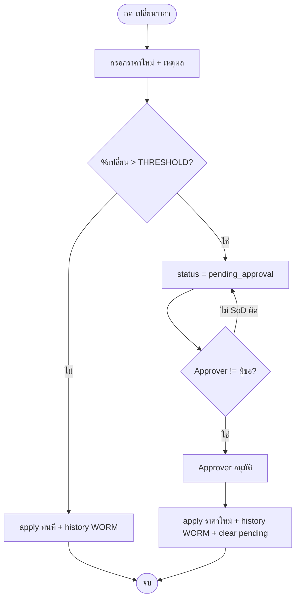
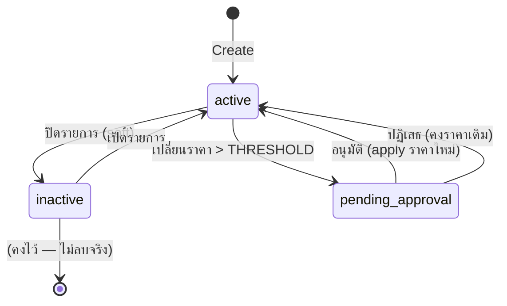

# BRD: Vendor Price List (รายการราคาคู่ค้า)

| Field | Value |
|---|---|
| BRD ID | BRD-PUR-VPL-001 |
| Feature ID | F-VENDOR-PRICELIST-001 |
| Feature Name | Vendor Price List — รายการราคาคู่ค้า (Buy-side) |
| BRD Type | New Feature |
| Version | 1.0 |
| Status | AI Reviewed |
| Module | Purchase (P2P) — Procure-to-Pay |
| Side | Buy-side เท่านั้น (Sell-side / Sales Price List = feature แยกในอนาคต) |
| Owner | BA — 2BSimple |
| Stakeholders | Procurement, Finance, Dev (BE/FE), QA |
| Created Date | 2026-05-31 |
| Last Updated | 2026-05-31 |
| Source | Reverse-engineered จาก `vendor-pricelist.html` (production-UI reference, html-generator-v3) |

## Changelog
- v1.0 (2026-05-31): สร้าง BRD แบบ **reverse** จาก HTML prototype ที่ตกลงล่าสุด — vendor-first navigation, wizard 2 ขั้น, batch lean + search combo, get-price logic, DOA placeholder (threshold + SoD). ตัดทิ้งแล้ว: AVL, ราคาสัญญา/lock, lead time, MOQ/MPQ, preferred vendor.

---

## Section 2: Business Context

### 2.1 ปัญหา / โอกาส
องค์กรซื้อสินค้า/วัตถุดิบเดียวกันจากคู่ค้าหลายราย ในหลายสกุลเงินและหลายช่วงราคา (ขั้นบันได/ปริมาณ) แต่ราคาคู่ค้ากระจัดกระจาย ไม่มีแหล่งกลางที่ standardize ให้ PR/PO ดึงไปใช้ และไม่มีการเทียบราคาข้ามคู่ค้าแบบสุทธิจริง (หลังส่วนลด/ค่าขนส่ง + แปลงสกุลเงิน) ทำให้จัดซื้อในราคาที่ไม่เหมาะ และการเปลี่ยนราคาไม่มี audit/控.

Vendor Price List คือทะเบียนราคากลางระดับ **คู่ค้า × สินค้า** (buy-side) เป็น single source of truth ของ "ราคาซื้อ" ที่ PR/PO autofill และ Compare Price เรียกใช้ พร้อมควบคุมการเปลี่ยนราคาแบบมีอนุมัติ + ประวัติ WORM

### 2.2 เป้าหมายทาง Business
- มีราคากลางต่อ คู่ค้า–สินค้า ที่ใช้ร่วมกับ Vendor Master / Product Master / PR / PO ได้ทันที
- เทียบราคาข้ามคู่ค้าแบบสุทธิ/หน่วย (normalize FX) เพื่อเลือกคู่ค้าที่คุ้มที่สุด
- ควบคุมการเปลี่ยนราคา (threshold + SoD + audit) ลดความเสี่ยงราคาผิด/ทุจริต
- ปกป้องข้อมูลราคา (Confidential) ให้เห็นเฉพาะผู้มีสิทธิ์

### 2.3 ตัวชี้วัดความสำเร็จ (Success Metrics)
| Metric | Baseline | Target | วัดยังไง |
|---|---|---|---|
| % PR/PO ที่ autofill ราคาจาก price list | 0% | ≥ 80% | po_lines ที่ price มาจาก list / ทั้งหมด |
| เวลาเทียบราคาเพื่อเลือกคู่ค้า | manual (นาที) | < 10 วินาที | ใช้หน้า Compare |
| การเปลี่ยนราคาที่ผ่าน audit/อนุมัติ | ไม่มี | 100% | price_history WORM coverage |
| ราคารั่ว (ผู้ไม่มีสิทธิ์เห็น) | ไม่ควบคุม | 0 | classification enforcement |

### 2.4 ที่มาของ Requirement
- ใช้ร่วมกับงาน P2P ของ CUBE NATIVE (PR/PO/GRN) — ต้องมีราคากลาง buy-side
- ต้นแบบ HTML ที่ทีมตกลงร่วมกัน (vendor-first, lean batch, ตัด AVL/สัญญา/lead/MOQ/preferred)

---

## Section 3: Scope

### 3.1 In Scope
- ทะเบียนราคา **คู่ค้า × สินค้า** (1 รายการ/คู่) — buy-side
- ราคาแบบ **flat** และ **ขั้นบันได (tier / volume break)** + validity (from/until)
- เงื่อนไขราคาต่อ tier: ราคา/per, ส่วนลด %, ค่าขนส่ง/หน่วย, ภาษีซื้อ (อ้าง Finance), รวม/แยก VAT
- การเพิ่มแบบเดี่ยว (wizard 2 ขั้น ในบริบทคู่ค้า) และ **เพิ่มหลายรายการ (Batch grid + CSV import)**
- มุมมอง **vendor-first** (รายชื่อคู่ค้า → drill-in สินค้าของคู่ค้า) และมุมมอง **ทุกสินค้า** (flat product-centric) สำหรับ get-price/compare
- **เทียบราคาข้ามคู่ค้า** ตามปริมาณ (normalize เป็น THB ตาม FX)
- **เปลี่ยนราคา** ผ่าน gate: > threshold% → รออนุมัติ (SoD), ≤ → มีผลทันที + บันทึกประวัติ WORM
- ปิด/เปิดรายการ (soft active ↔ inactive)
- Data Classification: ราคา = **Confidential** (mask ••• สำหรับผู้ไม่มีสิทธิ์)

### 3.2 Out of Scope
- **Sales Price List (sell-side)** — แยกเป็น feature ในอนาคต (FK Sales Channel)
- การ wire เข้า **DOA engine กลาง** จริง (รอบนี้เป็น placeholder: threshold + SoD ในตัว feature) — Phase ถัดไปทำ Feature-DOA pairing ที่ Policy Center
- การสร้าง **PR/PO** เอง (feature นี้เป็นผู้ "ให้ราคา" เท่านั้น)
- การจัดการ **Vendor Master / Product Master / FX rate master** (อ้างอิงเท่านั้น)
- AVL (Approved Vendor List), ราคาสัญญา/contract-lock, lead time, MOQ/MPQ, preferred vendor — **ตัดออกตามมติทีม**

### 3.3 Assumptions
- Vendor Master ให้ currency, payment term, status (6 สถานะ: prospect/pending_kyc/pending_approval/active/blocked/blacklisted — ไม่มี "inactive")
- Product Master ให้ buy UOM, vat group, posting group, purchasable flag, multi-UOM
- Finance Posting Setup เป็นผู้ resolve GL จาก vat group / posting group (BRD นี้ไม่ตัดสิน GL)
- FX rate มาจาก master กลาง (รอบนี้ใช้ค่า mock: USD 36.5 / EUR 39.2 / CNY 5.05 / THB 1)
- ERP Shell มาตรฐาน CUBE NATIVE (Sidebar + Header + Breadcrumb) — Module = Purchase

---

## Section 4: User Roles & Permissions

### 4.1 Roles ที่เกี่ยวข้อง
| Role | คำอธิบาย |
|---|---|
| Procurement Officer | ผู้สร้าง/แก้ราคา, ขอเปลี่ยนราคา (Maker) |
| Procurement Manager | + อนุมัติการเปลี่ยนราคา (Approver tier 1) |
| Procurement Director | อนุมัติการเปลี่ยนราคา tier สูง (Approver tier 2) |
| Finance | ดูราคา (Confidential), เจ้าของ Posting Setup |
| Admin | สิทธิ์เต็ม |
| Other (เช่น Warehouse/ผู้ขอซื้อทั่วไป) | เห็นรายการได้ แต่ **ราคาถูก mask •••** |

### 4.2 Permission Matrix
| Action | Proc. Officer | Proc. Manager | Proc. Director | Finance | Admin | Other |
|---|:---:|:---:|:---:|:---:|:---:|:---:|
| ดูรายการ/โครงสร้าง | ✅ | ✅ | ✅ | ✅ | ✅ | ✅ |
| เห็น "ราคา" (ไม่ mask) | ✅ | ✅ | ✅ | ✅ | ✅ | ❌ (•••) |
| สร้าง/เพิ่มราคา (เดี่ยว/batch) | ✅ | ✅ | ✅ | ❌ | ✅ | ❌ |
| แก้รายการ (code/uom/currency) | ✅ | ✅ | ✅ | ❌ | ✅ | ❌ |
| ขอเปลี่ยนราคา (price change) | ✅ | ✅ | ✅ | ❌ | ✅ | ❌ |
| อนุมัติการเปลี่ยนราคา | ❌ | ✅ | ✅ | ❌ | ✅ | ❌ |
| ปิด/เปิดรายการ | ✅ | ✅ | ✅ | ❌ | ✅ | ❌ |
| เทียบราคา (Compare) | ✅ | ✅ | ✅ | ✅ | ✅ | ❌ (เห็นแต่ไม่เห็นตัวเลข) |

> เงื่อนไขในต้นแบบ: `canManage` = Officer/Manager/Director/Admin · `canSeePricing` = Procurement + Finance + Admin · `canApprove` = Manager/Director/Admin

---

## Section 5: User Journey (with COSO) ⭐

### 5.1 Happy Path — เพิ่มราคาคู่ค้า (เดี่ยว, จากในหน้าคู่ค้า)
| # | Step | Maker | Checker | Approver | System | Notes |
|---|---|---|---|---|---|---|
| 1 | เปิดหน้าคู่ค้า → "เพิ่มสินค้า" | Proc. Officer | — | — | เปิด drawer wizard, ล็อกคู่ค้าให้อัตโนมัติ | คู่ค้า active เท่านั้น |
| 2 | Step 1 เชื่อมโยง: เลือกสินค้า (search), SKU, UOM, สกุลเงิน | Proc. Officer | — | — | uom จาก product, currency จาก vendor | ตรวจ UNIQUE (R01) |
| 3 | Step 2 ราคา·Tier·Validity: ตั้งราคา/ขั้นบันได + ส่วนลด/ค่าขนส่ง/ภาษี + validity | Proc. Officer | — | — | คำนวณสุทธิ/หน่วย (R09), ตรวจ tier overlap (R08) | — |
| 4 | สร้างรายการ | Proc. Officer | — | — | บันทึก status=active + audit (created_by/at) | ไม่ต้องอนุมัติตอนสร้าง |

**SoD Check:** ขั้นสร้างไม่ต้องอนุมัติ — SoD บังคับเฉพาะตอน "เปลี่ยนราคา" (ดู 5.2.2)

### 5.2 Alternative / Key Paths

#### 5.2.1 เพิ่มหลายรายการ (Batch + CSV)
| # | Step | COSO | Notes |
|---|---|---|---|
| 1 | เปิด Batch → เลือกคู่ค้า (lock) หรือเว้น = หลายคู่ค้า | Maker: Proc. Officer | page-level "เริ่มใช้ราคา" |
| 2 | กรอกตาราง lean (สินค้า/SKU/UOM/ราคา) หรือ Upload CSV | Maker | แถวว่างข้าม, error → block |
| 3 | บันทึกทั้งหมด | Maker | สร้างหลายรายการ active, default conditions |

#### 5.2.2 เปลี่ยนราคา (Price Change) — Gate + SoD
| # | Step | Maker | Approver | System | Notes |
|---|---|---|---|---|---|
| 1 | กด "เปลี่ยนราคา" + กรอกราคาใหม่ + เหตุผล | Proc. Officer | — | คำนวณ % เปลี่ยน | reason required |
| 2a | ถ้า %เปลี่ยน ≤ THRESHOLD | Proc. Officer | — | apply ทันที + บันทึก history (WORM) | auto |
| 2b | ถ้า %เปลี่ยน > THRESHOLD | Proc. Officer | — | set status=pending_approval + บันทึก pending | เข้าคิวอนุมัติ |
| 3 | อนุมัติ | — | Proc. Manager/Director | apply ราคาใหม่ + history + clear pending | **SoD: Approver ≠ ผู้ขอ** (R12) |

**SoD Check:** ผู้อนุมัติ ≠ ผู้สร้างคำขอ ✅ (บังคับ — ถ้าตรงกัน block)

#### 5.2.3 ปิด/เปิดรายการ
| # | Step | COSO | Notes |
|---|---|---|---|
| 1 | toggle ปิด (inactive) / เปิด (active) | Maker: Proc. Officer | soft — ไม่ลบ, ตัดจาก get-price/compare เมื่อ inactive |

### 5.3 Process Diagram (Price Change)


---

## Section 6: Data Entity & Fields

### 6.1 Entity Overview
| Entity | Type | Description |
|---|---|---|
| Vendor_Price_Item | Header (junction) | รายการราคา 1 รายการ ต่อ คู่ค้า × สินค้า |
| Vendor_Price_Tier | Detail | ช่วงราคา/เงื่อนไข (flat = 1 แถว, tier = หลายแถว) |
| Vendor_Price_History | Audit (WORM) | ประวัติการเปลี่ยนราคา |
| Vendor (ref) | External | Vendor Master — currency, term, status |
| Product (ref) | External | Product Master — buy uom, vat group, posting group, purchasable |

### 6.2 Entity: Vendor_Price_Item
| # | Field | Label UI | Input Type | ค่า/ตัวเลือก | จำเป็น | เงื่อนไข | หมายเหตุ |
|---|---|---|---|---|:---:|---|---|
| 1 | id | — | AUTO | uuid | ✅ | PK | dev-handoff (ไม่ render) |
| 2 | tenant_id | — | AUTO | session.tenant | ✅ | RLS | dev-handoff |
| 3 | vendor_id | คู่ค้า | LOOKUP | Vendor Master (active) | ✅ | active เท่านั้น (R02) | FK; snapshot code/name |
| 4 | product_id | สินค้า | COMBO (search) | Product Master (purchasable) | ✅ | purchasable (R03), UNIQUE คู่ (R01) | FK |
| 5 | vendor_item_code | รหัสสินค้าฝั่ง vendor | TEXT | — | ⚠️ | — | SKU ของคู่ค้า |
| 6 | buy_uom | หน่วยซื้อ | DROPDOWN | buy UOM ของ product | ✅ | ต้องอยู่ใน buy uoms (R06) | จาก Product Master |
| 7 | currency | สกุลเงิน | DROPDOWN | THB/USD/EUR/CNY | ✅ | default = vendor.currency (R05) | จาก Vendor Master |
| 8 | price_type | ประเภทราคา | DROPDOWN | flat / tier | ✅ | default flat | — |
| 9 | status | สถานะ | ENUM | active / inactive / pending_approval | ✅ | default active | state machine §8 |
| 10 | classification | — | CONST | Confidential | ✅ | mask •••（R13) | pricing = Confidential |
| 11 | created_by / created_at | ผู้สร้าง/วันที่ | AUTO | session.user / now() | ✅ | — | audit |
| 12 | version | — | AUTO | int (optimistic lock) | ✅ | If-Match | dev-handoff |
| 13 | pending | — | JSON | {old,new,pct,by,at,reason} | ⚠️ | เมื่อ pending_approval | คำขอที่รออนุมัติ |

### 6.3 Entity: Vendor_Price_Tier (prices[])
| # | Field | Label UI | Input Type | จำเป็น | เงื่อนไข | หมายเหตุ |
|---|---|---|---|:---:|---|---|
| 1 | min_qty | ปริมาณขั้นต่ำ | NUMBER | ✅ | ≥ 0, เรียง min↑ | — |
| 2 | max_qty | ปริมาณสูงสุด | NUMBER | ⚠️ | null = ∞ (tier สุดท้าย), ห้าม overlap (R08) | — |
| 3 | price | ราคาตั้ง | NUMBER | ✅ | > 0 (R04) | ต่อ price_per หน่วย |
| 4 | price_per | /per | NUMBER | ✅ | default 1 | ราคา ต่อ N หน่วย |
| 5 | discount_pct | ส่วนลด % | NUMBER | ⚠️ | 0–100, default 0 | — |
| 6 | freight | ค่าขนส่ง/หน่วย | NUMBER | ⚠️ | ≥ 0, default 0 | — |
| 7 | tax_code | ภาษีซื้อ | DROPDOWN | VAT7/VAT0/EXEMPT | ✅ | default = product.vat_group | อ้าง Finance |
| 8 | incl_vat | รวม VAT | TOGGLE | ✅ | default false | — |
| 9 | valid_from | เริ่มใช้ | DATE | ✅ | required (R10) | — |
| 10 | valid_until | สิ้นสุด | DATE | ⚠️ | เว้น = ไม่มีกำหนด | — |
| 11 | status | สถานะ tier | ENUM | — | active/expired (validity)/pending | คำนวณจาก validity |

### 6.4 Entity: Vendor_Price_History (WORM)
| Field | Type | หมายเหตุ |
|---|---|---|
| old / new | number | ราคาก่อน/หลัง |
| pct | number | % เปลี่ยน |
| by | user | ผู้ทำ/ผู้อนุมัติ |
| at | datetime | เวลา |
| reason | text | เหตุผล (required) |

### 6.5 Entity Relationship
```
Vendor (Master) ──(1:N)──▶ Vendor_Price_Item ◀──(N:1)── Product (Master)
Vendor_Price_Item ──(1:N)──▶ Vendor_Price_Tier
Vendor_Price_Item ──(1:N)──▶ Vendor_Price_History
UNIQUE(vendor_id, product_id, tenant_id)   ← R01
```

---

## Section 7: User Stories & Acceptance Criteria

**S-01: เพิ่มราคาให้คู่ค้า (เดี่ยว)**
As a Procurement Officer, I want to เพิ่มราคาสินค้าให้คู่ค้าหนึ่งราย, So that PR/PO ดึงราคาไปใช้ได้
- AC1: Given อยู่ในหน้าคู่ค้า, When กด "เพิ่มสินค้า", Then เปิด wizard โดยล็อกคู่ค้านั้นไว้ (ไม่ต้องเลือกคู่ค้าซ้ำ)
- AC2: Given เลือกสินค้าที่คู่ค้านี้มีอยู่แล้ว, Then block พร้อมแจ้ง UNIQUE
- AC3: Given กรอกครบ + ราคา > 0 + tier ไม่ซ้อน + valid_from, When สร้าง, Then บันทึก status=active

**S-02: เพิ่มหลายรายการ (Batch)**
As a Procurement Officer, I want to กรอกหลายสินค้าพร้อมกัน หรือ upload CSV, So that ตั้งราคาจำนวนมากได้เร็ว
- AC1: Given เลือกคู่ค้าระดับหน้า, Then ทุกแถวใช้คู่ค้านั้น (ซ่อนคอลัมน์คู่ค้า)
- AC2: Given แถวว่าง, Then ข้าม; Given แถว error (ราคา/สินค้า), Then ไฮไลต์แดง + block save
- AC3: Given upload CSV, When vendor_code/product_code ไม่พบใน master, Then นับ unmatched + ข้ามแถวนั้น

**S-03: เทียบราคาข้ามคู่ค้า**
As a Procurement Officer, I want to เทียบราคาสุทธิ/หน่วยของสินค้าเดียวกันข้ามคู่ค้า ตามปริมาณ, So that เลือกคู่ค้าคุ้มสุด
- AC1: Given ระบุ qty, Then แสดงคู่ค้าเรียงราคาสุทธิ/หน่วย (THB) จากน้อยไปมาก, ตัวแรก = ถูกสุด
- AC2: คู่ค้า blocked/blacklisted ถูกตัดออก (R14); แปลงสกุลด้วย FX (R15)

**S-04: เปลี่ยนราคา (มี gate + SoD)**
As a Procurement Officer, I want to เปลี่ยนราคาพร้อมเหตุผล, So that ราคาอัปเดตอย่างมีการควบคุม
- AC1: Given %เปลี่ยน ≤ THRESHOLD, Then apply ทันที + บันทึก history
- AC2: Given %เปลี่ยน > THRESHOLD, Then status=pending_approval
- AC3: Given เป็นผู้ขอเอง, When พยายามอนุมัติ, Then block (SoD)

**S-05: ดูรายละเอียดราคา / ราคาถูกปกปิด**
As a Procurement Officer, I want to ดูภาพรวม/tier/ประวัติ; As Other role, ราคาต้องถูก mask
- AC1: View drawer มี 3 แท็บ: ภาพรวม / ราคา & Tier / ประวัติราคา
- AC2: Given role ไม่มีสิทธิ์เห็นราคา, Then ทุกตัวเลขเงินเป็น ••• (R13)

---

## Section 8: Status & Lifecycle

### 8.1 State Diagram (Item-level)


### 8.2 State Transition Table
| Current | Trigger | Next | COSO Role | Notes |
|---|---|---|---|---|
| active | ปิดรายการ | inactive | Proc. Officer (Maker) | soft, ตัดจาก get-price/compare |
| inactive | เปิดรายการ | active | Proc. Officer (Maker) | — |
| active | เปลี่ยนราคา ≤ threshold | active | Proc. Officer (Maker) | apply + history |
| active | เปลี่ยนราคา > threshold | pending_approval | Proc. Officer (Maker) | บันทึก pending |
| pending_approval | อนุมัติ | active | Manager/Director (Approver, SoD) | apply ราคาใหม่ + history |
| pending_approval | ปฏิเสธ | active | Manager/Director (Approver) | คงราคาเดิม |

> Tier status (validity): active / expired (เลย valid_until) / pending (ก่อน valid_from) — คำนวณ ไม่ใช่ state แยก

---

## Section 9: Business Rules + Validation (with Tags)

### 9.1 Business Rules
| Rule ID | Rule | Tag | Type | เหตุผล Tag |
|---|---|:---:|---|---|
| R01 | 1 คู่ค้า–สินค้า = 1 รายการ (UNIQUE) | FIXED | Constraint | กฎโครงสร้าง junction |
| R02 | เลือกได้เฉพาะคู่ค้า status=active | FIXED | Constraint | คู่ค้าระงับ/บัญชีดำห้ามตั้งราคา |
| R03 | เลือกได้เฉพาะสินค้า purchasable=true | FIXED | Constraint | จาก Product Master |
| R04 | ราคา > 0 | FIXED | Validation | — |
| R05 | currency default = vendor.currency | CONFIGURABLE | Default source | ปรับ default ได้ภายหลัง |
| R06 | buy_uom ต้องเป็น buy UOM ของสินค้า | FIXED | Constraint | จาก Product Master multi-UOM |
| R07 | tax_code default = product.vat_group; GL resolve ที่ Finance Posting Setup | FIXED | Delegation | BRD นี้ไม่ตัดสิน GL |
| R08 | Tier: เรียง min↑, ห้ามช่วงซ้อนทับ, เฉพาะ tier สุดท้าย max=∞ | FIXED | Constraint | กันราคากำกวม |
| R09 | ราคาสุทธิ/หน่วย = (price ÷ price_per − discount + freight) ไม่รวม VAT | DYNAMIC | Formula | สูตรอาจปรับ |
| R10 | valid_from required; valid_until เว้น = ไม่มีกำหนด | CONFIGURABLE | Validity | policy validity |
| R11 | เปลี่ยนราคา > THRESHOLD% → pending_approval; ≤ → auto-apply | CONFIGURABLE | Threshold | ค่า threshold ปรับได้ (placeholder: THRESHOLD const, GATE_ON) |
| R12 | SoD: ผู้อนุมัติ ≠ ผู้ขอเปลี่ยนราคา | FIXED | Control | บังคับ |
| R13 | pricing = Confidential — เห็น/แก้เฉพาะ Procurement+Finance+Admin, อื่น mask ••• | FIXED | Classification | Data Classification |
| R14 | คู่ค้า blocked/blacklisted ตัดจากการเทียบราคา | FIXED | Constraint | — |
| R15 | Compare normalize เป็น THB @ FX; tier @ qty | DYNAMIC | Formula | FX จาก master |
| R16 | get-price = ราคาต่ำสุดที่ qty ภายใน validity (feeds PR/PO + Compare) | DYNAMIC | Formula | core contract |
| R17 | เปลี่ยนราคา → บันทึก history WORM (old/new/pct/by/at/reason) | FIXED | Audit | reason required |
| R18 | SLA การอนุมัติเปลี่ยนราคา | WARNING | SLA | รอ stakeholder ตัดสิน |

### 9.2 Validation Rules
| VR ID | Field/Action | เงื่อนไข | ประเภท | ข้อความ |
|---|---|---|---|---|
| VR01 | vendor_id + product_id | UNIQUE | Error | "คู่ค้า–สินค้านี้มีรายการแล้ว" |
| VR02 | product_id | purchasable | Error | "สินค้าไม่ใช่ purchasable" |
| VR03 | price | > 0 | Error | "ราคาต้อง > 0" |
| VR04 | tier ranges | ไม่ซ้อนทับ + เรียง | Error | "ช่วงปริมาณ (tier) ซ้อนทับกัน" |
| VR05 | valid_from | required | Error | "กรุณาระบุวันเริ่มราคา" |
| VR06 | price change | reason required | Error | "กรุณาระบุเหตุผล" |
| VR07 | approve | approver ≠ requester | Error | "ผู้อนุมัติต้องไม่ใช่ผู้ขอ (SoD)" |
| VR08 | batch row | สินค้า + ราคา ครบ | Trigger | ไฮไลต์แดง + block save |

### 9.5 สรุประดับความยืดหยุ่น
| Rule ID | Tag | ใครเปลี่ยน | บ่อยแค่ไหน | ระดับ |
|---|:---:|---|---|---|
| R05 | CONFIGURABLE | Admin | นานๆ ครั้ง | Admin Panel |
| R10 | CONFIGURABLE | Admin | นานๆ ครั้ง | Admin Panel |
| R11 (threshold%) | CONFIGURABLE | Admin/Policy | ตาม policy | Admin Panel → ภายหลังย้ายเข้า DOA กลาง |
| R09 / R15 / R16 | DYNAMIC | Dev/ผู้บริหาร | เมื่อนโยบายคิดราคาเปลี่ยน | Rule/Engine Management |
| R18 (SLA) | WARNING | — | — | ⚠️ รอ Stakeholder |

---

## Section 10: Edge Cases

### 10.1 Edge Cases ที่ระบุชัด (จากพฤติกรรม HTML) — default ☑
- ☑ E01: เลือกคู่ค้า–สินค้าที่มีอยู่แล้ว → block (UNIQUE, R01)
- ☑ E02: คู่ค้าไม่ active → ไม่แสดงใน selector (เลือกไม่ได้)
- ☑ E03: Tier ช่วงปริมาณซ้อนทับ → block (R08)
- ☑ E04: ราคา ≤ 0 → block (R04)
- ☑ E05: Batch แถวว่าง → ข้าม; แถวไม่ครบ (สินค้า/ราคา) → แดง + block save
- ☑ E06: CSV vendor_code/product_code ไม่พบใน master → นับ unmatched + ข้ามแถว
- ☑ E07: เปลี่ยนราคาโดยไม่ใส่เหตุผล → block (R06/VR06)
- ☑ E08: ผู้ขอเปลี่ยนราคาพยายามอนุมัติคำขอตัวเอง → block (SoD, R12)

### 10.2 Edge Cases จาก AI Pattern Matching — default ☐ (ต้อง confirm)

**CL (Calculation)**
- ☐ E09: discount > 100% หรือ freight ทำให้สุทธิติดลบ → block/clamp
- ☐ E10: FX rate ของสกุลเงินหาย → fallback (ใช้ rate ล่าสุด/แจ้งเตือน) ใน Compare (R15)

**CA (Concurrent Access)**
- ☐ E11: 2 ผู้ใช้แก้รายการเดียวกันพร้อมกัน → optimistic lock ด้วย `version` / If-Match
- ☐ E12: เปลี่ยนราคาขณะมีคำขอ pending_approval ค้างอยู่ → block/queue (กันซ้อนคำขอ)

**ST (Status/Workflow)**
- ☐ E13: get-price/compare ของรายการ inactive → ต้องถูกตัดออก
- ☐ E14: ทุก tier หมดอายุ (validity) → get-price คืน "ไม่มีราคาใช้งานได้"

**PD (PII/Data Classification)**
- ☐ E15: ราคา (Confidential) ต้องไม่รั่วใน export/log/print สำหรับ role ที่ไม่มีสิทธิ์ (R13)
- ☐ E16: Compare/PR/PO autofill ของ role ที่ไม่มีสิทธิ์เห็นราคา → ส่งค่าแต่ไม่แสดงตัวเลขบน UI

### Tag Review Report
- ✅ R01,R02,R03,R04,R06,R08,R12,R13,R14,R17: FIXED — ถูกต้อง (กฎโครงสร้าง/ควบคุม)
- ⚠️ R05,R10,R11: CONFIGURABLE — R11 (threshold%) ควรย้ายเข้า DOA กลางภายหลัง
- ⚠️ R09,R15,R16: DYNAMIC — สูตรราคา/ FX / get-price ควรอยู่ Engine (ENG-PRICESELECT)
- ❌ R18: WARNING — ต้อง Resolve SLA ก่อน finalize

---

## Section 11: Impact Analysis / Regression Scope
**N/A — New Feature** (ไม่มีของเก่าให้กระทบ) — ผลกระทบเชิง integration อยู่ใน Section 12 (PR/PO/Compare ที่จะเรียก get-price)

---

## Section 12: Dependencies

### 12.1 Module Dependencies
- **Vendor Master** (F-VENDOR-MASTER-001) — FK `vendor_id`, currency, payment term, status (6 states)
- **Product Master** (F-PRODUCT-MASTER-001) — FK `product_id`, buy UOM, vat group, posting group, purchasable
- **Finance Posting Setup** — resolve GL จาก vat group / posting group
- **FX Rate Master** — สำหรับ normalize Compare
- **Document/Audit (WORM)** — price history
- **(ปลายทาง)** Purchase Request / Purchase Order — เรียก get-price autofill; Compare Price

### 12.2 External / Service Dependencies
- Central Audit Log (WORM) service
- DOA Engine (Policy Center) — **ยังไม่ wire** (placeholder ในรอบนี้)
- Notification (แจ้งผู้อนุมัติเมื่อ pending_approval) — optional Phase ถัดไป

### 12.3 Existing System Reference
| Rule/Item | ระดับ | มีอยู่แล้ว? | Reference |
|---|---|:---:|---|
| Vendor/Product/Currency/Term | Master | ✅ | Vendor Master, Product Master |
| GL resolve | Config | ✅ | Finance Posting Setup |
| DOA approval (threshold) | Governance | ⚠️ placeholder | Policy Center → Data Governance → DOA (ภายหลัง) |
| User Access / Classification | Governance | ⚠️ | Policy Center → User Access ENC + Data Classification ENC |
| WORM audit | Service | ✅ | Central Audit Log |

---

## Section 13: Delivery Phases

### Phase 1: Feature Launch
- สร้าง `Vendor_Price_Item` + `Vendor_Price_Tier` + `Vendor_Price_History` (uuid PK + tenant RLS + version)
- UNIQUE(vendor_id, product_id, tenant_id)
- get-price logic (ENG-PRICESELECT): ราคาต่ำสุดที่ qty ภายใน validity + สุทธิ/หน่วย + FX normalize
- Screens: vendor list / vendor detail / flat list / create wizard / edit / view / compare / price change / approve / batch + CSV
- DOA = **placeholder** (THRESHOLD const + GATE_ON + SoD ในตัว feature) — ใส่ field `approver_role/approved_by/approval_chain` + TODO สำหรับ wiring
- Data Classification: ราคา = Confidential + mask enforcement
- **ห้าม hardcode threshold/approval rule** — ทำเป็น config ตั้งแต่วันแรก

### Phase 2: Governance Wiring (Policy Center)
- ผูก DOA จริง: Feature-DOA pairing → DOA ENC ที่ Policy Center → Data Governance → DOA
- User Access ENC + Data Classification ENC (ราคา = Confidential/Restricted ตาม Product Master)
- Notification ผู้อนุมัติ

### Phase 3: Engine / Rule Management
- ย้ายสูตร R09/R15/R16 เข้า Engine Management (pluggable price-select strategy)
- Admin Panel: threshold%, default currency/validity policy

### Phase 4: (อนาคต) Sales Price List
- Sell-side แยก feature (FK Sales Channel) — นอก scope BRD นี้

---

## Section 14: Dev Requirements Summary "ใบสั่ง"

### 14.1 Config Foundation
| Item | โครงสร้าง | รองรับ Rule | มีอยู่แล้ว? |
|---|---|---|:---:|
| Config: price_change_threshold_pct | key-value + audit | R11 | ❌ สร้าง (Phase 1 default, ย้าย DOA Phase 2) |
| Config: default_validity_policy | key-value | R10 | ❌ สร้าง |
| Engine: price-select strategy | pluggable | R09/R15/R16 | ❌ Phase 3 (Phase 1 = inline) |

### 14.2 ข้อกำหนดจาก Tag
| Rule | ระดับ | Dev ต้องทำ |
|---|---|---|
| R11 | Admin Panel → DOA | config `price_change_threshold_pct` + GATE_ON flag + TODO DOA wiring |
| R05/R10 | Admin Panel | config default currency-source / validity |
| R09/R15/R16 | Engine | ENG-PRICESELECT (Phase 1 inline, Phase 3 pluggable) |

### 14.3 ข้อกำหนดจาก Edge Cases / Validation
- E11: ใช้ `version` (optimistic lock) + If-Match บนทุก mutation
- E12: กันคำขอ pending ซ้อน (1 active pending ต่อ item)
- E15/E16: enforce Confidential mask ทั้ง UI + export + log + autofill payload
- E06: CSV importer ต้อง map vendor_code/product_code → id, นับ unmatched

### 14.4 WARNING ที่รอข้อสรุป
| ประเด็น | หารือกับใคร | สถานะ |
|---|---|---|
| R18 SLA อนุมัติเปลี่ยนราคา | Procurement Director | ⚠️ รอ |
| ค่า THRESHOLD% เริ่มต้น | Procurement + Finance | ⚠️ รอ (default ชั่วคราวใน config) |
| Classification ราคา: Confidential vs Restricted | Policy Center / Product Master | ⚠️ Product Master ระบุ pricing = Restricted — ต้องเคลียร์ให้ตรง |

### 14.5 Regression Scope
**N/A — New Feature**

### 14.6 Layout Deviation Log (Design Authority Decisions) ⭐
> Layout Library Reference = **html-generator-v3** (CUBE NATIVE: Navy `#0B1D3A` / Primary `#0B5CFF` / Teal `#00A88E`; Sidebar 232px; Drawer 540px; Modal 440px). BRD นี้เป็น **reverse** — HTML คือ source of truth, layout as-built:

| Page | Pattern (as-built) | Standard | Functions Cut | Rationale |
|---|---|---|---|---|
| P-01 Vendor Price List | `list-view` (vendor-first + toggle flat) | ✅ มาตรฐาน | AVL/preferred/lead column | ตัดตามมติทีม |
| P-02 Vendor Detail | `list-view` (drill-in) | ✅ มาตรฐาน | — | — |
| P-03 Batch Import | `bulk-entry-grid` + CSV | ⚠️ NON-STANDARD (bulk grid) | per/disc/freight/cur/tax/MOQ columns | ย้ายเป็น default + ปรับรายตัวภายหลัง — ให้กรอกเร็ว |
| P-04 Create Price | `create-drawer-wizard` (2 ขั้น) | ✅ มาตรฐาน (drawer ไม่ใช่ modal) | step 3 เงื่อนไข | ตัด lead/MOQ/MPQ |
| P-05 Edit Price | `edit-drawer` | ✅ มาตรฐาน | — | — |
| P-06 View Price | `view-drawer-tabbed` (3 แท็บ) | ✅ มาตรฐาน | แท็บ AVL | ตัด AVL |
| P-07 Compare | `modal` | ✅ มาตรฐาน | star/preferred/lead/MOQ | ตัด |
| P-08 Price Change | `modal` | ✅ มาตรฐาน | — | gate + SoD |
| P-09 Approve | `modal` | ✅ มาตรฐาน | contract-lock branch | ตัดสัญญา |

**Summary:** 9 pages · 1 NON-STANDARD (P-03 bulk grid — accepted, มี Open Question Q3) · search combo (ค้นหา) ทุก product/vendor selector · CI palette ไม่ override ✅ · iron rules (drawer-not-modal, list ≤ 8 cols) ✅

---

## Section 15: Open Questions
| # | คำถาม | สถานะ | คำตอบ |
|---|---|:---:|---|
| Q1 | ค่า THRESHOLD% สำหรับ gate อนุมัติเปลี่ยนราคา = เท่าไร | ⚠️ รอ | — |
| Q2 | SLA การอนุมัติเปลี่ยนราคา (R18) | ⚠️ รอ | — |
| Q3 | Batch เป็น bulk-grid (NON-STANDARD) — รับได้ไหม หรือทำเป็น stepper มาตรฐาน | ⚠️ รอ | (ทีมเลือก bulk grid เพื่อกรอกเร็ว) |
| Q4 | ราคา classification = Confidential (BRD นี้) แต่ Product Master = Restricted — ยึดอันไหน | ⚠️ รอ | ต้องเคลียร์ที่ Policy Center |
| Q5 | ต้องมี approval ตอน "สร้าง" รายการราคาใหม่ด้วยไหม (ตอนนี้ create = active ทันที) | ⚠️ รอ | — |

---

## Section 16: Security & Compliance ⭐

### 16.1 Security Preset
**Preset: P2 — Approval/Workflow (14 controls)** — inherits P1 (12, รวม Immutable Master Data Log S01-07) + SoD + DoA
**เหตุผล:** feature เป็นทะเบียนราคา (master-ish) + มี **price-change approval + SoD + WORM audit** และข้อมูลราคา = **Confidential** จึงต้องคุม access + audit เข้ม

### 16.2 Applicable Standards
| Standard | Applicable? | หมายเหตุ |
|---|:---:|---|
| ISO 27001 | ✅ | Access control + audit |
| PDPA | ✅ | ไม่มี PII บุคคล แต่มี data classification |
| SOX | ✅ | SoD + approval + audit ราคา |
| PCI DSS | ❌ | ไม่มี payment card |

### 16.3 Control Checklist (สำคัญ)
| Control | Standard | Control | Required | Implementation |
|---|---|---|:---:|---|
| C-01 | ISO 27001 | Access control by role | Must | §4 Permission Matrix |
| C-02 | ISO 27001 | Data classification (Confidential) | Must | R13 mask ••• ทั้ง UI/export/log |
| C-05 | PDPA/SOX | Audit log ทุกการเปลี่ยนราคา (WORM) | Must | Vendor_Price_History (R17) |
| C-08 | SOX | Approval requires SoD | Must | R12 (approver ≠ requester) |
| C-09 | SOX | DoA threshold on price change | Must | R11 (placeholder → DOA Phase 2) |
| C-12 | ISO 27001 | Tenant isolation (RLS) | Must | tenant_id + RLS |
| C-15 | ISO 27001 | Optimistic concurrency | Should | version / If-Match (E11) |

### 16.4 Risk Statement
| Risk | Mitigated by |
|---|---|
| ราคาผิด/ทุจริตผ่านการเปลี่ยนราคา | C-08, C-09, C-05 (SoD + DoA + WORM) |
| ราคารั่วถึงผู้ไม่มีสิทธิ์ | C-02 (Confidential mask) |
| Repudiation (ปฏิเสธว่าไม่ได้แก้) | C-05 (WORM with by/at/reason) |
| ตั้งราคาให้คู่ค้าที่ถูกระงับ | R02 (active-only) |

---

## Section 17: Health Check ⭐

### 17.1 SLA
| Step | SLA | Owner | เมื่อเกิน |
|---|---|---|---|
| เปลี่ยนราคา > threshold → อนุมัติ | ⚠️ รอกำหนด (R18) | Proc. Manager | escalate Director |

### 17.2 Control Points
| Control | Where | When | Result |
|---|---|---|---|
| C-08 SoD | Approve action | ทุกครั้ง | block ถ้า approver = requester |
| C-02 Mask | Render/Export/Autofill | ทุกครั้งที่แสดงราคา | mask ถ้าไม่มีสิทธิ์ |
| C-05 WORM | Price change/approve | ทุกครั้ง | บันทึก history |

### 17.3 KPI
| KPI | Category | Target | Measure |
|---|---|---|---|
| % PR/PO autofill จาก price list | Conversion | ≥ 80% | autofilled / total lines |
| เวลาอนุมัติเปลี่ยนราคา | Speed | < 1 วัน | approved_at − requested_at |
| ราคา expired ที่ยังถูกอ้าง | Quality | 0 | get-price ที่ชน expired |

### 17.4 Threshold
| Metric | Min | Max | Action |
|---|---|---|---|
| คำขอเปลี่ยนราคา pending | — | > 20 | alert Procurement Manager |
| เวลาอนุมัติ | — | 2 วัน | escalate Director |

### 17.5 Throughput
- Baseline: ~ร้อยรายการ/คู่ค้า; Batch/CSV รองรับ mass entry (สูงสุด 50 item/รอบ CSV ตามแนวที่เคยตั้ง)

---

## Section 18: Monitoring ⭐

### 18.1 Reports Overview
| Report | Type | Frequency |
|---|---|---|
| Price Coverage (คู่ค้า×สินค้า ที่มีราคา active) | Operation | Daily |
| Price Change Audit (WORM) | Transaction | On-demand |
| Pending Approval | Operation | Real-time |
| Price Anomaly | Anomaly | Real-time |

### 18.2 Dashboard Widgets
| Widget | Source | Threshold |
|---|---|---|
| Pending price-change count | §17.4 | > 20 → แดง |
| คู่ค้าที่ราคาใกล้หมดอายุ (validity) | get-price | < 30 วัน → เหลือง |
| สินค้าที่มีคู่ค้าเดียว (single-source) | coverage | flag |

### 18.5 Anomaly Report
- เปลี่ยนราคา > threshold แต่ถูกอนุมัติเร็วผิดปกติ (< 1 นาที) → audit flag
- ราคาสุทธิติดลบ / ส่วนลด ≥ 100%
- รายการ active ที่ทุก tier หมดอายุแล้ว

### 18.6 Transaction Report
- ประวัติราคาเต็ม (old/new/pct/by/at/reason) ต่อรายการ
- timeline สถานะ (active/inactive/pending_approval)

---

## Appendix

### A. Screen List
| Screen | Route | Layout | Module / Sidebar Active | Breadcrumb | ใครเข้าถึง |
|---|---|---|---|---|---|
| Vendor Price List | `#/vendor-pricelist` | list-view (vendor-first + toggle) | Purchase / Vendor Price List | Purchase › Vendor Price List | ทุก role (ราคา mask ตามสิทธิ์) |
| Vendor Detail | `#/vendor-pricelist/v/{id}` | list-view (drill-in) | Purchase / Vendor Price List | Purchase › Vendor Price List › {คู่ค้า} | ทุก role |
| Batch Import | `#/vendor-pricelist/batch` | bulk-entry-grid + CSV | Purchase / Vendor Price List | Purchase › Vendor Price List › นำเข้า (Batch) | Proc. Officer/Mgr/Dir/Admin |
| Create Price | drawer (no breadcrumb) | create-drawer-wizard (2 ขั้น) | — | — | Proc. (canManage) |
| Edit Price | drawer (no breadcrumb) | edit-drawer | — | — | Proc. (canManage) |
| View Price | drawer (no breadcrumb) | view-drawer-tabbed (3 แท็บ) | — | — | ทุก role (ราคา mask) |
| Compare Price | modal | modal | — | — | canSeePricing |
| Price Change | modal | modal | — | — | Proc. (canManage) |
| Approve Price Change | modal | modal | — | — | Proc. Manager/Director/Admin |

### B. Glossary
- **get-price**: ฟังก์ชันคืนราคาต่ำสุดที่ qty หนึ่ง ภายใน validity (สุทธิ/หน่วย) — PR/PO/Compare เรียกใช้
- **ราคาสุทธิ/หน่วย (landed ex-tax)**: (price ÷ price_per − discount + freight) ไม่รวม VAT
- **THRESHOLD**: % การเปลี่ยนราคาที่เกินแล้วต้องอนุมัติ (gate, placeholder รอ DOA กลาง)
- **SoD**: Segregation of Duties — ผู้อนุมัติ ≠ ผู้ขอ
- **WORM**: Write Once Read Many — ประวัติแก้ไม่ได้
- **Confidential**: ระดับ Data Classification ของ "ราคา" — เห็นเฉพาะผู้มีสิทธิ์

### C. Document Control
| Version | Date | Author | Change |
|---|---|---|---|
| 1.0 | 2026-05-31 | BA (2BSimple) | Reverse BRD จาก HTML prototype (vendor-first, lean batch, get-price, DOA placeholder) |
