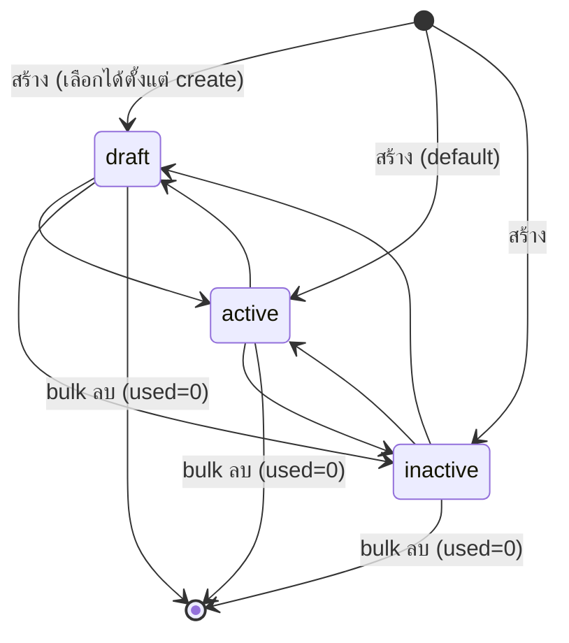

# BRD · Payment Term (เงื่อนไขการชำระเงิน) — F-PAY

> **Business Requirements Document — ฉบับสมบูรณ์**
> Generated by `brd-generator-full v2.2` · **Fresh Mode (HTML-first)** · WF-01 · SOW3.2
> Source of Truth = HTML prototype `01_HTML/f-payterm.html` (ผ่าน ux + coverage + E2E gate · PM/BA-APPROVED)
> Conflict Priority ที่ใช้: **LOCK (LD-01..15) > PREBRIEF business intent > HTML หน้าจอจริง**

---

## Section 1 · Document Info

| หัวข้อ | รายละเอียด |
|---|---|
| **BRD ID** | BRD-F-PAY |
| **Feature** | Payment Term — เงื่อนไขการชำระเงิน |
| **รหัสเดิม** | F-PAYMENT-TERM-001 |
| **ประเภท BRD** | **New Feature (Master / Config)** — เพิ่มประเภท payment type = New Feature ใหม่ |
| **Module** | Accounting (การเงิน) — Finance Foundation master ใช้ร่วม **P2P + S2C** |
| **Version** | 1.0 |
| **Status** | ✅ **APPROVED** (Quality Gate ผ่าน — ดู AI Review Report ท้ายเอกสาร) |
| **Owner (BA)** | (ตาม pipeline WF-01) |
| **Stakeholders** | PM/BA · Finance Lead · Accounting · Strike (business rules) · Architect (ENG register) |
| **วันที่** | 2026-08-10 |
| **Input sources** | HTML SoT + PREBRIEF v1 + FUNCTION_CHECKLIST + SCOPE_LOCK + AI_DEFAULTS + DECISION_LOG + Central Plan v2 + QC evidence (UX/Coverage/E2E) |

### Changelog
- **v1.0 (2026-08-10)** — Initial BRD via `brd-generator-full` (Fresh Mode, HTML-first).
  - สกัด Screen Inventory + fields + validations + states จาก HTML SoT ที่ gate-passed
  - Propagate **D-08 (PM/BA): PR ถูกถอดจาก `use_in` → เหลือ 7 เอกสาร** (OQ-PAY-08 CLOSED)
  - Reflect Scope Lock LD-01..15, DOA null, CI v8, OQ register OQ-PAY-01..07
  - Register engines ENG-PT-01 / ENG-PT-02 + backend hooks ใน §12.1 (Architect handoff)

---

## Section 2 · Business Context

### 2.1 ปัญหา / โอกาส
ระบบ ERP ต้องผูก "เงื่อนไขการชำระเงิน" กับเอกสารซื้อ-ขายหลายชนิด (PO, SO, Quotation, Invoice, Payment). ปัจจุบัน (ตาม PREBRIEF: FRD pack เดิม v5.1 stale + การกำหนดกระจัดกระจาย) ทำให้:
- เงื่อนไขถูกกรอกมือ/ตั้งซ้ำต่อฝั่ง (ซื้อแยก ขายแยก) → ไม่สอดคล้อง, คำนวณ due date/ส่วนลด/งวด ผิดพลาด
- ไม่มีจุดกลางที่กำหนด trigger คลัง (ของออก/รับเมื่อไหร่) ตามประเภทการชำระ
- ไม่มีมาตรฐาน 7 ประเภทการชำระที่ครอบคลุมทั้ง P2P และ S2C

### 2.2 เป้าหมาย business
สร้าง **master กลางเดียว** ที่กำหนดเงื่อนไขการชำระเงินครั้งเดียวใช้ได้ทั้งระบบ — 7 ประเภทครอบทุกรูปแบบการค้า + กำหนด trigger คลัง + รายการเอกสารที่ใช้ได้ (use_in) — เพื่อให้เอกสารปลายทางคำนวณ due date / ส่วนลด / งวด อัตโนมัติจากค่าที่ snapshot ตอนสร้าง

### 2.3 ตัวชี้วัดความสำเร็จ (บังคับวัดได้) — จับคู่กับ §17.3 KPI

| # | ตัวชี้วัด | Baseline ปัจจุบัน | Target | วัดยังไง / จากไหน | วัดเมื่อไหร่ | KPI คู่ (§17.3) |
|---|---|---|---|---|---|---|
| M-01 | % เอกสารซื้อ-ขายที่เลือก payment term จาก master (แทนกรอกมือ) | ต้องเก็บ baseline ก่อน launch | ≥ 95% | นับจาก field payment_term_code ที่ soft-ref master / จำนวนเอกสารทั้งหมด | รายเดือน หลัง launch | KPI-01 |
| M-02 | เวลาเฉลี่ยตั้งค่าเงื่อนไขใหม่ 1 รายการ | ต้องเก็บ baseline ก่อน launch | < 3 นาที | timestamp created ใน form (drawer open→submit) | รายเดือน | KPI-02 |
| M-03 | อัตราข้อผิดพลาดคำนวณ due date / ส่วนลด / งวด ปลายทาง | ต้องเก็บ baseline ก่อน launch | ลด ≥ 80% เทียบ baseline | เคส correction/credit note ที่ระบุสาเหตุ = เงื่อนไขผิด | รายไตรมาส | KPI-03 |
| M-04 | จำนวนเงื่อนไข duplicate (ตั้งซ้ำระหว่างฝั่งซื้อ/ขาย) | ต้องเก็บ baseline ก่อน launch | → 0 (1 master ใช้ร่วม 2 ฝั่ง) | audit รายการ terms ที่มี logic ซ้ำ | รายไตรมาส | KPI-04 |

> ⚠️ ทุกตัวชี้วัดยังไม่มี baseline (ระบบเดิม stale/กระจาย) → **action บังคับ: เก็บ baseline ช่วง pilot ก่อน launch จริง** (ใส่ใน §15 Open Questions ผูก M-01..M-04)

### 2.4 ที่มา
Finance Foundation master (ต้นน้ำของ P2P + S2C) · standard review 2026-08-09 (SAP baseline date/installment · Odoo payment terms/down payment) · PREBRIEF §1 + Central Plan v2 edges `Payment Terms → PO / AR Invoice / AP Invoice [config]`

---

## Section 3 · Scope

### 3.1 In Scope (ทำอะไร)
- หน้า **List** เงื่อนไขชำระเงิน: ค้นหา (รหัส/ชื่อ TH/EN), filter ประเภท (7 ค่า, combobox), stat 4 ใบกดกรอง (ทั้งหมด/ใช้งาน/ไม่ใช้งาน/ร่าง), bulk (ตั้ง 3 สถานะ + ลบ)
- **สร้าง/แก้ไข** เงื่อนไข ผ่าน drawer form ที่ field ปรับตาม **7 ประเภท**: Full Prepay, Full Postpay, Deposit, Installment, Partial Delivery, Credit, Direct Payment
- ต่อประเภทกำหนด: due_basis, net_days, ส่วนลดจ่ายเร็ว (Credit), วิธีมัดจำ 3 แบบ + timing (Deposit), ตารางงวด ≥2 รวม 100% (Installment), หมวดค่าใช้จ่าย (Direct), Warehouse/GRN/Ship trigger (ตามประเภท)
- เลือก **use_in = 7 เอกสาร** (ฝั่งซื้อ: PO, AP Invoice, Payment Voucher · ฝั่งขาย: SO, Quotation, AR Invoice, Receipt)
- ตั้ง **Default** 1 ตัว/ประเภท (ต้องสถานะใช้งาน) · สถานะ 3 ค่าอิสระ (ร่าง/ใช้งาน/ไม่ใช้งาน)
- **แก้ไขได้** แม้ used>0 (เอกสารเก่า snapshot แล้ว) · **ลบไม่ได้** ถ้า used>0 (bulk ข้ามพร้อมแจ้ง)
- View drawer: สรุปเงื่อนไข + รายละเอียดการคำนวณ + เมนูเปลี่ยนสถานะ 3 ค่า

### 3.2 Out of Scope (ไม่ทำ — สำคัญ; รวม Functions Cut ดู §14.6)
- **payment term ที่ PR** และ **Quotation ฝั่งซื้อ** (LD-01) — ★ propagate D-08: PR ถูกถอดจริง
- **นำเข้า/ส่งออก CSV** (มติ 2026-08-09 — ผ่านฟอร์มเท่านั้น)
- เปลี่ยน trigger ของ Credit (locked = ทันที, LD-08b)
- ส่วนลดจ่ายเร็ว > 1 ช่วง (AD-02 / OQ-PAY-02)
- ลบรายตัว / ลบตัวที่ used>0 / archive-reactivate เดี่ยวในแถว
- สายอนุมัติ / ขั้นส่งอนุมัติ (DOA null) · NOTIF (ไม่ emit)
- ล็อกแก้เงื่อนไขเมื่อ used>0 แบบ Tax Code (ตั้งใจไม่ล็อก — snapshot ที่เอกสาร, OQ-PAY-05/AD-01)
- multi-currency (AD-03 — สมมติ THB)

### 3.3 Assumptions
- `used` เป็น mock ใน prototype — จริงต้องนับจากเอกสารทุกใบที่อ้าง (OQ-PAY-07)
- Soft-reference: master = picker, เอกสารปลายทาง snapshot ค่า, ไม่มี FK cascade (Central Plan LD-4C-02)
- DOA placeholder 4 fields (approver_role/approved_by/approved_at/approval_chain) = null (ยืนยันใน HTML `submitTerm()`)

### 3.4 Scope Lock ⭐ (สืบทอด — ห้าม override)

**scope_lock_ref:** `00_CONTEXT/SCOPE_LOCK.md` · Conflict rule: **LOCK ชนะทุกกรณี** — business rule ใดขัด LOCK → LOCK ชนะ + แจ้งใน AI Review

| LOCK | กติกา (ห้ามฝืน) | สะท้อนใน BRD ที่ |
|---|---|---|
| **LD-01** | payment term ที่ **PO/SO เท่านั้น** · **PR ไม่มี** · Quotation = ฝั่งขาย (proposal) เท่านั้น | §3.1, §6 (use_in 7), §9 BR-06, §14.6 |
| **LD-02** | GRN/Ship trigger ตามประเภท: Prepay/Deposit รอชำระ · ที่เหลือ = ทันที | §9 BR-11, §12.1 |
| **LD-05** | เปลี่ยน type หลัง approve เอกสารไม่ได้ (downstream) · Direct ไม่ผ่าน PR/PO/SO | §9 BR-12 |
| **LD-08** | deposit % inherit + ปรับได้ที่ PO/SO | §12.1 |
| **LD-08b** | **Credit trigger = ทันที (locked)** — แก้ไม่ได้ | §9 BR-10, §6 |
| **LD-09** | installment inherit + ปรับได้ · รวมต้อง 100% | §9 BR-04, §12.1 |
| **LD-10** | Partial: GRN กำหนดยอดจ่ายต่อรอบ | §9, §12.1 |
| **LD-15** | Installment ≠ Partial (คนละประเภท) | §6, §9 |
| **Pattern (VD-PDM)** | สถานะ 3 ค่าอิสระ ไม่มีอนุมัติ · bulk ได้ · **ไม่มีลบเดี่ยว** · ตัด hint/field-help/panelInfo · **ไม่มี CSV** | §8, §14.6 |
| **Governance** | DOA null · NOTIF ไม่ emit · CI v8 Warm Light · Iron Rules #29/#94/#95/#96/#97 | §16, §14.6 |
| **Central Plan** | Soft-ref (snapshot, no FK cascade) · edges [config] → PO/AR Inv/AP Inv · append-only audit, soft archive, no hard delete | §12.1 |

**SCOPE DRIFT check:** ไม่มี In Scope ข้อใดเกินใบเซ็น. จุดเดียวที่เคยเป็น tension (PR ใน use_in — Coverage G1 WARN) ถูกปิดโดย **D-08 (PM/BA): ถอด PR** → ไม่เหลือ drift. ✅

---

## Section 4 · User Roles & Permissions

> Master นี้เป็น **config การเงินส่วนกลาง** — ไม่มีสายอนุมัติ (DOA null). สิทธิ์แยกเป็น "ผู้ดูแล master" (จัดการ) กับ "ผู้บริโภคปลายทาง" (เลือกใช้ในเอกสาร)

| Role | List/ค้นหา | สร้าง | แก้ไข | เปลี่ยนสถานะ | ตั้ง Default | bulk ลบ (used=0) | เลือกใช้ในเอกสาร |
|---|:---:|:---:|:---:|:---:|:---:|:---:|:---:|
| **Finance Master Admin** (Accounting/Finance Lead) | ✅ | ✅ | ✅ (แม้ used>0) | ✅ (3 ค่าอิสระ) | ✅ | ✅ | — |
| **Finance Viewer** | ✅ | ❌ | ❌ | ❌ | ❌ | ❌ | — |
| **ผู้ใช้เอกสารปลายทาง** (จัดซื้อ/ขาย/บัญชี) | (ดูผ่าน picker) | ❌ | ❌ | ❌ | ❌ | ❌ | ✅ เลือกเฉพาะสถานะ "ใช้งาน" |

> หมายเหตุ: HTML prototype แสดง user เดียว "Finance Lead" (mock) — role matrix ข้างต้นเป็น business intent จาก PREBRIEF; enforcement จริง = FRD/Security (P3).

---

## Section 5 · User Journey (with COSO)

> **DOA null:** master นี้ **ไม่มีขั้นอนุมัติ** — ทุก action commit ทันทีโดย Maker (System validate). ดังนั้น **Checker/Approver = ไม่มี (N/A by design)** และ **SoD ผ่านโดยปริยาย** (ไม่มี approval step ที่จะละเมิด Maker≠Approver). อ้างอิง `coso-defaults.md` = master-data/no-approval preset.

### 5.1 Happy Path — สร้างเงื่อนไข Credit (S-01)
| # | Step (map route/ปุ่มจริง) | Maker | Checker | Approver | System |
|---|---|---|---|---|---|
| 1 | เปิดหน้า List (`.content` default view) → กด **"เพิ่มเงื่อนไข"** (`openDrawer('create')`) | Finance Admin | — | — | เปิด drawer form, default type=credit |
| 2 | เลือกประเภท "เครดิต" จาก combobox 7 ค่า (`onTypeChange`) | Finance Admin | — | — | สลับ field ชุดเฉพาะประเภท (net_days, discount, trigger locked=ทันที) |
| 3 | กรอก code/ชื่อ/net_days + (optional) ส่วนลดจ่ายเร็ว + due_basis | Finance Admin | — | — | — |
| 4 | เลือก use_in ≥1 (จาก 7 เอกสาร) + สถานะ + (optional) Default | Finance Admin | — | — | นับ chk-count |
| 5 | กด **"บันทึกและสร้าง"** (`submitTerm()`) | Finance Admin | — | — | validate ครบ → push + toast success / บล็อก+ชี้ช่อง+toast ถ้าผิด |

### 5.2 Alternative Paths
- **A1 · แก้ไข (S-07):** row → `openDrawer('edit')` → แก้ทุก field แม้ used>0 → save → กระทบเฉพาะเอกสารใหม่ (System: `Object.assign`, snapshot ที่เอกสารเก่าคงเดิม)
- **A2 · เปลี่ยนสถานะ (S-08):** view drawer → เมนู "เปลี่ยนสถานะ" 3 ค่า (`setStatusFromMenu`) หรือ bulk bar → ทันที ไม่มีอนุมัติ
- **A3 · ตั้ง Default (S-05):** toggle ในฟอร์ม → ตัวเก่าประเภทเดียวกันหลุดอัตโนมัติ (System radio logic) · บล็อกถ้าสถานะ ≠ ใช้งาน
- **A4 · bulk ลบ (S-09):** เลือก ≥1 → bulk bar "ลบ" → modal confirm บอกยอดลบ/ยอดข้าม → `bulkDoDelete()` ข้าม used>0
- **A5 · Exception (S-06):** ข้อมูลผิด (code ซ้ำ, เครดิต ≤0, มัดจำ %0/เกิน100, งวด<2/≠100%, use_in ว่าง, วันลด≥วันเครดิต) → System บล็อก + ชี้ช่อง (is-invalid) + toast

> ทุก step map กับ route/ปุ่มที่มีจริงใน HTML (single-view SPA + overlay drawer/modal) — ไม่มี step ลอยที่ไม่มีที่ยืนบนจอ ✅

---

## Section 6 · Data Entity & Fields

### 6.1 Entity: `payment_term` (Master)

| # | Field | Label UI | Input Type | ค่า/ตัวเลือก | จำเป็น | เงื่อนไข | หมายเหตุ |
|---|---|---|---|---|:---:|---|---|
| 1 | `id` | — | AUTO | t{seq} | auto | — | PK |
| 2 | `code` | รหัส (Code) | TEXT (uppercase) | เช่น NET30 | ✅ | unique · UPPERCASE | validate ซ้ำใน form |
| 3 | `name` | ชื่อเงื่อนไข (TH) | TEXT | — | ✅ | — | — |
| 4 | `name_en` | ชื่อเงื่อนไข (EN) | TEXT | — | ⬜ | — | — |
| 5 | `type` | ประเภทเงื่อนไข | DROPDOWN-SINGLE | 7 ค่า* | ✅ | fix · เปลี่ยน field set | *ดู §6.2 |
| 6 | `trigger` | Warehouse/GRN/Ship Trigger | DROPDOWN-SINGLE | immediate / after_deposit / after_full | ตามประเภท | Credit locked=immediate (LD-08b) · after_deposit เฉพาะ deposit · Direct = ไม่มี | default ต่อประเภท (LD-02) |
| 7 | `due_basis` | นับวันครบกำหนดจาก | DROPDOWN-SINGLE | invoice_date / eom / delivery | ✅ (ยกเว้น Direct) | = baseline date | — |
| 8 | `net_days` | จำนวนวัน | NUMBER (≥0) | — | Postpay/Credit/Deposit(ส่วนเหลือ) | Credit >0 · Postpay ≥0 | — |
| 9 | `discount_pct` | ส่วนลดจ่ายเร็ว (%) | NUMBER | — | ⬜ (Credit) | ถ้ามี → discount_days >0 และ < net_days | 1 ช่วงเท่านั้น (AD-02) |
| 10 | `discount_days` | ภายในกี่วัน | NUMBER | — | ⬜ (Credit) | < net_days | — |
| 11 | `deposit_method` | วิธีระบุมัดจำ | DROPDOWN-SINGLE | percent / fixed / manual | ✅ (Deposit) | manual → value ว่าง | — |
| 12 | `deposit_value` | มูลค่ามัดจำ | NUMBER | % หรือ บาท | ✅ (Deposit, ยกเว้น manual) | percent → >0 และ ≤100 | — |
| 13 | `remaining_timing` | ชำระส่วนที่เหลือ | DROPDOWN-SINGLE | after_delivery / after_receipt / per_contract | ✅ (Deposit) | — | — |
| 14 | `installments[]` | ตารางงวด | ARRAY {pct, days, due_type, desc} | due_type: on_doc / days_after_delivery / manual | ✅ (Installment) | ≥2 งวด · รวม = 100% | LD-09/LD-15 |
| 15 | `expense_category` | หมวดค่าใช้จ่าย | DROPDOWN-SINGLE | utility / contract / other | ✅ (Direct) | — | — |
| 16 | `use_in[]` | การใช้งานในเอกสาร | DROPDOWN-MULTI (checkbox) | **7 เอกสาร** (ดู §6.3) | ✅ ≥1 | Direct ปิด po/quotation/so | **PR ถูกถอด (D-08)** |
| 17 | `is_default` | ตั้งเป็นค่า Default | TOGGLE | true/false | ⬜ | 1 ตัว/ประเภท · ต้องสถานะใช้งาน | radio-per-type |
| 18 | `status` | สถานะ | DROPDOWN-SINGLE | draft / active / inactive | ⬜ (default active) | อิสระ 3 ค่า | — |
| 19 | `used` | (ระบบ) | NUMBER | — | auto | guard ลบ | mock → OQ-PAY-07 |
| 20 | `approver_role` | (DOA placeholder) | — | **null** | — | — | ไม่มีสายอนุมัติ |
| 21 | `approved_by` | (DOA placeholder) | — | **null** | — | — | — |
| 22 | `approved_at` | (DOA placeholder) | — | **null** | — | — | — |
| 23 | `approval_chain` | (DOA placeholder) | — | **null** | — | — | — |
| 24 | `created_*/updated_*` | (audit) | AUTO | — | auto | append-only | Central Plan audit |

### 6.2 Reference: 7 Payment Types (เปลี่ยน/เพิ่ม type = New Feature)
| type | label | trigger default | trigger lock |
|---|---|---|---|
| `full_prepay` | ชำระเต็มก่อนส่ง | after_full | ⬜ |
| `full_postpay` | ชำระเต็มหลังรับ | immediate | ⬜ |
| `deposit` | มัดจำ + ส่วนเหลือ | after_deposit | ⬜ |
| `installment` | แบ่งงวด | immediate | ⬜ |
| `partial_delivery` | ทยอยส่ง | immediate | ⬜ |
| `credit` | เครดิต N วัน | immediate | ✅ **locked (LD-08b)** |
| `direct_payment` | จ่ายตรง (ไม่ผ่าน PR/PO/SO) | — (noTrigger) | ✅ |

### 6.3 Reference: `use_in` = 7 เอกสาร (★ PR ถอดแล้ว — D-08)
| กลุ่ม | เอกสาร | key |
|---|---|---|
| **ฝั่งซื้อ (P2P)** | Purchase Order | `po` |
| ฝั่งซื้อ (P2P) | AP Invoice | `ap_invoice` |
| ฝั่งซื้อ (P2P) | Payment Voucher | `payment_voucher` |
| **ฝั่งขาย (S2C)** | Sales Order | `so` |
| ฝั่งขาย (S2C) | Quotation (proposal, ฝั่งขายเท่านั้น) | `quotation` |
| ฝั่งขาย (S2C) | AR Invoice | `ar_invoice` |
| ฝั่งขาย (S2C) | Receipt | `receipt` |

> ❌ **PR (Purchase Requisition) — ไม่อยู่ในรายการ** (D-08 PM/BA: payment term ไม่ผูกที่ PR, เจรจาเทอมที่ PO · LD-01/FN-40 LOCK). ยืนยันใน HTML `USE_IN_DOCS` (PR removed).

### 6.4 Entity Relationship (soft-reference · snapshot · no FK cascade)
```
payment_term (master)
    │  (soft-ref: เอกสารเก็บ code + snapshot ค่า ณ เวลาสร้าง)
    ├─(referenced by / snapshot)──▶ PO, AP Invoice, Payment Voucher   [ฝั่งซื้อ]
    ├─(referenced by / snapshot)──▶ SO, Quotation, AR Invoice, Receipt [ฝั่งขาย]
    ├─(drives)───────────────────▶ Warehouse/GRN/Ship (trigger resolver · ENG-PT-02)
    ├─(drives)───────────────────▶ Accounting/GL (installment split ENG-PT-01 · deposit VAT · cash discount)
    └─(default override, future)─▶ Vendor/Customer master (OQ-PAY-03 — edge ประกาศ ยังไม่ทำ)
```
- ทุก edge = **soft-reference** (ไม่มี hard FK cascade). แก้/ปิด master ไม่ย้อนแก้เอกสารเก่า (snapshot แล้ว)

---

## Section 7 · User Stories & Acceptance Criteria

**US-01 — สร้างเงื่อนไขต่อประเภท** (S-01..04 · FN-01..12)
> ในฐานะ Finance Admin ฉันต้องการสร้างเงื่อนไขชำระเงินโดยเลือกจาก 7 ประเภท เพื่อให้ field ที่กรอกตรงกับรูปแบบการชำระ
- AC1: เลือกประเภทจาก combobox → field ชุดเฉพาะประเภทเปลี่ยนตาม (Credit=net_days+discount, Deposit=method+value+timing, Installment=schedule, Direct=expense_category)
- AC2: Credit → trigger แสดง "ทันที (ล็อกตามประเภท)" แก้ไม่ได้ (LD-08b)
- AC3: บันทึกได้เมื่อ code/ชื่อ TH/type/use_in≥1 ครบ + ผ่าน validation เฉพาะประเภท

**US-02 — กำหนดตารางงวด Installment** (S-03 · FN-06)
> ในฐานะ Finance Admin ฉันต้องการเพิ่ม/ลบงวดพร้อมกำหนด % ต่องวด เพื่อให้แบ่งชำระได้ตามข้อตกลง
- AC1: เพิ่ม/ลบงวดได้ (ขั้นต่ำ 2 งวด — ปุ่มลบ disabled เมื่อเหลือ 2)
- AC2: แถบรวม % อัพเดตสด แสดง ✓ เมื่อ 100 · บล็อก save เมื่อ ≠100%

**US-03 — เลือกเอกสารที่ใช้ (use_in)** (BR-06 · FN-10)
> ในฐานะ Finance Admin ฉันต้องการเลือกว่าเงื่อนไขใช้กับเอกสารใดจาก 7 รายการแยกฝั่งซื้อ/ขาย
- AC1: เลือก ≥1 เอกสารจึงบันทึกได้ (ว่าง → บล็อก+toast)
- AC2: ประเภท Direct Payment ปิด PO/Quotation/SO อัตโนมัติ (ไม่รองรับ)
- AC3: **ไม่มี PR ในรายการ** (D-08)

**US-04 — ตั้ง Default ต่อประเภท** (S-05 · BR-07 · FN-13)
> ในฐานะ Finance Admin ฉันต้องการตั้งเงื่อนไข default 1 ตัวต่อประเภท เพื่อให้เอกสารใหม่เลือกให้อัตโนมัติ
- AC1: ตั้ง default → ตัวเก่าประเภทเดียวกันหลุดอัตโนมัติ
- AC2: ตั้ง default บนตัวสถานะ ≠ "ใช้งาน" → บล็อก + toast

**US-05 — แก้ไขเงื่อนไข** (S-07 · BR-08 · FN-17)
> ในฐานะ Finance Admin ฉันต้องการแก้ไขเงื่อนไขได้แม้ถูกใช้แล้ว เพื่อปรับเงื่อนไขสำหรับเอกสารใหม่
- AC1: แก้ได้ทุก field แม้ used>0
- AC2: เอกสารเก่าไม่เปลี่ยน (snapshot) — กระทบเฉพาะเอกสารใหม่

**US-06 — เปลี่ยนสถานะ (อิสระ)** (S-08 · FN-18/19)
> ในฐานะ Finance Admin ฉันต้องการเปลี่ยนสถานะได้ทุกทิศทันทีโดยไม่ต้องอนุมัติ
- AC1: เมนู view / bulk bar ตั้งได้ 3 ค่า (ค่าปัจจุบัน disabled)
- AC2: เปลี่ยนแล้ว "ไม่ใช้งาน" หายจากตัวเลือกเอกสารใหม่

**US-07 — bulk ลบพร้อม guard** (S-09 · BR-08 · FN-20)
> ในฐานะ Finance Admin ฉันต้องการลบหลายรายการพร้อมกันโดยระบบข้ามรายการที่ถูกใช้
- AC1: modal confirm บอกยอดลบ / ยอดข้าม (used>0)
- AC2: ปุ่มลบ disabled ถ้าไม่มีตัวลบได้

**US-08 — ค้นหา/กรอง List** (§6 · FN-26/27)
> ในฐานะ Finance Admin ฉันต้องการค้นหาและกรองเงื่อนไขเพื่อหาได้เร็ว
- AC1: ค้นหา รหัส/ชื่อ TH/EN + filter ประเภท + stat 4 ใบกดกรอง (กดซ้ำยกเลิก) ทำงานร่วมกัน
- AC2: ตารางใน `.tbl-scroll` thead sticky · scroll ไม่เด้งทุก interaction (Iron Rule #29)

---

## Section 8 · Status & Lifecycle

### 8.1 State Diagram (3 สถานะอิสระ — ไม่มีอนุมัติ)


### 8.2 State × Trigger × Next State
| State | Trigger | Next | ใครทำ | หมายเหตุ |
|---|---|---|---|---|
| any | เมนู view / bulk / form / create | draft/active/inactive (ทุกทิศ) | Finance Admin | ไม่มีอนุมัติ (VD-PDM-02) |
| active | (ปลายทางเลือกได้) | — | System | เฉพาะ active โผล่ใน picker เอกสารใหม่ |
| any (used=0) | bulk ลบ + confirm | (ลบออกจากทะเบียน) | Finance Admin | used>0 ถูกข้าม |
| any (used>0) | ลบ | (ถูกข้าม) | System | soft archive/no hard delete หลักการ Central Plan |

> หมายเหตุ: โค้ด legacy `archived`/`doArchive`/`reactivate` มีอยู่ใน HTML แต่ **ไม่ถูกเรียกจาก UI ปัจจุบัน** (สถานะจริง = 3 ค่า draft/active/inactive) → dead path, ไม่อยู่ใน scope (ดู §15 note).

---

## Section 9 · Business Rules + Validation (with Change Likelihood Tags)

| BR | กติกา | Validation (Error/Prevent) | Tag | S/FN trace | ที่มา |
|---|---|---|---|---|---|
| **BR-01** | `code` unique + UPPERCASE | code ว่าง/ซ้ำ → บล็อก "รหัสนี้มีอยู่แล้ว" | **FIXED** | S-06 · FN-14 | [แผน] |
| **BR-02** | Credit `net_days` > 0 · Postpay ≥ 0 (0=ทันที) | เครดิต ≤0 → บล็อก+toast | **FIXED** | S-06 · FN-14 | FRD BR-ENH-10 |
| **BR-03** | Deposit % > 0 และ ≤ 100 | มัดจำ %0/เกิน100 → บล็อก | **FIXED** | S-06 · FN-15 | FRD BR-ENH-05 |
| **BR-04** | Installment ≥2 งวด + รวม = 100% | <2 หรือ ≠100% → บล็อก+toast | **FIXED** | S-03,06 · FN-16 | FRD BR-ENH-02/03 · LD-09/15 |
| **BR-05** | ส่วนลดจ่ายเร็ว: `discount_days` >0 และ < `net_days` | วันลด ≥ วันเครดิต → บล็อก | **FIXED** | S-06 · FN-16 | standard (2/10 Net 30) |
| **BR-06** | `use_in` ≥ 1 · Quotation เฉพาะฝั่งขาย · **ไม่มี PR** | use_in ว่าง → บล็อก | **FIXED** | S-06 · FN-10,14 | **LD-01 (LOCK) + D-08** |
| **BR-07** | Default 1 ตัว/ประเภท (ตัวเก่าหลุด) + ต้องสถานะใช้งาน | ตั้ง default บนตัว ≠ active → บล็อก | **FIXED** | S-05 · FN-13 | FRD BR-ENH-02 + standard |
| **BR-08** | `used>0` ลบไม่ได้ (bulk ข้าม) · **แก้ไขยังได้** (snapshot) | ลบตัว used>0 → ข้าม+แจ้ง | **FIXED** | S-07,09 · FN-17,20 | [AI-DEFAULT AD-01 · OQ-PAY-05] |
| **BR-09** | ไม่มีนำเข้า/ส่งออก CSV — form เท่านั้น | (ตรวจว่า "ไม่มี") | **FIXED** | S-10 · FN-40 | มติ 2026-08-09 (LOCK) |
| **BR-10** | ปลายทางเลือกได้เฉพาะ active · **Credit trigger = ทันที (locked)** | trigger Credit แก้ไม่ได้ | **FIXED** | S-08 · FN-02 | **LD-08b (LOCK)** |
| **BR-11** | trigger default ต่อประเภท (LD-02) · `after_deposit` เฉพาะ deposit | after_deposit โผล่เฉพาะ deposit | **CONFIGURABLE** 🤖 | S-01..04 | LD-02 |
| **BR-12** | Direct Payment: ไม่มี trigger · ปิด po/quotation/so ใน use_in | เลือกไม่ได้ (disabled) | **FIXED** | S-04 · FN-08 | LD-05 |
| **BR-13** | `due_basis` 3 ค่า = baseline date (invoice/eom/delivery) | ต้องเลือก (ยกเว้น Direct) | **CONFIGURABLE** 🤖 | S-01 | standard OB-3⑤ |

### Validation summary (จาก `submitTerm()` — ทุกข้อ fire จริงใน HTML)
code ว่าง · code ซ้ำ · ชื่อว่าง · installment <2 · installment ≠100% · deposit% >100 · deposit% ≤0 · credit net_days ≤0 · use_in ว่าง · discount_days ≥ net_days · default บน non-active → **บล็อกทั้งหมด + ชี้ช่อง (is-invalid) + toast**

---

## Section 9.5 · สรุประดับความยืดหยุ่น (Flexibility)

| Rule/จุด | ระดับที่แนะนำ | เหตุผล | ที่มา |
|---|---|---|---|
| BR-01..BR-10, BR-12 (invariants + LOCK) | **FIXED** | structural / locked (LD-01,05,08b,09,15 + มติ) — เปลี่ยน = New Feature | ✅ Stakeholder (LOCK) |
| 7 Payment Types (ชุดประเภท) | **FIXED** | "เปลี่ยน/เพิ่ม type = New Feature" | ✅ Stakeholder (task) |
| BR-11 trigger default ต่อประเภท | **CONFIGURABLE** (Config/seed) | ค่า default ต่อประเภทอาจปรับ (ยกเว้น Credit locked) | 🤖 AI-inferred |
| BR-13 due_basis / enum lists (remaining_timing, expense_category, deposit_method) | **CONFIGURABLE** (Config Table + seed) | reference list อาจขยาย — ห้าม hardcode | 🤖 AI-inferred |
| ส่วนลดจ่ายเร็ว 1 ช่วง → หลายช่วง (SAP 3) | **DYNAMIC** (future) | ปัจจุบัน 1 ช่วง (AD-02) · ขยายเป็น tier = เปลี่ยน logic | 🤖 AI-inferred → **escalate OQ-PAY-02** |
| `payment-trigger-resolver` (คำนวณ trigger คลังตามประเภท/ฝั่ง) | **Engine Management** (ENG-PT-02) | flow logic ต่อ P2P/S2C | 🤖 AI-inferred → **escalate OQ (Architect)** |
| `installment-validator` + journal split ต่องวด | **Engine Management** (ENG-PT-01) | สูตร/บัญชีแตกงวด | 🤖 AI-inferred → **escalate OQ (Architect)** |

> **Escalation (บังคับ):** ทุกข้อ 🤖 ที่ระดับ DYNAMIC / Engine Management → ลง §15 Open Questions ให้ stakeholder/Architect ยืนยันก่อนพัฒนา Phase 3/4 (OQ-PAY-02 + ENG register). ระดับ Config File/Admin ที่ AI เดา ปล่อยผ่านได้แต่ mark 🤖.

---

## Section 10 · Edge Cases

### 10.1 Edge Cases ที่ user/PREBRIEF ระบุ (☑ ยืนยันแล้ว — มีใน HTML)
- ☑ code ซ้ำ → บล็อก "รหัสนี้มีอยู่แล้ว"
- ☑ Credit net_days ≤ 0 → บล็อก
- ☑ Deposit % = 0 หรือ > 100 → บล็อก
- ☑ Installment < 2 งวด หรือ รวม ≠ 100% → บล็อก
- ☑ ส่วนลด: discount_days ≥ net_days → บล็อก
- ☑ use_in ว่าง → บล็อก
- ☑ ตั้ง Default บนสถานะ ≠ ใช้งาน → บล็อก
- ☑ ลบ bulk ตัวที่ used>0 → ถูกข้าม + แจ้งยอด
- ☑ Direct Payment → ปิด po/quotation/so ใน use_in อัตโนมัติ
- ☑ Deposit method = manual → ช่อง value ว่าง (ไม่ validate value)

### 10.2 Edge Cases จาก AI Pattern Matching (☐ = แนะนำ — BA confirm ที่ SOW3.7 / ยกเป็น OQ ถ้ากระทบเงิน-สิทธิ์-ข้อมูล)
**DI (Lookup/Master Data):**
- ☐ ปลายทางอ้าง term ที่ถูกเปลี่ยนเป็น "ไม่ใช่ active" ระหว่างสร้างเอกสาร → เอกสารที่ snapshot แล้วยังใช้ได้; picker ใหม่ต้องซ่อน (ยืนยัน behavior)
- ☐ **[→ OQ]** `used` นับจากเอกสารจริงทุกใบ (mock ปัจจุบัน) — นิยาม "used" ที่แม่นยำ (นับ draft ของเอกสารด้วยไหม) → OQ-PAY-07
- ☐ ลบ default term (used=0) แล้วประเภทนั้นไม่มี default → เอกสารใหม่ประเภทนั้นไม่มี auto-select (ยอมรับได้?)

**CL (Calculation):**
- ☐ **[→ OQ]** Deposit VAT: รับมัดจำต้องออกใบกำกับภาษี ณ จุดรับเงิน (VAT ไทย) — flow บัญชี → OQ-PAY-04
- ☐ EOM + net_days ข้ามเดือน/ปี (leap/สิ้นปี) → นิยาม due date ที่ขอบเขต
- ☐ Installment days ต่องวด = 0 หลายงวด → due date ชนกัน (ยอมรับ?)
- ☐ Partial delivery: net_days ต่อรอบ optional — ถ้าเว้นว่าง = จ่ายทันทีแต่ละรอบ (ยืนยัน)

**ST (Status/Workflow):**
- ☐ เปลี่ยน type ของ term ที่ used>0 ผ่าน edit → เอกสารเก่า snapshot; ยืนยันว่าไม่ retro-active (differs from Tax Code, OQ-PAY-05)

**PM (Permission):**
- ☐ Finance Viewer พยายามเรียก submit/bulk ผ่าน API ตรง → ต้อง 403 (enforce ที่ FRD/Security P3)

**CA (Concurrent):**
- ☐ 2 admin ตั้ง default ประเภทเดียวกันพร้อมกัน → last-write-wins? (concurrency ที่ backend)

---

## Section 11 · Impact / Regression

- **ประเภท = New Feature (master ใหม่)** → ไม่มี regression ของ feature เดิม (ไม่มี feature payment term เก่าใน production ตาม PREBRIEF: FRD pack เดิม v5.1 stale, ถูก regen)
- **Downstream ที่ต้องพร้อมรับ** (ดู §12.1): PO/SO/Quotation/AP/AR Invoice/Payment Voucher/Receipt ต้องมี field รับ payment_term (soft-ref + snapshot) · Warehouse trigger · GL hooks
- Regression Scope เชิงระบบ: การเพิ่ม master นี้ไม่แก้ของเดิม — แต่ downstream ที่ integrate ต้อง test การ snapshot + คำนวณ (จะทำตอน feature ปลายทางนั้น ๆ)

---

## Section 12.1 · Value Stream & Downstream Impact ⭐

### 12.1.1 Value Stream Positioning
- **VS:** Finance Foundation / Master Data — ต้นน้ำ config ที่ feed ทั้งสาย **P2P (Procure-to-Pay)** และ **S2C (Sell-to-Cash)**
- **Upstream:** ไม่มี trigger เอกสารเข้า (เป็น master ที่คนตั้งค่า). Input = business policy/standard (SAP/Odoo baseline). Vendor/Customer master (future) จะ override default (OQ-PAY-03)

### 12.1.2 Downstream Impact Map (ทุกแถวตอบ "แล้วไงต่อ")
| ปลายทาง | ข้อมูลที่ไหลไป | Trigger | ถ้า master เปลี่ยน/ปิด |
|---|---|---|---|
| **PO** (ฝั่งซื้อ) | code + snapshot เงื่อนไข · deposit%/installment inherit ปรับต่อได้ (LD-08/09) | เลือกตอนสร้าง PO (เฉพาะ active) | เอกสารเก่า snapshot คงเดิม · ปิด master → ไม่โผล่ใน PO ใหม่ |
| **SO / Quotation** (ฝั่งขาย) | เหมือน PO · Quotation = proposal ฝั่งขายเท่านั้น | เลือกตอนสร้าง SO/QUO | เหมือนกัน |
| **AP / AR Invoice** | คำนวณ due date จาก due_basis + net_days · ส่วนลดจ่ายเร็ว | สร้าง Invoice | คำนวณจาก snapshot |
| **Payment Voucher / Receipt** | เงื่อนไข/งวด/ส่วนลด ที่ใช้จ่าย-รับจริง | จ่าย/รับเงิน | — |
| **Warehouse / GRN / Ship** | trigger คลังตามประเภท (immediate / after_deposit / after_full · Credit locked=immediate) | PO/SO confirm หรือชำระ | **engine `payment-trigger-resolver` (ENG-PT-02)** ตีความตามฝั่ง P2P=GRN / S2C=Ship |
| **Accounting / GL** | ① installment → journal item ต่องวด (ENG-PT-01) ② deposit → บัญชีมัดจำ clearing + **ใบกำกับภาษี ณ จุดรับเงิน (เชื่อม Tax Code)** ③ ส่วนลดจ่ายเร็ว → บัญชีส่วนลดรับ/จ่าย | posting | AP/AR aging ตามงวด ไม่ใช่ก้อนเดียว |
| **Vendor/Customer master** (future) | field payment_term default ระดับคู่ค้า override ระบบ | — | **OQ-PAY-03** — edge ประกาศ ยังไม่ทำ |

### 12.1.3 ผลกระทบแนวขวาง
- **บัญชี/GL:** journal split ต่องวด · deposit clearing + VAT · cash discount account
- **สต๊อก/คลัง:** เวลาปล่อยของ (trigger) ผูกกับประเภทการชำระ
- **รายงาน:** aging (AP/AR) ตามงวด installment · due date accuracy

### 12.1.4 Engines & Backend Hooks — **Architect handoff (register CUBIC)**
| ID | Engine / Hook | หน้าที่ | สถานะ |
|---|---|---|---|
| **ENG-PT-01** | `installment-validator` | ตรวจ ≥2 งวด รวม 100% + แตก journal item ต่องวด | รอ register (Architect) |
| **ENG-PT-02** | `payment-trigger-resolver` | คำนวณ trigger คลังตามประเภท + ตีความฝั่ง P2P/S2C | รอ register (Architect) |
| Hook-1 | installment journal split | AP/AR aging ต่องวด | FRD FULL |
| Hook-2 | deposit VAT tax-invoice ณ จุดรับเงิน | เชื่อม Tax Code + GL Posting Setup | FRD FULL · OQ-PAY-04 |
| Hook-3 | cash-discount account | บัญชีส่วนลดรับ/จ่าย | FRD FULL |

---

## Section 12.3 · Existing System Reference

| Rule/component | ระดับ | มีอยู่แล้ว? | Reference / Action |
|---|---|:---:|---|
| Config seed (enum lists, trigger defaults) | Config Table | ❌ | สร้างใหม่ + seed (Phase 1) |
| Soft-reference snapshot mechanism | Platform | ⚠️ บางส่วน | Central Plan LD-4C-02 — ใช้ pattern เดียวกับ Tax Code master |
| `payment-trigger-resolver` (ENG-PT-02) | Engine | ❌ | register CUBIC (Architect) |
| `installment-validator` (ENG-PT-01) | Engine | ❌ | register CUBIC (Architect) |
| Tax Code (deposit VAT) | Master | ✅ (feature #3 ใน pack) | เชื่อม Hook-2 |
| DOA / Approval | — | N/A | ไม่ใช้ (DOA null) |

> ⚠️ ไม่มี System Module Registry แนบมา → §12.3 อ้างอิงจาก Central Plan + pack context; ยืนยัน registry ภายหลัง (OQ).

---

## Section 13 · Delivery Phases

**Phase 1 — Feature Launch (ห้าม hardcode ตั้งแต่วันแรก)**
- Entity `payment_term` + 24 fields (รวม DOA placeholder null) + audit fields
- 7 payment types + enum lists ผ่าน **Config Table + seed** (ไม่ hardcode)
- Validation BR-01..BR-13 (state machine 3 ค่า) · use_in = 7 docs (ไม่มี PR)
- Soft-reference snapshot pattern (reuse Tax Code master)
- Mock `used` → เปลี่ยนเป็นนับจริง (spec OQ-PAY-07)

**Phase 2 — Admin Panel** (ยังไม่มี)
- ปรับ trigger default ต่อประเภท (BR-11) + ขยาย enum lists (BR-13) ผ่าน Admin (Config-level, low frequency)

**Phase 3 — Rule Management** (ยังไม่มี)
- ส่วนลดจ่ายเร็วหลายช่วง (tier) — **รอ OQ-PAY-02** ยืนยันก่อนพัฒนา

**Phase 4 — Engine Management** (ยังไม่มี)
- `payment-trigger-resolver` (ENG-PT-02) + `installment-validator`/journal split (ENG-PT-01) — **รอ Architect register** ก่อนพัฒนา

---

## Section 14 · Dev Requirements Summary ("ใบสั่ง")

### 14.1 Config Foundation ที่ต้องเตรียม
- ตาราง `payment_term` + 7-type enum + trigger enum + due_basis/remaining/expense/deposit_method enums → **Config Table + seed** (Phase 1, ห้าม hardcode)
- DOA placeholder 4 fields = null (เตรียมเชื่อม Policy Center ภายหลัง — ไม่ต้องทำ UI อนุมัติ)

### 14.2 ข้อกำหนดจาก Tag (rule ที่ไม่ใช่ FIXED)
- **BR-11 (CONFIGURABLE):** trigger default ต่อประเภทเก็บใน config seed — Credit ล็อก immediate (hard, ห้ามเปิดให้แก้)
- **BR-13 (CONFIGURABLE):** enum lists เก็บใน config table (เพิ่มค่าได้ผ่าน seed/Admin)
- **DYNAMIC/Engine (escalated):** ส่วนลด tier (OQ-PAY-02), ENG-PT-01/02 — **ห้ามเริ่มพัฒนาจนกว่า OQ/register ปิด**

### 14.3 Edge Cases / Validation ที่ Dev ต้อง handle เป็นพิเศษ
- ทุก validation ใน `submitTerm()` (11 เช็ค) — บล็อก + ชี้ช่อง + toast
- Default radio-per-type (ตัวเก่าหลุด) + guard สถานะ active
- bulk ลบ guard used>0 (ข้าม + แจ้งยอด) · Iron Rule #29 scroll preservation

### 14.4 WARNING / รอข้อสรุป (ห้ามเริ่มส่วนที่เกี่ยว)
| ประเด็น | หารือกับ | สถานะ |
|---|---|---|
| ส่วนลดหลายช่วง (tier) | Strike | OQ-PAY-02 pin |
| Deposit VAT flow | Accounting/Strike | OQ-PAY-04 pin |
| นิยาม `used` จริง | FRD/BA | OQ-PAY-07 เปิด |
| ENG-PT-01/02 register | Architect | รอ handoff |

### 14.5 Regression Scope
- N/A (New Feature master) — downstream integration test ทำตอน feature ปลายทาง

### 14.6 Screen Inventory + UI Signals (หยาบ — ส่งต่อ FRD)

**Screen Inventory** (สกัดจาก HTML SoT — single-view SPA + overlay; route = view/overlay ที่มีจริง)
| # | ชื่อหน้า/overlay | anchor (จาก HTML) | ประเภทหยาบ | ผู้ใช้หลัก | หน้าที่ (business) | หมายเหตุ |
|---|---|---|---|---|---|---|
| P-01 | รายการเงื่อนไขชำระเงิน | `.content` (default view, `renderPage`) | หน้ารายการ | Finance Admin | ค้นหา/กรอง/stat/bulk/เพิ่ม | ตารางใน `.tbl-scroll` (#96/#97) |
| P-02 | เพิ่มเงื่อนไข | drawer `openDrawer('create')` (`renderForm`) | ฟอร์มสร้าง (ขั้นเดียว, field ปรับตามประเภท) | Finance Admin | สร้างเงื่อนไขใหม่ | drawer 680px |
| P-03 | แก้ไขเงื่อนไข | drawer `openDrawer('edit')` (`renderForm`) | ฟอร์มแก้ไข | Finance Admin | แก้ทุก field แม้ used>0 | — |
| P-04 | รายละเอียดเงื่อนไข | drawer `openDrawer('view')` (`renderView`) | หน้ารายละเอียด | Finance Admin/Viewer | สรุป + เมนูเปลี่ยนสถานะ | — |
| P-05 | ยืนยันลบ (bulk) | modal `bulk-delete` (`renderModal`) | หน้ายืนยัน | Finance Admin | confirm ลบ + บอกยอดข้าม | — |

**สรุปจำนวนหน้า:** ~5 surface (รายการ 1 · ฟอร์ม 2 [create/edit ใช้ renderForm ร่วม] · รายละเอียด 1 · modal 1). **ตรงกับ HTML เป๊ะ — ไม่มีหน้าเกิน/ขาด** ✅

**UI Signals ส่งต่อ FRD (signal ไม่ใช่ spec):**
- **ไม่ใช่ Document/Transaction** — master config, ไม่มี approver/PDF/ลายเซ็น (D-02: ข้าม thai-doc-pdf) → FRD ไม่ต้องเลือก pattern เอกสาร
- **ไม่มี print/PDF**
- **NON-STANDARD flag:** ไม่มี — เป็น standard master (list + drawer form + modal)
- **Locks ที่ FRD ต้อง enforce:** CI v8 Warm Light · Iron Rules #29 (scroll) / #94 (combobox) / #95 (overlay portal) / #96 (full-height) / #97 (responsive 768–1180) · Esc chain (sdd > modal > drawer > sidebar)
- **Drift:** ไม่มี HTML-RIF drift หลัง D-08 (PR reconciled). Legacy `archived`/CSV code = dead (ตัด/ไม่เรียก) — FRD ไม่ต้อง spec

---

## Section 15 · Open Questions

| # | คำถาม | เจ้าภาพ | สถานะ | หมายเหตุ |
|---|---|---|---|---|
| **OQ-PAY-01** | full_postpay ≈ credit ที่ due_basis=delivery — คงตาม LD-02 หรือยุบ | Strike | ⚠️ pin | คงตาม LD-02 |
| **OQ-PAY-02** | ส่วนลดจ่ายเร็ว 1 ช่วง (SAP 3 ช่วง) — พอสำหรับ SME? | Strike | ⚠️ pin | **[AI-DEFAULT AD-02] = 1 ช่วง** · escalate ก่อน Phase 3 |
| **OQ-PAY-03** | Vendor/Customer master ต้องมี field payment_term override default | BA (edge) | ⚠️ pin | เพิ่มตอนทำ master คู่ค้า |
| **OQ-PAY-04** | Deposit: ใบกำกับภาษี ณ จุดรับเงิน + บัญชีมัดจำ — ยืนยัน flow | Strike/บัญชี | ⚠️ pin | Hook-2 · เชื่อม Tax Code |
| **OQ-PAY-05** | ไม่ล็อกแก้เงื่อนไขเมื่อ used>0 (ต่างจาก Tax Code) — ยืนยันหลักการ | Strike | ⚠️ pin `[AI-DEFAULT]` | **[AD-01] = แก้ได้/ลบไม่ได้** (snapshot) |
| **OQ-PAY-07** | `used` เป็น mock — จริงนับจากเอกสารทุกใบที่อ้าง | FRD | ⚠️ เปิด | spec ที่ FRD (step 6) |
| **M-01..M-04 baseline** | เก็บ baseline ตัวชี้วัด §2.3 ก่อน launch | PM/BA | ⚠️ เปิด | ระบบเดิม stale — pilot |
| ENG register | register ENG-PT-01/02 กับ Architect | Architect | ⚠️ handoff | ก่อน Phase 4 |
| Module Registry | ยืนยัน System Module Registry | PM | ⚠️ เปิด | §12.3 placeholder |

> **CLOSED:** OQ-PAY-06 (FRD stale — กำลังแก้โดย pipeline นี้: regen จาก HTML) · **OQ-PAY-08 (PR ใน use_in) = CLOSED โดย D-08 — PR ถอด, use_in = 7** ✅
> **หลักการ R1:** ไม่มีการเดา/แต่งคำตอบ OQ — ทุกข้อ pin ไว้ให้ stakeholder เคาะ; `[AI-DEFAULT]` mark ชัดที่ AD-01/AD-02/AD-03

---

## Section 16 · Security & Compliance

### 16.1 Preset ที่ใช้
**P3 — Master Data (10 controls)** — เหตุผล: Payment Term เป็น master/config ไม่ใช่ transaction. **หมายเหตุ:** ควบคุมเชิงการเงิน (P4) จะบังคับที่ **เอกสารปลายทาง** (PO/Invoice/Payment) ที่บริโภค master นี้ ไม่ใช่ตัว master. Override ได้หากผู้มีอำนาจกำหนดให้ยกระดับ

### 16.2 Applicable Standards
| Standard | ใช้? | หมายเหตุ |
|---|:---:|---|
| RBAC / Least Privilege | ✅ | Finance Admin vs Viewer (§4) |
| Audit Trail (append-only) | ✅ | Central Plan — created/updated + change log |
| Data Integrity (unique/validation) | ✅ | BR-01..13 |
| Input Validation | ✅ | submitTerm() 11 เช็ค |
| Soft Delete / No Hard Delete | ✅ | used>0 guard · soft archive |
| Segregation of Duties | ➖ | N/A — DOA null (ไม่มี approval) |
| Encryption at rest/transit | ⭕ Optional | platform-level |
| PII/PDPA | ➖ | ไม่มี PII ใน master นี้ |
| Change Management | ✅ | version/changelog |
| Access Logging | ✅ Must | ใครแก้ master การเงิน |

### 16.3 Control Checklist (P3)
| Control | Required | Implementation Note |
|---|:---:|---|
| C1 RBAC master edit | ✓ Must | เฉพาะ Finance Admin สร้าง/แก้/ลบ |
| C2 Audit log ทุกการเปลี่ยน | ✓ Must | append-only (created/updated_by) |
| C3 Unique key enforcement | ✓ Must | code unique (BR-01) |
| C4 Input validation server-side | ✓ Must | mirror submitTerm() ที่ backend |
| C5 Soft delete guard | ✓ Must | used>0 ไม่ลบ (BR-08) |
| C6 Read access log | ✓ Must | เข้าถึง master การเงิน |
| C7 Snapshot integrity | ✓ Must | เอกสารปลายทางเก็บ snapshot ไม่ผูก FK |
| C8 Concurrency control | ○ Optional | default radio last-write (CA edge) |
| C9 Config change approval (external) | ○ Optional | DOA null — future Policy Center |
| C10 Field-level default lock | ✓ Must | Credit trigger locked (LD-08b) |

### 16.4 Risk Statement
| Risk | คำอธิบาย | Mitigated by |
|---|---|---|
| R-SEC-01 | เงื่อนไขการเงินผิด → คำนวณ due/discount/งวด ผิดทั้งระบบ | C3, C4, BR-01..13 |
| R-SEC-02 | ลบ term ที่ถูกใช้ → เอกสารอ้างอิงพัง | C5, C7 (snapshot), BR-08 |
| R-SEC-03 | แก้ trigger Credit → ปล่อยของก่อนชำระผิดนโยบาย | C10 (LD-08b lock) |
| R-SEC-04 | ผู้ไม่มีสิทธิ์แก้ master การเงิน | C1, C6 (P3 RBAC + log) |

---

## Section 17 · Health Check

### 17.1 SLA
| Step | เวลาควบคุม | Owner |
|---|---|---|
| Validate + save เงื่อนไข | < 1s (synchronous) | System |
| ปลายทางโหลด active terms (picker) | < 500ms | System |
| (ไม่มี approval SLA — DOA null) | — | — |

### 17.2 Control Points (map จาก §16)
| Control Point | จาก Control | จุดวัด |
|---|---|---|
| Unique code check | C3 | ตอน submit |
| Server validation | C4 | API create/edit |
| Delete guard | C5 | ตอน bulk delete |
| Access/change log | C2/C6 | ทุก write/read master |

### 17.3 KPI (จับคู่ §2.3)
| KPI | ประเภท | นิยาม | Target |
|---|---|---|---|
| **KPI-01** | Conversion | % เอกสารใช้ term จาก master (M-01) | ≥ 95% |
| **KPI-02** | Speed | เวลาตั้งค่าเงื่อนไขใหม่ (M-02) | < 3 นาที |
| **KPI-03** | Quality | อัตราข้อผิดพลาดคำนวณปลายทาง (M-03) | ลด ≥ 80% |
| **KPI-04** | Volume/Efficiency | จำนวน duplicate config (M-04) | → 0 |
| KPI-05 | Compliance | % validation ผ่าน server-side (mirror UI) | 100% |

### 17.4 Threshold
| ตัวชี้วัด | Min | Max | Action เมื่อ breach |
|---|---|---|---|
| จำนวน active terms/ประเภท | 0 | — | เตือนถ้าประเภทใช้บ่อยไม่มี default |
| ข้อผิดพลาดคำนวณปลายทาง | — | > baseline | สอบสวน term ที่เกี่ยวข้อง |
| ลบถูกข้าม (used>0) | — | — | log เพื่อ audit |

### 17.5 Throughput
| มิติ | ค่า |
|---|---|
| Capacity | มาสเตอร์เล็ก (~12 seed → หลักสิบ-ร้อยรายการ) |
| Baseline | prototype seed = 12 terms ครอบ 7 ประเภท |
| Stress point | ปลายทางเรียก active-terms picker พร้อมกันหลายเอกสาร → cache |

---

## Section 18 · Monitoring

### 18.1 Reports Overview
| Type | รายงาน |
|---|---|
| Performance | การใช้ term ต่อเอกสาร (adoption) |
| Closing | (N/A — master ไม่มี period close) |
| Anomaly | term ที่ used สูงแต่ inactive · default หาย · ลบถูกข้ามบ่อย |
| Transaction | change log master (ใครแก้อะไรเมื่อไหร่) |

### 18.2 Dashboard Widgets (อ้าง KPI/Threshold §17)
- Widget: adoption rate (KPI-01) · avg setup time (KPI-02) · downstream calc error trend (KPI-03) · duplicate config count (KPI-04)
- Widget: terms by type × status (จาก stat 4 ใบใน UI)

### 18.3 Performance Report
- adoption % ต่อเดือน แยกฝั่งซื้อ/ขาย · top terms ตาม used

### 18.4 Closing Report
- N/A (master)

### 18.5 Anomaly Report
- term used>0 แต่ inactive (ปลายทางเก่ายังอ้าง) · ประเภทไม่มี default · discount_days ผิดปกติ

### 18.6 Transaction Report
- Change log: create/edit/status-change/bulk-delete พร้อม actor + timestamp (append-only)

### 18.7 Cross-Section Coverage Check
- ✅ ทุก Business Condition (§9 BR-01..13) → มี Edge Case cover (§10.1/10.2)
- ✅ ทุก Control runtime (§16.3 C1..C10) → มี Control Point (§17.2)
- ✅ ทุก SLA/KPI/Threshold (§17) → มี Widget/Report (§18)
- ✅ ทุกตัวชี้วัด (§2.3 M-01..04) → มี KPI คู่ (§17.3 KPI-01..04)

---

═══════════════════════════════════════════════════════
## AI REVIEW REPORT — BRD Generator Full
═══════════════════════════════════════════════════════
**BRD:** BRD-F-PAY — Payment Term (เงื่อนไขการชำระเงิน)
**ประเภท:** New Feature (Master/Config) · **วันที่ตรวจ:** 2026-08-10
**Checklist:** C01–C23 + PE01–PE05 (New Feature)

```
CHECKLIST RESULTS
───────────────────────────────────────
✅ C01 Business Objective ชัดเจน วัดผลได้ (§2.3 M-01..04 มี baseline-action/target/source)
✅ C02 User Roles ครบ (§4)
✅ C03 Scope In/Out + Assumptions (§3) + Functions Cut (§14.6/§3.2)
✅ C04 User Journey COSO ครบทุก step (§5 — DOA null, Checker/Approver N/A by design)
✅ C05 Story ไม่มีคำว่า "และ" ใน 1 story (US-01..08 แยกชัด)
✅ C06 AC ≥2 ต่อ story
✅ C07 Data Entity + ER (§6, soft-ref snapshot)
✅ C08 Status lifecycle + state diagram (§8, 3 ค่าอิสระ)
✅ C09 Business Rules ครบ (§9 BR-01..13)
✅ C10 ทุก rule มี Tag (FIXED/CONFIGURABLE + DYNAMIC/Engine escalated)
✅ C11 Validation rules (§9 summary — 11 เช็คจาก submitTerm())
✅ C12 Data classification (DOA null placeholder, audit fields)
✅ C13 Edge Cases ครบหมวด (§10.1 BA + §10.2 AI: DI/CL/ST/PM/CA)
✅ C14 Impact/Regression (§11 — New Feature, downstream noted)
✅ C15 Existing System Ref (§12.3)
✅ C16 Delivery Phases 1-4 (§13)
✅ C17 Dev Summary "ใบสั่ง" (§14)
✅ C18 WARNING มีแผนหารือ (§14.4 + §15 OQ)
✅ C19 Section 14 ครบ + §14.6 Screen Inventory
✅ C20 Scope Lock §3.4 ครบ LD-01..15 — ไม่มี scope เกินใบเซ็นเงียบ (PR reconciled by D-08)
✅ C21 Value Stream §12.1 — upstream + Downstream Impact Map ทุกแถวตอบ "แล้วไงต่อ" + ENG register
✅ C22 ตัวชี้วัด §2.3 มี baseline/target/วิธีวัด + คู่ §17.3 KPI ครบ
✅ C23 §9.5 marker 🤖/✅ ครบ — 🤖+DYNAMIC/Engine ลง OQ (OQ-PAY-02 + ENG register)
✅ PE01 COSO Roles ครบทุก step (§5)
✅ PE02 SoD — ผ่านโดยปริยาย (ไม่มี approval step; DOA null by design)
✅ PE03 Security Preset P3 เลือกแล้ว + 10 controls (§16)
✅ PE04 SLA + KPI + Threshold ครบ (§17)
✅ PE05 Cross-section coverage ผ่าน (§18.7: BC↔Edge, Control↔Health, Metric↔Monitor)

SCOPE-LOCK / CONFLICT NOTES
───────────────────────────────────────
• Conflict Priority ที่ใช้: LOCK > PREBRIEF > HTML — ไม่มีข้อขัด LOCK
• PR: propagate D-08 สำเร็จ — use_in = 7 (PR ถอด, ยืนยันใน HTML USE_IN_DOCS)
• Legacy dead code (archived/CSV) = ตัด/ไม่เรียก — ไม่ spec เข้า BRD
• HTML-RIF DRIFT: ไม่มี (เดิม PR ใน use_in ถูกปิดโดย D-08)

QC EVIDENCE (upstream gates — ผ่านแล้ว)
───────────────────────────────────────
• UX gate: 🟢 PASS with documented residuals
• Coverage gate: WARN→PASS (PR reconciled: FN 26/26 · BR 10/10 · edges 4/4)
• E2E: 🟢 PASS 23/23 · 0 JS error (2 passes stable)

SUMMARY
───────────────────────────────────────
ผ่าน: 28/28 (C01-C23 + PE01-PE05)
ไม่ผ่าน: 0

สถานะ: ✅ APPROVED — พร้อมส่งเข้า frd-generator-v6 (variant = FULL, per D-03)
```

**[AI-DEFAULT] surfaced ใน BRD นี้:**
- **AD-01** used>0 = แก้ได้/ลบไม่ได้ (snapshot) — §9 BR-08, OQ-PAY-05
- **AD-02** ส่วนลดจ่ายเร็ว = 1 ช่วง — §9.5, OQ-PAY-02 (escalate ก่อน Phase 3)
- **AD-03** ไม่รองรับ multi-currency (THB สมมติ) — §3.2

**Next step:** BRD APPROVED → `frd-generator-v6` (BRD v1.0 + HTML SoT, variant FULL) → register ENG-PT-01/02 กับ Architect
