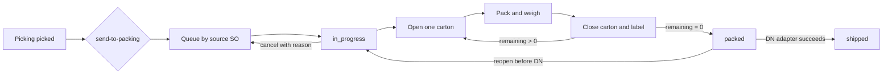

# BRD: Packing — แพ็คสินค้า

| Field | Value |
|---|---|
| BRD ID | BRD-F-WH-PACK-001 |
| Feature | F-WH-PACK — Packing |
| BRD Type | New Feature |
| Version | 1.0 |
| Status | AI Reviewed — มี Open Questions ที่ไม่บล็อกการออกแบบแกนหลัก |
| Module | Warehouse Outbound |
| Owner | PM/BA Warehouse |
| Stakeholders | หัวหน้าคลัง, พนักงานแพ็ค, Sales, Inventory, Delivery Note owner |
| Created / Updated | 2026-08-19 |
| UI Source of Truth | `outputs/03_PACK/f-wh-packing.html` (UX gate waived โดยผู้ใช้) |

## Changelog

- v1.0 — สร้างจาก PREBRIEF, Function Checklist, HTML ที่ PM/BA ยืนยัน, Central Plan v2 และ Picking final contract

## 2. Business Context

### 2.1 ปัญหาและโอกาส

หลัง Picking หยิบสินค้าสำเร็จ ระบบต้องควบคุมการนำของที่หยิบจริงมาแบ่งลงกล่อง ตรวจจำนวน ชั่งน้ำหนัก พิมพ์ป้าย ปิดงาน และส่งมอบข้อมูลให้ Delivery Note โดยไม่แพ็คเกิน ไม่สลับเอกสารต้นทาง และสามารถตรวจย้อนหลังได้ ปัจจุบันยังไม่มีสัญญากลางที่ระบุ lifecycle ของใบแพ็ค กล่อง และการส่งต่อครบถ้วน

### 2.2 เป้าหมายทางธุรกิจ

- รับงาน `to_pack` จาก Picking และสร้างงานแพ็คแยก 1 งานต่อ source SO แบบ idempotent
- ให้พนักงานทำงานแบบ scan-first โดยมีกล่องเปิดได้ครั้งละหนึ่งใบ
- ป้องกันการปิดกล่องว่าง แพ็คเกินจำนวนที่หยิบ และปิดงานก่อนของครบ
- สร้าง PACKSLIP A4 และ BOXLABEL 150×100 มม. ที่ trace กลับใบแพ็ค/กล่องได้
- ส่งต่อใบแพ็คที่เสร็จแล้วให้ Delivery Note โดย Packing ไม่ invent contract ของ DN

### 2.3 Success Metrics

| Metric | Baseline | Target | วิธีวัด | รอบวัด |
|---|---|---:|---|---|
| Pack quantity mismatch rate | ต้องเก็บก่อน launch | < 0.5% งานแพ็ค | audit discrepancy / packed jobs | รายสัปดาห์หลัง launch 30 วัน |
| งานปิดครบโดยไม่ reopen | ต้องเก็บก่อน launch | ≥ 95% | packed jobs ที่ไม่เกิด reopen / packed jobs | รายสัปดาห์ |
| Median pack cycle time | ต้องเก็บก่อน launch | ≤ 15 นาที/งาน [AI-DEFAULT] | `packed_at-started_at` | รายวัน |
| Print generation success | ต้องเก็บก่อน launch | ≥ 99.5% | PDF/label success / requests | รายวัน |
| Duplicate pack จาก Picking retry | 0 ที่ยอมรับได้ | 0 | duplicate source SO key | real-time |

### 2.4 ที่มา

PREBRIEF F-WH-PACK, Function Checklist FN-01..25/FN-90..95, HTML ที่ PM/BA ล็อก, Central Plan flow `SO → Picking → Packing → Delivery Note`, และ Picking final API `send-to-packing`.

## 3. Scope

### 3.1 In Scope

- คิวรับงานจาก Picking `to_pack`; split wave ต่อ source SO
- เริ่มใบแพ็ค เลือก/กำหนดกล่อง ใส่/เอาสินค้าออก undo และคำนวณน้ำหนัก
- ปิด/reopen กล่อง ปิดงาน ยกเลิกก่อน DN และ audit append-only
- พิมพ์ BOXLABEL ต่อกล่องและ PACKSLIP ต่อใบแพ็ค
- สิทธิ์ wh_lead, picker/packer และ viewer
- UI hook สำหรับส่งต่อ Delivery Note และเก็บผลอ้างอิงเมื่อ contract พร้อม
- notification events ของ Packing ผ่าน ENG-NOTIFY

### 3.2 Out of Scope

- Picking execution, การแก้ pick quantity และการคืน allocation
- Delivery Note implementation, route/vehicle planning และการตัดสต๊อกจริง
- split shipment หลาย DN จาก pack เดียว หรือรวมหลาย pack เป็น DN เดียว
- serial-level scan, รูปกล่อง, ค่าขนส่ง และ carton inventory master
- approval chain/DoA และ UI ตั้งเลขเอกสาร

### 3.3 Assumptions

- Picking ส่งเฉพาะ picked quantity จริงและไม่ส่ง service line
- หนึ่ง Packing job มี source SO เดียว; retry ของ Picking ไม่สร้างงานซ้ำ
- กล่อง active มีได้หนึ่งใบ; closed carton immutable จน reopen สำเร็จ
- Delivery Note contract ยังไม่พร้อม; integration เป็น port/adapter และปิดด้วย feature flag ได้
- น้ำหนักต่อหน่วยที่ไม่มีใน Item Master ใช้ mock เฉพาะ prototype ห้ามใช้ production

### 3.4 Scope Lock

- Scope Lock Ref: N/A — standalone feature brief; PM/BA ยืนยันใช้ HTML วันที่ 2026-08-19
- LOCK-PACK-01: ห้ามแก้หรือสร้าง feature HTML ใหม่ในรอบเอกสารนี้
- LOCK-PACK-02: Picking final contract เป็น authority ของ edge เข้า
- LOCK-PACK-03: ไม่มี Delivery Note artifact; ห้าม invent endpoint/schema
- LOCK-PACK-04: ใช้ NTF declaration; ไม่ใช้ DOA/DOCCFG declaration
- LOCK-PACK-05: UX BLOCK ถูก waive แต่ไม่ถือว่าผ่านมาตรฐาน UI

## 4. User Roles & Permissions

| Action | wh_lead | picker/packer | viewer/Sales |
|---|:---:|:---:|:---:|
| ดูคิว/ใบแพ็ค/เอกสาร | ✓ | ✓ ตามคลัง | ✓ read-only |
| เริ่มงาน | ✓ ทุกงาน | ✓ งานที่มอบหมาย/ตนรับ | ✗ |
| แก้กล่องในงาน active | ✓ | ✓ เฉพาะงานตน | ✗ |
| ปิดกล่อง/ปิดงาน | ✓ | ✓ เฉพาะงานตน [OQ-03] | ✗ |
| reopen pack/carton | ✓ | ✗ | ✗ |
| ยกเลิกก่อน DN | ✓ | ✓ งานตน [OQ-03] | ✗ |
| ส่งต่อ DN | ✓ | ✗ [OQ-03] | ✗ |
| แก้หลังมี DN | ✗ | ✗ | ✗ |
| Export CSV/Reprint | ✓ | ✓ ตามสิทธิ์ | ✓ เฉพาะข้อมูลที่ดูได้ |

ทุก API ต้องตรวจ tenant, warehouse scope, role และ ownership ใหม่ ห้ามเชื่อปุ่มที่ซ่อนใน UI

## 5. User Journey + COSO

### 5.1 Happy Path

| # | Step | Maker | Checker | Approver | System | Notes |
|---:|---|---|---|---|---|---|
| 1 | Picking ส่งงาน | Picker | — | — | validate status=picked; idempotent split ต่อ SO | upstream contract |
| 2 | รับงานเข้าคิว | — | — | — | สร้าง/คืน pack refs และ status to_pack | ไม่สร้างซ้ำ |
| 3 | เริ่มแพ็ค | Packer | — | — | สร้าง PACK; status in_progress; audit; notify | ยังไม่มีกล่อง |
| 4 | เปิดกล่อง | Packer | — | — | enforce one-active-carton; snapshot master | master/custom |
| 5 | ใส่สินค้า | Packer | — | — | clamp ต่อ picked line; recalc remaining/weight | scan-first |
| 6 | ชั่งและปิดกล่อง | Packer | Packer ตรวจนับหน้างาน | — | require non-empty; lock; label version; notify | self-check operational ไม่ใช่ approval |
| 7 | ทำซ้ำจนของครบ | Packer | — | — | progress/remainder | — |
| 8 | ปิดงานแพ็ค | Packer [OQ-03] | wh_lead ตาม policy [OQ-03] | — | require remaining=0/no active; packed; PACKSLIP | ไม่มี approval workflow |
| 9 | ส่งต่อ DN | wh_lead | — | — | invoke DN adapter idempotently; persist result | contract pending |

SoD: feature ไม่มี approval decision; Checker ในขั้น 6 คือการตรวจนับทางกายภาพ ไม่ใช่ Approver และทุก action มี actor/audit แยกกัน

### 5.2 Alternative / Exception

- Wave: ระบบ split ต่อ SO และคืน `pack_refs[]` โดยใช้ idempotency key เดิม
- Custom carton: บังคับชื่อและ tare; snapshot ลง carton
- Reopen: wh_lead เปิด pack/cartonก่อน DN; invalidate label และบังคับ reprint
- Cancel: บังคับเหตุผล ก่อน DN เท่านั้น แล้วคืน job เข้าคิวตาม contract
- Integration unavailable: คงสถานะ `packed`; DN handoff เป็น failed/retryable; ห้าม mark shipped



## 6. Data Entity & Fields

### 6.1 Entity Overview

| Entity | Type | Purpose |
|---|---|---|
| pack_job | Intake | idempotent unit ต่อ pick+source SO |
| pack | Header | lifecycle ของใบแพ็ค |
| pack_box | Detail | กล่องและน้ำหนัก |
| pack_box_item | Detail | allocation ของ picked line ลงกล่อง |
| pack_label | Print snapshot | version/สถานะป้ายต่อกล่อง |
| pack_audit | Append-only | action/state/data change |
| pack_outbox | Integration | notification/DN handoff แบบ retryable |

### 6.2 Key Fields

| Entity | Fields หลัก |
|---|---|
| pack_job | `job_id`, `tenant_id`, `warehouse_id`, `pick_id`, `pick_no`, `source_type`, `source_ref`, `status`, `idempotency_key`, audit fields, `version` |
| pack | `pack_id`, `pack_no`, `job_id`, `station_id`, `assignee_id`, `status`, `started_at`, `packed_at`, `dn_ref`, `ship_method`, `note`, cancel fields, audit fields, `version` |
| pack_box | `box_id`, `pack_id`, `box_no`, `box_type_id`, snapshot code/name/dimension/tare/capacity, `actual_weight`, `computed_weight`, `status`, `closed_at`, `label_version`, audit fields, `version` |
| pack_box_item | `box_item_id`, `box_id`, `source_line_id`, item/lot/expiry/location/UOM snapshots, `qty`, audit fields |
| pack_label | `label_id`, `box_id`, `version`, `payload_snapshot`, `status`, `printed_at`, `printed_by`, `invalidated_at`, audit fields |
| pack_audit | `audit_id`, `tenant_id`, `pack_id`, `box_id?`, `action`, `from_state`, `to_state`, `actor_id`, `reason`, `before_json`, `after_json`, `occurred_at`, request correlation |
| pack_outbox | `event_id`, `aggregate_id`, `event_type`, `payload`, `status`, `attempt_count`, `next_attempt_at`, `dedupe_key`, timestamps |

ทุก entity มี `created_by/created_at/modified_by/modified_at`; transaction snapshot ไม่เปลี่ยนย้อนหลังเมื่อ master เปลี่ยน

### 6.3 Relationships

```text
Pick 1 ── N pack_job (หนึ่งต่อ source SO)
pack_job 1 ── 0..N pack (ยกเลิกแล้วสร้างใบใหม่)
pack 1 ── N pack_box ── N pack_box_item
pack_box 1 ── N pack_label versions
pack 1 ── N pack_audit / pack_outbox
```

### 6.4 Data Classification

- Internal: pack/job/box/status/quantities
- Confidential: customer/ship-to/contact snapshots และ employee identifiers
- Restricted: ไม่มี payment/credential; audit IP/device เก็บตาม policy กลาง

## 7. User Stories & Acceptance Criteria

### US-01 รับงานจาก Picking

As a packer, I want to see eligible picked work, so that I can start packing the correct source order.

- Given Pick=`picked` with two source SOs, When Picking sends with one idempotency key, Then Packing returns two stable `pack_refs`.
- Given the same request is retried, When Packing receives it again, Then no duplicate job is created.

### US-02 เปิดกล่อง

As a packer, I want to open one carton, so that all scanned goods have one active destination.

- Given no active carton, When a valid carton is selected, Then one active carton is created with master snapshot.
- Given an active carton exists, When open is requested, Then the action is blocked.

### US-03 ใส่สินค้า

As a packer, I want to scan picked goods, so that carton quantity stays within the picked allocation.

- Given remaining quantity exists, When code/lot/name or quantity+code is scanned, Then quantity is allocated and weight recalculates.
- Given requested quantity exceeds remaining, When submitted, Then stored quantity is clamped/rejected and audit remains consistent.

### US-04 ปิดกล่อง

As a packer, I want to close a verified carton, so that its label can be printed.

- Given carton has items, When F2/close succeeds, Then carton locks, close time and label version are recorded.
- Given carton is empty, When close is requested, Then no state change occurs.

### US-05 ปิดงาน

As a packer, I want to complete packing, so that the shipment can proceed.

- Given remaining=0 and no active carton, When finish is confirmed, Then pack becomes `packed` and PACKSLIP is available.
- Given either guard fails, When finish is attempted, Then action is disabled/rejected with a reason.

### US-06 แก้กล่องก่อน DN

As a warehouse lead, I want to reopen a closed carton, so that a discovered packing error can be corrected.

- Given pack has no DN and no active carton, When carton is reopened, Then old label version is invalidated.
- Given DN exists, When reopen is requested, Then the API returns forbidden state transition.

### US-07 ยกเลิกใบแพ็ค

As an authorized warehouse user, I want to cancel with a reason, so that the source job can be repacked safely.

- Given no DN and a nonblank reason, When cancel succeeds, Then pack becomes cancelled and job returns to queue.
- Given reason is blank or DN exists, When cancel is attempted, Then no change is committed.

### US-08 ส่งต่อ Delivery Note

As a warehouse lead, I want to hand off a completed pack, so that Delivery Note can continue fulfillment.

- Given pack=`packed`, When adapter succeeds, Then `dn_ref` is stored exactly once and pack becomes shipped.
- Given adapter is unavailable, When handoff fails, Then pack stays packed and retry cannot duplicate DN.

## 8. Status & Lifecycle

| Current | Trigger | Next | Guard |
|---|---|---|---|
| queue | start | in_progress | authorized + job available |
| in_progress | finish | packed | remaining=0; no active carton |
| packed | reopen | in_progress | wh_lead; no DN |
| packed | DN result | shipped | confirmed DN ref |
| in_progress/packed | cancel | cancelled | reason; no DN |
| cancelled | create new pack | in_progress | job returned; new pack no. |

Carton: `active → closed ⇄ active(reopened)`; invalidated label versions ห้ามใช้ซ้ำ

## 9. Business Rules and Validation

| Rule | Requirement | Tag | Flexibility |
|---|---|:---:|---|
| BR-01 | intake เฉพาะ Picking `to_pack`, picked>0, no service | FIXED | code/contract |
| BR-02 | free item แพ็คปกติและแสดง no-tax-value note | FIXED | code |
| BR-03 | split 1 job ต่อ source SO และ idempotent | FIXED | code + unique constraint |
| BR-04 | active carton สูงสุด 1 | FIXED | invariant |
| BR-05 | allocation ต่อ source line ห้ามเกิน picked qty; qty≤0 ไม่เพิ่ม | FIXED | invariant |
| BR-06 | carton master/custom; capacity เกินเป็น warning | CONFIGURABLE | Admin/Warehouse Config [OQ-02] |
| BR-07 | computed weight=tare+Σqty×unit weight; actual override ได้ | DYNAMIC | rule service; source weight OQ-01 |
| BR-08 | close carton ต้องมี item; สร้าง immutable label version | FIXED | transaction |
| BR-09 | finish เมื่อ remaining=0 และไม่มี active carton | FIXED | invariant |
| BR-10 | reopen ก่อน DN เท่านั้นและ invalidate label | FIXED | state rule |
| BR-11 | shipped หลัง DN owner ยืนยันเท่านั้น | WARNING | contract pending OQ-DN-01 |
| BR-12 | cancel ก่อน DN; reason required; return job | FIXED | state rule |
| BR-13 | label 150×100 ต่อกล่อง; slip A4 ต่อ pack | FIXED | print contract |
| BR-14 | non-in_progress แสดง summary/closed boxes | FIXED | UI behavior |
| BR-15 | audit append-only ทุก mutation/transition | FIXED | compliance |
| BR-16 | notification channel/recipient ห้าม hardcode | FIXED | ENG-NOTIFY |

### 9.2 Validation

| ID | Action/Field | Condition | Result |
|---|---|---|---|
| VR-01 | start | job unavailable/already active | 409; return current ref when idempotent |
| VR-02 | custom carton | name blank or tare<0 | 422 |
| VR-03 | add item | unknown source line/lot or qty≤0 | 422; no mutation |
| VR-04 | add item | qty>remaining | clamp/reject consistently; never exceed |
| VR-05 | close box | empty | 409 |
| VR-06 | finish | remaining>0 or active box | 409 with machine-readable reason |
| VR-07 | reopen/cancel | DN exists | 409/403 state lock |
| VR-08 | write | stale `version` | 409 optimistic conflict |

### 9.5 Flexibility

| Rule | Attribution | Level | Owner / Plan |
|---|---|---|---|
| BR-06 | 🤖 inferred from Operations default | Admin Panel/Warehouse Config | Warehouse owner; decide by 2026-08-26 |
| BR-07 | 🤖 inferred dynamic calculation | Rule service/config source | Architect + Item owner; 2026-08-26 |
| BR-11 | ✅ source gap | adapter contract | DN owner; 2026-08-26 |

## 10. Edge Cases

### 10.1 Confirmed

- EC-01 retry Picking request → return stable refs, no duplicate (BR-03)
- EC-02 scan across multiple lots → one undo unit; allocation remains line-level (BR-05)
- EC-03 concurrent scans/reopen → optimistic conflict, no over-pack (BR-04/05)
- EC-04 empty carton close → block (BR-08)
- EC-05 finish incomplete/open carton → block with reason (BR-09)
- EC-06 reopen/cancel after DN → block all roles (BR-10/12)
- EC-07 label reprint after reopen → old version invalid, new version auditable (BR-10/13)
- EC-08 PDF/font/printer failure → pack state unchanged; retry print (BR-13)
- EC-09 notification failure → business transaction commits; outbox retries (BR-16)
- EC-10 DN failure → remain packed; idempotent retry (BR-11)

### 10.2 AI-suggested — confirm during implementation refinement

- ☐ CA-01 two users edit same pack → version conflict and refresh
- ☐ DI-01 carton/item master deactivated mid-pack → retain snapshot, block new selection
- ☐ CL-01 extreme qty/weight overflow → decimal bounds and 422
- ☐ CL-09 actual weight override → require reason if variance threshold is configured
- ☐ PD-04 render timeout → queued retry + failure audit
- ☐ PM-01 role changes mid-session → server permission wins immediately
- ☐ EM-04 event retry → dedupe by event key

## 11. Impact Analysis

| Area | Impact | Guard |
|---|---|---|
| Picking | status and pack refs | locked API + idempotency |
| Sales Order | source/customer snapshot; shipped later | read-only until DN confirms |
| Inventory | no direct issue in Packing | DN owner contract pending |
| Item/Location | lot/UOM/weight/cold snapshot | missing weight is OQ, no production mock |
| Printing | two sizes/printers | separate templates and versioned output |
| Notification | 4 Packing business events | outbox + NTF catalog |

Regression: Picking `picked→to_pack`, SO-only split, retry behavior, shared IAM/audit/notify/print services.

## 12. System Context and Cross-Module Impact

### 12.1 Value Stream

`Sales Order → Picking → Packing → Delivery Note → AR Invoice`

| Upstream | Data/Trigger | Failure behavior |
|---|---|---|
| Picking | picked lines, source SO, lot/expiry/location, assignee/time; send-to-packing | Pick remains picked on unavailable Packing; safe retry |
| Sales Order | customer/ship-to/delivery/term/pickup/free item snapshots | missing required destination blocks intake/start |
| Item/Inventory/Location | identity/UOM/lot/weight/cold/location snapshots | missing optional weight flagged; no silent zero in production |

| Downstream | Data | Trigger | Edit/cancel impact |
|---|---|---|---|
| Delivery Note | pack ref, closed cartons/items, destination snapshot | explicit handoff from packed | contract pending; before success may retry, after success locked |
| Print | label/slip snapshot | carton close / pack finish | reopen invalidates label; cancel marks document cancelled |
| ENG-NOTIFY | Packing event envelope | committed state transition | retries deduped; no rollback business txn |
| Audit/Monitoring | actor/state/count/weight/result | every command | append-only |

### 12.2 Dependencies

Picking API, IAM, Tenant/Warehouse scope, Item/Inventory/Location/SO read models, shared document numbering runtime, PDF/label renderer, ENG-NOTIFY, audit/outbox, future Delivery Note adapter.

### 12.3 Existing System Reference

| Capability | Status | Reference |
|---|---|---|
| Picking handoff | confirmed | Picking final FRD/API/LOCK-11 |
| Feature HTML | confirmed with waiver | root HTML + UX report |
| Print patterns | confirmed | `06_PRINT` |
| Notification center | shared dependency | NTF declaration follows FRD |
| Delivery Note | unavailable | OQ-DN-01 |
| Transfer intake | unavailable | OQ-XT-01 |

## 13. Delivery Phases

### Phase 1 — Core Packing

Intake/idempotency, queue, pack/box/item persistence, one-active invariant, scan allocation, weights, close/reopen/cancel, permissions, audit and HTML-aligned UI.

### Phase 2 — Printing and Notification

PACKSLIP/BOXLABEL binding, label versioning/reprint, transactional outbox and declared Packing events.

### Phase 3 — Delivery Note Integration

Implement only after DN owner supplies versioned contract, error model and idempotency ownership.

### Phase 4 — Configuration Evolution

Warehouse carton master, real item weight and optional packing rule engine after OQ decisions.

## 14. Dev Requirements Summary

### 14.1 Foundation

- transactional aggregates with unique `(tenant_id,pick_id,source_ref)` intake key
- optimistic `version` on job/pack/box
- commands are atomic; outbox in same transaction
- snapshots for changing master/customer/item data
- append-only audit; no hard delete

### 14.2 Non-negotiable Rules

- one active carton, no over-pack, no empty close, no finish incomplete
- no mutation after confirmed DN
- no production mock weight, DN API or Transfer schema
- server-side permission/tenant checks on every command
- label/slip must bind from persisted snapshot, not mutable UI state

### 14.3 Edge/Error

Implement explicit 400/401/403/404/409/422/429/500/503 errors, correlation ID, idempotency replay response, optimistic conflict and print/integration retry.

### 14.4 Warnings

OQ-01..10, OQ-DN-01, OQ-XT-01 มี owner/target ใน §15; guarded ports/feature flags must prevent invented contracts.

### 14.5 Screen Inventory

| Screen/Overlay | Type | Purpose |
|---|---|---|
| Packing list | list with queue/packs tabs | search/filter/export/progress |
| Pick job detail | modal | inspect picked lines/start |
| Packing workspace | operational console | scan/box/weight/finish |
| Pack detail tabs | detail | reference, print, audit |
| Custom carton | modal | name/tare |
| Cancel confirm | modal | reason and destructive confirm |

## 15. Open Questions

| ID | Question | Owner | Target | Guard until resolved |
|---|---|---|---|---|
| OQ-01 | source/precision of `weight_per_base_uom` | Item owner | 2026-08-26 | no production auto-weight fallback |
| OQ-02 | carton/pack station master ownership | Warehouse owner | 2026-08-26 | snapshot prototype list only |
| OQ-03 | final permission for finish/cancel/DN | Warehouse owner/IAM | 2026-08-26 | restrictive role default |
| OQ-04 | quantity scan vs piece verification | Warehouse owner | 2026-08-26 | current quantity mode |
| OQ-05 | reprint log/void procedure | Warehouse owner | 2026-08-26 | version+invalidate mandatory |
| OQ-06 | pack-to-DN cardinality | DN/Sales owner | 2026-08-26 | no integration implementation |
| OQ-07 | pickup staging/DN timing | Warehouse owner | 2026-08-26 | display only |
| OQ-08 | barcode/QR/printer auto-submit | Architect | 2026-08-26 | payload versioned placeholder |
| OQ-09 | damaged/expired item during pack | Inventory owner | 2026-08-26 | stop and manual exception |
| OQ-10 | carton engine ownership | Architect | 2026-08-26 | local pure rule only |
| OQ-XT-01 | Transfer intake endpoint/schema | Transfer owner | 2026-08-26 | mock UI only |
| OQ-DN-01 | DN endpoint/schema/idempotency/error ownership | DN owner | 2026-08-26 | adapter disabled |

## 16. Security and Compliance

### 16.1 Preset

P1 Standard Transaction adapted for warehouse operations. No DoA is introduced; P1 controls that concern approval limits are N/A, while access, audit, validation, concurrency and integrity remain mandatory.

### 16.2 Standards

| Standard | Applicable | Reason |
|---|:---:|---|
| COSO/SoD | ✓ | maker/checker trace and no hidden override |
| ISO 27001 | ✓ | IAM/session/data classification |
| NIST CSF | ✓ | logging/recovery/anomaly |
| COBIT | ✓ | UAT/evidence/capacity |
| CIS | ✓ | platform baseline |
| NIST 800-53 | ✓ | access/audit/input |
| PDPA | ✓ | recipient/contact snapshots |
| NIST Privacy | △ | flow tracking where PII leaves module |
| IEC 62443 / NIST 800-82 | ✗ | no machine/OT control |
| SOC 2 | ✓ | evidence and reconciliation |
| ISO 22301 | ✓ | warehouse continuity/retry |
| AI RMF | ✗ | no AI decision |
| OWASP API | ✓ | API validation/rate/idempotency |

### 16.3 Controls

| Control | Required | Implementation |
|---|:---:|---|
| S01-04 SoD Conflict | ✓ | role/ownership matrix; no self-elevation |
| S01-06 Tolerance | ✓ | quantity hard limit; capacity soft warning |
| S01-07 Immutable Log | ✓ | pack audit append-only |
| S02-03 Session | ✓ | shared IAM; server recheck |
| S02-05 Classification | ✓ | fields tagged Internal/Confidential |
| S04-03 Capacity | ✓ | pagination, scan throttling, print queue |
| S04-04 UAT | ✓ | FN trace/test pack before release |
| S04-05 Mapping | ✓ | source IDs/snapshots standardized |
| S04-06 SLA | ✓ | queue/cycle/integration monitoring |
| S06-01 ABAC | ✓ | tenant+warehouse+role+owner |
| S06-03 Audit Content | ✓ | who/what/when/where/result/correlation |
| S06-06 Sanitization | ✓ | scan/custom/reason payload validation |
| S11-04 Reconciliation | ✓ | source picked = packed+remaining |
| S12-02 Read-only fallback | recommended | allow viewing during downstream outage |
| S14-01 Rate Limit | ✓ | scan/export/print/integration limits |
| S14-02 Schema Validation | ✓ | all commands/events |

### 16.4 Risks

| Risk | Likelihood | Impact | Mitigation |
|---|---|---|---|
| over-pack/race | Medium | High | unique constraints, version, transaction, reconcile |
| cross-tenant/warehouse access | Low | Critical | ABAC and query scoping |
| duplicate PACK/DN | Medium | High | idempotency keys/outbox/dedupe |
| stale/reused label | Medium | High | version/invalidation/reprint audit |
| PII leakage through export/print | Medium | Medium | role scope, audit, retention |

## 17. Health Check

### 17.1 SLA

| Step | SLA | Owner | Breach action |
|---|---|---|---|
| Picking handoff response | p95 ≤ 2s [AI-DEFAULT] | Packing service | alert/retry without Pick transition |
| scan command response | p95 ≤ 300ms [AI-DEFAULT] | Packing service | warn ops and trace slow request |
| print generation | p95 ≤ 10s [AI-DEFAULT] | Print service | queue retry/alert |
| DN handoff | contract pending | DN owner | remain packed; notify owner |

### 17.2 Control Points

| Control | Where/When | Expected result |
|---|---|---|
| ABAC | every API pre-action | unauthorized blocked and logged |
| Reconciliation | add/remove/finish | packed+remaining equals picked |
| Audit | every committed command | append one correlated event |
| Schema/Input | API boundary | malformed scan/qty/reason rejected |
| Idempotency | intake/DN/event | replay returns same business result |

### 17.3 KPI

| KPI | Category | Target | Formula |
|---|---|---:|---|
| mismatch rate | Quality | <0.5% | discrepancies/jobs |
| no-reopen completion | Quality | ≥95% | completed without reopen/completed |
| median cycle time | Speed | ≤15 min [AI-DEFAULT] | median(packed-started) |
| print success | Reliability | ≥99.5% | successful prints/requests |
| duplicate intake/DN | Compliance | 0 | unique business duplicates |

### 17.4 Threshold

| Metric | Green | Yellow | Red | Action |
|---|---|---|---|---|
| mismatch | <0.5% | 0.5–1% | >1% | investigate line/lot/actor |
| cycle median | ≤15m | 15–30m | >30m | review queue/station |
| print failure | <0.5% | 0.5–2% | >2% | alert print support |
| handoff retry age | <5m | 5–30m | >30m | alert DN owner |

### 17.5 Throughput

- Baseline: must collect before launch
- Designed starting target: 100 concurrent stations and 10 scans/sec/tenant [AI-DEFAULT]
- Stress test: large pack 1,000 lines, 200 cartons, concurrent retries and print queue

## 18. Monitoring

### 18.1 Reports

| Report | Type | Frequency | Audience |
|---|---|---|---|
| Packing performance | Performance | real-time/daily | Warehouse lead |
| Packing closing | Closing | daily/monthly | Operations manager |
| Packing anomalies | Anomaly | real-time | Warehouse lead/auditor |
| Pack transaction trail | Transaction | on-demand | Support/auditor |

### 18.2 Widgets

| Widget | Source | Threshold |
|---|---|---|
| Queue age / cycle time | §17.3 | §17.4 |
| Mismatch/reopen rate | §17.3 | §17.4 |
| Print success/failure | §17.3 | §17.4 |
| DN handoff retry age | §17.1 | §17.4 |
| Duplicate prevented count | audit/idempotency | any actual duplicate = red |

### 18.3–18.6 Report Detail

- Performance: by warehouse/station/packer, volume, pieces, cartons, cycle distribution
- Closing: packed/shipped/cancelled/outstanding and source reconciliation
- Anomaly: over-pack attempt, stale version, repeated reopen, invalid label, off-hours, repeated retry
- Transaction: full state transition, carton allocation, label versions, print/DN/notification attempts

## Appendix A — Traceability

ทุก FN-01..25 และ FN-90..95 อยู่ใน Screen Inventory/Stories/Rules; BR-01..16 มี edge/exception coverage; OQ ที่ยังไม่มี contract ถูก guard ไม่ให้ dev invent.

## Appendix B — Glossary

- PACK: ใบแพ็คสินค้า
- active carton: กล่องเดียวที่รับสินค้าอยู่
- PACKSLIP: ใบแพ็ค A4
- BOXLABEL: ป้ายกล่อง 150×100 มม.
- DN: Delivery Note (artifact ยังไม่มี)
- idempotency: การ retry ที่ให้ผลเดิมโดยไม่สร้างข้อมูลซ้ำ

## Appendix C — Document Control

| Version | Date | Author | Change |
|---|---|---|---|
| 1.0 | 2026-08-19 | AI BA pipeline | Initial HTML-first BRD |
