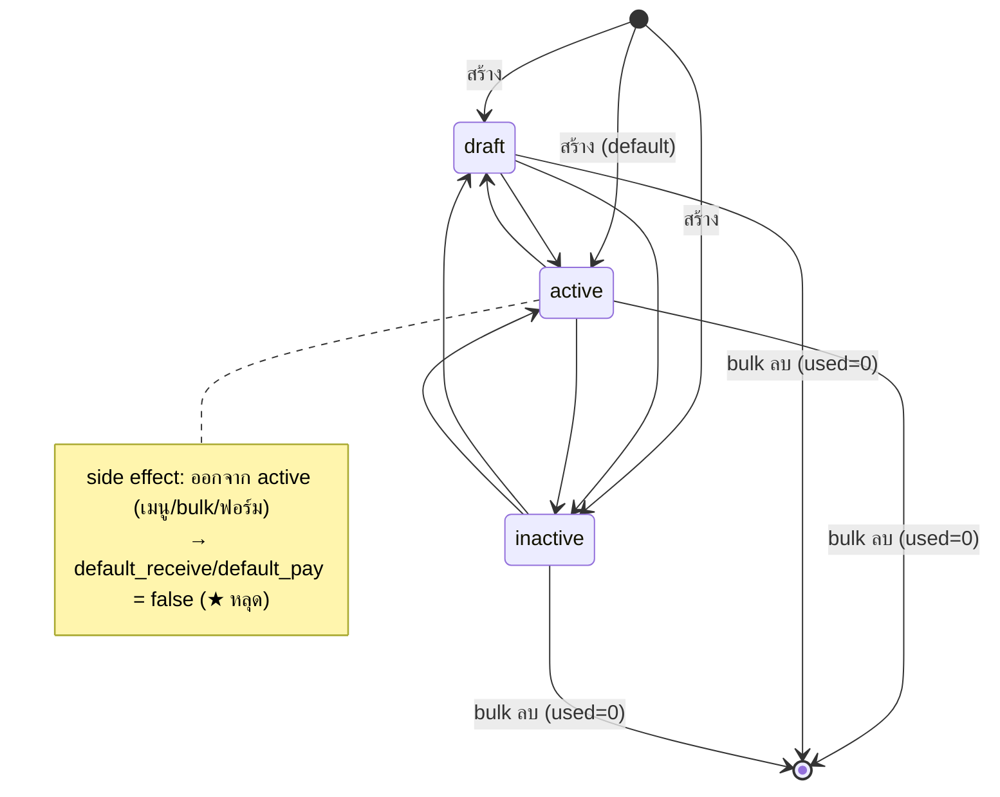

# BRD · Bank Master (บัญชีธนาคาร) — F-BNK

> **Business Requirements Document — ฉบับสมบูรณ์**
> Generated by `brd-generator-full v2.2` · **Fresh Mode (HTML-first)** · WF-01 · SOW3.2
> Source of Truth = HTML prototype `01_HTML/f-bank.html` (ผ่าน ux + coverage + E2E gate · PM/BM-APPROVED)
> Conflict Priority ที่ใช้: **LOCK (มติ Strike 2026-08-11 · OQ-BNK-01..05) > PREBRIEF business intent > HTML หน้าจอจริง**

---

## Section 1 · Document Info

| หัวข้อ | รายละเอียด |
|---|---|
| **BRD ID** | BRD-F-BNK |
| **Feature** | Bank Master — บัญชีธนาคาร |
| **รหัสเดิม** | F-BANK-MASTER-001 · node **F-0.21** |
| **ประเภท BRD** | **New Feature (Master / Config)** — gen ใหม่ ไม่มี base/FRD เดิม |
| **Module** | Accounting (การเงิน) — Finance Foundation master · ปิด chain **COA → Posting Group → Bank Master → Payment Method** |
| **Version** | 1.0 |
| **Status** | ✅ **APPROVED** (Quality Gate ผ่าน — ดู AI Review Report ท้ายเอกสาร) |
| **Owner (BA)** | (ตาม pipeline WF-01) |
| **Stakeholders** | PM/BM · BA · Finance/Accounting Lead · Strike (business rules) · Architect (GL/ENG register) · F-PG owner (GL Posting Group) |
| **วันที่** | 2026-08-11 |
| **Input sources** | HTML SoT `f-bank.html` + PREBRIEF_F-BNK v1 + FUNCTION_CHECKLIST FN-01..25/40 + LOCKED DECISIONS (Strike 2026-08-11) + GL Posting Group Contract (F-PG DevPack) |

### Changelog
- **v1.0 (2026-08-11)** — Initial BRD via `brd-generator-full` (Fresh Mode, HTML-first).
  - สกัด Screen Inventory + fields + validations + states จาก HTML SoT ที่ gate-passed
  - Reflect **LOCKED DECISIONS (Strike 2026-08-11)**: OQ-BNK-01 (ตัดเส้น → Payment Method), OQ-BNK-02 (GL binding OPTIONAL), OQ-BNK-03 (IR-BNK-01 ล็อก ธนาคาร+เลขบัญชี เมื่อ used>0), OQ-BNK-04 (Receipt/PV flow)
  - บันทึก **GL Posting Group Contract** + 3 known drifts (mock vs f-postgrp as-built) เป็น integration notes ใน §12.1
  - Reflect DOA null, CI v8 Warm Light, OQ register OQ-BNK-01..05

---

## Section 2 · Business Context

### 2.1 ปัญหา / โอกาส
ERP ต้องบันทึกรับเงิน (Receipt) และจ่ายเงิน (Payment Voucher) ผ่าน "บัญชีเงินฝากธนาคารจริง" ที่บริษัทถือ. ปัจจุบัน (ตาม PREBRIEF: gen ใหม่ ไม่มี master กลาง) ทำให้:
- ไม่มีทะเบียนกลางของบัญชีธนาคาร (ธนาคาร × สาขา × เลขบัญชี) → เอกสารรับ/จ่ายอ้างบัญชีแบบกรอกมือ/ไม่สอดคล้อง
- บัญชี GL เงินฝากถูกผูกกระจัดกระจาย ไม่ได้ resolve ผ่านมาตรฐานกลุ่ม (Bank Posting Group)
- ไม่มีการควบคุมบัญชีเริ่มต้น (★) ต่อฝั่งรับ/จ่าย → ผู้บันทึกเลือกผิดบัญชีได้
- ไม่มี guard กันแก้เลขบัญชี/ธนาคารของบัญชีที่มีเอกสารผ่านแล้ว → ประวัติเอกสารเก่าเพี้ยน

### 2.2 เป้าหมาย business
สร้าง **ทะเบียนบัญชีธนาคารกลางเดียว** — รายบัญชีจริง (ธนาคาร × สาขา × เลขบัญชี) ใช้ร่วมทั้งฝั่งรับ (Receipt) และจ่าย (PV) — ผูกกลุ่มบัญชี GL (Bank Posting Group) เพื่อให้ GL engine resolve บัญชีเงินฝากผ่านกลุ่ม + ตั้งบัญชีเริ่มต้น (★) ต่อฝั่ง + ล็อกข้อมูลหลัก (ธนาคาร/เลขบัญชี) เมื่อมีเอกสารผ่านแล้ว เพื่อให้เอกสารปลายทาง snapshot ค่าได้ถูกต้องและปลอดภัย

### 2.3 ตัวชี้วัดความสำเร็จ (บังคับวัดได้) — จับคู่กับ §17.3 KPI

| # | ตัวชี้วัด | Baseline ปัจจุบัน | Target | วัดยังไง / จากไหน | วัดเมื่อไหร่ | KPI คู่ (§17.3) |
|---|---|---|---|---|---|---|
| M-01 | % เอกสาร Receipt/PV ที่เลือกบัญชีจากทะเบียน (แทนกรอกมือ) | ต้องเก็บ baseline ก่อน launch | ≥ 95% | นับจาก field bank_account_code ที่ soft-ref ทะเบียน / เอกสารรับ-จ่ายทั้งหมด | รายเดือน หลัง Receipt/PV launch | KPI-01 |
| M-02 | เวลาเฉลี่ยตั้งค่าบัญชีธนาคารใหม่ 1 รายการ | ต้องเก็บ baseline ก่อน launch | < 3 นาที | timestamp created (drawer open→submit) | รายเดือน | KPI-02 |
| M-03 | อัตรา GL posting ผิดจากบัญชีเงินฝากไม่ตรง/ไม่ผูกกลุ่ม | ต้องเก็บ baseline ก่อน launch | ลด ≥ 80% เทียบ baseline | เคส GL correction ที่ระบุสาเหตุ = บัญชีเงินฝากผิด/ไม่ผูกกลุ่ม | รายไตรมาส | KPI-03 |
| M-04 | จำนวนบัญชี duplicate (เลขบัญชีซ้ำในทะเบียน) | ต้องเก็บ baseline ก่อน launch | → 0 (unique account_no ทั้งทะเบียน) | audit เลขบัญชี (เทียบตัดขีด) | รายไตรมาส | KPI-04 |

> ⚠️ ทุกตัวชี้วัดยังไม่มี baseline (feature ใหม่ · Receipt/PV ยังไม่ทำ) → **action บังคับ: เก็บ baseline ช่วง pilot ก่อน launch จริง** (ผูก M-01..M-04 ใน §15 Open Questions) · M-01/M-03 วัดได้จริงเมื่อเอกสารปลายทาง (Receipt/PV) พร้อม

### 2.4 ที่มา
Finance Foundation master (ต้นน้ำของ S2C receive + P2P pay) · standard review 2026-08-09 (Business Central Bank Account + Bank Posting Group baseline) · PREBRIEF §1 + edge `Bank Master ← GL Posting Group [config]` · gen skeleton จาก f-paymethod (สืบมติเลน VD-PDM r2)

---

## Section 3 · Scope

### 3.1 In Scope (ทำอะไร)
- หน้า **List** บัญชีธนาคาร: ค้นหา (รหัส/ธนาคาร/สาขา/เลขบัญชี), filter ธนาคาร (9 ค่า) + สถานะ (3 ค่า), stat 4 ใบกดกรอง (ทั้งหมด/ใช้งาน/ไม่ใช้งาน/ร่าง), sort, pager (8/หน้า), bulk (ตั้ง 3 สถานะ + ลบ), แถวแสดง ★รับ/★จ่าย + กลุ่ม GL + ปุ่มแก้ไข
- **สร้าง/แก้ไข** บัญชี ผ่าน drawer form 3 sections: **ข้อมูลบัญชี → บัญชีแยกประเภท (GL) → การใช้งาน**
  - ข้อมูลบัญชี: code (auto `{ธนาคาร}-{เลขรัน}` ถ้าเว้น), ธนาคาร\*, เลขที่บัญชี\* (10–12 หลัก ใส่ขีดได้ · unique), ชื่อบัญชี\*, สาขา, ประเภทบัญชี (ออมทรัพย์/กระแสรายวัน/ฝากประจำ), พร้อมเพย์ (ว่าง/10/13 หลัก)
  - GL: เลือก **กลุ่มบัญชี GL (Bank Posting Group, kind=bank)** — ผูกหรือไม่ผูกก็บันทึกได้ (OQ-BNK-02); สกุลเงิน THB disabled
  - การใช้งาน: ใช้กับฝั่ง (รับ/จ่าย ≥1)\*, ★ บัญชีรับหลัก, ★ บัญชีจ่ายหลัก (1 ตัว/ฝั่งทั้งระบบ), สถานะ 3 ค่า
- **IR-BNK-01 lock:** เมื่อ `used>0` (มีเอกสาร Receipt/PV ผ่านบัญชี) → ล็อก **ธนาคาร + เลขที่บัญชี** (disabled + lock-tag + logic guard); field อื่นแก้ได้ปกติ
- **★ Default ต่อฝั่ง:** radio 1 ตัว/ฝั่งทั้งระบบ (ตัวเก่าหลุด) · DEFAULT_GUARD (ต้อง active + ฝั่งเปิด) · สถานะหลุด active → ★ ทั้ง 2 ฝั่งหลุดตาม
- **สถานะ 3 ค่าอิสระ** (ร่าง/ใช้งาน/ไม่ใช้งาน) เปลี่ยนทุกทิศ ไม่มีอนุมัติ — เมนู view + bulk
- **นำเข้า CSV (merge/append-only)** 3 จังหวะ (pick → preview validate → done) · **ส่งออก CSV** ตาม filter (roundtrip กับ template columns · BOM)
- View drawer: header ธนาคาร + เลขบัญชี mask (xxx-x-xx…) · summary chips 4 ใบ · 3 sections (GL เตือนถ้ายังไม่ผูก) · tab ภาพรวม/ประวัติ · เมนูเปลี่ยนสถานะ

### 3.2 Out of Scope (ไม่ทำ — สำคัญ; รวม Functions Cut ดู §14.6)
- **เส้นออกไป Payment Method (F-0.20)** — **CUT (OQ-BNK-01 = NO, Strike 2026-08-11)**: PM คง default_acct = COA ตรง · Bank Master ไม่ expose ให้ PM · ไม่ถือเป็น interface
- **ยอดคงเหลือ / opening balance** ใน master (เรื่อง GL/Reconciliation ไม่ใช่ master) — S-10①
- **multi-currency** — THB-only (OB-5) · สกุลเงินแสดง disabled · SWIFT/IBAN ไม่มี — S-10②③
- **ผู้มีอำนาจเซ็น / วงเงิน / สายอนุมัติ** (เรื่อง DOA/Policy) — DOA placeholder 4 fields = null, NOTIF ไม่ emit — S-10④
- **แสดงจำนวน `used` บนจอ** — ทุกที่ (guard ลบ/ล็อกยังอยู่ใน logic เท่านั้น) — S-10⑤ · มติ r2
- **โหมดนำเข้า Replace** (มีแต่ merge/append-only) · **posting_group / promptpay ในไฟล์นำเข้า** (ผูกทีหลังในจอ) — S-10⑥⑨
- **ปุ่มลบรายตัว** (ลบได้เฉพาะ bulk + confirm) · **★ หลายตัวต่อฝั่ง** — S-10⑦⑧
- **เก็บเลข COA เงินฝากตรงใน master** — GL resolve ผ่านกลุ่ม (Bank Posting Group) เท่านั้น (มาตรฐาน BC)
- **ข้อความช่วยใต้ช่อง (hint/field-help)** — มติเลน (ตัด)

### 3.3 Assumptions
- `used` เป็น mock ใน prototype — จริง = count เอกสาร **Receipt/PV** ที่ posted ผ่านบัญชี (นิยาม CONFIRMED · OQ-BNK-03)
- Soft-reference 2 ชั้น + snapshot: ① เอกสาร (Receipt/PV) เก็บ code บัญชี + สำเนาค่าตอนบันทึก ② บัญชีเก็บ code กลุ่ม → กลุ่ม (F-PG) เก็บเลข COA เงินฝาก → GL resolve สดตอน post — ไม่มี FK cascade
- Bank Posting Group อ่านจาก **generic F-PG-API-01**: `GET /api/v1/gl/posting-groups?kind=bank&status=active` (ไม่มี endpoint เฉพาะ Bank Master — เป็น downstream consumer ที่ประกาศแล้วแต่ยังไม่ implement ฝั่ง F-PG) — ดู 3 drifts ใน §12.1
- DOA placeholder 4 fields (approver_role/approved_by/approved_at/approval_chain) = null (ยืนยันใน HTML `saveBank()` / mock records)
- Receipt/PV ยังไม่ทำ — edge ประกาศรอ: เลือกบัญชีเฉพาะ active + ฝั่งตรง · ★ pre-select · snapshot ตอนบันทึก (OQ-BNK-04)

### 3.4 Scope Lock ⭐ (สืบทอด — ห้าม override)

**scope_lock_ref:** LOCKED DECISIONS (Strike 2026-08-11) + GL Posting Group Contract · Conflict rule: **LOCK ชนะทุกกรณี** — business rule ใดขัด LOCK → LOCK ชนะ + แจ้งใน AI Review

| LOCK | กติกา (ห้ามฝืน) | สะท้อนใน BRD ที่ |
|---|---|---|
| **OQ-BNK-01 = NO** | เส้น Bank Master → Payment Method **ตัดทิ้ง** · PM คง COA-direct | §3.2, §12.1, §14.6 Functions Cut |
| **OQ-BNK-02 = binding OPTIONAL** | บันทึกได้โดยไม่ผูกกลุ่ม GL (view เตือน "GL post ไม่ได้จนกว่าจะผูกกลุ่ม") · picker เห็นเฉพาะ **active** (F-PG BR-06) · คงกลุ่มที่ผูกไว้เดิม (แม้ draft) กันหลุด | §6, §9 BR-04, §10 |
| **OQ-BNK-03 = IR-BNK-01 CONFIRMED** | `used>0` → ล็อก **ธนาคาร + เลขที่บัญชี** เท่านั้น · field อื่นแก้ได้ · `used` = count Receipt/PV · **ไม่โชว์บนจอ** (logic-only guard) | §6, §9 BR-02, §8 |
| **OQ-BNK-04 = CONFIRMED** | Receipt/PV เลือกเฉพาะ active + ฝั่งตรง · ★ pre-select · snapshot ตอนบันทึก | §12.1, §9 BR-05 |
| **GL Contract** | soft-ref → GL Posting Group (F-PG kind=bank) · resolve บัญชีเงินฝากผ่านกลุ่ม · master ไม่เก็บ COA ตรง · `?kind=bank` (ไม่ใช่ `?type=`) · generic API-01 (ไม่มี endpoint เฉพาะ) | §6, §9 BR-04, §12.1 (3 drifts) |
| **Pattern (VD-PDM)** | สถานะ 3 ค่าอิสระ ไม่มีอนุมัติ · statusMenu + bulk · **ไม่มีลบเดี่ยว** · import 3 จังหวะ merge-only · export roundtrip · ตัด hint/field-help · **ไม่โชว์ used** | §8, §14.6 |
| **Governance** | DOA null · NOTIF ไม่ emit · THB-only (สกุลเงิน disabled) · CI v8 Warm Light · Iron Rules #29/#96/#97 · Esc chain | §16, §14.6 |

**SCOPE DRIFT check:** ไม่มี In Scope ข้อใดเกิน LOCK. จุด tension เดียว (เส้นออก Payment Method) ถูกปิดโดย **OQ-BNK-01 = NO** → เส้นถูกตัด, ไม่เหลือ drift. GL picker ที่ mock list ทั้ง KBANK+SCB = integration note (ดู §12.1 Drift-2), ไม่ใช่ scope drift. ✅

---

## Section 4 · User Roles & Permissions

> Master นี้เป็น **config การเงินส่วนกลาง** — ไม่มีสายอนุมัติ (DOA null). สิทธิ์แยกเป็น "ผู้ดูแล master" (จัดการ) กับ "ผู้บริโภคปลายทาง" (เลือกใช้ในเอกสาร Receipt/PV)

| Role | List/ค้นหา | สร้าง | แก้ไข | เปลี่ยนสถานะ | ตั้ง ★ Default | นำเข้า/ส่งออก | bulk ลบ (used=0) | เลือกใช้ในเอกสาร |
|---|:---:|:---:|:---:|:---:|:---:|:---:|:---:|:---:|
| **Finance Master Admin** (Accounting/Finance Lead) | ✅ | ✅ | ✅ (ธนาคาร+เลขบัญชีล็อกเมื่อ used>0) | ✅ (3 ค่าอิสระ) | ✅ | ✅ | ✅ | — |
| **Finance Viewer** | ✅ | ❌ | ❌ | ❌ | ❌ | ❌ | ❌ | — |
| **ผู้ใช้เอกสารปลายทาง** (ผู้บันทึก Receipt/PV) | (ดูผ่าน picker) | ❌ | ❌ | ❌ | ❌ | ❌ | ❌ | ✅ เลือกเฉพาะ active + ฝั่งตรง |

> หมายเหตุ: HTML prototype แสดง user เดียว "พิมพ์ใจ บัญชี · Finance" (mock) — role matrix ข้างต้นเป็น business intent จาก PREBRIEF; enforcement จริง = FRD/Security (P3)

---

## Section 5 · User Journey (with COSO)

> **DOA null:** master นี้ **ไม่มีขั้นอนุมัติ** — ทุก action commit ทันทีโดย Maker (System validate). **Checker/Approver = ไม่มี (N/A by design)** · **SoD ผ่านโดยปริยาย** (ไม่มี approval step ที่จะละเมิด Maker≠Approver). อ้างอิง `coso-defaults.md` = master-data/no-approval preset

### 5.1 Happy Path — เพิ่มบัญชีธนาคาร + ผูกกลุ่ม GL (S-01, S-02)
| # | Step (map function/ปุ่มจริงใน HTML) | Maker | Checker | Approver | System |
|---|---|---|---|---|---|
| 1 | เปิดหน้า List (`renderList`) → กด **"เพิ่มบัญชีธนาคาร"** (`openCreate()`) | Finance Admin | — | — | เปิด drawer form 3 sections (default status=active, use_receive=on) |
| 2 | กรอก ข้อมูลบัญชี: ธนาคาร\* + เลขที่บัญชี\* (10–12 หลัก) + ชื่อบัญชี\* + สาขา/ประเภท/พร้อมเพย์ (code เว้น = auto) | Finance Admin | — | — | — |
| 3 | เลือก **กลุ่มบัญชี GL** (Bank Posting Group, active-only) — หรือเว้นไว้ | Finance Admin | — | — | เว้น = บันทึกได้ แต่ view จะเตือน "GL post ไม่ได้" (OQ-BNK-02) |
| 4 | เลือก ใช้กับฝั่ง ≥1 (รับ/จ่าย) + (optional) ★ บัญชีหลัก + สถานะ | Finance Admin | — | — | — |
| 5 | กด **"ยืนยันสร้าง"** (`saveBank('create')`) | Finance Admin | — | — | validate ครบ → `autoCode` ถ้าเว้น + push + toast success / บล็อก+ชี้ช่อง+toast ถ้าผิด |

### 5.2 Alternative Paths
- **A1 · แก้บัญชีที่มีเอกสารผ่านแล้ว (S-04):** row → `openEdit()` → **ธนาคาร+เลขบัญชี disabled + lock-tag** (used>0) · แก้ ชื่อ/สาขา/ประเภท/พร้อมเพย์/กลุ่ม GL/ฝั่ง/★/สถานะ ได้ → save (`saveBank('edit')`, logic guard: ไม่ assign bank/account_no) → เอกสารเก่า snapshot ไม่หลุด
- **A2 · ตั้ง ★ บัญชีหลัก (S-03):** ติ๊ก ★รับ/★จ่ายในฟอร์ม → ตัวเก่าฝั่งเดียวกันหลุดอัตโนมัติ (radio, System: `default_receive=false` ตัวอื่น) · DEFAULT_GUARD บล็อกถ้าไม่เปิดฝั่ง/ไม่ active
- **A3 · เปลี่ยนสถานะอิสระ (S-06):** view drawer → เมนู "เปลี่ยนสถานะ" 3 ค่า (`setStatus`) หรือ bulk bar (`bulkSetStatus`) → ทันที · side effect: หลุด active → ★ ทั้ง 2 ฝั่งหลุด
- **A4 · bulk ลบ (S-07):** เลือก ≥1 → bulk bar "ลบ" → `openBulkDelete()` modal บอกยอดข้าม → `confirmBulkDelete()` ข้าม used>0
- **A5 · นำเข้า CSV (S-08):** `bulkImport()` → pick (เลือกไฟล์/download template) → preview (`bulkLoadRows` validate 9 รหัสผิด) → `bulkConfirm()` append เฉพาะแถวผ่าน → done สรุปยอด/ข้าม
- **A6 · ส่งออก CSV (S-09):** `exportCSV()` → ตาม filter · roundtrip columns · BOM · `bank_export_YYYY-MM-DD.csv`
- **A7 · Exception (S-05):** ข้อมูลผิด (เลขบัญชีนอก 10–12, เลขซ้ำ, code ซ้ำ, ชื่อว่าง, พร้อมเพย์ไม่ใช่ 10/13, ไม่เลือกฝั่ง, ★ ผิดเงื่อนไข) → System บล็อก + ชี้ช่อง (has-err) + toast

> ทุก step map กับ function/ปุ่มที่มีจริงใน HTML (single-view SPA + overlay drawer/modal) — ไม่มี step ลอยที่ไม่มีที่ยืนบนจอ ✅

---

## Section 6 · Data Entity & Fields

### 6.1 Entity: `bank_account` (Master)

| # | Field | Label UI | Input Type | ค่า/ตัวเลือก | จำเป็น | เงื่อนไข | ล็อกเมื่อ used>0 |
|---|---|---|---|---|:---:|---|:---:|
| 1 | `id` | — | AUTO | B-{seq} | auto | — | — |
| 2 | `code` | รหัส | TEXT (uppercase) | เช่น KBANK-01 | auto ได้ | unique · เว้น = `{ธนาคาร}-{เลขรัน}` (`autoCode`) | แก้ได้ |
| 3 | `bank` | ธนาคาร | DROPDOWN-SINGLE | 9 ค่า* | ✅ | — | 🔒 **ล็อก (IR-BNK-01)** |
| 4 | `account_no` | เลขที่บัญชี | TEXT (numeric) | เช่น 012-3-45678-9 | ✅ | 10–12 หลัก (ใส่ขีดได้) · unique ทั้งทะเบียน (เทียบตัดขีด) | 🔒 **ล็อก (IR-BNK-01)** |
| 5 | `account_name` | ชื่อบัญชี | TEXT | — | ✅ | ไม่ว่าง | แก้ได้ |
| 6 | `branch` | สาขา | TEXT | — | ⬜ | — | แก้ได้ |
| 7 | `account_type` | ประเภทบัญชี | DROPDOWN-SINGLE | savings/current/fixed** | ⬜ (default savings) | — | แก้ได้ |
| 8 | `promptpay_id` | พร้อมเพย์ผูกบัญชี | TEXT (numeric) | ว่าง / 10 หลัก (เบอร์) / 13 หลัก (เลขภาษี) | ⬜ | ต้องเป็น 10 หรือ 13 หลักถ้ากรอก | แก้ได้ |
| 9 | `posting_group` | กลุ่มบัญชี GL (Bank Posting Group) | DROPDOWN-SINGLE (soft-ref) | จาก F-PG kind=bank active | ⬜ (แต่ GL post ไม่ได้ถ้าไม่ผูก) | picker active-only · คงตัวที่ผูกไว้เดิม | แก้ได้ |
| 10 | `currency` | สกุลเงิน | TEXT (disabled) | **THB คงที่** | — | THB-only (OB-5) | — |
| 11 | `use_receive` | ฝั่งรับเงิน (Receipt) | TOGGLE (checkbox) | true/false | ✅ ≥1 ฝั่ง | สิทธิ์ใช้ฝั่งรับ | แก้ได้ |
| 12 | `use_pay` | ฝั่งจ่ายเงิน (PV) | TOGGLE (checkbox) | true/false | ✅ ≥1 ฝั่ง | สิทธิ์ใช้ฝั่งจ่าย | แก้ได้ |
| 13 | `default_receive` | ★ บัญชีรับหลัก | TOGGLE | true/false | ⬜ | 1 ตัว/ฝั่งทั้งระบบ (radio) · ต้อง active + use_receive | แก้ได้ |
| 14 | `default_pay` | ★ บัญชีจ่ายหลัก | TOGGLE | true/false | ⬜ | 1 ตัว/ฝั่งทั้งระบบ (radio) · ต้อง active + use_pay | แก้ได้ |
| 15 | `status` | สถานะ | DROPDOWN-SINGLE | draft / active / inactive | ⬜ (default active) | อิสระ 3 ค่า | — |
| 16 | `used` | (ระบบ) | NUMBER | count Receipt/PV posted | auto | guard ล็อก+ลบ · **ไม่โชว์บนจอ** | — |
| 17 | `approver_role` | (DOA placeholder) | — | **null** | — | — | — |
| 18 | `approved_by` | (DOA placeholder) | — | **null** | — | — | — |
| 19 | `approved_at` | (DOA placeholder) | — | **null** | — | — | — |
| 20 | `approval_chain` | (DOA placeholder) | — | **null** | — | — | — |
| 21 | `created_*/updated_*` | (audit) | AUTO | by/at | auto | append-only | — |

### 6.2 Reference: 9 ธนาคาร* (BANKS — Config seed, ห้าม hardcode)
| id | label | | id | label | | id | label |
|---|---|---|---|---|---|---|---|
| `KBANK` | กสิกรไทย | | `KTB` | กรุงไทย | | `GSB` | ออมสิน |
| `SCB` | ไทยพาณิชย์ | | `TTB` | ทีเอ็มบีธนชาต | | `UOB` | ยูโอบี |
| `BBL` | กรุงเทพ | | `BAY` | กรุงศรีอยุธยา | | `OTHER` | อื่น ๆ |

### 6.3 Reference: 3 ประเภทบัญชี** (ACCT_TYPES — Config seed)
| id | label | | id | label | | id | label |
|---|---|---|---|---|---|---|---|
| `savings` | ออมทรัพย์ | | `current` | กระแสรายวัน | | `fixed` | ฝากประจำ |

### 6.4 Entity Relationship (soft-reference · snapshot · no FK cascade)
```
bank_account (master)
    │
    ├─(soft-ref: posting_group.code, ไม่มี FK)──▶ GL Posting Group (F-PG / F-0.19, kind=bank)
    │        กลุ่ม bank มี account_1 = บัญชีเงินฝาก (COA type=asset), account_2 = NULL
    │        GL resolve บัญชีเงินฝาก "ผ่านกลุ่ม" ตอน post (GL engine, F-PG BR-08)
    │
    ├─(referenced by / snapshot code+ค่า)──▶ Receipt (ฝั่งรับ)  [ยังไม่ทำ · OQ-BNK-04]
    ├─(referenced by / snapshot code+ค่า)──▶ Payment Voucher (ฝั่งจ่าย) [ยังไม่ทำ · OQ-BNK-04]
    ├─(drives)─────────────────────────────▶ GL engine (post เงินเข้า/ออกบัญชีเงินฝากผ่านกลุ่ม)
    ├─(future)─────────────────────────────▶ Bank Reconciliation (เลขบัญชี unique + ธนาคาร match statement)
    └─(CUT · OQ-BNK-01=NO)─────────✗────────▶ Payment Method (F-0.20) — เส้นตัดทิ้ง
```
- ทุก edge = **soft-reference** (ไม่มี hard FK cascade). ปิด/แก้บัญชี ไม่ย้อนแก้เอกสารเก่า (snapshot แล้ว)
- **master ไม่เก็บเลข COA เงินฝากตรง** — resolve ผ่านกลุ่มเสมอ (มาตรฐาน BC Bank Posting Group)

---

## Section 7 · User Stories & Acceptance Criteria

**US-01 — เพิ่มบัญชีธนาคาร** (S-01 · FN-01..06)
> ในฐานะ Finance Admin ฉันต้องการเพิ่มบัญชีธนาคารจริงของบริษัทเข้าทะเบียน เพื่อให้เอกสารรับ/จ่ายเลือกใช้ได้
- AC1: ฟอร์ม 3 sections (ข้อมูลบัญชี → GL → การใช้งาน) · ไม่มีข้อความช่วยใต้ช่อง
- AC2: เว้น code → auto `{ธนาคาร}-{เลขรัน}` ไม่ชนกัน (เช่น KBANK-03)
- AC3: บันทึกได้เมื่อ ธนาคาร + เลขบัญชี (10–12 หลัก unique) + ชื่อบัญชี + ฝั่ง ≥1 ครบ

**US-02 — ผูกกลุ่มบัญชี GL** (S-02 · BR-04 · FN-04)
> ในฐานะ Finance Admin ฉันต้องการผูกบัญชีกับกลุ่ม Bank Posting Group เพื่อให้ GL resolve บัญชีเงินฝากผ่านกลุ่ม
- AC1: picker เห็นเฉพาะกลุ่ม kind=bank สถานะ active (คงกลุ่มที่ผูกไว้เดิมแม้ draft)
- AC2: ไม่ผูกกลุ่ม = บันทึกได้ แต่ view เตือน "ยังไม่ผูก — GL post ไม่ได้จนกว่าจะผูกกลุ่ม" (OQ-BNK-02)

**US-03 — ตั้ง ★ บัญชีหลักต่อฝั่ง** (S-03 · BR-03 · FN-07..09)
> ในฐานะ Finance Admin ฉันต้องการตั้งบัญชีเริ่มต้น 1 ตัวต่อฝั่งรับ/จ่าย เพื่อให้เอกสารใหม่ pre-select ให้
- AC1: ★ ได้ฝั่งละ 1 ตัวทั้งระบบ (radio) · ตั้งใหม่ตัวเก่าหลุด
- AC2: ★ บนตัวที่ไม่เปิดฝั่งนั้น หรือสถานะ ≠ active → บล็อก + toast (DEFAULT_GUARD)

**US-04 — แก้บัญชีที่มีเอกสารผ่านแล้ว** (S-04 · BR-02 · FN-10,11)
> ในฐานะ Finance Admin ฉันต้องการแก้ข้อมูลบัญชีที่ถูกใช้แล้ว โดยห้ามเปลี่ยนธนาคาร/เลขบัญชี เพื่อไม่ให้เอกสารเก่าเพี้ยน
- AC1: used>0 → ธนาคาร + เลขที่บัญชี disabled + lock-tag "ล็อก — มีเอกสารผ่านแล้ว"
- AC2: field อื่น (ชื่อ/สาขา/ประเภท/พร้อมเพย์/กลุ่ม GL/ฝั่ง/★/สถานะ) แก้ได้ · save แล้วธนาคาร/เลขบัญชีไม่เปลี่ยนแม้ฝืน DOM (logic guard)

**US-05 — เปลี่ยนสถานะอิสระ** (S-06 · BR-03 · FN-14,15)
> ในฐานะ Finance Admin ฉันต้องการเปลี่ยนสถานะได้ทุกทิศทันทีโดยไม่ต้องอนุมัติ
- AC1: เมนู view / bulk bar ตั้งได้ 3 ค่า (ค่าปัจจุบัน disabled)
- AC2: หลุดจาก active → ★ ทั้ง 2 ฝั่งของตัวนั้นหลุดตาม

**US-06 — bulk ลบพร้อม guard** (S-07 · BR-02 · FN-17)
> ในฐานะ Finance Admin ฉันต้องการลบหลายบัญชีพร้อมกันโดยระบบข้ามบัญชีที่มีเอกสารผ่านแล้ว
- AC1: modal confirm บอกยอดลบ / ยอดข้าม (used>0)
- AC2: ปุ่มลบ disabled ถ้าไม่มีตัวลบได้ · ไม่มีปุ่มลบรายตัว

**US-07 — นำเข้า CSV (merge-only)** (S-08 · BR-01,07 · FN-18..21)
> ในฐานะ Finance Admin ฉันต้องการนำเข้าบัญชีหลายรายการจากไฟล์ โดยเพิ่มอย่างเดียวไม่แตะของเดิม
- AC1: 3 จังหวะ (เลือกไฟล์/template → preview ✓/✗ ต่อแถว → สรุป) · ค่าไทยในไฟล์ (ว่าง=ออมทรัพย์/ทั้งสอง/ร่าง)
- AC2: validate REQUIRED/BAD_BANK/ACCT_INVALID/ACCT_DUPLICATE/BAD_TYPE/BAD_USE/BAD_STATUS/CODE_DUPLICATE/**IN_FILE_DUPLICATE** · ไฟล์ไม่มี posting_group/promptpay

**US-08 — ส่งออก CSV + ค้นหา/กรอง** (S-09 · §6 · FN-16,22)
> ในฐานะ Finance Admin ฉันต้องการค้นหา/กรอง และส่งออกทะเบียนเป็นไฟล์
- AC1: stat 4 ใบกดกรอง + filter ธนาคาร/สถานะ + ค้นหา (รหัส/ธนาคาร/สาขา/เลขบัญชี) + sort + pager ทำงานร่วม
- AC2: ส่งออกตาม filter · roundtrip columns เดียวกับ template · BOM · `bank_export_YYYY-MM-DD.csv`

---

## Section 8 · Status & Lifecycle

### 8.1 State Diagram (3 สถานะอิสระ — ไม่มีอนุมัติ)


### 8.2 State × Trigger × Next State
| State | Trigger | Next | ใครทำ | หมายเหตุ |
|---|---|---|---|---|
| any | เมนู view / bulk / form / create | draft/active/inactive (ทุกทิศ) | Finance Admin | ไม่มีอนุมัติ (VD-PDM-02) |
| active → (draft/inactive) | setStatus / bulkSetStatus | — | System | **side effect: ★ ทั้ง 2 ฝั่งหลุด** (`default_*=false`) |
| active | (ปลายทางเลือกได้) | — | System | เฉพาะ active + ฝั่งตรง โผล่ใน picker Receipt/PV |
| any (used=0) | bulk ลบ + confirm | (ลบออกจากทะเบียน) | Finance Admin | used>0 ถูกข้าม |
| any (used>0) | ลบ | (ถูกข้าม) | System | ใช้เปลี่ยนสถานะแทน (ปิดบัญชี = inactive) |

---

## Section 9 · Business Rules + Validation (with Change Likelihood Tags)

| BR | กติกา | Validation (Error/Prevent) | Tag | S/FN trace | ที่มา |
|---|---|---|---|---|---|
| **BR-01** | `account_no` 10–12 หลัก · unique ทั้งทะเบียน (เทียบตัดขีด) — form + ไฟล์ (รวมซ้ำกันเองในไฟล์) | นอก 10–12 → ACCT_INVALID · ซ้ำ → ACCT_DUPLICATE · ซ้ำในไฟล์ → IN_FILE_DUPLICATE → บล็อก/ข้าม | **FIXED** | S-05,S-08 · FN-12,19 | มาตรฐาน + fix review |
| **BR-02** | **IR-BNK-01:** `used>0` → ล็อก **ธนาคาร + เลขที่บัญชี** (disabled + lock-tag + logic guard) · ลบไม่ได้ (bulk ข้าม) · field อื่นแก้ได้ · `used` = count Receipt/PV | ล็อก UI + save ไม่ assign bank/account_no · ลบตัว used>0 → ข้าม | **FIXED** | S-04,S-07 · FN-10,11,17 | **OQ-BNK-03 (LOCK)** |
| **BR-03** | ฝั่ง ≥1 · ★ 1 ตัว/ฝั่ง (radio ตัวเก่าหลุด) · **DEFAULT_GUARD** (active + ฝั่งเปิด) · หลุด active → ★ หลุดตาม | ไม่เลือกฝั่ง → บล็อก · ★ ผิดเงื่อนไข → toast บล็อก | **FIXED** | S-03,S-06 · FN-07,08,09 | pattern PM (VD-PDM) |
| **BR-04** | บัญชี GL resolve ผ่าน Bank Posting Group เท่านั้น (master ไม่เก็บ COA) · **binding OPTIONAL** — ไม่ผูก = บันทึกได้ (view เตือน) | ไม่มี validation บล็อก (บันทึกได้) · view แสดง warning | **FIXED** | S-02 · FN-04,24 | **OQ-BNK-02 + GL Contract (LOCK)** |
| **BR-05** | เอกสาร Receipt/PV เลือกได้เฉพาะ active + ฝั่งตรง · ★ pre-select · snapshot ตอนบันทึก | (enforce ที่เอกสารปลายทาง — ยังไม่ทำ) | **FIXED** | S-01 · BR-05 | **OQ-BNK-04 (LOCK)** |
| **BR-06** | `promptpay_id`: ว่าง / 10 หลัก (เบอร์) / 13 หลัก (เลขภาษี) เท่านั้น | ไม่ใช่ 10/13 → บล็อกชี้ช่อง | **FIXED** | S-05 · FN-13 | มาตรฐานพร้อมเพย์ไทย |
| **BR-07** | นำเข้า **merge/append-only** · ค่าไทยในไฟล์ (ธนาคาร/ประเภท/ฝั่ง/สถานะ) · ว่าง=ออมทรัพย์/ทั้งสอง/ร่าง · ไม่มี posting_group/promptpay ในไฟล์ | ไม่มีโหมด Replace · แถวผิดถูกข้าม | **FIXED** | S-08 · FN-18,20 | มติเลน |
| **BR-08** | `code` unique + UPPERCASE (เว้น = auto `{ธนาคาร}-{เลขรัน}`) | code ซ้ำ → "รหัส {x} ถูกใช้แล้ว" (CODE_DUPLICATE) | **FIXED** | S-05,S-08 · FN-02,12 | มาตรฐาน |
| **BR-09** | สกุลเงิน THB คงที่ (disabled) — ไม่มี multi-currency/SWIFT/IBAN | (ตรวจว่า "ไม่มี") | **FIXED** | S-10②③ · FN-05,40 | OB-5 (LOCK THB-only) |
| **BR-10** | ธนาคาร 9 ค่า + ประเภท 3 ค่า = reference list (Config seed) | ธนาคารนอกชุด (ไฟล์) → BAD_BANK · ประเภทผิด → BAD_TYPE | **CONFIGURABLE** 🤖 | S-01,S-08 · FN-03 | AI-inferred (list ขยายได้) |

### Validation summary (จาก `saveBank()` + `bulkValidateRow()` — ทุกข้อ fire จริงใน HTML)
**ฟอร์ม:** ชื่อบัญชีว่าง · code ซ้ำ · เลขบัญชีนอก 10–12 หลัก (ยกเว้น locked) · เลขบัญชีซ้ำทะเบียน · พร้อมเพย์ ≠ 10/13 หลัก · ไม่เลือกฝั่ง · ★ ผิดเงื่อนไข (DEFAULT_GUARD) → **บล็อก + ชี้ช่อง (has-err) + toast**
**ไฟล์นำเข้า:** REQUIRED · BAD_BANK · ACCT_INVALID · ACCT_DUPLICATE (ซ้ำทะเบียน) · BAD_TYPE · BAD_USE · BAD_STATUS · CODE_DUPLICATE · **IN_FILE_DUPLICATE (รหัส/เลขบัญชีซ้ำกันเองในไฟล์)** → แถวผิดถูกข้าม + สรุปสาเหตุ

---

## Section 9.5 · สรุประดับความยืดหยุ่น (Flexibility)

| Rule/จุด | ระดับที่แนะนำ | เหตุผล | ที่มา |
|---|---|---|---|
| BR-01..BR-09 (invariants + LOCK) | **FIXED** | structural / locked (OQ-BNK-01..04 + GL Contract + THB-only) — เปลี่ยน = New Feature | ✅ Stakeholder (LOCK) |
| BR-10 ธนาคาร 9 ค่า / ประเภท 3 ค่า | **CONFIGURABLE** (Config Table + seed) | reference list อาจขยาย (เพิ่มธนาคาร) — ห้าม hardcode | 🤖 AI-inferred |
| `posting_group` source (F-PG kind=bank) | **CONFIGURABLE** (integration config) | endpoint/param อ่านจาก config — ผูกกับ F-PG as-built (ดู 3 drifts §12.1) | 🤖 AI-inferred → **escalate OQ-BNK-06** |
| `used` = count Receipt/PV (guard ล็อก+ลบ) | **Engine/Derived** | นับสดจากเอกสารปลายทางจริง (mock ปัจจุบัน) — Receipt/PV ยังไม่ทำ | 🤖 AI-inferred → **escalate OQ-BNK-07** |

> **Escalation (บังคับ):** ข้อ 🤖 ระดับ Engine/integration → ลง §15 Open Questions ให้ stakeholder/Architect ยืนยันก่อนพัฒนา (OQ-BNK-06 posting_group source, OQ-BNK-07 used definition). ระดับ Config seed ที่ AI เดา ปล่อยผ่านได้แต่ mark 🤖

---

## Section 10 · Edge Cases

### 10.1 Edge Cases ที่ user/PREBRIEF ระบุ (☑ ยืนยันแล้ว — มีใน HTML)
- ☑ เลขบัญชีนอก 10–12 หลัก → บล็อก (ACCT_INVALID)
- ☑ เลขบัญชีซ้ำทะเบียน (เทียบตัดขีด) → บล็อก (ACCT_DUPLICATE)
- ☑ code ซ้ำ → บล็อก "รหัส {x} ถูกใช้แล้ว"
- ☑ ชื่อบัญชีว่าง → บล็อก
- ☑ พร้อมเพย์ไม่ใช่ 10/13 หลัก → บล็อก
- ☑ ไม่เลือกฝั่ง (use_receive+use_pay = false) → บล็อก
- ☑ ★ บนตัวไม่เปิดฝั่ง หรือสถานะ ≠ active → บล็อก + toast (DEFAULT_GUARD)
- ☑ used>0 → ล็อกธนาคาร+เลขบัญชี (แก้ที่เหลือได้) · ลบถูกข้าม
- ☑ ตั้ง ★ ใหม่ → ตัวเก่าฝั่งเดียวกันหลุด (radio)
- ☑ หลุดจาก active → ★ ทั้ง 2 ฝั่งหลุดตาม
- ☑ ไม่ผูกกลุ่ม GL → บันทึกได้ · view เตือน "GL post ไม่ได้"
- ☑ นำเข้า: แถวซ้ำกันเองในไฟล์ (รหัส/เลขบัญชี) → IN_FILE_DUPLICATE ข้าม
- ☑ นำเข้าไฟล์ ≠ .csv → toast เตือน (โหมดสาธิตรองรับ .csv)

### 10.2 Edge Cases จาก AI Pattern Matching (☐ = แนะนำ — BA confirm ที่ SOW3.7 / ยกเป็น OQ ถ้ากระทบเงิน-สิทธิ์-ข้อมูล)
**DI (Lookup/Master Data):**
- ☐ กลุ่ม GL ที่ผูกไว้ถูกเปลี่ยนเป็น draft/ลบใน F-PG หลังผูกแล้ว → picker คงตัวเดิมกันหลุด (มีใน HTML) · แต่ resolve ตอน post ต้องตรวจว่ากลุ่มยัง valid (enforce ที่ GL engine)
- ☐ **[→ OQ-BNK-07]** `used` นับจากเอกสาร Receipt/PV จริงทุกใบ (mock ปัจจุบัน) — นับ draft ของเอกสารด้วยไหม / นับเฉพาะ posted
- ☐ ปลายทางอ้างบัญชีที่เพิ่งเปลี่ยนเป็น inactive ระหว่างสร้างเอกสาร → เอกสารที่ snapshot แล้วยังใช้ได้; picker ใหม่ซ่อน (ยืนยัน behavior)

**CL / Integration:**
- ☐ **[→ OQ-BNK-06]** posting_group source: mock list [KBANK active, SCB draft] ต่างจาก f-postgrp as-built — DEV ต้องใช้ `?kind=bank&status=active` จริง (ดู 3 drifts §12.1)
- ☐ กลุ่ม bank ที่ผูกมี account_1 = NULL (ยังไม่ตั้ง COA เงินฝากใน F-PG) → GL post ไม่ได้แม้ผูกกลุ่มแล้ว (enforce ฝั่ง GL)

**ST (Status/Workflow):**
- ☐ เปลี่ยน type/ฝั่งของบัญชีที่ used>0 → เอกสารเก่า snapshot ไม่ retro-active (ยืนยัน — ต่างจากล็อกทั้งใบ; ล็อกเฉพาะธนาคาร+เลขบัญชี)

**PM (Permission):**
- ☐ Finance Viewer พยายามเรียก saveBank/bulk/import ผ่าน API ตรง → ต้อง 403 (enforce ที่ FRD/Security P3)

**PII/Sensitive:**
- ☐ เลขบัญชีเป็นข้อมูลอ่อนไหว → view header mask (xxx-x-xx…, `maskAcct`) มีแล้ว · ตาราง/def-grid แสดงเต็ม → ยืนยันระดับ masking + access log (P3)

**CA (Concurrent):**
- ☐ 2 admin ตั้ง ★ ฝั่งเดียวกันพร้อมกัน → last-write-wins? (concurrency ที่ backend)

---

## Section 11 · Impact / Regression

- **ประเภท = New Feature (master ใหม่)** → ไม่มี regression ของ feature เดิม (gen ใหม่ ไม่มี base/FRD เดิม)
- **Downstream ที่ต้องพร้อมรับ** (ดู §12.1): Receipt/PV (ยังไม่ทำ) ต้องมี field รับ bank_account (soft-ref + snapshot) + picker active/ฝั่งตรง + ★ pre-select · GL engine ต้อง resolve บัญชีเงินฝากผ่านกลุ่ม
- **Upstream dependency:** F-PG (GL Posting Group) ต้องมีกลุ่ม kind=bank + ตั้ง account_1 (COA เงินฝาก) — ถ้า F-PG ยังไม่พร้อม บัญชีผูกได้แต่ post ไม่ได้
- Regression Scope เชิงระบบ: การเพิ่ม master นี้ไม่แก้ของเดิม — downstream ที่ integrate (Receipt/PV/GL) ต้อง test snapshot + resolve ตอนทำ feature นั้น ๆ

---

## Section 12.1 · Value Stream & Downstream Impact ⭐

### 12.1.1 Value Stream Positioning
- **VS:** Finance Foundation / Master Data — **ปิด chain: COA → Posting Group → Bank Master → Payment Method** · registry ของบัญชีเงินฝากจริงที่บริษัทถือ
- **Upstream:** ไม่มี trigger เอกสารเข้า (master ที่คนตั้งค่า). **Inbound reference เดียว = GL Posting Group (F-PG kind=bank)** ผ่าน `GET /api/v1/gl/posting-groups?kind=bank&status=active` (generic F-PG-API-01)

### 12.1.2 Downstream Impact Map (ทุกแถวตอบ "แล้วไงต่อ")
| ปลายทาง | ข้อมูลที่ไหลไป | Trigger | ถ้า master เปลี่ยน/ปิด |
|---|---|---|---|
| **Receipt** (ฝั่งรับ · ยังไม่ทำ) | code บัญชี + snapshot ค่า · ★รับ pre-select | เลือกตอนสร้าง Receipt (เฉพาะ active + use_receive) | เอกสารเก่า snapshot คงเดิม · ปิด/inactive → ไม่โผล่ใน Receipt ใหม่ · ★ หลุด → ไม่ pre-select |
| **Payment Voucher** (ฝั่งจ่าย · ยังไม่ทำ) | เหมือน Receipt · ★จ่าย pre-select | เลือกตอนสร้าง PV (เฉพาะ active + use_pay) | เหมือนกัน |
| **GL engine** | post เงินเข้า/ออกบัญชีเงินฝาก **ผ่านกลุ่ม** (F-PG account_1 = COA เงินฝาก) | Receipt/PV post | ไม่ผูกกลุ่ม/กลุ่ม account_1 NULL → **post ไม่ได้** (view เตือนล่วงหน้า) |
| **Bank Reconciliation** (future) | เลขบัญชี unique + ธนาคาร match statement | กระทบยอด | — |
| ~~**Payment Method** (F-0.20)~~ | ~~default_acct~~ | — | **CUT (OQ-BNK-01=NO)** — PM คง COA-direct · ไม่ใช่ downstream ของ Bank Master |
| DOA / NOTIF | — | — | **ไม่มี** (OB-6) — DOA null, NOTIF ไม่ emit |

### 12.1.3 GL Posting Group Contract — Integration Notes (3 KNOWN DRIFTS: mock vs f-postgrp as-built) ⭐
> **DEV ต้องอ่าน:** Bank Master เป็น downstream consumer ของ F-PG ที่ **ประกาศแล้วแต่ยังไม่ implement ฝั่ง F-PG** (F-PG 00_OVERVIEW §0.4/§0.5). ไม่มี endpoint เฉพาะ — ใช้ generic F-PG-API-01. Mock ใน HTML มี 3 จุดที่ DEV **ห้ามลอกตาม**:

| # | Drift | mock ใน HTML (`f-bank.html`) | ของจริง (f-postgrp as-built) | Action ให้ DEV |
|---|---|---|---|---|
| **D-1** | Param name | (comment ระบุถูก) `?kind=bank` | `?kind=bank` (NOT `?type=bank` — `type=` ใช้กับ Item Master API-19 เท่านั้น) | ใช้ `?kind=bank` |
| **D-2** | Active-only filter | `BANK_POSTING_GROUPS=[{KBANK,active},{SCB,draft}]` seed local ทั้ง 2 (filter `status==='active'` ในจอ) | `GET ?kind=bank&status=active` คืน **KBANK เท่านั้น** (SCB=draft) | เรียก API active-only จริง · คงกลุ่มที่ผูกไว้เดิม (แม้ draft) กันหลุด |
| **D-3** | Endpoint | ไม่มี endpoint เฉพาะ | ใช้ **generic F-PG-API-01** (ไม่มี endpoint เฉพาะ Bank Master) | consume generic API-01 |

> กลุ่ม kind=bank มี **account_1 = บัญชีเงินฝาก (COA type=asset), account_2 = NULL** · GL resolve ผ่าน account_1 ตอน post (F-PG BR-08)

### 12.1.4 ผลกระทบแนวขวาง
- **บัญชี/GL:** บัญชีเงินฝากทุกใบ resolve ผ่านกลุ่ม → ควบคุมผัง GL รวมศูนย์ที่ F-PG
- **การรับ/จ่าย:** ★ ต่อฝั่ง ลดข้อผิดพลาดเลือกบัญชี · snapshot กันประวัติเพี้ยน
- **รายงาน:** ทะเบียนบัญชี × สถานะ (stat 4 ใบ) · audit change log

---

## Section 12.3 · Existing System Reference

| Rule/component | ระดับ | มีอยู่แล้ว? | Reference / Action |
|---|---|:---:|---|
| Config seed (BANKS 9, ACCT_TYPES 3) | Config Table | ❌ | สร้างใหม่ + seed (Phase 1) |
| Bank Posting Group (F-PG kind=bank) | Master (upstream) | ⚠️ บางส่วน | F-PG as-built มี · แต่ Bank Master consumer ยังไม่ implement ฝั่ง F-PG (generic API-01) · ดู §12.1.3 |
| Soft-reference snapshot mechanism | Platform | ⚠️ บางส่วน | ใช้ pattern เดียวกับ Payment Term / Tax Code master |
| `used` counter (Receipt/PV) | Engine/Derived | ❌ | Receipt/PV ยังไม่ทำ → นับสดตอน integrate (OQ-BNK-07) |
| Account number masking | Platform | ⚠️ | HTML mask ที่ header (`maskAcct`) — ยืนยันระดับ masking (P3) |
| DOA / Approval | — | N/A | ไม่ใช้ (DOA null) |

> ⚠️ ไม่มี System Module Registry แนบมา → §12.3 อ้างอิงจาก GL Contract + pack context; ยืนยัน registry ภายหลัง (OQ)

---

## Section 13 · Delivery Phases

**Phase 1 — Feature Launch (ห้าม hardcode ตั้งแต่วันแรก)**
- Entity `bank_account` + 21 fields (รวม DOA placeholder null) + audit + `used` counter
- BANKS 9 + ACCT_TYPES 3 ผ่าน **Config Table + seed** (ไม่ hardcode)
- Validation BR-01..BR-09 · state machine 3 ค่าอิสระ + side effect ★ หลุด
- Soft-reference snapshot pattern (reuse Payment Term/Tax Code)
- **consume F-PG generic API-01** `?kind=bank&status=active` (แก้ 3 drifts §12.1.3)
- Import/Export CSV (merge-only + roundtrip) · IR-BNK-01 lock (UI + logic guard)

**Phase 2 — Admin Panel** (ยังไม่มี)
- ขยาย reference list (BANKS/ACCT_TYPES · BR-10) ผ่าน Admin (Config-level, low frequency)

**Phase 3 — Integration (Receipt/PV + GL)** (ยังไม่มี · รอ feature ปลายทาง)
- Receipt/PV picker (active + ฝั่งตรง + ★ pre-select + snapshot · OQ-BNK-04)
- `used` นับสดจากเอกสารจริง (OQ-BNK-07)
- GL resolve บัญชีเงินฝากผ่านกลุ่ม (F-PG account_1)

**Phase 4 — Reconciliation** (future)
- Bank Reconciliation ผูกเลขบัญชี unique + ธนาคาร match statement

---

## Section 14 · Dev Requirements Summary ("ใบสั่ง")

### 14.1 Config Foundation ที่ต้องเตรียม
- ตาราง `bank_account` + BANKS/ACCT_TYPES enum → **Config Table + seed** (Phase 1, ห้าม hardcode)
- DOA placeholder 4 fields = null · `used` counter (guard ล็อก+ลบ, ไม่โชว์บนจอ)
- Integration config: F-PG endpoint/param (`?kind=bank&status=active`)

### 14.2 ข้อกำหนดจาก Tag (rule ที่ไม่ใช่ FIXED)
- **BR-10 (CONFIGURABLE):** BANKS/ACCT_TYPES เก็บใน config table (เพิ่มค่าได้ผ่าน seed/Admin)
- **posting_group source (🤖 → OQ-BNK-06):** ใช้ generic F-PG-API-01 active-only — **ห้ามลอก mock local list** (3 drifts §12.1.3)
- **`used` definition (🤖 → OQ-BNK-07):** นับสด Receipt/PV posted — **ห้ามเริ่มจนกว่า Receipt/PV + นิยาม used ปิด**

### 14.3 Edge Cases / Validation ที่ Dev ต้อง handle เป็นพิเศษ
- ทุก validation ใน `saveBank()` + `bulkValidateRow()` — บล็อก + ชี้ช่อง + toast / ข้ามแถว
- **IR-BNK-01:** used>0 → UI disabled ธนาคาร+เลขบัญชี + logic guard (save ไม่ assign 2 field นี้ แม้ฝืน DOM)
- ★ radio-per-side (ตัวเก่าหลุด) + DEFAULT_GUARD (active + ฝั่งเปิด) + side effect หลุด active → ★ หลุด
- bulk ลบ guard used>0 (ข้าม + แจ้งยอด) · Iron Rule #29 scroll preservation (`_keepScroll`)
- Import IN_FILE_DUPLICATE (ตรวจซ้ำกันเองในไฟล์ นอกเหนือซ้ำทะเบียน)

### 14.4 WARNING / รอข้อสรุป (ห้ามเริ่มส่วนที่เกี่ยว)
| ประเด็น | หารือกับ | สถานะ |
|---|---|---|
| posting_group source (3 drifts mock vs f-postgrp) | Architect / F-PG owner | OQ-BNK-06 pin |
| นิยาม `used` จริง (Receipt/PV) | FRD/BA | OQ-BNK-07 เปิด (รอ Receipt/PV) |
| Receipt/PV flow (picker + snapshot + ★) | BA (feature ปลายทาง) | รอ feature |
| account_no masking level | Security | OQ (P3) |

### 14.5 Regression Scope
- N/A (New Feature master) — downstream integration test ทำตอน feature Receipt/PV/GL

### 14.6 Screen Inventory + UI Signals + Functions Cut (หยาบ — ส่งต่อ FRD)

**A · Screen Inventory** (สกัดจาก HTML SoT — single-view SPA route `#/bank-master` + overlay; anchor = function ที่มีจริง)
| # | ชื่อหน้า/overlay | anchor (จาก HTML) | ประเภทหยาบ | ผู้ใช้หลัก | หน้าที่ (business) | หมายเหตุ |
|---|---|---|---|---|---|---|
| P-01 | รายการบัญชีธนาคาร | `renderList()` (`.content`, route `#/bank-master`) | หน้ารายการ | Finance Admin | ค้นหา/กรอง/stat/bulk/นำเข้า/ส่งออก/เพิ่ม | ตารางใน `.table-scroll` (#96/#97) |
| P-02 | เพิ่มบัญชีธนาคาร | drawer `openCreate()` → `formHTML('create')` | ฟอร์มสร้าง (ขั้นเดียว, 3 sections) | Finance Admin | สร้างบัญชีใหม่ | drawer 680px |
| P-03 | แก้ไขบัญชีธนาคาร | drawer `openEdit()` → `formHTML('edit')` | ฟอร์มแก้ไข | Finance Admin | แก้ field (ธนาคาร+เลขบัญชีล็อกเมื่อ used>0) | IR lock |
| P-04 | รายละเอียดบัญชี | drawer `openView()` → `viewHTML()` | หน้ารายละเอียด | Finance Admin/Viewer | summary chips 4 + 3 sections + เมนูสถานะ | tab ภาพรวม/ประวัติ |
| P-05 | นำเข้าบัญชีจากไฟล์ | modal `bulkImport()` (`bulkModalHTML` 3 จังหวะ) | หน้ายืนยัน (wizard) | Finance Admin | pick → preview validate → done | modal .is-wide |
| P-06 | ยืนยันลบ (bulk) | modal `openBulkDelete()` | หน้ายืนยัน | Finance Admin | confirm ลบ + บอกยอดข้าม | — |

**สรุปจำนวนหน้า:** ~6 surface (รายการ 1 · ฟอร์ม 2 [create/edit ใช้ `formHTML` ร่วม] · รายละเอียด 1 · modal 2 [import/bulk-delete]). **ตรงกับ HTML เป๊ะ — ไม่มีหน้าเกิน/ขาด** ✅

**B · UI Signals ส่งต่อ FRD (signal ไม่ใช่ spec):**
- **ไม่ใช่ Document/Transaction** — master config, ไม่มี approver/PDF/ลายเซ็น → FRD ไม่ต้องเลือก pattern เอกสาร
- **ไม่มี print/PDF**
- **NON-STANDARD flag:** ไม่มี — standard master (list + drawer form + modal)
- **Locks ที่ FRD ต้อง enforce:** CI v8 Warm Light · Iron Rules #29 (scroll) / #96 (full-height list) / #97 (responsive 768–1180) · Esc chain (modal > drawer > menu) · account_no mask ที่ view header
- **Sensitive:** เลขบัญชี = ข้อมูลอ่อนไหว → masking + access log (P3)

**C · Functions Cut (FN-40 / S-10 — ตัดสินแล้วว่า "ไม่มี" จริง)** ⭐
| # | สิ่งที่ตัด (ห้ามมี) | เหตุผล / มติ | trace |
|---|---|---|---|
| FC-1 | เส้นออก → Payment Method (F-0.20) | **OQ-BNK-01 = NO** (Strike 2026-08-11) · PM คง COA-direct | S-10 · §3.2 |
| FC-2 | ยอดคงเหลือ / opening balance ใน master | เรื่อง GL/Reconciliation ไม่ใช่ master | S-10① |
| FC-3 | multi-currency / สกุลเงินอื่น / SWIFT / IBAN | THB-only (OB-5) · สกุลเงิน disabled | S-10②③ · FN-05 |
| FC-4 | ผู้มีอำนาจเซ็น / วงเงิน / สายอนุมัติ (DOA) | DOA null · 4 placeholder fields = null · NOTIF ไม่ emit | S-10④ · OB-6 |
| FC-5 | แสดงจำนวน `used` บนจอ (ทุกที่) | มติ r2 — guard ล็อก/ลบ อยู่ใน logic เท่านั้น | S-10⑤ |
| FC-6 | โหมดนำเข้า Replace | merge/append-only เท่านั้น | S-10⑥ · FN-18 |
| FC-7 | posting_group / promptpay ในไฟล์นำเข้า | ผูกทีหลังในจอ | S-10⑨ · FN-20 |
| FC-8 | ปุ่มลบรายตัว | ลบได้เฉพาะ bulk + confirm | S-10⑦ · FN-17 |
| FC-9 | ★ หลายตัวต่อฝั่ง | 1 ตัว/ฝั่งทั้งระบบ (radio) | S-10⑧ · BR-03 |
| FC-10 | เปลี่ยนธนาคาร/เลขบัญชีของตัวที่ used>0 | IR-BNK-01 (เปลี่ยนเลข = เปิดบัญชีใหม่แทน) | S-04 · BR-02 |
| FC-11 | เก็บเลข COA เงินฝากตรงใน master | resolve ผ่านกลุ่มเสมอ (มาตรฐาน BC) | BR-04 · GL Contract |
| FC-12 | ข้อความช่วยใต้ช่อง (hint/field-help) | มติเลน (ตัด) | มติเลน · FN-01 |

---

## Section 15 · Open Questions

| # | คำถาม | เจ้าภาพ | สถานะ | หมายเหตุ |
|---|---|---|---|---|
| **OQ-BNK-01** | PM (0.20) ควรชี้บัญชีจากทะเบียนนี้แทน COA ตรง | Strike | ✅ **CLOSED (ไม่เอา)** | เส้น → PM ตัดทิ้ง · PM คง COA-direct |
| **OQ-BNK-02** | บังคับผูกกลุ่ม GL ก่อนเปิดใช้มั้ย? | Strike | ✅ **RESOLVED** | binding **optional** (บันทึกได้ เตือนเฉย ๆ) · picker active-only (F-PG BR-06) |
| **OQ-BNK-03** | IR-BNK-01: used>0 ล็อกธนาคาร+เลขบัญชี + นิยาม used | Strike | ✅ **CONFIRMED** | ล็อก 2 field · used = count Receipt/PV posted · ไม่โชว์บนจอ |
| **OQ-BNK-04** | Receipt/PV flow (เลือกบัญชี + snapshot + ★) | Strike | ✅ **CONFIRMED** | active + ฝั่งตรง · ★ pre-select · snapshot ตอนบันทึก |
| **OQ-BNK-06** | posting_group source: mock vs f-postgrp (3 drifts) | Architect / F-PG | ⚠️ **เปิด** | DEV ใช้ generic API-01 `?kind=bank&status=active` — §12.1.3 |
| **OQ-BNK-07** | `used` นับสดจาก Receipt/PV จริง (mock ปัจจุบัน) | FRD/BA | ⚠️ **เปิด** | นับ draft ด้วยไหม / เฉพาะ posted · รอ Receipt/PV |
| **OQ-BNK-08** | account_no masking level + access log (P3) | Security | ⚠️ **เปิด** | header mask แล้ว · ยืนยันตาราง/def-grid |
| **M-01..M-04 baseline** | เก็บ baseline ตัวชี้วัด §2.3 ก่อน launch | PM/BA | ⚠️ **เปิด** | feature ใหม่ · M-01/M-03 วัดได้เมื่อ Receipt/PV พร้อม |
| Module Registry | ยืนยัน System Module Registry | PM | ⚠️ **เปิด** | §12.3 placeholder |

> **CLOSED:** OQ-BNK-05 (FRD stale — pipeline นี้ regen จาก HTML)
> **หลักการ R1:** ไม่มีการเดา/แต่งคำตอบ OQ — OQ-BNK-01..04 เคาะแล้ว (LOCK Strike 2026-08-11); OQ-BNK-06/07/08 pin ไว้ให้ stakeholder/Architect เคาะ

---

## Section 16 · Security & Compliance

### 16.1 Preset ที่ใช้
**P3 — Master Data (10 controls)** — เหตุผล: Bank Master เป็น master/config ไม่ใช่ transaction. **หมายเหตุ:** เลขบัญชีธนาคาร = ข้อมูลอ่อนไหว → ยกระดับ masking + access log (control C6/C11). ควบคุมเชิงการเงิน (P4) จะบังคับที่ **เอกสารปลายทาง** (Receipt/PV/GL) ที่บริโภค master นี้

### 16.2 Applicable Standards
| Standard | ใช้? | หมายเหตุ |
|---|:---:|---|
| RBAC / Least Privilege | ✅ | Finance Admin vs Viewer (§4) |
| Audit Trail (append-only) | ✅ | created/updated + change log (tab ประวัติ) |
| Data Integrity (unique/validation) | ✅ | BR-01,08 (account_no/code unique) |
| Input Validation | ✅ | saveBank() + bulkValidateRow() |
| Soft Delete / No Hard Delete | ✅ | used>0 guard · ปิดบัญชี = inactive |
| Segregation of Duties | ➖ | N/A — DOA null (ไม่มี approval) |
| Data Masking (sensitive) | ✅ Must | เลขบัญชี mask ที่ view header (maskAcct) |
| Encryption at rest/transit | ⭕ Optional | platform-level |
| PII/PDPA | ⚠️ | เลขบัญชี/พร้อมเพย์ (เลขภาษี) = ข้อมูลอ่อนไหว |
| Change Management | ✅ | version/changelog |
| Access Logging | ✅ Must | ใครเข้าถึง/แก้ทะเบียนบัญชีธนาคาร |

### 16.3 Control Checklist (P3)
| Control | Required | Implementation Note |
|---|:---:|---|
| C1 RBAC master edit | ✓ Must | เฉพาะ Finance Admin สร้าง/แก้/ลบ/นำเข้า |
| C2 Audit log ทุกการเปลี่ยน | ✓ Must | append-only (created/updated_by) |
| C3 Unique key enforcement | ✓ Must | account_no + code unique (BR-01,08) |
| C4 Input validation server-side | ✓ Must | mirror saveBank()/bulkValidateRow() ที่ backend |
| C5 Soft delete guard | ✓ Must | used>0 ไม่ลบ (BR-02) |
| C6 Read access log | ✓ Must | เข้าถึงทะเบียนบัญชีธนาคาร |
| C7 Snapshot integrity | ✓ Must | Receipt/PV เก็บ snapshot ไม่ผูก FK |
| C8 Field-level lock | ✓ Must | IR-BNK-01: ธนาคาร+เลขบัญชี ล็อกเมื่อ used>0 (UI + logic guard) |
| C9 Concurrency control | ○ Optional | ★ radio last-write (CA edge) |
| C10 Config change approval (external) | ○ Optional | DOA null — future Policy Center |
| C11 Data masking | ✓ Must | account_no mask ที่ view header |

### 16.4 Risk Statement
| Risk | คำอธิบาย | Mitigated by |
|---|---|---|
| R-SEC-01 | แก้ธนาคาร/เลขบัญชีของบัญชีที่มีเอกสารผ่าน → ประวัติเอกสารเก่าเพี้ยน | C8 (IR-BNK-01 lock + logic guard), C7 (snapshot) |
| R-SEC-02 | ลบบัญชีที่ถูกใช้ → เอกสารอ้างอิงพัง | C5, C7, BR-02 |
| R-SEC-03 | บัญชีเงินฝากไม่ผูกกลุ่ม/กลุ่มผิด → GL post ผิด/ไม่ได้ | BR-04 (view เตือน), GL resolve ผ่านกลุ่ม |
| R-SEC-04 | เลขบัญชี/เลขภาษี (พร้อมเพย์) รั่ว | C6, C11 (mask + access log) |
| R-SEC-05 | ผู้ไม่มีสิทธิ์แก้ทะเบียนบัญชีการเงิน | C1, C6 (P3 RBAC + log) |

---

## Section 17 · Health Check

### 17.1 SLA
| Step | เวลาควบคุม | Owner |
|---|---|---|
| Validate + save บัญชี | < 1s (synchronous) | System |
| โหลด Bank Posting Group picker (F-PG API-01) | < 500ms | System |
| ปลายทางโหลด active accounts (picker) | < 500ms | System |
| (ไม่มี approval SLA — DOA null) | — | — |

### 17.2 Control Points (map จาก §16)
| Control Point | จาก Control | จุดวัด |
|---|---|---|
| Unique account_no/code check | C3 | ตอน submit / import |
| Server validation | C4 | API create/edit/import |
| Delete guard (used>0) | C5 | ตอน bulk delete |
| Field lock (ธนาคาร+เลขบัญชี) | C8 | ตอน save (used>0) |
| Access/change log | C2/C6 | ทุก write/read master |
| account_no masking | C11 | ตอน render view |

### 17.3 KPI (จับคู่ §2.3)
| KPI | ประเภท | นิยาม | Target |
|---|---|---|---|
| **KPI-01** | Conversion | % เอกสาร Receipt/PV ใช้บัญชีจากทะเบียน (M-01) | ≥ 95% |
| **KPI-02** | Speed | เวลาตั้งค่าบัญชีใหม่ (M-02) | < 3 นาที |
| **KPI-03** | Quality | อัตรา GL posting ผิดจากบัญชีเงินฝาก (M-03) | ลด ≥ 80% |
| **KPI-04** | Volume/Integrity | จำนวนบัญชี duplicate (M-04) | → 0 |
| KPI-05 | Compliance | % validation ผ่าน server-side (mirror UI) | 100% |

### 17.4 Threshold
| ตัวชี้วัด | Min | Max | Action เมื่อ breach |
|---|---|---|---|
| จำนวน active accounts/ฝั่ง | 0 | — | เตือนถ้าฝั่งที่ใช้บ่อยไม่มี ★ default |
| บัญชี active แต่ไม่ผูกกลุ่ม GL | — | > 0 | เตือน (GL post ไม่ได้) |
| ลบถูกข้าม (used>0) | — | — | log เพื่อ audit |

### 17.5 Throughput
| มิติ | ค่า |
|---|---|
| Capacity | มาสเตอร์เล็ก (~8 seed → หลักสิบรายการ/บริษัท) |
| Baseline | prototype seed = 8 บัญชี ครอบ 6 ธนาคาร × 3 สถานะ |
| Stress point | ปลายทาง (Receipt/PV) เรียก active-accounts picker พร้อมกัน → cache |

---

## Section 18 · Monitoring

### 18.1 Reports Overview
| Type | รายงาน |
|---|---|
| Performance | การใช้บัญชีต่อเอกสาร Receipt/PV (adoption) |
| Closing | (N/A — master ไม่มี period close) |
| Anomaly | บัญชี active ไม่ผูกกลุ่ม GL · ★ หาย · ลบถูกข้ามบ่อย · used สูงแต่ inactive |
| Transaction | change log master (ใครแก้อะไรเมื่อไหร่ + import batch) |

### 18.2 Dashboard Widgets (อ้าง KPI/Threshold §17)
- Widget: adoption rate (KPI-01) · avg setup time (KPI-02) · GL posting error trend (KPI-03) · duplicate account count (KPI-04)
- Widget: accounts by bank × status (จาก stat 4 ใบใน UI)

### 18.3 Performance Report
- adoption % ต่อเดือน แยกฝั่งรับ/จ่าย · บัญชีที่ใช้บ่อย (★)

### 18.4 Closing Report
- N/A (master)

### 18.5 Anomaly Report
- บัญชี active ไม่ผูกกลุ่ม GL (post ไม่ได้) · ฝั่งไม่มี ★ default · used>0 แต่ inactive (ปลายทางเก่ายังอ้าง)

### 18.6 Transaction Report
- Change log: create/edit/status-change/bulk-delete/import พร้อม actor + timestamp (append-only)

### 18.7 Cross-Section Coverage Check
- ✅ ทุก Business Condition (§9 BR-01..10) → มี Edge Case cover (§10.1/10.2)
- ✅ ทุก Control runtime (§16.3 C1..C11) → มี Control Point (§17.2)
- ✅ ทุก SLA/KPI/Threshold (§17) → มี Widget/Report (§18)
- ✅ ทุกตัวชี้วัด (§2.3 M-01..04) → มี KPI คู่ (§17.3 KPI-01..04)

---

═══════════════════════════════════════════════════════
## AI REVIEW REPORT — BRD Generator Full
═══════════════════════════════════════════════════════
**BRD:** BRD-F-BNK — Bank Master (บัญชีธนาคาร)
**ประเภท:** New Feature (Master/Config) · **วันที่ตรวจ:** 2026-08-11
**Checklist:** C01–C23 + PE01–PE05 (New Feature)

```
CHECKLIST RESULTS
───────────────────────────────────────
✅ C01 Business Objective ชัดเจน วัดผลได้ (§2.3 M-01..04 มี baseline-action/target/source)
✅ C02 User Roles ครบ (§4)
✅ C03 Scope In/Out + Assumptions (§3) + Functions Cut (§14.6C)
✅ C04 User Journey COSO ครบทุก step (§5 — DOA null, Checker/Approver N/A by design)
✅ C05 Story ไม่มีคำว่า "และ" ใน 1 story (US-01..08 แยกชัด)
✅ C06 AC ≥2 ต่อ story
✅ C07 Data Entity + ER (§6, soft-ref snapshot 2 ชั้น)
✅ C08 Status lifecycle + state diagram (§8, 3 ค่าอิสระ + side effect ★ หลุด)
✅ C09 Business Rules ครบ (§9 BR-01..10)
✅ C10 ทุก rule มี Tag (FIXED/CONFIGURABLE + Engine/integration escalated)
✅ C11 Validation rules (§9 summary — form + import)
✅ C12 Data classification (DOA null placeholder, audit, sensitive account_no)
✅ C13 Edge Cases ครบหมวด (§10.1 BA + §10.2 AI: DI/CL/ST/PM/PII/CA)
✅ C14 Impact/Regression (§11 — New Feature, downstream + upstream F-PG noted)
✅ C15 Existing System Ref (§12.3)
✅ C16 Delivery Phases 1-4 (§13)
✅ C17 Dev Summary "ใบสั่ง" (§14)
✅ C18 WARNING มีแผนหารือ (§14.4 + §15 OQ)
✅ C19 Section 14 ครบ + §14.6 Screen Inventory + Functions Cut
✅ C20 Scope Lock §3.4 ครบ (OQ-BNK-01..04 + GL Contract) — ไม่มี scope เกิน LOCK เงียบ (PM edge CUT)
✅ C21 Value Stream §12.1 — upstream (F-PG) + Downstream Impact Map + 3 drifts integration notes ทุกแถวตอบ "แล้วไงต่อ"
✅ C22 ตัวชี้วัด §2.3 มี baseline/target/วิธีวัด + คู่ §17.3 KPI ครบ
✅ C23 §9.5 marker 🤖/✅ ครบ — 🤖+Engine/integration ลง OQ (OQ-BNK-06/07)
✅ PE01 COSO Roles ครบทุก step (§5)
✅ PE02 SoD — ผ่านโดยปริยาย (ไม่มี approval step; DOA null by design)
✅ PE03 Security Preset P3 เลือกแล้ว + 11 controls (§16, +masking C11)
✅ PE04 SLA + KPI + Threshold ครบ (§17)
✅ PE05 Cross-section coverage ผ่าน (§18.7: BC↔Edge, Control↔Health, Metric↔Monitor)

SCOPE-LOCK / CONFLICT NOTES
───────────────────────────────────────
• Conflict Priority ที่ใช้: LOCK (Strike 2026-08-11) > PREBRIEF > HTML — ไม่มีข้อขัด LOCK
• OQ-BNK-01=NO: เส้น → Payment Method ตัดทิ้ง (ยืนยัน §3.2/§12.1/FC-1)
• GL Posting Group: 3 known drifts (mock vs f-postgrp) บันทึกเป็น integration notes §12.1.3 → DEV ห้ามลอก mock
• HTML mock drift (D-2 active-only list) = integration note ไม่ใช่ scope drift

QC EVIDENCE (upstream gates — ผ่านแล้ว)
───────────────────────────────────────
• HTML as-built ผ่าน E2E 34+3 เคส (gen + fix review) · PREFLIGHT self_audit v2 all-zero
• Reverse Mode: HTML = source of truth

SUMMARY
───────────────────────────────────────
ผ่าน: 28/28 (C01-C23 + PE01-PE05)
ไม่ผ่าน: 0

สถานะ: ✅ APPROVED — พร้อมส่งเข้า frd-generator-v6
```

**[LOCKED DECISIONS] สะท้อนใน BRD นี้ (Strike 2026-08-11):**
- **OQ-BNK-01 = NO** เส้น → Payment Method ตัดทิ้ง — §3.2, §12.1, FC-1
- **OQ-BNK-02 = binding OPTIONAL** GL ไม่บังคับ (view เตือน) · picker active-only — §9 BR-04
- **OQ-BNK-03 = IR-BNK-01** ล็อกธนาคาร+เลขบัญชี เมื่อ used>0 · used ไม่โชว์ — §6, §9 BR-02
- **OQ-BNK-04 = CONFIRMED** Receipt/PV active+ฝั่งตรง+★+snapshot — §12.1, §9 BR-05

**GAPS/ASSUMPTIONS ที่ต้องเคาะต่อ:** OQ-BNK-06 (3 drifts F-PG source), OQ-BNK-07 (used definition รอ Receipt/PV), OQ-BNK-08 (masking level), M-01..04 baseline

**Next step:** BRD APPROVED → `frd-generator-v6` (BRD v1.0 + HTML SoT) → consume F-PG generic API-01 (แก้ 3 drifts) · รอ Receipt/PV สำหรับ used/snapshot
