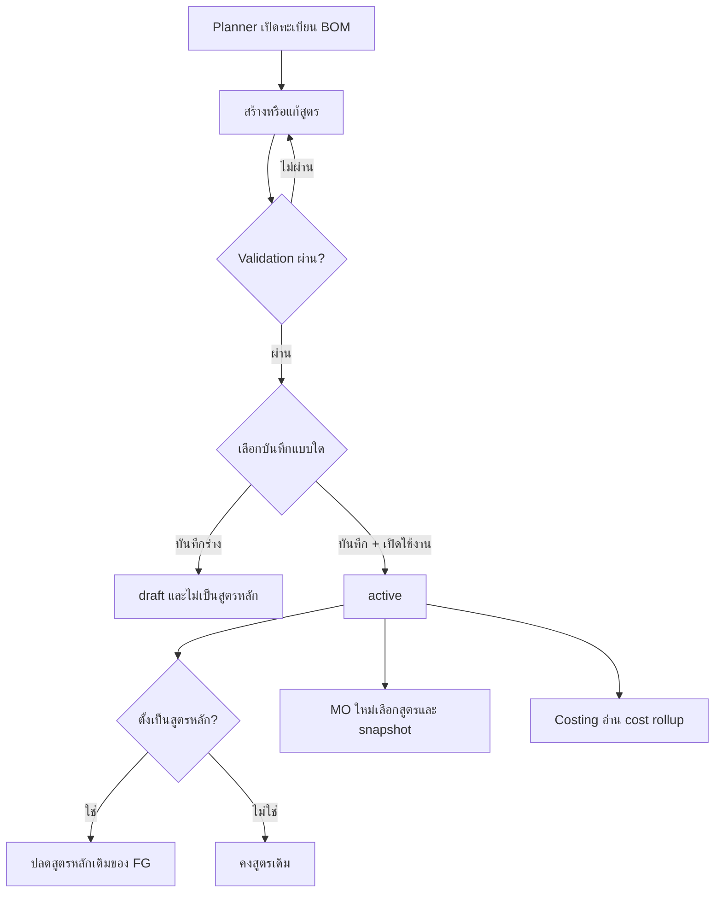
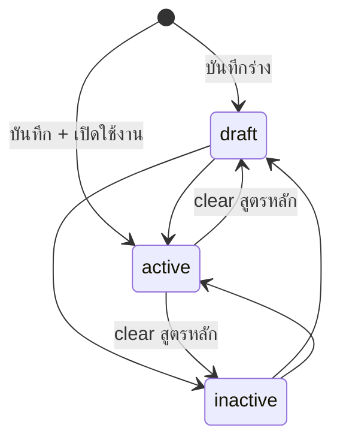

# BRD — สูตรการผลิต (Bill of Materials)

## 1 · Document Info

| Field | Value |
|---|---|
| BRD ID | `BRD-F-BOM-001` |
| Feature ID | `F-BOM-001` |
| Feature Name | สูตรการผลิต (Bill of Materials) |
| BRD Type | New Feature |
| Version | 1.0 |
| Status | AI Reviewed — พร้อม User Gate |
| Module | Product / Manufacturing Foundation |
| Owner | BA — ไม่พบข้อมูลในบทสนทนา |
| Stakeholders | Planner, Production, Costing, Product Master Owner, UoM Master Owner |
| Created / Last Updated | 2026-08-12 |
| Source of truth ด้านหน้าจอ | `outputs/05_BOM/01_HTML/f-bom.html` |

### Input ที่ใช้สร้างเอกสารนี้

1. `Pack Brief Feature/5. BOM/PREBRIEF_F-BOM_Bill-of-Materials.md`
2. `Pack Brief Feature/5. BOM/FUNCTION_CHECKLIST_F-BOM_Bill-of-Materials.md`
3. `outputs/05_BOM/01_HTML/f-bom.html`
4. `outputs/05_BOM/02_QC/_UX_CHECK_REPORT.md`
5. `outputs/05_BOM/02_QC/_COVERAGE_REPORT.md`
6. `outputs/05_BOM/HANDOFF.md`
7. `Central Plan v2/CENTRAL_PLAN_CORE_ERP.md`
8. `Related context/Item Master/FRD/00_OVERVIEW.md`, `02_API.md`, `04_DB.md`
9. `Related context/F-UOM-001/F-UOM-001/FRD_Pack/00_OVERVIEW.md`, `04_DB.md`, `07_LOCKED_DECISIONS.md`

### Changelog

- v1.0 (2026-08-12): สร้าง BRD ด้วย `brd-generator-full` Fresh HTML-first mode; reconcile PREBRIEF, Function Checklist, HTML as-built และสถานะ git จริง
- ยืนยันว่า `_COVERAGE_REPORT.md` เป็น pre-fix report: FN-09 ถูกแก้ใน `renderView()` ของ HTML แล้ว
- บันทึก `HTML-RIF DRIFT-01` (`eff_from`) และ `HTML-RIF DRIFT-02` (`draft + is_default=true`) เพื่อไม่รับรอง drift แบบเงียบ

---

## 2 · Business Context

### 2.1 ปัญหา / โอกาส

องค์กรต้องมีทะเบียนสูตรที่บอกว่า สินค้าสำเร็จรูป 1 หน่วยประกอบจากวัตถุดิบ/วัสดุบรรจุ/วัสดุสิ้นเปลืองอะไร ปริมาณเท่าไร และเผื่อเสียเท่าไร เพื่อให้ Production เลือกสูตรตอนเปิดใบสั่งผลิต (MO) และให้ Costing คำนวณต้นทุนมาตรฐานจากแหล่งเดียวกัน ปัจจุบัน source pack ระบุว่าต้องรองรับหลาย version ต่อสินค้า แต่คงสูตรหลักได้เพียงหนึ่งสูตร และจำกัดเป็น single-level BOM

### 2.2 เป้าหมาย Business

- ให้ Planner สร้าง แก้ไข ค้นหา และเปลี่ยนสถานะสูตรการผลิตได้โดยไม่ผ่าน approval chain
- ทำให้ MO ใหม่เลือกเฉพาะสูตร `active` และเสนอสูตรหลักของ FG เป็นค่าเริ่มต้น
- ทำให้ MO เก่าคงสูตรเดิมด้วย snapshot แม้สูตรต้นทางถูกแก้ภายหลัง (รอ confirm OQ-BOM-01)
- ทำให้ Costing อ่านต้นทุนรวมที่คำนวณจาก `standard_cost`, `qty` และ `scrap%` ได้สม่ำเสมอ
- ป้องกันสูตรซ้ำ วัตถุดิบซ้ำ BOM วน และการลบสูตรที่มี MO อ้างอิง

### 2.3 ตัวชี้วัดความสำเร็จ

| Metric ID | ตัวชี้วัด | Baseline ปัจจุบัน | Target | วัดยังไง/จากไหน | วัดเมื่อไหร่ |
|---|---|---|---|---|---|
| KPI-BOM-01 | สูตร `active` ที่ผิด validation หลัก | ต้องเก็บ baseline ก่อน launch | 0 รายการ | validation/audit report: VR-01..08 | ก่อน go-live และรายวัน 30 วันแรก |
| KPI-BOM-02 | FG ที่มีสูตรหลักมากกว่า 1 สูตร | ต้องเก็บ baseline ก่อน launch | 0 FG | query `is_default=true` group by parent | หลังทุก create/edit/status change และรายวัน |
| KPI-BOM-03 | ผล cost rollup ไม่ตรงสูตร | ต้องเก็บ baseline ก่อน launch | 0 mismatch ใน regression set | compare `Σ(standard_cost×qty×(1+scrap%))` กับผลระบบ | ทุก build และรายวันหลัง sync cost |
| KPI-BOM-04 | การลบสูตรที่ `used>0` สำเร็จผิดกฎ | ต้องเก็บ baseline ก่อน launch | 0 ครั้ง | audit event ของ bulk delete | real-time และรายเดือน |
| KPI-BOM-05 | เวลาเปิดรายการ/ค้นหาสูตร | ต้องเก็บ baseline ก่อน launch | ≤ 2 วินาที p95 `[AI-DEFAULT]` | browser performance/APM | ก่อน go-liveและรายสัปดาห์ |

### 2.4 ที่มาของ Requirement

- PREBRIEF F-BOM และ Function Checklist FN-01..23, FN-30, FN-40
- HTML as-built ผ่าน UX gate และ E2E ตาม handoff
- Contract ขาเข้าจาก Item Master และ UoM Master; ขาออกที่ประกาศไว้คือ MO และ Costing

---

## 3 · Scope

### 3.1 In Scope

- รายการสูตร พร้อม stat filter, search, FG/status filter, sort และ bulk selection
- wizard 2 ขั้นสำหรับสร้าง/แก้สูตรและ line editor ส่วนประกอบ
- หลาย version ต่อ FG โดย `parent + version` ไม่ซ้ำแบบ case-insensitive
- สูตรหลักหนึ่งสูตรต่อ FG และสูตรหลักต้องอยู่สถานะ `active`
- สถานะอิสระ `draft`, `active`, `inactive` โดยไม่มี approval
- ส่วนประกอบเฉพาะ Item Master type `RM`, `PM`, `TR` ที่ active
- UoM ของ line ต้องอยู่หมวดเดียวกับ base UoM ของวัตถุดิบ
- cost rollup จาก `standard_cost` แบบ read-only และจัดชั้นข้อมูลเป็น Confidential
- bulk delete พร้อมข้ามสูตรที่ `used>0`
- audit trail ของ create, activate, amend และ status change
- ประกาศ contract ให้ MO snapshot สูตรตอนเปิดใบ และให้ Costing อ่าน cost rollup

### 3.2 Out of Scope

- multi-level/nested BOM
- approval chain, DOA UI และ notification event
- import/export CSV
- routing, operation, labor, co-product และ by-product
- effective-date overlap resolver
- ปุ่มลบสูตรรายตัว
- การสร้างหน้า MO, Costing, Item Master หรือ UoM Master ภายใน feature นี้
- เอกสารพิมพ์/PDF และ running number จาก Document Configuration

### 3.3 Assumptions

- Item Master ให้ `code`, `name_th`, `cover_url`, `type`, `status`, `standard_cost`, `base_uom`; picker ใช้เฉพาะ `active`
- UoM Master ให้ `code`, `name_th`, `category`, `status`; category มี 6 กลุ่มมาตรฐาน และ `SET` เป็น tenant-added ไม่ใช่ seed
- soft reference เก็บ code เป็น plain text; MO เป็นเจ้าของ snapshot ของสูตรที่เลือก
- `used` ใน HTML เป็น mock; ระบบจริงคำนวณจากจำนวน MO ที่อ้างสูตร
- `eff_from` ที่เห็นใน HTML ยังไม่ถือเป็น backend contract จนกว่า OQ-BOM-06 ได้คำตอบ

### 3.4 Scope Lock

- **Formal `scope_lock_ref`:** ไม่พบข้อมูลในบทสนทนา
- **Working lock source:** PREBRIEF §0 OB-1..8, §2 S-10, Function Checklist FN-40 และ handoff 2026-08-12

| LOCK-ID | Locked decision | Source |
|---|---|---|
| LOCK-BOM-01 | single-level; component รับเฉพาะ RM/PM/TR | BR-05, FN-40 |
| LOCK-BOM-02 | ไม่มี approval/DOA/notification; status เปลี่ยนได้ทุกทิศ | BR-08, OB-3, FN-17 |
| LOCK-BOM-03 | ไม่รองรับ import/export CSV | OB-7, FN-40 |
| LOCK-BOM-04 | 1 สูตรหลักต่อ FG; เมื่อออกจาก `active` ต้อง clear สูตรหลัก | BR-02, OB-3, handoff Gotcha #5 |
| LOCK-BOM-05 | ไม่มี per-record delete; bulk delete ต้อง confirm และข้าม `used>0` | S-08, FN-19, FN-90 |
| LOCK-BOM-06 | HTML downstream source คือ `outputs/05_BOM/01_HTML/f-bom.html` | handoff §1 |
| LOCK-BOM-07 | FN-40 ทั้ง 8 รายการต้องไม่เกิด scope creep | Function Checklist FN-40 |

**Scope drift ที่พบ:** `eff_from` อยู่ใน HTML แต่ไม่อยู่ใน PREBRIEF data dictionary (`HTML-RIF DRIFT-01`); และ HTML ยอมให้ `draft + is_default=true` ได้บาง path (`HTML-RIF DRIFT-02`) ซึ่งขัด LOCK-BOM-04 ทั้งสองรายการถูกยกไป §15

---

## 4 · User Roles & Permissions

### 4.1 Roles

| Role | Responsibility |
|---|---|
| Planner | สร้าง แก้ไข เปิดใช้ ปิดใช้ ตั้งสูตรหลัก และ bulk delete ตาม guard |
| Production | ผู้ใช้ทางอ้อม; อ่านสูตร `active` ตอนเปิด MO และเก็บ snapshot |
| Costing | อ่านต้นทุนรวมและรายละเอียดต้นทุนตามสิทธิ์ Confidential |
| Auditor / Product Owner | อ่านประวัติและรายงานความผิดปกติ |
| System | validate, calculate, enforce status/default/delete guard และบันทึก audit |

### 4.2 Permission Matrix

| Action | Planner | Production | Costing | Auditor | System |
|---|:---:|:---:|:---:|:---:|:---:|
| View/Search BOM | ✅ | ✅ เฉพาะ active ผ่าน MO | ✅ | ✅ | — |
| Create/Edit BOM | ✅ | ❌ | ❌ | ❌ | validate/audit |
| Change status / set default | ✅ | ❌ | ❌ | ❌ | enforce invariant |
| Bulk delete unused BOM | ✅ | ❌ | ❌ | ❌ | confirm + guard |
| View `standard_cost` / rollup | ตาม D-CLASS | ตาม D-CLASS | ✅ | ตาม D-CLASS | mask/log |
| Approve BOM | ❌ | ❌ | ❌ | ❌ | ❌ (BR-08) |

---

## 5 · User Journey (with COSO)

### 5.0 COSO สำหรับ feature นี้

BOM เป็น master/recipe configuration ที่ BR-08 ยืนยันว่าไม่มี approval ดังนั้น Approver เป็น N/A ทุก step; SoD approval check ไม่ถูกเรียกใช้ แต่สิทธิ์เขียนและ audit ต้องแยกจากผู้ใช้อ่านต้นทุน

### 5.1 Happy Path — สร้างสูตรและเปิดใช้ (`S-01`)

| # | Step / UI anchor | Maker | Checker | Approver | System | Result |
|---|---|---|---|---|---|---|
| 1 | `#/bom` → “สร้างสูตรใหม่” | Planner | — | — | เปิด `#/bom/create` | wizard ขั้น “ข้อมูลสูตร” |
| 2 | เลือก “สินค้าผลผลิต (FG)”, version, ชื่อ, ผลผลิต, วันเริ่มมีผล, สูตรหลัก | Planner | — | — | picker กรอง FG active; เติม base UoM | พร้อมไปขั้น 2 |
| 3 | กด “ถัดไป” | Planner | — | — | validate VR-01..03 + duplicate version | เปิด “ส่วนประกอบ” |
| 4 | เพิ่มวัตถุดิบ, qty, UoM, scrap% | Planner | — | — | กรอง RM/PM/TR; reset UoM; rollup cost สด | line พร้อมบันทึก |
| 5 | กด “บันทึก + เปิดใช้งาน” | Planner | — | N/A | validate VR-04..08; clear default เก่า; audit | สูตร `active` |

### 5.2 Alternative — บันทึกร่าง

| # | Step | Maker | Checker | Approver | System | Result |
|---|---|---|---|---|---|---|
| 1 | กรอก wizard ครบและกด “บันทึกร่าง” | Planner | — | N/A | validate เหมือน create | สูตร `draft`; `is_default=false` ตาม LOCK-BOM-04 |

### 5.3 Alternative — ตั้งสูตรหลัก (`S-02`)

| # | Step | Maker | Checker | Approver | System | Result |
|---|---|---|---|---|---|---|
| 1 | เปิด/แก้สูตร `active` และเลือก “ตั้งเป็นสูตรหลัก” | Planner | — | N/A | clear `is_default` ของสูตรอื่น parent เดียวกัน | เหลือสูตรหลัก 1 สูตร/FG |

### 5.4 Alternative — แก้สูตรที่ถูกใช้ (`S-04`)

| # | Step | Maker | Checker | Approver | System | Result |
|---|---|---|---|---|---|---|
| 1 | `#/bom/view/:id` → “แก้ไขสูตร” | Planner | — | N/A | เปิด `#/bom/edit/:id` | แก้ได้ทุก field/line |
| 2 | บันทึก | Planner | — | N/A | MO เก่าไม่ย้อนเปลี่ยน; append audit `[AI-DRAFT]` | MO ใหม่อ่านสูตรล่าสุด |

### 5.5 Alternative — เปลี่ยนสถานะ (`S-07`)

| # | Step | Maker | Checker | Approver | System | Result |
|---|---|---|---|---|---|---|
| 1 | View “เปลี่ยนสถานะ” หรือ bulk bar | Planner | — | N/A | เปลี่ยนได้ทุกทิศ | status ใหม่ถูกบันทึก |
| 2 | target ไม่ใช่ `active` | Planner | — | N/A | clear `is_default` อัตโนมัติ | สูตรไม่เป็น default |

### 5.6 Exception — bulk delete (`S-08`)

| # | Step | Maker | Checker | Approver | System | Result |
|---|---|---|---|---|---|---|
| 1 | เลือกหลายสูตร → “ลบ” | Planner | — | N/A | modal สรุปยอดลบ/ข้าม | รอ confirm |
| 2 | ยืนยัน | Planner | — | N/A | ลบเฉพาะ `used=0`; ข้าม `used>0` | toast แสดงผลรวม |

### 5.7 Exception — validation fail (`S-05`)

| # | Step | Maker | Checker | Approver | System | Result |
|---|---|---|---|---|---|---|
| 1 | ส่งข้อมูลผิด VR-01..08 | Planner | — | N/A | block และแสดง microcopy จาก HTML | อยู่หน้าเดิมเพื่อแก้ไข |

### 5.8 Process Diagram



---

## 6 · Data Entity & Fields

### 6.1 Entity Overview

| Entity | Type | Purpose |
|---|---|---|
| `BOM_Header` | Master header | สูตรต่อ FG/version, status และสูตรหลัก |
| `BOM_Line` | Master detail | ส่วนประกอบ ปริมาณ UoM scrap และ cost input reference |
| `BOM_Audit_Log` | Append-only log | before/after และ event create/amend/status/delete |

### 6.2 `BOM_Header`

| # | Field | Label/UI | Input Type | Required | Rule / Classification |
|---|---|---|---|:---:|---|
| 1 | `bom_id` | internal id | AUTO | ✅ | immutable PK |
| 2 | `code` | รหัสสูตร | AUTO | ✅ | unique; รูปแบบจริงรอ technical design |
| 3 | `parent_code` | สินค้าผลผลิต (FG) | LOOKUP | ✅ | Item Master FG + active; soft-ref plain text |
| 4 | `version` | เวอร์ชันสูตร | TEXT | ✅ | unique case-insensitive ต่อ `parent_code` |
| 5 | `name` | ชื่อสูตร | TEXT | ✅ | non-empty |
| 6 | `out_qty` | ผลผลิตต่อสูตร | NUMBER | ✅ | default 1; ต้อง >0 |
| 7 | `out_uom_code` | หน่วยผลผลิต | AUTO/LOOKUP | ✅ | snapshot base UoM ของ FG |
| 8 | `is_default` | ตั้งเป็นสูตรหลัก | TOGGLE | ✅ | true ได้เฉพาะ `active`; 1 ต่อ FG |
| 9 | `status` | สถานะ | DROPDOWN-SINGLE | ✅ | `draft`, `active`, `inactive` |
| 10 | `eff_from` | เริ่มมีผล (effective) | DATE | ❌ | `HTML-RIF DRIFT-01`; provisional จน OQ-BOM-06 ปิด |
| 11 | `used` | จำนวน MO อ้างสูตร | AUTO | ✅ | derived count ไม่ให้ user แก้ |
| 12 | `approver_role` | — | AUTO | ❌ | always null compatibility placeholder |
| 13 | `approved_by` | — | AUTO | ❌ | always null compatibility placeholder |
| 14 | `approved_at` | — | AUTO | ❌ | always null compatibility placeholder |
| 15 | `approval_chain` | — | AUTO | ❌ | always null compatibility placeholder |
| 16 | `version_no` | optimistic lock | AUTO | ✅ | `[AI-DEFAULT]` ป้องกัน concurrent overwrite |
| 17 | `created_by` | ผู้สร้าง | AUTO | ✅ | audit |
| 18 | `created_date` | วันที่สร้าง | AUTO | ✅ | audit |
| 19 | `modified_by` | ผู้แก้ล่าสุด | AUTO | ✅ | audit |
| 20 | `modified_date` | วันที่แก้ล่าสุด | AUTO | ✅ | audit |

### 6.3 `BOM_Line`

| # | Field | Label/UI | Input Type | Required | Rule / Classification |
|---|---|---|---|:---:|---|
| 1 | `bom_line_id` | internal id | AUTO | ✅ | PK |
| 2 | `bom_id` | — | AUTO | ✅ | FK `BOM_Header` |
| 3 | `line_no` | # | AUTO | ✅ | unique ต่อ BOM |
| 4 | `component_code` | วัตถุดิบ / ส่วนประกอบ | LOOKUP | ✅ | Item type RM/PM/TR + active; unique ต่อ BOM |
| 5 | `qty` | ปริมาณ | NUMBER | ✅ | >0 |
| 6 | `uom_code` | หน่วย | LOOKUP | ✅ | category เดียวกับ component base UoM |
| 7 | `scrap_pct` | เผื่อเสีย% | NUMBER | ✅ | HTML รับ 0..100; policy warn/block รอ OQ-BOM-04 |
| 8 | `component_standard_cost_snapshot` | ต้นทุน/หน่วย | AUTO | ✅ | อ่านจาก Product Master; Confidential; strategy snapshot/current รอ FRD |
| 9 | `line_cost` | รวม | AUTO | ✅ | `standard_cost×qty×(1+scrap_pct/100)` |
| 10-13 | `created_by`, `created_date`, `modified_by`, `modified_date` | — | AUTO | ✅ | audit fields |

### 6.4 `BOM_Audit_Log`

| Field | Rule |
|---|---|
| `audit_id`, `bom_id`, `action`, `old_value`, `new_value`, `changed_by`, `changed_at`, `source` | append-only; `action` ครอบ create/amend/activate/status/delete/default-change |

### 6.5 Entity Relationship

```text
Item_Master (1) ──< BOM_Header.parent_code
BOM_Header (1) ──< BOM_Line.bom_id
Item_Master (1) ──< BOM_Line.component_code
UoM_Master  (1) ──< BOM_Line.uom_code
BOM_Header (1) ──< BOM_Audit_Log.bom_id
BOM_Header (1) ──< MO.bom_id  [downstream; MO owns recipe snapshot]
```

---

## 7 · User Stories & Acceptance Criteria

### S-01 — สร้างสูตรการผลิต
**As a** Planner  
**I want to** สร้างสูตรผ่าน wizard 2 ขั้น  
**So that** Production เลือกสูตรที่ถูกต้องได้

- AC1: Given อยู่ `#/bom`, When กด “สร้างสูตรใหม่”, Then เปิด `#/bom/create` ที่ขั้น “ข้อมูลสูตร”
- AC2: Given กรอกข้อมูลครบ, When กด “บันทึก + เปิดใช้งาน”, Then ได้สูตร `active` พร้อม lines และ audit

### S-02 — ตั้งสูตรหลัก
**As a** Planner  
**I want to** เลือกสูตรหลักของ FG  
**So that** MO เสนอสูตรที่ควรใช้เป็นค่าเริ่มต้น

- AC1: Given FG มีสูตรหลักเดิม, When ตั้งสูตร `active` อื่นเป็นหลัก, Then สูตรเดิมถูก clear อัตโนมัติ
- AC2: Given สูตรหลักเปลี่ยนเป็น `draft` หรือ `inactive`, When transition สำเร็จ, Then `is_default=false`

### S-03 — เปรียบเทียบ version
**As a** Planner  
**I want to** เห็น version อื่นของ FG  
**So that** เปิดเปรียบเทียบสูตรได้

- AC1: Given FG มีหลายสูตร, When เปิดแท็บ “ภาพรวม”, Then เห็น “เวอร์ชันอื่นของสินค้านี้” พร้อมสูตรหลักและสถานะ
- AC2: Given คลิก version อื่น, When route เปลี่ยน, Then เปิด `#/bom/view/:id` ของสูตรนั้น

### S-04 — แก้สูตรที่ถูกใช้
**As a** Planner  
**I want to** แก้สูตรแม้มี MO อ้าง  
**So that** MO ใหม่ใช้สูตรล่าสุดโดย MO เก่าไม่ย้อนเปลี่ยน

- AC1: Given `used>0`, When กด “แก้ไขสูตร”, Then ระบบไม่ block การแก้ `[AI-DRAFT]`
- AC2: Given MO เก่ามี snapshot, When BOM ถูกแก้, Then snapshot ของ MO เก่าไม่เปลี่ยน `[AI-DRAFT]`

### S-05 — ป้องกันข้อมูลผิด
**As a** Planner  
**I want to** ได้ข้อความบอกจุดผิด  
**So that** แก้ข้อมูลก่อนบันทึกได้

- AC1: Given required field ว่าง, When ไปต่อหรือบันทึก, Then block ด้วย microcopy จาก HTML
- AC2: Given component ซ้ำหรือเท่ากับ parent, When บันทึก, Then block และไม่สร้าง record

### S-06 — เปลี่ยนวัตถุดิบ
**As a** Planner  
**I want to** ให้ UoM reset ตามวัตถุดิบใหม่  
**So that** ไม่เลือกหน่วยข้ามหมวด

- AC1: Given line มี component เดิม, When เลือก component ใหม่, Then `uom_code` reset เป็น base UoM ของ component ใหม่
- AC2: Given dropdown UoM เปิด, When แสดงตัวเลือก, Thenมีเฉพาะหมวดเดียวกับ base UoM

### S-07 — เปลี่ยนสถานะ
**As a** Planner  
**I want to** เปลี่ยนสถานะโดยไม่มี approval  
**So that** ควบคุมการให้ MO เลือกสูตรได้ทันที

- AC1: Given สูตรใด ๆ, When เลือกสถานะอื่นจาก status menu/bulk, Then transition ทำได้ทุกทิศ
- AC2: Given target ไม่ใช่ `active`, When transition สำเร็จ, Thenสูตรหลักถูก clear

### S-08 — ลบสูตรที่ไม่ถูกใช้
**As a** Planner  
**I want to** bulk delete สูตรที่ไม่มี MO อ้าง  
**So that** เก็บทะเบียนให้สะอาดโดยไม่ทำลาย reference

- AC1: Given selection ผสม `used=0` และ `used>0`, When confirm, Thenลบเฉพาะ `used=0`
- AC2: Givenทุกสูตร `used>0`, When modal เปิด, Thenปุ่มลบ disabled

---

## 8 · Status & Lifecycle

### 8.1 State Diagram



### 8.2 Transition Table

| Current | Trigger | Next | Role | Side effect |
|---|---|---|---|---|
| create | บันทึกร่าง | `draft` | Planner | `is_default=false` |
| create | บันทึก + เปิดใช้งาน | `active` | Planner | ถ้าตั้งหลักให้ clear สูตรหลักเดิม |
| `draft` | status menu/bulk | `active`/`inactive` | Planner | target inactive clear default |
| `active` | status menu/bulk | `draft`/`inactive` | Planner | clear default |
| `inactive` | status menu/bulk | `draft`/`active` | Planner | default ยังคง false จนเลือกใหม่ |

---

## 9 · Business Rules + Validation

### 9.1 Business Rules

| Rule ID | Rule | Tag | Type | Source / rationale |
|---|---|:---:|---|---|
| BR-01 | 1 FG มีหลายสูตรได้ แต่ `parent + version` ต้อง unique case-insensitive | FIXED | uniqueness | PREBRIEF BR-01/VR-02 |
| BR-02 | 1 FG มีสูตรหลักได้ 1 สูตร และสูตรหลักต้อง `active` | FIXED | invariant | PREBRIEF BR-02 + LOCK-BOM-04 |
| BR-03 | parent ต้องเป็น Item type FG และ active | FIXED | lookup gate | PREBRIEF BR-03 |
| BR-04 | component ต้อง active และ type RM/PM/TR | FIXED | lookup gate | PREBRIEF BR-04 |
| BR-05 | single-level; component ห้ามเป็น parent และห้ามเป็น FG | FIXED | structure | LOCK-BOM-01 |
| BR-06 | UoM line ต้องอยู่ category เดียวกับ base UoM ของ component | FIXED | master contract | PREBRIEF BR-06/VR-08 |
| BR-07 | cost = `Σ(standard_cost×qty×(1+scrap_pct/100))` | FIXED | calculation | PREBRIEF BR-07; formula confirmed |
| BR-08 | ไม่มี approval; status เปลี่ยนได้ทุกทิศ | FIXED | workflow | LOCK-BOM-02 |
| BR-09 | `standard_cost` read-only จาก Item Master และเป็น Confidential | FIXED | data classification | PREBRIEF BR-09 |
| BR-10 | status มี 3 ค่า `draft/active/inactive` | FIXED | enum | OB-3 |
| BR-11 | `used>0` ลบไม่ได้; bulk ต้องข้าม | WARNING | delete guard | OQ-BOM-01 ยังเป็น `[AI-DRAFT]` |
| BR-12 | แก้ lines ของ `used>0` ได้เพราะ MO snapshot | WARNING | downstream snapshot | OQ-BOM-01 ยังเป็น `[AI-DRAFT]` |
| BR-13 | ไม่รองรับ import/export CSV | FIXED | scope | LOCK-BOM-03 |
| BR-14 | `scrap_pct` UI รับ 0..100; behavior ที่ 100% ยังปล่อยผ่าน | WARNING | threshold | OQ-BOM-04 |
| BR-15 | Item/UoM ที่ deactivate หลังสูตร active ยังไม่ invalidate สูตรเดิม | WARNING | master drift | OQ-BOM-04 |

### 9.2 Validation Rules และ microcopy anchor

| VR ID | Field/Action | Condition | Type | ข้อความจาก HTML |
|---|---|---|---|---|
| VR-01 | `parent_code` | ว่าง | Error | `เลือกสินค้าผลผลิตก่อน` |
| VR-02a | `version` | ว่าง | Error | `ระบุเวอร์ชันสูตร (เช่น v1)` |
| VR-02b | `parent_code+version` | ซ้ำ case-insensitive | Error | `เวอร์ชัน {version} ของสินค้านี้มีอยู่แล้ว` |
| VR-03 | `name` | ว่าง | Error | `ระบุชื่อสูตร` |
| VR-04 | `lines` | ไม่มี line | Error | `ต้องมีส่วนประกอบอย่างน้อย 1 รายการ` |
| VR-05 | `qty` | ≤0 | Error | `ปริมาณของ {item} ต้องมากกว่า 0` |
| VR-06 | `component_code` | ซ้ำใน BOM | Error | `วัตถุดิบ {item} ซ้ำ — รวมเป็นรายการเดียว` |
| VR-07 | `component_code` | เท่ากับ parent | Error | `ส่วนประกอบห้ามเป็นตัวสินค้าเอง ({item}) — กัน BOM วน` |
| VR-08 | `uom_code` | category ต่างจาก base UoM | Prevent | dropdown ไม่เสนอค่าข้าม category |

### 9.3 Decision Points

**DP-01: ลบสูตร** — trigger เมื่อ confirm bulk delete; Planner เป็นผู้สั่ง; System ตรวจ `used`; `used=0` ลบ, `used>0` ข้าม; audit ต้องบันทึก selection/result

**DP-02: ตั้งสูตรหลัก** — trigger เมื่อบันทึกสูตร `active` ที่เลือก default; System clear สูตรหลักเดิมของ parent; ไม่มี Approver; audit บันทึก old/new default

**DP-03: เลือกสูตรเข้า MO** — trigger ตอนเปิด MO; Production เลือกเฉพาะ `active`; default คือสูตรหลัก; MO เก็บ snapshot `[AI-DRAFT]`

### 9.5 Flexibility Attribution

| Rule | Tag | ระดับ | ผู้เปลี่ยน/ความถี่ | Attribution | Action |
|---|:---:|---|---|:---:|---|
| BR-01..10, BR-13 | FIXED | code + master contract | เปลี่ยนด้วย approved enhancement | ✅ | Phase 1 |
| BR-11, BR-12 | WARNING | รอ stakeholder | Strike/PM · ภายใน 2026-08-19 `[AI-DEFAULT]` | 🤖 | OQ-BOM-01 |
| BR-14, BR-15 | WARNING | รอ stakeholder | Strike/PM · ภายใน 2026-08-19 `[AI-DEFAULT]` | 🤖 | OQ-BOM-04 |
| KPI-BOM-05 threshold | CONFIGURABLE | Config File | IT/Dev · นาน ๆ ครั้ง | 🤖 | OQ-BOM-08; monitor only |

### Tag Review

- BR-07 คง `FIXED`: แม้เป็นสูตรคำนวณ แต่ PREBRIEF ยืนยันสูตรเดียวและไม่มี requirement ให้ business เปลี่ยน logic
- WARNING ทุกข้อมี owner, target date `[AI-DEFAULT]` และ OQ ใน §15

---

## 10 · Edge Cases

### 10.1 BA/Source-confirmed (☑)

| ID | Case | Expected | Trace |
|---|---|---|---|
| ☑ EC-01 | ตั้งสูตรหลักใหม่ | clear สูตรหลักเดิม | BR-02 |
| ☑ EC-02 | version ซ้ำต่อ FG | block | BR-01, VR-02b |
| ☑ EC-03 | component ซ้ำ | block | VR-06 |
| ☑ EC-04 | component=parent | block | BR-05, VR-07 |
| ☑ EC-05 | เปลี่ยน component | reset UoM และกรอง category ใหม่ | BR-06, VR-08 |
| ☑ EC-06 | ออกจาก active | clear สูตรหลัก | BR-02, BR-10 |
| ☑ EC-07 | bulk delete มี `used>0` | ข้ามและรายงานยอด | BR-11 |
| ☑ EC-08 | `standard_cost=0/null` | ปัจจุบันปล่อยผ่าน; รอ block/warn | BR-09, OQ-BOM-04 |
| ☑ EC-09 | `scrap_pct=100` | cost ×2; ปัจจุบันปล่อยผ่าน | BR-07, BR-14 |
| ☑ EC-10 | Item deactivate หลังสูตร active | สูตรเดิมยัง valid; รอ policy | BR-15 |

### 10.2 AI pattern matching (☐ รอ BA ยืนยันที่ SOW3.7)

| ID | Category | Case | Suggested behavior | Trace |
|---|---|---|---|---|
| ☐ EC-AI-01 | CA | Planner 2 คนแก้ BOM เดียวกัน | optimistic lock + conflict message | BR-01..15 |
| ☐ EC-AI-02 | CA | bulk status ระหว่างอีกคนแก้ | atomic per record + result ledger | BR-10 |
| ☐ EC-AI-03 | DI | Item Master เปลี่ยนชื่อ/รูป | ใช้ current display แต่เก็บ code เดิม | BR-03/04 |
| ☐ EC-AI-04 | DI | UoM ถูก deactivate | ห้ามเลือกใหม่; existing line ต้องมี policy | BR-06, BR-15 |
| ☐ EC-AI-05 | CL | qty/scrap ทำให้ overflow | reject ด้วย meaningful error | BR-07 |
| ☐ EC-AI-06 | CL | floating-point rounding mismatch | decimal arithmetic + rounding strategy เดียว | BR-07 |
| ☐ EC-AI-07 | ST | draft ถูกตั้ง default ผ่าน create/edit | backend clear default ก่อน commit | BR-02; HTML-RIF DRIFT-02 |
| ☐ EC-AI-08 | PM | user ไม่มีสิทธิ์เห็น cost | mask cost ทั้ง list/view/API/export | BR-09 |
| ☐ EC-AI-09 | PM | bulk selection มี record ไม่มีสิทธิ์ | skip per record + audit | §4 |

---

## 11 · Impact / Regression Scope

New Feature จึงไม่มี schema เดิมให้ migrate แต่มี seam ที่ต้อง regression:

| Existing seam | สิ่งที่ต้องทดสอบ | Risk |
|---|---|---|
| Item Master picker | active/type filter, `name_th`, `cover_url`, `standard_cost`, `base_uom` | contract drift |
| UoM Master | 6 category mapping; `SET` tenant-added | wrong UoM filtering |
| Product data classification | cost mask by role | Confidential leak |
| Shared shell/route | `#/bom*`, Esc chain, scroll restore | navigation regression |
| Future MO | active/default selection + immutable snapshot | existing MO retroactive change |

---

## 12 · System Context & Cross-Module Impact

### 12.1 Value Stream & Downstream Impact

**Positioning:** Foundation → Product → Bill of Materials; อยู่หลัง Item/UoM master และก่อน Production planning/execution กับ Costing

```text
UoM Master ─┐
            ├─> Item Master ─> [BOM] ─> Production Order (MO) ─> Material Issue/Production
Item Cost ──┘                    └─────> Costing / Standard Cost Review
```

**Upstream**

| Source | Data/trigger | ถ้าข้อมูลผิด/ไม่มี |
|---|---|---|
| Item Master `F-PDM` | FG/component active, type, `name_th`, `cover_url`, `standard_cost`, `base_uom` | picker ไม่ควรเสนอ; สูตร existing ใช้ policy OQ-BOM-04 |
| UoM Master `F-UOM-001` | UoM code/name/category/status | line เลือกหน่วยไม่ได้หรือ category mismatch |
| Policy Center D-CLASS | สิทธิ์ดู Confidential cost | ต้อง mask และ audit access |

**Downstream Impact Map**

| Destination | ข้อมูลที่ไหลไป | Trigger | ถ้า BOM แก้/ยกเลิกกลางทาง |
|---|---|---|---|
| Production / MO | `bom_id`, parent, version, lines, qty, uom, scrap | เปิด MO และเลือก BOM active | MO เดิมใช้ snapshot; MO ใหม่ re-read สูตรล่าสุด `[AI-DRAFT]` |
| Costing | line cost และ total rollup | save/activate/amend หรือ standard cost refresh | ต้อง recalc และบันทึก timestamp/source cost |
| Audit/Compliance | create/amend/status/default/delete events | ทุก mutation | log append-only; ห้ามลบตาม BOM |
| Product planning report | จำนวนสูตร/สถานะ/default ต่อ FG | query/report | สูตร inactive ไม่เป็น default และไม่เสนอให้ MO ใหม่ |

**ผลกระทบแนวขวาง:** Inventory ยังไม่เกิด posting ที่ BOM; GL/งบไม่มีผลโดยตรง; รายงานต้องเคารพ cost classification; ไม่มี notification hook ใน scope

### 12.2 Dependencies

- Item Master / Product Master (`F-PDM`)
- UoM Master (`F-UOM-001`)
- Authorization + Policy Center D-CLASS
- Audit Log service
- Production/MO และ Costing เป็น downstream declared-unbuilt

### 12.3 Existing System Reference

| Rule | ระดับ | มีอยู่แล้ว? | Reference |
|---|---|:---:|---|
| BR-03/04/09 | shared master contract | ✅ | `Related context/Item Master/FRD/02_API.md` |
| BR-06 | shared master contract | ✅ | `Related context/F-UOM-001/.../FRD_Pack/04_DB.md` |
| BR-09 | Policy Center D-CLASS | ⚠️ ต้อง wire | PREBRIEF §9; registry detail ไม่พบข้อมูลในบทสนทนา |
| Audit | shared service | ⚠️ ต้อง confirm | System Module Registry ไม่พบข้อมูลในบทสนทนา |
| KPI-BOM-05 | Config File | ❌/ไม่ทราบ | `[AI-DEFAULT]` monitoring threshold |

---

## 13 · Delivery Phases

### Phase 1 — Feature Launch

- `BOM_Header`, `BOM_Line`, audit log, indexes และ optimistic locking
- list/search/filter/sort, wizard, line editor, status menu, bulk actions
- enforce BR-01..15 และ VR-01..08 ฝั่ง server; ห้ามอาศัย HTML validation อย่างเดียว
- wire Item Master, UoM Master, Policy D-CLASS และ audit
- แก้/ปิด `HTML-RIF DRIFT-02` ให้ create/edit draft ไม่คงสูตรหลัก

### Phase 2 — Admin / Operations Configuration

- ไม่มี Admin Panel ใหม่ใน scope
- หาก OQ-BOM-04 ตัดสินให้ threshold/warning ปรับได้ ให้ทำ config ใน change request แยก

### Phase 3 — Rule Management

- ไม่มีใน scope; BR-07 เป็น FIXED

### Phase 4 — Engine Management

- ไม่มีใน scope; multi-level/routing/approval engine ถูก lock ออก

---

## 14 · Dev Requirements Summary “ใบสั่ง”

### 14.1 Config/Foundation

| Item | Required structure | Supports | Existing? |
|---|---|---|:---:|
| BOM persistence | header/detail + version + audit | BR-01..15 | ❌ |
| Item Master adapter | active/type gate + cost/name/image/UoM | BR-03/04/09 | ✅ contract; ต้อง wire |
| UoM adapter | category/status lookup | BR-06 | ✅ contract; ต้อง wire |
| D-CLASS guard | mask Confidential `standard_cost`/rollup | BR-09 | ⚠️ confirm module reference |
| Audit service | append-only mutation log | security controls | ⚠️ confirm registry |

### 14.2 ข้อกำหนดจาก Tag

- FIXED rules ต้อง enforce ใน service/database transaction และมี test trace
- WARNING BR-11/12/14/15 ต้องปิด OQ ก่อน freeze FRD; ระหว่างนี้ prototype behavior เป็น pass-through ตาม FN-30
- KPI-BOM-05 เป็น `[AI-DEFAULT]`; ห้าม hardcodeเป็น business ruleจน stakeholder confirm

### 14.3 Edge/Validation ที่ต้อง handle

- unique index แบบ normalized `parent_code + lower(version)`
- transaction เดียวสำหรับ set default เพื่อไม่เกิดสองสูตรหลัก
- decimal arithmetic/rounding สำหรับ cost; ห้าม float drift ใน backend
- optimistic locking สำหรับ concurrent edit
- bulk result ledger แยก success/skip/fail
- API authorization และ cost masking ต้องทำแม้ UI ซ่อนแล้ว

### 14.4 WARNING / Drift Ledger

| Ref | Topic | Owner | Target | Status |
|---|---|---|---|---|
| OQ-BOM-01 | MO snapshot + edit/delete guard | Strike/PM | 2026-08-19 `[AI-DEFAULT]` | รอ confirm |
| OQ-BOM-03 | Item field mapping `cover_url`/active contracts | Product Owner | 2026-08-19 `[AI-DEFAULT]` | contract พบแล้ว; รอ owner confirm |
| OQ-BOM-04 | zero/null cost, scrap 100, master deactivate | Strike/PM | 2026-08-19 `[AI-DEFAULT]` | รอ policy |
| DRIFT-01 | `eff_from` เกิน PREBRIEF data dictionary | BA | 2026-08-19 `[AI-DEFAULT]` | รอ scope decision |
| DRIFT-02 | HTML มี path/seed `draft + is_default=true` | BA/Dev | ก่อน FRD freeze | ต้องแก้หรือบันทึก exception |

### 14.5 Regression Scope

ใช้รายการใน §11 และ rerun `outputs/05_BOM/02_QC/e2e_bom.py` หาก HTML ถูกแก้

### 14.6 Screen Inventory + UI Signals

| # | Screen/Route | ประเภทหยาบ | ผู้ใช้หลัก | หน้าที่ | Evidence |
|---|---|---|---|---|---|
| P-01 | `#/bom` | หน้ารายการ | Planner, Auditor | ค้นหา/กรอง/sort/bulk/open detail | default hash route |
| P-02 | `#/bom/create` | ฟอร์มสร้างหลายขั้น | Planner | สร้าง draft/active | `syncHash()` → `openForm('create')` |
| P-03 | `#/bom/edit/:id` | ฟอร์มแก้ไขหลายขั้น | Planner | แก้ header/lines | `syncHash()` → `openForm('edit')` |
| P-04 | `#/bom/view/:id` | หน้ารายละเอียด | Planner, Costing, Auditor | overview/components/history/status | `syncHash()` → `openView()` |

**รวม 4 route states:** รายการ 1, สร้าง 1, แก้ไข 1, รายละเอียด 1

**UI Signals:** structured master-detail; ไม่มี approval/print/PDF; ไม่มี NON-STANDARD flag; cost เป็น Confidential; source HTML ใช้ drawer/modal/portal แต่ layout authority อยู่ที่ FRD

---

## 15 · Open Questions

| ID | คำถาม | Owner | Target | Status / Default |
|---|---|---|---|---|
| OQ-BOM-01 | ยืนยันว่า `used>0` แก้ lines ได้และ MO เก่าใช้ immutable snapshot จริงหรือไม่ | Strike/PM | 2026-08-19 `[AI-DEFAULT]` | รอ; ปัจจุบัน prototype อนุญาต |
| OQ-BOM-02 | ยืนยัน lock ไม่ทำ import/export ต่อไป | PM/BA | User gate Step 5 | มติปัจจุบัน: ไม่รองรับ |
| OQ-BOM-03 | ยืนยัน Item fields `cover_url`, `name_th`, `standard_cost`, `base_uom` และ active-only picker | Product Owner | 2026-08-19 `[AI-DEFAULT]` | contract พบใน Related context |
| OQ-BOM-04 | cost 0/null, scrap 100%, master deactivate ควร block, warn หรือ pass-through | Strike/PM | 2026-08-19 `[AI-DEFAULT]` | ปัจจุบัน pass-through |
| OQ-BOM-05 | ยืนยัน regenerate FRD จาก HTML as-built | BA | หลัง approve BRD | เปิด |
| OQ-BOM-06 | `eff_from` เป็น business field ใน scope หรือ residual จาก HTML เก่า | BA | User gate Step 5 | `HTML-RIF DRIFT-01`; provisional |
| OQ-BOM-07 | formal `scope_lock_ref`/ใบเซ็นคือเอกสารใด | PM | ก่อน FRD freeze | ไม่พบข้อมูลในบทสนทนา |
| OQ-BOM-08 | ยืนยัน target p95 ≤2 วินาที และ load profile §17.5 | Tech Lead/Product Owner | ก่อน performance test | `[AI-DEFAULT]` |

---

## 16 · Security & Compliance

### 16.1 Security Preset

**Preset:** P3 — Master Data (10 controls)  
**เหตุผล:** BOM เป็น recipe master ที่ถูกแก้ไขได้และส่งผลต่อ Production/Costing; `standard_cost` เป็น Confidential  
**Override:** เพิ่ม server-side schema validation `S14-02` เป็น optional hardening เพราะมี API mutation

### 16.2 Applicable Standards (14)

| Standard | Applicable | Reason |
|---|:---:|---|
| COSO | ✅ | SoD conflict + immutable master log |
| ISO/IEC 27001 | ✅ | access, classification, masking |
| NIST CSF 2.0 | ✅ | policy versioning/anomaly response |
| COBIT 2019 | ✅ | master mapping/change governance |
| CIS Controls v8 | ✅ | platform baseline; feature reuses shared controls |
| NIST SP 800-53 | ✅ | standardized audit/input controls |
| ISO/IEC 27701 | ❌ | BOM ไม่มี PII business field |
| NIST Privacy Framework | ❌ | ไม่มี personal data flow |
| IEC 62443 | ❌ | ไม่มี direct OT connection ใน scope |
| NIST SP 800-82 | ❌ | ไม่มี machine control/polling ใน scope |
| SOC 2 | ✅ | evidence, ticket, audit trace |
| ISO 22301 | ✅ | BOM เป็น upstream ของ production; backup/fallback เป็น shared platform |
| NIST AI RMF | ❌ | ไม่มี AI/auto-decision |
| OWASP API Security | ✅ | API payload/auth ต้อง validate |

### 16.3 P3 Control Checklist

| Control | Required | Implementation Notes |
|---|:---:|---|
| S01-04 SoD Conflict Matrix | ✓ Must | แยก write/master admin กับ cost audit access |
| S01-07 Immutable Master Data Log | ✓ Must | before/after ทุก header/line/status/default/delete |
| S02-01 Password Policy | ✓ Shared | reuse identity platform |
| S02-04 Data Masking/Obfuscation | ✓ Must | mask `standard_cost`/rollup ตาม D-CLASS |
| S02-05 Data Classification Tags | ✓ Must | `standard_cost`, line/total cost = Confidential |
| S03-02 Policy Versioning | ✓ Must | version business rule/status/default contracts |
| S04-05 Standard Master Data Mapping | ✓ Must | field mapping Item/UoM ตาม contract |
| S06-03 Standardized Audit Content | ✓ Must | Who, What, When, Where, Result |
| S07-06 PII Tagging & Masking | ○ N/A for BOM data | retain preset check; no PII field expected |
| S11-02 Ticket Enforcement | ✓ Must | production add/edit/delete config changesผูก ticket/change ref |
| S14-02 Payload Schema Validation | ○ Added hardening | validate server-side VR-01..08 |

### 16.4 Risk Statement

| Risk ID | Risk | Likelihood | Impact | Controls |
|---|---|---|---|---|
| SEC-R01 | ผู้ไม่มีสิทธิ์เห็นต้นทุน | Medium | High | S02-04, S02-05, S06-03 |
| SEC-R02 | สูตรถูกแก้โดยไม่มี trace | Medium | High | S01-07, S06-03, S11-02 |
| SEC-R03 | สองสูตรหลักเกิดจาก race | Medium | High | S03-02, S14-02 + DB transaction |
| SEC-R04 | payload ข้าม UI validation | Medium | High | S14-02, S04-05 |

---

## 17 · Health Check

### 17.1 SLA

| SLA ID | Step | Target | Owner | Action when breached |
|---|---|---|---|---|
| SLA-BOM-01 | save/activate/status mutation | ≤2 วินาที p95 `[AI-DEFAULT]` | Tech Lead | alert + inspect DB/master dependency |
| SLA-BOM-02 | Item/UoM lookup | ≤2 วินาที p95 `[AI-DEFAULT]` | Platform Owner | fallback error; ห้ามใช้ stale invalid item |
| SLA-BOM-03 | cost rollup response | ≤1 วินาที p95 `[AI-DEFAULT]` | Costing Owner | alert if mismatch/timeout |

### 17.2 Control Points

| Control | Where | When | Result |
|---|---|---|---|
| S01-04 | API authorization | pre-action | block role conflict/unauthorized mutation |
| S01-07 | BOM mutation transaction | post-commit | immutable before/after event |
| S02-04/S02-05 | list/view/API response | every read | cost shown or maskedตาม role |
| S03-02 | rule/config release | deployment | version + rollback reference |
| S04-05 | Item/UoM adapter | every lookup | normalized mapping/active gate |
| S06-03 | create/edit/status/delete | every action | complete audit content |
| S11-02 | privileged mutation | pre-action | change/ticket reference present |
| S14-02 | API boundary | pre-write | VR-01..08 enforced |

### 17.3 KPI

| KPI | Category | Target | Measure |
|---|---|---|---|
| KPI-BOM-01 invalid active BOM | Quality | 0 | validation/audit query |
| KPI-BOM-02 duplicate default FG | Compliance | 0 | invariant query |
| KPI-BOM-03 cost mismatch | Quality | 0 | recalculation reconciliation |
| KPI-BOM-04 illegal used delete | Compliance | 0 | delete audit |
| KPI-BOM-05 list/search p95 | Speed | ≤2s `[AI-DEFAULT]` | APM/browser timing |

### 17.4 Threshold

| Metric | Green | Yellow | Red | Action |
|---|---|---|---|---|
| invalid active BOM | 0 | — | ≥1 | block activation + alert owner |
| duplicate default FG | 0 | — | ≥1 | auto-repair disabled; incident review |
| cost mismatch | 0 | 1 transient | ≥1 persisted | stop downstream cost publish |
| illegal used delete | 0 | — | ≥1 | security/data incident |
| list/search p95 | ≤2s | >2–4s | >4s | performance investigation |

### 17.5 Throughput

- Baseline: ต้องเก็บก่อน launch
- Designed capacity: 10,000 BOM headers, 100 lines/BOM, 50 concurrent users `[AI-DEFAULT]`
- Stress point: 100,000 headers หรือ 200 concurrent users `[AI-DEFAULT]`
- OQ-BOM-08 ต้อง confirm ก่อนใช้เป็น non-functional acceptance gate

---

## 18 · Monitoring

> Monitoring ใช้ shared observability/reporting; ไม่เพิ่มหน้าจอ BOM ใหม่โดยอัตโนมัติ

### 18.1 Reports Overview

| Report | Type | Frequency | Audience | Covers |
|---|---|---|---|---|
| BOM Health | Performance | Daily | Planner/Tech Lead | SLA-BOM-01..03, KPI-BOM-05 |
| BOM Master Closing | Closing | Monthly | Product Owner | count by status/default/FG |
| BOM Anomaly | Anomaly | Real-time/Daily | Auditor/Costing | KPI-BOM-01..04, thresholds |
| BOM Transaction Audit | Transaction | On-demand | Auditor | all S06-03 events |

### 18.2 Dashboard Widgets

| Widget | Source | Threshold |
|---|---|---|
| Invalid active BOM | KPI-BOM-01 | red ≥1 |
| Duplicate default FG | KPI-BOM-02 | red ≥1 |
| Cost mismatch | KPI-BOM-03 | red persisted ≥1 |
| Guarded delete attempts | KPI-BOM-04 | investigate illegal success ≥1 |
| List/search p95 | KPI-BOM-05 + SLA-BOM-01/02 | yellow >2s, red >4s |

### 18.3 Performance Report

volume by status/FG, list/search/save latency, cost rollup latency, top BOM by line count

### 18.4 Closing Report

monthly created/amended/activated/inactivated/deleted count, default coverage per FG, unresolved draft count

### 18.5 Anomaly Report

duplicate default, inactive default, invalid component/UoM, cost mismatch, delete success where `used>0`, off-hours privileged mutation

### 18.6 Transaction Report

full header/line before-after, status transitions, default changes, bulk selection/result ledger, actor/time/source/ticket

---

## Appendix A · Traceability Summary

| Source | Covered in BRD |
|---|---|
| OB-1..8 | §3, §5, §6, §9, §14 |
| S-01..10 | §5, §7, §10 |
| FN-01..23, FN-90 | §5, §7, §14.6 |
| FN-30 | §9 WARNING, §10, §15 |
| FN-40 | §3.2/§3.4 |
| Item/UoM/MO/Costing edges | §12 |
| P3 security controls | §16–18 |

## Appendix B · `[AI-DEFAULT]` Register

1. OQ target dates 2026-08-19
2. KPI/SLA list/search ≤2s and cost rollup ≤1s
3. optimistic locking via `version_no`
4. capacity 10,000 BOM × 100 lines; stress 100,000 headers / 200 concurrent users
5. owner labels where source names only “Strike” or omits a named person

## Appendix C · Verbatim references

เฉพาะข้อความที่ต้องคงตรงต้นฉบับเพื่อ downstream:

- `cost=Σ(std_cost×qty×(1+scrap%))`
- `draft/active/inactive`
- `if(st!=='active') b.is_default=false`
- `outputs/05_BOM/01_HTML/f-bom.html`
