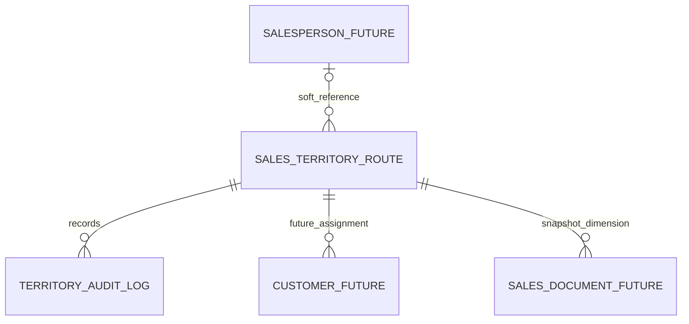

# Business Requirements Document: Sales Territory (ผังเขตขาย)

## 1. Document Control

| รายการ | ค่า |
|---|---|
| BRD ID | BRD-SALES-TERRITORY-001 |
| Feature ID | F-SALES-TERRITORY |
| ประเภท | New Feature — Master Data |
| เวอร์ชัน | 1.0 |
| สถานะ | AI Reviewed — รอ Business Sign-off |
| เจ้าของธุรกิจ | PM/BA (รอยืนยันรายชื่อ) |
| ผู้มีส่วนได้เสีย | Sales Admin, Sales Manager, Salesperson, System Admin, ทีมพัฒนา, QA |
| วันที่จัดทำ | 2026-08-13 |
| Security Preset | P3: Master Data |

### 1.1 แหล่งข้อมูลและลำดับความสำคัญ

1. ข้อตกลงที่ PM/BA อนุมัติแล้ว: HTML ผ่าน GATE, เพิ่ม mock Route `R-BK-01` ในภาคกลาง และให้รายการโครงสร้างเลื่อนด้วย scrollbar ของหน้า
2. `PREBRIEF_F-SALES-TERRITORY.md` และ `FUNCTION_CHECKLIST_F-SALES-TERRITORY.md`
3. `../01_HTML/sales-territory.html` — source of truth ของหน้าจอและ flow ที่เกิดขึ้นจริง
4. `Central Plan v2` — ใช้ระบุตำแหน่งโมดูลและ future links เท่านั้น
5. Generation/UX/Coverage reports — ใช้เป็นหลักฐานการตัดสินใจและรายการค้าง

หากข้อมูลขัดกัน ให้ใช้ลำดับข้างต้น โดยข้อกำหนดที่ยังไม่ชัดเจนจะติด `[AI-DEFAULT]` และเปิดเป็น Open Question ไม่ถือว่าได้รับอนุมัติอัตโนมัติ

## 2. Executive Summary

### 2.1 ปัญหาทางธุรกิจ

องค์กรยังไม่มี master กลางสำหรับ Route/เขตขายที่ควบคุมรหัส ชื่อ ประเภท ภูมิภาค จังหวัด ผู้รับผิดชอบ และสถานะอย่างเป็นมาตรฐาน ทำให้เอกสารขายและรายงานในอนาคตเสี่ยงใช้มิติพื้นที่ไม่ตรงกัน แก้ข้อมูลย้อนหลังไม่ได้ และตรวจสอบประวัติการเปลี่ยนแปลงได้ยาก

### 2.2 เป้าหมาย

- จัดให้มี Route master เป็นหน่วยหลักของ Sales Territory
- รองรับกฎหนึ่ง Route ต่อหนึ่ง Salesperson โดยอ้างอิงบุคลากรแบบ soft reference ในอนาคต
- คงประวัติด้วย soft archive/restore และ append-only audit log; ห้าม hard delete
- แสดงโครงสร้าง ภาระงาน และแผนที่ประเทศไทยแบบ offline ตามข้อมูลที่มี
- เตรียม contract/hook สำหรับฟีเจอร์อนาคตโดยไม่สร้าง hard dependency
- ให้เอกสารและรายงานอนาคต snapshot ข้อมูล Territory ณ เวลาทำรายการ เพื่อไม่เปลี่ยนย้อนหลังตาม master

### 2.3 ตัวชี้วัดความสำเร็จ

| ID | ตัวชี้วัด | Baseline | Target | วิธีวัด | รอบวัด |
|---|---|---|---|---|---|
| M01 | รหัส Route ซ้ำหรือผิดรูปแบบที่ถูกบันทึกสำเร็จ | เก็บก่อนเปิดใช้ | 0 รายการ `[FIXED]` | validation/audit log | รายวัน |
| M02 | การ hard delete Route | 0 | 0 ครั้ง `[FIXED]` | database/audit monitoring | ต่อเนื่อง |
| M03 | รายการ archive ที่ยังถูกเสนอสำหรับเอกสารใหม่ | ยังวัดไม่ได้จน consumer พร้อม | 0 รายการ `[FIXED]` | future integration test/log | เมื่อเชื่อม consumer |
| M04 | อัตราการบันทึกข้อมูลที่ผ่าน validation สำเร็จ | เก็บ 30 วันแรก | ≥99% `[AI-DEFAULT]` | save result telemetry | รายสัปดาห์ |
| M05 | เวลา response ของ list/search p95 | เก็บก่อน UAT | ≤2 วินาที `[AI-DEFAULT]` | application monitoring | รายวัน |
| M06 | การแก้ master แล้วทำให้ snapshot ในเอกสารเก่าเปลี่ยน | ยังไม่มี consumer | 0 เหตุการณ์ `[FIXED]` | future regression/audit | ทุกรอบ release |

Target ที่ติด `[AI-DEFAULT]` ต้องให้ PM/BA และ Tech Lead ยืนยันก่อน FRD/API freeze

## 3. Scope

### 3.1 In Scope

- หน้าหลัก Sales Territory route `#/sales-territory`
- มุมมอง 3 แท็บ: โครงสร้าง, ภาระงาน, แผนที่
- ค้นหา กรองสถานะ ล้างตัวกรอง และแสดง empty state
- สร้าง ดู และแก้ไข Route ผ่าน drawer
- archive ด้วยการยืนยัน และ restore รายการเดิม
- Route code, name, type, region, optional province, salesperson soft reference, optional universe, status และ audit metadata
- validation ของ Route code และข้อมูลบังคับ
- แผนที่ประเทศไทยแบบ offline พร้อมจังหวัด/จุดที่มีข้อมูล และไม่ตอบสนองเมื่อ pointer อยู่นอกกรอบแผนที่
- แสดงข้อมูล workload/coverage จาก mock หรือ read model ที่มี โดยระบุชัดว่า provider จริงยังไม่พร้อม
- outer-page scrolling สำหรับรายการแท็บโครงสร้าง
- mock `R-BK-01` เพื่อให้เห็นโครงสร้าง `ภาคกลาง` ตามที่ PM/BA อนุมัติ
- future hooks แบบ disabled/labelled สำหรับ Sales Team/Salesperson, Customer Master, Sales Order, Sales Target และ Visit Operation

### 3.2 Out of Scope

- การสร้างหรือ implement Sales Team/Salesperson, Customer Master, Sales Order, Sales Target หรือ Visit Operation
- hard dependency ไปยังห้า feature ข้างต้นใน release นี้
- การสร้าง Salesperson ภายใน Sales Territory
- ทีมหลายคนต่อ Route หรือหลาย Route ต่อ salesperson โดยอัตโนมัติ
- DOA/approval workflow
- hard delete
- บังคับห้ามจังหวัด/พื้นที่ทับซ้อนกัน
- GPS tracking, route-line planning, live location และ full choropleth analytics
- import/export/bulk update, PDF หรือเอกสารธุรกรรม
- การกำหนด master ข้อมูลจังหวัดใหม่; ใช้ชุด 77 จังหวัดที่ระบบจัดเตรียมแบบ offline

### 3.3 Assumptions and Constraints

- หน่วยธุรกิจหลักคือ Route
- จังหวัดไม่บังคับ และค่าว่างต้องไม่ถูกนับเป็นจังหวัด
- หนึ่ง Route มี salesperson ได้หนึ่งคน; แหล่งบุคลากรจริงยังไม่มี จึงใช้ mock/soft reference เท่านั้น
- ข้อมูลลูกค้า ยอดขาย ออเดอร์ และ coverage เป็น read-only derived data จากระบบอนาคต
- ระบบต้องใช้งานแผนที่ได้โดยไม่พึ่ง external map/font service
- ข้อมูล `R-BK-01` เป็น prototype fixture ที่ PM/BA อนุมัติให้แสดง; การใช้เป็น production seed ต้องยืนยันแยกใน OQ-14

### 3.4 Scope Lock

Baseline ที่ล็อกสำหรับ BRD นี้คือ PREBRIEF/CHECKLIST + HTML ที่ผ่าน UX/Coverage GATE + ข้อตกลง PM/BA เรื่อง `R-BK-01` และ outer-page scrolling ณ 2026-08-13 ไม่มี RIF/ใบเซ็นแยกต่างหาก

สิ่งที่ล็อกแล้ว:

- Route code unique, รูปแบบ `A-Z`, `0-9`, `-`, `_`, ความยาว 2–12 และแก้ไม่ได้หลังสร้าง
- province optional; blank ไม่เพิ่ม KPI จังหวัด
- active/archive/restore; ไม่ hard delete
- ไม่มี approval/DOA
- future modules เป็น hook/mock เท่านั้น
- downstream history ใช้ snapshot ไม่ย้อนเปลี่ยนตาม master
- UI มี 1 route, 3 tab views, create/edit/view drawers และ archive confirmation modal

การเพิ่ม workflow, integration จริง, field บังคับใหม่ หรือเปลี่ยน cardinality ต้องผ่าน change control และแก้ BRD/FRD ก่อนพัฒนา

## 4. Roles and Permissions

| ความสามารถ | Sales Admin | System Admin | Sales Manager | Salesperson |
|---|---:|---:|---:|---:|
| ดูรายการ/รายละเอียด | ✓ | ✓ | `[AI-DEFAULT]` ✓ | `[AI-DEFAULT]` เฉพาะของตน |
| สร้าง Route | ✓ | ✓ | — | — |
| แก้ไข Route | ✓ | ✓ | `[AI-DEFAULT]` — | — |
| Archive/Restore | ✓ | ✓ | — | — |
| ดู workload/map | ✓ | ✓ | `[AI-DEFAULT]` ✓ | `[AI-DEFAULT]` เฉพาะของตน |

สิทธิ์ของ Sales Manager และ Salesperson ยังเป็น OQ-02 ต้องยืนยันก่อนออก FRD; UI prototype ไม่ถือเป็นหลักฐานอนุมัติ permission backend

## 5. Business Process and COSO Alignment

### 5.1 Value Flow

`กำหนด Route → ตรวจ validation → บันทึก Active → ใช้เป็นมิติพื้นที่ → แก้ไขข้อมูลที่อนุญาต → Archive/Restore → เก็บ audit + รักษา snapshot ของรายการเก่า`

### 5.2 COSO / Responsibility Matrix

| ขั้นตอน | Maker | Checker | Approver | System | Evidence |
|---|---|---|---|---|---|
| สร้าง Route | Sales Admin/System Admin | N/A — ไม่มี manual review | N/A — ไม่มี DOA | unique/format/required validation | create audit |
| แก้ Route | Sales Admin/System Admin | N/A — ไม่มี manual review | N/A | code lock + validation | before/after audit |
| Archive | Sales Admin/System Admin | N/A — ไม่มี manual review | N/A | confirm + linked-customer warning เมื่อมีข้อมูล | archive audit |
| Restore | Sales Admin/System Admin | N/A — ไม่มี manual review | N/A | uniqueness/status check | restore audit |
| อ่าน workload/map | ผู้มีสิทธิ์ | N/A | N/A | authorization + data-source label | access/telemetry ตาม policy |

หลักการควบคุม: แยก user action จาก system validation, ไม่ลบหลักฐาน, จำกัดสิทธิ์ตาม role, แสดงที่มาของข้อมูล derived และไม่แอบทำ approval ที่ไม่อยู่ใน scope

### 5.3 Main and Alternative Flows

**Happy path — Create**

1. ผู้มีสิทธิ์เปิด drawer สร้าง Route
2. กรอก code/name/type/region และข้อมูล optional
3. ระบบตรวจรูปแบบ ความซ้ำ และข้อมูลบังคับ
4. ระบบสร้าง Route สถานะ Active และเขียน audit event
5. รายการ/KPI/map/workload คำนวณใหม่ตามข้อมูลที่บันทึก โดย province ว่างไม่ถูกนับ

**Edit/View**: เปิดรายละเอียด; view เป็น read-only; edit ล็อก code และบันทึก before/after

**Archive**: ผู้ใช้เลือก action, เห็นผลกระทบ/คำเตือน, ยืนยัน, ระบบเปลี่ยนสถานะ Archived โดยไม่ลบข้อมูล

**Restore**: ตรวจ conflict แล้วคืน Active พร้อม audit

**Validation alternative**: หาก invalid/duplicate ให้คง drawer และแสดง error ที่ field; ห้ามบันทึกบางส่วน

**Future-data unavailable**: workload/coverage และ navigation hook ต้องแสดงสถานะ mock/unavailable โดยหน้า master หลักยังทำงานได้

## 6. Data Requirements

### 6.1 Entity: Sales Territory Route

| Field | ความหมาย | กฎ |
|---|---|---|
| route_id | system identifier | ไม่แสดงเป็น business code |
| route_code | รหัส Route | required, unique, 2–12, `[A-Z0-9_-]`, immutable `[FIXED]` |
| route_name | ชื่อ Route | required `[FIXED]` |
| route_type | ประเภท Route | required; รายการค่ารอยืนยัน OQ-07 |
| region | ภูมิภาค | required; 8 ทิศ + ภาคกลาง/ออนไลน์ตาม approved HTML `[FIXED]` |
| province | จังหวัด | optional, หนึ่งใน 77 จังหวัดหรือ blank `[FIXED]` |
| salesperson_ref | ผู้รับผิดชอบ | soft reference/mock จนกว่า master พร้อม; หนึ่งคนต่อ Route `[FIXED]` |
| universe | จำนวนเป้าหมาย/จักรวาล | optional/derived; contract รอยืนยัน OQ-05 |
| status | Active/Archived | required `[FIXED]` |
| created_at/by | audit metadata | required |
| updated_at/by | audit metadata | required |
| archived_at/by | archive metadata | nullable |

### 6.2 Audit Log

Audit log ต้องเป็น append-only และเก็บอย่างน้อย actor, timestamp, action, route identifier, before, after และ result สำหรับ create/edit/archive/restore ห้ามแก้หรือลบ log ผ่านหน้าฟีเจอร์นี้

### 6.3 Derived/Future Read Models

| ข้อมูล | Source ในอนาคต | พฤติกรรมปัจจุบัน |
|---|---|---|
| Salesperson | Sales Team/Salesperson | mock/soft ref; ไม่สร้างบุคคล |
| ลูกค้า/coverage | Customer Master | mock/read-only |
| Orders/Sales | Sales Order | mock/read-only |
| Target | Sales Target | hook เท่านั้น |
| Visits | Visit Operation | disabled hook เท่านั้น |

### 6.4 Relationship



เส้น `FUTURE` ไม่ใช่ foreign key/hard dependency ใน release ปัจจุบัน

### 6.5 Retention and History

- Route ใช้ soft archive เท่านั้น
- Audit log append-only ตาม retention policy กลาง `[AI-DEFAULT]`; ระยะเวลา retention รอยืนยัน OQ-15
- เอกสาร/รายงานในอนาคตต้องเก็บ snapshot ของ code/name/type/region/province ที่ใช้งาน ณ ตอนเกิดรายการ

## 7. User Stories and Acceptance Criteria

### US-01 สร้าง Route

ในฐานะ Sales Admin ฉันต้องการสร้าง Route เพื่อให้มีหน่วยพื้นที่มาตรฐาน

- Given code และ required fields ถูกต้อง When กดบันทึก Then ระบบสร้าง Active Route และแสดงในรายการ
- Given code ซ้ำหรือผิดรูปแบบ When กดบันทึก Then ระบบไม่บันทึกและแสดง error ที่ตรวจได้
- Given province ว่าง When บันทึกสำเร็จ Then Route ถูกสร้างแต่ KPI จังหวัดไม่เพิ่ม

### US-02 ดูรายละเอียด

ในฐานะผู้มีสิทธิ์ ฉันต้องการดู Route เพื่อเข้าใจรายละเอียดพร้อมสถานะ

- Given Route มีอยู่ When เปิด view drawer Then ระบบแสดงข้อมูลแบบ read-only
- Given future data ยังไม่พร้อม When ดู derived metrics Then ระบบระบุ mock/unavailable อย่างชัดเจน

### US-03 แก้ Route

ในฐานะ Sales Admin ฉันต้องการแก้ข้อมูล Route เพื่อรักษาความถูกต้องของ master

- Given เปิด edit drawer When แก้ข้อมูล Then route code ไม่สามารถเปลี่ยนได้
- Given บันทึกสำเร็จ When กลับรายการ Thenข้อมูลใหม่ปรากฏและ audit มี before/after
- Given เอกสารเก่าเคย snapshot Route When แก้ master Then snapshot เก่าไม่เปลี่ยน

### US-04 Archive Route

ในฐานะ Sales Admin ฉันต้องการ archive Route เพื่อหยุดใช้รายการโดยไม่ลบประวัติ

- Given Route active When เลือก archive Then ระบบแสดง confirmation และคำเตือนผลกระทบ
- Given ยืนยัน When ระบบสำเร็จ Then status เป็น Archived และมี audit event
- Given Route archived Whenระบบอนาคตสร้างเอกสารใหม่ Then Route ไม่ถูกเสนอให้เลือก

### US-05 Restore Route

ในฐานะ Sales Admin ฉันต้องการ restore Route เพื่อกลับมาใช้งานรายการเดิม

- Given Route archived และไม่มี conflict When เลือก restore Then status กลับ Active
- Given restore สำเร็จ Whenตรวจ audit Thenพบ actor/time/result

### US-06 ค้นหา/กรอง

ในฐานะผู้มีสิทธิ์ ฉันต้องการค้นหา Route เพื่อหารายการได้เร็ว

- Given มีหลาย Route When ค้นหาด้วย code/name Thenรายการตรงเงื่อนไขปรากฏ
- Given ใช้ status filter Whenล้างตัวกรอง Thenรายการกลับสู่ค่าเริ่มต้น
- Givenไม่มีผลลัพธ์ Thenแสดง empty state พร้อม action ที่เหมาะสม

### US-07 ดูภาระงาน

ในฐานะ Sales Manager ฉันต้องการดู workload เพื่อเห็นสัญญาณการกระจายงาน

- Given mock/read model พร้อม Whenเปิดแท็บภาระงาน Thenแสดงข้อมูล read-only พร้อม source/state label
- Given provider อนาคตไม่พร้อม Thenหน้าไม่ล้มและไม่สร้าง hard dependency

### US-08 ดูแผนที่

ในฐานะผู้มีสิทธิ์ ฉันต้องการดู Route บนแผนที่ เพื่อเห็นการกระจายพื้นที่

- Given pointer อยู่บนจังหวัด/หมุดที่ interactive ภายในกรอบ When hover Thenแสดง highlight/tooltip ที่สัมพันธ์กัน
- Given pointer อยู่นอกกรอบแผนที่ทุกด้าน/มุม Whenเคลื่อนเมาส์ Thenไม่เกิด highlight, tooltip หรือ state change
- Givenไม่มีอินเทอร์เน็ต Whenเปิดหน้า Thenแผนที่ยัง render จาก asset ภายในระบบ

### US-09 ใช้ future hooks อย่างปลอดภัย

ในฐานะผู้ใช้ ฉันต้องการเห็นว่าส่วนใดยังไม่พร้อม เพื่อไม่เข้าใจว่า integration ทำงานแล้ว

- Given Customer/Visit/Target/Salesperson provider ยังไม่มี Whenเห็น action Then action ต้อง disabled หรือ labeled ว่าเป็น future/mock
- Given provider ไม่พร้อม Whenสร้างหรือแก้ Route Then flow หลักยังทำงานด้วย contract แบบ soft reference

## 8. State Model

```text
[Create + valid] -> ACTIVE -> [Archive + confirm] -> ARCHIVED
                         ^                         |
                         +-------- Restore -------+
```

- ไม่มี Draft/Submitted/Approved เพราะ feature นี้ไม่มี approval
- invalid data ไม่สร้าง state ใหม่
- archive ไม่ทำลาย snapshot หรือ audit เดิม
- restore ต้องไม่ทำให้ route code uniqueness แตก

## 9. Business Rules

| Rule ID | Rule | Likelihood | Source/Status |
|---|---|---|---|
| BR-01 | Route เป็นหน่วยหลักของ Territory | FIXED | PREBRIEF OB1 |
| BR-02 | หนึ่ง Route มี Salesperson ได้หนึ่งคน | FIXED | OB2 |
| BR-03 | Salesperson เป็น soft reference; ห้ามสร้างบุคคลใน feature นี้ | FIXED | OB3 + PM/BA |
| BR-04 | Route code unique, 2–12 และรับเฉพาะ A-Z/0-9/-/_ | FIXED | OB8 |
| BR-05 | Route code แก้ไม่ได้หลังสร้าง | FIXED | OB8 |
| BR-06 | Province optional; blank ไม่เพิ่มจำนวนจังหวัด | FIXED | OB5 + approved UI |
| BR-07 | ใช้ชุดจังหวัดประเทศไทย 77 จังหวัดแบบ offline | FIXED | OB5/OB11 |
| BR-08 | Region รองรับ 8 ทิศ และค่าภาคกลาง/ออนไลน์ตาม approved HTML | FIXED | source + approved UI |
| BR-09 | ห้าม hard delete; ใช้ archive/restore | FIXED | OB7 |
| BR-10 | Audit เป็น append-only สำหรับ create/edit/archive/restore | FIXED | OB7 |
| BR-11 | customer/coverage/sales/workload เป็น read-only future-derived | FIXED | OB6 |
| BR-12 | การแก้/archive master ไม่แก้ snapshot ของรายการเก่า | FIXED | OB9 |
| BR-13 | Archived Route ต้องไม่ถูกเสนอให้รายการใหม่เมื่อ consumer พร้อม | FIXED | OB7/OB9 |
| BR-14 | ฟีเจอร์ไม่มี DOA/approval | FIXED | OB10 |
| BR-15 | พื้นที่/จังหวัดทับซ้อนได้ใน baseline นี้ | WARNING | `[AI-DEFAULT]`, OQ-09 |
| BR-16 | Coverage สีเขียวเริ่มที่ 25% | WARNING | prototype `[AI-DEFAULT]`, OQ-04 |
| BR-17 | Capacity/สูตร workload ตาม role | DYNAMIC | prototype `[AI-DEFAULT]`, OQ-06 |
| BR-18 | รายการ Route Type จำนวน 10 ค่า | CONFIGURABLE | prototype `[AI-DEFAULT]`, OQ-07 |
| BR-19 | Map event ทำงานเฉพาะ target/coordinate ที่ valid ภายใน frame | FIXED | PM/BA manual feedback + approved fix |
| BR-20 | External font/map network failure ต้องไม่ทำให้ core flow ใช้งานไม่ได้ | FIXED | offline constraint |

### 9.5 Flexibility Decisions

| Rule | Classification / ระดับ | ที่มา/ผู้ยืนยัน |
|---|---|---|
| BR-01, BR-02 | FIXED | ✅ PREBRIEF OB1–OB2 |
| BR-03 | FIXED | ✅ PREBRIEF OB3 + PM/BA future-hook decision |
| BR-04, BR-05 | FIXED | ✅ PREBRIEF OB8 |
| BR-06 | FIXED | ✅ PREBRIEF OB5 + approved UI |
| BR-07 | FIXED | ✅ PREBRIEF OB5/OB11 |
| BR-08 | FIXED | ✅ source + approved central-region UI |
| BR-09, BR-10 | FIXED | ✅ PREBRIEF OB7 |
| BR-11 | FIXED | ✅ PREBRIEF OB6 + PM/BA future-hook decision |
| BR-12, BR-13 | FIXED | ✅ PREBRIEF OB7/OB9 |
| BR-14 | FIXED | ✅ PREBRIEF OB10 |
| BR-15 | WARNING | 🤖 baseline assumption; OQ-09 |
| BR-16 | WARNING | 🤖 prototype default; OQ-04 |
| BR-17 | DYNAMIC / Rule Management | 🤖 prototype formula; OQ-06 ต้องยืนยันก่อนพัฒนา Phase ที่เกี่ยวข้อง |
| BR-18 | CONFIGURABLE / Admin Panel | 🤖 prototype list; OQ-07 |
| BR-19 | FIXED | ✅ PM/BA manual feedback + approved fix |
| BR-20 | FIXED | ✅ offline constraint |
| Permission ของ Manager/Salesperson | WARNING | 🤖 OQ-02 (ไม่ใช่ rule ใหม่จนกว่า PM/BA ยืนยัน) |

ทุก WARNING มี owner = PM/BA และ due = ก่อน FRD/API freeze; ห้าม Dev เปลี่ยน `[AI-DEFAULT]` ให้เป็น FIXED เอง

## 10. Edge Cases and Exceptions

### 10.1 BA-confirmed / Source-grounded

- duplicate/invalid code, missing required field
- province blank
- salesperson source unavailable
- future salesperson inactive/deleted (behavior รอยืนยัน OQ-03)
- linked customer warning ตอน archive เมื่อข้อมูลมีจริง
- universe/coverage ว่างเมื่อ source ยังไม่มี
- archive/restore พร้อม audit
- pointer นอก map frame ต้องไม่ trigger
- downstream snapshot ไม่เปลี่ยนย้อนหลัง

### 10.2 AI-suggested — Not Approved

| หมวด | Edge | Proposed Handling | Status |
|---|---|---|---|
| Concurrent Access | ผู้ใช้สองคนแก้ Route เดียวกัน | optimistic concurrency + แจ้ง reload | ☐ `[AI-DEFAULT]` OQ-16 |
| Permission | สิทธิ์ถูกถอนระหว่างเปิด drawer | ตรวจสิทธิ์ซ้ำตอน save | ☐ `[AI-DEFAULT]` OQ-17 |
| Integration | derived provider timeout | แสดง unavailable โดย core master ยังทำงาน | ☐ `[AI-DEFAULT]` OQ-18 |
| Data/Asset Integrity | local geo asset เสีย/ไม่ครบ | แสดง error state และยังเข้ารายการได้ | ☐ `[AI-DEFAULT]` OQ-19 |
| Status/Conflict | restore แล้ว code conflict | block restore พร้อมข้อความแก้ไขได้ | ☐ `[AI-DEFAULT]` OQ-20 |

## 11. Regression and Compatibility

ฟีเจอร์เป็น New Feature จึงไม่มี legacy workflow ที่ต้อง migrate อย่างไรก็ตามต้องไม่กระทบ shared application shell, routing, authentication และ responsive layout การเพิ่ม future adapters ต้อง backward-compatible กับข้อมูล Route ที่สร้างไว้ และ migration ในอนาคตต้องรักษา `route_id`, code, audit และ snapshot semantics

ชุด regression ขั้นต่ำ: create/edit/view/archive/restore, validation, search/filter/reset, empty state, dropdown keyboard/scroll, drawer Esc/backdrop, map inside/outside boundary, responsive 1440×900 และ 1024×768, document page scroll และ future-hook labels

## 12. Value Stream and Dependencies

### 12.1 Value Stream Impact

Sales Territory อยู่ใน Sales / Field Operations และเป็น master dimension ต้นน้ำสำหรับ Customer assignment, Visit Operation, Sales Target และเอกสาร/รายงานขายในอนาคต

| Direction | Module | Impact | Current Contract |
|---|---|---|---|
| Upstream | Sales Team/Salesperson | ผู้รับผิดชอบ Route | ยังไม่มี; soft ref/mock |
| Upstream | Customer Master | customer count/coverage | ยังไม่มี; read-only mock |
| Upstream | Sales Order | sales/order metrics | ยังไม่มี; read-only mock |
| Downstream | Customer Master | assign customer to territory | future hook only |
| Downstream | Visit Operation | route/visit context | future hook only |
| Downstream | Sales Target | target by territory | future hook only |
| Downstream | Sales Order/docs/reports | territory dimension snapshot | future contract only |

Golden rule: integration อนาคตต้อง snapshot Territory ใน transaction; ห้าม foreign-key lookup ปัจจุบันเพื่อแสดงประวัติย้อนหลังเพียงอย่างเดียว

### 12.2 Dependency Classification

- Hard dependency ปัจจุบัน: ไม่มีในห้า business feature ที่ระบุ
- Platform dependency: authentication/authorization, persistence, audit logging และ local geo assets
- Optional future adapters: Salesperson, Customer, Sales Order, Target, Visit
- เมื่อ provider ยังไม่พร้อม ระบบ Route master ต้อง create/edit/archive/restore ได้

### 12.3 Central Plan Alignment

Central Plan วาง Sales Territory ในกลุ่ม Sales FIELD OPS และแสดงเส้นเชื่อมไป Customer Master, Visit Operation และ Sales Target เอกสารนี้ตีความเส้นเชื่อมเหล่านั้นเป็น future contract ไม่ใช่ scope การ implement module ปลายทาง

## 13. Delivery Phases

| Phase | ขอบเขต | Exit Criteria |
|---|---|---|
| 1 — Standalone Master | Route CRUD แบบไม่มี hard delete, audit, search/filter, 3 views, offline map, approved mock/hook labels | acceptance ของ US-01 ถึง US-09; security/UX tests ผ่าน |
| 2 — Provider Adapters | เชื่อม Salesperson/Customer/SO เมื่อแต่ละ feature มี contract ที่อนุมัติ | contract test + fallback; ไม่ block core master |
| 3 — Consumer Snapshot | Customer/Visit/Target/docs/reports รับ territory snapshot | historical regression ผ่าน |
| 4 — Operate/Optimize | ยืนยัน thresholds/capacity, monitoring และปรับ performance | KPI/SLA approved และ evidence พร้อม |

Phase 2–4 เป็น roadmap/future readiness ไม่ใช่ commitment ใน release ปัจจุบัน

## 14. Developer Handoff Summary

### 14.1 Must Implement

- domain Route และ state Active/Archived
- code validation/immutability, optional province, audit append-only
- UI/flows ตาม approved HTML และ user stories
- permissions ที่ได้รับยืนยันเท่านั้น
- offline-safe map boundary behavior
- graceful unavailable state สำหรับ future providers

### 14.2 Must Not Implement

- ห้า future modules หรือ hard dependency
- DOA, hard delete, multi-owner, GPS/route-line, overlap enforcement
- ค่าที่ติด `[AI-DEFAULT]` เป็น production rule ก่อน OQ ปิด

### 14.3 Data and Integration Guardrails

- แยก owned master fields จาก derived read models
- ใช้ stable ID + immutable business code
- future transaction ต้อง snapshot territory
- ห้ามถือ mock KPI/person/customer/order เป็น production truth

### 14.4 Required Test Groups

- authorization and role boundaries
- validation and duplicate handling
- state/audit/history integrity
- offline/error/empty states
- provider-unavailable resilience
- accessibility/keyboard/overlay behavior
- map event boundary and responsive/page-scroll regression

### 14.5 Non-functional Expectations

- no uncaught page/console errors ใน critical flows
- responsive desktop-base ที่ 1024 และ 1440
- input/search/dropdown ใช้ keyboard ได้
- local assets ไม่ทำ external request ที่เป็น critical dependency
- telemetry ไม่บันทึก PII เกินจำเป็น

### 14.6 Screen Inventory (HTML-first)

| Route/Surface | Business Purpose | Main Actions | State |
|---|---|---|---|
| `#/sales-territory` / โครงสร้าง | จัดการ Route master | search/filter/create/view/edit/archive/restore | approved |
| แท็บภาระงาน | อ่าน workload/coverage | filter/view only | mock/read-only until providers exist |
| แท็บแผนที่ | อ่านการกระจาย Route | hover/select valid province/pin | offline prototype |
| Create/Edit/View drawer | ทำรายการหรืออ่านรายละเอียด | save/close | approved; code locked on edit |
| Archive modal | ยืนยัน destructive state change | confirm/cancel | approved |

จำนวนพื้นผิว: 1 primary route, 3 tab views, 3 drawer modes และ 1 confirmation modal ไม่รวม future disabled hooks

## 15. Open Questions and AI Defaults

| OQ | คำถาม/ค่า default | Owner | Due |
|---|---|---|---|
| OQ-01 | source/identifier ของ Salesperson เมื่อ feature พร้อมคืออะไร | PM/BA | ก่อน integration design |
| OQ-02 | permission ที่แท้จริงของ Manager/Salesperson | PM/BA/Security | ก่อน FRD freeze |
| OQ-03 | Route ที่อ้าง Salesperson inactive ต้องแสดง/บันทึกอย่างไร | PM/BA | ก่อน integration |
| OQ-04 | coverage green threshold 25% ถูกต้องหรือไม่ `[AI-DEFAULT]` | PM/BA | ก่อน FRD freeze |
| OQ-05 | universe editable, imported หรือ derived จากอะไร | PM/BA | ก่อน FRD freeze |
| OQ-06 | capacity/workload formula ตาม role | PM/BA | ก่อน FRD freeze |
| OQ-07 | รายการ Route Type ทั้ง 10 ค่าและ owner config | PM/BA | ก่อน FRD freeze |
| OQ-08 | ต้องมี Audit Trail UI หรือ backend evidence เท่านั้น | PM/BA | ก่อน UX freeze |
| OQ-09 | ยืนยันว่า overlap allowed | PM/BA | ก่อน FRD freeze |
| OQ-10 | full choropleth/route line/GPS ยังคง out of scope หรือไม่ | PM/BA | roadmap |
| OQ-11 | สีกรณีจังหวัดเดียวหลาย region | PM/BA | ก่อน map production |
| OQ-12 | owner/version ของ local 77-province geo dataset | Tech Lead | ก่อน build |
| OQ-13 | KPI/legend ของ map เมื่อข้อมูล future ไม่พร้อม | PM/BA | ก่อน UAT |
| OQ-14 | `R-BK-01` เป็นเพียง prototype fixture หรือ production seed | PM/BA | ก่อน data migration |
| OQ-15 | audit retention ระยะเวลาเท่าใด `[AI-DEFAULT: policy กลาง]` | Security/Compliance | ก่อน production |
| OQ-16 | concurrency strategy `[AI-DEFAULT: optimistic lock]` | Tech Lead | ก่อน API design |
| OQ-17 | re-authorize on save `[AI-DEFAULT: yes]` | Security | ก่อน API design |
| OQ-18 | timeout/fallback ของ future providers | Tech Lead | ก่อน integration |
| OQ-19 | geo asset failure behavior | PM/BA/Tech Lead | ก่อน UAT |
| OQ-20 | restore-code conflict handling `[AI-DEFAULT: block]` | PM/BA | ก่อน FRD freeze |
| OQ-21 | M04 ≥99%, M05 ≤2s และ performance profile ได้รับอนุมัติหรือไม่ | PM/BA/Tech Lead | ก่อน NFR freeze |

## 16. Security and Compliance

### 16.1 Preset and Risk Summary

ใช้ P3: Master Data เพราะ Route เป็น master ที่ส่งผลต่อหลายโมดูลในอนาคต ความเสี่ยงหลักคือแก้ข้อมูลโดยไม่มีสิทธิ์, ลบ/แก้ audit, PII ของ salesperson รั่ว, route code mapping ไม่สม่ำเสมอ และ mock ถูกเข้าใจเป็นข้อมูลจริง ไม่มีข้อมูลการเงินหรือ approval ใน scope

### 16.2 Applicability of 14 Standards

| Standard | ใช้หรือไม่ | เหตุผล |
|---|---|---|
| S01 Governance/SoD | Yes | แยก role/action และควบคุม master changes |
| S02 Identity/Data Protection | Yes | auth, classification, masking ของ person data |
| S03 Policy/Versioning | Yes | rule/config change history |
| S04 Operations/Mapping | Yes | naming/mapping/capacity |
| S05 Network Security | No `[AI-DEFAULT]` | ไม่มี external network integration ปัจจุบัน |
| S06 Access/Audit | Yes | authorization และ standardized audit |
| S07 Privacy | Yes | future salesperson PII tags/masking |
| S08 Transparency | No `[AI-DEFAULT]` | ไม่มี AI/automated decision; derived source label อยู่ใน scope |
| S09 OT Boundary | No | ไม่ใช่ OT |
| S10 OT Routing | No | ไม่ใช่ OT |
| S11 Assurance | Yes | ticket/evidence สำหรับ master change |
| S12 Resilience | Yes `[AI-DEFAULT]` | backup/restore tier ต้องยืนยัน |
| S13 AI Output Safety | No | ไม่มี AI feature |
| S14 API/Input | Yes | schema/input validation แม้ integration ยัง future |

### 16.3 P3 Required Controls

| Control | Requirement | Evidence Expected |
|---|---|---|
| S01-04 SoD Conflict Matrix | กำหนด action ตาม role; ไม่มี implicit approval | permission tests |
| S01-07 Immutable Master Data Log | before/after append-only | audit test |
| S02-01 Password Policy | ใช้ policy platform กลาง | platform evidence |
| S02-04 Data Masking/Obfuscation | mask person data ตาม classification | UI/API test |
| S02-05 Data Classification Tags | tag route/person/audit fields | data dictionary |
| S03-02 Policy Versioning | เก็บ version ของ configurable rules | config audit |
| S04-05 Standard Master Data Mapping | stable ID/naming/region/province mapping | contract test |
| S06-03 Standardized Audit Content | who/what/when/where/result | audit schema test |
| S07-06 PII Tagging & Masking | salesperson ref ต้องถูก classify | security review |
| S11-02 Ticket Enforcement | การเปลี่ยน production master ต้อง trace ticket ตาม policy | operational audit |

### 16.4 Security Risks

| Risk | Impact | Mitigation |
|---|---|---|
| unauthorized edit/archive | เขตขายผิดและกระทบ downstream | RBAC + re-check on save `[AI-DEFAULT]` + audit |
| audit tampering | สืบสวนไม่ได้ | append-only storage + restricted access |
| PII exposure | privacy breach | classification/masking/minimum fields |
| mock treated as production | decision/report ผิด | visible mock labels + environment fixture separation |
| external/local asset failure | UI ใช้งานไม่ได้ | local assets + error fallback + integrity/version control |

## 17. Service Health and Performance

### 17.1 Proposed SLA `[AI-DEFAULT]`

| Operation | Target | Measurement |
|---|---|---|
| list/search/filter | p95 ≤2s | client/API telemetry |
| create/edit/archive/restore | p95 ≤2s ไม่รวม user think time | API telemetry |
| error rate ของ valid requests | <1% | application monitoring |
| availability | ใช้ SLA platform กลาง; ค่ารอยืนยัน | uptime monitor |

### 17.2 Control Points

- authorization ก่อน read/write และตรวจซ้ำก่อน state change
- server-side validation ของ unique/format/required
- atomic save + audit event
- health/fallback ของ local geo asset
- circuit/fallback เมื่อ future provider unavailable
- telemetry แยก validation error, system error และ permission denial

### 17.3 KPI Mapping

| KPI | Maps to §2.3 | Green | Amber | Red |
|---|---|---|---|---|
| Invalid/duplicate accepted | M01 | 0 | N/A | >0 |
| Hard delete events | M02 | 0 | N/A | >0 |
| Save success rate | M04 | ≥99% | 97–<99% | <97% |
| Search p95 | M05 | ≤2s | >2–3s | >3s |
| Historical snapshot mutation | M06 | 0 | N/A | >0 |

Threshold ที่ไม่มาจาก FIXED rule เป็น `[AI-DEFAULT]` และต้องยืนยันตาม OQ-21

### 17.4 Thresholds `[AI-DEFAULT]`

| Metric | Minimum/Green | Maximum/Red | Action when breached |
|---|---|---|---|
| Save success rate | ≥99% | <97% | ตรวจ error class, audit failure และ rollback result |
| Search p95 | ≤2s | >3s | ตรวจ query/index/pagination และแจ้ง Tech Lead |
| Invalid/duplicate accepted | 0 | >0 | เปิด incident และหยุด release ที่เกี่ยวข้อง |
| Hard delete / snapshot mutation | 0 | >0 | เปิด critical incident และตรวจ audit/data recovery |

ทุกค่าที่ไม่อ้าง FIXED rule เป็นข้อเสนอรอยืนยัน OQ-21

### 17.5 Throughput: Capacity and Stress Profile `[AI-DEFAULT]`

เสนอ baseline สำหรับทดสอบเท่านั้น: 10,000 Route ต่อ tenant, 50 concurrent users, stress alert ที่ 80% ของขีดจำกัด resource ที่ Tech Lead กำหนด ค่าเหล่านี้ไม่ใช่ business limit และต้อง benchmark/อนุมัติก่อน NFR freeze โดยใช้ pagination/virtualization ตาม design จริงโดยไม่เปลี่ยน outer-page scrolling contract ของแท็บโครงสร้าง

## 18. Monitoring and Reporting

รายงานส่วนนี้เป็น operational observability requirement ไม่ใช่หน้าจอธุรกิจใหม่ใน HTML

### 18.1 Performance Report

สรุป latency/error/success ของ list/search/save/archive/restore แยกตามเวลาและ environment รายวัน

### 18.2 Closing Report

snapshot จำนวน Active/Archived/ไม่มี province/ไม่มี salesperson ณ สิ้นเดือน เพื่อ reconciliation `[AI-DEFAULT]`; PM/BA ต้องยืนยันว่าจำเป็นหรือใช้ dashboard กลาง

### 18.3 Anomaly Report

แจ้ง duplicate attempts, validation spikes, unauthorized actions, audit-write failure, geo asset failure และ future-provider timeout

### 18.4 Transaction/Audit Report

รายการ create/edit/archive/restore พร้อม actor/time/result และ correlation/ticket ตามสิทธิ์ ห้ามเปิดเผย before/after ที่มี PII แก่ผู้ไม่มีสิทธิ์

### 18.5 Dashboard Widgets `[AI-DEFAULT]`

- save success rate
- search latency p95
- validation/duplicate rejects
- audit failure count
- provider unavailable count
- Active/Archived/blank-province counts

ตำแหน่ง dashboard, retention และ alert channel ต้องกำหนดใน FRD/operations design; ไม่เพิ่มลง HTML ปัจจุบันโดยอัตโนมัติ

---

# AI Review Report

## Review Summary

| รายการ | ผล |
|---|---|
| Mode | Fresh / New Feature / HTML-first |
| Checklist | C01–C23 + PE01–PE05 |
| Checks passed | 28/28 |
| Critical findings | 0 |
| Non-critical warnings | 9 กลุ่ม |
| Verdict | **APPROVED WITH WARNINGS — พร้อมส่ง PM/BA review; ยังไม่ใช่ business sign-off** |

## Checklist Evidence

| Check | Result | Evidence |
|---|---|---|
| C01 Business Objective | PASS | เป้าหมาย + ตัวชี้วัดวัดได้ใน §2.2–§2.3 |
| C02 User Roles | PASS | Role × Action ใน §4; ค่าที่ยังไม่ยืนยันชี้ OQ-02 |
| C03 Scope | PASS | In/Out/Assumptions/Scope Lock ใน §3 |
| C04 User Journey | PASS | Happy + edit/view/archive/restore/validation/provider alternatives ใน §5.3 |
| C05 Story Breakdown | PASS | 9 story descriptions เป็น single-action; ไม่มีคำว่า “และ” |
| C06 Acceptance Criteria | PASS | 21 Given-When-Then criteria; ทุก story ≥2 criteria ใน §7 |
| C07 Data Entity + ER | PASS | Entity fields + Mermaid relationship ใน §6 |
| C08 Audit Fields | PASS | route audit metadata + append-only audit event fields ใน §6.1–§6.2 |
| C09 State Lifecycle | PASS | state diagram + transition table ใน §8 |
| C10 Rule Tags | PASS | BR-01–BR-20 มี FIXED/CONFIGURABLE/DYNAMIC/WARNING ใน §9 |
| C11 Flexibility | PASS | BR-01–BR-20 trace ครบ; dynamic/config levels ใน §9.5 |
| C12 Validation | PASS | code/required/unique/restore/status validation ใน §6/§9/§10 |
| C13 Edge Categories | PASS | BA cases + AI cases 5 หมวดใน §10 |
| C14 Edge Provenance | PASS | §10.1 source-grounded; §10.2 AI-suggested มี ☐ ทุกข้อ |
| C15 Dependencies | PASS | owned/soft/future dependencies และ impact ใน §12 |
| C16 Existing System | PASS | Central Plan alignment + future-only warning ใน §12.3 |
| C17 Delivery Phases | PASS | Phase 1–4 พร้อม exit criteria ใน §13 |
| C18 WARNING Plan | PASS | ทุก WARNING มี owner/due/OQ ใน §9.5 และ §15 |
| C19 Dev Summary | PASS | Must/Must-not/guardrails/tests/NFR/screen inventory ใน §14 |
| C20 Scope Lock | PASS | baseline/ref และ locked decisions ใน §3.4; ระบุว่าไม่มี signed RIF |
| C21 Value Stream | PASS | positioning/upstream/downstream trigger+impact ใน §12.1 |
| C22 Measurable Metrics | PASS | M01–M06 มี baseline/target/source/cadence; map KPI ใน §17.3 |
| C23 Flexibility Attribution | PASS | ทุก BR มี ✅/🤖; BR-17 dynamic ผูก OQ-06 |
| PE01 COSO Roles | PASS | Maker/Checker/Approver/System แยกครบทุก step ใน §5.2 |
| PE02 SoD | PASS | ไม่มี approval; Maker ไม่ถูกกำหนดเป็น Approver ใน §5.2 |
| PE03 Security Preset | PASS | P3 + 14 standards + 10 controls + 5 risks ใน §16 |
| PE04 Health | PASS | SLA/control/KPI/threshold/throughput ครบ §17.1–§17.5 |
| PE05 Cross Coverage | PASS | rules↔edges, controls↔control points, KPI↔reports/widgets ใน §9/§10/§16–§18 |

## Warning Register

1. Permission ของ Sales Manager/Salesperson ยังไม่ยืนยัน (OQ-02)
2. Universe contract ยังไม่ยืนยัน (OQ-05)
3. Coverage/capacity/Route Type เป็น prototype default (OQ-04/06/07)
4. Future salesperson inactive behavior ยังไม่ยืนยัน (OQ-03)
5. ไม่มี formal signed RIF; ใช้ approved HTML GATE เป็น Scope Lock baseline
6. `R-BK-01` ได้รับอนุมัติเป็น visible prototype mock แต่ production seed ยังต้องยืนยัน (OQ-14)
7. Concurrency, retention และ provider fallback เป็น `[AI-DEFAULT]`
8. SLA/capacity/monitoring thresholds เป็นข้อเสนอ ไม่ใช่ signed business target
9. Future five features ยังไม่มีทั้งหมด; ห้าม Dev แปลง hook/mock เป็น integration scope

## Review Decision

BRD ครบโครงสร้าง New Feature และไม่มี critical gap สำหรับส่ง PM/BA ตรวจ แต่ implementation ต้องไม่เริ่มจากค่าที่ติด `[AI-DEFAULT]` จนกว่า OQ ที่กระทบ API/data/rules/permission จะถูกปิดและบันทึกใน FRD
