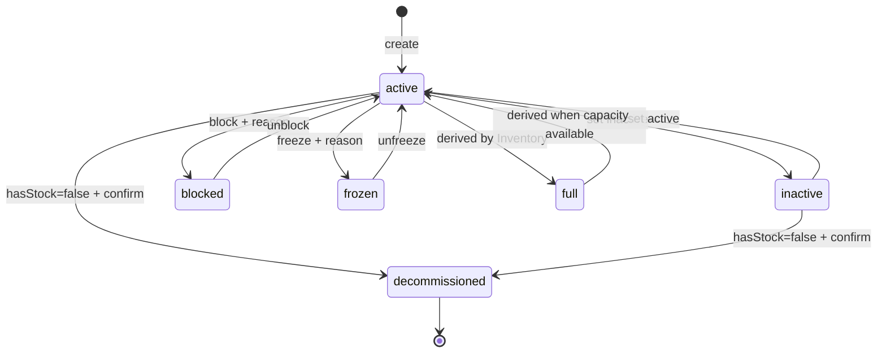

# BRD: Warehouse & Bin — คลังและตำแหน่ง

## 1. Document Info

| Field | Value |
|---|---|
| BRD ID | BRD-F-LOCATION-MASTER-001 |
| Feature Name | Warehouse & Bin — คลังและตำแหน่ง |
| BRD Type | New Feature |
| Version | 1.0 |
| Status | APPROVED |
| Module | Warehouse |
| Owner | Warehouse Business Owner |
| Stakeholders | Warehouse Manager, Admin, Inventory Owner, Organization/Company Owner, Architect |
| Created Date | 2026-08-12 |
| Last Updated | 2026-08-12 |
| Business source | `Pack Brief Feature/6. Warehouse/PREBRIEF_F-LOC_Warehouse-Location.md` |
| UI source of truth | `outputs/06_Warehouse-Bin/warehouse-bin.html` |

### Changelog

- v1.0 (2026-08-12): สร้าง BRD แบบ Fresh/HTML-first หลัง UX/Coverage gate ผ่าน และสืบทอด Scope Lock จาก `HANDOFF.md`

## 2. Business Context

### 2.1 ปัญหา / โอกาส

ระบบต้องมี master กลางสำหรับกำหนดโครงสร้างตำแหน่งจัดเก็บ 5 ระดับ เพื่อให้คลังทุกแห่งใช้รหัส ตำแหน่ง หน่วยเก็บ สถานะ และข้อจำกัดเดียวกัน โดยผู้ดูแลต้องเข้าถึงได้ทั้งแบบเจาะตามลำดับชั้นและแบบรายการตำแหน่งทั้งหมด ทั้งยังต้องป้องกันการเปลี่ยนหน่วยหรือลบตำแหน่งที่มีสต็อก และเก็บประวัติทุก mutation แบบ append-only

### 2.2 เป้าหมายทาง Business

- จัดการ Warehouse › Zone › Area › Rack › Location จากพื้นที่ทำงานเดียว
- ลดความผิดพลาดจากรหัสซ้ำ parent ผิด หรือการเปลี่ยน `storage_uom` ขณะที่มีสต็อก
- รองรับงานตั้งค่าจำนวนมากผ่าน bulk generation, bulk operations และ quick add
- ส่งมอบ location contract ที่ Inventory ใช้อ้างถึงได้โดยไม่ build F-INV ใน feature นี้

### 2.3 ตัวชี้วัดความสำเร็จ

| Metric ID | ตัวชี้วัด | Baseline ปัจจุบัน | Target | วัดยังไง/จากไหน | วัดเมื่อไหร่ |
|---|---|---|---|---|---|
| KPI-LOC-01 | mutation ที่มี WORM audit | ต้องเก็บ baseline ก่อน launch | 100% | เทียบ mutation event กับ audit event | รายวันหลัง launch |
| KPI-LOC-02 | record ที่ผิดกฎ code unique ภายใน parent | ต้องเก็บ baseline ก่อน launch | 0 record | validation/reconciliation report | รายวัน |
| KPI-LOC-03 | การเปลี่ยน `storage_uom` สำเร็จบน Location ที่ `hasStock=true` | ต้องเก็บ baseline ก่อน launch | 0 ครั้ง | audit + rejected-operation log | real-time และสรุปรายวัน |
| KPI-LOC-04 | bulk generation ที่ commit บางส่วน | ต้องเก็บ baseline ก่อน launch | 0 batch | transaction/batch audit | ทุก batch |
| KPI-LOC-05 | Location ที่หา full path ไม่ได้ | ต้องเก็บ baseline ก่อน launch | 0 record | hierarchy integrity report | รายวัน |

### 2.4 ที่มาของ Requirement

- PREBRIEF `OB-1..OB-13`, Scenarios `S-01..S-12` และ FUNCTION_CHECKLIST `FN-01..FN-60`
- Central Plan: `Company → Warehouse & Bin [config]` และ `Warehouse & Bin → Inventory [config]`
- PM/BA review ใน `HANDOFF.md`: ผ่านหลังแก้ postcode disabled และย้ายปุ่มสร้างเข้า filter-bar

## 3. Scope

### 3.1 In Scope

- CRUD โครงสร้าง Warehouse, Zone, Area, Rack และ Location
- Location parent แบบ `rack` XOR `area`; direct Area ใช้ได้เมื่อ `allows_direct_location=true`
- Warehouse อ้าง Company ผ่าน `branch_id` → `T_branch` แบบ soft reference และ picker active-only
- Geo cascade สำหรับที่อยู่ Warehouse พร้อม postcode auto/disabled
- Location type 10 ค่า, `storage_uom`, capacity, rotation, coordinates และ behavior flags
- operational status `active`, `inactive`, `blocked`, `frozen`; `full` เป็น derived
- List drill-down, flat `Location ทั้งหมด`, Hierarchy view, detail/audit drawer
- statusMenu, bulk status, bulk UOM, bulk generation และ quick add
- guard สำหรับ delete/decommission และ WORM audit ต่อ node
- ประกาศ engine candidates `ENG-LOC-GEN` และ `ENG-HIER-PATH`

### 3.2 Out of Scope

- F-INV build-out, inventory movement และ stock ledger
- Geo Master schema/maintenance; feature นี้ใช้ lookup เท่านั้น
- GRN, Putaway, RTV, Picking, Packing, Delivery/Ship flow
- DOA หรือ approval chain; feature นี้ใช้ RBAC `canManage`
- running number และเอกสารพิมพ์/PDF
- Notification event ของ feature
- re-parent live migration จนกว่า `OQ-LOC-05` จะได้รับคำตอบ

### 3.3 Assumptions

- 1 ERP instance = 1 company; จึงไม่มี `company_id` ใน Warehouse
- `[AI-DEFAULT]` branch inactive `00003 สาขาระยอง` เป็น mock เพื่อพิสูจน์ active-only filter ไม่ใช่ production seed
- `hasStock` เป็น soft signal จาก F-INV; prototype ใช้ mock และ feature นี้ไม่คำนวณยอดสต็อก
- Geo data ใน prototype เป็น representative subset; contract จริงรอ `OQ-LOC-01`

### 3.4 Scope Lock

- **Scope Lock Ref:** `outputs/06_Warehouse-Bin/HANDOFF.md` · updated 2026-08-12

| LOCK-ID | Locked Decision | Source |
|---|---|---|
| LOCK-LOC-01 | อ้าง Company เฉพาะ `branch_id` → `T_branch`; ไม่มี `company_id`; child inherit branch ผ่าน warehouse chain | HANDOFF Locked Scope #1 |
| LOCK-LOC-02 | ตัด F-INV build-out, Geo Master schema, GRN/Putaway/RTV/Pick-Pack-Ship; edge Inventory เหลือ `storage_uom` lock + `hasStock` | HANDOFF Locked Scope #2 |
| LOCK-LOC-03 | ไม่มี DOA; ใช้ RBAC `canManage` | HANDOFF Locked Scope #3 |
| LOCK-LOC-04 | CI = CUBE Warm Light v8 | HANDOFF Locked Scope #4 |
| LOCK-LOC-05 | สมมติฐานที่เดาต้อง mark `[AI-DEFAULT]` inline | HANDOFF Locked Scope #5 |
| LOCK-LOC-06 | `warehouse-bin.html` เป็น source of truth ของ microcopy/label; ห้ามแต่งข้อความบนจอ | HANDOFF Locked Scope #6 |

**Scope Drift:** ไม่พบจาก HTML/QC. Sidebar ของ module อื่นเป็น disabled shell placeholder ไม่ใช่ flow ใน scope

## 4. User Roles & Permissions

### 4.1 Roles

| Role | คำอธิบาย |
|---|---|
| Warehouse Manager | เจ้าของ operational master; จัดการข้อมูลได้ |
| Admin | จัดการข้อมูลได้ผ่าน `canManage` |
| Authenticated Viewer | ดู list, hierarchy และ detail ได้ แต่ mutation ไม่ได้ |
| System | validate, enforce guard, build path และ append audit |

### 4.2 Permission Matrix

| Action | Warehouse Manager | Admin | Authenticated Viewer | System |
|---|:---:|:---:|:---:|:---:|
| View/List/Search/Filter | ✅ | ✅ | ✅ | — |
| Create/Edit 5 levels | ✅ | ✅ | ❌ | validate + audit |
| Change Location status | ✅ | ✅ | ❌ | guard + audit |
| Bulk generation/operation/quick add | ✅ | ✅ | ❌ | atomic + audit |
| Delete non-Location node | ✅ | ✅ | ❌ | referential guard |
| Decommission Location | ✅ | ✅ | ❌ | `hasStock=false` guard |

> ไม่มี approval step และไม่มี DOA ตาม `LOCK-LOC-03`

## 5. User Journey (with COSO)

### 5.1 Happy Path

| # | Step | Route/UI anchor | Maker | Checker | Approver | System | Notes |
|---|---|---|---|---|---|---|---|
| 1 | เปิด `Warehouse & Bin` | `Warehouse & Bin` | Warehouse Manager | — | — | โหลด hierarchy 5 ระดับ | Root workspace |
| 2 | เจาะ Warehouse → Zone → Area → Rack | breadcrumb `ทุก Warehouse` | Warehouse Manager | — | — | คง selection/filter state | List view |
| 3 | เพิ่ม Location | `เพิ่ม Location` | Warehouse Manager | — | — | ตรวจ parent, code และ required fields | Wizard 2 ขั้น |
| 4 | กำหนด `หน่วยเก็บของตำแหน่งนี้` | `ความจุ & พฤติกรรม` | Warehouse Manager | — | — | enforce 1-loc-1-uom | `storage_uom` required |
| 5 | ยืนยันสร้าง | `ยืนยันสร้าง` | Warehouse Manager | — | — | commit + WORM audit | Status เริ่ม `active` |
| 6 | เปิด detail | `ภาพรวม` / `ความจุ & flags` / `ประวัติ` | Warehouse Manager | — | — | แสดง full path และ audit | Read-only view |

**SoD Check:** ไม่มี approval ใน flow; Maker ≠ Approver เป็น N/A และห้ามเพิ่ม approval chain

### 5.2 Alternative Paths

| # | Path | Maker | Checker | Approver | System | Outcome |
|---|---|---|---|---|---|---|
| A1 | เปิด `Location ทั้งหมด` | Warehouse Manager | — | — | รวม Location ข้าม hierarchy | ค้น/กรอง/จัดการแบบแบน |
| A2 | สลับ `Hierarchy view` | Warehouse Manager | — | — | `ENG-HIER-PATH` candidate สร้าง tree/path | summary panel แชร์ state |
| A3 | `สร้างจำนวนมาก` | Warehouse Manager | — | — | `ENG-LOC-GEN` candidate validate ทั้ง batch | commit ทั้งชุดหรือไม่ commit |
| A4 | `เพิ่มเร็ว` | Warehouse Manager | — | — | ตรวจ duplicate ภายใน parent | สร้างด้วย default capacity |
| A5 | เลือก `บล็อก`/`Freeze` | Warehouse Manager | — | — | บังคับเหตุผล + audit | เปลี่ยน status |
| A6 | Bulk ตั้งหน่วยเก็บ | Warehouse Manager | — | — | ข้าม record ที่ `hasStock=true` และนับแจ้ง | อัปเดตเฉพาะ record ที่ผ่าน |
| A7 | ลบ/ปลดระวาง | Warehouse Manager | — | — | block เมื่อมี child active/stock | ไม่สูญเสีย referential history |

## 6. Data Entity & Fields

### 6.1 Entity Overview

| Entity | Type | Description |
|---|---|---|
| `T_warehouse` | Master | คลังระดับบนสุดและสาขาสังกัด |
| `T_zone` | Master child | โซนภายในคลัง |
| `T_area` | Master child | พื้นที่ภายใน Zone |
| `T_rack` | Master child | ชั้นวางภายใน Area |
| `T_location` | Master leaf | ตำแหน่งเก็บจริงใต้ Rack หรือ Area |
| `T_location_audit` | Append-only audit | before/after และ event ต่อ node |

ทุก entity มี `created_by`, `created_date`, `modified_by`, `modified_date`; master ใช้ soft status/decommission history ตามประเภท

### 6.2 `T_warehouse`

| Field | Label UI | Input Type | Required | Rule/Classification |
|---|---|---|:---:|---|
| `warehouse_id` | — | AUTO | ✅ | PK · Internal |
| `code` | รหัสคลัง | TEXT | ✅ | unique · Internal |
| `name` | ชื่อคลัง | TEXT | ✅ | Internal |
| `branch_id` | สาขาสังกัด | LOOKUP | ✅ | soft-ref `T_branch`; active-only picker · Internal |
| `addr_line` | ที่อยู่ (บ้านเลขที่ / ถนน) | TEXT | — | Internal |
| `province` | จังหวัด | DROPDOWN-SINGLE | — | Geo lookup · Internal |
| `district` | อำเภอ/เขต | DROPDOWN-SINGLE | — | cascade · Internal |
| `subdistrict` | ตำบล/แขวง | DROPDOWN-SINGLE | — | cascade · Internal |
| `postcode` | รหัสไปรษณีย์ | AUTO | — | auto + disabled · Internal |
| `status` | สถานะ | DROPDOWN-SINGLE | ✅ | default `active` · Internal |

### 6.3 `T_zone`

| Field | Label UI | Input Type | Required | Rule |
|---|---|---|:---:|---|
| `zone_id` | — | AUTO | ✅ | PK |
| `warehouse_id` | Warehouse | LOOKUP | ✅ | parent |
| `code` | รหัส Zone | TEXT | ✅ | unique within parent |
| `name` | ชื่อ Zone | TEXT | ✅ | — |
| `temp_controlled` | ควบคุมอุณหภูมิ (cold chain) | TOGGLE | ✅ | default false |
| `temp_min`, `temp_max` | อุณหภูมิต่ำสุด/สูงสุด (°C) | NUMBER | conditional | required when controlled |
| `status` | สถานะ | DROPDOWN-SINGLE | ✅ | default active |

### 6.4 `T_area`

| Field | Label UI | Input Type | Required | Rule |
|---|---|---|:---:|---|
| `area_id` | — | AUTO | ✅ | PK |
| `zone_id` | Zone | LOOKUP | ✅ | parent |
| `code` | รหัส Area | TEXT | ✅ | unique within parent |
| `name` | ชื่อ Area | TEXT | ✅ | — |
| `allows_direct_location` | อนุญาตวาง Location ตรงใต้ Area | TOGGLE | ✅ | default false |
| `status` | สถานะ | DROPDOWN-SINGLE | ✅ | default active |

### 6.5 `T_rack`

| Field | Label UI | Input Type | Required | Rule |
|---|---|---|:---:|---|
| `rack_id` | — | AUTO | ✅ | PK |
| `area_id` | Area | LOOKUP | ✅ | parent |
| `code` | รหัส Rack | TEXT | ✅ | unique within parent |
| `name` | ชื่อ Rack | TEXT | ✅ | — |
| `rows`, `cols`, `levels` | Rows / Columns / Levels | NUMBER | ✅ | positive grid dimensions |
| `status` | สถานะ | DROPDOWN-SINGLE | ✅ | default active |

### 6.6 `T_location`

| Field | Label UI | Input Type | Required | Rule/Classification |
|---|---|---|:---:|---|
| `location_id` | — | AUTO | ✅ | PK · Internal |
| `code` | รหัสตำแหน่ง | TEXT | ✅ | unique within selected parent |
| `name` | ชื่อ (ไม่บังคับ) | TEXT | — | Internal |
| `parent_type` | Parent (flexible) | DROPDOWN-SINGLE | ✅ | `rack` XOR `area` |
| `rack_id` | เลือก Rack | LOOKUP | conditional | required when parent=`rack` |
| `area_id` | เลือก Area | LOOKUP | conditional | required when parent=`area`; Area must allow direct |
| `type` | ประเภทตำแหน่ง | DROPDOWN-SINGLE | ✅ | 10 values: PICK_FACE, RESERVE, HOLD, DAMAGED, BULK, STAGING, PACK, RECEIVING_DOCK, TRANSIT, VIRTUAL |
| `storage_uom` | หน่วยเก็บของตำแหน่งนี้ | DROPDOWN-SINGLE | ✅ | ตัว/ลัง/กล่อง/มัด/ถุง/ใบ/ขวด; locked when hasStock |
| `cap_uom` | หน่วยความจุ | DROPDOWN-SINGLE | ✅ | pallet/box/piece/cbm/kg |
| `cap_val` | ความจุ | NUMBER | ✅ | > 0 |
| `rotation` | กลยุทธ์หมุนเวียน | DROPDOWN-SINGLE | ✅ | fifo/lifo/fefo/manual |
| `row`, `col`, `level`, `position` | Row/Column/Level/Position | TEXT/NUMBER | — | physical coordinate |
| `pickable`, `putawayable`, `replenishable` | behavior flags | TOGGLE | ✅ | boolean |
| `mixed_lot`, `mixed_item`, `neg_stock` | mixing flags | TOGGLE | ✅ | boolean |
| `barcode` | บาร์โค้ด / QR | TEXT | — | Internal |
| `status` | สถานะ | DROPDOWN-SINGLE | ✅ | operational/derived state |
| `block_reason` | เหตุผล | TEXT | conditional | required for blocked/frozen |
| `hasStock` | — | AUTO | ✅ | soft signal from F-INV; not authoritative stock ledger |

### 6.7 `T_location_audit`

| Field | Type | Rule |
|---|---|---|
| `audit_id` | AUTO | PK |
| `node_type`, `node_id` | TEXT | target node |
| `event_type` | TEXT | create/update/status/bulk/decommission |
| `old_value`, `new_value` | JSON | before/after |
| `reason` | TEXT | required where rule requires |
| `changed_by`, `changed_date` | AUTO | actor/time |
| `result` | TEXT | success/rejected |

### 6.8 Entity Relationship

```text
T_branch ──(soft-ref 1:N)──▶ T_warehouse
T_warehouse ──(1:N)──▶ T_zone ──(1:N)──▶ T_area ──(1:N)──▶ T_rack
T_rack ──(1:N)──▶ T_location [parent_type=rack]
T_area ──(1:N)──▶ T_location [parent_type=area, allows_direct_location=true]
T_location ──(1:N)──▶ T_location_audit
```

## 7. User Stories & Acceptance Criteria

### S-01: ดู hierarchy แบบเจาะระดับ

**As a** Warehouse Manager  
**I want to** เจาะโครงสร้างทีละระดับ  
**So that** เข้าใจตำแหน่งและ parent ของข้อมูล

- Given อยู่หน้า `Warehouse & Bin`, When คลิก Warehouse/Zone/Area/Rack, Then ตารางแสดง child level ที่ตรงกัน
- Given เจาะลงแล้ว, When คลิก breadcrumb chip, Then กลับไปยังระดับที่เลือกพร้อม path ที่ถูกต้อง

### S-02: ดู Location ทั้งหมด

**As a** Warehouse Manager  
**I want to** เปิดรายการ Location ข้าม hierarchy  
**So that** ค้นหาตำแหน่งได้ในครั้งเดียว

- Given อยู่หน้า root, When คลิก stat `Location`, Then เห็น `Location ทั้งหมด (ทุกคลัง · ข้ามชั้น)`
- Given flat list เปิดอยู่, When ค้นหรือกรองประเภท/สถานะ, Then เหลือเฉพาะรายการตรงเงื่อนไข

### S-03: สร้าง Location

**As a** Warehouse Manager  
**I want to** สร้าง Location ใต้ parent ที่อนุญาต  
**So that** ได้ตำแหน่งใช้งานใหม่

- Given parent เป็น Rack, When กรอก wizard ครบแล้วกด `ยืนยันสร้าง`, Then ระบบสร้าง Location status active
- Given parent เป็น Area ที่ไม่อนุญาต direct, When กดถัดไป, Then ระบบแสดง `Area นี้ไม่อนุญาตวางตำแหน่งตรง — เพิ่ม Rack ก่อน`

### S-04: เปลี่ยนสถานะ Location

**As a** Warehouse Manager  
**I want to** เปลี่ยนสถานะผ่าน pill  
**So that** ควบคุมการใช้งานได้รวดเร็ว

- Given Location active, When เลือก `บล็อก`, Then modal บังคับ `เหตุผล`
- Given ระบุเหตุผล, When กด `ยืนยัน`, Then status และ WORM audit ถูกบันทึก

### S-05: ตั้งหน่วยเก็บหลายตำแหน่ง

**As a** Warehouse Manager  
**I want to** ตั้งหน่วยเก็บแบบ bulk  
**So that** ลดงานแก้ทีละรายการ

- Given เลือกหลาย Location, When เลือกหน่วยแล้วกด `ใช้`, Then ระบบอัปเดต record ที่ไม่มี stock
- Given selection มี Location ที่มี stock, When bulk UOM ทำงาน, Then ระบบข้าม record นั้นพร้อมนับแจ้ง

### S-06: สร้าง Location จำนวนมาก

**As a** Warehouse Manager  
**I want to** ใช้ template สร้างหลายตำแหน่ง  
**So that** ตั้งคลังใหม่ได้เร็ว

- Given เลือก preset, When ปรับ dimensions, Then preview แสดงรหัส 5 ตัวแรกและจำนวนรวม
- Given template ผ่าน validation, When ยืนยัน, Then commit ทุก record แบบ atomic

### S-07: ปลดระวาง Location

**As a** Warehouse Manager  
**I want to** ปลดระวางตำแหน่งว่าง  
**So that** เก็บประวัติไว้โดยไม่ให้ใช้ต่อ

- Given `hasStock=true`, When ขอปลดระวาง, Then ระบบ block พร้อมข้อความ stock=0 guard
- Given `hasStock=false`, When ยืนยันปลดระวาง, Then status เป็น `decommissioned` และ audit ถูก append

## 8. Status & Lifecycle

### 8.1 State Diagram



### 8.2 State Transition Table

| Current | Trigger | Next | Actor | Guard |
|---|---|---|---|---|
| create | create Location | active | Warehouse Manager | required + unique + valid parent |
| active/inactive/blocked/frozen | statusMenu/bulk | active/inactive | Warehouse Manager | RBAC |
| active/inactive | choose blocked/frozen | blocked/frozen | Warehouse Manager | reason required |
| any operational | Inventory capacity signal | full/previous | System | derived; user cannot set |
| active/inactive | decommission | decommissioned | Warehouse Manager | `hasStock=false` |

## 9. Business Rules + Validation

### 9.1 Business Rules

| Rule ID | Rule | Tag | Type | เหตุผล Tag |
|---|---|:---:|---|---|
| BR-LOC-01 | hierarchy = Warehouse › Zone › Area › Rack › Location | FIXED | Structure | locked business model |
| BR-LOC-02 | Location parent = Rack XOR Area; Area parent ต้อง allow direct | FIXED | Condition | OB-2 |
| BR-LOC-03 | code unique ภายใน parent | FIXED | Validation | identity rule |
| BR-LOC-04 | Location type มี 10 ค่าและ schema รองรับการขยาย | CONFIGURABLE | Lookup | lookup value เปลี่ยนได้ในอนาคต |
| BR-LOC-05 | Location มี `storage_uom` เดียว | FIXED | Data contract | lock 1-loc-1-uom |
| BR-LOC-06 | ห้ามเปลี่ยน `storage_uom` เมื่อ `hasStock=true` | FIXED | Guard | Inventory consistency |
| BR-LOC-07 | blocked/frozen ต้องมีเหตุผล | FIXED | Status guard | auditability |
| BR-LOC-08 | `full` เป็น derived และตั้งมือไม่ได้ | FIXED | Derived status | Inventory owns capacity signal |
| BR-LOC-09 | decommission Location ได้เมื่อ stock=0 | FIXED | Guard | prevent orphan stock |
| BR-LOC-10 | ลบ parent ที่ยังมี active child ให้ block | WARNING | Referential policy | `OQ-LOC-04` ยังรอคำตอบ |
| BR-LOC-11 | bulk generation ต้อง atomic | FIXED | Transaction | no partial commit |
| BR-LOC-12 | branch picker แสดง active-only แต่ ref เดิมยัง resolve ได้ | FIXED | Soft reference | Company BR-09/EC-10 |
| BR-LOC-13 | Geo cascade และ postcode มาจาก Geo Master contract | WARNING | Dependency | `OQ-LOC-01` |
| BR-LOC-14 | ทุก mutation append WORM audit | FIXED | Audit | OB-12/FN-23 |
| BR-LOC-15 | re-parent Location policy | WARNING | Migration | `OQ-LOC-05` |
| BR-LOC-16 | ผู้มีสิทธิ์เปลี่ยน `storage_uom` | WARNING | Permission | `OQ-LOC-06` |
| BR-LOC-17 | type-driven defaults เช่น PACK ⇒ not pickable | WARNING | Default rule | `OQ-LOC-03` |

### 9.2 Validation Rules and Microcopy

| VR ID | Field/Action | Condition | Type | ข้อความจาก HTML |
|---|---|---|---|---|
| VR-01 | code | empty | Error | `กรุณากรอกรหัส` |
| VR-02 | name | empty | Error | `กรุณากรอกชื่อ` |
| VR-03 | branch | empty | Error | `กรุณาเลือกสาขาสังกัด` |
| VR-04 | temperature range | controlled but missing | Error | `กรุณากรอกช่วงอุณหภูมิ` |
| VR-05 | Rack parent | empty | Error | `กรุณาเลือก Rack` |
| VR-06 | Area parent | empty | Error | `กรุณาเลือก Area` |
| VR-07 | Area direct | not allowed | Error | `Area นี้ไม่อนุญาตวางตำแหน่งตรง — เพิ่ม Rack ก่อน` |
| VR-08 | Location code | empty | Error | `กรุณากรอกรหัสตำแหน่ง` |
| VR-09 | capacity | ≤ 0 | Error | `ความจุต้องมากกว่า 0` |
| VR-10 | Location code | duplicate within parent | Error | `รหัสซ้ำภายใน parent เดียวกัน` |
| VR-11 | status reason | empty | Error | `กรอกเหตุผลก่อน` |
| VR-12 | bulk template | count ≤ 0 | Error | `template ไม่ถูกต้อง` |
| VR-13 | delete parent | has child | Prevent | ข้อความเฉพาะ level จาก `blockReason()` |
| VR-14 | decommission | `hasStock=true` | Prevent | `ตำแหน่งนี้ยังมีสต็อกอยู่ — ต้องย้ายสต็อกออก (stock=0) ก่อนปลดระวาง` |

### 9.3 Critical Decision Points

**Decision Point: ปลดระวาง Location**

1. เมื่อไหร่: ผู้จัดการเลือก `ปลดระวาง`
2. ใครตัดสิน: Warehouse Manager/Admin ผ่าน RBAC; ไม่มี DOA
3. เกณฑ์: `hasStock=false`
4. ทางเลือก: อนุญาต / block
5. ผล: soft status `decommissioned` / คงสถานะเดิม
6. Audit Log: actor, time, old/new status, result

### 9.5 สรุประดับความยืดหยุ่น

| Rule ID | Tag | ระดับ | ที่มา | หมายเหตุ |
|---|:---:|---|---|---|
| BR-LOC-01..03,05..09,11,12,14 | FIXED | code/schema contract | ✅ Stakeholder/LOCK | ห้าม override |
| BR-LOC-04 | CONFIGURABLE | Config Table | 🤖 AI-inferred | lookup values schema-ready |
| BR-LOC-10 | WARNING | รอ decision | ✅ OQ-LOC-04 | default ปัจจุบัน = block |
| BR-LOC-13 | WARNING | รอ dependency | ✅ OQ-LOC-01 | Geo contract |
| BR-LOC-15 | WARNING | รอ decision | ✅ OQ-LOC-05 | re-parent migration |
| BR-LOC-16 | WARNING | รอ decision | ✅ OQ-LOC-06 | permission condition |
| BR-LOC-17 | WARNING | รอ decision | ✅ OQ-LOC-03 | type defaults |

## 10. Edge Cases

### 10.1 Edge Cases ที่ source ยืนยัน (☑)

- ☑ EC-LOC-01 [BR-LOC-02]: direct Location ใต้ Area ที่ `allows_direct_location=false` ถูก block
- ☑ EC-LOC-02 [BR-LOC-06]: Location มี stock ล็อก `storage_uom`
- ☑ EC-LOC-03 [BR-LOC-07]: blocked/frozen ไม่มีเหตุผลถูก block
- ☑ EC-LOC-04 [BR-LOC-08]: `full` ไม่อยู่ใน manual status menu
- ☑ EC-LOC-05 [BR-LOC-09]: decommission เมื่อมี stock ถูก block
- ☑ EC-LOC-06 [BR-LOC-10]: parent ที่มี child ถูก block ตาม default ปัจจุบัน
- ☑ EC-LOC-07 [BR-LOC-11]: bulk generation invalid ไม่ commit
- ☑ EC-LOC-08 [BR-LOC-12]: inactive branch ไม่อยู่ใน picker แต่ saved reference ยังแสดงได้
- ☑ EC-LOC-09 [BR-LOC-13]: เปลี่ยน province/district ต้อง clear cascade child
- ☑ EC-LOC-10 [BR-LOC-14]: create/update/status/bulk/decommission ต้อง append audit

### 10.2 Edge Cases จาก AI Pattern Matching (☐ รอ BA confirm ที่ SOW3.7)

- ☐ CA-01 [BR-LOC-14]: ผู้ใช้ 2 คนแก้ node เดียวกัน → optimistic lock/version conflict
- ☐ CA-05 [BR-LOC-10]: delete parent ที่ feature อื่นอ้างถึง → block ไม่ cascade
- ☐ DI-01 [BR-LOC-12]: branch ถูก deactivate ระหว่างแก้ Warehouse → picker ไม่ให้เลือกใหม่ แต่ ref เดิมยังแสดง
- ☐ DI-02 [BR-LOC-12]: branch ถูกลบจริง → แสดง unresolved ref และห้าม cascade มาที่ Warehouse
- ☐ PM-01 [BR-LOC-16]: role เปลี่ยนกลาง session → refresh permission ก่อน mutation
- ☐ PM-03 [BR-LOC-16]: valid auth แต่ไม่มี `canManage` → 403 + audit rejected action
- ☐ ST-02 [BR-LOC-07]: revert blocked/frozen → active ต้องเก็บ reason/history เดิม
- ☐ ST-10 [BR-LOC-09]: decommissioned Location ห้ามกลับมา operational โดยไม่มี recovery policy

## 11. Impact / Regression

BRD Type เป็น New Feature จึงไม่มี migration ของ feature เดิม แต่ต้อง regression seam ต่อไปนี้:

- Company active-only branch lookup และ saved inactive reference
- Inventory soft contract: `location_id`, `storage_uom`, `loc_status`, `hasStock`
- shared RBAC/session enforcement
- shared audit service append-only behavior

## 12. System Context & Cross-Module Impact

### 12.1 Value Stream & Downstream Impact

**Positioning:** Warehouse master/config ก่อน inbound/outbound operation; ในรอบนี้เส้นใช้งานที่อนุญาตมีเพียง Company config เข้า และ Inventory config ออก

```text
Company/T_branch [config] → Warehouse & Bin [config] → Inventory [config]
```

**Upstream**

| ต้นทาง | ข้อมูล/trigger ที่รับ | ถ้าต้นทางไม่มี/ผิด |
|---|---|---|
| Company `T_branch` | active `branch_id`, code, `name_th`, active status | สร้าง Warehouse ไม่ได้; saved ref ต้องยัง resolve แบบ soft |
| Geo Master | province/district/subdistrict/postcode lookup | cascade ใช้งานไม่ได้; ห้ามสร้าง Geo schema ใน feature นี้ |
| IAM/RBAC | `canManage` | mutation ถูกปฏิเสธ |

**Downstream Impact Map**

| ปลายทาง | ข้อมูลที่ไหลไป | Trigger | ถ้า record ถูกแก้/ยกเลิกกลางทาง |
|---|---|---|---|
| Inventory | `location_id`, path, `storage_uom`, `loc_status`, `hasStock` handshake | เมื่อ Location พร้อมใช้งาน/สถานะเปลี่ยน | Inventory ต้อง revalidate; Location ที่มี stock ห้ามเปลี่ยน UOM/ปลดระวาง |
| Audit Trail | mutation before/after + actor/result | ทุก mutation | audit ต้องคงอยู่แม้ node decommissioned |
| Reporting | hierarchy counts/status/anomaly | ตามรอบรายงาน | record decommissioned คงใน historical report |

**ผลกระทบแนวขวาง:** สต็อกแตะเฉพาะ contract/guard; บัญชี/GL/งบไม่ถูก post; GRN/Putaway/RTV/Pick-Pack-Ship ไม่อยู่ใน scope

### 12.2 Module & External Dependencies

- Company F-ORG-001 `GET /api/v1/org/branch` สำหรับ soft lookup
- Geo Master endpoint contract (`OQ-LOC-01`)
- IAM/RBAC สำหรับ `canManage`
- Audit Trail service สำหรับ WORM log
- Inventory contract สำหรับ `hasStock` และ location eligibility

### 12.3 Existing System Reference

| Rule | ระดับ | มีอยู่แล้ว? | Reference |
|---|---|:---:|---|
| BR-LOC-12 Branch lookup | Reuse | ✅ | F-ORG-001 `T_branch`, Company BR-09/EC-10 |
| BR-LOC-14 Audit | Reuse seam | ⚠️ ต้องยืนยัน integration | Platform Audit Trail |
| BR-LOC-04 Location types | Config Table | ❌ ไม่พบ Registry | สร้าง feature config |
| BR-LOC-13 Geo cascade | External master | ⚠️ | `OQ-LOC-01` |
| `ENG-LOC-GEN` | Engine candidate | ❌ ยังไม่ register | แจ้ง Architect |
| `ENG-HIER-PATH` | Engine candidate | ❌ ยังไม่ register | แจ้ง Architect |

## 13. Delivery Phases

### Phase 1: Feature Launch

- สร้าง 5 master entities + audit entity + constraints
- สร้าง list/hierarchy/detail/form/status/bulk/quick-add ตาม HTML
- ทำ Company soft lookup, Inventory handshake และ RBAC guard
- ทำ `ENG-LOC-GEN`, `ENG-HIER-PATH` แบบ scope-localก่อน register
- ห้าม hardcode business rule ที่ระบุ Config Table

### Phase 2: Admin Panel

- Config สำหรับ Location type (`BR-LOC-04`) หลัง stakeholder ยืนยัน ownership

### Phase 3: Rule Management

- ไม่มีใน scope ปัจจุบัน

### Phase 4: Engine Management

- register `ENG-LOC-GEN` และ `ENG-HIER-PATH` ใน CUBIC Registry หลัง Architect อนุมัติ

## 14. Dev Requirements Summary

### 14.1 Config Foundation

| Item | โครงสร้าง | รองรับ Rule | มีอยู่แล้ว? |
|---|---|---|:---:|
| Location type config | code/label/active/sort/audit | BR-LOC-04 | ❌ |
| Integration config | Company branch endpoint + Inventory contract | BR-LOC-06/12 | ⚠️ contract seam |

### 14.2 ข้อกำหนดจาก Tag

- BR-LOC-04: ใช้ lookup/config table; seed 10 ค่าเดียวกับ HTML
- BR-LOC-10/13/15/16/17: ห้าม implement policy ที่ยังเป็น WARNING เกิน default UI ปัจจุบันจน OQ ได้คำตอบ
- BR-LOC-01..03/05..09/11/12/14: enforce ที่ logic/DB ไม่พึ่ง UI อย่างเดียว

### 14.3 Edge Cases / Validation

- ใช้ transaction เดียวสำหรับ bulk generation; failure ใด ๆ rollback ทั้ง batch
- validate XOR parent และ unique key ภายใน parent ที่ DB + logic
- ทุก status/mutation ต้องเขียน audit รวม rejected result ที่มีนัย security
- decommission เป็น soft lifecycle ไม่ใช่ hard delete

### 14.4 WARNING ที่รอข้อสรุป

| ประเด็น | หารือกับใคร | กำหนด | สถานะ |
|---|---|---|---|
| OQ-LOC-01 Geo contract | Strike + พี่เบิร์ด | ก่อน Dev handoff | ⚠️ รอ |
| OQ-LOC-02 Hierarchy tree NON-STANDARD | Chin | ก่อน Dev handoff | ⚠️ รอ |
| OQ-LOC-03 type-driven defaults | Strike | ก่อนเริ่ม Phase 1 | ⚠️ รอ |
| OQ-LOC-04 cascade หรือ block | Strike | ก่อนเริ่ม Phase 1 | ⚠️ รอ; current default=block |
| OQ-LOC-05 re-parent policy | Strike | ก่อนเริ่ม Phase 1 | ⚠️ รอ |
| OQ-LOC-06 storage_uom permission | Strike | ก่อนเริ่ม Phase 1 | ⚠️ รอ |

### 14.5 Regression Scope

- Company active/inactive branch behavior
- Inventory `hasStock` guard และ 1-loc-1-uom contract
- RBAC read/manage separation
- Audit Trail append-only integrity

### 14.6 Screen Inventory + UI Signals

> SPA ไม่มี hash route; route อ้างเป็น state route จริงจาก `state.sel.level` / drawer/modal mode ใน HTML

| # | ชื่อหน้า/overlay | route/state จริง | ประเภทหยาบ | ผู้ใช้หลัก | หน้าที่ |
|---|---|---|---|---|---|
| P-01 | Warehouse & Bin — List view | `state.view='list'; state.sel.level='root'` | หน้ารายการ | ทุก role | ดู Warehouse และเจาะ child |
| P-02 | Location ทั้งหมด | `state.sel.level='all-locations'` | หน้ารายการ | ทุก role | ค้น/กรอง Location ข้าม hierarchy |
| P-03 | Hierarchy view | `state.view='hierarchy'` | tree + summary | ทุก role | ดู hierarchy และ summary node |
| D-01 | เพิ่ม/แก้ Warehouse/Zone/Area/Rack | `state.drawer.mode='create|edit'` | ฟอร์มขั้นเดียว | manage role | CRUD master parent |
| D-02 | เพิ่ม/แก้ Location | `state.drawer.level='location'; step=1|2` | ฟอร์มหลายขั้น | manage role | กำหนด parent/attributes |
| D-03 | สร้าง Location จำนวนมาก | `state.drawer.mode='bulk'` | ฟอร์มสร้าง | manage role | preview + atomic batch |
| D-04 | รายละเอียด node | `state.drawer.mode='view'` | หน้ารายละเอียด | ทุก role | full path/child/detail |
| M-01 | บล็อก/Freeze ตำแหน่ง | `state.modal.level='status-reason'` | หน้ายืนยัน | manage role | รับเหตุผลสถานะ |
| M-02 | ลบ/ปลดระวาง | `state.modal.open=true` | หน้ายืนยัน | manage role | guard + confirm |

**รวม:** 3 page states + 4 drawer states + 2 modal states

**UI Signals:** Master data; ไม่ใช่ Document/Transaction; ไม่มี print/PDF; Hierarchy tree เป็น NON-STANDARD และผูก `OQ-LOC-02`; CI/design authority ส่งต่อ FRD โดย Sync Read จาก HTML

## 15. Open Questions

| ID | คำถาม | Owner | กำหนด | สถานะ | คำตอบปัจจุบัน |
|---|---|---|---|:---:|---|
| OQ-LOC-01 | Geo Master timeline + endpoint contract | Strike + พี่เบิร์ด | ก่อน Dev handoff | ⚠️ | ไม่พบข้อมูลในบทสนทนา |
| OQ-LOC-02 | อนุมัติ Hierarchy tree NON-STANDARD หรือเหลือ List | Chin | ก่อน Dev handoff | ⚠️ | ไม่พบข้อมูลในบทสนทนา |
| OQ-LOC-03 | type-driven defaults เริ่ม phase ใด | Strike | ก่อน Phase 1 | ⚠️ | ไม่พบข้อมูลในบทสนทนา |
| OQ-LOC-04 | parent มี active child ใช้ cascade หรือ block | Strike | ก่อน Phase 1 | ⚠️ | current UI default=block; final ไม่พบข้อมูลในบทสนทนา |
| OQ-LOC-05 | re-parent บังคับว่างหรือ live migration | Strike | ก่อน Phase 1 | ⚠️ | ไม่พบข้อมูลในบทสนทนา |
| OQ-LOC-06 | ใครเปลี่ยน `storage_uom` ได้และเงื่อนไขใด | Strike | ก่อน Phase 1 | ⚠️ | current UI=`canManage` + no stock; final ไม่พบข้อมูลในบทสนทนา |
| OQ-LOC-07 | register `ENG-LOC-GEN` / `ENG-HIER-PATH` ด้วย global ID ใด | Architect | ก่อน Dev handoff | ⚠️ | ไม่พบข้อมูลในบทสนทนา |

## 16. Security & Compliance

### 16.1 Security Preset

**Preset:** P3 — Master Data (10 controls)  
**เหตุผล:** feature เป็น operational master, มี permission gate และ immutable audit; ไม่มี payment/PII/approval workflow  
**Override:** S02-04 masking เป็น Optional เพราะ fields ใน scope จัดเป็น Internal และไม่พบ PII

### 16.2 Applicable Standards

| Standard | Applicable | Reason |
|---|:---:|---|
| COSO | ✅ | RBAC/SoD boundary + audit |
| ISO/IEC 27001 | ✅ | access/session/classification |
| NIST CSF 2.0 | ✅ | policy versioning/audit response |
| COBIT 2019 | ✅ | naming/config governance |
| CIS Controls v8 | ✅ | platform-level session/system hardening |
| NIST SP 800-53 | ✅ | access + standardized audit |
| ISO/IEC 27701 | ❌ | ไม่พบ PII ใน feature scope |
| NIST Privacy Framework | ❌ | ไม่ประมวลผล PII |
| IEC 62443 | ❌ | ไม่มี OT connection |
| NIST SP 800-82 | ❌ | ไม่มี machine control |
| SOC 2 | ✅ | evidence/audit trail |
| ISO 22301 | ✅ | master availability affects warehouse operation |
| NIST AI RMF | ❌ | ไม่มี AI decision |
| OWASP API Security | ✅ | mutation/query APIs |

### 16.3 Control Checklist

| Control ID | Control | Required | Implementation Notes |
|---|---|:---:|---|
| S01-04 | SoD Conflict Matrix | ✓ Must | manage role แยกจาก viewer; ไม่มี approval chain |
| S01-07 | Immutable Master Data Log | ✓ Must | append before/after ทุก mutation |
| S02-01 | Password Policy | ✓ Must | reuse IAM |
| S02-04 | Data Masking/Obfuscation | ○ Optional | ไม่มี PII field ใน scope |
| S02-05 | Data Classification Tags | ✓ Must | fields default Internal; audit Internal |
| S03-02 | Policy Versioning | ✓ Must | version config/type list |
| S04-05 | Standard Master Data Mapping | ✓ Must | code/path naming contract |
| S06-03 | Standardized Audit Content | ✓ Must | Who/What/When/Where/Result |
| S07-06 | PII Tagging & Masking | ○ Optional | activate หาก future schema เพิ่ม PII |
| S11-02 | Ticket Enforcement | ○ Optional | `[AI-DEFAULT]` backend governance; UI ไม่พบ ticket field |

### 16.4 Risk Statement

| Risk ID | Risk | Likelihood | Impact | Mitigated by |
|---|---|---|---|---|
| SEC-LOC-01 | ผู้ไม่มีสิทธิ์แก้ master | Medium | High | S01-04, S02-01 |
| SEC-LOC-02 | mutation ไม่มีหลักฐาน | Medium | High | S01-07, S06-03 |
| SEC-LOC-03 | code/path ไม่สอดคล้อง | Medium | High | S04-05, BR-LOC-03 |
| SEC-LOC-04 | policy/config ถูกแก้โดยไม่ trace | Low | High | S03-02, S06-03 |

## 17. Health Check

### 17.1 SLA

| SLA ID | Step | SLA | Owner | Action when breached |
|---|---|---|---|---|
| SLA-LOC-01 | list/search response | ≤ 2 วินาที `[AI-DEFAULT]` | Platform Owner | trace query + pagination alert |
| SLA-LOC-02 | single mutation response | ≤ 3 วินาที `[AI-DEFAULT]` | Warehouse Service Owner | error log + retry guidance |
| SLA-LOC-03 | bulk generation | ≤ 30 วินาที `[AI-DEFAULT]` | Warehouse Service Owner | rollback + batch failure report |

### 17.2 Control Points

| Control ID | Where | When | Result |
|---|---|---|---|
| S01-04 | every mutation API | pre-action | deny without manage role |
| S01-07 | mutation transaction | post-validation/pre-commit | audit append in same transaction |
| S02-01 | IAM/session | pre-request | authenticated session |
| S02-05 | schema/API | design + serialization | Internal classification retained |
| S03-02 | config mutation | every config change | version record |
| S04-05 | create/update | validation | valid unique code/path |
| S06-03 | audit service | every result | Who/What/When/Where/Result |

### 17.3 KPI

| KPI | Category | Target | Measure |
|---|---|---|---|
| KPI-LOC-01 Audit coverage | Compliance | 100% | audit events / mutation events |
| KPI-LOC-02 Duplicate violation | Quality | 0 | duplicate records from reconciliation |
| KPI-LOC-03 UOM lock violation | Compliance | 0 | successful UOM changes where hasStock=true |
| KPI-LOC-04 Partial bulk commit | Quality | 0 | partially committed failed batches |
| KPI-LOC-05 Broken full path | Quality | 0 | unresolved location paths |

### 17.4 Threshold

| Metric | Min | Max | Action |
|---|---|---|---|
| Audit coverage | 100% | — | block release/raise critical alert if below |
| Duplicate/UOM/partial/path violations | 0 | 0 | quarantine change + investigate |
| List response | — | 2 s `[AI-DEFAULT]` | performance alert |
| Bulk duration | — | 30 s `[AI-DEFAULT]` | rollback + alert |

### 17.5 Throughput

- Capacity: ต้องทำ load test ก่อน launch; ไม่พบตัวเลขในบทสนทนา
- Baseline: ต้องเก็บ baseline ก่อน launch
- Stress Point: จุดที่ p95 เกิน SLA-LOC-01/03

## 18. Monitoring

### 18.1 Reports Overview

| Report | Type | Frequency | Audience | Covers |
|---|---|---|---|---|
| Warehouse Master Performance | Performance | Daily | Warehouse Manager | SLA-LOC-01/02/03 |
| Warehouse Master Closing | Closing | Monthly | Warehouse Owner | KPI-LOC-01..05 |
| Warehouse Master Anomaly | Anomaly | Real-time | Admin + Auditor | thresholds + rejected guards |
| Location Transaction Log | Transaction | On-demand | Auditor | all control points |

### 18.2 Dashboard Widgets

| Widget | Source | Threshold |
|---|---|---|
| Audit Coverage | KPI-LOC-01 | red <100% |
| Integrity Violations | KPI-LOC-02/03/04/05 | red >0 |
| Response Time | SLA-LOC-01/02/03 | red above SLA |
| Location by Status | lifecycle | alert on unexpected decommission/full transition |

### 18.3 Performance Report

- request volume and p50/p95 by list/single mutation/bulk
- bulk batch duration and rollback count
- hierarchy/path resolution performance

### 18.4 Closing Report

- monthly count by Warehouse/Zone/Area/Rack/Location and status
- created/updated/decommissioned totals
- unresolved OQ/default policy usage

### 18.5 Anomaly Report

- mutation without WORM audit
- duplicate code inside parent
- attempted UOM change while `hasStock=true`
- delete/decommission blocked by child/stock guard
- permission rejection and off-hours high-volume bulk mutation

### 18.6 Transaction Report

- node full path and current status
- field before/after, actor, timestamp, result, reason
- state transition history and bulk batch reference

## Appendix A: Glossary

- **Location:** ตำแหน่งจัดเก็บ leaf node
- **Flexible parent:** Location อยู่ใต้ Rack หรือ Area ที่ allow direct
- **WORM audit:** append-only history ที่แก้/ลบย้อนหลังไม่ได้
- **RBAC:** role-based access control
- **SoD:** segregation of duties

## Appendix B: Source Trace

| Source | Used for |
|---|---|
| `warehouse-bin.html` | screen inventory, fields, actions, state, microcopy |
| `PREBRIEF_F-LOC_Warehouse-Location.md` | OB, scope, scenarios, OQ |
| `FUNCTION_CHECKLIST_F-LOC_Warehouse-Location.md` | function coverage |
| `_UX_CHECK_REPORT.md` | HTML gate state and residuals |
| `_COVERAGE_REPORT.md` | scope/edge evidence; note FN-23 residual was subsequently fixed in current HTML |
| `Central Plan v2/CENTRAL_PLAN_CORE_ERP.md` | Company/Inventory config edges |
| `Related context/Company/FRD/*.md` excluding `06_TESTS.md` | `T_branch`/active-only soft reference contract |

## Appendix C: AI Review Result

ผลตรวจฉบับเต็มอยู่ที่ `_AI_REVIEW_REPORT.md` — **APPROVED (28/28 checks pass, 0 fail)** โดย Open Questions ทุกข้อมี owner และ decision gate; ไม่มีการ resolve แทน stakeholder
