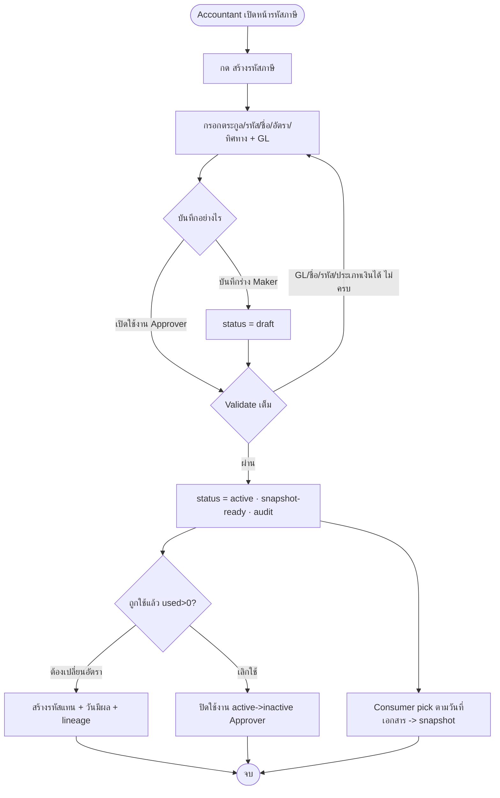
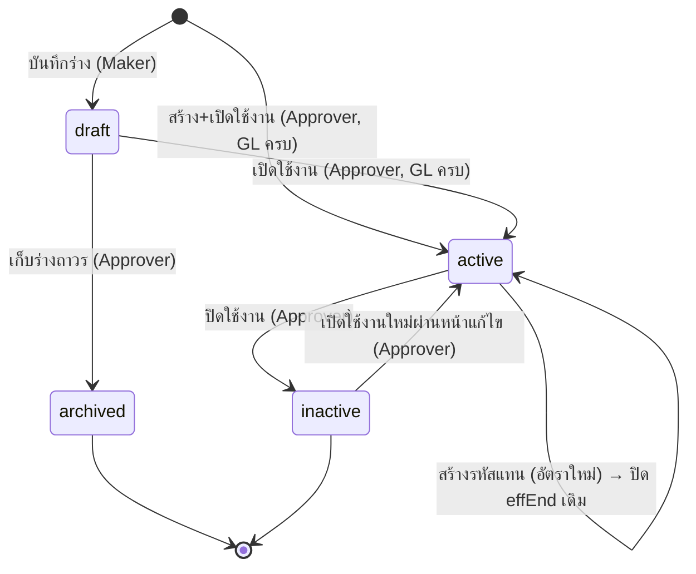

# BRD: Tax Code — รหัสภาษี (Master Data)

| Field | Value |
|---|---|
| BRD ID | BRD-ACC-TAX-001 |
| Feature Name | Tax Code — รหัสภาษี (VAT + Withholding Tax Master Data) |
| Feature ID | F-TAX |
| BRD Type | New Feature |
| Version | 1.0 |
| Status | AI Reviewed → APPROVED |
| Module | Accounting · ตั้งค่าบัญชี (Shared Foundation Master Data · W1) |
| Owner | BA (WF-01 · SOW3.2) |
| Stakeholders | ฝ่ายบัญชี (Accounting), Finance Manager, ทีมพัฒนา ERP Core, ผู้บริโภค downstream (SO/PO/Invoice/Payment/VAT-WHT report) |
| Production Route | `/accounting/setup/tax-codes` |
| Prototype Route | `TaxCode.html#/accounting/setup/tax-codes` |
| Created Date | 2026-08-05 |
| Last Updated | 2026-08-05 |

## Changelog
- v1.0 (2026-08-05): สร้าง BRD ผ่าน brd-generator-full (Fresh Mode / HTML-first / New Feature)
  - Input: PREBRIEF_F-TAX + AI_DEFAULTS.md (LOCKED) + DECISION_LOG.md + CENTRAL_PLAN_CORE_ERP.md v1.4 + TaxCode.html (ux R2 PASS / coverage R2 PASS 28/28)
  - ไม่มี RIF → ใช้ PREBRIEF + AI_DEFAULTS + DECISION_LOG เป็น business-intent source; HTML เป็น screen source of truth
  - FLAG-1 RESOLVED: WHT GL picker constrained = `WHT_PAYABLE` role เท่านั้น

---

## Section 1: Document Info

ดูตารางด้านบน

**ที่มาของเอกสาร (No-RIF Grounding):** ฟีเจอร์นี้ไม่มี RIF — business intent มาจาก `PREBRIEF_F-TAX_TaxCode.md` (node-level contract) + `AI_DEFAULTS.md` (11 approved defaults + Scope Lock, สถานะ LOCKED) + `DECISION_LOG.md` (C1-C6, D1-D11, FLAG-1 RESOLVED). Screen Inventory + fields + statuses + validation สกัดจาก `outputs/10_Tax-Code/01_HTML/TaxCode.html` (ผ่าน ux gate R2 + coverage gate R2 28/28). สิ่งที่ไม่มีในแหล่งข้างต้นถูกยกเป็น `[AI-DEFAULT]` หรือ Section 15 Open Questions — ไม่มีการสมมติ business rule หรือหน้าจอเพิ่ม.

---

## Section 2: Business Context

### 2.1 ปัญหา / โอกาส
เอกสารการเงินทุกใบ (SO/AR Invoice, PO/AP Invoice, Payment Voucher) และรายงานภาษีบังคับตามกฎหมาย (ภ.พ.30, ภ.ง.ด.3/53) ต้องอ้าง "รหัสภาษี" ที่ถูกต้องและคงที่ ณ วันที่เอกสาร หากไม่มี master กลางที่:
- คุมความ unique ของรหัสต่อบริษัท
- ผูกบัญชี GL เพื่อ posting อัตโนมัติ
- ล็อกอัตราที่ถูกใช้แล้วไม่ให้แก้ (มิฉะนั้นเอกสารเก่าเพี้ยน + audit ไม่ผ่าน)
- คุมการโผล่ใน picker ด้วยช่วงวันมีผล
จะเกิดความเสี่ยง: ลงบัญชีภาษีผิด, รายงานสรรพากรผิด, และประวัติภาษีย้อนหลังเสียหาย. Tax Code Master แก้ปัญหานี้โดยเป็นแหล่งข้อมูลกลางแหล่งเดียว (single source of truth) ที่มี preset ไทยครบตั้งแต่วันแรก.

### 2.2 เป้าหมายทาง Business
- เป้าหมาย 1: มี master รหัสภาษีกลาง (VAT ขาย/ซื้อ + WHT) ที่เอกสารการเงินและรายงานภาษีทุกโมดูลอ้างอิงได้อย่างสอดคล้อง
- เป้าหมาย 2: รับประกันความถูกต้องของ posting ภาษี (บังคับผูก GL ก่อนใช้งาน) และความคงที่ของประวัติภาษี (อัตราที่ใช้แล้วแก้ไม่ได้ + snapshot ลงเอกสาร)
- เป้าหมาย 3: รองรับการเปลี่ยนอัตราตามกฎหมายโดยไม่ทำลายข้อมูลเดิม (สร้าง replacement code + วันมีผล + lineage)
- เป้าหมาย 4: พร้อมใช้งานทันที — preset ไทย 7 รหัสพร้อม GL ตั้งแต่ mock/launch แรก

### 2.3 ตัวชี้วัดความสำเร็จ (Success Metrics — บังคับวัดได้)

| Metric | Baseline ปัจจุบัน | Target | วัดยังไง/จากไหน | วัดเมื่อไหร่ | KPI คู่ (§17.3) |
|---|---|---|---|---|---|
| M1 อัตราเอกสารการเงินที่ resolve รหัสภาษีถูกต้องตามวันที่เอกสาร | ต้องเก็บ baseline ก่อน launch (ปัจจุบันไม่มี master กลาง) | 100% | นับ snapshot ภาษีในเอกสาร consumer ที่มี taxCodeId + rate ครบ / เอกสารการเงินทั้งหมด | หลัง launch 30 วัน | KPI-1 |
| M2 จำนวนรหัสภาษี active ที่ยังไม่ผูก GL | ต้องเก็บ baseline (คาดหวัง 0 หลัง enforcement) | 0 | query records status=active AND (glSale/glPurchase/glWht = null ตาม direction) | รายวัน (ต่อเนื่อง) | KPI-2 |
| M3 สัดส่วนการเปลี่ยนอัตราที่ทำผ่าน replacement code (ไม่ใช่แก้ของเดิม) | ต้องเก็บ baseline | 100% (0 การแก้อัตรารหัสที่ used>0) | audit log: จำนวน replacement events / จำนวนคำขอเปลี่ยนอัตราทั้งหมด | รายไตรมาส / เมื่อมีการเปลี่ยนกฎหมายภาษี | KPI-3 |
| M4 ความพร้อม preset ไทยวันแรก | 0 (ระบบใหม่) | 7/7 รหัส (VAT7, VAT0, VAT-EX, WHT1, WHT2, WHT3, WHT5) พร้อม GL | ตรวจ seed data ตอน go-live | ณ วัน launch | KPI-4 |
| M5 ความสมบูรณ์ของ audit trail (ทุก event ถูกบันทึก append-only) | ต้องเก็บ baseline | 100% ของ create/update/activate/deactivate/archive/replacement | เทียบจำนวน mutation events กับจำนวน audit rows | รายเดือน | KPI-5 |

> กติกา: ทุก metric มี KPI คู่ใน §17.3 และวิธีวัดจากแหล่งข้อมูลจริง — ไม่มีตัวชี้วัดลอย

### 2.4 ที่มาของ Requirement
- เคสที่เกิด: [STD] ภาษีไทย VAT 7%/0%/ยกเว้น + WHT ภ.ง.ด. 1/2/3/5% (PREBRIEF §0 OB-1..OB-4)
- Request จาก: เส้นในแผน — เอกสารการเงินทุกใบเป็นผู้บริโภค (PREBRIEF OB-2), Accounting เป็นเจ้าของ master
- Gap: Central Plan ระบุ Tax Code "อยู่ Registry (ระบบเดิมมี)" แต่ยังไม่มี node-level spec ที่ผูก GL + effective date + replacement lineage สำหรับ ERP Core รอบนี้

---

## Section 3: Scope

### 3.1 In Scope
- จัดการ master รหัสภาษี 2 ตระกูล: **VAT** (ทิศทาง ขาย/ซื้อ/ทั้งคู่, ประเภท STANDARD/ZERO_RATED/EXEMPT) และ **WHT** (ทิศทางจ่าย, บังคับประเภทเงินได้)
- สร้าง / แก้ไข / บันทึกร่าง / เปิดใช้งาน (activate) / ปิดใช้งาน (deactivate) / เก็บถาวร (archive) รหัสภาษี
- ผูกบัญชี GL (จากผังบัญชี CoA) ตามทิศทาง/ตระกูล — บังคับก่อน active
- ช่วงวันมีผล (effStart / effEnd) คุมการโผล่ใน picker ตามวันที่เอกสาร
- Replacement flow: อัตราของรหัสที่ถูกใช้แล้วแก้ไม่ได้ → สร้างรหัสแทน + วันมีผลใหม่ + เก็บ lineage
- Preset ไทย 7 รหัสพร้อม GL ตั้งแต่วันแรก
- ตัวเลือกตามวันที่เอกสาร (picker) + บันทึก immutable tax snapshot ลงเอกสาร consumer
- Append-only audit trail + soft archive (ไม่มี hard delete)
- ทำงานใน current-company context (ข้อมูล/uniqueness/GL ผูกบริษัทปัจจุบัน)
- Permissions: `tax_code.view/create/update/activate/deactivate/view_audit`

### 3.2 Out of Scope (ห้ามเผลอเติม — ยึด AI_DEFAULTS §Out of Scope)
- ❌ ค่าเริ่มต้น Tax Code รายชนิดเอกสาร (default code ต่อเอกสาร เช่น SO default VAT7) → อยู่ config module อื่น (PREBRIEF OQ-1)
- ❌ Incoming WHT / หนังสือรับรองภาษีหัก ณ ที่จ่ายฝั่งรับ (ลูกค้าหักเรา) (PREBRIEF OQ-2)
- ❌ การยื่นแบบ / เชื่อมต่อกรมสรรพากร (RD e-filing) โดยตรง
- ❌ การสร้างเอกสาร PDF (feature เป็น master/config — skip thai-doc-pdf-generator)
- ❌ ภาษีต่างประเทศ / multi-jurisdiction — THB/ไทยเท่านั้น (Scenario S-06)
- ❌ การสร้างหน้ารายงาน ภ.พ.30 / ภ.ง.ด.3/53 เอง (เป็น downstream consumer — External Contract)

### 3.3 Assumptions
- A1: ผังบัญชี (Chart of Accounts) มีอยู่แล้วเป็น master upstream และ GL account มี field `taxRole` (VAT_SALE / VAT_PURCHASE / WHT_PAYABLE), `status`, `postingAllowed`, `companyId`
- A2: บริบทบริษัทปัจจุบัน (current company) ถูกกำหนดจากภายนอกฟีเจอร์ (session/context) — ฟอร์มไม่มี company switcher
- A3: ระบบผู้บริโภค downstream (SO/AR/PO/AP/Payment/รายงานภาษี) เป็น External Contract — ยังไม่ถือว่า implement แล้ว
- A4: มี Audit Log / permission framework กลางให้ reuse (ยังไม่ยืนยันด้วย System Module Registry — ดู §12.3)

### 3.4 Scope Lock ⭐ (สืบทอดจาก AI_DEFAULTS.md — LOCKED)
- **Scope Lock Ref:** `AI_DEFAULTS.md` (F-TAX) — สถานะ **LOCKED** สำหรับส่งต่อ AI Coding Agent · วันที่ 2026-08-05 (ไม่มีเลขใบเซ็นลูกค้าแบบ chain — งานนี้เดินด้วย approved AI defaults)
- **Locked Decisions (ห้าม override ตลอด chain):**

| LOCK-ID | ข้อยืนยัน | อ้างอิง |
|---|---|---|
| LOCK-01 | Tax Code แยกตามบริษัท + รหัส unique case-insensitive ในบริษัทเดียว | AI-DEFAULT #1 / D1 / BR-01 |
| LOCK-02 | UI ทำงานใน current-company context — เปลี่ยนบริษัทในฟอร์มไม่ได้ | AI-DEFAULT #2 / D2 |
| LOCK-03 | GL lookup รับเฉพาะบัญชีบริษัทปัจจุบัน `status=active` + `posting_allowed=true` | AI-DEFAULT #3 / D3 |
| LOCK-04 | VAT รองรับ STANDARD/ZERO_RATED/EXEMPT + ทิศ ขาย/ซื้อ/ทั้งคู่ + `vat_report_category` | AI-DEFAULT #4 / D4 |
| LOCK-05 | WHT เก็บ income category; แบบ ภ.ง.ด. resolve ที่ payment/reporting ไม่ hardcode ที่ Tax Code | AI-DEFAULT #5 / D5 |
| LOCK-06 | AP เสนอ WHT ได้ แต่ Payment Voucher = จุดยืนยันหัก; WHT report อ่านจาก payment result | AI-DEFAULT #6 / D6 |
| LOCK-07 | picker ใช้วันที่เอกสาร + บันทึก immutable tax snapshot ลงเอกสาร | AI-DEFAULT #7 / D7 |
| LOCK-08 | ไม่มี hard delete — deactivate/archive + append-only audit | AI-DEFAULT #8 / D8 / BR-05 |
| LOCK-09 | อัตราของรหัสที่ถูกใช้แล้วแก้ไม่ได้ — เปลี่ยน = replacement code + lineage | AI-DEFAULT #9 / D9 / BR-02 |
| LOCK-10 | permissions ชุด `tax_code.*` 6 สิทธิ์ | AI-DEFAULT #10 / D10 |
| LOCK-11 | route prod `/accounting/setup/tax-codes` | AI-DEFAULT #11 / D11 |
| LOCK-12 | WHT GL picker filter เฉพาะ `WHT_PAYABLE` (FLAG-1 RESOLVED) | DECISION_LOG C2/F1 |

- **Scope Drift:** ไม่พบ — In Scope ทุกข้อและ HTML ทุก route/action อยู่ในขอบเขต PREBRIEF + AI_DEFAULTS (ยืนยันโดย coverage gate R2: scope creep 0). ไม่มีข้อขัด LOCK.

---

## Section 4: User Roles & Permissions

### 4.1 Roles ที่เกี่ยวข้อง
| Role | คำอธิบาย | COSO |
|---|---|---|
| พนักงานบัญชี (Accountant) | สร้าง/แก้ไข/บันทึกร่างรหัสภาษี, ผูก GL, ดูข้อมูล+audit | Maker |
| หัวหน้าบัญชี (Senior Accountant) | ทบทวนความถูกต้องก่อนเปิดใช้ (optional layer) | Checker |
| ผู้จัดการบัญชี/การเงิน (Accounting/Finance Manager) | เปิดใช้งาน (activate), ปิดใช้งาน (deactivate), เก็บถาวร (archive) — governance ของ master data | Approver |
| ระบบ (System) | validate uniqueness/GL role, filter GL ตามบริษัท, snapshot ตามวันที่เอกสาร, เขียน audit append-only | System |
| ผู้บริโภค downstream (External) | อ่าน/เลือกรหัสภาษีผ่าน picker ไปใช้ในเอกสาร (SO/PO/Invoice/Payment) + รายงานภาษี — ไม่แก้ master | External Contract |

### 4.2 Permission Matrix (สิทธิ์ `tax_code.*` — AI-DEFAULT #10 / D10)
| Action / Permission | Accountant (Maker) | Senior Acct (Checker) | Acct/Fin Manager (Approver) |
|---|:---:|:---:|:---:|
| `view` (ดูรายการ/รายละเอียด) | ✅ | ✅ | ✅ |
| `view_audit` (ดูประวัติ) | ✅ | ✅ | ✅ |
| `create` (สร้าง + บันทึกร่าง) | ✅ | ✅ | ✅ |
| `update` (แก้ไข + บันทึกร่าง) | ✅ | ✅ | ✅ |
| `activate` (เปิดใช้งาน draft→active / create+activate) | ❌ | ❌ | ✅ |
| `deactivate` (ปิดใช้งาน active→inactive / เก็บร่างถาวร draft→archived) | ❌ | ❌ | ✅ |

> **หมายเหตุ SoD:** production model แยก `create/update` (Maker) ออกจาก `activate/deactivate` (Approver) → Maker ≠ Approver.
> **HTML drift note:** prototype demo user ("สุนิสา (บัญชี)") ถือครบทั้ง 6 สิทธิ์ในชุดเดียว (single-user sandbox, L2067-2069) เพื่อสาธิต flow — production ต้อง split ตามตารางนี้. ยกเป็น **OQ-3** (ยืนยันว่าต้องมี second-person approval จริง หรือ single-role accounting-admin governance เพียงพอสำหรับ tax master data).

---

## Section 5: User Journey (with COSO) ⭐

> ทุก step map กับ route/ปุ่มจริงบนจอ (HTML). SoD บังคับ: Maker (สร้าง draft) ≠ Approver (เปิดใช้งาน).

### 5.1 Happy Path — สร้างรหัสภาษีใหม่ + เปิดใช้งาน

| # | Step | Maker | Checker | Approver | System | Route/UI จริง | Notes |
|---|---|---|---|---|---|---|---|
| 1 | เปิดหน้ารายการรหัสภาษี (แท็บ VAT/WHT) | Accountant | — | — | โหลด records ของบริษัทปัจจุบัน + KPI | `#/accounting/setup/tax-codes` · renderList | LOCK-02 company scope |
| 2 | กด "สร้างรหัสภาษี" → เปิด form drawer | Accountant | — | — | เปิด drawer + default form (VAT/standard/7%/both) | `openDrawer('create')` L2321 · renderFormDrawer | ต้องมี `tax_code.create` |
| 3 | เลือกตระกูล + กรอกรหัส/ชื่อ/อัตรา/ทิศทาง (WHT: ประเภทเงินได้) | Accountant | — | — | สลับ field ตามตระกูล/ทิศทาง; auto set `vat_report_category` | familyCtl/vatKindCtl/dirCtl/incomeCtl L2429-2481 | LOCK-04/05 |
| 4 | เลือกบัญชี GL (search combobox) | Accountant | — | — | filter GL: VAT_SALE/VAT_PURCHASE/WHT_PAYABLE + บริษัทปัจจุบัน active+posting | `glOptions()` L2575/2578/2581 | LOCK-03/12 |
| 5 | บันทึกร่าง (ยังไม่ครบ GL ก็ได้) | Accountant | — | — | validate code+ชื่อ; status=draft; audit "บันทึกร่าง" | `saveDraft()` L2663-2670 | Maker action; draft ไม่บังคับ GL |
| 6 | (ทบทวน) หัวหน้าบัญชีตรวจความถูกต้อง | — | Senior Accountant | — | — | (นอกจอ/optional layer) | Checker optional |
| 7 | เปิดใช้งาน (activate) | — | — | Acct/Fin Manager | validate เต็ม (uniqueness, GL role, effStart, WHT income type); status=active; snapshot-ready; audit | `submitForm()` L2671-2685 | ต้อง `activate`; **Maker≠Approver** |

**SoD Check:** Maker (Accountant สร้าง draft, step 5) ≠ Approver (Acct/Fin Manager เปิดใช้งาน, step 7) ✅

### 5.2 Alternative / Exception Paths

#### 5.2.1 Replacement Path — เปลี่ยนอัตราของรหัสที่ถูกใช้แล้ว (S-03 / BR-02 / LOCK-09)
| # | Step | COSO | Route/UI จริง | Notes |
|---|---|---|---|---|
| 1 | เปิดแก้ไขรหัสที่ `used>0` | Maker (เปิด) | `openDrawer('edit')` | rate/family/kind/direction/code ถูกล็อก (rateLocked L2424) |
| 2 | ระบบแจ้ง "แก้อัตราไม่ได้" + ปุ่ม "สร้างรหัสแทน" | System | rateReplaceBtn L2500-2502 | อ่านอย่างเดียว |
| 3 | สร้างรหัสแทน (code+"-N", อัตรา+วันมีผลใหม่) | Maker | `openReplacement()` L2394-2410 | eyebrow "สร้างรหัสแทน" |
| 4 | ยืนยัน/เปิดใช้งานรหัสแทน | Approver | `submitForm()` → commitForm L2634-2656 | ระบบตั้ง `replacedByTaxCodeId` + ปิด `effEnd` เดิม = วันก่อน effStart ใหม่ + audit lineage |

#### 5.2.2 Deactivate / Archive Path (S-04/S-05 / BR-05 / LOCK-08)
| # | Step | COSO | Route/UI จริง | Notes |
|---|---|---|---|---|
| 1 | เลือก "ปิดใช้งาน" (active) หรือ "เก็บร่างถาวร" (draft) | Approver | `confirmDeactivate`/`confirmArchiveDraft` L2755-2756 | modal ยืนยัน |
| 2 | ยืนยันใน modal | Approver | `doArchive()` L2757-2765 | active→inactive / draft→archived; set effEnd=today; audit; ไม่มี hard delete (modal: "ระบบไม่มีการลบถาวร") |

#### 5.2.3 Consumer Pick Path — ตัวเลือกตามวันที่เอกสาร (LOCK-06/07) — External-facing
| # | Step | COSO | Route/UI จริง | Notes |
|---|---|---|---|---|
| 1 | เปิด "ดูรายการที่เลือกได้ในเอกสารใหม่" | External consumer / Accountant (ดู) | `openModal('picker')` L2320 · renderModal picker | เลือก context: ขาย/ซื้อ/ใบสำคัญจ่าย + วันที่เอกสาร |
| 2 | ระบบกรองรหัสที่ pickable ตามวันที่เอกสาร | System | `isPickable()` L2219-2224 · L2790-2796 | active + effStart≤date≤effEnd |
| 3 | เลือกและบันทึก snapshot | System | `captureSnapshot()` L2820-2824 | WHT ในเอกสารซื้อ = "แนะนำ · ยืนยันตอนจ่าย" (block snapshot L2822); final ที่ Payment (LOCK-06) |

#### 5.2.4 Error/Reject (validate)
| กรณี | ผลลัพธ์ | Route/UI จริง |
|---|---|---|
| รหัสซ้ำในบริษัท | block inline "รหัสนี้มีอยู่แล้วในบริษัทปัจจุบัน" | `validateForm` L2596-2597 |
| GL ไม่ครบตอน activate | block "ต้องเลือกบัญชี GL กลุ่ม...ก่อนเปิดใช้งาน" | L2606-2609 |
| WHT ไม่ระบุประเภทเงินได้ | block "WHT ต้องระบุประเภทเงินได้" | L2604 |
| วันสิ้นสุดก่อนวันเริ่ม | block "วันสิ้นสุดต้องไม่ก่อนวันเริ่ม" | L2613 |
| ไม่มีสิทธิ์ | toast "คุณไม่มีสิทธิ์..." | L2664/2673 |

### 5.3 Process Diagram


---

## Section 6: Data Entity & Fields

### 6.1 Entity Overview
| Entity | Type | Description |
|---|---|---|
| TaxCode | Header (Master) | รหัสภาษี VAT/WHT ต่อบริษัท |
| TaxCode_Audit | Detail (append-only) | ประวัติการเปลี่ยนแปลง (ts, actor, action) |
| GL_Account (Chart of Accounts) | Master (external, referenced) | บัญชีแยกประเภทที่ผูกกับรหัสภาษี |
| Income_Type | Reference list | ประเภทเงินได้สำหรับ WHT (โยง ภ.ง.ด.3/53) |
| Tax_Snapshot | Embedded (in consumer doc, external) | ค่าภาษี immutable ที่ถูกบันทึกลงเอกสาร ณ วันที่เอกสาร |

### 6.2 Entity: TaxCode
| # | Field | Label UI | Input Type | ค่า/ตัวเลือก | จำเป็น | เงื่อนไข | หมายเหตุ |
|---|---|---|---|---|:---:|---|---|
| 1 | id | — | AUTO | `TX-NN` | ✅ | PK | ระบบ gen |
| 2 | companyId | บริษัท | AUTO | current company | ✅ | LOCK-02 | เปลี่ยนในฟอร์มไม่ได้ |
| 3 | code | รหัส | TEXT | เช่น VAT7, WHT3 | ✅ | unique/company (case-insensitive); ล็อกเมื่อ used>0 | BR-01/LOCK-01 |
| 4 | name | ชื่อ | TEXT | ชื่อที่แสดงบนเอกสาร | ✅ | — | |
| 5 | family | ตระกูลภาษี | DROPDOWN-SINGLE | VAT / WHT | ✅ | ล็อกเมื่อ used>0 | LOCK-04/05 |
| 6 | vatKind | ประเภท VAT | DROPDOWN-SINGLE | standard / zero / exempt | ✅ (VAT) | ล็อกเมื่อ used>0 | เฉพาะ VAT |
| 7 | rate | อัตรา (%) | NUMBER | 0–100 | ✅ (ยกเว้น VAT exempt) | ล็อกเมื่อ used>0; zero/exempt→0 | BR-02/LOCK-09 |
| 8 | direction | ทิศทาง | DROPDOWN-SINGLE | VAT: sale/purchase/both · WHT: pay | ✅ | ล็อกเมื่อ used>0 | LOCK-04 |
| 9 | glSale | บัญชี GL — ภาษีขาย | LOOKUP (combobox) | GL role=VAT_SALE | ✅ ก่อน active (VAT sale/both) | filter company+active+posting | BR-04/LOCK-03 |
| 10 | glPurchase | บัญชี GL — ภาษีซื้อ | LOOKUP | GL role=VAT_PURCHASE | ✅ ก่อน active (VAT purchase/both) | เดียวกัน | BR-04/LOCK-03 |
| 11 | glWht | บัญชี GL — WHT ค้างจ่าย | LOOKUP | GL role=WHT_PAYABLE | ✅ ก่อน active (WHT) | **filter WHT_PAYABLE เท่านั้น (FLAG-1 RESOLVED/LOCK-12)** | BR-04 |
| 12 | incomeType | ประเภทเงินได้ | LOOKUP (search) | Income_Type list | ✅ (WHT) | BR-03/FN-04 | โยง ภ.ง.ด. |
| 13 | incomeCategoryCode | — | AUTO | map จาก incomeType | ✅ (WHT) | derive | สำหรับรายงาน |
| 14 | vatReportCategory | หมวดรายงาน VAT | AUTO | STANDARD/ZERO_RATED/EXEMPT | ✅ (VAT) | จาก vatKind | LOCK-04 (feed PP.30) |
| 15 | reportMappingRule | กติกาแบบรายงาน | AUTO | `RESOLVE_BY_PAYEE_AND_PAYMENT_CONTEXT` | ✅ (WHT) | ไม่ hardcode ภ.ง.ด. | LOCK-05 |
| 16 | effStart | วันมีผลเริ่ม | DATE | — | ✅ ก่อน active | ≤ effEnd | คุม picker |
| 17 | effEnd | วันมีผลสิ้นสุด | DATE | — | ⬜ (ไม่มี=ไม่มีกำหนด) | ≥ effStart | auto set ตอน deactivate/archive |
| 18 | status | สถานะ | DROPDOWN-SINGLE | draft/active/inactive/archived | ✅ | state machine | §8 |
| 19 | used | ใช้แล้ว (จำนวนเอกสาร) | AUTO | number | ✅ | read-only (จาก consumer) | badge FN-06 |
| 20 | isSystemPreset | — | AUTO | boolean | ✅ | 7 preset ไทย | FN-01 |
| 21 | replacesTaxCodeId | ใช้แทนรหัส | AUTO | FK→TaxCode | ⬜ | replacement lineage | BR-02 |
| 22 | replacedByTaxCodeId | ถูกแทนด้วย | AUTO | FK→TaxCode | ⬜ | replacement lineage | BR-02 |
| 23 | created_by / created_date | ผู้สร้าง/วันที่สร้าง | AUTO | actor/ts | ✅ | Audit | ใน HTML = audit[0] (append-only timeline) |
| 24 | modified_by / modified_date | ผู้แก้/วันที่แก้ | AUTO | actor/ts | ⚠️ | Audit | ล่าสุดใน audit[] |

> **Audit fields note (C08):** HTML implement audit ผ่าน `audit[]` (append-only, `{ts, actor, action}`, `unshift` ทุก event L2640/2643/2650/2762) แทนคอลัมน์ created/modified แยก — ครอบคลุมความหมาย created_by/date + modified_by/date + full change history. Production entity ควรมีทั้ง audit trail table และ/หรือ created/modified columns.

### 6.3 Entity: Income_Type (reference — WHT)
ค่า: ค่าขนส่ง (แนะนำ 1%), ค่าโฆษณา (2%), ค่าบริการ/รับจ้างทำของ (3%), ค่าเช่าอสังหาริมทรัพย์ (5%), ค่าวิชาชีพอิสระ (3%), ค่าสิทธิ Royalty (3%), ดอกเบี้ย (1%), เงินปันผล (10%) — อัตราเป็น "คำแนะนำ" ไม่บังคับ (ผู้ใช้กรอกอัตราจริงเอง). code map → TRANSPORT/ADVERTISING/SERVICE/RENT/PROFESSIONAL/ROYALTY/INTEREST/DIVIDEND.

### 6.4 Entity Relationship
```
GL_Account (CoA) ──(referenced by, filter taxRole+company+active+posting)──▶ TaxCode.glSale/glPurchase/glWht
Income_Type ──(referenced by)──▶ TaxCode.incomeType (WHT)
TaxCode ──(1:N)──▶ TaxCode_Audit
TaxCode ──(self-ref lineage 1:1)──▶ TaxCode (replacesTaxCodeId / replacedByTaxCodeId)
TaxCode ──(snapshotted into, immutable)──▶ Consumer Document (Tax_Snapshot · EXTERNAL)
```

---

## Section 7: User Stories & Acceptance Criteria

**S-01: ดูรายการรหัสภาษีแยกตระกูล VAT/WHT**
- As a พนักงานบัญชี · I want to ดูรหัสภาษีของบริษัทตัวเองแยกแท็บ VAT/WHT พร้อมสถานะ/ช่วงวันมีผล · So that ติดตามรหัสที่ใช้ได้
- AC1: Given login มี `tax_code.view`, When เปิด `#/accounting/setup/tax-codes`, Then เห็นตาราง 8 คอลัมน์ (รหัส/ชื่อ/อัตรา/ทิศทางหรือประเภทเงินได้/วันมีผลเริ่ม/วันมีผลสิ้นสุด/สถานะ/actions) + KPI 4 ตัว
- AC2: Given อยู่แท็บ VAT, When กดแท็บ WHT, Then ตารางแสดงเฉพาะ records family=WHT ของบริษัทปัจจุบัน

**S-02: สร้างรหัสภาษีใหม่**
- As a พนักงานบัญชี · I want to สร้างรหัสภาษีใหม่ · So that มีรหัสให้เอกสารใหม่เลือก
- AC1: Given กด "สร้างรหัสภาษี", When กรอกครบ + Approver เปิดใช้งาน, Then status=active + บันทึก audit "สร้างและเปิดใช้งาน"
- AC2: Given รหัสซ้ำในบริษัท, When submit, Then block + inline "รหัสนี้มีอยู่แล้วในบริษัทปัจจุบัน"

**S-03: บันทึกร่างรหัสที่ยังผูก GL ไม่ครบ**
- As a พนักงานบัญชี · I want to บันทึกร่างก่อนผูก GL · So that เก็บงานค้างไว้ได้
- AC1: Given กรอกรหัส+ชื่อ แต่ยังไม่เลือก GL, When กด "บันทึกร่าง", Then status=draft สำเร็จ (ไม่บังคับ GL)
- AC2: Given เป็น draft, When Approver พยายามเปิดใช้งานโดยยังไม่มี GL, Then block "ต้องเลือกบัญชี GL...ก่อนเปิดใช้งาน"

**S-04: ผูกบัญชี GL ตามทิศทาง/ตระกูล**
- As a พนักงานบัญชี · I want to เลือก GL ที่ถูกกลุ่ม · So that posting ภาษีถูกต้อง
- AC1: Given VAT direction=sale, When เปิด combobox GL ภาษีขาย, Then เห็นเฉพาะ GL role=VAT_SALE ของบริษัทปัจจุบันที่ active+posting
- AC2: Given WHT, When เปิด combobox GL, Then เห็นเฉพาะ GL role=WHT_PAYABLE (FLAG-1 RESOLVED)

**S-05: บังคับประเภทเงินได้สำหรับ WHT**
- As a ระบบ · I want to บังคับ WHT ระบุประเภทเงินได้ · So that รายงาน ภ.ง.ด. ถูกต้อง
- AC1: Given family=WHT ไม่เลือกประเภทเงินได้, When activate, Then block "WHT ต้องระบุประเภทเงินได้"
- AC2: Given เลือกประเภทเงินได้, When บันทึก, Then set `incomeCategoryCode` อัตโนมัติ

**S-06: ล็อกอัตราของรหัสที่ถูกใช้แล้ว**
- As a ระบบ · I want to ป้องกันการแก้อัตราของรหัสที่ used>0 · So that เอกสารเก่าไม่เพี้ยน
- AC1: Given รหัส used>0, When เปิดแก้ไข, Then ช่องอัตรา/ตระกูล/ทิศทาง/รหัส อ่านอย่างเดียว + ป้าย "อ่านอย่างเดียว"
- AC2: Given ต้องเปลี่ยนอัตรา, When กด "สร้างรหัสแทน", Then เปิดฟอร์มรหัสใหม่ (code+"-N") กำหนดอัตรา+วันมีผลใหม่

**S-07: สร้างรหัสแทนพร้อม lineage**
- As a ผู้จัดการบัญชี · I want to สร้างรหัสแทนเมื่ออัตราเปลี่ยนตามกฎหมาย · So that เก็บประวัติได้
- AC1: Given สร้างรหัสแทนจากรหัสเดิม, When ยืนยัน, Then รหัสใหม่ตั้ง `replacesTaxCodeId` + รหัสเดิมตั้ง `replacedByTaxCodeId` + ปิด effEnd เดิม = วันก่อน effStart ใหม่
- AC2: Given เปิด view รหัสใหม่/เดิม, When ดูรายละเอียด, Then เห็น "ใช้แทนรหัส"/"ถูกแทนด้วย"

**S-08: ปิดใช้งาน / เก็บถาวร โดยไม่ลบถาวร**
- As a ผู้จัดการบัญชี · I want to ปิดใช้งานรหัสที่เลิกใช้ · So that เอกสารใหม่เลือกไม่ได้แต่ของเดิมยังใช้ได้
- AC1: Given รหัส active, When ยืนยันปิดใช้งาน, Then status=inactive + effEnd=today + audit; เอกสารเดิมยังอ้างอิงได้
- AC2: Given รหัส draft, When เก็บร่างถาวร, Then status=archived; ไม่มี hard delete (modal ยืนยัน "ระบบไม่มีการลบถาวร")

**S-09: ปรากฏใน picker ตามวันที่เอกสาร + snapshot**
- As a ระบบ/consumer · I want to ให้เอกสารเลือกรหัสที่ใช้ได้ ณ วันที่เอกสาร · So that ภาษีถูกต้องตามช่วงเวลา
- AC1: Given เลือก context+วันที่เอกสาร ใน picker, When ระบบกรอง, Then แสดงเฉพาะรหัส active ที่ effStart≤วันที่≤effEnd + ทิศทางตรง context
- AC2: Given เลือกและบันทึก, When capture, Then บันทึก immutable snapshot (taxCodeId/code/rate/family/direction/context/documentDate)

**S-10: ดูประวัติการเปลี่ยนแปลง (Audit)**
- As a ผู้มีสิทธิ์ `view_audit` · I want to ดู timeline การเปลี่ยนแปลง · So that ตรวจสอบย้อนหลังได้
- AC1: Given มี `tax_code.view_audit`, When เปิด view drawer, Then เห็น section "ประวัติการเปลี่ยนแปลง (Audit)" เรียงล่าสุดก่อน
- AC2: Given ไม่มีสิทธิ์ view_audit, When เปิด view drawer, Then ไม่แสดง section audit

---

## Section 8: Status & Lifecycle

### 8.1 State Diagram


### 8.2 State Transition Table
| Current | Trigger | Next | COSO Role | System | หมายเหตุ |
|---|---|---|---|---|---|
| (none) | saveDraft | draft | Maker | validate code+ชื่อ | ไม่บังคับ GL |
| (none) | submitForm | active | Approver | validate เต็ม + GL role | create+activate |
| draft | submitForm | active | Approver | validate เต็ม | บังคับ GL |
| draft | archiveDraft | archived | Approver | effEnd=today + audit | soft archive |
| active | deactivate | inactive | Approver | effEnd=today + audit | เอกสารเดิมใช้ได้ |
| inactive | edit→activate | active | Approver | modal ระบุ reactivate ได้ | L2784 |
| active | openReplacement | active (ใหม่) + effEnd เดิม | Maker→Approver | lineage + previousDate | BR-02 |

---

## Section 9: Business Rules + Validation (with Tags)

### 9.1 Business Rules
| Rule ID | Rule | Tag | Type | เหตุผล Tag |
|---|---|:---:|---|---|
| R01 | รหัส unique ต่อบริษัท (case-insensitive) | FIXED | Identity | business core — เปลี่ยนไม่ได้ (BR-01/LOCK-01) |
| R02 | อัตราของรหัสที่ `used>0` แก้ไม่ได้ — เปลี่ยน = สร้างรหัสแทน + วันมีผล + lineage | FIXED | Integrity | statutory/audit — ห้ามแก้ (BR-02/LOCK-09) |
| R03 | WHT ต้องระบุประเภทเงินได้ก่อนเปิดใช้งาน | FIXED | Required | โยง ภ.ง.ด. (BR-03/FN-04) |
| R04 | ทุกรหัสต้องผูก GL ตามทิศทาง/ตระกูลก่อน active | FIXED | Integrity | posting อัตโนมัติ (BR-04/LOCK-03) |
| R05 | ไม่มี hard delete — deactivate/archive + append-only audit | FIXED | Governance | (BR-05/LOCK-08) |
| R06 | GL lookup รับเฉพาะบัญชีบริษัทปัจจุบัน `status=active` + `posting_allowed=true` | FIXED | Filter | (LOCK-03/D3) |
| R07 | GL constrained ตาม tax role: VAT ขาย→`VAT_SALE`, VAT ซื้อ→`VAT_PURCHASE`, **WHT→`WHT_PAYABLE` เท่านั้น** | FIXED | Filter | FLAG-1 RESOLVED (LOCK-12) — WHT เหมือน VAT_SALE/VAT_PURCHASE |
| R08 | picker ใช้วันที่เอกสาร (ไม่ใช่วันที่ระบบ) + บันทึก immutable snapshot ลงเอกสาร | FIXED | Temporal | (LOCK-07/D7) |
| R09 | pickable = status active AND effStart ≤ วันที่เอกสาร ≤ effEnd | FIXED | Temporal | คุมการโผล่ (S-04/isPickable) |
| R10 | VAT: STANDARD/ZERO_RATED/EXEMPT + ทิศ sale/purchase/both; zero/exempt → rate=0; auto `vat_report_category` | FIXED | Enum | (LOCK-04/D4) |
| R11 | WHT: แบบ ภ.ง.ด. resolve ที่ payment/reporting (`RESOLVE_BY_PAYEE_AND_PAYMENT_CONTEXT`) ไม่ hardcode ที่ Tax Code | FIXED | Contract | (LOCK-05/D5) |
| R12 | AP เสนอ WHT ได้ (แนะนำ) แต่ Payment Voucher = จุดยืนยันหัก; WHT report อ่านจาก payment result | FIXED | Contract | (LOCK-06/D6) — downstream |
| R13 | อัตราต้องอยู่ระหว่าง 0–100 (validation) | FIXED | Bound | มาตรฐานภาษี |
| R14 | วันสิ้นสุด (effEnd) ต้องไม่ก่อนวันเริ่ม (effStart) | FIXED | Bound | validate L2613 |
| R15 | UI ทำงานใน current-company context — เปลี่ยนบริษัทในฟอร์มไม่ได้ | FIXED | Scope | (LOCK-02/D2) |
| R16 | Preset ไทย 7 รหัสพร้อม GL พร้อมใช้ตั้งแต่วันแรก (seed data set) | CONFIGURABLE | Seed | ชุดเริ่มต้น — เพิ่มรหัสได้ภายหลังผ่านหน้านี้ (FN-01) |
| R17 | อัตราแนะนำต่อประเภทเงินได้ WHT (1/2/3/5/10%) เป็น "คำแนะนำ" ไม่บังคับ | CONFIGURABLE | Reference | ตารางแนะนำ อาจปรับตามกฎหมาย |

> ไม่มี rule ที่ติด DYNAMIC หรือ WARNING (FLAG-1 ถูก resolve แล้ว) — ทุกกฎเป็น business core ที่คงที่ตามข้อกำหนดภาษี ยกเว้น R16/R17 ที่เป็นชุดข้อมูลปรับได้.

### 9.2 Validation Rules
| VR ID | Field/Action | เงื่อนไข | ประเภท | ข้อความ (user-facing จริงจาก HTML) |
|---|---|---|---|---|
| VR01 | code | required | Error | กรุณากรอกรหัส |
| VR02 | code | ซ้ำใน company (case-insensitive) | Error | รหัสนี้มีอยู่แล้วในบริษัทปัจจุบัน |
| VR03 | name | required | Error | กรุณากรอกชื่อ |
| VR04 | rate (activate) | required (ยกเว้น VAT zero/exempt) | Error | กรุณากรอกอัตรา |
| VR05 | rate | 0 ≤ rate ≤ 100 | Error | อัตราต้องอยู่ระหว่าง 0 ถึง 100 |
| VR06 | incomeType (WHT, activate) | required | Error | WHT ต้องระบุประเภทเงินได้ |
| VR07 | glSale (VAT sale/both, activate) | ต้องเป็น GL role VAT_SALE | Error | ต้องเลือกบัญชี GL กลุ่มภาษีขายก่อนเปิดใช้งาน |
| VR08 | glPurchase (VAT purchase/both, activate) | ต้องเป็น GL role VAT_PURCHASE | Error | ต้องเลือกบัญชี GL กลุ่มภาษีซื้อก่อนเปิดใช้งาน |
| VR09 | glWht (WHT, activate) | ต้องเป็น GL role WHT_PAYABLE | Error | ต้องเลือกบัญชี GL กลุ่มภาษีหัก ณ ที่จ่ายค้างจ่ายก่อนเปิดใช้งาน |
| VR10 | effStart (activate) | required | Error | กรุณาระบุวันมีผลเริ่ม |
| VR11 | effEnd | ≥ effStart | Error | วันสิ้นสุดต้องไม่ก่อนวันเริ่ม |
| VR12 | activate/create/deactivate | ตรวจ permission | Warning (toast) | คุณไม่มีสิทธิ์... |
| VR13 | captureSnapshot (WHT ใน PURCHASE) | block final | Warning (toast) | WHT ในเอกสารซื้อเป็นเพียงคำแนะนำ โปรดยืนยันตอนจ่าย |

### 9.5 สรุประดับความยืดหยุ่น
| Rule ID | Tag | ใครเปลี่ยน | บ่อยแค่ไหน | ระดับ | ที่มา |
|---|:---:|---|---|---|---|
| R01–R15 | FIXED | — | — | Hardcode/business core | ✅ grounded (AI_DEFAULTS/DECISION_LOG/HTML) |
| R16 (preset seed 7 รหัส) | CONFIGURABLE | Accounting admin | นานๆ ครั้ง (เพิ่มรหัสตามกฎหมาย) | Admin Panel = หน้านี้เอง (feature เป็น admin surface) | ✅ grounded (FN-01) |
| R17 (อัตราแนะนำต่อประเภทเงินได้) | CONFIGURABLE | Accounting admin / กฎหมาย | ตามการเปลี่ยนกฎหมาย | Config table / Rule Management (เป็นเพียง hint) | 🤖 AI-inferred (จาก INCOME_TYPES sub labels) |

> ไม่มีข้อ 🤖 + DYNAMIC/Engine Management → ไม่ต้อง escalate เป็น OQ (R17 เป็น CONFIGURABLE hint level, mark 🤖 ตามกติกา C23).

---

## Section 10: Edge Cases

### 10.1 Edge Cases ที่ contract/HTML ระบุ (default ☑ — ยืนยันแล้ว)
- ☑ E01 (DI): รหัสถูก deactivate/หมดช่วงวันมีผล → หายจาก picker ใหม่ แต่เอกสารเดิมใช้ snapshot ต่อได้ (S-04, isPickable + snapshot)
- ☑ E02 (ST): แก้อัตรารหัสที่ used>0 → block → เส้นทาง "สร้างรหัสแทน" (S-03/BR-02)
- ☑ E03 (ST): ลบรหัสที่ถูกใช้แล้ว → block → soft archive/deactivate เท่านั้น (S-05/BR-05)
- ☑ E04 (DI): draft ที่ยังไม่ผูก GL → บันทึกร่างได้ แต่ activate ไม่ได้ (FN-02/BR-04)
- ☑ E05 (CL/Contract): WHT ในเอกสารซื้อ (AP) เป็น "แนะนำ" เท่านั้น → block snapshot final; ยืนยันจริงที่ Payment Voucher (LOCK-06)
- ☑ E06 (DI): รหัสซ้ำในบริษัท (case-insensitive) → block inline (BR-01)
- ☑ E07 (Scope): เลือกภาษีต่างประเทศ/สกุลอื่น → ไม่รองรับ (THB/ไทยเท่านั้น, ไม่มี selector) (S-06)

### 10.2 Edge Cases จาก AI Pattern Matching (default ☐ — เจ้าของ confirm = BA ที่ SOW3.7)

#### DI — Data Integrity / Master Lookup
- ☐ E08: GL account ที่ผูกไว้ถูก deactivate/ลบใน CoA หลังผูกแล้ว → รหัสภาษีที่ active ควรทำอย่างไร (block posting / warn / require re-bind) — **กระทบ posting → ยกเป็น OQ ทันที (OQ-6)**
- ☐ E09: GL account ถูกย้าย `taxRole` (เช่น VAT_SALE → OTHER) → รหัสที่อ้างอยู่ยังถูกต้องหรือไม่
- ☐ E10: Income_Type ถูกถอด/เปลี่ยนชื่อ → WHT code ที่อ้างค้าง → ใช้ snapshot code

#### ST — Status / Workflow
- ☐ E11: effStart อยู่อนาคต → รหัส active แต่ยัง pickable ไม่ได้จนถึงวันมีผล (ยืนยันพฤติกรรม isPickable ครอบคลุม)
- ☐ E12: ช่วงวันมีผลของรหัสแทน overlap กับรหัสเดิม → ระบบตั้ง effEnd เดิม = วันก่อน effStart ใหม่ (ตรวจ backend enforce ป้องกัน overlap)
- ☐ E13: reactivate รหัส inactive ที่ effEnd อยู่อดีต → ต้อง set effEnd ใหม่หรือไม่

#### CA — Concurrent Access
- ☐ E14: 2 accountants สร้างรหัสเดียวกันพร้อมกัน → uniqueness ต้อง enforce ระดับ DB (unique index company+lower(code)) ไม่ใช่แค่ client validate
- ☐ E15: แก้ไข/deactivate รหัสเดียวกันพร้อมกัน → optimistic lock/version

#### PM — Permission
- ☐ E16: Maker (ไม่มี `activate`) กด submit → ควรได้เฉพาะ saveDraft; ป้องกันฝั่ง server ด้วย
- ☐ E17: ผู้ไม่มี `view_audit` เรียก API audit ตรง → 403 + log
- ☐ E18: user ข้ามบริษัท (COMP-002) เข้าถึงรหัส COMP-001 → block (company scope ฝั่ง server)

#### CL — Calculation (downstream contract)
- ☐ E19: หลายอัตรา VAT/WHT ในเอกสารเดียว → คำนวณ per line (downstream) — อยู่นอก feature นี้ แต่ contract snapshot ต้องรองรับ

> **Tag Review Report:** ✅ R01-R15 FIXED ถูกต้อง · ✅ R16/R17 CONFIGURABLE ถูกต้อง · ไม่มี rule ขาด Tag · ไม่มี WARNING ค้าง

---

## Section 11: Impact Analysis / Regression Scope
**N/A — New Feature** (ไม่มีของเก่าให้เทียบ). ไม่มี Regression Scope เชิง feature เดิม. ผลกระทบ downstream ดู §12.1.

---

## Section 12: System Context & Cross-Module Impact ⭐

### 12.1 Value Stream & Downstream Impact

**Positioning:** Finance Value Stream → **Accounting · บัญชี** → กลุ่ม MASTER · ข้อมูลหลัก (Shared Foundation · W1). Tax Code เป็น master data กลางที่ "ไม่จบในตัวเอง" — เอกสารการเงินและรายงานภาษีทุกโมดูลอ้างไปใช้ (CENTRAL_PLAN L451, L668-669, L497).

**Document Flow Chain:**
```
Chart of Accounts (GL) ──▶ [Tax Code ← feature นี้] ──▶ SO/AR Invoice (VAT ขาย)
                                                    ├─▶ PO/AP Invoice (VAT ซื้อ + WHT แนะนำ)
                                                    ├─▶ Payment Voucher (ยืนยัน WHT จริง)
                                                    ├─▶ VAT Return (ภ.พ.30)
                                                    └─▶ Withholding Tax report (ภ.ง.ด.3/53)
```

**Upstream (รับจากไหน):**
| ต้นทาง | ข้อมูล/trigger ที่รับ | ถ้าต้นทางไม่มี/ผิด |
|---|---|---|
| Chart of Accounts (CoA) — master, มีอยู่แล้ว | GL account (id, value, label, `taxRole`, `status`, `postingAllowed`, `companyId`) สำหรับผูกภาษีขาย/ซื้อ/WHT ค้างจ่าย | ผูก GL ไม่ได้ → รหัส active ไม่ได้ (R04) → บล็อกที่ต้นทาง; ถ้า CoA ไม่มี GL ตระกูลภาษี = ต้องสร้างใน CoA ก่อน |

**Downstream Impact Map (ทุกแถวตอบ "แล้วไงต่อ") — ทั้งหมดเป็น External Contract (ยังไม่ implement):**
| ปลายทาง | ข้อมูลที่ไหลไป | Trigger (สถานะ) | ถ้ารหัสนี้ถูกแก้/ปิดใช้กลางทาง |
|---|---|---|---|
| SO / AR Invoice | VAT ขาย (rate, glSale, snapshot) ตามวันที่เอกสาร | รหัส active + pickable | เอกสารเดิมใช้ snapshot ต่อได้; เอกสารใหม่เลือกไม่ได้ถ้า inactive/หมดวันมีผล |
| PO / AP Invoice | VAT ซื้อ (rate, glPurchase); WHT = "แนะนำ" | รหัส active + pickable | เดียวกัน; WHT ยังไม่ final ที่จุดนี้ |
| Payment Voucher | WHT จริง (rate, glWht, incomeCategoryCode) — **จุดยืนยันหัก** | เลือกตอนจ่าย | ต้องยืนยันใหม่ตอนจ่าย; report อ่านจากผลนี้ (LOCK-06) |
| VAT Return (ภ.พ.30) | `vat_report_category` (STANDARD/ZERO_RATED/EXEMPT) จาก snapshot | งวดรายงาน VAT | แก้ไม่ได้ย้อนหลัง (snapshot immutable) → รายงานคงที่ |
| Withholding Tax report (ภ.ง.ด.3/53) | income category + WHT ที่ final จาก Payment result | งวดรายงาน WHT | อ่านจาก payment result ไม่ใช่ suggestion ที่ AP (LOCK-06) |

**ผลกระทบแนวขวาง:**
- สต๊อก: ไม่กระทบ (master ภาษีไม่ยุ่งสต๊อก)
- บัญชี/GL/งบ: กระทบสูง — glSale/glPurchase/glWht กำหนดปลายทาง posting ภาษี → ผิด = งบ/ภาษีผิด (mitigate ด้วย R04/R06/R07)
- รายงานที่ต้องเห็นข้อมูลนี้: ภ.พ.30, ภ.ง.ด.3/53, งบการเงิน (ผ่าน GL)

### 12.2 Module & External Dependencies
- **Module (internal):** Chart of Accounts (upstream master, referenced), Permission/Role framework (`tax_code.*`), Audit Log service (append-only), Company/Session context
- **External Contract (ยังไม่ implement — mark เป็น sidebar stub ใน HTML):** SO/AR Invoice, PO/AP Invoice, Payment Voucher, VAT Return `#/accounting/reports/vat-return`, WHT report `#/accounting/reports/withholding-tax`

### 12.3 Existing System Reference
> ⚠️ ไม่ได้รับ System Module Registry → mapping ด้านล่างเป็น provisional (ยืนยันภายหลัง — OQ-5)

| Rule/Item | ระดับ | มีอยู่แล้ว? | Reference (provisional) |
|---|---|:---:|---|
| R06/R07 GL filter (CoA) | — | ✅ (CoA เป็น master เดิม) | Central Plan: "Tax Code อยู่ Registry" (L451); CoA อยู่ Central Plan เดิม (L449) |
| R05 append-only audit | Config/service | ⚠️ บางส่วน | สมมติมี Audit Log กลาง (A4) — ต้องยืนยัน |
| R16 preset seed | Admin Panel = หน้านี้เอง | ❌ ต้องสร้าง seed | 7 รหัสไทย (FN-01) |
| Permission `tax_code.*` | Framework | ⚠️ | สมมติมี RBAC กลาง — ต้อง backfill 6 สิทธิ์ |
| Document Numbering | — | N/A | รหัสภาษีเป็น user-entered code ไม่ใช้ running number |

---

## Section 13: Delivery Phases

### Phase 1: Feature Launch (ทั้ง feature อยู่ Phase 1 — เป็น master data core)
- สร้าง entity TaxCode + TaxCode_Audit (append-only) + audit fields
- State machine draft/active/inactive/archived (R05/§8)
- Enforcement ฝั่ง server: uniqueness company+lower(code) (R01/E14), GL role filter (R06/R07), immutable used-rate (R02/E12), effective overlap (E12), snapshot immutability (R08), company scope (R15/E18), permission gate (R04 activate = Approver)
- GL combobox ผูก CoA (filter taxRole+company+active+posting)
- Replacement lineage flow (R02/S-07)
- Picker ตามวันที่เอกสาร + snapshot contract (R08/R09) — expose ให้ consumer
- **Seed:** preset ไทย 7 รหัสพร้อม GL (R16/FN-01)
- **ห้าม Hardcode:** ประเภทเงินได้/หมวดรายงาน/GL role เป็น reference/config ไม่ใช่ hardcode literal
- **Reuse:** CoA master, Audit Log service, RBAC framework

### Phase 2: Admin Panel
- R16/R17: การจัดการ preset + ตารางอัตราแนะนำต่อประเภทเงินได้ (WHT) ทำผ่านหน้านี้เอง / config table — ไม่ต้องสร้าง admin panel แยก (feature เป็น admin surface อยู่แล้ว)

### Phase 3: Rule Management
- (ไม่มีในรอบนี้ — ไม่มี rule DYNAMIC)

### Phase 4: Engine Management
- (ไม่มีในรอบนี้)

---

## Section 14: Dev Requirements Summary "ใบสั่ง"

### 14.1 Config Foundation
| Item | โครงสร้าง | รองรับ Rule | มีอยู่แล้ว? |
|---|---|---|:---:|
| TaxCode table | fields §6.2 + status + lineage + used | R01-R17 | ❌ สร้างใหม่ |
| TaxCode_Audit | append-only (ts, actor, action) | R05 | ⚠️ reuse audit service ถ้ามี |
| Income_Type reference | value+code+recommended rate | R03/R17 | ❌ seed |
| GL role filter (view จาก CoA) | taxRole+company+active+posting | R06/R07 | ✅ CoA มีอยู่ (ยืนยัน) |
| Preset seed | 7 รหัสไทย + GL | R16 | ❌ seed |

### 14.2 ข้อกำหนดจาก Tag
| Rule | ระดับ | Dev ต้องทำอะไร |
|---|---|---|
| R01-R15 | FIXED | Enforce ฝั่ง server ทั้งหมด (ไม่พึ่ง client) — uniqueness index, GL role check, immutable used-rate, snapshot immutability, company scope, activate=permission |
| R16 | CONFIGURABLE (Admin=หน้านี้) | seed 7 รหัส + ให้เพิ่มรหัสได้ผ่าน UI ปกติ |
| R17 | CONFIGURABLE (config) | เก็บอัตราแนะนำเป็น config/reference (hint) — ไม่ enforce เป็นค่าบังคับ |

### 14.3 ข้อกำหนดจาก Edge Cases / Validation
- E14: unique index `(companyId, lower(code))` ระดับ DB
- E15: optimistic lock (version/updated_at) สำหรับ edit/deactivate
- E12: enforce effStart/effEnd non-overlap ตอน replacement (ตั้ง previousDate)
- E16/E17/E18: server-side permission + company-scope guard (ไม่พึ่ง UI hide)
- R08: snapshot ที่ consumer เก็บต้อง immutable (แม้ master เปลี่ยนภายหลัง)
- **backend-only enforcement (จาก coverage NOT-CHECKED):** uniqueness/concurrency, active-GL validation, immutable used-rate, effective overlap, soft-reference snapshot immutability, append-only audit — ต้องมี TC ครอบใน FRD/TC รอบถัดไป

### 14.4 WARNING ที่รอข้อสรุป
| ประเด็น | หารือกับใคร | กำหนดวันที่ | สถานะ |
|---|---|---|---|
| (ไม่มี WARNING tag) | — | — | ✅ FLAG-1 RESOLVED แล้ว |

ดู Open Questions (§15) สำหรับประเด็น design/scope ที่รอยืนยัน (ไม่ block Phase 1 core).

### 14.5 Regression Scope
N/A (New Feature)

### 14.6 Screen Inventory + UI Signals (หยาบ — ส่งต่อ FRD)

> BRD ไม่ตัดสิน layout — spec/pattern/CI จริงเป็นของ FRD (frd-generator-v6 = Design Authority). ทุกแถวอ้าง route/ฟังก์ชัน render จริงใน HTML.

**Rendered feature route ใน HTML = 1 route** (`#/accounting/setup/tax-codes`, L2086) ที่ render **5 view surfaces**. Screen Inventory = 5 หน้าจอ (ตรงกับ 5 render surfaces).

| # | ชื่อหน้า/view | route / anchor จริง | ประเภทหยาบ | ผู้ใช้หลัก | หน้าที่ของหน้า (business) | หมายเหตุ |
|---|---|---|---|---|---|---|
| P-01 | รายการรหัสภาษี (แท็บ VAT/WHT + KPI + filter) | `#/accounting/setup/tax-codes` · renderList (L2313) | หน้ารายการ | Accountant, Manager | ค้นหา/ติดตามสถานะ/ช่วงวันมีผล + เข้าถึง action | 8 คอลัมน์ (C1) |
| P-02 | สร้าง/แก้ไขรหัสภาษี (form drawer) | same route · renderFormDrawer (L2420) via `openDrawer('create'|'edit')` | ฟอร์มสร้าง/แก้ไข (drawer 680) | Accountant (Maker), Manager (activate) | กรอกข้อมูล+GL+วันมีผล → บันทึกร่าง/เปิดใช้งาน | field ปรับตามตระกูล/ทิศทาง |
| P-03 | รายละเอียดรหัสภาษี (view drawer) | same route · renderViewDrawer (L2688) via `openDrawer('view')` | หน้ารายละเอียด (drawer) | ทุก role | ดูรายละเอียด + used badge + lineage + audit timeline | audit gated `view_audit` |
| P-04 | ตัวเลือกตามวันที่เอกสาร (picker modal) | same route · renderModal `picker` (L2787) via `openModal('picker')` | modal (Pattern D) | Consumer/Accountant | ดูรหัสที่เลือกได้ตาม context+วันที่เอกสาร + สาธิต snapshot | External-facing contract |
| P-05 | ยืนยันปิดใช้งาน/เก็บถาวร (confirm modal) | same route · renderModal `deactivate`/`archiveDraft` (L2779/2771) | modal ยืนยัน | Manager (Approver) | ยืนยัน deactivate/archive (no hard delete) | 2 variant |

**External routes ใน HTML (ไม่ใช่หน้าจอของ feature นี้ — External Contract sidebar stubs, ไม่ render):**
- `#/accounting/reports/vat-return` (ภ.พ.30) — L1496
- `#/accounting/reports/withholding-tax` (ภ.ง.ด.3/53) — L1499

**รวมโดยประมาณ:** ~5 view surfaces บน 1 route (รายการ 1, form drawer 1, view drawer 1, modal 2). Effort ระดับ single-page master data + drawers/modals.

**UI Signals ให้ FRD:**
- Document/Transaction (approver + พิมพ์ + ลายเซ็น): **ไม่ใช่** — เป็น master/config; activate/deactivate มี approver-level แต่ไม่ใช่เอกสารธุรกรรม
- ต้องการ print/PDF: **ไม่** (Out of Scope — skip thai-doc-pdf-generator)
- NON-STANDARD flag จาก RIF: **ไม่มี RIF** — ยึด HTML ที่ผ่าน ux gate R2 (Patterns A list · B create/edit drawer 680 · C view drawer · D confirm/picker modal — L2834); ไม่มี flag NON-STANDARD
- Master combobox (Rule #94) สำหรับ GL/income type — เป็น signal สำคัญให้ FRD

---

## Section 15: Open Questions

| # | คำถาม | สถานะ | คำตอบ/หมายเหตุ |
|---|---|:---:|---|
| OQ-1 | Default Tax Code รายชนิดเอกสาร (SO default VAT7?) เก็บที่ config module ไหน | ✅ ตัดออก | **Out of Scope** (AI_DEFAULTS) — อยู่ config module อื่น (PREBRIEF OQ-1 "Strike") |
| OQ-2 | WHT ฝั่งถูกหัก (ลูกค้าหักเรา) รองรับเฟสนี้ไหม | ✅ ตัดออก | **Out of Scope** เฟสนี้ (PREBRIEF OQ-2 "Strike") |
| OQ-3 | ต้องมี second-person approval (SoD) จริงสำหรับ activate/deactivate หรือ single-role accounting-admin เพียงพอ? | ⚠️ รอ | prototype demo user ถือครบ 6 สิทธิ์ (L2067). BRD กำหนด SoD (Maker≠Approver) ตามมาตรฐาน — รอ Finance/บัญชียืนยันโครงสร้างจริง |
| OQ-4 | ระบบ consumer downstream (AR/AP/Payment/PP.30/WHT report) interface + timing? | ⚠️ รอ | ทั้งหมดเป็น **External Contract** ยังไม่ implement — ยืนยัน snapshot contract + WHT-final-at-payment (LOCK-06) กับทีม downstream |
| OQ-5 | System Module Registry (reuse vs สร้างใหม่ ของ audit/RBAC/CoA) | ⚠️ รอ | ไม่ได้รับ Registry → §12.3 เป็น provisional |
| OQ-6 | ถ้า GL ที่ผูกไว้ถูก deactivate/ลบใน CoA ภายหลัง → รหัสภาษี active ควรทำอย่างไร (block posting/warn/re-bind)? | ⚠️ รอ | กระทบ posting → ต้องยืนยันก่อนพัฒนา validation ฝั่ง CoA-change (E08) |
| OQ-7 | อัตราแนะนำต่อประเภทเงินได้ WHT (R17) — เก็บที่ config table หรือ hardcode reference? ใครเป็นเจ้าของอัปเดตตามกฎหมาย? | ⚠️ รอ (low) | mark 🤖 inferred, CONFIGURABLE — ไม่ block Phase 1 |

---

## Section 16: Security & Compliance ⭐

### 16.1 Security Preset
**Preset เลือก:** **P3 — Master Data (10 controls)**
**เหตุผล:** Tax Code เป็น master/configuration data ไม่ใช่ธุรกรรมเงินหรือ payment โดยตรง และไม่มี PII. แต่เป็นข้อมูลกลางที่กระทบ integrity ของ posting ภาษีทั้งบริษัท → เน้น Immutable Master Data Log, SoD, Policy Versioning (lineage), Audit. (พิจารณา P4 Financial แล้วไม่เลือก เพราะไม่มี payment/bank/MFA-level operation ใน feature นี้เอง; downstream Payment เป็นคนละ feature.)

### 16.2 Applicable Standards
| Standard | Applicable? | หมายเหตุ |
|---|:---:|---|
| ISO 27001 | ✅ | access control + audit |
| COSO Internal Control | ✅ | SoD Maker≠Approver, control points |
| SOX | ✅ | financial master data integrity + audit trail |
| PDPA | ⬜ (minimal) | ไม่มี PII ในรหัสภาษี |
| Thai Revenue Code (VAT/WHT) | ✅ | ความถูกต้องภาษีตามกฎหมาย |
| PCI DSS | ❌ | ไม่มี card/payment |
| GDPR | ❌ | ไม่มี personal data |
| ISO 22301 (BCP) | ⬜ | master data ควรมี backup |
| NIST CSF | ✅ | logging/monitoring |
| ITGC | ✅ | change management (lineage) |
| Data Retention Policy | ✅ | no hard delete (R05) |
| Access Governance (UAR) | ⬜ | RBAC 6 สิทธิ์ |
| Segregation of Duties | ✅ | activate ≠ create |
| Audit Logging Standard | ✅ | append-only |

### 16.3 Control Checklist (P3)
| Control ID | Standard | Control | Required | Implementation Notes |
|---|---|---|:---:|---|
| S01-04 | COSO/SOX | SoD Conflict Matrix | ✓ Must | create/update (Maker) ≠ activate/deactivate (Approver) — §4.2/§5 |
| S01-07 | SOX/ITGC | Immutable Master Data Log | ✓ Must | append-only audit (R05) + no hard delete + immutable used-rate (R02) + snapshot immutable (R08) |
| S02-01 | ISO27001 | Password Policy | ✓ Must | ผ่าน platform auth |
| S02-04 | PDPA | Data Masking/Obfuscation | ○ Optional | ไม่มี PII → ไม่จำเป็น |
| S02-05 | ISO27001 | Data Classification Tags | ○ Optional | tag "financial master — internal" |
| S03-02 | ITGC | Policy Versioning | ✓ Must | replacement lineage (replaces/replacedBy) + effective date = versioning ของอัตรา (R02) |
| S04-05 | — | Standard Master Data Mapping | ✓ Must | naming/company scope (R01/R15) |
| S06-03 | ISO27001/SOX | Standardized Audit Content | ✓ Must | Who(actor)/What(action)/When(ts) ทุก event |
| S07-06 | PDPA | PII Tagging & Masking | ○ Optional | ไม่มี PII |
| S11-02 | ITGC | Ticket Enforcement | ○ Optional→Must | ทุก activate/deactivate ควรมี reason/ticket (แนะนำเพิ่ม — ปัจจุบัน HTML บันทึก audit แต่ไม่มี ticket field) |

### 16.4 Risk Statement
| Risk ID | Risk | Mitigated by Control |
|---|---|---|
| R-01 | แก้อัตราของรหัสที่ถูกใช้ → เอกสารเก่าเพี้ยน + audit fail | R02 (immutable used-rate) + S01-07 + replacement lineage (S03-02) |
| R-02 | ผูก GL ผิดกลุ่ม/ผิดบริษัท → posting ภาษีผิด, งบผิด | R04/R06/R07 GL role+company filter + VR07-09 + S04-05 |
| R-03 | ลบรหัส/สูญเสีย audit trail | R05 no hard delete + append-only + S01-07/S06-03 |
| R-04 | ผู้ไม่มีอำนาจ activate/deactivate master ภาษี | RBAC `tax_code.*` + SoD (S01-04) + server-side guard (E16/E18) |
| R-05 | เลือกรหัสผิดช่วงเวลาลงเอกสาร | R08/R09 picker ตามวันที่เอกสาร + snapshot immutable |

---

## Section 17: Health Check ⭐

### 17.1 SLA
| Step | SLA | Owner | Action when breached |
|---|---|---|---|
| คำขอสร้าง/แก้รหัสใหม่ (draft) → เปิดใช้งาน (activate) | 2 วันทำการ | Accounting Manager | แจ้งเตือน + escalate หัวหน้าบัญชี |
| เปลี่ยนอัตราตามกฎหมาย → มีรหัสแทน active ก่อนวันมีผลตามประกาศ | ก่อนวันมีผลตามกฎหมาย | Accounting Manager | แจ้งเตือนล่วงหน้า (กันเอกสารใหม่ใช้อัตราผิด) |
| Consumer pick (resolve รหัสตามวันที่เอกสาร) | < 1 วินาที (query) | System | log + optimize |

### 17.2 Control Points
| Control ID | Where | When | Result |
|---|---|---|---|
| S01-04 (SoD) | activate/deactivate action | Pre-action | block ถ้าไม่มีสิทธิ์ Approver / Maker=Approver |
| S01-07 (Immutable) | edit rate ของ used>0 / delete | Pre-action | block edit → บังคับ replacement; ไม่มี delete |
| S06-03 (Audit) | ทุก create/update/activate/deactivate/archive/replacement | Post-action | insert audit row (append-only) |
| R06/R07 (GL filter) | activate | Pre-action | block ถ้า GL role/company/posting ไม่ตรง |
| R08 (snapshot) | consumer capture | On pick | เก็บ immutable snapshot |

### 17.3 KPI
| KPI | Category | Target | Measure | คู่ Metric §2.3 |
|---|---|---|---|---|
| KPI-1 อัตราเอกสารที่ resolve รหัสภาษีถูกต้องตามวันที่เอกสาร | Quality/Compliance | 100% | snapshot มี taxCodeId+rate ครบ / เอกสารการเงินทั้งหมด | M1 |
| KPI-2 จำนวนรหัส active ที่ยังไม่ผูก GL | Compliance | 0 | query records active AND GL null ตาม direction | M2 |
| KPI-3 % การเปลี่ยนอัตราผ่าน replacement (ไม่ใช่แก้ของเดิม) | Quality | 100% (0 illegal edit) | replacement events / คำขอเปลี่ยนอัตรา | M3 |
| KPI-4 ความพร้อม preset ไทย | Volume/Readiness | 7/7 | ตรวจ seed | M4 |
| KPI-5 ความสมบูรณ์ audit trail | Compliance | 100% | mutation events = audit rows | M5 |
| KPI-6 จำนวนรหัส active ต่อบริษัท (health) | Volume | ตามจริง | count status=active/company | — |

### 17.4 Threshold
| Metric | Min | Max | Action |
|---|---|---|---|
| รหัส active ไม่ผูก GL (KPI-2) | — | 0 | ทุกค่า > 0 = Anomaly alert ทันที (block posting risk) |
| illegal rate edit attempt (KPI-3) | — | 0 | > 0 = audit flag + investigate |
| คำขอ activate ค้าง > SLA | — | 2 วันทำการ | escalate |
| audit gap (mutation ไม่มี audit row) | — | 0 | > 0 = critical alert |

### 17.5 Throughput
- Capacity (Designed): ~1,000 รหัสภาษี/บริษัท (master — ต่ำ)
- Baseline (Current): ~9 รหัส/บริษัท (preset 7 + draft/inactive demo)
- Stress Point: consumer picker query — สูงสุดตามปริมาณเอกสารการเงินที่ resolve ภาษี (อาจหลายพัน/วัน) → index (companyId, family, status, effStart, effEnd)
- Failure Point: N/A (master data ขนาดเล็ก) — โหลดจริงอยู่ที่ฝั่ง consumer resolve

---

## Section 18: Monitoring ⭐

### 18.1 Reports Overview
| Report | Type | Frequency | Audience |
|---|---|---|---|
| Tax Code Usage / Health | Performance | Daily | Accounting Manager |
| Tax Master Closing (สรุปรหัสที่ใช้งาน/หมดอายุต่องวด) | Closing | Monthly | Finance / Auditor |
| Tax Master Anomaly | Anomaly | Real-time | Accounting Manager / Auditor |
| Tax Code Audit Trail | Transaction | On-demand | Auditor / Compliance |

### 18.2 Dashboard Widgets
| Widget | Source KPI | Threshold |
|---|---|---|
| รหัส active ไม่ผูก GL (ต้องเป็น 0) | KPI-2 | 17.4 (>0 → แดง) |
| % resolve ภาษีถูกต้องตามวันที่เอกสาร | KPI-1 | เป้า 100% |
| ความพร้อม preset ไทย | KPI-4 | 7/7 |
| illegal rate-edit attempts | KPI-3 | >0 → แดง |
| audit completeness | KPI-5 | <100% → แดง |
| รหัส active ต่อตระกูล VAT/WHT (จาก KPI-6, มีในหน้า list จริง) | KPI-6 | — |

### 18.3 Performance Report
- จำนวนรหัสต่อสถานะ/ตระกูล/บริษัท
- Top รหัสที่ถูกอ้างมากสุด (used) — badge "ใช้แล้ว N เอกสาร"
- รหัสที่ใกล้หมดช่วงวันมีผล (effEnd ใกล้ถึง)

### 18.4 Closing Report
- สรุปรายเดือน: รหัสที่ถูกสร้าง/ปิดใช้/แทนที่ในงวด
- รายการ replacement lineage ในงวด (อัตราเปลี่ยนตามกฎหมาย)
- รหัส active ทั้งหมด ณ สิ้นงวด + สถานะ GL

### 18.5 Anomaly Report
| Trigger | Description | Action |
|---|---|---|
| Active ไม่ผูก GL | รหัส active แต่ GL null ตาม direction | audit flag + block posting risk |
| Illegal rate edit | พยายามแก้อัตรารหัส used>0 | audit flag |
| Effective overlap | ช่วงวันมีผลซ้อนกับรหัสแทน | flag + investigate |
| Off-hours master change | สร้าง/ปิดใช้นอกเวลาทำการ | audit flag |
| Cross-company access | เข้าถึงรหัสข้ามบริษัท | block + alert |
| Audit gap | mutation ไม่มี audit row | critical alert |

### 18.6 Transaction Report
Per รหัสภาษี:
1. Header: id, code, family, สถานะ, บริษัท, used
2. Field changes (audit log): ts · actor · action (append-only timeline — จาก HTML `audit[]`)
3. State transitions: draft→active→inactive/archived
4. Lineage: replacesTaxCodeId / replacedByTaxCodeId + effEnd ที่ถูกปิด
5. Related (external): เอกสาร consumer ที่อ้าง snapshot (ref count = used)

---

## Appendix

### A. Screen List (สรุป — ดู §14.6 เต็ม)
| Screen | route/anchor | ใครเข้าถึง |
|---|---|---|
| รายการรหัสภาษี | `#/accounting/setup/tax-codes` | Accountant, Manager |
| Form drawer (สร้าง/แก้ไข) | same route (drawer) | Maker/Approver |
| View drawer | same route (drawer) | ทุก role |
| Picker modal | same route (modal) | Consumer/Accountant |
| Confirm modal (deactivate/archive) | same route (modal) | Approver |

### B. Glossary
- **VAT**: ภาษีมูลค่าเพิ่ม (STANDARD/ZERO_RATED/EXEMPT)
- **WHT**: ภาษีหัก ณ ที่จ่าย (Withholding Tax)
- **ภ.พ.30 (PP.30)**: รายงานภาษีมูลค่าเพิ่ม
- **ภ.ง.ด.3/53**: รายงานภาษีหัก ณ ที่จ่าย (บุคคล/นิติบุคคล)
- **GL**: General Ledger account (จากผังบัญชี CoA)
- **Snapshot**: ค่าภาษี immutable ที่บันทึกลงเอกสาร ณ วันที่เอกสาร
- **Replacement / lineage**: การสร้างรหัสแทนเมื่ออัตราเปลี่ยน + เก็บความเชื่อมโยง
- **SoD**: Segregation of Duties (Maker ≠ Approver)
- **used**: จำนวนเอกสารที่อ้างรหัสนี้ (badge)

### C. Document Control
| Version | Date | Author | Changes |
|---|---|---|---|
| 1.0 | 2026-08-05 | BA (brd-generator-full) | Initial · Fresh Mode HTML-first · New Feature · FLAG-1 resolved |

---

## AI Review Report (สรุป — ดูไฟล์เต็ม `_AI_REVIEW_REPORT.md`)
**สถานะ: ✅ APPROVED** — ผ่าน 28/28 (0 fail; 1 informational warning: C16 ไม่มี System Module Registry). พร้อมส่งเข้า frd-generator-v6.
