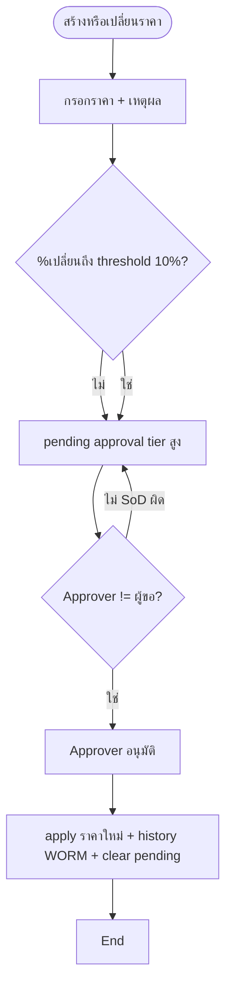
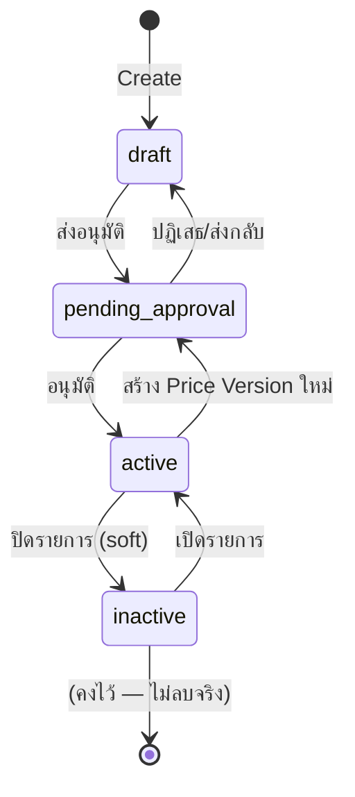

# BRD: Vendor Price List (รายการราคาคู่ค้า)

| Field | Value |
|---|---|
| BRD ID | BRD-PUR-VPL-001 |
| Feature ID | F-VENDOR-PRICELIST-001 |
| Feature Name | Vendor Price List — รายการราคาคู่ค้า (Buy-side) |
| BRD Type | New Feature |
| Version | 2.4 |
| Status | APPROVED |
| Module | Purchase (P2P) — Procure-to-Pay |
| Side | Buy-side เท่านั้น (Sell-side / Sales Price List = feature แยกในอนาคต) |
| Owner | BA — 2BSimple |
| Stakeholders | Procurement, Finance, Dev (BE/FE), QA |
| Created Date | 2026-05-31 |
| Last Updated | 2026-07-31 |
| Source | Business baseline จาก v2.2 + Vendor Master ชุดใช้งานจริง `outputs/F-VENDOR/_final-docs` + Product Master ชุดใช้งานจริง `Related context/Item Master` + CUBE 4.0 governance; reference เก่าใช้เทียบประวัติเท่านั้น |

## Changelog
- v2.4 (2026-07-31): ล็อก Feature ID canonical/legacy alias และ ownership ของ Price List Summary; rebase Product dependency ไปที่ `Related context/Item Master` (`F-PRODUCT-MASTER-001`) โดยใช้ UUID `product_id`, active+purchasable eligibility, purchase UOM, `vat_prod_group` และ `prod_posting_group`.
- v2.3 (2026-07-31): เปลี่ยน Vendor source of truth ไปเป็นชุดใช้งานจริง `outputs/F-VENDOR/_final-docs` — align `F-VENDOR`, UUID `vendor_id`, `vendor_code`, `currency_code`, `default_payment_term_id`, lifecycle 7 สถานะ และ `vendor_status_changed_event`; เก็บ Price List Summary ownership เป็น Open Question ตาม upstream pack.
- v2.2 (2026-07-31): อนุมัติ baseline สำหรับ implement — แยก Price Header/Version, เพิ่ม Company/Site resolution, maker-checker สำหรับราคาใหม่, threshold config เริ่มต้น 10%, SLA 1 วันทำการ, เชื่อม DOA กลาง, price snapshot/trace, import preview, compare แบบ full page และยืนยัน pricing = Confidential.
- v1.0 (2026-05-31): สร้าง BRD แบบ **reverse** จาก HTML prototype ที่ตกลงล่าสุด — vendor-first navigation, wizard 2 ขั้น, batch lean + search combo, get-price logic, DOA placeholder (threshold + SoD). ตัดทิ้งแล้ว: AVL, ราคาสัญญา/lock, lead time, MOQ/MPQ, preferred vendor.

### 1.1 Approved Scope Lock (authoritative)

> ส่วนนี้เป็นคำตัดสินที่อนุมัติแล้วและมีอำนาจเหนือรายละเอียด legacy ที่ขัดกันภายในเอกสารฉบับเดิม

| Lock ID | คำตัดสินที่ล็อกแล้ว |
|---|---|
| LOCK-VPL-01 | Buy-side Vendor Price List เท่านั้น; Sales Price List แยก feature |
| LOCK-VPL-02 | HTML/FRD/Test Case เดิมเป็น reference เพื่อกัน requirement ตกหล่น ไม่ใช่ design authority |
| LOCK-VPL-03 | ราคาใหม่และ Price Version ใหม่ต้องผ่าน approval ก่อน Active; ผู้ขอห้ามอนุมัติรายการตนเอง |
| LOCK-VPL-04 | Approval threshold เริ่มต้น 10% ของการเปลี่ยนแปลงราคาสุทธิต่อหน่วยก่อนภาษีแบบค่าสัมบูรณ์; เป็น config ห้าม hardcode |
| LOCK-VPL-05 | SLA approval = 1 วันทำการ; ผูก DOA Matrix กลาง ไม่สร้าง approval logic เฉพาะ feature ซ้ำ |
| LOCK-VPL-06 | Pricing classification = Confidential; role ที่ไม่มีสิทธิ์ต้อง mask ทั้ง UI/export/log |
| LOCK-VPL-07 | Price Header key = tenant + company + site(optional) + vendor + product + purchase UOM + currency; ราคาเก็บเป็น immutable versions |
| LOCK-VPL-08 | ห้ามช่วงวันที่/tier ของ Active versions ซ้อนกันจน resolve ราคาได้มากกว่า 1 คำตอบ |
| LOCK-VPL-09 | PR/RFQ/PO ต้องรับ Price Version ID + calculation snapshot/trace; การเปลี่ยนราคาใหม่ห้ามเปลี่ยนราคาธุรกรรมย้อนหลัง |
| LOCK-VPL-10 | Compare เป็น full page; Create/Edit เป็น drawer wizard; View เป็น tabbed drawer; confirm action ใช้ modal |
| LOCK-VPL-11 | Batch/CSV ต้อง preview + validate + duplicate detection + confirm ก่อน commit; รองรับ stable external ID |
| LOCK-VPL-12 | ตัด AVL, contract editor/lock, lead time, MOQ/MPQ, preferred vendor, attachment/OCR และ AI price recommendation ออกจากรอบนี้ |
| LOCK-VPL-13 | ไม่มี business A4/PDF document ใน scope; QA result PDF เป็น output ของ UAT tooling ไม่ใช่ feature document |
| LOCK-VPL-14 | Vendor source of truth = `outputs/F-VENDOR/_final-docs` (`F-VENDOR`); `Related context/vendor/Vendor` เป็น historical reference เท่านั้น และห้ามใช้ contract เก่าทับชุดจริง |
| LOCK-VPL-15 | Feature ID หลัก = `F-VENDOR-PRICELIST-001`; `F-VENDOR-PRICE-LIST` เป็น legacy alias เพื่อค้นหา/redirect เท่านั้น ห้ามสร้าง namespace, schema หรือ ownership แยก |
| LOCK-VPL-16 | Vendor Price List เป็นเจ้าของ summary query/service และข้อมูล Price Header/Version/Tier/History; Vendor Master API-20 เป็น read-only façade ที่เรียก service contract นี้ ห้าม Vendor Master เขียนหรือเก็บราคาซ้ำ |
| LOCK-VPL-17 | Product source of truth = `Related context/Item Master` (`F-PRODUCT-MASTER-001`); เก็บ UUID `product_id` เป็น reference หลัก ส่วน `product_code`/ชื่อเป็น display snapshot; create/import/submit รับเฉพาะ `status=active` และ `purchasable=true` |

---

## Section 2: Business Context

### 2.1 ปัญหา / โอกาส
องค์กรซื้อสินค้า/วัตถุดิบเดียวกันจากคู่ค้าหลายราย ในหลายสกุลเงินและหลายช่วงราคา (ขั้นบันได/ปริมาณ) แต่ราคาคู่ค้ากระจัดกระจาย ไม่มีแหล่งกลางที่ standardize ให้ PR/PO ดึงไปใช้ และไม่มีการเทียบราคาข้ามคู่ค้าแบบสุทธิจริง (หลังส่วนลด/ค่าขนส่ง + แปลงสกุลเงิน) ทำให้จัดซื้อในราคาที่ไม่เหมาะ และการเปลี่ยนราคาไม่มี audit/控.

Vendor Price List คือทะเบียนราคากลางระดับ **คู่ค้า × สินค้า** (buy-side) เป็น single source of truth ของ "ราคาซื้อ" ที่ PR/PO autofill และ Compare Price เรียกใช้ พร้อมควบคุมการเปลี่ยนราคาแบบมีอนุมัติ + ประวัติ WORM

### 2.2 เป้าหมายทาง Business
- มีราคากลางต่อ คู่ค้า–สินค้า ที่ใช้ร่วมกับ Vendor Master / Product Master / PR / PO ได้ทันที
- เทียบราคาข้ามคู่ค้าแบบสุทธิ/หน่วย (normalize FX) เพื่อเลือกคู่ค้าที่คุ้มที่สุด
- ควบคุมการเปลี่ยนราคา (threshold + SoD + audit) ลดความเสี่ยงราคาผิด/ทุจริต
- ปกป้องข้อมูลราคา (Confidential) ให้เห็นเฉพาะผู้มีสิทธิ์

### 2.3 ตัวชี้วัดความสำเร็จ (Success Metrics)
| Metric | Baseline | Target | วัดยังไง |
|---|---|---|---|
| % PR/PO ที่ autofill ราคาจาก price list | 0% | ≥ 80% | po_lines ที่ price มาจาก list / ทั้งหมด |
| เวลาเทียบราคาเพื่อเลือกคู่ค้า | manual (นาที) | < 10 วินาที | ใช้หน้า Compare |
| การเปลี่ยนราคาที่ผ่าน audit/อนุมัติ | ไม่มี | 100% | price_history WORM coverage |
| ราคารั่ว (ผู้ไม่มีสิทธิ์เห็น) | ไม่ควบคุม | 0 | classification enforcement |

### 2.4 ที่มาของ Requirement
- ใช้ร่วมกับงาน P2P ของ CUBE NATIVE (PR/PO/GRN) — ต้องมีราคากลาง buy-side
- ต้นแบบ HTML ที่ทีมตกลงร่วมกัน (vendor-first, lean batch, ตัด AVL/สัญญา/lead/MOQ/preferred)
- Vendor identity/lifecycle/integration contract อ้างชุดใช้งานจริง `outputs/F-VENDOR/_final-docs` โดย `vendor.html` เป็น UI source of truth และ `FRD_F-VENDOR_Pack` เป็น implementation contract
- Product identity/eligibility/UOM/tax contract อ้าง `Related context/Item Master` โดย `Item-master.html` เป็น UI source of truth และ `FRD` เป็น implementation contract; ชื่อ folder เดิมไม่เปลี่ยน Feature ID ซึ่งยังเป็น `F-PRODUCT-MASTER-001`

---

## Section 3: Scope

### 3.1 In Scope
- ทะเบียนราคา buy-side ระดับ **tenant × company × site(optional) × คู่ค้า × สินค้า × purchase UOM × currency**
- แยก **Price Header** ออกจาก **immutable Price Version**; การแก้ราคาคือสร้าง version ใหม่ ห้าม update ทับ version ที่เคย Active
- ราคาแบบ **flat** และ **ขั้นบันได (tier / volume break)** + validity (from/until)
- เงื่อนไขราคาต่อ tier: ราคา/per, ส่วนลด %, ค่าขนส่ง/หน่วย, ภาษีซื้อ (อ้าง Finance), รวม/แยก VAT
- การเพิ่มแบบเดี่ยว (wizard 2 ขั้น ในบริบทคู่ค้า) และ **เพิ่มหลายรายการ (Batch grid + CSV import)**
- มุมมอง **vendor-first** (รายชื่อคู่ค้า → drill-in สินค้าของคู่ค้า) และมุมมอง **ทุกสินค้า** (flat product-centric) สำหรับ get-price/compare
- **เทียบราคาข้ามคู่ค้า** ตามปริมาณ (normalize เป็น THB ตาม FX)
- ราคาใหม่และการเปลี่ยนราคาเข้าสู่ `pending_approval` ก่อน Active; threshold เริ่มต้น 10% ใช้เลือก approval tier ผ่าน DOA และห้าม hardcode
- price resolution trace + snapshot สำหรับ PR/RFQ/PO เพื่อป้องกันผลย้อนหลัง
- CSV import แบบ preview/validate/confirm พร้อม stable external ID และ duplicate detection
- ปิด/เปิดรายการ (soft active ↔ inactive)
- Data Classification: ราคา = **Confidential** (mask ••• สำหรับผู้ไม่มีสิทธิ์)

### 3.2 Out of Scope
- **Sales Price List (sell-side)** — แยกเป็น feature ในอนาคต (FK Sales Channel)
- การสร้างหรือแก้ **DOA Matrix** ภายใน feature — feature นี้เรียก contract ของ DOA Matrix กลางเท่านั้น
- การสร้าง **PR/PO** เอง (feature นี้เป็นผู้ "ให้ราคา" เท่านั้น)
- การจัดการ **Vendor Master / Product Master / FX rate master** (อ้างอิงเท่านั้น)
- AVL (Approved Vendor List), ราคาสัญญา/contract-lock, lead time, MOQ/MPQ, preferred vendor — **ตัดออกตามมติทีม**

### 3.3 Assumptions
- Vendor Master ชุดจริงคือ `F-VENDOR` (feature code เดิม `F-VENDOR-MASTER-001`) จาก `outputs/F-VENDOR/_final-docs`
- Vendor Master ให้ UUID `vendor_id`, `vendor_code`, `legal_name`/`display_name`, `currency_code`, `default_payment_term_id`, `status`, `kyc_status` และ `version`
- Vendor lifecycle มี 7 สถานะ: `draft`, `pending_kyc`, `pending_approval`, `active`, `blocked`, `inactive`, `blacklisted`; คำเดิม `prospect` ถูกยกเลิก
- การสร้าง/ผูกราคาใหม่เลือกได้เฉพาะ Vendor `status=active`; รายการเดิมของ Vendor ที่ภายหลังถูก block/inactive/blacklist ต้องเก็บเพื่อ audit แต่ห้ามใช้ resolve/compare สำหรับธุรกรรมใหม่
- Product Master ให้ UUID `id` (`product_id` ฝั่ง consumer), `code`, `name_th`, `status`, `purchasable`, `base_uom`, multi-UOM conversion flags, `vat_prod_group` และ `prod_posting_group`
- Product picker ใช้ `GET /api/v1/products?status=active` แล้วกรอง `purchasable=true`; ทุก create/import/submit ต้องตรวจ current product ซ้ำด้วย UUID ก่อน commit
- `purchase_price` ใน Product Master เป็นข้อมูลราคาเริ่มต้นของ master และไม่ถูก Vendor Price List เขียนทับ; price resolution สำหรับ PR/RFQ/PO ใช้ Active Vendor Price Version เท่านั้น และห้าม fallback เงียบ ๆ
- Finance Posting Setup เป็นผู้ resolve GL จาก vat group / posting group (BRD นี้ไม่ตัดสิน GL)
- FX rate มาจาก master กลาง; prototype ใช้ mock เพื่อสาธิตเท่านั้นและห้ามถือเป็น config จริง
- `company_id` มาจาก tenant context; `site_id=null` หมายถึงราคากลางระดับ company และ exact site มี precedence สูงกว่า
- ERP Shell มาตรฐาน CUBE NATIVE (Sidebar + Header + Breadcrumb) — Module = Purchase

---

## Section 4: User Roles & Permissions

### 4.1 Roles ที่เกี่ยวข้อง
| Role | คำอธิบาย |
|---|---|
| Procurement Officer | ผู้สร้าง/แก้ราคา, ขอเปลี่ยนราคา (Maker) |
| Procurement Manager | + อนุมัติการเปลี่ยนราคา (Approver tier 1) |
| Procurement Director | อนุมัติการเปลี่ยนราคา tier สูง (Approver tier 2) |
| Finance | ดูราคา (Confidential), เจ้าของ Posting Setup |
| Admin | สิทธิ์เต็ม |
| Other (เช่น Warehouse/ผู้ขอซื้อทั่วไป) | เห็นรายการได้ แต่ **ราคาถูก mask •••** |

### 4.2 Permission Matrix
| Action | Proc. Officer | Proc. Manager | Proc. Director | Finance | Admin | Other |
|---|:---:|:---:|:---:|:---:|:---:|:---:|
| ดูรายการ/โครงสร้าง | ✅ | ✅ | ✅ | ✅ | ✅ | ✅ |
| เห็น "ราคา" (ไม่ mask) | ✅ | ✅ | ✅ | ✅ | ✅ | ❌ (•••) |
| สร้าง/เพิ่มราคา (เดี่ยว/batch) | ✅ | ✅ | ✅ | ❌ | ✅ | ❌ |
| แก้รหัสสินค้าฝั่ง vendor | ✅ | ✅ | ✅ | ❌ | ✅ | ❌ |
| เปลี่ยน company/site/vendor/product/UOM/currency | สร้าง Header ใหม่ | สร้าง Header ใหม่ | สร้าง Header ใหม่ | ❌ | สร้าง Header ใหม่ | ❌ |
| ขอเปลี่ยนราคา (price change) | ✅ | ✅ | ✅ | ❌ | ✅ | ❌ |
| อนุมัติการเปลี่ยนราคา | ❌ | ✅ | ✅ | ❌ | ✅ | ❌ |
| ปิด/เปิดรายการ | ✅ | ✅ | ✅ | ❌ | ✅ | ❌ |
| เทียบราคา (Compare) | ✅ | ✅ | ✅ | ✅ | ✅ | ❌ (เห็นแต่ไม่เห็นตัวเลข) |

> เงื่อนไขในต้นแบบ: `canManage` = Officer/Manager/Director/Admin · `canSeePricing` = Procurement + Finance + Admin · `canApprove` = Manager/Director/Admin

---

## Section 5: User Journey (with COSO) ⭐

### 5.1 Happy Path — เพิ่มราคาคู่ค้า (เดี่ยว, จากในหน้าคู่ค้า)
| # | Step | Maker | Checker | Approver | System | Notes |
|---|---|---|---|---|---|---|
| 1 | เปิดหน้าคู่ค้า → "เพิ่มสินค้า" | Proc. Officer | — | — | เปิด drawer wizard, ล็อกคู่ค้าให้อัตโนมัติ | คู่ค้า active เท่านั้น |
| 2 | Step 1 เชื่อมโยง: เลือกสินค้า (search), SKU, UOM, สกุลเงิน | Proc. Officer | — | — | uom จาก product, currency จาก vendor | ตรวจ UNIQUE (R01) |
| 3 | Step 2 ราคา·Tier·Validity: ตั้งราคา/ขั้นบันได + ส่วนลด/ค่าขนส่ง/ภาษี + validity | Proc. Officer | — | — | คำนวณสุทธิ/หน่วย (R09), ตรวจ tier overlap (R08) | — |
| 4 | บันทึกร่างและส่งอนุมัติ | Proc. Officer | — | Proc. Manager/Director ตาม DOA | สร้าง Price Version status=pending_approval + audit | ราคาใหม่ยังใช้กับ PR/PO ไม่ได้ |

**SoD Check:** ราคาใหม่และ Price Version ใหม่บังคับ Maker ≠ Approver ทุกครั้ง

### 5.2 Alternative / Key Paths

#### 5.2.1 เพิ่มหลายรายการ (Batch + CSV)
| # | Step | COSO | Notes |
|---|---|---|---|
| 1 | เปิด Batch → เลือกคู่ค้า (lock) หรือเว้น = หลายคู่ค้า | Maker: Proc. Officer | page-level "เริ่มใช้ราคา" |
| 2 | กรอกตาราง lean (สินค้า/SKU/UOM/ราคา) หรือ Upload CSV | Maker | แถวว่างข้าม, error → block |
| 3 | Preview ผลตรวจและยืนยัน | Maker | ยังไม่เขียนข้อมูลจนกดยืนยัน; แสดง Create/Update/Error รายแถว |
| 4 | ส่งอนุมัติทั้งหมด | Maker | สร้างหลาย Price Version เป็น pending_approval; atomic ต่อ batch |

#### 5.2.2 เปลี่ยนราคา (Price Change) — Gate + SoD
| # | Step | Maker | Approver | System | Notes |
|---|---|---|---|---|---|
| 1 | กด "เปลี่ยนราคา" + กรอกราคาใหม่ + เหตุผล | Proc. Officer | — | คำนวณ % เปลี่ยน | reason required |
| 2a | ถ้า %เปลี่ยน < 10% | Proc. Officer | Proc. Manager ตาม DOA | set status=pending_approval | simplified approval tier |
| 2b | ถ้า %เปลี่ยน ≥ 10% | Proc. Officer | Proc. Manager/Director ตาม DOA | set status=pending_approval | elevated approval tier |
| 3 | อนุมัติ | — | DOA-resolved approver | activate version ใหม่ + history WORM | **SoD: Approver ≠ ผู้ขอ** (R12) |

**SoD Check:** ผู้อนุมัติ ≠ ผู้สร้างคำขอ ✅ (บังคับ — ถ้าตรงกัน block)

#### 5.2.3 ปิด/เปิดรายการ
| # | Step | COSO | Notes |
|---|---|---|---|
| 1 | toggle ปิด (inactive) / เปิด (active) | Maker: Proc. Officer | soft — ไม่ลบ, ตัดจาก get-price/compare เมื่อ inactive |

### 5.3 Process Diagram (Price Change)


---

## Section 6: Data Entity & Fields

### 6.1 Entity Overview
| Entity | Type | Description |
|---|---|---|
| Vendor_Price_Header | Header | identity ตาม company/site/vendor/product/UOM/currency |
| Vendor_Price_Version | Version | ราคาและ validity ที่ immutable หลัง Active |
| Vendor_Price_Tier | Detail | ช่วงราคา/เงื่อนไขต่อ version (flat = 1 แถว, tier = หลายแถว) |
| Vendor_Price_History | Audit (WORM) | ประวัติการเปลี่ยนราคา |
| Vendor (ref) | External | `F-VENDOR` — UUID `vendor_id`, `vendor_code`, `currency_code`, `default_payment_term_id`, lifecycle status/version |
| Product (ref) | External | `F-PRODUCT-MASTER-001` — UUID `id`, code/name, status, purchasable, base/purchase UOM, `vat_prod_group`, `prod_posting_group` |

### 6.2 Entity: Vendor_Price_Header
| # | Field | Label UI | Input Type | ค่า/ตัวเลือก | จำเป็น | เงื่อนไข | หมายเหตุ |
|---|---|---|---|---|:---:|---|---|
| 1 | id | — | AUTO | uuid | ✅ | PK | dev-handoff (ไม่ render) |
| 2 | tenant_id | — | AUTO | session.tenant | ✅ | RLS | dev-handoff |
| 3 | company_id | บริษัท | AUTO/LOOKUP | Company context | ✅ | RLS | resolution scope |
| 4 | site_id | สาขา/ไซต์ | LOOKUP | Site Master | ⚠️ | null = company default | exact site wins |
| 5 | vendor_id | คู่ค้า | LOOKUP | `F-VENDOR` (active) | ✅ | UUID; active เท่านั้น (R02) | soft reference; snapshot code/name; ห้ามใช้ vendor_code เป็น FK |
| 6 | product_id | สินค้า | COMBO (search) | Product Master (active + purchasable) | ✅ | UUID; status=active และ purchasable=true (R03) | soft reference; snapshot code/name; ห้ามใช้ product_code เป็น FK |
| 7 | vendor_item_code | รหัสสินค้าฝั่ง vendor | TEXT | — | ⚠️ | — | SKU ของคู่ค้า |
| 8 | buy_uom | หน่วยซื้อ | DROPDOWN | `base_uom` และ conversion ที่ `can_buy=true` | ✅ | ต้องอยู่ใน purchase UOMs (R06) | จาก Product Master; เก็บ `uom_code` ไม่เก็บ label |
| 9 | currency | สกุลเงิน | DROPDOWN | THB/USD/EUR/CNY | ✅ | default = `vendor.currency_code` (R05) | ค่า default จาก `F-VENDOR`; ราคายังรองรับ currency ตาม resolution key |
| 10 | status | สถานะ Header | ENUM | active / inactive | ✅ | active เมื่อมี version ใช้งานได้ | state machine §8 |
| 11 | classification | — | CONST | Confidential | ✅ | mask ••• (R13) | pricing = Confidential |
| 12 | created_by / created_at | ผู้สร้าง/วันที่ | AUTO | session.user / now() | ✅ | — | audit |
| 13 | version | — | AUTO | int (optimistic lock) | ✅ | If-Match | dev-handoff |
| 14 | external_id | รหัสอ้างอิงนำเข้า | TEXT | stable import key | ⚠️ | unique ต่อ tenant | ป้องกัน import ซ้ำ |

### 6.2.1 Entity: Vendor_Price_Version
| Field | Type | Required | Notes |
|---|---|:---:|---|
| id / header_id | uuid | ✅ | PK/FK |
| version_no | int | ✅ | เพิ่มทีละ 1; immutable เมื่อ Active |
| price_type | enum | ✅ | flat / tier; default flat |
| status | enum | ✅ | draft / pending_approval / active / rejected / inactive |
| effective_from / effective_to | date | ✅/⚠️ | derived `expired` เมื่อพ้น effective_to |
| requested_by / requested_at / reason | audit | ✅ | maker + เหตุผล |
| approval_request_id | uuid | ⚠️ | อ้าง DOA Matrix workflow |
| approved_by / approved_at | audit | ⚠️ | ต้องไม่เท่ากับ requester |
| change_pct_abs | decimal | ✅ | เทียบ landed unit cost ex-tax version ก่อนหน้า |
| version | int | ✅ | optimistic lock ระหว่าง draft/pending |

### 6.3 Entity: Vendor_Price_Tier (prices[])
| # | Field | Label UI | Input Type | จำเป็น | เงื่อนไข | หมายเหตุ |
|---|---|---|---|:---:|---|---|
| 1 | min_qty | ปริมาณขั้นต่ำ | NUMBER | ✅ | ≥ 0, เรียง min↑ | — |
| 2 | max_qty | ปริมาณสูงสุด | NUMBER | ⚠️ | null = ∞ (tier สุดท้าย), ห้าม overlap (R08) | — |
| 3 | price | ราคาตั้ง | NUMBER | ✅ | > 0 (R04) | ต่อ price_per หน่วย |
| 4 | price_per | /per | NUMBER | ✅ | default 1 | ราคา ต่อ N หน่วย |
| 5 | discount_pct | ส่วนลด % | NUMBER | ⚠️ | 0–100, default 0 | — |
| 6 | freight | ค่าขนส่ง/หน่วย | NUMBER | ⚠️ | ≥ 0, default 0 | — |
| 7 | tax_code | ภาษีซื้อ | DROPDOWN | VAT7/VAT0/EXEMPT | ✅ | default = `product.vat_prod_group` | อ้าง Finance; mapping code เพิ่มเติมอยู่ Finance Posting Setup |
| 8 | incl_vat | รวม VAT | TOGGLE | ✅ | default false | — |
| 9 | valid_from | เริ่มใช้ | DATE | ✅ | required (R10) | — |
| 10 | valid_until | สิ้นสุด | DATE | ⚠️ | เว้น = ไม่มีกำหนด | — |
| 11 | status | สถานะ tier | ENUM | — | active/expired (validity)/pending | คำนวณจาก validity |

### 6.4 Entity: Vendor_Price_History (WORM)
| Field | Type | หมายเหตุ |
|---|---|---|
| old / new | number | ราคาก่อน/หลัง |
| pct | number | % เปลี่ยน |
| by | user | ผู้ทำ/ผู้อนุมัติ |
| at | datetime | เวลา |
| reason | text | เหตุผล (required) |

### 6.5 Entity Relationship
```
Vendor (Master) ──(1:N)──▶ Vendor_Price_Header ◀──(N:1)── Product (Master)
Vendor_Price_Header ──(1:N)──▶ Vendor_Price_Version ──(1:N)──▶ Vendor_Price_Tier
Vendor_Price_Header ──(1:N)──▶ Vendor_Price_History
UNIQUE(tenant_id, company_id, site_id, vendor_id, product_id, buy_uom, currency) ← R01
```

---

## Section 7: User Stories & Acceptance Criteria

**S-01: เพิ่มราคาให้คู่ค้า (เดี่ยว)**
As a Procurement Officer, I want to เพิ่มราคาสินค้าให้คู่ค้าหนึ่งราย, So that PR/PO ดึงราคาไปใช้ได้
- AC1: Given อยู่ในหน้าคู่ค้า, When กด "เพิ่มสินค้า", Then เปิด wizard โดยล็อกคู่ค้านั้นไว้ (ไม่ต้องเลือกคู่ค้าซ้ำ)
- AC2: Given เลือกสินค้าที่คู่ค้านี้มีอยู่แล้ว, Then block พร้อมแจ้ง UNIQUE
- AC3: Given กรอกครบ + ราคา > 0 + tier/validity ไม่ซ้อน, When ส่งอนุมัติ, Then สร้าง Price Version status=pending_approval และยังไม่ถูก resolve ไปใช้ใน PR/PO

**S-02: เพิ่มหลายรายการ (Batch)**
As a Procurement Officer, I want to กรอกหลายสินค้าพร้อมกัน หรือ upload CSV, So that ตั้งราคาจำนวนมากได้เร็ว
- AC1: Given เลือกคู่ค้าระดับหน้า, Then ทุกแถวใช้คู่ค้านั้น (ซ่อนคอลัมน์คู่ค้า)
- AC2: Given แถวว่าง, Then ข้าม; Given แถว error (ราคา/สินค้า), Then ไฮไลต์แดง + block save
- AC3: Given upload CSV, When vendor_code/product_code ไม่พบใน master, Then นับ unmatched + ข้ามแถวนั้น

**S-03: เทียบราคาข้ามคู่ค้า**
As a Procurement Officer, I want to เทียบราคาสุทธิ/หน่วยของสินค้าเดียวกันข้ามคู่ค้า ตามปริมาณ, So that เลือกคู่ค้าคุ้มสุด
- AC1: Given ระบุ qty, Then แสดงคู่ค้าเรียงราคาสุทธิ/หน่วย (THB) จากน้อยไปมาก, ตัวแรก = ถูกสุด
- AC2: คู่ค้า blocked/blacklisted ถูกตัดออก (R14); แปลงสกุลด้วย FX (R15)

**S-04: เปลี่ยนราคา (มี gate + SoD)**
As a Procurement Officer, I want to เปลี่ยนราคาพร้อมเหตุผล, So that ราคาอัปเดตอย่างมีการควบคุม
- AC1: Given %เปลี่ยน ≤ THRESHOLD, Then apply ทันที + บันทึก history
- AC2: Given %เปลี่ยน > THRESHOLD, Then status=pending_approval
- AC3: Given เป็นผู้ขอเอง, When พยายามอนุมัติ, Then block (SoD)

**S-05: ดูรายละเอียดราคา / ราคาถูกปกปิด**
As a Procurement Officer, I want to ดูภาพรวม/tier/ประวัติ; As Other role, ราคาต้องถูก mask
- AC1: View drawer มี 3 แท็บ: ภาพรวม / ราคา & Tier / ประวัติราคา
- AC2: Given role ไม่มีสิทธิ์เห็นราคา, Then ทุกตัวเลขเงินเป็น ••• (R13)

---

## Section 8: Status & Lifecycle

### 8.1 State Diagram (Item-level)


### 8.2 State Transition Table
| Current | Trigger | Next | COSO Role | Notes |
|---|---|---|---|---|
| draft | ส่งอนุมัติ | pending_approval | Proc. Officer (Maker) | resolve approver จาก DOA |
| pending_approval | อนุมัติ | active | Manager/Director (Approver, SoD) | activate version; deactivate prior version เมื่อถึง effective_from |
| pending_approval | ปฏิเสธ/ส่งกลับ | draft | Manager/Director (Approver) | reason required |
| active | ปิดรายการ | inactive | Proc. Officer (Maker) | soft, ตัดจาก get-price/compare |
| inactive | เปิดรายการ | active | Proc. Officer (Maker) | — |
| active | สร้าง version ใหม่ | pending_approval | Proc. Officer (Maker) | version เดิมยัง Active จน version ใหม่มีผล |

> Tier status (validity): active / expired (เลย valid_until) / pending (ก่อน valid_from) — คำนวณ ไม่ใช่ state แยก

---

## Section 9: Business Rules + Validation (with Tags)

### 9.1 Business Rules
| Rule ID | Rule | Tag | Type | เหตุผล Tag |
|---|---|:---:|---|---|
| R01 | Header UNIQUE ตาม tenant/company/site/vendor/product/UOM/currency | FIXED | Constraint | รองรับหลาย UOM/currency โดยไม่กำกวม |
| R02 | เลือกสร้าง/ผูกราคาใหม่ได้เฉพาะคู่ค้า `F-VENDOR.status=active`; server ต้องตรวจซ้ำตอน submit/import | FIXED | Constraint | lifecycle จริงมี 7 สถานะ; ห้ามเชื่อ client snapshot |
| R03 | เลือกได้เฉพาะสินค้า `status=active && purchasable=true` | FIXED | Constraint | จาก Product Master; revalidate ด้วย UUID ก่อน mutation |
| R04 | ราคา > 0 | FIXED | Validation | — |
| R05 | currency default = `F-VENDOR.currency_code` | CONFIGURABLE | Default source | ใช้เป็นค่าเริ่มต้น ไม่เปลี่ยน ownership ของ currency ใน Price Header |
| R06 | buy_uom ต้องเป็น buy UOM ของสินค้า | FIXED | Constraint | จาก Product Master multi-UOM |
| R07 | tax_code default = `product.vat_prod_group`; GL resolve ที่ Finance Posting Setup | FIXED | Delegation | BRD นี้ไม่ตัดสิน GL |
| R08 | Tier: เรียง min↑, ห้ามช่วงซ้อนทับ, เฉพาะ tier สุดท้าย max=∞ | FIXED | Constraint | กันราคากำกวม |
| R09 | landed unit cost ex-tax = (price ÷ price_per) × (1 − discount_pct/100) + freight_per_unit | DYNAMIC | Formula | ใช้เป็นฐาน compare/threshold |
| R10 | valid_from required; valid_until เว้น = ไม่มีกำหนด | CONFIGURABLE | Validity | policy validity |
| R11 | ราคาใหม่และทุก version ต้อง approval; `abs(change_pct) >= 10%` ใช้ elevated DOA tier | CONFIGURABLE | Threshold | ค่า 10% เป็น audited config ห้าม hardcode |
| R12 | SoD: ผู้อนุมัติ ≠ ผู้สร้าง/ผู้ขอเปลี่ยนราคา | FIXED | Control | บังคับทุก approval |
| R13 | pricing = Confidential — เห็น/แก้เฉพาะ Procurement+Finance+Admin, อื่น mask ••• | FIXED | Classification | Data Classification |
| R14 | คู่ค้าที่ไม่ใช่ `active` (`draft`/`pending_kyc`/`pending_approval`/`blocked`/`inactive`/`blacklisted`) ตัดจากการสร้างใหม่ การ resolve และการ compare; ประวัติราคาเดิมยังคงอยู่ | FIXED | Constraint | รับการเปลี่ยนสถานะผ่าน lookup/event จาก `F-VENDOR` |
| R15 | Compare normalize เป็น THB @ FX; tier @ qty | DYNAMIC | Formula | FX จาก master |
| R16 | resolveVendorPrice คืนราคา Active ของ vendor ที่ระบุและตรง scope/date/qty; compareVendorPrices จึงจัดอันดับหลาย vendor | DYNAMIC | Formula | ห้าม API เลือก vendor แทน PO เงียบ ๆ |
| R17 | เปลี่ยนราคา → บันทึก history WORM (old/new/pct/by/at/reason) | FIXED | Audit | reason required |
| R18 | SLA การอนุมัติ = 1 วันทำการ; เกิน SLA ส่ง escalation ตาม DOA | FIXED | SLA | approved baseline |
| R19 | Active validity/tier ภายใต้ resolution key ห้าม overlap | FIXED | Constraint | ต้อง resolve ได้คำตอบเดียว |
| R20 | PR/RFQ/PO เก็บ price_version_id + calculation snapshot; config/ราคาใหม่ไม่ย้อนหลัง | FIXED | Audit | transaction immutability |
| R21 | Source precedence = Approved Contract Price > Approved Vendor Price List > authorized manual override | FIXED | Resolution | contract เป็น external source ไม่ใช่ UI scope นี้ |

### 9.2 Validation Rules
| VR ID | Field/Action | เงื่อนไข | ประเภท | ข้อความ |
|---|---|---|---|---|
| VR01 | tenant/company/site/vendor/product/UOM/currency | UNIQUE | Error | "มีรายการราคาสำหรับขอบเขตนี้แล้ว" |
| VR02 | product_id | current `status=active && purchasable=true` | Error | "สินค้าไม่อยู่ในสถานะใช้งานหรือซื้อไม่ได้" |
| VR03 | price | > 0 | Error | "ราคาต้อง > 0" |
| VR04 | tier ranges | ไม่ซ้อนทับ + เรียง | Error | "ช่วงปริมาณ (tier) ซ้อนทับกัน" |
| VR05 | valid_from | required | Error | "กรุณาระบุวันเริ่มราคา" |
| VR06 | price change | reason required | Error | "กรุณาระบุเหตุผล" |
| VR07 | approve | approver ≠ requester | Error | "ผู้อนุมัติต้องไม่ใช่ผู้ขอ (SoD)" |
| VR08 | batch row | สินค้า + ราคา ครบ | Trigger | ไฮไลต์แดง + block save |
| VR09 | effective period/tier | ไม่ทับ Active version | Error | "ช่วงวันที่หรือปริมาณซ้อนกับราคาที่ใช้งานอยู่" |
| VR10 | submit approval | DOA route exists + maker ≠ approver | Error | "ไม่พบสายอนุมัติที่ใช้ได้" |
| VR11 | vendor_id | UUID พบใน tenant เดียวกันและ status=active ณ เวลา submit/import/resolve | Error | "คู่ค้านี้ไม่พร้อมใช้งานสำหรับรายการราคาใหม่" |

### 9.5 สรุประดับความยืดหยุ่น
| Rule ID | Tag | ใครเปลี่ยน | บ่อยแค่ไหน | ระดับ |
|---|:---:|---|---|---|
| R05 | CONFIGURABLE | Admin | นานๆ ครั้ง | Admin Panel |
| R10 | CONFIGURABLE | Admin | นานๆ ครั้ง | Admin Panel |
| R11 (threshold%) | CONFIGURABLE | Policy/DOA Admin | ตาม policy | DOA Matrix audited config |
| R09 / R15 / R16 | DYNAMIC | Dev/ผู้บริหาร | เมื่อนโยบายคิดราคาเปลี่ยน | Rule/Engine Management |
| R18 (SLA) | FIXED | Policy/DOA Admin | ตาม policy | ค่าเริ่มต้น 1 วันทำการ |

---

## Section 10: Edge Cases

### 10.1 Edge Cases ที่ระบุชัด (จากพฤติกรรม HTML) — default ☑
- ☑ E01: เลือกคู่ค้า–สินค้าที่มีอยู่แล้ว → block (UNIQUE, R01)
- ☑ E02: คู่ค้าไม่ active → ไม่แสดงใน selector (เลือกไม่ได้)
- ☑ E03: Tier ช่วงปริมาณซ้อนทับ → block (R08)
- ☑ E04: ราคา ≤ 0 → block (R04)
- ☑ E05: Batch แถวว่าง → ข้าม; แถวไม่ครบ (สินค้า/ราคา) → แดง + block save
- ☑ E06: CSV vendor_code/product_code ไม่พบใน master → นับ unmatched + ข้ามแถว
- ☑ E07: เปลี่ยนราคาโดยไม่ใส่เหตุผล → block (R06/VR06)
- ☑ E08: ผู้ขอเปลี่ยนราคาพยายามอนุมัติคำขอตัวเอง → block (SoD, R12)

### 10.2 Edge Cases จาก AI Pattern Matching — default ☐ (ต้อง confirm)

**CL (Calculation)**
- ☐ E09: discount > 100% หรือ freight ทำให้สุทธิติดลบ → block/clamp
- ☑ E10: FX rate หายหรือ stale เกิน policy → ไม่จัดอันดับและแสดงเหตุผล; ห้าม fallback เงียบ ๆ (R15)

**CA (Concurrent Access)**
- ☑ E11: 2 ผู้ใช้แก้รายการเดียวกันพร้อมกัน → optimistic lock ด้วย `version` / If-Match
- ☑ E12: เปลี่ยนราคาขณะมีคำขอ pending_approval ค้างอยู่ → block (1 pending version ต่อ header)

**ST (Status/Workflow)**
- ☑ E13: get-price/compare ของรายการ inactive → ต้องถูกตัดออก
- ☑ E14: ทุก tier หมดอายุ (validity) → get-price คืน `NO_APPLICABLE_PRICE` พร้อม reason

**PD (PII/Data Classification)**
- ☑ E15: ราคา (Confidential) ต้องไม่รั่วใน export/log/print สำหรับ role ที่ไม่มีสิทธิ์ (R13)
- ☑ E16: service-to-service สามารถส่ง snapshot ตามสิทธิ์ระบบ; UI role ที่ไม่มีสิทธิ์ต้อง mask ตัวเลข

### Tag Review Report
- ✅ R01,R02,R03,R04,R06,R08,R12,R13,R14,R17: FIXED — ถูกต้อง (กฎโครงสร้าง/ควบคุม)
- ⚠️ R05,R10,R11: CONFIGURABLE — R11 (threshold%) ควรย้ายเข้า DOA กลางภายหลัง
- ⚠️ R09,R15,R16: DYNAMIC — สูตรราคา/ FX / get-price ควรอยู่ Engine (ENG-PRICESELECT)
- ✅ R18: FIXED — SLA เริ่มต้น 1 วันทำการ

---

## Section 11: Impact Analysis / Regression Scope
**N/A — New Feature** (ไม่มีของเก่าให้กระทบ) — ผลกระทบเชิง integration อยู่ใน Section 12 (PR/PO/Compare ที่จะเรียก get-price)

---

## Section 12: Dependencies

### 12.1 Module Dependencies
- **Vendor Master** (`F-VENDOR`; feature code `F-VENDOR-MASTER-001`) — source `outputs/F-VENDOR/_final-docs`; soft reference UUID `vendor_id`, `vendor_code`, `currency_code`, `default_payment_term_id`, 7-state lifecycle และ `version`
- **Product Master** (`F-PRODUCT-MASTER-001`) — source `Related context/Item Master`; soft reference UUID `product_id`, active+purchasable eligibility, base/purchase UOM, `vat_prod_group`, `prod_posting_group`
- **Finance Posting Setup** — resolve GL จาก vat group / posting group
- **FX Rate Master** — สำหรับ normalize Compare
- **Document/Audit (WORM)** — price history
- **Company/Site context** — resolution scope และ RLS
- **DOA Matrix** — resolve approval tier จาก threshold/config
- **(ปลายทาง)** Purchase Request / Purchase Order — เรียก get-price autofill; Compare Price

### 12.2 External / Service Dependencies
- Central Audit Log (WORM) service
- DOA Matrix contract (Policy Center) — required ก่อน activate ราคา
- Notification/Outbox — แจ้งผู้อนุมัติและ escalation เมื่อเกิน SLA

### 12.3 Existing System Reference
| Rule/Item | ระดับ | มีอยู่แล้ว? | Reference |
|---|---|:---:|---|
| Vendor/Product/Currency/Term | Master | ✅ | Vendor Master, Product Master |
| GL resolve | Config | ✅ | Finance Posting Setup |
| DOA approval (threshold) | Governance | ✅ contract dependency | F-DOA-MATRIX / Policy Center |
| User Access / Classification | Governance | ⚠️ | Policy Center → User Access ENC + Data Classification ENC |
| WORM audit | Service | ✅ | Central Audit Log |

### 12.4 Vendor Master Integration Contract

| Concern | Contract จาก `F-VENDOR` | การใช้ใน Vendor Price List |
|---|---|---|
| Picker/search | `GET /api/v1/vendors?status=active` | แสดงเฉพาะคู่ค้า active; เก็บ `id` เป็น `vendor_id`, แสดง `vendor_code` + ชื่อ |
| Current validation | `GET /api/v1/vendors/:vendor_id` หรือ trusted service lookup | ตรวจ tenant + current status ซ้ำก่อน create/import/submit/resolve; ห้ามเชื่อ code/name/status snapshot จาก client |
| Default values | `currency_code`, `default_payment_term_id` | ใช้เติมค่าเริ่มต้น/บริบทเท่านั้น; Price Header เก็บ currency ของตนเอง |
| Availability change | `vendor_status_changed_event` payload `{tenant_id,vendor_id,previous_status,status,version,occurred_at}` | invalidate vendor eligibility cache; non-active หยุด price resolution/compare สำหรับธุรกรรมใหม่ทันที โดยไม่ลบ history |
| Vendor screen summary | `GET /api/v1/vendors/:vendor_id/price-list-summary` เป็น API-20 read-only façade ของ Vendor Master | façade เรียก internal summary query/service ที่ Vendor Price List เป็นเจ้าของ; ไม่มีการเขียน/จำลอง Price data ใน Vendor Master |

**Boundary:** `F-VENDOR` เป็นเจ้าของ identity, lifecycle และ eligibility ของคู่ค้า ส่วน `F-VENDOR-PRICELIST-001` เป็นเจ้าของ Price Header/Version/Tier/History และห้ามแก้ Vendor Master ผ่าน feature นี้

### 12.5 Product Master Integration Contract

| Concern | Contract จาก `F-PRODUCT-MASTER-001` | การใช้ใน Vendor Price List |
|---|---|---|
| Picker/search | `GET /api/v1/products?status=active` | แสดงเฉพาะ `status=active && purchasable=true`; เก็บ `id` เป็น `product_id`, แสดง `code` + `name_th` |
| Current validation | `GET /api/v1/products/:product_id` หรือ trusted service lookup | ตรวจ tenant + current `status` + `purchasable` ซ้ำก่อน create/import/submit; ห้ามเชื่อ code/name/flags snapshot จาก client |
| Purchase UOM | `base_uom` + `uoms[]` โดย conversion ซื้อมี `can_buy=true` และ default มี `is_default=true` | สร้างรายการ `uom_code` ที่เลือกได้และ validate R06; เมื่อเลือกสินค้าให้ตั้งค่าเริ่มต้นเป็น purchase default หรือ base UOM ที่ซื้อได้ |
| Tax/posting defaults | `vat_prod_group`, `prod_posting_group` | default ภาษีซื้อและส่ง posting group ให้ Finance resolve; Vendor Price List ไม่ resolve GL เอง |
| Lifecycle change | Product Master pack ยังไม่ประกาศ WebSocket status event | revalidate ด้วย UUID ที่ mutation boundary และ refresh picker/cache ตาม integration policy; ห้ามสมมติ event name ใหม่ใน implementation |
| Product price fields | `purchase_price` เป็น Confidential field ใน Product Master | ไม่ sync กลับและไม่ overwrite; Vendor Price List Active Version เป็น source ของ vendor-specific resolution; กรณีไม่พบราคาต้องคืน no-price reason ห้าม fallback เงียบ ๆ |

**Boundary:** `F-PRODUCT-MASTER-001` เป็นเจ้าของ identity, lifecycle, behavior, UOM และ tax/posting groups ของสินค้า ส่วน `F-VENDOR-PRICELIST-001` เป็นเจ้าของราคาตามคู่ค้าและประวัติราคา

---

## Section 13: Delivery Phases

### Phase 1: Feature Launch
- สร้าง `Vendor_Price_Header` + `Vendor_Price_Version` + `Vendor_Price_Tier` + `Vendor_Price_History` (uuid PK + tenant RLS + optimistic lock)
- UNIQUE ตาม LOCK-VPL-07 และ non-overlap ตาม LOCK-VPL-08
- แยก `resolveVendorPrice` และ `compareVendorPrices`; คืน calculation trace + price snapshot
- Screens: vendor list / vendor detail / flat list / create wizard / edit / view / compare / price change / approve / batch + CSV
- DOA = contract กลางที่ต้อง wire จริง; prototype mock adapter ได้แต่ production ห้าม activate ราคาเมื่อ resolve approver ไม่สำเร็จ
- Data Classification: ราคา = Confidential + mask enforcement
- **ห้าม hardcode threshold/approval rule** — ทำเป็น config ตั้งแต่วันแรก

### Phase 2: Governance Enhancement
- เพิ่ม policy override ระดับ company/site/category โดยยึด most-specific wins
- Notification reminder/escalation เพิ่มเติมจาก outbox พื้นฐาน

### Phase 3: Engine / Rule Management
- ย้ายสูตร R09/R15/R16 เข้า Engine Management (pluggable price-select strategy)
- Admin Panel: threshold%, default currency/validity policy

### Phase 4: (อนาคต) Sales Price List
- Sell-side แยก feature (FK Sales Channel) — นอก scope BRD นี้

---

## Section 14: Dev Requirements Summary "ใบสั่ง"

### 14.1 Config Foundation
| Item | โครงสร้าง | รองรับ Rule | มีอยู่แล้ว? |
|---|---|---|:---:|
| Config: price_change_threshold_pct | DOA policy + audit; default 10 | R11 | ใช้ F-DOA-MATRIX |
| Config: default_validity_policy | key-value | R10 | ❌ สร้าง |
| Engine: price-select strategy | pluggable | R09/R15/R16 | ❌ Phase 3 (Phase 1 = inline) |

### 14.2 ข้อกำหนดจาก Tag
| Rule | ระดับ | Dev ต้องทำ |
|---|---|---|
| R11 | DOA Matrix | config `price_change_threshold_pct=10` + approval tier; ห้าม local constant |
| R05/R10 | Admin Panel | config default currency-source / validity |
| R09/R15/R16 | Engine | ENG-PRICESELECT (Phase 1 inline, Phase 3 pluggable) |

### 14.3 ข้อกำหนดจาก Edge Cases / Validation
- E11: ใช้ `version` (optimistic lock) + If-Match บนทุก mutation
- E12: กันคำขอ pending ซ้อน (1 active pending ต่อ item)
- E15/E16: enforce Confidential mask ทั้ง UI + export + log + autofill payload
- E06: CSV importer ต้อง map vendor_code/product_code → id, นับ unmatched

### 14.4 Approved Decisions
| ประเด็น | คำตัดสิน |
|---|---|
| Approval SLA | 1 วันทำการ |
| Threshold เริ่มต้น | 10% แบบค่าสัมบูรณ์ของ landed unit cost ex-tax; audited config |
| Classification | Confidential |
| Create approval | ต้องอนุมัติก่อน Active |

### 14.5 Regression Scope
**N/A — New Feature**

### 14.6 Screen Inventory + UI Signals
> HTML เดิมจาก html-generator-v3 ใช้เทียบ coverage เท่านั้น; HTML ใหม่ต้องยึด html-generator-v6 และ CUBE Warm Light ปัจจุบัน โดยห้าม hardcode CI/rule count/ขนาดจาก BRD

| Page | Pattern ที่อนุมัติ | Route / Surface | Functions Cut | Rationale |
|---|---|---|---|---|
| P-01 Vendor Price List | Pattern A list + vendor/flat view toggle | `#/vendor-price-list` | AVL/preferred/lead column | main workspace |
| P-02 Vendor Detail | Pattern A filtered drill-in | `#/vendor-price-list/vendor/:id` | — | vendor context locked |
| P-03 Batch Entry/Import | full-page batch grid + Rule #32 import modal | `#/vendor-price-list/batch` | MOQ/lead columns | preview/validate/confirm |
| P-04 Create Price | Pattern B drawer wizard 2 ขั้น | drawer | MOQ/lead/attachment | ข้อมูลราคา → ตรวจสอบและยืนยัน |
| P-05 Edit/New Version | Pattern B drawer | drawer | direct mutation of Active version | สร้าง version ใหม่ |
| P-06 View Price | Pattern C tabbed drawer | drawer | AVL tab | Overview / Versions / Approval & Audit |
| P-07 Compare | Pattern A full-page comparison | `#/vendor-price-list/compare` | preferred/ranking/lead/MOQ | มี breakdown/FX จึงไม่ใช้ modal |
| P-08 Submit/Deactivate | Pattern D confirm modal | modal | — | critical confirmation only |
| P-09 Approve/Reject | Pattern D decision modal | modal | contract editor | reason + SoD |

**Summary:** 9 surfaces · vendor/product ใช้ searchable lookup · compare/batch เป็น full page · create/edit/view เป็น drawer · decision เป็น modal · Functions Cut ตาม LOCK-VPL-12

---

## Section 15: Open Questions
| # | คำถาม | สถานะ | คำตอบ |
|---|---|:---:|---|
| Q1 | ค่า THRESHOLD% | ✅ ปิด | ค่าเริ่มต้น 10% ใน DOA config; ห้าม hardcode |
| Q2 | SLA approval | ✅ ปิด | 1 วันทำการ |
| Q3 | Batch layout | ✅ ปิด | full-page grid + import modal preview |
| Q4 | Pricing classification | ✅ ปิด | Confidential |
| Q5 | Approval ตอนสร้าง | ✅ ปิด | ต้องอนุมัติก่อน Active |
| Q6 | Business PDF | ✅ ปิด | ไม่มีใน scope |
| Q7 | Price List Summary จะให้ Vendor Master API-20 proxy มายัง endpoint ใด หรือใช้ service contract ภายในโดยตรง | ✅ ปิด | Vendor Price List เป็นเจ้าของ internal summary query/service; Vendor Master API-20 เป็น read-only façade ตาม LOCK-VPL-16 ส่วน transport/path ภายในให้ FRD ระบุโดยไม่ย้าย ownership |

---

## Section 16: Security & Compliance ⭐

### 16.1 Security Preset
**Preset: P2 — Approval/Workflow (14 controls)** — inherits P1 (12, รวม Immutable Master Data Log S01-07) + SoD + DoA
**เหตุผล:** feature เป็นทะเบียนราคา (master-ish) + มี **price-change approval + SoD + WORM audit** และข้อมูลราคา = **Confidential** จึงต้องคุม access + audit เข้ม

### 16.2 Applicable Standards
| Standard | Applicable? | หมายเหตุ |
|---|:---:|---|
| ISO 27001 | ✅ | Access control + audit |
| PDPA | ✅ | ไม่มี PII บุคคล แต่มี data classification |
| SOX | ✅ | SoD + approval + audit ราคา |
| PCI DSS | ❌ | ไม่มี payment card |

### 16.3 Control Checklist (สำคัญ)
| Control | Standard | Control | Required | Implementation |
|---|---|---|:---:|---|
| C-01 | ISO 27001 | Access control by role | Must | §4 Permission Matrix |
| C-02 | ISO 27001 | Data classification (Confidential) | Must | R13 mask ••• ทั้ง UI/export/log |
| C-05 | PDPA/SOX | Audit log ทุกการเปลี่ยนราคา (WORM) | Must | Vendor_Price_History (R17) |
| C-08 | SOX | Approval requires SoD | Must | R12 (approver ≠ requester) |
| C-09 | SOX | DoA threshold on price change | Must | R11 ผ่าน F-DOA-MATRIX |
| C-12 | ISO 27001 | Tenant isolation (RLS) | Must | tenant_id + RLS |
| C-15 | ISO 27001 | Optimistic concurrency | Should | version / If-Match (E11) |

### 16.4 Risk Statement
| Risk | Mitigated by |
|---|---|
| ราคาผิด/ทุจริตผ่านการเปลี่ยนราคา | C-08, C-09, C-05 (SoD + DoA + WORM) |
| ราคารั่วถึงผู้ไม่มีสิทธิ์ | C-02 (Confidential mask) |
| Repudiation (ปฏิเสธว่าไม่ได้แก้) | C-05 (WORM with by/at/reason) |
| ตั้งราคาให้คู่ค้าที่ถูกระงับ | R02 (active-only) |

---

## Section 17: Health Check ⭐

### 17.1 SLA
| Step | SLA | Owner | เมื่อเกิน |
|---|---|---|---|
| ราคาใหม่/เปลี่ยนราคา → อนุมัติ | 1 วันทำการ | DOA-resolved approver | escalate ตาม DOA |

### 17.2 Control Points
| Control | Where | When | Result |
|---|---|---|---|
| C-08 SoD | Approve action | ทุกครั้ง | block ถ้า approver = requester |
| C-02 Mask | Render/Export/Autofill | ทุกครั้งที่แสดงราคา | mask ถ้าไม่มีสิทธิ์ |
| C-05 WORM | Price change/approve | ทุกครั้ง | บันทึก history |

### 17.3 KPI
| KPI | Category | Target | Measure |
|---|---|---|---|
| % PR/PO autofill จาก price list | Conversion | ≥ 80% | autofilled / total lines |
| เวลาอนุมัติเปลี่ยนราคา | Speed | < 1 วัน | approved_at − requested_at |
| ราคา expired ที่ยังถูกอ้าง | Quality | 0 | get-price ที่ชน expired |

### 17.4 Threshold
| Metric | Min | Max | Action |
|---|---|---|---|
| คำขอเปลี่ยนราคา pending | — | ตาม monitoring policy กลาง | alert Procurement Manager |
| เวลาอนุมัติ | — | 1 วันทำการ | escalate ตาม DOA |

### 17.5 Throughput
- Baseline: ~ร้อยรายการ/คู่ค้า; Batch/CSV รองรับ mass entry โดยใช้ technical guardrail จาก platform config และห้าม hardcode จำนวนแถวใน feature

---

## Section 18: Monitoring ⭐

### 18.1 Reports Overview
| Report | Type | Frequency |
|---|---|---|
| Price Coverage (คู่ค้า×สินค้า ที่มีราคา active) | Operation | Daily |
| Price Change Audit (WORM) | Transaction | On-demand |
| Pending Approval | Operation | Real-time |
| Price Anomaly | Anomaly | Real-time |

### 18.2 Dashboard Widgets
| Widget | Source | Threshold |
|---|---|---|
| Pending price-change count | §17.4 | threshold จาก monitoring policy กลาง |
| คู่ค้าที่ราคาใกล้หมดอายุ (validity) | get-price | warning window จาก monitoring policy กลาง |
| สินค้าที่มีคู่ค้าเดียว (single-source) | coverage | flag |

### 18.5 Anomaly Report
- เปลี่ยนราคา > threshold แต่ถูกอนุมัติเร็วผิดปกติ (< 1 นาที) → audit flag
- ราคาสุทธิติดลบ / ส่วนลด ≥ 100%
- รายการ active ที่ทุก tier หมดอายุแล้ว

### 18.6 Transaction Report
- ประวัติราคาเต็ม (old/new/pct/by/at/reason) ต่อรายการ
- timeline สถานะ (active/inactive/pending_approval)

---

## Appendix

### A. Screen List
| Screen | Route | Layout | Module / Sidebar Active | Breadcrumb | ใครเข้าถึง |
|---|---|---|---|---|---|
| Vendor Price List | `#/vendor-price-list` | list-view (vendor-first + toggle) | Purchase / Vendor Price List | Purchase › Vendor Price List | ทุก role (ราคา mask ตามสิทธิ์) |
| Vendor Detail | `#/vendor-price-list/vendor/{id}` | list-view (drill-in) | Purchase / Vendor Price List | Purchase › Vendor Price List › {คู่ค้า} | ทุก role |
| Batch Import | `#/vendor-price-list/batch` | bulk-entry-grid + import modal | Purchase / Vendor Price List | Purchase › Vendor Price List › Batch | Proc. Officer/Mgr/Dir/Admin |
| Create Price | drawer (no breadcrumb) | create-drawer-wizard (2 ขั้น) | — | — | Proc. (canManage) |
| Edit Price | drawer (no breadcrumb) | edit-drawer | — | — | Proc. (canManage) |
| View Price | drawer (no breadcrumb) | view-drawer-tabbed (3 แท็บ) | — | — | ทุก role (ราคา mask) |
| Compare Price | `#/vendor-price-list/compare` | full-page comparison | Purchase / Vendor Price List | Purchase › Vendor Price List › เปรียบเทียบราคา | canSeePricing |
| Price Change | modal | modal | — | — | Proc. (canManage) |
| Approve Price Change | modal | modal | — | — | Proc. Manager/Director/Admin |

### B. Glossary
- **resolveVendorPrice**: ฟังก์ชันคืน applicable price ของ vendor ที่ระบุ ตาม scope/date/qty พร้อม calculation trace
- **compareVendorPrices**: ฟังก์ชันเปรียบเทียบ applicable prices หลาย vendor ด้วย landed unit cost ex-tax + FX
- **ราคาสุทธิ/หน่วย (landed ex-tax)**: (price ÷ price_per − discount + freight) ไม่รวม VAT
- **THRESHOLD**: audited config เริ่มต้น 10% ใช้เลือก approval tier ใน DOA; ราคาใหม่และทุก version ยังต้อง approval
- **SoD**: Segregation of Duties — ผู้อนุมัติ ≠ ผู้ขอ
- **WORM**: Write Once Read Many — ประวัติแก้ไม่ได้
- **Confidential**: ระดับ Data Classification ของ "ราคา" — เห็นเฉพาะผู้มีสิทธิ์

### C. Document Control
| Version | Date | Author | Change |
|---|---|---|---|
| 2.4 | 2026-07-31 | BA + approved stakeholder direction | Lock canonical ID/alias + summary ownership; rebase Product dependency to canonical `Related context/Item Master` contract |
| 2.3 | 2026-07-31 | BA + approved stakeholder direction | Rebase Vendor dependency to canonical `outputs/F-VENDOR/_final-docs` contract |
| 2.2 | 2026-07-31 | BA + approved stakeholder direction | Approved implementation baseline for CUBE 4.0 / HTML-first v6 |
| 1.0 | 2026-05-31 | BA (2BSimple) | Reverse BRD จาก HTML prototype (vendor-first, lean batch, get-price, DOA placeholder) |
