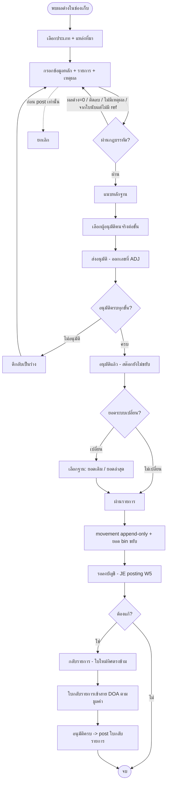
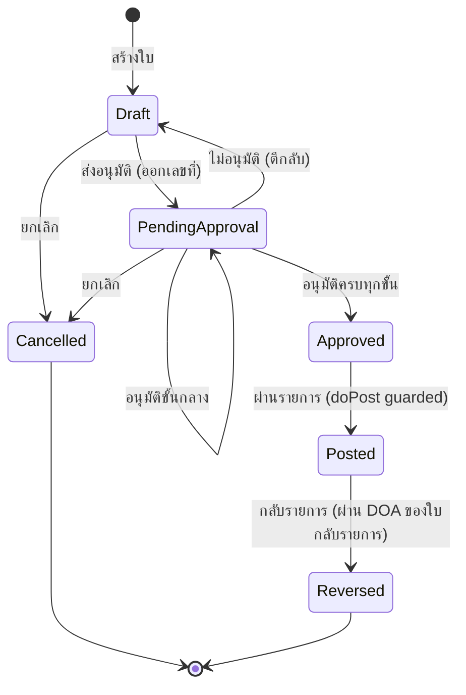

# BRD: Stock Adjustment — ใบปรับยอดสต๊อก

| Field | Value |
|---|---|
| BRD ID | BRD-WH-082 |
| Feature Name | Stock Adjustment (ใบปรับยอดสต๊อก) |
| Feature Code | `F-WH-STKADJ` · fid **F082** |
| BRD Type | **New Feature** |
| Version | 2.0 |
| Status | **AI Reviewed — APPROVED** (Quality Gate §AI Review ท้ายไฟล์) |
| Module | Warehouse |
| Wave / Pack | W3Q · CUBE-LANE-W3-LITE |
| Owner | BA |
| Stakeholders | Strike (เจ้าของกระบวนการ) · หัวหน้าคลัง/ผู้จัดการคลัง · ฝ่ายบัญชี · ผู้ตรวจสอบภายใน · เจ้าของ F-DLG-001 / F-DOCCFG / F-NOTIFY / F-CSQ-01 |
| Created / Last Updated | 2026-09-16 |
| Input ที่ใช้ | `PREBRIEF_F-WH-STKADJ.md` (S-01..S-26 · BR-01..BR-27 · §5.1 · §9 edges) · `FUNCTION_CHECKLIST_F-WH-STKADJ.md` (**55 FN**) · **HTML `outputs/F-WH-STKADJ/F-WH-STKADJ.html` (ผ่าน ux gate + coverage R1 gate)** · `5_DECLARATIONS/{DOA,NTF,CSQ,DOCCFG}_BRIEF` + `print-spec-adj.md` · gate reports `_UX_CHECK_REPORT.md` · `_COVERAGE_R1.md` · `PREBRIEF_F-WH-PUTAWAY §3.0` (สัญญากลาง location) |

## Changelog
- v1.0 (2026-09-10): สร้าง BRD ผ่าน `brd-generator-full` — Fresh Mode (HTML-first) รอบ direction phase
- **v2.0 (2026-09-16): regen ผ่าน `brd-generator-full` — Fresh Mode (HTML-first: สกัด Screen Inventory จาก HTML จริงที่ผ่าน ux + coverage R1)** สะท้อนมติ BA re-gate 2026-09-15:
  - **FIX-02 / BR-27:** ยกเลิกได้เฉพาะ `ร่าง` / `รออนุมัติ` — `อนุมัติแล้ว` ยกเลิกไม่ได้ (post แล้วกลับรายการเท่านั้น) → แก้ §5 · §8 · §9 · §10 · §12.1 (ตัด `อนุมัติแล้ว → ยกเลิก` ออกจากทุก transition/downstream)
  - **FIX-03:** กลับรายการ (reversal) ต้องผ่าน **DOA ตามชั้นมูลค่า** (ไม่ auto-post) → แก้ §4.2 · §5.2.3 · §8 · §9 (R19) · §16 (DOA control ครอบ reversal)
  - **FIX-04 / BR-26 / FN-52:** count-doc trace — หัวใบมี **แหล่งที่มา** `ปรับตรง / จากใบนับ` · `จากใบนับ` → บังคับเลือก `ref_count_doc` (F084/F086) · view drawer โชว์ "ใบนับต้นเรื่อง" **display-only ไม่เปิดหน้าใบนับ** → เพิ่ม §3 · §6 · §7 · §9 (R28) · §12.1 upstream
  - FN 54 → **55** (เพิ่ม FN-52) · view drawer แก้จาก 5 แท็บ → **4 แท็บจริง** (รายละเอียด / PDF / ลายเซ็น / ประวัติ — เอกสารแนบอยู่ในแท็บรายละเอียด) ตาม HTML source of truth

> **ปี ค.ศ. ล้วนทุกจุดในเอกสารและใน UI** · **Conflict Priority ที่ใช้ในเอกสารนี้: LOCK > business intent (PREBRIEF) > HTML หน้าจอจริง**

---

# 1. Document Info & Conflict Resolution

**HTML-first Fresh Mode:** HTML ผ่าน ux gate (PASS · BLOCK=0) + coverage R1 (PASS · 55/55 FN · e2e 58/58 cases) แล้ว จึงใช้เป็น source of truth ของ "หน้าจอที่มีจริง" — Screen Inventory (§14.6) สกัดจากหน้าจอจริง

**ลำดับตัดสินเมื่อขัดกัน:**
1. **LOCK-01..10** (§3.4) — ชนะทุกอย่าง · ขัด = SCOPE DRIFT
2. **business intent (PREBRIEF)** — "ต้องการอะไร ทำไม เกณฑ์อะไร"
3. **HTML หน้าจอจริง** — "หน้าจอ/flow มีอะไรจริง"

**Drift ที่พบและจัดการ (ไม่แก้เงียบ):**
- HTML view drawer = **4 tabs** (detail › pdf › sign › history) · BRD v1 เขียนผิดเป็น 5 tabs → v2 แก้ตาม HTML (เอกสารแนบอยู่ในแท็บรายละเอียด ไม่ใช่แท็บแยก — ยืนยันจาก `_UX_CHECK_REPORT.md` "ไม่มี attachments tab #101")
- ไม่มี HTML-RIF DRIFT อื่น · ทุก S-XX/FN-XX มีที่ยืนบนจอจริง (coverage R1 §2 matrix 55/55)

---

# 2. Business Context

## 2.1 ปัญหา / โอกาส
ยอดสินค้าในระบบกับของจริงในช่องเก็บ (bin) ไม่ตรงกันเป็นเรื่องปกติของคลัง — ของแตกเสียหาย ของสูญหาย บันทึกรับ/จ่ายขาด แต่ปัจจุบัน **ไม่มีเอกสารมาตรฐานที่บังคับเหตุผลและสายอนุมัติ** ทำให้ (1) แก้ยอดได้โดยไม่มีใครรับผิดชอบ (2) บัญชีไม่รู้ที่มาของผลต่าง (3) ตรวจสอบย้อนหลังไม่ได้

การปรับยอดสต๊อกเป็น **จุดเสี่ยงทุจริตอันดับต้นของคลัง** เพราะเป็นการเปลี่ยนตัวเลขทรัพย์สินโดยไม่มีคู่ค้าภายนอกมาถ่วงดุล (ไม่มีผู้ขาย/ลูกค้าเซ็นรับเหมือน PO/GRN/RTV) — ERP มาตรฐานทุกเจ้า (SAP · NetSuite · ERPNext · D365) จึงบังคับให้เป็น **เอกสารเต็มใบ + reason code + approval routing**

## 2.2 เป้าหมายทาง Business
- **G1 — ทุกการเปลี่ยนยอดมีเจ้าของและเหตุผล:** ไม่มีการแก้ยอดสต๊อกที่ไม่มีใบและไม่มีเหตุผลรายบรรทัด
- **G2 — คุมความเสี่ยงตามมูลค่า:** ใบมูลค่าสูงต้องผ่านผู้มีอำนาจสูงขึ้นโดยอัตโนมัติ (DOA ผูกมูลค่า — ครอบทั้งการปรับยอดและการกลับรายการ)
- **G3 — ตรวจสอบย้อนหลังได้ 100%:** รายการเคลื่อนไหว append-only + ประวัติเต็ม + เอกสาร PDF พร้อมลายเซ็น + trace ต้นเรื่องใบนับได้
- **G4 — ส่งต่อบัญชีได้ทันทีเมื่อ GL พร้อม:** ทุกใบมีมูลค่าและบัญชีปลายทาง (จาก master เหตุผล) เตรียมไว้ให้ W5

## 2.3 ตัวชี้วัดความสำเร็จ (Success Metrics)

| Metric | Baseline ปัจจุบัน | Target | วัดยังไง/จากไหน | วัดเมื่อไหร่ |
|---|---|---|---|---|
| M1 · สัดส่วนการปรับยอดที่มีเอกสารครบ (เหตุผล + อนุมัติ) | 0% (ยังไม่มีระบบ — **ต้องเก็บ baseline ก่อน launch**) | **100%** | นับ movement ปรับเพิ่ม/ปรับลด ที่ผูกใบ `ADJ-*` ÷ movement ปรับยอดทั้งหมด | หลัง launch 30 วัน |
| M2 · เวลาเฉลี่ยจากส่งอนุมัติ → ผ่านรายการ | ไม่มี (ต้องเก็บ baseline) | **≤ 1 วันทำการ** | `posted_at − submitted_at` เฉลี่ยต่อเดือน | หลัง launch 60 วัน |
| M3 · อัตราใบถูกตีกลับ | ไม่มี (ต้องเก็บ baseline) | **< 15%** | ใบที่มี `approval_history.result = rejected` ÷ ใบที่ส่งอนุมัติ | รายเดือน ต่อเนื่อง |
| M4 · มูลค่าที่ปรับสะสมต่อเดือน (ค่าสัมบูรณ์) | ไม่มี (ต้องเก็บ baseline) | **แนวโน้มลดลง ≥ 10% ใน 6 เดือน** | Σ\|มูลค่าที่ปรับ\| ของใบสถานะ `ผ่านรายการ` ต่อเดือน | รายเดือน · สรุปที่เดือน 6 |
| M5 · อัตราใบที่ต้องกลับรายการ | ไม่มี (ต้องเก็บ baseline) | **< 3%** | ใบ `กลับรายการแล้ว` ÷ ใบ `ผ่านรายการ` | รายเดือน |

> ทุกตัวมีคู่ใน §17.3 KPI (C22)

## 2.4 ที่มาของ Requirement
- **เคสที่เกิด:** ปิดงวดแล้วบัญชีพบสินค้าคงเหลือไม่ตรงกับที่คลังรายงาน แต่หา "ใครแก้ เมื่อไหร่ เพราะอะไร" ไม่ได้
- **Request จาก:** เจ้าของกระบวนการคลัง (Strike) ผ่าน CHECKLIST W3Q + `OQ-STK-01`
- **KPI Gap:** ไม่มีตัวเลขความถูกต้องของสต๊อก (inventory accuracy) เพราะไม่มีทะเบียนการปรับยอด

---

# 3. Scope

## 3.1 In Scope
- ออก **ใบปรับยอดสต๊อก** เลขรัน `ADJ-YYYY-NNNN` (ปี ค.ศ. · จาก ENG-DOC-NUM ตอนส่งอนุมัติ) — 1 ใบ = 1 คลัง
- **แหล่งที่มา** `ปรับตรง` / `จากใบนับ` — `จากใบนับ` อ้าง `ref_count_doc` (F084/F086) แบบ **trace display-only** (BR-26 · FN-52)
- ปรับ **เพิ่ม (+) / ลด (−)** จำนวนของคู่ (ช่องเก็บ, สินค้า) — กรอกได้ 2 โหมด: ระบุยอดที่ถูกต้อง หรือ ระบุจำนวนที่ปรับ
- **เหตุผลบังคับทุกบรรทัด** จาก master เหตุผล (config) + คำอธิบายเพิ่มเมื่อเหตุผลกำหนด
- **มูลค่าที่ปรับ** = ผลต่าง × ต้นทุนอ้างอิงจากทะเบียนสินค้า (mock — valuation จริง W5)
- **สายอนุมัติ DOA ผูกมูลค่า** — ฐาน = **ผลรวมค่าสัมบูรณ์** · เลือก **คนจริง** ต่อ slot (avatar + ตำแหน่ง + ชื่อ)
- 3 ประเภทการปรับ: ปรับยอดทั่วไป (storage/staging) · ตัดจำหน่ายของเสีย (damage) · ปรับยอดกักกัน (quarantine)
- **ผ่านรายการ (post)** → รายการเคลื่อนไหว **append-only** + ยอดคงเหลือราย bin ขยับ (post ได้เฉพาะ `อนุมัติแล้ว` — doPost guarded)
- **ตรวจยอดซ้ำก่อน post** (ยอดระบบเปลี่ยนหลังสร้างรายการ → เตือน + เลือกฐาน)
- **ยกเลิกเฉพาะก่อน post** (`ร่าง`/`รออนุมัติ` เท่านั้น) / **กลับรายการหลัง post** ผ่าน **DOA ตามชั้นมูลค่า** (สร้างใบทิศตรงข้าม ผูกคู่ 2 ทาง)
- แนบหลักฐาน (บังคับสำหรับตัดจำหน่ายของเสีย) · เอกสาร PDF A4 + ช่องลายเซ็น 3 ช่อง · ประวัติ append-only

## 3.2 Out of Scope (Functions Cut / ไม่รองรับ)
- ❌ **นับสต๊อกรอบ / cycle count / ใบนับ / blind count** — `OQ-STK-01` = backlog (owner Strike) · เจ้าของจริง F084 Stocktake / F086 Cycle Count (W4) · UI ห้ามมีคำ/หน้า/ปุ่มนับสต๊อก (BR-24 · FN-35) — *การอ้าง `ref_count_doc` แบบ display-only ไม่ใช่การนับ (FN-52 ≠ FN-35)*
- ❌ **เปลี่ยน/ย้าย location ของสินค้า** (bin→bin, คลัง→คลัง) — เป็น **F-WH-STKTRF Stock Transfer** (BR-05 · FN-36)
- ❌ **เขียนของเข้า/ออก location ประเภท `in-transit`** — จองไว้ให้ Stock Transfer · กรองออกจาก picker ทุกกรณี (BR-13 · FN-32)
- ❌ ย้ายของจาก `quarantine` ออกไป `storage` — ทางออกของกักกันคือ **RTV** (F080)
- ❌ **โพสต์ JE เข้า GL จริง** / คำนวณต้นทุน FIFO-เฉลี่ย — **W5** (mock + `FWD-WIRE: JE posting`)
- ❌ **คอลัมน์ VAT / ส่วนลด** ในตารางบรรทัด — ปรับยอดสต๊อกไม่ใช่รายการภาษี (FN-49)
- ❌ สร้าง/แก้ Location Master (zone/bin/ความจุ) — เป็น config (soft-ref LD-4C-02 อ่านอย่างเดียว)
- ❌ ตั้งค่าสายอนุมัติ/วงเงิน (→ DOA กลาง F-DLG-001) · รูปแบบเลขรัน (→ F-DOCCFG) · threshold แจ้งเตือน (→ NC rules) — ไม่มีหน้าตั้งค่าใน feature (FN-47/FN-48)
- ❌ Lot/Batch/Serial + วันหมดอายุ · นำเข้า CSV · revaluation (ปรับราคาไม่ปรับจำนวน) · RF scan/มือถือ
- ❌ **เปิด/สร้างหน้าใบนับ** จากปุ่ม trace — `ref_count_doc` เป็น display-only (นั่นคือ scope ของ F084/F086)

## 3.3 Assumptions
- A1 · ต้นทุนอ้างอิงต่อหน่วยมาจากทะเบียนสินค้า (`[ASSUMED contract]`) จนกว่า Inventory Valuation (W5) จะพร้อม
- A2 · โครงสร้าง location (warehouse › zone › bin + `location_type`) **มาจาก `PREBRIEF_F-WH-PUTAWAY §3.0` เป็นสัญญากลาง — ห้ามนิยามใหม่**
- A3 · ยอดคงเหลือราย bin = `Σ movement เข้า − Σ movement ออก` ต่อคู่ (bin, สินค้า)
- A4 · ผู้ใช้ทุกคนอยู่ในทะเบียนพนักงานเดียวกันกับที่ DOA กลางใช้ดึงคน
- A5 · งวดบัญชีที่ยังเปิดอยู่เท่านั้นที่ระบุวันที่มีผลย้อนหลังได้ (`OQ-ADJ-05` → W5)
- A6 · ใบนับ F084/F086 มีเลขเอกสารให้อ้างแบบ soft-ref (display-only) — feature นี้ไม่รู้เนื้อในใบนับ

## 3.4 Scope Lock ⭐

- **Scope Lock Ref:** **N/A — standalone** (งานเข้าเลนผ่าน Central Plan CUBE-LANE-W3-LITE ไม่ได้ผ่าน chain ใบเซ็นลูกค้า) · แหล่งอ้างอิงที่ทำหน้าที่แทน = `CONTEXT_PACK/W3-LITE.md` + `CHECKLIST W3Q` + BA re-gate 2026-09-15

| LOCK-ID | ข้อยืนยันที่ล็อกแล้ว (ห้าม override ตลอด chain) | อ้างเอกสาร+ข้อ |
|---|---|---|
| LOCK-01 | **arch = Q-document** — Pattern Q เต็ม 4 surface + B2 v2 line editor | CONTEXT_PACK §2.1 · FEATURE_LIST F082 |
| LOCK-02 | **เหตุผลบังคับทุกบรรทัด + DOA ตามมูลค่า** · cycle count = backlog | `OQ-STK-01 [ASSUMED]` · CHECKLIST W3Q |
| LOCK-03 | **เพิ่ม/ลดเท่านั้น — เปลี่ยน location ไม่อยู่ feature นี้** | CHECKLIST W3Q |
| LOCK-04 | **DOA slot picker คนจริง** (avatar + ตำแหน่ง + ชื่อ) ห้าม role ID | locked 2026-08-17 · GOLDEN §3 |
| LOCK-05 | **เลขรัน `ADJ-YYYY-NNNN` ประกาศผ่าน doccfg** ห้าม hardcode | CONTEXT_PACK §2.3 |
| LOCK-06 | **movement append-only** — ยกเลิกหลัง post = reversal เท่านั้น | CONTEXT_PACK §2.8 · GOLDEN §4 |
| LOCK-07 | **location model จาก Putaway §3.0** — ห้ามนิยามใหม่ · `in-transit` ห้ามแตะ | BUILD_ORDER edge `PUTAWAY→STKADJ` |
| LOCK-08 | **JE = mock + `TODO: JE posting`** (W5) — ห้าม post จริง | CONTEXT_PACK §2.6 |
| LOCK-09 | **soft-reference LD-4C-02** — master = picker ไม่ FK validate nullable | GOLDEN §4 |
| LOCK-10 | **CI CUBE Warm Light · ปี ค.ศ. ล้วน · sidebar ตาม module map** | TASTE_LOG |

- **Scope Drift:** **ไม่มี** — ทุกอย่างที่ทำอยู่ใน CHECKLIST W3Q + มติ BA re-gate · ของที่เกินถูกยกออกเป็น §3.2 พร้อมเจ้าของจริง (ไม่มีการตัดเงียบ) · ประเด็นที่ยังไม่เคาะทั้งหมดมี Open Question คู่ใน §15

---

# 4. User Roles & Permissions

## 4.1 Roles ที่เกี่ยวข้อง

| Role | คำอธิบาย |
|---|---|
| **เจ้าหน้าที่คลัง** (Warehouse Officer) | ผู้พบผลต่างและจัดทำใบปรับยอด |
| **หัวหน้าคลัง** (Warehouse Supervisor) | ผู้อนุมัติชั้นแรก + ผู้กด "ผ่านรายการ" + ผู้ริเริ่มกลับรายการ |
| **ผู้จัดการคลังสินค้า** (Warehouse Manager) | ผู้อนุมัติชั้นที่ 2 (มูลค่ากลาง) |
| **ผู้จัดการฝ่ายบัญชี** (Accounting Manager) | ผู้อนุมัติชั้นที่ 3 (มูลค่าสูง — กระทบงบอย่างมีนัยสำคัญ) |
| **ผู้อำนวยการสายงานปฏิบัติการ** (Ops Director) | ผู้อนุมัติชั้นสูงสุด (> 1,000,000) |
| **บัญชี (อ่านอย่างเดียว)** | ดูใบที่ผ่านรายการ + มูลค่า + เหตุผล เพื่อเตรียมลงบัญชี (W5) |
| **ผู้ตรวจสอบภายใน (audit)** | อ่านทุกใบทุกสถานะ + ประวัติ + movement append-only |

## 4.2 Permission Matrix

| Action | จนท.คลัง | หน.คลัง | ผจก.คลัง | ผจก.บัญชี | ผอ.สายงาน | บัญชี (RO) | Audit |
|---|:---:|:---:|:---:|:---:|:---:|:---:|:---:|
| สร้าง/แก้ใบร่าง | ✅ | ✅ | ✅ | ❌ | ❌ | ❌ | ❌ |
| แนบหลักฐาน | ✅ | ✅ | ✅ | ❌ | ❌ | ❌ | ❌ |
| ส่งอนุมัติ (เลือกคนต่อ slot) | ✅ | ✅ | ✅ | ❌ | ❌ | ❌ | ❌ |
| อนุมัติ / ไม่อนุมัติ (เฉพาะ slot ตัวเอง) | ❌ | ✅ | ✅ | ✅ | ✅ | ❌ | ❌ |
| **ผ่านรายการ (post)** — เฉพาะ `อนุมัติแล้ว` | ❌ | ✅ | ✅ | ❌ | ❌ | ❌ | ❌ |
| ยกเลิกใบ (เฉพาะ `ร่าง`/`รออนุมัติ`) | ✅ (ของตัวเอง) | ✅ | ✅ | ❌ | ❌ | ❌ | ❌ |
| **เริ่มกลับรายการ (หลัง post)** | ❌ | ✅ | ✅ | ❌ | ❌ | ❌ | ❌ |
| **อนุมัติกลับรายการ** (ตามชั้นมูลค่า — DOA) | ❌ | ✅ | ✅ | ✅ | ✅ | ❌ | ❌ |
| ดู / พิมพ์ PDF | ✅ | ✅ | ✅ | ✅ | ✅ | ✅ | ✅ |
| ดูประวัติ + movement | ✅ | ✅ | ✅ | ✅ | ✅ | ✅ | ✅ |
| แก้ไข/ลบ movement | ❌ | ❌ | ❌ | ❌ | ❌ | ❌ | ❌ |

> สิทธิ์จริงกำหนดที่ Policy Center — feature ไม่ hardcode (LOCK-09 · §16.3)
> **FIX-03:** การกลับรายการหลัง post ไม่ใช่การกด post ซ้ำแบบ 1 คน — ต้องผ่านสายอนุมัติ DOA ตามชั้นมูลค่าของใบกลับรายการก่อนจึงจะเกิด movement ทิศตรงข้าม

---

# 5. User Journey (with COSO)

## 5.1 Happy Path — ปรับยอดทั่วไป มูลค่ากลาง (2 ชั้นอนุมัติ)

| # | Step | Maker | Checker | Approver | System | Notes |
|---|---|---|---|---|---|---|
| 1 | เลือกประเภทการปรับ + **แหล่งที่มา** (ปรับตรง/จากใบนับ) | เจ้าหน้าที่คลัง | — | — | กรองกลุ่มช่องเก็บตามประเภท (BR-12) · จากใบนับ → เปิดช่อง `ref_count_doc` (BR-26) | Trigger: พบผลต่าง |
| 2 | กรอกข้อมูลหลัก (คลัง · วันที่มีผล · ศูนย์ต้นทุน) | เจ้าหน้าที่คลัง | — | — | ยังไม่ออกเลขที่ (BR-21) | 1 ใบ = 1 คลัง |
| 3 | เลือกสินค้า + ช่องเก็บ | เจ้าหน้าที่คลัง | — | — | ดึง **ยอดระบบ** จากยอดคงเหลือราย bin + snapshot เวลา | in-transit ไม่โผล่ (BR-13) |
| 4 | กรอกยอดที่ถูกต้อง / จำนวนที่ปรับ | เจ้าหน้าที่คลัง | — | — | คำนวณผลต่าง + มูลค่าที่ปรับ + Σ ค่าสัมบูรณ์ | ติดลบ = บล็อก (BR-03) |
| 5 | ระบุเหตุผลทุกบรรทัด (+ คำอธิบายเพิ่มถ้าจำเป็น) | เจ้าหน้าที่คลัง | — | — | กรองเหตุผลตามทิศ +/− (BR-07) | บังคับ (BR-06) |
| 6 | แนบหลักฐาน | เจ้าหน้าที่คลัง | — | — | บังคับเมื่อประเภท = ตัดจำหน่ายของเสีย (BR-23) | เก็บที่ Document Center |
| 7 | ตรวจทาน + **ส่งอนุมัติ** (เลือกคนจริงต่อ slot) | เจ้าหน้าที่คลัง | — | — | **ออกเลขที่ `ADJ-YYYY-NNNN`** (ENG-DOC-NUM) · resolve สายจาก DOA ด้วย Σ ค่าสัมบูรณ์ · freeze สาย · แจ้งผู้อนุมัติ | BR-09/BR-10/BR-21 |
| 8 | อนุมัติขั้น 1 | — | — | **หัวหน้าคลัง** | บันทึกลายเซ็น + เวลา (ค.ศ.) → ส่งต่อขั้น 2 | SLA §17.1 |
| 9 | อนุมัติขั้น 2 (ขั้นสุดท้าย) | — | — | **ผู้จัดการคลังสินค้า** | สถานะ → `อนุมัติแล้ว` (สต๊อกยังไม่ขยับ) | BR-08 |
| 10 | **ผ่านรายการ** | — | **หัวหน้าคลัง** (ตรวจยอดซ้ำ) | — | doPost guarded (`อนุมัติแล้ว` เท่านั้น) → ตรวจ drift (BR-15) → สร้าง **movement append-only** → ยอด bin ขยับ → สถานะ `รอลงบัญชี` + `FWD-WIRE: JE posting` | BR-16/BR-19 |

**SoD Check:** Maker (เจ้าหน้าที่คลัง) ≠ Approver (หัวหน้าคลัง / ผู้จัดการคลัง) ✅ · ระบบบล็อกผู้ส่งอนุมัติไม่ให้อนุมัติใบตัวเอง (`canActStep`: `submittedBy !== ผู้ใช้`) ✅

## 5.2 Alternative Paths

### 5.2.1 Reject Path (ตีกลับ)
| # | Step | COSO Roles | Notes |
|---|---|---|---|
| 1 | ผู้อนุมัติ slot ปัจจุบันกด "ไม่อนุมัติ" | Approver | **เหตุผลบังคับ** (BR-11) |
| 2 | ระบบเก็บรอบที่ถูกตีกลับใน `approval_history` แล้วคืนสถานะ `ร่าง` | System | เลขที่เดิมคงอยู่ (ไม่ออกเลขใหม่) |
| 3 | ผู้จัดทำแก้แล้วส่งใหม่ | Maker | **re-resolve สายใหม่ตามมูลค่าใหม่** + เลือกคนใหม่ทุก slot (BR-DOA-05) |

### 5.2.2 Cancel Path (ยกเลิก — เฉพาะก่อน post · FIX-02 / BR-27)
| # | Step | COSO Roles | Notes |
|---|---|---|---|
| 1 | ผู้จัดทำ/หัวหน้าคลังกด "ยกเลิก" | Maker / Checker | **โผล่เฉพาะสถานะ `ร่าง` / `รออนุมัติ`** · เลือกประเภทเหตุผล + พิมพ์เหตุผล (บังคับ) |
| 2 | สถานะ → `ยกเลิก` (ปลายทางสุดท้าย) · slot ที่ค้าง → `cancelled` | System | **ไม่มี movement · ใบยังอยู่ในระบบ ไม่ลบ** |

> ★ **`อนุมัติแล้ว` ยกเลิกไม่ได้** (ปุ่มยกเลิกไม่โผล่) — ต้อง `ผ่านรายการ` ก่อนแล้วจึง `กลับรายการ` (BR-27 · FIX-02)

### 5.2.3 Reversal Path (กลับรายการหลัง post — ผ่าน DOA · FIX-03)
| # | Step | COSO Roles | Notes |
|---|---|---|---|
| 1 | หัวหน้าคลังกด "กลับรายการ" ที่ใบสถานะ `ผ่านรายการ` | Checker (Maker ของใบกลับรายการ) | เหตุผลบังคับ (BR-17) |
| 2 | ระบบสร้าง **ใบกลับรายการใบใหม่** (เลข `ADJ` ของตัวเอง) รายการทิศตรงข้าม · ผูก `reversal_of` ↔ `reversed_by_doc` 2 ทาง | System | BR-18 |
| 3 | **ใบกลับรายการเข้าสายอนุมัติ DOA ตามชั้นมูลค่า** (ฐาน = Σ ค่าสัมบูรณ์ของใบกลับรายการ) — เลือกคนจริงต่อ slot | Approver | ★ **FIX-03: ไม่ auto-post** — ต้องอนุมัติครบสายก่อน |
| 4 | อนุมัติครบ → หัวหน้าคลังผ่านรายการใบกลับรายการ → movement ทิศตรงข้าม (append-only) | Checker | movement เดิม**ยังอยู่ ลบไม่ได้** (BR-16) |
| 5 | ใบเดิม → `กลับรายการแล้ว` (กลับซ้ำไม่ได้) | System | BR-18 |

### 5.2.4 Quantity Drift Path (ยอดระบบเปลี่ยนระหว่างรออนุมัติ)
| # | Step | COSO Roles | Notes |
|---|---|---|---|
| 1 | ระบบตรวจ snapshot vs ยอดล่าสุดตอนเปิดใบ / ตอนกด post | System | แสดงทั้ง 2 ยอดรายบรรทัด (dialog ตรวจยอดซ้ำ) |
| 2 | ผู้กด post เลือก "คิดจากยอดล่าสุด" หรือกลับไปตีกลับให้แก้ | Checker | เลือกยอดล่าสุด → คำนวณผลต่างใหม่ + บันทึก audit (BR-15) |

### 5.2.5 Count-Doc Trace Path (ปรับยอดจากใบนับ · FN-52 / BR-26)
| # | Step | COSO Roles | Notes |
|---|---|---|---|
| 1 | เลือกแหล่งที่มา = "จากใบนับ" ที่ wizard step 1 | Maker | ระบบเปิดช่อง `ref_count_doc` |
| 2 | เลือกเลขใบนับต้นเรื่อง (F084/F086) — **บังคับ** | Maker | ส่งอนุมัติไม่ได้ถ้าเว้นว่าง (BR-26 · enforce 2 guard: wizardNext + submit) |
| 3 | view drawer โชว์แถว "ใบนับต้นเรื่อง" ลิงก์ trace | ทุก role | **display-only — ไม่เปิดหน้าใบนับ** (FN-52) · "ปรับตรง" = ไม่บังคับ ref |

## 5.3 Process Diagram



---

# 6. Data Entity & Fields

## 6.1 Entity Overview

| Entity | Type | Description |
|---|---|---|
| `StockAdj_Header` | Header | ใบปรับยอดสต๊อก 1 ใบ |
| `StockAdj_Line` | Detail | 1 บรรทัด = 1 คู่ (ช่องเก็บ, สินค้า) |
| `StockAdj_Attachment` | Attachment | ไฟล์หลักฐาน (Document Center) |
| `StockAdj_Approval` | Chain | snapshot สายอนุมัติ + ผลรายขั้น (append-only) · ครอบทั้งใบปรับยอดและใบกลับรายการ |
| `Inventory_Movement` | Ledger | รายการเคลื่อนไหวสต๊อก **append-only** (ใช้ร่วมทั้ง Warehouse) |
| `Adj_Reason` | Config | master เหตุผลการปรับ (อ่านอย่างเดียวจาก feature นี้) |

## 6.2 Entity: `StockAdj_Header`

| # | Field | Label UI | Input Type | ค่า/ตัวเลือก | จำเป็น | เงื่อนไข | หมายเหตุ |
|---|---|---|---|---|:---:|---|---|
| 1 | `adj_no` | เลขที่ใบปรับยอด | AUTO | `ADJ-YYYY-NNNN` (ค.ศ.) | ✅ | ออกตอน**ส่งอนุมัติ** | จาก **ENG-DOC-NUM** ตาม doccfg — ห้าม format เอง |
| 2 | `warehouse_ref` | คลัง | LOOKUP (combobox) | Warehouse Master | ✅ | 1 ใบ = 1 คลัง · เปลี่ยน = confirm ล้างบรรทัด | soft-ref ไม่ FK |
| 3 | `effective_date` | วันที่มีผล | DATE | — | ✅ | ≤ วันนี้ · งวดที่ยังเปิด | **ปี ค.ศ.** |
| 4 | `adj_source` ★ | แหล่งที่มา | SEGMENTED | `ปรับตรง` / `จากใบนับ` | ✅ | `จากใบนับ` → เปิด `ref_count_doc` | BR-26 · FN-52 (FIX-04) |
| 5 | `ref_count_doc` ★ | อ้างอิงใบนับ | LOOKUP (soft-ref · display-only) | ใบนับ F084/F086 | ⬜ (✅ เมื่อ `adj_source=จากใบนับ`) | บังคับเมื่อจากใบนับ · **ไม่เปิด/สร้างหน้าใบนับ** | BR-26 · FN-52 |
| 6 | `adjustment_type` | ประเภทการปรับ | DROPDOWN-SINGLE | ปรับยอดทั่วไป / ตัดจำหน่ายของเสีย / ปรับยอดกักกัน | ✅ | คุมกลุ่ม `location_type` ที่เลือกได้ | BR-12 |
| 7 | `cost_center_ref` | ศูนย์ต้นทุน | LOOKUP | Cost Center Master | ⬜ | default ตามคลัง | ใช้ตอน JE (W5) |
| 8 | `header_reason_code` | เหตุผลรวมของใบ | LOOKUP | `Adj_Reason` | ⬜ | เลือกแล้วเติมบรรทัดที่ยังว่าง | ยังแก้รายบรรทัดได้ |
| 9 | `note` | หมายเหตุ | TEXTAREA | — | ⬜ | — | — |
| 10 | `status` | สถานะเอกสาร | ENUM | ร่าง / รออนุมัติ / อนุมัติแล้ว / ผ่านรายการ / ยกเลิก / กลับรายการแล้ว | ✅ | เปลี่ยนตาม §8 เท่านั้น | — |
| 11 | `abs_adjustment_amount` | มูลค่าที่ปรับรวม (ค่าสัมบูรณ์) | COMPUTED | `Σ \|มูลค่าต่อบรรทัด\|` | — | อ่านอย่างเดียว | ★ **ฐาน DOA** (BR-09) |
| 12 | `net_adjustment_amount` | มูลค่าสุทธิ | COMPUTED | `Σ มูลค่าต่อบรรทัด` | — | อ่านอย่างเดียว | **ห้ามใช้เป็นฐาน DOA** |
| 13 | `doa_entry_ref` | DOA entry | AUTO | `DOA-WH-ADJ-01` | ⬜ (✅ เมื่อส่ง) | จาก DOA กลาง | ไม่ hardcode |
| 14 | `approval_status` | สถานะการอนุมัติ | ENUM | draft / pending_approval / approved / rejected / cancelled | ✅ | map กับ `status` | — |
| 15 | `submitted_by` / `submitted_at` | ผู้ส่ง / เวลา | AUTO | คนจริง + timestamp | ⬜ | ตอนส่งอนุมัติ | ค.ศ. |
| 16 | `approved_by` / `approved_at` | ผู้อนุมัติครบสาย / เวลา | AUTO | — | ⬜ | ขั้นสุดท้าย | ค.ศ. |
| 17 | `posted_by` / `posted_at` | ผู้ผ่านรายการ / เวลา | AUTO | — | ⬜ | ตอน post | ค.ศ. |
| 18 | `cancel_reason` / `cancel_note` | เหตุผลยกเลิก | ENUM + TEXT | master เหตุผลยกเลิก | ✅ เมื่อยกเลิก | บังคับ · เฉพาะ `ร่าง`/`รออนุมัติ` (BR-27) | — |
| 19 | `reversal_of` / `reversed_by_doc` | ใบต้นทาง / ใบกลับรายการ | LINK | soft link | ⬜ | ผูก 2 ทาง | BR-18 |
| 20 | `is_reversal_doc` | เป็นใบกลับรายการ | AUTO (bool) | — | — | ใบกลับรายการ = true → เข้าสาย DOA ของตัวเอง | FIX-03 |
| 21 | `created_by` / `created_date` / `modified_by` / `modified_date` | Audit | AUTO | session.user · now() | ✅ | — | Audit fields |

## 6.3 Entity: `StockAdj_Line`

| # | Field | Label UI | Input Type | ค่า/ตัวเลือก | จำเป็น | เงื่อนไข | หมายเหตุ |
|---|---|---|---|---|:---:|---|---|
| 1 | `line_no` | ลำดับ | AUTO | — | ✅ | — | — |
| 2 | `bin_ref` | ช่องเก็บ | LOOKUP (combobox) | Location Master (§3.0 Putaway) | ✅ | กรองตามคลัง + ประเภทการปรับ · `in-transit` ไม่โผล่ · `ล็อก` เลือกไม่ได้ | BR-12/13/14 |
| 3 | `location_type` | ประเภทช่องเก็บ | DERIVED | staging/storage/quarantine/damage | — | สืบจาก bin | แสดงเป็นบรรทัดรอง |
| 4 | `item_ref` | สินค้า | LOOKUP (combobox) | Item Master | ✅ | soft-ref | เก็บ `item_name` ไว้กัน master หลุด |
| 5 | `uom` | หน่วย | DERIVED | จาก Item Master | ✅ | ไม่แปลงหน่วยรอบนี้ | — |
| 6 | `system_qty_snapshot` | ยอดระบบ | AUTO (read-only) | ยอดคงเหลือราย bin | ✅ | เก็บ `snap_at` คู่ | ฐานตรวจ drift (BR-15) |
| 7 | `input_mode` | โหมดกรอก | SEGMENTED | ระบุยอดที่ถูกต้อง / ระบุจำนวนที่ปรับ | ✅ | ระดับ grid | แปลงกลับไปมาได้ |
| 8 | `correct_qty` | ยอดที่ถูกต้อง | NUMBER | ≥ 0 | ✅ (โหมด 1) | ≠ ยอดระบบ | BR-02 |
| 9 | `delta_qty` | ผลต่าง (+/−) | COMPUTED | `correct_qty − system_qty` | — | ≠ 0 · `system+delta ≥ 0` | BR-02/BR-03 |
| 10 | `unit_cost_ref` | ต้นทุนอ้างอิง/หน่วย | AUTO (read-only) | Item Master (**mock**) | ✅ | แก้ไม่ได้ · ป้าย `FWD-WIRE: valuation engine` | `[ASSUMED contract]` → W5 |
| 11 | `line_amount` | มูลค่าที่ปรับ | COMPUTED | `delta_qty × unit_cost_ref` | — | มีเครื่องหมายเสมอ | ฐานของ §6.2 #11/#12 |
| 12 | `reason_code` | เหตุผล | LOOKUP | `Adj_Reason` | ✅ **ทุกบรรทัด** | กรองตามทิศ +/− | BR-06/BR-07 |
| 13 | `reason_note` | คำอธิบายเพิ่ม | TEXT | — | ✅ เมื่อเหตุผลกำหนด | RS-03/06/07/99 | BR-06 |
| 14 | `drift_flag` | ป้ายเตือนยอดเปลี่ยน | DERIVED | — | — | snapshot ≠ ยอดล่าสุด | BR-15 |

## 6.4 Entity: `Inventory_Movement` (append-only — ใช้ร่วมทั้ง Warehouse)

| # | Field | หมายเหตุ |
|---|---|---|
| 1 | `movement_no` | **append-only ห้ามลบ ห้ามแก้** |
| 2 | `movement_type` | ปรับเพิ่ม / ปรับลด / กลับรายการปรับเพิ่ม / กลับรายการปรับลด |
| 3 | `item_ref` · `qty` · `uom` | จำนวนเก็บเป็นค่าบวก ทิศอยู่ที่ประเภท |
| 4 | `bin_ref` | ★ **location เดียว — ไม่มี "จาก→ไป"** เพราะไม่ใช่การย้าย (LOCK-03) |
| 5 | `unit_cost` · `amount` | snapshot ตอน post — ฐาน JE (W5) |
| 6 | `reason_code` · `reason_note` | ติดไปกับ movement เสมอ (audit) |
| 7 | `actor` · `occurred_at` | คนจริง + timestamp **ค.ศ.** |
| 8 | `ref_doc` · `ref_line` | `ADJ-YYYY-NNNN` + เลขบรรทัด |
| 9 | `reversed_movement` / `reversal_movement` | ผูก 2 แถวเข้าหากันเสมอ |
| 10 | `je_status` | `รอลงบัญชี` (คงที่รอบนี้) — `FWD-WIRE: JE posting` |
| 11–14 | audit fields | `created_by/date`, `modified_by/date` (แก้ไม่ได้จริง — เก็บเพื่อความสม่ำเสมอ schema) |

## 6.5 Entity: `Adj_Reason` (config — feature นี้อ่านอย่างเดียว)

| Field | ตัวอย่าง |
|---|---|
| `reason_code` · `reason_name` | `RS-01` ของเจอเกินยอดระบบ … `RS-99` อื่น ๆ |
| `direction` | `+` / `−` / ทั้งคู่ |
| `require_note` | ใช่/ไม่ |
| `gl_account_mock` | บัญชีปลายทาง (mock — เตรียมให้ W5 · gap G-05) |
| audit fields | `created_by/date`, `modified_by/date` |

## 6.6 Entity Relationship

```
StockAdj_Header ──(1:N)──▶ StockAdj_Line
StockAdj_Header ──(1:N)──▶ StockAdj_Attachment
StockAdj_Header ──(1:N)──▶ StockAdj_Approval   (snapshot ตอนส่ง · append-only · ใบปรับยอด + ใบกลับรายการ)
StockAdj_Header ──(1:N)──▶ Inventory_Movement  (เกิดตอน post เท่านั้น)
StockAdj_Header ──(1:1 opt)──▶ StockAdj_Header (reversal_of ↔ reversed_by_doc)
Count_Doc (F084/F086) ──(referenced by · soft-ref display-only)──▶ StockAdj_Header.ref_count_doc
Location(Master · Putaway §3.0) ──(referenced by)──▶ StockAdj_Line.bin_ref   [soft-ref]
Item Master ──(referenced by)──▶ StockAdj_Line.item_ref                      [soft-ref]
Adj_Reason ──(referenced by)──▶ StockAdj_Line.reason_code / Header.header_reason_code
Cost Center ──(referenced by)──▶ StockAdj_Header.cost_center_ref              [soft-ref]
```

---

# 7. User Stories & Acceptance Criteria

## Story S-01: สร้างใบปรับยอดแบบเพิ่มจำนวน
**As a** เจ้าหน้าที่คลัง · **I want to** บันทึกยอดที่ถูกต้องเมื่อของมีมากกว่าในระบบ · **So that** ยอดคงเหลือตรงกับของจริง
- **AC1:** Given เลือกช่องเก็บและสินค้าแล้ว, When ระบบดึงยอดระบบมาแสดง, Then ช่อง "ยอดระบบ" เป็นค่าอ่านอย่างเดียวพร้อมบันทึกเวลาที่ดึง
- **AC2:** Given กรอกยอดที่ถูกต้องสูงกว่ายอดระบบ, When ระบบคำนวณ, Then แสดงผลต่างเป็นบวกและมูลค่าที่ปรับเป็นบวก (ชิปเขียว)

## Story S-02: สร้างใบปรับยอดแบบลดจำนวน
**As a** เจ้าหน้าที่คลัง · **I want to** ลดยอดเมื่อของหายหรือเสียหาย · **So that** ทะเบียนไม่แสดงของที่ไม่มีอยู่จริง
- **AC1:** Given กรอกยอดที่ถูกต้องต่ำกว่ายอดระบบ, When ระบบคำนวณ, Then ผลต่างและมูลค่าเป็นลบพร้อมสีที่ต่างจากค่าบวก
- **AC2:** Given ยอดที่ปรับทำให้คงเหลือติดลบ, When กดถัดไปหรือส่งอนุมัติ, Then ระบบบล็อกพร้อมแสดงยอดคงเหลือจริง

## Story S-03: ระบุเหตุผลรายบรรทัด
**As a** เจ้าหน้าที่คลัง · **I want to** เลือกเหตุผลของการปรับแต่ละบรรทัด · **So that** ผู้อนุมัติและบัญชีเข้าใจที่มา
- **AC1:** Given บรรทัดใดยังไม่เลือกเหตุผล, When กดส่งอนุมัติ, Then ระบบบล็อกและชี้บรรทัดที่ขาด
- **AC2:** Given ผลต่างเป็นบวก, When เปิดรายการเหตุผล, Then เห็นเฉพาะเหตุผลกลุ่มเพิ่มและกลุ่มที่ใช้ได้ทั้งสองทิศ

## Story S-04: เลือกผู้อนุมัติเป็นคนจริงต่อขั้น
**As a** ผู้ส่งอนุมัติ · **I want to** ระบุตัวบุคคลที่จะอนุมัติแต่ละขั้น · **So that** ใบไม่ค้างเพราะไม่รู้ว่าใครต้องเซ็น
- **AC1:** Given มูลค่าที่ปรับรวมค่าสัมบูรณ์ 23,575 บาท, When เปิดหน้าส่งอนุมัติ, Then ระบบแสดงสายอนุมัติ 2 ขั้นตามตารางวงเงิน
- **AC2:** Given มี slot ที่ยังไม่เลือกคน, When กดส่งอนุมัติ, Then ระบบไม่ส่งและทำเครื่องหมายที่ slot ว่าง

## Story S-05: อนุมัติใบปรับยอด
**As a** ผู้อนุมัติ · **I want to** อนุมัติเฉพาะขั้นที่เป็นของฉัน · **So that** ลำดับการอนุมัติถูกต้อง
- **AC1:** Given ฉันเป็นเจ้าของขั้นปัจจุบัน, When กดอนุมัติ, Then ระบบบันทึกชื่อ ตำแหน่ง เวลา (ค.ศ.) แล้วส่งต่อขั้นถัดไป
- **AC2:** Given ฉันเป็นผู้ส่งอนุมัติใบนี้เอง, When เปิดใบ, Then ไม่มีปุ่มอนุมัติให้กด

## Story S-06: ตีกลับใบที่ไม่ถูกต้อง
**As a** ผู้อนุมัติ · **I want to** ส่งใบกลับให้แก้พร้อมเหตุผล · **So that** ผู้จัดทำรู้ว่าต้องแก้อะไร
- **AC1:** Given กดไม่อนุมัติ, When ยังไม่กรอกเหตุผล, Then ระบบไม่ยอมให้ยืนยัน
- **AC2:** Given ตีกลับสำเร็จ, When เปิดใบ, Then สถานะเป็นฉบับร่างและประวัติเก็บรอบที่ถูกตีกลับไว้

## Story S-07: ผ่านรายการให้สต๊อกขยับ
**As a** หัวหน้าคลัง · **I want to** ยืนยันผ่านรายการหลังอนุมัติครบ · **So that** ยอดคงเหลือเปลี่ยนตามเอกสาร
- **AC1:** Given ใบยังไม่อนุมัติครบ, When เปิดใบ, Then ปุ่มผ่านรายการไม่ทำงาน (doPost guarded)
- **AC2:** Given กดยืนยันผ่านรายการ, When ระบบบันทึก, Then เกิดรายการเคลื่อนไหวเท่ากับจำนวนบรรทัดและยอดคงเหลือราย bin เปลี่ยนตามผลต่าง

## Story S-08: ตรวจยอดซ้ำก่อนผ่านรายการ
**As a** หัวหน้าคลัง · **I want to** รู้ว่ายอดระบบเปลี่ยนไปหลังจากสร้างใบ · **So that** ไม่ปรับทับยอดที่ขยับไปแล้ว
- **AC1:** Given ยอดระบบต่างจากตอนสร้างบรรทัด, When เปิดหน้ายืนยันผ่านรายการ, Then ระบบแสดงทั้งยอดเดิมและยอดล่าสุดรายบรรทัด
- **AC2:** Given เลือก "คิดจากยอดล่าสุด", When ยืนยัน, Then ระบบคำนวณผลต่างใหม่และบันทึกประวัติการเปลี่ยนฐาน

## Story S-09: กลับรายการใบที่ผ่านรายการแล้วผ่านการอนุมัติ
**As a** หัวหน้าคลัง · **I want to** ยกเลิกผลของใบที่ post ไปแล้วโดยผ่านการอนุมัติตามมูลค่า · **So that** แก้ความผิดพลาดได้โดยไม่ลบประวัติและยังคุมความเสี่ยง
- **AC1:** Given ใบอยู่สถานะผ่านรายการ, When กดกลับรายการพร้อมเหตุผล, Then ระบบสร้างใบใหม่ที่มีรายการเคลื่อนไหวทิศตรงข้ามและส่งเข้าสายอนุมัติตามชั้นมูลค่า (ไม่ post ทันที)
- **AC2:** Given ใบถูกกลับรายการแล้ว, When เปิดใบเดิม, Then ไม่มีปุ่มกลับรายการอีกและเห็นเลขใบกลับรายการที่ผูกไว้

## Story S-10: ตัดจำหน่ายของเสียพร้อมหลักฐาน
**As a** เจ้าหน้าที่คลัง · **I want to** ตัดของเสียออกจากทะเบียนพร้อมแนบหลักฐาน · **So that** การตัดจำหน่ายตรวจสอบได้
- **AC1:** Given เลือกประเภทตัดจำหน่ายของเสีย, When เปิดรายการช่องเก็บ, Then เห็นเฉพาะช่องเก็บประเภทของเสีย
- **AC2:** Given ยังไม่แนบไฟล์, When กดส่งอนุมัติ, Then ระบบบล็อกพร้อมบอกว่าต้องแนบหลักฐานอย่างน้อย 1 ไฟล์

## Story S-11: ปรับยอดของที่กักกัน
**As a** เจ้าหน้าที่คลัง · **I want to** แก้ยอดของกักกันหลังตรวจซ้ำ · **So that** ยอดกักกันถูกต้องก่อนตัดสินใจคืนผู้ขาย
- **AC1:** Given เลือกประเภทปรับยอดกักกัน, When เปิดรายการช่องเก็บ, Then เห็นเฉพาะช่องเก็บประเภทกักกัน
- **AC2:** Given อยู่ในใบนี้, When มองหาช่องระบุปลายทาง, Then ไม่มีช่องให้ย้ายของออกจากกักกัน

## Story S-12: พิมพ์เอกสารเพื่อเก็บแฟ้ม
**As a** หัวหน้าคลัง · **I want to** พิมพ์ใบปรับยอดที่มีช่องลายเซ็น · **So that** เก็บเป็นหลักฐานตามระเบียบ
- **AC1:** Given ใบยังไม่อนุมัติครบ, When เปิดตัวอย่างเอกสาร, Then มีลายน้ำกำกับว่าเป็นตัวอย่าง
- **AC2:** Given เปิดตัวอย่างเอกสาร, When ดูท้ายเอกสาร, Then มีช่องลายเซ็น 3 ช่อง (ผู้จัดทำ · ผู้อนุมัติ · ผู้ผ่านรายการ) และทุกวันที่เป็นปี ค.ศ.

## Story S-13: ติดตามใบที่ค้างอยู่
**As a** ผู้จัดการคลังสินค้า · **I want to** เห็นภาพรวมใบที่รออนุมัติและมูลค่ารวม · **So that** จัดลำดับงานได้
- **AC1:** Given เปิดหน้ารายการ, When ดูแถบสรุปด้านบน, Then เห็นจำนวนใบรออนุมัติพร้อมมูลค่าที่ปรับรวม
- **AC2:** Given คลิกการ์ดสรุป, When ระบบกรอง, Then ตารางแสดงเฉพาะใบสถานะนั้นและตัวเลขในตารางตรงกับการ์ด

## Story S-14: ปรับยอดจากใบนับพร้อม trace ต้นเรื่อง
**As a** เจ้าหน้าที่คลัง · **I want to** อ้างเลขใบนับต้นเรื่องเมื่อปรับยอดตามผลนับ · **So that** ผู้ตรวจสอบ trace กลับไปที่ใบนับได้
- **AC1:** Given เลือกแหล่งที่มา "จากใบนับ", When ยังไม่เลือกเลขใบนับ, Then ระบบบล็อกทั้งปุ่มถัดไปและปุ่มส่งอนุมัติ
- **AC2:** Given ใบอ้างใบนับแล้ว, When เปิด view drawer, Then เห็นแถว "ใบนับต้นเรื่อง" เป็นลิงก์แสดงผลอย่างเดียว (ไม่เปิดหน้าใบนับ)

---

# 8. Status & Lifecycle

## 8.1 State Diagram



> ★ **ไม่มี** transition `Approved --> Cancelled` — `อนุมัติแล้ว` ยกเลิกไม่ได้ (BR-27 · FIX-02)

## 8.2 State Transition Table

| Current State | Trigger | Next State | COSO Role | Notes |
|---|---|---|---|---|
| ร่าง | ส่งอนุมัติ | รออนุมัติ | เจ้าหน้าที่คลัง (Maker) | ≥1 บรรทัด · ผลต่าง≠0 · เหตุผลครบ · slot มีคนจริง · หลักฐานครบ · ref ใบนับครบถ้าจากใบนับ → **ออกเลขที่** |
| รออนุมัติ | อนุมัติ (ยังมีขั้นถัดไป) | รออนุมัติ | ผู้อนุมัติ slot ปัจจุบัน (Approver) | บันทึกลายเซ็น + เวลา |
| รออนุมัติ | อนุมัติ (ขั้นสุดท้าย) | อนุมัติแล้ว | ผู้อนุมัติขั้นสุดท้าย (Approver) | สต๊อกยังไม่ขยับ |
| รออนุมัติ | ไม่อนุมัติ | ร่าง | ผู้อนุมัติ (Approver) | เหตุผลบังคับ · เก็บ `approval_history` |
| อนุมัติแล้ว | ผ่านรายการ | ผ่านรายการ | หัวหน้าคลัง (Checker) | doPost guarded · ตรวจ drift → movement append-only |
| **ร่าง / รออนุมัติ** | ยกเลิก | ยกเลิก | Maker / Checker | เหตุผลบังคับ · ไม่มี movement · ★ `อนุมัติแล้ว` ยกเลิกไม่ได้ (BR-27) |
| ผ่านรายการ | กลับรายการ | กลับรายการแล้ว | หัวหน้าคลัง (Checker) | เหตุผลบังคับ · สร้างใบใหม่ทิศตรงข้าม · **ใบกลับรายการต้องผ่านสาย DOA ตามมูลค่าก่อน post** (FIX-03) |
| ยกเลิก / กลับรายการแล้ว | — | (ปลายทางสุดท้าย) | — | ใบยังอยู่ในระบบ ไม่ลบ |

---

# 9. Business Rules + Validation

## 9.1 Business Rules

| Rule ID | Rule | Tag | Type | เหตุผล Tag |
|---|---|:---:|---|---|
| R01 | สถานะเริ่มต้น = ร่าง | FIXED | Constant | กติกาเอกสาร |
| R02 | 1 ใบ = 1 คลัง (เปลี่ยนคลัง = ยืนยันก่อนล้างบรรทัด) | FIXED | Constraint | ให้ DOA/JE ผูกคลังเดียวชัด |
| R03 | 1 ใบ ห้ามมีคู่ (ช่องเก็บ, สินค้า) ซ้ำ | FIXED | Constraint | กันปรับซ้อน |
| R04 | ทุกบรรทัดต้องมีผลต่าง ≠ 0 | FIXED | Constraint | ใบต้องมีผลจริง |
| R05 | ยอดหลังปรับ ≥ 0 (ห้ามติดลบ) — **hard control ปิดปุ่มส่งอนุมัติจริง** | FIXED | Constraint | ทะเบียนติดลบไม่มีความหมายทางกายภาพ |
| R06 | **เหตุผลบังคับทุกบรรทัด** · เหตุผลบางตัวบังคับคำอธิบายเพิ่ม | FIXED | Constraint | `OQ-STK-01` (LOCK-02) |
| R07 | เหตุผลต้องตรงทิศกับผลต่าง | CONFIGURABLE | Mapping | master เหตุผลปรับได้ |
| R08 | ต้องส่งอนุมัติเสมอ — ไม่มีทางลัด post ตรงจากร่าง (doPost guarded) | FIXED | Workflow | `OQ-STK-01` |
| R09 | **ฐานวงเงิน DOA = Σ\|มูลค่าต่อบรรทัด\|** (ไม่ใช่ยอดสุทธิ) | FIXED | Formula | กันใบผสม +/− หลุดอนุมัติ (gap G-02) |
| R10 | จุดตัดวงเงิน 20,000 / 200,000 / 1,000,000 และจำนวนชั้น | **CONFIGURABLE** | Amount | อยู่ที่ DOA กลาง — ปรับตาม policy |
| R11 | ทุก slot ต้องเลือก **คนจริง** (avatar + ตำแหน่ง + ชื่อ) ห้าม role ID | FIXED | UI/Policy | locked 2026-08-17 |
| R12 | ผู้ส่งอนุมัติเซ็นอนุมัติใบตัวเองไม่ได้ (SoD) | FIXED | Control | COSO |
| R13 | ตีกลับ/ยกเลิก/กลับรายการ ต้องมีเหตุผล | FIXED | Constraint | ตรวจสอบย้อนหลัง |
| R14 | ประเภทการปรับคุมกลุ่ม `location_type` ที่เลือกได้ | CONFIGURABLE | Mapping | ถ้าเพิ่มประเภทใหม่ต้องแก้ mapping |
| R15 | **ช่องเก็บประเภท `in-transit` ห้ามโผล่ในตัวเลือกทุกกรณี** | FIXED | Constraint | จองให้ Stock Transfer (LOCK-07) |
| R16 | ช่องเก็บสถานะ "ล็อก" หรือโซนปิดชั่วคราว เลือกไม่ได้ | FIXED | Constraint | สัญญา Putaway §3.0 |
| R17 | ตรวจยอดซ้ำก่อน post — ต่างจาก snapshot ให้เตือนและเลือกฐาน | FIXED | Control | กันปรับทับยอดที่ขยับ (gap G-04) |
| R18 | movement **append-only** — ห้ามลบ ห้ามแก้ | FIXED | Constraint | LOCK-06 |
| R19 | ยกเลิกหลัง post = **กลับรายการ** (ใบใหม่ทิศตรงข้าม ผูกคู่ 2 ทาง) · **ใบกลับรายการต้องผ่านสาย DOA ตามชั้นมูลค่าก่อน post (ไม่ auto-post)** · กลับซ้ำไม่ได้ | FIXED | Workflow | LOCK-06 · **FIX-03** |
| R20 | post แล้วไม่ post JE จริง — สถานะ `รอลงบัญชี` | FIXED | Integration | `FWD-WIRE: JE posting` (LOCK-08) |
| R21 | **เลขที่ออกตอนส่งอนุมัติ** ไม่ใช่ตอนสร้างร่าง | CONFIGURABLE | Trigger | อาจเลื่อนไปตอน post ถ้าธุรกิจต้องการ no-gap (`OQ-ADJ-07`) |
| R22 | soft-reference — master หลุด/archive ไม่ทำให้ใบพัง | FIXED | Constraint | LD-4C-02 |
| R23 | ประเภท "ตัดจำหน่ายของเสีย" บังคับแนบหลักฐาน ≥ 1 ไฟล์ | CONFIGURABLE | Constraint | นโยบายอาจขยายไปประเภทอื่น |
| R24 | **ห้ามมีฟังก์ชันนับสต๊อก** — "ยอดที่ถูกต้อง" เป็น input ระดับบรรทัด ไม่ใช่กระบวนการนับ | FIXED | Scope | LOCK-02 (cycle count = backlog) |
| R25 | ทุกเหตุการณ์บันทึก audit append-only (ใคร-เมื่อไหร่-อะไร) | FIXED | Control | ตรวจสอบย้อนหลัง |
| R26 | เกณฑ์ "มูลค่าสูง" ที่ใช้แจ้งบัญชีล่วงหน้า + เกณฑ์อายุใบค้าง | **WARNING** | Threshold | ยังไม่เคาะตัวเลข → §14.4 / §15 Q3 |
| R27 | ต้นทุนอ้างอิงใช้ราคาจากทะเบียนสินค้า (จนกว่า valuation engine พร้อม) | **WARNING** | Integration | รอ W5 ตัดสินฐานต้นทุนจริง → §15 Q2 |
| R28 ★ | **แหล่งที่มา = `จากใบนับ` → บังคับเลือก `ref_count_doc`** (F084/F086) · `ปรับตรง` = ไม่บังคับ · ref = display-only ไม่เปิดหน้าใบนับ | FIXED | Constraint | BR-26 · FN-52 (FIX-04) |

## 9.2 Validation Rules

| VR ID | Field/Action | เงื่อนไข | ประเภท | ข้อความ |
|---|---|---|---|---|
| VR01 | `warehouse_ref` | required | Error | กรุณาเลือกคลัง |
| VR02 | `effective_date` | required + ≤ วันนี้ | Error | วันที่มีผลต้องไม่เกินวันนี้ |
| VR03 | `bin_ref` | required ต่อบรรทัด | Error | มีแถวที่ยังไม่ได้เลือกช่องเก็บ |
| VR04 | `item_ref` | required ต่อบรรทัด | Error | มีแถวที่ยังไม่ได้เลือกสินค้า |
| VR05 | (bin, item) | unique ในใบเดียว | Error | ช่องเก็บ + สินค้า ซ้ำกัน: {ชื่อสินค้า} ที่ {bin} |
| VR06 | `delta_qty` | ≠ 0 | Error | มีบรรทัดที่ยอดไม่ต่างจากยอดระบบ — แก้ยอดหรือลบแถวก่อน |
| VR07 | `correct_qty` | ≥ 0 | Error (**hard control**) | ยอดหลังปรับติดลบไม่ได้ — คงเหลือ {n} {หน่วย} |
| VR08 | `reason_code` | required ทุกบรรทัด | Error | ระบุเหตุผลให้ครบทุกบรรทัด — {ชื่อสินค้า} |
| VR09 | `reason_note` | required เมื่อ `require_note` | Error | เหตุผล "{ชื่อเหตุผล}" ต้องมีคำอธิบายเพิ่ม |
| VR10 | attachments | ≥1 เมื่อประเภท = ตัดจำหน่ายของเสีย | Error | ต้องแนบหลักฐานอย่างน้อย 1 ไฟล์ |
| VR11 | slot ผู้อนุมัติ | ทุก slot มีคนจริง | Error | เลือกผู้อนุมัติให้ครบทุกขั้น |
| VR12 | เหตุผลตีกลับ/ยกเลิก/กลับรายการ | required | Error | กรุณาระบุเหตุผล |
| VR13 | ปุ่มผ่านรายการ | สถานะ = อนุมัติแล้ว | Error (**guard**) | ผ่านรายการได้เฉพาะใบที่อนุมัติครบแล้ว |
| VR14 | ปุ่มกลับรายการ | สถานะ = ผ่านรายการ และยังไม่เคยกลับรายการ | Error | กลับรายการได้เฉพาะใบที่ผ่านรายการและยังไม่เคยกลับรายการ |
| VR15 | `system_qty_snapshot` | เท่ากับยอดล่าสุดตอน post | **Trigger** | เตือน + ให้เลือกฐาน (ยอดเดิม / ยอดล่าสุด) |
| VR16 ★ | ปุ่มยกเลิก | สถานะ ∈ {ร่าง, รออนุมัติ} | Error/Guard | `อนุมัติแล้ว` ยกเลิกไม่ได้ — ผ่านรายการก่อนแล้วกลับรายการ (BR-27) |
| VR17 ★ | `ref_count_doc` | required เมื่อ `adj_source = จากใบนับ` | Error | เลือกเลขใบนับต้นเรื่องก่อนไปต่อ/ส่งอนุมัติ (BR-26) |

## 9.5 สรุประดับความยืดหยุ่น

| Rule ID | Tag | ใครเปลี่ยน | บ่อยแค่ไหน | ระดับ | ที่มา |
|---|:---:|---|---|---|---|
| R07 | CONFIGURABLE | Admin คลัง | ปีละ 1–2 ครั้ง | **Admin Panel** (master เหตุผล) | ✅ PREBRIEF §3.5 |
| R10 | CONFIGURABLE | เจ้าของ DOA (Policy Center) | ปีละ 1–2 ครั้ง | **Admin Panel — DOA กลาง (F-DLG-001)** | ✅ DOA_BRIEF §3 |
| R14 | CONFIGURABLE | Admin คลัง | นาน ๆ ครั้ง | **Config File / Admin Panel** | 🤖 AI เสนอจากสัญญา location |
| R21 | CONFIGURABLE | เจ้าของ F-DOCCFG | ครั้งเดียวตอนตั้งระบบ | **Admin Panel — Document Configuration** | ✅ DOCCFG_BRIEF §2 |
| R23 | CONFIGURABLE | Admin คลัง | นาน ๆ ครั้ง | **Admin Panel** | 🤖 AI เสนอ (BASELINE M-12) |
| R26 | **WARNING** | — | — | ⚠️ **NC rules — รอ Strike เคาะตัวเลข** | ✅ OB-15 |
| R27 | **WARNING** | — | — | ⚠️ **รอ W5 (Inventory Valuation)** | ✅ gap G-01 |
| R01–R06, R08–R09, R11–R13, R15–R20, R22, R24–R25, R28 | FIXED | — | — | — (โค้ด/สัญญากลาง) | ✅ LOCK-01..10 · BR-26/BR-27 |

> 🤖 = AI เสนอเอง · ✅ = มาจาก PREBRIEF/CHECKLIST/declaration
> 🤖 ทุกตัวเป็น CONFIGURABLE ระดับ Admin Panel — **ไม่มี 🤖 ที่เป็น DYNAMIC/Engine Management** จึงไม่ต้องเปิด OQ เพิ่ม (C23)

---

# 10. Edge Cases

## 10.1 Edge Cases ที่ระบุจาก PREBRIEF/CHECKLIST (default ☑)

- ☑ **E01** ผลต่าง = 0 → บล็อกบันทึก/ส่งอนุมัติ พร้อมบอกวิธีแก้ (S-04 · VR06)
- ☑ **E02** ปรับลดจนคงเหลือติดลบ → **hard control** ปิดปุ่มส่งอนุมัติจริง + แสดงยอดคงเหลือ (S-05 · VR07)
- ☑ **E03** ช่องเก็บถูกล็อก / โซนปิดชั่วคราว → ค้นเจอแต่เลือกไม่ได้ + บอกเหตุที่ล็อก (S-14 · R16)
- ☑ **E04** ยอดระบบเปลี่ยนระหว่างรออนุมัติ → เตือน 2 ยอด + เลือกฐานก่อน post (S-15 · VR15)
- ☑ **E05** สินค้า/หน่วยถูก archive จาก master หลังสร้างใบ → ใบยังแสดงข้อความเดิม ไม่พัง (S-16 · R22)
- ☑ **E06** ใบผสม + และ − ที่ยอดสุทธิใกล้ศูนย์ → ยังต้องอนุมัติชั้นตามค่าสัมบูรณ์ (S-03 · R09)
- ☑ **E07** เลือกช่องเก็บประเภท `in-transit` → **ไม่โผล่ในตัวเลือกเลย** (S-20 · R15)
- ☑ **E08** เปลี่ยนคลังทั้งที่มีบรรทัดอยู่ → ยืนยันก่อนล้างบรรทัด (S-23 · R02)
- ☑ **E09** ตัดจำหน่ายของเสียโดยไม่แนบหลักฐาน → บล็อกส่งอนุมัติ (S-19 · VR10)
- ☑ **E10** ผู้ส่งอนุมัติพยายามอนุมัติใบตัวเอง → ไม่มีปุ่มให้กด (SoD · R12)
- ☑ **E11** กลับรายการใบที่กลับรายการไปแล้ว → ปุ่มหาย + บล็อก (S-10 · VR14)
- ☑ **E12** ของกักกันต้องการออกไปช่องเก็บปกติ → **ไม่มีทางทำในใบนี้** (ทางออกคือ RTV · S-18)
- ☑ **E13** พยายามยกเลิกใบสถานะ `อนุมัติแล้ว` → **ปุ่มยกเลิกไม่โผล่** (BR-27 · VR16 · FIX-02)
- ☑ **E14** เลือก "จากใบนับ" แต่ไม่เลือกเลขใบนับ → บล็อกทั้งปุ่มถัดไปและส่งอนุมัติ (BR-26 · VR17 · FN-52)

## 10.2 Edge Cases จาก AI Pattern Matching (default ☐ — ต้อง confirm ที่ SOW3.7)

### CL (Calculation)
- ☐ **E15** ต้นทุนอ้างอิงของสินค้าเป็น 0 หรือว่าง → มูลค่าที่ปรับ = 0 ทำให้ใบมูลค่าสูงหลุดชั้นอนุมัติ → เสนอ: บล็อกส่งอนุมัติ + ชี้ให้ตั้งต้นทุนที่ทะเบียนสินค้า *(กระทบเงิน/สิทธิ์ → ยกเป็น OQ §15 ทันที)*
- ☐ **E16** จำนวนทศนิยมของหน่วยที่ไม่รองรับเศษ (เช่น "ถุง" 0.5) → เสนอ: ปัดตามนโยบายหน่วยหรือบล็อก
- ☐ **E17** ผลรวมค่าสัมบูรณ์ทะลุเพดานชั้นสูงสุดหลายเท่า → เสนอ: ใช้ชั้นสูงสุด + ติดธงในรายงานผิดปกติ

### CA (Concurrent Access)
- ☐ **E18** 2 คนเปิดแก้ใบร่างเดียวกันพร้อมกัน → เสนอ: optimistic lock ด้วย `modified_date`
- ☐ **E19** ผู้อนุมัติกดอนุมัติพร้อมกัน 2 คนในขั้นเดียวกัน → เสนอ: lock ที่ระดับ slot
- ☐ **E20** post ใบ 2 ใบที่แตะคู่ (bin, สินค้า) เดียวกันพร้อมกัน → เสนอ: serialize ที่ระดับ (bin, item) + ตรวจ drift ซ้ำ

### ST (Status/Workflow)
- ☐ **E21** DOA matrix ถูกแก้ระหว่างที่ใบรออนุมัติ → เสนอ: ใช้สายที่ freeze ไว้ตอนส่ง (ไม่ re-resolve กลางคัน)
- ☐ **E22** ผู้อนุมัติที่ถูกเลือกลาออก/ย้ายตำแหน่งระหว่างรอ → เสนอ: มอบหมายชั่วคราว (S01-03)
- ☐ **E23** ใบค้างอนุมัติเกินเกณฑ์อายุ → เสนอ: escalate ตาม SLA §17.1 (เกณฑ์อยู่ NC rules)
- ☐ **E24** ใบกลับรายการมูลค่าสูงถูกริเริ่มแต่ค้างในสาย DOA → เสนอ: ใบเดิมยังอยู่ `ผ่านรายการ` จนใบกลับรายการ post จริง (FIX-03)

### DOC (Document/Numbering + Trace)
- ☐ **E25** ใบถูกยกเลิกหลังออกเลขแล้ว → เลขขาดช่วง (no-gap = ✗) → เสนอ: ถ้าบัญชีต้องการ no-gap ให้เลื่อนจุดออกเลขไปตอน post (`OQ-ADJ-07`)
- ☐ **E26** ใบนับต้นเรื่องที่อ้าง (`ref_count_doc`) ถูกยกเลิก/archive ภายหลัง → เสนอ: soft-ref แสดงข้อความเดิม + ป้าย "อ้างอิงถูกยกเลิก" ไม่บล็อกการดู (สอดคล้อง R22)

### Tag Review Report
- ✅ R01–R06 / R08–R09 / R11–R13 / R15–R20 / R22 / R24–R25 / R28: **FIXED** — ถูกต้อง
- ✅ R07 / R10 / R14 / R21 / R23: **CONFIGURABLE** — มีระดับครบใน §9.5
- ❌ **R26 / R27: WARNING** → ต้อง Resolve ก่อน go-live (แผนหารือ §14.4 + OQ §15)

---

# 11. Impact Analysis / Regression Scope

> **N/A — New Feature** (ไม่มีของเก่าให้เทียบ) · ผลกระทบต่อ feature ข้างเคียงอยู่ใน §12.1 Downstream Impact Map
> ของที่ต้อง regression เมื่อ feature นี้ขึ้น: **ยอดคงเหลือราย bin** ที่ Putaway/GRN เขียนไว้ (ฐานเดียวกัน) — ดู §14.5

---

# 12. System Context & Cross-Module Impact

## 12.1 Value Stream & Downstream Impact ⭐

**Positioning:** feature นี้อยู่ใน **P2P / Inventory Control** — ไม่ได้อยู่บนสายเอกสารหลัก แต่เป็น **จุดแก้ยอดของทะเบียนสต๊อก** ที่ทุกเอกสารในสายใช้ร่วมกัน · ก่อนหน้า: Putaway (ของเข้าที่แล้ว) / ใบนับ (F084/F086 — trace) · ถัดไป: GL/JE (W5)

**Document Flow Chain:**
```
Count Doc (F084/F086) --trace ref--> [Stock Adjustment (feature นี้)]
PO → GRN → Putaway → [ยอดคงเหลือราย bin] ←── Stock Adjustment
                                   │                    │
                          Stock Transfer          JE posting (W5)
                                   │
                                  RTV (ทางออกของ quarantine)
```

**Upstream (รับจากไหน):**

| ต้นทาง | ข้อมูล/trigger ที่รับ | ถ้าต้นทางไม่มี/ผิด |
|---|---|---|
| **Putaway (F081) §3.0** | โครงสร้าง warehouse › zone › bin + `location_type` (สัญญากลาง) | ไม่มี = สร้างใบไม่ได้ (ต้องมี Location Master ก่อน) |
| **ยอดคงเหลือราย bin** (ผลสะสม GRN/Putaway/Transfer) | "ยอดระบบ" ที่ใช้เทียบ | ยอดผิด → ปรับผิด · BR-15 ตรวจ drift ช่วยจับ |
| **ใบนับ F084/F086** ★ | เลขใบนับต้นเรื่อง (`ref_count_doc`) — **soft-ref display-only** | ใบนับหลุด/archive → แสดงข้อความเดิม ไม่บล็อก (E26) · feature ไม่รู้เนื้อในใบนับ (FN-52) |
| **Item Master** | ชื่อ · หน่วย · **ต้นทุนอ้างอิง (mock)** | ต้นทุนว่าง → มูลค่า 0 (E15 รอ confirm) |
| **DOA กลาง (F-DLG-001)** | สายอนุมัติตามมูลค่า (ส่ง Σ ค่าสัมบูรณ์) — ครอบทั้งใบปรับยอดและใบกลับรายการ | ไม่มี entry → ส่งอนุมัติ/กลับรายการไม่ได้ |
| **F-DOCCFG** | รูปแบบเลขรัน `ADJ-YYYY-NNNN` + snapshot policy | ไม่มี → ออกเลขไม่ได้ |
| **Cost Center Master** | ศูนย์ต้นทุน (nullable) | ว่างได้ |

**Downstream Impact Map:**

| ปลายทาง | ข้อมูลที่ไหลไป | Trigger (สถานะไหน) | ถ้า record นี้ถูกแก้/ยกเลิกกลางทาง |
|---|---|---|---|
| **Inventory Movement / ยอดคงเหลือราย bin** | movement ปรับเพิ่ม/ปรับลด ต่อ (bin, สินค้า) + มูลค่า | **ผ่านรายการ** เท่านั้น | ยกเลิกก่อน post = ไม่มีผลใด ๆ · หลัง post = **กลับรายการ** (ผ่าน DOA) สร้าง movement ทิศตรงข้าม (ของเดิมไม่ถูกลบ) |
| **GL / JE (W5)** | มูลค่า + บัญชีปลายทางจาก master เหตุผล + ศูนย์ต้นทุน | หลัง post — สถานะ `รอลงบัญชี` | **ยังไม่ post จริงในรอบนี้** (`FWD-WIRE: JE posting`) · W5 มาแล้วต้องตกลงเจ้าของท่อ AC กันนับซ้ำ (CSQ-Q2) |
| **Stock Transfer (F083)** | ยอดคงเหลือราย bin ที่ถูกปรับแล้ว + movement schema + reversal pattern | ทันทีที่ post | ใบนี้ถูกกลับรายการ → ยอดที่ Transfer เห็นย้อนกลับ → Transfer ที่อ้างยอดเดิมต้องตรวจซ้ำ |
| **RTV (F080)** | ยอดในช่องเก็บ `quarantine` ที่ถูกปรับแล้ว | ทันทีที่ post | ปรับยอดกักกันลด → ของที่คืนผู้ขายได้ลดตาม |
| **ENG-NOTIFY (F-NOTIFY)** | `adj_posted` · `adj_reversed` · `adj_cancelled` · `adj_high_value_submitted` · `adj_writeoff_posted` · `adj_qty_drift_on_post` | ตาม transition ใน NTF_BRIEF §2 | ★ `adj_cancelled` trigger = **`ร่าง/รออนุมัติ → ยกเลิก` เท่านั้น** (ตัด `อนุมัติแล้ว` ออกตาม BR-27) · DOA events (`doa_pending`/`doa_result`) มาจาก engine — ไม่ประกาศซ้ำ |
| **7C Consequence (F-CSQ-01)** | `adj_posted_increase` / `adj_posted_decrease` / `adj_writeoff_posted` / `adj_reversed` (ท่อ **EC**) · `adj_cancelled` = no-effect | post / กลับรายการ | กลับรายการ = `avoided` หักผลของ event เดิม · **ไม่ประกาศ OC/DC/SC/SecC/AC/FC** (มาจาก engine อื่น) |
| **ENG-DOC-NUM / ENG-DOC-STORE** | เลขรัน + สำเนา PDF (`approved_final`) | ส่งอนุมัติ / อนุมัติครบ | เลข **immutable** · ใบกลับรายการได้เลข ADJ ของตัวเอง |
| **รายงานสต๊อก / inventory accuracy** | ความถี่และมูลค่าการปรับต่อ bin/เหตุผล/คน | post | ใช้เป็นฐาน KPI §17.3 |

**ผลกระทบแนวขวาง:**
- **สต๊อก:** ยอดคงเหลือราย bin เปลี่ยนทันทีที่ post — ทุก feature ที่อ่านยอดนี้เห็นค่าใหม่
- **บัญชี/GL/งบ:** ยังไม่กระทบจริงในรอบนี้ (mock) — มูลค่าถูกเตรียมครบพร้อมบัญชีปลายทาง
- **เงินสด/งบประมาณ:** **ไม่กระทบ** (ไม่มีการจ่ายและไม่กิน commit งบ — เหตุที่ CSQ ไม่ประกาศท่อ FC)
- **รายงานที่ต้องเห็นข้อมูลนี้:** รายงานความเคลื่อนไหวสต๊อก · รายงานผลต่างสต๊อกตามเหตุผล · รายงานผิดปกติ (§18.5)

## 12.2 Module & External Dependencies

- **Module (ภายใน CUBE):** Location Master (ผ่านสัญญา Putaway §3.0) · Item Master · UOM · Cost Center · ทะเบียนพนักงาน · **DOA กลาง F-DLG-001** · **F-DOCCFG** · **F-NOTIFY** · **F-CSQ-01** · ใบนับ **F084/F086** (soft-ref trace) · Document Center · Audit Log
- **Cross-wave (mock ในรอบนี้):** **GL/JE (W5)** · **Inventory Valuation (W5)** · **NC rules** (threshold แจ้งเตือน)
- **External:** ไม่มี (ใบภายในล้วน — ไม่ส่งออกนอกองค์กร)

## 12.3 Existing System Reference

| Rule ID | ระดับ | มีอยู่แล้ว? | Reference |
|---|---|:---:|---|
| R07 (master เหตุผล + ทิศ + บัญชีปลายทาง) | Admin Panel | ❌ | **ต้องสร้างใหม่** — Warehouse Config › เหตุผลการปรับยอด |
| R10 (จุดตัดวงเงิน + ชั้นอนุมัติ) | Admin Panel | ✅ | **DOA กลาง (F-DLG-001)** — เอา `DOA_BRIEF §3` ไปกรอก |
| R14 (ประเภทการปรับ → กลุ่ม location_type) | Config File | ⚠️ บางส่วน | สัญญา location มีแล้ว (Putaway §3.0.2) แต่ mapping ใบ→กลุ่ม bin ต้องสร้าง |
| R21 (จุดออกเลข + รูปแบบ) | Admin Panel | ✅ | **F-DOCCFG** — เอา `DOCCFG_BRIEF` ไป register |
| R23 (บังคับแนบหลักฐานตามประเภท) | Admin Panel | ❌ | ต้องสร้างใหม่ (คู่กับ master ประเภทการปรับ) |
| R26 (threshold มูลค่าสูง / อายุใบค้าง) | NC rules | ⚠️ บางส่วน | NC rules มีโครง — ยังไม่มีตัวเลขของ ADJ (§15 Q3) |
| R28 (trace ใบนับ) | Platform (soft-ref) | ✅ | ใช้ soft-ref ของกลาง — ไม่มี integration ลึกกับ F084/F086 |
| Audit log / append-only ledger | Platform | ✅ | ใช้ของกลาง (เดียวกับ GRN/Putaway) |
| Document Center (ไฟล์แนบ) | Platform | ✅ | ใช้ของกลาง |

---

# 13. Delivery Phases

## Phase 1: Feature Launch
- สร้าง `StockAdj_Header` (รวม `adj_source`/`ref_count_doc`/`is_reversal_doc`) + `StockAdj_Line` + `StockAdj_Attachment` + `StockAdj_Approval` + audit fields ครบ
- ต่อ **Inventory Movement (append-only)** — เพิ่มประเภท `ปรับเพิ่ม/ปรับลด/กลับรายการปรับเพิ่ม/กลับรายการปรับลด`
- **Config Table:** master เหตุผลการปรับ (R07) + mapping ประเภทใบ→กลุ่ม `location_type` (R14) + บังคับแนบหลักฐานตามประเภท (R23) — **seed ตาม PREBRIEF §8**
- **State machine** ตาม §8.2 + guard ทุก transition (**doPost guard `อนุมัติแล้ว`** · **cancel guard `ร่าง`/`รออนุมัติ`** · **BR-26 guard 2 จุด**)
- ผูก **ENG-DOC-NUM** (ออกเลขตอนส่งอนุมัติ · ใบกลับรายการเรียก next() เอง) + **ENG-DOC-STORE** (`approved_final`)
- ผูก **DOA resolve** ด้วยฐาน `abs_adjustment_amount` — **ทั้งใบปรับยอดและใบกลับรายการ (FIX-03)** + slot picker คนจริง
- ประกาศ event เข้า **ENG-NOTIFY** + **ENG-CSQ** ตาม brief
- **ห้าม hardcode ตั้งแต่วันแรก:** สายอนุมัติ · วงเงิน · รูปแบบเลข · ช่องทางแจ้งเตือน · threshold

**Reuse ของเดิม:** Location Master + ยอดคงเหลือราย bin · Item/UOM/Cost Center Master · ทะเบียนพนักงาน · Audit Log · Document Center · Inventory Movement ledger

## Phase 2: Admin Panel
- UI จัดการ **master เหตุผลการปรับ** (รหัส · ชื่อ · ทิศ · บังคับคำอธิบาย · บัญชีปลายทาง)
- UI mapping **ประเภทการปรับ → กลุ่มช่องเก็บ** + ธงบังคับแนบหลักฐาน
- ตั้งค่า threshold ของ ADJ ใน NC rules (หลัง Strike เคาะ R26)

## Phase 3: Rule Management
- (ไม่มีในรอบนี้ — ไม่มี rule ระดับ DYNAMIC)

## Phase 4: Engine Management
- **W5 integration:** เปลี่ยน `รอลงบัญชี` → post JE จริงตามบัญชีปลายทางของเหตุผล + เปลี่ยนฐานต้นทุนเป็น valuation engine (ปิด R27)

---

# 14. Dev Requirements Summary "ใบสั่ง"

## 14.1 Config Foundation

| Item | โครงสร้าง | รองรับ Rule | มีอยู่แล้ว? |
|---|---|---|:---:|
| `adj_reason` master | code · name · direction · require_note · gl_account_mock + audit | R07 · R09(บัญชี) | ❌ ต้องสร้าง |
| `adj_type_bin_map` config | adjustment_type → allowed `location_type[]` + require_attachment | R14 · R23 | ❌ ต้องสร้าง |
| DOA entry `DOA-WH-ADJ-01` | matrix 4 ช่วง + `base = abs_adjustment_amount` (ครอบ reversal) | R09 · R10 · R11 · R19 | ✅ ใช้ DOA กลาง (แค่กรอก entry) |
| doc_type `ADJ` | preset `{PREFIX}-{YYYY}-{run:4}` · reset รายปี · scope global · no-gap ✗ · snapshot `approved_final` | R21 | ✅ ใช้ F-DOCCFG (แค่ register) |
| NC rules ของ ADJ | เกณฑ์มูลค่าสูง + อายุใบค้าง | R26 | ⚠️ โครงมี ตัวเลขยังไม่มี |

## 14.2 ข้อกำหนดจาก Tag

| Rule | ระดับ | Dev ต้องทำอะไร |
|---|---|---|
| R07 | Admin Panel | สร้างตาราง `adj_reason` + UI CRUD + seed 8 แถวตาม PREBRIEF §8 · feature อ่านอย่างเดียว |
| R10 | Admin Panel (DOA กลาง) | **ห้ามเก็บวงเงินในตาราง ADJ** — เรียก `resolve()` ตอนกดส่ง/กดกลับรายการ แล้ว snapshot ลง `approval_chain` |
| R14 | Config | ตาราง mapping + guard ที่ picker ช่องเก็บ (กรอง `in-transit` ออกที่ระดับ query — R15) |
| R21 | Admin Panel (F-DOCCFG) | `adj.number = ENG-DOC-NUM.next('ADJ', ctx)` ที่ transition `ร่าง → รออนุมัติ` — ห้าม format/+1 เอง · ใบกลับรายการเรียก next() ใหม่ |
| R23 | Admin Panel | ธง `require_attachment` ต่อประเภท + validate ก่อนส่งอนุมัติ |

## 14.3 ข้อกำหนดจาก Edge Cases / Validation
- **E02/VR07 (hard control):** **disable ปุ่มส่งอนุมัติจริง** ไม่ใช่เตือนอย่างเดียว
- **E04/VR15 (drift):** เก็บ `system_qty_snapshot` + `snap_at` ต่อบรรทัด · เทียบซ้ำตอนเปิดใบและตอน post · เลือกฐาน + บันทึก audit
- **E06/R09:** ฐาน DOA = `Σ |line_amount|` — **เขียน unit test เคสใบผสมสุทธิ ≈ 0**
- **E13/VR16 (BR-27):** ปุ่มยกเลิก render เฉพาะ `ร่าง`/`รออนุมัติ` — **`อนุมัติแล้ว` ต้องไม่มีปุ่มยกเลิก**
- **E14/VR17 (BR-26):** enforce ทั้ง `wizardNext` (step 1) และ `submitForApproval` — 2 guard (ตรงกับ HTML L898 + L916)
- **E24 / FIX-03 (reversal DOA):** ใบกลับรายการเป็น `is_reversal_doc=true` → resolve สายจากฐานค่าสัมบูรณ์ของตัวเอง → **ไม่ post จนกว่าอนุมัติครบ**
- **E18/E19/E20 (concurrency):** optimistic lock (`modified_date`) + lock ระดับ slot + serialize post ที่คู่ (bin, item)
- **R18/R19:** ไม่มี API ลบ/แก้ movement — reversal สร้างแถวใหม่ + soft link 2 ทาง
- **R24:** ห้ามมี endpoint/หน้าจอ "นับสต๊อก" · `ref_count_doc` = soft-ref อ่านอย่างเดียว ไม่เปิดหน้าใบนับ

## 14.4 WARNING ที่รอข้อสรุป

| ประเด็น | หารือกับใคร | กำหนดวันที่ | สถานะ |
|---|---|---|---|
| **R26** — เกณฑ์ "มูลค่าสูง" + เกณฑ์อายุใบค้างอนุมัติ | **Strike** + เจ้าของ NC rules + ฝ่ายบัญชี | **ก่อนเริ่ม Phase 2** (2026-09-24) | ⚠️ รอ |
| **R27** — ฐานต้นทุนที่ใช้ตีมูลค่า (ทะเบียนสินค้า vs FIFO/เฉลี่ย) | **เจ้าของ W5 (Inventory Valuation)** + ฝ่ายบัญชี | **ก่อนเริ่ม Phase 4** (คิว W5) | ⚠️ รอ |
| จุดตัดวงเงิน DOA 20,000 / 200,000 / 1,000,000 (`[DEFAULT — รอยืนยัน]`) | **Strike** + เจ้าของ F-DLG-001 | **ก่อน go-live Phase 1** (2026-09-30) | ⚠️ รอ |
| กลับรายการต้องผ่าน DOA ชั้นไหน (เท่ากับใบเดิม / ชั้นเดียวตายตัว) — รอบนี้ = **ตามชั้นมูลค่าของใบกลับรายการ** (FIX-03) | Strike + เจ้าของ F-DLG-001 | ก่อน go-live | ⚠️ รอยืนยัน (DOA-Q3) |

## 14.5 Regression Scope (feature ข้างเคียงที่ใช้ฐานเดียวกัน)

| Feature เก่า | ต้อง Test อะไร | เหตุผล |
|---|---|---|
| **Putaway (F081)** | ยอดคงเหลือราย bin หลัง ADJ post ยังถูกต้อง + คิวจัดเก็บไม่เพี้ยน | เขียนบน ledger เดียวกัน |
| **GRN (F079)** | กลับรายการ GRN ยังทำงานเมื่อมี ADJ แตะ bin เดียวกัน | เงื่อนไข "ของยังไม่ถูกย้ายออก" |
| **RTV (F080)** | ยอด `quarantine` ที่ถูก ADJ ปรับ สะท้อนที่หน้าคืนผู้ขาย | ใช้ยอดเดียวกัน |
| **Inventory Movement ledger** | ประเภทใหม่ 4 ตัวไม่ทำให้รายงานเดิมพัง | schema ร่วม |

## 14.6 Screen Inventory + UI Signals ⭐ (สกัดจาก HTML จริงที่ผ่าน gate)

> อ้าง `outputs/F-WH-STKADJ/F-WH-STKADJ.html` (ผ่าน ux gate PASS + coverage R1 PASS 55/55 FN) · route จริง `#/list` · `#/create` · view drawer + modals

| # | ชื่อหน้า | route/surface จริง | ประเภทหยาบ | ผู้ใช้หลัก | หน้าที่ของหน้า (business) | หมายเหตุ |
|---|---|---|---|---|---|---|
| P-01 | รายการใบปรับยอดสต๊อก | `#/list` (หรือ `#/`) | หน้ารายการ | ทุก role | ค้นหา/ติดตาม/กรองตามสถานะ · KPI 4 การ์ดคลิกกรองได้ (รออนุมัติ · เกินเกณฑ์อายุ · มูลค่าสะสมเดือนนี้ · กลับรายการ) · การ์ด "เอกสารแนบ (Document Center)" ใต้ตาราง | ตาราง 9 คอลัมน์ · กดแถว/kebab = เปิด view drawer |
| P-02 | สร้าง/แก้ใบปรับยอด | `#/create` · `#/edit/:id` (wizard 5 steps · drawer กว้าง เดียวกัน) | ฟอร์มสร้างหลายขั้น | จนท./หน.คลัง | 1 ข้อมูลใบปรับยอด (+แหล่งที่มา) → 2 รายการปรับยอด (B2 v2) → 3 เหตุผล+หลักฐาน → 4 ผู้อนุมัติ → 5 ตรวจทานและส่ง | edit เปิด drawer เดียวกัน · step 2 = B2 v2 line editor + totals |
| P-03 | รายละเอียดใบปรับยอด | `#/view/:id` — view drawer **4 tabs**: `รายละเอียด` / `PDF Preview` / `ลายเซ็น / อนุมัติ` / `ประวัติ` | หน้ารายละเอียด | ทุก role | รายละเอียด+เอกสารแนบ+ใบนับต้นเรื่อง · A4 preview · timeline อนุมัติ · ประวัติ+movement | เอกสารแนบ + ใบนับต้นเรื่องอยู่ในแท็บรายละเอียด (ไม่มี tab แยก) |
| P-04 | ส่งอนุมัติ (เลือกผู้อนุมัติต่อขั้น) | submit modal (`openSubmitModal` · slot picker) | กล่องยืนยัน | ผู้ส่ง | แสดง Σ\|มูลค่า\| + สายอนุมัติ (DOA tier) + เลือกคนจริงต่อ slot | บังคับครบทุก slot |
| P-05 | อนุมัติ / ไม่อนุมัติ | approve modal (`openApprove`) · reject reason dialog (`openReject`) | กล่องยืนยัน | ผู้อนุมัติ | อนุมัติพร้อมหมายเหตุ · ไม่อนุมัติบังคับเหตุผล | เฉพาะ slot ปัจจุบัน (`canActStep`) |
| P-06 | ยืนยันผ่านรายการ + ตรวจยอดซ้ำ | post confirm (`postStart`) + BR-15 drift dialog | กล่องยืนยัน | หน.คลัง | drift → dialog "ตรวจยอดซ้ำก่อน post" แสดงยอด ณ ตอนสร้าง vs ล่าสุด + เลือกฐาน · ไม่ drift → confirm "ผ่านรายการ ?" | จุดที่สต๊อกขยับ (doPost guarded) |
| P-07 | ยกเลิก / กลับรายการ | cancel dialog (`openCancel`) · reverse dialog (`openReverse`) · generic confirm (เปลี่ยนคลัง/ประเภท) | กล่องยืนยัน | Maker / หน.คลัง | ยกเลิก (ร่าง/รออนุมัติเท่านั้น · FIX-02) · กลับรายการ (เหตุผลบังคับ → ใบใหม่ทิศตรงข้าม เข้าสาย DOA · FIX-03) | reason บังคับ · กลับซ้ำไม่ได้ (BR-18) |

**นับหน้าจอ (Screen Inventory count) — ตรงกับ HTML จริง:**
- **Top-level navigable surfaces = 3** จาก 4 route: `#/list` (P-01) · `#/create` + `#/edit/:id` = wizard drawer เดียวกัน (P-02) · `#/view/:id` view drawer (P-03) — create/edit/view เป็น overlay บน list
- **Sub-surfaces:** wizard **5 steps** · view drawer **4 tabs** · การ์ด "เอกสารแนบ" ที่ landing (1)
- **Modals/dialogs = 8 ตัว** (จัดกลุ่มเป็น P-04..P-07): submit(slot picker) · approve · reject-reason · cancel-reason · reverse-reason · BR-15 drift re-check · post-confirm · generic confirm (เปลี่ยนคลัง/ประเภท)
- **รวม user-facing surfaces = 21** (3 top-level + 5 steps + 4 tabs + 1 attachments card + 8 modal/dialog) · ถ้านับเฉพาะ route ที่ navigate ได้ = 3 · ระดับ business (หน้าที่ผู้ใช้เปิด) ≈ **7 หน้า** (P-01..P-07)
- Esc chain: combo-pop → modal → view drawer → create drawer (ปิดชั้นในสุดก่อน) · z-scale: dropdown40 < drawer50 < portal60 < modal70 < combopop75 < toast80

**UI Signals ให้ FRD:**
- **Document/Transaction (approver + พิมพ์ + ลายเซ็น): ใช่** — Pattern Q เต็ม archetype (LOCK-01)
- **ต้องการ print/PDF:** P-03 tab PDF (A4 · spec ที่ `5_DECLARATIONS/print-spec-adj.md`)
- **NON-STANDARD flag:** **ไม่มี** — โครงตาม archetype มาตรฐานทั้งหมด (ยกเว้น VAT-segmented shim ที่เฉื่อยไว้เพื่อ B2 v2 compliance — documented residual ใน `_UX_CHECK_REPORT.md` UX-03 · ไม่คิดภาษีจริง)
- **จุดที่ FRD ต้องรับช่วง:** line editor ใช้สัญญากลาง (ห้ามออกแบบใหม่) · คอลัมน์ที่ 7 ของตารางแสดง "เหตุผล" แทน "ภาษี" (ใบนี้ไม่ใช่รายการภาษี) · แหล่งที่มา segmented + `ref_count_doc` combo (display-only) เป็นของใหม่รอบ re-gate

---

# 15. Open Questions

| # | คำถาม | สถานะ | คำตอบ / ค่าที่ใช้ไปก่อน | เจ้าภาพ |
|---|---|:---:|---|---|
| Q1 | ฐานวงเงิน DOA ใช้ **ผลรวมค่าสัมบูรณ์** หรือ **ยอดสุทธิ** (`OQ-ADJ-01`) | ⚠️ รอ | ใช้ **ค่าสัมบูรณ์** — กันใบผสม +/− หลุดอนุมัติ | **Strike** + บัญชี |
| Q2 | ฐานต้นทุนที่ใช้ตีมูลค่า — ทะเบียนสินค้า หรือ FIFO/เฉลี่ย (R27 · gap G-01) | ⚠️ รอ | ใช้ต้นทุนอ้างอิงจากทะเบียนสินค้า (mock) | **W5** + บัญชี |
| Q3 | เกณฑ์ "มูลค่าสูง" + เกณฑ์อายุใบค้าง (R26) | ⚠️ รอ | ยังไม่ตั้งตัวเลข — feature อ่านจาก NC rules | **Strike** + NC rules |
| Q4 | จุดตัดวงเงิน 20,000 / 200,000 / 1,000,000 และจำนวนชั้น (R10) | ⚠️ รอ | `[DEFAULT — รอยืนยัน]` ตั้งต่ำกว่า RTV/PO เพราะไม่มีคู่ค้าถ่วงดุล | **Strike** + F-DLG-001 |
| Q5 | ยอดระบบเปลี่ยนระหว่างรออนุมัติ บังคับตีกลับ หรือเลือกฐาน (`OQ-ADJ-02`) | ⚠️ รอ | ให้ **เลือกฐาน** + บันทึก audit | **Strike** |
| Q6 | ย้ายของเสีย `storage` → `damage` เป็นของ Transfer หรือ StockAdj (`OQ-ADJ-03`) | ⚠️ รอ | ยึด CHECKLIST: **ย้าย = Transfer** · ใบนี้ปรับยอดใน bin เดิม | **Strike** |
| Q7 | ปรับยอดที่ bin `staging` อนุญาตไหม (`OQ-ADJ-04`) | ⚠️ รอ | **อนุญาต** — ของมีอยู่จริงแล้ว | **Strike** |
| Q8 | วันที่มีผลย้อนหลังได้ถึงเมื่อไร (`OQ-ADJ-05`) | ⚠️ รอ | ย้อนได้ในงวดที่ยังเปิด | **Strike / W5** |
| Q9 | จำกัดสิทธิ์ใช้เหตุผลบางตัวตามตำแหน่งไหม (`OQ-ADJ-06`) | ⚠️ รอ | รอบนี้ไม่จำกัดใน UI — ยกไป Security Preset | **Strike** |
| Q10 | ออกเลขตอนส่งอนุมัติ หรือเลื่อนไปตอน post (no-gap) (`OQ-ADJ-07`) | ⚠️ รอ | ออกตอนส่งอนุมัติ (no-gap = ✗) | **Strike** + F-DOCCFG |
| Q11 | W5 มาแล้ว ใครเป็นเจ้าของท่อ AC (กันนับซ้ำ) (`CSQ-Q2`) | ⚠️ รอ | รอบนี้ StockAdj **ไม่ประกาศ** AC | F-CSQ-01 + GL |
| Q12 | ปรับยอด `quarantine`/`damage` ถือเป็น SecC ด้วยไหม (`CSQ-Q4`) | ⚠️ รอ | รอบนี้ไม่ประกาศ SecC | F-CSQ-01 + ผู้ตรวจสอบภายใน |
| Q13 ★ | **กลับรายการ** ผ่าน DOA ชั้นไหน — ตามมูลค่าใบกลับรายการ (รอบนี้) หรือชั้นเดียวตายตัว (`DOA-Q3` · FIX-03) | ⚠️ รอ | ★ **ตามชั้นมูลค่า** ของใบกลับรายการ | **Strike** + F-DLG-001 |
| Q14 ★ | ต้นทางที่อ้างได้ใน `ref_count_doc` = F084 + F086 เท่านั้น หรือรวม stocktake อื่น (`FIX-04`) | ⚠️ รอ | รอบนี้ = F084/F086 · soft-ref display-only | **Strike** |
| Q15 | scope เลขรัน `global` หรือ `branch` (1 ใบ = 1 คลัง) (`DOC-Q2`) | ⚠️ รอ | รอบนี้ `global` | Strike + F-DOCCFG |

> ทุก WARNING ใน §9 (R26/R27) มีแผนหารือคู่ใน §14.4 (C18 ผ่าน)

---

# 16. Security & Compliance ⭐

## 16.1 Security Preset
**Preset ที่เลือก:** **P2 — Approval/Workflow (14 controls)** = P1 Standard Transaction (12) + `S01-03` Temporary Delegation + `S03-02` Policy Versioning
**เหตุผล:** feature เป็นเอกสารธุรกรรมที่ **แกนกลางคือสายอนุมัติผูกวงเงิน** (DOA หลายชั้นตามมูลค่า · ครอบทั้งปรับยอดและกลับรายการ) + เป็นจุดเสี่ยงทุจริตสูง — ต้องมีทั้งการมอบหมายชั่วคราวเมื่อผู้อนุมัติไม่อยู่ (E22) และเก็บประวัติเวอร์ชันนโยบาย DOA (E21)
**ไม่มี PII sensitive** (มีเพียงชื่อผู้ปฏิบัติงานภายใน) จึงไม่ยกเป็น P6

## 16.2 Applicable Standards

| Standard | Applicable? | เหตุผล |
|---|:---:|---|
| ISO 27001 | ✅ | ควบคุมการเข้าถึง + audit trail |
| ISO 9001 | ✅ | กระบวนการมีเอกสาร/เหตุผล/ผู้อนุมัติชัด |
| PDPA | ✅ | เก็บชื่อ/ตำแหน่งพนักงานใน audit + ลายเซ็น |
| SOX | ✅ | กระทบมูลค่าสินค้าคงเหลือในงบ — ต้อง SoD + approval trail |
| COSO Internal Control | ✅ | Maker/Checker/Approver ครบ (§5) |
| IFRS / TFRS (สินค้าคงเหลือ) | ✅ | การตัดจำหน่าย/ปรับมูลค่าต้องมีหลักฐาน |
| SOC 2 | ✅ | Availability/Integrity ของ ledger |
| PCI DSS / GDPR / HIPAA | ❌ | ไม่มีข้อมูลบัตร/EU/สุขภาพ |
| e-Tax Invoice | ❌ | ใบภายใน ไม่ใช่เอกสารภาษี |
| ISO 14001 | ⚠️ บางส่วน | การทำลายของเสียอาจอ้างระเบียบสิ่งแวดล้อม (หลักฐานแนบรองรับ) |
| ISO 45001 / TISAX/IATF | ❌ | ไม่เกี่ยว |

## 16.3 Control Checklist (P2 = 14 controls)

| Control ID | Standard | Control | Required | Implementation Notes |
|---|---|---|:---:|---|
| S01-01 | SOX/COSO | **DoA Limit** | ✓ Must | resolve จาก DOA กลางด้วยฐาน `abs_adjustment_amount` (R09/R10) — **ครอบใบกลับรายการ (R19/FIX-03)** · ไม่เก็บวงเงินใน feature |
| S01-02 | SOX/COSO | **Maker-Checker Workflow** | ✓ Must | §5.1 · `canActStep` บล็อกผู้ส่งอนุมัติไม่ให้เซ็นใบตัวเอง (R12) |
| S01-03 | COSO | **Temporary Delegation** | ✓ Must | ผู้อนุมัติไม่อยู่ → มอบหมายชั่วคราวที่ DOA กลาง (E22) |
| S01-04 | ISO 27001 | **SoD Conflict Matrix** | ✓ Must | §4.2 — จนท.คลังไม่มีสิทธิ์อนุมัติ/post · ผู้อนุมัติไม่มีสิทธิ์สร้าง |
| S01-06 | COSO | **Tolerance Limits** | ⚠️ Should | รอบนี้ไม่มี tolerance % (เกณฑ์เตือนอยู่ NC rules · R26) |
| S01-07 | ISO 27001 | **Immutable Master Data Log** | ✓ Must | movement + audit **append-only** (R18/R25) · ไม่มี API ลบ/แก้ |
| S02-01 | ISO 27001 | Password Policy | ✓ Must | ใช้ของ platform |
| S02-03 | ISO 27001 | Session Management | ✓ Must | ใช้ของ platform |
| S03-02 | SOX | **Policy Versioning** | ✓ Must | สายอนุมัติ freeze ตอนส่ง + เก็บ `doa_entry_ref` (E21) |
| S04-05 | ISO 9001 | Standard Master Data Mapping | ✓ Must | ใช้สัญญา location กลางจาก Putaway §3.0 (LOCK-07) |
| S04-06 | ISO 9001 | **SLA & Escalation Rules** | ✓ Must | §17.1 + `adj_high_value_submitted` / escalate ตาม NC rules |
| S06-03 | PDPA/ISO | **Standardized Audit Content** | ✓ Must | Who/What/When/Where/Result ครบทุกเหตุการณ์ (§6.4 · R25) |
| S11-02 | ISO 9001 | Ticket Enforcement | ⚠️ Should | ใช้ `adj_no` + เหตุผล + หลักฐาน + `ref_count_doc` แทนเลขตั๋ว |
| S14-02 | ISO 27001 | Payload Schema Validation | ✓ Must | §9.2 VR01–VR17 ทั้งฝั่ง UI และ API |

## 16.4 Risk Statement

| Risk ID | Risk | Mitigated by Control |
|---|---|---|
| R-01 | **ทุจริต — ปรับยอดเพื่อกลบของที่หายไป** | S01-01, S01-02, S01-04, S06-03 (+ รายงานผิดปกติ §18.5) |
| R-02 | **แก้ยอดโดยไม่มีร่องรอย** | S01-07, S06-03 (append-only) |
| R-03 | **หลุดชั้นอนุมัติด้วยใบผสม +/− ที่สุทธิใกล้ศูนย์** | S01-01 + R09 (ฐานค่าสัมบูรณ์) + unit test §14.3 |
| R-04 | **ปรับทับยอดที่ขยับไปแล้วระหว่างรออนุมัติ** | R17/VR15 (ตรวจ drift) + S01-06 |
| R-05 | **ปฏิเสธความรับผิดชอบ (repudiation)** | S06-03 + ลายเซ็นใน PDF + คนจริงทุกขั้น |
| R-06 | **แตะของที่สงวนไว้ให้ feature อื่น (`in-transit`)** | R15 (กรองที่ระดับ query) + S04-05 |
| R-07 | **ผู้อนุมัติไม่อยู่ ใบค้างจนสต๊อกไม่ตรงยาวนาน** | S01-03, S04-06 (SLA/escalate) |
| R-08 | **มูลค่าผิดเพราะต้นทุนอ้างอิงไม่ตรงความจริง** | R27 (WARNING) + Q2 + Phase 4 W5 |
| R-09 ★ | **กลับรายการมูลค่าสูงโดยไม่มีการถ่วงดุล** | R19 + S01-01 (reversal ผ่าน DOA ตามมูลค่า · FIX-03) |
| R-10 ★ | **ยกเลิกใบที่อนุมัติแล้วเพื่อเลี่ยงร่องรอยการ post** | BR-27/VR16 (อนุมัติแล้วยกเลิกไม่ได้ · FIX-02) + append-only |

---

# 17. Health Check (SLA/KPI/Threshold)

## 17.1 SLA

| Step | SLA | Owner | Action when breached |
|---|---|---|---|
| สร้างใบ → ส่งอนุมัติ | 1 วันทำการนับจากพบผลต่าง | เจ้าหน้าที่คลัง | หัวหน้าคลังเห็นในรายการ "ฉบับร่างค้าง" |
| ส่งอนุมัติ → อนุมัติขั้นที่ 1 | **4 ชั่วโมงทำการ** | หัวหน้าคลัง | เตือนผ่าน ENG-NOTIFY → escalate (เกณฑ์อยู่ NC rules) |
| อนุมัติขั้นถัดไปแต่ละขั้น | **1 วันทำการ** | ผู้อนุมัติ slot นั้น | escalate ขั้นถัดไปตาม NC rules |
| อนุมัติครบ → ผ่านรายการ | **4 ชั่วโมงทำการ** | หัวหน้าคลัง | ใบค้างสถานะ "อนุมัติแล้ว" ขึ้นการ์ดสรุป |
| กลับรายการ: ริเริ่ม → อนุมัติครบ → post | **1 วันทำการ** | หัวหน้าคลัง + สาย DOA | ใบเดิมยังค้าง `ผ่านรายการ` จนใบกลับรายการ post (FIX-03) |
| ผ่านรายการ → ลงบัญชี | (W5) | บัญชี | รอบนี้ค้างที่ `รอลงบัญชี` — ไม่นับ SLA |

## 17.2 Control Points

| Control ID | Where | When | Result |
|---|---|---|---|
| S01-01 | กดส่งอนุมัติ / กดกลับรายการ | ทุกครั้ง | resolve สายจากมูลค่าค่าสัมบูรณ์ + freeze + log (ครอบ reversal) |
| S01-02 / S01-04 | เปิดใบเพื่ออนุมัติ | ทุกครั้ง | ซ่อนปุ่มอนุมัติถ้าเป็นผู้ส่งเอง/ไม่ใช่ slot ปัจจุบัน + log |
| S01-07 | ผ่านรายการ / กลับรายการ | ทุกครั้ง | เขียน movement ใหม่เท่านั้น — ไม่มี path แก้/ลบ |
| S03-02 | ส่งอนุมัติ | ทุกครั้ง | บันทึก `doa_entry_ref` ที่ใช้ ณ เวลานั้น |
| S04-06 | ใบค้างเกิน SLA | รอบ batch ตาม NC rules | แจ้งเตือน + escalate |
| S06-03 | ทุก transition | ทุกครั้ง | audit append-only (ใคร/อะไร/เมื่อไหร่/ผล) |
| S14-02 | ทุก submit/post | ทุกครั้ง | VR01–VR17 (รวม BR-26/BR-27 guard) |
| R17 (drift) | ก่อน post | ทุกครั้ง | เตือน + บันทึกฐานที่เลือก |

## 17.3 KPI

| KPI | Category | Target | Measure | คู่กับ Metric |
|---|---|---|---|---|
| K1 · สัดส่วนการปรับยอดที่มีเอกสารครบ | Compliance | **100%** | movement ปรับยอดที่ผูกใบ ÷ ทั้งหมด | M1 |
| K2 · เวลาเฉลี่ยส่งอนุมัติ → ผ่านรายการ | Speed | **≤ 1 วันทำการ** | avg(`posted_at − submitted_at`) | M2 |
| K3 · อัตราใบถูกตีกลับ | Quality | **< 15%** | ใบ `rejected` ÷ ใบที่ส่ง | M3 |
| K4 · มูลค่าที่ปรับสะสมต่อเดือน (ค่าสัมบูรณ์) | Financial | **ลดลง ≥ 10% ใน 6 เดือน** | Σ\|line_amount\| ของใบ `posted` ต่อเดือน | M4 |
| K5 · อัตราใบที่ต้องกลับรายการ | Quality | **< 3%** | ใบ `กลับรายการแล้ว` ÷ ใบ `posted` | M5 |
| K6 · ความถี่การปรับต่อช่องเก็บ (top 10) | Risk | ไม่มี bin ใดเกิน 5 ครั้ง/เดือน | นับใบต่อ `bin_ref` ต่อเดือน | — |
| K7 · สัดส่วนมูลค่าปรับลดจากเหตุผล "สูญหาย" | Risk | **< 30% ของมูลค่าปรับลด** | Σ\|amount\| `RS-03` ÷ Σ\|amount\| ปรับลด | — |

## 17.4 Threshold

| Metric | Min | Max | Action |
|---|---|---|---|
| เวลาอนุมัติต่อขั้น | — | **1 วันทำการ** | เตือนผู้อนุมัติ → escalate (NC rules · R26) |
| อายุใบสถานะ "อนุมัติแล้ว" ที่ยังไม่ post | — | **1 วันทำการ** | ขึ้นการ์ดสรุป + เตือนหัวหน้าคลัง |
| มูลค่าที่ปรับต่อใบ (ค่าสัมบูรณ์) | — | **เกณฑ์ "มูลค่าสูง" (รอ Strike)** | แจ้งบัญชีล่วงหน้า (`adj_high_value_submitted`) |
| อัตราใบถูกตีกลับ | — | **20%** | ทบทวนคุณภาพการจัดทำ |
| อัตราใบกลับรายการ | — | **5%** | ทบทวนขั้นตอนตรวจก่อน post |
| จำนวนครั้งที่ปรับ bin เดียวกัน | — | **5 ครั้ง/เดือน** | ธงในรายงานผิดปกติ + ตรวจสอบภายใน |

## 17.5 Throughput
- **Capacity:** 200 ใบ/วัน · 2,000 บรรทัด/วัน
- **Baseline (คาดการณ์):** 10–20 ใบ/วัน (ปิดงวดพุ่งเป็น 60–80 ใบ/วัน)
- **Stress Point:** > 500 ใบ/วัน หรือใบเดียวเกิน 200 บรรทัด → ตรวจประสิทธิภาพการคำนวณยอดคงเหลือราย bin + การเขียน ledger (แนะนำ batch post)

---

# 18. Monitoring (Reports/Widgets)

## 18.1 Reports Overview

| Report | Type | Frequency |
|---|---|---|
| รายงานการปรับยอดสต๊อก (ตามเหตุผล/คลัง/ช่องเก็บ) | Performance | รายวัน / ตามช่วง |
| รายงานสรุปมูลค่าการปรับยอดประจำงวด | Closing | รายเดือน |
| รายงานการปรับยอดผิดปกติ | Anomaly | Real-time / รายวัน |
| รายงานรายการเคลื่อนไหวจากการปรับยอด (audit trail) | Transaction | On-demand |

## 18.2 Dashboard Widgets

| Widget | Source KPI | Threshold |
|---|---|---|
| ใบรออนุมัติ (จำนวน + มูลค่าที่ปรับรวม) | — | > 10 ใบ → เหลือง · เกิน SLA → แดง |
| ใบอนุมัติแล้วรอผ่านรายการ | K2 | 17.4 อายุใบ "อนุมัติแล้ว" |
| มูลค่าที่ปรับสะสมเดือนนี้ (ค่าสัมบูรณ์) | K4 | เทียบเดือนก่อน — เพิ่ม > 20% = แดง |
| ใบที่กลับรายการ | K5 | 17.4 อัตราใบกลับรายการ |
| เวลาเฉลี่ยส่งอนุมัติ → ผ่านรายการ | K2 | 17.4 เวลาอนุมัติต่อขั้น |
| Top 10 ช่องเก็บที่ปรับบ่อยสุด | K6 | > 5 ครั้ง/เดือน = แดง |

> 4 widget แรกมีอยู่แล้วบนหน้ารายการ (แถบสรุปคลิกกรองได้) — ที่เหลืออยู่บน Dashboard คลัง

## 18.3 Performance Report
- แยกตาม **เหตุผล** (RS-01..RS-99) · แยกตาม **คลัง/โซน/ช่องเก็บ** (หา hotspot) · แยกตาม **ผู้จัดทำ/ผู้อนุมัติ** · การกระจายเวลาอนุมัติต่อขั้น

## 18.4 Closing Report
- มูลค่าปรับเพิ่ม/ปรับลด/สุทธิ/ค่าสัมบูรณ์ ต่อเดือนแยกคลัง · สัดส่วนมูลค่าตามเหตุผล + **บัญชีปลายทาง (mock)** ให้ W5 · ใบค้างสถานะ "อนุมัติแล้ว" ณ วันปิดงวด

## 18.5 Anomaly Report
- ใบมูลค่าสูงแต่ผ่านอนุมัติเร็วผิดปกติ (< 5 นาที) · ช่องเก็บเดียวถูกปรับซ้ำเกินเกณฑ์ (K6) · ใบผสม +/− สุทธิใกล้ศูนย์แต่ค่าสัมบูรณ์สูง · ใบกลับรายการภายใน 24 ชม. หลัง post · ผู้จัดทำใช้เหตุผล "สูญหาย" สูงผิดปกติ · ใบที่ post โดยเลือกฐาน "ยอดล่าสุด" (มี drift) · **ใบที่อ้าง `จากใบนับ` แต่ผลต่างต่างจากผลนับต้นเรื่องมาก** (เฝ้าระวัง)

## 18.6 Transaction Report
- audit trail เต็มต่อใบ (สร้าง → ส่ง → อนุมัติทุกขั้น → post → กลับรายการ+อนุมัติกลับรายการ) · ประวัติเปลี่ยนสถานะพร้อมผู้ทำ+เวลา (ค.ศ.) · รายการเคลื่อนไหวทั้งหมด + คู่ reversal · การเปลี่ยนฟิลด์ช่วงเป็นร่าง

---

# Appendix

## A. Screen List (Layout Hint — ส่งต่อ FRD ตัดสิน pattern จริง)

| Screen | Layout Hint | ใครเข้าถึง | Component Family |
|---|---|---|---|
| รายการใบปรับยอด (`#/list`) | list-view (แถบสรุปคลิกกรอง · 9 คอลัมน์) | ทุก role | Table + Filter + Stat row + Row menu + Attachments section |
| สร้าง/แก้ใบปรับยอด (`#/create`) | create-drawer-wizard (5 ขั้น · กว้าง) | จนท./หน.คลัง | Stepper + Form grid + Source segmented + Line editor (B2 v2) + Upload zone |
| รายละเอียดใบปรับยอด (`#/view/:id`) | view-drawer-tabbed (**4 แท็บ**: รายละเอียด / PDF Preview / ลายเซ็น / อนุมัติ / ประวัติ) | ทุก role | Tabs + Definition grid + Table + A4 preview + Approver cards + Timeline + Movement table |
| ส่งอนุมัติ | modal (slot picker) | ผู้ส่ง | Slot row + Person combobox (z-combopop 75) |
| อนุมัติ/ไม่อนุมัติ/ยกเลิก/กลับรายการ/ผ่านรายการ | modal-confirmation + drift dialog | ตามสิทธิ์ | Reason select + Textarea + Preview table |

## B. Glossary
- **ADJ** — Stock Adjustment (ใบปรับยอดสต๊อก) · **bin/ช่องเก็บ** — หน่วยเก็บย่อยสุด (Putaway §3.0) · **location_type** — staging/storage/quarantine/in-transit/damage
- **ผลต่าง (delta)** — ยอดที่ถูกต้อง − ยอดระบบ (มีเครื่องหมาย) · **มูลค่าที่ปรับ (ค่าสัมบูรณ์)** — `Σ |ผลต่าง × ต้นทุน|` = ฐาน DOA
- **DOA** — Delegation of Authority · **SoD** — Segregation of Duties · **movement** — บันทึกเปลี่ยนยอด append-only
- **reversal/กลับรายการ** — ยกเลิกผลใบที่ post แล้วด้วยรายการทิศตรงข้าม (ผ่าน DOA · FIX-03) · **drift** — ยอดระบบเปลี่ยนหลัง snapshot
- **ref_count_doc** — เลขใบนับต้นเรื่อง (F084/F086) อ้างแบบ display-only (FN-52)

## C. Document Control

| Version | Date | Author | Changes |
|---|---|---|---|
| 1.0 | 2026-09-10 | BA | สร้างครั้งแรก — Fresh Mode + HTML-first |
| 2.0 | 2026-09-16 | BA (brd-generator-full) | regen HTML-first · สะท้อน BA re-gate FIX-02/03/04 · FN 54→55 · view 4 tabs · reversal ผ่าน DOA · cancel เฉพาะ ร่าง/รออนุมัติ · count-doc trace |

---

# AI Review — Quality Gate (C01–C23 + PE01–PE05)

| # | เกณฑ์ | ผล | หลักฐาน |
|---|---|:---:|---|
| C01 | Business Objective ชัด วัดผลได้ | ✅ | §2.2 G1–G4 + §2.3 M1–M5 มีตัวเลข/วิธีวัด/จังหวะครบ |
| C02 | User Roles ครบ | ✅ | §4.1 7 roles + §4.2 matrix 11 action |
| C03 | Scope In/Out ชัด | ✅ | §3.1 / §3.2 (Functions Cut) / §3.3 |
| C04 | User Journey Happy + Alt | ✅ | §5.1 + §5.2 (Reject/Cancel/Reversal/Drift/Count-trace = 5 alt paths) |
| C05 | Story ไม่มีคำว่า "และ" ใน description | ✅ | S-01..S-14 ทุกตัว single action |
| C06 | AC Given-When-Then ≥2/story | ✅ | ทุก story มี AC1+AC2 GWT |
| C07 | Data Entity ครบ + ER | ✅ | §6.1–§6.5 + §6.6 ER (รวม Count_Doc soft-ref) |
| C08 | Audit fields ทุก entity | ✅ | Header #21 · Line/Movement/Reason ระบุครบ |
| C09 | Status & Lifecycle + State Diagram | ✅ | §8.1 mermaid + §8.2 (ตัด Approved→Cancelled ตาม BR-27) |
| C10 | BR ติด Tag ทุกข้อ | ✅ | §9.1 R01–R28 ติด Tag ครบ (R28 ใหม่) |
| C11 | ระดับความยืดหยุ่นชัด | ✅ | §9.5 ทุก CONFIGURABLE มีระดับ |
| C12 | Validation ครบ | ✅ | §9.2 VR01–VR17 (เพิ่ม VR16/VR17 สำหรับ BR-27/BR-26) |
| C13 | Edge Cases ≥3 หมวด | ✅ | §10.2 CL·CA·ST·DOC = 4 หมวด |
| C14 | แยก BA-confirmed / AI-suggested | ✅ | §10.1 (☑ 14) · §10.2 (☐ 12) |
| C15 | Dependencies ครบ | ✅ | §12.2 module/cross-wave/external (รวม F084/F086) |
| C16 | Existing System Reference | ✅ | §12.3 reuse vs สร้างใหม่ 9 แถว |
| C17 | Delivery Phases 1–4 | ✅ | §13 ครบ 4 phase |
| C18 | WARNING มีแผนหารือ | ✅ | R26/R27 + จุดตัดวงเงิน + reversal-DOA → §14.4 ครบ 4 แถว |
| C19 | §14 Dev Summary ครบ | ✅ | §14.1–§14.6 (รวม 14.6 Screen Inventory จาก HTML จริง) |
| C20 | Scope Lock | ✅ | §3.4 LOCK-01..10 + "N/A — standalone" + Scope Drift = ไม่มี |
| C21 | Value Stream & Downstream | ✅ | §12.1 positioning + flow + upstream 6 + downstream 8 (ทุกแถวตอบ "แล้วไงต่อ") |
| C22 | ตัวชี้วัดวัดได้จริง | ✅ | §2.3 M1–M5 baseline/target/วิธีวัด + คู่ K1–K5 §17.3 |
| C23 | Flexibility Attribution | ✅ | §9.5 marker 🤖/✅ ครบ · 🤖 = CONFIGURABLE/Admin Panel (ไม่มี DYNAMIC/Engine) |
| PE01 | COSO ครบทุก step | ✅ | §5.1 ทุกแถวมี Maker/Checker/Approver/System |
| PE02 | SoD ผ่าน (Maker ≠ Approver) | ✅ | §5.1 SoD Check + R12 + `canActStep` ใน prototype |
| PE03 | Security Preset + Controls + Risk | ✅ | §16.1 P2 · §16.3 14 controls · §16.4 10 risks (เพิ่ม R-09/R-10) |
| PE04 | §17 ครบ | ✅ | §17.1 6 แถว · §17.2 8 จุด · §17.3 7 KPI · §17.4 6 threshold · §17.5 ครบ |
| PE05 | Cross-Section Coverage | ✅ | BR→Edge: R05→E02 · R15→E07 · R17→E04 · R09→E06 · BR-27→E13 · BR-26→E14 · Control→Point ครบ · KPI/Threshold→Widget/Report ครบ |

**นับผล:** ผ่าน (✅) = **28** · ไม่ผ่าน (❌) = **0** · เตือน (⚠️) = 0

## ✅ VERDICT: **APPROVED**

> `fail_count = 0` → APPROVED · ไม่ติด override ใด ๆ (C18 ผ่าน · PE02 ผ่าน · C20/C21/C22/C23 ผ่าน)
> **มติ BA re-gate 2026-09-15 สะท้อนครบ:** FIX-02 (ยกเลิกเฉพาะ ร่าง/รออนุมัติ · §5.2.2/§8.2/§9-R27→BR-27/VR16/E13) · FIX-03 (กลับรายการผ่าน DOA ตามมูลค่า · §5.2.3/§8.2/R19/§16 S01-01/R-09) · FIX-04 (count-doc trace · §3.1/§6.2/R28/VR17/FN-52/§12.1 upstream)
> **HTML-first:** Screen Inventory §14.6 สกัดจาก HTML จริง (ผ่าน ux gate + coverage R1 55/55 FN · e2e 58/58) · แก้ view drawer จาก 5 → 4 tabs ตาม source of truth · Conflict Priority LOCK > PREBRIEF > HTML
> **หมายเหตุก่อน go-live:** WARNING 2 ข้อ (R26 threshold · R27 ฐานต้นทุน) + จุดตัดวงเงิน DOA + ชั้น DOA ของ reversal ยังเป็น `[DEFAULT — รอยืนยัน]` — มีแผนหารือครบใน §14.4 · **ต้องปิดก่อนเปิดใช้จริง** แต่ไม่บล็อกการส่งต่อ FRD
