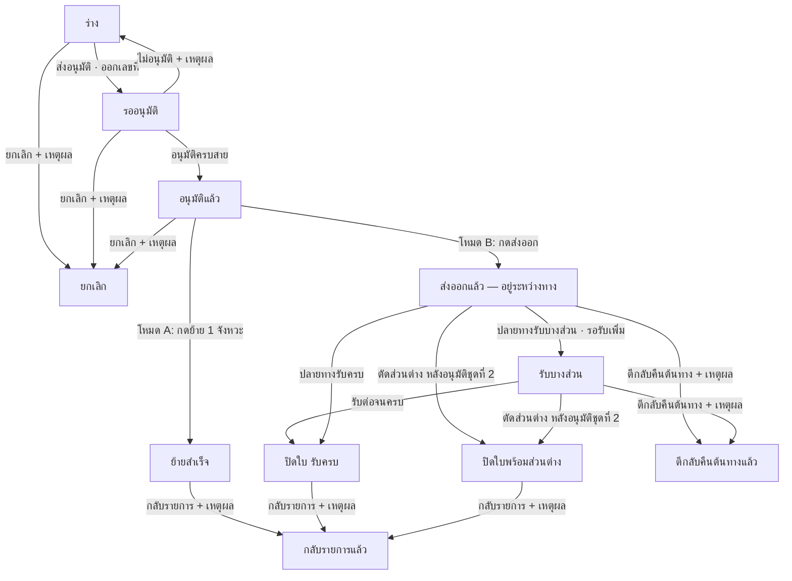
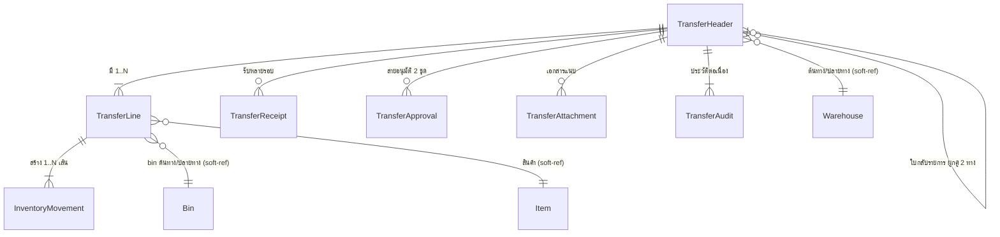
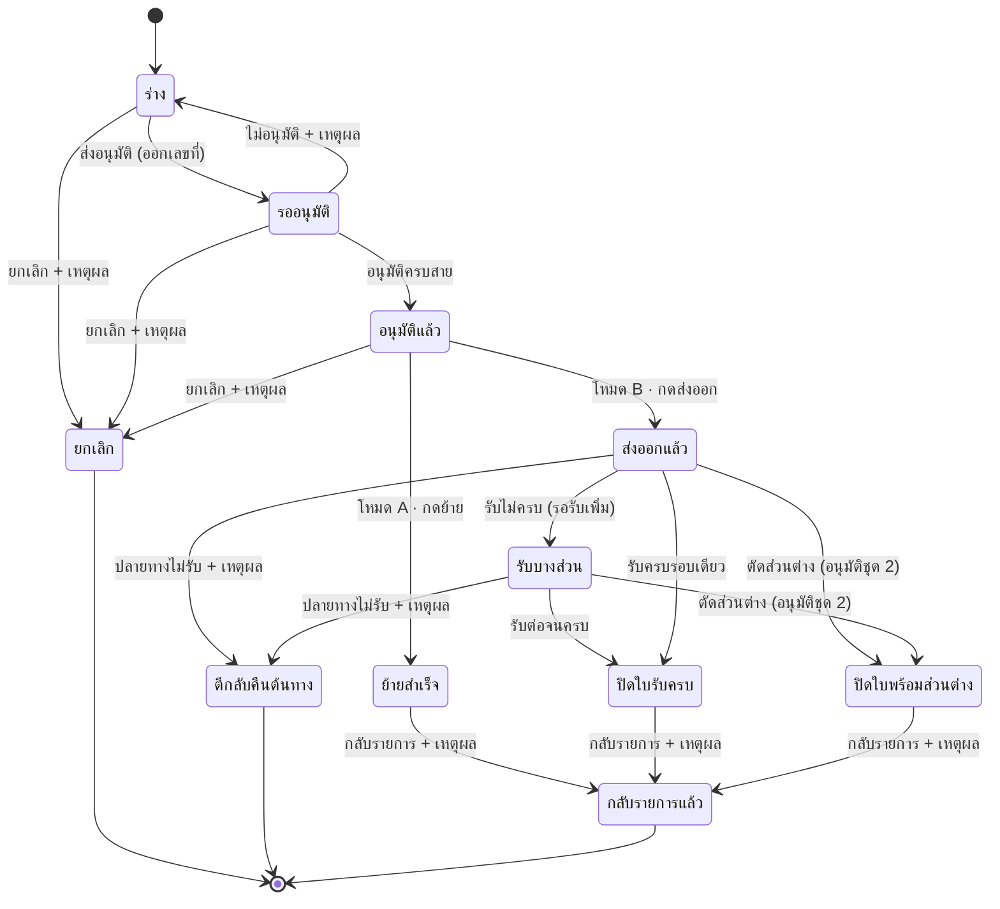

# BRD: Stock Transfer — ใบย้ายสินค้า (ย้ายคลัง/สาขา)

| ช่อง | ค่า |
|---|---|
| **Feature ID** | `F-WH-STKTRF` (fid **F083**) |
| **Module** | Warehouse (คลังสินค้า) |
| **BRD Type** | **New Feature** |
| **Wave / Lane** | W3Q · CUBE-LANE-W3-LITE (ลำดับ 3 — ตัวสุดท้ายของ pack) |
| **Architecture** | Q-document (Pattern Q เต็ม archetype + B2 v2 line editor) |
| **Declarations** | `doa` · `ntf` · `csq` · `doccfg` · `pdfdoc` |
| **เลขรันเอกสาร** | `TRF-YYYY-NNNN` (ปี **ค.ศ.**) ผ่าน F-DOCCFG |
| **Version** | 1.1 |
| **วันที่** | 2026-09-17 |
| **สถานะ** | **APPROVED — HTML revision ผ่าน PM/BA และ manual test แล้ว** |
| **Input ที่ใช้** | `PREBRIEF_F-WH-STKTRF.md` · `FUNCTION_CHECKLIST_F-WH-STKTRF.md` (61 FN) · `BASELINE_F-WH-STKTRF.md` · **HTML prototype `outputs/F-WH-STKTRF/F-WH-STKTRF.html` (ผ่าน UX/Coverage/E2E + PM/BA manual review)** · declaration briefs ใน source pack |
| **สัญญาที่สืบทอด** | `PREBRIEF_F-WH-PUTAWAY §3.0` (LOCATION MODEL) · `PREBRIEF_F-WH-STKADJ §3.4/§5.2` (movement + reversal) |

## Changelog

| Version | วันที่ | ผู้แก้ | สาระ |
|---|---|---|---|
| 1.0 | 2026-09-10 | feature-lane-runner 2.4.1r (Phase A) | ฉบับแรก — สร้างจาก PREBRIEF + HTML prototype ที่ผ่าน gate แล้ว |
| 1.1 | 2026-09-17 | Codex + PM/BA review | Revision จาก HTML หลัง feedback: บังคับ receive/reversal/shortage approval guard ตามกฎเดิม, ยืนยันส่งออกด้วย CUBE modal, แสดงเหตุผลเมื่อ action ใช้ไม่ได้, ปรับ filter/ตาราง/line editor/upload และรองรับ horizontal scroll; ไม่เปลี่ยน scope, status contract, security preset หรือ flexibility tag — ดู `_BRD_DRIFT_REPORT_v1.1.md` |

---

# Section 2: Business Context

## 2.1 ปัญหา / โอกาส

วันนี้การย้ายสินค้าระหว่างที่เก็บและระหว่างสาขาเกิดขึ้นจริงทุกวัน แต่**ระบบไม่มีเอกสารรองรับ** — ทำให้เกิดปัญหา 4 อย่าง:

1. **ของหายระหว่างทางแล้วไม่มีใครรับผิดชอบ** — เมื่อของขึ้นรถออกจากคลังต้นทาง มันหายไปจากยอดคงเหลือของต้นทาง แต่ยังไม่ปรากฏที่ปลายทาง ช่วงนี้ **ไม่มีตัวเลขในระบบเลย** ถ้าของหายจะรู้ก็ต่อเมื่อปลายทางนับแล้วไม่ครบ และไม่มีหลักฐานว่าหายตอนไหน
2. **ยอดคงเหลือราย bin ไม่ตรงของจริง** — คนคลังย้ายของข้ามชั้นวางเองโดยไม่มีการบันทึก ทำให้ระบบชี้ไปช่องเก็บที่ไม่มีของ
3. **ไม่มีการถ่วงดุลเรื่องมูลค่า** — ของมูลค่าหลักแสนย้ายออกจากสาขาได้โดยไม่ต้องมีใครอนุมัติ
4. **เมื่อยอดผิดก็ไปลงเอยที่ "ปรับยอด"** — ทำให้ใบปรับยอดสต๊อก (F-WH-STKADJ) บวมด้วยรายการที่จริง ๆ แล้วคือการย้าย ไม่ใช่ความคลาดเคลื่อน — ต้นตอที่แท้จริงถูกกลบ

**โอกาส:** W3Q ได้วางสัญญากลางเรื่อง location ไว้แล้ว (Putaway §3.0) ซึ่ง**จองประเภท `in-transit` และคลังเสมือน `WH-TRN` ไว้ให้ feature นี้โดยเฉพาะ** — ทำให้เราสร้าง "ที่อยู่ของของระหว่างทาง" ได้ทันทีโดยไม่ต้องแก้โมเดลอะไรเลย

## 2.2 เป้าหมายทาง Business

| # | เป้าหมาย | ทำไม |
|---|---|---|
| G-1 | **ทำให้ของที่อยู่ระหว่างทางมีตัวตนในระบบ** | ปิดช่องว่างที่ของหายแล้วไม่มีใครรู้ |
| G-2 | **แยกความรับผิดชอบ 2 ฝั่งให้ชัด** — ต้นทางรับผิดชอบจนถึงจุดพัก ปลายทางรับผิดชอบตั้งแต่กดรับ | มีคนรับผิดชอบทุกช่วงเวลา |
| G-3 | **คุมมูลค่าที่ย้ายด้วยสายอนุมัติตามความเสี่ยง** | ของมูลค่าสูง/ข้ามสาขา ต้องมีคนเห็นชอบก่อนออกจากคลัง |
| G-4 | **ทำให้ยอดคงเหลือราย bin ตรงกับของจริง** โดยไม่ต้องพึ่งการปรับยอด | คืนความหมายให้ใบปรับยอด (ใช้เฉพาะความคลาดเคลื่อนจริง) |
| G-5 | **บันทึกความสูญเสียระหว่างขนส่งอย่างมีหลักฐานและมีคนอนุมัติ** | เปลี่ยน "ของหาย" จากเรื่องเงียบ ๆ เป็นรายการที่ตรวจสอบได้ |

## 2.3 ตัวชี้วัดความสำเร็จ (Success Metrics)

| # | ตัวชี้วัด | Baseline (วันนี้) | เป้าหมาย | วัดอย่างไร | ใครวัด |
|---|---|---|---|---|---|
| M-1 | **สัดส่วนการย้ายสินค้าที่มีเอกสารรองรับ** | 0% (ไม่มีเอกสาร) | ≥ 95% ของการย้ายที่เกิดขึ้นจริงภายใน 3 เดือนหลัง go-live | จำนวนใบ TRF ที่ปิด ÷ จำนวนการย้ายที่นับได้จากรายการเคลื่อนไหว | ผู้จัดการคลังสินค้า |
| M-2 | **มูลค่าที่ค้างระหว่างทางเกินเกณฑ์ ณ สิ้นเดือน** | วัดไม่ได้ (ไม่มีข้อมูล) | ≤ 2% ของมูลค่าที่ย้ายทั้งเดือน | KPI landing "ใบค้างระหว่างทางเกินเกณฑ์" | ผู้จัดการคลังสินค้า |
| M-3 | **มูลค่าส่วนต่างที่ตัดทิ้ง (ของหายระหว่างขนส่ง) ต่อมูลค่าที่ย้าย** | วัดไม่ได้ | ≤ 0.5% และ **ทุกบาทมีหลักฐาน + ผู้อนุมัติ 100%** | Σ มูลค่าที่ตัด ÷ Σ มูลค่าที่ย้าย · ตรวจหลักฐานจาก tab ลายเซ็น | ฝ่ายบัญชี + ตรวจสอบภายใน |
| M-4 | **จำนวนใบปรับยอดสต๊อกที่เหตุผลคือ "ของอยู่ผิดที่/ย้ายแล้วไม่ได้บันทึก"** | ประมาณการจากใบ ADJ ปัจจุบัน | ลดลง ≥ 50% ใน 6 เดือน | นับใบ ADJ ตามรหัสเหตุผล | ผู้จัดการคลังสินค้า |
| M-5 | **เวลาเฉลี่ยจากส่งออกถึงปลายทางกดรับ (ใบข้ามสาขา)** | วัดไม่ได้ | ≤ เกณฑ์ที่ตั้งใน NC rules (ตั้งต้น 5 วัน) ที่ระดับ P90 | `เวลาที่รับ − เวลาที่ส่งออก` | ผู้จัดการคลังสินค้า |

> ทุกตัวชี้วัดคำนวณจากข้อมูลที่ feature นี้ผลิตเองทั้งหมด — ไม่ต้องรอ module อื่น (M-4 อ่านจาก F-WH-STKADJ ซึ่งปิดงาน Phase A แล้ว)

## 2.4 ที่มาของ Requirement

| ที่มา | สาระ |
|---|---|
| `knowledge/CENTRAL_PLAN/BUILD_ORDER.md` | F-WH-STKTRF = W3Q ลำดับ 3 · edge `F-WH-PUTAWAY → F-WH-STKTRF` |
| `briefs/W3Q/CHECKLIST.md` | Q-document · ย้ายคลัง/สาขา · **ข้ามสาขาผ่าน in-transit** · **confirm ปลายทางปิดใบ** · DOA slot picker · doccfg `TRF-YYYY-NNNN` + pdfdoc · JE = mock |
| `knowledge/CONTEXT_PACK/W3-LITE.md §3` | **`OQ-TRF-01 [ASSUMED]`** Transfer ข้ามสาขา = มี in-transit คั่นกลาง — owner **Strike** |
| `PREBRIEF_F-WH-PUTAWAY §3.0` | **สัญญากลาง LOCATION MODEL** — จอง `in-transit` + `WH-TRN` ไว้ให้ feature นี้ |
| `PREBRIEF_F-WH-STKADJ §3.4 / §5.2 / BR-05` | schema รายการเคลื่อนไหว + คู่กลับรายการ + การชี้ทาง "ย้าย = Transfer" |
| `BASELINE_F-WH-STKTRF.md` | เทียบ SAP S/4HANA · Odoo · D365 · NetSuite · ERPNext — must-have 16 ข้อ |

---

# Section 3: Scope

## 3.1 In Scope

| # | ความสามารถ | หมายเหตุ |
|---|---|---|
| IN-1 | เอกสารใบย้ายสินค้า (หัวใบ + หลายบรรทัด) พร้อมเลขรัน `TRF-YYYY-NNNN` | ออกเลขตอนส่งอนุมัติ |
| IN-2 | ★ **2 โหมดที่ระบบตัดสินเอง**: ย้ายภายในคลัง (1 จังหวะ) · ย้ายข้ามคลัง/สาขา (2 จังหวะผ่านจุดพักระหว่างทาง) | ผู้ใช้เลือกโหมดเองไม่ได้ |
| IN-3 | ระบุ **bin ต้นทาง → bin ปลายทาง** รายบรรทัด พร้อมยอดคงเหลือต้นทาง | |
| IN-4 | สายอนุมัติตามมูลค่า + มิติโหมด (DOA slot picker **คนจริง**) | 2 จุดตัดสินใจ |
| IN-5 | ★ **ขาส่งออก** — ของออกจาก bin ต้นทางเข้าจุดพักระหว่างทาง | โหมดข้ามคลังเท่านั้น |
| IN-6 | ★ **ขารับที่ปลายทาง** — ระบุจำนวนรับจริง + bin ที่ลงจริง → ปิดใบ | คนของคลังปลายทางเท่านั้น |
| IN-7 | ★ **จัดการส่วนต่าง 3 ทาง**: รอรับเพิ่ม / ของหาย-เสียหาย (ตัดทิ้ง) / ตีกลับคืนต้นทาง | |
| IN-8 | ★ **สายอนุมัติแยกสำหรับการตัดส่วนต่าง** + หลักฐานบังคับ | |
| IN-9 | ยกเลิกก่อนของขยับ · กลับรายการหลังปิดใบ (สร้างคู่ทิศตรงข้าม) | |
| IN-10 | มุมมอง "ของที่อยู่ระหว่างทาง" + ป้ายค้างเกินเกณฑ์ | เกณฑ์อยู่ NC rules |
| IN-11 | เอกสารพิมพ์ A4 พร้อมช่องลงชื่อผู้รับปลายทาง | `print-spec-trf.md` |
| IN-12 | ประวัติแบบบันทึกต่อเนื่อง (ไม่มีการลบ) | |
| IN-13 | เอกสารแนบ (ใบกำกับการขนย้าย · หลักฐานของหาย) | |

## 3.2 Out of Scope

| # | ไม่ทำ | เจ้าของจริง / เหตุผล |
|---|---|---|
| OUT-1 | **ปรับยอด / แก้ยอดคงเหลือ / ตัดจำหน่ายของเสีย** | **F-WH-STKADJ** (F082) |
| OUT-2 | **นับสต๊อก / ใบนับรอบ / cycle count** | Backlog (`OQ-STK-01`) · F084/F086 |
| OUT-3 | สร้าง/แก้ผังคลัง–โซน–bin รวมถึงจุดพักระหว่างทางของคู่คลังใหม่ | **Location Master (config)** F008 |
| OUT-4 | เก็บของจาก GRN เข้า bin (แนะนำ bin) | **F-WH-PUTAWAY** (F081) |
| OUT-5 | คืนของผู้ขาย (ทางออกของของกักกัน) | **F-PUR-RTV** (F080) |
| OUT-6 | ลงบัญชีจริง / valuation engine | **W5** — รอบนี้ mock + `TODO: JE posting` |
| OUT-7 | ค่าขนส่ง · ผู้ให้บริการขนส่ง · เลข tracking · ใบจัดหยิบ | ไม่มี module ขนส่งในเลนนี้ |
| OUT-8 | Lot / Serial / Batch / วันหมดอายุ / Pallet / Handling Unit | ไม่มี Lot master ในเลนนี้ (F087 · W4) |
| OUT-9 | เติมสต๊อกอัตโนมัติจากจุดสั่งเติม (replenishment rule) | F085 · W4 |
| OUT-10 | ราคาโอนระหว่างนิติบุคคล (intercompany transfer price) | รอบนี้ข้ามสาขาในนิติบุคคลเดียว |
| OUT-11 | ตรวจคุณภาพตอนรับที่ปลายทาง | QC อยู่ที่ GRN (F079) |
| OUT-12 | นำเข้าบรรทัดจาก CSV · RF scan | Backlog (เผื่อช่องยิงรหัสไว้ใน UI แล้ว) |

## 3.3 Assumptions

| # | ข้อสมมติ | ผลถ้าผิด |
|---|---|---|
| A-1 | ผัง location ตาม Putaway §3.0.5 ถูกตั้งไว้แล้วรวมถึง `WH-TRN` + `TR-*` ต่อคู่คลัง | เปิดใบข้ามคลังไม่ได้ (ระบบบล็อกพร้อมข้อความชี้ให้ผู้ดูแลผังไปตั้ง) |
| A-2 | ผู้ใช้แต่ละคนสังกัดคลังเดียวชัดเจน | กติกา "คนส่ง ≠ คนรับ" ต้องทบทวน (`OQ-TRF-06`) |
| A-3 | ต้นทุนอ้างอิงต่อหน่วยมีในทะเบียนสินค้า | มูลค่าที่ใช้เป็นฐานอนุมัติเพี้ยน — รอ valuation engine (W5) |
| A-4 | ทุกการย้ายข้ามสาขาใช้เวลามากกว่า 0 (ไม่ถึงทันที) | ถ้าถึงทันทีจริง ผู้ใช้จะกดรับต่อทันทีได้ — ไม่กระทบโครง |
| A-5 | ธุรกิจยอมรับว่าย้ายภายในคลังก็ต้องผ่านอนุมัติ (แม้ชั้นต่ำ) | ถ้าไม่ยอม ให้ตั้งชั้นแรกของสาย A1 ที่ทะเบียน DOA เป็นอนุมัติอัตโนมัติ — ไม่ต้องแก้ feature |

## 3.4 Scope Lock ⭐

> สืบทอดจาก **Central Plan CUBE-LANE-W3-LITE** + **`briefs/W3Q/CHECKLIST.md`** (ไม่มี RIF/ใบเซ็นแยกในเลนนี้ — Central Plan ทำหน้าที่เป็นใบล็อก)

| Lock ID | ข้อความที่ล็อก | แหล่ง | สถานะ |
|---|---|---|---|
| **LK-1** | Q-document — Pattern Q เต็ม archetype + B2 v2 line editor | CONTEXT_PACK §2.1 | ✅ ทำครบ |
| **LK-2** | ย้ายคลัง/สาขา | CHECKLIST W3Q | ✅ |
| **LK-3** | **ข้ามสาขาผ่าน in-transit location** (`OQ-TRF-01`: ออกจากต้นทาง ≠ ถึงปลายทางทันที) | CHECKLIST + CONTEXT_PACK §3 | ✅ |
| **LK-4** | **confirm ปลายทางปิดใบ** | CHECKLIST W3Q | ✅ |
| **LK-5** | DOA slot picker **คนจริง** (avatar + ตำแหน่ง + ชื่อ) ห้าม role ID | GOLDEN_RULES §3 (locked 2026-08-17) | ✅ |
| **LK-6** | doccfg `TRF-YYYY-NNNN` + pdfdoc | CHECKLIST W3Q | ✅ |
| **LK-7** | JE = mock + `TODO: JE posting` | CHECKLIST W3Q | ✅ |
| **LK-8** | รายการเคลื่อนไหวแบบบันทึกต่อเนื่อง (กลับรายการเท่านั้น ไม่มีการลบ) | CONTEXT_PACK §2.8 | ✅ |
| **LK-9** | **LOCATION MODEL = สัญญากลาง ห้ามนิยามใหม่** | PREBRIEF_F-WH-PUTAWAY §3.0 | ✅ ยกมาอ้าง ไม่แก้แม้แต่ enum เดียว |
| **LK-10** | **ห้าม scope creep**: ปรับยอด = StockAdj · นับสต๊อก = backlog | scope note รอบนี้ | ✅ ตรวจแล้ว scope creep = 0 |
| **LK-11** | ปี **ค.ศ. ล้วน** · CI CUBE Warm Light · sidebar ตาม module map | GOLDEN_RULES §1 | ✅ |

**Scope Drift check:** ไม่พบรายการที่ทำเกินหรือขาดจากใบล็อก — ดูหลักฐานรายข้อใน `1_HTML/_COVERAGE_R1.md §6`

---

# Section 4: User Roles & Permissions

## 4.1 Roles ที่เกี่ยวข้อง

| Role | ใครในองค์กร | หน้าที่ในกระบวนการนี้ |
|---|---|---|
| **เจ้าหน้าที่คลังต้นทาง** | พนักงานคลังที่ของอยู่ | สร้างใบ · เลือกสินค้า/bin · ส่งอนุมัติ |
| **หัวหน้าคลังต้นทาง** | หัวหน้าของคลังนั้น | ทุกอย่างของเจ้าหน้าที่ + **กดส่งออกจากต้นทาง** + ยกเลิกก่อนส่ง + **กลับรายการ** |
| ★ **เจ้าหน้าที่/หัวหน้าคลังปลายทาง** | พนักงานคลังที่ของกำลังไปหา | **ยืนยันรับ** · ระบุจำนวน/bin ที่ลงจริง · เลือกวิธีจัดการส่วนต่าง · **ตีกลับคืนต้นทาง** |
| **ผู้จัดการคลังสินค้า** | ระดับฝ่าย | ผู้อนุมัติชั้นกลางของทั้ง 2 สายอนุมัติ |
| **ผู้จัดการฝ่ายบัญชี** | บัญชี | ผู้อนุมัติชั้นสูงของใบมูลค่าสูง + การตัดของหาย |
| **ผู้อำนวยการสายงาน** | ผู้บริหาร | ผู้อนุมัติชั้นสูงสุด |
| **ตรวจสอบภายใน / บัญชี (อ่านอย่างเดียว)** | — | ดูใบ · ยอดระหว่างทาง · ประวัติ |
| **ผู้ดูแลผังตำแหน่ง** | ผู้ดูแล master | ตั้งผัง location + จุดพักระหว่างทาง — **ทำที่ Location Master ไม่ใช่ที่หน้านี้** |

## 4.2 Permission Matrix

| Action | จนท.ต้นทาง | หน.คลังต้นทาง | จนท./หน.คลังปลายทาง | ผจก.คลัง | ผจก.บัญชี | ผอ.สายงาน | บัญชี/ตรวจสอบ |
|---|:--:|:--:|:--:|:--:|:--:|:--:|:--:|
| ดูรายการ / เปิดใบ | ✅ (คลังตน) | ✅ | ✅ (คลังตน) | ✅ | ✅ | ✅ | ✅ |
| สร้าง / แก้ร่าง | ✅ | ✅ | — | — | — | — | — |
| ส่งอนุมัติ | ✅ | ✅ | — | — | — | — | — |
| อนุมัติ / ไม่อนุมัติ (สายการย้าย) | — | ✅ (ถ้าเป็น slot) | — | ✅ | ✅ | ✅ | — |
| **ส่งออกจากต้นทาง / ย้ายภายในคลัง** | — | ✅ | — | — | — | — | — |
| ★ **ยืนยันรับที่ปลายทาง** | — | ❌ | ✅ | — | — | — | — |
| ★ **ตีกลับคืนต้นทาง** | — | ❌ | ✅ | — | — | — | — |
| ★ **ขออนุมัติตัดส่วนต่าง** | — | ❌ | ✅ | — | — | — | — |
| ★ **อนุมัติการตัดส่วนต่าง** | — | ❌* | ✅ (หน.ปลายทาง) | ✅ | ✅ | ✅ | — |
| ยกเลิกใบ (ก่อนของขยับ) | ✅ (ของตน) | ✅ | — | — | — | — | — |
| กลับรายการหลังปิดใบ | — | ✅ | — | — | — | — | — |
| แก้ผัง location / bin | ❌ | ❌ | ❌ | ❌ | ❌ | ❌ | ❌ |

> ★* **แยกหน้าที่ (segregation of duty) ที่บังคับจริงในระบบ:**
> (1) ผู้ขอเซ็นอนุมัติใบตัวเองไม่ได้ · (2) **คนที่กดส่งออกจากต้นทาง ยืนยันรับเองไม่ได้** · (3) **คนที่กดส่งออกจากต้นทาง เซ็นอนุมัติการตัดส่วนต่างไม่ได้**
> ข้อ (2) และ (3) คือหัวใจที่ทำให้ช่วง "ของอยู่ระหว่างทาง" มีการถ่วงดุลจริง

---

# Section 5: User Journey (with COSO)

## 5.1 Happy Path — โหมด B (ข้ามคลัง/สาขา) · เส้นทางหลักของ feature นี้

| # | ขั้น | ผู้ทำ | COSO Role | ระบบทำอะไร |
|---|---|---|---|---|
| 1 | เปิดใบย้าย เลือกคลังต้นทาง–ปลายทาง | จนท.คลังต้นทาง | **Maker** | ตัดสินโหมดให้อัตโนมัติ + จับคู่จุดพักระหว่างทาง |
| 2 | เลือกสินค้า · bin ต้นทาง → bin ปลายทาง · จำนวน | จนท.คลังต้นทาง | **Maker** | ดึงยอดคงเหลือต้นทาง + ต้นทุนอ้างอิง · บล็อกถ้าเกินยอด |
| 3 | ตรวจเส้นทาง + แนบเอกสาร | จนท.คลังต้นทาง | Maker | แสดงแผนภาพ ต้นทาง → ระหว่างทาง → ปลายทาง |
| 4 | เลือกผู้อนุมัติต่อขั้น (คนจริง) แล้วส่งอนุมัติ | จนท.คลังต้นทาง | Maker | **ออกเลขที่** + resolve สายจากทะเบียน DOA (มูลค่า + มิติโหมด) + freeze สาย |
| 5 | อนุมัติทีละขั้นจนครบ | ผู้อนุมัติแต่ละขั้น | **Approver** | เลื่อนขั้นอัตโนมัติ · ครบสาย → เปิดปุ่มส่งออก |
| 6 | **กดส่งออกจากต้นทาง** | หน.คลังต้นทาง | Maker (execution) | ★ ตรวจยอดต้นทางซ้ำ → ของออกจาก bin ต้นทางเข้า **จุดพักระหว่างทาง** · **ยอดปลายทางยังไม่ขยับ** · แจ้งคลังปลายทาง |
| 7 | ของเดินทาง | — | — | ใบอยู่สถานะ "ส่งออกแล้ว — อยู่ระหว่างทาง" · นับเป็นทรัพย์สินของกิจการที่ยังเบิกที่ปลายทางไม่ได้ |
| 8 | **ปลายทางนับของแล้วกดยืนยันรับ** | จนท.คลังปลายทาง | **Checker + Maker (execution)** | ★ ของออกจากจุดพัก เข้า bin ที่ลงจริง · แสดง "คงค้างระหว่างทาง" ก่อนยืนยันเสมอ |
| 9 | รับครบ → ปิดใบ | ระบบ | **System** | สถานะ "ปิดใบ (รับครบ)" · บันทึกประวัติ · สถานะบัญชี "รอลงบัญชี" (`TODO: JE posting`) |

## 5.2 Alternative Paths

### 5.2.1 โหมด A — ย้ายภายในคลังเดียวกัน (จังหวะเดียว)
ขั้น 1–5 เหมือนกัน → **ขั้น 6 กด "ย้ายสินค้า" ครั้งเดียว** → ของออกจาก bin ต้นทางเข้า bin ปลายทางทันที → **ปิดใบ** (ไม่มีขั้น 7–9 · ไม่แตะจุดพักระหว่างทาง)

### 5.2.2 Reject Path — ผู้อนุมัติไม่อนุมัติ
ขั้น 5 → **ไม่อนุมัติ + เหตุผลบังคับ** → ใบกลับเป็นร่าง (เลขที่เดิมคงอยู่) → ผู้จัดทำแก้แล้วส่งใหม่ → **สายอนุมัติ resolve ใหม่ตามมูลค่า/โหมดใหม่**

### 5.2.3 ★ รับไม่ครบ — ส่วนที่เหลือยังไม่ถึง
ขั้น 8 รับ 160 จาก 200 + เลือก **"รอรับเพิ่ม"** → ใบ = "รับบางส่วน" (ยังเปิด) · **40 ค้างที่จุดพักระหว่างทาง** · รับต่อได้อีกไม่จำกัดรอบ

### 5.2.4 ★★ ของหายระหว่างทาง — ตัดส่วนต่าง (มีสายอนุมัติของตัวเอง)
ขั้น 8 รับ 113 จาก 120 + เลือก **"ของหาย/เสียหายระหว่างทาง"** →
บังคับ **เหตุผล + แนบหลักฐาน ≥1 ไฟล์** → ระบบเปิดขั้นขออนุมัติตัดส่วนต่าง (**COSO Approver ชุดที่ 2** ตามมูลค่าส่วนต่าง · คนที่กดส่งออกเซ็นไม่ได้) →
อนุมัติครบ → ของออกจากจุดพักโดยไม่มีปลายทาง (รับรู้เป็นความสูญเสีย) → ใบ = **"ปิดใบพร้อมส่วนต่าง"** + `TODO: JE posting` (ผลขาดทุนสินค้าระหว่างขนส่ง)

### 5.2.5 ★ ปลายทางตีกลับคืนต้นทาง
ขั้น 8 → **"ตีกลับคืนต้นทาง" + เหตุผลบังคับ** → ของกลับเข้า bin ต้นทางเดิมครบ → ใบ = "ตีกลับคืนต้นทางแล้ว"
**ไม่นับเป็นของหาย** จึงไม่เข้าสายอนุมัติการตัดส่วนต่าง

### 5.2.6 Escalation Path — ค้างระหว่างทางนานเกินเกณฑ์
ระบบเฝ้าอายุใบที่ยังค้าง → เกินเกณฑ์ (จาก NC rules) → ป้ายเตือนบนรายการ + KPI + แจ้งเตือนหัวหน้าคลังทั้ง 2 ฝั่ง + ผู้จัดการคลังสินค้า

### 5.2.7 กลับรายการหลังปิดใบ
พบว่าย้ายผิด bin/ผิดคลัง → หน.คลังต้นทาง **กลับรายการ + เหตุผลบังคับ** → ระบบสร้าง **ใบกลับรายการใหม่ที่มีรายการเคลื่อนไหวทิศตรงข้ามครบทุกเส้น** (ไม่ลบของเดิม) · ผูกคู่ 2 ทาง · **ทำได้ครั้งเดียว**

## 5.3 Process Diagram



---

# Section 6: Data Entity & Fields

## 6.1 Entity Overview

| Entity | ความหมาย | จำนวนต่อใบ |
|---|---|---|
| `TransferHeader` | หัวใบย้ายสินค้า | 1 |
| `TransferLine` | บรรทัดที่ย้าย (1 บรรทัด = 1 ชุด bin ต้นทาง + สินค้า + bin ปลายทาง) | 1..N |
| `TransferReceipt` | บันทึกการรับแต่ละรอบที่ปลายทาง | 0..N |
| `TransferApproval` | ขั้นอนุมัติที่ freeze ตอนส่ง (2 ชุด: การย้าย · การตัดส่วนต่าง) | 0..N |
| `InventoryMovement` | รายการเคลื่อนไหวของสินค้า — **บันทึกต่อเนื่อง แก้/ลบไม่ได้** | 1..N |
| `TransferAttachment` | เอกสารแนบ / หลักฐาน | 0..N |
| `TransferAudit` | ประวัติทุกเหตุการณ์ | 1..N |

## 6.2 Entity: `TransferHeader`

| Field | ชนิด | บังคับ | หมายเหตุ |
|---|---|---|---|
| `id` | uuid | ✅ | |
| `code` | string | ⬜ (ว่างตอนร่าง) | `TRF-YYYY-NNNN` ปี **ค.ศ.** จาก F-DOCCFG — ออกตอนส่งอนุมัติ · **ห้ามเปลี่ยนหลังออกแล้ว** |
| `warehouse_from_ref` / `warehouse_to_ref` | soft-ref | ✅ | ทะเบียนคลัง — picker ไม่ผูก FK |
| ★ `transfer_mode` | enum `intra_warehouse` / `inter_warehouse` | ✅ | **derive จากคลัง** ไม่ใช่ input |
| ★ `in_transit_location_ref` | soft-ref | ✅ เมื่อ inter | ระบบจับคู่จากคู่คลัง — ผู้ใช้แตะไม่ได้ |
| `doc_date` | date (**ค.ศ.**) | ✅ | ไม่เกินวันนี้ |
| `eta_date` | date (**ค.ศ.**) | ⬜ | เฉพาะ inter · ≥ `doc_date` |
| `reason_code` / `reason_note` | enum + text | ✅ / เงื่อนไข | ทะเบียนเหตุผลการย้าย · "อื่น ๆ" ต้องมีคำอธิบาย |
| `cost_center_ref` | soft-ref | ⬜ | ใช้ตอนลงบัญชี (W5) |
| `note` | text | ⬜ | |
| `status` | enum | ✅ | 11 ค่า ดู §8 |
| `approval_status` | enum | ✅ | `draft / pending_approval / approved / rejected / cancelled` |
| `doa_entry_ref` | string | ⬜ | ทะเบียนสายอนุมัติที่ resolve มา |
| ★ `approval_base_amount` | numeric | ✅ ตอนส่ง | **มูลค่ารวมที่ย้าย (บวกเสมอ)** — freeze ตอนส่ง |
| ★ `shortage_base_amount` | numeric | ⬜ | มูลค่าส่วนต่างที่ตัดทิ้ง — ฐานสายอนุมัติชุดที่ 2 |
| ★ `shortage_status` | enum `none/pending/approved/rejected` | ✅ | |
| `submitted_by` / `submitted_at` | ref + ts | ⬜ | |
| ★ `shipped_by` / `shipped_at` | ref + ts | ⬜ | คนกดส่งออก |
| `cancel_reason` / `cancelled_by` / `cancelled_at` | text + ref + ts | ⬜ | |
| `reversal_of` / `reversed_by_doc` | soft link | ⬜ | ผูกคู่ใบกลับรายการ 2 ทาง |
| **Audit fields** | `created_by` `created_at` `updated_by` `updated_at` | ✅ | **ทุก entity มีครบ** |

## 6.3 Entity: `TransferLine` (ย่อ — เต็มที่ PREBRIEF §3.2)

`id` · `header_ref` · `line_no` · `bin_from_ref` ✅ · `item_ref` ✅ · `item_name_snapshot` ✅ · `uom` ✅ ·
`onhand_snapshot` + `snapshot_at` ✅ · `qty` ✅ (>0 · ≤ ยอดคงเหลือ) · `bin_to_ref` ✅ (≠ `bin_from_ref`) ·
`unit_cost_ref` ✅ (mock — W5) · `line_amount` (computed) ·
★ ฝั่งรับ: `received_qty` · `written_off_qty` · `returned_qty` · `remaining_in_transit` (computed) · `bin_actual_ref` · `diff_action` · `diff_reason_code` · `diff_note` ·
+ audit fields

**สมการที่ต้องเป็นจริงเสมอ (invariant):**
`qty = received_qty + written_off_qty + returned_qty + remaining_in_transit`

## 6.4 Entity Relationship



> **Soft-reference (LD-4C-02):** ทะเบียนสินค้า · หน่วยนับ · คลัง/โซน/bin · ศูนย์ต้นทุน · ผู้อนุมัติ = **picker ไม่ผูก FK · ว่างได้** และเก็บ **snapshot ข้อความ ณ เวลาที่เลือก** → ใบไม่พังเมื่อ master ถูกยกเลิก

---

# Section 7: User Stories & Acceptance Criteria

## Story S-01: สร้างใบย้ายภายในคลัง
**ในฐานะ** เจ้าหน้าที่คลัง **ฉันต้องการ** ย้ายของข้ามช่องเก็บในคลังเดียวกัน **เพื่อ** ให้ยอดราย bin ตรงของจริง

**AC:**
- **Given** ฉันเลือกคลังต้นทางและปลายทางเป็นคลังเดียวกัน **When** ระบบตัดสินโหมด **Then** แสดงว่าเป็น "ย้ายภายในคลัง — ย้ายจบในจังหวะเดียว" และ**ไม่แสดงจุดพักระหว่างทาง**
- **Given** ใบอนุมัติครบสาย **When** ฉันกด "ย้ายสินค้า" และยืนยัน **Then** ของออกจาก bin ต้นทางเข้า bin ปลายทางทันที และใบปิดทันที **โดยไม่มีขั้นยืนยันรับ**

## Story S-02: สร้างใบย้ายข้ามสาขา
**AC:**
- **Given** ฉันเลือกคลังต้นทางและปลายทางต่างกัน **Then** ระบบแสดง "ย้ายข้ามคลัง/สาขา — ต้องมีขั้นยืนยันรับที่ปลายทาง" พร้อมรหัสจุดพักระหว่างทางที่ระบบจับคู่ให้ (แก้ไขไม่ได้)
- **Given** คู่คลังนี้ยังไม่มีจุดพักระหว่างทางตั้งไว้ **When** ฉันกดไปขั้นถัดไปหรือส่งอนุมัติ **Then** ระบบบล็อกพร้อมข้อความให้ติดต่อผู้ดูแลผังตำแหน่ง — **และไม่มีทางสร้างจุดพักจากหน้านี้**

## Story S-03: ส่งของออกจากต้นทาง
**AC:**
- **Given** ใบอนุมัติครบสายและเป็นโหมดข้ามคลัง **When** ฉัน (หัวหน้าคลังต้นทาง) กด "ส่งออกจากต้นทาง" **Then** ระบบตรวจยอดคงเหลือต้นทางซ้ำก่อน · ถ้าเปลี่ยนไปให้เตือนพร้อมยอดล่าสุด
- **Then** ของออกจาก bin ต้นทาง ไปอยู่ที่จุดพักระหว่างทาง · สถานะเป็น "ส่งออกแล้ว — อยู่ระหว่างทาง" · **ยอดที่ bin ปลายทางยังไม่ขยับ**

## Story S-04: ยืนยันรับที่ปลายทาง (รับครบ)
**AC:**
- **Given** ฉันไม่ใช่เจ้าหน้าที่ของคลังปลายทาง **Then** ปุ่ม "ยืนยันรับ" ใช้ไม่ได้ พร้อมบอกเหตุผล
- **Given** ฉันเป็นเจ้าหน้าที่คลังปลายทางและไม่ใช่คนที่กดส่งออก **When** ฉันกรอกจำนวนรับ = คงค้างระหว่างทาง และระบุ bin ที่ลงจริง **Then** ของเข้า bin ปลายทาง · ยอดค้างระหว่างทาง = 0 · ใบปิดเป็น "ปิดใบ (รับครบ)"

## Story S-05: รับไม่ครบ — รอรับเพิ่ม
**AC:**
- **Given** ส่งออก 200 **When** ฉันกรอกรับ 160 และเลือก "รอรับเพิ่ม" **Then** ใบเป็น "รับบางส่วน" · แสดงคงค้างระหว่างทาง 40 · เปิดให้รับต่อได้อีก
- **Given** ฉันกรอกรับมากกว่าที่ส่งออก **Then** ระบบบล็อกและชี้ว่าถ้าของงอกจริงต้องใช้ใบปรับยอดสต๊อก

## Story S-06: ตัดส่วนต่างของหายระหว่างทาง
**AC:**
- **Given** มีส่วนต่างและฉันเลือก "ของหาย/เสียหายระหว่างทาง" **Then** บังคับเลือกเหตุผล
- **When** ฉันกดยืนยันรับ **Then** ระบบเปิดขั้นขออนุมัติตัดส่วนต่าง ที่**บังคับแนบหลักฐานอย่างน้อย 1 ไฟล์** และ**ต้องเลือกผู้อนุมัติครบทุกขั้น**
- **Given** ฉันเลือกผู้อนุมัติเป็นคนเดียวกับผู้ที่กดส่งออกจากต้นทาง **Then** ระบบไม่ยอมและอธิบายเหตุผล
- **Given** อนุมัติครบ **Then** ของออกจากจุดพักโดยรับรู้เป็นความสูญเสีย · ใบ = "ปิดใบพร้อมส่วนต่าง" · สถานะบัญชี "รอลงบัญชี"

## Story S-07: ตีกลับคืนต้นทาง
**AC:**
- **Given** ปลายทางไม่รับของ **When** ฉันกด "ตีกลับคืนต้นทาง" + เหตุผล **Then** ของกลับเข้า bin ต้นทางเดิมครบ · ใบ = "ตีกลับคืนต้นทางแล้ว" · **ไม่นับเป็นของหาย และไม่เข้าฐานอนุมัติการตัดส่วนต่าง**

## Story S-08: ยกเลิกและกลับรายการ
**AC:**
- **Given** ใบยังไม่ส่งของออก **When** ฉันกดยกเลิก + เหตุผล **Then** ใบเป็น "ยกเลิก" · ใบยังอยู่ในระบบ · **ไม่มีรายการเคลื่อนไหวเกิดขึ้น**
- **Given** ใบส่งของออกไปแล้ว **Then** **ไม่มีปุ่มยกเลิก** — ต้องใช้ตีกลับคืนต้นทางหรือกลับรายการ
- **Given** ใบปิดแล้วและยังไม่เคยกลับรายการ **When** ฉัน (หัวหน้าคลังต้นทาง) กดกลับรายการ + เหตุผล **Then** ระบบสร้างใบกลับรายการที่มีรายการเคลื่อนไหวทิศตรงข้ามครบทุกเส้น · **ไม่ลบของเดิม** · กลับรายการซ้ำอีกไม่ได้

## Story S-09: อนุมัติตามมูลค่าด้วยคนจริง
**AC:**
- **Given** ฉันกดส่งอนุมัติ **Then** ระบบแสดงชั้นอนุมัติที่ทะเบียนกลางกำหนดจาก **มูลค่ารวมที่ย้าย + มิติโหมด** และให้ฉันเลือก **คนจริง** ต่อขั้น (รูป + ตำแหน่ง + ชื่อ)
- **Then** หน้าจอ**ไม่แสดงรหัสตำแหน่งภายในระบบ** และ**ไม่มีสายอนุมัติเขียนตายในหน้า feature**
- **Given** ยังมีขั้นที่ไม่ได้เลือกคน **Then** ส่งอนุมัติไม่ได้ พร้อมชี้ขั้นที่ว่าง

## Story S-10: มองเห็นของที่อยู่ระหว่างทาง
**AC:**
- **Given** มีใบที่ยังค้างระหว่างทาง **Then** หน้ารายการแสดงมูลค่ารวมและจำนวนใบ · มีแท็บ "อยู่ระหว่างทาง" และ "รอฉันรับ"
- **Given** ใบค้างเกินเกณฑ์ **Then** แสดงป้ายเตือนพร้อมจำนวนวัน — **โดยเกณฑ์อ่านจากกติกาแจ้งเตือนกลาง ไม่ได้ตั้งในหน้านี้**

---

# Section 8: Status & Lifecycle

## 8.1 State Diagram



## 8.2 State Transition Table

| จาก | ไป | ใครกด | เงื่อนไขที่ระบบบังคับ |
|---|---|---|---|
| ร่าง | รออนุมัติ | จนท./หน. คลังต้นทาง | ≥1 บรรทัด · ทุกบรรทัดมี bin ต้นทาง+ปลายทาง (ต่างกัน) · จำนวน >0 และ ≤ ยอดคงเหลือ · ประเภทที่เก็บเข้ากันได้ · เหตุผลครบ · **ทุกขั้นอนุมัติมีคนจริง** · โหมด B ต้องมีจุดพักระหว่างทาง → **ออกเลขที่** |
| รออนุมัติ | รออนุมัติ (ขั้นถัดไป) | ผู้อนุมัติขั้นปัจจุบัน | ผู้ขอเซ็นเองไม่ได้ |
| รออนุมัติ | อนุมัติแล้ว | ผู้อนุมัติขั้นสุดท้าย | ครบทุกขั้น |
| รออนุมัติ | ร่าง | ผู้อนุมัติ | **เหตุผลบังคับ** · เลขที่เดิมคงอยู่ |
| อนุมัติแล้ว | **ย้ายสำเร็จ** | หน.คลังต้นทาง | **โหมด A เท่านั้น** · ผ่านการตรวจยอดซ้ำ |
| อนุมัติแล้ว | **ส่งออกแล้ว** | หน.คลังต้นทาง | **โหมด B เท่านั้น** · ผ่านการตรวจยอดซ้ำ |
| ส่งออกแล้ว | รับบางส่วน | **คลังปลายทาง** | รับ < คงค้าง + เลือก "รอรับเพิ่ม" |
| ส่งออกแล้ว / รับบางส่วน | ปิดใบ (รับครบ) | **คลังปลายทาง** | ยอดค้างระหว่างทาง = 0 โดยการรับล้วน |
| ส่งออกแล้ว / รับบางส่วน | ปิดใบพร้อมส่วนต่าง | **คลังปลายทาง + ผู้อนุมัติชุดที่ 2** | เหตุผล + หลักฐาน ≥1 + อนุมัติครบ + ผู้อนุมัติ ≠ คนที่กดส่งออก |
| ส่งออกแล้ว / รับบางส่วน | ตีกลับคืนต้นทางแล้ว | **คลังปลายทาง** | **เหตุผลบังคับ** |
| ร่าง / รออนุมัติ / อนุมัติแล้ว | ยกเลิก | ผู้จัดทำ / หน.คลัง | **เหตุผลบังคับ** · ยังไม่มีรายการเคลื่อนไหว |
| ส่งออกแล้ว / รับบางส่วน | ยกเลิก | — | ★ **ทำไม่ได้ — ไม่มีปุ่ม** |
| ใบที่ปิดแล้ว | กลับรายการแล้ว | หน.คลังต้นทาง | **เหตุผลบังคับ** · ยังไม่เคยกลับรายการ |
| ยกเลิก / ตีกลับคืนต้นทางแล้ว / กลับรายการแล้ว | — | — | **สถานะปลายทาง** — ใบยังอยู่ในระบบ ไม่ลบ |

---

# Section 9: Business Rules + Validation

## 9.1 Business Rules

| BR | กติกา | Tag | ระดับความยืดหยุ่น |
|---|---|---|---|
| BR-01 | 1 ใบ ห้ามมีชุด (bin ต้นทาง, สินค้า, bin ปลายทาง) ซ้ำ | `[LOGIC]` | Fixed |
| BR-02 | **1 ใบ = 1 คลังต้นทาง + 1 คลังปลายทาง** | `[LOGIC]` | Fixed — ผูกกับการจับคู่จุดพัก |
| BR-03 | ★ **โหมด derive จากคลัง** — ต้นทาง=ปลายทาง → 1 จังหวะ · ต่างกัน → 2 จังหวะผ่านจุดพักเสมอ | `[LOGIC]` | **Fixed (Scope Lock LK-3)** |
| BR-04 | bin ต้นทาง ≠ bin ปลายทาง | `[VALIDATION]` | Fixed |
| BR-05 | ★ ผู้ใช้เลือกจุดพักระหว่างทางเองไม่ได้ — ระบบจับคู่จากคู่คลัง | `[LOGIC]` | Fixed |
| BR-06 | จำนวนที่ย้าย ≤ ยอดคงเหลือของ bin ต้นทาง | `[VALIDATION]` | Fixed |
| BR-07 | จำนวนที่ย้าย > 0 ทุกบรรทัด | `[VALIDATION]` | Fixed |
| BR-08 | ★ ประเภทที่เก็บต้องเข้ากันได้ — `กักกัน → กักกัน` เท่านั้น | `[POLICY]` | **สืบทอดจากสัญญากลาง — แก้ที่ Putaway §3.0 เท่านั้น** |
| BR-09 | **เลขที่ออกตอนส่งอนุมัติ** ไม่ใช่ตอนสร้างร่าง | `[CONFIG]` | รูปแบบเลขปรับได้ที่ F-DOCCFG |
| BR-09b | ★ โซนพักรับเข้าเป็นต้นทาง/ปลายทางไม่ได้ (ต้อง Putaway ก่อน) | `[POLICY]` | `OQ-TRF-05` รอเคาะ |
| BR-10 | ★ ที่เก็บของเสียห้ามแตะทั้งเข้าและออก | `[POLICY]` | สืบทอดจากสัญญากลาง |
| BR-11 | bin ที่ล็อก/โซนปิด เลือกไม่ได้ (แสดงแต่กดไม่ได้ + บอกเหตุ) | `[LOGIC]` | Fixed |
| BR-12 | ★ ทุกขั้นอนุมัติต้องเป็น **คนจริง** — ห้ามแสดง/ใช้รหัสตำแหน่ง | `[POLICY]` | **Fixed (locked 2026-08-17)** |
| BR-13 | ไม่อนุมัติต้องมีเหตุผล · ใบกลับเป็นร่าง (เลขที่เดิม) | `[LOGIC]` | Fixed |
| BR-14 | ★★ **คนกดส่งออก ≠ คนกดยืนยันรับ** · ผู้รับต้องสังกัดคลังปลายทาง | `[POLICY]` | ข้อยกเว้นรอเคาะ (`OQ-TRF-06`) |
| BR-15 | ★★ ของที่อยู่ระหว่างทาง **ยังเป็นทรัพย์สินของกิจการ** แต่เบิกที่ปลายทางไม่ได้ | `[LOGIC]` | Fixed |
| BR-16 | ★★ **รับบางส่วนได้** · ส่วนที่เหลือค้างที่จุดพัก · รับต่อได้ไม่จำกัดรอบ | `[LOGIC]` | Fixed |
| BR-17 | ★ **รับเกินจำนวนที่ส่งไม่ได้** | `[VALIDATION]` | Fixed |
| BR-18 | ★★ ตัดส่วนต่างต้องครบ 4 อย่าง: เหตุผล + หลักฐาน ≥1 + อนุมัติครบชุดที่ 2 + ผู้อนุมัติ ≠ คนกดส่งออก | `[POLICY]` | จุดตัดวงเงินปรับได้ที่ทะเบียน DOA |
| BR-19 | ★ ตีกลับคืนต้นทางต้องมีเหตุผล · **ไม่นับเป็นของหาย** | `[LOGIC]` | Fixed |
| BR-20 | ★ ตรวจยอดต้นทางซ้ำก่อนของขยับ | `[LOGIC]` | Fixed |
| BR-21 | ยกเลิกได้เฉพาะก่อนของขยับ + เหตุผลบังคับ · ใบไม่ถูกลบ | `[LOGIC]` | Fixed |
| BR-22 | ★ ห้ามยกเลิกหลังส่งของออก | `[LOGIC]` | Fixed |
| BR-23 | แก้บรรทัดได้เฉพาะสถานะร่าง | `[LOGIC]` | Fixed |
| BR-24 | **ไม่ลงบัญชีจริงรอบนี้** — ทุกรายการขึ้น "รอลงบัญชี" | `[CONFIG]` | เปลี่ยนเมื่อ W5 พร้อม |
| BR-25 | ★★ **รายการเคลื่อนไหวบันทึกต่อเนื่อง — แก้ไม่ได้ ลบไม่ได้** | `[POLICY]` | **Fixed (Scope Lock LK-8)** |
| BR-26 | กลับรายการ = สร้างทิศตรงข้ามครบทุกเส้น + เหตุผล + ทำได้ครั้งเดียว | `[LOGIC]` | Fixed |
| BR-27 | เกณฑ์เตือน (ค้างระหว่างทาง / ค้างอนุมัติ) **ไม่อยู่ใน feature** | `[CONFIG]` | ตั้งที่กติกาแจ้งเตือนกลาง |
| BR-28 | master ถูกยกเลิกไม่ทำให้ใบพัง (เก็บ snapshot ข้อความ) | `[LOGIC]` | Fixed |
| BR-29 | ปี **ค.ศ. ล้วน** ทุกจุดรวมเอกสารพิมพ์ | `[POLICY]` | Fixed |
| BR-30 | ทุกเหตุการณ์ลงประวัติต่อเนื่อง + กันกดซ้ำ | `[POLICY]` | Fixed |
| BR-31 | ★★ **ห้ามมีฟังก์ชันปรับยอด** — ชี้ผู้ใช้ไปใบปรับยอดสต๊อก | `[POLICY]` | **Fixed (Scope Lock LK-10)** |
| BR-32 | ★★ **ห้ามมีฟังก์ชันนับสต๊อก** | `[POLICY]` | **Fixed (Scope Lock LK-10)** |
| BR-33 | ★ ห้ามสร้าง/แก้ผังที่เก็บจากหน้านี้ | `[POLICY]` | Fixed |

## 9.2 Validation Rules

| V | ตรวจตอนไหน | เงื่อนไข | ข้อความ |
|---|---|---|---|
| V-01 | เลือกคลัง | ต้องเลือกทั้งต้นทางและปลายทาง | "เลือกคลังต้นทาง / เลือกคลังปลายทาง" |
| V-02 | ไปขั้นถัดไป (ขั้น 2) | วันที่ใบย้ายไม่เกินวันนี้ · วันที่คาดว่าถึง ≥ วันที่ใบย้าย | "ระบุวันที่ใบย้าย (ไม่เกินวันนี้)" / "ต้องไม่ก่อนวันที่ใบย้าย" |
| V-03 | ไปขั้นถัดไป (ขั้น 2) | เหตุผลการย้ายครบ · "อื่น ๆ" ต้องมีคำอธิบาย | "เลือกเหตุผลการย้าย" |
| V-04 | ไปขั้นถัดไป (ขั้น 2) | โหมดข้ามคลังต้องมีจุดพักระหว่างทาง | "คู่คลังนี้ยังไม่มีจุดพักระหว่างทาง — ติดต่อผู้ดูแลผังตำแหน่งให้ตั้งค่าก่อน" |
| V-05 | กรอกบรรทัด | จำนวน ≤ ยอดคงเหลือต้นทาง | "จำนวนที่ย้ายเกินยอดคงเหลือของ {bin} ({n} {หน่วย})" |
| V-06 | กรอกบรรทัด | จำนวน > 0 | "จำนวนที่ย้ายต้องมากกว่า 0 ทุกบรรทัด" |
| V-07 | กรอกบรรทัด | bin ต้นทาง ≠ ปลายทาง | "bin ต้นทางและปลายทางต้องต่างกัน" |
| V-08 | เลือก bin ปลายทาง | ประเภทเข้ากันได้กับต้นทาง | "ของกักกันย้ายได้เฉพาะไปช่องเก็บกักกันด้วยกัน" |
| V-09 | เลือก bin | bin ไม่ถูกล็อก | "{bin} ถูกล็อก — {เหตุผล}" |
| V-10 | ไปขั้นถัดไป (ขั้น 3) | ไม่มีแถวว่าง · ไม่มีชุดซ้ำ | "มีแถวที่ยังไม่ได้เลือกสินค้า" / "มีบรรทัดซ้ำ" |
| V-11 | ส่งอนุมัติ | ทุกขั้นมีคนจริง | "เลือกผู้อนุมัติให้ครบทุกขั้น" |
| V-12 | กดส่งออก/ย้าย | ยอดต้นทางยังพอ (ตรวจซ้ำ) | "ยอดคงเหลือที่ {bin} เปลี่ยนไป (เหลือ {n}) — แก้จำนวนตามยอดล่าสุด หรือตีกลับไปแก้" |
| V-13 | ยืนยันรับ | รับ ≤ คงค้างระหว่างทาง | "รับเกินจำนวนที่ส่งออกไม่ได้ — ถ้าของงอกจริงต้องใช้ใบปรับยอดสต๊อก" |
| V-14 | ยืนยันรับ | ทุกบรรทัดที่รับต้องระบุ bin ที่ลงจริง | "ระบุ bin ที่ลงจริงของทุกบรรทัดที่รับ" |
| V-15 | ยืนยันรับ | ส่วนต่างที่ไม่ใช่ "รอรับเพิ่ม" ต้องมีเหตุผล | "เลือกเหตุผลของส่วนต่างให้ครบ" |
| V-16 | ขออนุมัติตัดส่วนต่าง | หลักฐาน ≥ 1 ไฟล์ | "แนบหลักฐานอย่างน้อย 1 ไฟล์ก่อนขออนุมัติ" |
| V-17 | ขออนุมัติตัดส่วนต่าง | ผู้อนุมัติ ≠ คนที่กดส่งออก | "ผู้ที่กดส่งออกจากต้นทางเซ็นอนุมัติการตัดส่วนต่างไม่ได้" |
| V-18 | ยืนยันรับ / ตีกลับ | ผู้ใช้สังกัดคลังปลายทาง | "ยืนยันรับได้เฉพาะเจ้าหน้าที่ของคลังปลายทาง ({ชื่อคลัง})" |
| V-19 | ยกเลิก | สถานะยังไม่ส่งของออก | "ยกเลิกได้เฉพาะก่อนของขยับ — ใช้ตีกลับคืนต้นทางหรือกลับรายการแทน" |
| V-20 | กลับรายการ | ยังไม่เคยกลับรายการ | "ใบนี้ถูกกลับรายการไปแล้ว — กลับรายการซ้ำไม่ได้" |
| V-21 | ทุกปุ่มที่ส่งข้อมูล | กันกดซ้ำ | ปุ่มปิดตัวเอง + แสดง "กำลังบันทึก…" |

## 9.5 สรุประดับความยืดหยุ่น

| ระดับ | รายการ | เปลี่ยนได้ที่ไหน |
|---|---|---|
| **Fixed (แก้ไม่ได้โดยไม่กลับมาที่ BRD)** | โครง 2 โหมด (BR-03) · ผ่านจุดพักเสมอเมื่อข้ามคลัง · ปลายทางเป็นคนปิดใบ (BR-14) · บันทึกต่อเนื่องไม่มีการลบ (BR-25) · ห้ามปรับยอด/นับสต๊อก (BR-31/32) | — (Scope Lock) |
| **สืบทอด (แก้ที่เจ้าของสัญญา)** | โมเดลที่เก็บ + กติกาข้ามประเภท (BR-08/BR-10) | `PREBRIEF_F-WH-PUTAWAY §3.0` |
| **Config (แก้ได้โดยไม่แตะโค้ด)** | จุดตัดวงเงิน + จำนวนชั้นทั้ง 3 สาย · รูปแบบเลขรัน · ทะเบียนเหตุผล · เกณฑ์ค้างระหว่างทาง · ช่องทางแจ้งเตือน · เก็บสำเนาเอกสาร | ทะเบียน DOA · F-DOCCFG · Warehouse config · กติกาแจ้งเตือนกลาง |
| **รอเคาะ (Open Question)** | ฐาน/จุดตัดของสายอนุมัติ (`OQ-TRF-02`) · 1 คู่คลังต่อใบ (`OQ-TRF-03`) · bin ปลายทางแก้ตอนรับ (`OQ-TRF-04`) · ห้ามออกจากโซนพักรับเข้า (`OQ-TRF-05`) · ข้อยกเว้นคนดูแล 2 คลัง (`OQ-TRF-06`) | ดู §15 |

**Attribution:** ทุกกฎในตารางนี้สืบมาจาก PREBRIEF §4 (BR-01…BR-33) แบบ 1:1 — ไม่มีกฎที่ AI แต่งเพิ่มใน BRD และไม่มีกฎของ PREBRIEF ที่หายไป

---

# Section 10: Edge Cases

## 10.1 Edge Cases ที่ contract ระบุ (ยืนยันแล้ว ☑)

| # | เคส | พฤติกรรมที่ตกลง | ที่มา |
|---|---|---|---|
| ☑ E-01 | ย้ายเกินยอดคงเหลือของ bin ต้นทาง | บล็อกที่ช่อง + บอกเพดาน + ปุ่มส่งอนุมัติปิด | S-10 · BR-06 |
| ☑ E-02 | จำนวน 0 / ติดลบ | บล็อก | S-11 · BR-07 |
| ☑ E-03 | bin ต้นทาง = bin ปลายทาง | บล็อกที่บรรทัด | S-22 · BR-04 |
| ☑ E-04 | เปลี่ยนคลังตอนที่กรอกบรรทัดไปแล้ว | ยืนยันก่อนล้างบรรทัด + **เตือนว่าโหมดจะเปลี่ยน** | S-23 |
| ☑ E-05 | คู่คลังยังไม่มีจุดพักระหว่างทาง | บล็อก + ชี้ให้ผู้ดูแลผังไปตั้ง (สร้างเองในหน้านี้ไม่ได้) | S-30 · BR-33 |
| ☑ E-06 | ของกักกันจะย้ายเข้าที่เก็บปกติ | บล็อก — ปลายทางเหลือเฉพาะที่เก็บกักกัน + ชี้ทางออกจริงคือคืนผู้ขาย | S-17 · BR-08 |
| ☑ E-07 | เลือกที่เก็บของเสีย / โซนพักรับเข้า / จุดพักระหว่างทาง | **ไม่โผล่ใน picker เลย** | S-18/19/20 · BR-05/09b/10 |
| ☑ E-08 | bin ถูกล็อก | แสดงแต่กดไม่ได้ + บอกเหตุผลที่ล็อก | S-21 · BR-11 |
| ☑ E-09 | ยอดต้นทางเปลี่ยนระหว่างรออนุมัติ | ตรวจซ้ำก่อนของขยับ + เสนอ 2 ทางแก้ | S-28 · BR-20 |
| ☑ E-10 | **รับไม่ครบ — ของยังไม่ถึง** | ค้างที่จุดพัก · ใบยังเปิด · รับต่อได้ | S-06 · BR-16 |
| ☑ E-11 | **ของหายระหว่างทาง** | ตัดส่วนต่างพร้อมหลักฐาน + สายอนุมัติชุดที่ 2 | S-07 · BR-18 |
| ☑ E-12 | **ปลายทางไม่รับ** | ตีกลับคืนต้นทาง (ไม่นับเป็นของหาย) | S-08 · BR-19 |
| ☑ E-13 | รับเกินจำนวนที่ส่ง | บล็อก + ชี้ไปใบปรับยอดสต๊อก | S-12 · BR-17 |
| ☑ E-14 | ค้างระหว่างทางนานเกินเกณฑ์ | ป้ายเตือน + KPI + แจ้งเตือน (เกณฑ์อยู่กติกากลาง) | S-09 · BR-27 |
| ☑ E-15 | ยกเลิกหลังส่งของออก | **ไม่มีปุ่ม** — ต้องตีกลับหรือกลับรายการ | S-14 · BR-22 |
| ☑ E-16 | กลับรายการซ้ำ | ทำไม่ได้ — ปุ่มหาย | S-15 · BR-26 |
| ☑ E-17 | master ถูกยกเลิกหลังออกใบ | ใบไม่พัง — แสดงข้อความเดิม | S-29 · BR-28 |
| ☑ E-18 | ผู้ใช้ไม่ใช่คลังปลายทางกดรับ | ปุ่มใช้ไม่ได้ + บอกเหตุผล | S-31 · BR-14 |
| ☑ E-19 | ผู้ที่กดส่งออกพยายามอนุมัติการตัดของหายเอง | บล็อกพร้อมอธิบาย | BR-18 |
| ☑ E-20 | กดปุ่มซ้ำเพราะเน็ตช้า | ปุ่มปิดตัวเอง + กันสร้างรายการซ้ำ | S-32 · BR-30 |
| ☑ E-21 | ค้นหาไม่เจอ / ยังไม่มีข้อมูล | ข้อความว่างแยก 2 เคสพร้อมทางแก้ | S-33 |

## 10.2 Edge Cases จาก AI Pattern Matching (ต้อง confirm — default ☐)

### CL (Calculation)
| # | เคส | ข้อเสนอ | ผู้ตัดสิน |
|---|---|---|---|
| ☐ CL-1 | ต้นทุนอ้างอิงเปลี่ยนระหว่างที่ของอยู่ระหว่างทาง — ควรใช้ต้นทุน ณ วันส่งออก หรือ ณ วันรับ | เสนอ **ล็อกต้นทุน ณ วันส่งออก** (freeze ตอนสร้างรายการเคลื่อนไหว) | Strike + W5 |
| ☐ CL-2 | ปัดเศษเมื่อหน่วยนับมีทศนิยม | เสนอเก็บทศนิยมตามทะเบียนสินค้า แล้วปัดที่การแสดงผลเท่านั้น | Strike |

### CA (Concurrent Access)
| # | เคส | ข้อเสนอ | ผู้ตัดสิน |
|---|---|---|---|
| ☐ CA-1 | 2 ใบดึงของจาก bin เดียวกันพร้อมกันจนยอดไม่พอ | เสนอ **ตรวจยอดอีกครั้ง ณ วินาทีที่กดส่งออก** (มีแล้ว) + ล็อกแถวตอนสร้างรายการเคลื่อนไหว | Strike + Dev |
| ☐ CA-2 | ปลายทาง 2 คนกดรับใบเดียวกันพร้อมกัน | เสนอ **ล็อกใบตอนเปิดแผงรับ** (ยังไม่ทำในรอบนี้) | Strike |

### ST (Status / Workflow)
| # | เคส | ข้อเสนอ | ผู้ตัดสิน |
|---|---|---|---|
| ☐ ST-1 | ผู้อนุมัติที่ถูกเลือกลาออก/ย้ายแผนกระหว่างรออนุมัติ | เสนอให้หัวหน้าเปลี่ยนคนในขั้นที่ยังไม่เซ็นได้ (บันทึกประวัติ) | Strike |
| ☐ ST-2 | ใบค้างระหว่างทางข้ามงวดบัญชี | เสนอให้ยอดระหว่างทางแสดงในรายงานคงคลัง ณ สิ้นงวดเป็นบรรทัดแยก | W5 |
| ☐ ST-3 | ต้องการยกเลิกใบที่ค้างระหว่างทางมานานมากและของไม่มีทางมาถึง | รอบนี้ใช้ **ตัดส่วนต่าง** เป็นทางออกเดียว (มีหลักฐาน+อนุมัติ) | Strike |

### EM (Notification)
| # | เคส | ข้อเสนอ | ผู้ตัดสิน |
|---|---|---|---|
| ☐ EM-1 | ปลายทางไม่เปิดระบบเลย ใบค้างเงียบ | เสนอยกระดับการแจ้งเตือนไปหัวหน้าเมื่อเกินเกณฑ์ 2 เท่า | เจ้าของ F-NOTIFY |

### Tag Review Report
| Tag | จำนวน | หมายเหตุ |
|---|---|---|
| `[POLICY]` | 12 | ส่วนใหญ่เป็น Scope Lock + สัญญากลาง |
| `[LOGIC]` | 14 | โครงพฤติกรรม 2 ขา |
| `[VALIDATION]` | 5 | |
| `[CONFIG]` | 3 | ตั้งค่าได้โดยไม่แตะโค้ด |
| **ข้อที่มีตัวเลข/เงื่อนไขแต่ไม่ได้ hardcode ใน feature** | จุดตัดวงเงิน (3 สาย) · เกณฑ์ค้างระหว่างทาง · รูปแบบเลขรัน | ✅ ติด tag `[CONFIG]` ครบ |

---

# Section 11: Impact Analysis / Regression Scope

**N/A — เป็น New Feature** ไม่มีของเดิมให้เทียบ
แต่มี **ผลข้างเคียงต่อ feature ที่ปิดไปแล้วในเลนเดียวกัน** ซึ่งต้อง regression ตอน Phase B:

| feature เดิม | ผลกระทบ | สิ่งที่ต้องทดสอบซ้ำ |
|---|---|---|
| **F-WH-PUTAWAY** (F081) | เริ่มมีคนเขียนที่เก็บประเภท `in-transit` เป็นครั้งแรก · ยอดคงเหลือราย bin มีแหล่งเปลี่ยนแปลงเพิ่มอีกทาง | ยอดคงเหลือราย bin ที่ Putaway อ่านต้องรวมผลของใบย้ายด้วย · Putaway **ต้องไม่เห็น** ที่เก็บ `in-transit` ใน picker (เดิมก็ไม่เห็นอยู่แล้ว) |
| **F-WH-STKADJ** (F082) | ทางชี้กลับไปกลับมาระหว่าง 2 feature ครบวง | ยืนยันว่า StockAdj ยัง**ไม่เห็น** `in-transit` ใน picker · microcopy ชี้ทางทั้ง 2 ฝั่งไม่ขัดกัน |
| **F-WH-GRN** (F079) | ไม่กระทบ — ใบย้ายไม่แตะโซนพักรับเข้า | ตรวจว่าโซนพักรับเข้ายังเป็นของ GRN/Putaway เท่านั้น |

---

# Section 12: System Context & Cross-Module Impact

## 12.1 Value Stream & Downstream Impact ⭐

**Value Stream:** `Source-to-Stock (คลังสินค้า)` — ช่วง *เก็บรักษาและกระจายสินค้า*

```
GRN รับของ → Putaway เก็บเข้าที่ → [Stock Transfer ย้ายที่/ย้ายสาขา]
                                    ↘ Stock Adjustment (เมื่อยอดคลาดเคลื่อนจริง)
                                    ↘ GL / JE (W5) รับรู้มูลค่า
```

| ทิศ | คู่ | เกิดอะไร | สถานะรอบนี้ |
|---|---|---|---|
| **เข้า** | **Location Master / Putaway §3.0** | โครงคลัง–โซน–bin + ประเภทที่เก็บ + จุดพักระหว่างทาง | อ่านอย่างเดียว · **ห้ามนิยามใหม่** |
| **เข้า** | **ยอดคงเหลือราย bin** | ยอดตั้งต้นของบรรทัด | อ่าน + เก็บ snapshot |
| **เข้า** | ทะเบียนสินค้า / หน่วยนับ / ศูนย์ต้นทุน | soft-reference | picker ไม่ผูก FK |
| **เข้า** | **ทะเบียนสายอนุมัติกลาง (DOA)** | ส่งมูลค่า + มิติโหมด → ได้ชั้นกลับมา | **2 จุดตัดสินใจ** — ประกาศผ่าน `DOA_BRIEF` |
| **ออก** | ★ **รายการเคลื่อนไหวที่จุดพักระหว่างทาง** | feature เดียวในระบบที่เขียนที่เก็บประเภทนี้ได้ | ทำจริง |
| **ออก** | **ยอดคงเหลือราย bin ทั้ง 2 คลัง** | ต้นทางลด → (พัก) → ปลายทางเพิ่ม | ทำจริง |
| **ออก** | **บัญชีแยกประเภท (W5)** | โอนระหว่างคลัง/สาขา + **ผลขาดทุนสินค้าระหว่างขนส่ง** | **ยังไม่ลงบัญชี** — `TODO: JE posting` |
| **ออก** | **ศูนย์แจ้งเตือนกลาง** | ส่งออก · รับ · รับบางส่วน · ตัดส่วนต่าง · ตีกลับ · ค้างเกินเกณฑ์ · กลับรายการ | ประกาศผ่าน `NTF_BRIEF` (7 event) |
| **ออก** | **เครื่องประเมินผลกระทบ 7 ด้าน** | มูลค่าที่ค้างระหว่างทาง + ส่วนต่างที่ตัดทิ้ง | ประกาศผ่าน `CSQ_BRIEF` (7 event) |
| **ออก** | **ทะเบียนเอกสารกลาง** | เลขรัน `TRF-YYYY-NNNN` + สำเนาตอนปิดใบ | ประกาศผ่าน `DOCCFG_BRIEF` |
| **ข้าง ๆ (ห้ามทำแทน)** | **ใบปรับยอดสต๊อก** | ผู้ใช้ที่อยากแก้ยอดถูกชี้ไปที่นั่น | microcopy 2 จุด |
| **ข้าง ๆ (ห้ามทำแทน)** | **Putaway** | ของที่ยังไม่เก็บเข้า bin ต้องผ่าน Putaway ก่อน | บล็อก + ชี้ทาง |
| **ข้าง ๆ (ห้ามทำแทน)** | **คืนผู้ขาย (RTV)** | ทางออกจริงของของกักกัน | microcopy |

**ผลต่อ Value Stream:** ★ ปิดช่องว่างสุดท้ายของ W3Q — หลัง feature นี้ **ไม่มีประเภทที่เก็บใดในสัญญากลางที่ยังไม่มีเจ้าของ** (`staging`→GRN/Putaway · `storage`→Putaway/Transfer · `quarantine`→GRN/RTV · `damage`→StockAdj · **`in-transit`→Stock Transfer**)

## 12.2 Module & External Dependencies

| Dependency | ประเภท | สถานะ | ถ้าไม่มีจะเป็นอย่างไร |
|---|---|---|---|
| Location Master (F008) | ภายใน — **บังคับ** | DONE | เปิดใบไม่ได้ |
| ยอดคงคลัง / ATP (F009) | ภายใน — **บังคับ** | DONE | ตรวจยอดต้นทางไม่ได้ |
| ทะเบียนสินค้า / หมวดสินค้า (F010) | ภายใน — บังคับ | DONE | เลือกสินค้าไม่ได้ |
| Putaway (F081) | ภายใน — **สัญญากลาง** | ba-done | ไม่มีโมเดลที่เก็บ |
| Stock Adjustment (F082) | ภายใน — คู่ชี้ทาง | ba-done | ผู้ใช้ไม่มีที่ไปเมื่ออยากแก้ยอด |
| ทะเบียนสายอนุมัติกลาง (F-DLG-001) | ภายใน — **บังคับ** | DONE | ส่งอนุมัติไม่ได้ |
| ทะเบียนเอกสารกลาง (F-DOCCFG) | ภายใน — **บังคับ** | DONE | ไม่มีเลขที่เอกสาร |
| ศูนย์แจ้งเตือน (F-NOTIFY) | ภายใน — สำคัญ | DONE | ปลายทางไม่รู้ว่ามีของมา → ใบค้าง |
| เครื่องประเมิน 7 ด้าน (F-CSQ-01) | ภายใน — เสริม | DONE | ไม่เห็นผลกระทบเชิงมูลค่ารวมระบบ |
| **บัญชีแยกประเภท / JE (W5)** | ภายใน — **ยังไม่มี** | ⏳ W5 | รอบนี้ mock — ทุกรายการค้าง "รอลงบัญชี" |
| **Valuation engine (W5)** | ภายใน — ยังไม่มี | ⏳ W5 | ต้นทุนอ้างอิงเป็น mock จากทะเบียนสินค้า |

## 12.3 Existing System Reference

| ระบบ/feature ที่มีอยู่ | นำอะไรมาใช้ซ้ำ |
|---|---|
| `PREBRIEF_F-WH-PUTAWAY §3.0` | โมเดลที่เก็บทั้งชุด (ไม่แก้แม้แต่ enum เดียว) |
| `PREBRIEF_F-WH-STKADJ §3.4 / §5.2` | โครงรายการเคลื่อนไหว + คู่กลับรายการ + สถานะ "รอลงบัญชี" |
| `PREBRIEF_F-WH-STKADJ §3.1 / BR-09/BR-10` | แนวทางสายอนุมัติตามมูลค่า + ผู้อนุมัติเป็นคนจริง |
| Pattern Q + B2 v2 (html-generator-v9) | โครงหน้าจอเอกสารธุรกรรมทั้งชุด |

---

# Section 13: Delivery Phases

| Phase | ขอบเขต | ผลลัพธ์ที่ธุรกิจได้ | เงื่อนไขเริ่ม |
|---|---|---|---|
| **Phase 1 — Feature Launch** | ใบย้าย 2 โหมดครบวงจร (สร้าง → อนุมัติ → ส่งออก → รับ → ปิดใบ) · จัดการส่วนต่าง 3 ทาง · กลับรายการ · เอกสารพิมพ์ · มุมมองของระหว่างทาง | ★ ของระหว่างทางมีตัวตน · ยอดราย bin ตรงของจริง · มีคนรับผิดชอบทุกช่วง | Phase A ผ่าน + ทีม vibe HTML เสร็จ + ผัง location พร้อม |
| **Phase 2 — Admin Panel** | หน้าตั้งค่าทะเบียนเหตุผลการย้าย / เหตุผลส่วนต่าง (เพิ่ม-ลด-ปิดใช้) · ผูกบัญชีปลายทางของแต่ละเหตุผล | ธุรกิจปรับเหตุผลเองได้โดยไม่ต้องแก้โปรแกรม | Phase 1 ใช้จริง ≥1 เดือน |
| **Phase 3 — Rule Management** | ตั้งเกณฑ์ค้างระหว่างทาง + การยกระดับแจ้งเตือนที่กติกากลาง · ตั้งจุดตัดวงเงินทั้ง 3 สายที่ทะเบียน DOA เอง | ปรับความเข้มการควบคุมได้ตามฤดูกาล/ความเสี่ยง | Phase 2 |
| **Phase 4 — Engine Management** | ต่อบัญชีแยกประเภทจริง (`TODO: JE posting`) + valuation engine · รายงานยอดระหว่างทาง ณ สิ้นงวด | มูลค่าที่ย้าย/สูญเสียเข้างบการเงินอัตโนมัติ | **W5 พร้อม** |

---

# Section 14: Dev Requirements Summary "ใบสั่ง"

## 14.1 Config Foundation (ต้องมีก่อนใช้งานจริง)

| # | สิ่งที่ต้องตั้ง | ที่ไหน | เจ้าของ |
|---|---|---|---|
| CF-1 | ผังคลัง–โซน–bin ตามสัญญากลาง + **คลังเสมือน `WH-TRN` และ bin จุดพักต่อคู่คลัง** | Location Master | ผู้ดูแลผังตำแหน่ง |
| CF-2 | doc type `TRF` · รูปแบบ `{PREFIX}-{YYYY}-{run:4}` ปี **ค.ศ.** · reset รายปี · เก็บสำเนาตอนปิดใบ | ทะเบียนเอกสารกลาง | ผู้ดูแล F-DOCCFG |
| CF-3 | **3 สายอนุมัติ**: ย้ายภายในคลัง · ย้ายข้ามคลัง · **ตัดส่วนต่างระหว่างทาง** (จุดตัดตาม `DOA_BRIEF §3`) | ทะเบียนสายอนุมัติกลาง | ผู้ดูแล DOA |
| CF-4 | 7 event แจ้งเตือน + กลุ่ม event ใหม่ "คลังสินค้า — ของระหว่างทาง" | ศูนย์แจ้งเตือน | ผู้ดูแล F-NOTIFY |
| CF-5 | 7 event ผลกระทบ (EC) | เครื่องประเมิน 7 ด้าน | ผู้ดูแล F-CSQ-01 |
| CF-6 | ทะเบียนเหตุผลการย้าย (6 ค่า) + เหตุผลส่วนต่าง (6 ค่า พร้อมบัญชีปลายทาง) | Warehouse config | ผู้จัดการคลังสินค้า |
| CF-7 | เกณฑ์ค้างระหว่างทาง (ตั้งต้น 5 วัน) + เกณฑ์ค้างอนุมัติ | กติกาแจ้งเตือนกลาง | ผู้จัดการคลังสินค้า |
| CF-8 | ผู้ใช้แต่ละคนสังกัดคลังไหน (ใช้บังคับ "คนส่ง ≠ คนรับ") | ทะเบียนพนักงาน / สิทธิ์ | ผู้ดูแลระบบ |

## 14.2 ข้อกำหนดจาก Tag

| Tag | ข้อกำหนด |
|---|---|
| `[CONFIG]` | **ห้ามเขียนตัวเลขวงเงิน · เกณฑ์วัน · รูปแบบเลขรัน ลงในโค้ด feature** — อ่านจากทะเบียนกลางทุกครั้ง |
| `[POLICY]` | กติกาแยกหน้าที่ 3 ข้อ (§4.2) ต้องบังคับที่ฝั่งเซิร์ฟเวอร์ ไม่ใช่แค่ซ่อนปุ่ม |
| `[LOGIC]` | โหมดต้อง derive จากคลังทุกครั้งที่คำนวณ — ห้ามเก็บเป็นค่าที่ผู้ใช้แก้ได้ |
| `[VALIDATION]` | ทุกข้อใน §9.2 ต้องตรวจซ้ำฝั่งเซิร์ฟเวอร์ (หน้าจอเป็นแค่ด่านแรก) |

## 14.3 ข้อกำหนดจาก Edge Cases / Validation

1. **ตรวจยอดต้นทาง 2 ครั้ง** — ตอนกรอก และ **ตอนกดส่งออกจริง** (ยอดอาจเปลี่ยนระหว่างรออนุมัติ)
2. **สมการ invariant ต้องเป็นจริงตลอดเวลา** — `จำนวนที่ย้าย = รับแล้ว + ตัดหาย + ตีกลับ + ค้างระหว่างทาง` (ใส่เป็น constraint/ตรวจอัตโนมัติ)
3. **รายการเคลื่อนไหวห้ามมี API แก้/ลบ** — มีแค่สร้าง (append)
4. **สายอนุมัติ freeze ตอนส่ง** — แก้ทะเบียน DOA ทีหลังต้องไม่กระทบใบที่ส่งไปแล้ว
5. **เลขที่เอกสารเปลี่ยนไม่ได้** — ส่งอนุมัติซ้ำหลังถูกตีกลับต้องใช้เลขเดิม
6. ทุกปุ่มที่ส่งข้อมูลต้องกันกดซ้ำและกันสร้างรายการเคลื่อนไหวซ้ำ

## 14.4 WARNING ที่รอข้อสรุป

| # | เรื่อง | ความเสี่ยงถ้าไม่เคาะ | แผนหารือ |
|---|---|---|---|
| W-1 | **จุดตัดวงเงินทั้ง 3 สาย** ยังเป็นค่าที่ AI เสนอ | คุมเข้ม/หลวมเกินจริง | นำ `DOA_BRIEF §3` เข้าหารือกับ Strike + ผู้จัดการคลังสินค้า **ก่อนตั้งค่าจริง** — ตั้งค่าที่ทะเบียนกลาง ไม่ต้องแก้โปรแกรม |
| W-2 | **ข้อยกเว้นเมื่อคนคนเดียวดูแล 2 คลัง** (`OQ-TRF-06`) | สาขาเล็กอาจทำงานไม่ได้เลย | หารือพร้อม Security Preset ตอน Phase B — เสนอ "ให้หัวหน้าเหนือขึ้นไปเป็นผู้รับแทน" |
| W-3 | **ต้นทุนอ้างอิงยังเป็น mock** | มูลค่าที่ใช้ตัดสินชั้นอนุมัติอาจคลาดเคลื่อน | ผูกกับ W5 · ระหว่างนี้ใช้ต้นทุนจากทะเบียนสินค้าและระบุบนหน้าจอว่าเป็นค่าอ้างอิง |
| W-4 | **ล็อกใบตอนปลายทางเปิดแผงรับ** (CA-2) ยังไม่ทำ | 2 คนกดรับพร้อมกันอาจได้ยอดซ้อน | ใส่ใน Phase 1 ฝั่ง dev (ไม่ต้องแก้ BRD) |

## 14.5 Regression Scope

ดู §11 — ต้อง regression **Putaway** (ยอดราย bin + picker ไม่เห็น `in-transit`) และ **Stock Adjustment** (picker ไม่เห็น `in-transit` + microcopy ชี้ทางไม่ขัดกัน)

## 14.6 Screen Inventory + UI Signals (หยาบ — ส่งต่อ FRD)

> สกัดจาก **HTML prototype จริงที่ผ่าน gate แล้ว** (`1_HTML/F-WH-STKTRF.html`)

| # | หน้าจอ / surface | Pattern | เส้นทาง | สัญญาณสำคัญ |
|---|---|---|---|---|
| SC-1 | **รายการใบย้ายสินค้า** | A + Q list | `#/list` | KPI 4 การ์ด (คลิกกรองได้) · แท็บ 4 (รวม **รอฉันรับ** / **อยู่ระหว่างทาง**) · ตัวกรอง 5 · ตาราง 9 คอลัมน์ + เมนู ⋮ · ป้ายค้างเกินเกณฑ์ · ข้อความว่าง 2 เคส |
| SC-2 | **ตัวช่วยสร้าง 5 ขั้น** | Q wizard (1290px) | `#/create` · `#/create/dup-:id` · `#/edit/:id` | ① เลือกแหล่งที่มา ② ข้อมูลหลัก (**ชิปโหมด + แถบเส้นทาง + จุดพักแบบอ่านอย่างเดียว**) ③ **ตารางกรอกรายการ B2 v2** ④ เอกสารแนบ ⑤ ตรวจสอบและยืนยัน |
| SC-3 | **แผงดูใบ 5 แท็บ** | Q view (920px) | `#/view/:id` | รายละเอียด › **ระหว่างทางและการรับ** › ตัวอย่างเอกสาร › ลายเซ็น/อนุมัติ › ประวัติ · ปุ่มบนหัวเปลี่ยนตามสถานะ · เอกสารแนบอยู่ในแท็บรายละเอียด |
| SC-4 | **กล่องส่งอนุมัติ** (เลือกคนจริงต่อขั้น) | D modal | จาก SC-1/SC-3 | แถวขั้นละ 1 บรรทัด: เลขขั้น · ตำแหน่ง · **ช่องค้นหาคน** → การ์ดคน (รูป+ตำแหน่ง+ชื่อ) |
| SC-5 | **กล่องอนุมัติ / ไม่อนุมัติ** | D modal | จาก SC-3 | สรุปยอด + แถวผู้อนุมัติ + ช่องหมายเหตุ/เหตุผล |
| SC-6 | ★ **แผงยืนยันรับที่ปลายทาง** | D modal (900px) | จาก SC-1/SC-3 | ตารางรายบรรทัด: ส่งออก · คงค้างระหว่างทาง · **รับครั้งนี้** · **bin ที่ลงจริง** · **การจัดการส่วนต่าง** (3 ทาง + เหตุผล) |
| SC-7 | ★ **แผงขออนุมัติตัดส่วนต่าง** | D modal (820px) | ต่อจาก SC-6 | ตารางของที่จะตัด + มูลค่า · **ช่องแนบหลักฐาน (บังคับ)** · **สายอนุมัติชุดที่ 2** |
| SC-8 | กล่องเหตุผล (ยกเลิก / ตีกลับคืนต้นทาง / กลับรายการ) | D modal | จาก SC-3 | ประเภทเหตุผล + ช่องพิมพ์เหตุผล (บังคับ) |
| SC-9 | **ตัวอย่างเอกสาร A4** | H | แท็บใน SC-3 | หัวบริษัท · เลขที่ · **แถบเส้นทาง + ชิปโหมด** · ตารางรายการ (+คอลัมน์รับจริงเมื่อข้ามคลัง) · **ช่องลงชื่อ 4 ช่องรวมผู้รับปลายทาง** |
| SC-10 | **การ์ดลายเซ็น/อนุมัติ** | I | แท็บใน SC-3 | ไทม์ไลน์ 2 กลุ่ม: อนุมัติการย้าย · **อนุมัติการตัดส่วนต่าง** |

---

# Section 15: Open Questions

| # | คำถาม | ค่าที่ใช้ไปก่อน | ผู้ตัดสิน | เส้นตาย |
|---|---|---|---|---|
| **OQ-TRF-01** `[ASSUMED]` | ข้ามสาขาต้องมีจุดพักระหว่างทางคั่นกลางจริงหรือไม่ | **ใช้ตามนี้เต็มรูปแบบ** (โครงทั้ง feature ตั้งอยู่บนข้อนี้) | **Strike** | ก่อนเริ่ม Phase B |
| **OQ-TRF-02** `[AI-DRAFT]` | ฐานและจุดตัดของสายอนุมัติ · ย้ายภายในคลังต้องอนุมัติไหม | มูลค่ารวมที่ย้าย + มิติโหมด · ทั้ง 2 โหมดผ่านอนุมัติ | **Strike + ผจก.คลังสินค้า** | ก่อนตั้งค่าทะเบียน DOA |
| **OQ-TRF-03** `[AI-DRAFT]` | 1 ใบมีหลายคู่คลังได้ไหม | ไม่ได้ — 1 ใบ = 1 คู่คลัง | **Strike** | Phase B |
| **OQ-TRF-04** `[AI-DRAFT]` | bin ปลายทางระบุตอนเปิดใบหรือตอนรับ | ระบุตอนเปิดใบ · ปลายทางแก้ "bin ที่ลงจริง" ตอนรับได้ | **Strike** | Phase B |
| **OQ-TRF-05** `[AI-DRAFT]` | ย้ายออกจากโซนพักรับเข้าโดยข้าม Putaway ได้ไหม | ไม่ได้ | **Strike** | Phase B |
| **OQ-TRF-06** `[AI-DRAFT]` | คนคนเดียวดูแล 2 คลัง จะกดทั้งส่งและรับได้ไหม | บังคับแยกตามคลังที่สังกัด | **Strike + Security** | ก่อน go-live |
| **OQ-TRF-07** `[AI-DRAFT]` | คู่คลังที่ยังไม่มีจุดพัก ทำอย่างไร | บล็อก + ชี้ให้ผู้ดูแลผังไปตั้ง | **ผู้ดูแลผังตำแหน่ง** | ก่อน go-live |
| **OQ-TRF-08** `[AI-DRAFT]` | ยอดต้นทางเปลี่ยนระหว่างรออนุมัติ | เตือน + ให้เลือก 2 ทาง | **Strike** | Phase B |
| **OQ-STK-01** `[ASSUMED]` (สืบทอด) | ปรับยอด = StockAdj · นับสต๊อก = backlog | ห้ามงอกทั้ง 2 อย่าง | **Strike** | ปิดแล้วในทางปฏิบัติ |
| **OQ-GRN-01** `[ASSUMED]` (สืบทอด) | ของ QC ไม่ผ่านอยู่ที่กักกัน ออกทางเดียวคือคืนผู้ขาย | ย้ายได้เฉพาะกักกัน→กักกัน | **Strike** | ปิดแล้วในทางปฏิบัติ |
| CL-1 / CA-2 / ST-1 / ST-2 / EM-1 | ดู §10.2 | ตามที่เสนอ | Strike / W5 / F-NOTIFY | Phase B |

---

# Section 16: Security & Compliance

## 16.1 Security Preset

**Preset: P2 — Approval/Workflow** (14 controls) — เลือกเพราะ feature นี้มี **สายอนุมัติ 2 จุดตัดสินใจ + การแยกหน้าที่ที่บังคับจริง** ไม่ใช่แค่เอกสารธุรกรรมทั่วไป

## 16.2 Applicable Standards

| มาตรฐาน | เกี่ยวอย่างไร |
|---|---|
| **COSO Internal Control** | Maker / Checker / Approver / System แยกชัดใน §5.1 · การแยกหน้าที่ 3 ข้อใน §4.2 |
| **การควบคุมภายในด้านสินค้าคงคลัง** | ของทุกหน่วยมีเจ้าของความรับผิดชอบตลอดเส้นทาง · การสูญเสียต้องมีหลักฐาน + ผู้อนุมัติ |
| **ร่องรอยการตรวจสอบ (Audit trail)** | ประวัติแบบบันทึกต่อเนื่อง แก้/ลบไม่ได้ |
| **หลักฐานทางบัญชี** | มูลค่าที่ตัดทิ้งผูกกับบัญชีปลายทางที่ตั้งไว้ในทะเบียนเหตุผล (รอ W5) |

## 16.3 Control Checklist (P2)

| Control | ชื่อ | ทำอย่างไรใน feature นี้ | สถานะ |
|---|---|---|---|
| S01-01 | เพดานอำนาจอนุมัติ | ชั้นอนุมัติ resolve จากมูลค่า + มิติโหมด ที่ทะเบียนกลาง | ✅ ประกาศแล้ว |
| S01-02 | ผู้สร้าง ≠ ผู้อนุมัติ | ผู้ขอเซ็นใบตัวเองไม่ได้ | ✅ |
| S01-03 | มอบหมายชั่วคราว | ทะเบียนกลางรองรับ · feature ไม่ทำเอง | ⏳ ตั้งค่าฝั่ง DOA |
| S01-04 | เมทริกซ์สิทธิ์ทับซ้อน | ★ **คนส่ง ≠ คนรับ** และ **คนส่ง ≠ ผู้อนุมัติการตัดของหาย** | ✅ บังคับจริง |
| S01-06 | ค่าคลาดเคลื่อนที่ยอมรับได้ | รับเกินที่ส่ง = ไม่ยอมรับเด็ดขาด (0 tolerance) | ✅ |
| S01-07 | บันทึกก่อน–หลังแบบลบไม่ได้ | รายการเคลื่อนไหว + ประวัติ append-only | ✅ |
| S02-01 | นโยบายรหัสผ่าน | ระดับแพลตฟอร์ม | ⏳ platform |
| S02-03 | จัดการเซสชัน | ระดับแพลตฟอร์ม | ⏳ platform |
| S03-02 | เก็บเวอร์ชันของนโยบาย | สายอนุมัติ freeze ตอนส่ง → แก้ทะเบียนทีหลังไม่กระทบใบเดิม | ✅ |
| S04-05 | มาตรฐานการตั้งรหัส master | ใช้รูปแบบรหัส bin ตามสัญญากลาง | ✅ |
| S04-06 | กติกาค้างนาน + การยกระดับ | เกณฑ์ค้างระหว่างทาง + แจ้งเตือน | ✅ ประกาศแล้ว |
| S06-03 | เนื้อหาร่องรอยตรวจสอบมาตรฐาน | ประวัติเก็บ ใคร-เมื่อไหร่-ทำอะไร-เหตุผล ครบทุกเหตุการณ์ | ✅ |
| S11-02 | อ้างอิงเลขตั๋ว/เหตุผลทุก action | ทุก action ที่เปลี่ยนสถานะสำคัญบังคับเหตุผล | ✅ |
| S14-02 | ตรวจความถูกต้องของข้อมูลขาเข้า | 21 กฎใน §9.2 (ต้องตรวจซ้ำฝั่งเซิร์ฟเวอร์) | ✅ |

## 16.4 Risk Statement

| ความเสี่ยง | ระดับ | การควบคุมที่มี | ความเสี่ยงคงเหลือ |
|---|---|---|---|
| ★ **ทุจริตช่วงของอยู่ระหว่างทาง** (ส่งออกแล้วอ้างว่าหาย) | **สูง** | คนส่ง ≠ คนรับ · คนส่งเซ็นอนุมัติการตัดของหายไม่ได้ · หลักฐานบังคับ · สายอนุมัติแยก 2+ ชั้นตั้งแต่บาทแรก | **ต่ำ** — เหลือกรณีสมคบกันหลายคน |
| ยอดค้างระหว่างทางไม่มีใครสะสาง | กลาง | ป้ายเตือน + KPI + แจ้งเตือนตามเกณฑ์ · สมการ invariant กันยอดลอย | ต่ำ |
| ย้ายของมูลค่าสูงออกจากสาขาโดยไม่มีใครรู้ | กลาง | สายอนุมัติตามมูลค่า + ชั้นบัญชีเมื่อเกินเกณฑ์ | ต่ำ |
| แก้ประวัติย้อนหลัง | สูง | รายการเคลื่อนไหว + ประวัติ append-only · ไม่มี API ลบ | ต่ำมาก |
| ของกักกันหลุดเข้าที่เก็บปกติ | กลาง | บังคับจากสัญญากลาง — picker กรองให้ | ต่ำ |
| มูลค่าที่ใช้อนุมัติผิดเพราะต้นทุน mock | กลาง | ระบุบนหน้าจอว่าเป็นค่าอ้างอิง | **กลาง** — ปิดเมื่อ W5 มา (W-3) |

---

# Section 17: Health Check

## 17.1 SLA

| กระบวนการ | เป้าหมาย | วัดจาก |
|---|---|---|
| อนุมัติใบย้ายครบสาย | ≤ 1 วันทำการ (P90) | `เวลาที่อนุมัติครบ − เวลาที่ส่งอนุมัติ` |
| ส่งออกหลังอนุมัติครบ | ≤ 1 วันทำการ | `shipped_at − อนุมัติครบ` |
| ★ **ปลายทางยืนยันรับหลังของถึง** | ≤ เกณฑ์ค้างระหว่างทาง (ตั้งต้น 5 วัน) ที่ P90 | `เวลาที่รับ − shipped_at` |
| สะสางส่วนต่างหลังพบ | ≤ 3 วันทำการ | `เวลาที่ตัด/ตีกลับ − เวลาที่พบส่วนต่าง` |

## 17.2 Control Points

| จุดควบคุม | ตรวจอะไร | ถ้าไม่ผ่าน |
|---|---|---|
| ก่อนส่งอนุมัติ | ข้อมูลครบ · ยอดพอ · ประเภทที่เก็บเข้ากันได้ · ผู้อนุมัติครบ | บล็อก |
| **ก่อนของขยับ** | ตรวจยอดต้นทางซ้ำ | เตือน + ให้เลือกทางแก้ |
| **ตอนรับ** | รับ ≤ ที่ส่ง · ระบุ bin ที่ลงจริง · เลือกวิธีจัดการส่วนต่าง | บล็อก |
| **ก่อนตัดของหาย** | เหตุผล + หลักฐาน + อนุมัติครบ + ผู้อนุมัติ ≠ คนส่ง | บล็อก |
| ตลอดเวลา | สมการ invariant เป็นจริง | แจ้งเตือนผู้ดูแลระบบ (ความผิดปกติของข้อมูล) |

## 17.3 KPI

| KPI | สูตร | เป้าหมาย | แสดงที่ |
|---|---|---|---|
| มูลค่าของที่อยู่ระหว่างทาง | Σ (คงค้างระหว่างทาง × ต้นทุนอ้างอิง) | ลดลงต่อเนื่อง | การ์ดบนหน้ารายการ |
| จำนวนใบค้างเกินเกณฑ์ | นับใบที่ `อายุค้าง > เกณฑ์` | 0 | การ์ดบนหน้ารายการ |
| มูลค่าส่วนต่างที่ตัดสะสมเดือนนี้ | Σ (จำนวนที่ตัด × ต้นทุน) ของใบที่ปิดในเดือน | ≤ 0.5% ของมูลค่าที่ย้าย | การ์ดบนหน้ารายการ |
| อัตราการรับครบรอบเดียว | ใบที่ปิดรับครบในรอบแรก ÷ ใบข้ามคลังทั้งหมด | ≥ 90% | รายงาน Phase 2 |
| อัตราการตีกลับคืนต้นทาง | ใบที่ตีกลับ ÷ ใบข้ามคลังทั้งหมด | ≤ 3% | รายงาน Phase 2 |

## 17.4 Threshold

| ค่า | ค่าตั้งต้น | ตั้งที่ไหน |
|---|---|---|
| ค้างระหว่างทางถือว่าเสี่ยง | 5 วัน | **กติกาแจ้งเตือนกลาง** (ไม่อยู่ใน feature) |
| ใบค้างอนุมัติถือว่าเสี่ยง | 3 วัน | กติกาแจ้งเตือนกลาง |
| จุดตัดวงเงิน 3 สาย | ดู `DOA_BRIEF §3` | **ทะเบียนสายอนุมัติกลาง** |

## 17.5 Throughput

| ตัวชี้ | ประมาณการ | ผลต่อการออกแบบ |
|---|---|---|
| ใบย้ายต่อวัน | 10–40 ใบ/วัน (2 คลัง) | ไม่ต้องทำงานเป็นชุด |
| บรรทัดต่อใบ | 1–20 บรรทัด | ตารางกรอกรายการรับได้สบาย |
| ใบที่ค้างระหว่างทางพร้อมกัน | ≤ 30 ใบ | มุมมองระหว่างทางไม่ต้องแบ่งหน้าซับซ้อน |
| การเติบโต | +1 คลังต่อปี → คู่คลังเพิ่มแบบทวีคูณ | ★ **จุดพักระหว่างทางต้องตั้งต่อคู่คลัง** — Phase 2 ควรมีตัวช่วยสร้างอัตโนมัติ |

---

# Section 18: Monitoring

## 18.1 Reports Overview

| รายงาน | ใคร | ความถี่ |
|---|---|---|
| ของที่อยู่ระหว่างทาง ณ ปัจจุบัน | ผจก.คลังสินค้า · บัญชี | ทุกวัน |
| ใบค้างระหว่างทางเกินเกณฑ์ | หน.คลัง 2 ฝั่ง · ผจก.คลังสินค้า | ทุกวัน |
| สรุปส่วนต่างที่ตัดทิ้ง (แยกตามเหตุผล/คู่คลัง) | บัญชี · ตรวจสอบภายใน | รายเดือน |
| ปริมาณ/มูลค่าการย้ายแยกตามคู่คลัง | ผจก.คลังสินค้า | รายเดือน |

## 18.3 Performance Report
เวลาเฉลี่ยแต่ละช่วง (ส่งอนุมัติ→อนุมัติครบ→ส่งออก→รับ) แยกตามคู่คลัง — ใช้หาคอขวดว่าช้าที่การอนุมัติหรือการขนส่ง

## 18.4 Closing Report
ณ สิ้นงวด: **ยอดและมูลค่าที่ยังค้างระหว่างทาง** (ต้องแสดงเป็นบรรทัดแยกในรายงานสินค้าคงเหลือ — ประเด็น `ST-2` รอ W5)

## 18.5 Anomaly Report
- ใบที่ตัดส่วนต่างเกิน N% ของจำนวนที่ส่ง
- คู่ (คนส่ง, คนรับ) เดิม ๆ ที่มีอัตราส่วนต่างสูงผิดปกติ
- ใบที่ค้างระหว่างทางเกิน 2 เท่าของเกณฑ์
- ความพยายามกดรับโดยผู้ไม่มีสิทธิ์ (จากประวัติ)

## 18.6 Transaction Report
รายการเคลื่อนไหวทั้งหมดที่ feature นี้สร้าง แยกตามประเภท (ย้ายภายในคลัง · ย้ายออก · ย้ายเข้า · ตัดส่วนต่าง · ย้ายกลับต้นทาง · กลับรายการ) พร้อมเลขที่ใบอ้างอิง — **ใช้กระทบยอดกับบัญชีเมื่อ W5 พร้อม**

---

# Appendix

## A. Screen List
ดู §14.6 — 10 surface (SC-1 … SC-10) · ต้นแบบที่ผ่าน gate แล้วอยู่ที่ `1_HTML/F-WH-STKTRF.html` · ภาพประกอบที่ `1_HTML/_shots/`

## B. Glossary

| คำ | ความหมาย |
|---|---|
| **จุดพักระหว่างทาง (in-transit)** | ที่เก็บเสมือนในคลัง `WH-TRN` ที่ใช้พักของระหว่างที่ออกจากคลังต้นทางแล้วแต่ยังไม่ถึงปลายทาง — **ของยังเป็นทรัพย์สินของกิจการ** |
| **โหมด A / ย้ายภายในคลัง** | คลังต้นทาง = ปลายทาง · 1 จังหวะ · ไม่ผ่านจุดพัก |
| **โหมด B / ย้ายข้ามคลัง–สาขา** | คลังต่างกัน · 2 จังหวะ · ผ่านจุดพักเสมอ |
| **คงค้างระหว่างทาง** | จำนวนที่ส่งออกแล้วแต่ยังไม่รับ ไม่ถูกตัด และไม่ถูกตีกลับ |
| **ตัดส่วนต่าง** | การรับรู้ว่าของหาย/เสียหายระหว่างทางจริง — ต้องมีหลักฐานและสายอนุมัติของตัวเอง |
| **ตีกลับคืนต้นทาง** | ปลายทางไม่รับ ส่งของกลับเข้าช่องเก็บเดิม — ไม่ใช่ของหาย |
| **กลับรายการ** | สร้างรายการเคลื่อนไหวทิศตรงข้ามครบทุกเส้น โดยไม่ลบของเดิม |
| **บันทึกต่อเนื่อง (append-only)** | เพิ่มได้อย่างเดียว แก้ไม่ได้ ลบไม่ได้ |

## C. Document Control

| ช่อง | ค่า |
|---|---|
| ผู้จัดทำ | feature-lane-runner 2.4.1r (Phase A · `--mode direction`) |
| ผู้ทบทวน | ทีม vibe (HTML) → Strike (business) |
| ผู้อนุมัติ | Strike |
| เอกสารที่ต้องอ่านคู่กัน | `0_DIRECTION/PREBRIEF_F-WH-STKTRF.md` · `FUNCTION_CHECKLIST_F-WH-STKTRF.md` · `BASELINE_F-WH-STKTRF.md` · `5_DECLARATIONS/*` (5 ไฟล์) · `1_HTML/_UX_CHECK_REPORT.md` · `_COVERAGE_R1.md` · `_TECH_CHECK.md` |
| ขั้นถัดไป | **รอทีม vibe — Phase B หลัง re-gate `html-review-fix-order`** |

---

# ✅ Quality Gate Result — C01–C23

| # | เกณฑ์ | ผล | หลักฐาน |
|---|---|---|---|
| **C01** | Business Objective ชัดเจน วัดผลได้ | ✅ | §2.2 เป้าหมาย 5 ข้อ + §2.3 ตัวชี้วัด 5 ตัวที่มี baseline/เป้า/วิธีวัด/ผู้วัด |
| **C02** | User Roles ครบ | ✅ | §4.1 (8 role) + §4.2 เมทริกซ์สิทธิ์ 12 action |
| **C03** | Scope (In/Out) ชัดเจน | ✅ | §3.1 (13 IN) · §3.2 (12 OUT พร้อมเจ้าของจริง) |
| **C04** | User Journey มี Happy Path + Alt Path | ✅ | §5.1 (9 ขั้น พร้อม COSO role) + §5.2 (7 เส้นทางสำรอง) |
| **C05** | Story ไม่มีคำว่า "และ" ที่รวม 2 เรื่อง | ✅ | S-01…S-10 แยกเรื่องละ story |
| **C06** | Acceptance Criteria แบบ Given-When-Then | ✅ | ทุก story ใช้รูปแบบเดียวกันครบ |
| **C07** | Data Entity ครบ + ER Diagram | ✅ | §6.1 (7 entity) · §6.2/6.3 field เต็ม · §6.4 mermaid ER |
| **C08** | Audit Fields ทุก Entity | ✅ | §6.2/6.3 ระบุ `created_by/at` `updated_by/at` ครบ + entity ประวัติแยก |
| **C09** | Status & Lifecycle มี State Diagram | ✅ | §8.1 mermaid (11 สถานะ) + §8.2 ตาราง transition 15 เส้น |
| **C10** | Business Rules ติด Tag ทุกข้อที่มีตัวเลข/เงื่อนไข | ✅ | §9.1 ติด tag ครบ 34 ข้อ · ข้อที่มีตัวเลขติด `[CONFIG]` และชี้ไปทะเบียนกลาง |
| **C11** | ระดับความยืดหยุ่นชัดเจน | ✅ | §9.5 แยก Fixed / สืบทอด / Config / รอเคาะ |
| **C12** | Validation Rules ครบ | ✅ | §9.2 จำนวน 21 กฎ พร้อมจุดตรวจ + ข้อความ |
| **C13** | Edge Cases ครบหมวด | ✅ | §10.1 (21 เคส) ครอบ ปริมาณ/สถานะ/สิทธิ์/ข้อมูล/เวลา/พร้อมกัน |
| **C14** | Edge Cases แยก BA-confirmed vs AI-suggested | ✅ | §10.1 ☑ ยืนยันแล้ว · §10.2 ☐ รอ confirm (CL/CA/ST/EM) |
| **C15** | Dependencies ระบุครบ | ✅ | §12.2 (11 รายการ พร้อมผลถ้าไม่มี) |
| **C16** | Existing System Reference | ✅ | §12.3 |
| **C17** | Delivery Phases (1–4) | ✅ | §13 ครบ 4 phase พร้อมเงื่อนไขเริ่ม |
| **C18** | WARNING ทุกข้อมีแผนหารือ | ✅ | §14.4 W-1…W-4 ระบุผู้ตัดสิน + เวลา + ทางออกชั่วคราวครบ |
| **C19** | Section 14 Dev Summary "ใบสั่ง" ครบ | ✅ | §14.1–14.6 (config 8 · tag · edge · warning · regression · screen inventory 10) |
| **C20** | **Scope Lock** | ✅ | §3.4 — 11 ข้อจาก Central Plan/CHECKLIST · ตรวจ drift แล้ว = 0 (`_COVERAGE_R1 §6`) |
| **C21** | **Value Stream & Downstream** | ✅ | §12.1 — ระบุ upstream/downstream/ข้าง ๆ ครบ + ผลต่อ value stream (ปิดช่องว่าง `in-transit`) |
| **C22** | **ตัวชี้วัดวัดได้จริง** | ✅ | §2.3 ทุกตัวมีสูตร + แหล่งข้อมูลที่ feature ผลิตเอง + ผู้รับผิดชอบ |
| **C23** | **Flexibility Attribution** | ✅ | §9.5 ระบุว่าอะไรแก้ที่ไหน + หมายเหตุท้าย §9.5 ว่ากฎทุกข้อสืบจาก PREBRIEF 1:1 |

## VERDICT: **APPROVED** ✅

> ผ่านครบ C01–C23 · ไม่มีข้อที่บังคับ NEEDS REVISION (C18 ผ่าน · C20/C22 ผ่าน · C21/C23 ผ่าน)
> **ข้อสังเกตที่ต้องปิดก่อน go-live (ไม่บล็อก BRD):** W-1 จุดตัดวงเงิน · W-2 ข้อยกเว้นคนดูแล 2 คลัง · W-3 ต้นทุน mock · W-4 ล็อกใบตอนรับ
