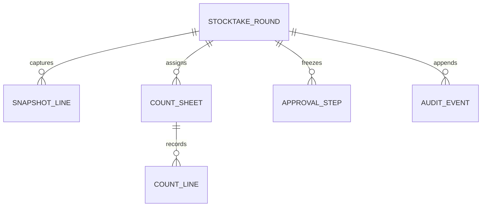

# BRD — F084 · F-WH-STOCKTAKE · ตรวจนับใหญ่ (Stocktake)

| รายการ | ค่า |
|---|---|
| ประเภท | New Feature |
| เวอร์ชัน | 1.0 |
| สถานะ | APPROVED |
| โมดูล | Warehouse |
| วันที่ | 2026-09-20 |
| เจ้าของ | Warehouse BA |
| แหล่งอ้างอิง | PREBRIEF, FUNCTION_CHECKLIST, HTML ที่ผ่าน UX/Coverage/E2E และ ST feedback |

## 1. บริบทธุรกิจ

การตรวจนับใหญ่ต้องแยก “ยอดที่ระบบมีตอนเริ่มนับ” ออกจาก movement ที่เกิดภายหลัง ป้องกันผู้นับเห็นยอดระบบก่อนนับ และบังคับให้ผลต่างที่มีนัยสำคัญถูกนับซ้ำและอนุมัติก่อนส่งต่อเป็นร่างใบปรับยอด ฟีเจอร์นี้ไม่แก้ยอดคงคลังโดยตรง

## 2. เป้าหมายและตัวชี้วัด

| ตัวชี้วัด | Baseline | Target | วิธีวัด | จังหวะวัด |
|---|---:|---:|---|---|
| รอบที่มี scope, เวลา freeze และ snapshot ครบ | 0% | 100% | ตรวจ event ของรอบ | รายเดือน |
| ผลต่างเกินเกณฑ์ที่ผ่านการนับซ้ำโดยคนละคน | 0% | 100% | เทียบ count/recount event | รายเดือน |
| รอบอนุมัติแล้วที่ส่ง F082 และไม่แก้ on-hand เอง | 0% | 100% | กระทบ handoff ack กับ movement ledger | รายเดือน |

## 3. ขอบเขต

### 3.1 ในขอบเขต

- สร้างรอบนับโดยเลือกคลัง/โซน/ตำแหน่ง
- freeze movement เฉพาะ scope และเก็บ snapshot ณ เวลาเดียวกัน
- มอบหมายใบนับและใบนับซ้ำให้บุคคลจริง
- blind count: ผู้นับไม่เห็นยอดระบบหรือผลต่าง
- ตรวจผลต่างและใช้เกณฑ์นับซ้ำที่มี effective date
- resolve และ snapshot สายอนุมัติจาก DOA
- ส่งผลต่างที่อนุมัติครบเป็นร่างใบปรับยอด F082 แล้วจึงปิดรอบ/ปลดล็อก
- เก็บประวัติทุก action แบบเพิ่มเหตุการณ์ใหม่ ไม่เขียนทับของเดิม

### 3.2 นอกขอบเขต

- ไม่ออกเอกสารเลขรันหรือ PDF
- ไม่ทำ Cycle Count/ABC, barcode/lot หรือ master คลัง/สินค้า
- ไม่ปรับ on-hand โดยตรง และไม่ post ใบปรับยอดแทน F082
- ไม่ตั้งสายอนุมัติในหน้าฟีเจอร์ Stocktake
- persona switcher ที่ติดป้าย DEMO ใช้ทดสอบต้นแบบเท่านั้น

### 3.3 สมมติฐาน

- Inventory engine เป็นเจ้าของการบล็อก movement และ lock registry
- F082 รับ draft ผ่าน `ref_count_doc` และตอบ `adjId/status`
- ค่าเกณฑ์นับซ้ำและ matrix DOA เป็น config ที่ version ตาม effective date

### 3.4 Scope Lock

| LOCK | ข้อยืนยัน |
|---|---|
| LOCK-ST-01 | เป็น console สำหรับตรวจนับใหญ่ ไม่ใช่เอกสาร Pattern Q |
| LOCK-ST-02 | freeze เฉพาะ scope และ snapshot ณ เวลา freeze แบบแก้ย้อนหลังไม่ได้ |
| LOCK-ST-03 | ผู้นับเห็นเฉพาะช่องกรอกของตน ไม่เห็นยอดระบบ/ผลต่าง |
| LOCK-ST-04 | เกินเกณฑ์ต้องนับซ้ำโดยคนละคน และผ่าน DOA ก่อนส่ง F082 |
| LOCK-ST-05 | Stocktake ไม่เปลี่ยน on-hand; ประวัติ count/decision/handoff เป็น append-only |

## 4. ผู้ใช้และสิทธิ์

| Action | ผู้นับที่ได้รับมอบหมาย | ผู้นับซ้ำที่ได้รับมอบหมาย | หัวหน้างาน | ผู้อนุมัติปัจจุบัน | Auditor |
|---|:---:|:---:|:---:|:---:|:---:|
| ดูรายการ/ประวัติ | ✓ | ✓ | ✓ | ✓ | ✓ อ่านอย่างเดียว |
| กรอกและส่งผลนับของตน | ✓ | ✓ | — | — | — |
| ดูยอดตั้งต้น/ผลต่าง | — | — | ✓ | ตาม policy | ✓ ตาม policy |
| freeze/มอบหมาย/ส่งอนุมัติ | — | — | ✓ | — | — |
| อนุมัติ/ไม่อนุมัติ | — | — | — | ✓ เฉพาะ step ปัจจุบัน | — |
| ส่งร่าง F082 | — | — | ✓ หลัง approved | — | — |

## 5. User Journey และ COSO

| # | ขั้นตอน | Maker | Checker | Approver | System |
|---:|---|---|---|---|---|
| 1 | สร้างรอบและเลือก scope | หัวหน้างาน | — | — | ตรวจข้อมูลอ้างอิง |
| 2 | ล็อก scope และเก็บ snapshot | หัวหน้างาน | Inventory engine | — | กันรอบซ้อนและบันทึก watermark |
| 3 | มอบหมาย/ส่งผลนับครั้งแรก | ผู้นับที่ได้รับมอบหมาย | หัวหน้างาน | — | ซ่อนยอดตั้งต้นและบันทึก append-only |
| 4 | มอบหมาย/ส่งผลนับซ้ำเมื่อเกินเกณฑ์ | ผู้นับคนใหม่ | หัวหน้างาน | — | กันคนเดิมและใช้ threshold version ของรอบ |
| 5 | ตรวจผลต่างและส่งอนุมัติ | หัวหน้างาน | — | ผู้อนุมัติตาม DOA | freeze approval chain |
| 6 | อนุมัติทีละขั้น | — | Auditor | ผู้อนุมัติปัจจุบัน | กัน self-approval/ข้ามลำดับ |
| 7 | ส่งร่าง F082 และปิดรอบ | หัวหน้างาน | F082 acknowledgment | — | ปลด lock เมื่อรับ ack แล้ว |

SoD: ผู้นับ/ผู้นับซ้ำต้องไม่เป็นผู้อนุมัติ และผู้อนุมัติแต่ละขั้นต้องเป็นคนละคน

## 6. ข้อมูลหลัก

| Entity | ข้อมูลสำคัญ |
|---|---|
| Stocktake Round | id, name, scope, status, freeze_at, snapshot_at, threshold_policy_ref, approval fields, handoff ref, version, audit fields |
| Snapshot Line | item/location/UoM snapshot, system_qty, unit_cost snapshot, captured_at, watermark |
| Count Sheet/Line | assignee, count_round, counted_qty, submitted_at, evidence, immutable submission |
| Approval Step | level, DOA role slot, selected person, decision, reason, decided_at |
| Audit Event | event type, actor, time, immutable payload, prior/reversal ref |

## 7. User Stories และ Acceptance Criteria

| Story | Acceptance Criteria |
|---|---|
| S-01 สร้างรอบ | Given หัวหน้างานกรอกชื่อและเลือกพื้นที่ เมื่อยืนยัน Then ได้รอบ `draft`; ข้อมูลไม่ครบต้องเห็นข้อความและไม่สร้างรอบ |
| S-02 Freeze snapshot | Given draft และ scope ไม่ทับ เมื่อ freeze Then ได้ snapshot/เวลา/lock; scope ทับต้องถูกบล็อก |
| S-03 มอบหมายใบนับ | Given frozen เมื่อเลือกคน Then status เป็น counting และเฉพาะคนนั้นกรอก/ส่งได้ |
| S-04 ส่งผลนับ | Given ค่าเป็นศูนย์หรือมากกว่าและครบทุกสินค้า เมื่อส่ง Then บันทึกผล; blank/negative ถูกบล็อก |
| S-05 นับซ้ำ | Given abs variance มากกว่าเกณฑ์ เมื่อส่งครั้งแรก Then เป็น `recount`; ห้ามเลือกคนเดิม |
| S-06 ตรวจผลต่าง | Given ผลนับสุดท้าย เมื่อหัวหน้าดู Then เห็น snapshot/count/recount/diff/value และฐาน DOA |
| S-07 อนุมัติ | Given review เมื่อเลือกผู้อนุมัติครบ Then pending; เฉพาะคนของ step ปัจจุบันตัดสินได้; reject ต้องมีเหตุผล |
| S-08 Handoff | Given approved เมื่อสร้างร่างใบปรับยอด Then F082 ตอบ draft, round closed และ lock ถูกปล่อย โดยไม่มี local stock mutation |

## 8. Lifecycle

`draft → frozen → counting → recount? → review → pending → approved → closed`

`pending → rejected` เมื่อระบุเหตุผล; รอบที่ rejected ปลด lock และเก็บเหตุการณ์เดิมทั้งหมด

## 9. กฎธุรกิจและความยืดหยุ่น

| Rule | กฎ | Tag | ระดับ/ที่มา |
|---|---|---|---|
| BR-ST-01 | lock เฉพาะ scope; active scope ห้ามซ้อน | CONFIGURABLE | Inventory policy · ✅ brief |
| BR-ST-02 | snapshot ณ freeze time แก้ย้อนหลังไม่ได้ | FIXED | invariant · ✅ brief |
| BR-ST-03 | blind count; zero valid; blank/negative invalid | FIXED | access rule · ✅ brief |
| BR-ST-04 | `abs(count-system_qty) > threshold` จึงนับซ้ำ | CONFIGURABLE | Inventory config/effective date · ✅ PM feedback |
| BR-ST-05 | คนส่งผลต้องเป็น assignee ปัจจุบันเท่านั้น | FIXED | permission · ✅ regression SEC-01 |
| BR-ST-06 | recount assignee ต้องไม่ใช่คนแรก | FIXED | SoD · ✅ brief |
| BR-ST-07 | ฐาน DOA = ผลรวม `abs(diff × unit_cost)` | DYNAMIC | DOA registry · ✅ PM feedback |
| BR-ST-08 | approval chain resolve/freeze ตอนส่ง; ห้าม hardcode | DYNAMIC | DOA engine · ✅ declaration |
| BR-ST-09 | approve/reject ได้เฉพาะ step/person ปัจจุบัน | FIXED | SoD · ✅ PM feedback |
| BR-ST-10 | handoff ได้หลัง approved ครั้งเดียว; close หลัง ack | FIXED | F082 contract · ✅ PM feedback |

## 10. Edge Cases

- ☑ active scope เดียวกันหรือ parent/child ทับกัน → block freeze
- ☑ ไม่มีสินค้าใน scope → block freeze
- ☑ blank/negative count → block; zero ผ่าน
- ☑ เกินเกณฑ์ → recount; เท่ากับเกณฑ์ไม่ recount
- ☑ คนอื่นที่ไม่ใช่ assignee เปิดใบนับได้แต่ไม่มีช่องกรอก/ปุ่มส่ง
- ☑ ผู้อนุมัติไม่ครบ, ซ้ำกัน หรือเป็นผู้นับ → block submit
- ☑ ผู้ที่ไม่ใช่ step ปัจจุบัน approve/reject → block
- ☑ reject ไม่มีเหตุผล → block
- ☑ handoff ซ้ำหรือก่อน approved → block
- `[AI-DEFAULT]` mutation ใช้ idempotency key และ version เพื่อกัน double-submit/concurrent decision

## 11. ผลกระทบ/Regression

- การแก้ UI หลัง ST feedback ต้องคง gap ปุ่มในใบนับ, history แบบไม่ซ้อน card และ guard assignee
- Regression ต้องครอบ count/recount/DOA/handoff และ persona ที่ไม่เกี่ยวข้อง

## 12. Dependencies และ Value Stream

`Warehouse/Location + Item + Inventory balance → Stocktake → Stock Adjustment (F082) → Inventory movement`

| ปลายทาง | ข้อมูล/trigger | เมื่อแก้/ยกเลิก |
|---|---|---|
| Inventory engine | scope lock + snapshot watermark ตอน freeze | rejected/closed ปล่อยเฉพาะ lock ของรอบ |
| DOA F019 | feature/action + absolute variance value ตอน review | chain ที่ freeze แล้วไม่เปลี่ยนตาม config ใหม่ |
| F082 Stock Adjustment | `ref_count_doc`, scope, freezeAt, approvedBy, lines | handoff ครั้งเดียว; F082 เป็นเจ้าของการ post |
| F089 Barcode | hook ปุ่ม “สแกน” ในใบนับ | รอบนี้คีย์มือ; ไม่สร้าง barcode flow |

## 13. Delivery Phases

- Phase 1: round/scope/snapshot/count/recount/variance/approval/handoff พร้อม audit และ lock registry
- Phase 2: wire Inventory, DOA และ F082 จริง; เปลี่ยน prototype mock เป็น adapter
- Phase 3: monitoring/report และ policy admin ที่ owner ยืนยัน
- Phase 4: ไม่รวม Cycle Count/ABC

## 14. ใบสั่ง Dev

- API ต้องบาง; logic ของ freeze/count/approval/handoff อยู่ function/engine และ trace ได้
- เก็บ snapshot/count/decision/event แบบ append-only และบังคับ optimistic lock/idempotency
- ห้ามแสดง `system_qty`/variance แก่ counter และต้อง re-check สิทธิ์ทุก mutation
- `data-demo="persona-switch"` และ badge DEMO ต้องไม่ถูก render ใน production
- ห้าม hardcode DOA chain; ค่าใน prototype เป็น resolved mock เพื่อสาธิตเท่านั้น

### 14.6 Screen Inventory (สกัดจาก HTML)

| Page | Route | ประเภท | หน้าที่ |
|---|---|---|---|
| P-01 รอบนับ | `#/rounds` | console list | ค้นหา/กรอง/เปิดรอบ |
| P-02 ใบนับ | `#/sheets` | operational table | freeze, assign, count, scan hook, submit |
| P-03 ผลต่าง | `#/variance` | review/approval | เปรียบเทียบผล, ส่ง DOA, อนุมัติ, handoff |
| P-04 ประวัติ | `#/history` | timeline | ดู event และ F082 ack |
| O-01 สร้างรอบ | `#/create` | drawer | กรอกชื่อและเลือก scope |

## 15. Open Questions

| ID | คำถาม | Owner | Blocking |
|---|---|---|:---:|
| OQ-ST-01 | API/กลไก query lock ข้าม movement feature ใช้สัญญาใด | Inventory owner | ไม่บล็อก prototype |
| OQ-ST-02 | role/permission จริงของ supervisor reveal และ approver | Policy/DOA owner | ก่อน dev wire |
| OQ-ST-03 | จุดตัดและ role-id ใน DOA matrix จริง | Warehouse BA + DOA admin | ก่อนตั้งค่าจริง |
| OQ-ST-04 | F082 payload/ack final เทียบ adapter ที่สาธิต | F082 owner | ก่อน integration |

## 16. Security & Compliance

Preset: P2 Approval/Workflow ร่วมกับ controls สต๊อก ได้แก่ access by role, Maker-Checker, SoD, policy versioning, session enforcement, standardized audit, schema validation, idempotency และ data classification. `system_qty`, unit cost และ variance value เป็น Confidential; approval/audit identity เป็น Internal/Confidential ตาม policy

ความเสี่ยงหลัก: lock ผิด scope, baseline รั่ว, stale snapshot, ข้าม recount, self-approval, double handoff; ควบคุมด้วย BR-ST-01 ถึง BR-ST-10 และ audit append-only

## 17. Health Check

| KPI/SLA | Target | เมื่อผิดเกณฑ์ |
|---|---:|---|
| snapshot integrity | 100% | block round + alert owner |
| required recount compliance | 100% | block review/approval |
| approved handoff reconciliation | 100% | คง lock + เปิด retry/incident |
| approval decision | ตาม DOA/NC policy | แจ้ง/escalate ตาม config |
| throughput | เก็บ baseline หลังเปิดใช้ | stress test ที่ peak count lines |

## 18. Monitoring

รายงาน Performance/Closing/Anomaly/Transaction ต้องเห็น active locks, overdue count sheets, recount compliance, pending approval, failed/duplicate handoff และประวัติ actor/time ทั้งหมด โดยไม่เปิดยอดลับให้ role ที่ไม่มีสิทธิ์

## AI Review

ผ่าน C01–C23 และ PE01–PE05: scope lock, story/rule/edge, SoD, measurable KPI, value stream, security และ monitoring ครบ ไม่มี critical conflict กับ HTML ที่ผ่าน manual test
