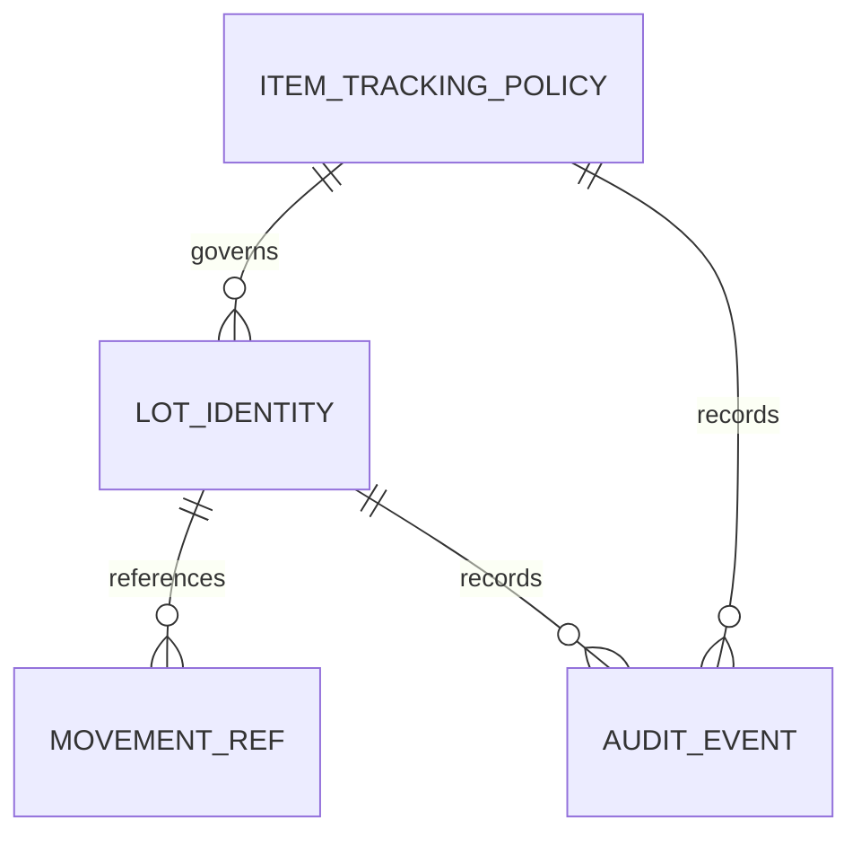
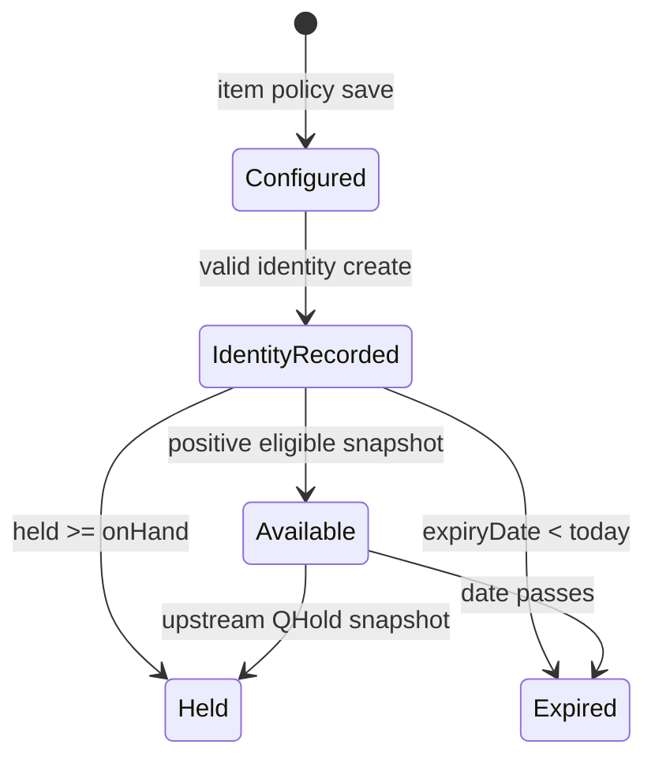

# BRD: F-WH-LOT · Lot/Serial + Expiry

> v1.0 · 2026-09-14 · W4A · Status: APPROVED for business scope. Source: RIF_v2, PREBRIEF, W4 §2–3, W4A CHECKLIST; HTML frozen after S3. S3c visual render remains WARN/NOT-CHECKED.

## 1. Document info
Owner: Warehouse Product Owner. Internal scope lock LOCK-W4-LOT comes from W4 pack; no customer sign-off is claimed.

## 2. Business context
The business needs per-item lot/serial policy, expiry-aware pick advice and traceable movement references without turning this master into a receiving or transfer transaction. Measured acceptance: ten PREBRIEF scenarios have observable outcomes; 0 stock or movement mutation from configuration/recommendation; duplicate serial on same item rejected; selected lots show distinct source references. Operational volume/SLA baselines are not supplied.

## 3. Scope
In scope: per-item tracking `none/lot/serial`, expiry flag, lot/serial identity, conditional validation, FEFO/FIFO recommendation, selected-lot trace, append-only audit, NC rule hook. Out of scope: GRN/Transfer posting, reservation, QHold release, valuation, NC delivery/threshold editing. Scope lock is console/master only, no Pattern Q. [ASSUMED] serial quantity=1, FEFO tie-break, availability snapshot and policy effective date are owned by Warehouse Product Owner; W3-LITE movement contract owner is W3-LITE.

## 4. User roles and permission matrix
| Role | Read list/trace | Create identity | Configure item policy | Change movement |
|---|---|---|---|---|
| Operator | yes | authorized only | no | no |
| Config owner | yes | yes | yes | no |
| Auditor | yes | no | no | no |
Central User Access/ENC enforces permissions server-side; prototype DEMO identity badge is not production authorization.

## 5. User journey with COSO controls
Config owner selects an existing Item snapshot, saves tracking mode/expiry, and receives an immutable audit event. Operator selects item through search picker, completes conditional identity fields, then saves; server enforces unique serial and idempotency. Picker requests a ranked list by item/warehouse; engine reads availability but does not reserve or post stock. Auditor selects a lot and follows its own predecessor/successor movement IDs and distinct GRN/Transfer refs. Alternatives: invalid item, missing expiry, duplicate serial, no eligible lots and missing movement return field error or empty state. Cancel leaves data unchanged. Duties separate policy configuration, operation and audit.

## 6. Data entity overview
| Entity | Key fields | Source / handling |
|---|---|---|
| ItemTrackingPolicy | tenantId,itemCode,trackingMode,expiryEnabled,effectiveDate | Config owner, versioned audit |
| LotIdentity | lotId,itemCode,lotCode,serialCode?,expiryDate? | This feature; serial unique tenant+item |
| AvailabilitySnapshot | warehouseRef,onHand,held | Inventory/QHold read-only mock |
| MovementRef | movementId,previousMovementId,sourceRef,fromRef,toRef,qty,at | W3-LITE read-only mock, append-only |
| AuditEvent | eventId,actor,action,subject,before,after,at | This feature, append-only |
Item/Warehouse refs are soft picker snapshots per LD-4C-02, not hard FK validation. `serialCode` and `expiryDate` are nullable when policy does not require them.

## 7. User stories and acceptance criteria
| ID | Story | Observable acceptance |
|---|---|---|
| S-01 | Configure one item | ITEM-101 change does not alter ITEM-102; past movements unchanged |
| S-02 | Create expiry lot | Missing ITEM-101 expiry gives date error, zero rows added; valid date adds one identity only |
| S-03 | Create non-expiry lot | ITEM-103 saves null expiry |
| S-04 | Create serial | Same-item duplicate rejected, unique serial accepted |
| S-05 | FEFO | Oct01 before Oct15; expired Sep01 and fully-held Nov01 excluded; no reservation |
| S-06 | FIFO sequence | Non-expiry item ranks by receivedAt, not cost method |
| S-07 | Trace | LOT-2609-011 shows GRN-2609-014→Transfer-2609-009; LOT-2609-012 GRN-2609-016; empty lot shows empty state |
| S-08 | Browse list | Visible count/order reflect rows; cancel unchanged |
| S-09 | NC hook | Opens central NC rule entry; threshold/channel not hardcoded |
| S-10 | Retry save | Idempotency prevents duplicate identity/event |

## 8. Status and lifecycle
Item policy is effective configuration with historical versions in audit. Lot identity status is `พร้อมใช้`, `กักอยู่`, or `หมดอายุ` derived from snapshot/date; identity creation does not post stock. Movement refs are append-only and read-only. No delete transition. Recommendation is a computation, not a persisted reservation.

## 9. Business rules and validation
| ID | Rule | Flexibility / authority |
|---|---|---|
| BR-01 | Tracking none/lot/serial per item; expiry requires active tracking | Configurable by authorized owner |
| BR-02 | Expiry required iff selected item's expiryEnabled | Policy, never item-name regex |
| BR-03 | Serial unique tenant+item; serial qty=1 | [ASSUMED] Product Owner |
| BR-04 | Eligible = onHand−held>0; unexpired if expiry enabled | [ASSUMED] Product Owner |
| BR-05 | Expiry item FEFO; non-expiry receivedAt ascending; ties receipt then lot code | OQ-LOT-01 + [ASSUMED] tie |
| BR-06 | Recommendation does not reserve/mutate stock | Locked W4 boundary |
| BR-07 | GRN/Transfer refs read-only mock | Locked W4 boundary |
| BR-08 | Config/create append audit; movement never rewritten/deleted | Golden 4 |
| BR-09 | Near-expiry threshold/event routing belongs to NC rules | Golden 5/7 |
Blocked save leaves rows/events unchanged. Server must re-check uniqueness and permission despite in-memory prototype checks.

## 10. Edge cases
Zero available and fully held lots excluded; expired lot remains traceable but ineligible; missing movement shows empty state; different lots cannot share a synthetic source ref; config change does not erase old identity/movement; concurrent save needs DB uniqueness+idempotency; identical serial on another item is permitted only under [ASSUMED] Product Owner decision.

## 11. Regression scope
New feature. Confirm existing Item/Warehouse pickers, QHold availability, W3-LITE refs and NC rules remain independent. No balance or transaction mutation is introduced.

## 12. System context and value stream
| Boundary | Data exchanged | Allowed action | Prohibited implementation |
|---|---|---|---|
| Item → policy | item snapshot | read/config | edit Item master |
| GRN/Transfer → trace | movement/source refs | read mock | post GRN/Transfer |
| QHold → eligibility | held qty | exclude from available | release hold |
| Lot → Picking | ordered candidates | recommend | reserve/pick/post |
| Lot → NC | expiry candidate/ref | declare hook | threshold/channel/delivery |
W3-LITE payload is [ASSUMED contract] mock with source id/type, movement id, qty, date and predecessor. Existing Item/Warehouse masters are referenced, not rebuilt.

## 13. Delivery phases
One W4 FULL AI dev pack. Production integration to W3-LITE/NC is a separate dependency task, carried as TODO with owner. No vibe team stage.

## 14. Dev requirements summary
Separate API for identity create, item policy update, recommendation read and selected-lot trace. Persist effective policy versions and append-only audit. Unique `(tenant,item,serialCode)` for serial mode; tenant and permission checks server-side. UI screen inventory (coarse): list/create/view, trace, settings/recommendation. FRD controls layout authority. Warning: S3c render unverified; external payload/effective date/tie-break ASSUMED.

## 15. Open questions
OQ-LOT-01 default: FEFO only expiry-enabled items. Pick sequence is distinct from Weighted Avg valuation. Serial qty=1, FEFO tie-break, policy effective date and old-policy treatment are [ASSUMED] Warehouse Product Owner. NC event detection conflicts with `csq` chip; DIVERGENCE to registry owner, no silent `ntf` addition.

## 16. Security and compliance
Tenant isolation, operator/config/auditor separation through central User Access, no hardcoded role IDs. Soft master refs per LD-4C-02; audit append-only, movement read-only, no hard delete. DOA not applicable to this `csq`-only feature. Actor ID is internal security metadata.

## 17. Health check
Track duplicate serial rejection, invalid expiry rejection, no-eligible recommendation, and unresolved movement ref. Alert thresholds live in NC configuration; no SLA number invented. Correlation IDs support incident review.

## 18. Monitoring and reports
Report lots by item/warehouse/expiry state and missing source refs. Closing report compares identity count to append-only create events, not inventory balance. Recommendation/trace latency instrumentation should have centrally configured thresholds.

## Appendix — Quality Gate C01–C23
Reviewed against source/checklist: C01–C23 business sections and cross-section story/rule/data/downstream mapping have no critical gap; 10/10 stories have observable acceptance; numeric/conditional rules have source or [ASSUMED] owner. Status APPROVED applies to the business document. Browser visual acceptance remains WARN/NOT-CHECKED and is disclosed in handoff.

## Quality Gate supplement — explicit C01–C23 evidence
### §2.3 Metric baseline, target, method and cadence
| Metric | Baseline | Target | Measurement | Cadence / §17.3 pair |
|---|---|---|---|---|
| Scenario acceptance | 0 automated feature cases before new build | 10/10 PREBRIEF scenarios pass | QA ledger counts passed/total | each release; KPI-01 |
| Stock/movement immutability under config/recommendation | 0 existing mutation endpoints for this new feature | 0 changed movement/balance rows | compare immutable fixture hash before/after commands | each release; KPI-02 |
| Same-item duplicate serial rejection | no current feature validation | 100% of duplicate inputs rejected | server integration suite: rejected/attempted | each release; KPI-03 |

### §6.3 ER diagram and audit columns

All owned rows carry `created_by`, `created_date`, `modified_by`, `modified_date` (for immutable events `modified=created`); movement read model carries these fields from W3-LITE and is not rewritten here. Availability snapshot carries upstream timestamps/actor where supplied; missing upstream audit metadata is [ASSUMED contract] gap owned by W3-LITE.

### §7 Given–When–Then acceptance ledger
| Story | Given | When | Then A | Then B |
|---|---|---|---|---|
| S-01 | ITEM-101 and ITEM-102 policies exist | config owner changes ITEM-101 | ITEM-101 policy version increments | ITEM-102 and past movements retain original values |
| S-02 | ITEM-101 expiry enabled | operator saves without date | date field shows “กรอกวันหมดอายุ” | row/event counts unchanged |
| S-03 | ITEM-103 expiry disabled | operator saves without date | new identity has null expiry | no movement is created |
| S-04 | SN-102 belongs to ITEM-102 | operator saves same serial for ITEM-102 | error says “ซีเรียลนี้ถูกใช้แล้ว” | no duplicate row/event |
| S-05 | Oct01, Oct15, expired Sep01, held Nov01 lots exist | user requests ITEM-101 recommendation | Oct01 then Oct15 displayed | expired/held rows absent; balance unchanged |
| S-06 | ITEM-103 expiry disabled | user requests recommendation | oldest receipt displayed first | valuation method is unchanged |
| S-07 | two lots with distinct movement refs exist | auditor switches selected lot | respective GRN/Transfer refs appear | other lot's refs disappear; missing history has empty state |
| S-08 | list has seven fixture lots | user searches/sorts/cancels | filtered rows/count/sort update | cancel creates no event |
| S-09 | NC config exists | user chooses “เปิดกฎแจ้งเตือน” | central hook is invoked | no feature-local threshold/channel is set |
| S-10 | same identity just saved | same payload is submitted again | duplicate is rejected | exactly one create event exists |

### §8.1 State diagram and §8.2 transition table

| Transition | Owner | Guard | Event |
|---|---|---|---|
| Unconfigured→Configured | Config owner | permission + policy validity | append policy audit |
| Configured→IdentityRecorded | Operator | identity validation + uniqueness | append identity audit |
| IdentityRecorded→Available/Held/Expired | read model | onHand/held/date snapshot | no local stock event |
| Movement source→Trace visible | W3-LITE mock | matching lot id | append upstream only |
No local transition mutates movement or stock.

### §9.2 Validation matrix and §9.5 flexibility
| Field | Condition | Error outcome |
|---|---|---|
| itemCode | must match selected Item snapshot | “เลือกสินค้าจากรายการ” |
| trackingMode | `none` cannot pair expiry=true | “เปิดวันหมดอายุต้องติดตามล็อตหรือซีเรียล” |
| lotCode | required when tracking lot/serial | “กรอกรหัสล็อต” |
| serialCode | required when serial; unique tenant+item | “กรอกซีเรียล” / “ซีเรียลนี้ถูกใช้แล้ว” |
| expiryDate | required iff expiryEnabled; valid ISO date | “กรอกวันหมดอายุ” |
| onHand/held | read-only nonnegative snapshot | no edit control |
| movementRef | read-only matching lot id | empty trace if none |
| idempotencyKey | same create command must return same result | no second identity/event |

| Rule | Source marker | Tag | Flexibility level |
|---|---|---|---|
| BR-01 | ✅ W4 | CONFIGURABLE | Admin Panel per item |
| BR-02 | ✅ W4 | CONFIGURABLE | Admin Panel per item |
| BR-03 | 🤖 [ASSUMED] | WARNING | Product Owner OQ; unique constraint fixed after resolution |
| BR-04 | 🤖 [ASSUMED] | WARNING | Product Owner OQ; calculation in feature function |
| BR-05 | ✅ OQ-LOT-01 / 🤖 tie | CONFIGURABLE | Rule Management for eligibility/tie after OQ |
| BR-06 | ✅ W4 | FIXED | code invariant |
| BR-07 | ✅ W4 | FIXED | cross-lane contract |
| BR-08 | ✅ Golden | FIXED | append-only storage |
| BR-09 | ✅ Golden | DYNAMIC | NC Rule Management, external |
No feature-local engine-management threshold or channel decision is allowed.

### §10.1 Confirmed source edge cases
- Quantity/eligibility: zero available, held-all, expired lots excluded (W4 §2/§3).
- State/lifecycle: policy change preserves append-only movement (Golden 4).
- Reference: GRN/Transfer missing source gives empty trace, not invented ref (W4 dep mock boundary).

### §10.2 AI-suggested edge cases for owner resolution
- [ ] Concurrent serial create across clients → server unique constraint + idempotency [ASSUMED; Product Owner + Dev lead before integration].
- [ ] Two lots same expiry/receipt timestamp → stable lot-code tie-break [ASSUMED; Product Owner before release].
- [ ] Existing identity after disabling tracking → retain read-only history [ASSUMED; Product Owner before release].

### §12.1 Trigger and change/cancel impact
| Data flow | Trigger | Change or cancellation impact |
|---|---|---|
| W3-LITE GRN/Transfer→trace | upstream posted movement | reversal is a new upstream movement, never delete prior ref; pending W3-LITE contract |
| QHold→eligibility | new held snapshot | next recommendation recomputes; previous suggestion is not reserved |
| Lot→Picking | request candidate list | change in policy/availability recomputes; no pick transaction is changed |
| Lot→NC | NC rule evaluation | NC changes threshold/channel centrally; this feature's identity remains intact |

### §13 Delivery phase 1–4 detail
1. Phase 1: build item policy, identity, list and trace read model.
2. Phase 2: config permission/admin controls and append-only audit.
3. Phase 3: FEFO/eligibility and NC/CSQ declaration hooks against configured rules.
4. Phase 4: integrate W3-LITE mock replacements and production observability after contract owner confirms payload. All phases belong to one W4 FULL dev handoff; no vibe gate.

### §14.1–14.4 Dev order and warning disposition
14.1 Config foundation: tenant+item effective policy and audit versions. 14.2 Rule tags: BR-01/02 in admin config, BR-05/09 in rule management/NC, fixed invariants server-side. 14.3 Validation: all §9.2 cases, concurrent uniqueness and idempotency. 14.4 Warnings: Warehouse Product Owner resolves serial qty, FEFO ties, old-policy behavior before release; W3-LITE owner resolves movement payload before integration; registry owner resolves `ntf` divergence before event declaration. These owners and timing are in HANDOFF.

### §17.3 KPI pair
KPI-01 = 10/10 acceptance cases each release. KPI-02 = zero movement/balance hash changes under config/recommendation each release. KPI-03 = 100% same-item duplicate serial rejection in server suite each release. These pair exactly with §2.3.

### §3.4 / RIF §16.3 lock inheritance
RIF §16.3 equivalent is `_SCOPE_LOCK.md` and RIF §6: LOCK-W4-LOT from internal W4 pack. No signed customer LOCK is claimed. No scope outside W4 feature checklist was added; additional tie/qty/effective-date details are explicitly [ASSUMED] OQ owned by Product Owner.
