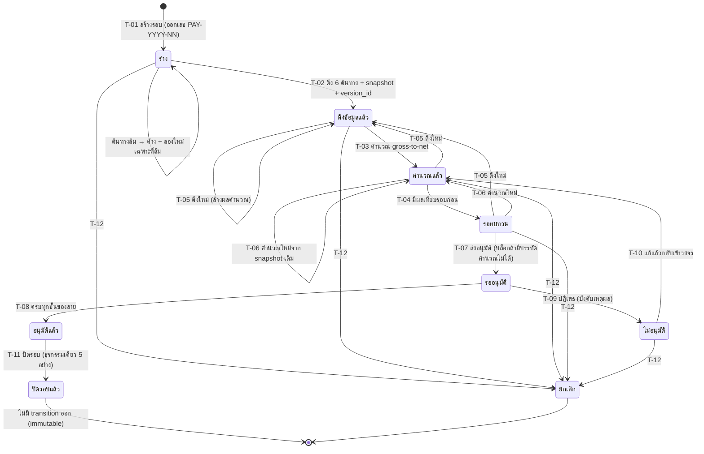

# BRD: Payroll — เงินเดือน (รอบจ่าย `PAY-YYYY-NN` + สลิปเงินเดือน `PS-YYYY-NNNNNN`)

> `brd-generator-full` v2.2 · **Lane Mode v2 (no-ask · ไม่มี RIF)** · S4 ของ `feature-lane-runner` v2.3
> Input: `briefs/W4/F-HR-PAYROLL/PREBRIEF.md` (S-01…S-59 · BR-01…BR-43 · §12) + `FUNCTION_CHECKLIST.md` (80 FN · 10 "ไม่รองรับ") + `LANE_BRIEF.md` (LOCK/OQ) + `STANDARD_BASELINE.md` (18 MUST) + `5_DECLARATIONS/` ทั้ง 5 ท่อ + `1_HTML/เงินเดือน.html` (สกัดผ่าน `_lane/COVERAGE_MAP.md` · `_lane/QC/COVERAGE_R1.md` · ไม่อ่านไฟล์ HTML เข้ามาทั้งฉบับ)
> **ประโยคที่นิยามเอกสารใบนี้:** ต้นทางทั้งหกเผยแพร่ **ชั่วโมง วัน และธง — ไม่มีจำนวนเงินเลยแม้แต่บาทเดียว** · **ที่นี่คือที่ที่ชั่วโมงกลายเป็นเงิน** และนั่นคือความรับผิดชอบทั้งหมดของ feature นี้

---

## Section 1: Document Info

| | |
|---|---|
| **BRD ID** | `BRD-F-HR-PAYROLL-v1.0` |
| **ชื่อ Feature** | Payroll · **เงินเดือน** |
| **รหัส Feature** | `F-HR-PAYROLL` |
| **Module** | HR (ทรัพยากรบุคคล) |
| **Wave / Lane** | W4 / Lane A |
| **ประเภท BRD** | **New Feature** (ไม่มี artifact เดิมใน `output/`) |
| **Archetype** | **Q-document + run** (`archetype_confirmed` ใน PREBRIEF · ยืนยันซ้ำที่ `STANDARD_BASELINE §3`) |
| **Version** | 1.0 |
| **Status** | ✅ **APPROVED** (Quality Gate C01–C23 + PE01–PE05 · ดูท้ายเอกสาร) |
| **Owner (BA)** | สายงาน BA · CUBE 4.0 |
| **Stakeholders** | ฝ่ายบุคคล (HR Payroll Officer · Comp Admin) · ฝ่ายการเงิน · ผู้บริหารสูงสุด · ผู้ตรวจสอบภายใน · พนักงานทุกคน (ผู้รับสลิป) · Architect · Strike |
| **วันที่** | 2026-08-30 |
| **เอกสารถัดไป** | `3_FRD/` (frd-generator-v6 · Lane Mode v2) |

### Changelog

| Version | วันที่ | ผู้แก้ | สาระ |
|---|---|---|---|
| 1.0 | 2026-08-30 | `brd-generator-full` (Lane Mode v2) | ฉบับแรก — สกัดจาก PREBRIEF v1.1 + FUNCTION_CHECKLIST 80 FN + 5 declarations + HTML v9 (4 routes) |

---

## Section 2: Business Context

### 2.1 ปัญหา / โอกาส

**ปัญหาที่เป็นอยู่**

โมดูล HR ของ CUBE 4.0 มี feature ที่เสร็จแล้วหกตัวซึ่งทั้งหมด **เผยแพร่ข้อมูลเป็นชั่วโมง วัน หัว และธงนโยบาย — ไม่มี feature ใดมีจำนวนเงินเลย** และทั้งสามใบเขียนไว้ตรงกันเป็นลายลักษณ์อักษร:

- `F-HR-ATTEND §0.13.4 AT-6` — "ห้ามคำนวณชั่วโมงเอง · **ห้ามใช้ `outside_shift_hours` เป็นชั่วโมง OT**"
- `F-HR-LEAVE §0.13.5 LV-6` — "`is_paid`/`paid_percent` เป็นป้ายนโยบาย ไม่ใช่จำนวนเงิน — **การแปลงเป็นเงินเป็นหน้าที่ของ Payroll ทั้งหมด**"
- `F-HR-OT §0.13.4 OT-6` — "ห้ามตีความ `multiplier` เป็นจำนวนเงิน — **การแปลงเป็นเงินเป็นของ Payroll เท่านั้น**"

ผลคือ **วันนี้ยังไม่มีที่ใดในระบบที่ชั่วโมงกลายเป็นเงิน** — องค์กรยังต้องส่งออกชั่วโมงไปคำนวณเงินเดือนนอกระบบ ซึ่งทำให้เกิดปัญหาสี่อย่างพร้อมกัน:

| # | อาการ | ผลกระทบทางธุรกิจ |
|---|---|---|
| 1 | **ตัวเลขที่จ่ายไม่มีร่องรอยกลับไปหาต้นทาง** | เมื่อพนักงานทักท้วง ไม่มีใครตอบได้ว่าเงินก้อนนี้มาจากใบลาใบไหน ใบ OT ใบไหน หรืออัตราเวอร์ชันใด |
| 2 | **การคำนวณเงินหักตามกฎหมายอยู่นอกการควบคุม** | ประกันสังคม · ภาษีหัก ณ ที่จ่าย · กองทุนสำรองเลี้ยงชีพ ถูกคิดด้วยไฟล์ที่ไม่มีเวอร์ชัน — เพดานหรืออัตราที่เปลี่ยนกลางปีจะเข้าระบบช้าและเงียบ |
| 3 | **ไม่มีขั้นตอนทบทวนก่อนจ่าย** | รอบที่ผิดถูกจ่ายออกไปก่อนที่ใครจะเห็น — ความผิดพลาดถูกพบหลังเงินออกจากบัญชีแล้ว |
| 4 | **ไม่มีนิยามว่ารอบไหน "ปิดแล้ว"** | ตัวเลขของงวดเก่าเปลี่ยนได้เงียบ ๆ ทำให้บัญชีและภาษีของงวดที่ผ่านมาไม่นิ่ง |

**โอกาส**

ต้นทางทั้งหกทำงานเสร็จหมดแล้วและ **เผยแพร่ทุกอย่างที่จำเป็นพร้อม `version_id` ครบก้อน** — `F-HR-OT §0.13.7` ถึงกับเขียนตัวอย่างการใช้งานให้ทีม Payroll ไว้แล้ว feature นี้จึงเป็น **การต่อท่อสุดท้ายของโมดูล** ไม่ใช่การสร้างของใหม่ตั้งแต่ศูนย์ และเป็นจุดที่มูลค่าของงานหกใบก่อนหน้าถูกรับรู้ครั้งแรก

### 2.2 เป้าหมายทาง Business

| # | เป้าหมาย | ทำไมสำคัญ |
|---|---|---|
| **G-1** | **ทำให้การจ่ายเงินเดือนเป็นกระบวนการที่อธิบายได้ทุกบาท** — ทุกบรรทัดบนสลิปไล่กลับไปหาเอกสารต้นทางได้ (เลขใบลา · เลขใบ OT · รายการประจำ · เลขใบเบิก · เลขรอบต้นฉบับ) | บรรทัดที่ไล่กลับไม่ได้ = บรรทัดที่อธิบายไม่ได้ตอนมีข้อพิพาท (BR-43) |
| **G-2** | **ทำให้ระบบไม่มีวันจ่ายเงินจากตัวเลขที่เดามา** — ค่าตามกฎหมายทุกตัวอ่านจาก HR Configuration ที่มี `effective_date` · ไม่มีค่า = ไม่คำนวณ = ส่งอนุมัติไม่ได้ | `P-8` · `HR-1` · ความผิดเรื่องอัตราตามกฎหมายเป็นความผิดทางกฎหมายและการเงิน ไม่ใช่ความไม่สวยงาม |
| **G-3** | **ทำให้รอบที่ปิดแล้วเป็นค่าถาวรที่พิสูจน์ย้อนหลังได้** — snapshot ตรึงพร้อม hash · ไม่มี transition ออก · การแก้ทุกชนิดคือรอบใหม่ที่อ้างรอบเดิม | `P-7` · `P-9` · audit append-only · เป็นฐานของบัญชีและภาษีของงวดนั้น |
| **G-4** | **ทำให้ความเสี่ยงถูกทบทวนก่อนจ่าย ไม่ใช่หลังจ่าย** — เทียบรอบก่อนรายคน × รายองค์ประกอบ แล้วให้สายอนุมัติที่ยาวขึ้นเมื่อพบความต่างที่มีนัยสำคัญ | `STANDARD_BASELINE C-09` · SAP PCC ถือเป็นจุดขายหลัก |
| **G-5** | **ทำให้ข้อมูลค่าจ้างไม่รั่ว** — RESTRICTED สูงสุดในโมดูล · การเปิดดูและการส่งออกถูกบันทึกเป็น SecC · สลิปเป็น all-or-nothing | `OB-08` · ข้อมูลค่าจ้างเป็นข้อมูลที่เสียหายที่สุดเมื่อรั่ว |
| **G-6** | **ส่งต่อผลให้ปลายทางได้ทันทีโดยไม่ต้องรอปลายทางมีอยู่จริง** — payload GL · ไฟล์โอน · สลิปสำหรับ ESS · YTD สำหรับ 50 ทวิ | Accounting GL ยังไม่มีในระบบ — Module Linkage ปิดต้องไม่บล็อกการปิดรอบ (BR-40) |

### 2.3 ตัวชี้วัดความสำเร็จ (Success Metrics) — บังคับวัดได้

| # | ตัวชี้วัด | Baseline ปัจจุบัน | Target | วัดยังไง / จากไหน | วัดเมื่อไหร่ | คู่ใน §17.3 |
|---|---|---|---|---|---|---|
| **M-1** | สัดส่วนบรรทัดของรอบที่ไล่กลับต้นทางได้ (มี `source_ref`) | **ยังไม่มี baseline — ต้องเก็บก่อน launch** (วันนี้คำนวณนอกระบบ) | **100 %** ของบรรทัดที่ไม่ใช่ "ปรับด้วยมือ" | นับจาก `payroll_run_line` ที่ `source_ref` ไม่ว่าง ÷ บรรทัดทั้งหมดที่ไม่ใช่ `is_manual` | ทุกรอบที่ปิด | KPI-01 |
| **M-2** | จำนวนรอบที่ถูกปิดโดยยังมีบรรทัด `ยังคำนวณไม่ได้` | — (กลไกยังไม่มี) | **0 ตลอดกาล** (เป็น invariant ไม่ใช่เป้า) | นับรอบสถานะ `ปิดรอบแล้ว` ที่ `uncomputable_line_count > 0` | ทุกวัน (ควรเป็น 0 เสมอ) | KPI-02 |
| **M-3** | เวลาเฉลี่ยจากสร้างรอบถึงปิดรอบ (รอบปกติ) | **ต้องเก็บ baseline ก่อน launch** — ประมาณการปัจจุบัน 5–7 วันทำการ (กระบวนการนอกระบบ) | **≤ 3 วันทำการ** ภายในไตรมาสที่ 2 หลัง go-live | `closed_at − created_at` ของรอบ `run_type = ปกติ` | รายเดือน | KPI-03 |
| **M-4** | สัดส่วนรอบที่ถูกดึงข้อมูลใหม่หลังคำนวณแล้ว (rework) | **ต้องเก็บ baseline ก่อน launch** | **≤ 20 %** ของรอบต่อเดือน | นับ transition T-05 จาก timeline ของรอบ ÷ จำนวนรอบ | รายเดือน | KPI-04 |
| **M-5** | จำนวนรอบปรับปรุง/รอบกลับรายการต่อ 12 รอบปกติ | **ต้องเก็บ baseline ก่อน launch** | **≤ 1 รอบกลับรายการ / ปี** และ **≤ 3 รอบปรับปรุง / ปี** | นับรอบ `run_type ∈ {ปรับปรุง, กลับรายการ}` | รายไตรมาส | KPI-05 |
| **M-6** | สัดส่วนพนักงานที่เปิดสลิปของตัวเองภายใน 7 วันหลังเผยแพร่ | — (ยังไม่มีสลิปในระบบ · ESS ⏳W6) | **≥ 70 %** ภายใน 3 เดือนหลัง ESS เปิด | นับจาก SecC `payroll.restricted_viewed` surface เจ้าของ ÷ จำนวนสลิปที่เผยแพร่ | รายเดือน (เริ่มเมื่อ W6 พร้อม) | KPI-06 |
| **M-7** | จำนวนครั้งที่มีการเปิดดูตัวเลข RESTRICTED โดยไม่มีสิทธิ์ (403) | — | **แนวโน้มลดลง** และทุกครั้งมีร่องรอย **100 %** | นับ SecC `payroll.access_denied` | รายเดือน | KPI-07 |
| **M-8** | จำนวนวันที่ระบบรอคีย์ค่าตามกฎหมายจาก HR Configuration | **วันนี้ = ยังไม่มีคีย์เลย (27 คีย์ · 6 กลุ่ม)** | **0 คีย์ค้าง** ก่อน go-live จริง | นับกลุ่มที่ `hr-config/resolve` ยังไม่คืนค่า | รายสัปดาห์จนกว่าจะครบ | KPI-08 |

> **ไม่มีตัวชี้วัดลอยในตารางนี้** — ทุกแถวมีแหล่งวัดที่เป็นข้อมูลในระบบ และแถวที่ยังไม่มี baseline ระบุชัดว่า **"ต้องเก็บ baseline ก่อน launch"** เป็น action ไม่ใช่ช่องว่าง (C22)

### 2.4 ที่มาของ Requirement

| ที่มา | สาระ |
|---|---|
| **scope note (verbatim · `briefs/W4/CHECKLIST.md` แถว 1)** | "รอบจ่ายเงินเดือน: สร้างรอบ (เดือน/งวด) → ดึง Salary Structure + Attendance + Leave + OT → คำนวณเงินได้-เงินหัก → **ประกันสังคม · ภ.ง.ด.1 · กองทุนสำรองฯ** → ตรวจทาน (compare รอบก่อน) → DOA อนุมัติรอบ → ปิดรอบ (ล็อกแก้ไข) → payslip PDF ต่อคน + แจ้งเตือน → ไฟล์โอนธนาคาร + ส่งบัญชี (GL hook) · RESTRICTED สูงสุด · ไม่ทำ 50 ทวิ/ภ.ง.ด.1ก รอบนี้ (→ Accounting/OQ)" |
| **`OQ-HR-01` (`CONTEXT_PACK/HR.md`) — ตอบแล้ว** | สร้าง payroll เองเต็มรูปแบบ (ประกันสังคม · ภ.ง.ด.1 · กองทุนสำรองฯ) · **ยังไม่ทำ 50 ทวิ / ภ.ง.ด.1ก** → Accounting |
| **`OQ-HR-05` — ตอบแล้ว** | HR Configuration รองรับค่าแยกรายบริษัท แต่ยังไม่มี UI สลับบริษัท → **รอบต้องมี `company_id` เสมอ** |
| **สัญญาจากต้นทาง 6 ใบ** | `SS-1…SS-7` · `AT-1…AT-7` · `LV-1…LV-7` · `OT-1…OT-7` · `C-1…C-6` + `P-1…P-9` · `OB-1…OB-6` — ทุกข้อถูกยกเป็น BR ในเอกสารนี้ |
| **`STANDARD_BASELINE` (S0.5)** | เทียบ Odoo · D365 · SAP → capability matrix 24 แถว (MUST 18 · SHOULD 2 · NICE 2 · SKIP 1) · lifecycle 9 สถานะ + 3 สถานะสลิป + 4 ชนิดรอบ |
| **feature พี่น้องที่เขียนส่งต่อไว้** | `CSQ-HRMOVE §3` ระบุตรง ๆ ว่า *"Payroll (⏳W4) เป็นผู้ลงบัญชีค่าจ้าง"* → ใบนี้รับหน้าที่ประกาศท่อ **AC** ตามที่ถูกส่งต่อมา |

---

## Section 3: Scope

### 3.1 In Scope

| # | ทำอะไร | MUST ที่ครอบ |
|---|---|---|
| 1 | **"รอบจ่าย" เป็นวัตถุหลักที่มี lifecycle ของตัวเอง 9 สถานะ** ผูกงวดจาก `pay_period` ของ HR Configuration + ขอบเขตบริษัท · เลขที่ `PAY-YYYY-NN` ออกที่การสร้าง | C-01 |
| 2 | **ดึงข้อมูลจากต้นทาง 6 ที่เป็น snapshot** พร้อม `version_id`/`config_version_ids` ทั้งก้อน · `called_at` · `period_status` ณ เวลาอ่าน · hash | C-02 · C-03 |
| 3 | **ชั้นตรวจความพร้อมของข้อมูลก่อนคำนวณ** — แถบความพร้อม 6 แถวพร้อมธง "ยอดยังไม่นิ่ง" และลิงก์กลับต้นทาง | C-04 |
| 4 | **คำนวณ gross-to-net ตามลำดับที่ประกาศไว้** (E1 · E2 · E3 → D1 · D2 · D3 · **D4 → D5 → D6** → N) | C-05 |
| 5 | **เงินหักตามกฎหมายสามตัวเต็มรูปแบบ** — ประกันสังคม (ลูกจ้าง+นายจ้าง) · ภาษีหัก ณ ที่จ่ายรายเดือน · กองทุนสำรองเลี้ยงชีพ (สะสม+สมทบ) | C-06 |
| 6 | **prorate คนเข้า/ออกกลางงวด** ตามธง `prorate_by_payment_days` ของต้นทาง + `last_working_day` ของ On/Offboard · ทำเครื่องหมาย "รอบจ่ายสุดท้าย" | C-07 |
| 7 | **รายการประจำ/หักผ่อนชำระ** พร้อม `goal_amount`/`accrued_amount` — หยุดหักเมื่อครบเป้า · แสดงยอดคงเหลือบนสลิป | C-08 |
| 8 | **ทบทวนโดยเทียบรอบก่อน** รายคน × รายองค์ประกอบ + ยอดรวมรอบ · ธง `has_material_variance` | C-09 |
| 9 | **สายอนุมัติของรอบผ่าน DOA Engine** — `GET /doa/resolve` · 5 action · สาย 3→5 ขั้น · slot picker เลือกคน | C-10 |
| 10 | **ปิดรอบ = ล็อกถาวร (immutable)** ในธุรกรรมเดียว 5 อย่าง | C-11 |
| 11 | **สลิปเงินเดือนรายคน** `PS-YYYY-NNNNNN` + PDF A4 1 หน้า ในคลังสำเนาถาวร | C-12 |
| 12 | **เผยแพร่/แจ้งเตือนสลิปถึงพนักงานรายคน** — ลิงก์เข้าระบบ ไม่แนบไฟล์ | C-13 |
| 13 | **ไฟล์โอนธนาคาร** + รายการคนที่ไม่มีเลขบัญชี + สถานะ "ส่งไฟล์แล้ว" ที่คนกดเอง | C-14 |
| 14 | **payload รายการบัญชีของรอบ (GL hook)** — `payroll_code` + ศูนย์ต้นทุน · **ไม่ post** | C-15 (เฉพาะ hook) |
| 15 | **รอบนอกรอบ (off-cycle)** — ขอบเขตเป็นรายชื่อ · สายอนุมัติของตัวเอง | C-16 |
| 16 | **รอบกลับรายการ (reversal)** — ยอดกลับด้านทั้งรอบ · สายยาวที่สุด · รอบต้นฉบับไม่ถูกแตะ | C-17 |
| 17 | **รอบปรับปรุง (adjustment)** — ส่วนต่างเป็นบรรทัดของรอบใหม่ในงวดที่เปิดอยู่ | C-18 |
| 18 | **ยอดสะสมรายปีต่อคน (YTD)** ตามปีภาษี · ไม่นับรอบจำลอง | C-21 |
| 19 | **รอบจำลอง (`is_simulation`)** `[AI-DRAFT]` — คำนวณและเทียบได้ แต่ปิดไม่ได้ ไม่ออกเลข ไม่ยิง event | C-19 (SHOULD) |
| 20 | **สรุปต้นทุนแรงงานแยกศูนย์ต้นทุน/หน่วยงาน** `[AI-DRAFT]` — เป็นฐานของ payload GL ด้วย | C-20 (SHOULD) |
| 21 | **สิทธิ์ 3 ชั้นและร่องรอย** — masking ที่ต้นทาง · masking ตาม Policy Center · สลิป all-or-nothing · SecC ทุกการเปิดดู/ส่งออก | OB-08 |

### 3.2 Out of Scope (ไม่ทำรอบนี้ — 10 รายการ · ตรงกับ `FUNCTION_CHECKLIST §สิ่งที่ไม่รองรับ`)

| # | ไม่ทำ | ทำไม | ทำอะไรแทน | OQ |
|---|---|---|---|---|
| 1 | หนังสือรับรองการหักภาษี ณ ที่จ่าย (**50 ทวิ**) | scope note ตัด → Accounting · `OQ-HR-01` | เก็บ **YTD** ต่อคนให้ครบ + ช่องอ้างอิงให้ปลายทางอ่าน | `OQ-STD-PAY-A` |
| 2 | **ไฟล์ยื่น ภ.ง.ด.1 รายเดือน และ ภ.ง.ด.1ก รายปี** | **คำนวณยอดหักทำครบ (MUST) · ออกแบบฟอร์มไม่ทำ** | สรุปยอดภาษีหักต่อรอบ + YTD | `OQ-STD-PAY-A` |
| 3 | **แบบนำส่ง สปส.1-10 และรายงานนำส่งกองทุนสำรองฯ** | เป็น "แบบนำส่ง" ไม่ใช่ "การคำนวณ" | คำนวณเงินสมทบทั้งสองฝ่ายครบ + สรุปยอดต่อรอบ | `OQ-STD-PAY-B` |
| 4 | **ตัวช่วยสร้าง/แก้สลิปรายใบ (wizard 5 ขั้นของ Pattern Q)** | สลิปเกิดจากรอบเท่านั้น และปิดรอบแล้วแก้ไม่ได้ | **รายการปรับด้วยมือในรอบที่ยังไม่ปิด** (บังคับเหตุผล + เข้าสายอนุมัติ) | `OQ-STD-PAY-C` |
| 5 | **จ่ายเงินจริง / ตัดบัญชี / กระทบยอดกับธนาคาร** | Finance เป็นเจ้าของ | ออกไฟล์โอนแล้วหยุด · สถานะ "ส่งไฟล์แล้ว" คนกดเอง | `OQ-STD-PAY-D` |
| 6 | **ลงบัญชีจริง (post GL)** | Accounting GL ยังไม่มีในระบบ | payload + hook + Module Linkage ปิด · **ไม่ mock หน้าจอบัญชี** | `OQ-STD-PAY-E` · `OQ-PAY-08` |
| 7 | **ใช้ชั่วโมงนอกกะ (`outside_shift_hours`) เป็นชั่วโมง OT ที่จ่ายได้** | ต้นทางเตือนตรงกันสองใบ (`AT-6` · `OT-4`) | ใช้ `hours_confirmed` จากใบ OT ที่ `time_confirmed` เท่านั้น | — (มติ) |
| 8 | **หน้าตั้งค่าใด ๆ** (อัตรา · เพดาน · ขั้นบันได · งวด · ปฏิทิน) | **#107** · `HR-1` · `C-4` | combobox แสดงค่าที่อ่านมา + ลิงก์ "จัดการที่ …" · ค่าที่ยังไม่มี → "ยังไม่มีค่าให้อ่าน" | — (มติ) |
| 9 | **คำนวณงวดที่ปิดแล้วใหม่ (retro recalculation)** | **`P-9` ไม่มี retro** · `P-7` ห้ามย้อนเข้างวดปิด | รอบปรับปรุงในงวดที่เปิดอยู่ที่อ้างรอบเดิม | — (LOCK) |
| 10 | ⭐ **การเดาหรือตั้งค่าเริ่มต้นให้อัตราตามกฎหมายที่ยังไม่ถูกเผยแพร่** | `P-8` · `HR-1` — การ default ตัวเลขเรื่องเงิน/กฎหมายคือ governance invariant พัง | **"ยังไม่มีค่าให้อ่าน" · บรรทัด `ยังคำนวณไม่ได้` · ส่งอนุมัติไม่ได้** | `OQ-STD-PAY1…PAY6` |

**นอกจากนี้ยังไม่ทำ:** ESS Portal / หน้ารวมของพนักงาน (⏳W6) · สวัสดิการ (Lane B) · เบิกค่าใช้จ่าย (Lane C — มีแค่ช่องรับ) · ทะเบียนอัตรา/กระบอก/องค์ประกอบค่าจ้าง (Salary Structure) · การแก้เวลา/ใบลา/ใบ OT (ต้นทางไม่มี write endpoint ให้ consumer เลย)

### 3.3 Assumptions

| # | สมมติ | เหตุผล | tag |
|---|---|---|---|
| **A-1** | ความถี่รอบ = **รายเดือน** | ค่าตั้งต้นสำหรับ mock · ค่าจริงมาจาก `period_rule` | `[ASSUMED]` |
| **A-2** | 1 รอบ = 1 บริษัท (`company_id` บังคับเสมอ) | `OQ-HR-05` ยังไม่มี UI สลับบริษัท | `[ASSUMED]` |
| **A-3** | หัวหน้าหน่วยงานเห็น **ยอดรวมของหน่วยตัวเอง ไม่ระบุรายคน** | ต้องเห็นระดับหนึ่งเพื่อทบทวน แต่ไม่ควรเห็นรายคน | `[ASSUMED]` |
| **A-4** | แจ้งเตือนสลิปเป็น **ลิงก์เข้าระบบ ไม่แนบไฟล์** | RESTRICTED — ไฟล์แนบออกนอกขอบเขต Policy Center ทันที | `[ASSUMED]` |
| **A-5** | ข้อมูลบริษัท/เลขผู้เสียภาษีบน PDF = **placeholder 2BSimple** | `gate-policy.md` default table | `[ASSUMED]` |
| **A-6** | YTD สะสมตาม **ปีภาษี** (ไม่ใช่ปีบัญชี) | สอดคล้องกับวิธีคำนวณภาษีแบบประมาณการทั้งปี | `[ASSUMED]` |
| **A-7** | SoD: ผู้จัดทำเป็นผู้อนุมัติไม่ได้ → **engine ขึ้นไปหาผู้บังคับบัญชาเหนือขึ้นไป** | ตระกูลเดียวกับ Employee Movement | `[ASSUMED]` |
| **A-8** | ไฟล์โอน: ระหว่างที่ยังไม่มี `bank_file.format_by_bank` ใช้ **รูปแบบกลาง (CSV คอลัมน์มาตรฐาน)** และระบุชัดว่ายังไม่ใช่รูปแบบของธนาคารใด | เป็นรูปแบบไฟล์ ไม่ใช่ตัวเลขที่คำนวณ — จึง default ได้ ต่างจาก §10.1 ของ PREBRIEF | `[ASSUMED]` |
| **A-9** | รอบจำลอง (`is_simulation`) และสรุปต้นทุนแรงงานแยกศูนย์ต้นทุน อยู่ในเฟสแรก | ได้ฟรีจากโครง (SHOULD ของ baseline) | `[AI-DRAFT]` D-1 · D-2 |

### 3.4 Scope Lock ⭐

> **ที่มา:** Lane Mode v2 ไม่มี RIF — `scope_lock_ref` = `briefs/W4/F-HR-PAYROLL/LANE_BRIEF.md §LOCK/มติ` ซึ่งมีศักดิ์เท่าใบเซ็น · **LOCK ทุกข้อห้าม override ตลอด chain — ถ้า business rule ใดขัดกับ LOCK ให้ LOCK ชนะ**

| LOCK | สาระ | ผลกับ feature นี้ | ตรวจที่ |
|---|---|---|---|
| **LOCK-DOA** | DOA iron rule — สายอนุมัติมาจาก `GET /doa/resolve` เท่านั้น · **ห้าม hardcode chain** | BR-25 · FN-48 · **hardcode = governance Hard Stop** | §5.1 ขั้น 9 · §9.1 |
| **LOCK-BAND** ⭐ | **ห้ามใช้จำนวนเงินเป็นจุดตัดของสายอนุมัติ และห้ามส่งจำนวนเงินเข้า `/doa/resolve`** | FN-49 · `DOA_BRIEF §3.1` — ดูเหตุผล 3 ข้อใน §5.4 ของเอกสารนี้ | §5.4 · §9.1 BR-25 |
| **LOCK-SLOT** | มติ 2026-08-17 — ทุก slot ของสายเลือก **"คน" ในตำแหน่ง** (avatar + ตำแหน่ง + ชื่อ) · จำนวน slot = ขั้นที่ resolve ได้จริง | BR-26 · FN-50 | §5.1 ขั้น 9 |
| **LOCK-NUM** | เลขที่ทั้งสองชุดออกจาก `ENG-DOC-NUM` เท่านั้น · immutable · ไม่ reuse · **ห้าม format เอง** | BR-35 · BR-36 · FN-01 · FN-63 | §6.2 · §9.1 |
| **LOCK-HR1** ⭐ | **`HR-1` + `P-8`** — legal/policy parameter ทุกตัวมาจาก HR Configuration ที่มี `effective_date` · **ห้าม hardcode ห้ามเดา** | BR-14…BR-19 · **กลไก fail-closed ทั้งชุด** | §9.1 · §14.4 |
| **LOCK-CLOSED** ⭐ | **`P-7` ห้ามย้อนเข้างวดที่ปิด** · **`P-9` ไม่มี retro** | BR-28 · BR-30 · BR-32 · **§8.4 ความหมายที่จับต้องได้ 7 ข้อ** | §8.4 · §9.1 |
| **LOCK-APPEND** | audit append-only · **ไม่มี hard delete** ทุกที่ในระบบนี้ | BR-29 · FN-73 | §9.1 · §16.3 |
| **LOCK-SOFTREF** | `LD-4C-02` soft reference — master = picker assist · nullable · ไม่มี FK cascade | §7 ของ PREBRIEF · §6.3 ของเอกสารนี้ | §6.3 |
| **LOCK-NOWRITE** | **ห้ามเขียนกลับต้นทางใด ๆ ทุกกรณี** (`SS-4` · `AT-5` · `LV-5` · `OT-5` · `C-4` · `OB-5`) | BR-07 · **ไม่มี action ใดในระบบที่เขียนออกไปเลย** | §12.1 · §9.1 |
| **LOCK-7C** | ท่อต้องห้าม — **OC** (มาจาก Operation Process) · **DC ระดับเอกสาร** (มาจาก DOA) · **SC** (สงวน) → register **422** | `CSQ_BRIEF §3` | §12.2 |
| **LOCK-NTF-DOA** | **ห้ามประกาศซ้ำ `doa_pending` / `doa_result`** — DOA engine ยิงเอง | `NTF_BRIEF §3` | §12.2 |
| **LOCK-NOCFG** | **#107** ไม่ทำหน้าตั้งค่าของ feature อื่น · **#104** 1 feature = 1 เมนูซ้าย | BR-41 · FN-76 | §14.6 |
| **LOCK-MASK** | RESTRICTED 3 ชั้น · `masked = true` จาก Salary Structure = **บล็อกทั้งรอบ** ห้ามหาทางอ้อม (`SS-5`) | BR-39 · FN-18 | §16 |
| **LOCK-ASOF** | ทุกการเรียกต้นทางส่ง **`pay_date` ของงวด** ไม่ใช่ "วันนี้" (`SS-1` · `AT-1` · `LV-1` · `OT-1` · `C-1` · `OB-1`) | BR-02 · FN-08 | §9.1 |
| **LOCK-PATTERNQ** | Pattern Q (#98–#101) ที่ชั้นสลิป — view tabs **รายละเอียด › PDF › ลายเซ็น › ประวัติ** · เอกสารแนบใน landing | FN-64 | §14.6 |
| **LOCK-SLIP403** ⭐ | **สลิปเป็น all-or-nothing — ไม่มี rendition ปิดบัง · ผู้ไม่มีสิทธิ์ได้ 403 ไม่ใช่เอกสารที่ตัวเลขหาย** | BR-37 · FN-68 | §16.4 · `PRINT_SPEC §5` |

**⚠️ SCOPE DRIFT check:** ไล่ In Scope ทั้ง 21 ข้อเทียบกับ scope note + LOCK แล้ว — **ไม่มีข้อใดเกินขอบเขต** · สองข้อที่เป็น SHOULD (`C-19` รอบจำลอง · `C-20` สรุปต้นทุน) ถูกติด `[AI-DRAFT]` และรอเคาะที่ wireframe review ไม่ใช่ใส่เงียบ ๆ (→ §15 OQ-BRD-01)

---

## Section 4: User Roles & Permissions

### 4.1 Roles ที่เกี่ยวข้อง

| Role | ใครในองค์กร | หน้าที่ใน feature นี้ | ระดับการเห็นตัวเลข |
|---|---|---|---|
| **HR Payroll Officer** (ผู้จัดทำ) | เจ้าหน้าที่ฝ่ายบุคคลที่รับผิดชอบรอบจ่าย | สร้างรอบ · ดึงข้อมูล · คำนวณ · ใส่รายการปรับด้วยมือ · ส่งอนุมัติ · ปิดรอบ · ออกไฟล์โอน | **ตัวเลขเต็ม** ทุกคนในขอบเขตบริษัทที่รับผิดชอบ |
| **Comp Admin** (ผู้ดูแลโครงเงินเดือน) | เจ้าของโครงเงินเดือน — role เดียวกับที่ Salary Structure ให้เห็น `base_amount` | ทบทวน · เป็น **ขั้นที่ 2 ของสายอนุมัติทุกชนิดรอบ** | **ตัวเลขเต็ม** |
| **ผู้อนุมัติตามสาย** | resolve จาก DOA (ผู้จัดการฝ่ายบุคคล · ผู้จัดการฝ่ายการเงิน · ผู้บริหารสูงสุด · ผู้ตรวจสอบภายใน) | อนุมัติ / ไม่อนุมัติ (บังคับเหตุผล) — **ไม่มีสิทธิ์แก้ตัวเลข** | ตัวเลขระดับรอบและระดับคน **เฉพาะที่จำเป็นต่อการตัดสิน** |
| **หัวหน้าหน่วยงาน** | ผู้บังคับบัญชาสายงาน | ดูอย่างเดียวเพื่อทบทวน | **ยอดรวมของหน่วยตัวเอง แบบไม่ระบุรายคน** `[ASSUMED A-3]` |
| **Finance** | ฝ่ายการเงิน | ดาวน์โหลดไฟล์โอน (บันทึกเป็น SecC) · รับทราบวันจ่าย | ยอดรวมที่ต้องจ่าย · ไฟล์โอน · วันจ่าย |
| **พนักงาน** (ผ่าน ESS ⏳W6) | พนักงานทุกคน | ดู/ดาวน์โหลดสลิปของตัวเอง · ดูประวัติสลิป · ดู YTD ของตัวเอง | **สลิปของตัวเองเท่านั้น** |
| **ผู้ไม่มีสิทธิ์** | ผู้ใช้อื่นในระบบ | — | **ไม่เห็นแม้แต่รายชื่อรอบ** |

### 4.2 Permission Matrix (Role × Action)

> ✅ = ทำได้ · ⚠️ = ทำได้แบบมีเงื่อนไข · ❌ = ทำไม่ได้ · 🔒 = เห็นเป็นเครื่องหมายปิดบัง **ไม่ใช่ 0**

| Action | HR Payroll Officer | Comp Admin | ผู้อนุมัติตามสาย | หัวหน้าหน่วยงาน | Finance | พนักงาน | ผู้ไม่มีสิทธิ์ |
|---|:---:|:---:|:---:|:---:|:---:|:---:|:---:|
| เห็นรายการรอบ | ✅ | ✅ | ⚠️ เฉพาะรอบที่ตัวเองอยู่ในสาย | ⚠️ เฉพาะหน่วยตัวเอง | ⚠️ เฉพาะรอบที่ปิดแล้ว | ❌ | ❌ |
| สร้างรอบ (ทุกชนิด) | ✅ | ❌ | ❌ | ❌ | ❌ | ❌ | ❌ |
| ดึงข้อมูล / ดึงใหม่ | ✅ | ❌ | ❌ | ❌ | ❌ | ❌ | ❌ |
| คำนวณ / คำนวณใหม่ | ✅ | ❌ | ❌ | ❌ | ❌ | ❌ | ❌ |
| เพิ่มรายการปรับด้วยมือ | ✅ (บังคับเหตุผล) | ❌ | ❌ | ❌ | ❌ | ❌ | ❌ |
| เห็นตัวเลขรายคนเต็ม | ✅ | ✅ | ⚠️ เท่าที่จำเป็น | 🔒 | ❌ | ⚠️ ของตัวเอง | ❌ |
| เห็นยอดรวมรอบ | ✅ | ✅ | ✅ | ⚠️ เฉพาะหน่วยตัวเอง | ✅ | ❌ | ❌ |
| ทบทวน/ตีธง "ทบทวนแล้ว" | ✅ | ✅ | ❌ | ❌ | ❌ | ❌ | ❌ |
| ส่งอนุมัติ | ✅ ⚠️ **บล็อกเมื่อ `uncomputable_line_count > 0`** | ❌ | ❌ | ❌ | ❌ | ❌ | ❌ |
| อนุมัติ / ไม่อนุมัติ | ❌ (**SoD** — ผู้จัดทำเซ็นรอบตัวเองไม่ได้) | ⚠️ เมื่อเป็นขั้นที่ 2 ของสาย | ✅ เมื่อเป็นขั้นปัจจุบัน | ❌ | ⚠️ เมื่อเป็นขั้นของสาย | ❌ | ❌ |
| ยกเลิกรอบ | ✅ (ก่อนอนุมัติเท่านั้น · บังคับเหตุผล) | ❌ | ❌ | ❌ | ❌ | ❌ | ❌ |
| ปิดรอบ | ✅ (เป็น **สิทธิ์** ไม่ใช่สายอนุมัติ) | ❌ | ❌ | ❌ | ❌ | ❌ | ❌ |
| สร้างรอบปรับปรุง/กลับรายการ | ✅ | ❌ | ❌ | ❌ | ❌ | ❌ | ❌ |
| เปิดสลิปของคนอื่น | ✅ (บันทึก SecC) | ✅ (บันทึก SecC) | ✅ (บันทึก SecC) | ❌ **403** | ❌ **403** | ❌ **403** | ❌ **403** |
| เปิดสลิปของตัวเอง | ✅ | ✅ | ✅ | ✅ | ✅ | ✅ | — |
| ดาวน์โหลดไฟล์โอนธนาคาร | ✅ (บันทึก SecC) | ❌ | ❌ | ❌ | ✅ (บันทึก SecC) | ❌ | ❌ |
| ดู/ดาวน์โหลด payload บัญชี | ✅ | ✅ | ❌ | ❌ | ✅ | ❌ | ❌ |
| ดูประวัติ/ไทม์ไลน์ของรอบ | ✅ | ✅ | ✅ | ⚠️ เฉพาะหน่วยตัวเอง | ⚠️ | ❌ | ❌ |
| แก้อะไรก็ตามหลังปิดรอบ | ❌ | ❌ | ❌ | ❌ | ❌ | ❌ | ❌ |
| ตั้งค่าอัตรา/เพดาน/งวด | ❌ (**ไปที่ HR Configuration**) | ❌ | ❌ | ❌ | ❌ | ❌ | ❌ |

> **ที่มาของ matrix นี้คือ Policy Center** — feature นี้ **ไม่ทำ matrix สิทธิ์เอง** และ **ไม่ให้/ไม่เพิกถอนสิทธิ์เอง** · ตารางนี้เป็น *ความต้องการเชิงธุรกิจ* ที่ Roles & Permissions ต้อง implement (`CSQ_BRIEF §2.3`)

---

## Section 5: User Journey (with COSO) ⭐

> **กติกา:** ทุก step มีคอลัมน์ **COSO Roles: Maker / Checker / Approver / System** · **SoD ต้องผ่านทุกขั้นอนุมัติ (Maker ≠ Approver)** · ทุก step map กับ route/ปุ่มที่มีจริงบนหน้าจอ (`_lane/COVERAGE_MAP.md §1–§2`) — step ที่ไม่มีที่ยืนบนจอถือเป็น drift

### 5.1 Happy Path — รอบจ่ายปกติของงวดที่เปิดอยู่

| # | ขั้น | ใครทำ | **Maker** | **Checker** | **Approver** | **System** | หน้าจอ / route | scenario |
|---|---|---|---|---|---|---|---|---|
| 1 | **สร้างรอบจ่ายปกติ** — เลือกงวดจาก `pay_period` ที่ HR Config เผยแพร่ (`period_status = open`) + ชนิดรอบ + ขอบเขต | HR Payroll Officer | HR Payroll Officer | — | — | ออกเลข `PAY-YYYY-NN` จาก `ENG-DOC-NUM` · ตรวจซ้ำงวด/งวดปิด | `#/payroll/runs` → wizard 4 ขั้น | S-01 |
| 2 | **ดึงข้อมูลจากต้นทาง 6 ที่** ในคำสั่งเดียว | HR Payroll Officer | HR Payroll Officer | — | — | เรียก 6 endpoint ด้วย `pay_date` ของงวด · เก็บ snapshot + `version_id` ทั้งก้อน + `called_at` + `period_status` + hash | `#/payroll/run/<no>` แท็บ **ความพร้อม** | S-04 |
| 3 | **อ่านแถบความพร้อม** — 6 แถวพร้อมธง "ยอดยังไม่นิ่ง" และจำนวนคน/วัน/ใบที่ติด | HR Payroll Officer | — | **HR Payroll Officer** (ตรวจก่อนเดินต่อ) | — | คำนวณธงจาก `unconfirmed_days` · `pending_exception_days` · `open_request_count` · `unconfirmed_hours` · `pending_docs` | แท็บ **ความพร้อม** | S-07…S-09 |
| 4 | **จัดการสิ่งที่ติดที่ต้นทาง** (ถ้ามี) — กดลิงก์ "จัดการที่ …" ไปแก้ที่ feature เจ้าของ แล้วกลับมาดึงใหม่ | HR Payroll Officer | HR Payroll Officer | — | — | **ไม่มีทางเขียนกลับต้นทางจากที่นี่** (BR-07) | ลิงก์ออกไป 6 feature | S-07…S-09 |
| 5 | **คำนวณทั้งรอบ (gross-to-net)** — เดินลำดับ E1·E2·E3 → D1·D2·D3 → **D4→D5→D6** → N | HR Payroll Officer | HR Payroll Officer | — | — | อ่านจาก snapshot เท่านั้น (ไม่ยิงต้นทางซ้ำ) · บรรทัดที่ขาดคีย์ = `ยังคำนวณไม่ได้` `amount = null` | แท็บ **ผลคำนวณ** | S-13 |
| 6 | **ตรวจรายการที่คำนวณไม่ได้** — เปิด drawer เหตุผลรายบรรทัด + ลิงก์ไปเจ้าของค่า | HR Payroll Officer | — | **HR Payroll Officer** | — | นับ `uncomputable_line_count` · `uncomputable_employee_count` | แท็บ **ผลคำนวณ** → drawer | S-22…S-24 |
| 7 | **ทบทวนโดยเทียบรอบก่อน** — รายคน × รายองค์ประกอบ + ยอดรวมรอบ · เรียงตามส่วนต่าง | HR Payroll Officer + Comp Admin | — | **Comp Admin** (ผู้ทบทวน) | — | คำนวณส่วนต่าง (บาท + ร้อยละ) · ตั้งธง `has_material_variance` จากเกณฑ์ที่ HR Config เผยแพร่ | แท็บ **เทียบรอบก่อน** | S-28 · S-30 |
| 8 | **ตีธง "ทบทวนแล้ว" รายรายการที่เกินเกณฑ์** | Comp Admin | — | **Comp Admin** | — | บันทึกร่องรอย append-only | แท็บ **เทียบรอบก่อน** | S-30 |
| 9 | **ส่งอนุมัติ** — เลือก `action_id` จาก (`run_type`, `has_material_variance`) → `GET /doa/resolve` → slot picker เลือก "คน" ตามจำนวนขั้นที่ resolve ได้จริง | HR Payroll Officer | HR Payroll Officer | — | — | ⭐ **บล็อกถ้า `uncomputable_line_count > 0`** · **ล็อกการคำนวณทันทีที่เข้า "รออนุมัติ"** · payload **ไม่มีจำนวนเงิน** | แถบสถานะบนหัวหน้ารอบ | S-33 · **S-34** |
| 10 | **อนุมัติตามสาย 3–5 ขั้น** — `role-mgr-hr` → **`role-comp-admin`** → `role-mgr-finance` (+ `role-exec-ceo` / `role-internal-audit` ตามชนิดรอบ) | ผู้อนุมัติแต่ละขั้น | — | — | **ผู้อนุมัติแต่ละขั้น (≠ ผู้จัดทำ)** | DOA Engine เดินสาย · เก็บเวลา/ความเห็น append-only | แท็บ **ลายเซ็น/อนุมัติ** | S-33 |
| 11 | **ปิดรอบ** — จากสถานะ "อนุมัติแล้ว" | HR Payroll Officer | HR Payroll Officer | — | — | ⭐ **ธุรกรรมเดียว 5 อย่าง:** ออกเลข `PS-YYYY-NNNNNN` ทุกคน → render PDF ทุกใบ → เก็บสำเนาถาวร → ตรึง snapshot + hash → ยิง event (NTF `E3`/`E4` · CSQ `E1`/`E4`/`E5`) | แถบสถานะ → ปุ่มปิดรอบ | S-38 |
| 12 | **ออกไฟล์โอนธนาคาร** — เลือกธนาคาร | HR Payroll Officer | HR Payroll Officer | — | — | แยกคนที่ไม่มีเลขบัญชีเป็นรายการ "ต้องจ่ายด้วยวิธีอื่น" · บันทึก SecC `E7` | แท็บ **ไฟล์และบัญชี** | S-40 |
| 13 | **Finance รับไฟล์แล้วทำเครื่องหมาย "ส่งไฟล์แล้ว"** | Finance | — | **Finance** | — | **ไม่มีการยืนยันอัตโนมัติจากธนาคาร — คนกดเอง** | แท็บ **ไฟล์และบัญชี** | S-40 · S-55 |
| 14 | **พนักงานได้รับแจ้งและเปิดสลิปของตัวเอง** | พนักงาน | — | — | — | NTF `E4` ส่ง **ลิงก์เข้าระบบ ไม่แนบไฟล์ ไม่มีตัวเลข** · เปิดดูซ้ำได้เอกสารเดิมจากคลังสำเนา | ESS ⏳W6 / drawer สลิป | S-42 |
| 15 | **payload บัญชีพร้อมให้ปลายทางอ่าน** | — | — | — | — | Module Linkage ปิด → สถานะ **"รอปลายทาง"** · **ไม่ post ไม่ mock หน้าจอบัญชี ไม่บล็อกอะไร** | แท็บ **ไฟล์และบัญชี** | S-41 |

**ตรวจ SoD ของ Happy Path:** ขั้นที่มี Approver คือขั้น 10 เท่านั้น · **Maker (HR Payroll Officer) ไม่ปรากฏเป็น Approver ในขั้นใดเลย** — และเมื่อผู้จัดทำบังเอิญเป็นคนเดียวกับ `role-mgr-hr` ของสาย **engine ขึ้นไปหาผู้บังคับบัญชาเหนือขึ้นไป** (`[ASSUMED A-7]` · `OQ-DOA-P1`) · **✅ PE02 ผ่าน**

### 5.2 Alternative Paths

| # | เส้นทาง | เกิดเมื่อไร | ใครทำ | COSO | ผลลัพธ์ | scenario |
|---|---|---|---|---|---|---|
| **ALT-1** | **ดึงข้อมูลใหม่** | ยังไม่ส่งอนุมัติ (สถานะ ร่าง / ดึงข้อมูลแล้ว / คำนวณแล้ว / รอทบทวน) | HR Payroll Officer | Maker: HR Payroll Officer · System: ยืนยันก่อนล้าง | ⭐ **ผลคำนวณเดิมถูกล้างทิ้งทั้งหมด** · snapshot เดิมเก็บไว้ในประวัติ (ทำเครื่องหมาย `superseded_by` **ไม่ทับ**) · รอบถอยกลับไป "ดึงข้อมูลแล้ว" | S-05 |
| **ALT-2** | **ต้นทางบางที่เรียกไม่สำเร็จ** | 1–5 ต้นทางตอบไม่ได้ | System | System | รอบ **ค้างที่ "ร่าง"** · แสดงรายการที่ล้ม + ปุ่มลองใหม่เฉพาะที่ล้ม · **ห้ามคำนวณด้วยข้อมูลไม่ครบ** | S-06 |
| **ALT-3** | **เพิ่มรายการปรับด้วยมือ** | รอบยังไม่ปิด | HR Payroll Officer | Maker: HR Payroll Officer · Checker: Comp Admin ตอนทบทวน | บรรทัดติดป้าย "ปรับด้วยมือ" **ถาวร** · บังคับเหตุผล + เอกสารอ้างอิง · แยกให้เห็นในรายงานเทียบรอบก่อน · มีผลต่อธง `has_material_variance` | S-25 |
| **ALT-4** | **ไม่มีรอบก่อนให้เทียบ** | รอบแรกของบริษัท/ขอบเขต | System | System | แสดงชัดว่า "ไม่มีรอบก่อนให้เทียบ" · **ห้ามเทียบกับขอบเขตอื่นหรือรอบที่ยังไม่ปิด** · รอบเดินต่อได้ | S-29 |
| **ALT-5** | **ยังไม่มีเกณฑ์ผิดปกติให้อ่าน** | HR Config ไม่มี `payroll_review.variance_threshold` | System | System | แสดงส่วนต่างทั้งหมด **โดยไม่ตีธงรายการใด** · `has_material_variance = null` → **เลือกสายอนุมัติที่ยาวกว่าไว้ก่อน** (ปลอดภัยไว้ก่อน ไม่ใช่ปล่อยผ่าน) | S-31 |
| **ALT-6** | **ไม่อนุมัติ** | ผู้อนุมัติขั้นใดก็ได้ปฏิเสธ | ผู้อนุมัติ | Approver: ผู้อนุมัติขั้นนั้น | รอบ → "ไม่อนุมัติ" · **บังคับเหตุผล** · แก้แล้วส่งใหม่ได้ → **resolve สายใหม่ทั้งสาย** (ชั้นเปลี่ยนได้ถ้าธงเปลี่ยน) · **เลขที่รอบคงอยู่** | S-35 |
| **ALT-7** | **ต้นทางเปลี่ยนระหว่างรออนุมัติ** | ได้ event `attendance.day_adjusted` · `leave.withdrawn` · `ot.withdrawn` · `salstruct.effective` | System | System · Checker: ผู้อนุมัติเห็นธงก่อนเซ็น | ⭐ **ตัวเลขไม่เปลี่ยน** (คำนวณจาก snapshot) · ขึ้นธง "ข้อมูลต้นทางเปลี่ยนหลังคำนวณ" · ผู้จัดทำเลือกได้ว่าจะถอนกลับไปดึงใหม่หรือเดินต่อ | S-36 |
| **ALT-8** | **ยกเลิกรอบ** | สถานะ ร่าง / ดึงข้อมูลแล้ว / คำนวณแล้ว / รอทบทวน / ไม่อนุมัติ | HR Payroll Officer | Maker: HR Payroll Officer | รอบ → "ยกเลิก" · **บังคับเหตุผล** · **เลขที่คงอยู่ ไม่ reuse** · **ยกเลิกจาก "อนุมัติแล้ว" หรือ "ปิดรอบแล้ว" ไม่ได้** | S-37 |
| **ALT-9** | **รอบนอกรอบ (off-cycle)** | จ่ายคนที่ตกหล่น · จ่ายงวดสุดท้ายของคนลาออก · จ่ายพิเศษ | HR Payroll Officer | เหมือน Happy Path · Approver เพิ่มผู้บริหารสูงสุด | ขอบเขตเป็น **รายชื่อ ไม่ใช่ทั้งบริษัท** · เดิน state machine เดียวกัน · **สายอนุมัติชั้นของตัวเอง (`A-3`)** | S-45 |
| **ALT-10** ⭐ | **รอบปรับปรุง (adjustment)** | ข้อมูลของงวดที่ปิดแล้วถูกแก้ที่ต้นทาง | HR Payroll Officer | Approver: สาย 4 ขั้น (`A-4`) | ⭐ **งวดเก่าไม่ถูกคำนวณใหม่** — ระบบแสดง (ค่าที่ควรเป็นเมื่ออ่านค่าที่แก้แล้ว) − (ค่าใน snapshot ของรอบที่ปิด) → เป็น **บรรทัดหนึ่งของรอบใหม่ในงวดที่เปิดอยู่** → สลิปมีหัวข้อ **"รายการปรับปรุงงวดก่อน"** | S-46 |
| **ALT-11** ⭐ | **รอบกลับรายการ (reversal)** | รอบที่ปิดแล้วผิดทั้งรอบ | HR Payroll Officer | Approver: **สาย 5 ขั้น รวมผู้ตรวจสอบภายใน (`A-5`)** | รอบใหม่ที่มียอด **กลับด้านทั้งรอบ** · **รอบต้นฉบับไม่ถูกแก้ ไม่ถูกลบ ไม่ถูกเขียนธงทับ** — ความสัมพันธ์เก็บที่รอบใหม่ | S-47 |
| **ALT-12** | **รอบจำลอง (`is_simulation`)** `[AI-DRAFT]` | ตั้งธงตอนสร้าง | HR Payroll Officer | — | คำนวณและเทียบรอบก่อนได้ครบ · **ส่งอนุมัติไม่ได้ ปิดไม่ได้ ไม่ออกเลขสลิป ไม่ยิง event ไม่นับใน YTD** · ป้าย "จำลอง" ติดทุกหน้าจอ | S-27 |

### 5.3 Exception Paths (สรุป — รายละเอียดที่ §10 Edge Cases)

| # | ข้อยกเว้น | ผลลัพธ์ที่ระบบต้องทำ | scenario |
|---|---|---|---|
| **EX-1** | สร้างรอบปกติซ้ำงวดเดิม | **บล็อก** + ลิงก์ไปรอบเดิม + ชี้ทางไปรอบนอกรอบ | S-02 |
| **EX-2** | งวดที่เลือกปิดแล้ว | **บล็อก** — "การเปิดงวดเป็นอำนาจของ HR Configuration" + ลิงก์ (`P-7`) | S-03 |
| **EX-3** | บางคนไม่มีอัตราค่าจ้าง ณ วันจ่าย (`rate: null` + `NO_RATE_AT_DATE`) | เข้ารายการ "ต้องแก้ก่อน" · **ห้ามใช้อัตราของวันใกล้เคียง** · ส่งอนุมัติไม่ได้จนกว่าจะเคลียร์หรือถอดคนนั้นออกพร้อมเหตุผล | S-10 |
| **EX-4** ⭐ | service ของเราไม่มีสิทธิ์เห็นค่าจ้าง (`masked = true`) | **บล็อกทั้งรอบ** + ชี้ไป Policy Center · **ห้ามหาทางอ้อม (`SS-5`)** | S-11 |
| **EX-5** ⭐ | วัน `day_status = exception` (ต้นทางคืน `work_hours = 0`) | **ห้ามตีความว่า "ไม่ได้ทำงาน"** — เข้ารายการ "ข้อมูลเวลาไม่ครบ" · **ไม่หักเงินจากค่า 0** · เตือนว่าถ้าปล่อยผ่านจะจ่ายขาด | S-12 |
| **EX-6** ⭐⭐ | **ยังไม่มีค่าตามกฎหมายให้อ่าน** | ช่องแสดง "ยังไม่มีค่าให้อ่าน" · บรรทัด `ยังคำนวณไม่ได้` + เหตุผล · `amount = null` · ยอดรวม "ยังไม่สมบูรณ์" · `config_version_ids = null` · **ส่งอนุมัติไม่ได้** | S-22…S-24 |
| **EX-7** ⭐⭐ | **พยายามแก้รอบที่ปิดแล้ว** (คำนวณใหม่ / ดึงใหม่ / แก้บรรทัด / เพิ่มรายการ / ยกเลิก / ลบ) | **ปฏิเสธทุกทาง** + ชี้ทางที่ถูก: "ต้องสร้างรอบปรับปรุงหรือรอบกลับรายการ" | S-39 |
| **EX-8** | สร้างรอบปรับปรุง/กลับรายการโดยไม่อ้างรอบต้นฉบับ | **บล็อก** — ทั้งสองชนิดบังคับอ้างรอบต้นฉบับที่สถานะ `ปิดรอบแล้ว` เท่านั้น | S-48 |
| **EX-9** | เปิดสลิปที่ไม่ใช่ของตัวเองโดยไม่มีสิทธิ์ | **403 — ไม่ได้เอกสารเลย** ไม่ใช่เอกสารที่ตัวเลขถูกปิดบัง · บันทึกเป็น SecC | S-43 |
| **EX-10** | คนพ้นสภาพก่อนงวดเริ่ม | **ไม่อยู่ในรอบ** · แสดงในรายการ "ถูกคัดออกและเพราะอะไร" ให้ตรวจได้ | S-20 |
| **EX-11** | `last_working_day` ถูกถอนหลังดึงข้อมูล (`ofb_case_cancelled`) | **ก่อนปิดรอบ:** ขึ้นธง + ต้องดึงใหม่ · **หลังปิดรอบ:** เข้าคิว "ต้องพิจารณารอบปรับปรุง" — **ห้ามแก้รอบที่ปิดแล้ว** | S-21 |

### 5.4 ⭐⭐ SoD และการเลือกสายอนุมัติ — ข้อที่ต้องอ่านให้จบก่อนออกแบบ (PE02)

**5.4.1 สายอนุมัติของรอบ — 5 action · 3→5 ขั้นตามชนิดรอบ**

| action | ใช้เมื่อ | ขั้น | สาย |
|---|---|---:|---|
| `payroll_approve_run` | `run_type = ปกติ` **และ** `has_material_variance = false` | **3** | `role-mgr-hr` → **`role-comp-admin`** → `role-mgr-finance` |
| `payroll_approve_run_variance` ⭐ | `run_type = ปกติ` **และ** `has_material_variance ∈ {true, null}` | **4** | + `role-exec-ceo` |
| `payroll_approve_run_offcycle` | `run_type = นอกรอบ` | **4** | + `role-exec-ceo` (รอบนอกปฏิทินต้องถึงผู้บริหารสูงสุดเสมอ) |
| `payroll_approve_run_adjustment` | `run_type = ปรับปรุง` | **4** | + `role-exec-ceo` · หน้าจออนุมัติต้องแสดงรอบต้นฉบับ + เอกสารที่ทำให้เกิดส่วนต่าง |
| `payroll_approve_run_reversal` ⭐ | `run_type = กลับรายการ` | **5** | + **`role-internal-audit`** → `role-exec-ceo` |

- **`role-comp-admin` เป็นขั้นที่ 2 ของทุกสาย** — เป็นขั้นที่ **ต้องเห็นตัวเลขจริง** และเป็น role เดียวกับที่ Salary Structure อนุญาตให้เห็น `base_amount` · เหตุผล: คนที่รับผิดชอบโครงเงินเดือนต้องเห็นก่อนว่ายอดที่จะจ่ายสอดคล้องกับอัตราที่ตัวเองดูแลหรือไม่
- **`role-internal-audit` มีเฉพาะสายกลับรายการ** — การกลับรายการรอบที่ปิดแล้วเป็น **การกระทำเดียวในระบบนี้ที่ลบผลของรอบที่จ่ายไปแล้ว** จึงต้องมีคนนอกสายปฏิบัติการเห็น `[DEFAULT — รอยืนยัน]`
- **SoD:** ผู้จัดทำรอบเซ็นอนุมัติรอบของตัวเองไม่ได้ (BR-27) · กรณีผู้จัดทำเป็นคนเดียวกับ `role-mgr-hr` → **engine ขึ้นไปหาผู้บังคับบัญชาเหนือขึ้นไป** `[ASSUMED A-7]`
- **ระหว่างรออนุมัติ การคำนวณถูกล็อก** — ผู้อนุมัติมั่นใจได้ว่าตัวเลขที่เห็นคือตัวเลขที่จะถูกปิดรอบ

**5.4.2 ⭐ ไม่มีจำนวนเงินใดถูกส่งเข้า `/doa/resolve` — และทำไม**

**Payroll คือ feature ที่การใส่วงเงินลง matrix น่าดึงดูดที่สุดในทั้งระบบ** — ยอดรวมของรอบเป็นตัวเลขที่ใหญ่ ชัด และวางอยู่ตรงหน้าอยู่แล้ว การเขียนกติกาแบบ *"รอบเกิน X ล้านต้องถึงกรรมการผู้จัดการ"* อ่านแล้วเข้าท่ามาก **และเราไม่ทำ** ด้วยเหตุผลที่ต้องพูดให้ชัดสามข้อ:

1. **ยอดรวมของรอบวัดจำนวนหัว ไม่ได้วัดความเสี่ยง** — ยอดรวมโตตามจำนวนพนักงาน ไม่ใช่ตามความผิดปกติ · บริษัทที่โตสามเท่าจะข้ามเส้นวงเงินทุกรอบตั้งแต่เดือนหน้าโดยที่ **ไม่มีอะไรผิดปกติเลย** ผลคือขั้นผู้บริหารสูงสุดกลายเป็นตรายางประจำเดือน ซึ่งแย่กว่าไม่มีขั้นนั้น · **สิ่งที่วัดความเสี่ยงจริงคือ "ต่างจากรอบก่อนแค่ไหน" และ "รอบนี้เป็นรอบชนิดอะไร"** — ซึ่งคือธงสองตัวที่เราใช้
2. **แถบวงเงินจะเก่าเงียบ ๆ ในวันที่เวอร์ชันของค่าตามกฎหมายเปลี่ยน** — วันที่ HR Configuration ประกาศอัตรา/เพดานประกันสังคม ขั้นบันไดภาษี หรือวันที่ Salary Structure ประกาศกระบอกเงินเดือนใหม่ **ยอดรวมของรอบจะขยับทั้งบริษัททันที แต่เส้นวงเงินที่ DOA ไม่ขยับตาม** — matrix จะผิดตั้งแต่วันนั้นโดยไม่มีใครรู้ · นั่นคือการ hardcode ค่าที่มี `effective_date` ในอีกรูปแบบหนึ่ง ผิด **`P-8`** และ **`P-8′`** ตรง ๆ
3. ⭐ **ยอดรวมของรอบเป็นตัวเลขที่ถูกจำกัดสิทธิ์สูงสุดของทั้งโมดูล — มันจึงต้องไม่รั่วเข้าไปอยู่ในบันทึกการอนุมัติ** — การส่งมันเข้า `GET /doa/resolve` แปลว่ายอดค่าจ้างรวมของทั้งบริษัทไหลออกไปอยู่ในระบบอนุมัติกลางและใน log ของระบบนั้น ซึ่งมีขอบเขตสิทธิ์คนละชุดกับ Policy Center ที่ปกป้องข้อมูลค่าจ้างอยู่ · **ธงบูลีนกับจำนวนคนไม่ทำให้อะไรรั่ว ตัวเลขเงินทำให้รั่วทุกอย่าง**

**ผลที่ประกาศไว้:** payload ที่ส่งเข้า resolve คือ `{action_id, run_type, has_material_variance, employee_count, period_code, company_id}` — **⛔ ไม่มี field ที่เป็นจำนวนเงินแม้แต่ field เดียว** และ **matrix ของทุก set ใช้ `amount_from = 0` · `amount_to = null`** (ช่องนี้มีไว้ให้ record ถูก schema ของ DOA เท่านั้น) · **ข้อนี้ตรวจได้ด้วยการอ่าน payload ตอน QA** (FN-49 · `DOA_BRIEF` W-7)

**และนี่คือหลักการเดียวกับที่ใบพี่น้องเคาะไว้แล้วสามใบ** — OT เลือก action จากธง `over_cap` · Leave เลือกจากประเภทการลา · Employee Movement เลือกจาก (`sub_type`, `has_pay_change`) — **ใบนี้ใช้ (`run_type`, `has_material_variance`)** และเป็นใบที่หลักการนี้มีค่าที่สุด เพราะเป็นใบเดียวที่มีตัวเลขเงินจริงให้เอาไปฝัง

**5.4.3 ผู้ตรวจสอบภายในเข้าเฉพาะการกลับรายการ**

`role-internal-audit` **ไม่อยู่ในสายของรอบปกติ รอบนอกรอบ หรือรอบปรับปรุง** — เหตุผลคือทั้งสามชนิดเป็นการ *สร้าง* ผลใหม่ที่ผ่านการทบทวนมาแล้ว ส่วน **การกลับรายการเป็นการ *ลบ* ผลของรอบที่จ่ายเงินออกไปแล้ว** ซึ่งเป็นการกระทำเดียวในระบบนี้ที่ทำแบบนั้นได้ · การใส่ผู้ตรวจสอบภายในในทุกสายจะทำให้ขั้นนั้นกลายเป็นพิธีกรรมและหมดความหมายในวันที่ต้องใช้จริง

### 5.5 Process Diagram



> ⭐ **สังเกตว่า `ปิดรอบแล้ว` ไม่มีลูกศรออกเลย** — นี่คือ "immutable" ในรูปของเครื่องสถานะ · การกลับรายการและการปรับปรุงเกิดที่ **รอบใหม่** (T-01 ของรอบชนิด `กลับรายการ`/`ปรับปรุง` ที่อ้างรอบนี้) **ไม่ใช่ transition ของรอบนี้**

---

## Section 6: Data Entity & Fields

### 6.1 Entity Overview

| Entity | ชื่อไทย | บทบาท | จำนวนแถวโดยประมาณ | Classification สูงสุด |
|---|---|---|---|---|
| `payroll_run` | **หัวรอบจ่าย** | วัตถุหลัก · มี lifecycle 9 สถานะ · ถือเลขที่ `PAY-YYYY-NN` | 12–20 แถว/ปี/บริษัท | **RESTRICTED** (ยอดรวม) |
| `payroll_run_line` | **บรรทัดของรอบ** | 1 แถว = 1 คน × 1 องค์ประกอบ | จำนวนคน × ~8–12 องค์ประกอบ ต่อรอบ | **RESTRICTED** |
| `payroll_run_input_snapshot` | **ชุดข้อมูลต้นทางที่ตรึงไว้** | 1 แถว = 1 ต้นทาง (6 แถวต่อการดึง 1 ครั้ง) | 6 × จำนวนครั้งที่ดึง | **RESTRICTED** (มี `base_amount`) |
| `payslip` | **สลิปเงินเดือน** | เอกสารรายคน · เลขที่ `PS-YYYY-NNNNNN` · immutable | 1 แถว/คน/รอบที่ปิด | **RESTRICTED** |
| `payroll_adjust_queue` | **คิว "ต้องพิจารณารอบปรับปรุง"** | รายการ event ต้นทางที่มาหลังปิดรอบ | ตามเหตุการณ์ | Confidential |
| `payroll_run_relation` | **ดัชนีความสัมพันธ์ระหว่างรอบ** | เก็บที่ **รอบใหม่** — บอกว่ารอบใดปรับปรุง/กลับรายการรอบใด | 1 แถว/รอบปรับปรุง-กลับรายการ | Internal |

### 6.2 Entity: `payroll_run` (หัวรอบจ่าย)

| Field | ชนิด | บังคับ | Default | ที่มา | Validation | Classification |
|---|---|:---:|---|---|---|---|
| `run_no` | text | ✅ | — | **`ENG-DOC-NUM.next('PAY', company_ctx)`** | `PAY-YYYY-NN` · **ห้าม format เอง** · immutable · ไม่ reuse | Internal |
| `run_type` | enum | ✅ | `ปกติ` | ผู้ใช้ | `ปกติ` · `นอกรอบ` · `ปรับปรุง` · `กลับรายการ` | Internal |
| `references_run_no` | text \| null | ⚠️ | null | ผู้ใช้ | **บังคับเมื่อ `run_type ∈ {ปรับปรุง, กลับรายการ}`** และรอบที่อ้างต้องสถานะ `ปิดรอบแล้ว` | Internal |
| `company_id` | uuid | ✅ | จาก login | Organization | 1 รอบ = 1 บริษัท (`OQ-HR-05`) | Internal |
| `period_code` · `period_from` · `period_to` | text · date · date | ✅ | — | **HR Config `pay_period`** | รอบปกติ: ต้อง `period_status = open` ตอนสร้าง | Internal |
| **`pay_date`** ⭐ | date | ✅ | จาก `period_rule` | HR Config | **วันที่ที่ใช้ถาม `date`/`as_of` ของทุกต้นทาง** — ไม่ใช่ "วันนี้" | Internal |
| `scope_type` | enum | ✅ | `ทั้งบริษัท` | ผู้ใช้ | `ทั้งบริษัท` · `รายชื่อที่เลือก` (บังคับสำหรับ `นอกรอบ`) | Internal |
| `employee_count` | int | — | computed | ระบบ | จำนวนคนในรอบหลังคัดออก | Internal |
| `run_status` | enum | ✅ | `ร่าง` | ระบบ | 9 ค่า ตาม §8 | Internal |
| `is_simulation` | bool | ✅ | `false` | ผู้ใช้ | `true` → ปิดรอบไม่ได้ ไม่ออกเลขสลิป ไม่ยิง event ไม่นับ YTD | Internal |
| `has_material_variance` | bool \| **null** | — | null | computed | ⭐ **`null` = ยังตัดสินไม่ได้เพราะไม่มีเกณฑ์** → เลือกสายยาวไว้ก่อน | Confidential |
| `readiness_flags` | object | — | computed | ต้นทาง | ธง "ยังไม่นิ่ง" ของ 6 ต้นทาง + จำนวนที่ติด | Internal |
| `uncomputable_line_count` · `uncomputable_employee_count` | int | — | computed | ระบบ | ⭐ **> 0 = ส่งอนุมัติไม่ได้** | Internal |
| `approval_action_id` | text | — | computed | `f(run_type, has_material_variance)` | **ห้ามให้ผู้ใช้เลือกเอง** | Internal |
| `approval_chain` | array | — | `GET /doa/resolve` | DOA Engine | **ห้าม hardcode** · จำนวนสมาชิก = ขั้นที่ resolve ได้จริง | Confidential |
| `approval_status` | enum | — | `not_submitted` | DOA Engine | `not_submitted` · `pending` · `approved` · `rejected` | Internal |
| `doa_resolve_payload` | object | — | — | ระบบ | ⛔ **ต้องไม่มี field ที่เป็นจำนวนเงิน** (FN-49) | Internal |
| `variance_threshold_version_id` | uuid \| **null** | — | null | HR Config | หลักฐานว่าธงถูกตัดสินด้วยเกณฑ์เวอร์ชันไหน · `null` = ยังไม่มีเกณฑ์ | Internal |
| `snapshot_manifest` | object | ✅ (ตั้งแต่ "ดึงข้อมูลแล้ว") | — | ระบบ | ต่อ 6 ต้นทาง: endpoint · params · `called_at` · จำนวนแถว · `period_status` ณ เวลาอ่าน · hash | Internal |
| **`source_version_ids`** ⭐ | object | ✅ | — | ต้นทาง | `{salstruct, attendance, leave, ot, hr_config:{period_rule, holiday, **sso, pit, pf, payroll_basis, payroll_deduction, payroll_review**}, onboard}` — **คีย์ที่ยังไม่มีเก็บ `null` ตรง ๆ ห้ามปลอม** | Internal |
| `snapshot_hash` | text | — | — | ระบบ | เติมตอนปิดรอบ · พิสูจน์ว่าเนื้อหาไม่ถูกแก้ | Internal |
| `submitted_by` · `submitted_at` | uuid · timestamp | — | — | ระบบ | ใช้ตรวจ SoD | Internal |
| `closed_at` · `closed_by` | timestamp · uuid | — | — | ระบบ | เติมตอนปิดรอบ · **หลังจากนี้ทุก field read-only** | Internal |
| `cancel_reason` · `reject_reason` | text | ⚠️ | — | ผู้ใช้ | **บังคับ** เมื่อยกเลิก / ไม่อนุมัติ | Internal |
| `bank_file_status` | enum | — | `ยังไม่ออกไฟล์` | ผู้ใช้ | `ยังไม่ออกไฟล์` · `ออกไฟล์แล้ว` · `ส่งไฟล์แล้ว` (**คนกดเอง**) | Internal |
| `gl_payload_status` | enum | — | `รอปลายทาง` | ระบบ | `รอปลายทาง` (Module Linkage ปิด) · `ส่งแล้ว` | Internal |
| `notes` | text | — | — | ผู้ใช้ | — | Internal |

### 6.3 Entity: `payroll_run_line` (บรรทัดของรอบ)

| Field | ชนิด | ที่มา | หมายเหตุ | Classification |
|---|---|---|---|---|
| `employee_id` · `employee_name_snapshot` · `employee_code` | uuid · text · text | Employee Master (**soft ref** LD-4C-02) | combobox anatomy #102 | **PII** |
| `cost_center` · `department` · `position_snapshot` | text | Employee Master | snapshot ณ วันจ่าย · ใช้ทำสรุปต้นทุนและ payload GL | Confidential |
| **`payroll_code`** ⭐ | text | Salary Structure `components[].payroll_code` / OT `by_rate_type[].payroll_code` | **รหัสจ่ายเป็นแกนกลางที่เชื่อมทุกต้นทางเข้ากับบัญชี** | Internal |
| `line_kind` | enum | ระบบ | `เงินได้ประจำ` · `เงินได้ตามชั่วโมง` · `เงินได้อื่น` · `เงินหักตามผลงาน` · `เงินหักประจำ` · **`เงินหักตามกฎหมาย`** · `รายการปรับด้วยมือ` · `รายการปรับปรุงงวดก่อน` | Internal |
| `direction` | enum | Salary Structure `components[].direction` | `รายได้` · `รายหัก` | Internal |
| `quantity` · `unit` | decimal · enum | ต้นทาง | ชั่วโมง / วัน / ครั้ง / — · **มาจากต้นทาง ห้ามคำนวณเอง** | Confidential |
| `rate_used` | money \| null | คำนวณ | อัตราต่อหน่วยที่ใช้ (รายวัน/รายชั่วโมง) | **RESTRICTED** |
| `multiplier` | numeric \| null | OT `by_rate_type[].multiplier` | **สำเนา — ห้ามตีเป็นเงินที่อื่น (`OT-6`)** | Internal |
| **`amount`** ⭐ | money \| **null** | คำนวณ | **`null` เมื่อ `line_state = ยังคำนวณไม่ได้` — ห้ามใส่ 0** | **RESTRICTED** |
| **`line_state`** ⭐ | enum | ระบบ | `คำนวณแล้ว` · **`ยังคำนวณไม่ได้`** · `ไม่เกี่ยวข้อง` | Internal |
| **`uncomputable_reason`** | text \| null | ระบบ | ข้อความที่คนอ่านรู้เรื่อง · **บังคับเมื่อ `line_state = ยังคำนวณไม่ได้`** | Internal |
| `source_ref` | object | ต้นทาง | `leave_no_list[]` / `ot_no` / `item_id` / `movement_doc_no` / เลขใบเบิก — **ให้ไล่กลับต้นทางได้ทุกบรรทัด** (BR-43) | Internal |
| `is_manual` · `manual_reason` · `manual_doc_ref` | bool · text · text | ผู้ใช้ | **เหตุผลบังคับเมื่อ `is_manual = true`** | Confidential |
| `adjust_of_run_no` · `adjust_of_period_code` | text \| null | ระบบ | เฉพาะ `line_kind = รายการปรับปรุงงวดก่อน` | Internal |
| `version_ids_used` | object | ต้นทาง | เวอร์ชันที่ใช้ตัดสิน **บรรทัดนี้** | Internal |
| `reviewed_flag` · `reviewed_by` · `reviewed_at` | bool · uuid · ts | ผู้ทบทวน | ธง "ทบทวนแล้ว" รายรายการที่เกินเกณฑ์ | Internal |

### 6.4 Entity: `payroll_run_input_snapshot` (ชุดข้อมูลต้นทางที่ตรึงไว้) ⭐

| Field | ที่มา | หมายเหตุ |
|---|---|---|
| `source_feature` | ระบบ | `F-HR-SALSTRUCT` · `F-HR-ATTEND` · `F-HR-LEAVE` · `F-HR-OT` · `F-HR-CONFIG` · `F-HR-ONBOARD` |
| `endpoint` · `params` · `called_at` | ระบบ | **`params` ต้องมี `pay_date` ของงวดเสมอ ไม่ใช่ "วันนี้"** |
| `payload` | ต้นทาง | ผลที่คืนมา **ทั้งก้อน ไม่ตัดทอน** |
| `version_block` | ต้นทาง | `version_id` / `config_version_ids` **ทั้งก้อน** |
| `period_status_at_read` | ต้นทาง | `open`/`closed` ณ เวลาที่อ่าน — บอกได้ว่ายอดตอนนั้นนิ่งหรือยัง |
| `row_count` | ระบบ | จำนวนแถวที่ได้มา |
| `hash` | ระบบ | ตรึงเนื้อหา · ใช้พิสูจน์ว่ารอบที่ปิดแล้วไม่ถูกแก้ |
| `superseded_by` | ระบบ | เมื่อดึงใหม่ snapshot เดิม **ไม่ถูกลบ** แต่ถูกทำเครื่องหมายว่ามีชุดใหม่แทน |

> ⭐ **กติกาเหล็ก:** ตั้งแต่สถานะ **คำนวณแล้ว** เป็นต้นไป **การคำนวณอ่านจาก snapshot เท่านั้น ไม่ยิงต้นทางซ้ำ** — การดึงใหม่ทำได้เฉพาะก่อนส่งอนุมัติ และ **ล้างผลคำนวณทิ้งเสมอ** (BR-06)

### 6.5 Entity: `payslip` (สลิปเงินเดือน)

| Field | ชนิด | ที่มา | หมายเหตุ |
|---|---|---|---|
| `payslip_no` | text | **`ENG-DOC-NUM.next('PS', company_ctx)`** | `PS-YYYY-NNNNNN` · **ออกตอนปิดรอบเท่านั้น** · immutable · ไม่ reuse |
| `run_no` · `employee_id` · `period_code` · `pay_date` | — | รอบ | — |
| `earnings[]` · `deductions[]` | array | บรรทัดของรอบ | จัดกลุ่มตาม `line_kind` · ลำดับเงินหักบนกระดาษ = ลำดับการคำนวณ D1→D6 |
| `gross_total` · `deduction_total` · `net_total` | money | คำนวณ | **RESTRICTED** |
| `employer_contributions[]` | array | คำนวณ | ส่วนสมทบนายจ้าง (ประกันสังคม · กองทุนสำรองฯ) — **แสดงเพื่อความโปร่งใส ไม่หักจากพนักงาน** |
| `ytd` | object | S-44 | เงินได้สะสม · ภาษีหักสะสม · ประกันสังคมสะสม · กองทุนสำรองฯ สะสม (ปีภาษีเดียวกัน) |
| `adjust_section[]` | array | S-46 | **"รายการปรับปรุงงวดก่อน"** พร้อมงวดและเลขรอบต้นฉบับ |
| `payslip_status` | enum | ระบบ | `ออกแล้ว` → `เผยแพร่แล้ว` — **ไม่มี "แก้ไข" ไม่มี "ยกเลิก"** |
| `pdf_ref` | text | **`ENG-DOC-STORE.store()`** | สำเนาถาวร · **ไม่ generate ใหม่เมื่อเปิดดูซ้ำ** |
| `acknowledged_by` · `acknowledged_at` | uuid · ts | พนักงาน | ลงนามรับทราบ — **ไม่ใช่เงื่อนไขของการจ่ายเงิน** |

### 6.6 ⭐ ลำดับการคำนวณ (gross-to-net) และค่าที่แต่ละขั้นต้องอ่าน — หัวใจของ feature

| ขั้น | ชื่อ | อ่านอะไร | คีย์ที่ต้องมี | สถานะคีย์วันนี้ |
|---|---|---|---|---|
| **E1** | **เงินได้ประจำ** | Salary Structure `base_amount` + `components[]` (`direction = รายได้`) · prorate เฉพาะที่ `prorate_by_payment_days = true` | `payroll_basis.proration_method` · `payroll_basis.days_per_month_divisor` | ❌ **ยังไม่มี** |
| **E2** | **เงินได้ตามชั่วโมง (OT)** | OT `by_rate_type[]`: `total_hours_confirmed` × `multiplier` × อัตรารายชั่วโมง (= ผลรวมองค์ประกอบที่ `is_ot_base = true` ÷ ตัวหาร) | `payroll_basis.hours_per_month_divisor` (หรือ `hours_per_day`) | ❌ **ยังไม่มี** |
| **E3** | **เงินได้อื่น** | รายการเบิกที่จ่ายผ่านเงินเดือน · รายการปรับด้วยมือฝั่งรายได้ | — | ✅ |
| **D1** | **หักจากการลาไม่ได้รับค่าจ้าง/บางส่วน** | Leave `by_leave_type[]`: `total_days` × (1 − `paid_percent`) × อัตรารายวัน | `payroll_deduction.unpaid_leave_rule` · `payroll_basis.days_per_month_divisor` | ❌ **ยังไม่มี** |
| **D2** | **หักจากการขาด/สาย** | Attendance `absent_days` · `late_count` · `late_minutes_total` | `payroll_deduction.absent_rule` · `payroll_deduction.late_rule` | ❌ **ยังไม่มี** (`OQ-ATT-05` โยนหน้าที่มาให้เรา) |
| **D3** | **หักประจำ** | Salary Structure `recurring[]` + `goal_amount`/`accrued_amount` | — | ✅ |
| **D4** ⚖️ | **ประกันสังคม** | ฐาน = องค์ประกอบที่ `is_ssf_base = true` · จำกัดด้วย floor/ceiling · × อัตรา · ปัดเศษ · **ทั้งฝ่ายลูกจ้างและนายจ้าง** | `sso.*` 6 คีย์ + มาตราของคนนั้น (`OQ-PAY-07`) | ❌ **ยังไม่มีทั้ง 6 คีย์** |
| **D5** ⚖️ | **กองทุนสำรองเลี้ยงชีพ** | ฐาน = องค์ประกอบที่ `is_pf_base = true` (**ธงยังไม่มี — `OQ-PAY-06`**) · × อัตราสะสมที่พนักงานเลือก (`OQ-PAY-07`) · สมทบนายจ้างตามอายุงาน | `pf.*` 5 คีย์ | ❌ **ยังไม่มีทั้ง 5 คีย์ + ธงต้นทาง** |
| **D6** ⚖️ | **ภาษีเงินได้หัก ณ ที่จ่าย** | เงินได้พึงประเมิน (ฐาน `is_pit_base` — **ธงยังไม่มี**) − ค่าใช้จ่ายเหมา − ค่าลดหย่อน (**รวมเงินสะสม PF จาก D5 และเงินสมทบ SSO จาก D4**) → ขั้นบันได → ภาษีทั้งปี ÷ จำนวนงวด − ภาษีที่หักไปแล้ว (YTD) | `pit.*` 7 คีย์ + ข้อมูลลดหย่อนรายคน (`OQ-PAY-07`) | ❌ **ยังไม่มีทั้ง 7 คีย์ + ธงต้นทาง + ข้อมูลรายคน** |
| **N** | **สุทธิ** | ผลรวมรายได้ − ผลรวมรายหัก | — | ⭐ **`ยังคำนวณไม่ได้` ถ้ามีบรรทัดใดในรอบนี้ `ยังคำนวณไม่ได้`** |
| **R** | **เทียบรอบก่อน + ตัดสินธง** | ส่วนต่างเทียบรอบปกติล่าสุดที่ปิดแล้วของขอบเขตเดียวกัน | `payroll_review.variance_threshold` | ❌ **ยังไม่มี** → `has_material_variance = null` |
| **A** | **เลือกชั้นสายอนุมัติ** | ฟังก์ชันตายตัวจาก (`run_type`, `has_material_variance`) → `action_id` → `GET /doa/resolve` | — | ✅ (**ไม่ต้องใช้คีย์ใด และไม่ส่งจำนวนเงินเข้าไป**) |

> ⭐ **ลำดับ D4 → D5 → D6 มีความหมาย ไม่ใช่การเรียงเฉย ๆ:** เงินสมทบประกันสังคมและเงินสะสมกองทุนสำรองเลี้ยงชีพเป็น **รายการลดหย่อนของฐานภาษี** ดังนั้นภาษีต้องคำนวณหลังสองตัวนั้นเสมอ — **สลับลำดับ = ภาษีผิดทุกคน**

### 6.7 Entity Relationship

```
HR Configuration (pay_period · period_rule · holiday · [sso · pit · pf · payroll_basis · payroll_deduction · payroll_review = ยังไม่มี])
        │ read-only (C-1…C-6 · P-1…P-9)
        ▼
   payroll_run ──1:N──▶ payroll_run_input_snapshot  (6 แถว/การดึง 1 ครั้ง · superseded_by ชี้ชุดเก่า)
        │
        ├──1:N──▶ payroll_run_line ──N:1──▶ Employee Master (soft ref · PII)
        │                 │
        │                 └── source_ref ──▶ Leave (เลขใบลา) · OT (เลขใบ OT) · Salary Structure (item_id)
        │                                    · Employee Movement (movement_doc_no) · Expense Claim (เลขใบเบิก)
        │
        ├──1:N──▶ payslip ──1:1──▶ pdf_ref (ENG-DOC-STORE · สำเนาถาวร)
        │
        ├──1:N──▶ payroll_adjust_queue (event ต้นทางที่มาหลังปิดรอบ)
        │
        └──1:N──▶ payroll_run_relation  ⭐ เก็บที่ "รอบใหม่" เสมอ
                        │  {new_run_no, relation_kind: ปรับปรุง|กลับรายการ, references_run_no}
                        ▼
                  รอบต้นฉบับ (อ่านความสัมพันธ์จากดัชนี — ไม่มีการเขียนกลับลงรอบเดิม · BR-33)

อ่านอย่างเดียวจาก: Salary Structure · Attendance · Leave · OT · On/Offboard  ─┐
เขียนกลับ: ❌ ไม่มีเลย (BR-07 · LOCK-NOWRITE)                                  ─┘
เผยแพร่ให้: ESS Portal (⏳W6) · Accounting GL (❌ ยังไม่มี · hook) · Finance (ไฟล์โอน) · 50 ทวิ/ภ.ง.ด.1ก (YTD)
```

---

## Section 7: User Stories & Acceptance Criteria

> **กติกา:** Story description **ห้ามมีคำว่า "และ"** — ถ้ามีต้องแยก Story (C05) · ทุก Story มี AC อย่างน้อย 2 ข้อ แบบ Given-When-Then · ทุก Story trace กลับ `S-XX` + `FN-XX`

### กลุ่ม A — สร้างรอบและเลขที่

**S-01 · สร้างรอบจ่ายปกติ** — *ในฐานะ HR Payroll Officer ฉันต้องการสร้างรอบจ่ายของงวดที่เปิดอยู่ เพื่อให้ได้เลขที่รอบที่ระบบออกให้ทันที* · trace: `S-01` · FN-01 · FN-02
- **AC-1** — Given งวด `2026-09` มีสถานะ `open` When ฉันเลือกงวดนั้นในตัวช่วยสร้างแล้วยืนยัน Then ระบบสร้างรอบสถานะ **ร่าง** พร้อมเลขที่รูปแบบ `PAY-2026-09` ที่มาจากระบบเลขที่กลาง
- **AC-2** — Given ฉันอยู่ในขั้นเลือกงวด When ฉันพยายามพิมพ์รหัสงวดเอง Then ไม่มีช่องให้พิมพ์ — เลือกได้เฉพาะงวดที่ HR Configuration เผยแพร่เท่านั้น
- **AC-3** — Given รอบถูกสร้างแล้ว When ฉันดูเลขที่ Then เลขที่แก้ไม่ได้ในทุกหน้าจอ

**S-02 · กันการสร้างรอบปกติซ้ำงวดเดิม** — *ในฐานะ HR Payroll Officer ฉันต้องการถูกบล็อกเมื่อสร้างรอบปกติซ้ำงวดที่มีอยู่แล้ว เพื่อไม่ให้เกิดรอบซ้อนของงวดเดียวกัน* · trace: `S-02` · FN-03
- **AC-1** — Given มีรอบปกติของงวด `2026-09` ที่ยังไม่ถูกยกเลิกอยู่แล้ว When ฉันสร้างรอบปกติของงวดนั้นอีกครั้ง Then ระบบบล็อกพร้อมแสดงลิงก์เปิดรอบเดิม
- **AC-2** — Given ระบบบล็อกแล้ว When ฉันอ่านข้อความ Then ข้อความชี้ทางไปสร้าง **รอบนอกรอบ** สำหรับกรณีที่ต้องจ่ายเพิ่ม

**S-03 · กันการสร้างรอบบนงวดที่ปิดแล้ว** — *ในฐานะ HR Payroll Officer ฉันต้องการถูกบล็อกเมื่อเลือกงวดที่ปิดแล้ว เพื่อไม่ให้ตัวเลขของงวดที่นิ่งแล้วถูกรบกวน* · trace: `S-03` · FN-04
- **AC-1** — Given งวด `2026-08` มีสถานะ `closed` When ฉันเลือกงวดนั้น Then ระบบบล็อกพร้อมข้อความว่าการเปิดงวดเป็นอำนาจของ HR Configuration
- **AC-2** — Given ระบบบล็อกแล้ว When ฉันอ่านข้อความ Then มีลิงก์ไปหน้า HR Configuration ให้กดต่อได้

**S-45 · สร้างรอบนอกรอบ** — *ในฐานะ HR Payroll Officer ฉันต้องการสร้างรอบนอกรอบสำหรับรายชื่อที่เลือก เพื่อจ่ายคนที่ตกหล่นโดยไม่รบกวนรอบปกติ* · trace: `S-45` · FN-05
- **AC-1** — Given ฉันเลือกชนิดรอบ **นอกรอบ** When ฉันเดินตัวช่วยสร้าง Then ขอบเขตบังคับเป็น **รายชื่อที่เลือก** ไม่ใช่ทั้งบริษัท
- **AC-2** — Given รอบนอกรอบถูกสร้างแล้ว When ฉันส่งอนุมัติ Then สายอนุมัติที่ได้มามีขั้นผู้บริหารสูงสุดรวมอยู่ด้วยเสมอ

**S-48 · บังคับอ้างรอบต้นฉบับ** — *ในฐานะ HR Payroll Officer ฉันต้องการถูกบล็อกเมื่อสร้างรอบปรับปรุงหรือรอบกลับรายการโดยไม่อ้างรอบต้นฉบับ เพื่อให้ทุกการแก้ย้อนหลังมีที่มา* · trace: `S-48` · FN-05
- **AC-1** — Given ฉันเลือกชนิดรอบ **ปรับปรุง** When ฉันไม่ระบุรอบต้นฉบับแล้วกดยืนยัน Then ระบบบล็อก
- **AC-2** — Given ฉันเลือกรอบต้นฉบับที่ยังไม่ปิด When ฉันกดยืนยัน Then ระบบบล็อกพร้อมบอกว่าอ้างได้เฉพาะรอบสถานะ `ปิดรอบแล้ว`

**S-37 · ยกเลิกรอบก่อนอนุมัติ** — *ในฐานะ HR Payroll Officer ฉันต้องการยกเลิกรอบที่ยังไม่ผ่านการอนุมัติพร้อมระบุเหตุผล เพื่อปิดรอบที่สร้างผิดโดยยังมีร่องรอย* · trace: `S-37` · FN-06 · FN-53
- **AC-1** — Given รอบอยู่สถานะ ร่าง / ดึงข้อมูลแล้ว / คำนวณแล้ว / รอทบทวน / ไม่อนุมัติ When ฉันกดยกเลิก Then ระบบบังคับกรอกเหตุผลก่อนดำเนินการ
- **AC-2** — Given รอบถูกยกเลิกแล้ว When ฉันสร้างรอบใหม่ของงวดเดียวกัน Then เลขที่ของรอบที่ถูกยกเลิกไม่ถูกนำมาใช้ซ้ำ
- **AC-3** — Given รอบอยู่สถานะ อนุมัติแล้ว หรือ ปิดรอบแล้ว When ฉันมองหาปุ่มยกเลิก Then ไม่มีปุ่มนั้น

### กลุ่ม B — ดึงข้อมูลจากต้นทางเป็น snapshot

**S-04 · ดึงข้อมูลจากต้นทางหกที่ในคำสั่งเดียว** — *ในฐานะ HR Payroll Officer ฉันต้องการดึงข้อมูลจากต้นทางทั้งหกในคำสั่งเดียว เพื่อให้รอบมีชุดข้อมูลที่ตรึงเวอร์ชันไว้ครบ* · trace: `S-04` · FN-07 · FN-08 · FN-09 · FN-10
- **AC-1** — Given รอบอยู่สถานะ ร่าง When ฉันกดดึงข้อมูล Then ระบบเรียกครบทั้งหกต้นทาง (โครงเงินเดือน · เวลาเข้างาน · การลา · โอที · ตั้งค่า HR · เข้าออกงาน)
- **AC-2** — Given ระบบกำลังเรียกต้นทาง When ฉันดูพารามิเตอร์ที่ส่งไป Then ทุกการเรียกส่ง **วันจ่ายของงวด** เป็นวันที่อ้างอิง ไม่ใช่ "วันนี้"
- **AC-3** — Given การดึงสำเร็จ When ฉันเปิดสรุปการดึงข้อมูล Then เห็นต้นทาง · เวลาที่ดึง · จำนวนแถว · สถานะงวดของต้นทาง ณ เวลาที่อ่าน ครบทุกแถว
- **AC-4** — Given การดึงสำเร็จ When ฉันเปิดบล็อกรหัสเวอร์ชัน Then เห็นรหัสเวอร์ชันของทั้งหกต้นทางเก็บไว้กับรอบทั้งก้อน

**S-22b · เก็บค่าว่างแทนรหัสเวอร์ชันที่ยังไม่มี** — *ในฐานะผู้ตรวจสอบ ฉันต้องการเห็นค่าว่างตรง ๆ สำหรับคีย์ที่ต้นทางยังไม่เผยแพร่ เพื่อไม่ให้มีรหัสเวอร์ชันปลอมอยู่ในหลักฐาน* · trace: `S-22` · FN-11
- **AC-1** — Given HR Configuration ยังไม่เผยแพร่กลุ่ม `sso` When ฉันเปิดบล็อกรหัสเวอร์ชันของรอบ Then ช่องของกลุ่มนั้นแสดงค่าว่างตรง ๆ
- **AC-2** — Given มีคีย์ที่ยังไม่เผยแพร่หลายกลุ่ม When ฉันตรวจข้อมูลที่บันทึก Then ไม่มีรหัสเวอร์ชันสมมติถูกสร้างขึ้นแทนที่ค่าว่างเลย

**S-06 · ต้นทางบางที่เรียกไม่สำเร็จ** — *ในฐานะ HR Payroll Officer ฉันต้องการให้รอบค้างอยู่ที่สถานะร่างเมื่อต้นทางบางที่ล้ม เพื่อไม่ให้คำนวณด้วยข้อมูลที่ไม่ครบ* · trace: `S-06` · FN-12
- **AC-1** — Given ต้นทางสองที่ตอบไม่สำเร็จ When การดึงจบลง Then รอบยังคงอยู่สถานะ **ร่าง**
- **AC-2** — Given มีต้นทางที่ล้ม When ฉันดูหน้าจอ Then เห็นรายการที่ล้มพร้อมเหตุผล พร้อมปุ่มลองใหม่เฉพาะที่ล้ม
- **AC-3** — Given รอบยังอยู่สถานะร่าง When ฉันมองหาปุ่มคำนวณ Then ปุ่มนั้นใช้ไม่ได้

**S-05 · ดึงข้อมูลใหม่แล้วผลคำนวณเดิมถูกล้าง** — *ในฐานะ HR Payroll Officer ฉันต้องการดึงข้อมูลใหม่ก่อนส่งอนุมัติโดยรู้ว่าผลคำนวณเดิมจะหาย เพื่อไม่ให้เหลือตัวเลขค้างจากชุดข้อมูลเก่า* · trace: `S-05` · FN-13 · FN-73
- **AC-1** — Given รอบอยู่สถานะ คำนวณแล้ว When ฉันกดดึงข้อมูลใหม่ Then ระบบถามยืนยันพร้อมบอกว่าผลคำนวณจะถูกล้าง
- **AC-2** — Given ฉันยืนยันการดึงใหม่ When การดึงสำเร็จ Then บรรทัดผลคำนวณเดิมหายไปทั้งหมด รอบถอยกลับไปสถานะ **ดึงข้อมูลแล้ว**
- **AC-3** — Given การดึงใหม่สำเร็จ When ฉันเปิดประวัติ Then ชุดข้อมูลเดิมยังอยู่ในประวัติโดยถูกทำเครื่องหมายว่ามีชุดใหม่แทน ไม่ถูกทับ

**S-13b · คำนวณจากชุดข้อมูลที่ตรึงไว้เท่านั้น** — *ในฐานะผู้อนุมัติ ฉันต้องการมั่นใจว่าหลังคำนวณแล้วระบบไม่ยิงต้นทางซ้ำ เพื่อให้ตัวเลขที่เห็นคือตัวเลขที่จะถูกปิดรอบ* · trace: `S-13` · `S-36` · FN-14
- **AC-1** — Given รอบอยู่สถานะ คำนวณแล้ว When ฉันกดคำนวณใหม่ Then ระบบใช้ชุดข้อมูลเดิมโดยไม่เรียกต้นทางอีก
- **AC-2** — Given รอบอยู่สถานะ รออนุมัติ When ต้นทางเปลี่ยนข้อมูล Then ตัวเลขของรอบไม่ขยับ

### กลุ่ม C — ความพร้อมของข้อมูลก่อนคำนวณ

**S-07/S-08/S-09 · แถบความพร้อมของต้นทาง** — *ในฐานะ HR Payroll Officer ฉันต้องการเห็นธง "ยอดยังไม่นิ่ง" ของทุกต้นทางก่อนกดคำนวณ เพื่อรู้ว่าตัวเลขที่จะได้ยังเปลี่ยนได้หรือไม่* · trace: `S-07` · `S-08` · `S-09` · FN-15 · FN-16 · FN-20
- **AC-1** — Given ต้นทางเวลาเข้างานคืน `unconfirmed_days > 0` When ฉันเปิดแท็บความพร้อม Then แถวนั้นแสดงธง "ยอดยังเปลี่ยนได้" พร้อมจำนวนวัน/จำนวนคนที่ติด
- **AC-2** — Given แถบความพร้อมแสดงครบหกแถว When ฉันดูแต่ละแถว Then ทุกแถวมีปุ่ม "จัดการที่ …" ที่กดไปหน้าของต้นทางนั้นได้
- **AC-3** — Given ต้นทางโอทีคืน `unconfirmed_hours > 0` When ฉันคำนวณ Then ชั่วโมงที่ยังไม่ยืนยันไม่ถูกนำมาคิดเงิน แต่ธงยังติดค้างไปถึงหน้าอนุมัติ
- **AC-4** — Given มีธงยังไม่นิ่งอยู่ When ฉันกดคำนวณ Then ระบบยอมให้คำนวณต่อได้ โดยธงยังคงแสดงอยู่

**S-10 · คนที่ไม่มีอัตราค่าจ้าง ณ วันจ่าย** — *ในฐานะ HR Payroll Officer ฉันต้องการเห็นรายชื่อคนที่ไม่มีอัตราค่าจ้าง ณ วันจ่าย เพื่อเคลียร์ก่อนส่งอนุมัติ* · trace: `S-10` · FN-17
- **AC-1** — Given Salary Structure คืน `rate: null` พร้อมเหตุผล `NO_RATE_AT_DATE` สำหรับพนักงานหนึ่งคน When ฉันเปิดแท็บความพร้อม Then คนนั้นปรากฏในรายการ "ต้องแก้ก่อน"
- **AC-2** — Given มีคนอยู่ในรายการ "ต้องแก้ก่อน" When ระบบคำนวณ Then ระบบไม่ใช้อัตราของวันใกล้เคียงแทนเลย
- **AC-3** — Given รายการ "ต้องแก้ก่อน" ยังไม่ว่าง When ฉันกดส่งอนุมัติ Then ระบบบล็อกจนกว่าจะเคลียร์หรือถอดคนนั้นออกจากขอบเขตพร้อมเหตุผล

**S-11 · ระบบไม่มีสิทธิ์เห็นตัวเลขค่าจ้าง** — *ในฐานะเจ้าของระบบ ฉันต้องการให้รอบถูกบล็อกทั้งรอบเมื่อบริการของเราอ่านอัตราค่าจ้างไม่ได้ เพื่อไม่ให้เกิดการคำนวณจากข้อมูลที่ถูกปิดบัง* · trace: `S-11` · FN-18
- **AC-1** — Given Salary Structure คืน `masked = true` ทั้งชุด When ฉันกดคำนวณ Then ระบบบล็อกทั้งรอบพร้อมข้อความว่าสิทธิ์ของระบบไม่พอที่จะอ่านอัตราค่าจ้าง
- **AC-2** — Given ระบบบล็อกเพราะการปิดบัง When ฉันมองหาทางเลือกอื่น Then ไม่มีเส้นทางใดในระบบที่ทำให้ได้ตัวเลขมาโดยอ้อม — มีเพียงลิงก์ไป Policy Center

**S-12 · วันที่เป็นข้อยกเว้นของเวลาเข้างาน** — *ในฐานะพนักงาน ฉันต้องการไม่ถูกหักเงินจากวันที่ระบบเวลาเข้างานยังไม่มีข้อมูลครบ เพื่อไม่ให้ข้อมูลที่ขาดกลายเป็นการจ่ายขาด* · trace: `S-12` · FN-19
- **AC-1** — Given ต้นทางคืน `day_status = exception` ทำให้ `work_hours = 0` สำหรับวันหนึ่ง When ระบบคำนวณ Then วันนั้นไม่ถูกตีความว่า "ไม่ได้ทำงาน"
- **AC-2** — Given มีวันข้อยกเว้นอยู่ When ฉันเปิดแท็บความพร้อม Then คนนั้นปรากฏในรายการ "ข้อมูลเวลาไม่ครบ" พร้อมคำเตือนว่าถ้าปล่อยผ่านจะจ่ายขาด
- **AC-3** — Given มีวันข้อยกเว้นอยู่ When ระบบคำนวณเงินหัก Then ไม่มีเงินถูกหักจากค่า 0 ของวันนั้น

**S-57 · ชั่วโมงนอกกะไม่ถูกใช้เป็นชั่วโมงโอทีที่จ่ายได้** — *ในฐานะผู้ตรวจสอบ ฉันต้องการยืนยันว่าไม่มีจุดใดในระบบใช้ชั่วโมงนอกกะเป็นชั่วโมงโอทีที่จ่ายได้ เพื่อไม่ให้จ่ายเงินจากตัวเลขที่ยังไม่ผ่านการอนุมัติ* · trace: `S-57` · FN-21
- **AC-1** — Given ต้นทางเวลาเข้างานคืน `total_outside_shift_hours` มากกว่าศูนย์ When ระบบคำนวณเงินได้ตามชั่วโมง Then ค่านั้นไม่ถูกนำมาใช้ในสูตรใดเลย
- **AC-2** — Given ฉันเปิดตารางขอบเขตของหน้าจอ When ฉันอ่าน Then มีข้อความประกาศชัดว่าชั่วโมงนอกกะไม่ถูกใช้เป็นชั่วโมงโอทีที่จ่ายได้

### กลุ่ม D — คำนวณเงินได้

**S-13 · คำนวณทั้งรอบสำเร็จ** — *ในฐานะ HR Payroll Officer ฉันต้องการคำนวณทั้งรอบตามลำดับที่ประกาศไว้ เพื่อให้ได้บรรทัดเงินได้กับเงินหักของทุกคน* · trace: `S-13` · FN-22 · FN-74
- **AC-1** — Given รอบอยู่สถานะ ดึงข้อมูลแล้ว When ฉันกดคำนวณ Then รอบเข้าสถานะ **คำนวณแล้ว** พร้อมบรรทัดต่อคนต่อองค์ประกอบ
- **AC-2** — Given การคำนวณเสร็จ When ฉันเปิดตารางผลคำนวณ Then ทุกบรรทัดมีบรรทัดรองที่ระบุการไล่กลับต้นทาง
- **AC-3** — Given การคำนวณเสร็จ When ฉันดูสถานะสลิป Then ยังไม่มีเลขสลิปออกให้ใครเลย

**S-18 · คนเข้างานกลางงวด** — *ในฐานะ HR Payroll Officer ฉันต้องการให้คนที่เข้างานกลางงวดได้เงินได้ประจำตามสัดส่วน เพื่อให้ยอดตรงกับวันที่ทำงานจริง* · trace: `S-18` · FN-23
- **AC-1** — Given พนักงานมีวันเริ่มงานอยู่กลางงวด When ระบบคำนวณเงินได้ประจำ Then ยอดถูก prorate ตามวิธีที่ตั้งค่าไว้
- **AC-2** — Given องค์ประกอบบางตัวไม่ได้ตั้งธงให้ prorate ได้ When ระบบคำนวณ Then องค์ประกอบเหล่านั้นไม่ถูก prorate

**S-19 · คนออกงานกลางงวด** — *ในฐานะ HR Payroll Officer ฉันต้องการให้รอบทำเครื่องหมายว่าเป็นรอบจ่ายสุดท้ายของคนที่ออกกลางงวด เพื่อให้ทีมรู้ว่าไม่ต้องรอรอบถัดไป* · trace: `S-19` · FN-24
- **AC-1** — Given พนักงานมี `last_working_day` อยู่ในงวด When ระบบคำนวณ Then เงินได้ประจำถูก prorate ถึงวันทำงานวันสุดท้าย
- **AC-2** — Given พนักงานคนนั้นอยู่ในรอบ When ฉันเปิดตารางผลคำนวณ Then แถวของคนนั้นมีป้าย "รอบจ่ายสุดท้าย"

**S-20 · คนพ้นสภาพก่อนงวดเริ่ม** — *ในฐานะ HR Payroll Officer ฉันต้องการเห็นว่าใครถูกคัดออกจากรอบเพราะอะไร เพื่อตรวจได้ว่าไม่มีใครหายไปโดยไม่มีเหตุผล* · trace: `S-20` · FN-25
- **AC-1** — Given พนักงานมีสถานะพ้นสภาพพร้อม `last_working_day` ก่อนวันเริ่มงวด When ระบบสร้างขอบเขตของรอบ Then คนนั้นไม่อยู่ในรอบ
- **AC-2** — Given มีคนถูกคัดออก When ฉันเปิดรายการ "ถูกคัดออกและเพราะอะไร" Then เห็นชื่อพร้อมเหตุผลที่ถูกคัดออก

**S-14 · แปลงชั่วโมงโอทีเป็นเงินแยกตามประเภทอัตรา** — *ในฐานะ HR Payroll Officer ฉันต้องการเห็นเงินโอทีแยกบรรทัดตามประเภทอัตรา เพื่อให้บัญชีลงรหัสจ่ายได้ถูกต้อง* · trace: `S-14` · FN-26
- **AC-1** — Given พนักงานมีชั่วโมงโอทีสามประเภทอัตรา When ระบบคำนวณ Then ได้สามบรรทัดแยกตามรหัสจ่ายของแต่ละประเภท
- **AC-2** — Given บรรทัดโอทีถูกสร้าง When ฉันดูรายละเอียด Then ตัวคูณกับรหัสจ่ายมาจากต้นทาง ไม่ได้ถูกกำหนดที่นี่
- **AC-3** — Given มีโอทีหลายประเภท When ฉันดูตาราง Then ไม่มีการรวมโอทีทุกประเภทเป็นก้อนเดียว

**S-26 · รายการเบิกที่จ่ายผ่านเงินเดือน** — *ในฐานะ HR Payroll Officer ฉันต้องการให้กลุ่มรายการเบิกว่างได้โดยไม่บล็อกการปิดรอบ เพื่อให้รอบเดินต่อได้แม้ระบบเบิกค่าใช้จ่ายยังไม่มี* · trace: `S-26` · FN-27
- **AC-1** — Given การเชื่อมกับระบบเบิกค่าใช้จ่ายปิดอยู่ When ฉันเปิดแท็บผลคำนวณ Then กลุ่ม "รายการเบิกที่จ่ายผ่านเงินเดือน" แสดงเป็นว่าง
- **AC-2** — Given กลุ่มนั้นว่าง When ฉันกดปิดรอบ Then ระบบไม่บล็อก

**S-25 · เพิ่มรายการปรับด้วยมือ** — *ในฐานะ HR Payroll Officer ฉันต้องการเพิ่มบรรทัดปรับด้วยมือพร้อมเหตุผลบังคับ เพื่อแก้กรณีเฉพาะรายโดยยังมีร่องรอย* · trace: `S-25` · FN-28
- **AC-1** — Given รอบยังไม่ปิด When ฉันเพิ่มรายการปรับด้วยมือโดยไม่กรอกเหตุผล Then ระบบไม่ยอมบันทึก
- **AC-2** — Given ฉันกรอกเหตุผลพร้อมเอกสารอ้างอิงแล้ว When ฉันบันทึก Then บรรทัดถูกติดป้าย "ปรับด้วยมือ" ถาวร
- **AC-3** — Given มีบรรทัดปรับด้วยมืออยู่ When ฉันเปิดรายงานเทียบรอบก่อน Then บรรทัดนั้นถูกแยกให้เห็นต่างหาก

### กลุ่ม E ⭐ — เงินหักตามกฎหมายกับกลไก fail-closed

**S-15 · หักเงินจากวันลาที่ไม่ได้รับค่าจ้าง** — *ในฐานะ HR Payroll Officer ฉันต้องการให้ระบบใช้ป้ายนโยบายจากต้นทางในการหักเงินวันลา เพื่อไม่ให้เกิดการตีความนโยบายซ้ำสองที่* · trace: `S-15` · FN-29
- **AC-1** — Given ต้นทางการลาคืน `paid_percent` ของประเภทลาหนึ่ง When ระบบคำนวณเงินหัก Then ระบบใช้ค่านั้นตามที่ได้รับมาโดยไม่ตีความใหม่
- **AC-2** — Given พนักงานมีวันลาสองประเภท When ระบบคำนวณ Then ได้บรรทัดเงินหักแยกตามประเภทลา

**S-16 · หักเงินจากการขาดงานกับการมาสาย** — *ในฐานะ HR Payroll Officer ฉันต้องการให้ระบบใช้จำนวนวันหรือครั้งที่ต้นทางส่งมาโดยไม่นับเอง เพื่อให้มีแหล่งความจริงเดียว* · trace: `S-16` · FN-30
- **AC-1** — Given ต้นทางเวลาเข้างานคืน `absent_days` กับ `late_count` When ระบบคำนวณ Then ระบบใช้ค่าเหล่านั้นตรง ๆ
- **AC-2** — Given ยังไม่มีนโยบายการหักให้อ่าน When ระบบคำนวณ Then บรรทัดนั้นมีสถานะ "ยังคำนวณไม่ได้"

**S-17 · หักรายการประจำจนครบยอดเป้าหมาย** — *ในฐานะพนักงาน ฉันต้องการให้ระบบหยุดหักรายการผ่อนชำระเมื่อครบยอดเป้าหมาย เพื่อไม่ให้ถูกหักเกิน* · trace: `S-17` · FN-31
- **AC-1** — Given รายการประจำมียอดสะสมใกล้ครบยอดเป้าหมาย When ระบบคำนวณงวดนี้ Then หักเท่าที่เหลือแล้วหยุด
- **AC-2** — Given รายการประจำถูกหักในงวดนี้ When ฉันเปิดสลิป Then เห็นยอดคงเหลือหลังงวดนี้

**S-22 ⭐ · ค่าตามกฎหมายที่ยังไม่มีให้อ่าน** — *ในฐานะเจ้าของระบบ ฉันต้องการให้บรรทัดที่ขึ้นกับค่าที่ยังไม่มีถูกทำเครื่องหมายว่ายังคำนวณไม่ได้ เพื่อไม่ให้มีตัวเลขที่เดามาปรากฏที่ใดเลย* · trace: `S-22` · FN-32 · FN-34 · FN-35 · FN-36 · FN-37 · FN-38
- **AC-1** — Given HR Configuration ยังไม่เผยแพร่กลุ่ม `sso` When ฉันเปิดแท็บความพร้อม Then ช่องของค่านั้นแสดงข้อความ **"ยังไม่มีค่าให้อ่าน"** พร้อมลิงก์ไปหน้าเจ้าของค่า
- **AC-2** — Given ระบบคำนวณบรรทัดประกันสังคม When ฉันดูบรรทัดนั้น Then สถานะเป็น **"ยังคำนวณไม่ได้"** ช่องจำนวนเงินว่าง **ไม่ใช่ 0**
- **AC-3** — Given บรรทัดนั้นมีสถานะยังคำนวณไม่ได้ When ฉันวางเมาส์หรือเปิดรายละเอียด Then เห็นเหตุผลที่คนอ่านรู้เรื่อง เช่น "ยังไม่มีอัตราเงินสมทบประกันสังคมที่มีผล ณ วันจ่ายของงวดนี้"
- **AC-4** — Given พนักงานมีบรรทัดที่ยังคำนวณไม่ได้ When ฉันดูยอดสุทธิของคนนั้น Then แสดงเป็น "ยังคำนวณไม่ได้" ไม่ใช่ตัวเลขที่ดูเหมือนใช้ได้
- **AC-5** — Given รอบมีบรรทัดที่ยังคำนวณไม่ได้ When ฉันดูการ์ดยอดรวมของรอบ Then แสดงเป็น **"ยังไม่สมบูรณ์"** พร้อมจำนวนบรรทัดกับจำนวนคนที่ติด
- **AC-6** — Given ระบบคำนวณเงินหักตามกฎหมาย When ฉันดูลำดับบรรทัด Then ภาษีอยู่หลังประกันสังคมกับกองทุนสำรองเลี้ยงชีพเสมอ

**S-23 · ไม่รู้ว่าองค์ประกอบไหนเข้าฐานกองทุนหรือฐานภาษี** — *ในฐานะเจ้าของระบบ ฉันต้องการให้ฐานที่ตัดสินไม่ได้กลายเป็นบรรทัดที่ยังคำนวณไม่ได้ เพื่อไม่ให้มีการเดาฐานคำนวณ* · trace: `S-23` · FN-33 · FN-36
- **AC-1** — Given Salary Structure ไม่มีธง `is_pf_base` When ระบบคำนวณกองทุนสำรองเลี้ยงชีพ Then บรรทัดนั้นมีสถานะยังคำนวณไม่ได้
- **AC-2** — Given ฐานภาษีตัดสินไม่ได้ When ระบบคำนวณ Then ระบบไม่ใช้ฐานเดียวกับประกันสังคมแทน

**S-24 · ไม่มีข้อมูลลดหย่อนหรือสมาชิกกองทุนของคนนั้น** — *ในฐานะเจ้าของระบบ ฉันต้องการให้บรรทัดของคนที่ไม่มีข้อมูลรายบุคคลถูกกันไว้ เพื่อไม่ให้มีการเดาสถานะทางภาษีของพนักงาน* · trace: `S-24` · FN-40
- **AC-1** — Given พนักงานยังไม่มีข้อมูลค่าลดหย่อนในระบบ When ระบบคำนวณภาษี Then บรรทัดภาษีของคนนั้นมีสถานะยังคำนวณไม่ได้
- **AC-2** — Given ข้อมูลรายบุคคลไม่ครบ When ระบบคำนวณ Then ระบบไม่ใช้ค่าตั้งต้นแบบ "โสด ไม่มีบุตร" แทนเลย

**S-34 ⭐⭐ · รอบที่ยังคำนวณไม่ครบส่งอนุมัติไม่ได้** — *ในฐานะเจ้าของระบบ ฉันต้องการให้ปุ่มส่งอนุมัติถูกบล็อกเมื่อยังมีบรรทัดที่คำนวณไม่ได้ เพื่อให้ไม่มีวันจ่ายเงินจากตัวเลขที่เดามา* · trace: `S-34` · FN-39
- **AC-1** — Given รอบมี `uncomputable_line_count > 0` When ฉันเปิดแถบสถานะ Then ปุ่มส่งอนุมัติใช้ไม่ได้
- **AC-2** — Given ปุ่มถูกบล็อก When ฉันกดดูเหตุผล Then เห็นรายการที่ต้องเคลียร์ พร้อมจำนวนบรรทัดกับจำนวนคน
- **AC-3** — Given ฉันเคลียร์ทุกอย่างจนไม่เหลือบรรทัดที่คำนวณไม่ได้ When ฉันกลับมาที่แถบสถานะ Then ปุ่มส่งอนุมัติใช้ได้

### กลุ่ม F — ทบทวนโดยเทียบรอบก่อน

**S-28 · เทียบกับรอบก่อน** — *ในฐานะ Comp Admin ฉันต้องการเห็นส่วนต่างเทียบรอบก่อนทั้งรายคนกับรายองค์ประกอบ เพื่อจับความผิดปกติก่อนอนุมัติ* · trace: `S-28` · FN-41 · FN-42
- **AC-1** — Given มีรอบปกติล่าสุดที่ปิดแล้วของขอบเขตเดียวกัน When ฉันเปิดแท็บเทียบรอบก่อน Then เห็นตารางส่วนต่างเป็นจำนวนเงินพร้อมร้อยละ เรียงจากมากไปน้อย
- **AC-2** — Given มีคนใหม่ในรอบนี้กับคนที่หายไปจากรอบก่อน When ฉันเปิดแท็บเทียบรอบก่อน Then สองกลุ่มนั้นถูกแยกให้เห็นต่างหาก

**S-29 · ไม่มีรอบก่อนให้เทียบ** — *ในฐานะ HR Payroll Officer ฉันต้องการให้ระบบบอกชัดเมื่อไม่มีรอบก่อนให้เทียบ เพื่อไม่ให้เข้าใจผิดว่าไม่มีส่วนต่าง* · trace: `S-29` · FN-43
- **AC-1** — Given นี่คือรอบแรกของขอบเขตนี้ When ฉันเปิดแท็บเทียบรอบก่อน Then เห็นข้อความว่าไม่มีรอบก่อนให้เทียบ
- **AC-2** — Given ไม่มีรอบก่อน When ระบบหารอบเปรียบเทียบ Then ระบบไม่เทียบกับรอบของขอบเขตอื่นหรือรอบที่ยังไม่ปิด
- **AC-3** — Given ไม่มีรอบก่อน When ฉันเดินรอบต่อ Then รอบยังส่งอนุมัติได้ตามปกติ

**S-30 · ธงความต่างที่มีนัยสำคัญ** — *ในฐานะ Comp Admin ฉันต้องการให้รายการที่ต่างเกินเกณฑ์ถูกตีธง เพื่อให้สายอนุมัติยาวขึ้นเมื่อความเสี่ยงสูงขึ้น* · trace: `S-30` · FN-44
- **AC-1** — Given ส่วนต่างของบางรายการเกินเกณฑ์ที่ HR Configuration เผยแพร่ When ระบบคำนวณธง Then รายการนั้นถูกตีธงให้ทบทวนทีละรายการ
- **AC-2** — Given รอบได้ธง "ต่างอย่างมีนัยสำคัญ" When ฉันส่งอนุมัติ Then สายอนุมัติที่ได้มามีขั้นเพิ่มจากสายปกติ

**S-31 · ยังไม่มีเกณฑ์ผิดปกติให้อ่าน** — *ในฐานะเจ้าของระบบ ฉันต้องการให้ระบบเลือกสายที่ยาวกว่าเมื่อยังไม่มีเกณฑ์ เพื่อให้ความไม่รู้นำไปสู่ความระมัดระวัง* · trace: `S-31` · FN-45
- **AC-1** — Given HR Configuration ไม่มีเกณฑ์ความต่าง When ฉันเปิดแท็บเทียบรอบก่อน Then เห็นส่วนต่างทั้งหมดโดยไม่มีรายการใดถูกตีธง
- **AC-2** — Given ธงความต่างมีค่าว่าง When ฉันส่งอนุมัติ Then ระบบเลือกสายอนุมัติที่ยาวกว่าไว้ก่อน

**S-32 · สรุปต้นทุนแรงงานแยกศูนย์ต้นทุน** `[AI-DRAFT]` — *ในฐานะผู้บริหาร ฉันต้องการเห็นต้นทุนแรงงานแยกตามศูนย์ต้นทุน เพื่อใช้เป็นฐานของรายการบัญชี* · trace: `S-32` · FN-46
- **AC-1** — Given รอบคำนวณเสร็จแล้ว When ฉันเปิดส่วนสรุปต้นทุนแรงงาน Then เห็นยอดรวมแยกตามศูนย์ต้นทุนกับหน่วยงาน
- **AC-2** — Given ฉันไม่มีสิทธิ์เห็นตัวเลขเต็ม When ฉันเปิดส่วนนี้ Then ตัวเลขถูกปิดบังตามสิทธิ์ของฉัน

### กลุ่ม G — อนุมัติรอบ

**S-33 · ส่งอนุมัติแล้วเดินสายจนครบ** — *ในฐานะ HR Payroll Officer ฉันต้องการให้สายอนุมัติมาจากเครื่องมืออนุมัติกลางทุกครั้ง เพื่อไม่ให้มีสายที่เขียนตายอยู่ในระบบนี้* · trace: `S-33` · FN-47 · FN-48 · FN-49 · FN-50
- **AC-1** — Given รอบพร้อมส่งอนุมัติ When ฉันกดส่ง Then ชั้นของสายถูกเลือกด้วยฟังก์ชันตายตัวจากชนิดรอบกับธงความต่าง ไม่ใช่ดุลพินิจของฉัน
- **AC-2** — Given ระบบเรียกเครื่องมืออนุมัติกลาง When ฉันเปิดดูข้อมูลที่ส่งไป Then **ไม่มีฟิลด์ใดที่เป็นจำนวนเงินอยู่ในนั้นเลย**
- **AC-3** — Given สายอนุมัติถูก resolve มาแล้ว When ฉันเปิดหน้าเลือกผู้อนุมัติ Then จำนวนช่องเท่ากับจำนวนขั้นที่ resolve ได้จริง
- **AC-4** — Given ฉันเลือกผู้อนุมัติ When ฉันเปิดตัวเลือกในแต่ละช่อง Then แต่ละตัวเลือกแสดงรูป ชื่อ ตำแหน่ง แผนก ในบรรทัดเดียว
- **AC-5** — Given รอบเข้าสถานะ รออนุมัติ When ฉันมองหาปุ่มคำนวณ Then การคำนวณถูกล็อกไว้แล้ว
- **AC-6** — Given ฉันเป็นผู้จัดทำรอบ When สายอนุมัติถูก resolve Then ฉันไม่ปรากฏเป็นผู้อนุมัติของรอบตัวเอง

**S-35 · ไม่อนุมัติแล้วส่งใหม่** — *ในฐานะผู้อนุมัติ ฉันต้องการปฏิเสธรอบพร้อมระบุเหตุผลบังคับ เพื่อให้ผู้จัดทำรู้ว่าต้องแก้อะไร* · trace: `S-35` · FN-51
- **AC-1** — Given ฉันเป็นผู้อนุมัติขั้นปัจจุบัน When ฉันกดไม่อนุมัติโดยไม่กรอกเหตุผล Then ระบบไม่ยอมบันทึก
- **AC-2** — Given รอบถูกปฏิเสธแล้ว When ผู้จัดทำแก้เสร็จแล้วส่งใหม่ Then ระบบ resolve สายอนุมัติใหม่ทั้งสาย
- **AC-3** — Given ธงความต่างเปลี่ยนหลังแก้ When ส่งใหม่ Then ชั้นของสายเปลี่ยนตามธงใหม่
- **AC-4** — Given รอบเคยถูกปฏิเสธ When ฉันดูเลขที่รอบ Then เลขที่เดิมยังคงอยู่

**S-36 · ต้นทางเปลี่ยนระหว่างรออนุมัติ** — *ในฐานะผู้อนุมัติ ฉันต้องการเห็นธงเมื่อข้อมูลต้นทางเปลี่ยนหลังคำนวณ เพื่อตัดสินใจก่อนเซ็นได้อย่างมีข้อมูลครบ* · trace: `S-36` · FN-52
- **AC-1** — Given ต้นทางส่ง event การเปลี่ยนแปลงระหว่างที่รอบรออนุมัติ When ฉันเปิดหน้ารอบ Then ตัวเลขของรอบไม่ขยับ
- **AC-2** — Given มี event เข้ามา When ฉันเปิดแท็บลายเซ็น Then เห็นธง "ข้อมูลต้นทางเปลี่ยนหลังคำนวณ" พร้อมรายละเอียด
- **AC-3** — Given ธงปรากฏแล้ว When ผู้จัดทำต้องการอัปเดต Then มีทางเลือกให้ถอนกลับไปดึงข้อมูลใหม่

### กลุ่ม H — ปิดรอบกับความถาวรของรอบ

**S-38 · ปิดรอบในธุรกรรมเดียว** — *ในฐานะ HR Payroll Officer ฉันต้องการให้การปิดรอบทำครบทุกอย่างในธุรกรรมเดียว เพื่อไม่ให้เกิดสถานะครึ่ง ๆ กลาง ๆ* · trace: `S-38` · FN-54 · FN-57 · FN-63
- **AC-1** — Given รอบอยู่สถานะ อนุมัติแล้ว When ฉันกดปิดรอบ Then ระบบออกเลขสลิปให้ทุกคน สร้าง PDF เก็บสำเนา ตรึงชุดข้อมูล ยิงการแจ้งเตือน ในธุรกรรมเดียว
- **AC-2** — Given ส่วนใดส่วนหนึ่งของธุรกรรมล้มเหลว When ธุรกรรมจบ Then ไม่มีการแจ้งเตือนถูกยิงเลย
- **AC-3** — Given รอบปิดแล้ว When ฉันเปิดแท็บประวัติ Then เห็นค่าตรวจสอบของชุดข้อมูลที่ถูกตรึงไว้
- **AC-4** — Given รอบปิดแล้ว When ฉันดูเลขสลิป Then ทุกใบมีรูปแบบ `PS-YYYY-NNNNNN` ที่ไม่ซ้ำกัน

**S-39 ⭐⭐ · รอบที่ปิดแล้วแก้ไม่ได้ทุกทาง** — *ในฐานะผู้ตรวจสอบ ฉันต้องการให้ทุกคำสั่งเขียนที่ชี้มาที่รอบที่ปิดแล้วถูกปฏิเสธ เพื่อให้ตัวเลขของงวดที่ปิดเป็นค่าถาวรจริง* · trace: `S-39` · FN-55 · FN-80
- **AC-1** — Given รอบอยู่สถานะ ปิดรอบแล้ว When ฉันเปิดหน้ารอบ Then ไม่มีปุ่มคำนวณใหม่ ดึงใหม่ แก้บรรทัด เพิ่มรายการ ยกเลิก หรือลบ
- **AC-2** — Given ฉันพยายามเรียกคำสั่งเขียนเหล่านั้นทางอื่น When คำสั่งไปถึงระบบ Then ระบบปฏิเสธทั้งหกคำสั่ง
- **AC-3** — Given คำสั่งถูกปฏิเสธ When ฉันอ่านข้อความ Then ข้อความชี้ทางไปสร้างรอบปรับปรุงหรือรอบกลับรายการ
- **AC-4** — Given รอบปิดแล้ว When ฉันดูเครื่องสถานะ Then ไม่มีเส้นทางออกจากสถานะนี้เลย

**S-21 · ข้อมูลต้นทางเปลี่ยนหลังปิดรอบ** — *ในฐานะ HR Payroll Officer ฉันต้องการให้เหตุการณ์ที่มาหลังปิดรอบเข้าคิวแทนที่จะแตะตัวเลข เพื่อให้รอบที่ปิดแล้วยังคงเป็นค่าถาวร* · trace: `S-21` · FN-56
- **AC-1** — Given รอบปิดแล้ว When ต้นทางส่ง event การเปลี่ยนแปลงของงวดนั้น Then ตัวเลขของรอบไม่ขยับแม้แต่บรรทัดเดียว
- **AC-2** — Given มี event เข้ามาหลังปิดรอบ When ฉันเปิดคิว "ต้องพิจารณารอบปรับปรุง" Then เห็นรายการนั้นพร้อมที่มา

**S-42 · เปิดสลิปซ้ำได้เอกสารฉบับเดิม** — *ในฐานะพนักงาน ฉันต้องการเปิดสลิปซ้ำแล้วได้เอกสารฉบับเดิม เพื่อให้เอกสารที่ฉันเก็บไว้ตรงกับที่ระบบมี* · trace: `S-42` · FN-58 · FN-64 · FN-67
- **AC-1** — Given สลิปถูกออกแล้ว When ฉันเปิดดูซ้ำอีกครั้ง Then ระบบส่งเอกสารฉบับเดิมจากคลังสำเนา ไม่สร้างใหม่
- **AC-2** — Given ฉันเปิดหน้าดูสลิป When ฉันดูแท็บ Then มีสี่แท็บเรียงตามแบบเอกสารมาตรฐาน — รายละเอียด · PDF · ลายเซ็น · ประวัติ
- **AC-3** — Given ฉันเป็นเจ้าของสลิป When ฉันเปิดประวัติสลิป Then เห็นสลิปย้อนหลังของตัวเองครบ

**S-27 · รอบจำลอง** `[AI-DRAFT]` — *ในฐานะ HR Payroll Officer ฉันต้องการทดลองคำนวณโดยไม่ผูกพันอะไร เพื่อประเมินผลก่อนสร้างรอบจริง* · trace: `S-27` · FN-59
- **AC-1** — Given ฉันสร้างรอบโดยตั้งธงจำลอง When ฉันคำนวณ Then ผลคำนวณกับการเทียบรอบก่อนทำงานได้ครบ
- **AC-2** — Given รอบเป็นรอบจำลอง When ฉันมองหาปุ่มปิดรอบ Then ปุ่มนั้นใช้ไม่ได้
- **AC-3** — Given รอบจำลองมีอยู่ When ระบบคำนวณยอดสะสมรายปี Then รอบจำลองไม่ถูกนับ
- **AC-4** — Given รอบเป็นรอบจำลอง When ฉันเปิดหน้าใดก็ตามของรอบ Then เห็นป้าย "จำลอง" ทุกหน้า

**S-46 ⭐ · รอบปรับปรุง (ส่วนต่างย้อนหลัง)** — *ในฐานะ HR Payroll Officer ฉันต้องการจ่ายส่วนต่างของงวดที่ปิดแล้วผ่านรอบใหม่ในงวดที่เปิดอยู่ เพื่อไม่ต้องคำนวณงวดเก่าใหม่* · trace: `S-46` · FN-60 · FN-66 · FN-74
- **AC-1** — Given รอบต้นฉบับปิดแล้ว When ฉันกดสร้างรอบปรับปรุงจากหน้ารอบนั้น Then ได้รอบใหม่ในงวดที่เปิดอยู่ที่อ้างรอบต้นฉบับ
- **AC-2** — Given รอบปรับปรุงถูกสร้าง When ฉันดูบรรทัด Then แต่ละบรรทัดเป็นส่วนต่างพร้อมเหตุผลกับเอกสารต้นทางที่ทำให้ต่าง
- **AC-3** — Given รอบปรับปรุงถูกสร้างแล้ว When ฉันเปิดรอบต้นฉบับ Then ตัวเลขของรอบต้นฉบับไม่เปลี่ยนแม้แต่บรรทัดเดียว
- **AC-4** — Given รอบปรับปรุงปิดแล้ว When ฉันเปิดสลิปของรอบนั้น Then มีหัวข้อ "รายการปรับปรุงงวดก่อน" ระบุงวดกับเลขรอบต้นฉบับ

**S-47 · รอบกลับรายการ** — *ในฐานะ HR Payroll Officer ฉันต้องการกลับรายการรอบที่ปิดแล้วทั้งรอบผ่านรอบใหม่ เพื่อแก้กรณีที่รอบเดิมผิดทั้งรอบ* · trace: `S-47` · FN-61 · FN-62
- **AC-1** — Given รอบต้นฉบับปิดแล้ว When ฉันกดสร้างรอบกลับรายการ Then ได้รอบใหม่ที่มียอดกลับด้านของรอบต้นฉบับทั้งรอบ
- **AC-2** — Given รอบกลับรายการถูกส่งอนุมัติ When สายถูก resolve Then สายที่ได้เป็นสายที่ยาวที่สุดซึ่งรวมผู้ตรวจสอบภายใน
- **AC-3** — Given รอบกลับรายการมีอยู่ When ฉันเปิดรอบต้นฉบับ Then เห็นข้อความว่าถูกกลับรายการโดยรอบใด โดยที่ข้อมูลของรอบต้นฉบับไม่ถูกเขียนทับ

**S-59 · ไม่มีทางคำนวณงวดที่ปิดแล้วใหม่** — *ในฐานะผู้ตรวจสอบ ฉันต้องการยืนยันว่าไม่มีหน้าจอใดสั่งคำนวณงวดที่ปิดแล้วใหม่ได้ เพื่อให้บัญชีของงวดที่ผ่านมานิ่ง* · trace: `S-59` · FN-80
- **AC-1** — Given งวดปิดแล้ว When ฉันไล่ดูทุกหน้าจอของ feature Then ไม่มีปุ่มคำนวณงวดที่ปิดแล้วใหม่ที่ใดเลย
- **AC-2** — Given ฉันเปิดตารางขอบเขตของหน้าจอ When ฉันอ่าน Then มีข้อความประกาศว่าไม่รองรับการคำนวณงวดที่ปิดแล้วใหม่

### กลุ่ม I — สลิป ไฟล์โอน รายการบัญชี

**S-38b · เลขสลิปออกตอนปิดรอบเท่านั้น** — *ในฐานะผู้ตรวจสอบ ฉันต้องการให้เลขสลิปออกเฉพาะตอนปิดรอบ เพื่อไม่ให้มีเลขเอกสารที่ถูกกินไปโดยไม่มีเอกสารจริง* · trace: `S-38` · FN-63
- **AC-1** — Given รอบยังไม่ปิด When ฉันเปิดแท็บสลิป Then ยังไม่มีเลขสลิปใดถูกออก
- **AC-2** — Given รอบปิดแล้ว When ฉันดูเลขสลิป Then เลขไม่เปลี่ยน ไม่ถูกใช้ซ้ำ

**S-38c · เนื้อหาบน PDF สลิป** — *ในฐานะพนักงาน ฉันต้องการให้สลิปแสดงเงินได้ เงินหัก ยอดสุทธิ ส่วนสมทบนายจ้าง ยอดสะสมรายปี ครบในหน้าเดียว เพื่อให้ตรวจสอบได้โดยไม่ต้องเปิดหลายที่* · trace: `S-38` · `S-44` · FN-65
- **AC-1** — Given สลิปถูกออกแล้ว When ฉันเปิด PDF Then เอกสารเป็น A4 หนึ่งหน้าที่ฟอนต์ไทยแสดงถูกต้องโดยไม่ต้องต่อเน็ต
- **AC-2** — Given ฉันอ่าน PDF When ฉันไล่ดูส่วนต่าง ๆ Then เห็นตารางเงินได้ ตารางเงินหัก ยอดสุทธิ กล่องส่วนสมทบนายจ้าง กล่องยอดสะสมรายปี
- **AC-3** — Given ฉันอ่าน PDF When ฉันมองหาอัตราตามกฎหมาย Then ไม่มีตัวเลขอัตรา เพดาน หรือขั้นบันไดพิมพ์อยู่บนเอกสาร

**S-43 · เปิดสลิปของคนอื่นโดยไม่มีสิทธิ์** — *ในฐานะเจ้าของข้อมูล ฉันต้องการให้ผู้ไม่มีสิทธิ์ไม่ได้เอกสารเลย เพื่อไม่ให้เกิดความเข้าใจผิดว่าได้รับข้อมูลครบแล้ว* · trace: `S-43` · FN-68
- **AC-1** — Given ฉันไม่มีสิทธิ์เห็นสลิปของคนอื่น When ฉันเปิดสลิปนั้น Then ระบบตอบว่าไม่มีสิทธิ์ โดยไม่ส่งเอกสารใด ๆ มาให้
- **AC-2** — Given ฉันพยายามเปิด When ระบบปฏิเสธ Then ไม่มีเอกสารที่ตัวเลขถูกปิดบังถูกสร้างขึ้นเลย
- **AC-3** — Given ความพยายามเกิดขึ้น When ฉันตรวจร่องรอย Then เหตุการณ์ถูกบันทึกไว้

**S-40 · ออกไฟล์โอนธนาคาร** — *ในฐานะ HR Payroll Officer ฉันต้องการออกไฟล์โอนหลังปิดรอบพร้อมเห็นคนที่จ่ายด้วยวิธีอื่น เพื่อไม่ให้ใครตกหล่นจากการจ่าย* · trace: `S-40` · `S-55` · FN-69
- **AC-1** — Given รอบปิดแล้ว When ฉันเลือกธนาคารแล้วออกไฟล์ Then ได้ไฟล์ตามรูปแบบที่กำหนด
- **AC-2** — Given มีพนักงานที่ไม่มีเลขบัญชี When ไฟล์ถูกสร้าง Then คนเหล่านั้นถูกแยกเป็นรายการ "ต้องจ่ายด้วยวิธีอื่น"
- **AC-3** — Given ไฟล์ถูกออกแล้ว When ธนาคารรับไฟล์ไปแล้ว Then สถานะ "ส่งไฟล์แล้ว" ต้องมีคนกดยืนยันเอง
- **AC-4** — Given ฉันดาวน์โหลดไฟล์ When การดาวน์โหลดสำเร็จ Then เหตุการณ์ถูกบันทึกเป็นร่องรอยด้านความปลอดภัย

**S-41 · รายการบัญชีของรอบ** — *ในฐานะฝ่ายบัญชี ฉันต้องการดูรายการบัญชีของรอบได้แม้ระบบบัญชียังไม่มี เพื่อเตรียมการลงบัญชีล่วงหน้า* · trace: `S-41` · `S-56` · FN-70
- **AC-1** — Given รอบปิดแล้ว When ฉันเปิดแท็บไฟล์กับบัญชี Then เห็นรายการบัญชีของรอบพร้อมดาวน์โหลดได้
- **AC-2** — Given ปลายทางบัญชียังไม่มี When ฉันดูสถานะ Then สถานะเป็น "รอปลายทาง"
- **AC-3** — Given สถานะเป็นรอปลายทาง When ฉันปิดรอบอื่น Then การปิดรอบไม่ถูกบล็อก

**S-44 · ยอดสะสมรายปีต่อคน** — *ในฐานะพนักงาน ฉันต้องการเห็นยอดสะสมรายปีของตัวเอง เพื่อตรวจสอบภาษีที่ถูกหักไปแล้ว* · trace: `S-44` · FN-75
- **AC-1** — Given ฉันมีสลิปจากหลายรอบที่ปิดแล้วในปีภาษีเดียวกัน When ฉันเปิดสลิปล่าสุด Then กล่องยอดสะสมรายปีแสดงผลรวมข้ามรอบถูกต้อง
- **AC-2** — Given มีรอบจำลองอยู่ในระบบ When ระบบคำนวณยอดสะสม Then รอบจำลองไม่ถูกนับ

### กลุ่ม J — สิทธิ์ การปิดบัง ร่องรอย

**S-49 · มุมมองของผู้ที่มีสิทธิ์จำกัด** — *ในฐานะหัวหน้าหน่วยงาน ฉันต้องการเห็นยอดรวมของหน่วยตัวเองโดยไม่เห็นรายคน เพื่อทบทวนได้โดยไม่ล่วงล้ำข้อมูลส่วนบุคคล* · trace: `S-49` · FN-71
- **AC-1** — Given ฉันเป็นหัวหน้าหน่วยงาน When ฉันเปิดหน้ารอบ Then เห็นเฉพาะยอดรวมของหน่วยตัวเอง
- **AC-2** — Given มีตัวเลขที่ฉันไม่มีสิทธิ์เห็น When ฉันดูช่องนั้น Then แสดงเป็นเครื่องหมายปิดบัง ไม่ใช่เลข 0

**S-50 · ร่องรอยการเปิดดูข้อมูลชั้นความลับสูง** — *ในฐานะผู้ดูแลความปลอดภัย ฉันต้องการให้ทุกการเปิดดูตัวเลขค่าจ้างถูกบันทึก เพื่อทบทวนสิทธิ์ได้ภายหลัง* · trace: `S-50` · FN-72
- **AC-1** — Given ผู้ใช้เปิดหน้าที่มีตัวเลขค่าจ้างจริง When หน้าถูกแสดง Then ระบบบันทึกว่าใคร เมื่อไร ที่ผิวหน้าจอใด ของรอบใด
- **AC-2** — Given ร่องรอยถูกบันทึก When ฉันตรวจข้อมูลที่เก็บ Then ไม่มีการบันทึกตัวเลขที่ถูกเปิดดู

**S-05b/S-37b · ประวัติแบบเพิ่มอย่างเดียว** — *ในฐานะผู้ตรวจสอบ ฉันต้องการให้ประวัติของรอบเป็นแบบเพิ่มอย่างเดียว เพื่อให้ไล่ลำดับเหตุการณ์ย้อนหลังได้ครบ* · trace: `S-05` · `S-37` · FN-73
- **AC-1** — Given มีการกระทำใด ๆ กับรอบ When ฉันเปิดแท็บประวัติ Then เห็นทุกการกระทำเรียงตามเวลา
- **AC-2** — Given มีการดึงข้อมูลใหม่หรือการยกเลิก When ฉันดูประวัติ Then ไม่มีรายการใดถูกลบหรือถูกเขียนทับ

**S-13c · ทุกบรรทัดไล่กลับต้นทางได้** `[STD]` — *ในฐานะผู้ตรวจสอบ ฉันต้องการไล่กลับจากบรรทัดบนสลิปไปหาเอกสารต้นทางได้ทุกบรรทัด เพื่อตอบข้อพิพาทได้โดยไม่ต้องคำนวณซ้ำ* · trace: `S-13` · `S-46` · FN-74
- **AC-1** — Given บรรทัดหนึ่งมาจากใบลา When ฉันเปิดรายละเอียดบรรทัด Then เห็นเลขที่ใบลาที่ประกอบเป็นบรรทัดนั้น
- **AC-2** — Given บรรทัดหนึ่งเป็นรายการปรับปรุงงวดก่อน When ฉันเปิดรายละเอียด Then เห็นเลขรอบต้นฉบับกับงวดต้นทาง

### กลุ่ม K — ขอบเขตที่ต้องไม่มีบนหน้าจอ

**S-58 · ไม่มีหน้าตั้งค่าใด ๆ** — *ในฐานะเจ้าของระบบ ฉันต้องการให้ทุกค่าที่แสดงมีลิงก์กลับไปหาเจ้าของค่า เพื่อไม่ให้เกิดหน้าตั้งค่าซ้ำซ้อน* · trace: `S-58` · FN-76
- **AC-1** — Given ฉันไล่ดูทุกหน้าจอของ feature When ฉันมองหาหน้าตั้งค่า Then ไม่มีหน้าตั้งค่าอัตรา เพดาน ขั้นบันได งวด หรือปฏิทินเลย
- **AC-2** — Given มีค่าที่อ่านมาจากต้นทางแสดงอยู่ When ฉันดูช่องนั้น Then มีปุ่ม "จัดการที่ …" ที่กดกลับไปหน้าเจ้าของค่าได้

**S-51/S-52 · ไม่มีหน้าจอสำหรับหนังสือรับรองภาษีหรือไฟล์ยื่น** — *ในฐานะเจ้าของขอบเขต ฉันต้องการให้ไม่มีปุ่มออก 50 ทวิหรือไฟล์ยื่นภาษีในหน้าจอนี้ เพื่อไม่ให้ขอบเขตงอกออกจากที่ตกลงไว้* · trace: `S-51` · `S-52` · FN-77
- **AC-1** — Given ฉันไล่ดูทุกหน้าจอ When ฉันมองหาปุ่มออกหนังสือรับรองการหักภาษี ณ ที่จ่าย Then ไม่มีปุ่มนั้น
- **AC-2** — Given ฉันเปิดตารางขอบเขตของหน้าจอ When ฉันอ่าน Then มีข้อความประกาศว่าไม่รองรับพร้อมชี้ปลายทางที่รับผิดชอบ

**S-53 · ไม่มีหน้าจอสำหรับแบบนำส่ง** — *ในฐานะเจ้าของขอบเขต ฉันต้องการให้ไม่มีปุ่มออกแบบนำส่งประกันสังคมหรือรายงานนำส่งกองทุน เพื่อให้ขอบเขตชัดว่าเราคำนวณแต่ไม่ยื่น* · trace: `S-53` · FN-78
- **AC-1** — Given ฉันไล่ดูทุกหน้าจอ When ฉันมองหาปุ่มออกแบบนำส่ง Then ไม่มีปุ่มนั้น
- **AC-2** — Given ฉันดูสรุปยอดของรอบ When ฉันอ่าน Then เห็นยอดเงินสมทบทั้งสองฝ่ายครบถ้วนสำหรับใช้กรอกแบบนอกระบบ

**S-54 · ไม่มีตัวช่วยสร้างสลิปทีละใบ** — *ในฐานะเจ้าของขอบเขต ฉันต้องการให้สลิปเกิดจากรอบเท่านั้น เพื่อให้ทุกใบมีที่มาจากการอนุมัติรอบ* · trace: `S-54` · FN-79
- **AC-1** — Given ฉันเปิดแท็บสลิป When ฉันมองหาปุ่มสร้างสลิปใหม่ Then ไม่มีปุ่มนั้น
- **AC-2** — Given ฉันต้องการแก้ค่าของคนหนึ่งคน When ฉันหาทางทำ Then ระบบชี้ไปที่รายการปรับด้วยมือในรอบที่ยังไม่ปิด

**S-55 · ไม่มีการจ่ายเงินจริงหรือการกระทบยอดกับธนาคาร** — *ในฐานะเจ้าของขอบเขต ฉันต้องการให้ระบบหยุดที่การออกไฟล์ เพื่อไม่ให้เกิดความเข้าใจผิดว่าระบบโอนเงินเอง* · trace: `S-55` · FN-69
- **AC-1** — Given ไฟล์โอนถูกออกแล้ว When ฉันไล่ดูหน้าจอ Then ไม่มีปุ่มสั่งโอนเงินหรือปุ่มกระทบยอดกับธนาคาร
- **AC-2** — Given ฉันต้องการบันทึกว่าส่งไฟล์แล้ว When ฉันทำ Then ต้องกดยืนยันเอง ไม่มีการยืนยันอัตโนมัติ

**S-56 · ไม่ลงบัญชีจริง** — *ในฐานะเจ้าของขอบเขต ฉันต้องการให้ระบบส่งเป็นรายการให้ปลายทางเท่านั้น เพื่อไม่ให้จำลองงานของระบบบัญชีที่ยังไม่มี* · trace: `S-56` · FN-70
- **AC-1** — Given รอบปิดแล้ว When ฉันเปิดรายการบัญชี Then ไม่มีปุ่มลงบัญชีหรือหน้าจอสมุดรายวันจำลอง
- **AC-2** — Given รายการบัญชีถูกเตรียมไว้ When ฉันดูข้อมูลที่ส่ง Then ส่งเป็นรหัสจ่ายกับศูนย์ต้นทุน ไม่มีเลขบัญชี

**สรุปการ trace:** **59 scenario → 62 Story · ทุก Story มี AC ≥ 2 · ไม่มี Story ใดมีคำว่า "และ" ใน description** · scenario ที่ถูกยุบเข้าเป็น Story เดียวคือกลุ่มที่มีพฤติกรรมร่วมกัน (`S-07`/`S-08`/`S-09` · `S-51`/`S-52`) ซึ่งถูกระบุใน trace ครบทุกตัว

---

## Section 8: Status & Lifecycle

### 8.1 State Diagram (รอบจ่าย — 9 สถานะ)

ดู §5.5 (Mermaid) — สรุปเป็นตัวอักษร:
```
ร่าง → ดึงข้อมูลแล้ว → คำนวณแล้ว → รอทบทวน → รออนุมัติ → อนุมัติแล้ว → ปิดรอบแล้ว ★ (ไม่มีทางออก)
  ↖────── ดึงใหม่ (ล้างผลคำนวณ) ──────↙            ↓ ไม่อนุมัติ
  ↳ ยกเลิก (จาก 5 สถานะแรกเท่านั้น)            ไม่อนุมัติ → คำนวณแล้ว (ส่งใหม่)
```

### 8.2 State Transition Table (รอบจ่าย)

| T | จาก | ไป | ใครกด | เงื่อนไข | scenario |
|---|---|---|---|---|---|
| **T-01** | (ไม่มี) | **ร่าง** | HR Payroll Officer | งวดเปิด · ไม่ซ้ำรอบปกติ · **ออกเลข `PAY-YYYY-NN`** | S-01 · S-02 · S-03 |
| **T-02** | ร่าง | **ดึงข้อมูลแล้ว** | HR Payroll Officer | ต้นทางทั้งหกตอบครบ · snapshot + `version_id` ครบ | S-04 · S-06 |
| **T-03** | ดึงข้อมูลแล้ว | **คำนวณแล้ว** | HR Payroll Officer | เดินลำดับ §6.6 ครบ (บรรทัดที่คำนวณไม่ได้ยังผ่านขั้นนี้ได้) | S-13 · S-22 |
| **T-04** | คำนวณแล้ว | **รอทบทวน** | HR Payroll Officer | มีผลเทียบรอบก่อน (หรือระบุว่าไม่มีรอบก่อน) | S-28 · S-29 |
| **T-05** | ดึงข้อมูลแล้ว / คำนวณแล้ว / รอทบทวน | **ดึงข้อมูลแล้ว** | HR Payroll Officer | **ล้างผลคำนวณทิ้ง** · snapshot เดิมเก็บไว้ | S-05 |
| **T-06** | คำนวณแล้ว / รอทบทวน | **คำนวณแล้ว** | HR Payroll Officer | ใช้ snapshot เดิม | S-25 |
| **T-07** ⭐ | รอทบทวน | **รออนุมัติ** | HR Payroll Officer | ⭐ **`uncomputable_line_count = 0`** · ไม่มีคนที่ไม่มีอัตรา · `GET /doa/resolve` · **การคำนวณถูกล็อก** | S-33 · **S-34** |
| **T-08** | รออนุมัติ | **อนุมัติแล้ว** | ผู้อนุมัติขั้นสุดท้าย | ครบทุกขั้นของสาย | S-33 |
| **T-09** | รออนุมัติ | **ไม่อนุมัติ** | ผู้อนุมัติขั้นใดก็ได้ | **เหตุผลบังคับ** | S-35 |
| **T-10** | ไม่อนุมัติ | **คำนวณแล้ว** | HR Payroll Officer | **ส่งใหม่ = resolve สายใหม่ทั้งสาย** | S-35 |
| **T-11** ⭐ | อนุมัติแล้ว | **ปิดรอบแล้ว** | HR Payroll Officer | `is_simulation = false` · **ธุรกรรมเดียว 5 อย่าง** | S-38 |
| **T-12** | ร่าง / ดึงข้อมูลแล้ว / คำนวณแล้ว / รอทบทวน / ไม่อนุมัติ | **ยกเลิก** | HR Payroll Officer | **เหตุผลบังคับ** · **เลขที่คงอยู่ ไม่ reuse** | S-37 |
| **T-∅** ⭐ | **ปิดรอบแล้ว** | **(ไม่มี transition ออก)** | — | ⭐ "immutable" ในรูปของเครื่องสถานะ | S-39 · S-46 · S-47 |

### 8.3 State Transition Table (สลิป — 3 สถานะ)

| T | จาก | ไป | เมื่อไร |
|---|---|---|---|
| **P-01** | (ยังไม่มี) | **ออกแล้ว** | ตอน T-11 ปิดรอบ — ได้เลข `PS-…` + PDF + สำเนาถาวร |
| **P-02** | ออกแล้ว | **เผยแพร่แล้ว** | ยิง event แจ้งพนักงาน — พนักงานเปิดดูได้ |
| **P-∅** | — | — | **ไม่มีสถานะแก้ไข ไม่มีสถานะยกเลิก** — สลิปที่ผิดถูกแทนที่ด้วยสลิปของรอบปรับปรุง/กลับรายการ ซึ่งเป็นคนละเลข · **สลิปเดิมยังอยู่** |

### 8.4 ⭐⭐ "รอบที่ปิดแล้วแก้ไม่ได้" แปลว่าอะไรอย่างเป็นรูปธรรม — 7 ข้อที่ทดสอบได้ทุกข้อ

| # | ข้อ | ทดสอบอย่างไร |
|---|---|---|
| **1** | **ไม่มี transition ออกจากสถานะ `ปิดรอบแล้ว`** (T-∅) — ไม่ใช่แค่ซ่อนปุ่ม แต่ไม่มีเส้นทางในเครื่องสถานะ | ไล่ตาราง §8.2 — ไม่มีแถวใดที่คอลัมน์ "จาก" เป็น `ปิดรอบแล้ว` |
| **2** | **ทุกคำสั่งเขียนที่ชี้มาที่รอบที่ปิดแล้วถูกปฏิเสธ** — คำนวณใหม่ · ดึงใหม่ · แก้บรรทัด · เพิ่มรายการปรับด้วยมือ · ยกเลิก · ลบ (6 คำสั่ง) | เรียกทั้งหกคำสั่งบนรอบที่ปิด → ต้องถูกปฏิเสธทั้งหมดพร้อมข้อความชี้ทางที่ถูก |
| **3** | **ตัวเลขไม่ขยับแม้ต้นทางเปลี่ยน** — event ที่มาหลังปิดรอบ (`attendance.day_adjusted` · `leave.withdrawn` · `ot.withdrawn` · `ofb_case_cancelled` · `salstruct.effective`) **ไม่แตะตัวเลขของรอบ** แต่ไปสร้างรายการในคิว "ต้องพิจารณารอบปรับปรุง" | ยิง event เข้ามาแล้วเทียบยอดก่อน/หลัง → ต้องเท่ากันทุกบรรทัด · คิวต้องมีรายการเพิ่มขึ้น |
| **4** | **snapshot ถูกตรึงพร้อม hash** — พิสูจน์ย้อนหลังได้ว่าเนื้อหาไม่ถูกแก้ | เปิดแท็บประวัติ → เห็นค่าตรวจสอบ · คำนวณ hash ใหม่จาก payload แล้วเทียบ |
| **5** | **สลิปกับสำเนา PDF อยู่ในคลังสำเนาถาวร** — เปิดดูซ้ำได้เอกสารเดิม **ไม่ generate ใหม่** | เปิดสลิปเดิมสองครั้ง → ได้ไฟล์เดียวกัน (เทียบ hash ของไฟล์) |
| **6** | **การแก้ไข = รอบใหม่ที่อ้างรอบเดิม** — `ปรับปรุง` (ส่วนต่าง) · `กลับรายการ` (กลับด้านทั้งรอบ) · `นอกรอบ` (จ่ายเพิ่ม) — **ทั้งสามผ่านสายอนุมัติเหมือนรอบปกติ** | สร้างรอบปรับปรุง → ต้องได้ **รอบใหม่** ที่มีเลขใหม่ ในงวดที่เปิดอยู่ · รอบเดิมไม่เปลี่ยน |
| **7** ⭐ | **ความสัมพันธ์เก็บที่รอบใหม่ ไม่เขียนกลับลงรอบเดิม** — หน้ารอบเดิมแสดง "ถูกกลับรายการโดย `PAY-2026-11`" จาก **ดัชนีความสัมพันธ์** เพราะ **การเขียนธงลงรอบเดิมก็คือการแก้รอบที่ปิดแล้วในอีกรูปแบบหนึ่ง** | ตรวจว่าเรคคอร์ดของรอบเดิมไม่มี field ใดถูกอัปเดตหลังปิด (เทียบ `updated_at` ก่อน/หลังสร้างรอบกลับรายการ) |

> ⭐ **ข้อ 6 คือความหมายที่แท้จริงของคำว่า "retro" ในระบบนี้** — มาตรฐานสากล (SAP retro accounting) คำนวณงวดเก่าใหม่ · **CUBE ทำแบบนั้นไม่ได้เพราะ `P-9` ของ HR Configuration ห้าม retro โดยตรง และ `P-7` ห้ามตั้งวันมีผลย้อนเข้างวดที่ปิด** · สิ่งที่เราทำแทนคือ **แสดงส่วนต่าง (ค่าที่ควรเป็นเมื่ออ่านค่าที่แก้แล้ว) − (ค่าใน snapshot ของรอบที่ปิด) แล้วให้ส่วนต่างนั้นเป็นบรรทัดหนึ่งของรอบใหม่ในงวดที่เปิดอยู่** ซึ่งผ่านสายอนุมัติเหมือนรอบอื่น

---

## Section 9: Business Rules + Validation (with Tags)

> **Change Likelihood Tag:** `FIXED` = ไม่เปลี่ยน (กฎโครงสร้าง/governance) · `CONFIGURABLE` = ต้องอ่านจาก config ที่มี `effective_date` · `DYNAMIC` = คำนวณจากข้อมูล/engine · `WARNING` = ยังไม่แน่ใจ → ขึ้น OQ
> **marker:** 🤖 = ต้องมี engine/config มารองรับ · ✅ = ใช้ baseline ที่มีอยู่แล้ว

### 9.1 Business Rules (BR-01 … BR-43)

| BR | กติกา | พฤติกรรมเมื่อชน | Tag | marker | ที่มา |
|---|---|---|:---:|:---:|---|
| **BR-01** | รอบปกติสร้างได้เฉพาะงวดที่ `period_status = open` · ยังไม่มีรอบปกติของงวดนั้น | บล็อก + ชี้ทางไปรอบเดิม หรือรอบนอกรอบ | FIXED | ✅ | `P-7` |
| **BR-02** ⭐ | ทุกการเรียกต้นทางส่ง **วันที่ของเหตุการณ์ทางธุรกิจ = `pay_date` ของงวด** ไม่ใช่ "วันนี้" | เรียกโดยไม่ส่งวัน = ต้นทางตอบ 400 | FIXED | ✅ | `SS-1` · `AT-1` · `LV-1` · `OT-1` · `C-1` · `OB-1` |
| **BR-03** | ห้าม cache ค่าจากต้นทางข้ามวัน · ล้างเมื่อได้ event ของต้นทาง | ค่าที่ค้างข้ามวันถือว่าไม่ถูกต้อง | FIXED | ✅ | `SS-3` · `AT-3` · `LV-3` · `OT-3` · `C-3` · `OB-3` |
| **BR-04** | ค่าที่ยังไม่ถึงวันมีผลกับค่าที่เป็นร่าง **ไม่ถูกนำมาใช้** | ไม่ปรากฏในผลลัพธ์ | FIXED | ✅ | `P-6` |
| **BR-05** ⭐ | ทุกรอบเก็บ `snapshot_manifest` + `source_version_ids` **ทั้งก้อน** — คีย์ที่ยังไม่มีเก็บ `null` | รอบที่ไม่มี snapshot ครบ **คำนวณไม่ได้** | FIXED | 🤖 | `SS-2` · `AT-2` · `LV-2` · `OT-2` · `C-2` · `OB-2` |
| **BR-06** | ตั้งแต่สถานะ **คำนวณแล้ว** การคำนวณอ่านจาก snapshot เท่านั้น · ดึงใหม่ **ล้างผลคำนวณทิ้ง** | ปุ่มดึงใหม่ถามยืนยันพร้อมบอกว่าผลจะหาย | FIXED | 🤖 | [แผน] |
| **BR-07** ⭐ | **ห้ามเขียนกลับต้นทางใด ๆ ทุกกรณี** | ไม่มี action ที่เขียนออกไปเลย | FIXED | ✅ | `SS-4` · `AT-5` · `LV-5` · `OT-5` · `C-4` · `OB-5` |
| **BR-08** | ห้ามคำนวณ `compa-ratio` / ตำแหน่งในกระบอกเอง | ใช้ `band_position` ที่คืนมา | FIXED | ✅ | `SS-6` |
| **BR-09** ⭐ | ต้องตรวจ `day_status` ก่อนใช้ `work_hours` — `exception` แปลว่า **ข้อมูลไม่ครบ ไม่ใช่ทำงาน 0 ชั่วโมง** | คนนั้นเข้ารายการ "ข้อมูลเวลาไม่ครบ" · **ไม่หักเงินจากค่า 0** | FIXED | 🤖 | `AT-4` |
| **BR-10** ⭐ | ห้ามใช้ `outside_shift_hours` เป็นชั่วโมง OT · ห้ามบวกเข้า `work_hours` | ไม่มีทางเข้าถึงค่านี้ในสูตรใดของเรา | FIXED | ✅ | `AT-6` · `OT-4` |
| **BR-11** | ห้ามคำนวณชั่วโมง/วัน/สาย/ขาด เอง — ใช้ค่าที่ต้นทางคืนมา | — | FIXED | ✅ | `AT-6` · `LV-4` · `OT-4` |
| **BR-12** | `is_paid`/`paid_percent` เป็นป้ายนโยบาย — **การแปลงเป็นเงินเป็นของเราทั้งหมด** แต่ **ห้ามตีความป้ายใหม่** | ใช้ป้ายตามที่ต้นทางส่งมาเสมอ | FIXED | 🤖 | `LV-6` |
| **BR-13** | ใช้เฉพาะชั่วโมง OT จากใบ `time_confirmed` · `multiplier` เป็นค่าอ้างอิงของอัตรา ไม่ใช่จำนวนเงิน | ชั่วโมงที่ยังไม่ยืนยันไม่เข้าการคำนวณ (แต่ขึ้นธง) | FIXED | ✅ | `OT-6` |
| **BR-14** ⭐⭐ | **ค่าตามกฎหมายทุกตัวอ่านจาก HR Configuration ที่มี `effective_date` เท่านั้น — ห้าม hardcode ห้ามเดา ห้ามใช้ค่าปีอื่น/บริษัทอื่น** | ไม่มีค่า → BR-15 | **CONFIGURABLE** | 🤖 | **`P-8` · `HR-1`** |
| **BR-15** ⭐⭐ | **ไม่มีคีย์ให้อ่าน → ช่องแสดง "ยังไม่มีค่าให้อ่าน" · บรรทัดเป็น `ยังคำนวณไม่ได้` พร้อมเหตุผล · `amount = null`** | **ห้ามใส่ 0 · ห้ามข้ามเงียบ · ห้ามประมาณการ** | **CONFIGURABLE** | 🤖 | `STANDARD_BASELINE §6.4` |
| **BR-16** ⭐ | **ยอดสุทธิของคนที่มีบรรทัด `ยังคำนวณไม่ได้` เป็น `ยังคำนวณไม่ได้` ด้วย** | ไม่แสดงยอดสุทธิที่ดูเหมือนใช้ได้ | **CONFIGURABLE** | 🤖 | เดียวกัน |
| **BR-17** ⭐ | **ยอดรวมของรอบที่มีบรรทัดคำนวณไม่ได้ แสดงเป็น "ยังไม่สมบูรณ์" พร้อมจำนวนบรรทัด/คนที่ติด** | — | **CONFIGURABLE** | 🤖 | เดียวกัน |
| **BR-18** ⭐ | **`config_version_ids` ของคีย์ที่ยังไม่มี เก็บเป็น `null` ตรง ๆ ห้ามปลอมรหัสเวอร์ชัน** | — | FIXED | 🤖 | `C-2` |
| **BR-19** ⭐⭐ | **รอบที่ `uncomputable_line_count > 0` ส่งอนุมัติไม่ได้** | บล็อกที่ปุ่มส่งอนุมัติ พร้อมรายการที่ต้องเคลียร์ | FIXED | 🤖 | **กลไก fail-closed** |
| **BR-20** | `last_working_day = null` **ไม่ได้แปลว่าทำงานตลอดไป** — ต้องอ่าน `employment_state` ประกอบเสมอ | ไม่ตัดสินจาก `null` เพียงอย่างเดียว | FIXED | ✅ | `OB-4` |
| **BR-21** | คนที่ `employment_state = left` และ `last_working_day < period_from` **ไม่อยู่ในรอบ** · ต้องแสดงเหตุที่ถูกคัดออก | — | FIXED | 🤖 | `OB-*` |
| **BR-22** | `ofb_case_cancelled` — **ก่อนปิดรอบ** ต้องดึงใหม่ · **หลังปิดรอบ** เข้าคิวรอบปรับปรุง **ห้ามแก้รอบเดิม** | — | FIXED | 🤖 | `OB-*` · BR-28 |
| **BR-23** | องค์ประกอบที่ prorate ได้คือที่ต้นทางตั้งธง `prorate_by_payment_days = true` เท่านั้น | องค์ประกอบอื่นจ่ายเต็มหรือไม่จ่าย ตามนิยามของมันเอง | FIXED | ✅ | Salary Structure `§0.13.2` |
| **BR-24** | ธง `has_material_variance` มาจาก **เกณฑ์ที่ HR Config เผยแพร่** — ไม่มีเกณฑ์ → `null` → **เลือกสายที่ยาวกว่าไว้ก่อน** | ไม่ปล่อยผ่าน · ไม่ตีธงมั่ว | **CONFIGURABLE** | 🤖 | `STANDARD_BASELINE §6.3` |
| **BR-25** ⭐⭐ | **สายอนุมัติมาจาก `GET /doa/resolve` เท่านั้น — ห้าม hardcode chain** · `action_id` เลือกด้วยฟังก์ชันตายตัวจาก (`run_type`, `has_material_variance`) · **ห้ามส่งจำนวนเงินใด ๆ เข้าไปเป็นจุดตัด** | hardcode = **governance Hard Stop** | FIXED | ✅ | **DOA iron rule** · `DOA_BRIEF §3.1` |
| **BR-26** | ทุก slot ของสายต้องเลือก **"คน" ในตำแหน่ง** (avatar + ตำแหน่ง + ชื่อ) · จำนวน slot = ขั้นที่ resolve ได้จริง | ห้ามวาด slot ตายตัว | FIXED | ✅ | **มติ 2026-08-17** |
| **BR-27** | ผู้จัดทำรอบเซ็นอนุมัติรอบของตัวเองไม่ได้ (SoD) | engine ขึ้นไปหาผู้บังคับบัญชาเหนือขึ้นไป `[ASSUMED A-7]` | FIXED | ✅ | DOA SoD |
| **BR-28** ⭐⭐ | **รอบที่สถานะ `ปิดรอบแล้ว` เป็น immutable — ไม่มีทางแก้ ไม่มีทางยกเลิก ไม่มีทางลบ ไม่มีทางคำนวณใหม่** | ปฏิเสธทุกคำสั่ง + ชี้ทางไป S-46/S-47 | FIXED | 🤖 | scope note · `P-7` · audit append-only |
| **BR-29** | audit append-only · **ไม่มี hard delete** ทุกที่ในระบบนี้ | รอบ/สลิป/snapshot ที่ถูกแทนที่ยังอยู่ครบ | FIXED | ✅ | มติ |
| **BR-30** ⭐ | **ไม่คำนวณงวดที่ปิดแล้วใหม่ (ไม่มี retro recalculation)** | — | FIXED | ✅ | **`P-9`** |
| **BR-31** | `ปรับปรุง` กับ `กลับรายการ` **บังคับอ้างรอบต้นฉบับที่สถานะ `ปิดรอบแล้ว`** | บล็อก | FIXED | 🤖 | [แผน] |
| **BR-32** ⭐ | **ส่วนต่างย้อนหลังคือบรรทัดของรอบใหม่ในงวดที่เปิดอยู่** = (ค่าที่ควรเป็นเมื่ออ่านค่าที่แก้แล้ว) − (ค่าใน snapshot ของรอบที่ปิด) · ต้องผ่านสายอนุมัติ **ห้ามยิงเข้าเงียบ ๆ** | — | FIXED | 🤖 | `P-9` + `STANDARD_BASELINE §2.4` |
| **BR-33** ⭐ | ความสัมพันธ์ "ถูกกลับรายการ/ถูกปรับปรุงโดย" เก็บไว้ที่ **รอบใหม่** · หน้ารอบเดิมแสดงผลจากดัชนีความสัมพันธ์ **ไม่ใช่จากการเขียนค่ากลับลงรอบเดิม** | — | FIXED | 🤖 | BR-28 |
| **BR-34** | การเปิดงวดที่ปิดแล้วกลับมาเป็นอำนาจของ **HR Configuration** — Payroll สั่งไม่ได้ | ชี้ทางไปหน้า HR Configuration | FIXED | ✅ | `AT §0.13.5` · `OB §0.13` · `P-7` |
| **BR-35** | เลขที่รอบกับเลขที่สลิปออกจาก `ENG-DOC-NUM` เท่านั้น · **immutable · ไม่ reuse** · **ห้าม format เอง** | — | FIXED | ✅ | DOCCFG baseline |
| **BR-36** | เลขสลิปออก **ตอนปิดรอบเท่านั้น** · รอบจำลองไม่ออกเลข | — | FIXED | ✅ | [แผน] |
| **BR-37** ⭐ | สลิปไม่มี rendition ปิดบัง — คนที่ไม่มีสิทธิ์ **ไม่ได้เอกสารเลย (403)** | บันทึกความพยายามเป็น SecC | FIXED | ✅ | `OB-08` |
| **BR-38** | การเปิดดูตัวเลข RESTRICTED กับการดาวน์โหลด PDF/ไฟล์โอน ถูกบันทึกเป็น SecC · **ไม่บันทึกตัวเลขที่ถูกเปิดดู** | — | FIXED | ✅ | `CSQ_BRIEF` |
| **BR-39** | `masked = true` จาก Salary Structure = **บล็อกทั้งรอบ** · ห้ามหาทางอ้อมเพื่อให้ได้ตัวเลข | ชี้ไป Policy Center | FIXED | ✅ | `SS-5` |
| **BR-40** | Module Linkage ที่ปิด (Expense · GL) **ต้องไม่บล็อกการปิดรอบ** | รายการว่าง + สถานะ "รอปลายทาง" | FIXED | ✅ | Module Linkage · กติกาข้อ 2 `FEATURE_LIST_ALL` |
| **BR-41** | ไม่มีหน้าตั้งค่าใด ๆ ใน feature นี้ · ทุกค่าที่แสดงมีลิงก์ "จัดการที่ …" กลับต้นทาง | — | FIXED | ✅ | **#107** · `C-4` |
| **BR-42** | รอบจำลอง (`is_simulation = true`) **ปิดรอบไม่ได้ ไม่ออกเลข ไม่ยิง event ไม่นับใน YTD** | — | FIXED | 🤖 | `[AI-DRAFT]` D-1 |
| **BR-43** `[STD]` | **ทุกบรรทัดของรอบต้องไล่กลับต้นทางได้** ผ่าน `source_ref` | บรรทัดที่ไล่กลับไม่ได้ = บรรทัดที่อธิบายไม่ได้ตอนมีข้อพิพาท | FIXED | 🤖 | S1.5 (Odoo work entries · SAP wage types) |

### 9.2 Validation Rules

| VR | ที่ไหน | กติกา | ข้อความเมื่อไม่ผ่าน |
|---|---|---|---|
| **VR-01** | ตัวช่วยสร้างรอบ ขั้นงวด | งวดต้องเลือกจากรายการที่ HR Config เผยแพร่ — **ไม่มีช่องพิมพ์** | (ไม่มีช่องให้ผิด) |
| **VR-02** | ตัวช่วยสร้างรอบ | รอบปกติ: งวดต้อง `period_status = open` | "งวดนี้ปิดแล้ว — การเปิดงวดเป็นอำนาจของ ตั้งค่า HR" |
| **VR-03** | ตัวช่วยสร้างรอบ | รอบปกติ: ต้องไม่มีรอบปกติของงวดเดียวกันที่ยังไม่ถูกยกเลิก | "งวดนี้มีรอบปกติอยู่แล้ว — เปิดรอบเดิม หรือสร้างรอบนอกรอบ" |
| **VR-04** | ตัวช่วยสร้างรอบ | `run_type ∈ {ปรับปรุง, กลับรายการ}` → `references_run_no` **บังคับ** | "ต้องระบุรอบต้นฉบับ" |
| **VR-05** | ตัวช่วยสร้างรอบ | รอบที่อ้างต้องมีสถานะ `ปิดรอบแล้ว` | "อ้างได้เฉพาะรอบที่ปิดแล้ว" |
| **VR-06** | ตัวช่วยสร้างรอบ | `run_type = นอกรอบ` → `scope_type` ต้องเป็น `รายชื่อที่เลือก` พร้อมรายชื่ออย่างน้อย 1 คน | "เลือกรายชื่อพนักงานอย่างน้อยหนึ่งคน" |
| **VR-07** | ปุ่มดึงข้อมูล | ต้องมี `pay_date` ของงวดก่อนเรียกต้นทาง | (ระบบเติมจาก `period_rule` — ผิดไม่ได้) |
| **VR-08** | ปุ่มคำนวณ | ต้องมี snapshot ครบทั้งหกต้นทาง | "ยังดึงข้อมูลไม่ครบ — ลองใหม่เฉพาะที่ล้ม" |
| **VR-09** | ปุ่มคำนวณ | `masked = true` จาก Salary Structure → บล็อกทั้งรอบ | "สิทธิ์ของระบบไม่พอที่จะอ่านอัตราค่าจ้าง" |
| **VR-10** | รายการปรับด้วยมือ | `manual_reason` **บังคับ** · `manual_doc_ref` **บังคับ** | "ต้องระบุเหตุผล" · "ต้องระบุเอกสารอ้างอิง" |
| **VR-11** | รายการปรับด้วยมือ | `payroll_code` ต้องเลือกจากรายการที่ต้นทางเผยแพร่ | (combobox — พิมพ์เองไม่ได้) |
| **VR-12** ⭐ | ปุ่มส่งอนุมัติ | `uncomputable_line_count = 0` | "ยังมี N บรรทัดของ M คนที่คำนวณไม่ได้ — เคลียร์ก่อนส่งอนุมัติ" |
| **VR-13** | ปุ่มส่งอนุมัติ | ไม่มีคนอยู่ในรายการ "ต้องแก้ก่อน" (ไม่มีอัตรา ณ วันจ่าย) | "ยังมี N คนที่ไม่มีอัตราค่าจ้าง ณ วันจ่าย" |
| **VR-14** | ปุ่มส่งอนุมัติ | `is_simulation = false` | "รอบจำลองส่งอนุมัติไม่ได้" |
| **VR-15** | slot picker | ทุก slot ต้องเลือกคน (ไม่ปล่อยว่าง) | "เลือกผู้อนุมัติให้ครบทุกขั้น" |
| **VR-16** | slot picker | ผู้จัดทำรอบเลือกตัวเองเป็นผู้อนุมัติไม่ได้ | "ผู้จัดทำรอบเซ็นอนุมัติรอบของตัวเองไม่ได้" |
| **VR-17** | ปุ่มไม่อนุมัติ | `reject_reason` **บังคับ** | "ต้องระบุเหตุผลที่ไม่อนุมัติ" |
| **VR-18** | ปุ่มยกเลิก | `cancel_reason` **บังคับ** · สถานะต้องเป็นหนึ่งใน 5 สถานะที่ยกเลิกได้ | "ต้องระบุเหตุผล" · "รอบที่อนุมัติแล้วหรือปิดแล้วยกเลิกไม่ได้" |
| **VR-19** | ปุ่มปิดรอบ | สถานะต้องเป็น `อนุมัติแล้ว` · `is_simulation = false` | "รอบจำลองปิดไม่ได้" |
| **VR-20** ⭐ | ทุกคำสั่งเขียนบนรอบที่ปิดแล้ว | ปฏิเสธทั้งหมด (6 คำสั่ง) | "รอบที่ปิดแล้วแก้ไม่ได้ — ต้องสร้างรอบปรับปรุงหรือรอบกลับรายการ" |
| **VR-21** | ออกไฟล์โอน | สถานะต้องเป็น `ปิดรอบแล้ว` · ต้องเลือกธนาคาร | "ออกไฟล์โอนได้หลังปิดรอบเท่านั้น" |
| **VR-22** | เปิดสลิป | ผู้เรียกต้องเป็นเจ้าของ หรืออยู่ในกลุ่มที่มีสิทธิ์ | **403 — ไม่ส่งเอกสารมาให้** |
| **VR-23** | บรรทัดที่ `line_state = ยังคำนวณไม่ได้` | `uncomputable_reason` **บังคับ** · `amount` ต้องเป็นค่าว่าง **ห้ามเป็น 0** | (invariant ระดับข้อมูล — ตรวจอัตโนมัติ) |
| **VR-24** | ทุก event ที่ยิงออก | payload ต้องไม่มี field ที่เป็นจำนวนเงินสำหรับ NTF · `doa_resolve_payload` ต้องไม่มี field เงิน | (invariant — ตรวจตอน QA) |

### 9.5 สรุประดับความยืดหยุ่น (Flexibility Resolve)

| ระดับ | จำนวน | รายการ | marker | สิ่งที่ Dev ต้องทำ |
|---|---:|---|:---:|---|
| **FIXED** | 33 | BR-01…BR-13 · BR-18…BR-23 · BR-25…BR-43 (ยกเว้นที่ระบุด้านล่าง) | ✅ / 🤖 | เขียนเป็นกฎในโค้ด/เครื่องสถานะได้เลย — ไม่ต้องมีหน้าตั้งค่า |
| **CONFIGURABLE** ⭐ | 5 | **BR-14 · BR-15 · BR-16 · BR-17 · BR-24** | 🤖 | ⭐ **ต้องอ่านจาก HR Configuration ที่มี `effective_date` เท่านั้น** — **วันนี้ยังไม่มีคีย์เลยแม้แต่คีย์เดียว** → พฤติกรรมคือ fail-closed ตาม BR-15 · **ห้าม default ตัวเลข** |
| **DYNAMIC** | 5 | ธง `has_material_variance` (จากเกณฑ์ config) · `approval_action_id` (ฟังก์ชันตายตัว) · `approval_chain` (จาก DOA engine) · `uncomputable_line_count` (คำนวณ) · `ytd` (สะสมข้ามรอบ) | 🤖 | คำนวณจากข้อมูล/engine — **ห้าม hardcode ผลลัพธ์** |
| **WARNING** | 0 | — | — | **ไม่มีข้อใดค้างเป็น WARNING** — ทุกข้อที่ไม่แน่ใจถูกยกเป็น OQ ใน §15 แล้ว |

**🤖 ที่เป็น CONFIGURABLE/DYNAMIC ทุกตัวมี OQ รองรับครบ:**

| BR | 🤖 ต้องการอะไร | OQ |
|---|---|---|
| BR-14 · BR-15 · BR-16 · BR-17 | **27 คีย์ · 6 กลุ่ม จาก HR Configuration** (`sso` 6 · `pit` 7 · `pf` 5 · `payroll_basis` 5 · `payroll_deduction` 3 · `payroll_review`+`bank_file` 2) | **`OQ-STD-PAY1…PAY6`** |
| BR-15 (ฐาน PF/PIT) | ธง `is_pf_base` · `is_pit_base` จาก **Salary Structure** | **`OQ-PAY-06`** |
| BR-15 (ข้อมูลรายคน) | ค่าลดหย่อน · สมาชิกกองทุน+อัตราสะสม · มาตราประกันสังคม · เลขบัญชีธนาคาร จาก **Employee Master** | **`OQ-PAY-07`** |
| BR-24 | เกณฑ์ `payroll_review.variance_threshold` | **`OQ-STD-PAY6`** |
| BR-25 (จุดตัดไม่ใช่เงิน) | DOA Engine รองรับจุดตัดแบบ enum + boolean หรือไม่ | **`OQ-DOA-P2`** |
| BR-27 (SoD) | พฤติกรรมเมื่อผู้จัดทำเป็นผู้อนุมัติขั้นหนึ่ง | **`OQ-DOA-P1`** |
| BR-42 | รอบจำลองจำเป็นในเฟสแรกหรือไม่ | **`OQ-BRD-01`** (`[AI-DRAFT]` D-1) |
| §9.2 VR-21 | mapping `payroll_code` → ผังบัญชี | **`OQ-PAY-08`** |

> ✅ **C23 ผ่าน** — ทุก 🤖 ที่เป็นระดับ CONFIGURABLE/DYNAMIC มี OQ อยู่ใน §15 แล้ว ไม่มีข้อใดถูกปล่อยลอย

---

## Section 10: Edge Cases

### 10.1 Edge Cases ที่ PREBRIEF/scope ระบุไว้แล้ว (default ☑)

| EC | สถานการณ์ | ระบบต้องทำ | trace |
|---|---|---|---|
| ☑ **EC-01** | สร้างรอบปกติซ้ำงวดเดิม | บล็อก + ลิงก์รอบเดิม + ชี้ทางรอบนอกรอบ | S-02 |
| ☑ **EC-02** | เลือกงวดที่ปิดแล้ว | บล็อก + ข้อความอำนาจการเปิดงวดอยู่ที่ HR Configuration | S-03 |
| ☑ **EC-03** | ต้นทาง 1–5 ที่เรียกไม่สำเร็จ | รอบค้างที่ ร่าง · รายการที่ล้ม + ลองใหม่เฉพาะที่ล้ม · **ห้ามคำนวณ** | S-06 |
| ☑ **EC-04** | ต้นทางคืนธง "ยอดยังไม่นิ่ง" | เตือนระดับ "ยอดยังเปลี่ยนได้" + ลิงก์ไปต้นทาง · **คำนวณต่อได้ ธงติดค้างไปถึงหน้าอนุมัติ** | S-07…S-09 |
| ☑ **EC-05** | บางคนไม่มีอัตรา ณ วันจ่าย | เข้ารายการ "ต้องแก้ก่อน" · **ห้ามใช้อัตราวันใกล้เคียง** · ส่งอนุมัติไม่ได้ | S-10 |
| ☑ **EC-06** ⭐ | service ไม่มีสิทธิ์เห็นค่าจ้าง (`masked = true`) | **บล็อกทั้งรอบ** + ชี้ Policy Center · **ห้ามหาทางอ้อม** | S-11 |
| ☑ **EC-07** ⭐ | วัน `day_status = exception` (work_hours = 0) | เข้ารายการ "ข้อมูลเวลาไม่ครบ" · **ไม่หักเงินจากค่า 0** · เตือนว่าจะจ่ายขาด | S-12 |
| ☑ **EC-08** ⭐⭐ | ไม่มีค่าตามกฎหมายให้อ่าน | "ยังไม่มีค่าให้อ่าน" · บรรทัด `ยังคำนวณไม่ได้` + เหตุผล · `amount = null` · ยอดรวม "ยังไม่สมบูรณ์" · `config_version_ids = null` · **ส่งอนุมัติไม่ได้** | S-22 |
| ☑ **EC-09** | ไม่รู้ว่าองค์ประกอบไหนเข้าฐาน PF/ภาษี | ฐานทั้งสอง `ยังคำนวณไม่ได้` · **ห้ามเดาว่าใช้ฐานเดียวกับประกันสังคม** | S-23 |
| ☑ **EC-10** | ไม่มีข้อมูลลดหย่อน/สมาชิกกองทุน/มาตราของคนนั้น | บรรทัดที่เกี่ยวข้อง `ยังคำนวณไม่ได้` · **ห้ามใช้ค่าตั้งต้น "โสด ไม่มีบุตร"** | S-24 |
| ☑ **EC-11** | คนเข้างานกลางงวด | prorate เฉพาะองค์ประกอบที่ตั้งธงไว้ | S-18 |
| ☑ **EC-12** | คนออกงานกลางงวด | prorate ถึงวันสุดท้าย + ป้าย "รอบจ่ายสุดท้าย" | S-19 |
| ☑ **EC-13** | คนพ้นสภาพก่อนงวดเริ่ม | ไม่อยู่ในรอบ + รายการ "ถูกคัดออกและเพราะอะไร" | S-20 |
| ☑ **EC-14** | `last_working_day` ถูกถอนหลังดึงข้อมูล | **ก่อนปิดรอบ:** ธง + ต้องดึงใหม่ · **หลังปิดรอบ:** เข้าคิวรอบปรับปรุง | S-21 |
| ☑ **EC-15** | รายการประจำใกล้ครบยอดเป้าหมาย | หักเท่าที่เหลือแล้วหยุด + แสดงยอดคงเหลือบนสลิป | S-17 |
| ☑ **EC-16** | ไม่มีรอบก่อนให้เทียบ | บอกชัด · **ห้ามเทียบข้ามขอบเขตหรือรอบที่ยังไม่ปิด** · เดินต่อได้ | S-29 |
| ☑ **EC-17** | ยังไม่มีเกณฑ์ผิดปกติ | แสดงส่วนต่างทั้งหมดโดยไม่ตีธง · `has_material_variance = null` → **เลือกสายยาวไว้ก่อน** | S-31 |
| ☑ **EC-18** ⭐ | ส่งอนุมัติทั้งที่ยังมีบรรทัดคำนวณไม่ได้ | **บล็อก** + รายการที่ต้องเคลียร์ | S-34 |
| ☑ **EC-19** | ไม่อนุมัติแล้วส่งใหม่ | resolve สายใหม่ทั้งสาย · ชั้นเปลี่ยนได้ถ้าธงเปลี่ยน · เลขที่คงอยู่ | S-35 |
| ☑ **EC-20** | ต้นทางเปลี่ยนระหว่างรออนุมัติ | ตัวเลขไม่เปลี่ยน + ธง "ข้อมูลต้นทางเปลี่ยนหลังคำนวณ" | S-36 |
| ☑ **EC-21** ⭐⭐ | พยายามแก้รอบที่ปิดแล้ว (6 คำสั่ง) | ปฏิเสธทั้งหมด + ชี้ทางไปรอบปรับปรุง/กลับรายการ | S-39 |
| ☑ **EC-22** | สร้างรอบปรับปรุง/กลับรายการโดยไม่อ้างรอบต้นฉบับ | บล็อก | S-48 |
| ☑ **EC-23** | เปิดสลิปที่ไม่ใช่ของตัวเอง | **403 — ไม่ได้เอกสารเลย** + SecC | S-43 |
| ☑ **EC-24** | คนไม่มีเลขบัญชีตอนออกไฟล์โอน | แยกเป็นรายการ "ต้องจ่ายด้วยวิธีอื่น" | S-40 |
| ☑ **EC-25** | Module Linkage ปิด (Expense · GL) | รายการว่าง/สถานะ "รอปลายทาง" · **ไม่บล็อกการปิดรอบ** | S-26 · S-41 |
| ☑ **EC-26** | รอบจำลอง | คำนวณ/เทียบได้ · ปิดไม่ได้ · ไม่ออกเลข · ไม่ยิง event · ไม่นับ YTD | S-27 |

### 10.2 Edge Cases จาก AI Pattern Matching (default ☐ — รอ confirm ที่ wireframe review)

| EC | สถานการณ์ | ข้อเสนอ | ทำไมถึงนึกถึง | สถานะ |
|---|---|---|---|---|
| ☐ **EC-27** | **การดึงข้อมูลของบริษัทขนาดใหญ่ (500+ คน) ใช้เวลานานเกินหนึ่งคำขอ** | ทำเป็นงานเบื้องหลังพร้อมแถบความคืบหน้าต่อต้นทาง · รอบยังอยู่สถานะ ร่าง จนกว่าจะครบ | ต้นทางทุกใบมี `page_size=500` — บริษัทใหญ่ต้องดึงหลายหน้า | รอเคาะ → `OQ-BRD-02` |
| ☐ **EC-28** | **การปิดรอบของบริษัท 500 คนต้อง render PDF 500 ใบในธุรกรรมเดียว** | ทำ PDF เป็นงานเบื้องหลังที่ต้องสำเร็จครบก่อนเปลี่ยนสถานะเป็น "ปิดรอบแล้ว" — ถ้าล้มบางใบ **ไม่ปิดรอบเลย** | `NTF_BRIEF §6` ระบุว่า E3/E4 ยิงหลัง commit ครบเท่านั้น | รอเคาะ → `OQ-BRD-03` |
| ☐ **EC-29** | **สองคนเปิดหน้ารอบเดียวกันแล้วกดคำนวณพร้อมกัน** | ล็อกระดับรอบ — คนที่สองเห็นข้อความว่ารอบกำลังถูกคำนวณอยู่ | รอบเป็นวัตถุที่มีหลายคนแตะ | รอเคาะ → `OQ-BRD-04` |
| ☐ **EC-30** | **ผู้อนุมัติขั้นกลางลาออกระหว่างที่รอบรออนุมัติ** | ให้ DOA Engine จัดการ (delegate/expiry) — **feature นี้ไม่ทำ fallback เอง** | DOA baseline มี delegate/expiry อยู่แล้ว | ✅ ตอบแล้ว — ไม่ต้องทำอะไร |
| ☐ **EC-31** | **งวดถูกปิดที่ HR Configuration ระหว่างที่รอบยังไม่ปิด** | ธง "งวดต้นทางปิดแล้ว" บนหน้ารอบ (ข้อมูลนิ่งแล้ว = ดีขึ้น) · **ไม่บล็อก** | `period_status_at_read` มีอยู่ใน snapshot แล้ว | รอเคาะ → `OQ-BRD-05` |
| ☐ **EC-32** | **พนักงานย้ายศูนย์ต้นทุนกลางงวด** | ใช้ศูนย์ต้นทุน ณ วันจ่าย (snapshot) ทั้งรอบ · ไม่แบ่งสัดส่วนระหว่างศูนย์ | `position_snapshot`/`cost_center` เป็น snapshot ณ วันจ่ายอยู่แล้ว | รอเคาะ → `OQ-BRD-06` |
| ☐ **EC-33** | **รอบกลับรายการของรอบที่มีรอบปรับปรุงอ้างอยู่แล้ว** | เตือนว่ามีรอบปรับปรุงอ้างรอบนี้อยู่ N รอบ · ให้คนตัดสินใจ · **ระบบไม่กลับรายการรอบปรับปรุงให้อัตโนมัติ** | ดัชนีความสัมพันธ์รู้อยู่แล้วว่ามีใครอ้าง | รอเคาะ → `OQ-BRD-07` |
| ☐ **EC-34** | **ปีภาษีเปลี่ยนกลางระหว่างงวด** (งวดคร่อมปี) | YTD ผูกกับ **ปีภาษีของ `pay_date`** ไม่ใช่ของ `period_from` | `[ASSUMED A-6]` ระบุว่าใช้ปีภาษี | รอเคาะ → `OQ-BRD-08` |
| ☐ **EC-35** | **สลิปยาวเกินหนึ่งหน้า A4** (บรรทัดเกิน ~9–11 บรรทัด) | ต้องมีกติกาการขึ้นหน้าที่สอง — ยุบบรรทัดที่จำนวนน้อย หรือยอมสองหน้าโดยมีหัวซ้ำ | `PRINT_SPEC §7 P-3` ยกไว้แล้ว | รอเคาะ → **`OQ-PDF-P1`** |

---

## Section 11: Impact Analysis / Regression Scope

**ไม่มี** — feature นี้เป็น **New Feature** ไม่มี artifact เดิมใน `output/` และไม่มีของเก่าให้ทดสอบซ้ำ

**สิ่งที่ต้องระวังแทน (impact ต่อ feature อื่น):**

| feature | เกิดอะไร | ต้องทำอะไร |
|---|---|---|
| **Salary Structure · Attendance · Leave · OT · HR Configuration · On/Offboard** | Payroll กลายเป็น consumer รายใหม่ของทั้งหก | **ลงทะเบียน where-used** (`SS-7` · `AT-7` · `LV-7` · `OT-7` · `C-6` · `OB-6`) — HR ต้องเห็นว่าใครอ่านอยู่บ้างก่อนเปลี่ยนโครง |
| **ENG-CSQ 7C** | ท่อ **AC** ถูกประกาศเป็นครั้งแรกในโมดูล HR · ท่อ **EC** ได้ `basis: computed` เป็นครั้งแรก | **`ENG-CSQ-02` ต้องไม่นับ EC ของใบนี้ซ้ำกับ EC `declared` ของสี่ต้นทาง** → `OQ-CSQ-P1` |
| **DOA Engine** | เพิ่ม 5 `action_id` ใหม่ · ต้องรองรับ `role-internal-audit` | ลงทะเบียน action + matrix 5 set (`amount_to = null` ทุก set) |
| **ENG-NOTIFY** | เพิ่ม 7 event + กลุ่มใหม่ `hr.payroll.employee` ที่พนักงานทุกคนเป็นผู้รับ | ต้องรองรับ fan-out รายคนเป็น batch |
| **Document Configuration** | เพิ่ม 2 doc_type (`PAY` · `PS`) | ลงทะเบียนรูปแบบเลข + reset policy |

---

## Section 12: System Context & Cross-Module Impact ⭐

### 12.1 Value Stream & Downstream Impact Map

**ตำแหน่งของ feature นี้ใน value stream:**

```
[บันทึกเวลา/ลา/OT]  →  [อนุมัติที่ต้นทาง]  →  [ยอดงวดที่ต้นทางเผยแพร่ (ชั่วโมง · วัน · ธง)]
                                                          │
                                                          ▼
                                       ⭐ [ F-HR-PAYROLL — ที่ที่ชั่วโมงกลายเป็นเงิน ] ⭐
                                                          │
                    ┌─────────────────┬───────────────────┼──────────────────┬────────────────────┐
                    ▼                 ▼                   ▼                  ▼                    ▼
              สลิป (ESS ⏳W6)   ไฟล์โอน (Finance)   payload GL (Accounting ❌)   YTD (50 ทวิ ⏳)   ท่อ 7C (ENG-CSQ)
```

**Payroll คือ terminal consumer ของโมดูล HR** — ไม่มี feature HR ใดอ่านต่อจากที่นี่ · ทุกปลายทางอยู่นอกโมดูล HR ทั้งหมด

**Upstream (อ่านอย่างเดียว · ไม่มีทางเขียนกลับเลย)**

| # | ต้นทาง | endpoint | ได้อะไร (หน่วย) | ธงที่ต้องอ่านก่อนใช้ | ผลถ้าอ่านผิด |
|---|---|---|---|---|---|
| 1 | **Salary Structure** | `GET /api/v1/salary-structure/resolve?scope=company&date=<pay_date>` | `base_amount` · `fte` · `components[]` (`payroll_code` · `is_ot_base` · `is_ssf_base` · `prorate_by_payment_days`) · `recurring[]` · `band_position` · `version_id` | `masked = true` → **ห้ามหาทางอ้อม** · `rate: null` + `NO_RATE_AT_DATE` → **ห้ามใช้อัตราวันใกล้เคียง** | จ่ายจากอัตราที่ไม่ใช่ของวันนั้น |
| 2 | **Attendance** | `GET /api/v1/attendance/periods/resolve?period_code=<งวด>` | `total_work_hours` · `late_count` · `late_minutes_total` · `absent_days` · `missing_punch_days` · `unconfirmed_days` · `pending_exception_days` · `config_version_ids` | `period_status` · `unconfirmed_days` · `pending_exception_days` · ⭐ `day_status = exception` **≠ ไม่ได้ทำงาน** | ⭐ **ต้นทางเขียนไว้เองว่า "ตีความผิด = Payroll จ่ายขาดทันที"** |
| 3 | **Leave** | `GET /api/v1/leave/periods/resolve?period_code=<งวด>` | `by_leave_type[]` (`total_days` · `is_paid` · `paid_percent` · `leave_type_version_id`) · `total_days_paid/unpaid/partial` · `leave_no_list[]` | `open_request_count > 0` → ยอดยังไม่นิ่ง · ใบถูกถอนภายหลัง → อ่านใหม่ | หักวันลาผิด หรือหักซ้ำ |
| 4 | **OT / Shift** | `GET /api/v1/ot/periods/resolve?period_code=<งวด>` | `by_rate_type[]` (`rate_type` · **`multiplier`** · **`payroll_code`** · `total_hours_confirmed`) · `unconfirmed_hours` · `pending_docs` · `needs_review_docs` | **คืนเฉพาะใบ `time_confirmed`** · ⭐ ต้นทางระบุให้อ่าน 4 ค่าก่อนใช้: `period_status` · `pending_docs` · `unconfirmed_hours` · `needs_review_docs` | จ่าย OT จากชั่วโมงที่ยังไม่มีใครรับผิดชอบ |
| 5 | **HR Configuration** | `GET /api/v1/hr-config/resolve?date=<pay_date>&group=…` | `period_rule` + `pay_period` (พร้อมสถานะเปิด/ปิด) · `holiday_calendar` · ⭐ **`sso` · `pit` · `pf` · `payroll_basis` · `payroll_deduction` · `payroll_review` = ยังไม่มีเลย** | `status='active'` ณ วันนั้น (`P-6`) · งวดที่ปิดห้ามย้อน (`P-7`) | ⭐ **หัวใจของปัญหาทั้งหมด — ดู §14.4** |
| 6 | **On/Offboard** | `GET /api/v1/onboard/employment-window/resolve?as_of=<pay_date>&scope=company` | `start_date` · **`last_working_day`** · `employment_state` (`active`/`leaving`/`left`/`not_started`) · `config_version_ids` | ⭐ **`null` ≠ "ทำงานตลอดไป"** · `ofb_case_cancelled` → อ่านใหม่แล้วกลับรายการฝั่งเรา | จ่ายให้คนที่พ้นสภาพ หรือไม่จ่ายคนที่ยังอยู่ |
| (+) | **Employee Master** | ผ่าน combobox / soft ref | ตัวตน · ศูนย์ต้นทุน · หน่วยงาน | ⭐ **ยังไม่เผยแพร่:** ค่าลดหย่อน · สมาชิกกองทุน+อัตราสะสม · มาตราประกันสังคม · เลขบัญชี → `OQ-PAY-07` | บรรทัดที่เกี่ยวข้อง `ยังคำนวณไม่ได้` |

**Downstream Impact Map — ทุกแถวตอบ "แล้วไงต่อ" ได้**

| ปลายทาง | อ่านอะไรจากที่นี่ | สถานะวันนี้ | **แล้วไงต่อ (ผลที่เกิดจริง)** |
|---|---|---|---|
| **ESS Portal** ⏳W6 lane C | สลิปของตัวเอง (`PS-…` + PDF) · ประวัติสลิป · YTD ของตัวเอง | ⏳ ยังไม่มี | เมื่อ W6 มา **ไม่ต้องแก้อะไรที่นี่** — surface ถูกเผยแพร่ไว้แล้ว (§0.13 ของ FRD) · การแจ้งเตือนส่ง **ลิงก์เข้าระบบ ไม่แนบไฟล์** |
| **Accounting GL** ❌ ยังไม่มีในระบบ | payload รายการบัญชีของรอบที่ปิดแล้ว — ค่าใช้จ่ายเงินเดือน/OT · ค่าใช้จ่ายส่วนสมทบนายจ้าง · เจ้าหนี้ค่าจ้าง · เจ้าหนี้ประกันสังคม · เจ้าหนี้กองทุนสำรองฯ · ภาษีหัก ณ ที่จ่ายค้างนำส่ง — ส่งเป็น **`payroll_code` + ศูนย์ต้นทุน ไม่ส่งเลขบัญชี** | ❌ **Module Linkage ปิด** | payload อยู่สถานะ **"รอปลายทาง"** ให้ดาวน์โหลด/ดูได้ · **ไม่ post ไม่ mock หน้าจอบัญชี ไม่บล็อกการปิดรอบ** · เมื่อ Accounting มา ต้องมี mapping `payroll_code` → ผังบัญชี → **`OQ-PAY-08`** |
| **Finance** ⏳ | ไฟล์โอนธนาคาร + ยอดรวมที่ต้องจ่าย + วันจ่าย | ⏳ | ออกไฟล์ได้ · **สถานะ "ส่งไฟล์แล้ว" คนกดเอง ไม่มีการยืนยันอัตโนมัติจากธนาคาร** · การดาวน์โหลดเป็น SecC |
| **Expense Claim** ⏳ W4 lane C | ช่องรับ "รายการเบิกที่จ่ายผ่านเงินเดือน" ของงวดนั้น | ⏳ Linkage ปิด | กลุ่มว่าง **ไม่บล็อกการปิดรอบ** · เมื่อ lane C รัน ต้องยืนยันว่า **เจ้าหนี้ถูกตั้งที่ Expense Claim ส่วนรอบจ่ายเป็นช่องทางการจ่าย ไม่ใช่การตั้งหนี้ซ้ำ** → `OQ-CSQ-P3` |
| **50 ทวิ / ภ.ง.ด.1ก** → Accounting | **YTD ต่อคน** (เงินได้ · ภาษีหัก · ประกันสังคม · กองทุนสำรองฯ) | ⏳ | เก็บให้ครบตาม `C-21` · **เราไม่ออกแบบฟอร์ม ไม่พิมพ์ ไม่ยื่น** (`OQ-HR-01`) |
| **ENG-CSQ 7C** | 8 event ท่อ FC · AC · EC · SecC | ✅ พร้อม | ⭐ **AC ถูกประกาศครั้งแรกของโมดูล** · **EC เป็น `basis: computed` ตัวแรก** → `ENG-CSQ-02` ต้องไม่นับซ้ำกับ `declared` ของสี่ต้นทาง → **`OQ-CSQ-P1`** |
| **ENG-NOTIFY** | 7 event แจ้งเตือน (กลุ่ม `hr.payroll.operation` · `hr.payroll.closing` · `hr.payroll.employee`) | ✅ พร้อม | `E4` เป็น fan-out รายคน — รอบ 500 คน = 500 การแจ้งเตือน ต้องส่งเป็น batch |
| **DOA Engine** | 5 `action_id` · matrix 5 set | ✅ พร้อม | ต้องยืนยันว่ามี `role-internal-audit` อยู่จริง → `OQ-DOA-P3` |
| **Document Configuration** | 2 doc_type (`PAY` · `PS`) + คลังสำเนา PDF | ✅ พร้อม | `ENG-DOC-NUM.next()` + `ENG-DOC-STORE.store()` |

### 12.2 Module & External Dependencies

| Dependency | ประเภท | สถานะ | ผลถ้าไม่มี |
|---|---|---|---|
| Salary Structure · Attendance · Leave · OT · HR Configuration · On/Offboard | อ่านข้อมูล (6 ต้นทาง) | ✅ BA เสร็จทั้งหมด | ไม่มีรอบไหนคำนวณได้ |
| **HR Configuration — 27 คีย์ค่าตามกฎหมาย** | อ่านค่า | ❌ **ยังไม่เผยแพร่แม้แต่คีย์เดียว** | ⭐ **statutory lines ทั้งหมด `ยังคำนวณไม่ได้` · รอบส่งอนุมัติไม่ได้ — โดยเจตนา** |
| DOA Engine | baseline | ✅ | ไม่มีสายอนุมัติ = รอบเดินไม่ได้ (**ห้าม hardcode แทน**) |
| Document Configuration (`ENG-DOC-NUM` · `ENG-DOC-STORE`) | baseline | ✅ | ไม่มีเลขที่/คลังสำเนา |
| ENG-NOTIFY | baseline | ✅ | ไม่มีการแจ้งเตือน (ไม่บล็อกการปิดรอบ) |
| ENG-CSQ 7C | baseline | ✅ BA | ไม่มีการบันทึกผลลัพธ์ (ไม่บล็อก) |
| Roles & Permissions + Policy Center | baseline | ✅ | **masking ไม่ทำงาน = feature เปิดใช้ไม่ได้** (RESTRICTED) |
| Employee Master | อ่านข้อมูล | ✅ (ขาด 4 กลุ่มข้อมูล) | บรรทัดที่เกี่ยวข้อง `ยังคำนวณไม่ได้` → `OQ-PAY-07` |
| Accounting GL | ปลายทาง | ❌ ยังไม่มีในระบบ | payload "รอปลายทาง" · **ไม่บล็อก** |
| Expense Claim (W4 lane C) · ESS Portal (W6) | ปลายทาง | ⏳ | Linkage ปิด · **ไม่บล็อก** |

### 12.3 Existing System Reference — ห้ามสร้างซ้ำ

| ของที่มีอยู่แล้ว | ใช้ทำอะไรใน feature นี้ | ห้ามทำอะไร |
|---|---|---|
| **DOA Engine** (`GET /doa/resolve` · delegate · expiry · SoD) | ได้สายอนุมัติทั้งหมด | ❌ ห้าม hardcode chain · ❌ ห้ามทำ fallback ผู้อนุมัติเอง · ❌ ห้ามประกาศ DC ระดับเอกสาร |
| **Document Configuration** | `ENG-DOC-NUM.next('PAY'/'PS')` + `ENG-DOC-STORE.store()` | ❌ ห้าม format เลขเอง · ❌ ห้ามทำคลังไฟล์เอง |
| **ENG-NOTIFY** | ส่ง 7 event | ❌ **ห้ามประกาศซ้ำ `doa_pending`/`doa_result`** · ❌ ห้ามส่งอีเมลเอง |
| **ENG-CSQ 7C** | ประกาศ 8 event (FC · AC · EC · SecC) | ❌ **ห้ามตีมูลค่าเอง** (`ENG-CSQ-02` เป็นเจ้าของ) · ❌ ห้ามประกาศ OC/DC-doc/SC |
| **Roles & Permissions + Policy Center** | masking ตามสิทธิ์ผู้เรียก | ❌ ห้ามทำ matrix สิทธิ์เอง · ❌ ห้ามให้/เพิกถอนสิทธิ์เอง |
| **Operation Process** | ถ้าต้องมีงานติดตาม ให้ผูก SOW | ❌ **ห้ามประกาศท่อ OC** |
| **HR Configuration** | ค่าทุกตัวที่มี `effective_date` | ❌ **ห้ามทำหน้าตั้งค่า** (#107) · ❌ ห้าม hardcode ค่าตามกฎหมาย (`P-8`) |
| **Salary Structure** | อัตรา · องค์ประกอบ · รายการประจำ · `band_position` | ❌ ห้ามทำทะเบียนอัตราเอง · ❌ ห้ามคำนวณ compa-ratio เอง (`SS-6`) |
| **Attendance / Leave / OT** | ยอดงวด (ชั่วโมง · วัน · ธง) | ❌ ห้ามคำนวณชั่วโมง/วันเอง · ❌ **ห้ามเขียนกลับ** (ต้นทางไม่มี write endpoint ให้ consumer เลย) |

---

## Section 13: Delivery Phases

| Phase | ชื่อ | ขอบเขต | เงื่อนไขเริ่มได้ | เงื่อนไขจบ |
|---|---|---|---|---|
| **Phase 1** | **Feature Launch — โครงรอบจ่ายกับ fail-closed** | สร้างรอบ (4 ชนิด) · ดึง 6 ต้นทาง + snapshot · แถบความพร้อม · คำนวณ E1–E3 · D1–D3 · **โครง D4–D6 แบบ fail-closed** · เทียบรอบก่อน · DOA 5 action · ปิดรอบ · สลิป + PDF · ไฟล์โอน · payload GL · สิทธิ์ 3 ชั้น + SecC | ต้นทาง 6 ที่พร้อม ✅ · DOA/DOCCFG/NOTIFY/CSQ พร้อม ✅ | ทุก FN 80 ข้อผ่าน · **รอบที่ยังไม่มีคีย์กฎหมายส่งอนุมัติไม่ได้ (พฤติกรรมที่ต้องการ)** |
| **Phase 2** ⭐ | **Statutory Enablement — เปิดใช้เงินหักตามกฎหมาย** | ไม่มีโค้ดใหม่ในฝั่ง Payroll — เป็นการ **เปิดใช้เมื่อ 27 คีย์มาถึง** + ทดสอบ D4/D5/D6 ด้วยค่าจริง | **HR Configuration เผยแพร่ 6 กลุ่ม 27 คีย์** + **Salary Structure เพิ่มธง `is_pf_base`/`is_pit_base`** + **Employee Master เผยแพร่ 4 กลุ่มข้อมูลรายคน** | รอบทดสอบคำนวณสุทธิได้ครบทุกคน · `uncomputable_line_count = 0` · ส่งอนุมัติผ่าน |
| **Phase 3** | **Downstream Wiring — ต่อปลายทางจริง** | เปิด Module Linkage: Expense Claim (lane C) · ESS Portal (W6) · Accounting GL (เมื่อมี) + mapping `payroll_code` → ผังบัญชี | ปลายทางแต่ละตัวพร้อมทีละตัว | payload ถูกอ่านจริงโดยปลายทาง · สลิปถูกเปิดผ่าน ESS |
| **Phase 4** | **Operational Hardening** | รูปแบบไฟล์โอนต่อธนาคาร (`bank_file.format_by_bank`) · รายงานสรุปต้นทุนแรงงานเชิงลึก · การเตือนล่วงหน้าก่อนวันจ่าย (`E6`) · การทบทวนสิทธิ์จากสัญญาณ SecC | Phase 1–3 นิ่ง | ไฟล์โอนตรงรูปแบบธนาคารจริง · KPI §17.3 ครบทุกตัว |

> ⭐ **ข้อสังเกตเรื่องลำดับ:** Phase 1 **ส่งมอบได้จริงโดยไม่ต้องรอ 27 คีย์** — ระบบจะทำงานครบทุกอย่างยกเว้นคำนวณเงินหักตามกฎหมาย ซึ่งเป็นพฤติกรรมที่ออกแบบไว้ (fail-closed) ไม่ใช่บัค · **นี่คือเหตุผลที่คีย์ที่ขาดไม่เป็น Hard Stop ของเลนนี้**

---

## Section 14: Dev Requirements Summary "ใบสั่ง"

### 14.1 Config Foundation ที่ต้องเตรียม

| # | โครงสร้าง | รองรับ Rule ไหน | มีอยู่แล้ว? |
|---|---|---|---|
| 1 | **HR Configuration group `sso`** (6 คีย์: `rate_employee` · `rate_employer` · `wage_floor` · `wage_ceiling` · `rounding_rule` · `section_catalog`) | BR-14 · BR-15 · §6.6 D4 | ❌ **ต้องสร้างใหม่** |
| 2 | **group `pit`** (7 คีย์: `withholding_method` · `brackets[]` · `expense_deduction` · `personal_allowance` · `allowance_catalog[]` · `rounding_rule` · `filing_due_day`) | BR-14 · §6.6 D6 | ❌ **ต้องสร้างใหม่** |
| 3 | **group `pf`** (5 คีย์: `employee_rate_range` · `employer_rate_by_tenure[]` · `wage_base` · `rounding_rule` · `registered_fund`) | BR-14 · §6.6 D5 | ❌ **ต้องสร้างใหม่** |
| 4 | **group `payroll_basis`** (5 คีย์: `days_per_month_divisor` · `hours_per_day` · `hours_per_month_divisor` · `proration_method` · `rounding_rule`) | BR-14 · §6.6 E1 · E2 · D1 | ❌ **ต้องสร้างใหม่** — ⭐ **ไม่มีตัวหาร = แปลงชั่วโมง OT กับวันลาเป็นเงินไม่ได้เลย** |
| 5 | **group `payroll_deduction`** (3 คีย์: `late_rule` · `absent_rule` · `unpaid_leave_rule`) | BR-14 · §6.6 D1 · D2 | ❌ **ต้องสร้างใหม่** — ⭐ `OQ-ATT-05` โยนหน้าที่ตัดสินมาให้เรา แต่ไม่มีคีย์ให้อ่าน |
| 6 | **group `payroll_review`** (`variance_threshold`) + **`bank_file.format_by_bank[]`** | BR-24 · S-40 | ❌ **ต้องสร้างใหม่** |
| 7 | **ธง `is_pf_base` · `is_pit_base` ใน Salary Structure `components[]`** | §6.6 D5 · D6 | ❌ **ต้องเพิ่มที่ Salary Structure** (มีแค่ `is_ot_base` · `is_ssf_base`) |
| 8 | **ข้อมูลรายคนใน Employee Master** — ค่าลดหย่อน (ล.ย.01) · สมาชิกกองทุน + อัตราสะสม · มาตราประกันสังคม · เลขบัญชีธนาคาร | §6.6 D4 · D5 · D6 · S-40 | ❌ **ต้องเพิ่มที่ Employee Master** |
| 9 | **doc_type `PAY`** (`PAY-YYYY-NN`) + **doc_type `PS`** (`PS-YYYY-NNNNNN`) ใน Document Configuration | BR-35 · BR-36 | ⏳ ต้องลงทะเบียน (baseline พร้อม) |
| 10 | **5 `action_id` + matrix 5 set ใน DOA** (`amount_to = null` ทุก set) | BR-25 · §5.4.1 | ⏳ ต้องลงทะเบียน (baseline พร้อม) |
| 11 | **7 event ใน ENG-NOTIFY** (3 กลุ่ม รวมกลุ่ม `hr.payroll.employee`) | `NTF_BRIEF §5` | ⏳ ต้องลงทะเบียน |
| 12 | **8 event ใน ENG-CSQ** profile `CSQ-HRPAY` (FC · AC · EC · SecC) | `CSQ_BRIEF §2` | ⏳ ต้องลงทะเบียน |
| 13 | **Module Linkage 3 ตัว** — Expense Claim · Accounting GL · ESS Portal (ตั้งเป็น **ปิด** ทั้งหมดตอน launch) | BR-40 | ⏳ ต้องตั้งค่า |
| 14 | **mapping `payroll_code` → ผังบัญชี** | §12.1 payload GL | ❌ ยังไม่มี → `OQ-PAY-08` (payload ส่ง `payroll_code` + ศูนย์ต้นทุนไปก่อน) |

### 14.2 ข้อกำหนดจาก Tag (ทุก rule ที่ไม่ใช่ FIXED)

| Rule | ระดับ | **Dev ต้องทำอะไร (ชัดเจน)** |
|---|---|---|
| **BR-14** | CONFIGURABLE | เรียก `GET /api/v1/hr-config/resolve?date=<pay_date>&group=<g>` ต่อกลุ่ม · เก็บ `version_id` ที่ได้ลงใน `source_version_ids.hr_config.<g>` · **ถ้ากลุ่มไม่มีอยู่จริง ให้เก็บ `null` แล้วไปที่ BR-15 — ห้ามมีค่าคงที่ของอัตรา เพดาน หรือขั้นบันไดอยู่ในโค้ด ในไฟล์ seed หรือใน mock data ที่ใดเลย** |
| **BR-15** | CONFIGURABLE | เมื่อคีย์ที่บรรทัดหนึ่งต้องใช้ไม่มี → ตั้ง `line_state = 'ยังคำนวณไม่ได้'` · `amount = NULL` (**ไม่ใช่ 0 ไม่ใช่ค่าว่างสตริง**) · เขียน `uncomputable_reason` เป็นข้อความไทยที่ระบุ **ชื่อค่าที่ขาด + วันที่ที่ต้องการค่านั้น** · UI แสดงช่องจำนวนเงินว่าง ไม่ใช่ `0.00` |
| **BR-16** | CONFIGURABLE | `net_total` ของคนที่มีบรรทัด `ยังคำนวณไม่ได้` อย่างน้อยหนึ่งบรรทัด → เป็น `NULL` + แสดง "ยังคำนวณไม่ได้" · **ห้าม sum ข้ามบรรทัดที่เป็น NULL แล้วได้ตัวเลข** |
| **BR-17** | CONFIGURABLE | การ์ดยอดรวมของรอบแสดง "ยังไม่สมบูรณ์" + `uncomputable_line_count` + `uncomputable_employee_count` · **ห้ามแสดงยอดรวมที่คำนวณจากบรรทัดที่สมบูรณ์เพียงบางส่วน** |
| **BR-24** | CONFIGURABLE | อ่าน `payroll_review.variance_threshold` พร้อม `version_id` → เก็บลง `variance_threshold_version_id` · ถ้าไม่มี → `has_material_variance = NULL` และ **ฟังก์ชันเลือก action ต้องคืนสายที่ยาวกว่า** |
| **has_material_variance** | DYNAMIC | คำนวณที่ขั้น R ของ §6.6 · **ห้ามให้ผู้ใช้แก้ธงนี้ด้วยมือ** |
| **approval_action_id** | DYNAMIC | ฟังก์ชันตายตัว `f(run_type, has_material_variance)` — **ห้ามให้ผู้ใช้เลือกเอง ห้ามมี dropdown** |
| **approval_chain** | DYNAMIC | มาจาก `GET /doa/resolve` ทุกครั้งที่ส่งอนุมัติ (รวมการส่งใหม่) — **ห้าม cache ข้ามการส่ง** |
| **uncomputable_line_count** | DYNAMIC | คำนวณใหม่ทุกครั้งที่คำนวณรอบ · เป็นเงื่อนไขของปุ่มส่งอนุมัติ (VR-12) |
| **ytd** | DYNAMIC | สะสมจากรอบที่ `run_status = ปิดรอบแล้ว` · `is_simulation = false` · ปีภาษีเดียวกับ `pay_date` |

### 14.3 ข้อกำหนดจาก Edge Cases / Validation

| # | Dev ต้อง handle เป็นพิเศษ | ทำไม |
|---|---|---|
| 1 | ⭐ **`amount = NULL` ต้องไม่ถูกแปลงเป็น 0 ที่ชั้นใดเลย** — ทั้ง ORM default · JSON serialize · UI formatter · การ export CSV/PDF | นี่คือจุดที่กลไก fail-closed พังได้ง่ายที่สุด และพังแบบเงียบ |
| 2 | ⭐ **ทุกคำสั่งเขียนต้องผ่าน guard ที่ตรวจ `run_status = ปิดรอบแล้ว` ก่อนเสมอ** — ไม่ใช่แค่ซ่อนปุ่มบน UI | ปุ่มที่ซ่อนไม่ได้ป้องกันคำสั่งที่ยิงตรง |
| 3 | ⭐ **การเขียนความสัมพันธ์ "ถูกกลับรายการโดย" ต้องเขียนที่ระเบียนของรอบใหม่เท่านั้น** | เขียนธงลงรอบเดิม = แก้รอบที่ปิดแล้วในอีกรูปแบบ (BR-33) |
| 4 | **การดึงใหม่ต้องล้างบรรทัดผลคำนวณให้หมด** แล้ว mark snapshot เดิมเป็น `superseded_by` — **ห้าม UPDATE ทับ snapshot เดิม** | audit append-only (BR-29) |
| 5 | **ลำดับ D4 → D5 → D6 ต้องบังคับที่ระดับ engine** ไม่ใช่ลำดับการแสดงผล | สลับลำดับ = ภาษีผิดทุกคน |
| 6 | **`day_status = exception` ต้องถูกตรวจก่อนใช้ `work_hours` ทุกครั้ง** | `AT-4` — ต้นทางเตือนว่าตีความผิด = จ่ายขาดทันที |
| 7 | **ห้ามมี code path ใดที่อ่าน `outside_shift_hours`** — ตรวจได้ด้วยการ grep ชื่อ field ในโค้ด | `AT-6` · `OT-4` |
| 8 | **การปิดรอบเป็นธุรกรรมเดียว** — ถ้า render PDF ใบใดล้ม ต้อง rollback ทั้งหมดและไม่ยิง event | `NTF_BRIEF §6` ข้อ 1 |
| 9 | **`E2` (blocked_missing_legal_config) ต้อง dedupe** ตาม `missing_config_groups[]` + `run_no` — ห้ามยิงทุกครั้งที่กดคำนวณ | `NTF_BRIEF §6` ข้อ 3 |
| 10 | **`E4` (payslip_available) ต้องส่งเป็น batch** — รอบ 500 คน = 500 การแจ้งเตือน | `NTF_BRIEF §6` ข้อ 2 |
| 11 | **ห้ามผูก `E4` กับอีเมลที่มีไฟล์แนบ** | RESTRICTED · BR-37 |
| 12 | **`doa_resolve_payload` ต้องไม่มี field จำนวนเงิน** — ทดสอบด้วยการอ่าน payload จริงตอน QA | `DOA_BRIEF` W-7 · FN-49 |

### 14.4 ⭐⭐ WARNING ที่รอข้อสรุป — **ห้ามเริ่มพัฒนาส่วนที่เกี่ยวข้องจนกว่าจะ resolve**

| # | ประเด็น | หารือกับใคร | กำหนด | สถานะ | **ผลถ้ายังไม่ resolve** |
|---|---|---|---|---|---|
| **W-1** ⭐⭐ | **HR Configuration ยังไม่เผยแพร่ค่าตามกฎหมายของ Payroll เลยแม้แต่คีย์เดียว — 6 กลุ่ม 27 คีย์** | **Strike** (เคาะขอบเขต) → **HR Configuration** (สร้าง group + เวอร์ชันแรกพร้อม `effective_date`) | **ก่อน Phase 2** | ⚠️ **รอ** | ⭐ **statutory lines ทั้งหมดเป็น `ยังคำนวณไม่ได้` · สุทธิคำนวณไม่ได้ · ยอดรวมรอบ "ยังไม่สมบูรณ์" · รอบส่งอนุมัติไม่ได้ · ไม่มีเงินออกจากระบบเลย** — นี่คือพฤติกรรมที่ออกแบบไว้ ไม่ใช่บัค · **ห้าม default ตัวเลขเพื่อให้ระบบเดินได้** |
| **W-2** | Salary Structure ไม่มีธง `is_pf_base` · `is_pit_base` | **Salary Structure** | ก่อน Phase 2 | ⚠️ รอ | ฐาน PF/PIT ตัดสินไม่ได้ → บรรทัด D5/D6 `ยังคำนวณไม่ได้` · **ห้ามเดาว่าใช้ฐานเดียวกับประกันสังคม** |
| **W-3** | Employee Master ไม่เผยแพร่ ค่าลดหย่อน · สมาชิกกองทุน+อัตราสะสม · มาตราประกันสังคม · เลขบัญชีธนาคาร | **Employee Master** | ก่อน Phase 2 (เลขบัญชี: ก่อน Phase 1 go-live) | ⚠️ รอ | บรรทัดที่เกี่ยวข้อง `ยังคำนวณไม่ได้` · **ห้ามใช้ค่าตั้งต้น "โสด ไม่มีบุตร"** · คนที่ไม่มีเลขบัญชีถูกแยกออกจากไฟล์โอน |
| **W-4** | ไม่มี mapping `payroll_code` → ผังบัญชี | **Architect / Accounting** | Phase 3 | ⚠️ รอ | payload ส่ง `payroll_code` + ศูนย์ต้นทุน **ไม่ส่งเลขบัญชี** — ไม่บล็อกอะไร |
| **W-5** | `ENG-CSQ-02` จะนับ EC ของใบนี้ (`computed`) ซ้ำกับ EC ของสี่ต้นทาง (`declared`) หรือไม่ | **Architect** | ก่อน go-live | ⚠️ รอ | **ยังยิง EC ตามที่ประกาศ** — แต่ต้องไม่รวมสองชุดตรง ๆ · ข้อเสนอ: ถือ `computed` เป็นค่าที่ถูกต้อง แล้วให้ `declared` ถูกแทนที่เมื่อรอบที่ครอบช่วงเวลานั้นปิด (`OQ-CSQ-P1`) |
| **W-6** | `role-internal-audit` มีอยู่จริงใน Roles & Permissions หรือยัง | **Policy Center / Architect** | ก่อน go-live | ⚠️ รอ | ถ้ายังไม่มี สายกลับรายการ 5 ขั้นจะมีคนซ้ำกันสองขั้น — **ต้องเคาะก่อน go-live** (`OQ-DOA-P3`) |
| **W-7** | DOA Engine รองรับจุดตัดที่ไม่ใช่เงิน (enum + boolean) หรือไม่ | **Architect** | Phase 1 | ⚠️ รอ | ใช้ 5 action แยกไปก่อน · **ห้ามใส่จำนวนเงินเป็นขอบของ set ไม่ว่าเลือกทางไหน** (`OQ-DOA-P2`) |
| **W-8** | กติกาการขึ้นหน้าที่สองของสลิปเมื่อบรรทัดเกิน ~9–11 บรรทัด | **BA** | ก่อน Phase 1 go-live | ⚠️ รอ | สลิปที่บรรทัดเยอะอาจล้นหน้า — ตัวเลือก: ยุบบรรทัดที่จำนวนน้อย vs ยอมสองหน้าโดยมีหัวซ้ำ (`OQ-PDF-P1`) |

### 14.5 Regression Scope

**ไม่มี** — New Feature (ดู §11)

### 14.6 Screen Inventory + UI Signals + Functions Cut (หยาบ — ส่งต่อ FRD)

**14.6.1 Screen Inventory (สกัดจาก HTML v9 ผ่าน `_lane/COVERAGE_MAP.md §1` — ไม่แต่งหน้าเพิ่ม ไม่ตัดหน้า)**

| # | ชื่อหน้า | route (จาก HTML) | ประเภทหยาบ | ผู้ใช้หลัก | หน้าที่ของหน้า (business) | หมายเหตุ |
|---|---|---|---|---|---|---|
| **P-01** | รายการรอบจ่าย | `#/payroll/runs` | หน้ารายการ | HR Payroll Officer · Comp Admin | ค้นหา/ติดตามสถานะรอบทั้งหมด · จุดเริ่มของการสร้างรอบ | มีสถิติ 4 ใบ · แถบกรองแถวเดียว · ตาราง 11 คอลัมน์ |
| **P-02** | คิว "ต้องพิจารณารอบปรับปรุง" | `#/payroll/queue` | หน้ารายการ | HR Payroll Officer | เห็น event ต้นทางที่มาหลังปิดรอบ · เป็นจุดเริ่มของรอบปรับปรุง | — |
| **P-03** | ทะเบียนสลิปที่ออกแล้ว | `#/payroll/slips` | หน้ารายการ | HR Payroll Officer · Comp Admin | ค้นสลิปข้ามรอบ · เขียนเพิ่มอย่างเดียว | ไม่มีปุ่มสร้าง/แก้สลิป |
| **P-04** | หน้ารอบจ่าย (7 แท็บ) | `#/payroll/run/<PAY-YYYY-NN>` | หน้ารายละเอียด | ทุก role ที่มีสิทธิ์ | ศูนย์กลางของรอบ — ความพร้อม › ผลคำนวณ › เทียบรอบก่อน › ลายเซ็น/อนุมัติ › สลิป › ไฟล์และบัญชี › ประวัติ | ปุ่มเดินสถานะเป็นแถบเดียวบนหัวหน้า |
| **P-05** | ตัวช่วยสร้างรอบ (4 ขั้น) | drawer บน `#/payroll/runs` | ฟอร์มสร้าง (หลายขั้น) | HR Payroll Officer | เลือกงวด · ชนิดรอบ · ขอบเขต · ยืนยัน | ⚠️ **DIVERGENCE — 4 ขั้น ไม่ใช่ 5 ขั้นชื่อล็อกของ Pattern Q** (`OQ-STD-PAY-C`) |
| **P-06** | หน้าดูสลิป (4 แท็บล็อก) | drawer บนแท็บสลิป | หน้ารายละเอียด (เอกสาร) | ทุก role ที่มีสิทธิ์ · พนักงาน | รายละเอียด › PDF › ลายเซ็น › ประวัติ | Pattern Q เป๊ะ (#98–#101) |
| **P-07** | หน้าปฏิเสธการเข้าถึงสลิป | drawer 403 | หน้ายืนยัน | ผู้ไม่มีสิทธิ์ | แจ้งว่าไม่มีสิทธิ์ | ⭐ **ไม่มีเอกสารถูกส่งมาให้เลย** |

**สรุปจำนวนหน้า:** ฟีเจอร์นี้มี **~7 หน้า** (รายการ 3 · รายละเอียด 2 · ฟอร์มหลายขั้น 1 · ยืนยัน 1) บน **4 route จริง** — เมนูซ้าย **1 รายการ** (#104)

**14.6.2 UI Signals ที่ส่งต่อ FRD (แค่ signal ไม่ใช่ spec)**

| signal | ค่า |
|---|---|
| เป็น Document/Transaction ไหม | ✅ **ทั้งสองชั้น** — ชั้น run (รอบมีสายอนุมัติ + เลขที่ + ปิดแล้วแก้ไม่ได้) · ชั้น Q-document (สลิปมีเลขที่ + PDF + การเผยแพร่ + immutable) |
| มีหน้าที่ต้อง print/PDF ไหม | ✅ **สลิปเงินเดือน A4 1 หน้า** — `PRINT_SPEC.md` (pdfdoc) · **all-or-nothing ไม่มี rendition ปิดบัง** |
| มีสายอนุมัติไหม | ✅ 5 action · 3–5 ขั้น · slot picker เลือกคน · **ห้ามวาดจำนวนขั้นตายตัว** |
| `NON-STANDARD` / `keep original UI` explicit ไหม | ⚠️ **มี 2 จุด** — ดู 14.6.3 |
| ชั้นความลับ | **RESTRICTED สูงสุดในโมดูล** — masking เป็นค่าเริ่มต้น · ตัวเลขที่ไม่มีสิทธิ์แสดงเป็นเครื่องหมายปิดบัง **ไม่ใช่ 0** |

**14.6.3 ⚠️ DIVERGENCE ที่ต้อง approve (BRD ไม่ตัดสิน — ส่งต่อ FRD + Strike)**

| # | ต่างจากมาตรฐานตรงไหน | เหตุผล | ใครเคาะ |
|---|---|---|---|
| **DIVERGENCE-1** | **ไม่มี line editor B2 v2** (`line-tbl` · VAT · ส่วนลด) | รอบจ่าย **ไม่มีบรรทัดสินค้า** — สิ่งที่เทียบเท่าคือ "บรรทัดของรอบ" ที่คำนวณจากต้นทาง แก้ด้วยมือไม่ได้นอกจากผ่านรายการปรับด้วยมือ | BA (ยืนยันแล้วที่ S2/S3c · ตรวจ SURFACE ด้วยมือใน `COVERAGE_R1`) |
| **DIVERGENCE-2** | **ตัวช่วยสร้างรอบ 4 ขั้น ไม่ใช่ 5 ขั้นชื่อล็อกของ Pattern Q** | สลิปไม่มี wizard (`S-54`) — ตัวสร้างเอกสารคือ "รอบ" ไม่ใช่ใบ | BA · `OQ-STD-PAY-C` |

**14.6.4 ⭐ Functions Cut — หมวด "ไม่รองรับ" ของ `FUNCTION_CHECKLIST` (10 รายการ · ต้องพิสูจน์ได้ว่าไม่มีบนหน้าจอ)**

| # | รายการที่ **ไม่รองรับ** | FN ที่พิสูจน์ | เหตุผล / มติ | ทำอะไรแทน |
|---|---|---|---|---|
| **1** | หนังสือรับรองการหักภาษี ณ ที่จ่าย (**50 ทวิ**) | FN-77 | `OQ-STD-PAY-A` · scope note ตัด → Accounting · `OQ-HR-01` | เก็บ **ยอดสะสมรายปี** ให้ครบเพื่อให้ปลายทางมาอ่าน |
| **2** | **แบบยื่น ภ.ง.ด.1 รายเดือน กับ ภ.ง.ด.1ก รายปี** (ตัวไฟล์ยื่น) | FN-77 | `OQ-STD-PAY-A` — **การคำนวณยอดภาษีหักทำครบ** แต่ไม่ออกแบบฟอร์มและไม่ยื่น | สรุปยอดภาษีหักต่อรอบ + YTD |
| **3** | **แบบนำส่งเงินสมทบประกันสังคม (สปส.1-10) กับรายงานนำส่งกองทุนสำรองเลี้ยงชีพ** | FN-78 | `OQ-STD-PAY-B` | คำนวณเงินสมทบทั้งสองฝ่ายครบ + สรุปยอดต่อรอบ |
| **4** | **ตัวช่วยสร้าง/แก้สลิปรายใบ** แบบเอกสารทั่วไป | FN-79 | `OQ-STD-PAY-C` — สลิปเกิดจากรอบเท่านั้น · ปิดรอบแล้วแก้ไม่ได้ | **รายการปรับด้วยมือในรอบที่ยังไม่ปิด** (บังคับเหตุผล + เข้าสายอนุมัติ) |
| **5** | **การจ่ายเงินจริง การตัดบัญชีธนาคาร การกระทบยอดกับธนาคาร** | FN-69 (สถานะคนกดเอง) | `OQ-STD-PAY-D` — Finance เป็นเจ้าของ | ออกไฟล์โอนแล้วหยุด · สถานะ "ส่งไฟล์แล้ว" คนกดยืนยันเอง |
| **6** | **การลงบัญชีจริง (post GL)** | FN-70 | `OQ-STD-PAY-E` · `OQ-PAY-08` — Accounting GL ยังไม่มีในระบบ | payload + hook + Module Linkage ปิด · **ไม่ post ไม่ mock หน้าจอบัญชี** |
| **7** | **การใช้ชั่วโมงนอกกะเป็นชั่วโมงโอทีที่จ่ายได้** | FN-21 | มติ `AT-6` · `OT-4` — ต้นทางสองใบเตือนตรงกันว่าเป็นข้อมูลดิบที่ยังไม่ผ่านการอนุมัติ | ใช้ `hours_confirmed` จากใบ OT ที่ `time_confirmed` เท่านั้น |
| **8** | **หน้าตั้งค่าอัตรา เพดาน ขั้นบันได งวด หรือปฏิทิน** | FN-76 | มติ **#107** · `HR-1` — เป็นของ HR Configuration ทั้งหมด | combobox แสดงค่าที่อ่านมา + ลิงก์ "จัดการที่ …" · ค่าที่ยังไม่มี → "ยังไม่มีค่าให้อ่าน" |
| **9** | **การคำนวณงวดที่ปิดแล้วใหม่ (retro recalculation)** | FN-80 | มติ **`P-9`** · `P-7` | **รอบปรับปรุงในงวดที่เปิดอยู่ที่อ้างรอบเดิม** เท่านั้น |
| **10** ⭐ | **การเดาหรือตั้งค่าเริ่มต้นให้อัตราตามกฎหมายที่ยังไม่ถูกเผยแพร่** | FN-35 · FN-36 · FN-39 | `OQ-STD-PAY1…PAY6` · `P-8` · `HR-1` | ระบบแสดง **"ยังไม่มีค่าให้อ่าน"** · ไม่คำนวณ · **ส่งอนุมัติไม่ได้** จนกว่าจะมีค่าจริง — **ไม่มีอัตรา เพดาน ขั้นบันได หรือวิธีปัดเศษตามกฎหมายอยู่ที่ใดในระบบเลย รวมถึงในข้อมูลตัวอย่าง** |

---

## Section 15: Open Questions

> ทุกข้อมี: คำถาม · เจ้าภาพ · สถานะ · **พฤติกรรมระหว่างรอ** (ห้ามปล่อยว่าง)

### 15.1 ⛔ กลุ่มเงิน / ภาษี / กฎหมาย — **ห้ามใช้ default · ใช้ fail-closed**

| # | คำถาม | เจ้าภาพ | สถานะ | พฤติกรรมระหว่างรอ |
|---|---|---|:---:|---|
| **OQ-STD-PAY1** | HR Config ยังไม่เผยแพร่ group **`sso`** — 6 คีย์: `rate_employee` · `rate_employer` · `wage_floor` · `wage_ceiling` · `rounding_rule` · `section_catalog` | Strike → HR Config | ⚠️ รอ | บรรทัดประกันสังคม `ยังคำนวณไม่ได้` · ส่งอนุมัติไม่ได้ |
| **OQ-STD-PAY2** | group **`pit`** — 7 คีย์: `withholding_method` · `brackets[]` · `expense_deduction` · `personal_allowance` · `allowance_catalog[]` · `rounding_rule` · `filing_due_day` | Strike → HR Config | ⚠️ รอ | บรรทัดภาษี `ยังคำนวณไม่ได้` |
| **OQ-STD-PAY3** | group **`pf`** — 5 คีย์: `employee_rate_range` · `employer_rate_by_tenure[]` · `wage_base` · `rounding_rule` · `registered_fund` | Strike → HR Config | ⚠️ รอ | บรรทัดกองทุนสำรองฯ `ยังคำนวณไม่ได้` |
| **OQ-STD-PAY4** | group **`payroll_basis`** — 5 คีย์: `days_per_month_divisor` · `hours_per_day` · `hours_per_month_divisor` · `proration_method` · `rounding_rule` | Strike → HR Config | ⚠️ รอ | ⭐ **ไม่มีตัวหาร = แปลงชั่วโมง OT กับวันลาเป็นเงินไม่ได้เลย** |
| **OQ-STD-PAY5** | group **`payroll_deduction`** — 3 คีย์: `late_rule` · `absent_rule` · `unpaid_leave_rule` | Strike → HR Config | ⚠️ รอ | ⭐ `OQ-ATT-05` ของ Attendance โยนหน้าที่ตัดสินมาให้เรา แต่ไม่มีคีย์ให้อ่าน |
| **OQ-STD-PAY6** | group **`payroll_review.variance_threshold`** + **`bank_file.format_by_bank[]`** | Strike → HR Config | ⚠️ รอ | `has_material_variance = null` → เลือกสายยาวไว้ก่อน · ไฟล์โอนออกได้แค่รูปแบบกลาง `[ASSUMED A-8]` |
| **OQ-PAY-06** | **Salary Structure** ไม่มีธง `is_pf_base` · `is_pit_base` (มีแค่ `is_ot_base` · `is_ssf_base`) | Salary Structure | ⚠️ รอ | ฐาน PF/PIT `ยังคำนวณไม่ได้` · **ห้ามเดาว่าใช้ฐานเดียวกับประกันสังคม** |
| **OQ-PAY-07** | **Employee Master/ESS** ไม่เผยแพร่ ค่าลดหย่อน (ล.ย.01) · สถานะสมาชิกกองทุน + อัตราสะสม · มาตราประกันสังคม · เลขบัญชีธนาคาร | Employee Master | ⚠️ รอ | บรรทัดที่เกี่ยวข้อง `ยังคำนวณไม่ได้` · **ห้ามใช้ค่าตั้งต้น "โสด ไม่มีบุตร"** · คนไม่มีเลขบัญชีแยกออกจากไฟล์โอน |
| **OQ-PAY-08** | ไม่มี mapping `payroll_code` → ผังบัญชี | Architect / Accounting | ⚠️ รอ | payload ส่ง `payroll_code` + ศูนย์ต้นทุน **ไม่ส่งเลขบัญชี** |

> ⭐ **บันทึกถึง Strike:** `OQ-STD-PAY1…PAY6` เป็น **อาการเดียวกันครั้งที่ 7** ของโมดูล ต่อจาก `OQ-STD-11 legal_minimum` (Salary Structure) · `OQ-STD-OT5 ot_cap.*` (OT) · `OQ-STD-R6 shift_rule.*` (Shift & Roster) · `OQ-STD-06 employment_term.*` (On/Offboard + Employee Movement ×2) · `OQ-CT-10 cert_policy` (หนังสือรับรอง) — **ขอเคาะรวมเป็นการแก้ HR Configuration ครั้งเดียว ไม่ใช่เจ็ดตั๋ว** เพราะทุกใบใช้ endpoint เดียวกัน (`GET /hr-config/resolve`) กับกติกาเดียวกัน (`C-1…C-6` · `P-1…P-9`)
> **แต่ของใบนี้ต่างจากหกใบก่อนหน้าตรงจุดที่กัด:** ของหกใบก่อน คีย์ที่ขาดทำให้ **ตรวจข้อจำกัดไม่ได้** — **ของใบนี้ คีย์ที่ขาดทำให้ตัวเลขที่จ่ายออกไปผิด ซึ่งเป็นความผิดทางกฎหมายกับทางการเงิน** · นี่คือเหตุผลที่ใบนี้ยกระดับจาก "เตือน" เป็น **"บล็อกการส่งอนุมัติ"**

### 15.2 MUST ที่ scope note ตัด (ต้องขึ้น OQ ห้ามตัดเงียบ)

| # | ประเด็น | เจ้าภาพ | สถานะ | พฤติกรรมระหว่างรอ |
|---|---|---|:---:|---|
| **OQ-STD-PAY-A** | ไฟล์ยื่น ภ.ง.ด.1 · ภ.ง.ด.1ก · 50 ทวิ | Strike → Accounting | ⚠️ รอ | คำนวณยอดหักครบ + เก็บ YTD · **ไม่ออกแบบฟอร์ม** |
| **OQ-STD-PAY-B** | แบบนำส่ง สปส.1-10 · รายงานนำส่งกองทุนสำรองฯ | Strike | ⚠️ รอ | คำนวณเงินสมทบทั้งสองฝ่ายครบ + สรุปยอดต่อรอบ |
| **OQ-STD-PAY-C** | ไม่มี wizard สร้าง/แก้สลิปรายใบ (ต่างจาก Pattern Q มาตรฐาน) | BA | ⚠️ รอ | ใช้ **รายการปรับด้วยมือในรอบที่ยังไม่ปิด** แทน · **DIVERGENCE-2** |
| **OQ-STD-PAY-D** | จ่ายจริง / กระทบยอดกับธนาคาร | Finance | ⚠️ รอ | ออกไฟล์โอนแล้วหยุด · สถานะ "ส่งไฟล์แล้ว" คนกดเอง |
| **OQ-STD-PAY-E** | post GL จริง | Architect / Accounting | ⚠️ รอ | payload + hook + Module Linkage ปิด |

### 15.3 OQ จากการประกาศท่อกับ engine

| # | คำถาม | เจ้าภาพ | สถานะ | พฤติกรรมระหว่างรอ |
|---|---|---|:---:|---|
| **OQ-CSQ-P1** ⭐ | EC ของใบนี้ (`basis: computed`) อ้างถึงชั่วโมง/วันชุดเดียวกับ EC ของสี่ต้นทาง (`basis: declared`) — **`ENG-CSQ-02` ต้องไม่นับซ้ำ** · ข้อเสนอ: ถือ `computed` เป็นค่าที่ถูกต้อง แล้วให้ `declared` ถูกแทนที่เมื่อรอบที่ครอบช่วงเวลานั้นปิด | Architect | ⚠️ รอ | **ยิง EC ตามที่ประกาศ** · **feature นี้ไม่ตัดสินเรื่องการตีมูลค่าเอง** (`ENG-CSQ-02` เป็นเจ้าของ) |
| **OQ-CSQ-P3** | รายการเบิกที่จ่ายผ่านเงินเดือน — เจ้าหนี้ถูกตั้งที่ Expense Claim ส่วนรอบจ่ายเป็นช่องทางการจ่าย ไม่ใช่การตั้งหนี้ซ้ำ | Architect (ยืนยันตอน lane C รัน) | ⚠️ รอ | Linkage ปิด → กลุ่มว่าง ไม่บล็อก |
| **OQ-DOA-P1** | SoD: ผู้จัดทำเป็นผู้อนุมัติขั้นหนึ่งด้วย → engine ขึ้นไปหาผู้บังคับบัญชาเหนือขึ้นไป หรือยุบขั้นนั้น | Architect | ⚠️ รอ | ใช้ "ขึ้นไปหาผู้บังคับบัญชาเหนือขึ้นไป" `[ASSUMED A-7]` |
| **OQ-DOA-P2** | DOA Engine รองรับจุดตัดที่ไม่ใช่เงิน (enum + boolean) หรือไม่ — ถ้ารองรับ ยุบ 5 action เหลือ 1 action หลาย set ได้ | Architect | ⚠️ รอ | ใช้ 5 action แยก · **ห้ามใส่จำนวนเงินเป็นขอบไม่ว่าเลือกทางไหน** |
| **OQ-DOA-P3** | `role-internal-audit` มีอยู่จริงใน Roles & Permissions หรือยัง | Policy Center | ⚠️ รอ | ถ้ายังไม่มี สายกลับรายการจะมีคนซ้ำสองขั้น → **ต้องเคาะก่อน go-live** |
| **OQ-DOA-P4** | ขั้นสุดท้ายของสายรอบปกติควรเป็นการเงินหรือผู้บริหาร | Strike | ⚠️ รอ | ใช้การเงิน `[DEFAULT]` เพราะผลที่ตามมาคือภาระเงินสด |
| **OQ-NTF-P1** | `E1` ควรแจ้งผู้ดูแลของ feature ต้นทางด้วยหรือแจ้งแค่ผู้จัดทำรอบ | Strike | ⚠️ รอ | แจ้งแค่ผู้จัดทำรอบ `[DEFAULT]` (กันเสียงรบกวนข้ามทีม) |
| **OQ-PDF-P1** | กติกาการขึ้นหน้าที่สองของสลิปเมื่อบรรทัดเกิน ~9–11 บรรทัด | BA | ⚠️ รอ | ตัวเลือก: ยุบบรรทัดที่จำนวนน้อย vs ยอมสองหน้าโดยมีหัวซ้ำ |

### 15.4 OQ ที่ BRD ยกใหม่ (จาก Edge Case AI Pattern Matching §10.2)

| # | คำถาม | เจ้าภาพ | สถานะ | ข้อเสนอระหว่างรอ |
|---|---|---|:---:|---|
| **OQ-BRD-01** | รอบจำลอง (`is_simulation`) กับสรุปต้นทุนแรงงานแยกศูนย์ต้นทุน จำเป็นในเฟสแรกไหม | BA (wireframe review) | ⚠️ รอ | ทำทั้งสอง (ได้ฟรีจากโครง · SHOULD ของ baseline) `[AI-DRAFT]` |
| **OQ-BRD-02** | การดึงข้อมูลของบริษัท 500+ คน ควรเป็นงานเบื้องหลังไหม | Architect | ⚠️ รอ | ทำเป็นงานเบื้องหลังพร้อมความคืบหน้าต่อต้นทาง · รอบค้างที่ ร่าง จนครบ |
| **OQ-BRD-03** | การ render PDF 500 ใบตอนปิดรอบ ควรอยู่ในธุรกรรมเดียวจริงไหม | Architect | ⚠️ รอ | เป็นงานเบื้องหลังที่ต้องสำเร็จครบก่อนเปลี่ยนสถานะ — **ถ้าล้มบางใบ ไม่ปิดรอบเลย** |
| **OQ-BRD-04** | สองคนกดคำนวณรอบเดียวกันพร้อมกัน | Architect | ⚠️ รอ | ล็อกระดับรอบ · คนที่สองเห็นข้อความว่ากำลังคำนวณอยู่ |
| **OQ-BRD-05** | งวดถูกปิดที่ HR Configuration ระหว่างที่รอบยังไม่ปิด | BA | ⚠️ รอ | แสดงธง "งวดต้นทางปิดแล้ว" · **ไม่บล็อก** (ข้อมูลนิ่งแล้ว = ดีขึ้น) |
| **OQ-BRD-06** | พนักงานย้ายศูนย์ต้นทุนกลางงวด | BA | ⚠️ รอ | ใช้ศูนย์ต้นทุน ณ วันจ่าย (snapshot) ทั้งรอบ · ไม่แบ่งสัดส่วน |
| **OQ-BRD-07** | กลับรายการรอบที่มีรอบปรับปรุงอ้างอยู่แล้ว | BA | ⚠️ รอ | เตือนว่ามีรอบปรับปรุงอ้างอยู่ N รอบ · ให้คนตัดสินใจ · **ระบบไม่กลับรายการให้อัตโนมัติ** |
| **OQ-BRD-08** | งวดคร่อมปีภาษี | BA | ⚠️ รอ | YTD ผูกกับ **ปีภาษีของ `pay_date`** |

### 15.5 OQ ที่ **ตอบแล้ว** (ไม่ต้องยกใหม่)

| # | คำตอบ |
|---|---|
| `OQ-HR-01` | ✅ สร้าง payroll เองเต็มรูปแบบ (ประกันสังคม · ภ.ง.ด.1 · กองทุนสำรองฯ) · 50 ทวิ/ภ.ง.ด.1ก → Accounting |
| `OQ-HR-05` | ✅ HR Config รองรับค่าแยกรายบริษัท · ยังไม่ทำ UI สลับบริษัท → รอบต้องมี `company_id` เสมอ |
| `OQ-ATT-03` | ✅ ที่มาข้อมูลเวลา (import + กรอกมือ) — ไม่กระทบเรา เพราะเราอ่านยอดงวด |
| `EC-30` (ผู้อนุมัติลาออกกลางสาย) | ✅ DOA Engine จัดการเอง (delegate/expiry) — feature นี้ไม่ทำ fallback |

**Hard Stop:** ❌ **ไม่มี** — OQ กลุ่มเงิน/ภาษีทุกข้อถูกกันออกจาก Hard Stop ด้วยแพทเทิร์น fail-closed · **ระบบจะไม่ตัดสินเรื่องเงินผิด เพราะจะไม่ตัดสินเลย**

---

## Section 16: Security & Compliance ⭐

### 16.1 Security Preset

**เลือก: `P6: HR/PII Sensitive` (15 controls) + เสริมจาก `P4: Financial/Payment` และ `P2: Approval/Workflow`**

**เหตุผลที่ต้องเสริม:** feature นี้เป็น **HR ที่มีเงินจริง** — `P6` ครอบเรื่อง PII กับ masking ครบ แต่ไม่ครอบเรื่อง **สายอนุมัติหลายขั้น** กับ **การกระทบยอด/หลักฐานทางการเงิน** ซึ่งเป็นแกนของ feature นี้ · **ไม่เลือก `P-MAX`** เพราะ control ที่ไม่เกี่ยวข้อง (เช่น 3-Way Matching ของ PO/GR/Invoice) จะกลายเป็นรายการที่ไม่มีใครตรวจจริง

### 16.2 Applicable Standards

| มาตรฐาน | ทำไมเกี่ยวกับ feature นี้ |
|---|---|
| **COSO** | Maker/Checker/Approver ครบทุก step (§5.1) · SoD (BR-27) · audit append-only (BR-29) |
| **ISO/IEC 27001** | ข้อมูลค่าจ้างเป็น RESTRICTED สูงสุดในโมดูล · masking 3 ชั้น · การส่งออกไฟล์ที่มีเลขบัญชี |
| **PDPA (ไทย)** | สลิปมี PII + ข้อมูลการเงินส่วนบุคคล · การเปิดดูของคนอื่นต้องมีร่องรอย |
| **ประมวลรัษฎากร (ภ.ง.ด.1)** | ภาษีหัก ณ ที่จ่ายต้องคำนวณจากอัตราที่มีผล ณ วันจ่าย |
| **พ.ร.บ. ประกันสังคม** | เงินสมทบทั้งสองฝ่ายต้องคำนวณจากอัตรา/เพดานที่มีผล ณ วันจ่าย |
| **พ.ร.บ. กองทุนสำรองเลี้ยงชีพ** | อัตราสะสม/สมทบตามข้อบังคับกองทุนที่จดทะเบียน |
| **พ.ร.บ. คุ้มครองแรงงาน** | การจ่ายค่าจ้างตามกำหนด (เป็นที่มาของ NTF `E6` เตือนก่อนวันจ่าย) |

### 16.3 Control Checklist

| Control ID | ชื่อ | ใช้ที่ไหนใน feature นี้ | สถานะ |
|---|---|---|:---:|
| **S01-02** | Maker-Checker Workflow | §5.1 — Maker = HR Payroll Officer · Approver = สายจาก DOA (≠ Maker) | ✅ ออกแบบแล้ว |
| **S01-03** | Temporary Delegation | **DOA Engine เป็นเจ้าของ** — feature นี้ไม่ทำเอง | ✅ baseline |
| **S01-04** | SoD Conflict Matrix | BR-27 — ผู้จัดทำเซ็นรอบตัวเองไม่ได้ · `role-internal-audit` แยกจากสายปฏิบัติการ | ✅ ออกแบบแล้ว |
| **S01-07** | Immutable Master Data Log | BR-28 · BR-29 — รอบที่ปิดแล้ว immutable · audit append-only · ไม่มี hard delete | ✅ ออกแบบแล้ว |
| **S02-02** | MFA Enforcer | ⚠️ **เสนอ:** บังคับ MFA ก่อนดาวน์โหลดไฟล์โอนธนาคาร (ไฟล์มีเลขบัญชี + จำนวนเงินรายคน) | ⚠️ **ยกเป็นข้อเสนอ → Policy Center** |
| **S02-04** | Data Masking / Obfuscation | §16.4 — masking 3 ชั้น · ตัวเลขที่ไม่มีสิทธิ์เป็นเครื่องหมายปิดบัง **ไม่ใช่ 0** · เลขบัญชีบนสลิปปิดบังบางส่วนเสมอ | ✅ ออกแบบแล้ว |
| **S02-05** | Data Classification Tags | §6.2–§6.5 ทุก field มี Classification (RESTRICTED / Confidential / PII / Internal) | ✅ ออกแบบแล้ว |
| **S02-06** | Export Limits | การดาวน์โหลดไฟล์โอนกับ PDF บันทึกเป็น SecC (`E7`) · ⚠️ ข้อจำกัดจำนวนครั้ง → Policy Center | ⚠️ ส่งต่อ Policy Center |
| **S03-02** | Policy Versioning | ⭐ `source_version_ids` + `variance_threshold_version_id` — ทุกการตัดสินเก็บเวอร์ชันที่ใช้ | ✅ ออกแบบแล้ว |
| **S04-06** | SLA & Escalation Rules | §17.1 SLA · NTF `E6` เตือนก่อนถึงวันจ่าย | ✅ ออกแบบแล้ว |
| **S06-01** | ABAC | สิทธิ์ขึ้นกับ role + ขอบเขตบริษัท + หน่วยงาน + ความเป็นเจ้าของสลิป — **Policy Center เป็นเจ้าของ** | ✅ baseline |
| **S06-03** | Standardized Audit Content | timeline ของรอบบันทึก ใคร/ทำอะไร/เมื่อไร/ผลลัพธ์ แบบเพิ่มอย่างเดียว (FN-73) | ✅ ออกแบบแล้ว |
| **S06-05** | Payload Encryption | ⚠️ field ที่เป็นเงินกับเลขบัญชีควรเข้ารหัสที่ชั้นเก็บ → Architect | ⚠️ ส่งต่อ Architect |
| **S07-06** | PII Tagging & Masking | `employee_name_snapshot` · `employee_code` เป็น PII · เลขประจำตัวประชาชน **ไม่พิมพ์บนสลิป** | ✅ ออกแบบแล้ว |
| **S11-01** | UAR Scheduler (ทบทวนสิทธิ์) | SecC `E6`/`E8` เป็น **สัญญาณให้ทบทวนสิทธิ์** — Roles & Permissions ทำจริง | ✅ baseline |
| **S11-02** | Ticket Enforcement | รายการปรับด้วยมือบังคับ `manual_reason` + `manual_doc_ref` · การยกเลิก/ไม่อนุมัติบังคับเหตุผล | ✅ ออกแบบแล้ว |
| **S11-04** | Batch Reconciliation | เทียบรอบก่อน (§5.1 ขั้น 7) · ยอดรวมไฟล์โอนเทียบยอดสุทธิของรอบ | ✅ ออกแบบแล้ว |
| **S11-05** | Continuous Evidence Export | snapshot + hash + คลังสำเนา PDF = หลักฐานถาวรที่ export ได้ | ✅ ออกแบบแล้ว |
| **S14-02** | Payload Schema Validation | `doa_resolve_payload` **ต้องไม่มี field เงิน** · NTF payload ต้องไม่มีจำนวนเงิน (VR-24) | ✅ ออกแบบแล้ว |

**Controls ที่พิจารณาแล้ว "ไม่ใช้" พร้อมเหตุผล (ห้ามเงียบ):**

| Control | ทำไมไม่ใช้ |
|---|---|
| **S01-01 DoA Limit** (เพดานอำนาจอนุมัติเป็นจำนวนเงิน) | ⭐ **จงใจไม่ใช้** — ดู §5.4.2 · จุดตัดของสายเป็นธงธุรกิจ ไม่ใช่วงเงิน · การใส่วงเงินจะทำให้เกิดแหล่งความจริงที่สองที่เก่าเงียบ ๆ กับทำให้ยอดค่าจ้างรวมรั่วเข้าไปในบันทึกการอนุมัติ |
| **S01-05 3-Way Matching** | ไม่มี PO/GR/Invoice ใน feature นี้ — สิ่งที่เทียบเท่าคือการเทียบรอบก่อน (S11-04) |
| **S01-06 Tolerance Limits** | ⭐ **จงใจไม่ใช้กับตัวเลขที่คำนวณ** — ระบบนี้ไม่มี "ความคลาดเคลื่อนที่ยอมรับได้" สำหรับเงินที่จ่าย · สิ่งที่ใกล้เคียงคือ `variance_threshold` ซึ่งใช้ **เลือกความยาวของสายอนุมัติ** ไม่ใช่ใช้ปล่อยผ่านส่วนต่าง |
| **S07-01/S07-02 Granular Consent / Withdrawal** | สลิปเงินเดือนเป็นเอกสารที่นายจ้างต้องออกตามกฎหมาย ไม่ใช่การประมวลผลที่ต้องขอความยินยอม |
| **S07-04 Anonymization (RTBF)** | ขัดกับ **audit append-only** กับข้อผูกพันการเก็บหลักฐานทางภาษี → **ไม่ทำ** |
| **S07-05 Dynamic Data Purging** | เดียวกัน — ข้อมูลค่าจ้างมีอายุการเก็บตามกฎหมาย |

### 16.4 ⭐ Data Classification กับ Masking 3 ชั้น

| ชั้น | ใครบังคับ | ทำอย่างไร | ผลถ้าไม่ผ่าน |
|---|---|---|---|
| **ชั้นที่ 1 — ต้นทาง** | **Salary Structure** (`SS-5`) | ปิดบังที่ **ชั้น API ของตัวเอง** — `masked = true` → ทุก field ที่เป็นเงินเป็น `null` | ⭐ **รอบทั้งรอบคำนวณไม่ได้** (S-11 · BR-39) — **ไม่ใช่คำนวณผิด** · **ห้ามหาทางอ้อมเพื่อให้ได้ตัวเลข** |
| **ชั้นที่ 2 — ของเรา** | **Policy Center** | ตัวเลขในหน้ารอบกับรายงานเทียบรอบก่อนปิดบังตามสิทธิ์ผู้เรียก — **เราไม่ทำ matrix สิทธิ์เอง** | ตัวเลขแสดงเป็นเครื่องหมายปิดบัง **ไม่ใช่ 0** (FN-71) |
| **ชั้นที่ 3 — สลิป** ⭐ | feature นี้ | **all-or-nothing** — สลิปไม่มี rendition ปิดบัง | ⭐ **ผู้ไม่มีสิทธิ์ได้ 403 ไม่ได้เอกสารเลย** (BR-37 · FN-68) + บันทึก SecC |

> ⭐ **ทำไมสลิปถึงเป็น all-or-nothing (ต่างจาก `F-HR-MOVE` กับ `F-HR-CERT` ที่ทำสอง rendition):** สลิปที่ตัวเลขถูกปิดบังคือเอกสารที่ **ไม่มีเนื้อหาเหลือเลย** — ทุกบรรทัดของมันเป็นเงิน · และการมอบเอกสารเปล่าให้ผู้เรียกจะทำให้เข้าใจผิดว่า **ได้รับข้อมูลครบแล้ว** ซึ่งอันตรายกว่าการถูกปฏิเสธตรง ๆ

### 16.5 Risk Statement

| ความเสี่ยง | ระดับ | การควบคุมที่มีอยู่ในดีไซน์ |
|---|---|---|
| **จ่ายเงินจากอัตราที่เดาหรือ hardcode** | 🔴 **สูงสุด** (ผิดกฎหมาย + ผิดการเงิน) | ⭐ **fail-closed ทั้งชุด** (BR-14…BR-19) — ไม่มีค่า = ไม่คำนวณ = ส่งอนุมัติไม่ได้ · **ไม่มีอัตราตามกฎหมายอยู่ในโค้ด ในไฟล์ seed หรือใน mock data ที่ใดเลย** |
| **ตัวเลขค่าจ้างรั่วออกนอกขอบเขตที่ Policy Center คุมได้** | 🔴 สูง | masking 3 ชั้น · สลิป 403 · **ไม่มีจำนวนเงินใน payload ของ NTF และ DOA** · การแจ้งเตือนเป็นลิงก์ไม่แนบไฟล์ · SecC ทุกการเปิดดู/ส่งออก |
| **ตัวเลขของงวดที่ปิดแล้วเปลี่ยนโดยไม่มีใครรู้** | 🔴 สูง | BR-28 · §8.4 ทั้ง 7 ข้อ · snapshot + hash · ความสัมพันธ์เก็บที่รอบใหม่ |
| **จ่ายขาดเพราะตีความข้อมูลต้นทางผิด** | 🟠 กลาง-สูง | BR-09 (`day_status = exception`) · BR-10 (ห้ามใช้ชั่วโมงนอกกะ) · BR-11 (ห้ามคำนวณชั่วโมงเอง) · แถบความพร้อม |
| **สายอนุมัติกลายเป็นตรายาง** | 🟠 กลาง | จุดตัดเป็นธงความเสี่ยงจริง ไม่ใช่วงเงินที่โตตามจำนวนหัว (§5.4.2) · ผู้ตรวจสอบภายในเข้าเฉพาะการกลับรายการ (§5.4.3) |
| **ไฟล์โอนที่มีเลขบัญชีหลุดออกนอกระบบ** | 🟠 กลาง | SecC `E7` ทุกครั้งที่ดาวน์โหลด · ⚠️ เสนอบังคับ MFA (S02-02) → Policy Center |
| **นับต้นทุนแรงงานซ้ำที่ ENG-CSQ** | 🟡 ต่ำ-กลาง | ประกาศไว้ชัดใน `CSQ_BRIEF §2.3` + **`OQ-CSQ-P1`** ให้ Architect เคาะ · **feature นี้ไม่ตีมูลค่าเอง** |

---

## Section 17: Health Check ⭐

### 17.1 SLA

| # | เรื่อง | เป้าหมาย | วัดจาก | เมื่อไม่ถึงเป้า |
|---|---|---|---|---|
| **SLA-01** | การดึงข้อมูลจากต้นทางหกที่ (บริษัท ≤ 200 คน) | ≤ **60 วินาที** | `called_at` ล่าสุด − เวลาที่กดดึง | แสดงความคืบหน้าต่อต้นทาง · ไม่ timeout เงียบ |
| **SLA-02** | การคำนวณทั้งรอบ (บริษัท ≤ 200 คน) | ≤ **90 วินาที** | เวลาที่รอบเปลี่ยนเป็น "คำนวณแล้ว" − เวลาที่กดคำนวณ | แสดงความคืบหน้า · ห้ามให้ผู้ใช้ค้างโดยไม่รู้สถานะ |
| **SLA-03** | การปิดรอบ (ออกเลข + render PDF + เก็บสำเนา ทุกคน) | ≤ **5 นาที** ต่อ 200 คน | `closed_at` − เวลาที่กดปิด | เป็นงานเบื้องหลัง · **ถ้าล้มบางส่วน ไม่ปิดรอบเลย** (`OQ-BRD-03`) |
| **SLA-04** | เวลาที่รอบค้างในสถานะ "รออนุมัติ" | ≤ **2 วันทำการ** ต่อขั้น | timeline ของรอบ | DOA Engine เป็นเจ้าของการเตือน/expiry |
| **SLA-05** | ระยะจากปิดรอบถึงพนักงานได้รับแจ้งสลิป | ≤ **15 นาที** | เวลาที่ยิง `E4` − `closed_at` | ENG-NOTIFY เป็นเจ้าของการส่งจริง |
| **SLA-06** | ระยะจากสร้างรอบถึงปิดรอบ (รอบปกติ) | ≤ **3 วันทำการ** | `closed_at` − `created_at` | เตือนผ่าน NTF `E6` เมื่อใกล้วันจ่ายแต่รอบยังไม่ปิด |

### 17.2 Control Points (จุดที่ระบบต้องหยุดหรือเตือน)

| CP | จุด | ชนิด | เงื่อนไข | ผล |
|---|---|---|---|---|
| **CP-01** | สร้างรอบ | 🛑 หยุด | งวดปิด หรือมีรอบปกติของงวดนั้นแล้ว | บล็อกพร้อมชี้ทาง |
| **CP-02** | ดึงข้อมูล | 🛑 หยุด | ต้นทางบางที่ล้ม | รอบค้างที่ ร่าง · ห้ามคำนวณ |
| **CP-03** | ก่อนคำนวณ | ⚠️ เตือน | ต้นทางมีธง "ยอดยังไม่นิ่ง" | เตือน + ลิงก์ไปต้นทาง · **คำนวณต่อได้ ธงติดค้าง** |
| **CP-04** | ก่อนคำนวณ | 🛑 หยุด | `masked = true` จาก Salary Structure | บล็อกทั้งรอบ |
| **CP-05** ⭐ | **ปุ่มส่งอนุมัติ** | 🛑 **หยุด** | `uncomputable_line_count > 0` **หรือ** มีคนอยู่ในรายการ "ต้องแก้ก่อน" | ⭐ **กลไก fail-closed — จุดควบคุมที่สำคัญที่สุดของ feature นี้** |
| **CP-06** | ส่งอนุมัติ | 🛑 หยุด | `is_simulation = true` | รอบจำลองส่งอนุมัติไม่ได้ |
| **CP-07** | slot picker | 🛑 หยุด | ผู้จัดทำเลือกตัวเองเป็นผู้อนุมัติ (SoD) | บล็อก |
| **CP-08** | ไม่อนุมัติ / ยกเลิก | 🛑 หยุด | ไม่มีเหตุผล | บังคับกรอก |
| **CP-09** | ปิดรอบ | 🛑 หยุด | สถานะไม่ใช่ "อนุมัติแล้ว" หรือเป็นรอบจำลอง | บล็อก |
| **CP-10** ⭐ | **ทุกคำสั่งเขียนบนรอบที่ปิดแล้ว** | 🛑 **หยุด** | `run_status = ปิดรอบแล้ว` | ปฏิเสธทั้ง 6 คำสั่ง + ชี้ทางไปรอบปรับปรุง/กลับรายการ |
| **CP-11** | สร้างรอบปรับปรุง/กลับรายการ | 🛑 หยุด | ไม่อ้างรอบต้นฉบับ หรือรอบที่อ้างยังไม่ปิด | บล็อก |
| **CP-12** | เปิดสลิป | 🛑 หยุด | ผู้เรียกไม่มีสิทธิ์ | **403 — ไม่ส่งเอกสาร** + SecC |
| **CP-13** | ออกไฟล์โอน | ⚠️ เตือน | มีคนที่ไม่มีเลขบัญชี | แยกเป็นรายการ "ต้องจ่ายด้วยวิธีอื่น" · **ไม่บล็อก** |
| **CP-14** | ใกล้วันจ่ายแต่รอบยังไม่ปิด | ⚠️ เตือน | `pay_date − วันนี้ ≤ N วัน` | NTF `E6` |
| **CP-15** | event ต้นทางมาหลังปิดรอบ | ⚠️ เตือน | มี event ของงวดที่ปิดแล้ว | เข้าคิว "ต้องพิจารณารอบปรับปรุง" · **ไม่แตะตัวเลข** |

### 17.3 KPI (คู่กับ §2.3 ทุกตัว)

| KPI | ตัวชี้วัด | สูตร | เป้า | คู่ใน §2.3 |
|---|---|---|---|---|
| **KPI-01** | สัดส่วนบรรทัดที่ไล่กลับต้นทางได้ | บรรทัดที่มี `source_ref` ÷ บรรทัดที่ไม่ใช่ `is_manual` | **100 %** | M-1 |
| **KPI-02** ⭐ | รอบที่ปิดโดยยังมีบรรทัดคำนวณไม่ได้ | นับรอบ `ปิดรอบแล้ว` ที่ `uncomputable_line_count > 0` | **0 (invariant)** | M-2 |
| **KPI-03** | เวลาเฉลี่ยสร้างรอบ → ปิดรอบ | ค่าเฉลี่ย (`closed_at` − `created_at`) ของรอบปกติ | **≤ 3 วันทำการ** | M-3 |
| **KPI-04** | สัดส่วนรอบที่ต้องดึงข้อมูลใหม่หลังคำนวณ | จำนวน T-05 ที่เกิดหลัง T-03 ÷ จำนวนรอบ | **≤ 20 %** | M-4 |
| **KPI-05** | รอบปรับปรุง/กลับรายการต่อปี | นับรอบ `run_type ∈ {ปรับปรุง, กลับรายการ}` | **≤ 3 ปรับปรุง · ≤ 1 กลับรายการ** ต่อปี | M-5 |
| **KPI-06** | สัดส่วนพนักงานที่เปิดสลิปภายใน 7 วัน | จำนวนเจ้าของที่เปิด ÷ จำนวนสลิปที่เผยแพร่ | **≥ 70 %** (หลัง ESS เปิด) | M-6 |
| **KPI-07** | จำนวนความพยายามเข้าถึงสลิปโดยไม่มีสิทธิ์ | นับ SecC `payroll.access_denied` | **แนวโน้มลด · ร่องรอย 100 %** | M-7 |
| **KPI-08** ⭐ | จำนวนกลุ่มคีย์ค่าตามกฎหมายที่ยังไม่ถูกเผยแพร่ | นับกลุ่มที่ `hr-config/resolve` ยังไม่คืนค่า | **0 ก่อน Phase 2** (วันนี้ = **6 กลุ่ม 27 คีย์**) | M-8 |
| **KPI-09** | สัดส่วนรอบที่ได้ธง "ต่างอย่างมีนัยสำคัญ" | รอบที่ `has_material_variance = true` ÷ รอบทั้งหมด | **เป็นข้อมูลเชิงเฝ้าระวัง ไม่มีเป้า** — ถ้าสูงผิดปกติแปลว่าเกณฑ์ตั้งไว้แคบเกิน | (ตัวช่วยตีความ M-5) |
| **KPI-10** | จำนวนคนที่ถูกแยกออกจากไฟล์โอนเพราะไม่มีเลขบัญชี | นับต่อรอบ | **0 ก่อน go-live จริง** | (ผูกกับ `OQ-PAY-07`) |

### 17.4 Threshold

| # | ค่า | ที่มา | เมื่อยังไม่มีค่า |
|---|---|---|---|
| **TH-01** | เกณฑ์ "ต่างจากรอบก่อนอย่างมีนัยสำคัญ" | **`payroll_review.variance_threshold`** (HR Config) | ⭐ **ไม่ตีธงรายการใด · `has_material_variance = null` → เลือกสายที่ยาวกว่าไว้ก่อน** |
| **TH-02** | จำนวนวันล่วงหน้าที่เตือนก่อนวันจ่าย | ผูกกับ `period_rule` `[AI-DRAFT]` | ยังไม่เตือน (`E6` ปิดไว้) |
| **TH-03** | จำนวนบรรทัดสูงสุดที่พอดีสลิป 1 หน้า A4 | ~**9–11 บรรทัดรวมสองตาราง** (จาก `PRINT_SPEC §7 P-3`) | หยุด render + รายงาน → `OQ-PDF-P1` |
| **TH-04** | `page_size` ของการดึงต้นทาง | **500** (ตามที่ต้นทางทุกใบกำหนด) | — |
| **TH-05** ⭐ | อัตรา · เพดาน · ขั้นบันได · วิธีปัดเศษ ของประกันสังคม · ภาษี · กองทุนสำรองฯ | **HR Configuration เท่านั้น** | ⭐ **ไม่มีค่า = ไม่คำนวณ · ห้ามใส่ตัวเลขใด ๆ ลงในเอกสารนี้ ในโค้ด หรือในข้อมูลตัวอย่าง** |

### 17.5 Throughput

| # | ปริมาณ | ค่าออกแบบ | หมายเหตุ |
|---|---|---|---|
| **TP-01** | จำนวนพนักงานต่อรอบ | ออกแบบรองรับ **≤ 2,000 คน** | บริษัท 500+ คน ต้องดึงหลายหน้า (`page_size = 500`) → `OQ-BRD-02` |
| **TP-02** | จำนวนบรรทัดต่อรอบ | ~**8–12 บรรทัด/คน** → 2,000 คน ≈ **24,000 บรรทัด** | ตารางผลคำนวณต้องแบ่งหน้า |
| **TP-03** | จำนวนรอบต่อปีต่อบริษัท | **12 รอบปกติ + รอบนอกรอบ/ปรับปรุง/กลับรายการ ตามเหตุ** | ~12–20 รอบ/ปี |
| **TP-04** | จำนวน PDF ที่ต้อง render ตอนปิดรอบ | = จำนวนคนในรอบ | 2,000 ใบ ต้องเป็นงานเบื้องหลัง → `OQ-BRD-03` |
| **TP-05** | จำนวนการแจ้งเตือน `E4` ต่อการปิดรอบหนึ่งครั้ง | = จำนวนคนในรอบ | ต้องส่งเป็น batch ที่ ENG-NOTIFY |
| **TP-06** | จำนวน snapshot ต่อรอบ | **6 แถว × จำนวนครั้งที่ดึง** | การดึงใหม่ไม่ทับของเดิม (append) |

---

## Section 18: Monitoring ⭐

### 18.1 Reports Overview

| # | รายงาน | ผู้ใช้ | ความถี่ | ที่มาของข้อมูล |
|---|---|---|---|---|
| **R-01** | **รายงานเทียบรอบก่อน** (รายคน × รายองค์ประกอบ + ยอดรวม) | HR Payroll Officer · Comp Admin · ผู้อนุมัติ | ทุกรอบ | ในหน้ารอบ แท็บเทียบรอบก่อน |
| **R-02** | **สรุปต้นทุนแรงงานแยกศูนย์ต้นทุน/หน่วยงาน** `[AI-DRAFT]` | Comp Admin · ผู้บริหาร · Finance | ทุกรอบ | ในหน้ารอบ แท็บเทียบรอบก่อน |
| **R-03** | **รายการที่ยังคำนวณไม่ได้** (บรรทัด · คน · กลุ่มค่าที่ขาด) | HR Payroll Officer · ผู้ดูแล HR Configuration | ทุกรอบ | drawer ในแท็บผลคำนวณ |
| **R-04** | **สรุปเงินหักตามกฎหมายต่อรอบ** (ประกันสังคม ลูกจ้าง+นายจ้าง · ภาษีหัก · กองทุนสำรองฯ ลูกจ้าง+นายจ้าง) | HR Payroll Officer · Finance | ทุกรอบที่ปิด | แท็บไฟล์และบัญชี — **ใช้กรอกแบบนำส่งนอกระบบ (เราไม่ออกแบบ)** |
| **R-05** | **รายการบัญชีของรอบ** (payload GL) | Finance · Accounting (เมื่อมี) | ทุกรอบที่ปิด | แท็บไฟล์และบัญชี |
| **R-06** | **รายการคนที่ต้องจ่ายด้วยวิธีอื่น** (ไม่มีเลขบัญชี) | HR Payroll Officer · Finance | ทุกรอบที่ปิด | แท็บไฟล์และบัญชี |
| **R-07** | **ยอดสะสมรายปีต่อคน (YTD)** | พนักงาน (ของตัวเอง) · HR · Accounting (ปลายทาง 50 ทวิ) | ทุกรอบ | บนสลิป + surface ที่เผยแพร่ |
| **R-08** | **ไทม์ไลน์ของรอบ** (append-only) | ทุก role ที่มีสิทธิ์ · ผู้ตรวจสอบ | ตลอดเวลา | แท็บประวัติ |
| **R-09** | **คิว "ต้องพิจารณารอบปรับปรุง"** | HR Payroll Officer | ตลอดเวลา | `#/payroll/queue` |

### 18.2 Dashboard Widgets (บนหน้ารายการรอบ)

| Widget | แสดงอะไร | เชื่อมกับ KPI |
|---|---|---|
| **W-01** | จำนวนรอบตามสถานะ (ร่าง · ระหว่างทำ · รออนุมัติ · ปิดแล้ว) | KPI-03 |
| **W-02** ⭐ | **จำนวนรอบที่ติดเพราะยังไม่มีค่าตามกฎหมาย** + จำนวนกลุ่มคีย์ที่ขาด | **KPI-08** |
| **W-03** | จำนวนรอบที่ได้ธง "ต่างอย่างมีนัยสำคัญ" ในเดือนนี้ | KPI-09 |
| **W-04** | จำนวนรายการในคิว "ต้องพิจารณารอบปรับปรุง" | KPI-05 |

### 18.3 Performance Report

| ตัววัด | แหล่ง | เกณฑ์เตือน |
|---|---|---|
| เวลาดึงข้อมูลต่อต้นทาง | `snapshot_manifest.called_at` เทียบกับเวลาที่กด | > SLA-01 |
| เวลาคำนวณต่อรอบ | timeline | > SLA-02 |
| เวลาปิดรอบ (รวม render PDF) | `closed_at` − เวลาที่กดปิด | > SLA-03 |
| จำนวนครั้งที่ต้องลองดึงใหม่เพราะต้นทางล้ม | timeline (`ลองใหม่`) | > 2 ครั้ง/รอบ |

### 18.4 Closing Report (สรุปเมื่อรอบปิด)

รายงานหนึ่งหน้าที่ออกอัตโนมัติเมื่อรอบเข้าสถานะ "ปิดรอบแล้ว" ประกอบด้วย:
- งวด · ชนิดรอบ · จำนวนคน · วันจ่าย · เลขที่รอบ
- ยอดรวมเงินได้ · ยอดรวมเงินหัก · ยอดสุทธิที่ต้องโอน
- ยอดเงินสมทบนายจ้าง (ประกันสังคม + กองทุนสำรองฯ)
- ยอดภาษีหัก ณ ที่จ่ายค้างนำส่ง
- สายอนุมัติที่ใช้ (`action_id` + ขั้น + ผู้เซ็นแต่ละขั้น + เวลา)
- **รหัสเวอร์ชันของทุกต้นทางที่ใช้ตัดสิน** + ค่าตรวจสอบของ snapshot
- จำนวนบรรทัดที่ปรับด้วยมือ + เหตุผล

> ⭐ **รายงานนี้คือคำตอบสำเร็จรูปเมื่อมีข้อพิพาทย้อนหลัง** — บอกได้ว่ารอบนี้คิดจากเวอร์ชันไหน ใครอนุมัติ เมื่อไร

### 18.5 Anomaly Report

| สัญญาณผิดปกติ | เกณฑ์ | ทำอะไร |
|---|---|---|
| ยอดรวมรอบต่างจากรอบก่อนเกินเกณฑ์ | `payroll_review.variance_threshold` | ตีธง + เลือกสายอนุมัติที่ยาวขึ้น |
| จำนวนคนในรอบเปลี่ยนมากผิดปกติ | เทียบรอบก่อน (คนเข้า/คนออก) | แสดงแยกให้เห็นต่างหาก |
| จำนวนบรรทัดปรับด้วยมือสูงผิดปกติ | > 5 % ของบรรทัดทั้งหมด `[ASSUMED]` | แสดงบนรายงานเทียบรอบก่อน |
| มีการเปิดดูสลิปของคนอื่นถี่ผิดปกติ | SecC `payroll.restricted_viewed` surface `payslip_other` | **สัญญาณให้ทบทวนสิทธิ์** — Roles & Permissions เป็นผู้ตัดสินใจ |
| ความพยายามเปิดสลิปโดยไม่มีสิทธิ์ | SecC `payroll.access_denied` | เดียวกัน |
| รอบค้างที่ "รออนุมัติ" นานเกิน SLA | SLA-04 | DOA Engine เตือน/escalate |

### 18.6 Transaction Report

| รายงาน | เนื้อหา | ใครดู |
|---|---|---|
| **ทะเบียนรอบจ่ายทั้งหมด** | เลขที่ · งวด · ชนิด · ขอบเขต · สถานะ · จำนวนคน · วันจ่าย · ผู้จัดทำ · ผู้อนุมัติขั้นสุดท้าย | HR · ผู้ตรวจสอบ |
| **ทะเบียนสลิปที่ออกแล้ว** | เลขที่สลิป · รอบ · งวด · พนักงาน · สถานะการเผยแพร่ | HR · ผู้ตรวจสอบ |
| **ทะเบียนความสัมพันธ์ระหว่างรอบ** | รอบใหม่ · ชนิดความสัมพันธ์ (ปรับปรุง/กลับรายการ) · รอบต้นฉบับ · เหตุผล | ผู้ตรวจสอบ |
| **ร่องรอยการเข้าถึงข้อมูล RESTRICTED** | ใคร · เมื่อไร · surface ไหน · รอบไหน — **ไม่มีตัวเลขที่ถูกเปิดดู** | ผู้ดูแลความปลอดภัย |

---

## Appendix

### A. Screen List (สรุปจาก §14.6.1)

| # | หน้า | route | แท็บ/ส่วนย่อย |
|---|---|---|---|
| P-01 | รายการรอบจ่าย | `#/payroll/runs` | สถิติ 4 ใบ · แถบกรอง · ตาราง 11 คอลัมน์ · ปุ่มสร้างรอบ |
| P-02 | คิว "ต้องพิจารณารอบปรับปรุง" | `#/payroll/queue` | ตารางรายการ + ปุ่มสร้างรอบปรับปรุง |
| P-03 | ทะเบียนสลิป | `#/payroll/slips` | ตารางสลิปข้ามรอบ |
| P-04 | หน้ารอบจ่าย | `#/payroll/run/<no>` | **7 แท็บ:** ความพร้อม · ผลคำนวณ · เทียบรอบก่อน · ลายเซ็น/อนุมัติ · สลิป · ไฟล์และบัญชี · ประวัติ + แถบสถานะบนหัว |
| P-05 | ตัวช่วยสร้างรอบ | drawer | **4 ขั้น** (⚠️ DIVERGENCE-2) |
| P-06 | หน้าดูสลิป | drawer | **4 แท็บล็อก:** รายละเอียด · PDF · ลายเซ็น · ประวัติ (Pattern Q) |
| P-07 | ปฏิเสธการเข้าถึงสลิป | drawer 403 | ข้อความอย่างเดียว **ไม่มีเอกสาร** |

### B. Glossary

| คำ | ความหมายในระบบนี้ |
|---|---|
| **รอบจ่าย (payroll run)** | วัตถุหลักของ feature — batch ที่มี lifecycle 9 สถานะของตัวเอง · เลขที่ `PAY-YYYY-NN` |
| **สลิปเงินเดือน (payslip)** | เอกสารรายคนที่เกิดจากการปิดรอบ · เลขที่ `PS-YYYY-NNNNNN` · immutable |
| **snapshot** | ชุดข้อมูลจากต้นทางที่ถูกอ่านครั้งเดียวแล้วตรึงไว้พร้อมเวอร์ชัน — การคำนวณอ่านจากที่นี่เท่านั้น |
| **`ยังคำนวณไม่ได้`** ⭐ | สถานะของบรรทัดที่ขึ้นกับค่าที่ยังไม่มี — `amount` เป็นค่าว่าง **ไม่ใช่ 0** |
| **fail-closed** ⭐ | หลักการที่ว่าเมื่อไม่มีค่าให้อ่าน ระบบ **ไม่ตัดสิน** แทนที่จะเดา — **ระบบจะไม่จ่ายผิด เพราะจะไม่จ่ายเลย** |
| **รอบปรับปรุง (adjustment run)** | รอบใหม่ในงวดที่เปิดอยู่ ที่มีบรรทัดเป็น **ส่วนต่าง** ของงวดที่ปิดแล้ว — **นี่คือความหมายของ "retro" ในระบบนี้** |
| **รอบกลับรายการ (reversal run)** | รอบใหม่ที่มียอดกลับด้านของรอบต้นฉบับทั้งรอบ · รอบต้นฉบับไม่ถูกแตะ |
| **`has_material_variance`** | ธงที่บอกว่ารอบนี้ต่างจากรอบก่อนอย่างมีนัยสำคัญ — **ค่าว่าง = ยังตัดสินไม่ได้ → เลือกสายที่ยาวกว่า** |
| **all-or-nothing (สลิป)** | ได้เอกสารเต็มหรือไม่ได้เลย — **ไม่มีเอกสารที่ตัวเลขถูกปิดบัง** |
| **RESTRICTED** | ชั้นความลับสูงสุดของโมดูล — ข้อมูลค่าจ้าง · การเปิดดูถูกบันทึกเป็น SecC |
| **where-used** | การลงทะเบียนว่า feature นี้อ่านค่าอะไรจากต้นทางบ้าง เพื่อให้ต้นทางเห็นผลกระทบก่อนเปลี่ยนโครง |
| **ท่อ AC / FC / EC / SecC** | ท่อผลลัพธ์ของ ENG-CSQ 7C — บัญชี · เงินสด · ต้นทุน/มูลค่า · ความปลอดภัย |

### C. Coverage Cross-check (BRD ↔ PREBRIEF ↔ FUNCTION_CHECKLIST)

| ชุด | จำนวน | ครอบใน BRD ที่ | ผล |
|---|---:|---|:---:|
| Scenario `S-01…S-59` | 59 | §5 (Happy/Alt/Exception) · §7 (Stories) · §10 (Edge) | ✅ 59/59 |
| Business Rules `BR-01…BR-43` | 43 | §9.1 | ✅ 43/43 |
| Function `FN-01…FN-80` | 80 | §7 trace + §14.6.4 (FN-76…FN-80) | ✅ 80/80 |
| Transition `T-01…T-12 · T-∅ · P-01 · P-02` | 15 | §8.2 · §8.3 | ✅ 15/15 |
| Obligations `OB-01…OB-28` | 28 | §2.4 · §3.4 · §12.1 · §9.1 | ✅ 28/28 |
| MUST `C-01…C-18 · C-21` | 18 | §3.1 | ✅ 18/18 |
| SHOULD `C-19 · C-20` | 2 | §3.1 ข้อ 19–20 (`[AI-DRAFT]`) | ✅ 2/2 |
| NICE→ไม่รองรับ `C-22 · C-23` · SKIP `C-24` | 3 | §3.2 · §14.6.4 | ✅ 3/3 |
| "ไม่รองรับ" 10 รายการ | 10 | **§14.6.4** | ✅ 10/10 |
| LOCK | 16 | §3.4 | ✅ 16/16 |
| Declarations 5 ท่อ | 5 | §12.1 · §12.3 · §16 | ✅ 5/5 |

### D. Audit Fields ทุก Entity (C08)

> **กติกาเดียวกันทุก entity:** `created_at` · `created_by` · `updated_at` · `updated_by` · `deleted_at` = **ไม่มี (ไม่มี hard delete · ใช้ soft archive)** · **`row_version`** สำหรับกันการเขียนทับพร้อมกัน · ทุกการเปลี่ยนแปลงลง `audit_log` แบบ **append-only** (BR-29 · LOCK-APPEND)

| Entity | audit fields มาตรฐาน | field เพิ่มเฉพาะ entity | หลังปิดรอบ |
|---|---|---|---|
| `payroll_run` | ครบ 5 (ไม่มี `deleted_at`) | `submitted_by`/`submitted_at` · `closed_by`/`closed_at` · `cancel_reason` · `reject_reason` | ⭐ **ทุก field read-only — `updated_at` ต้องไม่ขยับอีกเลย** (ใช้เป็นวิธีทดสอบข้อ 7 ของ §8.4) |
| `payroll_run_line` | ครบ 5 | `is_manual`/`manual_reason`/`manual_doc_ref` · `reviewed_by`/`reviewed_at` | read-only |
| `payroll_run_input_snapshot` | `created_at`/`created_by` (**ไม่มี update — append เท่านั้น**) | `called_at` · `hash` · `superseded_by` | ตรึง + hash |
| `payslip` | `created_at`/`created_by` (**ไม่มี update**) | `acknowledged_by`/`acknowledged_at` (เขียนได้ครั้งเดียว) | immutable |
| `payroll_adjust_queue` | ครบ 5 | `resolved_by`/`resolved_at`/`resolved_run_no` | — |
| `payroll_run_relation` | `created_at`/`created_by` (**ไม่มี update**) | `relation_kind` · `references_run_no` | append-only |

---

## 🔍 AI Review Report — Quality Gate (Step 7)

```
═══════════════════════════════════════════════════════════════
AI REVIEW REPORT — BRD Generator Full v2.2 · Lane Mode v2
═══════════════════════════════════════════════════════════════
BRD: BRD-F-HR-PAYROLL-v1.0 — Payroll · เงินเดือน
ประเภท: New Feature
Checklist ที่ใช้: C01–C23 + PE01–PE05  (รวม 28 ข้อ)
วันที่ตรวจ: 2026-08-30
```

### Core Checklist (C01–C19)

| # | เกณฑ์ | ผล | หลักฐานในเอกสาร |
|---|---|:---:|---|
| **C01** | Business Objective ชัดเจน วัดผลได้ | ✅ | §2.2 G-1…G-6 · §2.3 ตัวชี้วัด M-1…M-8 ทุกตัวมี baseline/target/แหล่งวัด |
| **C02** | User Roles ครบ | ✅ | §4.1 (7 role) · §4.2 Permission Matrix 21 action × 7 role |
| **C03** | Scope (In/Out) ชัดเจน | ✅ | §3.1 (21 ข้อ ผูก MUST) · §3.2 (10 รายการ "ไม่รองรับ" พร้อม OQ ทุกข้อ) · §3.3 Assumptions A-1…A-9 |
| **C04** | User Journey มี Happy Path + Alt Path | ✅ | §5.1 (15 ขั้น) · §5.2 (ALT-1…ALT-12) · §5.3 (EX-1…EX-11) · §5.5 Mermaid |
| **C05** | Story Breakdown ไม่มีคำว่า "และ" | ✅ | ตรวจอัตโนมัติแล้ว — **62 Story · 0 story ที่มีคำว่า "และ" ใน description** |
| **C06** | Acceptance Criteria แบบ Given-When-Then | ✅ | ทุก Story มี AC ≥ 2 ข้อ รูปแบบ Given-When-Then (บางข้อถึง 6 AC เช่น S-22 · S-33) |
| **C07** | Data Entity ครบ + ER Diagram | ✅ | §6.1–§6.5 (6 entity) · §6.7 ER Diagram |
| **C08** | Audit Fields ทุก Entity | ✅ | **Appendix D** — ครบทุก entity · ไม่มี `deleted_at` (soft archive) · append-only |
| **C09** | Status & Lifecycle มี State Diagram | ✅ | §5.5 Mermaid · §8.1–§8.3 (รอบ 9 สถานะ · สลิป 3 สถานะ · 15 transition) · §8.4 นิยาม immutable 7 ข้อ |
| **C10** | Business Rules ติด Tag ทุกข้อที่มีตัวเลข/เงื่อนไข | ✅ | §9.1 — **BR-01…BR-43 ติด Tag ครบ 43/43** พร้อม marker 🤖/✅ |
| **C11** | ระดับความยืดหยุ่นชัดเจน (§9.5) | ✅ | §9.5 — FIXED 33 · CONFIGURABLE 5 · DYNAMIC 5 · **WARNING 0** |
| **C12** | Validation Rules ครบ | ✅ | §9.2 VR-01…VR-24 พร้อมข้อความเมื่อไม่ผ่าน |
| **C13** | Edge Cases ครบหมวด | ✅ | §10 — 35 edge case ครอบหมวด สร้าง/ดึง/คำนวณ/ทบทวน/อนุมัติ/ปิดรอบ/สิทธิ์/ปลายทาง/ประสิทธิภาพ |
| **C14** | Edge Cases แยก BA-confirmed + AI-suggested | ✅ | §10.1 (☑ 26 ข้อ จาก PREBRIEF) · §10.2 (☐ 9 ข้อ จาก AI pattern matching · ทุกข้อมี OQ) |
| **C15** | Dependencies ระบุครบ | ✅ | §12.2 (10 dependency) · §12.1 upstream 6+1 · downstream 9 |
| **C16** | Existing System Reference | ✅ | §12.3 — 9 baseline/feature พร้อมคอลัมน์ "ห้ามทำอะไร" |
| **C17** | Delivery Phases (1–4) | ✅ | §13 — Phase 1 Launch · Phase 2 Statutory Enablement · Phase 3 Downstream Wiring · Phase 4 Hardening |
| **C18** | WARNING ทุกข้อมีแผนหารือ | ✅ | §14.4 W-1…W-8 — ทุกข้อมี **เจ้าภาพ · กำหนด · พฤติกรรมระหว่างรอ** ครบ |
| **C19** | Section 14 Dev Summary "ใบสั่ง" ครบ | ✅ | §14.1 (14 config foundation) · §14.2 (10 tag requirement) · §14.3 (12 edge handling) · §14.4 (8 WARNING) · §14.5 · §14.6 |

### Business Completeness (C20–C23)

| # | เกณฑ์ | ผล | หลักฐาน |
|---|---|:---:|---|
| **C20** | **Scope Lock** — §3.4 ครบ · ไม่มี scope เกินใบเซ็นแบบเงียบ | ✅ | §3.4 — **16 LOCK** ครบจาก `LANE_BRIEF` · SCOPE DRIFT check ทำแล้ว: ไม่มีข้อเกิน · 2 ข้อที่เป็น SHOULD ติด `[AI-DRAFT]` + `OQ-BRD-01` |
| **C21** | **Value Stream** — §12.1 มี upstream + Downstream Impact Map ที่ตอบ "แล้วไงต่อ" ได้ทุกแถว | ✅ | §12.1 — upstream 6+1 พร้อมธงที่ต้องอ่านกับผลถ้าอ่านผิด · **downstream 9 แถว ทุกแถวมีคอลัมน์ "แล้วไงต่อ"** |
| **C22** | **ตัวชี้วัด §2.3 ทุกตัวมี baseline/target/วิธีวัด + มีคู่ใน §17.3** | ✅ | §2.3 M-1…M-8 → §17.3 KPI-01…KPI-08 จับคู่ครบ · แถวที่ยังไม่มี baseline ระบุ **"ต้องเก็บ baseline ก่อน launch"** เป็น action |
| **C23** | **§9.5 marker 🤖/✅ ครบ — 🤖 ระดับสูงลง OQ แล้ว** | ✅ | §9.5 ตารางท้าย — 🤖 ทุกตัวที่เป็น CONFIGURABLE/DYNAMIC มี OQ รองรับ (`OQ-STD-PAY1…PAY6` · `OQ-PAY-06/07/08` · `OQ-DOA-P1/P2` · `OQ-BRD-01`) |

### Philosophy Embed Checks (PE01–PE05)

| # | เกณฑ์ | ผล | หลักฐาน |
|---|---|:---:|---|
| **PE01** | COSO Roles ครบทุก step ใน §5 | ✅ | §5.1 — ทั้ง 15 ขั้นมีคอลัมน์ Maker/Checker/Approver/System · §5.2 ALT ทุกเส้นทางระบุ COSO |
| **PE02** ⭐ | **SoD ผ่าน (Maker ≠ Approver)** | ✅ | §5.1 ตรวจแล้ว — Maker (HR Payroll Officer) **ไม่ปรากฏเป็น Approver ในขั้นใดเลย** · BR-27 · VR-16 · §5.4.1 `role-comp-admin` เป็นขั้นที่ 2 ของทุกสาย · §5.4.3 ผู้ตรวจสอบภายในเข้าเฉพาะการกลับรายการ · §5.4.2 **ไม่มีจำนวนเงินใน `/doa/resolve`** |
| **PE03** | Security Preset เลือกแล้ว + Controls ครบ | ✅ | §16.1 `P6: HR/PII Sensitive` + เสริมจาก `P4` · `P2` · §16.3 — 19 control ใช้ + **6 control ที่พิจารณาแล้วไม่ใช้ พร้อมเหตุผล** |
| **PE04** | SLA + KPI + Threshold ใน §17 ครบ | ✅ | §17.1 SLA-01…06 · §17.2 CP-01…15 · §17.3 KPI-01…10 · §17.4 TH-01…05 · §17.5 TP-01…06 |
| **PE05** | Cross-section coverage (BC↔Edge · Control↔Health · Metric↔Monitoring) | ✅ | BR ทุกข้อมี Edge/Validation รองรับ (§9↔§10) · Control Point ทุกตัวผูก BR/VR (§17.2) · KPI ทุกตัวมี Widget/Report (§17.3↔§18.1–§18.2) · **Appendix C Coverage Cross-check ผ่านทุกชุด** |

```
═══════════════════════════════════════════════════════════════
SUMMARY
───────────────────────────────────────────────────────────────
ผ่าน:      28 / 28
ไม่ผ่าน:    0 / 28
คำเตือน:   0

สถานะเอกสาร: ✅ APPROVED — พร้อมเข้า frd-generator-v6
═══════════════════════════════════════════════════════════════
```

**หมายเหตุจากผู้ตรวจ (ไม่ใช่ข้อบกพร่อง — เป็นสิ่งที่ FRD ต้องรับช่วง):**

1. ⭐ **W-1 (27 คีย์ค่าตามกฎหมาย) ยังค้าง แต่ไม่ทำให้ BRD ตก** — เพราะเอกสารนี้ **ไม่ได้เดาค่าใด ๆ** และประกาศพฤติกรรมระหว่างรอไว้ครบเป็น BR ที่ทดสอบได้ (BR-14…BR-19) · ถ้าเอกสารเลือก default ตัวเลขแทน จะเป็น **governance invariant พัง → Hard Stop ทันที**
2. **FRD ต้องคง fail-closed ทั้งชุดไว้ครบ** — `03_LOGIC` ต้องมี gate ที่บล็อกการส่งอนุมัติเมื่อ `uncomputable_line_count > 0` เป็น rule ที่มี test case ไม่ใช่ย่อหน้าอธิบาย
3. **FRD ต้องคง "ไม่มีจำนวนเงินใน `/doa/resolve`" เป็น invariant ที่ตรวจได้** — อ่าน payload จริงตอน QA
4. **FRD ต้องคง 7 ข้อของ §8.4 ให้ครบทุกข้อ** — ข้อ 7 (ความสัมพันธ์เก็บที่รอบใหม่) เป็นข้อที่หลุดง่ายที่สุด
5. **DIVERGENCE-1 กับ DIVERGENCE-2 ต้องเดินทางต่อไปถึง UI Brief** — ห้ามหายระหว่างทาง

---

> **เอกสารนี้จบที่นี่** · ถัดไป: `3_FRD/` (`frd-generator-v6` Lane Mode v2) → `4_TC/` → `UI_BRIEF`
