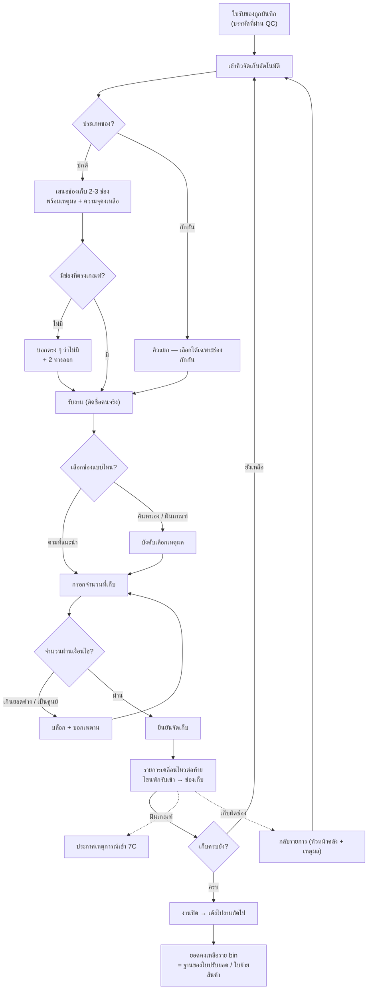
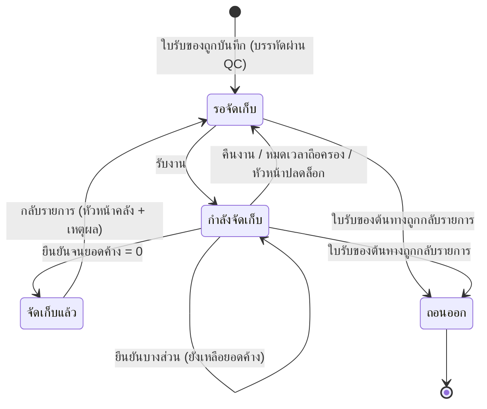

# BRD: Putaway — จัดเก็บเข้าที่

| ช่อง | ค่า |
|---|---|
| Feature code | `F-WH-PUTAWAY` (fid **F081**) |
| Module | Warehouse (คลังสินค้า) |
| Wave / Lane | **W3Q** ลำดับ 1 · pack `CUBE-LANE-W3-LITE` |
| ประเภท BRD | **New Feature** (Quality Gate C01–C23) |
| Architecture | **master/console — ไม่ใช่เอกสารธุรกรรม (ห้าม Pattern Q)** |
| Declarations | **`csq` เท่านั้น** — ไม่มี DOA · ไม่มี NTF · ไม่มีเลขรัน (doccfg) · ไม่มีเอกสารพิมพ์ (pdfdoc) |
| ต้นทางข้อมูล | `PREBRIEF_F-WH-PUTAWAY.md` · `BASELINE_F-WH-PUTAWAY.md` · `FUNCTION_CHECKLIST_F-WH-PUTAWAY.md` · ต้นแบบจริง `1_HTML/F-WH-PUTAWAY.html` (ผ่าน S3a/S3b/S3c) · `CSQ_BRIEF_F-WH-PUTAWAY.md` |
| วันที่ | 2026-09-10 (**ปี ค.ศ. ล้วนทั้งฉบับ**) |
| สถานะ | Phase A · รอทีม vibe ต้นแบบ แล้วเข้า Phase B |

## Changelog

| เวอร์ชัน | วันที่ | เปลี่ยนอะไร |
|---|---|---|
| 1.0 | 2026-09-10 | ฉบับแรก — สกัดจาก PREBRIEF + ต้นแบบ HTML ที่ผ่าน gate แล้ว |

---

# Section 2: Business Context

## 2.1 ปัญหา / โอกาส

วันนี้เมื่อของมาถึงคลัง ระบบรู้แค่ว่า "ของเข้ามาแล้วอยู่ที่คลังไหน" — ใบรับของ (GRN) บันทึกได้ลึกสุดแค่ **ระดับ location** ผลคือ:

| ปัญหา | ผลที่เกิดจริง |
|---|---|
| ของกองอยู่โซนพักรับเข้าโดยไม่มีใครรู้ว่าค้างนานแค่ไหน | ของ "มีในระบบ" แต่ "หยิบไม่เจอ" — งานเบิก/จัดหยิบสะดุด |
| คนคลังจำเองว่าของแต่ละหมวดควรอยู่โซนไหน | คนใหม่เก็บผิดที่ · คนเก่าลาแล้วความรู้หายไปด้วย |
| ไม่มียอดคงเหลือราย bin | นับสต๊อกทีต้องเดินทั้งคลัง · ตรวจนับหมุนเวียนทำไม่ได้ |
| ไม่รู้ว่าใครเก็บของชิ้นไหนไว้ตรงไหนเมื่อไหร่ | ของหายแล้วสืบไม่ได้ |
| ไม่มีโครงสร้าง bin กลาง | ใบปรับยอดสต๊อกและใบย้ายสินค้าที่กำลังจะทำ **จะนิยาม location กันเองคนละแบบ** → ยอดไม่ตรงกันทั้งระบบ |

**โอกาส:** ทำ "หน้าทำงานต่อเนื่อง" ที่คนคลังเปิดค้างไว้ทั้งกะ — ระบบเป็นคนบอกว่าควรเก็บที่ไหนและทำไม คนเป็นคนตัดสินใจสุดท้าย

## 2.2 เป้าหมายทาง Business

| # | เป้าหมาย |
|---|---|
| **G1** | ปิดช่องว่างระหว่าง "รับของแล้ว" กับ "ของพร้อมเบิก" — ของทุกชิ้นต้องมีที่อยู่จริงระดับ bin |
| **G2** | ย้ายความรู้เรื่องผังคลังจาก "หัวคน" มาเป็น **เกณฑ์ที่ตั้งค่าได้** — คนใหม่ทำงานได้ในวันแรก |
| **G3** | ได้ **ยอดคงเหลือราย bin** ที่เชื่อถือได้ เป็นฐานให้ใบปรับยอดสต๊อกและใบย้ายสินค้า |
| **G4** | ★ **นิยามสัญญากลางของ location** (คลัง › โซน › ช่องเก็บ + ประเภท 5 ชนิด) ให้ทั้งโมดูลคลังใช้ชุดเดียวกัน |
| **G5** | มองเห็นงานค้างและความเสี่ยง (ของค้างข้ามวัน · การเก็บที่ฝืนเกณฑ์) เป็นตัวเลข ไม่ใช่ความรู้สึก |

## 2.3 ตัวชี้วัดความสำเร็จ (Success Metrics)

| # | ตัวชี้วัด | Baseline | Target | วิธีวัด |
|---|---|---|---|---|
| **M1** | เวลาเฉลี่ยจาก "บันทึกรับของ" ถึง "ของอยู่ใน bin" | ยังไม่เคยวัด (ไม่มีข้อมูล) | **≤ 8 ชั่วโมงทำการ** | `เวลายืนยันจัดเก็บ − เวลาที่ใบรับของถูกบันทึก` เฉลี่ยรายสัปดาห์ (KPI-01) |
| **M2** | สัดส่วนงานที่ค้างเกินเกณฑ์ aging | ยังไม่เคยวัด | **≤ 5%** ของงานทั้งหมดต่อสัปดาห์ | นับงานที่ `อายุงานค้าง > เกณฑ์ NC rules` ณ สิ้นวัน (KPI-02) |
| **M3** | อัตราการเก็บที่ **ฝืนเกณฑ์** (override นอกกรอบ) | ยังไม่เคยวัด | **≤ 15%** และมีเหตุผลครบ **100%** | `รายการปลายทางที่ที่มา = เลือกเอง-ฝืนเกณฑ์ ÷ รายการปลายทางทั้งหมด` (KPI-03) |
| **M4** | ความถูกต้องของยอดราย bin เทียบการนับจริง | ยังไม่เคยวัด | **≥ 98%** ของ bin ที่สุ่มนับ | สุ่มนับ 20 bin/เดือน เทียบยอดในระบบ (KPI-04) |
| **M5** | อัตราการกลับรายการจัดเก็บ | ยังไม่เคยวัด | **≤ 2%** ของรายการที่จัดเก็บ | `movement ประเภทกลับรายการ ÷ movement ประเภทจัดเก็บ` (KPI-05) |

> ทุกตัวยังไม่มี baseline เพราะ **ไม่เคยมี feature นี้มาก่อน** — เดือนแรกหลัง go-live ถือเป็นเดือนเก็บ baseline แล้วล็อก target รอบถัดไป

## 2.4 ที่มาของ Requirement

| ที่มา | สาระ |
|---|---|
| `knowledge/CENTRAL_PLAN/BUILD_ORDER.md` | edge `F-WH-GRN → F-WH-PUTAWAY → {F-WH-STKADJ, F-WH-STKTRF}` — ตัวนี้ต้องปิดก่อนสองตัวหลัง |
| `briefs/W3Q/CHECKLIST.md` | master/console ห้าม Pattern Q · เก็บของจาก GRN เข้า bin/location · แนะนำ location (ว่าง/โซน/ประเภทสินค้า) + override ได้ · confirm รายการค้าง putaway · dec `csq` เท่านั้น · movement append-only · ทำก่อน StockAdj/Transfer |
| `PREBRIEF_F-WH-GRN.md` (OB-14 · §7 · §9) | GRN รับเข้าถึงระดับ location เท่านั้น · bin + putaway strategy = feature นี้ · GRN มี hook `putaway handoff` ค้างไว้ · GRN BR-16 กลับรายการไม่ได้ถ้าของถูก Putaway ไปแล้ว |
| `BASELINE_F-WH-PUTAWAY.md` | must-have 11 ข้อจาก SAP EWM / D365 SCM / Odoo / ERPNext / NetSuite · gap G-01..G-11 |
| `CONTEXT_PACK/W3-LITE.md` §3 | `OQ-GRN-01` quarantine · `OQ-TRF-01` in-transit — สืบทอดเป็น `[ASSUMED]` |
| ต้นแบบจริง `1_HTML/F-WH-PUTAWAY.html` | Screen Inventory + UI signal ใน §14.6 สกัดจากไฟล์นี้ (ผ่าน S3a/S3b/S3c แล้ว) |

---

# Section 3: Scope

## 3.1 In Scope

| # | ขอบเขต | อ้าง |
|---|---|---|
| **IS-01** | **คิวงานค้างจัดเก็บ** — สร้างอัตโนมัติจากใบรับของที่บันทึกแล้ว เฉพาะบรรทัดที่ผ่านการตรวจคุณภาพ | S-01 · BR-02 |
| **IS-02** | **สัญญากลางของ location** — คลัง › โซน › ช่องเก็บ + ประเภท 5 ชนิด (พักรับเข้า · เก็บปกติ · กักกัน · ระหว่างทาง · ของเสีย) | PREBRIEF §3.0 |
| **IS-03** | **เกณฑ์แนะนำช่องเก็บ** — กรองออก 5 เงื่อนไข + จัดอันดับ 4 ชั้น + ตัวคั่นเมื่อคะแนนเท่ากัน พร้อม **แสดงเหตุผลที่แนะนำ** | §3.5 · BR-06/BR-07 |
| **IS-04** | **เลือกช่องเก็บเอง (override)** ได้ทุกเมื่อ · ฝืนเกณฑ์ต้องระบุเหตุผลจากรายการมาตรฐาน | BR-10/BR-11 |
| **IS-05** | **ยืนยันจัดเก็บ** ทีละงาน → เกิดรายการเคลื่อนไหวแบบต่อท้ายอย่างเดียว → เด้งไปงานถัดไป | BR-16 |
| **IS-06** | **เก็บบางส่วน** และ **แบ่งเก็บหลายช่องในครั้งเดียว** | BR-12/BR-14 |
| **IS-07** | **ความจุช่องเก็บ** เป็นเกณฑ์แนะนำ — เกินได้แต่ต้องเตือนและระบุเหตุผล | BR-15 |
| **IS-08** | **ของกักกันแยกคิว** — เก็บได้เฉพาะช่องประเภทกักกัน · ออกได้ทางเดียวคือใบคืนผู้ขาย | BR-04 |
| **IS-09** | **การถือครองงาน** — รับงาน / คืนงาน / ปลดล็อกโดยหัวหน้าคลัง (soft lock) | BR-18 |
| **IS-10** | **มุมมองผังช่องเก็บ** — คลัง › โซน › ช่องเก็บ กางดูยอดคงเหลือราย bin · ล็อก/ปลดล็อกช่อง | BR-08 |
| **IS-11** | **มุมมองประวัติ** — รายการเคลื่อนไหวทั้งหมด กางดูเหตุผล/ที่มาการเลือก · **กลับรายการจัดเก็บ** (หัวหน้าคลัง + เหตุผลบังคับ) | BR-17 |
| **IS-12** | **ผู้จัดเก็บเป็นคนจริง** (ชื่อ + ตำแหน่ง + แผนก) ห้ามเป็นรหัสบทบาท | BR-24 |
| **IS-13** | **ประกาศผลกระทบ 7C** 2 เหตุการณ์ผ่านใบประกาศ (ไม่คำนวณผลเองในหน้าจอ) | CSQ_BRIEF |

## 3.2 Out of Scope

| # | ไม่ทำ | เหตุผล |
|---|---|---|
| **OS-01** | ออกเอกสาร / เลขรัน / ไฟล์พิมพ์ / ช่องลงลายเซ็น | **Putaway ไม่ใช่เอกสาร** — ERP มาตรฐานก็ไม่ออกใบ (BASELINE §1) · chip ไม่มี doccfg/pdfdoc |
| **OS-02** | สายอนุมัติ (DOA) | เป็นงาน execution ไม่ใช่การอนุมัติ · chip ไม่มี doa |
| **OS-03** | แจ้งเตือนอัตโนมัติ | chip ไม่มี ntf รอบนี้ — ถ้าอนาคตต้องเตือนงานค้าง ให้ประกาศที่ศูนย์แจ้งเตือนกลาง |
| **OS-04** | ปรับยอดคงเหลือด้วยมือ | = **F-WH-STKADJ** |
| **OS-05** | ย้ายของหลังเก็บเข้าช่องแล้ว / ข้ามคลัง | = **F-WH-STKTRF** |
| **OS-06** | คืนของผู้ขาย (ของกักกัน) | = **F-PUR-RTV** (ปิดแล้ว) |
| **OS-07** | ล็อต/ซีเรียล/วันหมดอายุ · พาเลท/หน่วยขนถ่าย · cross-dock · จัดผังตามความเร็วขาย · เส้นทางเดิน | backlog (BASELINE N-02..N-07) — ยังไม่มี master รองรับในเลนนี้ |
| **OS-08** | ยิงบาร์โค้ด / เครื่อง RF จริง | รอบนี้เป็นหน้าจอ desktop · **เผื่อช่องค้นหาไว้แล้ว** แต่ไม่ผูกอุปกรณ์ |
| **OS-09** | Putaway จากแหล่งอื่นที่ไม่ใช่ใบรับของ (ของคืนจากลูกค้า · ผลิตเสร็จ) | W3 มีแหล่งเดียวคือ GRN — ของที่โผล่มาเองใช้ใบปรับยอดสต๊อก |
| **OS-10** | ลงบัญชีจริง | putaway ย้ายภายในคลังเดียวกัน ไม่กระทบมูลค่ารวม · การลงบัญชี = W5 (`TODO: JE posting`) |

## 3.3 Assumptions

| # | ข้อสมมติ | ผลถ้าผิด |
|---|---|---|
| **AS-01** | ผังคลัง (โซน/ช่องเก็บ/ความจุ/หมวดที่โซนรับ) ถูกตั้งค่าไว้ก่อนใช้งาน | ไม่มีข้อเสนอช่องเก็บ — ระบบตกไปเกณฑ์ท้ายสุด (ช่องว่างที่ใกล้จุดรับเข้าที่สุด) |
| **AS-02** | ใบรับของบันทึกจำนวนที่ผ่านการตรวจคุณภาพไว้แล้ว | คิวได้จำนวนผิด → ต้องกลับไปแก้ที่ใบรับของ ไม่ใช่แก้ที่นี่ |
| **AS-03** | 1 งาน = 1 บรรทัดของใบรับของ (ไม่รวมข้ามใบ) | trace กลับไม่ตรงไปตรงมา |
| **AS-04** | คนคลัง 1 คนถือ 1 งานในเวลาเดียว | ของถูกเก็บซ้ำสองรอบ |
| **AS-05** | หน่วยนับไม่ต้องแปลง (เก็บด้วยหน่วยเดียวกับที่รับเข้า) | ต้องเพิ่มตัวแปลงหน่วย (ไม่อยู่รอบนี้) |

## 3.4 Scope Lock

| # | LOCK | ต้นทาง | ผลผูกพัน |
|---|---|---|---|
| **LOCK-01** | **arch = master/console — ห้าม Pattern Q** (ห้าม wizard · ห้าม view drawer แท็บเอกสาร · ห้ามไฟล์พิมพ์) | `CONTEXT_PACK/W3-LITE.md` §2.1 · `FEATURE_LIST_ALL` F081 = `master` | ต้นแบบพิสูจน์เชิงกลแล้ว: `static_scan.doc_archetype` ทุก flag = false |
| **LOCK-02** | **Declarations = `csq` เท่านั้น** | `CONTEXT_PACK` §2.2 · chip ของ F081 | ห้ามออก DOA/NTF/DOCCFG brief และห้ามมี print spec |
| **LOCK-03** | **รายการเคลื่อนไหวต่อท้ายอย่างเดียว** — ยกเลิกได้ทางเดียวคือกลับรายการ ไม่มีการลบถาวร | `CONTEXT_PACK` §2.8 · GOLDEN_RULES §4 | §9.1 R14/R15 |
| **LOCK-04** | **Master = ตัวเลือกแบบค้นหา ไม่ผูก FK · เว้นว่างได้** (LD-4C-02) | GOLDEN_RULES §4 · TASTE_LOG | §6 ทุก entity |
| **LOCK-05** | **ปี ค.ศ. ล้วน** + CI CUBE Warm Light + เมนูตาม module map กลาง | GOLDEN_RULES §1 · TASTE_LOG | §14.6 |
| **LOCK-06** | **`OQ-GRN-01`** ของที่ตรวจคุณภาพไม่ผ่าน อยู่โซนกักกัน · ออกทางเดียวคือคืนผู้ขาย | `CONTEXT_PACK` §3 · GRN BR-10 | §9.1 R04 |
| **LOCK-07** | **`OQ-TRF-01`** การย้ายข้ามสาขาผ่าน location ประเภท **ระหว่างทาง** — Putaway **จองประเภทนี้ไว้ แต่ห้ามเขียน** | `CONTEXT_PACK` §3 | §9.1 R05 · §6.2 |
| **LOCK-08** | **ต้องปิดก่อน F-WH-STKADJ และ F-WH-STKTRF** และสองตัวนั้นต้องใช้สัญญา location ของ BRD ฉบับนี้ | BUILD_ORDER edges · CHECKLIST W3Q | §12.1 |

> **Scope Drift = ไม่มี** — ยืนยันด้วย `_COVERAGE_R1.md` §5 (scope creep = 0: ไม่แตะ location ประเภทระหว่างทาง/ของเสีย · ไม่มีช่องแก้ยอด · ไม่มีปุ่มสร้างงานเอง)
> chain ใบเซ็นลูกค้า = **N/A** — เลนภายใน ต้นทางคือ Central Plan + CHECKLIST ไม่ใช่เอกสารเซ็นจากลูกค้า

---

# Section 4: User Roles & Permissions

## 4.1 Roles ที่เกี่ยวข้อง

| Role | ใครคือคนนี้ | สนใจอะไร |
|---|---|---|
| **เจ้าหน้าที่คลัง (ผู้จัดเก็บ)** | คนที่ถือของเดินไปวางจริง | งานค้างของคลังตัวเอง · ควรเก็บที่ไหน · เก็บเสร็จเร็วที่สุด |
| **หัวหน้าคลัง** | ผู้ดูแลกะ | งานค้างทั้งคลัง · งานที่ค้างในมือคนอื่น · การเก็บที่ฝืนเกณฑ์ · การกลับรายการ |
| **ผู้ดูแลผังคลัง** | คนตั้งค่าโซน/ช่องเก็บ/ความจุ | ผังถูกต้องไหม · หมวดสินค้าไหนยังไม่มีโซน |
| **ผู้ตรวจคุณภาพ** | คนบันทึกผลตรวจที่ใบรับของ | ของกักกันถูกเก็บแยกจริงไหม |
| **จัดซื้อ / บัญชี** | ผู้ใช้ปลายทาง | ยอดคงเหลือราย bin (อ่านอย่างเดียว) |
| **ผู้ดูแลระบบ** | IT | ประวัติแบบต่อท้ายอย่างเดียว |

> **ไม่มี role "ผู้อนุมัติ Putaway" โดยเจตนา** (LOCK-02)

## 4.2 Permission Matrix

| Action | จนท.คลัง | หัวหน้าคลัง | ผู้ดูแลผัง | QC | จัดซื้อ/บัญชี | ผู้ดูแลระบบ |
|---|---|---|---|---|---|---|
| ดูคิวงานค้าง (คลังตัวเอง) | ✅ | ✅ ทุกคลัง | ✅ | ✅ เฉพาะคิวกักกัน | ⬜ | ✅ |
| รับงาน / คืนงาน | ✅ | ✅ | ⬜ | ⬜ | ⬜ | ⬜ |
| ปลดล็อกงานของคนอื่น | ⬜ | ✅ | ⬜ | ⬜ | ⬜ | ⬜ |
| เลือกช่องเก็บ / override | ✅ | ✅ | ⬜ | ⬜ | ⬜ | ⬜ |
| ยืนยันจัดเก็บ | ✅ | ✅ | ⬜ | ⬜ | ⬜ | ⬜ |
| **กลับรายการจัดเก็บ** | ⬜ | ✅ | ⬜ | ⬜ | ⬜ | ⬜ |
| ล็อก / ปลดล็อกช่องเก็บ | ⬜ | ✅ | ✅ | ⬜ | ⬜ | ⬜ |
| แก้ผังคลัง / ความจุ / หมวดที่โซนรับ | ⬜ | ⬜ | ✅ | ⬜ | ⬜ | ⬜ |
| ดูยอดคงเหลือราย bin | ✅ | ✅ | ✅ | ✅ | ✅ | ✅ |
| ดูประวัติทั้งหมด | ✅ คลังตัวเอง | ✅ | ✅ | ⬜ | ✅ | ✅ |
| ลบข้อมูลใด ๆ | ⬜ | ⬜ | ⬜ | ⬜ | ⬜ | ⬜ **ไม่มีใครลบได้** |

---

# Section 5: User Journey (with COSO)

## 5.1 Happy Path — ของถึงโซนพักรับเข้า → เก็บลงช่อง → ของพร้อมเบิก

| # | ขั้นตอน | ผู้ทำ | บทบาท COSO |
|---|---|---|---|
| 1 | ใบรับของถูกบันทึก → บรรทัดที่ผ่านการตรวจคุณภาพเข้าคิวจัดเก็บอัตโนมัติ | ระบบ | **System** (ควบคุมอัตโนมัติ — คนสร้างงานเองไม่ได้) |
| 2 | เจ้าหน้าที่คลังเปิดหน้าจอ เห็นคิวเรียงตามงานที่ค้างนานสุด + ตัวเลขงานค้าง | จนท.คลัง | Maker |
| 3 | เลือกงาน → ระบบเสนอช่องเก็บ 2–3 ช่อง **พร้อมเหตุผลและความจุคงเหลือ** | ระบบ | **System** (ควบคุมเชิงป้องกัน — คนไม่ต้องจำผัง) |
| 4 | กด "รับงาน" → งานติดชื่อคนจริง คนอื่นเห็นว่าถูกจองแล้ว | จนท.คลัง | Maker (ระบุตัวตน) |
| 5 | เลือกช่องตามที่แนะนำ **หรือ** ค้นหาช่องเอง | จนท.คลัง | Maker |
| 6 | ถ้าฝืนเกณฑ์ → ระบบบังคับเลือกเหตุผลก่อน | ระบบ | **System** (ควบคุมเชิงตรวจจับ) |
| 7 | กรอกจำนวนที่เก็บ — ระบบแสดง "คงค้างหลังครั้งนี้" ตลอดเวลา | จนท.คลัง | Maker |
| 8 | เพิ่มปลายทางได้ถ้าต้องแบ่งเก็บหลายช่อง | จนท.คลัง | Maker |
| 9 | เลือกผู้จัดเก็บ (คนจริง) ที่จะถูกบันทึกลงรายการเคลื่อนไหว | จนท.คลัง | Maker |
| 10 | กด **ยืนยันจัดเก็บ** | จนท.คลัง | Maker |
| 11 | ระบบตรวจเงื่อนไขทั้งหมดอีกครั้ง → สร้างรายการเคลื่อนไหวแบบต่อท้าย 1 รายการต่อ 1 ปลายทาง | ระบบ | **System** (ควบคุมก่อนบันทึก) |
| 12 | ยอดคงเหลือของช่องเก็บเพิ่มขึ้นทันที · โซนพักรับเข้าลดลง | ระบบ | System |
| 13 | ถ้าเก็บครบ → งานปิด และหน้าจอเด้งไปงานถัดไปอัตโนมัติ | ระบบ | System |
| 14 | ถ้ามีการเก็บที่ฝืนเกณฑ์ → ประกาศเหตุการณ์เข้าเครื่องประเมินผลกระทบ 7C | ระบบ | **System** (ประกาศเท่านั้น ไม่ประเมินเอง) |
| 15 | หัวหน้าคลังดูตัวเลข "ฝืนเกณฑ์" และ "ค้างเกินเกณฑ์" ในแถบบน | หัวหน้าคลัง | **Checker** (ควบคุมภายหลัง) |

## 5.2 Alternative Paths

### 5.2.1 เก็บบางส่วน (ช่องเก็บไม่พอ)
เก็บเท่าที่ช่องรับได้ → งานยังอยู่ในคิวด้วยยอดที่เหลือ → เก็บต่อได้ไม่จำกัดรอบ (ไม่ต้องเปิดงานใหม่)

### 5.2.2 ไม่มีช่องเก็บที่ตรงเกณฑ์
ระบบ **บอกตรง ๆ ว่าไม่มี** พร้อมเหตุผลที่ถูกกรองออก (เต็ม / ล็อก / ห้ามปนสินค้า / ผิดประเภท) + เสนอ 2 ทางออก: ปล่อยค้างคิว หรือค้นหาช่องเองแล้วระบุเหตุผล — **ห้ามเสนอช่องที่ถูกกรองออกเด็ดขาด**

### 5.2.3 ของที่ตรวจคุณภาพไม่ผ่าน
อยู่คิวแยก มีป้ายชัด · ตัวเลือกปลายทางถูกจำกัดเหลือเฉพาะช่องประเภทกักกัน · ทางออกจริงคือใบคืนผู้ขาย

### 5.2.4 เก็บผิดช่อง (รู้ตัวภายหลัง)
- ยังไม่ถูกใช้ต่อ → **หัวหน้าคลังกลับรายการ** (เหตุผลบังคับ) → เกิดรายการตรงข้าม รายการเดิมยังอยู่ → งานกลับเข้าคิว
- ถูกใช้ต่อแล้ว → ใช้ **ใบย้ายสินค้า** ย้ายจากช่องเดิมไปช่องใหม่ (ไม่ใช่การแก้ประวัติ)

### 5.2.5 ใบรับของต้นทางถูกกลับรายการ
งานที่ยังไม่เก็บถูกถอนออกจากคิวอัตโนมัติ + ป้ายบอกเหตุ · งานที่เก็บไปแล้วทำให้ใบรับของกลับรายการไม่ได้ (กติกาฝั่ง GRN)

## 5.3 Process Diagram



---

# Section 6: Data Entity & Fields

## 6.1 Entity Overview

| Entity | หน้าที่ | เจ้าของ |
|---|---|---|
| `Warehouse` · `Zone` · `Bin` | **สัญญากลางของ location** — โครง 3 ระดับ + ประเภท 5 ชนิด | ผังคลัง (config) — **ใช้ร่วมกับ F-WH-STKADJ / F-WH-STKTRF** |
| `Putaway_Task` | 1 งาน = 1 บรรทัดของใบรับของที่รอเก็บ | feature นี้ |
| `Putaway_Dest` | ปลายทางที่จะเก็บ (1 งานมีได้หลายแถว = แบ่งเก็บ) | feature นี้ |
| `Inv_Movement` | รายการเคลื่อนไหวคลัง **ต่อท้ายอย่างเดียว** | ส่วนกลางของโมดูลคลัง |
| `Bin_Stock` | ยอดคงเหลือราย (ช่องเก็บ, สินค้า) — **ค่าที่คำนวณจากรายการเคลื่อนไหว ไม่มีตารางที่แก้มือได้** | ส่วนกลาง |
| `Putaway_Audit` | ประวัติทุกการกระทำ ต่อท้ายอย่างเดียว | feature นี้ |

## 6.2 Entity: `Zone` / `Bin` — ★ สัญญากลาง (LOCK-07/LOCK-08)

**`Zone`**

| Field | ชนิด | บังคับ | Default | ที่มา | Validation |
|---|---|---|---|---|---|
| `warehouse_ref` | อ้างอิงแบบหลวม | ✅ | — | ทะเบียนคลัง | ตัวเลือกแบบค้นหา ไม่ผูก FK |
| `zone_code` | ข้อความสั้น | ✅ | — | ผู้ดูแลผัง | ไม่ซ้ำภายในคลัง |
| `zone_name` | ข้อความ | ✅ | — | ผู้ดูแลผัง | — |
| **`location_type`** | รายการค่าคงที่: `พักรับเข้า / เก็บปกติ / กักกัน / ระหว่างทาง / ของเสีย` | ✅ | `เก็บปกติ` | ผู้ดูแลผัง | **ค่านี้เป็นสัญญาข้ามฟีเจอร์ — ห้ามเพิ่ม/เปลี่ยนชื่อโดยฟีเจอร์เดียว** |
| `accept_categories` | รายการหมวดสินค้า (หลายค่า) | ⬜ | ว่าง | ผู้ดูแลผัง | **ว่าง = รับทุกหมวด** |
| `near_rank` | เลข (1 = ใกล้จุดรับเข้าที่สุด) | ⬜ | — | ผู้ดูแลผัง | ใช้เป็นเกณฑ์อันดับ 4 |
| `is_open` | ใช่/ไม่ | ✅ | ใช่ | ผู้ดูแลผัง | ปิด = ช่องทั้งโซนไม่เข้ารายการแนะนำ |

**`Bin`**

| Field | ชนิด | บังคับ | Default | ที่มา | Validation |
|---|---|---|---|---|---|
| `bin_code` | ข้อความ | ✅ | — | ผู้ดูแลผัง | ไม่ซ้ำในคลัง · รูปแบบ `<โซน>-<แถว>-<ช่อง>-<ชั้น>` |
| `zone_ref` | อ้างอิงแบบหลวม | ✅ | — | `Zone` | — |
| `location_type` | เหมือน `Zone` | ✅ | สืบจากโซน | ผู้ดูแลผัง | แก้ต่างจากโซนได้ (ช่องพิเศษ) |
| `capacity_max` | จำนวน + หน่วย | ⬜ | ว่าง | ผู้ดูแลผัง | **ว่าง = ไม่จำกัด** |
| `capacity_used` | จำนวน (คำนวณ) | — | 0 | จาก `Bin_Stock` | อ่านอย่างเดียว |
| `capacity_free` | จำนวน (คำนวณ) | — | — | `max − used` | อ่านอย่างเดียว |
| `allow_mixed` | ใช่/ไม่ | ✅ | ใช่ | ผู้ดูแลผัง | ไม่ = ช่องที่มีสินค้าอื่นอยู่จะไม่เข้ารายการแนะนำ |
| `bin_status` | `ว่าง / มีของ / เต็ม / ล็อก` | ✅ | `ว่าง` | คำนวณ + ตั้งมือ | `ล็อก` ทับทุกกรณี |
| `lock_reason` | ข้อความ | ✅ เมื่อ `ล็อก` | — | หัวหน้าคลัง / ผู้ดูแลผัง | แสดงตอนค้นเจอแต่เลือกไม่ได้ |
| `walk_row` / `walk_col` / `walk_level` | เลข | ⬜ | — | ผู้ดูแลผัง | ใช้เรียงลำดับการเดินเก็บ |

**กติกาข้ามประเภท (บังคับทุกฟีเจอร์ในโมดูลคลัง)**

| ประเภท | นับเป็นของใช้/ขายได้ | Putaway เก็บเข้าได้ | Putaway ดึงออกได้ | ใครเขียนได้ |
|---|---|---|---|---|
| พักรับเข้า | ✅ | ❌ (เป็นต้นทาง) | ✅ | GRN (ขาเข้า) · Putaway (ขาออก) |
| เก็บปกติ | ✅ | ✅ | ❌ | Putaway · ใบปรับยอด · ใบย้ายสินค้า |
| กักกัน | ❌ | ✅ เฉพาะของที่มาจากกักกัน | ✅ ไปกักกันด้วยกัน | GRN · Putaway · ใบคืนผู้ขาย |
| **ระหว่างทาง** | ✅ | ❌ | ❌ | **ใบย้ายสินค้าเท่านั้น** |
| ของเสีย | ❌ | ❌ | ❌ | **ใบปรับยอดเท่านั้น** |

## 6.3 Entity: `Putaway_Task`

| Field | ชนิด | บังคับ | Default | ที่มา | Validation |
|---|---|---|---|---|---|
| `task_id` | ข้อความ (ภายใน) | ✅ | auto | ระบบ | **ไม่ใช่เลขที่เอกสาร ห้ามแสดงเป็นเลขใบ ห้ามผูกเลขรัน** |
| `grn_ref` · `grn_line_no` | อ้างอิงแบบหลวม | ✅ | — | ใบรับของที่บันทึกแล้ว | ผูกกลับได้เสมอ |
| `item_ref` · `item_category` | อ้างอิงแบบหลวม + ข้อความ | ✅ / ⬜ | — | ทะเบียนสินค้า | หมวดว่างได้ → ใช้เกณฑ์อันดับ 4 |
| `qty_required` | จำนวน | ✅ | — | จำนวนที่ผ่านการตรวจคุณภาพ | > 0 |
| `qty_done` | จำนวน (คำนวณ) | — | 0 | Σ รายการเคลื่อนไหวของงานนี้ | ≥ 0 |
| `qty_remain` | จำนวน (คำนวณ) | — | = `qty_required` | `required − done` | = 0 → งานปิด |
| `uom_ref` | อ้างอิงแบบหลวม | ✅ | — | ทะเบียนหน่วยนับ | ไม่แปลงหน่วยรอบนี้ |
| `source_location_ref` | อ้างอิงแบบหลวม | ✅ | — | location ที่ใบรับของรับเข้า | ต้องเป็นประเภท พักรับเข้า หรือ กักกัน |
| `queue_kind` | `ปกติ / กักกัน` (คำนวณ) | ✅ | คำนวณจากประเภทต้นทาง | ระบบ | กักกัน = คิวแยก |
| `task_status` | `รอจัดเก็บ / กำลังจัดเก็บ / จัดเก็บแล้ว / ถอนออก` | ✅ | `รอจัดเก็บ` | ระบบ | ตาม §8 เท่านั้น |
| `holder_ref` | ผู้ใช้ (**คนจริง** — ชื่อ + ตำแหน่ง + แผนก) | ✅ เมื่อ `กำลังจัดเก็บ` | ผู้กดรับงาน | ทะเบียนพนักงาน | **ห้ามเป็นรหัสบทบาท** |
| `queued_at` | วันที่-เวลา (**ค.ศ.**) | ✅ | เวลาที่ใบรับของถูกบันทึก | ระบบ | อ่านอย่างเดียว |
| `age_hours` | ระยะเวลา (คำนวณ) | — | — | `ตอนนี้ − queued_at` | เกณฑ์เตือนอยู่ใน NC rules |
| `note` | ข้อความยาว | ⬜ | — | ผู้ใช้ | — |

## 6.4 Entity: `Putaway_Dest` · `Inv_Movement` · `Bin_Stock` · `Putaway_Audit`

**`Putaway_Dest`** (มีอยู่ระหว่างกรอก — ยืนยันแล้วกลายเป็น `Inv_Movement`)

| Field | ชนิด | บังคับ | Validation |
|---|---|---|---|
| `bin_ref` | อ้างอิงแบบหลวม | ✅ | ประเภทต้องเข้ากันได้กับต้นทาง · ช่องที่ล็อกเลือกไม่ได้ · ต้องอยู่คลังเดียวกับต้นทาง |
| `selection_source` | `แนะนำอันดับ 1 / แนะนำอันดับรอง / เลือกเอง` | ✅ | ระบบกำหนดเอง ผู้ใช้แก้ไม่ได้ |
| `qty` | จำนวน | ✅ | `> 0` · **Σ ทุกแถว ≤ `qty_remain`** |
| `override_reason` | รายการค่าคงที่ + ข้อความเพิ่ม | ✅ เมื่อฝืนเกณฑ์ | เลือก "อื่น ๆ" ต้องพิมพ์ข้อความ |
| `violation_kind` | `นอกรายการแนะนำ / ข้ามหมวดโซน / เกินความจุ` (คำนวณ) | — | ใช้แยกชนิดผลกระทบตอนประกาศ 7C |

**`Inv_Movement`** — `movement_id` · `kind` (`จัดเก็บ / กลับรายการ`) · `item_ref` · `qty` · `from_location_ref` · `to_location_ref` · `actor_ref` (คนจริง) · `occurred_at` (**ค.ศ.**) · `task_ref` · `grn_ref` · `grn_line_no` · `selection_source` · `reason` · `note` · `reversal_of` · `reversed_by`
> **ต่อท้ายอย่างเดียว** — ไม่มี update/delete · กลับรายการ = แถวใหม่ที่ผูกคู่กับแถวเดิมทั้งสองทาง

**`Bin_Stock`** — `bin_ref` · `item_ref` · `qty` — **ค่าที่คำนวณจากรายการเคลื่อนไหว** ไม่มีหน้าจอแก้มือ (การแก้ยอด = ใบปรับยอดสต๊อกเท่านั้น)

**`Putaway_Audit`** — ทุกการ รับงาน / คืนงาน / ปลดล็อก / ยืนยัน (พร้อมปลายทาง จำนวน ที่มาการเลือก เหตุผล) / กลับรายการ / ล็อก-ปลดล็อกช่อง — **ต่อท้ายอย่างเดียว ไม่มีการลบ**

## 6.5 Entity Relationship

```
Warehouse 1 ── n Zone 1 ── n Bin 1 ── n Bin_Stock ── 1 Item[หลวม]
                                  │
GRN[หลวม] 1 ── n Putaway_Task 1 ── n Inv_Movement ── n Bin (ปลายทาง)
                     │                     │
                     └── n Putaway_Dest    └── 1:1 คู่กลับรายการ (reversal_of / reversed_by)
Putaway_Task 1 ── n Putaway_Audit
```
- ความสัมพันธ์ข้ามฟีเจอร์ (ใบรับของ · สินค้า · หน่วยนับ · พนักงาน) เป็น **อ้างอิงแบบหลวม** ทั้งหมด ไม่ผูก FK และเว้นว่างได้ (LOCK-04)
- `Zone`/`Bin` เป็น **ของกลางของโมดูลคลัง** — F-WH-STKADJ และ F-WH-STKTRF ต้องอ่านชุดนี้ ห้ามสร้างโครงใหม่ (LOCK-08)

---

# Section 7: User Stories & Acceptance Criteria

| Story | คำบรรยาย | Acceptance Criteria |
|---|---|---|
| **S-01** | ในฐานะเจ้าหน้าที่คลัง ฉันเปิดหน้าจอแล้วเห็นคิวงานค้างจัดเก็บทันที | เปิดหน้าจอแล้วเห็นคิว โดยไม่ต้องกดสร้างอะไร · ไม่มีปุ่มสร้างเอกสารในหน้าจอ |
| **S-02** | ในฐานะเจ้าหน้าที่คลัง ฉันรู้ว่างานแต่ละชิ้นมาจากใบรับของไหน | ทุกแถวในคิวแสดงเลขใบรับของ เลขบรรทัด สินค้า จำนวน ต้นทาง · กดเปิดใบรับของต้นทางได้ |
| **S-03** | ในฐานะเจ้าหน้าที่คลัง ฉันได้รับข้อเสนอช่องเก็บทันทีที่เลือกงาน | เลือกงานแล้วเห็นการ์ดช่องเก็บ 2–3 ใบ ทุกใบมีเหตุผลที่แนะนำและความจุคงเหลือ |
| **S-04** | ในฐานะเจ้าหน้าที่คลัง ฉันเลือกช่องเก็บอื่นได้เสมอ | ปุ่มค้นหาช่องเก็บเปิดทุกสถานะ · เลือกช่องที่ไม่ได้แนะนำได้ |
| **S-05** | ในฐานะหัวหน้าคลัง ฉันรู้ว่าการเก็บครั้งไหนฝืนเกณฑ์ | เลือกช่องนอกกรอบเกณฑ์แล้วระบบบังคับเลือกเหตุผลก่อนยืนยัน · ประวัติกรองดูเฉพาะรายการที่ฝืนเกณฑ์ได้ |
| **S-06** | ในฐานะเจ้าหน้าที่คลัง ฉันเก็บบางส่วนได้เมื่อช่องไม่พอ | ยืนยันจำนวนน้อยกว่ายอดค้างแล้วงานยังอยู่ในคิวด้วยยอดที่เหลือถูกต้อง |
| **S-07** | ในฐานะเจ้าหน้าที่คลัง ฉันแบ่งเก็บหลายช่องในครั้งเดียวได้ | เพิ่มปลายทางได้หลายแถว · ยืนยันแล้วเกิดรายการเคลื่อนไหวแยกต่อช่อง |
| **S-08** | ในฐานะระบบ ฉันกันไม่ให้เก็บเกินยอดที่ค้างอยู่ | กรอกรวมเกินยอดค้าง หรือเป็นศูนย์ หรือติดลบ แล้วปุ่มยืนยันถูกปิดพร้อมบอกเหตุ |
| **S-09** | ในฐานะผู้ตรวจคุณภาพ ฉันมั่นใจว่าของกักกันไม่หลุดไปช่องขายได้ | คิวกักกันแยกชัด · ตัวเลือกปลายทางเหลือเฉพาะช่องประเภทกักกัน |
| **S-10** | ในฐานะหัวหน้าคลัง ฉันล็อกช่องเก็บที่ใช้ไม่ได้ | ล็อกช่องพร้อมเหตุผลบังคับ · ช่องที่ล็อกหายจากรายการแนะนำ · ค้นเจอแต่เลือกไม่ได้พร้อมบอกเหตุผล |
| **S-11** | ในฐานะเจ้าหน้าที่คลัง ฉันจองงานไว้กันคนอื่นทำซ้ำ | รับงานแล้วงานติดชื่อคนจริง · คนอื่นกดรับไม่ได้พร้อมเห็นว่าใครถืออยู่ |
| **S-12** | ในฐานะหัวหน้าคลัง ฉันปลดงานที่ค้างในมือคนอื่นได้ | ปลดล็อกแล้วงานกลับเข้าคิว โดยไม่เกิดรายการเคลื่อนไหว |
| **S-13** | ในฐานะหัวหน้าคลัง ฉันกลับรายการที่เก็บผิดช่องได้ | กลับรายการต้องกรอกเหตุผล · เกิดรายการตรงข้าม · รายการเดิมยังอยู่ในประวัติ · งานกลับเข้าคิว |
| **S-14** | ในฐานะผู้ดูแลระบบ ฉันมั่นใจว่าไม่มีใครลบประวัติได้ | ไม่มีปุ่มลบรายการเคลื่อนไหวในหน้าจอ · ไม่มีปุ่มแก้ช่องปลายทางหลังยืนยัน |
| **S-15** | ในฐานะเจ้าหน้าที่คลัง ฉันเห็นยอดคงเหลือของแต่ละช่องเก็บ | มุมมองผังช่องเก็บกางดูสินค้าและจำนวนในแต่ละช่องได้ · ยอดเปลี่ยนทันทีหลังยืนยัน |
| **S-16** | ในฐานะเจ้าหน้าที่คลัง ฉันรู้ทันทีเมื่อไม่มีช่องเก็บที่เหมาะสม | ระบบแสดงข้อความว่าไม่มีช่องที่ตรงเกณฑ์ พร้อมเหตุผลและทางออก · ไม่เสนอช่องที่ถูกกรองออก |
| **S-17** | ในฐานะหัวหน้าคลัง ฉันเห็นงานที่ค้างนานผิดปกติ | งานที่ค้างเกินเกณฑ์มีป้ายเตือนและถูกเรียงขึ้นบนสุด · ตัวเลขงานค้างเกินเกณฑ์อยู่ในแถบบน |
| **S-18** | ในฐานะผู้ดูแลผังคลัง ฉันรู้ว่าหมวดสินค้าไหนยังไม่มีโซนรองรับ | สินค้าที่หมวดไม่ตรงโซนใดเลยขึ้นป้ายเตือนให้ไปตั้งค่าผัง |
| **S-19** | ในฐานะเจ้าของฟีเจอร์ถัดไป ฉันได้โครงสร้าง location ที่ใช้ต่อได้ทันที | มุมมองผังแสดงประเภท location ครบ 5 ชนิด รวม "ระหว่างทาง" ที่สงวนให้ใบย้ายสินค้า · มีปุ่มส่งต่อไปใบปรับยอดและใบย้ายสินค้า |
| **S-20** | ในฐานะบัญชี ฉันมั่นใจว่าการจัดเก็บไม่ทำให้มูลค่าคลังเปลี่ยน | หน้าจอมีป้ายระบุว่าไม่กระทบบัญชี · ไม่มีการลงบัญชีจริงเกิดขึ้น |

> ทุก story **ไม่มีคำว่า "และ" ในคำบรรยาย** (ตรวจแล้วทุกแถว) และตัดสินผ่าน/ไม่ผ่านได้ด้วยตาบนต้นแบบ

---

# Section 8: Status & Lifecycle

## 8.1 State Diagram



## 8.2 State Transition Table

| จาก | ไป | ใครกด | เงื่อนไข | Story |
|---|---|---|---|---|
| — | รอจัดเก็บ | ระบบ | ใบรับของบันทึกแล้ว + บรรทัดผ่านการตรวจคุณภาพ จำนวน > 0 | S-01 |
| รอจัดเก็บ | กำลังจัดเก็บ | จนท.คลัง | ยังไม่มีใครถือครอง | S-11 |
| กำลังจัดเก็บ | รอจัดเก็บ | จนท.คลัง / ระบบ / หัวหน้าคลัง | คืนงาน หรือหมดเวลาถือครอง หรือถูกปลดล็อก — **ไม่เกิดรายการเคลื่อนไหว** | S-12 |
| กำลังจัดเก็บ | กำลังจัดเก็บ | จนท.คลัง | ยืนยันแล้วยังเหลือยอดค้าง | S-06 |
| กำลังจัดเก็บ | **จัดเก็บแล้ว** | จนท.คลัง | ยอดค้าง = 0 · ผ่าน R06–R15 · มีผู้จัดเก็บคนจริง | S-01, S-07 |
| จัดเก็บแล้ว | รอจัดเก็บ | **หัวหน้าคลัง** | กลับรายการ — เหตุผลบังคับ · ของยังไม่ถูกใช้ต่อ | S-13 |
| จัดเก็บแล้ว | (แก้ช่องปลายทาง) | — | **ไม่รองรับ** — ใช้กลับรายการ หรือใบย้ายสินค้า | S-14 |
| รอ/กำลังจัดเก็บ | ถอนออก | ระบบ | ใบรับของต้นทางถูกกลับรายการ | — |
| ถอนออก | — | — | สถานะปลายทาง อ่านอย่างเดียว | — |

> **ไม่มี transition ที่ผ่านการอนุมัติ · ไม่มีสถานะ "ร่าง"** — เพราะไม่ใช่เอกสาร (LOCK-01/LOCK-02)

---

# Section 9: Business Rules + Validation

## 9.1 Business Rules

| # | กติกา | เมื่อชน | Tag |
|---|---|---|---|
| **R01** | Putaway ไม่ใช่เอกสาร — ไม่มีเลขรัน ไม่มีไฟล์พิมพ์ ไม่มีลายเซ็น ไม่มีสายอนุมัติ | ไม่มี UI ส่วนนั้นเลย | **FIXED** |
| **R02** | คิวมาจากใบรับของที่บันทึกแล้วเท่านั้น และเฉพาะบรรทัดที่ผ่านการตรวจคุณภาพ | ใบร่างไม่เข้าคิว | **FIXED** |
| **R03** | 1 งาน = 1 บรรทัดของใบรับของ | — | **FIXED** |
| **R04** | ของจากโซนกักกันเก็บเข้าได้เฉพาะช่องประเภทกักกัน | ตัวเลือกถูกจำกัด + ข้อความอธิบาย | **FIXED** (LOCK-06) |
| **R05** | location ประเภท **ระหว่างทาง** และ **ของเสีย** — Putaway ไม่แตะทั้งขาเข้าและขาออก | ไม่โผล่ในตัวเลือกใด ๆ | **FIXED** (LOCK-07) |
| **R06** | ระบบต้องเสนอช่องเก็บให้เสมอเมื่อเปิดงาน (ไม่ใช่ช่องว่างให้กรอกเอง) | — | **FIXED** |
| **R07** | ลำดับเกณฑ์แนะนำ: มีสินค้าตัวเดียวกันอยู่แล้ว › โซนที่รับหมวดนี้ › โซนที่รับทุกหมวด › ช่องว่างที่ใกล้จุดรับเข้าที่สุด · **ต้องแสดงเหตุผลทุกใบ** | ไม่มีเหตุผล = ถือว่าไม่ผ่าน | **CONFIGURABLE** (ลำดับ/น้ำหนักตั้งค่าได้ที่ผังคลัง) |
| **R08** | ช่องที่ล็อกหรือโซนที่ปิด ห้ามอยู่ในรายการแนะนำ · ค้นเจอได้แต่เลือกไม่ได้พร้อมบอกเหตุผล | แถวจาง + toast อธิบาย | **FIXED** |
| **R09** | ห้ามแนะนำช่องที่ถูกกรองออก — ไม่มีของแนะนำให้บอกตรง ๆ ว่าไม่มี | ข้อความ + 2 ทางออก | **FIXED** |
| **R10** | เลือกช่องเก็บเองได้เสมอ (ยกเว้นข้อจำกัดของ R04/R05) | ปุ่มค้นหาเปิดตลอด | **FIXED** |
| **R11** | การเลือกที่ **ฝืนเกณฑ์** (นอกรายการแนะนำ / ข้ามหมวดโซน / เกินความจุ) **บังคับเหตุผล** · เลือกตัวเลือกแนะนำอันดับรองไม่ต้อง | ยืนยันไม่ได้จนกว่าจะเลือกเหตุผล | **WARNING** (`OQ-PUT-01` รอเคาะว่าจะบังคับทุกกรณีไหม) |
| **R12** | ผลรวมจำนวนที่เก็บทุกปลายทาง ≤ ยอดค้างเก็บ | บล็อกพร้อมบอกเพดาน | **FIXED** |
| **R13** | ต้องมีอย่างน้อย 1 ปลายทางที่จำนวน > 0 · ห้ามติดลบ | ปุ่มยืนยันถูกปิด | **FIXED** |
| **R14** | เก็บบางส่วนได้ — งานอยู่ในคิวต่อด้วยยอดที่เหลือ เก็บต่อได้ไม่จำกัดรอบ | — | **FIXED** |
| **R15** | **ความจุช่องเก็บเป็นเกณฑ์แนะนำ ไม่ใช่กฎบัญชี** — เกินได้แต่ต้องเตือน + เหตุผล | เตือน ไม่บล็อก | **WARNING** (`OQ-PUT-02`) |
| **R16** | รายการเคลื่อนไหว **ต่อท้ายอย่างเดียว** — ห้ามลบ ห้ามแก้ย้อนหลัง · แก้ช่องปลายทางหลังยืนยันไม่ได้ | ไม่มีปุ่มแก้/ลบ | **FIXED** (LOCK-03) |
| **R17** | กลับรายการต้องเป็นหัวหน้าคลัง + เหตุผลบังคับ + ของยังไม่ถูกใช้ต่อ → เกิดรายการตรงข้ามที่ผูกคู่กับรายการเดิม | บล็อกพร้อมบอกว่าเอกสารใดใช้ของไปแล้ว | **WARNING** (`OQ-PUT-04` สิทธิ์ + ย้อนได้กี่วัน) |
| **R18** | 1 งานถือครองได้ทีละคน · หมดเวลาแล้วคืนคิวอัตโนมัติ · หัวหน้าคลังปลดล็อกได้ | กดไม่ได้ + บอกชื่อผู้ถือ | **DYNAMIC** (เวลาถือครองอยู่ใน NC rules) |
| **R19** | ใบรับของต้นทางถูกกลับรายการ → งานที่ยังไม่เก็บถูกถอนออกอัตโนมัติ · งานที่เก็บแล้วทำให้ใบรับของกลับรายการไม่ได้ | ป้าย "ต้นทางถูกกลับรายการ" | **FIXED** |
| **R20** | เกณฑ์ทุกตัว (งานค้างเกินกี่ชั่วโมง · ถือครองได้กี่นาที · กลับรายการย้อนได้กี่วัน) อยู่ใน **NC rules** ไม่อยู่ในโค้ดฟีเจอร์ | — | **DYNAMIC** |
| **R21** | ทุกการกระทำลงประวัติแบบต่อท้าย ไม่มีการลบถาวร | — | **FIXED** |
| **R22** | แสดงปี **ค.ศ. ล้วน** ทุกจุด | ห้ามปน พ.ศ. | **FIXED** (LOCK-05) |
| **R23** | ทะเบียนกลางทุกตัวเป็นตัวเลือกแบบค้นหา ไม่ผูก FK เว้นว่างได้ — ค่าที่หายจากทะเบียนยังแสดงข้อความเดิม | หน้าจอไม่พัง | **FIXED** (LOCK-04) |
| **R24** | ผู้จัดเก็บต้องเป็นคนจริง (ชื่อ + ตำแหน่ง + แผนก) | ยืนยันไม่ได้ถ้าไม่มีผู้ถือครอง | **FIXED** |
| **R25** | Putaway ไม่ข้ามคลัง — ช่องปลายทางต้องอยู่คลังเดียวกับต้นทาง | ช่องของคลังอื่นไม่โผล่ | **FIXED** |

## 9.2 Validation Rules

| # | Field | กติกา | ข้อความเมื่อไม่ผ่าน |
|---|---|---|---|
| VR01 | `qty` ของปลายทาง | ตัวเลข ≥ 0 | "จำนวนติดลบไม่ได้" |
| VR02 | Σ `qty` ทุกปลายทาง | ≤ `qty_remain` | "จำนวนรวมเกินยอดคงค้างเก็บ N หน่วย" |
| VR03 | จำนวนปลายทางที่ใช้งาน | ≥ 1 แถวที่ `qty > 0` | "ต้องมีปลายทางอย่างน้อย 1 รายการที่จำนวนมากกว่า 0" |
| VR04 | `bin_ref` | ต้องไม่เป็นช่องที่ล็อก | "ช่อง X ถูกล็อก — <เหตุผล>" |
| VR05 | `bin_ref` | ประเภทต้องเข้ากันได้กับต้นทาง | ตัวเลือกถูกกรองตั้งแต่ต้น (กันที่แหล่ง) |
| VR06 | `bin_ref` | ต้องอยู่คลังเดียวกับต้นทาง | ตัวเลือกถูกกรองตั้งแต่ต้น |
| VR07 | `override_reason` | บังคับเมื่อ `violation_kind` ไม่ว่าง | "ปลายทางที่ N (<ชนิดการฝืน>): ต้องเลือกเหตุผลก่อนยืนยัน" |
| VR08 | `override_reason` = "อื่น ๆ" | ต้องมีข้อความเพิ่ม | "เลือก 'อื่น ๆ' ต้องพิมพ์เหตุผลเพิ่ม" |
| VR09 | `holder_ref` | ต้องมีก่อนยืนยัน | "ต้องกดรับงานก่อนจึงจะยืนยันได้" |
| VR10 | `task_status` | ต้องไม่ใช่ `ถอนออก` | "งานนี้ถูกถอนออกจากคิวแล้ว" |
| VR11 | เหตุผลกลับรายการ | บังคับ | ปุ่มกลับรายการถูกปิดจนกว่าจะกรอก |
| VR12 | เหตุผลล็อกช่อง | บังคับ | ปุ่มล็อกถูกปิดจนกว่าจะกรอก |
| VR13 | ความจุคงเหลือ | เตือนเมื่อ `qty > capacity_free` | แถวติดสีเตือน + บังคับเหตุผล (ไม่บล็อก) |
| VR14 | การกดยืนยันซ้ำ | กันกดซ้ำระหว่างบันทึก | ปุ่มถูกปิด + แสดง "กำลังบันทึก…" |

## 9.5 สรุประดับความยืดหยุ่น

| Tag | ข้อ | ความหมายกับ dev |
|---|---|---|
| **FIXED** (17) | R01–R06, R08–R10, R12–R14, R16, R19, R21–R25 | ฝังในตรรกะได้ — เปลี่ยนต้องแก้โค้ด |
| **CONFIGURABLE** (1) | R07 | ลำดับ/น้ำหนักเกณฑ์แนะนำอ่านจาก config ผังคลัง |
| **DYNAMIC** (2) | R18, R20 | ค่าอยู่ใน NC rules — เปลี่ยนได้โดยไม่ deploy |
| **WARNING** (3) | R11, R15, R17 | ยังรอข้อสรุป — ใช้ค่าที่ตัดสินชั่วคราวไปก่อน (ดู §14.4) |

---

# Section 10: Edge Cases

## 10.1 Edge Cases ที่ requirement ระบุ (ยืนยันแล้ว ☑)

| # | เคส | พฤติกรรม | หลักฐานในต้นแบบ |
|---|---|---|---|
| ☑ EC-01 | เก็บบางส่วนเพราะช่องเก็บไม่พอ | เก็บเท่าที่ได้ · งานอยู่ในคิวต่อด้วยยอดที่เหลือ | ช็อต 06 |
| ☑ EC-02 | ต้องแบ่งเก็บหลายช่องในครั้งเดียว | เพิ่มปลายทางได้หลายแถว → รายการเคลื่อนไหวแยกต่อช่อง | ช็อต 06 |
| ☑ EC-03 | กรอกจำนวนเกินยอดค้าง / เป็นศูนย์ / ติดลบ | บล็อก + บอกเพดาน + ปิดปุ่มยืนยัน | ช็อต 07 |
| ☑ EC-04 | เลือกช่องนอกรายการแนะนำ | บังคับเลือกเหตุผล + ป้าย "ฝืนเกณฑ์" | ช็อต 08, 09 |
| ☑ EC-05 | จำนวนเกินความจุของช่อง | เตือน + บังคับเหตุผล **แต่ไม่บล็อก** | ช็อต 09b |
| ☑ EC-06 | ของที่ตรวจคุณภาพไม่ผ่าน | คิวแยก + ตัวเลือกปลายทางเหลือเฉพาะช่องกักกัน | ช็อต 10 |
| ☑ EC-07 | ช่องเก็บถูกล็อก | ไม่โผล่ในรายการแนะนำ · ค้นเจอแต่เลือกไม่ได้ + บอกเหตุผล | ช็อต 12, 13 |
| ☑ EC-08 | ไม่มีช่องเก็บที่ตรงเกณฑ์เลย | บอกตรง ๆ ว่าไม่มี + เหตุผลที่ถูกกรองออก + 2 ทางออก | ช็อต 11 |
| ☑ EC-09 | หมวดสินค้ายังไม่มีโซนรองรับ | ตกไปเกณฑ์อันดับ 4 + ป้ายเตือนให้ผู้ดูแลผังไปตั้งค่า | งาน `PT-0009` |
| ☑ EC-10 | ช่องที่ห้ามปนสินค้าและมีของอื่นอยู่ | ไม่เข้ารายการแนะนำ (เลือกเองได้แต่ต้องมีเหตุผล) | ช็อต 12 |
| ☑ EC-11 | สองคนหยิบงานเดียวกัน | คนที่สองกดไม่ได้ + เห็นว่าใครถืออยู่ · หัวหน้าคลังปลดล็อกได้ | งาน `PT-0011` |
| ☑ EC-12 | งานค้างคิวข้ามวัน | ป้ายเตือน + เรียงขึ้นบนสุด + นับเป็นตัวเลขในแถบบน | ช็อต 01 |
| ☑ EC-13 | เก็บผิดช่องแล้วรู้ตัวทีหลัง | กลับรายการ (เหตุผลบังคับ) → รายการตรงข้าม รายการเดิมยังอยู่ → งานกลับเข้าคิว | ช็อต 15, 16 |
| ☑ EC-14 | ใบรับของต้นทางถูกกลับรายการ | งานถูกถอนออกจากคิวอัตโนมัติ + ป้ายบอกเหตุ + กรองดูได้ | งาน `PT-0014` |
| ☑ EC-15 | พยายามเก็บข้ามคลัง | ช่องของคลังอื่นไม่โผล่ในตัวเลือกเลย | ช็อต 11 |

## 10.2 Edge Cases จาก AI Pattern Matching (รอยืนยัน ☐)

| # | หมวด | เคส | ข้อเสนอ |
|---|---|---|---|
| ☐ EC-16 | CA (Concurrent Access) | สองคนยืนยันเก็บลงช่องเดียวกันพร้อมกันจนเกินความจุ | ตรวจความจุอีกครั้งตอนบันทึก แล้วเตือนคนที่สอง (รอบนี้ความจุเป็นเกณฑ์แนะนำจึงไม่บล็อก) |
| ☐ EC-17 | ST (Status/Workflow) | หัวหน้าคลังกลับรายการหลังของถูกใบย้ายสินค้าย้ายออกไปแล้ว | บล็อกพร้อมชี้เอกสารที่ใช้ของไป — ต้องรอ F-WH-STKTRF ถึงจะ wire จริง (`OQ-PUT-04`) |
| ☐ EC-18 | CL (Calculation) | ยอดคงเหลือของช่องติดลบเพราะกลับรายการซ้อนกัน | บังคับให้กลับรายการได้ครั้งเดียวต่อ 1 รายการ (ต้นแบบทำแล้วผ่าน `reversed_by`) |
| ☐ EC-19 | ST | งานค้างในมือคนที่ลาออก | หมดเวลาถือครองแล้วคืนคิวอัตโนมัติ (`OQ-PUT-03` — ค่าจริงอยู่ใน NC rules) |
| ☐ EC-20 | CL | หน่วยนับของใบรับของกับของช่องเก็บไม่ตรงกัน | รอบนี้ถือว่าใช้หน่วยเดียวกัน (AS-05) — ถ้าต้องแปลงหน่วย ต้องเปิดงานใหม่ |
| ☐ EC-21 | ST | ผู้ดูแลผังลบโซนที่ยังมีของอยู่ | ผังคลังต้องกันเอง (นอกขอบเขตฟีเจอร์นี้) — แจ้งเจ้าของทะเบียนคลัง |

### Tag Review Report
- **FIXED 17 · CONFIGURABLE 1 · DYNAMIC 2 · WARNING 3** (ดู §9.5)
- ทุกข้อที่มี "ตัวเลข/เกณฑ์เวลา" ถูกผลักออกไป NC rules หรือ config ครบ — **ไม่มีตัวเลขเกณฑ์ฝังในโค้ดฟีเจอร์**

---

# Section 11: Impact Analysis / Regression Scope

**ประเภท = New Feature** — ไม่มีของเก่าให้เทียบ แต่มีผลกับของที่ปิดไปแล้ว 1 จุด และของที่ยังไม่ทำ 2 จุด

| ที่ | ผลกระทบ | ต้อง regress |
|---|---|---|
| **F-WH-GRN (ปิดแล้ว)** | ปุ่ม "ส่งต่อ Putaway" ที่เคยเป็น mock จะกลายเป็นจริง · **กติกา BR-16 ของ GRN** (กลับรายการไม่ได้ถ้าของถูก Putaway ไปแล้ว) ต้องอ่านสถานะจากฟีเจอร์นี้ | ✅ ทดสอบซ้ำ: GRN กลับรายการก่อน/หลังของถูกจัดเก็บ |
| **F-PUR-RTV (ปิดแล้ว)** | ของกักกันที่ผ่านการจัดเก็บภายในโซนกักกัน ต้องยังคืนผู้ขายได้ | ✅ ทดสอบซ้ำ: ของกักกันย้ายช่องแล้วยังเปิดใบคืนผู้ขายได้ |
| **F-WH-STKADJ (ยังไม่ทำ)** | ต้องใช้สัญญา location + ยอดคงเหลือราย bin จาก BRD ฉบับนี้ | — (จะทดสอบร่วมตอนทำตัวนั้น) |
| **F-WH-STKTRF (ยังไม่ทำ)** | ต้องใช้สัญญาเดียวกัน + เป็นเจ้าของ location ประเภท "ระหว่างทาง" ที่ฟีเจอร์นี้จองไว้ | — |
| **ทะเบียนคลัง (F008)** | ต้องรองรับฟิลด์เพิ่ม: ประเภท location · หมวดที่โซนรับ · ความจุ · ห้ามปนสินค้า · สถานะล็อก | ✅ ตรวจว่าข้อมูลเดิมไม่พังเมื่อฟิลด์ใหม่ว่าง |
| **ยอดคงคลัง (F009)** | เดิมดูระดับคลัง ต่อไปมีระดับ bin ซ้อนอยู่ข้างใน | ✅ ตรวจว่ายอดรวมระดับคลังยังตรงเท่าเดิม |

---

# Section 12: System Context & Cross-Module Impact

## 12.1 Value Stream & Downstream Impact

**Value Stream: Procure-to-Pay (ช่วงคลัง)** — `ใบสั่งซื้อ → ใบรับของ → **จัดเก็บเข้าที่** → ของพร้อมเบิก/ขาย`

| ทิศ | คู่ | เกิดอะไร | ถ้าการจัดเก็บถูกกลับรายการ |
|---|---|---|---|
| **เข้า** | F-WH-GRN (F079) | คิวงานเกิดอัตโนมัติจากบรรทัดที่ผ่านการตรวจคุณภาพ | งานกลับเข้าคิว · ใบรับของกลับมากลับรายการได้อีกครั้ง (รอเคาะ `OQ-PUT-04`) |
| เข้า | ทะเบียนคลัง/โซน/ช่องเก็บ (F008) | อ่านผัง + ความจุ + หมวดที่โซนรับ | ไม่กระทบ |
| เข้า | ทะเบียนสินค้า / หน่วยนับ / พนักงาน | อ้างอิงแบบหลวมทั้งหมด | ไม่กระทบ |
| เข้า | ค่าตั้งต้นโซนกักกันต่อคลัง | ใช้ค่าเดียวกับที่ใบรับของใช้ | ไม่กระทบ |
| **ออก** | **รายการเคลื่อนไหวคลัง** | เกิด 1 รายการต่อ 1 ปลายทาง | เกิดรายการตรงข้าม **ของเดิมยังอยู่** |
| **ออก** | **ยอดคงเหลือราย bin** | ยอดของช่องเพิ่ม · โซนพักรับเข้าลด | ยอดกลับคืนตรงกันข้าม |
| **ออก** | **F-WH-STKADJ (ตัวถัดไป)** | ใช้สัญญา location + ยอดราย bin เป็นฐานปรับยอด · เป็นเจ้าของ location ประเภท "ของเสีย" | ยอดตั้งต้นที่ใบปรับยอดเห็นเปลี่ยนตาม |
| **ออก** | **F-WH-STKTRF (ตัวถัดไป)** | ใช้สัญญาเดียวกัน · เป็นเจ้าของ location ประเภท "ระหว่างทาง" · เป็นทางแก้เมื่อเก็บผิดช่องแล้วของถูกใช้ต่อไปแล้ว | เช่นเดียวกัน |
| ออก | F-PUR-RTV | ของกักกันรอคืนผู้ขาย — mock ในรอบนี้ | ไม่กระทบ |
| ออก | ใบเบิก / จัดหยิบ (F040) | ของที่จัดเก็บแล้วเท่านั้นที่หยิบได้จริง | ของกลับไปโซนพักรับเข้า — หยิบไม่ได้ชั่วคราว |
| ออก | GL / การลงบัญชี (W5) | **ไม่กระทบมูลค่ารวม** — ป้ายในหน้าจอระบุชัด + `TODO: JE posting` เผื่อกรณีข้ามเขตตีมูลค่า | ไม่กระทบ |
| ออก | เครื่องประเมินผลกระทบ 7C | ประกาศ 2 เหตุการณ์ (การเก็บที่ฝืนเกณฑ์ · การกลับรายการ) | เหตุการณ์กลับรายการต้องอ้างเหตุการณ์เดิมเสมอ |
| **ไม่มีเส้น** | DOA / ศูนย์แจ้งเตือน / ทะเบียนเลขเอกสาร / เครื่องมือทำไฟล์พิมพ์ | **โดยเจตนา** (LOCK-02) | — |

**ผลกระทบแนวขวาง**
1. **การนับสต๊อก** — มียอดราย bin ทำให้การนับหมุนเวียนในอนาคตทำได้จริง (F086 · W4)
2. **การจัดหยิบ** — ของที่ยังไม่จัดเก็บไม่ควรถูกจ่ายงานหยิบ → ต้องคุยกับเจ้าของ F040 ตอน W4
3. **ต้นทุน** — ยังไม่กระทบ เพราะเป็นการย้ายภายในคลังเดียวกัน (ถ้าอนาคตมีคลังคนละเขตตีมูลค่า ต้องเปิดประเด็นใหม่ · `OQ-PUT-08`)

## 12.2 Module & External Dependencies

| ประเภท | รายการ | สถานะ |
|---|---|---|
| ภายใน (พร้อมแล้ว) | ทะเบียนคลัง/ตำแหน่ง (F008) · ยอดคงคลัง (F009) · หมวดสินค้า (F010) · ทะเบียนพนักงาน · หน่วยนับ | ✅ อ้างอิงแบบหลวม |
| ภายใน (เพิ่งปิด) | ใบสั่งซื้อ (F078) · ใบรับของ (F079) · ใบคืนผู้ขาย (F080) | ✅ soft-reference |
| ภายใน (คลื่นเดียวกัน · ยังไม่ทำ) | ใบปรับยอดสต๊อก (F082) · ใบย้ายสินค้า (F083) | ⏳ **ต้องใช้สัญญา location ของ BRD ฉบับนี้** |
| เครื่องกลาง | เครื่องประเมินผลกระทบ 7C | ✅ ประกาศผ่านใบประกาศ |
| คลื่นถัดไป | การลงบัญชี (W5) · ล็อต/ซีเรียล (W4) · ตรวจนับหมุนเวียน (W4) · ยิงบาร์โค้ด (W4) | ⏳ mock + `TODO:` |
| **ไม่ใช้** | DOA · ศูนย์แจ้งเตือน · ทะเบียนเลขเอกสาร · เครื่องมือทำไฟล์พิมพ์ | ❌ โดยเจตนา |

## 12.3 Existing System Reference

เทียบกับ ERP มาตรฐาน (ดู `BASELINE_F-WH-PUTAWAY.md`): SAP EWM เรียกงานนี้ว่า Warehouse Task · D365 SCM เรียก Work + Location Directive · Odoo ใช้ Putaway Rules + Storage Category · ERPNext ใช้ Putaway Rule + ความจุ
**จุดร่วมที่ทุกเจ้าตรงกันและ BRD ฉบับนี้ทำครบ:** การรับของแยกจากการเก็บของ · ระบบเป็นคนเสนอที่เก็บ · คนหน้างานเปลี่ยนได้เสมอ · ยืนยันแล้วเกิดการเคลื่อนไหวแบบต่อท้าย
**จุดที่ทุกเจ้าไม่ทำและเราก็ไม่ทำ:** ออกเป็นเอกสารพิมพ์ + สายอนุมัติ — ยืนยันว่ามติ "console ไม่ใช่ Pattern Q" ตรงกับมาตรฐานสากล

---

# Section 13: Delivery Phases

| Phase | ขอบเขต | เริ่มได้เมื่อ | ผลลัพธ์ |
|---|---|---|---|
| **P1 — สัญญา location** | ขยายทะเบียนคลังให้มี โซน · ช่องเก็บ · ประเภท 5 ชนิด · ความจุ · หมวดที่โซนรับ · ห้ามปนสินค้า · สถานะล็อก | ผังคลังตัวอย่างของลูกค้าพร้อม | ผังใช้งานได้ + ใบปรับยอด/ใบย้ายสินค้าเริ่มงานต่อได้ |
| **P2 — คิว + ยืนยันจัดเก็บ** | คิวจากใบรับของ · รับงาน/คืนงาน · เลือกช่อง · ยืนยัน · รายการเคลื่อนไหวต่อท้าย · ยอดราย bin | P1 เสร็จ | เก็บของได้จริงตั้งแต่ต้นจนจบ |
| **P3 — เกณฑ์แนะนำ + override** | เกณฑ์ 4 ชั้น + กรองออก 5 เงื่อนไข + เหตุผลเมื่อฝืนเกณฑ์ + ตัวเลขอัตราการฝืนเกณฑ์ | P2 เสร็จ | ลดการเก็บผิดที่ · เริ่มวัด M3 |
| **P4 — ผังช่องเก็บ + ประวัติ + กลับรายการ** | มุมมองผัง · ล็อก/ปลดล็อกช่อง · ประวัติกางแถว · กลับรายการ | P2 เสร็จ | ตรวจสอบย้อนหลังได้ · เริ่มวัด M4/M5 |
| **P5 — ประกาศผลกระทบ 7C + ต่อท่อจริง** | ยิงเหตุการณ์เข้าเครื่องประเมิน · ต่อปุ่มส่งต่อใบปรับยอด/ใบย้ายสินค้าให้เป็นของจริง | F082/F083 พร้อม + เครื่อง 7C รับ event ได้ | ปิดวงจรทั้งโมดูลคลัง |

---

# Section 14: Dev Requirements Summary "ใบสั่ง"

## 14.1 Config Foundation

| # | ต้องมี config อะไร | เจ้าของ | ค่าตั้งต้น |
|---|---|---|---|
| **CF-01** | ผังคลัง: โซน · ช่องเก็บ · **ประเภท location 5 ชนิด** · ความจุ · หมวดที่โซนรับ · ห้ามปนสินค้า · ลำดับความใกล้จุดรับเข้า | ผังคลัง (F008) | ตามตัวอย่างใน PREBRIEF §3.0.5 |
| **CF-02** | ลำดับ/น้ำหนักเกณฑ์แนะนำช่องเก็บ | ผังคลัง | มีของตัวเดียวกัน › โซนตรงหมวด › โซนรับทุกหมวด › ใกล้จุดรับเข้า |
| **CF-03** | รายการเหตุผลเมื่อฝืนเกณฑ์ | ทะเบียนค่าคงที่ | ช่องแนะนำเต็ม · เข้าไม่ถึง · ของหนักต้องชั้นล่าง · จัดกลุ่มตามงานลูกค้า · อื่น ๆ |
| **CF-04** | โซนกักกันต่อคลัง | ผังคลัง | **ต้องเป็นค่าเดียวกับที่ใบรับของใช้** |
| **CF-05** | เกณฑ์งานค้างเกินกำหนด (ชั่วโมง) | NC rules | รอเคาะ (`OQ-PUT-06`) |
| **CF-06** | เวลาถือครองงานก่อนคืนคิวอัตโนมัติ (นาที) | NC rules | รอเคาะ (`OQ-PUT-03`) |
| **CF-07** | สิทธิ์กลับรายการ + ย้อนได้กี่วัน | NC rules / policy | รอเคาะ (`OQ-PUT-04`) |

## 14.2 ข้อกำหนดจาก Tag

- **CONFIGURABLE (R07)** — เกณฑ์แนะนำต้องอ่านจาก config ห้าม hardcode ลำดับในโค้ด
- **DYNAMIC (R18, R20)** — ทุกตัวเลขเวลา/เกณฑ์อ่านจาก NC rules ตอนรัน ห้าม compile ติดมา
- **WARNING (R11, R15, R17)** — implement ตามค่าที่ตัดสินชั่วคราว แต่แยกเป็นสวิตช์ให้เปลี่ยนได้เร็ว

## 14.3 ข้อกำหนดจาก Edge Cases / Validation

| # | ต้องทำ |
|---|---|
| **DR-01** | คิวสร้างโดยระบบเท่านั้น — ไม่มี API/หน้าจอให้สร้างงานเอง |
| **DR-02** | เกณฑ์แนะนำต้อง **กรองออกก่อนจัดอันดับเสมอ** — ห้ามให้ช่องที่ถูกกรองหลุดเข้ารายการแนะนำในทุกกรณี |
| **DR-03** | ทุกการ์ดที่แนะนำต้องส่ง "เหตุผล" มาด้วย — ไม่มีเหตุผล = ไม่ต้องแสดง |
| **DR-04** | ตรวจ `violation_kind` ทั้งฝั่งหน้าจอและฝั่งเซิร์ฟเวอร์ ก่อนบันทึกทุกครั้ง |
| **DR-05** | รายการเคลื่อนไหวเป็นตารางต่อท้ายอย่างเดียว — **ไม่มี endpoint update/delete** |
| **DR-06** | ยอดคงเหลือราย bin ต้องคำนวณจากรายการเคลื่อนไหว ห้ามมีตารางยอดที่แก้ตรง ๆ ได้ |
| **DR-07** | การกลับรายการต้องเขียนคู่ `reversal_of` / `reversed_by` ทั้งสองทางในทรานแซกชันเดียว |
| **DR-08** | 1 งานถือครองได้ทีละคน — ใช้ล็อกแบบมีอายุ ไม่ใช่ล็อกถาวร |
| **DR-09** | คีย์กันยิงซ้ำของเหตุการณ์ 7C ต้อง unique ต่อ (ฟีเจอร์, งาน, ช่องปลายทาง, การกระทำ) เพราะ 1 งานเก็บได้หลายช่อง |
| **DR-10** | ทุกวันที่-เวลาบนหน้าจอและใน export เป็น **ค.ศ.** |

## 14.4 WARNING ที่รอข้อสรุป

| Rule | ค่าที่ใช้ไปก่อน | ผู้ตัดสิน | กำหนด |
|---|---|---|---|
| **R11** (`OQ-PUT-01`) | เลือกจากรายการแนะนำ = ไม่ต้องเหตุผล · ฝืนเกณฑ์ = บังคับ | Strike | ก่อน Phase B |
| **R15** (`OQ-PUT-02`) | ความจุเป็นเกณฑ์แนะนำ — เกินได้ เตือน + เหตุผล ไม่บล็อก | Strike | ก่อน Phase B |
| **R17** (`OQ-PUT-04`) | หัวหน้าคลังเท่านั้น + เหตุผลบังคับ · ยังไม่จำกัดจำนวนวัน | Strike + เจ้าของ F-WH-STKTRF | ก่อน P4 |

## 14.5 Regression Scope
ดู §11 — จุดที่ต้องทดสอบซ้ำจริง 4 จุด: ใบรับของกลับรายการ · ใบคืนผู้ขายของกักกัน · ทะเบียนคลังเดิมไม่พังเมื่อฟิลด์ใหม่ว่าง · ยอดรวมระดับคลังยังตรง

## 14.6 Screen Inventory + UI Signals (สกัดจากต้นแบบจริง)

| # | หน้าจอ / ส่วน | Pattern | องค์ประกอบสำคัญ |
|---|---|---|---|
| SC-01 | Shell + เมนูข้าง | N | 2 โมดูล (คลังสินค้า · จัดซื้อ) · เมนูตาม module map กลาง · ตัวเลขงานค้างบนเมนู |
| SC-02 | หัวหน้า console | M (KPI home ย่อ) | ชื่อหน้า + จำนวนงานค้าง + คำอธิบาย 1 บรรทัด + ⓘ ขอบเขต · ตัวเลือกคลัง (ค้นหาได้) · ปุ่มหลัก "เริ่มงานถัดไป" |
| SC-03 | แถบตัวเลข | M | 5 ค่า: งานค้าง · หน่วยที่รอเก็บ · ค้างเกินเกณฑ์ · งานในมือฉัน · อัตราฝืนเกณฑ์ 7 วัน |
| SC-04 | ตัวสลับมุมมอง | — | 3 มุมมองในหน้าเดียว (คิวจัดเก็บ · ผังช่องเก็บ · ประวัติ) — **ไม่ใช่แท็บเอกสาร** |
| SC-05 | คิวงาน (ซ้าย) | O + A | แถบความคืบหน้า · ค้นหา · กรอง ปกติ/กักกัน · งานในมือฉัน · รวมที่ถอนออก · เรียง 3 แบบ · จุดสีสถานะ 5 แบบ · จัดกลุ่มคิวปกติ/กักกัน · สถานะว่าง 2 เคส |
| SC-06 | แผงทำงาน (ขวา) | O | หัวงาน + ป้ายกักกัน/ค้างนาน · ข้อมูล 7 ช่อง · ปุ่มรับงาน/คืนงาน/ปลดล็อก |
| SC-07 | การ์ดช่องเก็บที่แนะนำ | O | 2–3 ใบ · รหัสช่อง · **เหตุผลที่แนะนำ** · ความจุคงเหลือ · ป้าย "แนะนำ"/"อันดับ N" · กล่องเตือนเมื่อไม่มีของแนะนำ |
| SC-08 | ค้นหาช่องเก็บเอง | #94/#102 | ตัวเลือกแบบค้นหา · แสดง รหัส — ชื่อโซน / ประเภท · หมวดที่รับ / ความจุคงเหลือ · ช่องที่ล็อกแสดงเหตุผลและเลือกไม่ได้ |
| SC-09 | ตารางปลายทาง | O | หัวตารางกับแถวใช้กริดเดียวกัน 6 คอลัมน์ · ช่องจำนวนตรวจสด · เหตุผลเมื่อฝืนเกณฑ์ · เพิ่ม/ลบปลายทาง · "คงค้างหลังครั้งนี้" |
| SC-10 | ผู้จัดเก็บ + หมายเหตุ | #102 | ตัวเลือกคนแบบค้นหา (ชื่อ → ตำแหน่ง · แผนก) · ช่องหมายเหตุ |
| SC-11 | แถบยืนยัน | #44/#46 | สรุปจำนวน · **ป้าย "ไม่กระทบบัญชี"** · ปุ่มข้ามงาน · ปุ่มยืนยัน (ปิดเมื่อยังไม่ผ่านเงื่อนไข · แสดง "กำลังบันทึก…" ระหว่างบันทึก) |
| SC-12 | ผังช่องเก็บ | E | ตารางโซน 7 คอลัมน์ · กางแถวเป็นการ์ดช่องเก็บ · ป้ายประเภท 5 ชนิด · แถบการใช้งาน · ปุ่มล็อก/ปรับยอด/ย้ายสินค้า/คืนผู้ขาย |
| SC-13 | ประวัติการจัดเก็บ | A + E | ตาราง 8 คอลัมน์ (หัวค้างเวลาเลื่อน) · กรอง เฉพาะฝืนเกณฑ์/เฉพาะกลับรายการ · กางแถวดูเหตุผล + รายการที่ผูกกัน · ปุ่มกลับรายการ |
| SC-14 | กล่องยืนยัน 3 แบบ | D | กลับรายการ (เหตุผลบังคับ) · ล็อกช่อง (เหตุผลบังคับ) · ปลดล็อกช่อง — ปิดได้ 3 ทาง |

**UI signal ที่ต้องคงไว้:** ป้ายกักกันสีส้ม · ป้าย "ฝืนเกณฑ์" สีแดง · แถวปลายทางเปลี่ยนสีเมื่อเกินความจุ · จุดสีสถานะงานในคิว · ตัวเลขทุกตัวเรียงหลักตรงกัน · ปี ค.ศ. ล้วน

---

# Section 15: Open Questions

| # | ประเด็น | สถานะ | เจ้าภาพ |
|---|---|---|---|
| `OQ-GRN-01` | ของที่ตรวจคุณภาพไม่ผ่านอยู่โซนกักกัน ออกทางเดียวคือคืนผู้ขาย | **[ASSUMED] ใช้ค่าตั้งต้นแล้ว** | Strike |
| `OQ-TRF-01` | การย้ายข้ามสาขาผ่าน location ประเภท "ระหว่างทาง" — ฟีเจอร์นี้จองประเภทไว้ให้ | **[ASSUMED] ใช้ค่าตั้งต้นแล้ว** | Strike + เจ้าของ F-WH-STKTRF |
| `OQ-PUT-01` | การเลือกช่องเองต้องกรอกเหตุผลทุกกรณีไหม | **[ASSUMED]** เฉพาะเมื่อฝืนเกณฑ์ | Strike |
| `OQ-PUT-02` | ความจุช่องเก็บเป็นกฎหรือเป็นเกณฑ์แนะนำ | **[ASSUMED]** เป็นเกณฑ์แนะนำ | Strike |
| `OQ-PUT-03` | ถือครองงานได้กี่นาทีก่อนคืนคิวอัตโนมัติ | **[ASSUMED]** มีกลไก + เกณฑ์อยู่ NC rules | Strike |
| `OQ-PUT-04` | ใครกลับรายการได้ · ย้อนได้กี่วัน · ถ้าของถูกย้าย/เบิกไปแล้วทำอย่างไร · กลับรายการครบแล้วใบรับของกลับมากลับรายการได้ไหม | รอเคาะ | Strike (คู่กับ `OQ-GRN-04`) |
| `OQ-PUT-05` | เจ้าของ config ผังคลัง — กลางหรือรายคลัง | รอเคาะ | Strike + เจ้าของ F008 |
| `OQ-PUT-06` | เกณฑ์งานค้างเกินกี่ชั่วโมงถือว่าเสี่ยง | รอเคาะ | Strike |
| `OQ-PUT-07` | โซนกักกันเป็นโซนหรือช่องประเภทพิเศษ — รอบนี้ตัดสินเป็นโซน | ตัดสินชั่วคราว | Strike |
| `OQ-PUT-08` | การจัดเก็บข้ามเขตตีมูลค่าต้องลงบัญชีไหม | ตัดสินชั่วคราว (ไม่กระทบ) | Strike + เจ้าของ GL (W5) |
| `OQ-PUT-09` | จะรองรับการยิงบาร์โค้ดเมื่อไหร่ | backlog | Strike |
| `CSQ-Q1` | ควรมีเหตุการณ์ "จัดเก็บสำเร็จ" แบบไม่ยิงท่อไว้ให้ไล่เส้นทางของก้อนสินค้าไหม | รอเคาะ | เจ้าของเครื่อง 7C |
| `CSQ-Q2` | อัตราค่าแรงของงานย้ายซ้ำ ใครเป็นเจ้าของ | รอเคาะ | เจ้าของเครื่องประเมินมูลค่า + Strike |

---

# Section 16: Security & Compliance

## 16.1 Security Preset

**P1 — Standard Transaction (ยกระดับบางส่วน)**
เหตุผล: ไม่มีข้อมูลส่วนบุคคล ไม่มีข้อมูลราคา/มูลค่าบนหน้าจอ ไม่มีสายอนุมัติ — แต่**แตะยอดสินทรัพย์จริง** จึงยกระดับเฉพาะด้าน "ห้ามลบ/ห้ามแก้ย้อนหลัง" และ "ระบุตัวตนผู้ทำรายการ" ให้เท่ากับเอกสารธุรกรรม

## 16.2 Applicable Standards

| มาตรฐาน | เกี่ยวตรงไหน |
|---|---|
| การควบคุมภายในด้านสินทรัพย์ | ของทุกชิ้นต้องรู้ที่อยู่ + ใครเป็นคนย้าย |
| ร่องรอยการตรวจสอบ (audit trail) | ประวัติต่อท้ายอย่างเดียว ไม่มีการลบ |
| การแบ่งแยกหน้าที่ | ผู้จัดเก็บ ≠ ผู้กลับรายการ (หัวหน้าคลัง) ≠ ผู้แก้ผังคลัง |

## 16.3 Control Checklist

| # | การควบคุม | ประเภท | ทำที่ไหน |
|---|---|---|---|
| CT-01 | คิวสร้างโดยระบบ คนสร้างงานเองไม่ได้ | ป้องกัน | R02 · DR-01 |
| CT-02 | ระบบเสนอที่เก็บ ลดการตัดสินใจจากความจำ | ป้องกัน | R06/R07 |
| CT-03 | การฝืนเกณฑ์ต้องมีเหตุผลบันทึกไว้ | ตรวจจับ | R11 |
| CT-04 | ของกักกันเข้าช่องขายได้ไม่ได้เด็ดขาด | ป้องกัน | R04 |
| CT-05 | ผู้ทำรายการเป็นคนจริงเสมอ | ป้องกัน | R24 |
| CT-06 | ห้ามแก้/ลบรายการเคลื่อนไหว | ป้องกัน | R16 · DR-05 |
| CT-07 | กลับรายการต้องเป็นหัวหน้าคลัง + เหตุผล + ผูกคู่รายการเดิม | ตรวจจับ + แก้ไข | R17 · DR-07 |
| CT-08 | 1 งาน 1 คน กันเก็บซ้ำ | ป้องกัน | R18 · DR-08 |
| CT-09 | ตัวเลขอัตราฝืนเกณฑ์และงานค้างเกินเกณฑ์ให้หัวหน้าเห็นทุกวัน | ตรวจจับ | §17.3 |
| CT-10 | ยอดราย bin คำนวณจากรายการเคลื่อนไหว แก้ตรง ๆ ไม่ได้ | ป้องกัน | DR-06 |

## 16.4 Risk Statement

| ความเสี่ยง | ผล | การลด |
|---|---|---|
| ผังคลังตั้งค่าไม่ครบ | ระบบเสนอที่เก็บมั่ว คนเลิกเชื่อ | CF-01 เป็นเงื่อนไขเริ่ม P2 · มีป้ายเตือนหมวดที่ยังไม่มีโซน |
| คนกด override รัวเพราะเร็วกว่า | เกณฑ์ไร้ความหมาย | ตัวเลขอัตราฝืนเกณฑ์ + เหตุผลบังคับ + ทบทวนรายสัปดาห์ |
| ของค้างโซนพักรับเข้าโดยไม่มีใครรู้ | ของ "มีแต่หยิบไม่ได้" | เกณฑ์งานค้าง + เรียงขึ้นบน + ตัวเลขในแถบบน |
| กลับรายการถูกใช้แทนการแก้ที่ต้นเหตุ | ประวัติรก ตัวเลข M5 พุ่ง | จำกัดสิทธิ์ + เหตุผลบังคับ + ตัวชี้วัด M5 |
| สองฟีเจอร์ถัดไปนิยาม location เอง | ยอดไม่ตรงกันทั้งโมดูล | **LOCK-08** + §6.2 เป็นสัญญาบังคับ |

---

# Section 17: Health Check

## 17.1 SLA

| รายการ | เป้า |
|---|---|
| เวลาเสนอช่องเก็บหลังเลือกงาน | ≤ 1 วินาที |
| เวลาบันทึกการยืนยัน | ≤ 2 วินาที |
| ความสดของยอดราย bin | ทันทีหลังยืนยัน (ไม่มี batch) |
| เวลาจากรับของถึงเก็บเข้าช่อง | ≤ 8 ชั่วโมงทำการ (M1) |

## 17.2 Control Points

| จุด | ตรวจอะไร | ทำอะไรเมื่อผิด |
|---|---|---|
| ตอนเสนอช่องเก็บ | ช่องที่ถูกกรองออกหลุดเข้ารายการไหม | ถือเป็นข้อบกพร่องระดับบล็อก |
| ก่อนบันทึก | จำนวนรวม · เหตุผลเมื่อฝืนเกณฑ์ · ผู้ถือครอง · สถานะงาน | ปิดปุ่ม + บอกเหตุครบทุกข้อในที่เดียว |
| หลังบันทึก | ยอดราย bin เพิ่มเท่ากับที่บันทึกจริงไหม | แจ้งเตือนผู้ดูแลระบบ |
| รายวัน | งานค้างเกินเกณฑ์ | หัวหน้าคลังจ่ายงาน |
| รายสัปดาห์ | อัตราการฝืนเกณฑ์ | ทบทวนผังคลัง (อาจต้องเพิ่มโซน/ความจุ) |

## 17.3 KPI (จับคู่ §2.3)

| KPI | จับคู่ | สูตร | ความถี่ |
|---|---|---|---|
| KPI-01 | M1 | ค่าเฉลี่ย(`เวลายืนยัน − เวลาบันทึกใบรับของ`) | รายสัปดาห์ |
| KPI-02 | M2 | งานที่ `อายุงานค้าง > เกณฑ์` ÷ งานทั้งหมด | รายวัน |
| KPI-03 | M3 | ปลายทางที่ฝืนเกณฑ์ ÷ ปลายทางทั้งหมด | รายสัปดาห์ (แสดงบนหน้าจอแล้ว) |
| KPI-04 | M4 | bin ที่ยอดตรงจากการสุ่มนับ ÷ bin ที่สุ่ม | รายเดือน |
| KPI-05 | M5 | รายการกลับรายการ ÷ รายการจัดเก็บ | รายเดือน |

## 17.4 Threshold & Throughput

| ตัวแปร | ค่าเริ่ม | อยู่ที่ไหน |
|---|---|---|
| งานค้างเกินกี่ชั่วโมงถึงเตือน | รอเคาะ | **NC rules** (CF-05) |
| ถือครองงานได้กี่นาที | รอเคาะ | **NC rules** (CF-06) |
| กลับรายการย้อนได้กี่วัน | รอเคาะ | **NC rules** (CF-07) |
| ปริมาณงานที่คาดต่อวัน | 200–600 งาน/คลัง | ใช้ออกแบบ index ของคิว |

> **ไม่มีตัวเลขเกณฑ์ใดฝังในโค้ดฟีเจอร์** (R20)

---

# Section 18: Reports & Widgets

| # | รายงาน / วิดเจ็ต | ใครใช้ | เนื้อหา |
|---|---|---|---|
| RP-01 | งานค้างจัดเก็บ ณ สิ้นวัน | หัวหน้าคลัง | แยกตามคลัง/โซนต้นทาง/อายุงาน |
| RP-02 | รายการที่จัดเก็บแบบฝืนเกณฑ์ | หัวหน้าคลัง · ผู้ดูแลผัง | ชนิดการฝืน · เหตุผล · ผู้ทำ · ช่องปลายทาง |
| RP-03 | ยอดคงเหลือราย bin | คลัง · บัญชี | คลัง › โซน › ช่องเก็บ › สินค้า |
| RP-04 | การใช้พื้นที่ต่อโซน | ผู้ดูแลผัง | ความจุ vs ใช้ไป · จำนวนช่องว่าง/เต็ม/ล็อก |
| RP-05 | ประวัติการเคลื่อนไหวรายสินค้า | คลัง · ผู้ดูแลระบบ | ต่อท้ายอย่างเดียว · มีคู่กลับรายการ |
| WG-01 | ตัวเลขงานค้าง + หน่วยที่รอเก็บ | หน้าคลัง | อยู่บนหน้าจอแล้ว |
| WG-02 | งานค้างเกินเกณฑ์ | หัวหน้าคลัง | อยู่บนหน้าจอแล้ว |
| WG-03 | งานในมือฉัน | จนท.คลัง | อยู่บนหน้าจอแล้ว |
| WG-04 | อัตราฝืนเกณฑ์ 7 วัน | หัวหน้าคลัง | อยู่บนหน้าจอแล้ว |
| WG-05 | แถบการใช้งานต่อโซน | ผู้ดูแลผัง | อยู่ในมุมมองผังช่องเก็บแล้ว |

---

# Appendix

## A. ที่มาของทุกข้อสมมติ
ทุก `[ASSUMED]` ในฉบับนี้มาจาก `CONTEXT_PACK/W3-LITE.md` §3 (OQ-GRN-01, OQ-TRF-01) หรือถูกตัดสินในเลนนี้แล้วขึ้นทะเบียนใน §15 (OQ-PUT-01/02/03) — **ไม่มีข้อสมมติที่ไม่มีเจ้าภาพ**

## B. Glossary

| คำ | ความหมาย |
|---|---|
| โซนพักรับเข้า | พื้นที่ที่ของถูกวางไว้หลังรับเข้า ก่อนจัดเก็บลงช่องจริง |
| ช่องเก็บ (bin) | หน่วยเก็บที่เล็กที่สุดที่ระบุตำแหน่งได้ |
| การฝืนเกณฑ์ | การเลือกช่องเก็บนอกกรอบที่ระบบแนะนำ / ข้ามหมวดโซน / เกินความจุ |
| รายการเคลื่อนไหวต่อท้ายอย่างเดียว | บันทึกได้อย่างเดียว แก้และลบไม่ได้ · ยกเลิกทำได้ทางเดียวคือสร้างรายการตรงข้าม |
| location ประเภทระหว่างทาง | ที่พักเสมือนของสินค้าที่ออกจากต้นทางแล้วแต่ยังไม่ถึงปลายทาง — เจ้าของคือใบย้ายสินค้า |
| อ้างอิงแบบหลวม | ผูกด้วยรหัสแต่ไม่บังคับความสัมพันธ์ในฐานข้อมูล ค่าที่หายไปยังแสดงข้อความเดิมได้ |

## C. Document Control

| | |
|---|---|
| ผู้จัดทำ | feature-lane-runner 2.4.1r (Phase A · mode direction) |
| ต้นแบบอ้างอิง | `1_HTML/F-WH-PUTAWAY.html` — S3a PASS · S3b PASS · S3c PASS (audit.sh FAIL=0 · console error 0) |
| เอกสารร่วมชุด | `PREBRIEF_F-WH-PUTAWAY.md` · `FUNCTION_CHECKLIST_F-WH-PUTAWAY.md` (+ .html) · `BASELINE_F-WH-PUTAWAY.md` · `CSQ_BRIEF_F-WH-PUTAWAY.md` |
| สถานะถัดไป | รอทีม vibe ต้นแบบ → re-gate → Phase B (FRD · TC · UI Brief · Pack) |

---

# Quality Gate Result (Step 7 · New Feature = C01–C23)

**ผล: APPROVED** — ผ่านครบ 23 ข้อ

| # | เกณฑ์ | ผล | หลักฐาน |
|---|---|---|---|
| C01 | Business Objective ชัดเจน วัดผลได้ | ✅ | §2.2 G1–G5 ผูกกับ §2.3 M1–M5 ครบทุกข้อ |
| C02 | User Roles ครบ | ✅ | §4.1 6 roles + §4.2 matrix 11 action (ระบุชัดว่าไม่มี Approver และไม่มีใครลบได้) |
| C03 | Scope In/Out ชัด | ✅ | §3.1 IS-01..13 · §3.2 OS-01..10 พร้อมเหตุผลรายข้อ |
| C04 | User Journey มี COSO ครบทุก step | ✅ | §5.1 15 step ระบุ Maker/Checker/System · §5.2 5 alternative paths |
| C05 | Story description ไม่มีคำว่า "และ" | ✅ | §7 S-01..S-20 ตรวจแล้วไม่มีคำว่า "และ" ในคำบรรยาย |
| C06 | Acceptance Criteria ทดสอบได้ทุก story | ✅ | §7 ทุกแถวตัดสินผ่าน/ไม่ผ่านได้ด้วยตาบนต้นแบบ |
| C07 | Data Entity ครบ field + validation | ✅ | §6.2 Zone 7 + Bin 10 field · §6.3 Task 14 field · §6.4 Dest 5 + Movement 15 · ทุก field มีชนิด/บังคับ/ที่มา/validation |
| C08 | Entity Relationship ชัด | ✅ | §6.5 + ระบุชัดว่าอะไรเป็นของกลางของโมดูล |
| C09 | Status & Lifecycle ครบทุก transition | ✅ | §8.2 9 แถว รวมเส้นที่ถูกปฏิเสธ (แก้ช่องหลังยืนยัน) |
| C10 | ทุก rule ที่มีตัวเลข/เงื่อนไข ติด Tag | ✅ | §9.5 FIXED 17 · CONFIGURABLE 1 (R07) · DYNAMIC 2 (R18/R20) · WARNING 3 (R11/R15/R17) รวม 25 ข้อ |
| C11 | Validation ครบทุก field บังคับ | ✅ | §9.2 VR01–VR14 ครอบทุกช่องบังคับใน §6.2–§6.4 |
| C12 | Business Rules ไม่ขัดกันเอง | ✅ | ตรวจคู่เสี่ยง: R10 (override ได้เสมอ) ↔ R04/R05 (ห้ามข้ามประเภท) — R10 ระบุข้อยกเว้นไว้ในตัว · R15 (ความจุไม่บล็อก) ↔ R12 (ยอดค้างบล็อก) — คนละมิติ (ความจุของช่อง vs ยอดที่ต้องเก็บ) · R16 (ห้ามแก้) ↔ R17 (กลับรายการ) — แบ่งเส้นชัด |
| C13 | Edge Cases ครบหมวด | ✅ | §10.1 ยืนยัน 15 ข้อ (ปริมาณ · ช่องเก็บ · คุณภาพ · การถือครอง · เวลา · เอกสารต้นทาง) · §10.2 รอยืนยัน 6 ข้อ ครบหมวด CA/ST/CL |
| C14 | Dependencies ระบุครบ | ✅ | §12.2 ภายในพร้อม 5 + เพิ่งปิด 3 + คลื่นเดียวกัน 2 + คลื่นถัดไป 4 + **ระบุชัดว่าไม่ใช้ DOA/NTF/doccfg/pdfdoc** |
| C15 | Delivery Phases สมเหตุผล | ✅ | §13 P1–P5 ทุก phase มีเงื่อนไขเริ่มและผลลัพธ์ · P1 เป็นสัญญา location ที่สองฟีเจอร์ถัดไปรออยู่ |
| C16 | Security Preset เหมาะกับ feature | ✅ | §16.1 P1 + เหตุผลที่ยกระดับเฉพาะด้าน append-only และการระบุตัวตน |
| C17 | Health/Monitoring ครบ | ✅ | §17 SLA 4 · Control Points 5 · KPI-01..05 · Threshold 4 · §18 รายงาน 5 + วิดเจ็ต 5 (4 ตัวอยู่บนหน้าจอจริงแล้ว) |
| C18 | WARNING ทุกข้อมีแผนหารือ | ✅ | §14.4 R11 · R15 · R17 ระบุค่าที่ใช้ไปก่อน ผู้ตัดสิน และกำหนดเวลา |
| C19 | Section 14 ใบสั่งครบ | ✅ | §14.1 CF-01..07 · §14.2 ตาม Tag · §14.3 DR-01..10 · §14.4 WARNING · §14.6 Screen Inventory 14 หน้าจอ สกัดจากต้นแบบจริง |
| C20 | **Scope Lock ครบ ไม่มี scope เกินแบบเงียบ** | ✅ | §3.4 LOCK-01..08 อ้างต้นทางทุกข้อ · Scope Drift = ไม่มี (ยืนยันด้วย `_COVERAGE_R1.md` §5 scope creep = 0) · chain ใบเซ็นลูกค้า = N/A (เลนภายใน) |
| C21 | **Value Stream + Downstream Impact ตอบ "แล้วไงต่อ" ทุกแถว** | ✅ | §12.1 upstream 4 แถว · downstream 9 แถว ทุกแถวมีคอลัมน์ "ถ้าการจัดเก็บถูกกลับรายการ" · ผลกระทบแนวขวาง 3 ด้าน |
| C22 | **ตัวชี้วัดมี baseline/target/วิธีวัด + คู่ใน §17.3** | ✅ | M1–M5 ครบ 3 ช่อง (baseline = ยังไม่เคยวัด พร้อมแผนเก็บเดือนแรก) · จับคู่ KPI-01..05 ครบ |
| C23 | **สอดคล้องกับต้นแบบที่ผ่าน gate แล้ว** | ✅ | §14.6 สกัดจาก `1_HTML/F-WH-PUTAWAY.html` โดยตรง · ทุก edge case ใน §10.1 ชี้ช็อตหรือชุดข้อมูลจริงได้ · `static_scan.doc_archetype` ทุก flag = false ยืนยัน LOCK-01 |

**สรุป: APPROVED (23/23) — ส่งต่อ Phase B ได้เมื่อทีม vibe ต้นแบบเสร็จและผ่าน re-gate**
