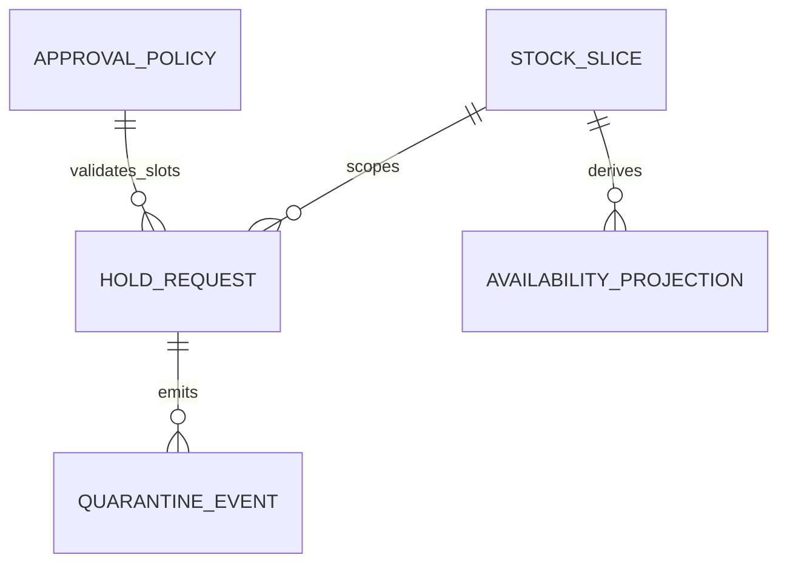
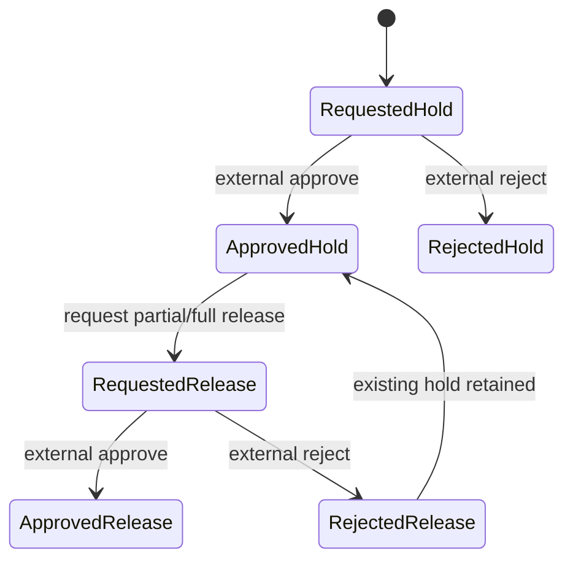

# BRD · F-WH-QHOLD · กักคุณภาพ

**Status:** APPROVED for AI FRD handoff, no human sign-off · **2026-09-14** · New Feature · W4B FULL AI 100% no-vibe. Sources: RIF_v2, _SCOPE_LOCK, PREBRIEF S01–10, W4 §2–3, F088 checklist, Golden Rules, frozen HTML hash. Owner: Warehouse Product Owner.

## 1. Control
This is a first version. Inventory/QHold owner owns availability arithmetic, DOA owner owns actual-person policy and decision event, NC owner owns notification, CSQ owner owns 7C profile, W3-LITE GRN owner owns QC source contract. `APPROVED` is AI quality review for specification handoff, not actual production approval.

## 2. Context and measurable objectives
Warehouse needs to quarantine an identified Item/Warehouse/location/lot slice so it cannot be sold or transferred during QC review, while preserving onHand and the immutable movement ledger. A release is a separately approved action, not an immediate increase in ATP. Business outcomes: no held or provisionally held qty in ATP; no over-hold/release; every decision traceable to selected people and a source event; no double application.

### 2.3 Measures
| Measure | Baseline | Target | Method |
|---|---|---|---|
| Quarantine ATP accuracy | unknown `[ASSUMED]` pilot baseline | 100% of S01–10 fixtures | compare onHand−reservedSales−activeHeld−pendingHeld with visible ATP |
| Duplicate decision application | unknown `[ASSUMED]` | 0 per sourceEventId | count applied decision events per ID |
| Over-release/over-hold accepted | unknown `[ASSUMED]` | 0 | negative/over-limit case result |
| Trace completeness | unknown `[ASSUMED]` | 100% requests/decisions with actor/time/source | event audit query |

## 3. Scope
In: read stock slices, soft Item/Warehouse/location/lot refs, partial hold/release requests, configured DOA required person slots, requested/approved/rejected mock decision states, pending reservation, ATP/transfer availability projection, read-only audit, NTF/CSQ producer declarations. Out: GRN creation or QC processing, actual DOA approval engine, sale/transfer execution, stock balance or movement mutation, NC delivery, CSQ stamp, document/PDF/wizard. Local HTML has a DEMO decision harness; real decisions arrive externally.

### 3.4 Scope Lock
`scope_lock_ref=0_DIRECTION/_SCOPE_LOCK.md`; LOCK-01–08 imported. Console/master, canonical tabs/filter/no hint; identified slice, real-person slot selection from policy, no hardcoded hierarchy; onHand retained/ATP excluded; append-only events/idempotency; all W3/DOA/NC/CSQ edges mock/TODO; chips doa,ntf,csq; HTML freeze. No extra transaction scope.

## 4. Actors and governance
| Actor | Allowed business action | Control |
|---|---|---|
| Warehouse initiator (Maker) | request hold/release and select eligible people | cannot decide own request via production DOA unless policy explicitly permits (default SoD deny `[ASSUMED]`) |
| QC reviewer (Checker) | examine reason/source/qty | cannot alter movement/onHand |
| DOA selected people (Approver slots) | approve/reject according to external policy | chosen by actual person reference, no role-ID chain |
| Inventory service (System) | supply slice/onHand/reservedSales | QHold does not post stock |
| Auditor | read request/decision history | no edit/delete |
| NC/CSQ/GRN owners | consume declaration or source ref | external, not in demo |

Production User Access ENC requires tenant+warehouse scope, server-side role/slot eligibility, Maker/Approver SoD and audit. Local DEMO buttons simulate external decisions only; they are not actual approver rights. DOA required slots/eligible people are configuration responses, not constants in business rule code.

## 5. Journey and COSO
| Step | Maker | Checker | Approver | System/control |
|---|---|---|---|---|
| Identify slice | initiator picks existing refs and origin | QC checks GRN mock source or later issue | none | scope/reference validation |
| Request hold | initiator enters qty/reason and selects people | checks eligible/holdable qty | none yet | pendingHeld provisionally blocks ATP `[ASSUMED]`, event append |
| Decide hold | none | reviews evidence | selected DOA people externally | atomic approve pending→active or reject pending→0; replay safe |
| Request release | initiator selects active held slice/qty | checks reason/releasable | none yet | pendingRelease reserves held, ATP unchanged |
| Decide release | none | reviews | selected DOA people externally | approve activeHeld decreases once, reject clears reservation |
| Audit | auditor reads events | reconciles | none | append-only actor/time/source; no stock movement write |

## 6. Entity and field contract
`StockSlice(id,itemRef,warehouseRef,locationRef,lotRef,onHand,reservedSales,activeHeld,pendingHeld,version,uom,precision)` is an Inventory-sourced identity and a QHold projection; onHand/reservedSales/movement are read-only upstream. `HoldRequest(id,idempotencyKey,kind,qty,reason,origin,sourceRef,selectedSlots,policyRef,status,version,createdAt)` stores person-ref snapshots. `QuarantineEvent(id,requestId,type,qty,at,actorRef,sourceEventId,sliceId,sourceRef)` is append-only. `ApprovalPolicy` is an external DOA response: required slot IDs, labels, eligible actual person refs, effective rule. GRN QC requires sourceRef mock; later issue requires reason and nullable sourceRef. Items/location/lot are soft master refs, not local master implementation.

## 7. Stories and acceptance
| Story | Given/when | Then |
|---|---|---|
| US-01 hold | baseline 100 onHand/10 reserved, request30 with eligible slots | requested pendingHeld30, ATP60, onHand100 |
| US-02 hold decision | approve or reject external event | approve activeHeld30/ATP60; reject ATP90; replay once |
| US-03 release | approved held30, request12 | pendingRelease12, ATP60, releasable18; approval held18/ATP72 |
| US-04 reject release | requested release12 rejected | held30, pendingRelease0, ATP60 |
| US-05 capacity | hold91 or release31/0 or stale concurrent request | visible error, no over-commit |
| US-06 DOA | two required slots, missing/ineligible choice | cannot submit; named eligible choices persist as snapshots |
| US-07 outbound | held30 ATP60, check qty61/60 | 61 denied, 60 contract-valid; no sale/transfer |
| US-08 audit | open request/event history | actor/time/source and decision visible, no edit/delete |

## 8. Lifecycle and arithmetic
Hold `requested→approved|rejected`; release `requested→approved|rejected`. No automatic approval on request. Pending hold immediately quarantines `[ASSUMED]`: `pendingHeld+=qty`, ATP falls. Approval moves pendingHeld→activeHeld with same ATP; reject removes pendingHeld and restores ATP. Pending release reserves activeHeld but leaves ATP unchanged; approval subtracts activeHeld exactly once and increases ATP; rejection clears pending reservation only. `effectiveBlocked=activeHeld+pendingHeld`; `ATP=max(0,onHand−reservedSales−effectiveBlocked)`, `releasable=activeHeld−pendingRelease`, `holdable=onHand−reservedSales−effectiveBlocked` `[ASSUMED]`. No movement or onHand mutation.

## 9. Business rules/flexibility
| Rule | Business contract | Tag/source |
|---|---|---|
| BR-01 | identified slice and origin/reason/source; partial qty | FIXED W4 §2 |
| BR-02 | DOA selected actual people from policy slots, not hierarchy | CONFIGURABLE slots, FIXED control Golden Rule 3 |
| BR-03 | held remains onHand, excluded ATP/transfer | FIXED W4 OQ-QH-01 `[ASSUMED]` |
| BR-04 | append-only events; no stock/movement mutation | FIXED Golden Rule 4 |
| BR-05 | finite qty>0/UoM precision, hold≤free, release≤releasable | DYNAMIC `[ASSUMED]` Inventory owner |
| BR-06 | pending hold blocks ATP, pending release does not free | DYNAMIC `[ASSUMED]` Warehouse Product Owner |
| BR-07 | decision event/version/sourceEventId atomic/idempotent | FIXED control `[ASSUMED contract]` DOA owner |
| BR-08 | GRN QC/DOA/NC/CSQ external mock/declaration only | FIXED W4 §2/5 |

### 9.5 Flexibility attribution
🤖 BR-02 slot policy, BR-05 precision/capacity and BR-06 timing vary by external config/default and have OQ owners. ✅ BR-01/03/04/07/08 are scope/control invariants; BR-03 default still needs owner confirmation. No hardcoded approval manager or NC channel.

## 10. Edge cases and exceptions
BA-source: GRN QC vs later issue, held not ATP, no transfer/sale, DOA slot selection, append-only. AI defaults: pending-hold timing, pendingRelease reservation, quantity precision, stale concurrent version, policy change revalidation, held>onHand escalation. Cases: qty0/negative/NaN/overprecision/over-limit, missing slice/reason/GRN source, missing or ineligible person, duplicate request key same/different body, duplicate/conflicting external event, approval after reject, release when no active held, same slice concurrent release, other lot unaffected, mock unavailable. Every exception gets FRD error and TC; no actual external processing test.

## 11. Regression surface
Inventory ATP F009, Warehouse/Bin F008 and Lot F087 soft refs must not be overwritten. GRN F079 W3-LITE is mock source. Sale/transfer consumers must query QHold availability; QHold itself does not execute their transactions. Movement/ledger append-only remains invariant. Existing Item/UoM master entry is not explicit in FEATURE_LIST_ALL, so its picker contract is `[ASSUMED]` until owner mapping.

## 12. Value stream/downstream impact
### 12.1 Impact map
| Upstream | QHold effect | Downstream consequence |
|---|---|---|
| GRN QC mock/later issue | source/lot/location/reason snapshot | trace why stock unavailable, no GRN posting |
| Inventory onHand/reservedSales | pending/active quarantine projection | ATP/transfer queries reject held qty; onHand preserved |
| DOA policy/decision mock | selected person snapshots + decision event | only accepted external decision changes quarantine projection |
| NC/NTF | business hold/release result candidate | central rule chooses channel/recipient; no local delivery |
| CSQ | consequence event candidate | central engine evaluates, no local stamp |

### 12.3 Existing system
Warehouse & Bin F008 and Inventory ATP F009 are done upstream; Lot F087 W4A done; GRN F079 W3-LITE pending, mock. Sale/Transfer is only availability consumer contract. DOA/NC/CSQ are external policy/event owners. No JE or Stock Adjustment operation in QHold.

## 13. Delivery phases
1. Local console/domain projection and mock policy/decision (this pack). 2. Production slice/version/permission persistence. 3. DOA/NC/CSQ/GRN contract wiring by owners. 4. visual, integration, UAT and monitoring rollout. AI lane does not certify phases 2–4.

## 14. Dev order and screen inventory
Implement read/soft-ref slice, policy lookup and person-slot validation, request reservation, atomic decision handler, append-only event/outbox, availability query, access control, then downstream adapters. Actual three routes from frozen HTML: `#/records` stock/hold list and create/view drawer; `#/history` pending approval queue and DEMO decision drawer; `#/settings` read-only event history. UI signals to FRD: canonical list filter, data-derived stats, person picker, inline error, pending status, demo harness. BRD does not decide layout/color.

## 15. OQ/defaults and owners
| OQ | AI default | Owner |
|---|---|---|
| OQ-QH-01 | held onHand but not ATP `[ASSUMED]` W4 §3 | Warehouse Product Owner + Inventory owner |
| OQ-QH-02 | pending hold blocks ATP immediately `[ASSUMED]` | Warehouse Product Owner |
| OQ-QH-03 | pending release reserves held and does not free ATP `[ASSUMED]` | Warehouse Product Owner |
| OQ-QH-04 | DOA policy slot/eligible-person/decision event/idempotency mock `[ASSUMED contract]` | DOA owner |
| OQ-QH-05 | EA integer demo precision; production Item/UoM/held overlap and stale version `[ASSUMED]` | Inventory/Item owner |
| OQ-QH-06 | GRN QC source, NC/CSQ event IDs and payload `[ASSUMED contract]` | GRN/NC/CSQ owners |
| OQ-QH-07 | actor SoD and approval policy effective time `[ASSUMED]` | DOA/Security owner |

## 16. Security/compliance
P1 inventory-control preset: tenant/warehouse RLS, reason/source validation, real-person eligibility server-side, Maker/Approver separation, decision signature/sourceEventId/version, immutable audit, no raw personal names in CSQ/NTF envelopes. Actor person refs are Restricted/PII; quantities/source refs Confidential. Demo decisions are `data-demo` and do not establish production auth. Control points map BR-02/05/07 to §17 failures; Security owner confirms retention and role matrix before go-live.

## 17. Health checks
| Metric | Baseline/target | Action |
|---|---|---|
| ATP arithmetic | unknown/100% S01–10 fixture | mismatch blocks release |
| duplicate decision | unknown/zero | replay audit/alert |
| over-hold/release | unknown/zero | reject and log |
| decision trace completeness | unknown/100% actor/time/source | quarantine audit exception |
| DOA policy/GRN mock availability | unknown/owner SLA `[ASSUMED]` | show retryable/unavailable, no false approval |
| throughput/latency | unknown; owner sets SLA `[ASSUMED]` | monitor p95 query and event backlog |

## 18. Monitoring
Stock slices by active/pending held, ATP blocked, pending requests aging, approval/rejection by source, duplicate/stale event attempts, missing DOA policy, GRN mock source failures. Reports pair to §17 measures and tenant/warehouse scope; no fabricated baseline in this pack.

## AI quality review
C01–C23 and PE01–PE05 evidence in `_lane/BRD_GATE_C01_C23.md`. No critical scope contradiction after explicit pending timing/DOA ownership. Visual and external integration warnings remain for HANDOFF.
